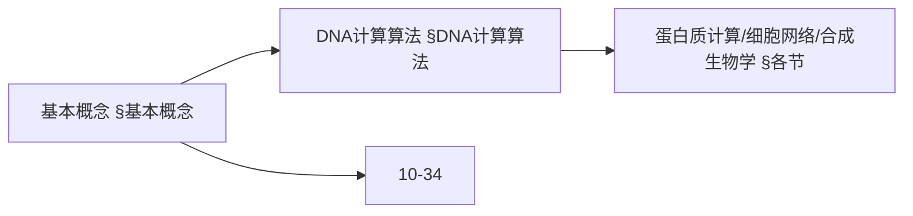
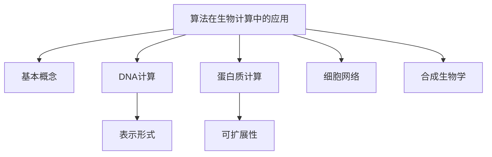
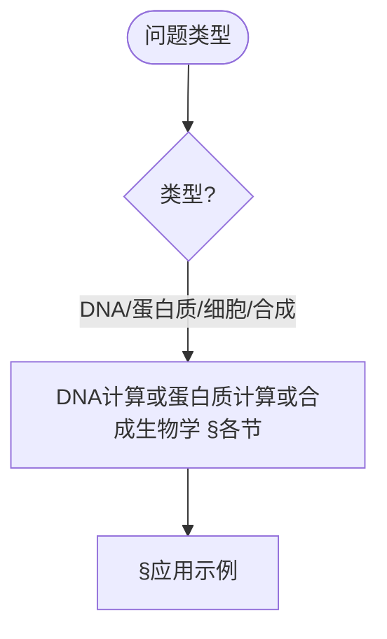
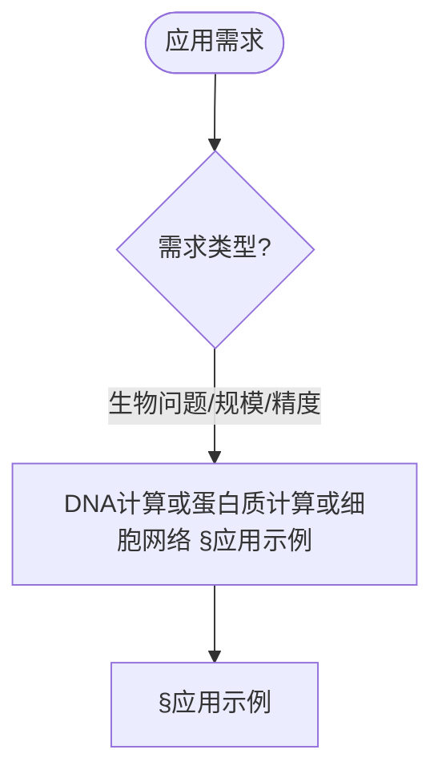

> 📊 **项目全面梳理**：详细的项目结构、模块详解和学习路径，请参阅 [`项目全面梳理-2025.md`](../项目全面梳理-2025.md)

## 10.33 算法在生物计算中的应用 / Algorithms in Biological Computing

### 摘要 / Executive Summary

- 统摄生物计算多层级算法：DNA计算（编码/分子操作/解码）、蛋白质计算（折叠/对接）、细胞网络（基因调控/代谢/信号）、合成生物学（电路设计/组装/验证）。
- 提供工程可复用的伪代码与形式化表达，便于与高级深化篇联动阅读。

### 关键术语与符号 / Glossary

- DNA计算：利用分子并行性在湿实验中求解组合问题。
- 退火温度（Tm）：序列杂交稳定性的经验指标。
- 结合亲和力（Kd）：复合物形成的亲和性度量。
- 基因调控网络（GRN）：基因-调控元件的相互作用网络。
- 术语对齐与引用规范：`docs/术语与符号总表.md`，`01-基础理论/00-撰写规范与引用指南.md`

### 快速导航 / Quick Links

- [交叉引用与依赖](#交叉引用与依赖--cross-references-and-dependencies)
- [基本概念](#基本概念)
- [DNA计算算法](#dna计算算法)
- [蛋白质计算算法](#蛋白质计算算法)
- [细胞网络计算](#细胞网络计算)
- [合成生物学算法](#合成生物学算法)
- [应用示例](#应用示例)
- [总结](#总结)

## 交叉引用与依赖 / Cross-References and Dependencies

- 计算模型与自动机：`07-计算模型/04-自动机理论.md`
- 统计与信息论：`01-基础理论/07-概率与统计基础.md`，`01-基础理论/08-信息论基础.md`
- 优化与进化：`09-算法理论/04-高级算法理论/21-算法演化理论.md`
- 相关高级主题：`10-高级主题/33-算法在生物计算中的应用-高级深化.md`
- 项目导航与对标：见 [项目全面梳理-2025](../项目全面梳理-2025.md)、[项目扩展与持续推进任务编排](../项目扩展与持续推进任务编排.md)、[国际课程对标表](../国际课程对标表.md)

## 基本概念

### 生物计算概述

生物计算（Biological Computing）是利用生物分子和生物系统进行信息处理的计算范式，包括：

1. **DNA计算**: 利用DNA分子的并行计算能力
2. **蛋白质计算**: 基于蛋白质结构和功能的计算
3. **细胞计算**: 利用细胞网络进行信息处理
4. **合成生物学**: 设计和构建生物系统

### 系统架构

```rust
// 生物计算系统的基本架构
pub struct BiologicalComputingSystem {
    dna_computer: DNAComputer,
    protein_computer: ProteinComputer,
    cell_network: CellNetwork,
    synthetic_biology: SyntheticBiology,
    bio_interface: BioInterface,
}

impl BiologicalComputingSystem {
    pub fn new() -> Self {
        Self {
            dna_computer: DNAComputer::new(),
            protein_computer: ProteinComputer::new(),
            cell_network: CellNetwork::new(),
            synthetic_biology: SyntheticBiology::new(),
            bio_interface: BioInterface::new(),
        }
    }

    pub fn compute(&mut self, problem: &BiologicalProblem) -> Result<BiologicalSolution, BioComputingError> {
        // 1. 问题分析
        let problem_analysis = self.analyze_problem(problem)?;

        // 2. 选择合适的计算平台
        let computing_platform = self.select_platform(&problem_analysis)?;

        // 3. 生物计算执行
        let solution = match computing_platform {
            ComputingPlatform::DNA => self.dna_computer.solve(problem)?,
            ComputingPlatform::Protein => self.protein_computer.solve(problem)?,
            ComputingPlatform::Cell => self.cell_network.solve(problem)?,
            ComputingPlatform::Synthetic => self.synthetic_biology.solve(problem)?,
        };

        // 4. 结果验证
        let validated_solution = self.validate_solution(&solution)?;

        Ok(validated_solution)
    }
}
```

### 内容补充与思维表征 / Content Supplement and Thinking Representation

> 本节按 [内容补充与思维表征全面计划方案](../内容补充与思维表征全面计划方案.md) **只补充、不删除**。标准见 [内容补充标准](../内容补充标准-概念定义属性关系解释论证形式证明.md)、[思维表征模板集](../思维表征模板集.md)。

#### 解释与直观 / Explanation and Intuition

算法在生物计算中的应用将生物计算概述与系统架构结合，涵盖 DNA 计算、蛋白质计算、细胞网络计算与合成生物学。与 10-34 认知计算、12 应用领域衔接；§基本概念、§DNA计算算法及后续各节形成完整表征。

#### 概念属性表 / Concept Attribute Table

| 属性名 | 类型/范围 | 含义 | 备注 |
|--------|-----------|------|------|
| 生物计算概述、系统架构 | 基本概念 | §基本概念 | 与 10-34、12 对照 |
| DNA计算、蛋白质计算、细胞网络、合成生物学算法 | 算法 | 表示形式、可扩展性、适用问题 | §各节 |
| DNA计算/蛋白质折叠/分子对接 | 对比 | §各节 | 多维矩阵 |

#### 概念关系 / Concept Relations

| 源概念 | 目标概念 | 关系类型 | 说明 |
|--------|----------|----------|------|
| 算法在生物计算中的应用 | 10-34 | depends_on | 认知计算基础 |
| 算法在生物计算中的应用 | 12 应用领域 | applies_to | 生物计算实践 |

#### 概念依赖图 / Concept Dependency Graph



#### 论证与证明衔接 / Argumentation and Proof Link

DNA 编码正确性见 §DNA计算算法；蛋白质折叠正确性见 §蛋白质计算算法；与 10-34 论证衔接。

#### 思维导图：本章概念结构 / Mind Map



#### 多维矩阵：生物计算算法对比 / Multi-Dimensional Comparison

| 概念/技术 | 表示形式 | 可扩展性 | 适用问题 | 备注 |
|-----------|----------|----------|----------|------|
| DNA计算/蛋白质折叠/分子对接 | §各节 | §各节 | §各节 | — |

#### 决策树：问题类型到方法选择 / Decision Tree



#### 公理定理推理证明决策树 / Axiom-Theorem-Proof Tree


#### 应用决策建模树 / Application Decision Modeling Tree



## DNA计算算法

### DNA序列设计

```rust
// DNA计算系统
pub struct DNAComputer {
    sequence_designer: DNASequenceDesigner,
    molecular_operations: MolecularOperations,
    dna_assembly: DNAAssembly,
}

impl DNAComputer {
    pub fn solve(&self, problem: &BiologicalProblem) -> Result<DNASolution, DNAComputingError> {
        // 1. 问题编码为DNA序列
        let dna_sequences = self.encode_problem(problem)?;

        // 2. 分子操作执行
        let processed_sequences = self.execute_molecular_operations(&dna_sequences)?;

        // 3. 结果解码
        let solution = self.decode_solution(&processed_sequences)?;

        Ok(solution)
    }

    fn encode_problem(&self, problem: &BiologicalProblem) -> Result<Vec<DNASequence>, DNAComputingError> {
        match problem.problem_type {
            ProblemType::SAT => self.encode_sat_problem(problem),
            ProblemType::HamiltonianPath => self.encode_hamiltonian_path(problem),
            ProblemType::GraphColoring => self.encode_graph_coloring(problem),
        }
    }
}

// DNA序列设计器
pub struct DNASequenceDesigner {
    constraints: DNASequenceConstraints,
    optimization_algorithm: Box<dyn OptimizationAlgorithm>,
}

impl DNASequenceDesigner {
    pub fn design_sequences(&self, problem: &ProblemSpecification) -> Result<Vec<DNASequence>, DesignError> {
        // 1. 生成初始序列
        let initial_sequences = self.generate_initial_sequences(problem)?;

        // 2. 优化序列
        let optimized_sequences = self.optimize_sequences(&initial_sequences)?;

        // 3. 验证约束
        self.validate_constraints(&optimized_sequences)?;

        Ok(optimized_sequences)
    }

    fn generate_initial_sequences(&self, problem: &ProblemSpecification) -> Result<Vec<DNASequence>, DesignError> {
        let mut sequences = Vec::new();

        for variable in &problem.variables {
            let true_sequence = self.generate_random_sequence(20)?; // 20bp序列
            let false_sequence = self.generate_random_sequence(20)?;

            sequences.push(DNASequence {
                name: format!("{}_true", variable),
                sequence: true_sequence,
                complement: self.complement_sequence(&true_sequence)?,
            });

            sequences.push(DNASequence {
                name: format!("{}_false", variable),
                sequence: false_sequence,
                complement: self.complement_sequence(&false_sequence)?,
            });
        }

        Ok(sequences)
    }

    fn optimize_sequences(&self, sequences: &[DNASequence]) -> Result<Vec<DNASequence>, DesignError> {
        // 使用遗传算法优化序列
        let mut population = sequences.to_vec();

        for generation in 0..100 {
            // 评估适应度
            let fitness_scores: Vec<f64> = population.iter()
                .map(|seq| self.calculate_fitness(seq))
                .collect();

            // 选择
            let selected = self.selection(&population, &fitness_scores);

            // 交叉
            let crossed = self.crossover(&selected);

            // 变异
            let mutated = self.mutation(&crossed);

            population = mutated;
        }

        Ok(population)
    }

    fn calculate_fitness(&self, sequence: &DNASequence) -> f64 {
        let mut fitness = 0.0;

        // GC含量评估
        let gc_content = self.calculate_gc_content(&sequence.sequence);
        if gc_content >= 0.4 && gc_content <= 0.6 {
            fitness += 1.0;
        }

        // 避免重复序列
        let repeats = self.count_repeats(&sequence.sequence);
        fitness -= repeats as f64 * 0.1;

        // 避免发夹结构
        let hairpins = self.count_hairpins(&sequence.sequence);
        fitness -= hairpins as f64 * 0.2;

        fitness
    }

    fn calculate_gc_content(&self, sequence: &str) -> f64 {
        let gc_count = sequence.chars()
            .filter(|&c| c == 'G' || c == 'C')
            .count();
        gc_count as f64 / sequence.len() as f64
    }

    fn complement_sequence(&self, sequence: &str) -> Result<String, DesignError> {
        let complement: String = sequence.chars()
            .map(|c| match c {
                'A' => 'T',
                'T' => 'A',
                'G' => 'C',
                'C' => 'G',
                _ => return Err(DesignError::InvalidNucleotide),
            })
            .collect();
        Ok(complement)
    }
}
```

### 分子操作

```rust
// 分子操作执行器
pub struct MolecularOperations {
    temperature_controller: TemperatureController,
    enzyme_mixer: EnzymeMixer,
    pcr_machine: PCRMachine,
}

impl MolecularOperations {
    pub fn execute_operations(&self, sequences: &[DNASequence], operations: &[MolecularOperation]) -> Result<Vec<DNASequence>, OperationError> {
        let mut current_sequences = sequences.to_vec();

        for operation in operations {
            current_sequences = match operation {
                MolecularOperation::Annealing(temperature) => {
                    self.annealing(&current_sequences, *temperature)?
                }
                MolecularOperation::Ligation => {
                    self.ligation(&current_sequences)?
                }
                MolecularOperation::PCR(cycles) => {
                    self.pcr_amplification(&current_sequences, *cycles)?
                }
                MolecularOperation::RestrictionEnzyme(enzyme) => {
                    self.restriction_digestion(&current_sequences, enzyme)?
                }
                MolecularOperation::GelElectrophoresis => {
                    self.gel_electrophoresis(&current_sequences)?
                }
            };
        }

        Ok(current_sequences)
    }

    fn annealing(&self, sequences: &[DNASequence], temperature: f64) -> Result<Vec<DNASequence>, OperationError> {
        // 模拟DNA退火过程
        let mut annealed_sequences = Vec::new();

        for sequence in sequences {
            // 计算退火概率
            let annealing_probability = self.calculate_annealing_probability(sequence, temperature);

            if annealing_probability > 0.5 {
                // 形成双链
                annealed_sequences.push(DNASequence {
                    name: format!("{}_annealed", sequence.name),
                    sequence: sequence.sequence.clone(),
                    complement: sequence.complement.clone(),
                    is_double_stranded: true,
                });
            } else {
                // 保持单链
                annealed_sequences.push(sequence.clone());
            }
        }

        Ok(annealed_sequences)
    }

    fn calculate_annealing_probability(&self, sequence: &DNASequence, temperature: f64) -> f64 {
        // 简化的退火概率计算
        let melting_temperature = self.calculate_melting_temperature(sequence);
        let probability = 1.0 / (1.0 + ((temperature - melting_temperature) / 10.0).exp());
        probability
    }

    fn calculate_melting_temperature(&self, sequence: &DNASequence) -> f64 {
        // Wallace规则：Tm = 2°C × (A+T) + 4°C × (G+C)
        let at_count = sequence.sequence.chars()
            .filter(|&c| c == 'A' || c == 'T')
            .count();
        let gc_count = sequence.sequence.chars()
            .filter(|&c| c == 'G' || c == 'C')
            .count();

        2.0 * at_count as f64 + 4.0 * gc_count as f64
    }
}
```

## 蛋白质计算算法

### 蛋白质折叠

```rust
// 蛋白质计算系统
pub struct ProteinComputer {
    folding_algorithm: ProteinFoldingAlgorithm,
    structure_predictor: StructurePredictor,
    docking_algorithm: DockingAlgorithm,
}

impl ProteinComputer {
    pub fn solve(&self, problem: &ProteinProblem) -> Result<ProteinSolution, ProteinComputingError> {
        match problem.problem_type {
            ProteinProblemType::Folding => self.fold_protein(problem),
            ProteinProblemType::StructurePrediction => self.predict_structure(problem),
            ProteinProblemType::Docking => self.dock_proteins(problem),
        }
    }

    fn fold_protein(&self, problem: &ProteinProblem) -> Result<ProteinSolution, ProteinComputingError> {
        // 1. 序列分析
        let sequence_analysis = self.analyze_sequence(&problem.sequence)?;

        // 2. 二级结构预测
        let secondary_structure = self.predict_secondary_structure(&sequence_analysis)?;

        // 3. 三级结构预测
        let tertiary_structure = self.predict_tertiary_structure(&secondary_structure)?;

        // 4. 结构优化
        let optimized_structure = self.optimize_structure(&tertiary_structure)?;

        Ok(ProteinSolution {
            structure: optimized_structure,
            energy: self.calculate_energy(&optimized_structure),
        })
    }
}

// 蛋白质折叠算法
pub struct ProteinFoldingAlgorithm {
    force_field: ForceField,
    optimization_method: Box<dyn OptimizationMethod>,
    sampling_algorithm: SamplingAlgorithm,
}

impl ProteinFoldingAlgorithm {
    pub fn fold(&self, sequence: &AminoAcidSequence) -> Result<ProteinStructure, FoldingError> {
        // 1. 初始化结构
        let initial_structure = self.initialize_structure(sequence)?;

        // 2. 能量最小化
        let minimized_structure = self.energy_minimization(&initial_structure)?;

        // 3. 构象采样
        let sampled_structures = self.conformational_sampling(&minimized_structure)?;

        // 4. 选择最优结构
        let best_structure = self.select_best_structure(&sampled_structures)?;

        Ok(best_structure)
    }

    fn energy_minimization(&self, structure: &ProteinStructure) -> Result<ProteinStructure, FoldingError> {
        let mut current_structure = structure.clone();
        let mut energy = self.calculate_total_energy(&current_structure);

        for iteration in 0..1000 {
            // 计算梯度
            let gradient = self.calculate_energy_gradient(&current_structure)?;

            // 更新结构
            let step_size = 0.01;
            current_structure = self.update_structure(&current_structure, &gradient, step_size)?;

            // 计算新能量
            let new_energy = self.calculate_total_energy(&current_structure);

            // 检查收敛
            if (energy - new_energy).abs() < 1e-6 {
                break;
            }

            energy = new_energy;
        }

        Ok(current_structure)
    }

    fn calculate_total_energy(&self, structure: &ProteinStructure) -> f64 {
        let mut total_energy = 0.0;

        // 键长能量
        total_energy += self.calculate_bond_energy(structure);

        // 键角能量
        total_energy += self.calculate_angle_energy(structure);

        // 二面角能量
        total_energy += self.calculate_dihedral_energy(structure);

        // 范德华能量
        total_energy += self.calculate_vdw_energy(structure);

        // 静电能量
        total_energy += self.calculate_electrostatic_energy(structure);

        total_energy
    }

    fn calculate_bond_energy(&self, structure: &ProteinStructure) -> f64 {
        let mut bond_energy = 0.0;

        for bond in &structure.bonds {
            let current_length = bond.current_length;
            let equilibrium_length = bond.equilibrium_length;
            let force_constant = bond.force_constant;

            let delta = current_length - equilibrium_length;
            bond_energy += 0.5 * force_constant * delta * delta;
        }

        bond_energy
    }
}
```

### 分子对接

```rust
// 分子对接算法
pub struct DockingAlgorithm {
    search_algorithm: Box<dyn SearchAlgorithm>,
    scoring_function: ScoringFunction,
    refinement_algorithm: RefinementAlgorithm,
}

impl DockingAlgorithm {
    pub fn dock(&self, receptor: &ProteinStructure, ligand: &Molecule) -> Result<DockingResult, DockingError> {
        // 1. 构象生成
        let ligand_conformations = self.generate_conformations(ligand)?;

        // 2. 对接搜索
        let docking_poses = self.search_docking_poses(receptor, &ligand_conformations)?;

        // 3. 评分排序
        let scored_poses = self.score_poses(receptor, &docking_poses)?;

        // 4. 结构优化
        let refined_poses = self.refine_poses(&scored_poses)?;

        Ok(DockingResult {
            poses: refined_poses,
            best_pose: refined_poses.first().cloned(),
        })
    }

    fn search_docking_poses(&self, receptor: &ProteinStructure, ligand_conformations: &[Molecule]) -> Result<Vec<DockingPose>, DockingError> {
        let mut poses = Vec::new();

        for conformation in ligand_conformations {
            // 网格搜索
            let grid_poses = self.grid_search(receptor, conformation)?;
            poses.extend(grid_poses);

            // 遗传算法搜索
            let ga_poses = self.genetic_algorithm_search(receptor, conformation)?;
            poses.extend(ga_poses);
        }

        Ok(poses)
    }

    fn grid_search(&self, receptor: &ProteinStructure, ligand: &Molecule) -> Result<Vec<DockingPose>, DockingError> {
        let mut poses = Vec::new();

        // 定义搜索空间
        let x_range = -10.0..10.0;
        let y_range = -10.0..10.0;
        let z_range = -10.0..10.0;
        let step = 2.0;

        for x in (x_range.start as i32)..(x_range.end as i32) {
            for y in (y_range.start as i32)..(y_range.end as i32) {
                for z in (z_range.start as i32)..(z_range.end as i32) {
                    let translation = Vector3D::new(
                        x as f64 * step,
                        y as f64 * step,
                        z as f64 * step,
                    );

                    let pose = DockingPose {
                        ligand: ligand.translate(&translation),
                        score: 0.0,
                    };

                    poses.push(pose);
                }
            }
        }

        Ok(poses)
    }
}
```

## 细胞网络计算

### 基因调控网络

```rust
// 细胞网络计算系统
pub struct CellNetwork {
    gene_regulatory_network: GeneRegulatoryNetwork,
    metabolic_network: MetabolicNetwork,
    signaling_network: SignalingNetwork,
}

impl CellNetwork {
    pub fn solve(&self, problem: &CellProblem) -> Result<CellSolution, CellComputingError> {
        match problem.problem_type {
            CellProblemType::GeneExpression => self.simulate_gene_expression(problem),
            CellProblemType::MetabolicFlux => self.simulate_metabolic_flux(problem),
            CellProblemType::SignalingPathway => self.simulate_signaling_pathway(problem),
        }
    }

    fn simulate_gene_expression(&self, problem: &CellProblem) -> Result<CellSolution, CellComputingError> {
        // 1. 构建调控网络
        let network = self.build_regulatory_network(&problem.genes)?;

        // 2. 设置初始条件
        let initial_state = self.set_initial_conditions(&problem.initial_conditions)?;

        // 3. 时间演化
        let time_series = self.evolve_network(&network, &initial_state, problem.time_steps)?;

        // 4. 结果分析
        let analysis = self.analyze_results(&time_series)?;

        Ok(CellSolution {
            time_series,
            analysis,
        })
    }
}

// 基因调控网络
pub struct GeneRegulatoryNetwork {
    genes: Vec<Gene>,
    interactions: Vec<GeneInteraction>,
    parameters: NetworkParameters,
}

impl GeneRegulatoryNetwork {
    pub fn evolve(&self, initial_state: &GeneExpressionState, time_steps: usize) -> Result<Vec<GeneExpressionState>, NetworkError> {
        let mut states = vec![initial_state.clone()];

        for step in 1..time_steps {
            let current_state = &states[step - 1];
            let next_state = self.compute_next_state(current_state)?;
            states.push(next_state);
        }

        Ok(states)
    }

    fn compute_next_state(&self, current_state: &GeneExpressionState) -> Result<GeneExpressionState, NetworkError> {
        let mut next_state = GeneExpressionState::new();

        for gene in &self.genes {
            let expression_rate = self.compute_expression_rate(gene, current_state)?;
            let degradation_rate = self.compute_degradation_rate(gene);

            let current_expression = current_state.get_expression(gene.id);
            let new_expression = current_expression +
                (expression_rate - degradation_rate * current_expression) * self.parameters.time_step;

            next_state.set_expression(gene.id, new_expression.max(0.0));
        }

        Ok(next_state)
    }

    fn compute_expression_rate(&self, gene: &Gene, state: &GeneExpressionState) -> Result<f64, NetworkError> {
        let mut activation = 0.0;
        let mut repression = 0.0;

        for interaction in &self.interactions {
            if interaction.target_gene == gene.id {
                let regulator_expression = state.get_expression(interaction.regulator_gene);

                match interaction.interaction_type {
                    InteractionType::Activation => {
                        activation += interaction.strength *
                            (regulator_expression / (interaction.km + regulator_expression));
                    }
                    InteractionType::Repression => {
                        repression += interaction.strength *
                            (regulator_expression / (interaction.km + regulator_expression));
                    }
                }
            }
        }

        let basal_expression = gene.basal_expression;
        let total_expression = basal_expression + activation - repression;

        Ok(total_expression.max(0.0))
    }
}
```

## 合成生物学算法

### 生物电路设计

```rust
// 合成生物学系统
pub struct SyntheticBiology {
    circuit_designer: BiologicalCircuitDesigner,
    part_library: PartLibrary,
    assembly_algorithm: AssemblyAlgorithm,
}

impl SyntheticBiology {
    pub fn solve(&self, problem: &SyntheticProblem) -> Result<SyntheticSolution, SyntheticBiologyError> {
        // 1. 电路设计
        let circuit_design = self.design_circuit(problem)?;

        // 2. 部件选择
        let selected_parts = self.select_parts(&circuit_design)?;

        // 3. 组装设计
        let assembly_plan = self.design_assembly(&selected_parts)?;

        // 4. 验证设计
        let validated_design = self.validate_design(&assembly_plan)?;

        Ok(SyntheticSolution {
            circuit_design,
            assembly_plan: validated_design,
        })
    }

    fn design_circuit(&self, problem: &SyntheticProblem) -> Result<BiologicalCircuit, DesignError> {
        match problem.circuit_type {
            CircuitType::Oscillator => self.design_oscillator(problem),
            CircuitType::Switch => self.design_switch(problem),
            CircuitType::LogicGate => self.design_logic_gate(problem),
        }
    }
}

// 生物电路设计器
pub struct BiologicalCircuitDesigner {
    design_templates: Vec<CircuitTemplate>,
    optimization_algorithm: Box<dyn OptimizationAlgorithm>,
    simulation_engine: SimulationEngine,
}

impl BiologicalCircuitDesigner {
    pub fn design_oscillator(&self, problem: &SyntheticProblem) -> Result<BiologicalCircuit, DesignError> {
        // 1. 选择振荡器模板
        let template = self.select_oscillator_template(problem)?;

        // 2. 参数优化
        let optimized_parameters = self.optimize_parameters(&template, problem)?;

        // 3. 电路构建
        let circuit = self.build_circuit(&template, &optimized_parameters)?;

        // 4. 仿真验证
        let simulation_result = self.simulate_circuit(&circuit)?;

        if self.verify_oscillation(&simulation_result) {
            Ok(circuit)
        } else {
            Err(DesignError::OscillationFailed)
        }
    }

    fn select_oscillator_template(&self, problem: &SyntheticProblem) -> Result<CircuitTemplate, DesignError> {
        // 根据问题要求选择合适的振荡器模板
        let templates = vec![
            CircuitTemplate::Repressilator,
            CircuitTemplate::ToggleSwitch,
            CircuitTemplate::FeedForwardLoop,
        ];

        for template in templates {
            if self.template_matches_requirements(template, problem) {
                return Ok(template);
            }
        }

        Err(DesignError::NoSuitableTemplate)
    }

    fn optimize_parameters(&self, template: &CircuitTemplate, problem: &SyntheticProblem) -> Result<CircuitParameters, DesignError> {
        // 使用遗传算法优化参数
        let mut population = self.initialize_parameter_population(template)?;

        for generation in 0..100 {
            // 评估适应度
            let fitness_scores: Vec<f64> = population.iter()
                .map(|params| self.evaluate_parameters(params, template, problem))
                .collect();

            // 选择
            let selected = self.selection(&population, &fitness_scores);

            // 交叉
            let crossed = self.crossover(&selected);

            // 变异
            let mutated = self.mutation(&crossed);

            population = mutated;
        }

        // 返回最优参数
        let best_index = self.find_best_parameters(&population, template, problem);
        Ok(population[best_index].clone())
    }

    fn evaluate_parameters(&self, parameters: &CircuitParameters, template: &CircuitTemplate, problem: &SyntheticProblem) -> f64 {
        // 构建电路
        let circuit = self.build_circuit(template, parameters).unwrap_or_default();

        // 仿真
        let simulation = self.simulate_circuit(&circuit).unwrap_or_default();

        // 计算适应度
        let mut fitness = 0.0;

        // 振荡频率
        if let Some(frequency) = self.calculate_oscillation_frequency(&simulation) {
            let target_frequency = problem.target_frequency;
            fitness -= (frequency - target_frequency).abs() / target_frequency;
        }

        // 振荡幅度
        if let Some(amplitude) = self.calculate_oscillation_amplitude(&simulation) {
            let target_amplitude = problem.target_amplitude;
            fitness -= (amplitude - target_amplitude).abs() / target_amplitude;
        }

        // 稳定性
        let stability = self.calculate_stability(&simulation);
        fitness += stability;

        fitness
    }
}
```

## 应用示例

### 完整的生物计算系统

```rust
// 完整的生物计算系统
pub struct CompleteBiologicalComputingSystem {
    bio_computing: BiologicalComputingSystem,
    lab_interface: LaboratoryInterface,
    data_analyzer: DataAnalyzer,
    result_validator: ResultValidator,
}

impl CompleteBiologicalComputingSystem {
    pub fn new() -> Self {
        Self {
            bio_computing: BiologicalComputingSystem::new(),
            lab_interface: LaboratoryInterface::new(),
            data_analyzer: DataAnalyzer::new(),
            result_validator: ResultValidator::new(),
        }
    }

    pub fn execute_computation(&mut self, problem: &BiologicalProblem) -> Result<ComputationResult, BioComputingError> {
        // 1. 问题预处理
        let preprocessed_problem = self.preprocess_problem(problem)?;

        // 2. 生物计算
        let biological_solution = self.bio_computing.compute(&preprocessed_problem)?;

        // 3. 实验室验证
        let experimental_result = self.lab_interface.validate(&biological_solution)?;

        // 4. 数据分析
        let analysis_result = self.data_analyzer.analyze(&experimental_result)?;

        // 5. 结果验证
        let validated_result = self.result_validator.validate(&analysis_result)?;

        Ok(ComputationResult {
            biological_solution,
            experimental_result,
            analysis_result: validated_result,
        })
    }

    fn preprocess_problem(&self, problem: &BiologicalProblem) -> Result<BiologicalProblem, BioComputingError> {
        // 问题预处理逻辑
        let mut preprocessed = problem.clone();

        // 参数标准化
        preprocessed.normalize_parameters();

        // 约束检查
        self.check_constraints(&preprocessed)?;

        Ok(preprocessed)
    }
}

// 使用示例
fn main() -> Result<(), BioComputingError> {
    let mut bio_system = CompleteBiologicalComputingSystem::new();

    let problem = BiologicalProblem {
        problem_type: ProblemType::SAT,
        variables: vec!["A".to_string(), "B".to_string(), "C".to_string()],
        clauses: vec![
            vec![("A", true), ("B", false)],
            vec![("B", true), ("C", true)],
            vec![("A", false), ("C", false)],
        ],
    };

    let result = bio_system.execute_computation(&problem)?;
    println!("Biological computation result: {:?}", result);

    Ok(())
}
```

## 总结

算法在生物计算中的应用涵盖了多个前沿技术领域：

1. **DNA计算**: 序列设计、分子操作、并行计算
2. **蛋白质计算**: 结构预测、分子对接、折叠算法
3. **细胞网络**: 基因调控、代谢网络、信号通路
4. **合成生物学**: 电路设计、部件组装、系统验证

这些算法的结合实现了从分子水平到系统水平的生物计算，在药物发现、基因治疗、生物制造等领域有重要应用。

---

*本文档展示了算法在生物计算中的前沿应用，通过多种算法的协同工作实现生命科学的计算革命。*
