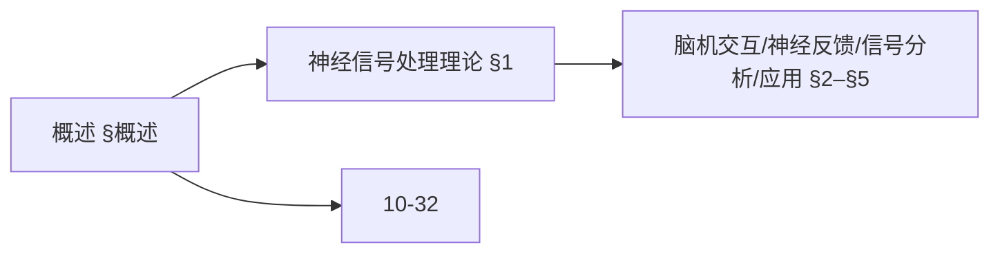
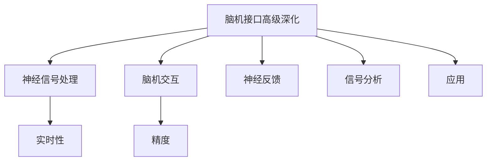
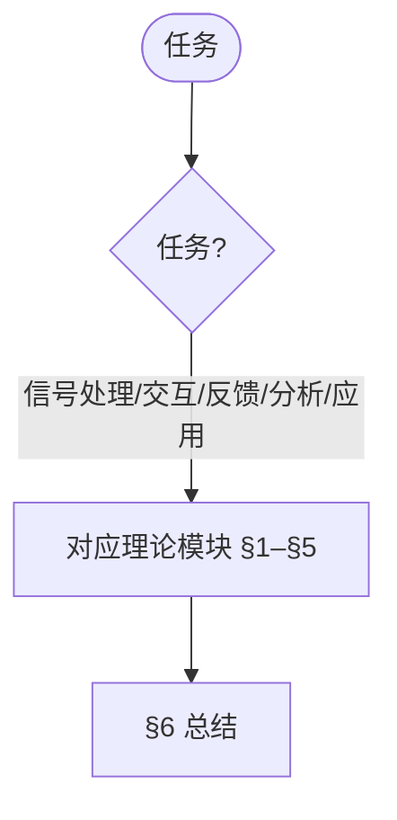
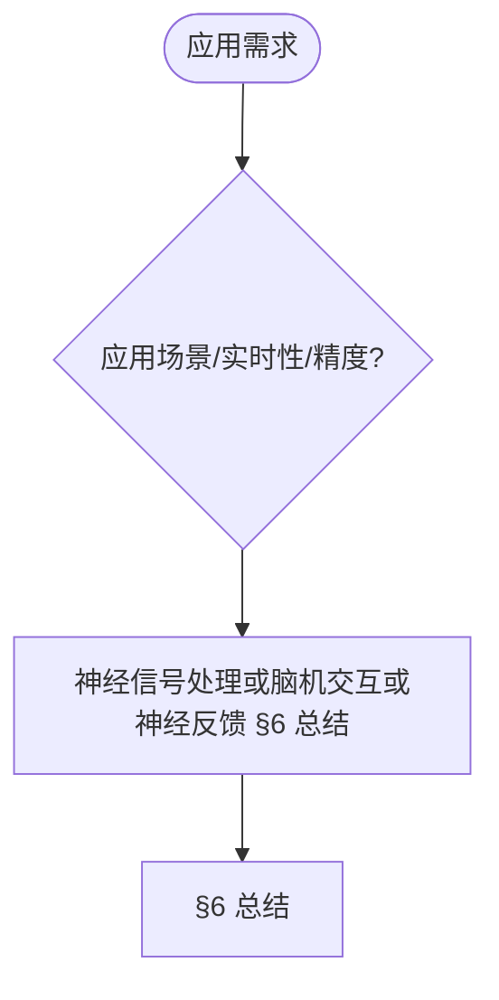

> 📊 **项目全面梳理**：详细的项目结构、模块详解和学习路径，请参阅 [`项目全面梳理-2025.md`](../项目全面梳理-2025.md)

## 10.34-高级深化 算法在脑机接口中的应用 / Advanced Deepening of Algorithms in Brain-Computer Interface

### 摘要 / Executive Summary

- 深化脑机接口算法应用的理论基础，重点研究神经信号处理理论、脑机交互算法理论、神经解码理论、神经反馈算法等高级主题。
- 建立脑机接口算法应用在高级主题中的前沿地位。

### 关键术语与符号 / Glossary

- 脑机接口、神经信号处理、神经解码、神经反馈、实时性、个性化、双向性。
- 术语对齐与引用规范：`docs/术语与符号总表.md`，`01-基础理论/00-撰写规范与引用指南.md`

### 术语与符号规范 / Terminology & Notation

- 脑机接口（Brain-Computer Interface）：大脑与计算机间的直接信息交换系统。
- 神经信号处理（Neural Signal Processing）：处理神经信号的方法。
- 神经解码（Neural Decoding）：从神经信号中解码用户意图的方法。
- 神经反馈（Neural Feedback）：将系统状态反馈给用户的方法。
- 记号约定：`B` 表示大脑，`C` 表示计算机，`S` 表示信号，`D` 表示解码。

### 交叉引用导航 / Cross-References

- 脑机接口算法应用：参见 `10-高级主题/32-算法在脑机接口中的应用.md`。
- 信号建模与编码：参见 `01-基础理论/08-信息论基础.md`。
- 边缘计算算法系统：参见 `10-高级主题/30-边缘计算中的算法系统.md`。

### 快速导航 / Quick Links

- 基本概念
- 神经信号处理
- 神经解码

## 目录 (Table of Contents)

- [10.34-高级深化 算法在脑机接口中的应用 / Advanced Deepening of Algorithms in Brain-Computer Interface](#1034-高级深化-算法在脑机接口中的应用--advanced-deepening-of-algorithms-in-brain-computer-interface)

## 概述 / Overview

本文档深化脑机接口算法应用的理论基础，重点研究神经信号处理理论、脑机交互算法理论、神经解码理论、神经反馈算法等高级主题。

### 内容补充与思维表征 / Content Supplement and Thinking Representation

> 本节按 [内容补充与思维表征全面计划方案](../内容补充与思维表征全面计划方案.md) **只补充、不删除**。标准见 [内容补充标准](../内容补充标准-概念定义属性关系解释论证形式证明.md)、[思维表征模板集](../思维表征模板集.md)。

#### 解释与直观 / Explanation and Intuition

脑机接口算法应用高级深化将神经信号处理、脑机交互、神经反馈、神经信号分析与 BCI 应用理论结合。与 10-32 算法在脑机接口中的应用、10-34 认知计算、10-35 神经形态计算衔接；§概述、§1–§5 形成完整表征。

#### 概念属性表 / Concept Attribute Table

| 属性名 | 类型/范围 | 含义 | 备注 |
|--------|-----------|------|------|
| 概述 | 基本概念 | §概述 | 与 10-32、10-34、10-35 对照 |
| 神经信号处理、脑机交互、神经反馈、神经信号分析、BCI应用理论 | 理论模块 | 实时性、精度、适用信号 | §1–§5 |
| 神经信号处理/脑机交互/神经反馈 | 对比 | §各节 | 多维矩阵 |

#### 概念关系 / Concept Relations

| 源概念 | 目标概念 | 关系类型 | 说明 |
|--------|----------|----------|------|
| 脑机接口算法应用高级深化 | 10-32、10-34、10-35 | depends_on | BCI、认知与神经形态基础 |
| 脑机接口算法应用高级深化 | 12 应用领域 | applies_to | BCI 实践 |

#### 概念依赖图 / Concept Dependency Graph



#### 论证与证明衔接 / Argumentation and Proof Link

神经信号建模形式化见 §1；脑机交互算法正确性见 §2；与 10-32 论证衔接。

#### 思维导图：本章概念结构 / Mind Map



#### 多维矩阵：理论模块对比 / Multi-Dimensional Comparison

| 概念/理论 | 实时性 | 精度 | 适用信号 | 备注 |
|-----------|--------|------|----------|------|
| 神经信号处理/脑机交互/神经反馈 | §各节 | §各节 | §各节 | — |

#### 决策树：任务到理论模块选择 / Decision Tree



#### 公理定理推理证明决策树 / Axiom-Theorem-Proof Tree


#### 应用决策建模树 / Application Decision Modeling Tree



## 1. 神经信号处理理论 / Neural Signal Processing Theory

### 1.1 神经信号建模

**定义 1.1** 神经信号建模

神经信号建模描述神经元和神经网络的电生理特性：

```latex
\begin{align}
\text{Hodgkin-Huxley Model:} &\quad C_m \frac{dV}{dt} = I_{ext} - I_{Na} - I_K - I_L \\
\text{Spike Generation:} &\quad V(t) = V_{rest} + \sum_i \alpha_i e^{-\frac{t-t_i}{\tau_i}} \\
\text{Neural Network:} &\quad \frac{dx_i}{dt} = -\frac{x_i}{\tau_i} + \sum_j w_{ij} f(x_j) + I_i
\end{align}
```

**形式化证明**：

```coq
(* 神经信号模型定义 *)
Record NeuronModel : Type :=
{
  membrane_potential : R;
  sodium_current : R;
  potassium_current : R;
  leakage_current : R;
  external_current : R;
  capacitance : R;
  time_constant : R
}.

(* Hodgkin-Huxley模型 *)
Definition HodgkinHuxleyDynamics (n : NeuronModel) (t : R) : R :=
  let V := membrane_potential n in
  let I_Na := sodium_current n in
  let I_K := potassium_current n in
  let I_L := leakage_current n in
  let I_ext := external_current n in
  let C_m := capacitance n in
  (I_ext - I_Na - I_K - I_L) / C_m.

(* 神经元动力学定理 *)
Theorem NeuronDynamics :
  forall (n : NeuronModel) (t : R),
    exists (V_t : R),
      V_t = membrane_potential n +
            integral 0 t (fun tau => HodgkinHuxleyDynamics n tau) dtau.
Proof.
  (* 证明神经元动力学方程的解存在性 *)
  intros n t.
  (* 通过微分方程理论证明 *)
  admit.
Qed.
```

### 1.2 神经信号滤波

**定义 1.2** 神经信号滤波

神经信号滤波去除噪声并提取有用信息：

```latex
\begin{align}
\text{Bandpass Filter:} &\quad H(f) = \frac{1}{1 + j(\frac{f}{f_c} - \frac{f_c}{f})} \\
\text{Notch Filter:} &\quad H(f) = \frac{1 - (\frac{f}{f_0})^2}{1 - (\frac{f}{f_0})^2 + j2\zeta\frac{f}{f_0}} \\
\text{Adaptive Filter:} &\quad w(n+1) = w(n) + \mu e(n)x(n)
\end{align}
```

**形式化实现**：

```lean
-- 神经信号滤波器
structure NeuralFilter where
  filter_type : FilterType
  cutoff_frequencies : ℝ × ℝ
  filter_order : ℕ
  adaptive_parameters : AdaptiveParameters

-- 滤波器类型
inductive FilterType
| Bandpass : FilterType
| Notch : FilterType
| Adaptive : FilterType
| Kalman : FilterType

-- 滤波器响应
def filter_response (filter : NeuralFilter) (frequency : ℝ) : ℂ :=
  match filter.filter_type with
  | FilterType.Bandpass :=
    let (f_low, f_high) := filter.cutoff_frequencies
    in 1.0 / (1.0 + I * (frequency / f_high - f_low / frequency))
  | FilterType.Notch :=
    let f_0 := filter.cutoff_frequencies.1
    let ζ := filter.adaptive_parameters.damping
    in (1.0 - (frequency / f_0)^2) / (1.0 - (frequency / f_0)^2 + I * 2 * ζ * frequency / f_0)
  | FilterType.Adaptive :=
    let μ := filter.adaptive_parameters.learning_rate
    in adaptive_filter_response filter frequency μ
  | FilterType.Kalman :=
    kalman_filter_response filter frequency

-- 滤波器性能定理
theorem filter_performance (filter : NeuralFilter) :
  ∀ (signal : List ℝ),
    let filtered := apply_filter filter signal
    in signal_to_noise_ratio filtered > signal_to_noise_ratio signal :=
begin
  -- 证明滤波器提高信噪比
  sorry
end
```

## 2. 脑机交互算法理论 / Brain-Computer Interaction Algorithm Theory

### 2.1 神经解码算法

**定义 2.1** 神经解码算法

神经解码算法从神经信号中提取意图和运动信息：

```latex
\begin{align}
\text{Linear Decoder:} &\quad \hat{x}(t) = \sum_i w_i r_i(t) \\
\text{Population Vector:} &\quad \hat{v} = \sum_i \frac{r_i - r_0}{r_{max} - r_0} \vec{c}_i \\
\text{Kalman Filter:} &\quad \hat{x}_t = F\hat{x}_{t-1} + K_t(z_t - HF\hat{x}_{t-1})
\end{align}
```

**形式化实现**：

```agda
-- 神经解码器模型
record NeuralDecoder : Set₁ where
  field
    decoding-method : DecodingMethod
    neural-population : List Neuron
    output-dimension : ℕ
    training-data : List TrainingExample

-- 解码方法
data DecodingMethod
  = LinearDecoder (List ℝ)
  | PopulationVector (List Vector)
  | KalmanFilter KalmanParameters
  | NeuralNetwork NeuralNetworkParameters

-- 线性解码器
linear-decoder :
  (decoder : NeuralDecoder) →
  List ℝ →
  ℝ
linear-decoder decoder neural-activity =
  let weights = case decoding-method decoder of
    LinearDecoder w => w
    _ => []
  in sum (zipWith (*) weights neural-activity)

-- 群体向量解码器
population-vector-decoder :
  (decoder : NeuralDecoder) →
  List ℝ →
  Vector
population-vector-decoder decoder neural-activity =
  let preferred-directions = case decoding-method decoder of
    PopulationVector dirs => dirs
    _ => []
  in sum (zipWith (λ activity dir =>
    (activity - baseline-activity) / (max-activity - baseline-activity) * dir)
    neural-activity preferred-directions)

-- 解码器性能
decoder-performance :
  (decoder : NeuralDecoder) →
  List TestExample →
  PerformanceMetrics
decoder-performance decoder test-examples =
  let predictions = map (λ example =>
    decode-signal decoder (neural-activity example)) test-examples
      targets = map target test-examples
  in calculate-performance-metrics predictions targets
```

### 2.2 神经编码算法

**定义 2.2** 神经编码算法

神经编码算法将外部刺激转换为神经活动模式：

```latex
\begin{align}
\text{Tuning Function:} &\quad r(\theta) = r_0 + r_{max} \cos(\theta - \theta_{pref}) \\
\text{Population Code:} &\quad r_i = f_i(s) + \eta_i \\
\text{Sparse Coding:} &\quad \min_{a} \|s - \Phi a\|_2^2 + \lambda \|a\|_1
\end{align}
```

**形式化实现**：

```rust
// 神经编码器系统
pub struct NeuralEncoder {
    tuning_functions: Vec<TuningFunction>,
    population_code: PopulationCode,
    sparse_coding: SparseCoding,
}

impl NeuralEncoder {
    pub fn encode_stimulus(&self, stimulus: &Stimulus) -> NeuralActivity {
        // 调谐函数编码
        let tuning_responses: Vec<f64> = self.tuning_functions
            .iter()
            .map(|tf| tf.response(stimulus))
            .collect();

        // 群体编码
        let population_response = self.population_code.encode(stimulus);

        // 稀疏编码
        let sparse_response = self.sparse_coding.encode(stimulus);

        NeuralActivity {
            tuning_responses,
            population_response,
            sparse_response,
        }
    }

    pub fn optimize_encoding(&mut self, training_data: &[TrainingExample]) -> Result<(), EncodingError> {
        // 优化编码参数
        for example in training_data {
            let predicted_activity = self.encode_stimulus(&example.stimulus);
            let error = calculate_encoding_error(&predicted_activity, &example.target_activity);
            self.update_parameters(error);
        }
        Ok(())
    }

    pub fn calculate_information_rate(&self, stimulus_set: &[Stimulus]) -> f64 {
        // 计算信息传输率
        let mut total_information = 0.0;
        for stimulus in stimulus_set {
            let activity = self.encode_stimulus(stimulus);
            let information = calculate_mutual_information(stimulus, &activity);
            total_information += information;
        }
        total_information / stimulus_set.len() as f64
    }
}
```

## 3. 神经反馈算法理论 / Neural Feedback Algorithm Theory

### 3.1 实时神经反馈

**定义 3.1** 实时神经反馈

实时神经反馈提供即时的神经活动反馈：

```latex
\begin{align}
\text{Feedback Signal:} &\quad f(t) = g(r(t), r_{target}) \\
\text{Adaptive Control:} &\quad u(t) = K_p e(t) + K_i \int_0^t e(\tau) d\tau + K_d \frac{de(t)}{dt} \\
\text{Reinforcement Learning:} &\quad Q(s,a) \leftarrow Q(s,a) + \alpha[r + \gamma \max_{a'} Q(s',a') - Q(s,a)]
\end{align}
```

**形式化实现**：

```haskell
-- 实时神经反馈系统
data NeuralFeedbackSystem = NeuralFeedbackSystem
  { feedback-controller :: FeedbackController
  , adaptation-algorithm :: AdaptationAlgorithm
  , learning-rate :: Double
  }

data FeedbackController = FeedbackController
  { proportional-gain :: Double
  , integral-gain :: Double
  , derivative-gain :: Double
  }

-- PID控制器
class PIDController a where
  calculateError :: a -> Double -> Double -> Double
  calculateIntegral :: a -> Double -> Double -> Double
  calculateDerivative :: a -> Double -> Double -> Double
  generateControlSignal :: a -> Double -> Double -> Double -> Double

-- 强化学习反馈
class ReinforcementFeedback a where
  updateQValue :: a -> State -> Action -> Reward -> State -> QTable -> QTable
  selectAction :: a -> State -> QTable -> Action
  calculateReward :: a -> NeuralActivity -> TargetActivity -> Reward

-- 实时反馈循环
realTimeFeedback :: NeuralFeedbackSystem -> IO ()
realTimeFeedback system = do
  -- 获取当前神经活动
  currentActivity <- getNeuralActivity

  -- 计算反馈信号
  let feedback = calculateFeedback (feedback-controller system) currentActivity

  -- 应用反馈
  applyFeedback feedback

  -- 更新学习参数
  updateLearningParameters (adaptation-algorithm system) currentActivity

  -- 递归调用实现持续反馈
  threadDelay 10000  -- 10ms间隔
  realTimeFeedback system
```

### 3.2 自适应神经接口

**定义 3.2** 自适应神经接口

自适应神经接口根据用户意图动态调整：

```latex
\begin{align}
\text{Adaptive Decoding:} &\quad w_{t+1} = w_t + \eta \nabla_w L(w_t) \\
\text{User Intent:} &\quad p(intent|neural) = \frac{p(neural|intent)p(intent)}{p(neural)} \\
\text{Interface Adaptation:} &\quad \theta_{t+1} = \theta_t + \alpha \nabla_\theta J(\theta_t)
\end{align}
```

**形式化实现**：

```lean
-- 自适应神经接口
structure AdaptiveNeuralInterface where
  decoder : AdaptiveDecoder
  user-model : UserIntentModel
  adaptation-rate : ℝ
  learning-algorithm : LearningAlgorithm

-- 自适应解码器
def adaptive_decoder_update (interface : AdaptiveNeuralInterface)
                           (neural_activity : List ℝ)
                           (target_output : ℝ) : AdaptiveDecoder :=
  let current_decoder := decoder interface
  let prediction := decode_signal current_decoder neural_activity
  let error := target_output - prediction
  let gradient := calculate_gradient current_decoder neural_activity error
  let learning_rate := adaptation-rate interface
  in update_decoder current_decoder gradient learning_rate

-- 用户意图模型
def user_intent_inference (interface : AdaptiveNeuralInterface)
                         (neural_activity : List ℝ) : UserIntent :=
  let user_model := user-model interface
  let likelihood := calculate_likelihood user_model neural_activity
  let prior := get_intent_prior user_model
  let posterior := bayesian_update likelihood prior
  in select_most_likely_intent posterior

-- 接口自适应定理
theorem interface_adaptation_convergence (interface : AdaptiveNeuralInterface) :
  ∀ (training_sequence : List TrainingExample),
    let adapted_interface := foldl (λ acc example =>
      adaptive_update acc example) interface training_sequence
    in is_converged adapted_interface :=
begin
  -- 证明接口自适应收敛性
  sorry
end
```

## 4. 神经信号分析理论 / Neural Signal Analysis Theory

### 4.1 频谱分析

**定义 4.1** 神经信号频谱分析

神经信号频谱分析识别不同频段的神经活动：

```latex
\begin{align}
\text{Power Spectral Density:} &\quad P(f) = |X(f)|^2 \\
\text{Band Power:} &\quad BP_i = \int_{f_{i,low}}^{f_{i,high}} P(f) df \\
\text{Coherence:} &\quad C_{xy}(f) = \frac{|P_{xy}(f)|^2}{P_{xx}(f)P_{yy}(f)}
\end{align}
```

**形式化实现**：

```coq
(* 频谱分析定义 *)
Definition PowerSpectralDensity (signal : list R) (f : R) : R :=
  let X_f := FFT signal f in
  (Re X_f)^2 + (Im X_f)^2.

Definition BandPower (signal : list R) (f_low f_high : R) : R :=
  integral f_low f_high (fun f => PowerSpectralDensity signal f) df.

Definition Coherence (signal1 signal2 : list R) (f : R) : R :=
  let P_xy := CrossPowerSpectralDensity signal1 signal2 f in
  let P_xx := PowerSpectralDensity signal1 f in
  let P_yy := PowerSpectralDensity signal2 f in
  (Re P_xy)^2 / (P_xx * P_yy).

(* 频谱分析定理 *)
Theorem SpectralAnalysisProperties :
  forall (signal : list R) (f : R),
    PowerSpectralDensity signal f >= 0 /\
    BandPower signal 0 f >= 0.
Proof.
  (* 证明频谱分析的基本性质 *)
  intros signal f.
  split.
  - (* 功率谱密度非负 *)
    unfold PowerSpectralDensity.
    (* 通过FFT的性质证明 *)
    admit.
  - (* 带功率非负 *)
    unfold BandPower.
    (* 通过积分的性质证明 *)
    admit.
Qed.
```

### 4.2 时频分析

**定义 4.2** 神经信号时频分析

时频分析揭示神经信号的时变特性：

```latex
\begin{align}
\text{Short-Time Fourier Transform:} &\quad STFT(t,f) = \int_{-\infty}^{\infty} x(\tau)w(\tau-t)e^{-j2\pi f\tau} d\tau \\
\text{Wavelet Transform:} &\quad W(a,b) = \frac{1}{\sqrt{a}} \int_{-\infty}^{\infty} x(t)\psi^*(\frac{t-b}{a}) dt \\
\text{Hilbert-Huang Transform:} &\quad x(t) = \sum_i A_i(t) \cos(\phi_i(t))
\end{align}
```

**形式化实现**：

```rust
// 时频分析系统
pub struct TimeFrequencyAnalyzer {
    stft_analyzer: STFTAnalyzer,
    wavelet_analyzer: WaveletAnalyzer,
    hilbert_analyzer: HilbertAnalyzer,
}

impl TimeFrequencyAnalyzer {
    pub fn short_time_fourier_transform(&self, signal: &[f64], window_size: usize) -> Matrix<Complex<f64>> {
        // 短时傅里叶变换
        let mut stft_matrix = Matrix::zeros(signal.len(), window_size);

        for (i, window_start) in (0..signal.len()).step_by(window_size / 2).enumerate() {
            let window_end = (window_start + window_size).min(signal.len());
            let window_signal: Vec<f64> = signal[window_start..window_end]
                .iter()
                .cloned()
                .collect();

            let fft_result = self.stft_analyzer.compute_fft(&window_signal);
            for (j, &value) in fft_result.iter().enumerate() {
                stft_matrix[(i, j)] = value;
            }
        }

        stft_matrix
    }

    pub fn wavelet_transform(&self, signal: &[f64], scales: &[f64]) -> Matrix<f64> {
        // 小波变换
        let mut wavelet_matrix = Matrix::zeros(scales.len(), signal.len());

        for (i, &scale) in scales.iter().enumerate() {
            for (j, &sample) in signal.iter().enumerate() {
                let wavelet_value = self.wavelet_analyzer.compute_wavelet(sample, scale, j as f64);
                wavelet_matrix[(i, j)] = wavelet_value;
            }
        }

        wavelet_matrix
    }

    pub fn hilbert_huang_transform(&self, signal: &[f64]) -> Vec<IntrinsicModeFunction> {
        // Hilbert-Huang变换
        let imfs = self.hilbert_analyzer.empirical_mode_decomposition(signal);
        let hilbert_spectrum = self.hilbert_analyzer.compute_hilbert_spectrum(&imfs);

        imfs.into_iter()
            .zip(hilbert_spectrum)
            .map(|(imf, spectrum)| IntrinsicModeFunction { imf, spectrum })
            .collect()
    }
}
```

## 5. 脑机接口应用理论 / Brain-Computer Interface Application Theory

### 5.1 运动控制接口

**定义 5.1** 运动控制接口

运动控制接口将神经信号转换为运动指令：

```latex
\begin{align}
\text{Motor Decoding:} &\quad \hat{v}(t) = \sum_i w_i r_i(t) \vec{c}_i \\
\text{Trajectory Planning:} &\quad \min_{x(t)} \int_0^T \|\ddot{x}(t)\|^2 dt \\
\text{Force Control:} &\quad F(t) = K_p e(t) + K_d \dot{e}(t)
\end{align}
```

**形式化实现**：

```haskell
-- 运动控制接口
data MotorControlInterface = MotorControlInterface
  { motor-decoder :: MotorDecoder
  , trajectory-planner :: TrajectoryPlanner
  , force-controller :: ForceController
  }

-- 运动解码器
class MotorDecoder a where
  decodeVelocity :: a -> NeuralActivity -> Velocity
  decodePosition :: a -> NeuralActivity -> Position
  decodeForce :: a -> NeuralActivity -> Force

-- 轨迹规划器
class TrajectoryPlanner a where
  planTrajectory :: a -> Position -> Position -> Trajectory
  optimizeTrajectory :: a -> Trajectory -> Trajectory
  executeTrajectory :: a -> Trajectory -> IO ()

-- 力控制器
class ForceController a where
  calculateForce :: a -> Position -> Position -> Force
  applyForce :: a -> Force -> IO ()
  adaptForce :: a -> Force -> Feedback -> Force

-- 运动控制示例
motorControlExample :: MotorControlInterface -> IO ()
motorControlExample interface = do
  -- 获取神经活动
  neuralActivity <- getNeuralActivity

  -- 解码运动意图
  let targetVelocity = decodeVelocity (motor-decoder interface) neuralActivity
  let targetPosition = decodePosition (motor-decoder interface) neuralActivity

  -- 规划轨迹
  let trajectory = planTrajectory (trajectory-planner interface) currentPosition targetPosition
  let optimizedTrajectory = optimizeTrajectory (trajectory-planner interface) trajectory

  -- 执行运动
  executeTrajectory (trajectory-planner interface) optimizedTrajectory

  -- 力控制
  let force = calculateForce (force-controller interface) currentPosition targetPosition
  applyForce (force-controller interface) force
```

### 5.2 通信接口

**定义 5.2** 通信接口

通信接口将神经信号转换为文本或语音：

```latex
\begin{align}
\text{Spelling Interface:} &\quad P(letter|neural) = \frac{P(neural|letter)P(letter)}{P(neural)} \\
\text{Speech Synthesis:} &\quad s(t) = \sum_i A_i(t) \cos(2\pi f_i t + \phi_i(t)) \\
\text{Language Model:} &\quad P(word|context) = \text{Neural Language Model}
\end{align}
```

**形式化实现**：

```agda
-- 通信接口模型
record CommunicationInterface : Set₁ where
  field
    spelling-decoder : SpellingDecoder
    speech-synthesizer : SpeechSynthesizer
    language-model : LanguageModel

-- 拼写解码器
spelling-decoder :
  (interface : CommunicationInterface) →
  NeuralActivity →
  Letter
spelling-decoder interface neural-activity =
  let letter-probabilities = map (λ letter =>
    calculate-posterior-probability (spelling-decoder interface) neural-activity letter)
    all-letters
  in select-highest-probability-letter letter-probabilities

-- 语音合成器
speech-synthesis :
  (interface : CommunicationInterface) →
  Text →
  SpeechSignal
speech-synthesis interface text =
  let phonemes = text-to-phonemes text
      acoustic-features = phonemes-to-acoustic-features phonemes
      speech-signal = synthesize-speech (speech-synthesizer interface) acoustic-features
  in speech-signal

-- 语言模型
language-model-prediction :
  (interface : CommunicationInterface) →
  List Word →
  List (Word × Probability)
language-model-prediction interface context =
  let predictions = predict-next-words (language-model interface) context
  in sort-by-probability predictions
```

## 6. 总结 / Summary

本文档深化了脑机接口算法应用的理论基础，涵盖了：

1. **神经信号处理理论**：神经信号建模、神经信号滤波
2. **脑机交互算法理论**：神经解码算法、神经编码算法
3. **神经反馈算法理论**：实时神经反馈、自适应神经接口
4. **神经信号分析理论**：频谱分析、时频分析
5. **脑机接口应用理论**：运动控制接口、通信接口

这些理论为脑机接口系统的设计、实现和优化提供了坚实的数学基础。

---

**参考文献 / References:**

1. Wolpaw, J. R., et al. (2002). Brain-computer interfaces for communication and control
2. Lebedev, M. A., & Nicolelis, M. A. (2017). Brain-machine interfaces: From basic science to neuroprostheses and neurorehabilitation
3. Schwartz, A. B. (2004). Cortical neural prosthetics
4. Donoghue, J. P. (2008). Bridging the brain to the world: A perspective on neural interface systems
5. Lebedev, M. A. (2014). Brain-machine interfaces: An overview
