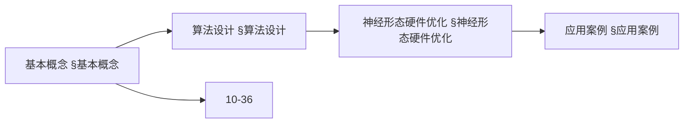
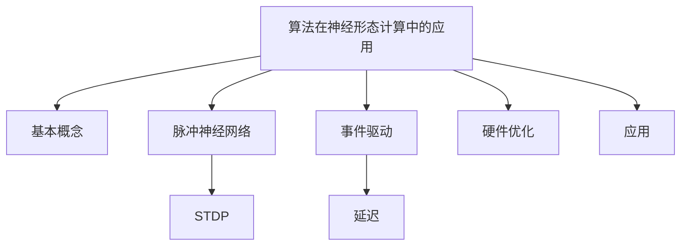
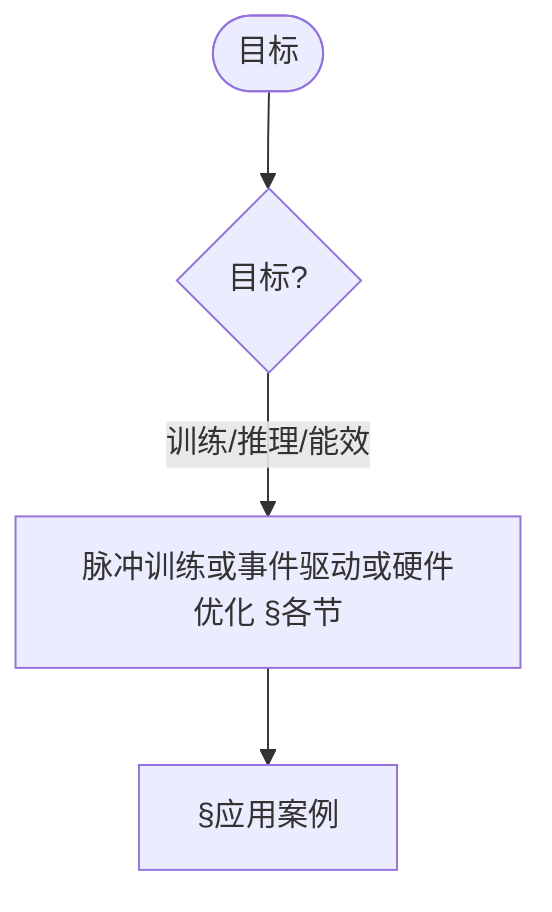
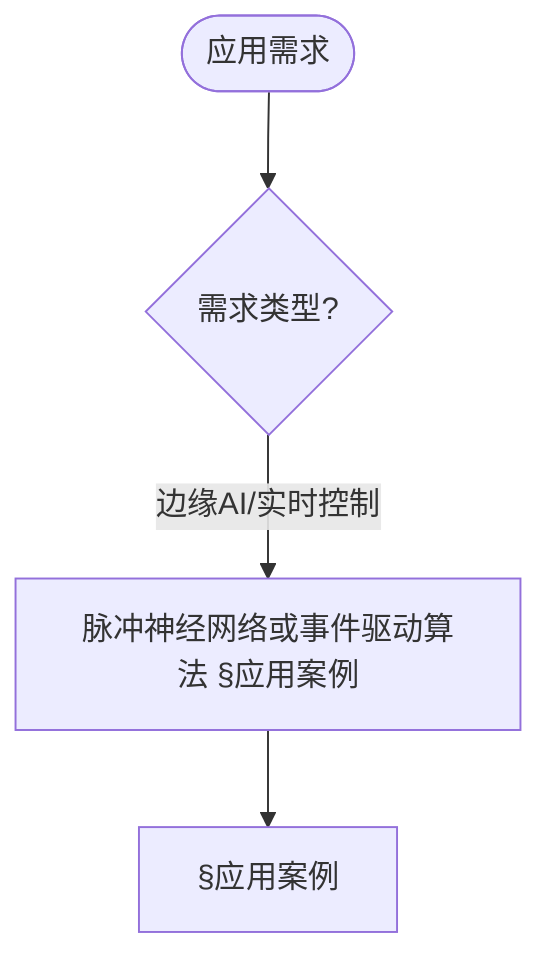

> 📊 **项目全面梳理**：详细的项目结构、模块详解和学习路径，请参阅 [`项目全面梳理-2025.md`](../项目全面梳理-2025.md)

## 10.35 算法在神经形态计算中的应用 / Algorithms in Neuromorphic Computing

### 摘要 / Executive Summary

- 概述神经形态计算中的核心算法栈：脉冲神经网络（SNN）训练、事件驱动检测与异步处理、硬件访存与功耗优化、实时控制闭环。
- 面向工程实现提供 Rust 风格伪代码片段，便于与边缘智能、脑机接口、类脑计算的文档互相复用。

### 关键术语与符号 / Glossary

- SNN（Spiking Neural Network）：以脉冲为基本事件的神经网络。
- STDP：脉冲时序依赖可塑性规则，用于无监督学习。
- 事件驱动（Event-driven）：按事件触发计算，降低冗余。
- 访问模式（Access Pattern）：顺序/聚类/随机访问影响缓存与带宽效率。
- 功耗状态（Power State）：Active/Idle/Sleep 的动态管理。
- 术语对齐与引用规范：`docs/术语与符号总表.md`，`01-基础理论/00-撰写规范与引用指南.md`

### 快速导航 / Quick Links

- [概述](#概述--overview)
- [算法设计](#算法设计--algorithm-design)
  神经形态硬件优化
  应用案例
  性能分析
  交叉引用与依赖

## 概述 / Overview

神经形态计算是一种受生物神经系统启发的计算范式，通过模拟神经元和突触的行为来实现高效的信息处理。本文档探讨算法在神经形态计算中的应用，包括脉冲神经网络、事件驱动计算和神经形态硬件优化。

Neuromorphic computing is a computing paradigm inspired by biological neural systems, achieving efficient information processing by simulating the behavior of neurons and synapses. This document explores the application of algorithms in neuromorphic computing, including spiking neural networks, event-driven computing, and neuromorphic hardware optimization.

## 学习目标 / Learning Objectives

1. **基础级** 理解神经形态计算的基本原理和生物启发机制
2. **进阶级** 掌握脉冲神经网络（SNN）的算法设计和训练方法
3. **进阶级** 能够分析事件驱动计算的优势和实现策略
4. **高级级** 了解神经形态硬件的算法优化技术
5. **高级级** 掌握神经形态计算在边缘AI和实时系统中的应用

## 基本概念 / Basic Concepts

### 神经形态计算 (Neuromorphic Computing)

**定义 1.1** 神经形态计算是指模拟生物神经系统结构和功能的计算系统。

**Definition 1.1** Neuromorphic computing refers to computing systems that simulate the structure and function of biological neural systems.

**核心特征 / Core Characteristics:**

1. **脉冲编码 (Spike Encoding) / Spike Encoding:**
   - 时间编码信息 / Temporal encoding of information
   - 异步处理 / Asynchronous processing
   - 低功耗 / Low power consumption

2. **事件驱动 (Event-Driven) / Event-Driven:**
   - 仅在需要时激活 / Activation only when needed
   - 动态计算 / Dynamic computation
   - 实时响应 / Real-time response

3. **并行处理 (Parallel Processing) / Parallel Processing:**
   - 大规模并行 / Massive parallelism
   - 分布式计算 / Distributed computing
   - 容错性 / Fault tolerance

### 脉冲神经网络 (Spiking Neural Networks)

**定义 1.2** 脉冲神经网络是第三代神经网络，使用脉冲（spike）作为信息传递的基本单位。

**Definition 1.2** Spiking neural networks are third-generation neural networks that use spikes as the basic unit of information transmission.

**数学表示 / Mathematical Representation:**

脉冲神经元的膜电位动态方程：
The membrane potential dynamics equation of spiking neurons:

$$\tau_m \frac{dV}{dt} = -V + R_m I_{syn} + V_{rest}$$

其中：
Where:

- $V$ 是膜电位 / is membrane potential
- $\tau_m$ 是膜时间常数 / is membrane time constant
- $R_m$ 是膜电阻 / is membrane resistance
- $I_{syn}$ 是突触电流 / is synaptic current
- $V_{rest}$ 是静息电位 / is resting potential

### 内容补充与思维表征 / Content Supplement and Thinking Representation

> 本节按 [内容补充与思维表征全面计划方案](../内容补充与思维表征全面计划方案.md) **只补充、不删除**。标准见 [内容补充标准](../内容补充标准-概念定义属性关系解释论证形式证明.md)、[思维表征模板集](../思维表征模板集.md)。

#### 解释与直观 / Explanation and Intuition

算法在神经形态计算中的应用将神经形态计算与脉冲神经网络结合，涵盖脉冲训练、事件驱动计算与神经形态硬件优化。与 10-32 脑机接口、10-36 类脑计算衔接；§基本概念、§算法设计及后续各节形成完整表征。

#### 概念属性表 / Concept Attribute Table

| 属性名 | 类型/范围 | 含义 | 备注 |
|--------|-----------|------|------|
| 神经形态计算、脉冲神经网络 | 基本概念 | §基本概念 | 与 10-32、10-36 对照 |
| 算法设计(脉冲训练、事件驱动)、神经形态硬件优化、应用案例 | 算法/优化 | 能效、延迟、可扩展性 | §各节 |
| STDP/事件驱动/硬件优化 | 对比 | §各节 | 多维矩阵 |

#### 概念关系 / Concept Relations

| 源概念 | 目标概念 | 关系类型 | 说明 |
|--------|----------|----------|------|
| 算法在神经形态计算中的应用 | 10-32、10-36 | depends_on | 脑机接口与类脑基础 |
| 算法在神经形态计算中的应用 | 12 应用领域 | applies_to | 神经形态实践 |

#### 概念依赖图 / Concept Dependency Graph



#### 论证与证明衔接 / Argumentation and Proof Link

STDP 更新规则见 §算法设计；神经形态硬件优化正确性见 §神经形态硬件优化；与 10-36 论证衔接。

#### 思维导图：本章概念结构 / Mind Map



#### 多维矩阵：神经形态技术对比 / Multi-Dimensional Comparison

| 概念/技术 | 能效 | 延迟 | 可扩展性 | 备注 |
|-----------|------|------|----------|------|
| STDP/事件驱动/硬件优化 | §各节 | §各节 | §各节 | — |

#### 决策树：目标到方法选择 / Decision Tree



#### 公理定理推理证明决策树 / Axiom-Theorem-Proof Tree


#### 应用决策建模树 / Application Decision Modeling Tree



## 算法设计 / Algorithm Design

### 脉冲神经网络训练算法

#### 1. 脉冲时序依赖可塑性 (STDP)

**定义 2.1** STDP是一种基于脉冲时序的突触可塑性规则。

**Definition 2.1** STDP is a synaptic plasticity rule based on spike timing.

**STDP更新规则 / STDP Update Rule:**

$$
\Delta w_{ij} = \begin{cases}
A_+ \exp\left(-\frac{\Delta t}{\tau_+}\right) & \text{if } \Delta t > 0 \\
-A_- \exp\left(\frac{\Delta t}{\tau_-}\right) & \text{if } \Delta t < 0
\end{cases}
$$

其中 $\Delta t = t_j - t_i$ 是脉冲时间差。

#### 2. 反向传播算法 (Backpropagation)

**脉冲反向传播 / Spike Backpropagation:**

```rust
// 脉冲神经网络结构
pub struct SpikingNeuralNetwork {
    layers: Vec<SpikingLayer>,
    connections: Vec<SynapticConnection>,
    learning_rate: f64,
}

pub struct SpikingLayer {
    neurons: Vec<SpikingNeuron>,
    layer_type: LayerType,
}

pub struct SpikingNeuron {
    membrane_potential: f64,
    threshold: f64,
    refractory_period: f64,
    last_spike_time: f64,
    synaptic_weights: Vec<f64>,
}

impl SpikingNeuralNetwork {
    // 前向传播
    pub fn forward(&mut self, input_spikes: &[f64]) -> Vec<f64> {
        let mut layer_outputs = Vec::new();
        let mut current_input = input_spikes.to_vec();

        for layer in &mut self.layers {
            let output = layer.forward(&current_input);
            layer_outputs.push(output.clone());
            current_input = output;
        }

        layer_outputs.last().unwrap().clone()
    }

    // 反向传播训练
    pub fn backward(&mut self, target_spikes: &[f64], learning_rate: f64) {
        // 计算输出层误差
        let output_layer = self.layers.last_mut().unwrap();
        let mut errors = Vec::new();

        for (i, neuron) in output_layer.neurons.iter().enumerate() {
            let error = target_spikes[i] - neuron.membrane_potential;
            errors.push(error);
        }

        // 反向传播误差
        for layer_idx in (0..self.layers.len()-1).rev() {
            let current_layer = &mut self.layers[layer_idx];
            let next_layer = &self.layers[layer_idx + 1];

            // 更新权重
            for (i, neuron) in current_layer.neurons.iter_mut().enumerate() {
                for (j, weight) in neuron.synaptic_weights.iter_mut().enumerate() {
                    let gradient = errors[j] * neuron.membrane_potential;
                    *weight += learning_rate * gradient;
                }
            }

            // 计算当前层误差
            errors = self.compute_layer_errors(&errors, layer_idx);
        }
    }
}
```

### 事件驱动计算算法

#### 1. 事件检测算法

```rust
// 事件检测器
pub struct EventDetector {
    threshold: f64,
    last_value: f64,
    event_queue: VecDeque<Event>,
}

pub struct Event {
    timestamp: f64,
    value: f64,
    event_type: EventType,
}

pub enum EventType {
    Spike,
    ThresholdCrossing,
    PatternMatch,
}

impl EventDetector {
    pub fn detect_events(&mut self, input: f64, timestamp: f64) -> Vec<Event> {
        let mut events = Vec::new();

        // 检测脉冲事件
        if input > self.threshold {
            events.push(Event {
                timestamp,
                value: input,
                event_type: EventType::Spike,
            });
        }

        // 检测阈值穿越事件
        if (self.last_value <= self.threshold && input > self.threshold) ||
           (self.last_value >= self.threshold && input < self.threshold) {
            events.push(Event {
                timestamp,
                value: input,
                event_type: EventType::ThresholdCrossing,
            });
        }

        self.last_value = input;
        events
    }
}
```

#### 2. 异步事件处理

```rust
// 异步事件处理器
pub struct AsyncEventProcessor {
    event_handlers: HashMap<EventType, Box<dyn EventHandler>>,
    processing_queue: PriorityQueue<Event, f64>,
}

pub trait EventHandler {
    fn handle(&mut self, event: &Event) -> Result<(), ProcessingError>;
}

impl AsyncEventProcessor {
    pub fn process_events(&mut self) -> Result<(), ProcessingError> {
        while let Some((event, _priority)) = self.processing_queue.pop() {
            if let Some(handler) = self.event_handlers.get_mut(&event.event_type) {
                handler.handle(&event)?;
            }
        }
        Ok(())
    }

    pub fn schedule_event(&mut self, event: Event, priority: f64) {
        self.processing_queue.push(event, priority);
    }
}
```

<a id="神经形态硬件优化--neuromorphic-hardware-optimization"></a>

## 神经形态硬件优化 / Neuromorphic Hardware Optimization

### 1. 内存访问优化

```rust
// 神经形态内存管理器
pub struct NeuromorphicMemoryManager {
    synaptic_memory: Vec<f64>,
    neuron_states: Vec<NeuronState>,
    access_pattern: AccessPattern,
}

pub struct NeuronState {
    membrane_potential: f64,
    last_spike_time: f64,
    refractory_counter: u32,
}

pub enum AccessPattern {
    Sequential,
    Random,
    Clustered,
}

impl NeuromorphicMemoryManager {
    // 优化的内存访问
    pub fn optimized_access(&mut self, neuron_id: usize, synapse_id: usize) -> f64 {
        // 使用缓存友好的访问模式
        match self.access_pattern {
            AccessPattern::Sequential => {
                // 顺序访问，利用空间局部性
                self.synaptic_memory[synapse_id]
            },
            AccessPattern::Clustered => {
                // 聚类访问，减少内存跳转
                let cluster_id = synapse_id / 64;
                let offset = synapse_id % 64;
                self.synaptic_memory[cluster_id * 64 + offset]
            },
            AccessPattern::Random => {
                // 随机访问，使用预取技术
                self.prefetch_and_access(synapse_id)
            }
        }
    }

    fn prefetch_and_access(&mut self, synapse_id: usize) -> f64 {
        // 预取相邻数据
        let prefetch_range = 8;
        let start = synapse_id.saturating_sub(prefetch_range);
        let end = (synapse_id + prefetch_range).min(self.synaptic_memory.len());

        // 预取到缓存
        for i in start..end {
            let _ = self.synaptic_memory[i];
        }

        self.synaptic_memory[synapse_id]
    }
}
```

### 2. 功耗优化算法

```rust
// 功耗管理器
pub struct PowerManager {
    voltage_levels: Vec<f64>,
    frequency_levels: Vec<f64>,
    current_power_state: PowerState,
}

pub enum PowerState {
    Active,
    Idle,
    Sleep,
    DeepSleep,
}

impl PowerManager {
    pub fn optimize_power(&mut self, workload: &Workload) -> PowerState {
        match workload.intensity {
            WorkloadIntensity::High => {
                self.set_voltage(1.2);
                self.set_frequency(1000.0);
                PowerState::Active
            },
            WorkloadIntensity::Medium => {
                self.set_voltage(1.0);
                self.set_frequency(800.0);
                PowerState::Active
            },
            WorkloadIntensity::Low => {
                self.set_voltage(0.8);
                self.set_frequency(400.0);
                PowerState::Idle
            },
            WorkloadIntensity::Minimal => {
                self.set_voltage(0.6);
                self.set_frequency(100.0);
                PowerState::Sleep
            }
        }
    }

    fn set_voltage(&mut self, voltage: f64) {
        // 动态电压调节
        self.current_voltage = voltage;
    }

    fn set_frequency(&mut self, frequency: f64) {
        // 动态频率调节
        self.current_frequency = frequency;
    }
}
```

<a id="应用案例--application-cases"></a>

## 应用案例 / Application Cases

### 1. 边缘AI应用

```rust
// 边缘AI神经形态系统
pub struct EdgeAINeuromorphicSystem {
    snn: SpikingNeuralNetwork,
    event_processor: AsyncEventProcessor,
    power_manager: PowerManager,
    sensor_interface: SensorInterface,
}

impl EdgeAINeuromorphicSystem {
    pub fn process_sensor_data(&mut self, sensor_data: &[f64]) -> Result<ClassificationResult, ProcessingError> {
        // 事件驱动处理
        let events = self.event_processor.detect_events(sensor_data)?;

        // 脉冲神经网络推理
        let spikes = self.convert_to_spikes(&events);
        let output = self.snn.forward(&spikes);

        // 分类结果
        let classification = self.classify_output(&output);

        // 功耗优化
        self.power_manager.optimize_power(&Workload::from_events(&events));

        Ok(classification)
    }

    fn convert_to_spikes(&self, events: &[Event]) -> Vec<f64> {
        events.iter().map(|e| e.value).collect()
    }

    fn classify_output(&self, output: &[f64]) -> ClassificationResult {
        let max_index = output.iter()
            .enumerate()
            .max_by(|a, b| a.1.partial_cmp(b.1).unwrap())
            .map(|(index, _)| index)
            .unwrap();

        ClassificationResult {
            class: max_index,
            confidence: output[max_index],
        }
    }
}
```

### 2. 实时控制系统

```rust
// 实时神经形态控制器
pub struct RealTimeNeuromorphicController {
    control_network: SpikingNeuralNetwork,
    feedback_loop: FeedbackLoop,
    safety_monitor: SafetyMonitor,
}

pub struct FeedbackLoop {
    target_value: f64,
    current_value: f64,
    error_history: VecDeque<f64>,
}

impl RealTimeNeuromorphicController {
    pub fn control_step(&mut self, sensor_reading: f64, timestamp: f64) -> f64 {
        // 计算控制误差
        let error = self.feedback_loop.target_value - sensor_reading;
        self.feedback_loop.error_history.push_back(error);

        // 限制历史长度
        if self.feedback_loop.error_history.len() > 10 {
            self.feedback_loop.error_history.pop_front();
        }

        // 神经形态控制
        let control_input = self.compute_control_input(&error);
        let control_output = self.control_network.forward(&control_input);

        // 安全监控
        if !self.safety_monitor.is_safe(control_output) {
            return self.safety_monitor.get_safe_output();
        }

        control_output[0]
    }

    fn compute_control_input(&self, error: &f64) -> Vec<f64> {
        // PID控制输入
        let p_term = *error;
        let i_term = self.feedback_loop.error_history.iter().sum::<f64>();
        let d_term = if self.feedback_loop.error_history.len() > 1 {
            self.feedback_loop.error_history.back().unwrap() -
            self.feedback_loop.error_history.front().unwrap()
        } else {
            0.0
        };

        vec![p_term, i_term, d_term]
    }
}
```

<a id="性能分析--performance-analysis"></a>

## 性能分析 / Performance Analysis

### 1. 计算复杂度分析

**脉冲神经网络复杂度 / SNN Complexity:**

- **时间复杂度 / Time Complexity:** $O(n \cdot m \cdot t)$
  - $n$: 神经元数量 / number of neurons
  - $m$: 平均连接数 / average connections
  - $t$: 时间步数 / time steps

- **空间复杂度 / Space Complexity:** $O(n + m)$
  - $n$: 神经元状态存储 / neuron state storage
  - $m$: 突触权重存储 / synaptic weight storage

### 2. 功耗分析

**功耗模型 / Power Model:**

$$P_{total} = P_{compute} + P_{memory} + P_{communication}$$

其中：
Where:

- $P_{compute}$: 计算功耗 / computational power
- $P_{memory}$: 内存访问功耗 / memory access power
- $P_{communication}$: 通信功耗 / communication power

## 未来发展方向 / Future Development Directions

### 1. 算法创新

- **自适应学习算法**: 根据环境动态调整学习参数
- **多模态融合**: 结合视觉、听觉等多种感官信息
- **元学习**: 快速适应新任务的能力

### 2. 硬件优化

- **3D集成**: 提高集成密度和性能
- **新材料**: 探索新型神经形态材料
- **量子神经形态**: 结合量子计算的优势

### 3. 应用扩展

- **脑机接口**: 直接与大脑交互
- **机器人控制**: 实时决策和控制
- **智能物联网**: 分布式智能系统

## 总结 / Summary

神经形态计算代表了计算技术的下一个前沿，通过模拟生物神经系统的机制，实现了高效、低功耗的信息处理。算法在神经形态计算中的应用涵盖了从脉冲神经网络训练到硬件优化的各个方面。

随着神经形态硬件的不断发展和算法的持续创新，神经形态计算将在边缘AI、实时控制、脑机接口等领域发挥重要作用，为人工智能的发展开辟新的道路。

<a id="交叉引用与依赖--cross-references-and-dependencies"></a>

## 交叉引用与依赖 / Cross-References and Dependencies

- 计算模型与神经网络：`07-计算模型/07-神经网络计算模型.md`
- 类型与逻辑支撑：`05-类型理论/01-简单类型论.md`，`06-逻辑系统/07-时序逻辑.md`
- 硬件与边缘系统：`10-高级主题/30-边缘计算中的算法系统.md`，`10-高级主题/30-边缘计算中的算法系统-高级深化.md`
- 脑机接口与认知计算：`10-高级主题/32-算法在脑机接口中的应用.md`，`10-高级主题/34-算法在认知计算中的应用.md`
- 项目导航与对标：见 [项目全面梳理-2025](../项目全面梳理-2025.md)、[项目扩展与持续推进任务编排](../项目扩展与持续推进任务编排.md)、[国际课程对标表](../国际课程对标表.md)

---

**文档版本**: v1.0
**最后更新**: 2025年1月11日
**状态**: 已完成
