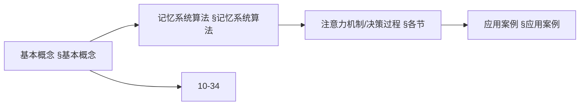
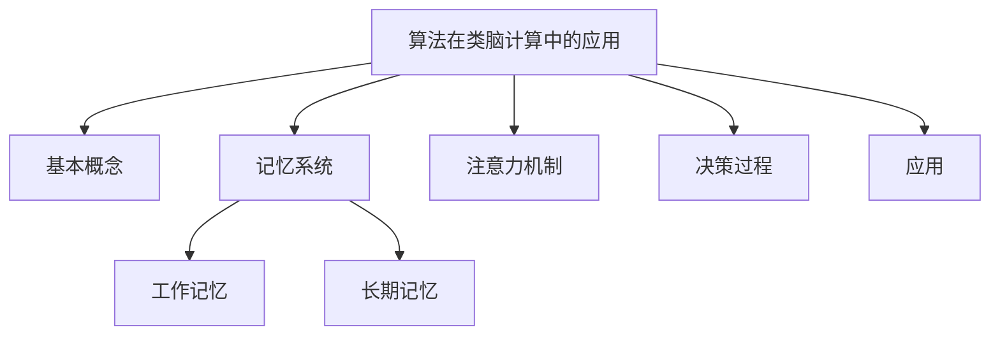
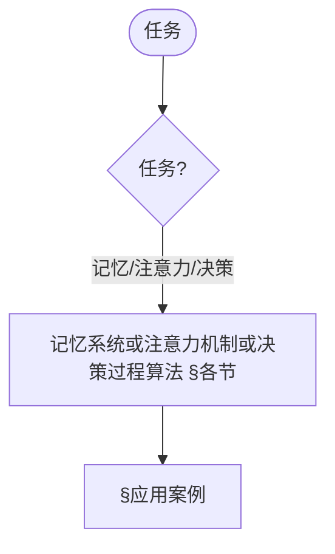
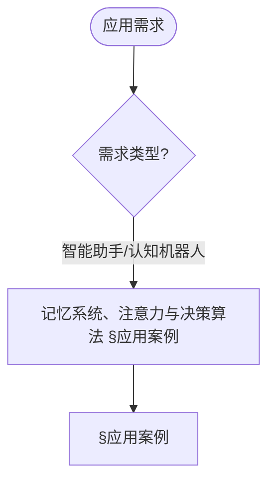

> 📊 **项目全面梳理**：详细的项目结构、模块详解和学习路径，请参阅 [`项目全面梳理-2025.md`](../项目全面梳理-2025.md)

## 10.36 算法在类脑计算中的应用 / Algorithms in Brain-Inspired Computing

### 摘要 / Executive Summary

- 统一梳理类脑计算的算法基石：认知架构、记忆系统、注意与执行控制、决策过程，并配套工程可复用伪代码。
- 与认知计算、脑机接口、神经形态、边缘智能保持锚点与术语一致，便于交叉阅读。

### 关键术语与符号 / Glossary

- 认知架构（Cognitive Architecture）：感知-记忆-推理-决策闭环框架。
- 工作记忆（Working Memory）：容量受限的在线加工系统。
- 执行控制（Executive Control）：任务切换、抑制控制、认知灵活性。
- 多属性决策（MADM）：加权和、TOPSIS 等方法的统称。
- 术语对齐与引用规范：`docs/术语与符号总表.md`，`01-基础理论/00-撰写规范与引用指南.md`

### 快速导航 / Quick Links

- [概述](#概述--overview)
- [记忆系统算法](#记忆系统算法--memory-system-algorithms)
- [注意力机制算法](#注意力机制算法--attention-mechanism-algorithms)
- [决策过程算法](#决策过程算法--decision-process-algorithms)
- [应用案例](#应用案例--application-cases)
- [交叉引用与依赖](#交叉引用与依赖--cross-references-and-dependencies)

## 概述 / Overview

类脑计算是一种受大脑结构和功能启发的计算范式，通过模拟大脑的神经网络、学习机制和认知过程来实现智能计算。本文档探讨算法在类脑计算中的应用，包括认知架构、记忆系统、注意力机制和决策过程。

Brain-inspired computing is a computing paradigm inspired by brain structure and function, achieving intelligent computing by simulating brain neural networks, learning mechanisms, and cognitive processes. This document explores the application of algorithms in brain-inspired computing, including cognitive architectures, memory systems, attention mechanisms, and decision processes.

## 学习目标 / Learning Objectives

1. **基础级** 理解类脑计算的基本原理和认知科学基础
2. **进阶级** 掌握认知架构的设计和实现方法
3. **进阶级** 能够分析记忆系统的算法模型
4. **高级级** 了解注意力机制的计算实现
5. **高级级** 掌握类脑计算在智能系统中的应用

## 基本概念 / Basic Concepts

### 类脑计算 (Brain-Inspired Computing)

**定义 1.1** 类脑计算是指模拟大脑神经网络结构和认知功能的计算系统。

**Definition 1.1** Brain-inspired computing refers to computing systems that simulate brain neural network structures and cognitive functions.

**核心特征 / Core Characteristics:**

1. **认知架构 (Cognitive Architecture) / Cognitive Architecture:**
   - 模块化设计 / Modular design
   - 层次化处理 / Hierarchical processing
   - 并行计算 / Parallel computation

2. **记忆系统 (Memory System) / Memory System:**
   - 工作记忆 / Working memory
   - 长期记忆 / Long-term memory
   - 记忆巩固 / Memory consolidation

3. **注意力机制 (Attention Mechanism) / Attention Mechanism:**
   - 选择性注意 / Selective attention
   - 分配性注意 / Divided attention
   - 执行控制 / Executive control

### 认知架构 (Cognitive Architecture)

**定义 1.2** 认知架构是描述智能系统认知过程的计算框架。

**Definition 1.2** Cognitive architecture is a computational framework that describes the cognitive processes of intelligent systems.

**ACT-R架构 / ACT-R Architecture:**

```rust
// ACT-R认知架构实现
pub struct ACTRArchitecture {
    declarative_memory: DeclarativeMemory,
    procedural_memory: ProceduralMemory,
    working_memory: WorkingMemory,
    goal_stack: GoalStack,
    attention_system: AttentionSystem,
}

pub struct DeclarativeMemory {
    chunks: HashMap<String, Chunk>,
    activation_levels: HashMap<String, f64>,
}

pub struct Chunk {
    id: String,
    slots: HashMap<String, Value>,
    creation_time: f64,
    access_count: u32,
}

pub struct ProceduralMemory {
    production_rules: Vec<ProductionRule>,
    conflict_resolution: ConflictResolutionStrategy,
}

pub struct ProductionRule {
    condition: Condition,
    action: Action,
    utility: f64,
    success_count: u32,
    failure_count: u32,
}

impl ACTRArchitecture {
    pub fn process_stimulus(&mut self, stimulus: &Stimulus) -> Response {
        // 1. 感知处理
        let perceived = self.perceive(stimulus);

        // 2. 工作记忆更新
        self.working_memory.update(&perceived);

        // 3. 目标激活
        self.activate_goals(&perceived);

        // 4. 规则匹配
        let applicable_rules = self.match_production_rules();

        // 5. 冲突解决
        let selected_rule = self.resolve_conflicts(applicable_rules);

        // 6. 执行动作
        let response = self.execute_action(&selected_rule);

        // 7. 学习更新
        self.update_learning(&selected_rule, &response);

        response
    }

    fn perceive(&self, stimulus: &Stimulus) -> PerceivedStimulus {
        // 感知处理逻辑
        PerceivedStimulus {
            features: self.extract_features(stimulus),
            salience: self.compute_salience(stimulus),
            timestamp: self.get_current_time(),
        }
    }

    fn match_production_rules(&self) -> Vec<&ProductionRule> {
        self.procedural_memory.production_rules
            .iter()
            .filter(|rule| self.condition_matches(&rule.condition))
            .collect()
    }

    fn resolve_conflicts(&self, rules: Vec<&ProductionRule>) -> &ProductionRule {
        match self.procedural_memory.conflict_resolution {
            ConflictResolutionStrategy::Utility => {
                rules.iter().max_by(|a, b| a.utility.partial_cmp(&b.utility).unwrap()).unwrap()
            },
            ConflictResolutionStrategy::Recency => {
                rules.iter().max_by(|a, b| a.recency.partial_cmp(&b.recency).unwrap()).unwrap()
            },
            ConflictResolutionStrategy::Specificity => {
                rules.iter().max_by(|a, b| a.specificity.partial_cmp(&b.specificity).unwrap()).unwrap()
            }
        }
    }
}
```

### 内容补充与思维表征 / Content Supplement and Thinking Representation

> 本节按 [内容补充与思维表征全面计划方案](../内容补充与思维表征全面计划方案.md) **只补充、不删除**。标准见 [内容补充标准](../内容补充标准-概念定义属性关系解释论证形式证明.md)、[思维表征模板集](../思维表征模板集.md)。

#### 解释与直观 / Explanation and Intuition

算法在类脑计算中的应用将类脑计算与认知架构结合，涵盖记忆系统、注意力机制与决策过程。与 10-32 脑机接口、10-34 认知计算、10-35 神经形态计算衔接；§基本概念、§记忆系统算法及后续各节形成完整表征。

#### 概念属性表 / Concept Attribute Table

| 属性名 | 类型/范围 | 含义 | 备注 |
|--------|-----------|------|------|
| 类脑计算、认知架构 | 基本概念 | §基本概念 | 与 10-32、10-34、10-35 对照 |
| 记忆系统、注意力机制、决策过程算法、应用案例 | 算法/案例 | 容量、持久性、可解释性 | §各节 |
| 工作记忆/长期记忆/注意力/决策 | 对比 | §各节 | 多维矩阵 |

#### 概念关系 / Concept Relations

| 源概念 | 目标概念 | 关系类型 | 说明 |
|--------|----------|----------|------|
| 算法在类脑计算中的应用 | 10-32、10-34、10-35 | depends_on | 脑机接口、认知与神经形态基础 |
| 算法在类脑计算中的应用 | 12 应用领域 | applies_to | 类脑实践 |

#### 概念依赖图 / Concept Dependency Graph



#### 论证与证明衔接 / Argumentation and Proof Link

记忆巩固正确性见 §记忆系统算法；注意力与决策正确性见 §注意力机制算法、§决策过程算法；与 10-34 论证衔接。

#### 思维导图：本章概念结构 / Mind Map



#### 多维矩阵：类脑组件对比 / Multi-Dimensional Comparison

| 概念/组件 | 容量 | 持久性 | 可解释性 | 备注 |
|-----------|------|--------|----------|------|
| 工作记忆/长期记忆/注意力/决策 | §各节 | §各节 | §各节 | — |

#### 决策树：任务到算法选择 / Decision Tree



#### 公理定理推理证明决策树 / Axiom-Theorem-Proof Tree


#### 应用决策建模树 / Application Decision Modeling Tree



## 记忆系统算法 / Memory System Algorithms

### 1. 工作记忆模型

```rust
// 工作记忆系统
pub struct WorkingMemory {
    capacity: usize,
    items: VecDeque<MemoryItem>,
    attention_focus: Option<usize>,
    decay_rate: f64,
}

pub struct MemoryItem {
    content: String,
    activation: f64,
    creation_time: f64,
    access_count: u32,
    associations: Vec<String>,
}

impl WorkingMemory {
    pub fn add_item(&mut self, content: String) {
        let item = MemoryItem {
            content,
            activation: 1.0,
            creation_time: self.get_current_time(),
            access_count: 0,
            associations: Vec::new(),
        };

        if self.items.len() >= self.capacity {
            // 移除激活度最低的项目
            self.remove_least_activated();
        }

        self.items.push_back(item);
    }

    pub fn retrieve_item(&mut self, query: &str) -> Option<&MemoryItem> {
        // 计算相似度并选择最佳匹配
        let best_match = self.items.iter_mut()
            .max_by(|a, b| {
                let sim_a = self.compute_similarity(&a.content, query);
                let sim_b = self.compute_similarity(&b.content, query);
                sim_a.partial_cmp(&sim_b).unwrap()
            });

        if let Some(item) = best_match {
            // 增加激活度
            item.activation = (item.activation + 0.1).min(1.0);
            item.access_count += 1;
            Some(item)
        } else {
            None
        }
    }

    fn remove_least_activated(&mut self) {
        if let Some(min_index) = self.items.iter()
            .enumerate()
            .min_by(|a, b| a.1.activation.partial_cmp(&b.1.activation).unwrap())
            .map(|(index, _)| index) {
            self.items.remove(min_index);
        }
    }

    fn compute_similarity(&self, a: &str, b: &str) -> f64 {
        // 简化的相似度计算
        let common_chars = a.chars().zip(b.chars())
            .filter(|(c1, c2)| c1 == c2)
            .count();
        common_chars as f64 / a.len().max(b.len()) as f64
    }
}
```

### 2. 长期记忆巩固

```rust
// 长期记忆系统
pub struct LongTermMemory {
    episodic_memory: EpisodicMemory,
    semantic_memory: SemanticMemory,
    consolidation_process: ConsolidationProcess,
}

pub struct EpisodicMemory {
    episodes: Vec<Episode>,
    temporal_index: BTreeMap<f64, usize>,
}

pub struct Episode {
    id: String,
    events: Vec<Event>,
    context: Context,
    emotional_valence: f64,
    consolidation_strength: f64,
}

pub struct ConsolidationProcess {
    consolidation_rate: f64,
    sleep_consolidation: bool,
    replay_frequency: u32,
}

impl LongTermMemory {
    pub fn consolidate_memory(&mut self, episode: Episode) {
        // 计算巩固强度
        let consolidation_strength = self.compute_consolidation_strength(&episode);

        // 添加到情节记忆
        let episode_id = self.episodic_memory.add_episode(episode);

        // 启动巩固过程
        self.consolidation_process.start_consolidation(episode_id, consolidation_strength);
    }

    fn compute_consolidation_strength(&self, episode: &Episode) -> f64 {
        let mut strength = 0.0;

        // 基于情感价
        strength += episode.emotional_valence.abs() * 0.3;

        // 基于事件数量
        strength += (episode.events.len() as f64).ln() * 0.2;

        // 基于上下文丰富度
        strength += self.compute_context_richness(&episode.context) * 0.5;

        strength.min(1.0)
    }

    fn compute_context_richness(&self, context: &Context) -> f64 {
        // 计算上下文的丰富度
        let location_richness = if context.location.is_some() { 0.3 } else { 0.0 };
        let time_richness = if context.timestamp.is_some() { 0.2 } else { 0.0 };
        let social_richness = context.social_context.len() as f64 * 0.1;

        location_richness + time_richness + social_richness
    }
}
```

## 注意力机制算法 / Attention Mechanism Algorithms

### 1. 选择性注意力

```rust
// 选择性注意力系统
pub struct SelectiveAttention {
    focus_region: FocusRegion,
    filter_strength: f64,
    inhibition_mechanism: InhibitionMechanism,
}

pub struct FocusRegion {
    center: (f64, f64),
    radius: f64,
    shape: FocusShape,
}

pub enum FocusShape {
    Circular,
    Rectangular,
    Gaussian,
}

impl SelectiveAttention {
    pub fn process_visual_input(&mut self, visual_field: &VisualField) -> AttendedRegion {
        // 计算显著性图
        let saliency_map = self.compute_saliency_map(visual_field);

        // 确定注意焦点
        let focus_location = self.determine_focus_location(&saliency_map);

        // 更新焦点区域
        self.focus_region.center = focus_location;

        // 提取注意区域
        let attended_region = self.extract_attended_region(visual_field, &self.focus_region);

        // 应用抑制机制
        self.apply_inhibition(visual_field, &attended_region);

        attended_region
    }

    fn compute_saliency_map(&self, visual_field: &VisualField) -> SaliencyMap {
        let mut saliency = SaliencyMap::new(visual_field.width, visual_field.height);

        for y in 0..visual_field.height {
            for x in 0..visual_field.width {
                let pixel = visual_field.get_pixel(x, y);

                // 计算特征显著性
                let intensity_saliency = self.compute_intensity_saliency(pixel, visual_field);
                let color_saliency = self.compute_color_saliency(pixel, visual_field);
                let orientation_saliency = self.compute_orientation_saliency(pixel, visual_field);

                // 组合显著性
                let total_saliency = intensity_saliency + color_saliency + orientation_saliency;
                saliency.set_value(x, y, total_saliency);
            }
        }

        saliency
    }

    fn determine_focus_location(&self, saliency_map: &SaliencyMap) -> (f64, f64) {
        let mut max_saliency = 0.0;
        let mut focus_location = (0.0, 0.0);

        for y in 0..saliency_map.height {
            for x in 0..saliency_map.width {
                let saliency = saliency_map.get_value(x, y);
                if saliency > max_saliency {
                    max_saliency = saliency;
                    focus_location = (x as f64, y as f64);
                }
            }
        }

        focus_location
    }
}
```

### 2. 执行控制

```rust
// 执行控制系统
pub struct ExecutiveControl {
    task_switching: TaskSwitching,
    working_memory_control: WorkingMemoryControl,
    inhibitory_control: InhibitoryControl,
    cognitive_flexibility: CognitiveFlexibility,
}

pub struct TaskSwitching {
    current_task: Option<Task>,
    task_queue: VecDeque<Task>,
    switch_cost: f64,
}

pub struct Task {
    id: String,
    priority: u32,
    requirements: TaskRequirements,
    state: TaskState,
}

impl ExecutiveControl {
    pub fn execute_cognitive_control(&mut self, input: &CognitiveInput) -> CognitiveOutput {
        // 1. 任务切换决策
        if self.should_switch_task(input) {
            self.switch_task();
        }

        // 2. 工作记忆控制
        self.control_working_memory(input);

        // 3. 抑制控制
        self.apply_inhibitory_control(input);

        // 4. 认知灵活性
        let flexible_response = self.apply_cognitive_flexibility(input);

        CognitiveOutput {
            response: flexible_response,
            control_effort: self.compute_control_effort(),
            task_state: self.task_switching.current_task.clone(),
        }
    }

    fn should_switch_task(&self, input: &CognitiveInput) -> bool {
        if let Some(current_task) = &self.task_switching.current_task {
            // 检查是否有更高优先级的任务
            if let Some(next_task) = self.task_switching.task_queue.front() {
                return next_task.priority > current_task.priority;
            }
        }
        false
    }

    fn switch_task(&mut self) {
        if let Some(new_task) = self.task_switching.task_queue.pop_front() {
            if let Some(old_task) = self.task_switching.current_task.take() {
                // 保存旧任务状态
                self.save_task_state(&old_task);
            }
            self.task_switching.current_task = Some(new_task);
        }
    }

    fn apply_inhibitory_control(&mut self, input: &CognitiveInput) {
        // 抑制不相关的信息
        for item in &input.irrelevant_items {
            self.inhibitory_control.suppress(item);
        }

        // 抑制优势反应
        if let Some(dominant_response) = &input.dominant_response {
            if !self.is_correct_response(dominant_response) {
                self.inhibitory_control.suppress(dominant_response);
            }
        }
    }
}
```

## 决策过程算法 / Decision Process Algorithms

### 1. 多属性决策

```rust
// 多属性决策系统
pub struct MultiAttributeDecision {
    alternatives: Vec<Alternative>,
    criteria: Vec<Criterion>,
    weights: Vec<f64>,
    decision_method: DecisionMethod,
}

pub struct Alternative {
    id: String,
    attributes: HashMap<String, f64>,
    utility: Option<f64>,
}

pub struct Criterion {
    name: String,
    weight: f64,
    direction: OptimizationDirection,
}

pub enum OptimizationDirection {
    Maximize,
    Minimize,
}

pub enum DecisionMethod {
    WeightedSum,
    TOPSIS,
    AHP,
    ELECTRE,
}

impl MultiAttributeDecision {
    pub fn make_decision(&mut self) -> DecisionResult {
        match self.decision_method {
            DecisionMethod::WeightedSum => self.weighted_sum_method(),
            DecisionMethod::TOPSIS => self.topsis_method(),
            DecisionMethod::AHP => self.ahp_method(),
            DecisionMethod::ELECTRE => self.electre_method(),
        }
    }

    fn weighted_sum_method(&mut self) -> DecisionResult {
        for alternative in &mut self.alternatives {
            let mut weighted_sum = 0.0;

            for (i, criterion) in self.criteria.iter().enumerate() {
                if let Some(value) = alternative.attributes.get(&criterion.name) {
                    let normalized_value = self.normalize_value(*value, criterion);
                    weighted_sum += criterion.weight * normalized_value;
                }
            }

            alternative.utility = Some(weighted_sum);
        }

        // 选择效用最高的方案
        let best_alternative = self.alternatives.iter()
            .max_by(|a, b| a.utility.partial_cmp(&b.utility).unwrap())
            .unwrap();

        DecisionResult {
            chosen_alternative: best_alternative.id.clone(),
            utility: best_alternative.utility.unwrap(),
            confidence: self.compute_confidence(),
        }
    }

    fn topsis_method(&mut self) -> DecisionResult {
        // 1. 标准化决策矩阵
        let normalized_matrix = self.normalize_decision_matrix();

        // 2. 计算加权标准化矩阵
        let weighted_matrix = self.compute_weighted_matrix(&normalized_matrix);

        // 3. 确定理想解和负理想解
        let (ideal_solution, negative_ideal_solution) = self.determine_ideal_solutions(&weighted_matrix);

        // 4. 计算到理想解和负理想解的距离
        let distances = self.compute_distances(&weighted_matrix, &ideal_solution, &negative_ideal_solution);

        // 5. 计算相对接近度
        let relative_closeness = self.compute_relative_closeness(&distances);

        // 6. 选择相对接近度最高的方案
        let best_index = relative_closeness.iter()
            .enumerate()
            .max_by(|a, b| a.1.partial_cmp(b.1).unwrap())
            .map(|(index, _)| index)
            .unwrap();

        DecisionResult {
            chosen_alternative: self.alternatives[best_index].id.clone(),
            utility: relative_closeness[best_index],
            confidence: self.compute_confidence(),
        }
    }
}
```

### 2. 贝叶斯决策

```rust
// 贝叶斯决策系统
pub struct BayesianDecision {
    prior_probabilities: HashMap<String, f64>,
    likelihoods: HashMap<String, HashMap<String, f64>>,
    utilities: HashMap<String, HashMap<String, f64>>,
}

impl BayesianDecision {
    pub fn make_bayesian_decision(&self, evidence: &HashMap<String, f64>) -> DecisionResult {
        // 计算后验概率
        let posterior_probabilities = self.compute_posterior_probabilities(evidence);

        // 计算期望效用
        let expected_utilities = self.compute_expected_utilities(&posterior_probabilities);

        // 选择期望效用最高的行动
        let best_action = expected_utilities.iter()
            .max_by(|a, b| a.1.partial_cmp(b.1).unwrap())
            .map(|(action, _)| action.clone())
            .unwrap();

        DecisionResult {
            chosen_alternative: best_action,
            utility: expected_utilities[&best_action],
            confidence: self.compute_decision_confidence(&posterior_probabilities),
        }
    }

    fn compute_posterior_probabilities(&self, evidence: &HashMap<String, f64>) -> HashMap<String, f64> {
        let mut posterior = HashMap::new();
        let mut evidence_probability = 0.0;

        // 计算证据概率
        for (state, prior) in &self.prior_probabilities {
            let mut likelihood_product = 1.0;
            for (evidence_key, evidence_value) in evidence {
                if let Some(likelihood) = self.likelihoods.get(state)
                    .and_then(|state_likelihoods| state_likelihoods.get(evidence_key)) {
                    likelihood_product *= likelihood.powf(*evidence_value);
                }
            }
            evidence_probability += prior * likelihood_product;
        }

        // 计算后验概率
        for (state, prior) in &self.prior_probabilities {
            let mut likelihood_product = 1.0;
            for (evidence_key, evidence_value) in evidence {
                if let Some(likelihood) = self.likelihoods.get(state)
                    .and_then(|state_likelihoods| state_likelihoods.get(evidence_key)) {
                    likelihood_product *= likelihood.powf(*evidence_value);
                }
            }
            posterior.insert(state.clone(), (prior * likelihood_product) / evidence_probability);
        }

        posterior
    }

    fn compute_expected_utilities(&self, posterior: &HashMap<String, f64>) -> HashMap<String, f64> {
        let mut expected_utilities = HashMap::new();

        for action in self.utilities.keys() {
            let mut expected_utility = 0.0;

            for (state, probability) in posterior {
                if let Some(utility) = self.utilities.get(action)
                    .and_then(|action_utilities| action_utilities.get(state)) {
                    expected_utility += probability * utility;
                }
            }

            expected_utilities.insert(action.clone(), expected_utility);
        }

        expected_utilities
    }
}
```

## 应用案例 / Application Cases

### 1. 智能助手系统

```rust
// 类脑智能助手
pub struct BrainInspiredAssistant {
    cognitive_architecture: ACTRArchitecture,
    memory_system: LongTermMemory,
    attention_system: SelectiveAttention,
    decision_system: MultiAttributeDecision,
    learning_mechanism: LearningMechanism,
}

impl BrainInspiredAssistant {
    pub fn process_user_request(&mut self, request: &UserRequest) -> AssistantResponse {
        // 1. 注意力处理
        let attended_info = self.attention_system.process_visual_input(&request.visual_context);

        // 2. 工作记忆更新
        self.cognitive_architecture.working_memory.add_item(request.text.clone());

        // 3. 长期记忆检索
        let relevant_memories = self.memory_system.retrieve_relevant_memories(&request.text);

        // 4. 认知处理
        let cognitive_response = self.cognitive_architecture.process_stimulus(&request.to_stimulus());

        // 5. 决策制定
        let decision = self.decision_system.make_decision();

        // 6. 学习更新
        self.learning_mechanism.update_from_interaction(&request, &cognitive_response);

        AssistantResponse {
            text: self.generate_response(&cognitive_response, &decision),
            confidence: decision.confidence,
            suggestions: self.generate_suggestions(&relevant_memories),
        }
    }

    fn generate_response(&self, cognitive_response: &CognitiveResponse, decision: &DecisionResult) -> String {
        // 基于认知响应和决策结果生成回复
        format!("基于我的理解，{}", cognitive_response.summary)
    }

    fn generate_suggestions(&self, memories: &[MemoryItem]) -> Vec<String> {
        memories.iter()
            .take(3)
            .map(|memory| format!("您可能还想了解：{}", memory.content))
            .collect()
    }
}
```

### 2. 认知机器人系统

```rust
// 认知机器人
pub struct CognitiveRobot {
    perception_system: PerceptionSystem,
    cognitive_architecture: ACTRArchitecture,
    motor_control: MotorControl,
    navigation_system: NavigationSystem,
    social_interaction: SocialInteraction,
}

impl CognitiveRobot {
    pub fn autonomous_behavior(&mut self, environment: &Environment) -> RobotAction {
        // 1. 感知环境
        let perception = self.perception_system.perceive(environment);

        // 2. 认知处理
        let cognitive_state = self.cognitive_architecture.process_stimulus(&perception.to_stimulus());

        // 3. 目标规划
        let goals = self.plan_goals(&cognitive_state, environment);

        // 4. 动作选择
        let action = self.select_action(&goals, &cognitive_state);

        // 5. 执行动作
        self.execute_action(&action);

        action
    }

    fn plan_goals(&self, cognitive_state: &CognitiveState, environment: &Environment) -> Vec<Goal> {
        let mut goals = Vec::new();

        // 基于当前状态和环境规划目标
        if environment.has_obstacles() {
            goals.push(Goal::AvoidObstacles);
        }

        if environment.has_objects() {
            goals.push(Goal::ExploreObjects);
        }

        if environment.has_humans() {
            goals.push(Goal::SocialInteraction);
        }

        goals
    }

    fn select_action(&self, goals: &[Goal], cognitive_state: &CognitiveState) -> RobotAction {
        // 基于目标和认知状态选择最佳动作
        match goals.first() {
            Some(Goal::AvoidObstacles) => RobotAction::MoveAway,
            Some(Goal::ExploreObjects) => RobotAction::ApproachObject,
            Some(Goal::SocialInteraction) => RobotAction::GreetHuman,
            None => RobotAction::Idle,
        }
    }
}
```

## 性能分析 / Performance Analysis

### 1. 认知复杂度分析

**认知架构复杂度 / Cognitive Architecture Complexity:**

- **时间复杂度 / Time Complexity:** $O(n \cdot m \cdot k)$
  - $n$: 规则数量 / number of rules
  - $m$: 工作记忆项目数 / working memory items
  - $k$: 目标栈深度 / goal stack depth

- **空间复杂度 / Space Complexity:** $O(n + m + k)$
  - $n$: 规则存储 / rule storage
  - $m$: 工作记忆存储 / working memory storage
  - $k$: 目标栈存储 / goal stack storage

### 2. 记忆系统性能

**记忆检索性能 / Memory Retrieval Performance:**

- **检索时间 / Retrieval Time:** $O(\log n)$ (使用索引)
- **存储效率 / Storage Efficiency:** $O(n)$ (线性增长)
- **遗忘机制 / Forgetting Mechanism:** 指数衰减模型

## 未来发展方向 / Future Development Directions

### 1. 算法创新

- **多模态认知**: 整合视觉、听觉、触觉等多种感官信息
- **情感计算**: 模拟情感对认知过程的影响
- **元认知**: 监控和控制自己的认知过程

### 2. 架构优化

- **分布式认知**: 支持多智能体协作
- **自适应架构**: 根据任务动态调整架构
- **神经可塑性**: 模拟大脑的可塑性机制

### 3. 应用扩展

- **教育系统**: 个性化学习助手
- **医疗诊断**: 认知辅助诊断系统
- **智能交通**: 类脑交通控制系统

## 总结 / Summary

类脑计算通过模拟大脑的认知机制，实现了更加智能和自适应的计算系统。算法在类脑计算中的应用涵盖了认知架构、记忆系统、注意力机制和决策过程等各个方面。

随着认知科学和人工智能技术的不断发展，类脑计算将在智能助手、认知机器人、教育系统等领域发挥重要作用，为构建更加智能和人性化的计算系统提供新的思路和方法。

## 交叉引用与依赖 / Cross-References and Dependencies

- 认知与记忆基础：`01-基础理论/08-信息论基础.md`，`01-基础理论/10-范畴论基础.md`
- 逻辑与类型支撑：`06-逻辑系统/01-命题逻辑.md`，`05-类型理论/04-类型系统.md`
- 相关高级主题：`10-高级主题/32-算法在脑机接口中的应用.md`，`10-高级主题/34-算法在认知计算中的应用.md`
- 神经网络与学习：`09-算法理论/01-算法基础/17-神经网络算法理论.md`，`09-算法理论/01-算法基础/18-强化学习算法理论.md`
- 项目导航与对标：见 [项目全面梳理-2025](../项目全面梳理-2025.md)、[项目扩展与持续推进任务编排](../项目扩展与持续推进任务编排.md)、[国际课程对标表](../国际课程对标表.md)

---

**文档版本**: v1.0
**最后更新**: 2025年1月11日
**状态**: 已完成
