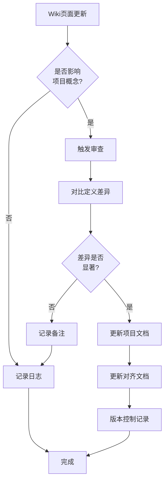

# Wiki概念对齐验证机制

本文档定义Wiki概念对齐的验证流程、检查清单和质量保证机制，确保项目概念与Wiki国际标准保持一致。

---

## 验证流程

### 1. 定期审查机制

#### 审查周期

- **季度审查**：每季度检查Wiki页面更新情况
- **年度审查**：每年进行一次全面的概念对齐审查
- **触发审查**：当Wiki概念定义发生重大变化时立即审查

#### 审查内容

1. 对比项目定义与Wiki定义的一致性
2. 检查Wiki链接的可访问性
3. 验证术语翻译的准确性
4. 更新过时内容

### 2. 变更追踪流程



### 3. 验证执行步骤

#### 步骤1：概念定义一致性检查

- [ ] 获取Wiki最新定义
- [ ] 对比项目当前定义
- [ ] 标记差异点
- [ ] 评估影响范围

#### 步骤2：术语翻译准确性检查

- [ ] 核对中英文术语对照
- [ ] 验证专业术语使用
- [ ] 检查术语一致性
- [ ] 更新术语表

#### 步骤3：链接有效性检查

- [ ] 验证所有Wiki链接可访问
- [ ] 检查链接指向正确页面
- [ ] 更新失效链接
- [ ] 记录链接变更

#### 步骤4：内容时效性检查

- [ ] 检查定义是否过时
- [ ] 验证引用文献时效
- [ ] 更新过时内容
- [ ] 添加更新日期标记

---

## 验证检查清单

### 概念定义一致性检查清单

| 检查项 | 检查标准 | 检查方法 | 责任方 |
|--------|----------|----------|--------|
| 定义准确性 | 项目定义与Wiki定义无本质冲突 | 逐条对比定义 | 内容团队 |
| 概念范围 | 概念覆盖范围一致 | 检查概念边界 | 内容团队 |
| 形式化表述 | 数学符号和公式一致 | 公式对比 | 技术团队 |
| 示例一致性 | 示例与定义一致 | 示例验证 | 内容团队 |

### 术语翻译准确性检查清单

| 检查项 | 检查标准 | 检查方法 | 责任方 |
|--------|----------|----------|--------|
| 术语准确性 | 翻译符合学术规范 | 对照学术文献 | 翻译团队 |
| 术语一致性 | 全文术语使用统一 | 全文检索检查 | 编辑团队 |
| 新术语处理 | 新术语有明确定义 | 术语表检查 | 内容团队 |
| 多语言对照 | 多语言术语对照正确 | 交叉验证 | 国际化团队 |

### 链接可访问性检查清单

| 检查项 | 检查标准 | 检查方法 | 责任方 |
|--------|----------|----------|--------|
| 链接有效性 | 所有链接可正常访问 | 自动化链接检查 | 技术团队 |
| 链接准确性 | 链接指向正确概念页面 | 人工抽查 | 内容团队 |
| 锚点有效性 | 页面内锚点有效 | 自动化检查 | 技术团队 |
| 重定向处理 | 正确处理页面重定向 | 链接追踪 | 技术团队 |

### 内容时效性检查清单

| 检查项 | 检查标准 | 检查方法 | 责任方 |
|--------|----------|----------|--------|
| 定义时效 | 定义反映最新学术共识 | 文献对比 | 学术团队 |
| 引用时效 | 引用文献不过时 | 日期检查 | 编辑团队 |
| 技术更新 | 技术概念反映当前状态 | 技术审查 | 技术团队 |
| 更新时间 | 文档有明确的更新时间 | 元数据检查 | 编辑团队 |

---

## 质量保证机制

### 1. 三级审核制度

#### 第一级：内容创作者自审

- 检查定义准确性
- 验证链接有效性
- 核对术语翻译

#### 第二级：同行评审

- 领域专家评审定义
- 语言专家审校翻译
- 技术专家验证公式

#### 第三级：质量管理员终审

- 综合评估对齐质量
- 确认更新必要性
- 批准文档发布

### 2. 自动化工具支持

#### 链接检查工具

```bash
# Wiki链接有效性检查脚本示例
python scripts/check_wiki_links.py \
  --input docs/11-国际化/02-Wiki国际概念对齐.md \
  --output report/link_check_report.json
```

## 术语一致性检查
### 术语一致性检查
#### 术语一致性检查

```bash
# 术语一致性检查脚本
python scripts/check_terminology.py \
  --concept-alignment docs/11-国际化/02-Wiki国际概念对齐.md \
  --terminology docs/11-国际化/01-中英术语对照表.md \
  --output report/terminology_check_report.md
```

## 定义差异检测
### 定义差异检测
#### 定义差异检测

```bash
# 定义差异检测脚本
python scripts/check_definition_diff.py \
  --wiki-url https://en.wikipedia.org/wiki/Concept \
  --project-doc docs/xx-xx/xx-xx.md \
  --output report/definition_diff.md
```

## 3. 质量指标
### 3. 质量指标

#### 对齐度指标

- **高对齐**：概念定义与Wiki一致，无显著差异
- **中对齐**：概念定义基本一致，存在细微差异
- **低对齐**：概念定义存在显著差异，需要改进

#### 质量评分标准

| 指标 | 权重 | 评分标准 |
|------|------|----------|
| 定义准确性 | 40% | 与Wiki定义一致程度 |
| 术语准确性 | 25% | 术语翻译和使用的准确性 |
| 链接有效性 | 15% | Wiki链接的可访问性 |
| 内容时效性 | 15% | 内容更新及时程度 |
| 格式规范性 | 5% | 文档格式符合规范 |

---

## 问题处理流程

### 问题分类

#### 严重问题

- 概念定义与Wiki存在本质冲突
- 大量链接失效
- 术语翻译错误

**处理方式**：立即修正，暂停相关文档发布

#### 中等问题

- 概念定义存在细微差异
- 个别链接失效
- 术语使用不一致

**处理方式**：列入下次更新计划，限期修正

#### 轻微问题

- 格式问题
- 表述不够精确
- 示例需要更新

**处理方式**：记录备案，批量处理

### 问题追踪

| 问题ID | 问题描述 | 严重程度 | 状态 | 负责人 | 截止日期 |
|--------|----------|----------|------|--------|----------|
| WA-001 | 示例问题描述 | 中 | 待处理 | 负责人 | 2026-05-01 |

---

## 文档更新规范

### 版本控制

#### 版本号格式

`主版本.次版本.修订号`

#### 版本更新规则

- **主版本**：概念框架重大调整
- **次版本**：新增概念对齐或删除概念
- **修订号**：修正错误或更新定义

### 更新日志

每次更新必须记录：

- 更新日期
- 更新内容摘要
- 更新原因
- 审核人
- 影响范围

### 示例更新记录

```markdown
## 更新记录

### v1.1.0 (2026-04-08)
- 新增100个概念对齐（阶段4）
- 更新对齐统计
- 补充计算理论、类型理论、形式化方法概念
- 审核人：国际化工作组

### v1.0.1 (2026-01-15)
- 修正5个概念的Wiki链接
- 更新3个概念的定义表述
- 审核人：内容团队
```

---

## 责任分工

| 角色 | 职责 | 工作内容 |
|------|------|----------|
| 国际化工作组 | 整体协调 | 制定标准、协调资源、质量把关 |
| 内容团队 | 内容创作 | 概念定义撰写、差异分析 |
| 翻译团队 | 术语翻译 | 术语对照、翻译审校 |
| 技术团队 | 工具支持 | 自动化检查工具开发维护 |
| 学术顾问 | 学术审核 | 定义准确性审核、学术建议 |

---

## 附录

### A. Wiki概念对齐模板

```markdown
### 序号. 英文概念名 / 中文概念名

**Wiki链接**: https://en.wikipedia.org/wiki/Concept_Name

**项目文档**: docs/xx-xx/xx-xx.md

**定义对比**:
| 来源 | 定义 |
|------|------|
| Wiki | [Wiki定义摘录] |
| 项目 | [项目定义] |

**对齐度**: [高/中/低]

**差异分析**:
- [差异点1]
- [差异点2]

**建议改进**:
- [改进建议]
```

### B. 术语对照检查表

```markdown
| 英文术语 | 项目翻译 | Wiki翻译 | 学术标准 | 一致性 |
|----------|----------|----------|----------|--------|
| Term | 术语 | 术语 | 术语 | ✓ |
```

### C. 质量检查报告模板

```markdown
# Wiki概念对齐质量检查报告

**检查日期**: YYYY-MM-DD
**检查范围**: [范围描述]
**检查人员**: [检查人]

## 检查结果摘要

- 检查概念总数: XXX
- 高对齐概念: XXX (XX%)
- 中对齐概念: XXX (XX%)
- 低对齐概念: XXX (XX%)
- 发现问题数: XXX

## 详细问题列表

[问题详情]

## 改进建议

[改进建议]

## 下一步行动

[行动计划]
```

---

*文档生成时间: 2026-04-08*
*版本: 1.0*

---

## 参考文献

- 待补充

---

## 知识导航

- [返回目录](README.md)

## 学习目标

- 理解Wiki概念对齐验证机制的核心概念
- 掌握Wiki概念对齐验证机制的形式化表示
