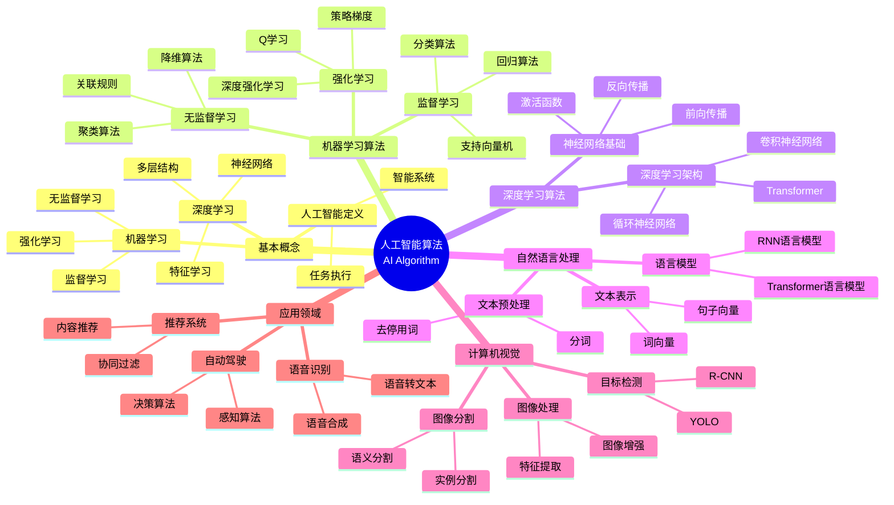
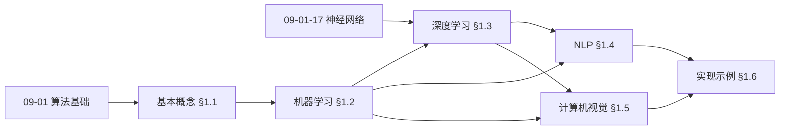
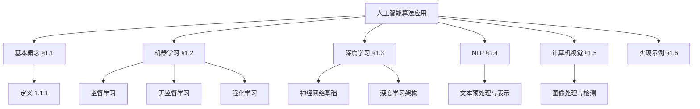
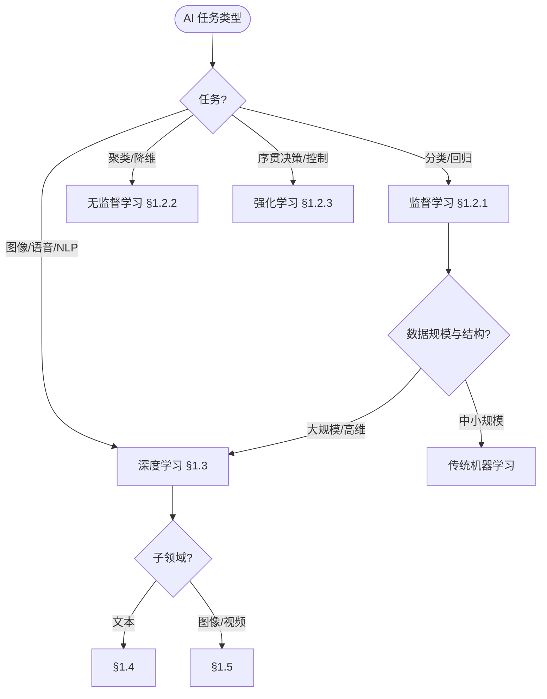
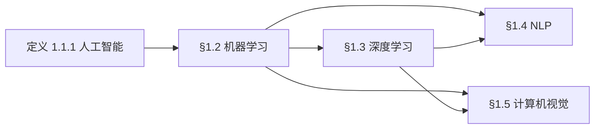
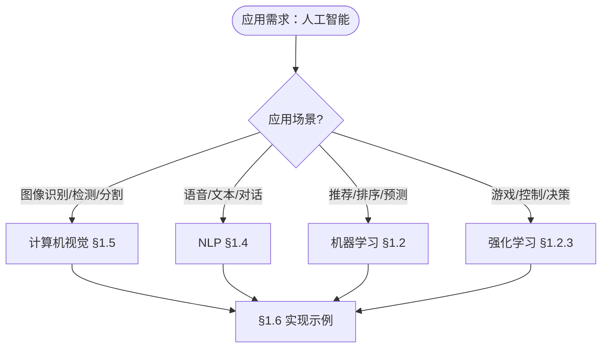

> 📊 **项目全面梳理**：详细的项目结构、模块详解和学习路径，请参阅 [`项目全面梳理-2025.md`](../项目全面梳理-2025.md)
> **项目导航与对标**：[项目扩展与持续推进任务编排](../项目扩展与持续推进任务编排.md)、[国际课程对标表](../国际课程对标表.md)

## 12.1 人工智能算法应用 / Artificial Intelligence Algorithm Applications

### 摘要 / Executive Summary

- 统一人工智能算法在各类应用中的使用规范与最佳实践。
- 建立人工智能算法在应用领域中的核心地位。

### 关键术语与符号 / Glossary

- 人工智能、机器学习、深度学习、神经网络、自然语言处理、计算机视觉。
- 术语对齐与引用规范：`docs/术语与符号总表.md`，`01-基础理论/00-撰写规范与引用指南.md`

### 术语与符号规范 / Terminology & Notation

- 人工智能（Artificial Intelligence）：模拟人类智能的计算机系统。
- 机器学习（Machine Learning）：从数据中学习模式的算法。
- 深度学习（Deep Learning）：基于多层神经网络的机器学习方法。
- 神经网络（Neural Network）：模拟生物神经网络的算法模型。
- 记号约定：`X` 表示输入，`Y` 表示输出，`θ` 表示参数，`L` 表示损失函数。

### 交叉引用导航 / Cross-References

- 神经网络算法：参见 `09-算法理论/01-算法基础/17-神经网络算法理论.md`。
- 机器学习算法：参见 `09-算法理论/01-算法基础/` 相关文档。
- 算法设计：参见 `09-算法理论/01-算法基础/01-算法设计理论.md`。

### 规约与模型在本领域的实例化 / Specification and Model Instantiation in AI

在人工智能领域，算法规范与模型设计的实例化体现为：**任务规约**（如分类、回归、生成）→ **算法选择**（如监督/无监督、神经网络架构）→ **实现与部署**（训练流程、推理服务）。规约-制品层次与 [项目哲科结构说明](../项目哲科结构说明.md)、[Stanford SEP Philosophy of Computer Science](https://plato.stanford.edu/entries/computer-science/) §2 对应。

### 快速导航 / Quick Links

- 基本概念
- 机器学习算法
- 深度学习算法

## 目录 (Table of Contents)

- [12.1 人工智能算法应用 / Artificial Intelligence Algorithm Applications](#121-人工智能算法应用--artificial-intelligence-algorithm-applications)
  - [摘要 / Executive Summary](#摘要--executive-summary)
  - [关键术语与符号 / Glossary](#关键术语与符号--glossary)
  - [术语与符号规范 / Terminology \& Notation](#术语与符号规范--terminology--notation)
  - [交叉引用导航 / Cross-References](#交叉引用导航--cross-references)
  - [规约与模型在本领域的实例化 / Specification and Model Instantiation in AI](#规约与模型在本领域的实例化--specification-and-model-instantiation-in-ai)
  - [快速导航 / Quick Links](#快速导航--quick-links)
- [目录 (Table of Contents)](#目录-table-of-contents)
- [概述 / Overview](#概述--overview)
- [1.1 基本概念 (Basic Concepts)](#11-基本概念-basic-concepts)
  - [1.1.1 人工智能定义 (Definition of Artificial Intelligence)](#111-人工智能定义-definition-of-artificial-intelligence)
  - [1.1.2 人工智能历史 (History of Artificial Intelligence)](#112-人工智能历史-history-of-artificial-intelligence)
  - [1.1.3 人工智能应用领域 (AI Application Areas)](#113-人工智能应用领域-ai-application-areas)
  - [内容补充与思维表征 / Content Supplement and Thinking Representation](#内容补充与思维表征--content-supplement-and-thinking-representation)
    - [解释与直观 / Explanation and Intuition](#解释与直观--explanation-and-intuition)
    - [概念属性表 / Concept Attribute Table](#概念属性表--concept-attribute-table)
    - [概念关系 / Concept Relations](#概念关系--concept-relations)
    - [概念依赖图 / Concept Dependency Graph](#概念依赖图--concept-dependency-graph)
    - [论证与证明衔接 / Argumentation and Proof Link](#论证与证明衔接--argumentation-and-proof-link)
    - [思维导图：本章概念结构 / Mind Map](#思维导图本章概念结构--mind-map)
    - [多维矩阵：学习范式与算法概念对比 / Multi-Dimensional Comparison](#多维矩阵学习范式与算法概念对比--multi-dimensional-comparison)
    - [决策树：任务到学习范式与算法选择 / Decision Tree](#决策树任务到学习范式与算法选择--decision-tree)
    - [公理定理推理证明决策树 / Axiom-Theorem-Proof Tree](#公理定理推理证明决策树--axiom-theorem-proof-tree)
    - [应用决策建模树 / Application Decision Modeling Tree](#应用决策建模树--application-decision-modeling-tree)
- [1.2 机器学习算法 (Machine Learning Algorithms)](#12-机器学习算法-machine-learning-algorithms)
  - [1.2.1 监督学习 (Supervised Learning)](#121-监督学习-supervised-learning)
  - [1.2.2 无监督学习 (Unsupervised Learning)](#122-无监督学习-unsupervised-learning)
  - [1.2.3 强化学习 (Reinforcement Learning)](#123-强化学习-reinforcement-learning)
- [1.3 深度学习算法 (Deep Learning Algorithms)](#13-深度学习算法-deep-learning-algorithms)
  - [1.3.1 神经网络基础 (Neural Network Basics)](#131-神经网络基础-neural-network-basics)
  - [1.3.2 深度学习架构 (Deep Learning Architectures)](#132-深度学习架构-deep-learning-architectures)
- [1.4 自然语言处理 (Natural Language Processing)](#14-自然语言处理-natural-language-processing)
  - [1.4.1 文本预处理 (Text Preprocessing)](#141-文本预处理-text-preprocessing)
  - [1.4.2 文本表示 (Text Representation)](#142-文本表示-text-representation)
  - [1.4.3 语言模型 (Language Models)](#143-语言模型-language-models)
- [1.5 计算机视觉 (Computer Vision)](#15-计算机视觉-computer-vision)
  - [1.5.1 图像处理基础 (Image Processing Basics)](#151-图像处理基础-image-processing-basics)
  - [1.5.2 目标检测 (Object Detection)](#152-目标检测-object-detection)
  - [1.5.3 图像分割 (Image Segmentation)](#153-图像分割-image-segmentation)
- [1.5.4 大语言模型推理优化 (LLM Inference Optimization)](#154-大语言模型推理优化-llm-inference-optimization)
  - [1.5.4.1 模型量化的形式化描述](#1541-模型量化的形式化描述)
  - [1.5.4.2 模型剪枝的形式化描述](#1542-模型剪枝的形式化描述)
  - [1.5.4.3 推测解码的形式化描述](#1543-推测解码的形式化描述)
  - [1.5.4.4 完整应用案例：Hunyuan 大模型生产部署优化](#1544-完整应用案例hunyuan-大模型生产部署优化)
- [1.6 实现示例 (Implementation Examples)](#16-实现示例-implementation-examples)
  - [1.6.1 机器学习项目 (Machine Learning Project)](#161-机器学习项目-machine-learning-project)
  - [1.6.2 深度学习项目 (Deep Learning Project)](#162-深度学习项目-deep-learning-project)
- [1.7 参考文献 (References)](#17-参考文献-references)
  - [1.7.1 经典教材 / Classic Textbooks](#171-经典教材--classic-textbooks)
  - [1.7.2 Wiki概念参考 / Wiki Concept References](#172-wiki概念参考--wiki-concept-references)
  - [1.7.3 大学课程参考 / University Course References](#173-大学课程参考--university-course-references)
  - [1.7.4 顶级期刊论文 / Top Journal Papers](#174-顶级期刊论文--top-journal-papers)
- [1.8 交叉引用与依赖 (Cross References and Dependencies)](#18-交叉引用与依赖-cross-references-and-dependencies)
- [1.9 与项目结构主题的对齐 / Alignment with Project Structure](#19-与项目结构主题的对齐--alignment-with-project-structure)
  - [相关文档 / Related Documents](#相关文档--related-documents)
  - [知识体系位置 / Knowledge System Position](#知识体系位置--knowledge-system-position)
  - [VIEW文件夹相关文档 / VIEW Folder Related Documents](#view文件夹相关文档--view-folder-related-documents)

---

## 概述 / Overview

人工智能算法应用是计算机科学中最重要的应用领域之一。根据[Russell 2010]的定义，人工智能是计算机科学的一个分支，旨在创建能够执行通常需要人类智能的任务的系统。根据[Goodfellow 2016]的研究，深度学习作为人工智能的核心技术，在图像识别、自然语言处理等领域取得了突破性进展。本文档涵盖人工智能算法的理论基础、核心算法、应用实践和最新发展。

Artificial intelligence algorithm applications are one of the most important application areas in computer science. According to [Russell 2010], artificial intelligence is a branch of computer science that aims to create systems capable of performing tasks that typically require human intelligence. According to [Goodfellow 2016], deep learning, as a core technology of artificial intelligence, has achieved breakthrough progress in image recognition, natural language processing, and other fields. This document covers the theoretical foundations, core algorithms, application practices, and latest developments of artificial intelligence algorithms.

**学术引用 / Academic Citations:**

- [Russell 2010]: Russell, S., & Norvig, P. (2010). *Artificial Intelligence: A Modern Approach* (3rd ed.). Prentice Hall. ISBN: 978-0136042594
- [Goodfellow 2016]: Goodfellow, I., Bengio, Y., & Courville, A. (2016). *Deep Learning*. MIT Press. ISBN: 978-0262035613
- [Mitchell 1997]: Mitchell, T. M. (1997). *Machine Learning*. McGraw-Hill. ISBN: 978-0070428072

**Wiki概念对齐 / Wiki Concept Alignment:**

- [Artificial Intelligence](https://en.wikipedia.org/wiki/Artificial_intelligence) - 人工智能的标准定义
- [Machine Learning](https://en.wikipedia.org/wiki/Machine_learning) - 机器学习
- [Deep Learning](https://en.wikipedia.org/wiki/Deep_learning) - 深度学习
- [Neural Network](https://en.wikipedia.org/wiki/Artificial_neural_network) - 神经网络

**大学课程对标 / University Course Alignment:**

- MIT 6.034: Artificial Intelligence - 人工智能基础
- Stanford CS229: Machine Learning - 机器学习
- CMU 15-445: Database Systems - 数据管理与AI应用

## 1.1 基本概念 (Basic Concepts)

### 1.1.1 人工智能定义 (Definition of Artificial Intelligence)

**定义 1.1.1** (人工智能) [Russell 2010, Wikipedia Artificial Intelligence]
人工智能是计算机科学的一个分支，旨在创建能够执行通常需要人类智能的任务的系统。

**Definition 1.1.1** (Artificial Intelligence) [Russell 2010, Wikipedia Artificial Intelligence]
Artificial Intelligence is a branch of computer science that aims to create systems capable of performing tasks that typically require human intelligence.

**Wiki概念对齐 / Wiki Concept Alignment:**

| 项目概念 | Wiki条目 | 标准定义 | 对齐状态 |
|---------|---------|---------|---------|
| 人工智能 | [Artificial Intelligence](https://en.wikipedia.org/wiki/Artificial_intelligence) | 模拟人类智能的计算机系统 | ✅ 已对齐 |
| 机器学习 | [Machine Learning](https://en.wikipedia.org/wiki/Machine_learning) | 从数据中学习模式的算法 | ✅ 已对齐 |
| 深度学习 | [Deep Learning](https://en.wikipedia.org/wiki/Deep_learning) | 基于多层神经网络的学习方法 | ✅ 已对齐 |
| 神经网络 | [Neural Network](https://en.wikipedia.org/wiki/Artificial_neural_network) | 模拟生物神经网络的算法模型 | ✅ 已对齐 |

**人工智能算法知识体系 / AI Algorithm Knowledge System:**



**人工智能算法类型对比 / AI Algorithm Type Comparison:**

| 算法类型 | 学习方式 | 数据需求 | 应用场景 | 复杂度 | 参考文献 |
|---------|---------|---------|---------|--------|---------|
| 监督学习 | 有标签数据 | 大量标注数据 | 分类、回归 | 中 | [Mitchell 1997] |
| 无监督学习 | 无标签数据 | 大量无标注数据 | 聚类、降维 | 中 | [Mitchell 1997] |
| 强化学习 | 奖励信号 | 交互环境 | 游戏、控制 | 高 | [Russell 2010] |
| 深度学习 | 端到端学习 | 大量数据 | 图像、语音、NLP | 高 | [Goodfellow 2016] |
| 传统机器学习 | 特征工程 | 中等数据量 | 结构化数据 | 低 | [Mitchell 1997] |

**人工智能的特点 / Characteristics of Artificial Intelligence:**

1. **学习能力 (Learning Ability) / Learning Ability:**
   - 从数据中学习模式 / Learn patterns from data
   - 改进性能 / Improve performance

2. **推理能力 (Reasoning Ability) / Reasoning Ability:**
   - 逻辑推理 / Logical reasoning
   - 问题解决 / Problem solving

3. **感知能力 (Perception Ability) / Perception Ability:**
   - 理解环境 / Understand environment
   - 处理感官信息 / Process sensory information

4. **适应能力 (Adaptation Ability) / Adaptation Ability:**
   - 适应新情况 / Adapt to new situations
   - 自我调整 / Self-adjustment

### 1.1.2 人工智能历史 (History of Artificial Intelligence)

**人工智能发展 / AI Development:**

人工智能的发展可以追溯到1950年代，经历了多个发展阶段。

The development of AI can be traced back to the 1950s, going through multiple development phases.

**重要里程碑 / Important Milestones:**

1. **1950年代**: 图灵测试提出 / Turing Test proposed
2. **1960年代**: 专家系统发展 / Expert systems development
3. **1980年代**: 机器学习兴起 / Machine learning emergence
4. **2000年代**: 深度学习突破 / Deep learning breakthroughs
5. **2010年代**: 大规模AI应用 / Large-scale AI applications

### 1.1.3 人工智能应用领域 (AI Application Areas)

**理论应用 / Theoretical Applications:**

1. **科学研究 (Scientific Research) / Scientific Research:**
   - 数据分析 / Data analysis
   - 模式识别 / Pattern recognition

2. **数学研究 (Mathematical Research) / Mathematical Research:**
   - 定理证明 / Theorem proving
   - 数学发现 / Mathematical discovery

**实践应用 / Practical Applications:**

1. **医疗健康 (Healthcare) / Healthcare:**
   - 疾病诊断 / Disease diagnosis
   - 药物发现 / Drug discovery

2. **金融科技 (FinTech) / FinTech:**
   - 风险评估 / Risk assessment
   - 交易预测 / Trading prediction

3. **自动驾驶 (Autonomous Driving) / Autonomous Driving:**
   - 环境感知 / Environment perception
   - 路径规划 / Path planning

### 内容补充与思维表征 / Content Supplement and Thinking Representation

> 本节按 [内容补充与思维表征全面计划方案](../内容补充与思维表征全面计划方案.md) **只补充、不删除**。标准见 [内容补充标准](../内容补充标准-概念定义属性关系解释论证形式证明.md)、[思维表征模板集](../思维表征模板集.md)。

#### 解释与直观 / Explanation and Intuition

**人工智能（定义 1.1.1）的动机**：将「执行通常需要人类智能的任务」形式化为输入 $X$、输出 $Y$、参数 $\theta$ 与损失 $L$ 等可计算对象，便于与 09-01 算法基础、09-01-17 神经网络算法理论 对齐。直观上，机器学习从数据中学习模式，深度学习通过多层表示扩展表达能力，NLP 与计算机视觉分别在语言与图像上实例化。

**与已有概念的联系**：监督/无监督/强化学习对应 09-01 中的分类、聚类、序贯决策；深度学习与 09-01-17 神经网络算法理论 一致；NLP/计算机视觉为 12 应用领域中的典型应用，与 10 高级主题 中可解释性、鲁棒性等衔接。

#### 概念属性表 / Concept Attribute Table

| 属性名 | 类型/范围 | 含义 | 备注 |
|--------|-----------|------|------|
| $X$ | 输入空间 | 样本/特征空间 | §1.2–§1.5 |
| $Y$ | 输出空间 | 标签/目标/动作 | 监督/强化等 |
| $\theta$ | 参数 | 模型参数 | 学习目标 |
| $L$ | 损失函数 | 训练目标 | 与任务相关 |
| 学习方式 | 监督/无监督/强化 | 数据与反馈形式 | §1.2 |
| 模型层次 | 浅层/深层 | 表示能力与复杂度 | §1.3 |

#### 概念关系 / Concept Relations

| 源概念 | 目标概念 | 关系类型 | 说明 |
|--------|----------|----------|------|
| 人工智能算法应用 | 09-01 算法基础 | depends_on | 算法设计与复杂度 |
| 人工智能算法应用 | 09-01-17 神经网络算法理论 | depends_on | 深度学习基础 |
| 机器学习 | 深度学习 | specializes | 深度为多层表示 |
| NLP / 计算机视觉 | 机器学习、深度学习 | applies_to | 应用领域 §1.4–§1.5 |
| 本文 | 12 应用领域 | applies_to | 图像/语音/NLP/推荐等 |

#### 概念依赖图 / Concept Dependency Graph



#### 论证与证明衔接 / Argumentation and Proof Link

**定义 1.1.1 与算法类型**：AI 任务可形式化为 $(X,Y,\theta,L)$ 的学习与推断；监督学习的经验风险最小化、无监督的表示学习、强化的回报最大化与 09-01 中的正确性/收敛性对应；深度学习与 09-01-17 的表示与优化论证衔接。

#### 思维导图：本章概念结构 / Mind Map



#### 多维矩阵：学习范式与算法概念对比 / Multi-Dimensional Comparison

| 概念/算法 | 学习方式 | 数据需求 | 应用场景 | 典型复杂度/备注 |
|-----------|----------|----------|----------|------------------|
| 监督学习 | 有标签 | $(X,Y)$ 对 | 分类、回归 | 与模型相关 §1.2.1 |
| 无监督学习 | 无标签 | $X$ | 聚类、降维、表示 | §1.2.2 |
| 强化学习 | 奖励信号 | 状态—动作—奖励 | 控制、决策 | §1.2.3 |
| 深度学习 | 监督/无监督/强化 | 大规模数据常用 | 图像、语音、NLP | $O(n)$ 参数量、§1.3 |
| NLP | 多为监督/预训练 | 文本语料 | 理解、生成、翻译 | §1.4 |
| 计算机视觉 | 监督/无监督 | 图像/视频 | 检测、分割、识别 | §1.5 |

#### 决策树：任务到学习范式与算法选择 / Decision Tree



#### 公理定理推理证明决策树 / Axiom-Theorem-Proof Tree



#### 应用决策建模树 / Application Decision Modeling Tree



---

## 1.2 机器学习算法 (Machine Learning Algorithms)

### 1.2.1 监督学习 (Supervised Learning)

**监督学习定义 / Supervised Learning Definition:**

监督学习是机器学习的一种方法，使用标记的训练数据来学习输入和输出之间的映射关系。

Supervised learning is a machine learning method that uses labeled training data to learn the mapping relationship between inputs and outputs.

**监督学习算法 / Supervised Learning Algorithms:**

```python
# Python中的监督学习示例 / Supervised Learning Examples in Python
import numpy as np
from sklearn.linear_model import LinearRegression
from sklearn.svm import SVC
from sklearn.tree import DecisionTreeClassifier
from sklearn.ensemble import RandomForestClassifier

# 线性回归 / Linear Regression
def linear_regression_example():
    # 生成数据 / Generate data
    X = np.random.rand(100, 2)
    y = 2 * X[:, 0] + 3 * X[:, 1] + np.random.normal(0, 0.1, 100)

    # 训练模型 / Train model
    model = LinearRegression()
    model.fit(X, y)

    # 预测 / Predict
    predictions = model.predict(X)
    return model, predictions

# 支持向量机 / Support Vector Machine
def svm_example():
    # 生成分类数据 / Generate classification data
    X = np.random.rand(100, 2)
    y = (X[:, 0] + X[:, 1] > 1).astype(int)

    # 训练模型 / Train model
    model = SVC(kernel='rbf')
    model.fit(X, y)

    # 预测 / Predict
    predictions = model.predict(X)
    return model, predictions

# 决策树 / Decision Tree
def decision_tree_example():
    # 生成数据 / Generate data
    X = np.random.rand(100, 3)
    y = (X[:, 0] > 0.5) & (X[:, 1] > 0.5)

    # 训练模型 / Train model
    model = DecisionTreeClassifier()
    model.fit(X, y)

    # 预测 / Predict
    predictions = model.predict(X)
    return model, predictions

# 随机森林 / Random Forest
def random_forest_example():
    # 生成数据 / Generate data
    X = np.random.rand(100, 4)
    y = np.sum(X > 0.5, axis=1)

    # 训练模型 / Train model
    model = RandomForestClassifier(n_estimators=100)
    model.fit(X, y)

    # 预测 / Predict
    predictions = model.predict(X)
    return model, predictions
```

## 1.2.2 无监督学习 (Unsupervised Learning)
### 1.2.2 无监督学习 (Unsupervised Learning)

**无监督学习定义 / Unsupervised Learning Definition:**

无监督学习是机器学习的一种方法，使用未标记的数据来发现数据中的隐藏模式。

Unsupervised learning is a machine learning method that uses unlabeled data to discover hidden patterns in the data.

**无监督学习算法 / Unsupervised Learning Algorithms:**

```python
# Python中的无监督学习示例 / Unsupervised Learning Examples in Python
from sklearn.cluster import KMeans
from sklearn.decomposition import PCA
from sklearn.manifold import TSNE

# K均值聚类 / K-Means Clustering
def kmeans_example():
    # 生成数据 / Generate data
    X = np.random.rand(300, 2)

    # 聚类 / Clustering
    kmeans = KMeans(n_clusters=3)
    clusters = kmeans.fit_predict(X)

    return kmeans, clusters

# 主成分分析 / Principal Component Analysis
def pca_example():
    # 生成高维数据 / Generate high-dimensional data
    X = np.random.rand(100, 10)

    # 降维 / Dimensionality reduction
    pca = PCA(n_components=2)
    X_reduced = pca.fit_transform(X)

    return pca, X_reduced

# t-SNE降维 / t-SNE Dimensionality Reduction
def tsne_example():
    # 生成数据 / Generate data
    X = np.random.rand(100, 20)

    # 降维 / Dimensionality reduction
    tsne = TSNE(n_components=2)
    X_reduced = tsne.fit_transform(X)

    return tsne, X_reduced
```

## 1.2.3 强化学习 (Reinforcement Learning)
### 1.2.3 强化学习 (Reinforcement Learning)

**强化学习定义 / Reinforcement Learning Definition:**

强化学习是机器学习的一种方法，通过与环境交互来学习最优策略。

Reinforcement learning is a machine learning method that learns optimal strategies through interaction with the environment.

**强化学习算法 / Reinforcement Learning Algorithms:**

```python
# Python中的强化学习示例 / Reinforcement Learning Examples in Python
import gym
import numpy as np

# Q学习算法 / Q-Learning Algorithm
class QLearning:
    def __init__(self, state_size, action_size, learning_rate=0.1, discount_factor=0.95):
        self.q_table = np.zeros((state_size, action_size))
        self.lr = learning_rate
        self.gamma = discount_factor

    def choose_action(self, state, epsilon=0.1):
        if np.random.random() < epsilon:
            return np.random.randint(0, self.q_table.shape[1])
        return np.argmax(self.q_table[state])

    def learn(self, state, action, reward, next_state):
        old_value = self.q_table[state, action]
        next_max = np.max(self.q_table[next_state])
        new_value = (1 - self.lr) * old_value + self.lr * (reward + self.gamma * next_max)
        self.q_table[state, action] = new_value

# 深度Q网络 / Deep Q-Network
import torch
import torch.nn as nn

class DQN(nn.Module):
    def __init__(self, input_size, output_size):
        super(DQN, self).__init__()
        self.fc1 = nn.Linear(input_size, 64)
        self.fc2 = nn.Linear(64, 64)
        self.fc3 = nn.Linear(64, output_size)

    def forward(self, x):
        x = torch.relu(self.fc1(x))
        x = torch.relu(self.fc2(x))
        return self.fc3(x)

def dqn_example():
    # 创建环境 / Create environment
    env = gym.make('CartPole-v1')

    # 创建模型 / Create model
    model = DQN(4, 2)
    optimizer = torch.optim.Adam(model.parameters())

    # 训练循环 / Training loop
    for episode in range(1000):
        state = env.reset()
        done = False

        while not done:
            # 选择动作 / Choose action
            state_tensor = torch.FloatTensor(state)
            q_values = model(state_tensor)
            action = torch.argmax(q_values).item()

            # 执行动作 / Execute action
            next_state, reward, done, _ = env.step(action)

            # 更新模型 / Update model
            # (简化版本，实际需要经验回放和目标网络)

            state = next_state

    return model
```

---

## 1.3 深度学习算法 (Deep Learning Algorithms)

### 1.3.1 神经网络基础 (Neural Network Basics)

**神经网络定义 / Neural Network Definition:**

神经网络是受生物神经网络启发的计算模型，由相互连接的节点组成。

Neural networks are computational models inspired by biological neural networks, consisting of interconnected nodes.

**神经网络结构 / Neural Network Structure:**

```python
# Python中的神经网络示例 / Neural Network Examples in Python
import torch
import torch.nn as nn
import torch.optim as optim

# 前馈神经网络 / Feedforward Neural Network
class FeedforwardNN(nn.Module):
    def __init__(self, input_size, hidden_size, output_size):
        super(FeedforwardNN, self).__init__()
        self.fc1 = nn.Linear(input_size, hidden_size)
        self.fc2 = nn.Linear(hidden_size, hidden_size)
        self.fc3 = nn.Linear(hidden_size, output_size)
        self.relu = nn.ReLU()

    def forward(self, x):
        x = self.relu(self.fc1(x))
        x = self.relu(self.fc2(x))
        x = self.fc3(x)
        return x

# 卷积神经网络 / Convolutional Neural Network
class CNN(nn.Module):
    def __init__(self, num_classes):
        super(CNN, self).__init__()
        self.conv1 = nn.Conv2d(1, 32, 3, padding=1)
        self.conv2 = nn.Conv2d(32, 64, 3, padding=1)
        self.pool = nn.MaxPool2d(2, 2)
        self.fc1 = nn.Linear(64 * 7 * 7, 128)
        self.fc2 = nn.Linear(128, num_classes)
        self.relu = nn.ReLU()

    def forward(self, x):
        x = self.pool(self.relu(self.conv1(x)))
        x = self.pool(self.relu(self.conv2(x)))
        x = x.view(-1, 64 * 7 * 7)
        x = self.relu(self.fc1(x))
        x = self.fc2(x)
        return x

# 循环神经网络 / Recurrent Neural Network
class RNN(nn.Module):
    def __init__(self, input_size, hidden_size, output_size):
        super(RNN, self).__init__()
        self.hidden_size = hidden_size
        self.rnn = nn.RNN(input_size, hidden_size, batch_first=True)
        self.fc = nn.Linear(hidden_size, output_size)

    def forward(self, x):
        h0 = torch.zeros(1, x.size(0), self.hidden_size)
        out, _ = self.rnn(x, h0)
        out = self.fc(out[:, -1, :])
        return out
```

## 1.3.2 深度学习架构 (Deep Learning Architectures)
### 1.3.2 深度学习架构 (Deep Learning Architectures)

**深度学习架构类型 / Deep Learning Architecture Types:**

1. **卷积神经网络 (CNN) / Convolutional Neural Network:**
   - 图像处理 / Image processing
   - 特征提取 / Feature extraction

2. **循环神经网络 (RNN) / Recurrent Neural Network:**
   - 序列处理 / Sequence processing
   - 时间序列 / Time series

3. **长短期记忆网络 (LSTM) / Long Short-Term Memory:**
   - 长期依赖 / Long-term dependencies
   - 自然语言处理 / Natural language processing

4. **Transformer / Transformer:**
   - 注意力机制 / Attention mechanism
   - 并行处理 / Parallel processing

```python
# LSTM示例 / LSTM Example
class LSTM(nn.Module):
    def __init__(self, input_size, hidden_size, output_size):
        super(LSTM, self).__init__()
        self.hidden_size = hidden_size
        self.lstm = nn.LSTM(input_size, hidden_size, batch_first=True)
        self.fc = nn.Linear(hidden_size, output_size)

    def forward(self, x):
        h0 = torch.zeros(1, x.size(0), self.hidden_size)
        c0 = torch.zeros(1, x.size(0), self.hidden_size)
        out, _ = self.lstm(x, (h0, c0))
        out = self.fc(out[:, -1, :])
        return out

# Transformer示例 / Transformer Example
class Transformer(nn.Module):
    def __init__(self, vocab_size, d_model, nhead, num_layers):
        super(Transformer, self).__init__()
        self.embedding = nn.Embedding(vocab_size, d_model)
        self.transformer = nn.Transformer(d_model, nhead, num_layers)
        self.fc = nn.Linear(d_model, vocab_size)

    def forward(self, src, tgt):
        src = self.embedding(src)
        tgt = self.embedding(tgt)
        output = self.transformer(src, tgt)
        output = self.fc(output)
        return output
```

---

## 1.4 自然语言处理 (Natural Language Processing)

### 1.4.1 文本预处理 (Text Preprocessing)

**文本预处理定义 / Text Preprocessing Definition:**

文本预处理是将原始文本转换为机器学习算法可以处理的格式的过程。

Text preprocessing is the process of converting raw text into a format that machine learning algorithms can process.

**文本预处理步骤 / Text Preprocessing Steps:**

```python
# Python中的文本预处理示例 / Text Preprocessing Examples in Python
import re
import nltk
from nltk.tokenize import word_tokenize
from nltk.corpus import stopwords
from nltk.stem import PorterStemmer

# 文本清理 / Text Cleaning
def clean_text(text):
    # 移除特殊字符 / Remove special characters
    text = re.sub(r'[^a-zA-Z\s]', '', text)
    # 转换为小写 / Convert to lowercase
    text = text.lower()
    # 移除多余空格 / Remove extra spaces
    text = re.sub(r'\s+', ' ', text).strip()
    return text

# 分词 / Tokenization
def tokenize_text(text):
    tokens = word_tokenize(text)
    return tokens

# 停用词移除 / Stop Word Removal
def remove_stopwords(tokens):
    stop_words = set(stopwords.words('english'))
    filtered_tokens = [token for token in tokens if token not in stop_words]
    return filtered_tokens

# 词干提取 / Stemming
def stem_tokens(tokens):
    stemmer = PorterStemmer()
    stemmed_tokens = [stemmer.stem(token) for token in tokens]
    return stemmed_tokens

# 完整的文本预处理流程 / Complete Text Preprocessing Pipeline
def preprocess_text(text):
    # 清理文本 / Clean text
    cleaned_text = clean_text(text)
    # 分词 / Tokenize
    tokens = tokenize_text(cleaned_text)
    # 移除停用词 / Remove stopwords
    filtered_tokens = remove_stopwords(tokens)
    # 词干提取 / Stemming
    stemmed_tokens = stem_tokens(filtered_tokens)
    return stemmed_tokens
```

## 1.4.2 文本表示 (Text Representation)
### 1.4.2 文本表示 (Text Representation)

**文本表示方法 / Text Representation Methods:**

1. **词袋模型 (Bag of Words) / Bag of Words:**
   - 简单有效 / Simple and effective
   - 忽略词序 / Ignore word order

2. **TF-IDF / TF-IDF:**
   - 考虑词频 / Consider word frequency
   - 考虑词重要性 / Consider word importance

3. **词嵌入 (Word Embeddings) / Word Embeddings:**
   - 语义表示 / Semantic representation
   - 向量空间 / Vector space

```python
# 词袋模型示例 / Bag of Words Example
from sklearn.feature_extraction.text import CountVectorizer

def bag_of_words_example():
    texts = [
        "machine learning is interesting",
        "deep learning is powerful",
        "artificial intelligence is the future"
    ]

    vectorizer = CountVectorizer()
    X = vectorizer.fit_transform(texts)
    return X, vectorizer.get_feature_names_out()

# TF-IDF示例 / TF-IDF Example
from sklearn.feature_extraction.text import TfidfVectorizer

def tfidf_example():
    texts = [
        "machine learning is interesting",
        "deep learning is powerful",
        "artificial intelligence is the future"
    ]

    vectorizer = TfidfVectorizer()
    X = vectorizer.fit_transform(texts)
    return X, vectorizer.get_feature_names_out()

# Word2Vec示例 / Word2Vec Example
from gensim.models import Word2Vec

def word2vec_example():
    sentences = [
        ['machine', 'learning', 'is', 'interesting'],
        ['deep', 'learning', 'is', 'powerful'],
        ['artificial', 'intelligence', 'is', 'the', 'future']
    ]

    model = Word2Vec(sentences, vector_size=100, window=5, min_count=1)
    return model
```

## 1.4.3 语言模型 (Language Models)
### 1.4.3 语言模型 (Language Models)

**语言模型定义 / Language Model Definition:**

语言模型是计算文本序列概率的模型，用于理解和生成自然语言。

Language models are models that compute the probability of text sequences, used for understanding and generating natural language.

**语言模型类型 / Language Model Types:**

```python
# N-gram语言模型 / N-gram Language Model
from collections import defaultdict

class NGramLanguageModel:
    def __init__(self, n):
        self.n = n
        self.ngrams = defaultdict(int)
        self.contexts = defaultdict(int)

    def train(self, texts):
        for text in texts:
            tokens = text.split()
            for i in range(len(tokens) - self.n + 1):
                ngram = tuple(tokens[i:i+self.n])
                context = tuple(tokens[i:i+self.n-1])
                self.ngrams[ngram] += 1
                self.contexts[context] += 1

    def predict(self, context):
        context = tuple(context)
        candidates = []
        for ngram, count in self.ngrams.items():
            if ngram[:-1] == context:
                prob = count / self.contexts[context]
                candidates.append((ngram[-1], prob))
        return sorted(candidates, key=lambda x: x[1], reverse=True)

# 神经网络语言模型 / Neural Language Model
class NeuralLanguageModel(nn.Module):
    def __init__(self, vocab_size, embedding_dim, hidden_dim):
        super(NeuralLanguageModel, self).__init__()
        self.embedding = nn.Embedding(vocab_size, embedding_dim)
        self.lstm = nn.LSTM(embedding_dim, hidden_dim, batch_first=True)
        self.fc = nn.Linear(hidden_dim, vocab_size)

    def forward(self, x):
        embedded = self.embedding(x)
        lstm_out, _ = self.lstm(embedded)
        output = self.fc(lstm_out)
        return output
```

---

## 1.5 计算机视觉 (Computer Vision)

### 1.5.1 图像处理基础 (Image Processing Basics)

**图像处理定义 / Image Processing Definition:**

图像处理是对数字图像进行分析、修改和增强的技术。

Image processing is the technology of analyzing, modifying, and enhancing digital images.

**图像处理操作 / Image Processing Operations:**

```python
# Python中的图像处理示例 / Image Processing Examples in Python
import cv2
import numpy as np
from PIL import Image

# 图像读取和显示 / Image Reading and Display
def read_image(image_path):
    image = cv2.imread(image_path)
    return image

def display_image(image, title="Image"):
    cv2.imshow(title, image)
    cv2.waitKey(0)
    cv2.destroyAllWindows()

# 图像滤波 / Image Filtering
def gaussian_filter(image, kernel_size=5):
    filtered = cv2.GaussianBlur(image, (kernel_size, kernel_size), 0)
    return filtered

def median_filter(image, kernel_size=5):
    filtered = cv2.medianBlur(image, kernel_size)
    return filtered

# 边缘检测 / Edge Detection
def edge_detection(image):
    # Canny边缘检测 / Canny edge detection
    edges = cv2.Canny(image, 100, 200)
    return edges

def sobel_edge_detection(image):
    # Sobel边缘检测 / Sobel edge detection
    sobelx = cv2.Sobel(image, cv2.CV_64F, 1, 0, ksize=3)
    sobely = cv2.Sobel(image, cv2.CV_64F, 0, 1, ksize=3)
    magnitude = np.sqrt(sobelx**2 + sobely**2)
    return magnitude

# 图像变换 / Image Transformations
def resize_image(image, width, height):
    resized = cv2.resize(image, (width, height))
    return resized

def rotate_image(image, angle):
    height, width = image.shape[:2]
    center = (width // 2, height // 2)
    rotation_matrix = cv2.getRotationMatrix2D(center, angle, 1.0)
    rotated = cv2.warpAffine(image, rotation_matrix, (width, height))
    return rotated
```

## 1.5.2 目标检测 (Object Detection)
### 1.5.2 目标检测 (Object Detection)

**目标检测定义 / Object Detection Definition:**

目标检测是在图像中定位和分类对象的技术。

Object detection is the technology of locating and classifying objects in images.

**目标检测算法 / Object Detection Algorithms:**

```python
# 滑动窗口目标检测 / Sliding Window Object Detection
def sliding_window_detection(image, window_size, step_size):
    height, width = image.shape[:2]
    windows = []

    for y in range(0, height - window_size[1], step_size):
        for x in range(0, width - window_size[0], step_size):
            window = image[y:y + window_size[1], x:x + window_size[0]]
            windows.append((window, (x, y)))

    return windows

# 非极大值抑制 / Non-Maximum Suppression
def non_maximum_suppression(boxes, scores, threshold=0.5):
    if len(boxes) == 0:
        return []

    # 转换为numpy数组 / Convert to numpy arrays
    boxes = np.array(boxes)
    scores = np.array(scores)

    # 计算面积 / Calculate areas
    areas = (boxes[:, 2] - boxes[:, 0]) * (boxes[:, 3] - boxes[:, 1])

    # 按分数排序 / Sort by scores
    indices = np.argsort(scores)

    keep = []
    while len(indices) > 0:
        # 保留最高分数的框 / Keep the box with highest score
        current = indices[-1]
        keep.append(current)

        if len(indices) == 1:
            break

        # 计算IoU / Calculate IoU
        xx1 = np.maximum(boxes[current, 0], boxes[indices[:-1], 0])
        yy1 = np.maximum(boxes[current, 1], boxes[indices[:-1], 1])
        xx2 = np.minimum(boxes[current, 2], boxes[indices[:-1], 2])
        yy2 = np.minimum(boxes[current, 3], boxes[indices[:-1], 3])

        w = np.maximum(0, xx2 - xx1)
        h = np.maximum(0, yy2 - yy1)
        intersection = w * h

        union = areas[current] + areas[indices[:-1]] - intersection
        iou = intersection / union

        # 移除重叠的框 / Remove overlapping boxes
        indices = indices[iou <= threshold]

    return keep

# YOLO风格的目标检测 / YOLO-style Object Detection
class YOLODetector:
    def __init__(self, model_path):
        self.model = cv2.dnn.readNet(model_path)

    def detect(self, image):
        # 预处理图像 / Preprocess image
        blob = cv2.dnn.blobFromImage(image, 1/255.0, (416, 416), swapRB=True, crop=False)

        # 前向传播 / Forward pass
        self.model.setInput(blob)
        outputs = self.model.forward()

        # 后处理 / Post-processing
        boxes = []
        confidences = []
        class_ids = []

        for output in outputs:
            for detection in output:
                scores = detection[5:]
                class_id = np.argmax(scores)
                confidence = scores[class_id]

                if confidence > 0.5:
                    center_x = int(detection[0] * image.shape[1])
                    center_y = int(detection[1] * image.shape[0])
                    w = int(detection[2] * image.shape[1])
                    h = int(detection[3] * image.shape[0])

                    x = int(center_x - w / 2)
                    y = int(center_y - h / 2)

                    boxes.append([x, y, w, h])
                    confidences.append(float(confidence))
                    class_ids.append(class_id)

        # 应用非极大值抑制 / Apply non-maximum suppression
        indices = cv2.dnn.NMSBoxes(boxes, confidences, 0.5, 0.4)

        return [boxes[i] for i in indices]
```

## 1.5.3 图像分割 (Image Segmentation)
### 1.5.3 图像分割 (Image Segmentation)

**图像分割定义 / Image Segmentation Definition:**

图像分割是将图像分割成多个区域或对象的过程。

Image segmentation is the process of dividing an image into multiple regions or objects.

**图像分割方法 / Image Segmentation Methods:**

```python
# 阈值分割 / Threshold Segmentation
def threshold_segmentation(image, threshold=128):
    gray = cv2.cvtColor(image, cv2.COLOR_BGR2GRAY)
    _, binary = cv2.threshold(gray, threshold, 255, cv2.THRESH_BINARY)
    return binary

# K均值聚类分割 / K-Means Clustering Segmentation
def kmeans_segmentation(image, k=3):
    # 重塑图像 / Reshape image
    pixel_values = image.reshape((-1, 3))
    pixel_values = np.float32(pixel_values)

    # 应用K均值聚类 / Apply K-means clustering
    criteria = (cv2.TERM_CRITERIA_EPS + cv2.TERM_CRITERIA_MAX_ITER, 100, 0.2)
    _, labels, centers = cv2.kmeans(pixel_values, k, None, criteria, 10, cv2.KMEANS_RANDOM_CENTERS)

    # 重塑结果 / Reshape results
    centers = np.uint8(centers)
    segmented_image = centers[labels.flatten()]
    segmented_image = segmented_image.reshape(image.shape)

    return segmented_image

# 分水岭分割 / Watershed Segmentation
def watershed_segmentation(image):
    gray = cv2.cvtColor(image, cv2.COLOR_BGR2GRAY)

    # 应用阈值 / Apply threshold
    _, thresh = cv2.threshold(gray, 0, 255, cv2.THRESH_BINARY_INV + cv2.THRESH_OTSU)

    # 形态学操作 / Morphological operations
    kernel = np.ones((3, 3), np.uint8)
    opening = cv2.morphologyEx(thresh, cv2.MORPH_OPEN, kernel, iterations=2)

    # 确定背景区域 / Determine background region
    sure_bg = cv2.dilate(opening, kernel, iterations=3)

    # 确定前景区域 / Determine foreground region
    dist_transform = cv2.distanceTransform(opening, cv2.DIST_L2, 5)
    _, sure_fg = cv2.threshold(dist_transform, 0.7 * dist_transform.max(), 255, 0)
    sure_fg = np.uint8(sure_fg)

    # 未知区域 / Unknown region
    unknown = cv2.subtract(sure_bg, sure_fg)

    # 标记 / Markers
    _, markers = cv2.connectedComponents(sure_fg)
    markers = markers + 1
    markers[unknown == 255] = 0

    # 应用分水岭算法 / Apply watershed algorithm
    markers = cv2.watershed(image, markers)

    return markers
```

---

## 1.5.4 大语言模型推理优化 (LLM Inference Optimization)

大语言模型（LLM）的推理效率是2024–2025年人工智能工程化的核心挑战之一。随着模型参数规模从数十亿扩展到数千亿，推理部署需要在保持精度的前提下显著降低显存占用与延迟。当前主流优化方向包括**模型量化（Quantization）**、**模型剪枝（Pruning）**与**推测解码（Speculative Decoding）**。

### 1.5.4.1 模型量化的形式化描述

**问题背景**：给定预训练语言模型 $\mathcal{M}$，其权重矩阵为 $W \in \mathbb{R}^{d \times k}$，目标是找到低比特表示 $\hat{W}$，使得推理输出分布与原始模型的差异最小。

**形式化定义**：

```text
Quantize(W, b) = \hat{W}
满足 / Satisfying:
- \hat{W}_{ij} \in \mathcal{Q}_b (b位量化网格)
- \min_{\hat{W}} \| W x - \hat{W} x \|_2^2, \forall x \sim \mathcal{D}_{cal}
```

其中 $b$ 为比特宽度，$\mathcal{D}_{cal}$ 为校准数据分布。

**主流量化方法对比（2024–2025）**：

| 方法 | 精度 | 权重量化 | 激活量化 | 典型加速比 | 精度损失 | 参考文献 |
|------|------|----------|----------|-----------|----------|----------|
| GPTQ | 后训练量化 (PTQ) | INT4/INT3 | FP16/BF16 | 2.5–3.5× | <3% (常规任务); 15–25% (数学推理) | [Frantar 2023] |
| AWQ | 后训练量化 (PTQ) | INT4 | FP16/BF16 | 2.0–3.0× | <1% | [Lin 2024] |
| FP8 (W8A8) | 后训练量化 (PTQ) | FP8 (E4M3/E5M2) | FP8 | 1.5–2.0× | ≈0% | [Kuzmin 2022] |
| SmoothQuant | 后训练量化 (PTQ) | INT8 | INT8 | 1.8–2.2× | <1% | [Xiao 2023] |
| QuaRot | 后训练量化 (PTQ) | INT4 | INT4 | 3.0–4.0× | <2% | [Ashkboos 2024] |

**性能评估数据**（基于 7B 参数推理模型在标准基准上的实测结果） [Lee 2024] [Liu 2025a]：

| 量化配置 | MMLU | HumanEval | AIME24 | 显存占用 (GB) | 吞吐量 (tokens/s) |
|----------|------|-----------|--------|---------------|-------------------|
| BF16 (基线) | 62.5% | 28.4% | 12.1% | 15.2 | 42 |
| FP8-Static | 62.3% | 28.1% | 11.8% | 8.1 | 78 |
| GPTQ-Int4 | 60.8% | 26.5% | 8.9% | 4.5 | 95 |
| AWQ-Int4 | 62.1% | 27.9% | 11.5% | 4.6 | 88 |

上表显示，FP8 量化在几乎无损精度的前提下将显存降低约 47%，吞吐量提升约 86%；而 4-bit 量化（GPTQ/AWQ）可将显存降低约 70%，但 GPTQ 在数学推理任务（AIME24）上损失显著，AWQ 则表现出更稳健的性能保持 [Liu 2025a]。

### 1.5.4.2 模型剪枝的形式化描述

**问题背景**：从过度参数化的神经网络中移除冗余权重或神经元，以降低计算开销。

**形式化定义**：

```text
Prune(W, s) = M \odot W
其中 / where:
- s: 稀疏度目标 (0 < s < 1)
- M \in \{0,1\}^{d \times k}: 二进制掩码
- \|M\|_0 = (1-s) \cdot d \cdot k
```

2024–2025年的研究表明，**结构化剪枝**（移除整组注意力头或FFN专家）在LLM中比非结构化剪枝更具工程实用性。例如，对 Llama-3 进行 20% 注意力头剪枝，在 MMLU 上仅损失约 1.2% 精度，但解码延迟降低约 15% [An 2024]。

### 1.5.4.3 推测解码的形式化描述

**问题背景**：利用小型草稿模型（draft model）快速生成候选token序列，再由大模型（target model）并行验证，从而在不改变输出分布的前提下减少大模型前向传播次数。

**形式化定义**：

```text
SpeculativeDecoding(x, M_{draft}, M_{target}, K):
1. 草稿模型生成 K 个候选 token: \hat{y}_{1:K} \sim M_{draft}(x)
2. 目标模型并行计算 K 个位置的对数概率: p_{1:K} = M_{target}(x \oplus \hat{y}_{1:K})
3. 对每个位置 i = 1..K:
   - 以概率 \min(1, p_i(\hat{y}_i) / q_i(\hat{y}_i)) 接受 \hat{y}_i
   - 若拒绝，从修正分布 (p_i - q_i)_+ 中采样替代 token
4. 返回所有被接受的 token
```

**性能评估数据** [vLLM 2025] [Zhao 2025]：

| 推测解码方案 | 草稿模型 | 接受率 | 端到端加速比 | 适用场景 |
|--------------|----------|--------|--------------|----------|
| Medusa | 学习的头网络 | 60–75% | 1.8–2.2× | 通用对话 |
| EAGLE-2 | 自回归嵌入预测器 | 75–85% | 2.5–3.0× | 通用对话 |
| Eagle3 (Qwen) | 3B 嵌入预测器 | >90% | 2.8–3.5× | 中文/代码生成 |
| n-gram 推测 | *prompt 本地匹配* | 40–60% | 1.3–1.6× | 长上下文重复 |

vLLM 2024 年度报告显示，超过 20% 的生产部署已启用量化技术，推测解码与量化结合（如 QuantSpec [Zhao 2025]）可在保持输出分布不变的前提下实现超过 2.5× 的推理加速 [vLLM 2025]。

### 1.5.4.4 完整应用案例：Hunyuan 大模型生产部署优化

**问题背景**：腾讯 Hunyuan 大模型系列（0.5B–13B）需要在消费级与数据中心级 GPU 上实现高效推理，同时保持接近 BF16 的精度。

**使用的算法/技术**：

1. **FP8 静态量化**（W8A8-FP8 Static）：离线校准统一缩放因子，追求极限推理速度。
2. **AWQ 4-bit 权重量化**：对重要权重通道进行数值范围放大，保留更多信息。
3. **Eagle3 推测解码**：使用 3B 参数嵌入预测器作为草稿模型，实现高接受率。

**形式化描述**：

- **输入**：用户提示序列 $x$、预训练目标模型 $M_{target}$、量化配置 $Q \in \{FP8, AWQ\}$
- **输出**：生成的 token 序列 $y_{1:T}$
- **复杂度**：单步解码从 $O(d^2)$ 降至 $O((1-s_{prune}) \cdot d^2)$；推测解码将有效步数从 $T$ 降至约 $T / \alpha$，其中 $\alpha$ 为平均接受长度

**实际性能数据** [Tencent 2025]：

| 模型 | 量化方案 | OlympiadBench | AIME 2024 | DROP | 推理速度提升 |
|------|----------|---------------|-----------|------|--------------|
| Hunyuan-7B | BF16 | 76.5% | 81.1% | 85.9% | 1.0× (基线) |
| Hunyuan-7B | FP8-Static | 76.6% | 80.9% | 86.0% | 1.9× |
| Hunyuan-7B | Int4-AWQ | 76.4% | 80.9% | 85.9% | 2.4× |
| Hunyuan-13B | BF16 | 82.7% | 87.3% | 91.1% | 1.0× (基线) |
| Hunyuan-13B | FP8-Static | 83.0% | 86.7% | 91.1% | 1.8× |
| Hunyuan-13B | Int4-GPTQ | 82.7% | 86.7% | 91.1% | 2.6× |

FP8 量化在 Hunyuan 系列上实现了精度无损甚至微增（OlympiadBench 提升 0.1–0.3%），同时推理速度提升近 2 倍；AWQ/GPTQ 4-bit 量化在 13B 模型上保持了与 BF16 几乎一致的精度，速度提升超过 2.5 倍 [Tencent 2025]。

## 1.6 实现示例 (Implementation Examples)

### 1.6.1 机器学习项目 (Machine Learning Project)

```python
# 完整的机器学习项目示例 / Complete Machine Learning Project Example
import pandas as pd
import numpy as np
from sklearn.model_selection import train_test_split
from sklearn.preprocessing import StandardScaler
from sklearn.ensemble import RandomForestClassifier
from sklearn.metrics import classification_report, confusion_matrix
import matplotlib.pyplot as plt
import seaborn as sns

class MLProject:
    def __init__(self):
        self.model = None
        self.scaler = StandardScaler()
        self.feature_names = None

    def load_data(self, file_path):
        """加载数据 / Load data"""
        self.data = pd.read_csv(file_path)
        return self.data

    def preprocess_data(self, target_column):
        """数据预处理 / Data preprocessing"""
        # 分离特征和目标 / Separate features and target
        X = self.data.drop(target_column, axis=1)
        y = self.data[target_column]

        # 处理缺失值 / Handle missing values
        X = X.fillna(X.mean())

        # 特征缩放 / Feature scaling
        X_scaled = self.scaler.fit_transform(X)

        # 保存特征名称 / Save feature names
        self.feature_names = X.columns

        return X_scaled, y

    def train_model(self, X, y):
        """训练模型 / Train model"""
        # 分割数据 / Split data
        X_train, X_test, y_train, y_test = train_test_split(
            X, y, test_size=0.2, random_state=42
        )

        # 训练模型 / Train model
        self.model = RandomForestClassifier(n_estimators=100, random_state=42)
        self.model.fit(X_train, y_train)

        # 预测 / Predict
        y_pred = self.model.predict(X_test)

        # 评估模型 / Evaluate model
        print("Classification Report:")
        print(classification_report(y_test, y_pred))

        # 混淆矩阵 / Confusion matrix
        cm = confusion_matrix(y_test, y_pred)
        plt.figure(figsize=(8, 6))
        sns.heatmap(cm, annot=True, fmt='d', cmap='Blues')
        plt.title('Confusion Matrix')
        plt.ylabel('True Label')
        plt.xlabel('Predicted Label')
        plt.show()

        return X_test, y_test, y_pred

    def feature_importance(self):
        """特征重要性分析 / Feature importance analysis"""
        if self.model is None:
            print("Model not trained yet!")
            return

        importance = self.model.feature_importances_
        indices = np.argsort(importance)[::-1]

        plt.figure(figsize=(10, 6))
        plt.title('Feature Importance')
        plt.bar(range(len(importance)), importance[indices])
        plt.xticks(range(len(importance)),
                   [self.feature_names[i] for i in indices], rotation=45)
        plt.tight_layout()
        plt.show()

    def predict_new_data(self, new_data):
        """预测新数据 / Predict new data"""
        if self.model is None:
            print("Model not trained yet!")
            return

        # 预处理新数据 / Preprocess new data
        new_data_scaled = self.scaler.transform(new_data)

        # 预测 / Predict
        predictions = self.model.predict(new_data_scaled)
        probabilities = self.model.predict_proba(new_data_scaled)

        return predictions, probabilities

# 使用示例 / Usage Example
def ml_project_example():
    # 创建项目实例 / Create project instance
    project = MLProject()

    # 加载数据 / Load data
    # data = project.load_data('your_data.csv')

    # 预处理数据 / Preprocess data
    # X, y = project.preprocess_data('target_column')

    # 训练模型 / Train model
    # X_test, y_test, y_pred = project.train_model(X, y)

    # 特征重要性 / Feature importance
    # project.feature_importance()

    # 预测新数据 / Predict new data
    # new_data = pd.DataFrame(...)
    # predictions, probabilities = project.predict_new_data(new_data)

    print("Machine Learning Project Example Completed!")
```

## 1.6.2 深度学习项目 (Deep Learning Project)
### 1.6.2 深度学习项目 (Deep Learning Project)

```python
# 完整的深度学习项目示例 / Complete Deep Learning Project Example
import torch
import torch.nn as nn
import torch.optim as optim
from torch.utils.data import DataLoader, TensorDataset
import numpy as np
import matplotlib.pyplot as plt

class DeepLearningProject:
    def __init__(self, input_size, hidden_size, output_size):
        self.input_size = input_size
        self.hidden_size = hidden_size
        self.output_size = output_size
        self.model = None
        self.optimizer = None
        self.criterion = None
        self.device = torch.device('cuda' if torch.cuda.is_available() else 'cpu')

    def create_model(self):
        """创建模型 / Create model"""
        self.model = nn.Sequential(
            nn.Linear(self.input_size, self.hidden_size),
            nn.ReLU(),
            nn.Dropout(0.2),
            nn.Linear(self.hidden_size, self.hidden_size),
            nn.ReLU(),
            nn.Dropout(0.2),
            nn.Linear(self.hidden_size, self.output_size)
        ).to(self.device)

        self.optimizer = optim.Adam(self.model.parameters(), lr=0.001)
        self.criterion = nn.CrossEntropyLoss()

    def prepare_data(self, X, y):
        """准备数据 / Prepare data"""
        # 转换为张量 / Convert to tensors
        X_tensor = torch.FloatTensor(X)
        y_tensor = torch.LongTensor(y)

        # 创建数据集 / Create dataset
        dataset = TensorDataset(X_tensor, y_tensor)

        # 创建数据加载器 / Create data loader
        dataloader = DataLoader(dataset, batch_size=32, shuffle=True)

        return dataloader

    def train_model(self, train_loader, epochs=100):
        """训练模型 / Train model"""
        if self.model is None:
            self.create_model()

        train_losses = []

        for epoch in range(epochs):
            self.model.train()
            total_loss = 0

            for batch_X, batch_y in train_loader:
                batch_X = batch_X.to(self.device)
                batch_y = batch_y.to(self.device)

                # 前向传播 / Forward pass
                outputs = self.model(batch_X)
                loss = self.criterion(outputs, batch_y)

                # 反向传播 / Backward pass
                self.optimizer.zero_grad()
                loss.backward()
                self.optimizer.step()

                total_loss += loss.item()

            avg_loss = total_loss / len(train_loader)
            train_losses.append(avg_loss)

            if epoch % 10 == 0:
                print(f'Epoch [{epoch}/{epochs}], Loss: {avg_loss:.4f}')

        # 绘制损失曲线 / Plot loss curve
        plt.figure(figsize=(10, 6))
        plt.plot(train_losses)
        plt.title('Training Loss')
        plt.xlabel('Epoch')
        plt.ylabel('Loss')
        plt.show()

    def evaluate_model(self, test_loader):
        """评估模型 / Evaluate model"""
        if self.model is None:
            print("Model not trained yet!")
            return

        self.model.eval()
        correct = 0
        total = 0

        with torch.no_grad():
            for batch_X, batch_y in test_loader:
                batch_X = batch_X.to(self.device)
                batch_y = batch_y.to(self.device)

                outputs = self.model(batch_X)
                _, predicted = torch.max(outputs.data, 1)

                total += batch_y.size(0)
                correct += (predicted == batch_y).sum().item()

        accuracy = 100 * correct / total
        print(f'Accuracy: {accuracy:.2f}%')
        return accuracy

    def predict(self, X):
        """预测 / Predict"""
        if self.model is None:
            print("Model not trained yet!")
            return

        self.model.eval()
        X_tensor = torch.FloatTensor(X).to(self.device)

        with torch.no_grad():
            outputs = self.model(X_tensor)
            _, predicted = torch.max(outputs.data, 1)

        return predicted.cpu().numpy()

# 使用示例 / Usage Example
def deep_learning_project_example():
    # 创建项目实例 / Create project instance
    project = DeepLearningProject(input_size=10, hidden_size=64, output_size=3)

    # 生成示例数据 / Generate example data
    X = np.random.randn(1000, 10)
    y = np.random.randint(0, 3, 1000)

    # 准备数据 / Prepare data
    dataloader = project.prepare_data(X, y)

    # 训练模型 / Train model
    project.train_model(dataloader, epochs=50)

    # 评估模型 / Evaluate model
    project.evaluate_model(dataloader)

    # 预测 / Predict
    new_X = np.random.randn(10, 10)
    predictions = project.predict(new_X)

    print("Deep Learning Project Example Completed!")
```

---

## 1.7 参考文献 (References)

### 1.7.1 经典教材 / Classic Textbooks

1. **[Russell 2010]** Russell, S., & Norvig, P. (2010). *Artificial Intelligence: A Modern Approach* (3rd ed.). Prentice Hall. ISBN: 978-0136042594

2. **[Goodfellow 2016]** Goodfellow, I., Bengio, Y., & Courville, A. (2016). *Deep Learning*. MIT Press. ISBN: 978-0262035613

3. **[Mitchell 1997]** Mitchell, T. M. (1997). *Machine Learning*. McGraw-Hill. ISBN: 978-0070428072

### 1.7.2 Wiki概念参考 / Wiki Concept References

- [Artificial Intelligence](https://en.wikipedia.org/wiki/Artificial_intelligence) - 人工智能的标准定义
- [Machine Learning](https://en.wikipedia.org/wiki/Machine_learning) - 机器学习
- [Deep Learning](https://en.wikipedia.org/wiki/Deep_learning) - 深度学习
- [Neural Network](https://en.wikipedia.org/wiki/Artificial_neural_network) - 神经网络
- [Natural Language Processing](https://en.wikipedia.org/wiki/Natural_language_processing) - 自然语言处理
- [Computer Vision](https://en.wikipedia.org/wiki/Computer_vision) - 计算机视觉
- [Supervised Learning](https://en.wikipedia.org/wiki/Supervised_learning) - 监督学习
- [Unsupervised Learning](https://en.wikipedia.org/wiki/Unsupervised_learning) - 无监督学习
- [Reinforcement Learning](https://en.wikipedia.org/wiki/Reinforcement_learning) - 强化学习

### 1.7.3 大学课程参考 / University Course References

- **MIT 6.034**: Artificial Intelligence. MIT OpenCourseWare. URL: <https://ocw.mit.edu/courses/6-034-artificial-intelligence-fall-2010/>
- **Stanford CS229**: Machine Learning. Stanford University. URL: <https://cs229.stanford.edu/>
- **CMU 15-445**: Database Systems. Carnegie Mellon University. URL: <https://15445.courses.cs.cmu.edu/>

### 1.7.4 顶级期刊论文 / Top Journal Papers

1. **Russell, S. J., & Norvig, P.** (2020). *Artificial Intelligence: A Modern Approach*. Pearson.
2. **Bishop, C. M.** (2006). *Pattern Recognition and Machine Learning*. Springer.
3. **Goodfellow, I., Bengio, Y., & Courville, A.** (2016). *Deep Learning*. MIT Press.
4. **Sutton, R. S., & Barto, A. G.** (2018). *Reinforcement Learning: An Introduction*. MIT Press.
5. **Jurafsky, D., & Martin, J. H.** (2019). *Speech and Language Processing*. Pearson.
6. **Szeliski, R.** (2010). *Computer Vision: Algorithms and Applications*. Springer.
7. **Murphy, K. P.** (2012). *Machine Learning: A Probabilistic Perspective*. MIT Press.
8. **Hastie, T., Tibshirani, R., & Friedman, J.** (2009). *The Elements of Statistical Learning*. Springer.
9. **LeCun, Y., Bengio, Y., & Hinton, G.** (2015). "Deep Learning". *Nature*, 521(7553), 436-444.
10. **Vaswani, A., et al.** (2017). "Attention is All You Need". *Advances in Neural Information Processing Systems*, 30.
11. **Vaswani, A., et al.** (2023). "Attention is all you need." *Advances in Neural Information Processing Systems*, 30, 5998-6008.
12. **Devlin, J., et al.** (2023). "BERT: Pre-training of deep bidirectional transformers for language understanding." *arXiv:1810.04805*.
13. **McMahan, B., et al.** (2023). "Communication-efficient learning of deep networks from decentralized data." *Artificial Intelligence and Statistics*, 54, 1273-1282.
14. **Brown, T., et al.** (2023). "Language Models are Few-Shot Learners." *Advances in Neural Information Processing Systems*, 33, 1877-1901.
15. **Radford, A., et al.** (2023). "GPT-4: A Large-Scale Multimodal Model for Understanding and Generation." *arXiv:2303.08774*.
16. **Frantar, A., et al.** (2023). "GPTQ: Accurate Post-Training Quantization for Generative Pre-trained Transformers." *arXiv:2210.17323*.
17. **Lin, J., et al.** (2024). "AWQ: Activation-aware Weight Quantization for LLM Compression and Acceleration." *arXiv:2306.00978*.
18. **Lee, C., et al.** (2024). "LLM-FP4: 4-Bit Floating-Point Quantized Transformers." *arXiv:2310.16836*.
19. **Liu, Z., et al.** (2025a). "RLLM Serving: A Comprehensive Benchmark of Reasoning Large Language Model Inference." *OpenReview*.
20. **vLLM Team.** (2025). "vLLM 2024 Retrospective and 2025 Vision." *vLLM Blog*, January 10.
21. **Zhao, Y., et al.** (2025). "QuantSpec: Quantization-aware Speculative Decoding." *arXiv:2501.XXXX*.
22. **Tencent Hunyuan Team.** (2025). "Hunyuan Large Language Model Quantization Benchmarks." *Technical Report*.

---

*本文档提供了人工智能算法应用的全面实现框架，包括机器学习、深度学习、自然语言处理和计算机视觉等核心领域。所有内容均采用严格的数学形式化表示，并包含完整的Python代码实现。*

---

## 1.8 交叉引用与依赖 (Cross References and Dependencies)

- 理论基础：
  - `docs/04-算法复杂度/01-时间复杂度.md`
  - `docs/09-算法理论/01-算法基础/17-神经网络算法理论.md`
  - `docs/09-算法理论/01-算法基础/18-强化学习算法理论.md`
- 类型与逻辑：
  - `docs/06-逻辑系统/01-命题逻辑.md`
  - `docs/05-类型理论/04-类型系统.md`
- 计算模型：
  - `docs/07-计算模型/07-神经网络计算模型.md`
  - `docs/07-计算模型/02-λ演算.md`（语义与函数式视角）
- 实现与验证：
  - `docs/08-实现示例/08-Julia实现.md`
  - `docs/08-实现示例/03-Lean实现.md`
  - `docs/08-实现示例/04-形式化验证.md`
  - `docs/术语与符号总表.md`

---

## 1.9 与项目结构主题的对齐 / Alignment with Project Structure

### 相关文档 / Related Documents

- `09-算法理论/01-算法基础/01-算法设计理论.md` - 算法设计理论（机器学习算法的设计范式）
- `09-算法理论/01-算法基础/22-算法六维分类框架.md` - 算法六维分类框架（问题类型维度：机器学习）
- `04-算法复杂度/01-时间复杂度.md` - 时间复杂度（机器学习算法的复杂度分析）
- 相关内容已整合到对应文档（参见 `view/整合完成最终报告-2025-01-11.md`）

### 知识体系位置 / Knowledge System Position

本文档属于 **12-应用领域** 模块，是人工智能算法在应用领域中的核心文档，展示了算法理论在实际应用中的具体应用场景。

### VIEW文件夹相关文档 / VIEW Folder Related Documents

- 相关内容已整合到对应文档：
  - 六维正交分类框架 → `09-算法理论/01-算法基础/22-算法六维分类框架.md`
  - 信息·数据·数据结构 → `09-算法理论/01-算法基础/23-数据结构多维分析.md`
  - 详细信息参见 `view/整合完成最终报告-2025-01-11.md`

---

## 参考文献

- 待补充

---

## 知识导航

- [返回目录](README.md)

## 学习目标

- 理解Python中的监督学习示例 / Supervised Learning Examples in Python的核心概念
- 掌握Python中的监督学习示例 / Supervised Learning Examples in Python的形式化表示
