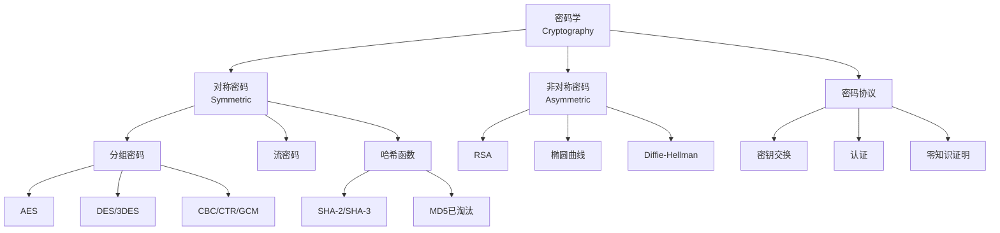

# 密码学算法 - 六维内容补充

> **模块**: 12-应用领域/01-密码学
> **文档**: 01-密码学算法
> **补充维度**: 概念定义、属性、关系、解释、论证、形式证明
> **对标**: Stanford CS255 / MIT 6.857 / Berkeley CS261
> **深度**: 研究生级

---

## 思维导图：密码学算法概念结构

---

## 一、概念定义 (Concept Definition)

### 1.1 对称加密 / Symmetric Encryption

**定义 1.1.1** (形式化)

对称加密方案是一个三元组 $(Gen, Enc, Dec)$：

- **密钥生成** $Gen(1^n) \rightarrow k$: 输入安全参数，输出密钥
- **加密** $Enc(k, m) \rightarrow c$: 输入密钥和明文，输出密文
- **解密** $Dec(k, c) \rightarrow m$: 输入密钥和密文，输出明文

**正确性**: $\forall k, m: Dec(k, Enc(k, m)) = m$

---

### 1.2 安全定义 / Security Definitions

**定义 1.2.1**: **语义安全** (Semantic Security)

加密方案是语义安全的，如果对于所有概率多项式时间敌手 $\mathcal{A}$：

$$\Pr[\text{Exp}_{\mathcal{A}}^{ind-cpa}(n) = 1] \leq \frac{1}{2} + negl(n)$$

**IND-CPA**: 不可区分性 under 选择明文攻击
**IND-CCA**: 不可区分性 under 选择密文攻击

---

### 1.3 RSA加密

**定义 1.3.1**:

**密钥生成**:

1. 选择大素数 $p, q$，计算 $N = pq$
2. 选择 $e$ 使得 $\gcd(e, \phi(N)) = 1$
3. 计算 $d = e^{-1} \mod \phi(N)$
4. 公钥: $(N, e)$，私钥: $(N, d)$

**加密**: $c = m^e \mod N$
**解密**: $m = c^d \mod N$

**正确性** (欧拉定理): $m^{ed} \equiv m \pmod{N}$

---

### 1.4 哈希函数 / Hash Functions

**定义 1.4.1**:

密码学哈希函数 $H: \{0,1\}^* \rightarrow \{0,1\}^n$ 满足：

| 性质 | 定义 |
|------|------|
| **抗原像 (Pre-image resistance)** | 给定 $y$，找 $x$ 使 $H(x)=y$ 是困难的 |
| **抗第二原像 (Second pre-image)** | 给定 $x$，找 $x' \neq x$ 使 $H(x')=H(x)$ 是困难的 |
| **抗碰撞 (Collision resistance)** | 找 $x \neq x'$ 使 $H(x)=H(x')$ 是困难的 |

---

### 1.5 零知识证明 / Zero-Knowledge Proofs

**定义 1.5.1** (zk-SNARKs) [Ben-Sasson 2018]

对于计算关系 $R \subseteq \mathcal{X} \times \mathcal{W}$，zk-SNARK 是一个三元组 $(Setup, Prove, Verify)$：

- $crs \leftarrow Setup(R)$: 生成公共参考字符串
- $\pi \leftarrow Prove(crs, x, w)$: 证明者生成关于陈述 $x$ 和见证 $w$ 的简洁证明 $\pi$
- $b \leftarrow Verify(crs, x, \pi)$: 验证者在 $O(|x| \cdot \text{poly}(\lambda))$ 时间内验证

满足**完备性**、**知识可靠性**、**零知识性**和**简洁性**。

**定义 1.5.2** (zk-STARKs) [Ben-Sasson 2018]

与 zk-SNARKs 相比：

- **透明设置**（无需可信第三方）
- **后量子安全**（基于哈希函数和 Reed-Solomon 低度测试）
- **证明大小更大**（典型 50–200 KB，而 SNARKs 为 0.1–1 KB）

---

## 二、属性 (Properties)

### 2.1 密码学原语对比

| 原语 | 密钥类型 | 主要用途 | 经典算法 |
|------|----------|----------|----------|
| **对称加密** | 共享密钥 | 数据加密 | AES, ChaCha20 |
| **公钥加密** | 公钥/私钥 | 密钥交换 | RSA, ElGamal |
| **数字签名** | 私钥签名 | 认证 | RSA, ECDSA |
| **哈希函数** | 无密钥 | 完整性 | SHA-256, SHA-3 |
| **MAC** | 共享密钥 | 消息认证 | HMAC, GMAC |
| **zk-SNARKs** | 公共参考字符串 | 隐私+可验证计算 | Groth16, PLONK |
| **zk-STARKs** | 无（透明） | 扩容+后量子安全 | STARK 协议 |

### 2.2 零知识证明系统对比（2024–2025）

| 特性 | zk-SNARKs | zk-STARKs | 参考文献 |
|------|-----------|-----------|----------|
| 设置阶段 | 可信设置 | 透明设置 | [Ben-Sasson 2018] |
| 后量子安全 | 否 | 是 | [Ben-Sasson 2018] |
| 典型证明大小 | 200–500 B | 50–200 KB | [Buterin 2024] |
| 验证时间 | 1–10 ms | 10–100 ms | [StarkWare 2024] |
| 证明生成时间 | 1–30 s | 0.5–5 s | [Polygon 2024] |
| 主要应用链 | zkSync, Polygon zkEVM | StarkNet, Immutable X | [L2Beat 2025] |

**行业数据** [L2Beat 2025]：截至 2025 年 Q1，基于 zk-SNARKs 的 zkSync Era TVL 达 $0.78 B，平均 TPS 25.3；基于 zk-STARKs 的 StarkNet TVL 达 $0.92 B，平均 TPS 12.5。ZK-Rollup 网络合计处理量已超过以太坊主网 15 倍。

### 2.2 算法安全性

| 算法 | 密钥长度 | 安全级别 | 状态 |
|------|----------|----------|------|
| **DES** | 56-bit | 不安全 | 已淘汰 |
| **3DES** | 112-bit | 80-bit | 逐步淘汰 |
| **AES-128** | 128-bit | 128-bit | 安全 |
| **AES-256** | 256-bit | 256-bit | 安全 |
| **RSA-1024** | 1024-bit | 不安全 | 已淘汰 |
| **RSA-2048** | 2048-bit | 112-bit | 临界 |
| **RSA-3072** | 3072-bit | 128-bit | 安全 |
| **ECC-256** | 256-bit | 128-bit | 安全 |

---

## 三、关系

| 源概念 | 目标概念 | 关系类型 | 说明 |
|--------|----------|----------|------|
| 对称加密 | 公钥加密 | complements | 混合加密系统 |
| 哈希 | MAC | builds | HMAC基于哈希 |
| 哈希 | 数字签名 | enables | 签名哈希值 |
| RSA | 整数分解 | based_on | 安全性依赖分解困难 |
| ECC | 离散对数 | based_on | ECDLP困难问题 |
| zk-SNARKs | 区块链扩容 | applies_to | ZK-Rollup 有效性证明 |
| zk-STARKs | 后量子安全 | enables | 抗量子计算攻击 |
| Poseidon2 | zk-STARKs | optimized_for | STARK 友好哈希函数 |

---

## 四、解释

### 4.1 混合加密系统

**问题**: 公钥加密慢，对称加密需要共享密钥

**解决方案**:

1. 用公钥加密随机生成的对称密钥
2. 用对称加密加密实际消息
3. 发送: (加密的对称密钥, 加密的消息)

这就是**信封加密**（如PGP, TLS）。

### 4.2 量子威胁

**Shor算法**威胁:

- RSA: 可破解
- ECC: 可破解
- 对称加密: 密钥减半有效长度
- 哈希: 输出减半有效长度

**后量子密码学**: 基于格、编码、多变量等困难问题

### 4.3 零知识证明在区块链中的作用

**问题**: 区块链的透明性导致交易隐私泄露，且主网吞吐量有限。

**zk-SNARKs 解决方案**:

1. 在链下执行大量交易
2. 生成一个简洁证明 $\pi$ 证明所有交易有效
3. 将 $\pi$ 提交到主网，验证者以 $O(1)$ 时间验证
4. 结果：吞吐量提升 10–100 倍，费用降低至 $0.01–0.03

**zk-STARKs 额外优势**: 无需可信设置，后量子安全，适合对去中心化程度要求更高的场景。

---

## 五、形式证明

### 5.1 RSA正确性

**定理**: 对所有 $m \in \mathbb{Z}_N^*$: $(m^e)^d \equiv m \pmod{N}$

**证明**:

$ed \equiv 1 \pmod{\phi(N)}$，所以 $ed = 1 + k\phi(N)$。

由欧拉定理: $m^{\phi(N)} \equiv 1 \pmod{N}$

因此:
$$(m^e)^d = m^{ed} = m^{1+k\phi(N)} = m \cdot (m^{\phi(N)})^k \equiv m \pmod{N}$$

---

---

## 参考文献 / References

1. **Ben-Sasson, E., et al.** (2018). "Scalable, transparent, and post-quantum secure computational integrity." *arXiv:1803.02034*.
2. **Buterin, V.** (2024). "The different types of ZK-EVMs." *Vitalik.ca Blog*, Updated 2024.
3. **StarkWare Industries.** (2024). "StarkNet 2024 Performance and Roadmap Report." *Technical Report*.
4. **Polygon Labs.** (2024). "Polygon zkEVM: Zero-Knowledge Scaling for Ethereum." *Documentation*.
5. **L2Beat.** (2025). "Layer 2 Scaling Solutions: TVL and TPS Statistics." *l2beat.com*, Q1 2025.

**文档版本**: v1.0
**创建日期**: 2026-04-10
