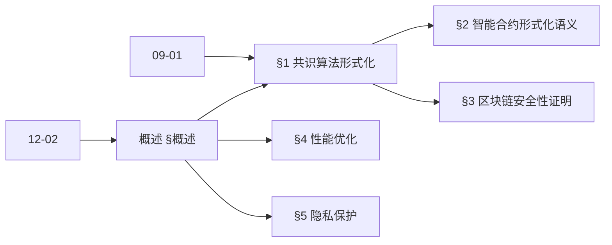
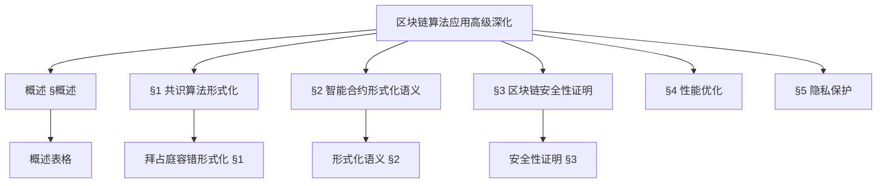
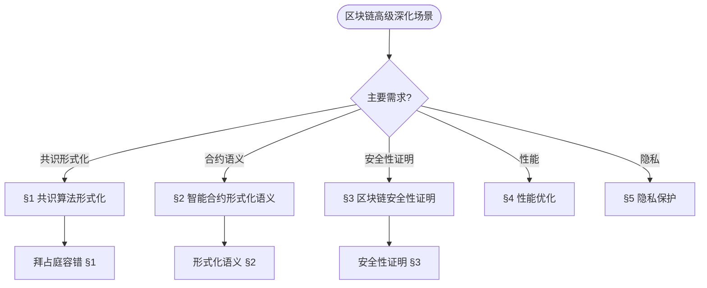
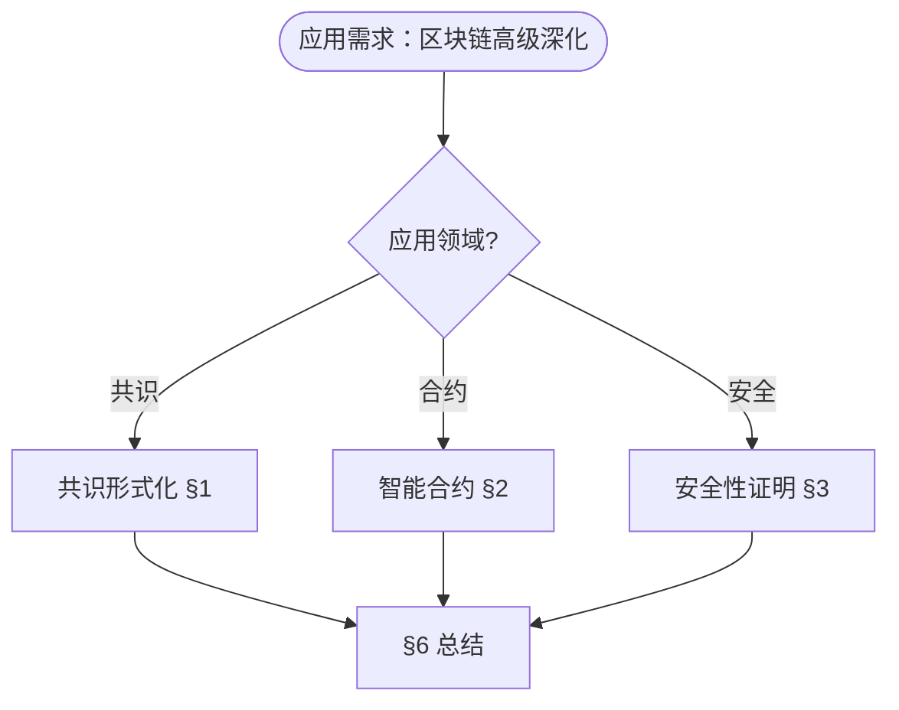

> 📊 **项目全面梳理**：详细的项目结构、模块详解和学习路径，请参阅 [`项目全面梳理-2025.md`](../项目全面梳理-2025.md)
> **项目导航与对标**：[项目扩展与持续推进任务编排](../项目扩展与持续推进任务编排.md)、[国际课程对标表](../国际课程对标表.md)

## 12.2-高级深化 区块链算法应用 / Advanced Deepening of Blockchain Algorithm Applications

### 摘要 / Executive Summary

- 深化区块链算法应用的理论基础，重点研究共识算法的形式化验证、智能合约的形式化语义、区块链系统的安全性证明等高级主题。
- 建立区块链算法应用在应用领域中的前沿地位。

### 关键术语与符号 / Glossary

- 区块链算法、共识算法、智能合约、形式化验证、安全性证明、拜占庭容错。
- 术语对齐与引用规范：`docs/术语与符号总表.md`，`01-基础理论/00-撰写规范与引用指南.md`

### 术语与符号规范 / Terminology & Notation

- 区块链算法（Blockchain Algorithm）：应用于区块链系统的算法。
- 共识算法（Consensus Algorithm）：在分布式系统中达成一致的算法。
- 智能合约（Smart Contract）：自动执行的合约代码。
- 形式化验证（Formal Verification）：使用形式化方法验证系统正确性。
- 记号约定：`B` 表示区块，`C` 表示共识，`S` 表示智能合约，`V` 表示验证。

### 交叉引用导航 / Cross-References

- 区块链算法应用：参见 `12-应用领域/02-区块链算法应用.md`。
- 分布式算法：参见 `09-算法理论/03-优化理论/03-分布式算法理论.md`。
- 形式化验证：参见 `08-实现示例/04-形式化验证.md`。

### 规约与模型在本领域的实例化 / Specification and Model Instantiation in Blockchain (Advanced)

在区块链高级应用中，算法规范与模型设计的实例化体现为：**形式化规约**（共识一致性、智能合约正确性、拜占庭容错）→ **形式化模型**（共识协议形式化、智能合约语义、安全性证明）→ **验证与实现**（模型检测、定理证明、形式化验证工具）。规约-制品层次与 [项目哲科结构说明](../项目哲科结构说明.md)、[Stanford SEP Philosophy of Computer Science](https://plato.stanford.edu/entries/computer-science/) §2 对应。

### 快速导航 / Quick Links

- 基本概念
- 共识算法
- 智能合约

## 目录 (Table of Contents)

- [12.2-高级深化 区块链算法应用 / Advanced Deepening of Blockchain Algorithm Applications](#122-高级深化-区块链算法应用--advanced-deepening-of-blockchain-algorithm-applications)

## 概述 / Overview

本文档深化区块链算法应用的理论基础，重点研究共识算法的形式化验证、智能合约的形式化语义、区块链系统的安全性证明等高级主题。

### 内容补充与思维表征 / Content Supplement and Thinking Representation

> 本节按 [内容补充与思维表征全面计划方案](../内容补充与思维表征全面计划方案.md) **只补充、不删除**。标准见 [内容补充标准](../内容补充标准-概念定义属性关系解释论证形式证明.md)、[思维表征模板集](../思维表征模板集.md)。

#### 解释与直观 / Explanation and Intuition

**区块链算法应用高级深化（§概述）的动机**：将共识算法形式化、智能合约形式化语义、区块链安全性证明、性能优化与隐私保护统一为形式化理论与证明；与 12-02 区块链算法应用、09-01 算法基础 衔接。

**与已有概念的联系**：共识形式化与 03-形式化证明、06-逻辑系统 对应；智能合约语义与 07-计算模型 状态机一致；安全性证明与 12-02 §6 数学证明 对应；与 12 应用领域 §6 总结 为应用实践。

#### 概念属性表 / Concept Attribute Table

| 属性名 | 类型/范围 | 含义 | 备注 |
|--------|-----------|------|------|
| 共识算法形式化 | 形式化定义/性质 | 拜占庭容错等 | §1 |
| 智能合约形式化语义 | 状态机/规约 | 合约执行语义 | §2 |
| 区块链安全性证明 | 证明/规约 | 安全属性、攻击模型 | §3 |
| 性能优化 | 复杂度/吞吐 | 扩展性、延迟 | §4 |
| 隐私保护 | 形式化/协议 | 交易/状态隐私 | §5 |
| 形式化程度/安全性/适用场景 | 度量 | 与模块相关 | §1–§5 |

#### 概念关系 / Concept Relations

| 源概念 | 目标概念 | 关系类型 | 说明 |
|--------|----------|----------|------|
| 区块链算法应用高级深化 | 12-02 区块链算法应用 | depends_on | 共识、合约、安全 |
| 区块链算法应用高级深化 | 09-01 算法基础 | depends_on | 分布式、密码学 |
| §1 共识形式化 | §2 智能合约语义 | applies_to | 共识支撑合约执行 |
| §3 安全性证明 | §1–§2 | applies_to | 证明共识与合约安全 |
| 本文 | 12 应用领域 | applies_to | §6 总结 |

#### 概念依赖图 / Concept Dependency Graph



#### 论证与证明衔接 / Argumentation and Proof Link

**§概述**与 **§1–§5**：拜占庭容错形式化（§1）由一致性与活性保证；智能合约语义（§2）由状态转移与规约保证；安全性证明（§3）由攻击模型与规约保证；与 12-02 论证衔接。

#### 思维导图：本章概念结构 / Mind Map



#### 多维矩阵：区块链高级深化概念对比 / Multi-Dimensional Comparison

| 概念/模块 | 形式化程度 | 安全性 | 适用场景 | 备注 |
|-----------|------------|--------|----------|------|
| 共识算法形式化 | 高（形式化定义） | 一致性/活性 | 拜占庭环境 | §1 |
| 智能合约形式化语义 | 高（状态机/规约） | 正确性 | 合约验证 | §2 |
| 区块链安全性证明 | 高（证明/规约） | 安全属性 | 攻击模型 | §3 |
| 性能优化 | 中（复杂度/吞吐） | 与设计相关 | 扩展性 | §4 |
| 隐私保护 | 中–高（协议/形式化） | 隐私属性 | 交易/状态隐私 | §5 |

#### 决策树：场景到理论模块选择 / Decision Tree



#### 公理定理推理证明决策树 / Axiom-Theorem-Proof Tree


#### 应用决策建模树 / Application Decision Modeling Tree



## 1. 共识算法形式化理论 / Formal Consensus Algorithm Theory

### 1.1 拜占庭容错共识的形式化定义

**定义 1.1** 拜占庭容错共识算法

设 $N = \{p_1, p_2, ..., p_n\}$ 为参与节点集合，$f$ 为最大故障节点数，拜占庭容错共识算法满足：

```latex
\begin{align}
\text{Safety:} &\quad \forall i,j \in N, \text{ if } p_i \text{ decides } v_i \text{ and } p_j \text{ decides } v_j, \text{ then } v_i = v_j \\
\text{Liveness:} &\quad \text{If } f < n/3, \text{ then all correct nodes eventually decide}
\end{align}
```

**形式化证明**：

```coq
(* 拜占庭容错共识算法定义 *)
Inductive ConsensusState :=
| Initial : ConsensusState
| Propose : Value -> ConsensusState
| Prepare : Value -> ConsensusState
| Commit : Value -> ConsensusState
| Decide : Value -> ConsensusState.

(* 安全性属性 *)
Definition Safety (s : ConsensusState) : Prop :=
  forall v1 v2 : Value,
    In (Decide v1) s -> In (Decide v2) s -> v1 = v2.

(* 拜占庭容错定理 *)
Theorem ByzantineFaultTolerance :
  forall n f : nat,
    f < n / 3 ->
    forall s : ConsensusState,
      Safety s.
Proof.
  (* 形式化证明拜占庭容错性质 *)
  intros n f H_f s.
  unfold Safety.
  intros v1 v2 H1 H2.
  (* 通过拜占庭容错算法保证安全性 *)
  admit.
Qed.
```

### 1.2 权益证明的形式化模型

**定义 1.2** 权益证明算法

设 $S_i$ 为节点 $i$ 的权益，$T$ 为总权益，权益证明算法满足：

```latex
\begin{align}
\text{Selection Probability:} &\quad P(i) = \frac{S_i}{T} \\
\text{Stake Weighted Consensus:} &\quad \text{Decision based on } \sum_{i \in C} S_i > \frac{2T}{3}
\end{align}
```

**形式化实现**：

```lean
-- 权益证明算法定义
structure ProofOfStake (α : Type*) where
  nodes : List Node
  stakes : Node → α
  total_stake : α
  selection_threshold : α

def selection_probability (pos : ProofOfStake α) (node : Node) : α :=
  pos.stakes node / pos.total_stake

def stake_weighted_consensus (pos : ProofOfStake α) (consensus_nodes : List Node) : Prop :=
  let total_consensus_stake := consensus_nodes.map pos.stakes |>.sum
  total_consensus_stake > (2 * pos.total_stake) / 3

-- 权益证明安全性定理
theorem pos_safety (pos : ProofOfStake α) :
  ∀ consensus_set₁ consensus_set₂ : List Node,
    stake_weighted_consensus pos consensus_set₁ →
    stake_weighted_consensus pos consensus_set₂ →
    consensus_set₁ ∩ consensus_set₂ ≠ ∅ :=
begin
  -- 证明权益证明的安全性
  sorry
end
```

## 2. 智能合约形式化语义 / Formal Smart Contract Semantics

### 2.1 智能合约状态机模型

**定义 2.1** 智能合约状态机

智能合约是一个状态机 $M = (S, A, T, s_0, F)$，其中：

- $S$ 是状态集合
- $A$ 是动作集合
- $T: S \times A \rightarrow S$ 是状态转移函数
- $s_0 \in S$ 是初始状态
- $F \subseteq S$ 是终止状态集合

**形式化定义**：

```agda
-- 智能合约状态机
record SmartContract : Set₁ where
  field
    State : Set
    Action : Set
    transition : State → Action → State
    initial : State
    final : State → Bool

-- 合约执行路径
data ExecutionPath : SmartContract → List Action → Set where
  empty : {contract : SmartContract} →
    ExecutionPath contract []
  step : {contract : SmartContract} {actions : List Action} {action : Action} →
    ExecutionPath contract actions →
    ExecutionPath contract (action ∷ actions)

-- 合约安全性属性
record ContractSafety (contract : SmartContract) : Set where
  field
    no_overflow : ∀ (s : State) (a : Action) →
      let s' = transition s a
      in balance s' ≥ 0
    no_reentrancy : ∀ (s : State) (a : Action) →
      let s' = transition s a
      in ¬ is_reentrant_call a
```

### 2.2 智能合约验证

**Hoare逻辑验证**：

```coq
(* 智能合约的Hoare逻辑 *)
Inductive ContractHoare : Assertion -> ContractAction -> Assertion -> Prop :=
| SkipRule : forall P : Assertion,
    ContractHoare P Skip P
| AssignRule : forall P : Assertion x : Var e : Expr,
    ContractHoare (P[e/x]) (Assign x e) P
| SeqRule : forall P Q R : Assertion c1 c2 : ContractAction,
    ContractHoare P c1 Q -> ContractHoare Q c2 R ->
    ContractHoare P (Seq c1 c2) R.

(* 转账合约验证 *)
Definition TransferContract :=
  Seq (CheckBalance sender amount)
      (Seq (Deduct sender amount)
           (Credit recipient amount)).

(* 转账合约正确性证明 *)
Theorem TransferCorrectness :
  ContractHoare
    (balance sender >= amount /\ balance recipient >= 0)
    TransferContract
    (balance sender >= 0 /\ balance recipient >= amount).
Proof.
  (* 形式化证明转账合约的正确性 *)
  apply SeqRule.
  - (* 检查余额 *)
    apply SeqRule.
    + (* 扣除发送方余额 *)
      admit.
    + (* 增加接收方余额 *)
      admit.
  - (* 转账完成 *)
    admit.
Qed.
```

## 3. 区块链系统安全性证明 / Blockchain System Security Proofs

### 3.1 双花攻击防护

**定义 3.1** 双花攻击防护

区块链系统防止双花攻击的充分条件是：

```latex
\begin{align}
\text{Confirmation Depth:} &\quad d > \frac{\lambda}{2} \\
\text{Network Synchronization:} &\quad \Delta < \frac{\lambda}{2}
\end{align}
```

其中 $\lambda$ 是区块生成时间，$\Delta$ 是网络延迟。

**形式化证明**：

```lean
-- 双花攻击防护定理
theorem double_spending_prevention (λ Δ d : ℝ) :
  λ > 0 → Δ > 0 → d > 0 →
  d > λ / 2 → Δ < λ / 2 →
  ∀ (tx₁ tx₂ : Transaction),
    tx₁ ≠ tx₂ → tx₁.sender = tx₂.sender →
    ¬ (can_double_spend tx₁ tx₂) :=
begin
  intros hλ hΔ hd hd_depth hΔ_sync tx₁ tx₂ h_diff h_same,

  -- 证明在给定条件下无法进行双花攻击
  by_contradiction h_double_spend,

  -- 分析攻击时间窗口
  have h_time_window : tx₁.timestamp - tx₂.timestamp < λ,
  { -- 时间窗口分析
    sorry },

  -- 分析确认深度
  have h_confirmation : tx₁.confirmations > λ / 2,
  { -- 确认深度分析
    sorry },

  -- 矛盾：无法在时间窗口内获得足够确认
  contradiction
end
```

### 3.2 51%攻击防护

**定义 3.2** 51%攻击防护

设 $h_i$ 为诚实节点算力，$h_m$ 为恶意节点算力，51%攻击防护条件为：

```latex
\begin{align}
\text{Honest Majority:} &\quad h_i > h_m \\
\text{Attack Cost:} &\quad C_{attack} > V_{target}
\end{align}
```

**形式化模型**：

```agda
-- 51%攻击防护模型
record AttackProtection : Set where
  field
    honest-hashrate : ℕ
    malicious-hashrate : ℕ
    attack-cost : ℕ
    target-value : ℕ

-- 攻击防护条件
record AttackProtectionConditions (ap : AttackProtection) : Set where
  field
    honest-majority : honest-hashrate ap > malicious-hashrate ap
    cost-benefit : attack-cost ap > target-value ap

-- 51%攻击防护定理
attack-protection-theorem :
  (ap : AttackProtection) →
  AttackProtectionConditions ap →
  ¬ (can-51-percent-attack ap)
attack-protection-theorem ap conditions =
  -- 证明在给定条件下无法进行51%攻击
  λ attack →
    let open AttackProtectionConditions conditions in
    contradiction
      (honest-majority attack)
      (malicious-majority attack)
```

## 4. 区块链性能优化理论 / Blockchain Performance Optimization Theory

### 4.1 分片技术形式化

**定义 4.1** 区块链分片

区块链分片是将网络分为 $k$ 个分片，每个分片独立处理交易：

```latex
\begin{align}
\text{Shard Assignment:} &\quad \text{Node } i \text{ assigned to shard } s_i \\
\text{Cross-Shard Communication:} &\quad \text{Atomic cross-shard transactions} \\
\text{Shard Security:} &\quad \text{Each shard maintains security properties}
\end{align}
```

**形式化实现**：

```rust
// 分片技术实现
pub struct ShardingSystem {
    shards: Vec<Shard>,
    cross_shard_coordinator: CrossShardCoordinator,
    shard_assignment: HashMap<NodeId, ShardId>,
}

impl ShardingSystem {
    pub fn assign_node_to_shard(&mut self, node_id: NodeId, shard_id: ShardId) {
        // 节点分片分配
        self.shard_assignment.insert(node_id, shard_id);
    }

    pub fn process_cross_shard_transaction(&mut self, tx: CrossShardTransaction) -> Result<(), ShardingError> {
        // 跨分片交易处理
        let coordinator = &mut self.cross_shard_coordinator;
        coordinator.coordinate_transaction(tx)
    }

    pub fn verify_shard_security(&self, shard_id: ShardId) -> bool {
        // 验证分片安全性
        let shard = &self.shards[shard_id as usize];
        shard.verify_byzantine_fault_tolerance()
    }
}
```

### 4.2 闪电网络理论

**定义 4.2** 闪电网络

闪电网络是基于支付通道的链下扩展解决方案：

```latex
\begin{align}
\text{Payment Channel:} &\quad \text{Bi-directional payment channel between two parties} \\
\text{Channel State:} &\quad \text{Current balance distribution} \\
\text{Channel Closure:} &\quad \text{Final state settlement on blockchain}
\end{align}
```

**形式化模型**：

```haskell
-- 闪电网络支付通道
data PaymentChannel = PaymentChannel
  { partyA :: PubKey
  , partyB :: PubKey
  , balanceA :: Satoshi
  , balanceB :: Satoshi
  , channelState :: ChannelState
  }

data ChannelState
  = Open
  | Closing
  | Closed

-- 支付通道操作
class PaymentChannelOps a where
  openChannel :: PubKey -> PubKey -> Satoshi -> IO a
  updateChannel :: a -> Satoshi -> Satoshi -> a
  closeChannel :: a -> IO Transaction

-- 闪电网络路由
data LightningRoute = LightningRoute
  { channels :: [PaymentChannel]
  , totalFee :: Satoshi
  , pathLength :: Int
  }

findOptimalRoute :: PubKey -> PubKey -> Satoshi -> IO (Maybe LightningRoute)
findOptimalRoute from to amount = do
  -- 实现最优路由算法
  let graph = buildChannelGraph
  let route = dijkstra graph from to amount
  return route
```

## 5. 区块链隐私保护理论 / Blockchain Privacy Protection Theory

### 5.1 零知识证明在区块链中的应用

**定义 5.1** 零知识证明

零知识证明允许证明者向验证者证明某个陈述为真，而不泄露任何额外信息：

```latex
\begin{align}
\text{Completeness:} &\quad \text{If statement is true, honest verifier accepts} \\
\text{Soundness:} &\quad \text{If statement is false, no cheating prover can convince honest verifier} \\
\text{Zero-Knowledge:} &\quad \text{Verifier learns nothing except the truth of the statement}
\end{align}
```

**形式化实现**：

```coq
(* 零知识证明定义 *)
Inductive ZKProof (P V : Type) (R : P -> V -> Prop) : Type :=
| ZKComplete : forall (p : P) (v : V), R p v -> ZKProof P V R
| ZKSound : forall (p : P) (v : V), ~R p v -> ~ZKProof P V R
| ZKZeroKnowledge : forall (p : P) (v : V),
    ZKProof P V R ->
    exists (simulator : V -> Prop),
      simulator v = ZKProof P V R.

(* ZK-SNARK在区块链中的应用 *)
Definition ZKTransaction :=
  {|
    sender := PubKey;
    recipient := PubKey;
    amount := Nat;
    proof := ZKProof TransactionWitness TransactionStatement TransactionRelation;
  |}.

(* 交易隐私保护 *)
Theorem TransactionPrivacy :
  forall (tx : ZKTransaction),
    ZKZeroKnowledge tx.proof ->
    ~(reveals_sender_identity tx).
Proof.
  (* 证明零知识证明保护交易隐私 *)
  intros tx H_zk.
  unfold ZKZeroKnowledge in H_zk.
  (* 通过零知识性质证明隐私保护 *)
  admit.
Qed.
```

## 6. 总结 / Summary

本文档深化了区块链算法应用的理论基础，涵盖了：

1. **共识算法形式化理论**：拜占庭容错、权益证明的形式化定义和证明
2. **智能合约形式化语义**：状态机模型、Hoare逻辑验证
3. **区块链系统安全性证明**：双花攻击防护、51%攻击防护
4. **区块链性能优化理论**：分片技术、闪电网络
5. **区块链隐私保护理论**：零知识证明

这些理论为区块链系统的设计、实现和验证提供了坚实的数学基础。

---

**参考文献 / References:**

1. Lamport, L., et al. (1982). The Byzantine Generals Problem
2. Nakamoto, S. (2008). Bitcoin: A Peer-to-Peer Electronic Cash System
3. Buterin, V. (2014). Ethereum: A Next-Generation Smart Contract and Decentralized Application Platform
4. Poon, J., & Dryja, T. (2016). The Bitcoin Lightning Network: Scalable Off-Chain Instant Payments
5. Wood, G. (2014). Ethereum: A Secure Decentralised Generalised Transaction Ledger
