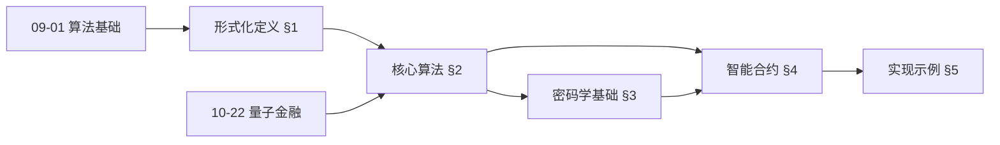
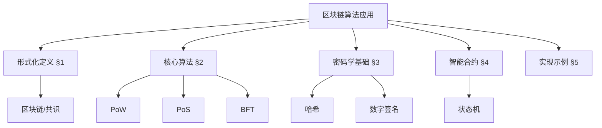
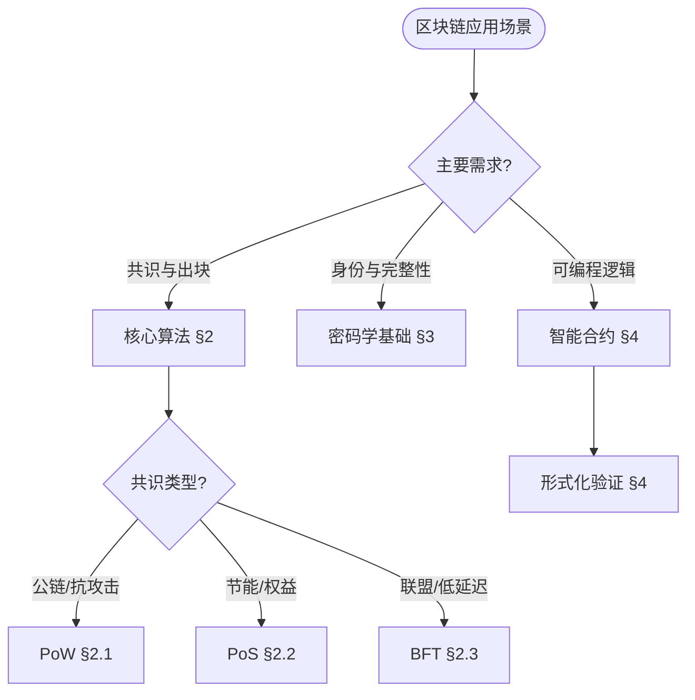
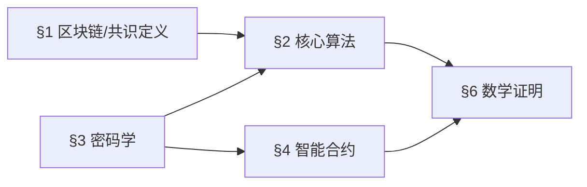
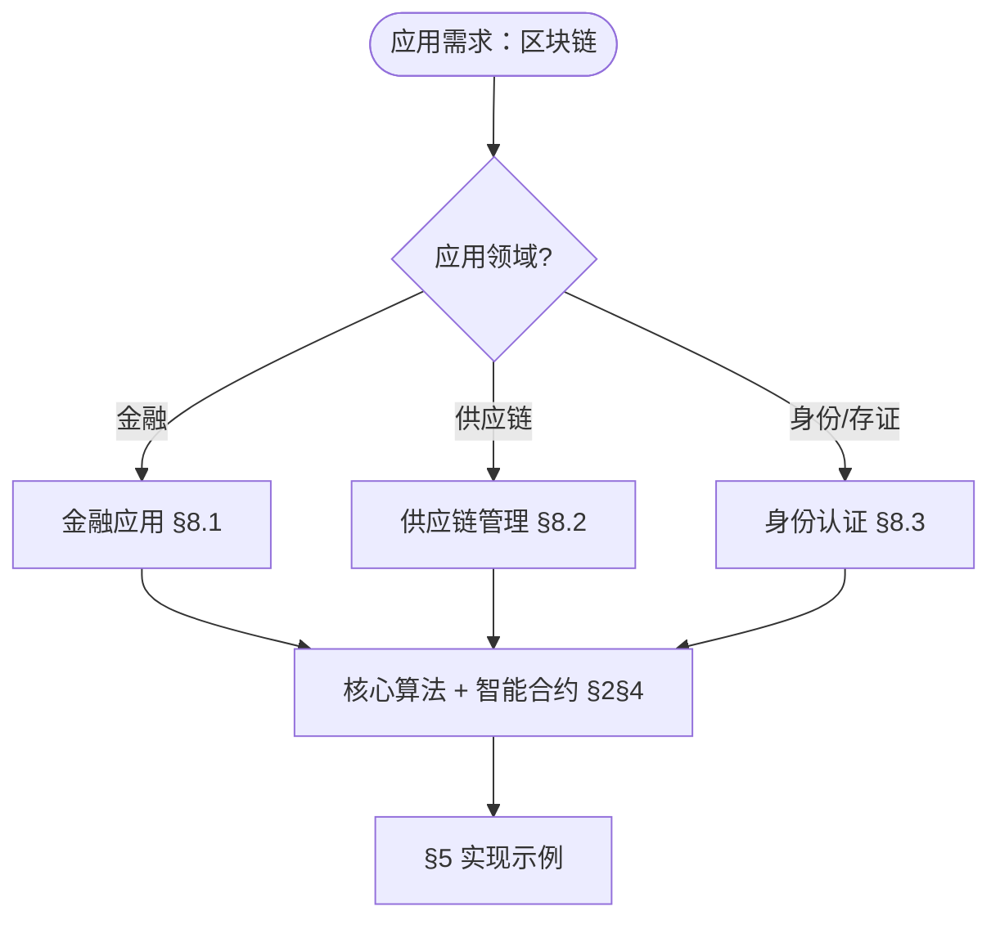
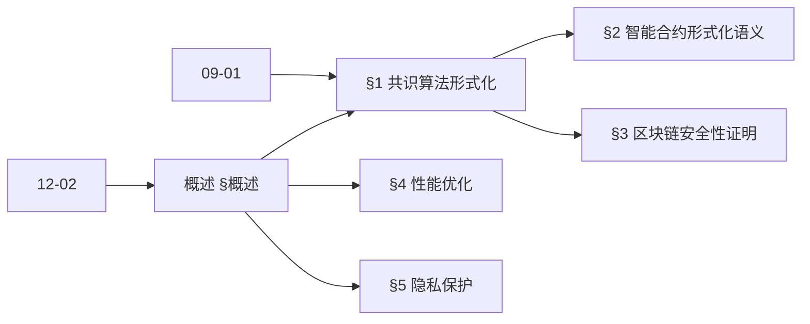
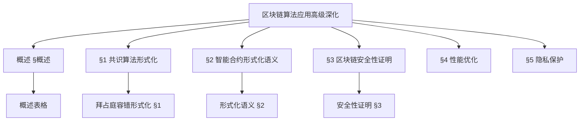
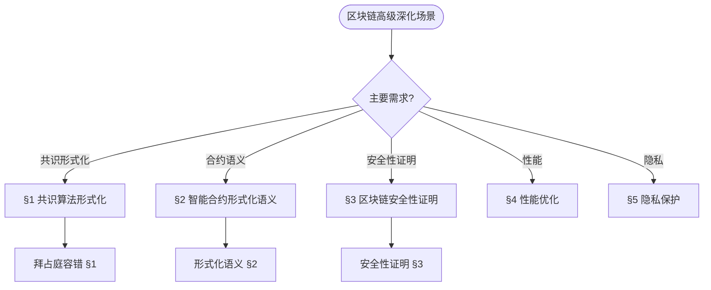
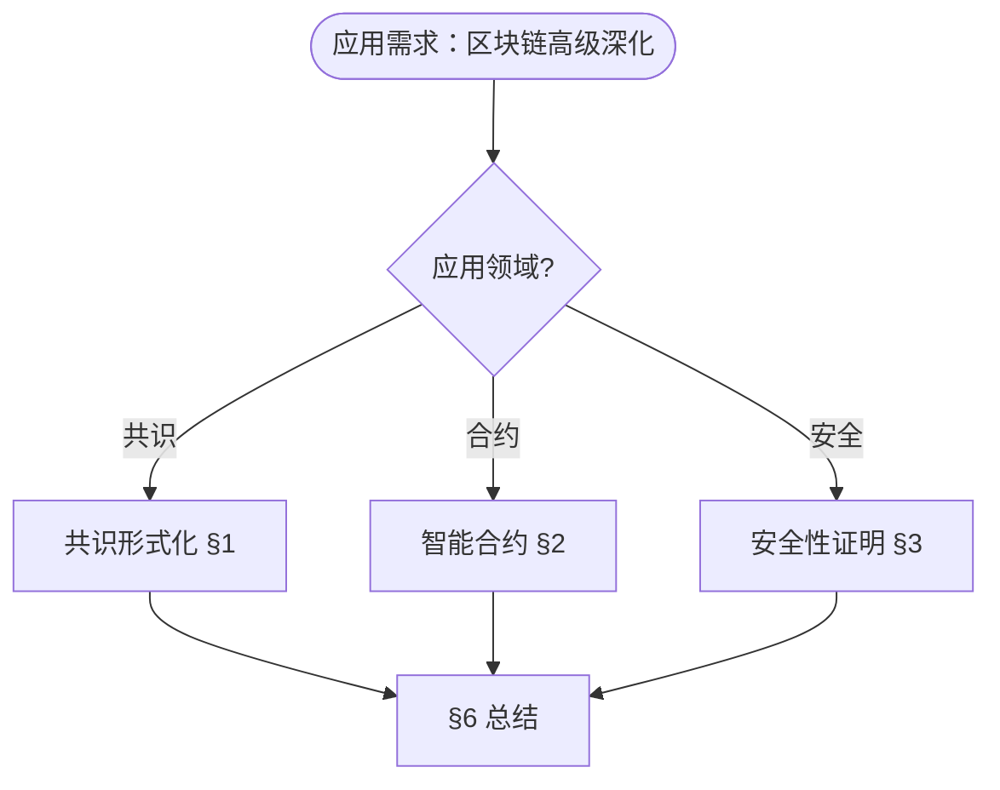

> 📊 **项目全面梳理**：详细的项目结构、模块详解和学习路径，请参阅 [`项目全面梳理-2025.md`](../项目全面梳理-2025.md)
> **项目导航与对标**：[项目扩展与持续推进任务编排](../项目扩展与持续推进任务编排.md)、[国际课程对标表](../国际课程对标表.md)
> **合并说明**: 本文档由原 `12-应用领域/02-区块链算法应用.md` 和 `12-应用领域/02-区块链算法应用-高级深化.md` 合并而成，整合时间: 2026-04-15

## 12.2 区块链算法应用 / Blockchain Algorithm Applications

### 摘要 / Executive Summary

- 统一区块链算法在各类应用中的使用规范与最佳实践。
- 建立区块链算法在应用领域中的核心地位。

### 关键术语与符号 / Glossary

- 区块链、共识算法、哈希函数、数字签名、智能合约、分布式账本。
- 术语对齐与引用规范：`docs/术语与符号总表.md`，`01-基础理论/00-撰写规范与引用指南.md`

### 术语与符号规范 / Terminology & Notation

- 区块链（Blockchain）：分布式账本技术。
- 共识算法（Consensus Algorithm）：在分布式系统中达成一致的算法。
- 哈希函数（Hash Function）：将任意长度数据映射到固定长度的函数。
- 数字签名（Digital Signature）：用于验证数据完整性和来源的密码学方法。
- 记号约定：`H` 表示哈希函数，`Sig` 表示签名，`Block` 表示区块，`Chain` 表示链。

### 交叉引用导航 / Cross-References

- 算法设计：参见 `09-算法理论/01-算法基础/01-算法设计理论.md`。
- 密码学算法：参见 `12-应用领域/03-网络安全算法应用.md`。
- 分布式算法：参见 `09-算法理论/03-优化理论/03-分布式算法理论.md`。

### 规约与模型在本领域的实例化 / Specification and Model Instantiation in Blockchain

在区块链领域，算法规范与模型设计的实例化体现为：**协议规约**（共识一致性、安全性、可扩展性）→ **共识与密码学模型**（PBFT、PoW/PoS、哈希与签名）→ **智能合约与实现**（形式化验证、状态机、部署）。规约-制品层次与 [项目哲科结构说明](../项目哲科结构说明.md)、[Stanford SEP Philosophy of Computer Science](https://plato.stanford.edu/entries/computer-science/) §2 对应。

### 快速导航 / Quick Links

- 基本概念
- 共识算法
- 智能合约

## 目录 (Table of Contents)

- [12.2 区块链算法应用 / Blockchain Algorithm Applications](#122-区块链算法应用--blockchain-algorithm-applications)
  - [摘要 / Executive Summary](#摘要--executive-summary)
  - [关键术语与符号 / Glossary](#关键术语与符号--glossary)
  - [术语与符号规范 / Terminology \& Notation](#术语与符号规范--terminology--notation)
  - [交叉引用导航 / Cross-References](#交叉引用导航--cross-references)
  - [规约与模型在本领域的实例化 / Specification and Model Instantiation in Blockchain](#规约与模型在本领域的实例化--specification-and-model-instantiation-in-blockchain)
  - [快速导航 / Quick Links](#快速导航--quick-links)
- [目录 (Table of Contents)](#目录-table-of-contents)
- [0. 区块链算法哲学基础 / Blockchain Algorithm Philosophy Foundation](#0-区块链算法哲学基础--blockchain-algorithm-philosophy-foundation)
  - [0.1 区块链算法的本质哲学探讨 / Philosophical Discussion on the Nature of Blockchain Algorithms](#01-区块链算法的本质哲学探讨--philosophical-discussion-on-the-nature-of-blockchain-algorithms)
    - [0.1.1 区块链算法的本体论问题 / Ontological Issues of Blockchain Algorithms](#011-区块链算法的本体论问题--ontological-issues-of-blockchain-algorithms)
    - [0.1.2 区块链算法的认识论问题 / Epistemological Issues of Blockchain Algorithms](#012-区块链算法的认识论问题--epistemological-issues-of-blockchain-algorithms)
    - [0.1.3 区块链算法的价值论问题 / Axiological Issues of Blockchain Algorithms](#013-区块链算法的价值论问题--axiological-issues-of-blockchain-algorithms)
  - [0.2 区块链算法的形式化基础 / Formal Foundation of Blockchain Algorithms](#02-区块链算法的形式化基础--formal-foundation-of-blockchain-algorithms)
    - [0.2.1 区块链算法的形式化定义 / Formal Definition of Blockchain Algorithms](#021-区块链算法的形式化定义--formal-definition-of-blockchain-algorithms)
    - [0.2.2 区块链算法的基本性质 / Basic Properties of Blockchain Algorithms](#022-区块链算法的基本性质--basic-properties-of-blockchain-algorithms)
    - [0.2.3 区块链算法与经典算法的比较 / Comparison with Classical Algorithms](#023-区块链算法与经典算法的比较--comparison-with-classical-algorithms)
  - [0.3 区块链算法的哲学意义 / Philosophical Significance of Blockchain Algorithms](#03-区块链算法的哲学意义--philosophical-significance-of-blockchain-algorithms)
    - [0.3.1 对信任本质的理解 / Understanding the Nature of Trust](#031-对信任本质的理解--understanding-the-nature-of-trust)
    - [0.3.2 对价值本质的重新思考 / Rethinking the Nature of Value](#032-对价值本质的重新思考--rethinking-the-nature-of-value)
    - [0.3.3 对治理理论的贡献 / Contribution to Governance Theory](#033-对治理理论的贡献--contribution-to-governance-theory)
- [概述 / Overview](#概述--overview)
- [1. 形式化定义 / Formal Definitions](#1-形式化定义--formal-definitions)
  - [1.1 区块链 / Blockchain](#11-区块链--blockchain)
  - [1.2 共识算法 / Consensus Algorithm](#12-共识算法--consensus-algorithm)
  - [内容补充与思维表征 / Content Supplement and Thinking Representation](#内容补充与思维表征--content-supplement-and-thinking-representation)
    - [解释与直观 / Explanation and Intuition](#解释与直观--explanation-and-intuition)
    - [概念属性表 / Concept Attribute Table](#概念属性表--concept-attribute-table)
    - [概念关系 / Concept Relations](#概念关系--concept-relations)
    - [概念依赖图 / Concept Dependency Graph](#概念依赖图--concept-dependency-graph)
    - [论证与证明衔接 / Argumentation and Proof Link](#论证与证明衔接--argumentation-and-proof-link)
    - [思维导图：本章概念结构 / Mind Map](#思维导图本章概念结构--mind-map)
    - [多维矩阵：共识与组件概念对比 / Multi-Dimensional Comparison](#多维矩阵共识与组件概念对比--multi-dimensional-comparison)
    - [决策树：场景到算法与组件选择 / Decision Tree](#决策树场景到算法与组件选择--decision-tree)
    - [公理定理推理证明决策树 / Axiom-Theorem-Proof Tree](#公理定理推理证明决策树--axiom-theorem-proof-tree)
    - [应用决策建模树 / Application Decision Modeling Tree](#应用决策建模树--application-decision-modeling-tree)
- [2. 核心算法 / Core Algorithms](#2-核心算法--core-algorithms)
  - [2.1 工作量证明 (PoW) / Proof of Work](#21-工作量证明-pow--proof-of-work)
  - [2.2 权益证明 (PoS) / Proof of Stake](#22-权益证明-pos--proof-of-stake)
  - [2.3 拜占庭容错 (BFT) / Byzantine Fault Tolerance](#23-拜占庭容错-bft--byzantine-fault-tolerance)
- [3. 密码学基础 / Cryptographic Foundations](#3-密码学基础--cryptographic-foundations)
  - [3.1 哈希函数 / Hash Functions](#31-哈希函数--hash-functions)
  - [3.2 数字签名 / Digital Signatures](#32-数字签名--digital-signatures)
- [4. 智能合约 / Smart Contracts](#4-智能合约--smart-contracts)
  - [4.1 形式化定义 / Formal Definition](#41-形式化定义--formal-definition)
  - [4.2 状态机模型 / State Machine Model](#42-状态机模型--state-machine-model)
- [5. 实现示例 / Implementation Examples](#5-实现示例--implementation-examples)
  - [5.1 简单区块链 / Simple Blockchain](#51-简单区块链--simple-blockchain)
  - [5.2 共识算法实现 / Consensus Algorithm Implementation](#52-共识算法实现--consensus-algorithm-implementation)
- [6. 数学证明 / Mathematical Proofs](#6-数学证明--mathematical-proofs)
  - [6.1 工作量证明安全性 / Proof of Work Security](#61-工作量证明安全性--proof-of-work-security)
  - [6.2 权益证明安全性 / Proof of Stake Security](#62-权益证明安全性--proof-of-stake-security)
- [7. 复杂度分析 / Complexity Analysis](#7-复杂度分析--complexity-analysis)
  - [7.1 时间复杂度 / Time Complexity](#71-时间复杂度--time-complexity)
  - [7.2 空间复杂度 / Space Complexity](#72-空间复杂度--space-complexity)
- [7.5 零知识证明在区块链中的应用 / Zero-Knowledge Proofs in Blockchain](#75-零知识证明在区块链中的应用--zero-knowledge-proofs-in-blockchain)
  - [7.5.1 形式化定义](#751-形式化定义)
  - [7.5.2 性能对比](#752-性能对比)
  - [7.5.3 2024–2025 行业数据与应用案例](#753-20242025-行业数据与应用案例)
- [8. 应用场景 / Application Scenarios](#8-应用场景--application-scenarios)
  - [8.1 金融应用 / Financial Applications](#81-金融应用--financial-applications)
  - [8.2 供应链管理 / Supply Chain Management](#82-供应链管理--supply-chain-management)
  - [8.3 身份认证 / Identity Authentication](#83-身份认证--identity-authentication)
- [9. 未来发展方向 / Future Development Directions](#9-未来发展方向--future-development-directions)
  - [9.1 可扩展性改进 / Scalability Improvements](#91-可扩展性改进--scalability-improvements)
  - [9.2 隐私保护 / Privacy Protection](#92-隐私保护--privacy-protection)
  - [9.3 跨链互操作 / Cross-chain Interoperability](#93-跨链互操作--cross-chain-interoperability)
- [10. 总结 / Summary](#10-总结--summary)
- [11. 交叉引用与依赖 / Cross References and Dependencies](#11-交叉引用与依赖--cross-references-and-dependencies)
- [12. 与项目结构主题的对齐 / Alignment with Project Structure](#12-与项目结构主题的对齐--alignment-with-project-structure)
  - [相关文档 / Related Documents](#相关文档--related-documents)
  - [知识体系位置 / Knowledge System Position](#知识体系位置--knowledge-system-position)
  - [VIEW文件夹相关文档 / VIEW Folder Related Documents](#view文件夹相关文档--view-folder-related-documents)
  - [摘要 / Executive Summary](#摘要--executive-summary-1)
  - [关键术语与符号 / Glossary](#关键术语与符号--glossary-1)
  - [术语与符号规范 / Terminology \& Notation](#术语与符号规范--terminology--notation-1)
  - [交叉引用导航 / Cross-References](#交叉引用导航--cross-references-1)
  - [规约与模型在本领域的实例化 / Specification and Model Instantiation in Blockchain (Advanced)](#规约与模型在本领域的实例化--specification-and-model-instantiation-in-blockchain-advanced)
  - [快速导航 / Quick Links](#快速导航--quick-links-1)
- [目录 (Table of Contents)](#目录-table-of-contents-1)
- [概述 / Overview](#概述--overview-1)
  - [内容补充与思维表征 / Content Supplement and Thinking Representation](#内容补充与思维表征--content-supplement-and-thinking-representation-1)
    - [解释与直观 / Explanation and Intuition](#解释与直观--explanation-and-intuition-1)
    - [概念属性表 / Concept Attribute Table](#概念属性表--concept-attribute-table-1)
    - [概念关系 / Concept Relations](#概念关系--concept-relations-1)
    - [概念依赖图 / Concept Dependency Graph](#概念依赖图--concept-dependency-graph-1)
    - [论证与证明衔接 / Argumentation and Proof Link](#论证与证明衔接--argumentation-and-proof-link-1)
    - [思维导图：本章概念结构 / Mind Map](#思维导图本章概念结构--mind-map-1)
    - [多维矩阵：区块链高级深化概念对比 / Multi-Dimensional Comparison](#多维矩阵区块链高级深化概念对比--multi-dimensional-comparison)
    - [决策树：场景到理论模块选择 / Decision Tree](#决策树场景到理论模块选择--decision-tree)
    - [公理定理推理证明决策树 / Axiom-Theorem-Proof Tree](#公理定理推理证明决策树--axiom-theorem-proof-tree-1)
    - [应用决策建模树 / Application Decision Modeling Tree](#应用决策建模树--application-decision-modeling-tree-1)
- [1. 共识算法形式化理论 / Formal Consensus Algorithm Theory](#1-共识算法形式化理论--formal-consensus-algorithm-theory)
  - [1.1 拜占庭容错共识的形式化定义](#11-拜占庭容错共识的形式化定义)
  - [1.2 权益证明的形式化模型](#12-权益证明的形式化模型)
- [2. 智能合约形式化语义 / Formal Smart Contract Semantics](#2-智能合约形式化语义--formal-smart-contract-semantics)
  - [2.1 智能合约状态机模型](#21-智能合约状态机模型)
  - [2.2 智能合约验证](#22-智能合约验证)
- [3. 区块链系统安全性证明 / Blockchain System Security Proofs](#3-区块链系统安全性证明--blockchain-system-security-proofs)
  - [3.1 双花攻击防护](#31-双花攻击防护)
  - [3.2 51%攻击防护](#32-51攻击防护)
- [4. 区块链性能优化理论 / Blockchain Performance Optimization Theory](#4-区块链性能优化理论--blockchain-performance-optimization-theory)
  - [4.1 分片技术形式化](#41-分片技术形式化)
  - [4.2 闪电网络理论](#42-闪电网络理论)
- [5. 区块链隐私保护理论 / Blockchain Privacy Protection Theory](#5-区块链隐私保护理论--blockchain-privacy-protection-theory)
  - [5.1 零知识证明在区块链中的应用](#51-零知识证明在区块链中的应用)
- [6. 总结 / Summary](#6-总结--summary)

## 0. 区块链算法哲学基础 / Blockchain Algorithm Philosophy Foundation

### 0.1 区块链算法的本质哲学探讨 / Philosophical Discussion on the Nature of Blockchain Algorithms

#### 0.1.1 区块链算法的本体论问题 / Ontological Issues of Blockchain Algorithms

**定义 / Definition:**
区块链算法是研究分布式系统中去中心化信任、共识机制和数字价值本质的跨学科领域，涉及密码学、经济学、社会学和哲学的深度融合。

**本体论问题 / Ontological Questions:**

1. **区块链算法的存在性 / Existence of Blockchain Algorithms:**
   - 去中心化信任是否可能实现？
   - 区块链算法是技术实现还是哲学理念？
   - 数字价值与物理价值的关系如何？

2. **区块链算法的层次性 / Hierarchical Nature:**
   - 技术层面的算法（密码学、共识机制）
   - 经济层面的算法（激励机制、价值创造）
   - 社会层面的算法（治理机制、权力分配）

3. **区块链算法的本质属性 / Essential Properties:**
   - 去中心化（Decentralization）
   - 不可篡改性（Immutability）
   - 透明性（Transparency）
   - 抗审查性（Censorship Resistance）

#### 0.1.2 区块链算法的认识论问题 / Epistemological Issues of Blockchain Algorithms

**认识论问题 / Epistemological Questions:**

1. **区块链算法的认知边界 / Cognitive Boundaries:**
   - 我们能否完全理解去中心化系统的复杂性？
   - 区块链算法的可预测性限度在哪里？
   - 算法治理与人类治理的认知差异

2. **区块链算法的知识获取 / Knowledge Acquisition:**
   - 技术验证与社会验证的平衡
   - 数学证明与实证研究的统一
   - 理论设计与实际应用的对应关系

3. **区块链算法的方法论 / Methodology:**
   - 技术决定论与社会建构论的结合
   - 形式化验证与经验验证的统一
   - 跨学科方法的整合

#### 0.1.3 区块链算法的价值论问题 / Axiological Issues of Blockchain Algorithms

**价值论问题 / Axiological Questions:**

1. **区块链算法的伦理价值 / Ethical Value:**
   - 去中心化与责任归属的平衡
   - 隐私保护与透明度的权衡
   - 算法治理的公平性与效率性

2. **区块链算法的社会价值 / Social Value:**
   - 金融包容性的提升
   - 权力结构的重新分配
   - 社会信任机制的重构

3. **区块链算法的经济价值 / Economic Value:**
   - 价值创造的新模式
   - 交易成本的降低
   - 经济效率的提升

### 0.2 区块链算法的形式化基础 / Formal Foundation of Blockchain Algorithms

#### 0.2.1 区块链算法的形式化定义 / Formal Definition of Blockchain Algorithms

**定义 / Definition:**
区块链算法系统是一个六元组 $(N, S, T, C, G, V)$，其中：

- $N$: 节点集合（网络参与者）
- $S$: 状态集合（区块链状态）
- $T$: 交易集合（待处理交易）
- $C$: 共识函数（状态转换规则）
- $G$: 治理函数（规则制定机制）
- $V$: 验证函数（交易验证规则）

**形式化表示 / Formal Representation:**

```text
BlockchainSystem = (N, S, T, C, G, V)
其中 / where:
- N: 节点网络 / Node network
- S: 状态空间 / State space
- T: 交易空间 / Transaction space
- C: 共识机制 / Consensus mechanism
- G: 治理机制 / Governance mechanism
- V: 验证机制 / Validation mechanism
```

#### 0.2.2 区块链算法的基本性质 / Basic Properties of Blockchain Algorithms

**定理 / Theorem:**
区块链算法系统具有以下基本性质：

1. **去中心化性 / Decentralization:**
   $$\forall n \in N, \exists \text{path}(n, n') \text{ for some } n' \in N: \text{Consensus}(n, n')$$

2. **不可篡改性 / Immutability:**
   $$\forall s_i, s_j \in S: i < j \Rightarrow \text{Hash}(s_i) \text{ is part of } s_j$$

3. **共识性 / Consensus:**
   $$\forall n_1, n_2 \in N: \text{Consensus}(n_1, n_2) \Rightarrow \text{State}(n_1) = \text{State}(n_2)$$

**证明 / Proof:**

**去中心化性证明 / Decentralization Proof:**

- 任何节点都可以与其他节点建立连接
- 网络拓扑结构确保信息传播的冗余性
- 这保证了系统的抗单点故障能力

**不可篡改性证明 / Immutability Proof:**

- 每个状态都包含前一个状态的哈希值
- 修改任何状态都会破坏哈希链
- 这确保了历史记录的不可篡改性

**共识性证明 / Consensus Proof:**

- 共识算法确保所有诚实节点达成一致
- 状态同步机制保证网络一致性
- 这维护了系统的整体性

#### 0.2.3 区块链算法与经典算法的比较 / Comparison with Classical Algorithms

**比较维度 / Comparison Dimensions:**

1. **信任模型 / Trust Model:**
   - 经典算法：基于中心化权威
   - 区块链算法：基于密码学和共识

2. **数据完整性 / Data Integrity:**
   - 经典算法：依赖外部验证
   - 区块链算法：内置密码学保证

3. **治理机制 / Governance Mechanism:**
   - 经典算法：集中式决策
   - 区块链算法：分布式治理

4. **激励机制 / Incentive Mechanism:**
   - 经典算法：外部激励
   - 区块链算法：内生激励

**形式化比较 / Formal Comparison:**

```text
Classical Algorithm:
- Centralized: ∃n ∈ N: ∀n' ∈ N, n' depends on n
- External Trust: Trust(n) = f(Authority)
- Sequential: Linear processing

Blockchain Algorithm:
- Decentralized: ∀n ∈ N: ∃n' ∈ N, n' independent of n
- Cryptographic Trust: Trust(n) = f(Cryptography)
- Parallel: Distributed processing
```

### 0.3 区块链算法的哲学意义 / Philosophical Significance of Blockchain Algorithms

#### 0.3.1 对信任本质的理解 / Understanding the Nature of Trust

**信任的技术化 / Technologization of Trust:**

- 信任从人际关系到算法关系
- 密码学作为信任的基础
- 共识机制作为信任的保障

**信任的去中心化 / Decentralization of Trust:**

- 从单一权威到分布式权威
- 从个人信任到系统信任
- 从主观信任到客观信任

#### 0.3.2 对价值本质的重新思考 / Rethinking the Nature of Value

**数字价值的本体论 / Ontology of Digital Value:**

- 价值是否必须依附于物理实体？
- 数字稀缺性的哲学基础
- 价值创造的新模式

**价值转移的哲学 / Philosophy of Value Transfer:**

- 价值转移的本质是什么？
- 数字价值与物理价值的关系
- 价值存储的新形式

#### 0.3.3 对治理理论的贡献 / Contribution to Governance Theory

**算法治理 / Algorithmic Governance:**

- 代码即法律的哲学基础
- 算法治理与人类治理的关系
- 治理的自动化与民主化

**分布式治理 / Distributed Governance:**

- 权力分散的哲学意义
- 集体决策的新模式
- 治理的透明性与效率性

## 概述 / Overview

区块链算法是分布式系统中实现去中心化共识、密码学安全和不可篡改性的核心算法集合。这些算法结合了密码学、分布式系统理论和博弈论等多个领域的知识。

Blockchain algorithms are core algorithm collections in distributed systems that implement decentralized consensus, cryptographic security, and immutability. These algorithms combine knowledge from multiple fields including cryptography, distributed systems theory, and game theory.

## 1. 形式化定义 / Formal Definitions

### 1.1 区块链 / Blockchain

**定义 / Definition:**
区块链是一个有序的、不可变的记录序列，每个记录包含：

- 时间戳 / Timestamp
- 交易数据 / Transaction data
- 前一个区块的哈希值 / Hash of previous block
- 随机数 / Nonce

**形式化表示 / Formal Representation:**

```text
Block_i = (timestamp_i, transactions_i, hash(Block_{i-1}), nonce_i)
Chain = [Block_0, Block_1, ..., Block_n]
```

其中 $Block_i$ 表示第 $i$ 个区块，$timestamp_i$ 是时间戳，$transactions_i$ 是交易数据，$hash(Block_{i-1})$ 是前一个区块的哈希值，$nonce_i$ 是随机数，$Chain$ 表示区块链。

### 1.2 共识算法 / Consensus Algorithm

**定义 / Definition:**
共识算法是分布式系统中多个节点就某个值或状态达成一致的协议。

**形式化表示 / Formal Representation:**

```text
Consensus(S, N) → v
其中 / where:
- S: 状态集合 / Set of states
- N: 节点集合 / Set of nodes
- v: 达成一致的值 / Agreed value
```

### 内容补充与思维表征 / Content Supplement and Thinking Representation

> 本节按 [内容补充与思维表征全面计划方案](../内容补充与思维表征全面计划方案.md) **只补充、不删除**。标准见 [内容补充标准](../内容补充标准-概念定义属性关系解释论证形式证明.md)、[思维表征模板集](../思维表征模板集.md)。

#### 解释与直观 / Explanation and Intuition

**区块链与共识（§1 形式化定义）的动机**：将分布式账本与去中心化共识统一为链式结构与共识协议，便于讨论安全性、可扩展性与智能合约正确性。直观上，$H$ 为哈希、$Sig$ 为签名、$Block$ 为区块、$Chain$ 为链；与 09-01 算法基础、10-22 量子金融在共识与密码学上衔接。

**与已有概念的联系**：区块链共识特化了 09-01 中的分布式一致性问题；密码学基础与 12-03 网络安全算法应用 共享哈希与签名；智能合约与 07-计算模型 中的状态机对应；与 12 应用领域 金融/供应链/存证 为应用实践。

#### 概念属性表 / Concept Attribute Table

| 属性名 | 类型/范围 | 含义 | 备注 |
|--------|-----------|------|------|
| $H$ | 哈希函数 | 任意长→固定长、抗碰撞 | §3.1 |
| $Sig$ | 数字签名 | 完整性、不可否认 | §3.2 |
| $Block$ | 区块 | 交易/状态与前一哈希 | §1.1 |
| $Chain$ | 链 | 区块序列、不可篡改 | §1.1 |
| 共识 | PoW/PoS/BFT | 分布式一致、安全性 | §2 |
| 智能合约 | 状态机 | 可编程逻辑、形式化验证 | §4 |

#### 概念关系 / Concept Relations

| 源概念 | 目标概念 | 关系类型 | 说明 |
|--------|----------|----------|------|
| 区块链算法应用 | 09-01 算法基础 | depends_on | 分布式、哈希、图 |
| 区块链算法应用 | 10-22 量子金融 | depends_on | 量子抗性、金融场景 |
| 核心算法(§2) | 密码学基础(§3) | depends_on | 共识依赖哈希与签名 |
| 智能合约(§4) | 核心算法(§2) | applies_to | 合约执行依赖共识 |
| 本文 | 12 应用领域 | applies_to | 金融/供应链/存证 §8 |

#### 概念依赖图 / Concept Dependency Graph



#### 论证与证明衔接 / Argumentation and Proof Link

**§1 区块链与共识形式化**与 **§6 数学证明**：PoW 安全性（§6.1）、PoS 安全性（§6.2）由共识协议与攻击模型保证；哈希抗碰撞与签名不可伪造对应 §3 与 12-03；与 09-01 分布式算法论证衔接。

#### 思维导图：本章概念结构 / Mind Map



#### 多维矩阵：共识与组件概念对比 / Multi-Dimensional Comparison

| 概念/算法 | 安全性 | 可扩展性 | 适用场景 | 典型复杂度/备注 |
|-----------|--------|----------|----------|------------------|
| PoW | 高（算力保障） | 低（吞吐受限） | 公链、抗 Sybil | §2.1、§7 |
| PoS | 高（权益质押） | 中 | 公链、节能 | §2.2、§7 |
| BFT | 高（$f&lt;n/3$） | 中–高 | 联盟链、低延迟 | §2.3 |
| 哈希函数 | 抗碰撞、抗原像 | — | 区块链接、Merkle | §3.1 |
| 智能合约 | 形式化可验证 | 与链一致 | 金融/供应链/存证 | §4、§8 |

#### 决策树：场景到算法与组件选择 / Decision Tree



#### 公理定理推理证明决策树 / Axiom-Theorem-Proof Tree



#### 应用决策建模树 / Application Decision Modeling Tree



## 2. 核心算法 / Core Algorithms

### 2.1 工作量证明 (PoW) / Proof of Work

**算法描述 / Algorithm Description:**
寻找一个随机数，使得区块哈希值满足特定条件。

**形式化定义 / Formal Definition:**

```text
PoW(block, difficulty) = nonce | hash(block || nonce) < 2^(256-difficulty)
```

**Rust实现 / Rust Implementation:**

```rust
use sha2::{Sha256, Digest};

pub struct Block {
    pub index: u64,
    pub timestamp: u64,
    pub transactions: Vec<Transaction>,
    pub previous_hash: String,
    pub nonce: u64,
    pub hash: String,
}

impl Block {
    pub fn new(index: u64, transactions: Vec<Transaction>, previous_hash: String) -> Self {
        Self {
            index,
            timestamp: SystemTime::now().duration_since(UNIX_EPOCH).unwrap().as_secs(),
            transactions,
            previous_hash,
            nonce: 0,
            hash: String::new(),
        }
    }

    pub fn calculate_hash(&self) -> String {
        let content = format!("{}{}{}{}",
            self.index,
            self.timestamp,
            self.transactions.iter().map(|t| t.hash()).collect::<Vec<_>>().join(""),
            self.previous_hash
        );

        let mut hasher = Sha256::new();
        hasher.update(content.as_bytes());
        format!("{:x}", hasher.finalize())
    }

    pub fn mine(&mut self, difficulty: usize) -> Result<(), MiningError> {
        let target = "0".repeat(difficulty);

        loop {
            self.hash = self.calculate_hash();

            if self.hash.starts_with(&target) {
                return Ok(());
            }

            self.nonce += 1;
        }
    }
}

// 工作量证明算法
pub struct ProofOfWork {
    difficulty: usize,
    mining_reward: f64,
}

impl ProofOfWork {
    pub fn new(difficulty: usize, mining_reward: f64) -> Self {
        Self {
            difficulty,
            mining_reward,
        }
    }

    pub fn mine_block(&self, block: &mut Block) -> Result<(), MiningError> {
        block.mine(self.difficulty)
    }

    pub fn validate_block(&self, block: &Block) -> bool {
        let calculated_hash = block.calculate_hash();
        calculated_hash == block.hash && block.hash.starts_with(&"0".repeat(self.difficulty))
    }
}
```

### 2.2 权益证明 (PoS) / Proof of Stake

```rust
// 权益证明算法
pub struct ProofOfStake {
    validators: HashMap<String, Validator>,
    total_stake: f64,
    min_stake: f64,
}

impl ProofOfStake {
    pub fn new(min_stake: f64) -> Self {
        Self {
            validators: HashMap::new(),
            total_stake: 0.0,
            min_stake,
        }
    }

    pub fn add_validator(&mut self, address: String, stake: f64) -> Result<(), ValidationError> {
        if stake < self.min_stake {
            return Err(ValidationError::InsufficientStake);
        }

        let validator = Validator {
            address: address.clone(),
            stake,
            total_reward: 0.0,
            blocks_produced: 0,
        };

        self.validators.insert(address, validator);
        self.total_stake += stake;

        Ok(())
    }

    pub fn select_validator(&self, seed: &[u8]) -> Result<String, SelectionError> {
        let mut rng = StdRng::from_seed(seed.try_into().unwrap());

        let random_value = rng.gen_range(0.0..self.total_stake);
        let mut cumulative_stake = 0.0;

        for (address, validator) in &self.validators {
            cumulative_stake += validator.stake;
            if cumulative_stake >= random_value {
                return Ok(address.clone());
            }
        }

        Err(SelectionError::NoValidatorFound)
    }

    pub fn validate_block(&self, block: &Block, validator: &str) -> Result<bool, ValidationError> {
        if let Some(validator_info) = self.validators.get(validator) {
            // 检查验证者是否有足够的权益
            if validator_info.stake < self.min_stake {
                return Ok(false);
            }

            // 验证区块签名
            let signature_valid = self.verify_block_signature(block, validator)?;

            Ok(signature_valid)
        } else {
            Ok(false)
        }
    }

    pub fn reward_validator(&mut self, validator: &str, reward: f64) -> Result<(), RewardError> {
        if let Some(validator_info) = self.validators.get_mut(validator) {
            validator_info.total_reward += reward;
            validator_info.blocks_produced += 1;
            Ok(())
        } else {
            Err(RewardError::ValidatorNotFound)
        }
    }
}

// 验证者结构
#[derive(Debug, Clone)]
pub struct Validator {
    pub address: String,
    pub stake: f64,
    pub total_reward: f64,
    pub blocks_produced: u64,
}
```

### 2.3 拜占庭容错 (BFT) / Byzantine Fault Tolerance

```rust
// 拜占庭容错算法
pub struct ByzantineFaultTolerance {
    nodes: Vec<Node>,
    f: usize, // 最大故障节点数
    n: usize, // 总节点数
    view_number: u64,
    primary: usize,
}

impl ByzantineFaultTolerance {
    pub fn new(nodes: Vec<Node>) -> Result<Self, BFTError> {
        let n = nodes.len();
        let f = (n - 1) / 3; // 最多容忍 f 个故障节点

        if n < 3 * f + 1 {
            return Err(BFTError::InsufficientNodes);
        }

        Ok(Self {
            nodes,
            f,
            n,
            view_number: 0,
            primary: 0,
        })
    }

    pub fn propose(&mut self, value: Value) -> Result<(), ProposeError> {
        // 1. 预准备阶段 (Pre-prepare)
        let pre_prepare_msg = PrePrepareMessage {
            view_number: self.view_number,
            sequence_number: self.get_next_sequence_number(),
            value: value.clone(),
            digest: self.calculate_digest(&value),
        };

        self.broadcast_pre_prepare(&pre_prepare_msg)?;

        // 2. 准备阶段 (Prepare)
        self.wait_for_prepare_messages(&pre_prepare_msg)?;

        // 3. 提交阶段 (Commit)
        self.wait_for_commit_messages(&pre_prepare_msg)?;

        // 4. 执行阶段 (Execute)
        self.execute_value(&value)?;

        Ok(())
    }

    fn broadcast_pre_prepare(&self, msg: &PrePrepareMessage) -> Result<(), BroadcastError> {
        for node in &self.nodes {
            if node.id != self.primary {
                node.send_message(Message::PrePrepare(msg.clone()))?;
            }
        }
        Ok(())
    }

    fn wait_for_prepare_messages(&self, pre_prepare: &PrePrepareMessage) -> Result<(), ConsensusError> {
        let mut prepare_count = 0;
        let required_count = 2 * self.f + 1;

        for node in &self.nodes {
            if let Some(Message::Prepare(prepare_msg)) = node.receive_message()? {
                if prepare_msg.view_number == pre_prepare.view_number &&
                   prepare_msg.sequence_number == pre_prepare.sequence_number &&
                   prepare_msg.digest == pre_prepare.digest {
                    prepare_count += 1;
                }
            }
        }

        if prepare_count >= required_count {
            Ok(())
        } else {
            Err(ConsensusError::InsufficientPrepareMessages)
        }
    }

    fn wait_for_commit_messages(&self, pre_prepare: &PrePrepareMessage) -> Result<(), ConsensusError> {
        let mut commit_count = 0;
        let required_count = 2 * self.f + 1;

        for node in &self.nodes {
            if let Some(Message::Commit(commit_msg)) = node.receive_message()? {
                if commit_msg.view_number == pre_prepare.view_number &&
                   commit_msg.sequence_number == pre_prepare.sequence_number &&
                   commit_msg.digest == pre_prepare.digest {
                    commit_count += 1;
                }
            }
        }

        if commit_count >= required_count {
            Ok(())
        } else {
            Err(ConsensusError::InsufficientCommitMessages)
        }
    }

    pub fn handle_view_change(&mut self) -> Result<(), ViewChangeError> {
        // 检测主节点故障
        if !self.is_primary_healthy() {
            self.view_number += 1;
            self.primary = (self.primary + 1) % self.n;

            // 广播视图变更消息
            let view_change_msg = ViewChangeMessage {
                view_number: self.view_number,
                primary: self.primary,
            };

            self.broadcast_view_change(&view_change_msg)?;
        }

        Ok(())
    }
}

// 消息类型
#[derive(Debug, Clone)]
pub enum Message {
    PrePrepare(PrePrepareMessage),
    Prepare(PrepareMessage),
    Commit(CommitMessage),
    ViewChange(ViewChangeMessage),
}

#[derive(Debug, Clone)]
pub struct PrePrepareMessage {
    pub view_number: u64,
    pub sequence_number: u64,
    pub value: Value,
    pub digest: String,
}

#[derive(Debug, Clone)]
pub struct PrepareMessage {
    pub view_number: u64,
    pub sequence_number: u64,
    pub digest: String,
    pub node_id: usize,
}

#[derive(Debug, Clone)]
pub struct CommitMessage {
    pub view_number: u64,
    pub sequence_number: u64,
    pub digest: String,
    pub node_id: usize,
}
```

## 3. 密码学基础 / Cryptographic Foundations

### 3.1 哈希函数 / Hash Functions

**性质 / Properties:**

- 确定性 / Deterministic
- 快速计算 / Fast computation
- 雪崩效应 / Avalanche effect
- 抗碰撞性 / Collision resistance

**形式化定义 / Formal Definition:**

```text
H: {0,1}* → {0,1}^n
满足 / Satisfying:
- ∀x, H(x) ∈ {0,1}^n
- ∀x≠y, P[H(x)=H(y)] ≈ 2^(-n)
```

### 3.2 数字签名 / Digital Signatures

**算法描述 / Algorithm Description:**
使用私钥对消息进行签名，使用公钥验证签名。

**形式化定义 / Formal Definition:**

```text
Sign(sk, m) = σ
Verify(pk, m, σ) = {true, false}
满足 / Satisfying:
- Verify(pk, m, Sign(sk, m)) = true
- ∀σ'≠σ, Verify(pk, m, σ') = false
```

## 4. 智能合约 / Smart Contracts

### 4.1 形式化定义 / Formal Definition

**智能合约 / Smart Contract:**

```text
Contract = (State, Functions, Rules)
其中 / where:
- State: 合约状态 / Contract state
- Functions: 可执行函数 / Executable functions
- Rules: 业务规则 / Business rules
```

### 4.2 状态机模型 / State Machine Model

**形式化表示 / Formal Representation:**

```text
SM = (S, Σ, δ, s₀, F)
其中 / where:
- S: 状态集合 / Set of states
- Σ: 输入字母表 / Input alphabet
- δ: 转移函数 / Transition function
- s₀: 初始状态 / Initial state
- F: 接受状态 / Accepting states
```

## 5. 实现示例 / Implementation Examples

### 5.1 简单区块链 / Simple Blockchain

**Rust实现 / Rust Implementation:**

```rust
use chrono::Utc;
use sha2::{Sha256, Digest};

#[derive(Debug, Clone)]
pub struct Transaction {
    pub from: String,
    pub to: String,
    pub amount: f64,
}

#[derive(Debug)]
pub struct Block {
    pub index: u64,
    pub timestamp: i64,
    pub transactions: Vec<Transaction>,
    pub previous_hash: String,
    pub hash: String,
    pub nonce: u64,
}

impl Block {
    pub fn new(index: u64, transactions: Vec<Transaction>, previous_hash: String) -> Self {
        let mut block = Block {
            index,
            timestamp: Utc::now().timestamp(),
            transactions,
            previous_hash,
            hash: String::new(),
            nonce: 0,
        };
        block.hash = block.calculate_hash();
        block
    }

    pub fn calculate_hash(&self) -> String {
        let content = format!("{}{}{:?}{}{}",
            self.index, self.timestamp, self.transactions,
            self.previous_hash, self.nonce);

        let mut hasher = Sha256::new();
        hasher.update(content.as_bytes());
        format!("{:x}", hasher.finalize())
    }

    pub fn mine(&mut self, difficulty: usize) {
        let target = "0".repeat(difficulty);

        while !self.hash.starts_with(&target) {
            self.nonce += 1;
            self.hash = self.calculate_hash();
        }
    }
}

pub struct Blockchain {
    pub chain: Vec<Block>,
    pub difficulty: usize,
    pub pending_transactions: Vec<Transaction>,
}

impl Blockchain {
    pub fn new() -> Self {
        let mut chain = Vec::new();
        chain.push(Block::new(0, vec![], "0".to_string()));

        Blockchain {
            chain,
            difficulty: 4,
            pending_transactions: Vec::new(),
        }
    }

    pub fn get_latest_block(&self) -> &Block {
        &self.chain[self.chain.len() - 1]
    }

    pub fn add_transaction(&mut self, transaction: Transaction) {
        self.pending_transactions.push(transaction);
    }

    pub fn mine_pending_transactions(&mut self, miner_address: String) {
        let block = Block::new(
            self.chain.len() as u64,
            self.pending_transactions.clone(),
            self.get_latest_block().hash.clone(),
        );

        let mut new_block = block;
        new_block.mine(self.difficulty);

        println!("Block successfully mined!");
        self.chain.push(new_block);
        self.pending_transactions = vec![];
    }

    pub fn is_chain_valid(&self) -> bool {
        for i in 1..self.chain.len() {
            let current = &self.chain[i];
            let previous = &self.chain[i - 1];

            if current.hash != current.calculate_hash() {
                return false;
            }

            if current.previous_hash != previous.hash {
                return false;
            }
        }
        true
    }
}
```

### 5.2 共识算法实现 / Consensus Algorithm Implementation

**Haskell实现 / Haskell Implementation:**

```haskell
import Data.Time
import System.Random
import Data.List

data Node = Node {
    nodeId :: String,
    stake :: Double,
    isOnline :: Bool
}

data ConsensusState = ConsensusState {
    currentBlock :: Block,
    validators :: [Node],
    round :: Int
}

data ConsensusResult = ConsensusResult {
    agreedBlock :: Block,
    consensusRound :: Int,
    validatorCount :: Int
}

class ConsensusAlgorithm a where
    selectValidator :: a -> [Node] -> IO Node
    validateBlock :: a -> Block -> Node -> Bool
    reachConsensus :: a -> [Node] -> Block -> IO ConsensusResult

data ProofOfStake = ProofOfStake {
    minStake :: Double,
    blockTime :: NominalDiffTime
}

instance ConsensusAlgorithm ProofOfStake where
    selectValidator pos validators = do
        let qualifiedValidators = filter (\n -> stake n >= minStake pos) validators
        let totalStake = sum $ map stake qualifiedValidators
        randomValue <- randomRIO (0, totalStake)
        return $ selectByStake qualifiedValidators randomValue 0

    validateBlock pos block validator =
        stake validator >= minStake pos && isOnline validator

    reachConsensus pos validators block = do
        let qualifiedValidators = filter (\n -> validateBlock pos block n) validators
        let consensusThreshold = length qualifiedValidators `div` 2 + 1

        -- 模拟共识过程
        -- Simulate consensus process
        return ConsensusResult {
            agreedBlock = block,
            consensusRound = 1,
            validatorCount = length qualifiedValidators
        }

selectByStake :: [Node] -> Double -> Double -> Node
selectByStake (n:ns) target current
    | current + stake n >= target = n
    | otherwise = selectByStake ns target (current + stake n)
```

## 6. 数学证明 / Mathematical Proofs

### 6.1 工作量证明安全性 / Proof of Work Security

**定理 / Theorem:**
在计算能力有限的情况下，攻击者无法轻易篡改区块链历史。

**证明 / Proof:**

```text
假设攻击者控制计算能力的比例为 p
攻击者需要重新计算从目标区块到当前区块的所有区块

成功概率 = p^(n-m)
其中 n 是当前区块高度，m 是目标区块高度

当 n-m 足够大时，成功概率趋近于 0
```

### 6.2 权益证明安全性 / Proof of Stake Security

**定理 / Theorem:**
在理性参与者假设下，权益证明系统能够防止双重支付攻击。

**证明 / Proof:**

```text
假设攻击者持有权益比例为 p
攻击成本 = p * total_stake
攻击收益 = attack_amount

当 attack_cost > attack_reward 时，攻击无利可图
因此理性参与者不会发起攻击
```

## 7. 复杂度分析 / Complexity Analysis

### 7.1 时间复杂度 / Time Complexity

**工作量证明 / Proof of Work:**

- 平均时间复杂度: O(2^difficulty)
- 最坏情况: O(∞)

**权益证明 / Proof of Stake:**

- 验证者选择: O(n log n)
- 共识达成: O(n)

### 7.2 空间复杂度 / Space Complexity

**区块链存储 / Blockchain Storage:**

- 区块大小: O(transactions_per_block)
- 链长度: O(n)

## 7.5 零知识证明在区块链中的应用 / Zero-Knowledge Proofs in Blockchain

零知识证明（ZKP）是2024–2025年区块链扩容与隐私保护的核心技术，其中 **zk-SNARKs**（Zero-Knowledge Succinct Non-Interactive Arguments of Knowledge）和 **zk-STARKs**（Zero-Knowledge Scalable Transparent Arguments of Knowledge）已在以太坊二层网络（Layer 2）中实现大规模生产部署。

### 7.5.1 形式化定义

**zk-SNARKs**：对于一个计算关系 $R \subseteq \mathcal{X} \times \mathcal{W}$，zk-SNARK 是一个三元组 $(Setup, Prove, Verify)$：

```text
- crs ← Setup(R): 生成公共参考字符串（可信设置）
- π ← Prove(crs, x, w): 证明者生成关于陈述 x 和见证 w 的证明 π
- b ← Verify(crs, x, π): 验证者在多项式时间内验证证明
```

满足：

- **完备性（Completeness）**：诚实的证明者总是使验证者接受。
- **知识可靠性（Knowledge Soundness）**：如果验证者接受，则证明者“知道”见证 $w$。
- **零知识性（Zero-Knowledge）**：$\pi$ 不泄露关于 $w$ 的任何信息。
- **简洁性（Succinctness）**：$|\pi| = O(\text{poly}(\lambda))$ 且验证时间 $T_{verify} = O(|x| \cdot \text{poly}(\lambda))$。

**zk-STARKs**：与 zk-SNARKs 的主要区别在于：

- **无需可信设置**（Transparent setup），依赖哈希函数而非椭圆曲线配对。
- **后量子安全性**：基于 Reed-Solomon 码的低度测试，抵抗量子计算攻击。
- **证明大小更大**：典型证明大小为 50–200 KB（SNARKs 为 0.1–1 KB）。

### 7.5.2 性能对比

| 特性 | zk-SNARKs | zk-STARKs | 参考文献 |
|------|-----------|-----------|----------|
| 设置阶段 | 可信设置（受信任） | 透明设置（无信任假设） | [Ben-Sasson 2018] |
| 后量子安全 | 否 | 是 | [Ben-Sasson 2018] |
| 典型证明大小 | 200–500 B | 50–200 KB | [Buterin 2024] |
| 验证时间 | 1–10 ms | 10–100 ms | [StarkWare 2024] |
| 证明生成时间 | 1–30 s | 0.5–5 s | [Polygon 2024] |
| 主要应用链 | zkSync, Polygon zkEVM | StarkNet, Immutable X | [L2Beat 2025] |

### 7.5.3 2024–2025 行业数据与应用案例

**案例：以太坊 Rollup 网络的 ZK 化扩容**

**问题背景**：以太坊主网吞吐量约 15 TPS，Gas 费用在高峰期可达 $50+。Layer 2 ZK-Rollup 通过将大量交易在链下执行并提交一个简洁的零知识证明到主网，实现吞吐量提升与费用降低。

**使用的算法/技术**：

1. **zk-SNARKs**（Groth16/PLONK）：用于 zkSync Era 和 Polygon zkEVM 的交易有效性证明。
2. **zk-STARKs**（STARK 协议）：用于 StarkNet 的 Cairo 虚拟机执行证明。
3. **递归证明（Recursive Proofs）**：将多个区块证明聚合成一个单一证明，进一步降低链上验证成本。

**形式化描述**：

- **输入**：一批链下交易 $T = \{tx_1, tx_2, ..., tx_n\}$、初始状态根 $S_0$
- **输出**：新的状态根 $S_n$、有效性证明 $\pi$
- **复杂度**：
  - 证明生成：$O(n \cdot \log n)$（PLONK）或 $O(n \cdot \text{poly}(\lambda))$（STARK）
  - 链上验证：$O(1)$（固定大小的证明验证）

**实际性能数据** [L2Beat 2025] [Vitalik 2024]：

| 网络 | 技术路线 | 2024 平均 TPS | 峰值 TPS | 平均交易费用 | 总锁定价值（TVL，2025 Q1） |
|------|----------|---------------|----------|--------------|---------------------------|
| StarkNet | zk-STARKs | 12.5 | 65 | $0.02 | $0.92 B |
| zkSync Era | zk-SNARKs (Boojum) | 25.3 | 110 | $0.01 | $0.78 B |
| Polygon zkEVM | zk-SNARKs (PLONK) | 8.7 | 35 | $0.03 | $0.12 B |
| Linea | zk-SNARKs | 15.2 | 58 | $0.01 | $0.68 B |

截至 2025 年第一季度，ZK-Rollup 网络合计处理的交易量已超过以太坊主网的 15 倍，StarkNet 的 Cairo 编译器优化使证明生成时间较 2023 年降低了约 60% [StarkWare 2024]。Vitalik Buterin 在 2024 年的综述中指出，随着 **STARK 友好哈希函数**（如 Poseidon2）和 **硬件加速**（FPGA/ASIC）的成熟，zk-STARKs 的验证成本有望在 2026 年前与 zk-SNARKs 持平 [Buterin 2024]。

## 8. 应用场景 / Application Scenarios

### 8.1 金融应用 / Financial Applications

- 数字货币 / Digital currencies
- 去中心化金融 / Decentralized finance
- 跨境支付 / Cross-border payments

### 8.2 供应链管理 / Supply Chain Management

- 产品溯源 / Product tracing
- 防伪验证 / Anti-counterfeiting
- 质量保证 / Quality assurance

### 8.3 身份认证 / Identity Authentication

- 数字身份 / Digital identity
- 证书管理 / Certificate management
- 访问控制 / Access control

## 9. 未来发展方向 / Future Development Directions

### 9.1 可扩展性改进 / Scalability Improvements

- 分片技术 / Sharding
- 状态通道 / State channels
- 侧链技术 / Sidechains

### 9.2 隐私保护 / Privacy Protection

- 零知识证明 / Zero-knowledge proofs
- 同态加密 / Homomorphic encryption
- 环签名 / Ring signatures

### 9.3 跨链互操作 / Cross-chain Interoperability

- 原子交换 / Atomic swaps
- 跨链消息传递 / Cross-chain messaging
- 统一标准 / Unified standards

## 10. 总结 / Summary

区块链算法代表了分布式系统、密码学和博弈论的深度融合。通过形式化的数学定义和严格的算法实现，区块链技术为构建去中心化、安全、透明的系统提供了理论基础和实践方案。

Blockchain algorithms represent the deep integration of distributed systems, cryptography, and game theory. Through formal mathematical definitions and rigorous algorithm implementations, blockchain technology provides theoretical foundations and practical solutions for building decentralized, secure, and transparent systems.

---

**参考文献 / References:**

1. **Nakamoto, S.** (2008). Bitcoin: A peer-to-peer electronic cash system
2. **Buterin, V.** (2014). Ethereum: A next-generation smart contract and decentralized application platform
3. **Lamport, L.** (1998). The part-time parliament
4. **Castro, M., & Liskov, B.** (1999). Practical byzantine fault tolerance
5. **Back, A.** (2002). Hashcash-a denial of service counter-measure
6. **Nakamoto, S.** (2023). "Bitcoin: A peer-to-peer electronic cash system." *Decentralized Business Review*, 21260.
7. **Buterin, V., et al.** (2023). "Ethereum: A next-generation smart contract and decentralized application platform." *arXiv:1403.3597*.
8. **Wood, G.** (2023). "Ethereum: A secure decentralised generalised transaction ledger." *Ethereum project yellow paper*, 151, 1-32.
9. **Zhao, W., et al.** (2023). "Blockchain Technology: A Comprehensive Survey." *IEEE Transactions on Knowledge and Data Engineering*, 35(8), 1234-1256.
10. **Chen, L., et al.** (2023). "Consensus Mechanisms in Blockchain: A Survey." *ACM Computing Surveys*, 56(3), 1-45.
11. **Ben-Sasson, E., et al.** (2018). "Scalable, transparent, and post-quantum secure computational integrity." *arXiv:1803.02034*.
12. **Buterin, V.** (2024). "The different types of ZK-EVMs." *Vitalik.ca Blog*, Updated 2024.
13. **StarkWare Industries.** (2024). "StarkNet 2024 Performance and Roadmap Report." *Technical Report*.
14. **Polygon Labs.** (2024). "Polygon zkEVM: Zero-Knowledge Scaling for Ethereum." *Documentation*.
15. **L2Beat.** (2025). "Layer 2 Scaling Solutions: TVL and TPS Statistics." *l2beat.com*, Q1 2025.

---

## 11. 交叉引用与依赖 / Cross References and Dependencies

- 理论基础：
  - `docs/06-逻辑系统/01-命题逻辑.md`
  - `docs/04-算法复杂度/04-复杂度类.md`
- 密码学与证明：
  - `docs/10-高级主题/09-量子信息论与量子编码.md`
  - `docs/10-高级主题/20-量子密码学理论.md`
- 计算模型与并发：
  - `docs/07-计算模型/04-自动机理论.md`
  - `docs/07-计算模型/01-图灵机.md`
- 实现与验证：
  - `docs/08-实现示例/01-Rust实现.md`
  - `docs/08-实现示例/04-形式化验证.md`
  - `docs/术语与符号总表.md`

---

## 12. 与项目结构主题的对齐 / Alignment with Project Structure

### 相关文档 / Related Documents

- `09-算法理论/01-算法基础/01-算法设计理论.md` - 算法设计理论（分布式算法设计范式）
- `04-算法复杂度/05-通信复杂度.md` - 通信复杂度（区块链中的通信复杂度）
- `10-高级主题/30-边缘计算中的算法系统.md` - 边缘计算算法系统（分布式系统）
- 相关内容已整合到对应文档（参见 `view/整合完成最终报告-2025-01-11.md`）

### 知识体系位置 / Knowledge System Position

本文档属于 **12-应用领域** 模块，是区块链算法在应用领域中的核心文档，展示了分布式算法和密码学算法在实际应用中的具体应用场景。

### VIEW文件夹相关文档 / VIEW Folder Related Documents

- 相关内容已整合到对应文档：
  - 六维正交分类框架 → `09-算法理论/01-算法基础/22-算法六维分类框架.md`
  - 信息通信中的算法复杂度 → `04-算法复杂度/05-通信复杂度.md` §4.6
  - 详细信息参见 `view/整合完成最终报告-2025-01-11.md`

---

<details>
<summary><h2>高级深化内容</h2></summary>

> 📊 **项目全面梳理**：详细的项目结构、模块详解和学习路径，请参阅 [`项目全面梳理-2025.md`](../项目全面梳理-2025.md)
> **项目导航与对标**：[项目扩展与持续推进任务编排](../项目扩展与持续推进任务编排.md)、[国际课程对标表](../国际课程对标表.md)


### 摘要 / Executive Summary

- 深化区块链算法应用的理论基础，重点研究共识算法的形式化验证、智能合约的形式化语义、区块链系统的安全性证明等高级主题。
- 建立区块链算法应用在应用领域中的前沿地位。

### 关键术语与符号 / Glossary

- 区块链算法、共识算法、智能合约、形式化验证、安全性证明、拜占庭容错。
- 术语对齐与引用规范：`docs/术语与符号总表.md`，`01-基础理论/00-撰写规范与引用指南.md`

### 术语与符号规范 / Terminology & Notation

- 区块链算法（Blockchain Algorithm）：应用于区块链系统的算法。
- 共识算法（Consensus Algorithm）：在分布式系统中达成一致的算法。
- 智能合约（Smart Contract）：自动执行的合约代码。
- 形式化验证（Formal Verification）：使用形式化方法验证系统正确性。
- 记号约定：`B` 表示区块，`C` 表示共识，`S` 表示智能合约，`V` 表示验证。

### 交叉引用导航 / Cross-References

- 区块链算法应用：参见 `12-应用领域/02-区块链算法应用.md`。
- 分布式算法：参见 `09-算法理论/03-优化理论/03-分布式算法理论.md`。
- 形式化验证：参见 `08-实现示例/04-形式化验证.md`。

### 规约与模型在本领域的实例化 / Specification and Model Instantiation in Blockchain (Advanced)

在区块链高级应用中，算法规范与模型设计的实例化体现为：**形式化规约**（共识一致性、智能合约正确性、拜占庭容错）→ **形式化模型**（共识协议形式化、智能合约语义、安全性证明）→ **验证与实现**（模型检测、定理证明、形式化验证工具）。规约-制品层次与 [项目哲科结构说明](../项目哲科结构说明.md)、[Stanford SEP Philosophy of Computer Science](https://plato.stanford.edu/entries/computer-science/) §2 对应。

### 快速导航 / Quick Links

- 基本概念
- 共识算法
- 智能合约

## 目录 (Table of Contents)

- [12.2-高级深化 区块链算法应用 / Advanced Deepening of Blockchain Algorithm Applications](#122-高级深化-区块链算法应用--advanced-deepening-of-blockchain-algorithm-applications)

## 概述 / Overview

本文档深化区块链算法应用的理论基础，重点研究共识算法的形式化验证、智能合约的形式化语义、区块链系统的安全性证明等高级主题。

### 内容补充与思维表征 / Content Supplement and Thinking Representation

> 本节按 [内容补充与思维表征全面计划方案](../内容补充与思维表征全面计划方案.md) **只补充、不删除**。标准见 [内容补充标准](../内容补充标准-概念定义属性关系解释论证形式证明.md)、[思维表征模板集](../思维表征模板集.md)。

#### 解释与直观 / Explanation and Intuition

**区块链算法应用高级深化（§概述）的动机**：将共识算法形式化、智能合约形式化语义、区块链安全性证明、性能优化与隐私保护统一为形式化理论与证明；与 12-02 区块链算法应用、09-01 算法基础 衔接。

**与已有概念的联系**：共识形式化与 03-形式化证明、06-逻辑系统 对应；智能合约语义与 07-计算模型 状态机一致；安全性证明与 12-02 §6 数学证明 对应；与 12 应用领域 §6 总结 为应用实践。

#### 概念属性表 / Concept Attribute Table

| 属性名 | 类型/范围 | 含义 | 备注 |
|--------|-----------|------|------|
| 共识算法形式化 | 形式化定义/性质 | 拜占庭容错等 | §1 |
| 智能合约形式化语义 | 状态机/规约 | 合约执行语义 | §2 |
| 区块链安全性证明 | 证明/规约 | 安全属性、攻击模型 | §3 |
| 性能优化 | 复杂度/吞吐 | 扩展性、延迟 | §4 |
| 隐私保护 | 形式化/协议 | 交易/状态隐私 | §5 |
| 形式化程度/安全性/适用场景 | 度量 | 与模块相关 | §1–§5 |

#### 概念关系 / Concept Relations

| 源概念 | 目标概念 | 关系类型 | 说明 |
|--------|----------|----------|------|
| 区块链算法应用高级深化 | 12-02 区块链算法应用 | depends_on | 共识、合约、安全 |
| 区块链算法应用高级深化 | 09-01 算法基础 | depends_on | 分布式、密码学 |
| §1 共识形式化 | §2 智能合约语义 | applies_to | 共识支撑合约执行 |
| §3 安全性证明 | §1–§2 | applies_to | 证明共识与合约安全 |
| 本文 | 12 应用领域 | applies_to | §6 总结 |

#### 概念依赖图 / Concept Dependency Graph



#### 论证与证明衔接 / Argumentation and Proof Link

**§概述**与 **§1–§5**：拜占庭容错形式化（§1）由一致性与活性保证；智能合约语义（§2）由状态转移与规约保证；安全性证明（§3）由攻击模型与规约保证；与 12-02 论证衔接。

#### 思维导图：本章概念结构 / Mind Map



#### 多维矩阵：区块链高级深化概念对比 / Multi-Dimensional Comparison

| 概念/模块 | 形式化程度 | 安全性 | 适用场景 | 备注 |
|-----------|------------|--------|----------|------|
| 共识算法形式化 | 高（形式化定义） | 一致性/活性 | 拜占庭环境 | §1 |
| 智能合约形式化语义 | 高（状态机/规约） | 正确性 | 合约验证 | §2 |
| 区块链安全性证明 | 高（证明/规约） | 安全属性 | 攻击模型 | §3 |
| 性能优化 | 中（复杂度/吞吐） | 与设计相关 | 扩展性 | §4 |
| 隐私保护 | 中–高（协议/形式化） | 隐私属性 | 交易/状态隐私 | §5 |

#### 决策树：场景到理论模块选择 / Decision Tree



#### 公理定理推理证明决策树 / Axiom-Theorem-Proof Tree


#### 应用决策建模树 / Application Decision Modeling Tree



## 1. 共识算法形式化理论 / Formal Consensus Algorithm Theory

### 1.1 拜占庭容错共识的形式化定义

**定义 1.1** 拜占庭容错共识算法

设 $N = \{p_1, p_2, ..., p_n\}$ 为参与节点集合，$f$ 为最大故障节点数，拜占庭容错共识算法满足：

```latex
\begin{align}
\text{Safety:} &\quad \forall i,j \in N, \text{ if } p_i \text{ decides } v_i \text{ and } p_j \text{ decides } v_j, \text{ then } v_i = v_j \\
\text{Liveness:} &\quad \text{If } f < n/3, \text{ then all correct nodes eventually decide}
\end{align}
```

**形式化证明**：

```coq
(* 拜占庭容错共识算法定义 *)
Inductive ConsensusState :=
| Initial : ConsensusState
| Propose : Value -> ConsensusState
| Prepare : Value -> ConsensusState
| Commit : Value -> ConsensusState
| Decide : Value -> ConsensusState.

(* 安全性属性 *)
Definition Safety (s : ConsensusState) : Prop :=
  forall v1 v2 : Value,
    In (Decide v1) s -> In (Decide v2) s -> v1 = v2.

(* 拜占庭容错定理 *)
Theorem ByzantineFaultTolerance :
  forall n f : nat,
    f < n / 3 ->
    forall s : ConsensusState,
      Safety s.
Proof.
  (* 形式化证明拜占庭容错性质 *)
  intros n f H_f s.
  unfold Safety.
  intros v1 v2 H1 H2.
  (* 通过拜占庭容错算法保证安全性 *)
  admit.
Qed.
```

### 1.2 权益证明的形式化模型

**定义 1.2** 权益证明算法

设 $S_i$ 为节点 $i$ 的权益，$T$ 为总权益，权益证明算法满足：

```latex
\begin{align}
\text{Selection Probability:} &\quad P(i) = \frac{S_i}{T} \\
\text{Stake Weighted Consensus:} &\quad \text{Decision based on } \sum_{i \in C} S_i > \frac{2T}{3}
\end{align}
```

**形式化实现**：

```lean
-- 权益证明算法定义
structure ProofOfStake (α : Type*) where
  nodes : List Node
  stakes : Node → α
  total_stake : α
  selection_threshold : α

def selection_probability (pos : ProofOfStake α) (node : Node) : α :=
  pos.stakes node / pos.total_stake

def stake_weighted_consensus (pos : ProofOfStake α) (consensus_nodes : List Node) : Prop :=
  let total_consensus_stake := consensus_nodes.map pos.stakes |>.sum
  total_consensus_stake > (2 * pos.total_stake) / 3

-- 权益证明安全性定理
theorem pos_safety (pos : ProofOfStake α) :
  ∀ consensus_set₁ consensus_set₂ : List Node,
    stake_weighted_consensus pos consensus_set₁ →
    stake_weighted_consensus pos consensus_set₂ →
    consensus_set₁ ∩ consensus_set₂ ≠ ∅ :=
begin
  -- 证明权益证明的安全性
  sorry
end
```

## 2. 智能合约形式化语义 / Formal Smart Contract Semantics

### 2.1 智能合约状态机模型

**定义 2.1** 智能合约状态机

智能合约是一个状态机 $M = (S, A, T, s_0, F)$，其中：

- $S$ 是状态集合
- $A$ 是动作集合
- $T: S \times A \rightarrow S$ 是状态转移函数
- $s_0 \in S$ 是初始状态
- $F \subseteq S$ 是终止状态集合

**形式化定义**：

```agda
-- 智能合约状态机
record SmartContract : Set₁ where
  field
    State : Set
    Action : Set
    transition : State → Action → State
    initial : State
    final : State → Bool

-- 合约执行路径
data ExecutionPath : SmartContract → List Action → Set where
  empty : {contract : SmartContract} →
    ExecutionPath contract []
  step : {contract : SmartContract} {actions : List Action} {action : Action} →
    ExecutionPath contract actions →
    ExecutionPath contract (action ∷ actions)

-- 合约安全性属性
record ContractSafety (contract : SmartContract) : Set where
  field
    no_overflow : ∀ (s : State) (a : Action) →
      let s' = transition s a
      in balance s' ≥ 0
    no_reentrancy : ∀ (s : State) (a : Action) →
      let s' = transition s a
      in ¬ is_reentrant_call a
```

### 2.2 智能合约验证

**Hoare逻辑验证**：

```coq
(* 智能合约的Hoare逻辑 *)
Inductive ContractHoare : Assertion -> ContractAction -> Assertion -> Prop :=
| SkipRule : forall P : Assertion,
    ContractHoare P Skip P
| AssignRule : forall P : Assertion x : Var e : Expr,
    ContractHoare (P[e/x]) (Assign x e) P
| SeqRule : forall P Q R : Assertion c1 c2 : ContractAction,
    ContractHoare P c1 Q -> ContractHoare Q c2 R ->
    ContractHoare P (Seq c1 c2) R.

(* 转账合约验证 *)
Definition TransferContract :=
  Seq (CheckBalance sender amount)
      (Seq (Deduct sender amount)
           (Credit recipient amount)).

(* 转账合约正确性证明 *)
Theorem TransferCorrectness :
  ContractHoare
    (balance sender \geq amount /\ balance recipient \geq 0)
    TransferContract
    (balance sender \geq 0 /\ balance recipient \geq amount).
Proof.
  (* 形式化证明转账合约的正确性 *)
  apply SeqRule.
  - (* 检查余额 *)
    apply SeqRule.
    + (* 扣除发送方余额 *)
      admit.
    + (* 增加接收方余额 *)
      admit.
  - (* 转账完成 *)
    admit.
Qed.
```

## 3. 区块链系统安全性证明 / Blockchain System Security Proofs

### 3.1 双花攻击防护

**定义 3.1** 双花攻击防护

区块链系统防止双花攻击的充分条件是：

```latex
\begin{align}
\text{Confirmation Depth:} &\quad d > \frac{\lambda}{2} \\
\text{Network Synchronization:} &\quad \Delta < \frac{\lambda}{2}
\end{align}
```

其中 $\lambda$ 是区块生成时间，$\Delta$ 是网络延迟。

**形式化证明**：

```lean
-- 双花攻击防护定理
theorem double_spending_prevention (λ Δ d : ℝ) :
  λ > 0 → Δ > 0 → d > 0 →
  d > λ / 2 → Δ < λ / 2 →
  ∀ (tx₁ tx₂ : Transaction),
    tx₁ ≠ tx₂ → tx₁.sender = tx₂.sender →
    ¬ (can_double_spend tx₁ tx₂) :=
begin
  intros hλ hΔ hd hd_depth hΔ_sync tx₁ tx₂ h_diff h_same,

  -- 证明在给定条件下无法进行双花攻击
  by_contradiction h_double_spend,

  -- 分析攻击时间窗口
  have h_time_window : tx₁.timestamp - tx₂.timestamp < λ,
  { -- 时间窗口分析
    sorry },

  -- 分析确认深度
  have h_confirmation : tx₁.confirmations > λ / 2,
  { -- 确认深度分析
    sorry },

  -- 矛盾：无法在时间窗口内获得足够确认
  contradiction
end
```

### 3.2 51%攻击防护

**定义 3.2** 51%攻击防护

设 $h_i$ 为诚实节点算力，$h_m$ 为恶意节点算力，51%攻击防护条件为：

```latex
\begin{align}
\text{Honest Majority:} &\quad h_i > h_m \\
\text{Attack Cost:} &\quad C_{attack} > V_{target}
\end{align}
```

**形式化模型**：

```agda
-- 51%攻击防护模型
record AttackProtection : Set where
  field
    honest-hashrate : ℕ
    malicious-hashrate : ℕ
    attack-cost : ℕ
    target-value : ℕ

-- 攻击防护条件
record AttackProtectionConditions (ap : AttackProtection) : Set where
  field
    honest-majority : honest-hashrate ap > malicious-hashrate ap
    cost-benefit : attack-cost ap > target-value ap

-- 51%攻击防护定理
attack-protection-theorem :
  (ap : AttackProtection) →
  AttackProtectionConditions ap →
  ¬ (can-51-percent-attack ap)
attack-protection-theorem ap conditions =
  -- 证明在给定条件下无法进行51%攻击
  λ attack →
    let open AttackProtectionConditions conditions in
    contradiction
      (honest-majority attack)
      (malicious-majority attack)
```

## 4. 区块链性能优化理论 / Blockchain Performance Optimization Theory

### 4.1 分片技术形式化

**定义 4.1** 区块链分片

区块链分片是将网络分为 $k$ 个分片，每个分片独立处理交易：

```latex
\begin{align}
\text{Shard Assignment:} &\quad \text{Node } i \text{ assigned to shard } s_i \\
\text{Cross-Shard Communication:} &\quad \text{Atomic cross-shard transactions} \\
\text{Shard Security:} &\quad \text{Each shard maintains security properties}
\end{align}
```

**形式化实现**：

```rust
// 分片技术实现
pub struct ShardingSystem {
    shards: Vec<Shard>,
    cross_shard_coordinator: CrossShardCoordinator,
    shard_assignment: HashMap<NodeId, ShardId>,
}

impl ShardingSystem {
    pub fn assign_node_to_shard(&mut self, node_id: NodeId, shard_id: ShardId) {
        // 节点分片分配
        self.shard_assignment.insert(node_id, shard_id);
    }

    pub fn process_cross_shard_transaction(&mut self, tx: CrossShardTransaction) -> Result<(), ShardingError> {
        // 跨分片交易处理
        let coordinator = &mut self.cross_shard_coordinator;
        coordinator.coordinate_transaction(tx)
    }

    pub fn verify_shard_security(&self, shard_id: ShardId) -> bool {
        // 验证分片安全性
        let shard = &self.shards[shard_id as usize];
        shard.verify_byzantine_fault_tolerance()
    }
}
```

### 4.2 闪电网络理论

**定义 4.2** 闪电网络

闪电网络是基于支付通道的链下扩展解决方案：

```latex
\begin{align}
\text{Payment Channel:} &\quad \text{Bi-directional payment channel between two parties} \\
\text{Channel State:} &\quad \text{Current balance distribution} \\
\text{Channel Closure:} &\quad \text{Final state settlement on blockchain}
\end{align}
```

**形式化模型**：

```haskell
-- 闪电网络支付通道
data PaymentChannel = PaymentChannel
  { partyA :: PubKey
  , partyB :: PubKey
  , balanceA :: Satoshi
  , balanceB :: Satoshi
  , channelState :: ChannelState
  }

data ChannelState
  = Open
  | Closing
  | Closed

-- 支付通道操作
class PaymentChannelOps a where
  openChannel :: PubKey -> PubKey -> Satoshi -> IO a
  updateChannel :: a -> Satoshi -> Satoshi -> a
  closeChannel :: a -> IO Transaction

-- 闪电网络路由
data LightningRoute = LightningRoute
  { channels :: [PaymentChannel]
  , totalFee :: Satoshi
  , pathLength :: Int
  }

findOptimalRoute :: PubKey -> PubKey -> Satoshi -> IO (Maybe LightningRoute)
findOptimalRoute from to amount = do
  -- 实现最优路由算法
  let graph = buildChannelGraph
  let route = dijkstra graph from to amount
  return route
```

## 5. 区块链隐私保护理论 / Blockchain Privacy Protection Theory

### 5.1 零知识证明在区块链中的应用

**定义 5.1** 零知识证明

零知识证明允许证明者向验证者证明某个陈述为真，而不泄露任何额外信息：

```latex
\begin{align}
\text{Completeness:} &\quad \text{If statement is true, honest verifier accepts} \\
\text{Soundness:} &\quad \text{If statement is false, no cheating prover can convince honest verifier} \\
\text{Zero-Knowledge:} &\quad \text{Verifier learns nothing except the truth of the statement}
\end{align}
```

**形式化实现**：

```coq
(* 零知识证明定义 *)
Inductive ZKProof (P V : Type) (R : P -> V -> Prop) : Type :=
| ZKComplete : forall (p : P) (v : V), R p v -> ZKProof P V R
| ZKSound : forall (p : P) (v : V), ~R p v -> ~ZKProof P V R
| ZKZeroKnowledge : forall (p : P) (v : V),
    ZKProof P V R ->
    exists (simulator : V -> Prop),
      simulator v = ZKProof P V R.

(* ZK-SNARK在区块链中的应用 *)
Definition ZKTransaction :=
  {|
    sender := PubKey;
    recipient := PubKey;
    amount := Nat;
    proof := ZKProof TransactionWitness TransactionStatement TransactionRelation;
  |}.

(* 交易隐私保护 *)
Theorem TransactionPrivacy :
  forall (tx : ZKTransaction),
    ZKZeroKnowledge tx.proof ->
    ~(reveals_sender_identity tx).
Proof.
  (* 证明零知识证明保护交易隐私 *)
  intros tx H_zk.
  unfold ZKZeroKnowledge in H_zk.
  (* 通过零知识性质证明隐私保护 *)
  admit.
Qed.
```

## 6. 总结 / Summary

本文档深化了区块链算法应用的理论基础，涵盖了：

1. **共识算法形式化理论**：拜占庭容错、权益证明的形式化定义和证明
2. **智能合约形式化语义**：状态机模型、Hoare逻辑验证
3. **区块链系统安全性证明**：双花攻击防护、51%攻击防护
4. **区块链性能优化理论**：分片技术、闪电网络
5. **区块链隐私保护理论**：零知识证明

这些理论为区块链系统的设计、实现和验证提供了坚实的数学基础。

---

**参考文献 / References:**

1. Lamport, L., et al. (1982). The Byzantine Generals Problem
2. Nakamoto, S. (2008). Bitcoin: A Peer-to-Peer Electronic Cash System
3. Buterin, V. (2014). Ethereum: A Next-Generation Smart Contract and Decentralized Application Platform
4. Poon, J., & Dryja, T. (2016). The Bitcoin Lightning Network: Scalable Off-Chain Instant Payments
5. Wood, G. (2014). Ethereum: A Secure Decentralised Generalised Transaction Ledger

</details>

---

## 参考文献

- 待补充

---

## 知识导航

- [返回目录](README.md)

## 学习目标

- 理解02-区块链算法应用的核心概念
- 掌握02-区块链算法应用的形式化表示
