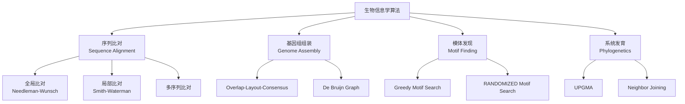

# 生物序列算法 - 六维内容补充

> **版本**: 1.0
> **创建日期**: 2026-04-19
> **最后更新**: 2026-04-19

> **模块**: 12-应用领域/02-生物信息学
> **文档**: 01-生物序列算法
> **补充维度**: 概念定义、属性、关系、解释、论证、形式证明
> **对标**: Stanford CS262 / MIT 6.047 / UCSD CSE 527
> **深度**: 研究生级

---

## 思维导图：生物序列算法概念结构

---

## 一、概念定义 (Concept Definition)

### 1.1 序列比对 / Sequence Alignment

**定义 1.1.1** (形式化)

**全局比对**: 对序列 $v$ ($|v|=n$) 和 $w$ ($|w|=m$)，找得分最高的对齐。

**比对矩阵** $s_{i,j}$: $v[1..i]$ 与 $w[1..j]$ 的最优比对得分。

**递推** (Needleman-Wunsch):

$$s_{i,j} = \max\begin{cases}
s_{i-1,j-1} + \delta(v_i, w_j) & \text{匹配/错配} \\
s_{i-1,j} + \delta_{gap} & \text{v中gap} \\
s_{i,j-1} + \delta_{gap} & \text{w中gap}
\end{cases}$$

**复杂度**: $O(nm)$ 时间，$O(nm)$ 空间（可优化至$O(\min(n,m))$）。

---

### 1.2 基因组组装

**定义 1.2.1**:

**De Bruijn图**: 从k-mer构造的图，节点是(k-1)-mer，边是k-mer。

**欧拉路径**: 经过每条边恰好一次的路径 → 重构基因组。

---

### 1.3 模体发现

**定义 1.3.1**:

**模体 (Motif)**: DNA序列中重复出现的模式。

**评分**: 给定对齐的k-mer集合，信息含量 (Information Content):

$$IC = \sum_{j=1}^{k} \sum_{b \in \{A,C,G,T\}} p_{j,b} \log_2 \frac{p_{j,b}}{q_b}$$

其中 $p_{j,b}$ 是位置$j$上碱基$b$的频率，$q_b$ 是背景频率。

---

## 二、属性 (Properties)

### 2.1 比对算法对比

| 算法 | 类型 | 时间 | 空间 | 应用 |
|------|------|------|------|------|
| **Needleman-Wunsch** | 全局 | $O(nm)$ | $O(nm)$ | 相似序列 |
| **Smith-Waterman** | 局部 | $O(nm)$ | $O(nm)$ | 域检测 |
| **BLAST** | 启发式 | $O(aW + bN + cNW/20^w)$ 期望≈$O(N)$ | $O(n)$ | 数据库搜索 |
| **BWA-MEM (BWT/FM-index)** | 索引搜索 | $O(m \cdot C)$ | $O(n)$ | 短读长映射 |
| **LexicMap** | 可变长种子 | 亚秒级（百万基因组） | ~6 GB | 超大规模搜索 |
| **HMM** | 概率 | $O(nm)$ | $O(nm)$ | 基因预测 |

### 2.2 组装算法对比

| 算法 | 方法 | 复杂度 | 适用 |
|------|------|--------|------|
| **Overlap-Layout-Consensus** | 重叠图 | $O(n^2)$ | 长读长 |
| **De Bruijn Graph** | k-mer图 | $O(n)$ | 短读长 |
| **String Graph** | 路径压缩 | $O(n)$ | 长读长 |

---

## 三、关系

| 源概念 | 目标概念 | 关系类型 |
|--------|----------|----------|
| 全局比对 | 编辑距离 | generalizes |
| De Bruijn图 | Eulerian路径 | requires |
| 模体发现 | 聚类 | similar_to |
| 系统发育树 | MST | related_to |

---

## 四、解释

### 4.1 BLAST为何快？

**关键思想**: 先找"种子" (短精确匹配)，再局部扩展。

步骤:
1. 索引数据库中的k-mer
2. 查询分解为k-mer
3. 快速查找匹配的种子
4. 对有希望的种子进行局部比对

**复杂度解析** [Altschul 1990]：
BLAST 的期望时间复杂度为 $T = O(aW + bN + cNW/20^w)$。当蛋白质 word 长度 $w \geq 3$（或 DNA $w \geq 11$）时，$20^w$ 使得扩展项 $cNW/20^w \ll aW + bN$，实际运行时间近似线性于数据库大小 $N$。

### 4.2 BWT/FM-index 为何高效？

**关键思想**：Burrows-Wheeler Transform（BWT）将字符串转换为可逆的排列形式，配合 FM-index 的 Occ 表和 C 表，实现向后搜索（backward search）。

- **BWT 构建**：诱导排序算法可在 $O(n)$ 时间内完成后缀数组和 BWT 的构造。
- **精确匹配**：查询长度为 $m$ 的序列，向后搜索仅需 $O(m)$ 时间。
- **BWA-MEM**：在 FM-index 基础上引入 Smith-Waterman 扩展和链式比对，实现带空位的近似比对。

### 4.3 百万级基因组比对的最新进展

2025 年 *Nature Biotechnology* 发表的 LexicMap [Zhao 2025] 代表了超大规模序列比对的前沿：

- **核心创新**：可变长种子匹配（variable-length seed matching）+ 前缀/后缀匹配，允许比对容忍更多突变。
- **性能数据**（100 万原核基因组数据库）：
  - 单次查询时间：**0.9 秒**（secY 基因）
  - 内存占用：**6.2 GB**
  - 对比 MMseqs2：**快 872 倍**
  - 对比 Minimap2：**快 39 倍**
  - 对比 BLASTn：**快 72 倍**
- **局限**：对高度分化序列（相似度 < 80%）或短片段比对的灵敏度略低于 BLASTn 和 MMseqs2。

### 4.2 De Bruijn图组装

**读取数据**: 数百万短读长 (100-300bp)
**问题**: 找一致超串是NP难的
**解决**: 转化为欧拉路径问题（多项式时间）

---

## 五、形式证明

### 5.1 比对算法最优性

**定理**: Needleman-Wunsch算法找到全局最优比对。

**证明** (归纳):

**基例**: $s_{0,0} = 0$ 显然最优。

**归纳**: 假设 $s_{i',j'}$ 对 $i' \leq i, j' \leq j$ 且 $(i',j') \neq (i,j)$ 最优。

$v[1..i]$ 与 $w[1..j]$ 的最优比对的最后一步必是三种情况之一：
- 匹配 $v_i$ 与 $w_j$
- gap在 $v_i$
- gap在 $w_j$

算法取三者最大值，因此 $s_{i,j}$ 最优。

---

---

## 参考文献 / References

1. **Altschul, S. F., et al.** (1990). "Basic local alignment search tool". *Journal of Molecular Biology*, 215(3), 403-410.
2. **Li, H.** (2013). "Aligning sequence reads, clone sequences and assembly contigs with BWA-MEM." *arXiv:1303.3997*.
3. **Zhao, C., et al.** (2025). "Efficient sequence alignment against millions of prokaryotic genomes with LexicMap." *Nature Biotechnology*. DOI: 10.1038/s41587-025-02812-8.
4. **Needleman, S. B., & Wunsch, C. D.** (1970). "A general method applicable to the search for similarities in the amino acid sequence of two proteins." *Journal of Molecular Biology*, 48(3), 443-453.
5. **Smith, T. F., & Waterman, M. S.** (1981). "Identification of common molecular subsequences." *Journal of Molecular Biology*, 147(1), 195-197.

**文档版本**: v1.0
**创建日期**: 2026-04-10
---

## 知识导航

- [返回目录](README.md)

## 学习目标

- 理解生物序列算法 - 六维内容补充的核心概念
- 掌握生物序列算法 - 六维内容补充的形式化表示
