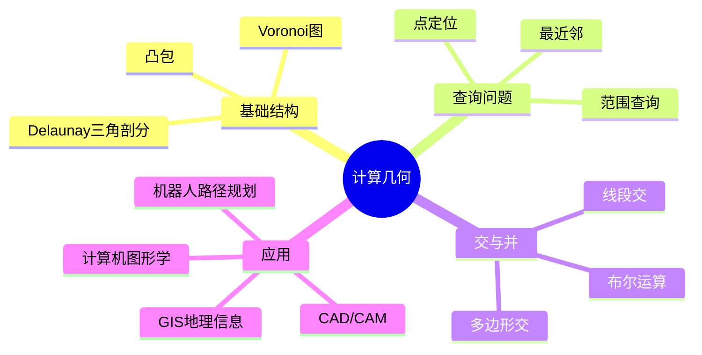

# 计算几何应用 - 六维补充


> **版本**: 1.0
> **创建日期**: 2026-04-19
> **最后更新**: 2026-04-19

> 本文档遵循六维内容标准：概念定义、属性、关系、解释、论证、形式证明

---

## 1. 概念定义 (Definition)

### 1.1 核心概念

**计算几何 (Computational Geometry)**

计算几何是研究几何对象算法的设计与分析领域，关注点、线、多边形、多面体等几何结构的算法问题。

### 1.2 思维导图



### 1.3 形式化定义

**定义 1 (凸包)**

给定点集 $S \subseteq \mathbb{R}^d$，凸包 $\text{CH}(S)$ 是包含 $S$ 的最小凸集：

$$
\text{CH}(S) = \left\{ \sum_{i=1}^k \lambda_i x_i \mid x_i \in S, \lambda_i \geq 0, \sum_{i=1}^k \lambda_i = 1 \right\}
$$

等价定义为所有包含 $S$ 的凸集的交。

**定义 2 (Voronoi图)**

给定点集 $P = \{p_1, p_2, \cdots, p_n\} \subset \mathbb{R}^2$，点 $p_i$ 的Voronoi区域：

$$
V(p_i) = \{ x \in \mathbb{R}^2 \mid d(x, p_i) \leq d(x, p_j), \forall j \neq i \}
$$

Voronoi图是这些区域的边界集合：

$$
\text{Vor}(P) = \bigcup_{i \neq j} \partial V(p_i) \cap \partial V(p_j)
$$

**定义 3 (Delaunay三角剖分)**

点集 $P$ 的Delaunay三角剖分 $DT(P)$ 满足**空圆性质**：

$$
\forall \triangle abc \in DT(P), \text{其外接圆内部不含 } P \text{ 中其他点}
$$

**定义 4 (对偶关系)**

Voronoi图与Delaunay三角剖分互为对偶图：

- Voronoi顶点 ↔ Delaunay三角形面
- Voronoi边 ↔ Delaunay边

---

## 2. 属性 (Properties)

### 2.1 凸包属性

| 属性 | 描述 | 公式/说明 |
|------|------|-----------|
| **凸性** | 凸包是凸集 | $\forall x,y \in \text{CH}(S), [x,y] \subseteq \text{CH}(S)$ |
| **极值点** | 极值点构成凸包 | $\text{CH}(S) = \text{CH}(\text{Ext}(S))$ |
| **Carathéodory** | $d$ 维最多 $d+1$ 点 | $x \in \text{CH}(S) \Rightarrow x \in \text{CH}(\{d+1 \text{ 点}\})$ |
| **Helly定理** | 凸集相交条件 | $d$ 维凸集族，两两交则整体交（有限情形）|

### 2.2 Voronoi图属性

| 属性 | 描述 | 说明 |
|------|------|------|
| **凸单元** | 每个 $V(p_i)$ 是凸多边形 | 半平面的交 |
| **无界单元** | 边界点对应无界区域 | 位于CH边界上的点 |
| **复杂度** | $O(n)$ 顶点和边 | 平面图的欧拉公式 |
| **最近邻图** | RNG是Voronoi子图 | 连接相邻Voronoi单元的点 |

### 2.3 算法复杂度

| 算法/结构 | 构建时间 | 空间 | 查询时间 |
|-----------|----------|------|----------|
| 2D凸包 (Graham扫描) | $O(n \log n)$ | $O(n)$ | - |
| 2D凸包 (Jarvis步进) | $O(nh)$ | $O(n)$ | - |
| 3D凸包 | $O(n \log n)$ | $O(n)$ | - |
| Voronoi图 | $O(n \log n)$ | $O(n)$ | $O(\log n)$ 最近邻 |
| Delaunay三角剖分 | $O(n \log n)$ | $O(n)$ | - |
| 点定位 | 预处理 $O(n \log n)$ | $O(n)$ | $O(\log n)$ |
| 范围树 | 预处理 $O(n \log^{d-1} n)$ | $O(n \log^{d-1} n)$ | $O(\log^d n + k)$ |

---

## 3. 关系 (Relations)

### 3.1 结构间关系

| 结构A | 关系 | 结构B | 说明 |
|-------|------|-------|------|
| Voronoi图 | 对偶 | Delaunay三角剖分 | 一一对应 |
| Delaunay边 | 子集 | 欧氏MST边 | MST ⊆ Delaunay |
| 欧氏MST | 子集 | 相对邻域图 | RNG ⊆ MST |
| Gabriel图 | 中间 | RNG与Delaunay之间 | 特定半径圆 |
| 凸包 | 边界 | Voronoi无界单元 | 一一对应 |

### 3.2 几何结构层次

```
完全图 (完全连接)
    |
    +-- Gabriel图 (直径圆为空)
    |       |
    |       +-- 相对邻域图 RNG
    |               |
    |               +-- 欧氏MST (最小生成树)
    |
    +-- Delaunay三角剖分
            |
            +-- Voronoi图 (对偶)
```

### 3.3 与其他领域关系

| 领域 | 应用 | 典型问题 |
|------|------|----------|
| 图形学 | 网格生成 | Delaunay剖分 |
| 机器人 | 路径规划 | 构型空间、Voronoi |
| GIS | 设施选址 | 最近邻、Voronoi |
| 机器学习 | 分类 | k-NN、Voronoi区域 |
| 物理模拟 | 粒子系统 | 邻近查询 |

---

## 4. 解释 (Explanation)

### 4.1 凸包直观理解

**橡皮筋类比**

想象将橡皮筋套在一组钉子（点）外围：

- 橡皮筋自然收缩后的形状就是凸包
- 只有外围的钉子（极值点）决定凸包形状
- 内部的点不影响凸包

**应用实例**

- 碰撞检测：包围盒简化
- 形状分析：物体轮廓
- 优化问题：可行域边界

### 4.2 Voronoi图直观理解

**势力范围划分**

想象平面上有多个商店（种子点），每个顾客去最近的商店：

```
      ·p1
       |\    ·p3
       | \   /
       |  \ /
       |   X
       |  / \
       ·-·---·
      p2  q   p4

每个区域V(p_i)内的点到p_i最近
边界上的点到两个种子距离相等
顶点q到三个种子距离相等
```

**应用实例**

- 最近邻查询：定位所在区域
- 设施选址：最大化最小距离
- 自然模式：细胞结构、晶体生长

### 4.3 Delaunay三角剖分直观

**最大化最小角**

在所有可能的三角剖分中，Delaunay剖分最大化最小内角：

- 避免"扁平"三角形
- 更适合插值和渲染
- 空圆性质保证质量

**与Voronoi的对偶**

```
Voronoi顶点 ←→ Delaunay三角形中心（外心）
Voronoi边   ←→ Delaunay边（垂直平分线）
Voronoi单元 ←→ Delaunay顶点（种子点）
```

### 4.4 代码示例

**Graham扫描凸包算法**

```python
from functools import cmp_to_key
import math

def graham_scan(points):
    """
    Graham扫描算法求凸包
    时间复杂度: O(n log n)
    """
    # 找到最左下角的点作为起点
    start = min(points, key=lambda p: (p[1], p[0]))

    def polar_angle(p):
        """计算相对于start的极角"""
        return math.atan2(p[1] - start[1], p[0] - start[0])

    def cross(o, a, b):
        """叉积: (OA × OB)"""
        return (a[0] - o[0]) * (b[1] - o[1]) - (a[1] - o[1]) * (b[0] - o[0])

    # 按极角排序
    sorted_points = sorted([p for p in points if p != start],
                          key=lambda p: (polar_angle(p),
                                        (p[0]-start[0])**2 + (p[1]-start[1])**2))

    # Graham扫描
    hull = [start]
    for p in sorted_points:
        # 如果形成非左转，弹出栈顶
        while len(hull) >= 2 and cross(hull[-2], hull[-1], p) <= 0:
            hull.pop()
        hull.append(p)

    return hull

# 示例
points = [(0,0), (1,0), (0.5, 0.5), (1,1), (0,1), (0.5, -0.5)]
hull = graham_scan(points)
print(f"凸包顶点: {hull}")
# 输出: 按逆时针顺序的凸包顶点
```

**Voronoi图简化实现 (使用SciPy风格)**

```python
import numpy as np
from scipy.spatial import Voronoi, voronoi_plot_2d

def voronoi_demo():
    """Voronoi图演示"""
    # 种子点
    points = np.array([
        [0, 0], [1, 0], [0.5, 0.866],  # 等边三角形
        [0.5, 0.289]  # 中心点
    ])

    # 构建Voronoi图
    vor = Voronoi(points)

    # Voronoi顶点 (到多个种子等距的点)
    print("Voronoi顶点:", vor.vertices)

    # 每个区域对应的种子点索引
    print("区域:", vor.regions)

    # 查询最近邻
    query_point = [0.3, 0.3]
    distances = np.sum((points - query_point)**2, axis=1)
    nearest = np.argmin(distances)
    print(f"点 {query_point} 最近邻是种子点 {nearest}")

    return vor

# Delaunay三角剖分
def delaunay_demo():
    from scipy.spatial import Delaunay

    points = np.random.rand(10, 2)
    tri = Delaunay(points)

    print("三角形数量:", len(tri.simplices))
    print("三角形索引:", tri.simplices)
    # 每个simplex是一个三角形，包含三个点的索引
```

---

## 5. 论证 (Argumentation)

### 5.1 为什么需要这些结构？

**论证 1：凸包的价值**

> 凸包将任意点集简化为凸多边形，使得：
>
> - 碰撞检测从 $O(n)$ 降为 $O(h)$，$h \ll n$
> - 形状分析聚焦边界特征
> - 优化问题可行域凸化

**论证 2：Voronoi图的优势**

| 问题 | 朴素方法 | Voronoi方法 |
|------|----------|-------------|
| 最近邻查询 | $O(n)$ | $O(\log n)$ |
| 最近设施 | 全遍历 | 直接定位 |
| 最大空圆 | $O(n^3)$ | $O(n)$ (检查顶点) |

**论证 3：Delaunay三角剖分的最优性**

> Delaunay三角剖分最大化最小角，这意味着：
>
> - 最瘦长三角形的角度尽可能大
> - 有限元分析更准确
> - 表面重建更平滑

### 5.2 算法选择论证

| 场景 | 推荐算法 | 理由 |
|------|----------|------|
| 点集随机 | Graham扫描 | $O(n \log n)$ 稳定 |
| $h \ll n$ | Jarvis步进 | $O(nh)$ 可能更快 |
| 在线插入 | 增量式 | 动态更新 |
| 三维凸包 | QuickHull | 实际表现好 |

### 5.3 下界论证

**排序归约**

凸包问题的下界 $\Omega(n \log n)$ 可通过排序归约证明：

```
给定数字 x_1, ..., x_n，构造点 (x_i, x_i^2)
这些点都在抛物线 y = x^2 上
凸包上的点就是排序后的顺序
因此凸包至少和排序一样难
```

---

## 6. 形式证明 (Formal Proofs)

### 6.1 引理：凸包的极值点表示

**引理 6.1** 对任意有限点集 $S \subset \mathbb{R}^d$，凸包 $\text{CH}(S)$ 等于 $S$ 的极值点的凸包。

*证明：*

设 $E = \text{Ext}(S)$ 为极值点集。

- 显然 $\text{CH}(E) \subseteq \text{CH}(S)$（因 $E \subseteq S$）
- 对任意 $x \in \text{CH}(S)$，由Carathéodory定理，$x$ 是 $S$ 中 $d+1$ 个点的凸组合
- 若非极值点参与组合，可被替换为极值点而不改变凸包
- 故 $x \in \text{CH}(E)$ ∎

### 6.2 定理：Graham扫描正确性

**定理 6.2** Graham扫描算法返回点集 $S$ 的凸包。

*证明概要：*

**不变式**：栈中始终存储一个凸链，即栈中连续三点总是左转。

- **初始化**：栈中只有起点，显然满足
- **维护**：处理新点 $p$ 时，若形成右转/共线则弹出，直到左转后压入
- **终止**：所有点处理完后，栈中形成完整凸包

### 6.3 定理：Voronoi区域是凸的

**定理 6.3** 每个Voronoi区域 $V(p_i)$ 是凸集。

*证明：*

$$
V(p_i) = \bigcap_{j \neq i} H(p_i, p_j)
$$

其中 $H(p_i, p_j) = \{x \mid d(x, p_i) \leq d(x, p_j)\}$ 是半平面。

半平面是凸集，凸集的任意交仍是凸集，故 $V(p_i)$ 凸。∎

### 6.4 定理：Delaunay空圆性质

**定理 6.4** 三角剖分 $T$ 是Delaunay的当且仅当满足空圆性质。

*证明概要：*

**(⇒)** 设 $T = DT(P)$。若某三角形 $\triangle abc$ 外接圆含点 $p$，
则 $p$ 到圆心比 $a,b,c$ 更近，与Voronoi对偶矛盾。

**(⇐)** 设 $T$ 满足空圆性质。构造Voronoi图，由对偶性，
每个Voronoi顶点对应一个空外接圆，对应Delaunay三角形。

### 6.5 定理：Voronoi-Delaunay对偶

**定理 6.5** Voronoi图与Delaunay三角剖分互为平面对偶图。

*证明：*

- **顶点对偶**：Voronoi顶点 $v$ 是三个种子点 $p_i, p_j, p_k$ 的等距点
  $\Rightarrow$ $\triangle p_i p_j p_k$ 是Delaunay三角形

- **边对偶**：Voronoi边是两个Voronoi区域的边界
  $\Rightarrow$ 垂直平分线段
  $\Rightarrow$ 对应Delaunay边（种子点连线）

- **面对偶**：Voronoi单元 $V(p_i)$ 对应Delaunay顶点 $p_i$

### 6.6 复杂度下界

**定理 6.6** 在代数决策树模型中，平面凸包问题需要 $\Omega(n \log n)$ 时间。

*证明：*

通过排序问题归约：
给定 $x_1, \cdots, x_n$，构造点 $(x_i, x_i^2)$。
这些点位于抛物线上，凸包顶点按 $x$ 坐标排序。
若凸包可在 $o(n \log n)$ 时间计算，则排序也可，矛盾。

---

## 附录：常用公式速查

| 公式 | 表达式 |
|------|--------|
| 叉积 (2D) | $\vec{a} \times \vec{b} = a_x b_y - a_y b_x$ |
| 点积 | $\vec{a} \cdot \vec{b} = a_x b_x + a_y b_y$ |
| 距离 | $d(p,q) = \sqrt{(p_x-q_x)^2 + (p_y-q_y)^2}$ |
| 三角形面积 | $A = \frac{1}{2}|(b-a) \times (c-a)|$ |
| 外接圆中心 | 垂直平分线交点 |
| 凸组合 | $\sum \lambda_i p_i$，$\lambda_i \geq 0$，$\sum \lambda_i = 1$ |

---

*文档版本: v1.0 | 六维内容标准 | 计算几何专题*

---

## 参考文献

- 待补充

---

## 知识导航

- [返回目录](README.md)

## 学习目标

- 理解计算几何应用 - 六维补充的核心概念
- 掌握计算几何应用 - 六维补充的形式化表示
