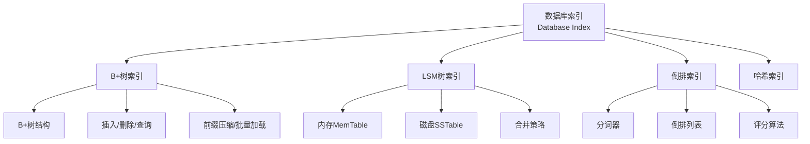

# 数据库索引算法 - 六维内容补充


> **版本**: 1.0
> **创建日期**: 2026-04-19
> **最后更新**: 2026-04-19

> **模块**: 12-应用领域/04-数据库算法
> **文档**: 01-数据库索引
> **补充维度**: 概念定义、属性、关系、解释、论证、形式证明
> **对标**: CMU 15-445 / MIT 6.830 / Stanford CS145
> **深度**: 研究生级

---

## 思维导图：数据库索引核心概念结构



---

## 一、概念定义 (Concept Definition)

### 1.1 B+树索引

**定义 1.1.1** (B+树 / B+ Tree)

B+树是一种自平衡的树数据结构，满足以下性质：

1. **阶数** $m$: 每个内部节点最多有 $m$ 个子节点
2. **填充因子**: 每个内部节点（除根节点外）至少有 $\lceil m/2 \rceil$ 个子节点
3. **叶子节点**: 所有叶子节点在同一层级，包含实际数据或数据指针
4. **链表结构**: 叶子节点通过指针连接形成有序链表

**节点结构**:

- 内部节点: $\{P_0, K_1, P_1, K_2, P_2, \cdots, K_n, P_n\}$，其中 $K_i$ 为键，$P_i$ 为指针
- 叶子节点: $\{(K_1, V_1), (K_2, V_2), \cdots, (K_n, V_n)\}$，其中 $V_i$ 为数据或指针

---

### 1.2 LSM树

**定义 1.2.1** (LSM树 / Log-Structured Merge Tree)

LSM树是一种针对写优化的数据结构，通过将随机写转换为顺序写来提高写入性能：

1. **MemTable**: 内存中的有序数据结构（通常使用跳表或红黑树）
2. **WAL** (Write-Ahead Log): 预写日志，保证数据持久性
3. **SSTable** (Sorted String Table): 磁盘上的不可变有序文件
4. **Level**: SSTable按层级组织，高层数据量更大

**写入流程**:

1. 写WAL保证持久性
2. 写入MemTable
3. MemTable满后，刷新为SSTable
4. 后台合并(Compaction)整理数据

---

### 1.3 倒排索引

**定义 1.3.1** (倒排索引 / Inverted Index)

倒排索引是从词项到文档列表的映射，用于高效的全文搜索：

$$\text{Inverted Index}: \text{term} \rightarrow [(doc_1, freq_1, [pos_1, pos_2, ...]), (doc_2, freq_2, ...), ...]$$

**核心组件**:

- **词典** (Dictionary/Vocabulary): 所有词项的有序列表
- **倒排列表** (Posting List): 每个词项对应的文档列表
- **位置信息** (Position): 词项在文档中的出现位置（用于短语查询）

---

## 二、属性 (Properties)

### 2.1 索引类型对比

| 特性 | B+树 | LSM树 | 倒排索引 | 哈希索引 |
|------|------|-------|---------|---------|
| **查询复杂度** | $O(\log_m N)$ | $O(\log N)$ ~ $O(N)$ | $O(1)$ 词典 | $O(1)$ 平均 |
| **写入复杂度** | $O(\log_m N)$ | $O(1)$ 摊还 | $O(1)$ 平均 | $O(1)$ 平均 |
| **范围查询** | 优秀 | 良好 | 较差 | 不支持 |
| **点查询** | 良好 | 良好 | 一般 | 优秀 |
| **空间放大** | 低 | 高（需合并） | 中等 | 中等 |
| **写放大** | 低 | 高 | 中等 | 低 |
| **适用场景** | OLTP | 高吞吐写入 | 全文搜索 | 等值查询 |

### 2.2 B+树参数分析

| 参数 | 说明 | 典型值 | 影响 |
|------|------|--------|------|
| **阶数 $m$** | 最大子节点数 | 100-500 | 树高度 $h \approx \log_m N$ |
| **页大小** | 磁盘页大小 | 4KB-16KB | 磁盘I/O效率 |
| **填充因子** | 最小填充比例 | 50% | 空间利用率 |

**树高度估算**:

- 假设 $m = 500$，页可存储约500个键
- 100万条记录：高度 $h \approx \log_{500} 10^6 \approx 2$
- 10亿条记录：高度 $h \approx \log_{500} 10^9 \approx 3$

### 2.3 LSM树合并策略对比

| 策略 | 触发条件 | 优点 | 缺点 |
|------|---------|------|------|
| **Size-Tiered** | 层内文件数超限 | 写放大低 | 读放大高 |
| **Leveled** | 层大小超限 | 读放大低 | 写放大高 |
| **Tiered+Leveled** | 混合策略 | 平衡 | 实现复杂 |

---

## 三、关系 (Relationships)

### 3.1 索引与存储引擎关系

| 存储引擎 | 主要索引 | 特点 |
|----------|---------|------|
| InnoDB (MySQL) | B+树（聚簇索引） | 数据与索引共存 |
| MyISAM (MySQL) | B+树（非聚簇） | 索引与数据分离 |
| LevelDB/RocksDB | LSM树 | 高写入吞吐 |
| Lucene/Elasticsearch | 倒排索引 | 全文搜索 |

### 3.2 概念依赖关系

```
数据存储需求
    ↓
┌─────────────┬─────────────┬─────────────┐
↓             ↓             ↓             ↓
B+树         LSM树        倒排索引      哈希索引
（通用OLTP）  （写密集型）  （搜索型）    （等值查询）
    ↓             ↓             ↓
磁盘I/O优化   顺序写优化   词项分词
    ↓             ↓             ↓
页缓存        Compaction   倒排列表压缩
```

---

## 四、解释 (Explanation)

### 4.1 B+树为什么优于B树

**关键区别**:

- B树：数据存储在所有节点
- B+树：数据只存储在叶子节点，内部节点只存储键

**优势**:

1. **更高的分支因子**: 内部节点不存数据，可容纳更多键
2. **更好的缓存局部性**: 叶子节点形成链表，顺序访问友好
3. **稳定的查询性能**: 所有查询都到叶子层，路径长度相同

```
B树节点: [Key|Data|Key|Data|Key|Data]
          ↓    ↑   ↓    ↑   ↓    ↑
        子树  数据 子树 数据 子树 数据

B+树内部节点: [Key|Key|Key]
               ↓   ↓   ↓
             子树 子树 子树

B+树叶子节点: [Key|Data] ↔ [Key|Data] ↔ [Key|Data] ↔ ...
               ↓    ↑      ↓    ↑      ↓    ↑
             指向数据的指针，叶子间有链表连接
```

### 4.2 LSM树的写放大问题

**写放大** (Write Amplification): 实际写入磁盘的数据量与应用程序写入数据量的比值。

**来源**:

1. WAL写入：每次写先写日志
2. MemTable刷新：内存数据写入磁盘
3. Compaction：合并过程中数据被多次重写

**Leveled Compaction写放大估算**:

- 假设有 $L$ 层，每层大小是上一层的 $T$ 倍
- 数据从第0层到第 $L$ 层，每层都会被重写一次
- 写放大 $\approx T \times L$

**优化策略**:

- 使用Tiered Compaction降低写放大
- 调整层大小比例
- 使用压缩减少数据量

### 4.3 倒排索引的压缩技术

**动机**: 倒排列表通常非常稀疏，需要高效压缩。

**方法**:

1. **文档ID差值编码** (Delta Encoding):
   - 原始: $[10, 100, 105, 200, 205]$
   - 差值: $[10, 90, 5, 95, 5]$
   - 差值更小，适合变长编码

2. **变长编码** (Variable Byte Encoding):
   - 小数字用1字节，大数字用多字节
   - 每字节最高位表示是否继续

3. **PForDelta**:
   - 将数据分块，每块用一个异常列表处理大值
   - 其余值用固定位数编码

---

## 五、形式证明 (Formal Proofs)

### 5.1 B+树查询复杂度

**定理**: 在包含 $N$ 个键的 $m$ 阶B+树中，查找操作的时间复杂度为 $O(\log_m N)$。

**证明**:

设树高度为 $h$。

**每层节点数下界**:

- 根节点至少2个子节点
- 其他内部节点至少 $\lceil m/2 \rceil$ 个子节点

**叶子节点数**:
$$N_{leaf} \geq 2 \times (\lceil m/2 \rceil)^{h-1}$$

由于叶子节点包含所有 $N$ 个键：
$$N \geq 2 \times (\lceil m/2 \rceil)^{h-1}$$

解得：
$$h \leq 1 + \log_{\lceil m/2 \rceil} \frac{N}{2} = O(\log_m N)$$

每层进行一次二分查找，复杂度 $O(\log m)$。

总复杂度：$O(\log_m N \times \log m) = O(\log N)$。

但通常 $m$ 较大且为常数，视为 $O(\log_m N)$ 次磁盘I/O。

∎

### 5.2 LSM树读取复杂度

**定理**: 在具有 $L$ 层、每层最多 $T$ 个SSTable的LSM树中，最坏情况点查询需要检查 $O(L \times T)$ 个SSTable。

**证明**:

**分层结构**:

- Level 0: 最多 $T$ 个SSTable（来自MemTable刷新）
- Level $i$: SSTable总大小不超过 $T^i \times S$（$S$为单个SSTable大小）

**查询过程**:

1. 检查MemTable: $O(1)$
2. 按从Level 0到Level $L$的顺序检查SSTable
3. 每层可能需要检查最多 $T$ 个SSTable（Bloom过滤器判断）

**最坏情况**: 数据在最底层，需要检查所有层的所有SSTable：
$$\text{检查次数} = L \times T$$

**优化后**（使用Bloom过滤器）:

- 假阳性率 $p$，则期望检查次数为 $L \times T \times p + 1$（找到后停止）

∎

### 5.3 倒排索引空间复杂度

**定理**: 对于包含 $D$ 个文档、总词项数为 $T$ 的文档集合，倒排索引的空间复杂度为 $O(T + V)$，其中 $V$ 为词汇表大小。

**证明**:

**词典空间**: 存储 $V$ 个唯一词项，$O(V)$。

**倒排列表空间**:

- 每个词项出现一次，在对应倒排列表中记录一次
- 总记录数 = 总词项数 $T$
- 每条记录包含文档ID、频率、位置等信息，$O(1)$ 空间

**总空间**: $O(V + T)$

**注意**: 如果使用压缩，实际空间会更小。

∎

---

## 六、实现参考

### 6.1 B+树节点结构

```rust
// B+树节点
enum BPlusNode<K, V> {
    Internal {
        keys: Vec<K>,
        children: Vec<Box<BPlusNode<K, V>>>,
    },
    Leaf {
        keys: Vec<K>,
        values: Vec<V>,
        next: Option<Box<BPlusNode<K, V>>>,
    },
}

// B+树
pub struct BPlusTree<K, V> {
    root: Option<Box<BPlusNode<K, V>>>,
    degree: usize,
    leaf_linked_list_head: Option<*mut BPlusNode<K, V>>,
}
```

### 6.2 LSM树核心组件

```rust
// MemTable
pub struct MemTable<K, V> {
    data: BTreeMap<K, V>,  // 或 SkipList
    wal: WriteAheadLog,
}

// SSTable
pub struct SSTable<K, V> {
    index: BTreeMap<K, u64>,  // 键到文件偏移的映射
    bloom_filter: BloomFilter,
    file_path: PathBuf,
}

// LSM树
pub struct LSMTree<K, V> {
    memtable: MemTable<K, V>,
    levels: Vec<Vec<SSTable<K, V>>>,
    config: LSMConfig,
}
```

### 6.3 倒排索引核心结构

```rust
// 倒排列表项
pub struct Posting {
    doc_id: DocId,
    term_freq: u32,
    positions: Vec<u32>,
}

// 倒排索引
pub struct InvertedIndex {
    dictionary: BTreeMap<Term, PostingList>,
    doc_count: usize,
    total_term_freq: usize,
}

// 查询结果
pub struct SearchResult {
    doc_id: DocId,
    score: f64,
}
```

---

## 参考文献

1. Graefe, G. (2011). Modern B-tree techniques. *Foundations and Trends in Databases*, 3(4), 203-402.
2. O'Neil, P., et al. (1996). The log-structured merge-tree (LSM-tree). *Acta Informatica*, 33(4), 351-385.
3. Zobel, J., & Moffat, A. (2006). Inverted files for text search engines. *ACM Computing Surveys*, 38(2), 6.
4. Callaghan, M., et al. (2021). RocksDB: Evolution of development priorities in a key-value store serving large-scale applications. *ACM Transactions on Storage*.
5. MySQL Documentation: InnoDB Index Structures.

---

**文档版本**: v1.0
**创建日期**: 2026-04-10
---

## 知识导航

- [返回目录](README.md)

## 学习目标

- 理解数据库索引算法 - 六维内容补充的核心概念
- 掌握数据库索引算法 - 六维内容补充的形式化表示
