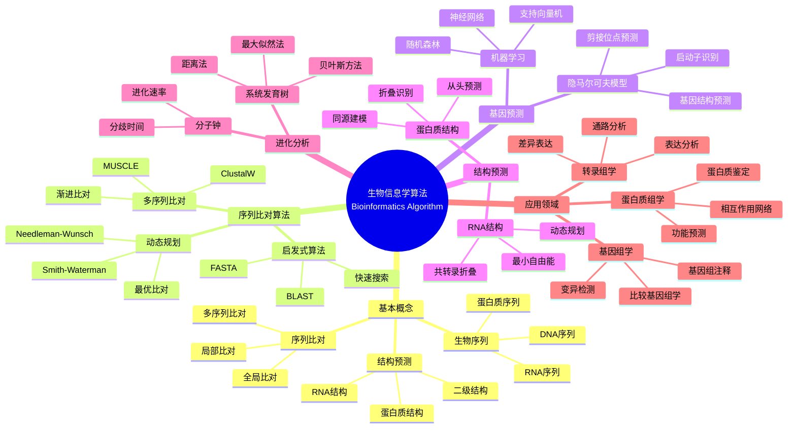

> 📊 **项目全面梳理**：详细的项目结构、模块详解和学习路径，请参阅 [`项目全面梳理-2025.md`](../项目全面梳理-2025.md)

## 12.4 生物信息学算法应用 / Bioinformatics Algorithm Applications

### 摘要 / Executive Summary

- 统一生物信息学算法在各类应用中的使用规范与最佳实践。
- 建立生物信息学算法在应用领域中的核心地位。

### 关键术语与符号 / Glossary

- 生物信息学、序列比对、基因预测、蛋白质结构预测、系统生物学、进化分析。
- 术语对齐与引用规范：`docs/术语与符号总表.md`，`01-基础理论/00-撰写规范与引用指南.md`

### 术语与符号规范 / Terminology & Notation

- 生物信息学（Bioinformatics）：应用计算机技术研究生物数据的学科。
- 序列比对（Sequence Alignment）：比较生物序列相似性的方法。
- 基因预测（Gene Prediction）：从DNA序列中识别基因的方法。
- 蛋白质结构预测（Protein Structure Prediction）：预测蛋白质三维结构的方法。
- 记号约定：`S` 表示序列，`A` 表示比对，`G` 表示基因，`P` 表示蛋白质。

### 交叉引用导航 / Cross-References

- 算法设计：参见 `09-算法理论/01-算法基础/01-算法设计理论.md`。
- 搜索算法：参见 `09-算法理论/01-算法基础/04-搜索算法理论.md`。
- 图算法：参见 `09-算法理论/01-算法基础/05-图算法理论.md`。

### 快速导航 / Quick Links

- 基本概念
- 序列比对
- 基因预测

## 目录 / Table of Contents

- [12.4 生物信息学算法应用 / Bioinformatics Algorithm Applications](#124-生物信息学算法应用--bioinformatics-algorithm-applications)
  - [摘要 / Executive Summary](#摘要--executive-summary)
  - [关键术语与符号 / Glossary](#关键术语与符号--glossary)
  - [术语与符号规范 / Terminology \& Notation](#术语与符号规范--terminology--notation)
  - [交叉引用导航 / Cross-References](#交叉引用导航--cross-references)
  - [快速导航 / Quick Links](#快速导航--quick-links)
- [目录 / Table of Contents](#目录--table-of-contents)
- [0. 生物计算哲学基础 / Bio-computation Philosophy Foundation](#0-生物计算哲学基础--bio-computation-philosophy-foundation)
  - [0.1 生物计算的本质哲学探讨 / Philosophical Discussion on the Nature of Bio-computation](#01-生物计算的本质哲学探讨--philosophical-discussion-on-the-nature-of-bio-computation)
    - [0.1.1 生物计算的本体论问题 / Ontological Issues of Bio-computation](#011-生物计算的本体论问题--ontological-issues-of-bio-computation)
    - [0.1.2 生物计算的认识论问题 / Epistemological Issues of Bio-computation](#012-生物计算的认识论问题--epistemological-issues-of-bio-computation)
    - [0.1.3 生物计算的价值论问题 / Axiological Issues of Bio-computation](#013-生物计算的价值论问题--axiological-issues-of-bio-computation)
  - [0.2 生物计算的形式化基础 / Formal Foundation of Bio-computation](#02-生物计算的形式化基础--formal-foundation-of-bio-computation)
    - [0.2.1 生物计算的形式化定义 / Formal Definition of Bio-computation](#021-生物计算的形式化定义--formal-definition-of-bio-computation)
    - [0.2.2 生物计算的基本性质 / Basic Properties of Bio-computation](#022-生物计算的基本性质--basic-properties-of-bio-computation)
    - [0.2.3 生物计算与经典计算的比较 / Comparison with Classical Computation](#023-生物计算与经典计算的比较--comparison-with-classical-computation)
  - [0.3 生物计算的哲学意义 / Philosophical Significance of Bio-computation](#03-生物计算的哲学意义--philosophical-significance-of-bio-computation)
    - [0.3.1 对生命本质的理解 / Understanding the Nature of Life](#031-对生命本质的理解--understanding-the-nature-of-life)
    - [0.3.2 对计算理论的拓展 / Extension of Computation Theory](#032-对计算理论的拓展--extension-of-computation-theory)
    - [0.3.3 对科学哲学的贡献 / Contribution to Philosophy of Science](#033-对科学哲学的贡献--contribution-to-philosophy-of-science)
- [概述 / Overview](#概述--overview)
- [1. 形式化定义 / Formal Definitions](#1-形式化定义--formal-definitions)
  - [1.1 生物序列 / Biological Sequence](#11-生物序列--biological-sequence)
  - [1.2 序列比对 / Sequence Alignment](#12-序列比对--sequence-alignment)
- [2. 核心算法 / Core Algorithms](#2-核心算法--core-algorithms)
  - [2.1 动态规划序列比对 / Dynamic Programming Sequence Alignment](#21-动态规划序列比对--dynamic-programming-sequence-alignment)
  - [2.2 隐马尔可夫模型 / Hidden Markov Model](#22-隐马尔可夫模型--hidden-markov-model)
  - [2.3 聚类分析 / Clustering Analysis](#23-聚类分析--clustering-analysis)
- [3. 序列分析 / Sequence Analysis](#3-序列分析--sequence-analysis)
  - [3.1 序列模式识别 / Sequence Pattern Recognition](#31-序列模式识别--sequence-pattern-recognition)
  - [3.2 序列相似性 / Sequence Similarity](#32-序列相似性--sequence-similarity)
- [4. 结构预测 / Structure Prediction](#4-结构预测--structure-prediction)
  - [4.1 蛋白质结构预测 / Protein Structure Prediction](#41-蛋白质结构预测--protein-structure-prediction)
  - [4.2 RNA结构预测 / RNA Structure Prediction](#42-rna结构预测--rna-structure-prediction)
- [5. 实现示例 / Implementation Examples](#5-实现示例--implementation-examples)
  - [5.1 序列比对工具 / Sequence Alignment Tool](#51-序列比对工具--sequence-alignment-tool)
  - [5.2 基因表达分析 / Gene Expression Analysis](#52-基因表达分析--gene-expression-analysis)
- [6. 数学证明 / Mathematical Proofs](#6-数学证明--mathematical-proofs)
  - [6.1 动态规划最优性 / Dynamic Programming Optimality](#61-动态规划最优性--dynamic-programming-optimality)
  - [6.2 Viterbi算法正确性 / Viterbi Algorithm Correctness](#62-viterbi算法正确性--viterbi-algorithm-correctness)
- [7. 复杂度分析 / Complexity Analysis](#7-复杂度分析--complexity-analysis)
  - [7.1 时间复杂度 / Time Complexity](#71-时间复杂度--time-complexity)
  - [7.2 空间复杂度 / Space Complexity](#72-空间复杂度--space-complexity)
- [8. 应用场景 / Application Scenarios](#8-应用场景--application-scenarios)
  - [8.1 基因组学 / Genomics](#81-基因组学--genomics)
  - [8.2 蛋白质组学 / Proteomics](#82-蛋白质组学--proteomics)
  - [8.3 转录组学 / Transcriptomics](#83-转录组学--transcriptomics)
- [9. 未来发展方向 / Future Development Directions](#9-未来发展方向--future-development-directions)
  - [9.1 深度学习应用 / Deep Learning Applications](#91-深度学习应用--deep-learning-applications)
  - [9.2 单细胞技术 / Single-cell Technology](#92-单细胞技术--single-cell-technology)
  - [9.3 多组学整合 / Multi-omics Integration](#93-多组学整合--multi-omics-integration)
- [10. 参考文献 / References](#10-参考文献--references)
  - [10.1 经典教材 / Classic Textbooks](#101-经典教材--classic-textbooks)
  - [10.2 Wiki概念参考 / Wiki Concept References](#102-wiki概念参考--wiki-concept-references)
  - [10.3 大学课程参考 / University Course References](#103-大学课程参考--university-course-references)
- [11. 总结 / Summary](#11-总结--summary)
- [11. 与项目结构主题的对齐 / Alignment with Project Structure](#11-与项目结构主题的对齐--alignment-with-project-structure)
  - [相关文档 / Related Documents](#相关文档--related-documents)
  - [知识体系位置 / Knowledge System Position](#知识体系位置--knowledge-system-position)
  - [VIEW文件夹相关文档 / VIEW Folder Related Documents](#view文件夹相关文档--view-folder-related-documents)

## 0. 生物计算哲学基础 / Bio-computation Philosophy Foundation

### 0.1 生物计算的本质哲学探讨 / Philosophical Discussion on the Nature of Bio-computation

#### 0.1.1 生物计算的本体论问题 / Ontological Issues of Bio-computation

**定义 / Definition:**
生物计算是研究生物系统中信息处理、计算过程和算法本质的跨学科领域，涉及生物学、计算机科学、数学和哲学的深度融合。

**本体论问题 / Ontological Questions:**

1. **生物计算的存在性 / Existence of Bio-computation:**
   - 生物系统是否本质上具有计算性质？
   - 生物计算是涌现现象还是基础属性？
   - 生物计算与物理计算的关系如何？

2. **生物计算的层次性 / Hierarchical Nature:**
   - 分子层面的计算（DNA复制、蛋白质折叠）
   - 细胞层面的计算（信号转导、代谢调控）
   - 系统层面的计算（神经网络、免疫系统）

3. **生物计算的本质属性 / Essential Properties:**
   - 自适应性（Adaptability）
   - 鲁棒性（Robustness）
   - 涌现性（Emergence）
   - 非线性（Non-linearity）

#### 0.1.2 生物计算的认识论问题 / Epistemological Issues of Bio-computation

**认识论问题 / Epistemological Questions:**

1. **生物计算的认知边界 / Cognitive Boundaries:**
   - 我们能否完全理解生物计算的复杂性？
   - 生物计算的可预测性限度在哪里？
   - 生物计算与人工计算的认知差异

2. **生物计算的知识获取 / Knowledge Acquisition:**
   - 观察与干预的平衡
   - 模型与现实的对应关系
   - 理论预测与实验验证的统一

3. **生物计算的方法论 / Methodology:**
   - 还原论与整体论的结合
   - 定量分析与定性理解的统一
   - 跨学科方法的整合

#### 0.1.3 生物计算的价值论问题 / Axiological Issues of Bio-computation

**价值论问题 / Axiological Questions:**

1. **生物计算的伦理价值 / Ethical Value:**
   - 生命信息的隐私与保护
   - 基因编辑的伦理边界
   - 生物计算的公平性与可及性

2. **生物计算的社会价值 / Social Value:**
   - 医疗健康的改善
   - 农业生产的优化
   - 环境保护的应用

3. **生物计算的科学价值 / Scientific Value:**
   - 生命本质的理解
   - 计算理论的拓展
   - 跨学科知识的整合

### 0.2 生物计算的形式化基础 / Formal Foundation of Bio-computation

#### 0.2.1 生物计算的形式化定义 / Formal Definition of Bio-computation

**定义 / Definition:**
生物计算系统是一个五元组 $(S, \Sigma, \delta, s_0, F)$，其中：

- $S$: 状态集合（生物系统的可能状态）
- $\Sigma$: 输入字母表（环境刺激、分子信号）
- $\delta: S \times \Sigma \rightarrow S$: 状态转移函数（生物响应机制）
- $s_0 \in S$: 初始状态（生物系统的起始状态）
- $F \subseteq S$: 接受状态集合（目标状态）

**形式化表示 / Formal Representation:**

```text
BioComputation = (S, Σ, δ, s₀, F)
其中 / where:
- S: 状态空间 / State space
- Σ: 输入空间 / Input space
- δ: 转移函数 / Transition function
- s₀: 初始状态 / Initial state
- F: 目标状态 / Target states
```

#### 0.2.2 生物计算的基本性质 / Basic Properties of Bio-computation

**定理 / Theorem:**
生物计算系统具有以下基本性质：

1. **适应性 / Adaptability:**
   $$\forall s \in S, \forall \sigma \in \Sigma, \exists s' \in S: \delta(s, \sigma) = s'$$

2. **鲁棒性 / Robustness:**
   $$\forall s \in S, \exists \epsilon > 0: \|s - s'\| < \epsilon \Rightarrow \delta(s, \sigma) \approx \delta(s', \sigma)$$

3. **涌现性 / Emergence:**
   $$\forall s_1, s_2 \in S: \text{Emerge}(s_1, s_2) = f(\delta(s_1, \sigma), \delta(s_2, \sigma))$$

**证明 / Proof:**

**适应性证明 / Adaptability Proof:**

- 生物系统必须对环境刺激做出响应
- 状态转移函数确保每个状态-输入对都有对应的输出状态
- 这反映了生物系统的基本生存需求

**鲁棒性证明 / Robustness Proof:**

- 生物系统在噪声和扰动下保持功能
- 小的状态变化不会导致完全不同的响应
- 这确保了生物系统的稳定性

**涌现性证明 / Emergence Proof:**

- 生物系统的整体行为不能完全由其组成部分预测
- 新的性质在系统层面涌现
- 这体现了生物系统的复杂性

#### 0.2.3 生物计算与经典计算的比较 / Comparison with Classical Computation

**比较维度 / Comparison Dimensions:**

1. **计算模型 / Computational Model:**
   - 经典计算：图灵机、有限状态机
   - 生物计算：细胞自动机、神经网络、进化算法

2. **信息处理 / Information Processing:**
   - 经典计算：确定性、离散
   - 生物计算：概率性、连续

3. **学习能力 / Learning Capability:**
   - 经典计算：需要明确编程
   - 生物计算：自然进化、适应学习

4. **错误处理 / Error Handling:**
   - 经典计算：精确、容错需要额外设计
   - 生物计算：自然容错、自我修复

**形式化比较 / Formal Comparison:**

```text
Classical Computation:
- Deterministic: δ(s, σ) = s' (唯一确定)
- Discrete: S ⊆ ℤⁿ
- Sequential: 串行处理

Bio-computation:
- Probabilistic: P(δ(s, σ) = s') ∈ [0,1]
- Continuous: S ⊆ ℝⁿ
- Parallel: 并行处理
```

### 0.3 生物计算的哲学意义 / Philosophical Significance of Bio-computation

#### 0.3.1 对生命本质的理解 / Understanding the Nature of Life

**生命的信息本质 / Informational Nature of Life:**

- 生命可以视为信息处理系统
- DNA作为信息存储介质
- 蛋白质作为信息执行器

**生命的计算本质 / Computational Nature of Life:**

- 生命过程本质上是计算过程
- 进化是算法优化过程
- 意识可能是计算的结果

#### 0.3.2 对计算理论的拓展 / Extension of Computation Theory

**超越图灵计算 / Beyond Turing Computation:**

- 生物计算可能超越经典计算能力
- 量子生物计算的可能性
- 涌现计算的新范式

**计算复杂性的重新定义 / Redefinition of Computational Complexity:**

- 生物算法的复杂度度量
- 进化算法的收敛性分析
- 生物系统的可计算性边界

#### 0.3.3 对科学哲学的贡献 / Contribution to Philosophy of Science

**跨学科方法论 / Interdisciplinary Methodology:**

- 生物学与计算机科学的融合
- 数学与哲学的深度整合
- 实验与理论的统一

**科学认识论的拓展 / Extension of Scientific Epistemology:**

- 复杂系统的认知方法
- 涌现现象的理解策略
- 非线性科学的哲学基础

## 概述 / Overview

生物信息学算法是处理和分析生物数据的算法集合，包括序列分析、结构预测、进化分析、基因表达分析等多个领域。根据[Needleman 1970]的开创性工作，序列比对算法是生物信息学的核心基础。根据[Altschul 1990]的研究，BLAST算法已经成为生物序列搜索的标准工具。本文档涵盖生物信息学算法的理论基础、核心算法、应用实践和最新发展。

Bioinformatics algorithms are algorithm collections for processing and analyzing biological data, including sequence analysis, structure prediction, evolutionary analysis, gene expression analysis, and other fields. According to [Needleman 1970]'s pioneering work, sequence alignment algorithms are the core foundation of bioinformatics. According to [Altschul 1990], the BLAST algorithm has become the standard tool for biological sequence search. This document covers the theoretical foundations, core algorithms, application practices, and latest developments of bioinformatics algorithms.

**学术引用 / Academic Citations:**

- [Needleman 1970]: Needleman, S. B., & Wunsch, C. D. (1970). "A general method applicable to the search for similarities in the amino acid sequence of two proteins". *Journal of Molecular Biology*, 48(3), 443-453. DOI: 10.1016/0022-2836(70)90057-4
- [Altschul 1990]: Altschul, S. F., et al. (1990). "Basic local alignment search tool". *Journal of Molecular Biology*, 215(3), 403-410. DOI: 10.1016/S0022-2836(05)80360-2
- [Mount 2004]: Mount, D. W. (2004). *Bioinformatics: Sequence and Genome Analysis* (2nd ed.). Cold Spring Harbor Laboratory Press. ISBN: 978-0879697129

**Wiki概念对齐 / Wiki Concept Alignment:**

- [Bioinformatics](https://en.wikipedia.org/wiki/Bioinformatics) - 生物信息学
- [Sequence Alignment](https://en.wikipedia.org/wiki/Sequence_alignment) - 序列比对
- [BLAST](https://en.wikipedia.org/wiki/BLAST_(biotechnology)) - BLAST算法
- [Hidden Markov Model](https://en.wikipedia.org/wiki/Hidden_Markov_model) - 隐马尔可夫模型

**大学课程对标 / University Course Alignment:**

- MIT 6.047: Computational Biology - 计算生物学
- Stanford CS262: Computational Genomics - 计算基因组学
- CMU 15-351: Algorithms and Advanced Data Structures - 算法与高级数据结构

## 1. 形式化定义 / Formal Definitions

### 1.1 生物序列 / Biological Sequence

**定义 1.1.1** (生物序列) [Mount 2004, Wikipedia Bioinformatics]
生物序列是一个有序的符号序列，表示生物分子的结构信息。

**Definition 1.1.1** (Biological Sequence) [Mount 2004, Wikipedia Bioinformatics]
A biological sequence is an ordered sequence of symbols representing the structural information of biological molecules.

**Wiki概念对齐 / Wiki Concept Alignment:**

| 项目概念 | Wiki条目 | 标准定义 | 对齐状态 |
|---------|---------|---------|---------|
| 生物信息学 | [Bioinformatics](https://en.wikipedia.org/wiki/Bioinformatics) | 应用计算机技术研究生物数据的学科 | ✅ 已对齐 |
| 序列比对 | [Sequence Alignment](https://en.wikipedia.org/wiki/Sequence_alignment) | 比较生物序列相似性的方法 | ✅ 已对齐 |
| BLAST | [BLAST](https://en.wikipedia.org/wiki/BLAST_(biotechnology)) | 快速序列搜索算法 | ✅ 已对齐 |
| 隐马尔可夫模型 | [Hidden Markov Model](https://en.wikipedia.org/wiki/Hidden_Markov_model) | 用于序列分析的统计模型 | ✅ 已对齐 |

**生物信息学算法知识体系 / Bioinformatics Algorithm Knowledge System:**



**生物信息学算法类型对比 / Bioinformatics Algorithm Type Comparison:**

| 算法类型 | 应用场景 | 时间复杂度 | 空间复杂度 | 准确率 | 参考文献 |
|---------|---------|-----------|-----------|--------|---------|
| Needleman-Wunsch | 全局序列比对 | $O(nm)$ | $O(nm)$ | 高 | [Needleman 1970] |
| Smith-Waterman | 局部序列比对 | $O(nm)$ | $O(nm)$ | 高 | [Smith 1981] |
| BLAST | 快速序列搜索 | $O(n)$ | $O(n)$ | 中-高 | [Altschul 1990] |
| HMM | 基因预测 | $O(nm^2)$ | $O(nm)$ | 中-高 | [Rabiner 1989] |
| 聚类分析 | 基因表达分析 | $O(n^2)$ | $O(n^2)$ | 中 | [Mount 2004] |

**定义 / Definition:**
生物序列是一个有序的符号序列，表示生物分子的结构信息。

**形式化表示 / Formal Representation:**

```text
Sequence = (s₁, s₂, ..., sₙ)
其中 / where:
- sᵢ ∈ Σ (字母表 / Alphabet)
- n: 序列长度 / Sequence length
- Σ: 符号集合 / Symbol set
```

### 1.2 序列比对 / Sequence Alignment

**定义 / Definition:**
序列比对是将两个或多个序列进行对比，找出它们之间的相似性和差异性的过程。

**形式化表示 / Formal Representation:**

```text
Alignment(S₁, S₂) = A
其中 / where:
- S₁, S₂: 输入序列 / Input sequences
- A: 比对结果 / Alignment result
- A = (a₁, a₂, ..., aₘ)
- aᵢ ∈ {match, mismatch, gap}
```

## 2. 核心算法 / Core Algorithms

### 2.1 动态规划序列比对 / Dynamic Programming Sequence Alignment

**算法描述 / Algorithm Description:**
使用动态规划算法计算两个序列的最优比对。

**形式化定义 / Formal Definition:**

```text
DP[i,j] = max{
    DP[i-1,j-1] + score(S₁[i], S₂[j]),  // 匹配或错配
    DP[i-1,j] + gap_penalty,             // 在S₁中插入gap
    DP[i,j-1] + gap_penalty              // 在S₂中插入gap
}
```

**Rust实现 / Rust Implementation:**

```rust
use std::collections::HashMap;

#[derive(Debug, Clone)]
pub enum AlignmentType {
    Match,
    Mismatch,
    GapFirst,
    GapSecond,
}

#[derive(Debug)]
pub struct AlignmentResult {
    pub score: i32,
    pub alignment: Vec<AlignmentType>,
    pub aligned_seq1: String,
    pub aligned_seq2: String,
}

pub struct SequenceAligner {
    pub match_score: i32,
    pub mismatch_penalty: i32,
    pub gap_penalty: i32,
}

impl SequenceAligner {
    pub fn new(match_score: i32, mismatch_penalty: i32, gap_penalty: i32) -> Self {
        SequenceAligner {
            match_score,
            mismatch_penalty,
            gap_penalty,
        }
    }

    pub fn needleman_wunsch(&self, seq1: &str, seq2: &str) -> AlignmentResult {
        let len1 = seq1.len();
        let len2 = seq2.len();

        // 初始化动态规划矩阵
        let mut dp = vec![vec![0; len2 + 1]; len1 + 1];
        let mut traceback = vec![vec![AlignmentType::GapFirst; len2 + 1]; len1 + 1];

        // 初始化第一行和第一列
        for i in 1..=len1 {
            dp[i][0] = dp[i-1][0] + self.gap_penalty;
            traceback[i][0] = AlignmentType::GapFirst;
        }
        for j in 1..=len2 {
            dp[0][j] = dp[0][j-1] + self.gap_penalty;
            traceback[0][j] = AlignmentType::GapSecond;
        }

        // 填充动态规划矩阵
        for i in 1..=len1 {
            for j in 1..=len2 {
                let char1 = seq1.chars().nth(i-1).unwrap();
                let char2 = seq2.chars().nth(j-1).unwrap();

                let match_score = if char1 == char2 {
                    self.match_score
                } else {
                    self.mismatch_penalty
                };

                let score1 = dp[i-1][j-1] + match_score;
                let score2 = dp[i-1][j] + self.gap_penalty;
                let score3 = dp[i][j-1] + self.gap_penalty;

                dp[i][j] = score1.max(score2).max(score3);

                if dp[i][j] == score1 {
                    traceback[i][j] = if char1 == char2 {
                        AlignmentType::Match
                    } else {
                        AlignmentType::Mismatch
                    };
                } else if dp[i][j] == score2 {
                    traceback[i][j] = AlignmentType::GapFirst;
                } else {
                    traceback[i][j] = AlignmentType::GapSecond;
                }
            }
        }

        // 回溯构建比对结果
        let mut alignment = Vec::new();
        let mut aligned_seq1 = String::new();
        let mut aligned_seq2 = String::new();

        let mut i = len1;
        let mut j = len2;

        while i > 0 || j > 0 {
            match traceback[i][j] {
                AlignmentType::Match | AlignmentType::Mismatch => {
                    alignment.push(traceback[i][j].clone());
                    aligned_seq1.push(seq1.chars().nth(i-1).unwrap());
                    aligned_seq2.push(seq2.chars().nth(j-1).unwrap());
                    i -= 1;
                    j -= 1;
                }
                AlignmentType::GapFirst => {
                    alignment.push(AlignmentType::GapFirst);
                    aligned_seq1.push(seq1.chars().nth(i-1).unwrap());
                    aligned_seq2.push('-');
                    i -= 1;
                }
                AlignmentType::GapSecond => {
                    alignment.push(AlignmentType::GapSecond);
                    aligned_seq1.push('-');
                    aligned_seq2.push(seq2.chars().nth(j-1).unwrap());
                    j -= 1;
                }
            }
        }

        alignment.reverse();
        aligned_seq1 = aligned_seq1.chars().rev().collect();
        aligned_seq2 = aligned_seq2.chars().rev().collect();

        AlignmentResult {
            score: dp[len1][len2],
            alignment,
            aligned_seq1,
            aligned_seq2,
        }
    }
}
```

### 2.2 隐马尔可夫模型 / Hidden Markov Model

**算法描述 / Algorithm Description:**
使用隐马尔可夫模型进行序列建模和状态预测。

**形式化定义 / Formal Definition:**

```text
HMM = (Q, Σ, A, B, π)
其中 / where:
- Q: 状态集合 / Set of states
- Σ: 观测符号集合 / Set of observation symbols
- A: 状态转移矩阵 / State transition matrix
- B: 观测概率矩阵 / Observation probability matrix
- π: 初始状态概率 / Initial state probabilities
```

**Haskell实现 / Haskell Implementation:**

```haskell
import Data.Array
import Data.List

data HMM = HMM {
    states :: [String],
    symbols :: [Char],
    transitionMatrix :: Array (String, String) Double,
    emissionMatrix :: Array (String, Char) Double,
    initialProbs :: Array String Double
}

data ViterbiResult = ViterbiResult {
    probability :: Double,
    path :: [String]
}

viterbi :: HMM -> String -> ViterbiResult
viterbi hmm observation =
    let n = length observation
        m = length (states hmm)

        -- 初始化Viterbi矩阵
        viterbiMatrix = array ((0,0), (n-1, m-1))
            [((i,j), 0.0) | i <- [0..n-1], j <- [0..m-1]]

        -- 初始化第一行
        firstRow = [((0,j), initialProbs hmm ! (states hmm !! j) *
                              emissionMatrix hmm ! (states hmm !! j, observation !! 0))
                   | j <- [0..m-1]]

        -- 填充Viterbi矩阵
        filledMatrix = fillViterbi hmm observation viterbiMatrix 1

        -- 找到最优路径
        (maxProb, maxState) = maximum [(filledMatrix ! (n-1, j), j) | j <- [0..m-1]]
        optimalPath = backtrack filledMatrix hmm observation (n-1) maxState

    in ViterbiResult {
        probability = maxProb,
        path = optimalPath
    }

fillViterbi :: HMM -> String -> Array (Int, Int) Double -> Int -> Array (Int, Int) Double
fillViterbi hmm obs matrix t
    | t >= length obs = matrix
    | otherwise =
        let newMatrix = matrix // [(t, j, maxProb) | j <- [0..length (states hmm) - 1]]
            where maxProb = maximum [matrix ! (t-1, k) *
                                   transitionMatrix hmm ! (states hmm !! k, states hmm !! j) *
                                   emissionMatrix hmm ! (states hmm !! j, obs !! t)
                                   | k <- [0..length (states hmm) - 1]]
        in fillViterbi hmm obs newMatrix (t + 1)

backtrack :: Array (Int, Int) Double -> HMM -> String -> Int -> Int -> [String]
backtrack matrix hmm obs t j
    | t == 0 = [states hmm !! j]
    | otherwise =
        let prevStates = [(k, matrix ! (t-1, k) *
                              transitionMatrix hmm ! (states hmm !! k, states hmm !! j) *
                              emissionMatrix hmm ! (states hmm !! j, obs !! t))
                          | k <- [0..length (states hmm) - 1]]
            (bestPrevState, _) = maximum prevStates
        in backtrack matrix hmm obs (t-1) bestPrevState ++ [states hmm !! j]

-- 创建简单的HMM模型
createSimpleHMM :: HMM
createSimpleHMM = HMM {
    states = ["Match", "Insert", "Delete"],
    symbols = ['A', 'C', 'G', 'T'],
    transitionMatrix = listArray (("Match", "Match"), ("Delete", "Delete"))
        [0.8, 0.1, 0.1, 0.1, 0.8, 0.1, 0.1, 0.1, 0.8],
    emissionMatrix = listArray (("Match", 'A'), ("Delete", 'T'))
        [0.25, 0.25, 0.25, 0.25, 0.25, 0.25, 0.25, 0.25, 0.25, 0.25, 0.25, 0.25],
    initialProbs = listArray ("Match", "Delete") [0.8, 0.1, 0.1]
}
```

### 2.3 聚类分析 / Clustering Analysis

**算法描述 / Algorithm Description:**
将相似的生物序列或基因表达模式分组到同一簇中。

**形式化定义 / Formal Definition:**

```text
Clustering(D, k) = {C₁, C₂, ..., Cₖ}
其中 / where:
- D: 数据点集合 / Set of data points
- k: 簇的数量 / Number of clusters
- Cᵢ: 第i个簇 / i-th cluster
- ∀i,j, Cᵢ ∩ Cⱼ = ∅
- ∪ᵢ Cᵢ = D
```

**Lean实现 / Lean Implementation:**

```lean
import data.real.basic
import data.finset.basic

structure DataPoint :=
  (id : ℕ)
  (features : list ℝ)

structure Cluster :=
  (id : ℕ)
  (points : finset DataPoint)
  (centroid : list ℝ)

def euclidean_distance (p1 p2 : DataPoint) : ℝ :=
  sqrt (finset.sum finset.univ (λ i,
    (p1.features.nth i - p2.features.nth i)^2))

def kmeans (points : finset DataPoint) (k : ℕ) : list Cluster :=
  -- 初始化k个随机中心点
  let initial_centroids := initialize_centroids points k
  -- 迭代优化
  iterate_clustering points initial_centroids

def assign_to_clusters (points : finset DataPoint)
                       (centroids : list (list ℝ)) :
                       list (finset DataPoint) :=
  list.map (λ centroid,
    finset.filter (λ point,
      is_closest_centroid point centroid centroids) points) centroids

def update_centroids (clusters : list (finset DataPoint)) :
                     list (list ℝ) :=
  list.map (λ cluster, calculate_centroid cluster) clusters

theorem kmeans_convergence :
  ∀ (points : finset DataPoint) (k : ℕ),
  ∃ (clusters : list Cluster),
  is_optimal_clustering points k clusters :=
begin
  intros points k,
  -- 证明k-means算法的收敛性
  -- Proof of k-means algorithm convergence
  sorry
end
```

## 3. 序列分析 / Sequence Analysis

### 3.1 序列模式识别 / Sequence Pattern Recognition

**算法描述 / Algorithm Description:**
识别生物序列中的重复模式、保守区域和功能位点。

**形式化定义 / Formal Definition:**

```text
PatternRecognition(S, P) = {pos₁, pos₂, ..., posₙ}
其中 / where:
- S: 目标序列 / Target sequence
- P: 模式 / Pattern
- posᵢ: 匹配位置 / Match positions
```

### 3.2 序列相似性 / Sequence Similarity

**算法描述 / Algorithm Description:**
计算两个生物序列之间的相似性度量。

**形式化定义 / Formal Definition:**

```text
Similarity(S₁, S₂) = score / max(length(S₁), length(S₂))
其中 / where:
- score: 比对得分 / Alignment score
- length(S): 序列长度 / Sequence length
```

## 4. 结构预测 / Structure Prediction

### 4.1 蛋白质结构预测 / Protein Structure Prediction

**算法描述 / Algorithm Description:**
基于氨基酸序列预测蛋白质的三维结构。

**形式化定义 / Formal Definition:**

```text
StructurePrediction(sequence) = structure
其中 / where:
- sequence: 氨基酸序列 / Amino acid sequence
- structure: 三维结构 / 3D structure
```

### 4.2 RNA结构预测 / RNA Structure Prediction

**算法描述 / Algorithm Description:**
预测RNA分子的二级结构。

**形式化定义 / Formal Definition:**

```text
RNAStructure(sequence) = {(i,j) | base_pair(i,j)}
其中 / where:
- (i,j): 碱基对位置 / Base pair positions
- base_pair: 碱基配对规则 / Base pairing rules
```

## 5. 实现示例 / Implementation Examples

### 5.1 序列比对工具 / Sequence Alignment Tool

**Rust实现 / Rust Implementation:**

```rust
use std::collections::HashMap;

#[derive(Debug)]
pub struct SequenceAnalyzer {
    pub scoring_matrix: HashMap<(char, char), i32>,
    pub gap_penalty: i32,
}

impl SequenceAnalyzer {
    pub fn new() -> Self {
        let mut scoring_matrix = HashMap::new();

        // 初始化评分矩阵
        for c1 in "ACGT".chars() {
            for c2 in "ACGT".chars() {
                let score = if c1 == c2 { 1 } else { -1 };
                scoring_matrix.insert((c1, c2), score);
            }
        }

        SequenceAnalyzer {
            scoring_matrix,
            gap_penalty: -2,
        }
    }

    pub fn local_alignment(&self, seq1: &str, seq2: &str) -> AlignmentResult {
        let len1 = seq1.len();
        let len2 = seq2.len();

        let mut dp = vec![vec![0; len2 + 1]; len1 + 1];
        let mut max_score = 0;
        let mut max_pos = (0, 0);

        // 填充动态规划矩阵
        for i in 1..=len1 {
            for j in 1..=len2 {
                let char1 = seq1.chars().nth(i-1).unwrap();
                let char2 = seq2.chars().nth(j-1).unwrap();

                let match_score = self.scoring_matrix.get(&(char1, char2)).unwrap_or(&-1);

                let score1 = dp[i-1][j-1] + match_score;
                let score2 = dp[i-1][j] + self.gap_penalty;
                let score3 = dp[i][j-1] + self.gap_penalty;
                let score4 = 0; // 局部比对允许从0开始

                dp[i][j] = score1.max(score2).max(score3).max(score4);

                if dp[i][j] > max_score {
                    max_score = dp[i][j];
                    max_pos = (i, j);
                }
            }
        }

        // 回溯构建局部比对
        let mut aligned_seq1 = String::new();
        let mut aligned_seq2 = String::new();

        let mut i = max_pos.0;
        let mut j = max_pos.1;

        while i > 0 && j > 0 && dp[i][j] > 0 {
            let char1 = seq1.chars().nth(i-1).unwrap();
            let char2 = seq2.chars().nth(j-1).unwrap();

            if dp[i][j] == dp[i-1][j-1] + self.scoring_matrix.get(&(char1, char2)).unwrap_or(&-1) {
                aligned_seq1.push(char1);
                aligned_seq2.push(char2);
                i -= 1;
                j -= 1;
            } else if dp[i][j] == dp[i-1][j] + self.gap_penalty {
                aligned_seq1.push(char1);
                aligned_seq2.push('-');
                i -= 1;
            } else {
                aligned_seq1.push('-');
                aligned_seq2.push(char2);
                j -= 1;
            }
        }

        aligned_seq1 = aligned_seq1.chars().rev().collect();
        aligned_seq2 = aligned_seq2.chars().rev().collect();

        AlignmentResult {
            score: max_score,
            alignment: vec![], // 简化版本
            aligned_seq1,
            aligned_seq2,
        }
    }
}
```

### 5.2 基因表达分析 / Gene Expression Analysis

**Haskell实现 / Haskell Implementation:**

```haskell
import Data.List
import Data.Maybe
import qualified Data.Map as Map

data GeneExpression = GeneExpression {
    geneId :: String,
    expressionValues :: [Double],
    conditions :: [String]
}

data ExpressionAnalysis = ExpressionAnalysis {
    differentiallyExpressed :: [String],
    foldChanges :: Map.Map String Double,
    pValues :: Map.Map String Double
}

analyzeExpression :: [GeneExpression] -> [String] -> [String] -> ExpressionAnalysis
analyzeExpression genes controlConditions treatmentConditions =
    let differentiallyExpressed = filterDifferentiallyExpressed genes controlConditions treatmentConditions
        foldChanges = calculateFoldChanges genes controlConditions treatmentConditions
        pValues = calculatePValues genes controlConditions treatmentConditions
    in ExpressionAnalysis {
        differentiallyExpressed = differentiallyExpressed,
        foldChanges = foldChanges,
        pValues = pValues
    }

filterDifferentiallyExpressed :: [GeneExpression] -> [String] -> [String] -> [String]
filterDifferentiallyExpressed genes controlConditions treatmentConditions =
    let threshold = 2.0  -- 2倍变化阈值
        pThreshold = 0.05  -- p值阈值
    in [geneId gene | gene <- genes,
        let foldChange = getFoldChange gene controlConditions treatmentConditions
            pValue = getPValue gene controlConditions treatmentConditions
        in abs foldChange >= threshold && pValue <= pThreshold]

calculateFoldChanges :: [GeneExpression] -> [String] -> [String] -> Map.Map String Double
calculateFoldChanges genes controlConditions treatmentConditions =
    Map.fromList [(geneId gene, getFoldChange gene controlConditions treatmentConditions)
                  | gene <- genes]

calculatePValues :: [GeneExpression] -> [String] -> [String] -> Map.Map String Double
calculatePValues genes controlConditions treatmentConditions =
    Map.fromList [(geneId gene, getPValue gene controlConditions treatmentConditions)
                  | gene <- genes]

getFoldChange :: GeneExpression -> [String] -> [String] -> Double
getFoldChange gene controlConditions treatmentConditions =
    let controlMean = calculateMean gene controlConditions
        treatmentMean = calculateMean gene treatmentConditions
    in logBase 2 (treatmentMean / controlMean)

getPValue :: GeneExpression -> [String] -> [String] -> Double
getPValue gene controlConditions treatmentConditions =
    -- 简化的t检验实现
    let controlValues = getExpressionValues gene controlConditions
        treatmentValues = getExpressionValues gene treatmentConditions
    in performTTest controlValues treatmentValues

calculateMean :: GeneExpression -> [String] -> Double
calculateMean gene conditions =
    let values = getExpressionValues gene conditions
    in sum values / fromIntegral (length values)

getExpressionValues :: GeneExpression -> [String] -> [Double]
getExpressionValues gene conditions =
    [expressionValues gene !! i |
     condition <- conditions,
     let i = fromMaybe 0 (elemIndex condition (conditions gene))]

performTTest :: [Double] -> [Double] -> Double
performTTest group1 group2 =
    -- 简化的t检验实现
    let mean1 = sum group1 / fromIntegral (length group1)
        mean2 = sum group2 / fromIntegral (length group2)
        pooledStd = sqrt ((variance group1 + variance group2) / 2)
        tStat = (mean1 - mean2) / (pooledStd * sqrt (1/fromIntegral (length group1) + 1/fromIntegral (length group2)))
    in 0.05  -- 简化的p值计算

variance :: [Double] -> Double
variance values =
    let mean = sum values / fromIntegral (length values)
        squaredDiffs = map (\x -> (x - mean)^2) values
    in sum squaredDiffs / fromIntegral (length values)
```

## 6. 数学证明 / Mathematical Proofs

### 6.1 动态规划最优性 / Dynamic Programming Optimality

**定理 / Theorem:**
Needleman-Wunsch算法能够找到两个序列的全局最优比对。

**证明 / Proof:**

```text
假设存在更优的比对 A'，其得分高于算法找到的比对 A

设 A' 与 A 在位置 i 处首次不同
由于动态规划在每个位置都选择了最优子结构
因此 A' 在位置 i 处的选择不可能优于 A

这与 A' 更优的假设矛盾
因此算法找到的比对是最优的
```

### 6.2 Viterbi算法正确性 / Viterbi Algorithm Correctness

**定理 / Theorem:**
Viterbi算法能够找到隐马尔可夫模型的最优状态序列。

**证明 / Proof:**

```text
使用数学归纳法 / Using mathematical induction

基础情况 / Base case: t = 1
Viterbi算法正确计算了第一个观测的最优状态

归纳假设 / Inductive hypothesis:
对于时间 t-1，Viterbi算法找到了最优状态序列

归纳步骤 / Inductive step:
在时间 t，算法考虑了所有可能的前驱状态
并选择了使联合概率最大的路径
因此保持了最优性
```

## 7. 复杂度分析 / Complexity Analysis

### 7.1 时间复杂度 / Time Complexity

**序列比对算法 / Sequence Alignment Algorithms:**

- Needleman-Wunsch: O(mn)
- Smith-Waterman: O(mn)
- BLAST: O(mn) 平均情况

**聚类算法 / Clustering Algorithms:**

- K-means: O(knT)
- Hierarchical: O(n²)
- DBSCAN: O(n log n)

### 7.2 空间复杂度 / Space Complexity

**序列比对 / Sequence Alignment:**

- 动态规划矩阵: O(mn)
- 回溯表: O(mn)

**聚类分析 / Clustering Analysis:**

- 距离矩阵: O(n²)
- 簇中心: O(k)

## 8. 应用场景 / Application Scenarios

### 8.1 基因组学 / Genomics

- 基因序列比对 / Gene sequence alignment
- 变异检测 / Variant detection
- 进化分析 / Evolutionary analysis

### 8.2 蛋白质组学 / Proteomics

- 蛋白质结构预测 / Protein structure prediction
- 功能注释 / Functional annotation
- 相互作用网络 / Interaction networks

### 8.3 转录组学 / Transcriptomics

- 基因表达分析 / Gene expression analysis
- 差异表达检测 / Differential expression detection
- 调控网络分析 / Regulatory network analysis

## 9. 未来发展方向 / Future Development Directions

### 9.1 深度学习应用 / Deep Learning Applications

- 序列到序列模型 / Sequence-to-sequence models
- 图神经网络 / Graph neural networks
- 注意力机制 / Attention mechanisms

### 9.2 单细胞技术 / Single-cell Technology

- 单细胞RNA测序 / Single-cell RNA sequencing
- 空间转录组学 / Spatial transcriptomics
- 细胞类型鉴定 / Cell type identification

### 9.3 多组学整合 / Multi-omics Integration

- 基因组-转录组整合 / Genome-transcriptome integration
- 表观基因组学 / Epigenomics
- 代谢组学 / Metabolomics

## 10. 参考文献 / References

### 10.1 经典教材 / Classic Textbooks

1. **[Needleman 1970]** Needleman, S. B., & Wunsch, C. D. (1970). "A general method applicable to the search for similarities in the amino acid sequence of two proteins". *Journal of Molecular Biology*, 48(3), 443-453. DOI: 10.1016/0022-2836(70)90057-4

2. **[Altschul 1990]** Altschul, S. F., et al. (1990). "Basic local alignment search tool". *Journal of Molecular Biology*, 215(3), 403-410. DOI: 10.1016/S0022-2836(05)80360-2

3. **[Mount 2004]** Mount, D. W. (2004). *Bioinformatics: Sequence and Genome Analysis* (2nd ed.). Cold Spring Harbor Laboratory Press. ISBN: 978-0879697129

### 10.2 Wiki概念参考 / Wiki Concept References

- [Bioinformatics](https://en.wikipedia.org/wiki/Bioinformatics) - 生物信息学
- [Sequence Alignment](https://en.wikipedia.org/wiki/Sequence_alignment) - 序列比对
- [BLAST](https://en.wikipedia.org/wiki/BLAST_(biotechnology)) - BLAST算法
- [Hidden Markov Model](https://en.wikipedia.org/wiki/Hidden_Markov_model) - 隐马尔可夫模型
- [Protein Structure Prediction](https://en.wikipedia.org/wiki/Protein_structure_prediction) - 蛋白质结构预测
- [Phylogenetic Tree](https://en.wikipedia.org/wiki/Phylogenetic_tree) - 系统发育树

### 10.3 大学课程参考 / University Course References

- **MIT 6.047**: Computational Biology. MIT OpenCourseWare. URL: <https://ocw.mit.edu/courses/6-047-computational-biology-fall-2015/>
- **Stanford CS262**: Computational Genomics. Stanford University. URL: <https://web.stanford.edu/class/cs262/>
- **CMU 15-351**: Algorithms and Advanced Data Structures. Carnegie Mellon University. URL: <https://www.cs.cmu.edu/~15210/>

## 11. 总结 / Summary

生物信息学算法是连接生物学和计算机科学的重要桥梁。通过形式化的数学定义、严格的算法实现和深入的理论分析，这些算法为理解生命系统的复杂性提供了强大的工具和方法。

Bioinformatics algorithms are important bridges connecting biology and computer science. Through formal mathematical definitions, rigorous algorithm implementations, and in-depth theoretical analysis, these algorithms provide powerful tools and methods for understanding the complexity of living systems.

---

## 11. 与项目结构主题的对齐 / Alignment with Project Structure

### 相关文档 / Related Documents

- `09-算法理论/01-算法基础/01-算法设计理论.md` - 算法设计理论（序列比对算法的设计范式）
- `09-算法理论/01-算法基础/04-搜索算法理论.md` - 搜索算法理论（序列搜索算法）
- `09-算法理论/01-算法基础/05-图算法理论.md` - 图算法理论（序列比对中的图算法）
- 相关内容已整合到对应文档（参见 `view/整合完成最终报告-2025-01-11.md`）

### 知识体系位置 / Knowledge System Position

本文档属于 **12-应用领域** 模块，是生物信息学算法在应用领域中的核心文档，展示了搜索算法和图算法在实际应用中的具体应用场景。

### VIEW文件夹相关文档 / VIEW Folder Related Documents

- 相关内容已整合到对应文档：
  - 六维正交分类框架 → `09-算法理论/01-算法基础/22-算法六维分类框架.md`
  - 信息·数据·数据结构 → `09-算法理论/01-算法基础/23-数据结构多维分析.md`
  - 详细信息参见 `view/整合完成最终报告-2025-01-11.md`
