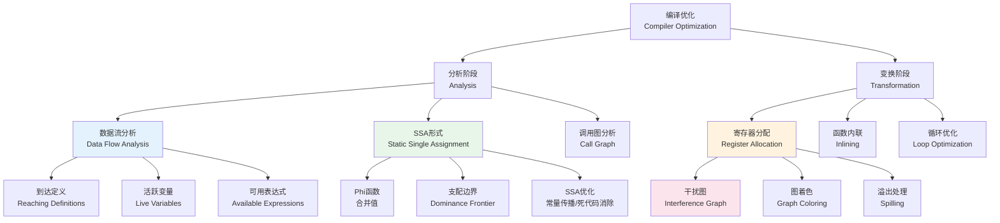
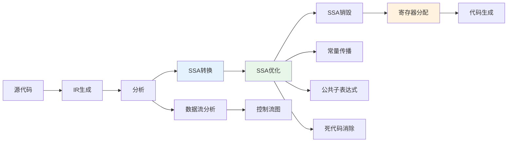
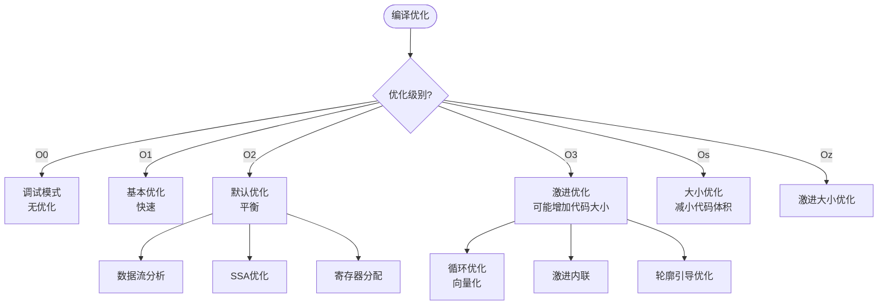
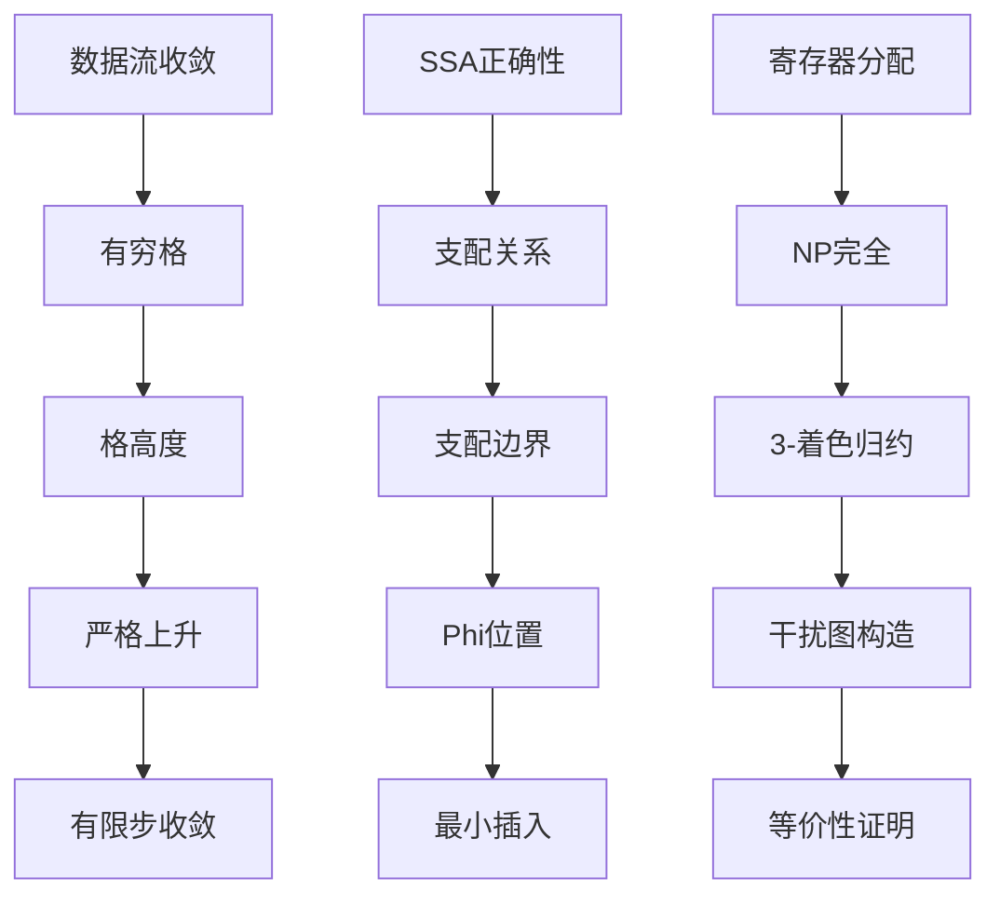

# 编译优化 - 六维内容补充


> **版本**: 1.0
> **创建日期**: 2026-04-19
> **最后更新**: 2026-04-19

> **模块**: 12-应用领域/05-编译器算法
> **文档**: 编译优化理论
> **补充维度**: 概念定义、属性、关系、解释、论证、形式证明
> **对标**: Stanford CS 143 / CMU 15-411 / LLVM / GCC
> **深度**: 研究生级

---

## 思维导图：编译优化概念结构



---

## 一、概念定义 (Concept Definition)

### 1.1 数据流分析 (Data Flow Analysis)

**定义 1.1.1** (形式化)

**数据流分析**是在控制流图 (CFG) 上求解数据流方程的静态分析技术：

**控制流图** $G = (V, E, entry, exit)$:

- $V$: 基本块集合
- $E$: 控制流边
- $entry/exit$: 入口/出口节点

**数据流方程** (以到达定义为例):
$$OUT[b] = gen[b] \cup (IN[b] - kill[b])$$
$$IN[b] = \bigcup_{p \in pred(b)} OUT[p]$$

其中:

- $gen[b]$: 块 $b$ 中生成的定义
- $kill[b]$: 块 $b$ 中杀死的定义
- $IN[b]/OUT[b]$: 块 $b$ 入口/出口处的定义集合

**数据流分类**:

| 方向 | 交汇操作 | 示例 |
|------|----------|------|
| 前向 | $\cup$ | 到达定义 |
| 前向 | $\cap$ | 可用表达式 |
| 后向 | $\cup$ | 活跃变量 |
| 后向 | $\cap$ | 非常忙表达式 |

---

### 1.2 SSA形式 (Static Single Assignment)

**定义 1.2.1** (形式化)

**SSA形式**是中间表示 (IR)，其中每个变量只被**赋值一次**。

**Phi函数** ($\phi$): 在控制流合并处选择值

```
x3 = φ(x1, x2)  // 如果来自前驱1，取x1；来自前驱2，取x2
```

**插入位置**: 变量的**支配边界** (Dominance Frontier)

**支配关系**:

- 节点 $d$ **支配** $n$ ($d \ dom \ n$): 从入口到 $n$ 的所有路径都经过 $d$
- **严格支配**: $d \ dom \ n$ 且 $d \neq n$
- **直接支配者** ($idom$): 离 $n$ 最近的严格支配者

**支配边界**:
$$DF(x) = \{w \mid \exists v \in pred(w): x \ dom \ v \land x \not\dom w\}$$

即：$x$ 支配 $v$ 的前驱，但不严格支配 $v$ 本身。

---

### 1.3 寄存器分配 (Register Allocation)

**定义 1.3.1** (形式化)

**寄存器分配**将虚拟寄存器映射到物理寄存器，最小化内存访问。

**干扰图** (Interference Graph) $G = (V, E)$:

- $V$: 变量（虚拟寄存器）
- $(u, v) \in E$: $u$ 和 $v$ **同时活跃**（不能分配到同一寄存器）

**图着色问题**: 用 $k$ 种颜色（物理寄存器）给图着色，相邻节点不同色。

**简化启发式** (Chaitin算法):

1. **简化**: 移除度 $< k$ 的节点（必定可着色）
2. **溢出**: 如果所有节点度 $\geq k$，选择一个节点溢出到内存
3. **选择**: 反向重新着色

**合并** (Coalescing): 合并不干扰的副本对，消除move指令。

---

## 二、属性 (Properties)

### 2.1 数据流分析算法对比

| 分析类型 | 方向 | 交汇 | 用途 |
|----------|------|------|------|
| **到达定义** | 前向 | $\cup$ | 常量传播，依赖分析 |
| **可用表达式** | 前向 | $\cap$ | 公共子表达式消除 |
| **活跃变量** | 后向 | $\cup$ | 寄存器分配，死代码消除 |
| **非常忙表达式** | 后向 | $\cap$ | 代码提升 |
| **定值-引用链** | - | - | 依赖分析，优化 |

### 2.2 SSA形式优势

| 特性 | 传统IR | SSA |
|------|--------|-----|
| 使用-定义链 | 显式维护 | 隐式（唯一赋值）|
| 常量传播 | 迭代数据流 | 稀疏简单常量传播 (SSCP) |
| 死代码消除 | 需要活跃分析 | 基于def-use链快速识别 |
| 复杂度 | 稠密分析 $O(V^2)$ | 稀疏分析 $O(V)$ |

### 2.3 寄存器分配复杂度

| 问题 | 复杂度 | 实际算法 |
|------|--------|----------|
| 图着色 (k ≥ 3) | NP完全 | 启发式简化 |
| 弦图着色 | 多项式 | 完美消除序列 |
| 线性扫描 | $O(n)$ | JIT编译器常用 |

**Chaitin算法复杂度**: $O(V^2 + E)$，其中 $V$ 是变量数，$E$ 是干扰边数。

---

## 三、关系 (Relations)

### 3.1 概念关系表

| 源概念 | 目标概念 | 关系类型 | 说明 |
|--------|----------|----------|------|
| SSA | 传统IR | refines | 添加唯一赋值约束 |
| Phi函数 | 支配边界 | placed_at | 在DF边界插入 |
| 干扰图 | 寄存器分配 | used_by | 图着色建模 |
| 数据流分析 | 到达定义 | instance_of | 具体分析类型 |
| 常量传播 | SSA | optimized_by | SSA优化更快 |
| 活跃分析 | 死代码消除 | enables | 识别死代码 |

### 3.2 编译优化流程



### 3.3 优化级别决策图



---

## 四、解释 (Explanation)

### 4.1 动机与直观

**为什么需要数据流分析？**

编译器需要知道程序中**信息的流动**：哪些定义到达某点？哪些变量在某点活跃？

**SSA的直观**:

"每个变量只赋值一次"——像数学中的变量一样，消除赋值链的歧义。

**Phi函数的直观**:

"在路口选择正确的值"——根据从哪条路来，选择对应的变量版本。

**寄存器分配的直观**:

"给变量分配家"——同时活跃的变量不能共享寄存器，就像同时上课的学生不能坐同一座位。

### 4.2 与已有概念的联系

**数据流分析 ↔ 图论**:

数据流分析在CFG上求解，本质上是图上的不动点计算。

**SSA ↔ 函数式编程**:

SSA的单一赋值特性类似于函数式编程中的不可变性。

### 4.3 示例与反例

**示例 4.3.1**: SSA转换

```c
// 原始代码
x = 1;
if (cond)
    x = 2;
print(x);

// SSA形式
x1 = 1;
if (cond)
    x2 = 2;
x3 = φ(x1, x2);
print(x3);
```

**反例 4.3.2**: 需要溢出的情况

```
变量: a, b, c, d (4个)
物理寄存器: R1, R2 (2个)
干扰: 所有变量两两干扰（完全图K4）

必须至少溢出2个变量到内存
```

---

## 五、论证 (Argumentation)

### 5.1 非形式论证：为什么SSA简化优化？

**核心思想**: 唯一赋值消除了别名分析的需要。

**论证步骤**:

1. **使用-定义链**: 在SSA中，变量的定义点是唯一的，可以直接找到。

2. **常量传播**: 如果 `x = 5`，则所有使用 `x` 的地方都可以替换为 `5`。

3. **死代码消除**: 如果 `x` 的定义没有被使用（没有指向它的边），可以直接删除。

4. **复杂度**: 传统IR需要迭代数据流分析 $O(V \times E)$，SSA只需 $O(V + E)$。

### 5.2 反例与边界

**边界情况 5.2.1**: SSA构造复杂度

简单算法：插入Phi函数后优化，复杂度 $O(V^2)$。

现代算法 (Cytron et al.)：利用支配边界，复杂度 $O(V + E)$。

**边界情况 5.2.2**: 寄存器分配的溢出代价

Chaitin算法可能过度溢出，改进算法：

- **Briggs**: 乐观着色，尝试所有节点
- **George**: 保守合并，避免引入新的干扰

---

## 六、形式证明 (Formal Proof)

### 6.1 数据流分析收敛性证明

**定理 6.1.1**: 数据流分析的迭代算法在有穷格上必然收敛。

**证明**:

设数据流格 $(L, \sqsubseteq, \sqcup, \sqcap)$ 有穷高度 $h$。

每次迭代，$IN[b]$ 或 $OUT[b]$ 在格中严格上升（对于前向 $\cup$ 分析）。

由于格高度有穷，最多 $h \times |V|$ 次迭代后达到不动点。

到达定义的格是定义集合的幂集，高度为 $|Defs|$。$\square$

### 6.2 SSA支配边界正确性

**定理 6.2.1**: 在变量的所有赋值点插入Phi函数，并在支配边界处合并，可保证SSA的正确性。

**证明概要**:

**引理**: 如果变量 $v$ 在节点 $n$ 需要Phi函数，则 $n \in DF^+(S)$，其中 $S$ 是 $v$ 的定义点集合。

**证明**:

- $v$ 在 $n$ 需要Phi函数 => $v$ 有多个定义到达 $n$ 的不同前驱
- 存在定义 $d$ 支配某前驱但不支配 $n$
- 由DF定义，$n \in DF(d)$

因此，在 $DF^+(S)$ 插入Phi函数足够且必要。$\square$

### 6.3 图着色寄存器分配下界

**定理 6.3.1**: 图着色寄存器分配问题是NP完全的。

**证明概要**:

通过3-着色问题归约：

- 给定图 $G$，构造干扰图 $G'$
- $G$ 可3-着色 \leq> $G'$ 可用3个寄存器着色

因此寄存器分配是NP难的。在NP中（可验证着色正确性），故NP完全。$\square$

### 6.4 证明决策树



---

## 七、多语言实现：编译优化

### 7.1 Python: 数据流分析框架

```python
from typing import Set, Dict, List, Tuple
from dataclasses import dataclass, field

@dataclass
class BasicBlock:
    """基本块"""
    name: str
    instructions: List[str] = field(default_factory=list)
    preds: List[str] = field(default_factory=list)
    succs: List[str] = field(default_factory=list)

@dataclass
class DataFlowAnalysis:
    """数据流分析框架"""
    blocks: Dict[str, BasicBlock]

    def reaching_definitions(self) -> Tuple[Dict[str, Set[str]], Dict[str, Set[str]]]:
        """到达定义分析"""
        # 初始化
        IN: Dict[str, Set[str]] = {name: set() for name in self.blocks}
        OUT: Dict[str, Set[str]] = {name: set() for name in self.blocks}

        # gen和kill集合
        gen: Dict[str, Set[str]] = {}
        kill: Dict[str, Set[str]] = {}

        for name, block in self.blocks.items():
            gen[name] = set()
            kill[name] = set()
            defined = set()

            for instr in block.instructions:
                if '=' in instr:
                    var = instr.split('=')[0].strip()
                    gen[name].add(f"{var}@{name}")
                    defined.add(var)

            # kill是所有对相同变量的定义
            for block_name, b in self.blocks.items():
                for instr in b.instructions:
                    if '=' in instr:
                        var = instr.split('=')[0].strip()
                        if var in defined:
                            kill[name].add(f"{var}@{block_name}")

        # 迭代求解
        changed = True
        while changed:
            changed = False
            for name, block in self.blocks.items():
                # IN = union of OUT[pred]
                new_in = set()
                for pred in block.preds:
                    new_in |= OUT[pred]

                if new_in != IN[name]:
                    IN[name] = new_in
                    changed = True

                # OUT = gen ∪ (IN - kill)
                new_out = gen[name] | (IN[name] - kill[name])
                if new_out != OUT[name]:
                    OUT[name] = new_out
                    changed = True

        return IN, OUT

    def live_variables(self) -> Tuple[Dict[str, Set[str]], Dict[str, Set[str]]]:
        """活跃变量分析（后向）"""
        IN: Dict[str, Set[str]] = {name: set() for name in self.blocks}
        OUT: Dict[str, Set[str]] = {name: set() for name in self.blocks}

        def use_def(block: BasicBlock) -> Tuple[Set[str], Set[str]]:
            """返回(use, def)集合"""
            uses, defs = set(), set()
            for instr in block.instructions:
                if '=' in instr:
                    lhs, rhs = instr.split('=')
                    defs.add(lhs.strip())
                    # 简单解析右边使用的变量
                    for token in rhs.strip().split():
                        token = token.strip('+-*/();')
                        if token and not token.isdigit():
                            uses.add(token)
            return uses, defs

        changed = True
        while changed:
            changed = False
            for name in reversed(list(self.blocks.keys())):
                block = self.blocks[name]
                uses, defs = use_def(block)

                # OUT = union of IN[succ]
                new_out = set()
                for succ in block.succs:
                    new_out |= IN[succ]

                if new_out != OUT[name]:
                    OUT[name] = new_out
                    changed = True

                # IN = use ∪ (OUT - def)
                new_in = uses | (OUT[name] - defs)
                if new_in != IN[name]:
                    IN[name] = new_in
                    changed = True

        return IN, OUT


# 示例：分析简单CFG
def example_analysis():
    blocks = {
        'B1': BasicBlock('B1', ['x = 1', 'y = 2'], [], ['B2']),
        'B2': BasicBlock('B2', ['z = x + y'], ['B1', 'B3'], ['B3']),
        'B3': BasicBlock('B3', ['x = z + 1', 'if x > 0'], ['B2'], ['B2', 'B4']),
        'B4': BasicBlock('B4', ['return x'], ['B3'], []),
    }
    # 修正preds
    blocks['B2'].preds = ['B1', 'B3']

    analysis = DataFlowAnalysis(blocks)

    print("=== Reaching Definitions ===")
    IN, OUT = analysis.reaching_definitions()
    for name in blocks:
        print(f"{name}: IN={IN[name]}, OUT={OUT[name]}")

    print("\n=== Live Variables ===")
    IN, OUT = analysis.live_variables()
    for name in blocks:
        print(f"{name}: IN={IN[name]}, OUT={OUT[name]}")


if __name__ == "__main__":
    example_analysis()
```

## 7.2 Rust: SSA构造简化实现

### 7.2 Rust: SSA构造简化实现

```rust
use std::collections::{HashMap, HashSet};

/// 基本块ID
pub type BlockId = usize;
/// 变量名
pub type VarName = String;

/// 指令
#[derive(Clone, Debug)]
pub enum Instruction {
    Assign(VarName, Value),
    Phi(VarName, Vec<(VarName, BlockId)>),
}

#[derive(Clone, Debug)]
pub enum Value {
    Const(i64),
    Var(VarName),
    Add(Box<Value>, Box<Value>),
}

/// 控制流图
pub struct CFG {
    pub blocks: HashMap<BlockId, Vec<Instruction>>,
    pub preds: HashMap<BlockId, Vec<BlockId>>,
    pub succs: HashMap<BlockId, Vec<BlockId>>,
    pub entry: BlockId,
}

/// 支配者信息
pub struct DominanceInfo {
    pub dominators: HashMap<BlockId, HashSet<BlockId>>,
    pub immediate_dominators: HashMap<BlockId, Option<BlockId>>,
    pub dominance_frontier: HashMap<BlockId, HashSet<BlockId>>,
}

impl DominanceInfo {
    /// 计算支配者（简单迭代算法）
    pub fn compute(cfg: &CFG) -> Self {
        let mut dominators: HashMap<BlockId, HashSet<BlockId>> = HashMap::new();
        let all_blocks: HashSet<BlockId> = cfg.blocks.keys().cloned().collect();

        // 初始化
        for &block in cfg.blocks.keys() {
            if block == cfg.entry {
                let mut set = HashSet::new();
                set.insert(block);
                dominators.insert(block, set);
            } else {
                dominators.insert(block, all_blocks.clone());
            }
        }

        // 迭代直到不动点
        let mut changed = true;
        while changed {
            changed = false;
            for &block in cfg.blocks.keys() {
                if block == cfg.entry {
                    continue;
                }

                let preds = cfg.preds.get(&block).cloned().unwrap_or_default();
                if preds.is_empty() {
                    continue;
                }

                // 交集所有前驱的支配者
                let mut new_dom: Option<HashSet<BlockId>> = None;
                for pred in &preds {
                    let pred_dom = dominators.get(pred).unwrap().clone();
                    match new_dom {
                        None => new_dom = Some(pred_dom),
                        Some(ref mut dom) => {
                            dom.retain(|b| pred_dom.contains(b));
                        }
                    }
                }

                if let Some(mut new_dom) = new_dom {
                    new_dom.insert(block);

                    let old_dom = dominators.get(&block).unwrap();
                    if new_dom != *old_dom {
                        dominators.insert(block, new_dom);
                        changed = true;
                    }
                }
            }
        }

        // 计算直接支配者
        let mut idoms: HashMap<BlockId, Option<BlockId>> = HashMap::new();
        for &block in cfg.blocks.keys() {
            if block == cfg.entry {
                idoms.insert(block, None);
                continue;
            }

            let dom = dominators.get(&block).unwrap();
            // 直接支配者是严格支配者中离block最近的
            let strict_dom: HashSet<BlockId> = dom.iter()
                .filter(|&&b| b != block)
                .cloned()
                .collect();

            let mut idom = None;
            for &candidate in &strict_dom {
                let candidate_dom = dominators.get(&candidate).unwrap();
                // candidate支配block，且不支配其他严格支配者
                let is_idom = strict_dom.iter()
                    .filter(|&&b| b != candidate)
                    .all(|b| !candidate_dom.contains(b));

                if is_idom || idom.is_none() {
                    idom = Some(candidate);
                }
            }
            idoms.insert(block, idom);
        }

        // 计算支配边界
        let mut df: HashMap<BlockId, HashSet<BlockId>> = HashMap::new();
        for &block in cfg.blocks.keys() {
            df.insert(block, HashSet::new());
        }

        for &block in cfg.blocks.keys() {
            let preds = cfg.preds.get(&block).cloned().unwrap_or_default();
            if preds.len() >= 2 {
                for pred in preds {
                    let mut runner = pred;
                    while Some(runner) != *idoms.get(&block).unwrap_or(&None) {
                        df.entry(runner).or_default().insert(block);
                        if let Some(&next) = idoms.get(&runner).unwrap_or(&None) {
                            runner = next;
                        } else {
                            break;
                        }
                    }
                }
            }
        }

        DominanceInfo {
            dominators,
            immediate_dominators: idoms,
            dominance_frontier: df,
        }
    }
}

/// SSA构造器
pub struct SSABuilder {
    cfg: CFG,
    dominance: DominanceInfo,
    var_versions: HashMap<VarName, usize>,
    block_defs: HashMap<BlockId, HashMap<VarName, VarName>>,
}

impl SSABuilder {
    pub fn new(cfg: CFG) -> Self {
        let dominance = DominanceInfo::compute(&cfg);
        SSABuilder {
            cfg,
            dominance,
            var_versions: HashMap::new(),
            block_defs: HashMap::new(),
        }
    }

    /// 获取变量的新版本
    fn fresh_var(&mut self, base: &VarName) -> VarName {
        let version = self.var_versions.entry(base.clone()).or_insert(0);
        *version += 1;
        format!("{}_{}", base, *version)
    }

    /// 插入Phi函数（简化版）
    pub fn insert_phis(&mut self) {
        // 找到所有定义点
        let mut def_sites: HashMap<VarName, HashSet<BlockId>> = HashMap::new();

        for (&block_id, instructions) in &self.cfg.blocks {
            for instr in instructions {
                if let Instruction::Assign(var, _) = instr {
                    def_sites.entry(var.clone())
                        .or_default()
                        .insert(block_id);
                }
            }
        }

        // 在支配边界插入Phi
        for (var, sites) in def_sites {
            let mut worklist: Vec<BlockId> = sites.iter().cloned().collect();
            let mut processed: HashSet<BlockId> = HashSet::new();

            while let Some(block) = worklist.pop() {
                if let Some(df_blocks) = self.dominance.dominance_frontier.get(&block) {
                    for &df_block in df_blocks {
                        if !processed.contains(&df_block) {
                            // 在此插入Phi函数
                            processed.insert(df_block);
                            worklist.push(df_block);
                        }
                    }
                }
            }
        }
    }
}

#[cfg(test)]
mod tests {
    use super::*;

    #[test]
    fn test_dominance() {
        // 简单CFG: 0 -> 1, 0 -> 2, 1 -> 2
        let mut cfg = CFG {
            blocks: HashMap::new(),
            preds: HashMap::new(),
            succs: HashMap::new(),
            entry: 0,
        };

        cfg.blocks.insert(0, vec![]);
        cfg.blocks.insert(1, vec![]);
        cfg.blocks.insert(2, vec![]);

        cfg.succs.insert(0, vec![1, 2]);
        cfg.succs.insert(1, vec![2]);
        cfg.succs.insert(2, vec![]);

        cfg.preds.insert(0, vec![]);
        cfg.preds.insert(1, vec![0]);
        cfg.preds.insert(2, vec![0, 1]);

        let dom = DominanceInfo::compute(&cfg);

        // 0支配所有节点
        assert!(dom.dominators.get(&0).unwrap().contains(&0));
        assert!(dom.dominators.get(&1).unwrap().contains(&0));
        assert!(dom.dominators.get(&2).unwrap().contains(&0));

        // 2的支配边界
        assert!(dom.dominance_frontier.get(&1).unwrap().contains(&2));
    }
}
```

---

## 八、编译优化速查

### 8.1 优化算法复杂度对比

| 优化 | 传统IR | SSA | 复杂度 |
|------|--------|-----|--------|
| 常量传播 | 迭代数据流 $O(V^3)$ | SSCP $O(V)$ | 显著改进 |
| 死代码消除 | 活跃分析 $O(V^2)$ | 基于def-use $O(V)$ | 显著改进 |
| 寄存器分配 | - | - | NP完全 |
| 公共子表达式 | 可用表达式 $O(V^2)$ | 值编号 $O(V)$ | 显著改进 |

### 8.2 LLVM/GCC优化级别

| 级别 | 优化程度 | 编译时间 | 代码大小 | 适用场景 |
|------|----------|----------|----------|----------|
| **-O0** | 无 | 快 | 大 | 调试 |
| **-O1** | 基本 | 较快 | 较小 | 快速编译 |
| **-O2** | 默认 | 中等 | 中等 | 生产默认 |
| **-O3** | 激进 | 慢 | 可能增大 | 性能关键 |
| **-Os** | 大小优先 | 中等 | 最小 | 嵌入式 |

### 8.3 关键数据结构复杂度

| 操作 | 干扰图构建 | SSA构建 | 支配树构建 |
|------|-----------|---------|-----------|
| 复杂度 | $O(V^2)$ | $O(V + E)$ | $O(V log V)$ |

---

**文档版本**: v1.0
**创建日期**: 2026-04-10
**维护**: 项目算法理论工作组

---

## 参考文献

- 待补充

---

## 知识导航

- [返回目录](README.md)

## 学习目标

- 理解编译优化 - 六维内容补充的核心概念
- 掌握编译优化 - 六维内容补充的形式化表示
