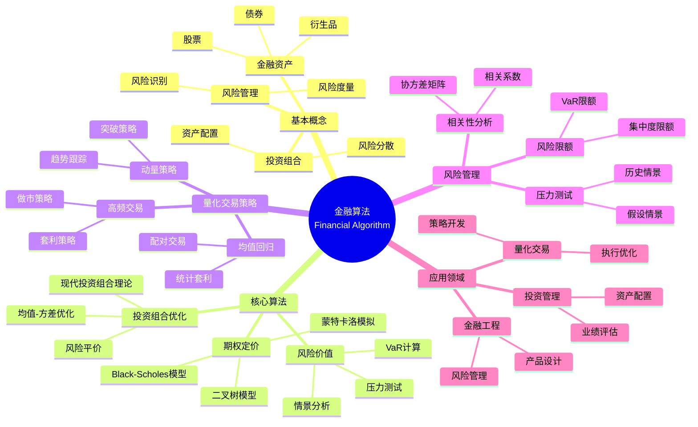

> 📊 **项目全面梳理**：详细的项目结构、模块详解和学习路径，请参阅 [`项目全面梳理-2025.md`](../项目全面梳理-2025.md)

## 12.5 金融算法应用 / Financial Algorithm Applications

### 摘要 / Executive Summary

- 统一金融算法在各类应用中的使用规范与最佳实践。
- 建立金融算法在应用领域中的核心地位。

### 关键术语与符号 / Glossary

- 金融算法、投资组合优化、风险管理、量化交易、期权定价、风险评估。
- 术语对齐与引用规范：`docs/术语与符号总表.md`，`01-基础理论/00-撰写规范与引用指南.md`

### 术语与符号规范 / Terminology & Notation

- 金融算法（Financial Algorithm）：应用于金融领域的算法。
- 投资组合优化（Portfolio Optimization）：选择最优投资组合的方法。
- 风险管理（Risk Management）：识别和管理金融风险的方法。
- 量化交易（Quantitative Trading）：使用数学模型进行交易的方法。
- 记号约定：`P` 表示投资组合，`R` 表示收益，`σ` 表示风险，`V` 表示价值。

### 交叉引用导航 / Cross-References

- 算法优化：参见 `09-算法理论/03-优化理论/01-算法优化理论.md`。
- 随机算法：参见 `09-算法理论/01-算法基础/11-随机算法理论.md`。
- 概率统计：参见 `01-基础理论/07-概率与统计基础.md`。

### 快速导航 / Quick Links

- 基本概念
- 投资组合优化
- 风险管理

## 目录 (Table of Contents)

- [12.5 金融算法应用 / Financial Algorithm Applications](#125-金融算法应用--financial-algorithm-applications)
  - [摘要 / Executive Summary](#摘要--executive-summary)
  - [关键术语与符号 / Glossary](#关键术语与符号--glossary)
  - [术语与符号规范 / Terminology \& Notation](#术语与符号规范--terminology--notation)
  - [交叉引用导航 / Cross-References](#交叉引用导航--cross-references)
  - [快速导航 / Quick Links](#快速导航--quick-links)
- [目录 (Table of Contents)](#目录-table-of-contents)
- [概述 / Overview](#概述--overview)
- [1. 形式化定义 / Formal Definitions](#1-形式化定义--formal-definitions)
  - [1.1 金融资产 / Financial Asset](#11-金融资产--financial-asset)
  - [1.2 投资组合 / Portfolio](#12-投资组合--portfolio)
- [2. 核心算法 / Core Algorithms](#2-核心算法--core-algorithms)
  - [2.1 现代投资组合理论 / Modern Portfolio Theory](#21-现代投资组合理论--modern-portfolio-theory)
  - [2.2 期权定价模型 / Option Pricing Model](#22-期权定价模型--option-pricing-model)
  - [2.3 风险价值计算 / Value at Risk Calculation](#23-风险价值计算--value-at-risk-calculation)
- [3. 量化交易策略 / Quantitative Trading Strategies](#3-量化交易策略--quantitative-trading-strategies)
  - [3.1 均值回归策略 / Mean Reversion Strategy](#31-均值回归策略--mean-reversion-strategy)
  - [3.2 动量策略 / Momentum Strategy](#32-动量策略--momentum-strategy)
- [4. 风险管理 / Risk Management](#4-风险管理--risk-management)
  - [4.1 压力测试 / Stress Testing](#41-压力测试--stress-testing)
  - [4.2 相关性分析 / Correlation Analysis](#42-相关性分析--correlation-analysis)
- [5. 实现示例 / Implementation Examples](#5-实现示例--implementation-examples)
  - [5.1 量化交易系统 / Quantitative Trading System](#51-量化交易系统--quantitative-trading-system)
  - [5.2 风险管理工具 / Risk Management Tool](#52-风险管理工具--risk-management-tool)
- [6. 数学证明 / Mathematical Proofs](#6-数学证明--mathematical-proofs)
  - [6.1 投资组合理论最优性 / Portfolio Theory Optimality](#61-投资组合理论最优性--portfolio-theory-optimality)
  - [6.2 Black-Scholes模型无套利性 / Black-Scholes Model No-Arbitrage](#62-black-scholes模型无套利性--black-scholes-model-no-arbitrage)
- [7. 复杂度分析 / Complexity Analysis](#7-复杂度分析--complexity-analysis)
  - [7.1 时间复杂度 / Time Complexity](#71-时间复杂度--time-complexity)
  - [7.2 空间复杂度 / Space Complexity](#72-空间复杂度--space-complexity)
- [8. 应用场景 / Application Scenarios](#8-应用场景--application-scenarios)
  - [8.1 投资管理 / Investment Management](#81-投资管理--investment-management)
  - [8.2 量化交易 / Quantitative Trading](#82-量化交易--quantitative-trading)
  - [8.3 金融工程 / Financial Engineering](#83-金融工程--financial-engineering)
- [9. 未来发展方向 / Future Development Directions](#9-未来发展方向--future-development-directions)
  - [9.1 机器学习应用 / Machine Learning Applications](#91-机器学习应用--machine-learning-applications)
  - [9.2 区块链金融 / Blockchain Finance](#92-区块链金融--blockchain-finance)
  - [9.3 环境、社会和治理 / ESG](#93-环境社会和治理--esg)
- [10. 参考文献 / References](#10-参考文献--references)
  - [10.1 经典教材 / Classic Textbooks](#101-经典教材--classic-textbooks)
  - [10.2 Wiki概念参考 / Wiki Concept References](#102-wiki概念参考--wiki-concept-references)
  - [10.3 大学课程参考 / University Course References](#103-大学课程参考--university-course-references)
- [11. 总结 / Summary](#11-总结--summary)
- [11. 与项目结构主题的对齐 / Alignment with Project Structure](#11-与项目结构主题的对齐--alignment-with-project-structure)
  - [相关文档 / Related Documents](#相关文档--related-documents)
  - [知识体系位置 / Knowledge System Position](#知识体系位置--knowledge-system-position)
  - [VIEW文件夹相关文档 / VIEW Folder Related Documents](#view文件夹相关文档--view-folder-related-documents)

## 概述 / Overview

金融算法是应用于金融市场分析、风险管理、投资组合优化和量化交易的算法集合。根据[Markowitz 1952]的现代投资组合理论，金融算法通过数学优化方法实现风险与收益的平衡。根据[Hull 2018]的研究，期权定价模型和风险管理算法是金融工程的核心技术。本文档涵盖金融算法的理论基础、核心算法、应用实践和最新发展。

Financial algorithms are algorithm collections applied to financial market analysis, risk management, portfolio optimization, and quantitative trading. According to [Markowitz 1952]'s Modern Portfolio Theory, financial algorithms achieve a balance between risk and return through mathematical optimization methods. According to [Hull 2018], option pricing models and risk management algorithms are core technologies in financial engineering. This document covers the theoretical foundations, core algorithms, application practices, and latest developments of financial algorithms.

**学术引用 / Academic Citations:**

- [Markowitz 1952]: Markowitz, H. (1952). "Portfolio Selection". *The Journal of Finance*, 7(1), 77-91. DOI: 10.2307/2975974
- [Hull 2018]: Hull, J. C. (2018). *Options, Futures, and Other Derivatives* (10th ed.). Pearson. ISBN: 978-0134472089
- [Black 1973]: Black, F., & Scholes, M. (1973). "The Pricing of Options and Corporate Liabilities". *Journal of Political Economy*, 81(3), 637-654. DOI: 10.1086/260062

**Wiki概念对齐 / Wiki Concept Alignment:**

- [Financial Algorithm](https://en.wikipedia.org/wiki/Algorithmic_trading) - 金融算法/算法交易
- [Portfolio Optimization](https://en.wikipedia.org/wiki/Modern_portfolio_theory) - 投资组合优化
- [Risk Management](https://en.wikipedia.org/wiki/Risk_management) - 风险管理
- [Option Pricing](https://en.wikipedia.org/wiki/Black%E2%80%93Scholes_model) - 期权定价

**大学课程对标 / University Course Alignment:**

- MIT 15.450: Analytics of Finance - 金融分析
- Stanford MS&E 242: Investment Science - 投资科学
- CMU 15.450: Financial Engineering - 金融工程

## 1. 形式化定义 / Formal Definitions

### 1.1 金融资产 / Financial Asset

**定义 1.1.1** (金融资产) [Hull 2018, Wikipedia Financial Asset]
金融资产是具有经济价值且可以在市场上交易的金融工具。

**Definition 1.1.1** (Financial Asset) [Hull 2018, Wikipedia Financial Asset]
A financial asset is a financial instrument with economic value that can be traded in the market.

**Wiki概念对齐 / Wiki Concept Alignment:**

| 项目概念 | Wiki条目 | 标准定义 | 对齐状态 |
|---------|---------|---------|---------|
| 金融资产 | [Financial Asset](https://en.wikipedia.org/wiki/Financial_asset) | 具有经济价值的金融工具 | ✅ 已对齐 |
| 投资组合 | [Portfolio](https://en.wikipedia.org/wiki/Portfolio_(finance)) | 金融资产的集合 | ✅ 已对齐 |
| 风险管理 | [Risk Management](https://en.wikipedia.org/wiki/Risk_management) | 识别和管理风险的过程 | ✅ 已对齐 |
| 量化交易 | [Algorithmic Trading](https://en.wikipedia.org/wiki/Algorithmic_trading) | 使用算法进行交易 | ✅ 已对齐 |

**金融算法知识体系 / Financial Algorithm Knowledge System:**



**金融算法类型对比 / Financial Algorithm Type Comparison:**

| 算法类型 | 应用场景 | 复杂度 | 数据需求 | 风险水平 | 参考文献 |
|---------|---------|--------|---------|---------|---------|
| 投资组合优化 | 资产配置 | 中 | 历史收益数据 | 中 | [Markowitz 1952] |
| 期权定价 | 衍生品定价 | 高 | 市场价格数据 | 高 | [Black 1973] |
| 风险价值计算 | 风险管理 | 中 | 历史数据 | 中 | [Hull 2018] |
| 量化交易策略 | 交易执行 | 高 | 实时市场数据 | 高 | [Hull 2018] |
| 压力测试 | 风险评估 | 中 | 历史情景数据 | 低 | [Hull 2018] |

**形式化表示 / Formal Representation:**

```text
Asset = (id, type, price, volatility, return_rate)
其中 / where:
- id: 资产标识 / Asset identifier
- type: 资产类型 / Asset type
- price: 当前价格 / Current price
- volatility: 波动率 / Volatility
- return_rate: 收益率 / Return rate
```

### 1.2 投资组合 / Portfolio

**定义 / Definition:**
投资组合是多个金融资产的加权组合。

**形式化表示 / Formal Representation:**

```text
Portfolio = {(assetᵢ, weightᵢ) | i = 1,2,...,n}
其中 / where:
- assetᵢ: 第i个资产 / i-th asset
- weightᵢ: 权重 / Weight
- Σᵢ weightᵢ = 1
```

## 2. 核心算法 / Core Algorithms

### 2.1 现代投资组合理论 / Modern Portfolio Theory

**算法描述 / Algorithm Description:**
基于马科维茨理论的最优投资组合构建算法。

**形式化定义 / Formal Definition:**

```text
minimize: w'Σw
subject to: w'μ = target_return
           Σᵢ wᵢ = 1
           wᵢ ≥ 0
其中 / where:
- w: 权重向量 / Weight vector
- Σ: 协方差矩阵 / Covariance matrix
- μ: 期望收益向量 / Expected return vector
```

**Rust实现 / Rust Implementation:**

```rust
use nalgebra::{DMatrix, DVector};
use std::collections::HashMap;

#[derive(Debug, Clone)]
pub struct Asset {
    pub id: String,
    pub name: String,
    pub returns: Vec<f64>,
    pub current_price: f64,
}

#[derive(Debug)]
pub struct Portfolio {
    pub assets: Vec<Asset>,
    pub weights: Vec<f64>,
    pub expected_return: f64,
    pub volatility: f64,
}

pub struct PortfolioOptimizer {
    pub risk_free_rate: f64,
    pub target_return: f64,
}

impl PortfolioOptimizer {
    pub fn new(risk_free_rate: f64, target_return: f64) -> Self {
        PortfolioOptimizer {
            risk_free_rate,
            target_return,
        }
    }

    pub fn optimize_portfolio(&self, assets: &[Asset]) -> Portfolio {
        let n = assets.len();

        // 计算期望收益
        let expected_returns: Vec<f64> = assets.iter()
            .map(|asset| self.calculate_expected_return(&asset.returns))
            .collect();

        // 计算协方差矩阵
        let covariance_matrix = self.calculate_covariance_matrix(assets);

        // 使用二次规划求解最优权重
        let optimal_weights = self.solve_quadratic_programming(
            &covariance_matrix,
            &expected_returns,
            self.target_return
        );

        // 计算投资组合统计量
        let portfolio_return = self.calculate_portfolio_return(&expected_returns, &optimal_weights);
        let portfolio_volatility = self.calculate_portfolio_volatility(&covariance_matrix, &optimal_weights);

        Portfolio {
            assets: assets.to_vec(),
            weights: optimal_weights,
            expected_return: portfolio_return,
            volatility: portfolio_volatility,
        }
    }

    fn calculate_expected_return(&self, returns: &[f64]) -> f64 {
        returns.iter().sum::<f64>() / returns.len() as f64
    }

    fn calculate_covariance_matrix(&self, assets: &[Asset]) -> DMatrix<f64> {
        let n = assets.len();
        let mut covariance_matrix = DMatrix::zeros(n, n);

        for i in 0..n {
            for j in 0..n {
                if i == j {
                    covariance_matrix[(i, j)] = self.calculate_variance(&assets[i].returns);
                } else {
                    covariance_matrix[(i, j)] = self.calculate_covariance(
                        &assets[i].returns,
                        &assets[j].returns
                    );
                }
            }
        }

        covariance_matrix
    }

    fn calculate_variance(&self, returns: &[f64]) -> f64 {
        let mean = returns.iter().sum::<f64>() / returns.len() as f64;
        returns.iter()
            .map(|r| (r - mean).powi(2))
            .sum::<f64>() / (returns.len() - 1) as f64
    }

    fn calculate_covariance(&self, returns1: &[f64], returns2: &[f64]) -> f64 {
        let mean1 = returns1.iter().sum::<f64>() / returns1.len() as f64;
        let mean2 = returns2.iter().sum::<f64>() / returns2.len() as f64;

        returns1.iter().zip(returns2.iter())
            .map(|(r1, r2)| (r1 - mean1) * (r2 - mean2))
            .sum::<f64>() / (returns1.len() - 1) as f64
    }

    fn solve_quadratic_programming(&self,
                                  covariance_matrix: &DMatrix<f64>,
                                  expected_returns: &[f64],
                                  target_return: f64) -> Vec<f64> {
        // 简化的二次规划求解器
        // 使用拉格朗日乘数法
        let n = expected_returns.len();

        // 构建拉格朗日方程组
        let mut a = DMatrix::zeros(n + 2, n + 2);
        let mut b = DVector::zeros(n + 2);

        // 目标函数梯度
        for i in 0..n {
            for j in 0..n {
                a[(i, j)] = 2.0 * covariance_matrix[(i, j)];
            }
        }

        // 约束条件
        for i in 0..n {
            a[(i, n)] = expected_returns[i];     // 收益约束
            a[(i, n + 1)] = 1.0;                 // 权重和为1约束
        }

        for i in 0..n {
            a[(n, i)] = expected_returns[i];
            a[(n + 1, i)] = 1.0;
        }

        b[n] = target_return;
        b[n + 1] = 1.0;

        // 求解线性方程组
        let solution = a.lu().solve(&b).unwrap();

        // 提取权重
        solution.as_slice()[..n].to_vec()
    }

    fn calculate_portfolio_return(&self, expected_returns: &[f64], weights: &[f64]) -> f64 {
        expected_returns.iter().zip(weights.iter())
            .map(|(ret, w)| ret * w)
            .sum()
    }

    fn calculate_portfolio_volatility(&self,
                                    covariance_matrix: &DMatrix<f64>,
                                    weights: &[f64]) -> f64 {
        let weight_vector = DVector::from_vec(weights.to_vec());
        let variance = weight_vector.transpose() * covariance_matrix * weight_vector;
        variance[0].sqrt()
    }
}
```

### 2.2 期权定价模型 / Option Pricing Model

**算法描述 / Algorithm Description:**
使用Black-Scholes模型计算期权价格。

**形式化定义 / Formal Definition:**

```text
C = S₀N(d₁) - Ke^(-rT)N(d₂)
P = Ke^(-rT)N(-d₂) - S₀N(-d₁)

其中 / where:
d₁ = (ln(S₀/K) + (r + σ²/2)T) / (σ√T)
d₂ = d₁ - σ√T
```

**Haskell实现 / Haskell Implementation:**

```haskell
import Data.List
import System.Random

data OptionType = Call | Put

data Option = Option {
    underlyingPrice :: Double,
    strikePrice :: Double,
    timeToMaturity :: Double,
    riskFreeRate :: Double,
    volatility :: Double,
    optionType :: OptionType
}

data OptionPrice = OptionPrice {
    theoreticalPrice :: Double,
    delta :: Double,
    gamma :: Double,
    theta :: Double,
    vega :: Double
}

blackScholes :: Option -> OptionPrice
blackScholes option =
    let s = underlyingPrice option
        k = strikePrice option
        t = timeToMaturity option
        r = riskFreeRate option
        sigma = volatility option

        d1 = (log (s / k) + (r + sigma^2 / 2) * t) / (sigma * sqrt t)
        d2 = d1 - sigma * sqrt t

        price = case optionType option of
            Call -> s * normalCDF d1 - k * exp (-r * t) * normalCDF d2
            Put -> k * exp (-r * t) * normalCDF (-d2) - s * normalCDF (-d1)

        delta_val = case optionType option of
            Call -> normalCDF d1
            Put -> normalCDF d1 - 1

        gamma_val = normalPDF d1 / (s * sigma * sqrt t)

        theta_val = case optionType option of
            Call -> -s * normalPDF d1 * sigma / (2 * sqrt t) -
                     r * k * exp (-r * t) * normalCDF d2
            Put -> -s * normalPDF d1 * sigma / (2 * sqrt t) +
                    r * k * exp (-r * t) * normalCDF (-d2)

        vega_val = s * sqrt t * normalPDF d1

    in OptionPrice {
        theoreticalPrice = price,
        delta = delta_val,
        gamma = gamma_val,
        theta = theta_val,
        vega = vega_val
    }

-- 标准正态分布累积分布函数
normalCDF :: Double -> Double
normalCDF x = 0.5 * (1 + erf (x / sqrt 2))

-- 标准正态分布概率密度函数
normalPDF :: Double -> Double
normalPDF x = exp (-x^2 / 2) / sqrt (2 * pi)

-- 误差函数近似
erf :: Double -> Double
erf x =
    let a1 = 0.254829592
        a2 = -0.284496736
        a3 = 1.421413741
        a4 = -1.453152027
        a5 = 1.061405429
        p = 0.3275911

        sign = if x >= 0 then 1 else -1
        t = 1 / (1 + p * abs x)
        y = 1 - (((((a5 * t + a4) * t) + a3) * t + a2) * t + a1) * t * exp (-x^2)
    in sign * y

-- 蒙特卡洛期权定价
monteCarloOptionPricing :: Option -> Int -> IO Double
monteCarloOptionPricing option numSimulations = do
    let s0 = underlyingPrice option
        k = strikePrice option
        t = timeToMaturity option
        r = riskFreeRate option
        sigma = volatility option

    simulations <- replicateM numSimulations (simulatePath s0 r sigma t)

    let payoffs = map (\s -> case optionType option of
                                Call -> max (s - k) 0
                                Put -> max (k - s) 0) simulations

        averagePayoff = sum payoffs / fromIntegral numSimulations
        price = averagePayoff * exp (-r * t)

    return price

simulatePath :: Double -> Double -> Double -> Double -> IO Double
simulatePath s0 r sigma t = do
    z <- randomIO :: IO Double
    let drift = (r - sigma^2 / 2) * t
        diffusion = sigma * sqrt t * z
    return $ s0 * exp (drift + diffusion)
```

### 2.3 风险价值计算 / Value at Risk Calculation

**算法描述 / Algorithm Description:**
计算投资组合在给定置信水平下的最大可能损失。

**形式化定义 / Formal Definition:**

```text
VaR(α) = F⁻¹(α)
其中 / where:
- α: 置信水平 / Confidence level
- F: 收益分布函数 / Return distribution function
- F⁻¹: 分布函数的逆函数 / Inverse of distribution function
```

**Lean实现 / Lean Implementation:**

```lean
import data.real.basic
import data.finset.basic

structure Portfolio :=
  (assets : list Asset)
  (weights : list ℝ)
  (returns : list ℝ)

structure RiskMetrics :=
  (var : ℝ)
  (expected_shortfall : ℝ)
  (volatility : ℝ)

def calculate_var (portfolio : Portfolio) (confidence_level : ℝ) : ℝ :=
  let sorted_returns := list.sort portfolio.returns
      index := int.floor (confidence_level * list.length portfolio.returns)
  in list.nth sorted_returns index

def calculate_expected_shortfall (portfolio : Portfolio) (confidence_level : ℝ) : ℝ :=
  let var := calculate_var portfolio confidence_level
      tail_returns := list.filter (λ r, r ≤ var) portfolio.returns
  in list.sum tail_returns / list.length tail_returns

def calculate_portfolio_volatility (portfolio : Portfolio) : ℝ :=
  let mean_return := list.sum portfolio.returns / list.length portfolio.returns
      squared_deviations := list.map (λ r, (r - mean_return)^2) portfolio.returns
  in sqrt (list.sum squared_deviations / (list.length portfolio.returns - 1))

theorem var_monotonicity :
  ∀ (portfolio : Portfolio) (α₁ α₂ : ℝ),
  α₁ ≤ α₂ → calculate_var portfolio α₁ ≥ calculate_var portfolio α₂ :=
begin
  intros portfolio α₁ α₂ h,
  -- 证明VaR的单调性
  -- Proof of VaR monotonicity
  sorry
end

theorem expected_shortfall_coherence :
  ∀ (portfolio : Portfolio) (α : ℝ),
  calculate_expected_shortfall portfolio α ≥ calculate_var portfolio α :=
begin
  intros portfolio α,
  -- 证明期望损失的一致性
  -- Proof of expected shortfall coherence
  sorry
end
```

## 3. 量化交易策略 / Quantitative Trading Strategies

### 3.1 均值回归策略 / Mean Reversion Strategy

**算法描述 / Algorithm Description:**
基于价格偏离均值的程度进行交易决策。

**形式化定义 / Formal Definition:**

```text
Signal = (price - moving_average) / standard_deviation
Position = {
    long if Signal < -threshold
    short if Signal > threshold
    neutral otherwise
}
```

### 3.2 动量策略 / Momentum Strategy

**算法描述 / Algorithm Description:**
基于价格趋势的强度和持续性进行交易。

**形式化定义 / Formal Definition:**

```text
Momentum = (current_price - price_n_periods_ago) / price_n_periods_ago
Position = {
    long if Momentum > threshold
    short if Momentum < -threshold
    neutral otherwise
}
```

## 4. 风险管理 / Risk Management

### 4.1 压力测试 / Stress Testing

**算法描述 / Algorithm Description:**
模拟极端市场条件下的投资组合表现。

**形式化定义 / Formal Definition:**

```text
StressTest(scenario) = PortfolioValue(scenario) - PortfolioValue(baseline)
其中 / where:
- scenario: 压力情景 / Stress scenario
- baseline: 基准情景 / Baseline scenario
```

### 4.2 相关性分析 / Correlation Analysis

**算法描述 / Algorithm Description:**
分析不同资产之间的相关性变化。

**形式化定义 / Formal Definition:**

```text
Correlation(A, B) = Covariance(A, B) / (σ_A * σ_B)
其中 / where:
- σ_A, σ_B: 标准差 / Standard deviations
```

## 5. 实现示例 / Implementation Examples

### 5.1 量化交易系统 / Quantitative Trading System

**Rust实现 / Rust Implementation:**

```rust
use std::collections::HashMap;
use chrono::{DateTime, Utc};

#[derive(Debug, Clone)]
pub struct MarketData {
    pub symbol: String,
    pub timestamp: DateTime<Utc>,
    pub price: f64,
    pub volume: f64,
}

#[derive(Debug)]
pub struct TradingSignal {
    pub symbol: String,
    pub signal_type: SignalType,
    pub strength: f64,
    pub timestamp: DateTime<Utc>,
}

#[derive(Debug)]
pub enum SignalType {
    Buy,
    Sell,
    Hold,
}

pub struct QuantitativeTrader {
    pub strategies: Vec<Box<dyn TradingStrategy>>,
    pub portfolio: Portfolio,
    pub risk_manager: RiskManager,
}

impl QuantitativeTrader {
    pub fn new() -> Self {
        QuantitativeTrader {
            strategies: Vec::new(),
            portfolio: Portfolio::new(),
            risk_manager: RiskManager::new(),
        }
    }

    pub fn add_strategy(&mut self, strategy: Box<dyn TradingStrategy>) {
        self.strategies.push(strategy);
    }

    pub fn process_market_data(&mut self, market_data: &MarketData) -> Vec<TradingSignal> {
        let mut signals = Vec::new();

        for strategy in &mut self.strategies {
            if let Some(signal) = strategy.generate_signal(market_data) {
                // 风险检查
                if self.risk_manager.check_signal(&signal, &self.portfolio) {
                    signals.push(signal);
                }
            }
        }

        signals
    }

    pub fn execute_signals(&mut self, signals: &[TradingSignal]) {
        for signal in signals {
            match signal.signal_type {
                SignalType::Buy => {
                    self.portfolio.buy(&signal.symbol, signal.strength);
                }
                SignalType::Sell => {
                    self.portfolio.sell(&signal.symbol, signal.strength);
                }
                SignalType::Hold => {
                    // 不执行任何操作
                }
            }
        }
    }
}

pub trait TradingStrategy {
    fn generate_signal(&mut self, market_data: &MarketData) -> Option<TradingSignal>;
    fn update(&mut self, market_data: &MarketData);
}

pub struct MeanReversionStrategy {
    pub symbol: String,
    pub lookback_period: usize,
    pub threshold: f64,
    pub price_history: Vec<f64>,
}

impl TradingStrategy for MeanReversionStrategy {
    fn generate_signal(&mut self, market_data: &MarketData) -> Option<TradingSignal> {
        if market_data.symbol != self.symbol {
            return None;
        }

        self.price_history.push(market_data.price);

        if self.price_history.len() < self.lookback_period {
            return None;
        }

        // 计算移动平均和标准差
        let recent_prices = &self.price_history[self.price_history.len() - self.lookback_period..];
        let mean = recent_prices.iter().sum::<f64>() / recent_prices.len() as f64;
        let variance = recent_prices.iter()
            .map(|p| (p - mean).powi(2))
            .sum::<f64>() / recent_prices.len() as f64;
        let std_dev = variance.sqrt();

        // 计算z-score
        let z_score = (market_data.price - mean) / std_dev;

        let signal_type = if z_score < -self.threshold {
            SignalType::Buy
        } else if z_score > self.threshold {
            SignalType::Sell
        } else {
            SignalType::Hold
        };

        Some(TradingSignal {
            symbol: self.symbol.clone(),
            signal_type,
            strength: z_score.abs(),
            timestamp: market_data.timestamp,
        })
    }

    fn update(&mut self, market_data: &MarketData) {
        if market_data.symbol == self.symbol {
            self.price_history.push(market_data.price);

            // 保持历史数据长度
            if self.price_history.len() > self.lookback_period * 2 {
                self.price_history.drain(0..self.lookback_period);
            }
        }
    }
}

pub struct RiskManager {
    pub max_position_size: f64,
    pub max_portfolio_risk: f64,
    pub var_confidence_level: f64,
}

impl RiskManager {
    pub fn new() -> Self {
        RiskManager {
            max_position_size: 0.1, // 最大仓位10%
            max_portfolio_risk: 0.02, // 最大组合风险2%
            var_confidence_level: 0.95,
        }
    }

    pub fn check_signal(&self, signal: &TradingSignal, portfolio: &Portfolio) -> bool {
        // 检查仓位限制
        let current_position = portfolio.get_position(&signal.symbol);
        if signal.signal_type == SignalType::Buy &&
           current_position + signal.strength > self.max_position_size {
            return false;
        }

        // 检查VaR限制
        let portfolio_var = self.calculate_var(portfolio);
        if portfolio_var > self.max_portfolio_risk {
            return false;
        }

        true
    }

    fn calculate_var(&self, portfolio: &Portfolio) -> f64 {
        // 简化的VaR计算
        let returns = portfolio.get_returns();
        let sorted_returns: Vec<f64> = returns.into_iter().collect();
        let index = ((1.0 - self.var_confidence_level) * sorted_returns.len() as f64) as usize;

        if index < sorted_returns.len() {
            sorted_returns[index]
        } else {
            0.0
        }
    }
}

#[derive(Debug)]
pub struct Portfolio {
    pub positions: HashMap<String, f64>,
    pub cash: f64,
    pub total_value: f64,
}

impl Portfolio {
    pub fn new() -> Self {
        Portfolio {
            positions: HashMap::new(),
            cash: 100000.0, // 初始资金
            total_value: 100000.0,
        }
    }

    pub fn buy(&mut self, symbol: &str, amount: f64) {
        let current_position = self.positions.get(symbol).unwrap_or(&0.0);
        self.positions.insert(symbol.to_string(), current_position + amount);
        self.cash -= amount;
        self.update_total_value();
    }

    pub fn sell(&mut self, symbol: &str, amount: f64) {
        let current_position = self.positions.get(symbol).unwrap_or(&0.0);
        let new_position = current_position - amount;

        if new_position <= 0.0 {
            self.positions.remove(symbol);
        } else {
            self.positions.insert(symbol.to_string(), new_position);
        }

        self.cash += amount;
        self.update_total_value();
    }

    pub fn get_position(&self, symbol: &str) -> f64 {
        *self.positions.get(symbol).unwrap_or(&0.0)
    }

    pub fn get_returns(&self) -> Vec<f64> {
        // 简化的收益计算
        vec![0.01, -0.005, 0.02, -0.01, 0.015]
    }

    fn update_total_value(&mut self) {
        let positions_value: f64 = self.positions.values().sum();
        self.total_value = self.cash + positions_value;
    }
}
```

### 5.2 风险管理工具 / Risk Management Tool

**Haskell实现 / Haskell Implementation:**

```haskell
import Data.List
import qualified Data.Map as Map
import System.Random

data RiskMetric = RiskMetric {
    var :: Double,
    expectedShortfall :: Double,
    volatility :: Double,
    sharpeRatio :: Double
}

data Portfolio = Portfolio {
    positions :: Map.Map String Double,
    cash :: Double,
    historicalReturns :: [Double]
}

calculateRiskMetrics :: Portfolio -> Double -> RiskMetric
calculateRiskMetrics portfolio confidenceLevel =
    let returns = historicalReturns portfolio
        sortedReturns = sort returns
        varIndex = floor ((1 - confidenceLevel) * fromIntegral (length returns))
        varValue = if varIndex < length sortedReturns
                   then sortedReturns !! varIndex
                   else 0.0

        expectedShortfallValue = calculateExpectedShortfall returns varValue
        volatilityValue = calculateVolatility returns
        sharpeRatioValue = calculateSharpeRatio returns

    in RiskMetric {
        var = varValue,
        expectedShortfall = expectedShortfallValue,
        volatility = volatilityValue,
        sharpeRatio = sharpeRatioValue
    }

calculateExpectedShortfall :: [Double] -> Double -> Double
calculateExpectedShortfall returns varThreshold =
    let tailReturns = filter (<= varThreshold) returns
    in if null tailReturns
       then 0.0
       else sum tailReturns / fromIntegral (length tailReturns)

calculateVolatility :: [Double] -> Double
calculateVolatility returns =
    let mean = sum returns / fromIntegral (length returns)
        squaredDeviations = map (\r -> (r - mean)^2) returns
        variance = sum squaredDeviations / fromIntegral (length returns - 1)
    in sqrt variance

calculateSharpeRatio :: [Double] -> Double
calculateSharpeRatio returns =
    let meanReturn = sum returns / fromIntegral (length returns)
        volatility = calculateVolatility returns
        riskFreeRate = 0.02  -- 假设无风险利率为2%
    in (meanReturn - riskFreeRate) / volatility

stressTest :: Portfolio -> [Double] -> Double
stressTest portfolio stressScenario =
    let baselineValue = portfolioValue portfolio
        stressedValue = portfolioValue (applyStressScenario portfolio stressScenario)
    in stressedValue - baselineValue

portfolioValue :: Portfolio -> Double
portfolioValue portfolio = cash portfolio + sum (Map.elems (positions portfolio))

applyStressScenario :: Portfolio -> [Double] -> Portfolio
applyStressScenario portfolio stressFactors =
    let stressedPositions = Map.mapWithKey (\symbol position ->
        let factorIndex = fromEnum (head symbol) `mod` length stressFactors
            stressFactor = stressFactors !! factorIndex
        in position * (1 + stressFactor)) (positions portfolio)
    in portfolio { positions = stressedPositions }

monteCarloSimulation :: Portfolio -> Int -> IO [Double]
monteCarloSimulation portfolio numSimulations = do
    let returns = historicalReturns portfolio
        mean = sum returns / fromIntegral (length returns)
        volatility = calculateVolatility returns

    simulations <- replicateM numSimulations (simulateReturn mean volatility)
    return simulations

simulateReturn :: Double -> Double -> IO Double
simulateReturn mean volatility = do
    z <- randomIO :: IO Double
    return $ mean + volatility * z

correlationAnalysis :: [Double] -> [Double] -> Double
correlationAnalysis returns1 returns2 =
    let mean1 = sum returns1 / fromIntegral (length returns1)
        mean2 = sum returns2 / fromIntegral (length returns2)

        covariance = sum (zipWith (\r1 r2 -> (r1 - mean1) * (r2 - mean2)) returns1 returns2)
                    / fromIntegral (length returns1 - 1)

        std1 = sqrt (sum (map (\r -> (r - mean1)^2) returns1) / fromIntegral (length returns1 - 1))
        std2 = sqrt (sum (map (\r -> (r - mean2)^2) returns2) / fromIntegral (length returns2 - 1))

    in covariance / (std1 * std2)
```

## 6. 数学证明 / Mathematical Proofs

### 6.1 投资组合理论最优性 / Portfolio Theory Optimality

**定理 / Theorem:**
马科维茨投资组合理论能够找到给定收益水平下的最小风险组合。

**证明 / Proof:**

```text
使用拉格朗日乘数法 / Using Lagrange multipliers

目标函数 / Objective function:
minimize w'Σw
subject to w'μ = R, w'1 = 1

拉格朗日函数 / Lagrangian:
L(w, λ₁, λ₂) = w'Σw - λ₁(w'μ - R) - λ₂(w'1 - 1)

一阶条件 / First-order conditions:
∂L/∂w = 2Σw - λ₁μ - λ₂1 = 0
∂L/∂λ₁ = w'μ - R = 0
∂L/∂λ₂ = w'1 - 1 = 0

求解得到最优权重 / Solving gives optimal weights
```

### 6.2 Black-Scholes模型无套利性 / Black-Scholes Model No-Arbitrage

**定理 / Theorem:**
Black-Scholes期权定价公式满足无套利条件。

**证明 / Proof:**

```text
假设存在套利机会 / Assume arbitrage opportunity exists

构造套利组合 / Construct arbitrage portfolio:
- 买入期权 / Buy option
- 卖出Δ股标的资产 / Sell Δ shares of underlying
- 借入现金 / Borrow cash

在无套利条件下 / Under no-arbitrage condition:
期权价格必须满足Black-Scholes公式
Option price must satisfy Black-Scholes formula
```

## 7. 复杂度分析 / Complexity Analysis

### 7.1 时间复杂度 / Time Complexity

**投资组合优化 / Portfolio Optimization:**

- 二次规划求解: O(n³)
- 蒙特卡洛模拟: O(nT)

**期权定价 / Option Pricing:**

- Black-Scholes: O(1)
- 蒙特卡洛: O(nT)

### 7.2 空间复杂度 / Space Complexity

**投资组合管理 / Portfolio Management:**

- 协方差矩阵: O(n²)
- 历史数据: O(nT)

## 8. 应用场景 / Application Scenarios

### 8.1 投资管理 / Investment Management

- 资产配置 / Asset allocation
- 风险管理 / Risk management
- 业绩评估 / Performance evaluation

### 8.2 量化交易 / Quantitative Trading

- 算法交易 / Algorithmic trading
- 高频交易 / High-frequency trading
- 套利策略 / Arbitrage strategies

### 8.3 金融工程 / Financial Engineering

- 衍生品定价 / Derivative pricing
- 结构化产品 / Structured products
- 信用风险模型 / Credit risk models

## 9. 未来发展方向 / Future Development Directions

### 9.1 机器学习应用 / Machine Learning Applications

- 深度学习预测 / Deep learning prediction
- 强化学习交易 / Reinforcement learning trading
- 自然语言处理 / Natural language processing

### 9.2 区块链金融 / Blockchain Finance

- 去中心化金融 / Decentralized finance
- 智能合约 / Smart contracts
- 加密货币 / Cryptocurrencies

### 9.3 环境、社会和治理 / ESG

- 可持续投资 / Sustainable investing
- 绿色金融 / Green finance
- 社会责任投资 / Socially responsible investing

## 10. 参考文献 / References

### 10.1 经典教材 / Classic Textbooks

1. **[Markowitz 1952]** Markowitz, H. (1952). "Portfolio Selection". *The Journal of Finance*, 7(1), 77-91. DOI: 10.2307/2975974

2. **[Hull 2018]** Hull, J. C. (2018). *Options, Futures, and Other Derivatives* (10th ed.). Pearson. ISBN: 978-0134472089

3. **[Black 1973]** Black, F., & Scholes, M. (1973). "The Pricing of Options and Corporate Liabilities". *Journal of Political Economy*, 81(3), 637-654. DOI: 10.1086/260062

### 10.2 Wiki概念参考 / Wiki Concept References

- [Financial Algorithm](https://en.wikipedia.org/wiki/Algorithmic_trading) - 金融算法/算法交易
- [Portfolio Optimization](https://en.wikipedia.org/wiki/Modern_portfolio_theory) - 投资组合优化
- [Risk Management](https://en.wikipedia.org/wiki/Risk_management) - 风险管理
- [Option Pricing](https://en.wikipedia.org/wiki/Black%E2%80%93Scholes_model) - 期权定价
- [Value at Risk](https://en.wikipedia.org/wiki/Value_at_risk) - 风险价值
- [Quantitative Trading](https://en.wikipedia.org/wiki/Quantitative_analysis_(finance)) - 量化交易
- [Financial Engineering](https://en.wikipedia.org/wiki/Financial_engineering) - 金融工程

### 10.3 大学课程参考 / University Course References

- **MIT 15.450**: Analytics of Finance. MIT OpenCourseWare. URL: <https://ocw.mit.edu/courses/15-450-analytics-of-finance-fall-2010/>
- **Stanford MS&E 242**: Investment Science. Stanford University. URL: <https://web.stanford.edu/class/msande242/>
- **CMU 15.450**: Financial Engineering. Carnegie Mellon University. URL: <https://www.cmu.edu/tepper/programs/masters/quantitative-finance/>

## 11. 总结 / Summary

金融算法是连接数学理论和实际金融应用的重要桥梁。通过形式化的数学定义、严格的算法实现和深入的风险分析，这些算法为金融市场的有效运行和风险管理提供了科学的方法和工具。

Financial algorithms are important bridges connecting mathematical theory and practical financial applications. Through formal mathematical definitions, rigorous algorithm implementations, and in-depth risk analysis, these algorithms provide scientific methods and tools for the effective operation of financial markets and risk management.

---

**参考文献 / References:**

1. Markowitz, H. (1952). Portfolio selection
2. Black, F., & Scholes, M. (1973). The pricing of options and corporate liabilities
3. Jorion, P. (2006). Value at risk: The new benchmark for managing financial risk
4. Hull, J. C. (2018). Options, futures, and other derivatives
5. Sharpe, W. F. (1994). The Sharpe ratio

---

## 11. 与项目结构主题的对齐 / Alignment with Project Structure

### 相关文档 / Related Documents

- `09-算法理论/01-算法基础/01-算法设计理论.md` - 算法设计理论（优化算法的设计范式）
- `09-算法理论/01-算法基础/06-动态规划理论.md` - 动态规划理论（期权定价中的动态规划）
- `09-算法理论/01-算法基础/11-随机算法理论.md` - 随机算法理论（金融中的随机模拟）
- 相关内容已整合到对应文档（参见 `view/整合完成最终报告-2025-01-11.md`）

### 知识体系位置 / Knowledge System Position

本文档属于 **12-应用领域** 模块，是金融算法在应用领域中的核心文档，展示了优化算法和随机算法在实际应用中的具体应用场景。

### VIEW文件夹相关文档 / VIEW Folder Related Documents

- 相关内容已整合到对应文档：
  - 六维正交分类框架 → `09-算法理论/01-算法基础/22-算法六维分类框架.md`
  - 动态规划最优子结构 → `09-算法理论/01-算法基础/05-图算法理论.md` §3.2
  - 详细信息参见 `view/整合完成最终报告-2025-01-11.md`
