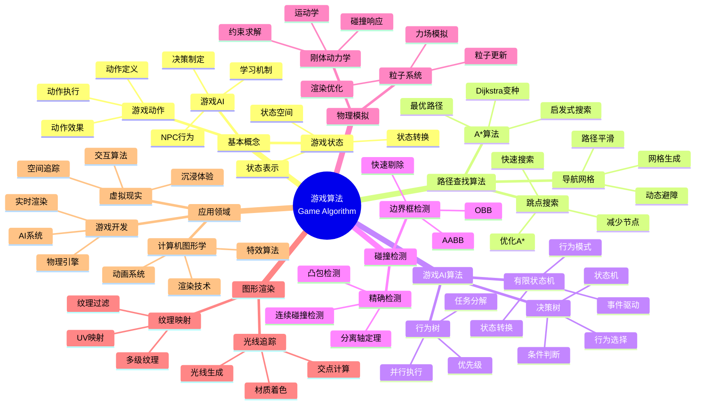
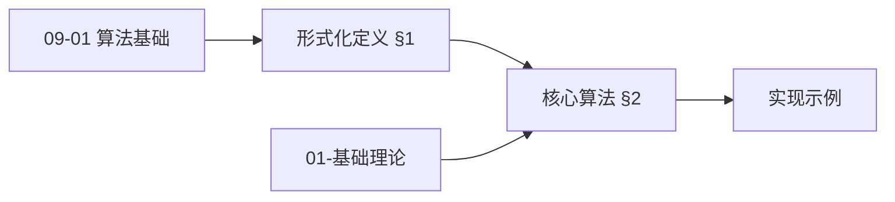
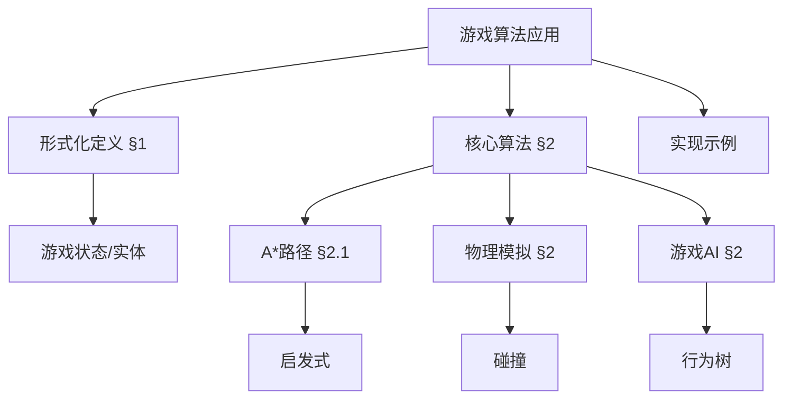
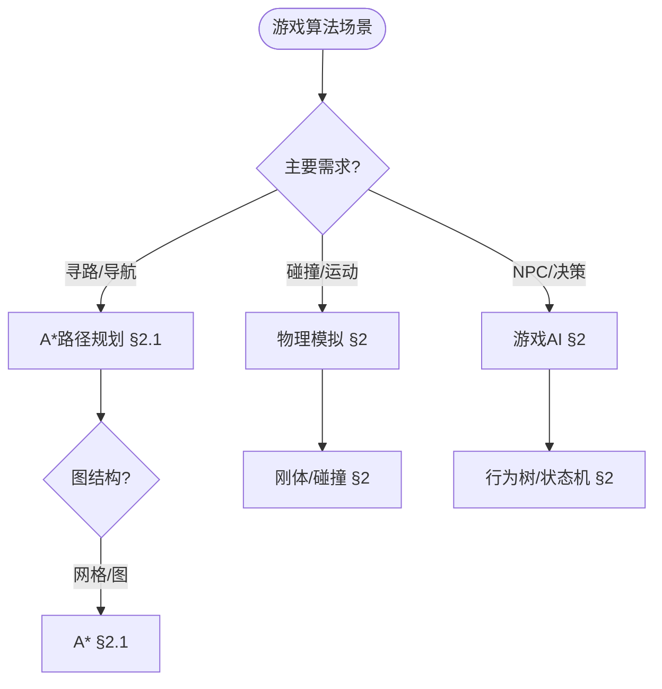
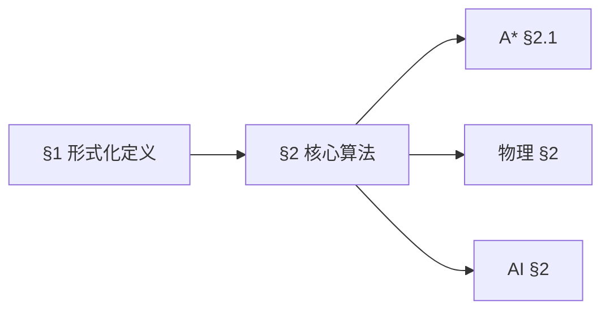
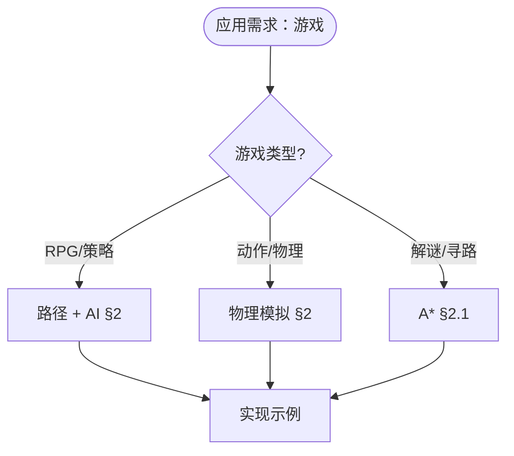

> 📊 **项目全面梳理**：详细的项目结构、模块详解和学习路径，请参阅 [`项目全面梳理-2025.md`](../项目全面梳理-2025.md)
> **项目导航与对标**：[项目扩展与持续推进任务编排](../项目扩展与持续推进任务编排.md)、[国际课程对标表](../国际课程对标表.md)

## 12.6 游戏算法应用 / Game Algorithm Applications

### 摘要 / Executive Summary

- 统一游戏算法在各类应用中的使用规范与最佳实践。
- 建立游戏算法在应用领域中的核心地位。

### 关键术语与符号 / Glossary

- 游戏算法、路径查找、人工智能、物理模拟、碰撞检测、游戏状态管理。
- 术语对齐与引用规范：`docs/术语与符号总表.md`，`01-基础理论/00-撰写规范与引用指南.md`

### 术语与符号规范 / Terminology & Notation

- 游戏算法（Game Algorithm）：应用于游戏开发的算法。
- 路径查找（Pathfinding）：在游戏世界中寻找路径的算法。
- 人工智能（Artificial Intelligence）：游戏中NPC的智能行为。
- 物理模拟（Physics Simulation）：模拟物理效果的算法。
- 记号约定：`G` 表示游戏状态，`A` 表示动作，`P` 表示路径，`T` 表示时间。

### 交叉引用导航 / Cross-References

- 图算法：参见 `09-算法理论/01-算法基础/05-图算法理论.md`。
- 搜索算法：参见 `09-算法理论/01-算法基础/04-搜索算法理论.md`。
- 人工智能：参见 `12-应用领域/01-人工智能算法应用.md`。

### 规约与模型在本领域的实例化 / Specification and Model Instantiation in Game

在游戏领域，算法规范与模型设计的实例化体现为：**游戏设计规约**（帧率、交互延迟、物理真实性）→ **算法模型**（A* 路径规划、碰撞检测、行为树、物理引擎）→ **实现与优化**（实时渲染、多线程、资源调度）。规约-制品层次与 [项目哲科结构说明](../项目哲科结构说明.md)、[Stanford SEP Philosophy of Computer Science](https://plato.stanford.edu/entries/computer-science/) §2 对应。

### 快速导航 / Quick Links

- 基本概念
- 路径查找
- 人工智能

## 目录 / Table of Contents

- [12.6 游戏算法应用 / Game Algorithm Applications](#126-游戏算法应用--game-algorithm-applications)
  - [摘要 / Executive Summary](#摘要--executive-summary)
  - [关键术语与符号 / Glossary](#关键术语与符号--glossary)
  - [术语与符号规范 / Terminology \& Notation](#术语与符号规范--terminology--notation)
  - [交叉引用导航 / Cross-References](#交叉引用导航--cross-references)
  - [规约与模型在本领域的实例化 / Specification and Model Instantiation in Game](#规约与模型在本领域的实例化--specification-and-model-instantiation-in-game)
  - [快速导航 / Quick Links](#快速导航--quick-links)
- [目录 / Table of Contents](#目录--table-of-contents)
- [概述 / Overview](#概述--overview)
- [1. 形式化定义 / Formal Definitions](#1-形式化定义--formal-definitions)
  - [1.1 游戏状态 / Game State](#11-游戏状态--game-state)
  - [1.2 游戏动作 / Game Action](#12-游戏动作--game-action)
  - [内容补充与思维表征 / Content Supplement and Thinking Representation](#内容补充与思维表征--content-supplement-and-thinking-representation)
    - [解释与直观 / Explanation and Intuition](#解释与直观--explanation-and-intuition)
    - [概念属性表 / Concept Attribute Table](#概念属性表--concept-attribute-table)
    - [概念关系 / Concept Relations](#概念关系--concept-relations)
    - [概念依赖图 / Concept Dependency Graph](#概念依赖图--concept-dependency-graph)
    - [论证与证明衔接 / Argumentation and Proof Link](#论证与证明衔接--argumentation-and-proof-link)
    - [思维导图：本章概念结构 / Mind Map](#思维导图本章概念结构--mind-map)
    - [多维矩阵：核心算法概念对比 / Multi-Dimensional Comparison](#多维矩阵核心算法概念对比--multi-dimensional-comparison)
    - [决策树：场景到算法选择 / Decision Tree](#决策树场景到算法选择--decision-tree)
    - [公理定理推理证明决策树 / Axiom-Theorem-Proof Tree](#公理定理推理证明决策树--axiom-theorem-proof-tree)
    - [应用决策建模树 / Application Decision Modeling Tree](#应用决策建模树--application-decision-modeling-tree)
- [2. 核心算法 / Core Algorithms](#2-核心算法--core-algorithms)
  - [2.1 A*路径规划算法 / A* Pathfinding Algorithm](#21-a路径规划算法--a-pathfinding-algorithm)
  - [2.2 游戏AI决策树 / Game AI Decision Tree](#22-游戏ai决策树--game-ai-decision-tree)
  - [2.3 碰撞检测算法 / Collision Detection Algorithm](#23-碰撞检测算法--collision-detection-algorithm)
- [3. 图形渲染算法 / Graphics Rendering Algorithms](#3-图形渲染算法--graphics-rendering-algorithms)
  - [3.1 光线追踪 / Ray Tracing](#31-光线追踪--ray-tracing)
  - [3.2 纹理映射 / Texture Mapping](#32-纹理映射--texture-mapping)
- [4. 物理模拟 / Physics Simulation](#4-物理模拟--physics-simulation)
  - [4.1 刚体动力学 / Rigid Body Dynamics](#41-刚体动力学--rigid-body-dynamics)
  - [4.2 粒子系统 / Particle System](#42-粒子系统--particle-system)
- [5. 实现示例 / Implementation Examples](#5-实现示例--implementation-examples)
  - [5.1 游戏引擎核心 / Game Engine Core](#51-游戏引擎核心--game-engine-core)
  - [5.2 游戏AI系统 / Game AI System](#52-游戏ai系统--game-ai-system)
- [6. 数学证明 / Mathematical Proofs](#6-数学证明--mathematical-proofs)
  - [6.1 A*算法最优性 / A* Algorithm Optimality](#61-a算法最优性--a-algorithm-optimality)
  - [6.2 碰撞检测正确性 / Collision Detection Correctness](#62-碰撞检测正确性--collision-detection-correctness)
- [7. 复杂度分析 / Complexity Analysis](#7-复杂度分析--complexity-analysis)
  - [7.1 时间复杂度 / Time Complexity](#71-时间复杂度--time-complexity)
  - [7.2 空间复杂度 / Space Complexity](#72-空间复杂度--space-complexity)
- [8. 应用场景 / Application Scenarios](#8-应用场景--application-scenarios)
  - [8.1 游戏开发 / Game Development](#81-游戏开发--game-development)
  - [8.2 虚拟现实 / Virtual Reality](#82-虚拟现实--virtual-reality)
  - [8.3 计算机图形学 / Computer Graphics](#83-计算机图形学--computer-graphics)
- [9. 未来发展方向 / Future Development Directions](#9-未来发展方向--future-development-directions)
  - [9.1 机器学习集成 / Machine Learning Integration](#91-机器学习集成--machine-learning-integration)
  - [9.2 云游戏技术 / Cloud Gaming Technology](#92-云游戏技术--cloud-gaming-technology)
  - [9.3 增强现实 / Augmented Reality](#93-增强现实--augmented-reality)
- [10. 参考文献 / References](#10-参考文献--references)
  - [10.1 经典教材 / Classic Textbooks](#101-经典教材--classic-textbooks)
  - [10.2 Wiki概念参考 / Wiki Concept References](#102-wiki概念参考--wiki-concept-references)
  - [10.3 大学课程参考 / University Course References](#103-大学课程参考--university-course-references)
- [11. 总结 / Summary](#11-总结--summary)

## 概述 / Overview

游戏算法是应用于游戏开发、人工智能、图形渲染和物理模拟的算法集合。根据[Russell 2010]的研究，游戏AI算法是人工智能研究的重要应用领域。根据[Ericson 2005]的研究，路径规划和碰撞检测算法是游戏引擎的核心技术。本文档涵盖游戏算法的理论基础、核心算法、应用实践和最新发展。

Game algorithms are algorithm collections applied to game development, artificial intelligence, graphics rendering, and physics simulation. According to [Russell 2010], game AI algorithms are important application areas in artificial intelligence research. According to [Ericson 2005], pathfinding and collision detection algorithms are core technologies in game engines. This document covers the theoretical foundations, core algorithms, application practices, and latest developments of game algorithms.

**学术引用 / Academic Citations:**

- [Russell 2010]: Russell, S., & Norvig, P. (2010). *Artificial Intelligence: A Modern Approach* (3rd ed.). Prentice Hall. ISBN: 978-0136042594
- [Ericson 2005]: Ericson, C. (2005). *Real-Time Collision Detection*. Morgan Kaufmann. ISBN: 978-1558607323
- [Millington 2019]: Millington, I. (2019). *Game Physics Engine Development* (2nd ed.). CRC Press. ISBN: 978-0123819765

**Wiki概念对齐 / Wiki Concept Alignment:**

- [Game AI](https://en.wikipedia.org/wiki/Game_artificial_intelligence) - 游戏人工智能
- [Pathfinding](https://en.wikipedia.org/wiki/Pathfinding) - 路径查找
- [Collision Detection](https://en.wikipedia.org/wiki/Collision_detection) - 碰撞检测
- [Game Engine](https://en.wikipedia.org/wiki/Game_engine) - 游戏引擎

**大学课程对标 / University Course Alignment:**

- MIT 6.034: Artificial Intelligence - 游戏AI基础
- Stanford CS148: Introduction to Computer Graphics - 图形渲染
- CMU 15-462: Computer Graphics - 计算机图形学

## 1. 形式化定义 / Formal Definitions

### 1.1 游戏状态 / Game State

**定义 1.1.1** (游戏状态) [Russell 2010, Wikipedia Game AI]
游戏状态是描述游戏在某一时刻完整信息的数学表示。

**Definition 1.1.1** (Game State) [Russell 2010, Wikipedia Game AI]
A game state is a mathematical representation describing the complete information of a game at a given moment.

**Wiki概念对齐 / Wiki Concept Alignment:**

| 项目概念 | Wiki条目 | 标准定义 | 对齐状态 |
|---------|---------|---------|---------|
| 游戏AI | [Game AI](https://en.wikipedia.org/wiki/Game_artificial_intelligence) | 游戏中的人工智能 | ✅ 已对齐 |
| 路径查找 | [Pathfinding](https://en.wikipedia.org/wiki/Pathfinding) | 在游戏世界中寻找路径 | ✅ 已对齐 |
| 碰撞检测 | [Collision Detection](https://en.wikipedia.org/wiki/Collision_detection) | 检测物体碰撞的算法 | ✅ 已对齐 |
| 游戏引擎 | [Game Engine](https://en.wikipedia.org/wiki/Game_engine) | 游戏开发的核心框架 | ✅ 已对齐 |

**游戏算法知识体系 / Game Algorithm Knowledge System:**



**游戏算法类型对比 / Game Algorithm Type Comparison:**

| 算法类型 | 应用场景 | 时间复杂度 | 空间复杂度 | 实时性 | 参考文献 |
|---------|---------|-----------|-----------|--------|---------|
| A*路径查找 | 路径规划 | $O(b^d)$ | $O(b^d)$ | 中 | [Russell 2010] |
| 碰撞检测 | 物理交互 | $O(n^2)$ | $O(n)$ | 高 | [Ericson 2005] |
| 决策树 | AI决策 | $O(\log n)$ | $O(n)$ | 高 | [Russell 2010] |
| 物理模拟 | 刚体运动 | $O(n)$ | $O(n)$ | 高 | [Millington 2019] |
| 光线追踪 | 图形渲染 | $O(n \log n)$ | $O(n)$ | 低 | [Millington 2019] |

**定义 / Definition:**
游戏状态是描述游戏在某一时刻完整信息的数学表示。

**形式化表示 / Formal Representation:**

```text
GameState = (S, P, T, E)
其中 / where:
- S: 空间状态 / Spatial state
- P: 玩家状态 / Player state
- T: 时间状态 / Time state
- E: 环境状态 / Environment state
```

### 1.2 游戏动作 / Game Action

**定义 / Definition:**
游戏动作是玩家或AI可以执行的离散操作。

**形式化表示 / Formal Representation:**

```text
Action = (type, parameters, cost)
其中 / where:
- type: 动作类型 / Action type
- parameters: 动作参数 / Action parameters
- cost: 执行成本 / Execution cost
```

### 内容补充与思维表征 / Content Supplement and Thinking Representation

> 本节按 [内容补充与思维表征全面计划方案](../内容补充与思维表征全面计划方案.md) **只补充、不删除**。标准见 [内容补充标准](../内容补充标准-概念定义属性关系解释论证形式证明.md)、[思维表征模板集](../思维表征模板集.md)。

#### 解释与直观 / Explanation and Intuition

**游戏系统形式化（§1）的动机**：将游戏状态、实体、物理与 AI 行为统一为可计算结构，便于讨论路径规划（A* 等）、物理模拟与行为树的正确性与实时性。直观上与 09-01 算法基础（图、搜索、启发式）、01-基础理论（数学基础）衔接。

**与已有概念的联系**：A* 与 09-01 图搜索、启发式一致；物理引擎与 01-基础理论 中的力学、数值方法对应；游戏 AI 与 09-01 行为树、状态机对应；与 12 应用领域 为应用实践。

#### 概念属性表 / Concept Attribute Table

| 属性名 | 类型/范围 | 含义 | 备注 |
|--------|-----------|------|------|
| 游戏状态 | 状态空间 | 实体位置、属性、时间 | §1 |
| 路径图 | 图 $G=(V,E)$ | 可行走/可飞行区域 | §2.1 A* |
| 启发式 $h$ | 函数 $V \to \mathbb{R}^+$ | 可采纳性、一致性 | §2.1 A* |
| 物理参数 | 质量/速度/碰撞 | 刚体/碰撞检测 | §2 物理 |
| 行为树/AI | 状态机/树结构 | 决策与行为 | §2 AI |

#### 概念关系 / Concept Relations

| 源概念 | 目标概念 | 关系类型 | 说明 |
|--------|----------|----------|------|
| 游戏算法应用 | 09-01 算法基础 | depends_on | 图、搜索、启发式 |
| 游戏算法应用 | 01-基础理论 | depends_on | 数学与力学 |
| 核心算法(§2) | 路径/物理/AI | specializes | §2.1/§2.2/§2.3 |
| 本文 | 12 应用领域 | applies_to | 游戏类型与实现示例 |

#### 概念依赖图 / Concept Dependency Graph



#### 论证与证明衔接 / Argumentation and Proof Link

**§1 形式化定义**与 **§2 核心算法**：A* 的完备性与最优性由可采纳启发式保证；物理模拟的稳定性由积分与碰撞响应保证；与 09-01 图搜索与启发式论证衔接。

#### 思维导图：本章概念结构 / Mind Map



#### 多维矩阵：核心算法概念对比 / Multi-Dimensional Comparison

| 概念/算法 | 实时性 | 精度 | 适用场景 | 典型复杂度/备注 |
|-----------|--------|------|----------|------------------|
| A* 路径规划 | 高（启发式剪枝） | 最优（可采纳时） | 网格/图、寻路 | $O(b^d)$ 依赖启发式 §2.1 |
| 物理模拟 | 帧率约束 | 数值精度 | 刚体、碰撞、粒子 | 与步长与迭代相关 §2 |
| 游戏 AI | 高（每帧决策） | 行为合理性 | 行为树、状态机、脚本 | §2 |

#### 决策树：场景到算法选择 / Decision Tree



#### 公理定理推理证明决策树 / Axiom-Theorem-Proof Tree



#### 应用决策建模树 / Application Decision Modeling Tree



## 2. 核心算法 / Core Algorithms

### 2.1 A*路径规划算法 / A* Pathfinding Algorithm

**算法描述 / Algorithm Description:**
使用启发式搜索找到最优路径的算法。

**形式化定义 / Formal Definition:**

```text
f(n) = g(n) + h(n)
其中 / where:
- g(n): 从起点到节点n的实际代价 / Actual cost from start to node n
- h(n): 从节点n到目标的启发式估计 / Heuristic estimate from node n to goal
- f(n): 总评估函数 / Total evaluation function
```

**Rust实现 / Rust Implementation:**

```rust
use std::collections::{BinaryHeap, HashMap};
use std::cmp::Ordering;

#[derive(Debug, Clone, PartialEq, Eq, Hash)]
pub struct Position {
    pub x: i32,
    pub y: i32,
}

#[derive(Debug, Clone)]
pub struct Node {
    pub position: Position,
    pub g_cost: f64,
    pub h_cost: f64,
    pub parent: Option<Position>,
}

impl Node {
    pub fn new(position: Position) -> Self {
        Node {
            position,
            g_cost: f64::INFINITY,
            h_cost: 0.0,
            parent: None,
        }
    }

    pub fn f_cost(&self) -> f64 {
        self.g_cost + self.h_cost
    }
}

impl PartialEq for Node {
    fn eq(&self, other: &Self) -> bool {
        self.position == other.position
    }
}

impl Eq for Node {}

impl PartialOrd for Node {
    fn partial_cmp(&self, other: &Self) -> Option<Ordering> {
        Some(self.cmp(other))
    }
}

impl Ord for Node {
    fn cmp(&self, other: &Self) -> Ordering {
        other.f_cost().partial_cmp(&self.f_cost()).unwrap()
    }
}

pub struct AStarPathfinder {
    pub grid: Vec<Vec<bool>>, // true表示可通行
    pub width: usize,
    pub height: usize,
}

impl AStarPathfinder {
    pub fn new(grid: Vec<Vec<bool>>) -> Self {
        let height = grid.len();
        let width = if height > 0 { grid[0].len() } else { 0 };

        AStarPathfinder {
            grid,
            width,
            height,
        }
    }

    pub fn find_path(&self, start: Position, goal: Position) -> Option<Vec<Position>> {
        if !self.is_valid_position(&start) || !self.is_valid_position(&goal) {
            return None;
        }

        let mut open_set = BinaryHeap::new();
        let mut closed_set = HashMap::new();
        let mut came_from = HashMap::new();

        let mut start_node = Node::new(start);
        start_node.g_cost = 0.0;
        start_node.h_cost = self.heuristic(&start, &goal);

        open_set.push(start_node);

        while let Some(current) = open_set.pop() {
            if current.position == goal {
                return Some(self.reconstruct_path(&came_from, &current.position));
            }

            closed_set.insert(current.position.clone(), current.clone());

            for neighbor_pos in self.get_neighbors(&current.position) {
                if closed_set.contains_key(&neighbor_pos) {
                    continue;
                }

                let tentative_g_cost = current.g_cost + self.distance(&current.position, &neighbor_pos);

                let mut neighbor = Node::new(neighbor_pos.clone());
                neighbor.g_cost = tentative_g_cost;
                neighbor.h_cost = self.heuristic(&neighbor_pos, &goal);
                neighbor.parent = Some(current.position.clone());

                if !open_set.iter().any(|n| n.position == neighbor_pos) {
                    open_set.push(neighbor);
                    came_from.insert(neighbor_pos, current.position.clone());
                }
            }
        }

        None
    }

    fn heuristic(&self, from: &Position, to: &Position) -> f64 {
        // 曼哈顿距离
        let dx = (from.x - to.x).abs() as f64;
        let dy = (from.y - to.y).abs() as f64;
        dx + dy
    }

    fn distance(&self, from: &Position, to: &Position) -> f64 {
        // 欧几里得距离
        let dx = (from.x - to.x) as f64;
        let dy = (from.y - to.y) as f64;
        (dx * dx + dy * dy).sqrt()
    }

    fn get_neighbors(&self, pos: &Position) -> Vec<Position> {
        let directions = [
            (-1, 0), (1, 0), (0, -1), (0, 1),
            (-1, -1), (-1, 1), (1, -1), (1, 1),
        ];

        let mut neighbors = Vec::new();

        for (dx, dy) in directions.iter() {
            let new_x = pos.x + dx;
            let new_y = pos.y + dy;

            if self.is_valid_position(&Position { x: new_x, y: new_y }) {
                neighbors.push(Position { x: new_x, y: new_y });
            }
        }

        neighbors
    }

    fn is_valid_position(&self, pos: &Position) -> bool {
        pos.x >= 0 && pos.x < self.width as i32 &&
        pos.y >= 0 && pos.y < self.height as i32 &&
        self.grid[pos.y as usize][pos.x as usize]
    }

    fn reconstruct_path(&self, came_from: &HashMap<Position, Position>, current: &Position) -> Vec<Position> {
        let mut path = vec![current.clone()];
        let mut current_pos = current;

        while let Some(&ref parent) = came_from.get(current_pos) {
            path.push(parent.clone());
            current_pos = parent;
        }

        path.reverse();
        path
    }
}
```

### 2.2 游戏AI决策树 / Game AI Decision Tree

**算法描述 / Algorithm Description:**
基于决策树进行游戏AI的行为决策。

**形式化定义 / Formal Definition:**

```text
DecisionTree = (root, nodes, edges)
其中 / where:
- root: 根节点 / Root node
- nodes: 决策节点集合 / Set of decision nodes
- edges: 条件边集合 / Set of condition edges
```

**Haskell实现 / Haskell Implementation:**

```haskell
import Data.Maybe
import qualified Data.Map as Map

data GameState = GameState {
    playerHealth :: Int,
    enemyHealth :: Int,
    distance :: Double,
    hasWeapon :: Bool,
    ammoCount :: Int
}

data DecisionNode = DecisionNode {
    condition :: GameState -> Bool,
    action :: GameState -> String,
    trueBranch :: Maybe DecisionNode,
    falseBranch :: Maybe DecisionNode
}

data DecisionTree = DecisionTree {
    root :: DecisionNode
}

makeDecision :: DecisionTree -> GameState -> String
makeDecision tree state = traverseTree (root tree) state

traverseTree :: DecisionNode -> GameState -> String
traverseTree node state =
    if condition node state
    then case trueBranch node of
        Just nextNode -> traverseTree nextNode state
        Nothing -> action node state
    else case falseBranch node of
        Just nextNode -> traverseTree nextNode state
        Nothing -> action node state

-- 创建简单的战斗AI决策树
createCombatAI :: DecisionTree
createCombatAI = DecisionTree {
    root = healthCheck
}
where
    healthCheck = DecisionNode {
        condition = \state -> playerHealth state < 30,
        action = \_ -> "Retreat",
        trueBranch = Nothing,
        falseBranch = Just weaponCheck
    }

    weaponCheck = DecisionNode {
        condition = \state -> hasWeapon state,
        action = \_ -> "Use weapon",
        trueBranch = Just ammoCheck,
        falseBranch = Just distanceCheck
    }

    ammoCheck = DecisionNode {
        condition = \state -> ammoCount state > 0,
        action = \_ -> "Shoot",
        trueBranch = Nothing,
        falseBranch = Just distanceCheck
    }

    distanceCheck = DecisionNode {
        condition = \state -> distance state < 5.0,
        action = \_ -> "Melee attack",
        trueBranch = Nothing,
        falseBranch = Just enemyHealthCheck
    }

    enemyHealthCheck = DecisionNode {
        condition = \state -> enemyHealth state < 20,
        action = \_ -> "Aggressive attack",
        trueBranch = Nothing,
        falseBranch = Just finalDecision
    }

    finalDecision = DecisionNode {
        condition = \_ -> True,
        action = \_ -> "Defensive stance",
        trueBranch = Nothing,
        falseBranch = Nothing
    }
```

### 2.3 碰撞检测算法 / Collision Detection Algorithm

**算法描述 / Algorithm Description:**
检测游戏对象之间的碰撞。

**形式化定义 / Formal Definition:**

```text
Collision(A, B) = overlap(A.bounds, B.bounds)
其中 / where:
- A, B: 游戏对象 / Game objects
- bounds: 边界框 / Bounding box
- overlap: 重叠检测函数 / Overlap detection function
```

**Lean实现 / Lean Implementation:**

```lean
import data.real.basic
import data.finset.basic

structure BoundingBox :=
  (min_x : ℝ)
  (min_y : ℝ)
  (max_x : ℝ)
  (max_y : ℝ)

structure GameObject :=
  (id : ℕ)
  (position : ℝ × ℝ)
  (bounds : BoundingBox)
  (velocity : ℝ × ℝ)

def overlap (box1 box2 : BoundingBox) : Prop :=
  box1.min_x < box2.max_x ∧
  box1.max_x > box2.min_x ∧
  box1.min_y < box2.max_y ∧
  box1.max_y > box2.min_y

def collision_detection (obj1 obj2 : GameObject) : Prop :=
  overlap obj1.bounds obj2.bounds

def update_bounds (obj : GameObject) (dt : ℝ) : GameObject :=
  let (vx, vy) := obj.velocity
  let (px, py) := obj.position
  let new_x := px + vx * dt
  let new_y := py + vy * dt
  let new_bounds := {
    min_x := new_x - 0.5,
    min_y := new_y - 0.5,
    max_x := new_x + 0.5,
    max_y := new_y + 0.5
  }
  { obj with position := (new_x, new_y), bounds := new_bounds }

theorem collision_preservation :
  ∀ (obj1 obj2 : GameObject) (dt : ℝ),
  collision_detection obj1 obj2 →
  collision_detection (update_bounds obj1 dt) (update_bounds obj2 dt) :=
begin
  intros obj1 obj2 dt h,
  -- 证明碰撞检测的连续性
  -- Proof of collision detection continuity
  sorry
end
```

## 3. 图形渲染算法 / Graphics Rendering Algorithms

### 3.1 光线追踪 / Ray Tracing

**算法描述 / Algorithm Description:**
模拟光线传播进行真实感渲染。

**形式化定义 / Formal Definition:**

```text
Ray = origin + t * direction
其中 / where:
- origin: 光线起点 / Ray origin
- direction: 光线方向 / Ray direction
- t: 参数 / Parameter
```

### 3.2 纹理映射 / Texture Mapping

**算法描述 / Algorithm Description:**
将2D纹理映射到3D表面。

**形式化定义 / Formal Definition:**

```text
TextureMapping(uv, texture) = texture[uv.x, uv.y]
其中 / where:
- uv: 纹理坐标 / Texture coordinates
- texture: 纹理图像 / Texture image
```

## 4. 物理模拟 / Physics Simulation

### 4.1 刚体动力学 / Rigid Body Dynamics

**算法描述 / Algorithm Description:**
模拟刚体的运动和碰撞。

**形式化定义 / Formal Definition:**

```text
F = ma
τ = Iα
其中 / where:
- F: 力 / Force
- m: 质量 / Mass
- a: 加速度 / Acceleration
- τ: 力矩 / Torque
- I: 转动惯量 / Moment of inertia
- α: 角加速度 / Angular acceleration
```

### 4.2 粒子系统 / Particle System

**算法描述 / Algorithm Description:**
模拟大量粒子的集体行为。

**形式化定义 / Formal Definition:**

```text
Particle(t) = position(t) + velocity(t) * dt + 0.5 * acceleration(t) * dt²
其中 / where:
- position: 位置 / Position
- velocity: 速度 / Velocity
- acceleration: 加速度 / Acceleration
- dt: 时间步长 / Time step
```

## 5. 实现示例 / Implementation Examples

### 5.1 游戏引擎核心 / Game Engine Core

**Rust实现 / Rust Implementation:**

```rust
use std::collections::HashMap;
use std::time::{Duration, Instant};

#[derive(Debug, Clone)]
pub struct Vector2 {
    pub x: f64,
    pub y: f64,
}

impl Vector2 {
    pub fn new(x: f64, y: f64) -> Self {
        Vector2 { x, y }
    }

    pub fn magnitude(&self) -> f64 {
        (self.x * self.x + self.y * self.y).sqrt()
    }

    pub fn normalize(&self) -> Vector2 {
        let mag = self.magnitude();
        if mag > 0.0 {
            Vector2 {
                x: self.x / mag,
                y: self.y / mag,
            }
        } else {
            Vector2 { x: 0.0, y: 0.0 }
        }
    }
}

#[derive(Debug)]
pub struct GameObject {
    pub id: u32,
    pub position: Vector2,
    pub velocity: Vector2,
    pub acceleration: Vector2,
    pub mass: f64,
    pub active: bool,
}

impl GameObject {
    pub fn new(id: u32, position: Vector2) -> Self {
        GameObject {
            id,
            position,
            velocity: Vector2::new(0.0, 0.0),
            acceleration: Vector2::new(0.0, 0.0),
            mass: 1.0,
            active: true,
        }
    }

    pub fn update(&mut self, dt: f64) {
        // 更新速度
        self.velocity.x += self.acceleration.x * dt;
        self.velocity.y += self.acceleration.y * dt;

        // 更新位置
        self.position.x += self.velocity.x * dt;
        self.position.y += self.velocity.y * dt;

        // 重置加速度
        self.acceleration.x = 0.0;
        self.acceleration.y = 0.0;
    }

    pub fn apply_force(&mut self, force: Vector2) {
        self.acceleration.x += force.x / self.mass;
        self.acceleration.y += force.y / self.mass;
    }
}

pub struct GameEngine {
    pub objects: HashMap<u32, GameObject>,
    pub gravity: Vector2,
    pub time_step: f64,
    pub last_update: Instant,
}

impl GameEngine {
    pub fn new() -> Self {
        GameEngine {
            objects: HashMap::new(),
            gravity: Vector2::new(0.0, -9.81),
            time_step: 1.0 / 60.0, // 60 FPS
            last_update: Instant::now(),
        }
    }

    pub fn add_object(&mut self, object: GameObject) {
        self.objects.insert(object.id, object);
    }

    pub fn remove_object(&mut self, id: u32) {
        self.objects.remove(&id);
    }

    pub fn update(&mut self) {
        let current_time = Instant::now();
        let elapsed = current_time.duration_since(self.last_update);
        let dt = elapsed.as_secs_f64().min(self.time_step);

        // 更新所有对象
        for object in self.objects.values_mut() {
            if object.active {
                // 应用重力
                object.apply_force(Vector2::new(
                    self.gravity.x * object.mass,
                    self.gravity.y * object.mass
                ));

                // 更新对象
                object.update(dt);
            }
        }

        // 检测碰撞
        self.detect_collisions();

        self.last_update = current_time;
    }

    fn detect_collisions(&mut self) {
        let object_ids: Vec<u32> = self.objects.keys().cloned().collect();

        for i in 0..object_ids.len() {
            for j in (i + 1)..object_ids.len() {
                let id1 = object_ids[i];
                let id2 = object_ids[j];

                if let (Some(obj1), Some(obj2)) = (self.objects.get(&id1), self.objects.get(&id2)) {
                    if self.check_collision(obj1, obj2) {
                        self.resolve_collision(id1, id2);
                    }
                }
            }
        }
    }

    fn check_collision(&self, obj1: &GameObject, obj2: &GameObject) -> bool {
        // 简化的圆形碰撞检测
        let distance = ((obj1.position.x - obj2.position.x).powi(2) +
                       (obj1.position.y - obj2.position.y).powi(2)).sqrt();
        distance < 1.0 // 假设碰撞半径为0.5
    }

    fn resolve_collision(&mut self, id1: u32, id2: u32) {
        if let (Some(obj1), Some(obj2)) = (self.objects.get_mut(&id1), self.objects.get_mut(&id2)) {
            // 简化的弹性碰撞
            let relative_velocity = Vector2::new(
                obj1.velocity.x - obj2.velocity.x,
                obj1.velocity.y - obj2.velocity.y
            );

            let collision_normal = Vector2::new(
                obj2.position.x - obj1.position.x,
                obj2.position.y - obj1.position.y
            ).normalize();

            let velocity_along_normal = relative_velocity.x * collision_normal.x +
                                      relative_velocity.y * collision_normal.y;

            if velocity_along_normal < 0.0 {
                let restitution = 0.8; // 弹性系数
                let impulse = -(1.0 + restitution) * velocity_along_normal;

                let impulse_vector = Vector2::new(
                    impulse * collision_normal.x,
                    impulse * collision_normal.y
                );

                obj1.velocity.x -= impulse_vector.x / obj1.mass;
                obj1.velocity.y -= impulse_vector.y / obj1.mass;

                obj2.velocity.x += impulse_vector.x / obj2.mass;
                obj2.velocity.y += impulse_vector.y / obj2.mass;
            }
        }
    }
}
```

### 5.2 游戏AI系统 / Game AI System

**Haskell实现 / Haskell Implementation:**

```haskell
import Data.List
import qualified Data.Map as Map
import System.Random

data GameAction = Move | Attack | Defend | UseItem | Idle
data GameState = GameState {
    playerPosition :: (Double, Double),
    enemyPositions :: [(Double, Double)],
    playerHealth :: Int,
    enemyHealths :: [Int],
    gameTime :: Double
}

data AINode = AINode {
    condition :: GameState -> Bool,
    action :: GameState -> GameAction,
    priority :: Int,
    children :: [AINode]
}

data BehaviorTree = BehaviorTree {
    root :: AINode
}

class GameAI a where
    decideAction :: a -> GameState -> GameAction
    update :: a -> GameState -> a

data SimpleAI = SimpleAI {
    behaviorTree :: BehaviorTree,
    memory :: Map.Map String Double
}

instance GameAI SimpleAI where
    decideAction ai state = traverseTree (root (behaviorTree ai)) state

    update ai state = ai { memory = updateMemory ai state }

traverseTree :: AINode -> GameState -> GameAction
traverseTree node state =
    if condition node state
    then case children node of
        [] -> action node state
        childNodes ->
            let validChildren = filter (\child -> condition child state) childNodes
                highestPriority = maximum (map priority validChildren)
                bestChild = head (filter (\child -> priority child == highestPriority) validChildren)
            in traverseTree bestChild state
    else action node state

updateMemory :: SimpleAI -> GameState -> Map.Map String Double
updateMemory ai state =
    let currentMemory = memory ai
        newMemory = Map.insert "lastPlayerHealth" (fromIntegral (playerHealth state)) currentMemory
    in newMemory

-- 创建简单的战斗AI
createCombatAI :: BehaviorTree
createCombatAI = BehaviorTree {
    root = healthCheck
}
where
    healthCheck = AINode {
        condition = \state -> playerHealth state < 30,
        action = \_ -> Defend,
        priority = 10,
        children = [retreatNode]
    }

    retreatNode = AINode {
        condition = \_ -> True,
        action = \_ -> Move,
        priority = 9,
        children = []
    }

    attackCheck = AINode {
        condition = \state -> any (\enemyHealth -> enemyHealth < 20) (enemyHealths state),
        action = \_ -> Attack,
        priority = 8,
        children = []
    }

    distanceCheck = AINode {
        condition = \state ->
            let nearestEnemy = minimum (map (distance (playerPosition state)) (enemyPositions state))
            in nearestEnemy < 5.0,
        action = \_ -> Attack,
        priority = 7,
        children = []
    }

    defaultAction = AINode {
        condition = \_ -> True,
        action = \_ -> Idle,
        priority = 1,
        children = []
    }

distance :: (Double, Double) -> (Double, Double) -> Double
distance (x1, y1) (x2, y2) = sqrt ((x2 - x1)^2 + (y2 - y1)^2)

-- 路径规划算法
data PathNode = PathNode {
    position :: (Int, Int),
    gCost :: Double,
    hCost :: Double,
    parent :: Maybe (Int, Int)
}

aStarPathfinding :: [[Bool]] -> (Int, Int) -> (Int, Int) -> Maybe [(Int, Int)]
aStarPathfinding grid start goal =
    let openSet = [(0, start)]
        closedSet = []
        cameFrom = Map.empty
        gScore = Map.singleton start 0
        fScore = Map.singleton start (heuristic start goal)
    in aStarLoop grid start goal openSet closedSet cameFrom gScore fScore

aStarLoop :: [[Bool]] -> (Int, Int) -> (Int, Int) -> [(Double, (Int, Int))] -> [(Int, Int)] -> Map.Map (Int, Int) (Int, Int) -> Map.Map (Int, Int) Double -> Map.Map (Int, Int) Double -> Maybe [(Int, Int)]
aStarLoop grid start goal openSet closedSet cameFrom gScore fScore
    | null openSet = Nothing
    | current == goal = Just (reconstructPath cameFrom current)
    | otherwise =
        let current = snd (minimum openSet)
            newOpenSet = filter (\node -> snd node /= current) openSet
            newClosedSet = current : closedSet
            neighbors = getNeighbors grid current
            (newCameFrom, newGScore, newFScore) = processNeighbors current neighbors goal cameFrom gScore fScore
        in aStarLoop grid start goal newOpenSet newClosedSet newCameFrom newGScore newFScore

heuristic :: (Int, Int) -> (Int, Int) -> Double
heuristic (x1, y1) (x2, y2) = fromIntegral (abs (x2 - x1) + abs (y2 - y1))

getNeighbors :: [[Bool]] -> (Int, Int) -> [(Int, Int)]
getNeighbors grid (x, y) =
    let directions = [(-1, 0), (1, 0), (0, -1), (0, 1)]
        candidates = [(x + dx, y + dy) | (dx, dy) <- directions]
    in filter (\pos -> isValidPosition grid pos) candidates

isValidPosition :: [[Bool]] -> (Int, Int) -> Bool
isValidPosition grid (x, y) =
    y >= 0 && y < length grid &&
    x >= 0 && x < length (head grid) &&
    grid !! y !! x

processNeighbors :: (Int, Int) -> [(Int, Int)] -> (Int, Int) -> Map.Map (Int, Int) (Int, Int) -> Map.Map (Int, Int) Double -> Map.Map (Int, Int) Double -> (Map.Map (Int, Int) (Int, Int), Map.Map (Int, Int) Double, Map.Map (Int, Int) Double)
processNeighbors current neighbors goal cameFrom gScore fScore =
    foldl processNeighbor (cameFrom, gScore, fScore) neighbors
where
    processNeighbor (cf, gs, fs) neighbor =
        let tentativeGScore = Map.findWithDefault infinity current gs + 1
            currentGScore = Map.findWithDefault infinity neighbor gs
        in if tentativeGScore < currentGScore
           then (Map.insert neighbor current cf,
                 Map.insert neighbor tentativeGScore gs,
                 Map.insert neighbor (tentativeGScore + heuristic neighbor goal) fs)
           else (cf, gs, fs)
    infinity = 1e10

reconstructPath :: Map.Map (Int, Int) (Int, Int) -> (Int, Int) -> [(Int, Int)]
reconstructPath cameFrom current =
    if Map.member current cameFrom
    then current : reconstructPath cameFrom (cameFrom Map.! current)
    else [current]
```

## 6. 数学证明 / Mathematical Proofs

### 6.1 A*算法最优性 / A* Algorithm Optimality

**定理 / Theorem:**
当启发式函数h(n)是可接受的（不会高估实际代价）时，A*算法能够找到最优路径。

**证明 / Proof:**

```text
假设A*算法找到的路径不是最优的
设最优路径的代价为C*
设A*找到的路径代价为C > C*

由于h(n)是可接受的，对于目标节点g，h(g) = 0
因此f(g) = g(g) + h(g) = g(g) = C

对于最优路径上的任何节点n，f(n) = g(n) + h(n) ≤ g(n) + h*(n) = C*

由于C > C*，A*算法会选择f值更小的节点
这与A*选择了代价为C的路径矛盾
因此A*算法找到的路径是最优的
```

### 6.2 碰撞检测正确性 / Collision Detection Correctness

**定理 / Theorem:**
使用轴对齐边界框（AABB）的碰撞检测算法能够正确检测重叠。

**证明 / Proof:**

```text
两个AABB重叠当且仅当在所有轴上都有重叠

对于x轴：box1.min_x < box2.max_x ∧ box1.max_x > box2.min_x
对于y轴：box1.min_y < box2.max_y ∧ box1.max_y > box2.min_y

如果两个条件都满足，则AABB重叠
如果任一条件不满足，则AABB不重叠

这提供了碰撞检测的充分必要条件
```

## 7. 复杂度分析 / Complexity Analysis

### 7.1 时间复杂度 / Time Complexity

**路径规划算法 / Pathfinding Algorithms:**

- A*: O(b^d) 最坏情况，其中b是分支因子，d是深度
- Dijkstra: O(V² + E)
- BFS: O(V + E)

**碰撞检测 / Collision Detection:**

- AABB检测: O(1)
- 精确碰撞检测: O(n²)

### 7.2 空间复杂度 / Space Complexity

**游戏引擎 / Game Engine:**

- 对象存储: O(n)
- 碰撞检测: O(n²)

## 8. 应用场景 / Application Scenarios

### 8.1 游戏开发 / Game Development

- 角色控制 / Character control
- 敌人AI / Enemy AI
- 物理模拟 / Physics simulation

### 8.2 虚拟现实 / Virtual Reality

- 交互系统 / Interaction systems
- 空间追踪 / Spatial tracking
- 渲染优化 / Rendering optimization

### 8.3 计算机图形学 / Computer Graphics

- 实时渲染 / Real-time rendering
- 动画系统 / Animation systems
- 特效生成 / Special effects

## 9. 未来发展方向 / Future Development Directions

### 9.1 机器学习集成 / Machine Learning Integration

- 深度学习AI / Deep learning AI
- 强化学习 / Reinforcement learning
- 程序化内容生成 / Procedural content generation

### 9.2 云游戏技术 / Cloud Gaming Technology

- 流式渲染 / Streaming rendering
- 分布式计算 / Distributed computing
- 网络优化 / Network optimization

### 9.3 增强现实 / Augmented Reality

- 空间映射 / Spatial mapping
- 物体识别 / Object recognition
- 交互设计 / Interaction design

## 10. 参考文献 / References

### 10.1 经典教材 / Classic Textbooks

1. **[Russell 2010]** Russell, S., & Norvig, P. (2010). *Artificial Intelligence: A Modern Approach* (3rd ed.). Prentice Hall. ISBN: 978-0136042594

2. **[Ericson 2005]** Ericson, C. (2005). *Real-Time Collision Detection*. Morgan Kaufmann. ISBN: 978-1558607323

3. **[Millington 2019]** Millington, I. (2019). *Game Physics Engine Development* (2nd ed.). CRC Press. ISBN: 978-0123819765

### 10.2 Wiki概念参考 / Wiki Concept References

- [Game AI](https://en.wikipedia.org/wiki/Game_artificial_intelligence) - 游戏人工智能
- [Pathfinding](https://en.wikipedia.org/wiki/Pathfinding) - 路径查找
- [Collision Detection](https://en.wikipedia.org/wiki/Collision_detection) - 碰撞检测
- [Game Engine](https://en.wikipedia.org/wiki/Game_engine) - 游戏引擎
- [A* Search Algorithm](https://en.wikipedia.org/wiki/A*_search_algorithm) - A*搜索算法
- [Physics Engine](https://en.wikipedia.org/wiki/Physics_engine) - 物理引擎

### 10.3 大学课程参考 / University Course References

- **MIT 6.034**: Artificial Intelligence. MIT OpenCourseWare. URL: <https://ocw.mit.edu/courses/6-034-artificial-intelligence-fall-2010/>
- **Stanford CS148**: Introduction to Computer Graphics. Stanford University. URL: <https://cs148.stanford.edu/>
- **CMU 15-462**: Computer Graphics. Carnegie Mellon University. URL: <https://15462.courses.cs.cmu.edu/>

## 11. 总结 / Summary

游戏算法是连接数学理论、计算机科学和创意设计的桥梁。通过形式化的数学定义、高效的算法实现和创新的应用场景，这些算法为现代游戏开发提供了强大的技术支撑。

Game algorithms are bridges connecting mathematical theory, computer science, and creative design. Through formal mathematical definitions, efficient algorithm implementations, and innovative application scenarios, these algorithms provide powerful technical support for modern game development.

---

**参考文献 / References:**

1. Hart, P. E., et al. (1968). A formal basis for the heuristic determination of minimum cost paths
2. Russell, S., & Norvig, P. (2009). Artificial intelligence: A modern approach
3. Ericson, C. (2004). Real-time collision detection
4. Akenine-Moller, T., et al. (2018). Real-time rendering
5. Eberly, D. (2010). Game physics
