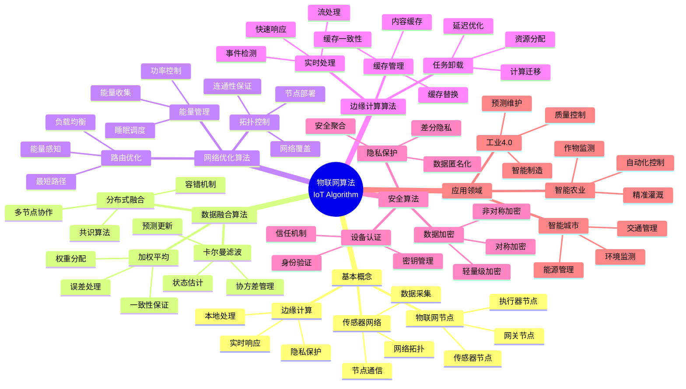
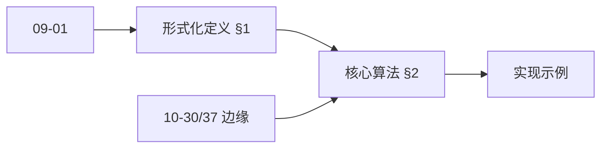
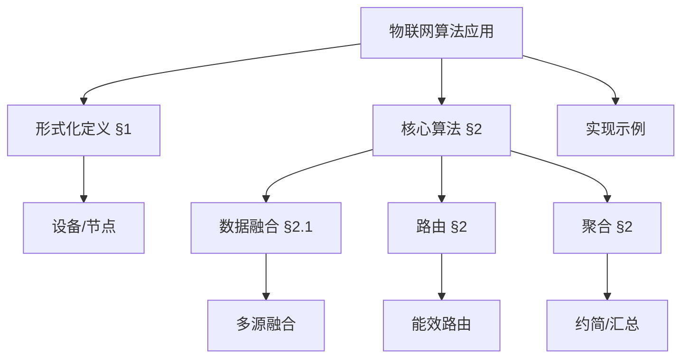
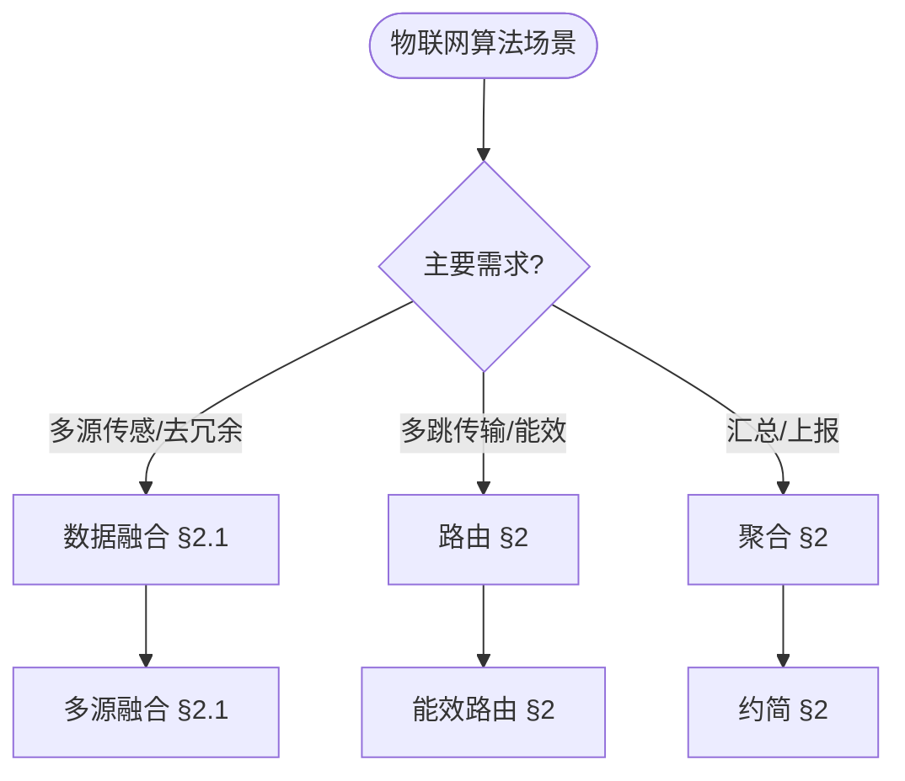
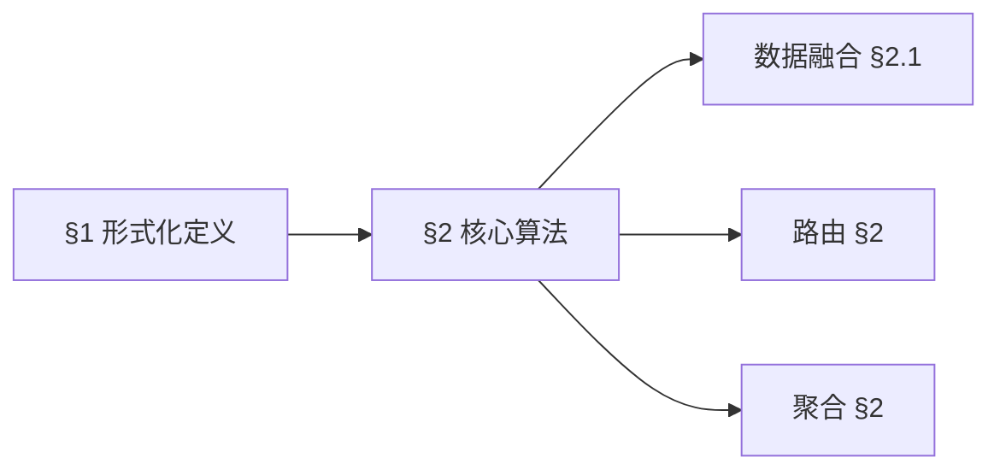
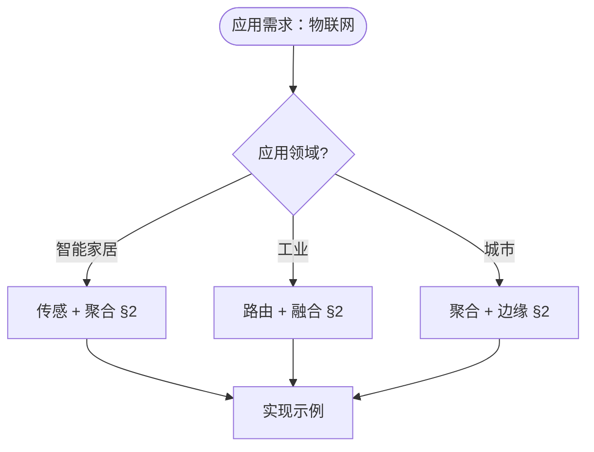

> 📊 **项目全面梳理**：详细的项目结构、模块详解和学习路径，请参阅 [`项目全面梳理-2025.md`](../项目全面梳理-2025.md)
> **项目导航与对标**：[项目扩展与持续推进任务编排](../项目扩展与持续推进任务编排.md)、[国际课程对标表](../国际课程对标表.md)

## 12.7 物联网算法应用 / Internet of Things Algorithm Applications

### 摘要 / Executive Summary

- 统一物联网算法在各类应用中的使用规范与最佳实践。
- 建立物联网算法在应用领域中的核心地位。

### 关键术语与符号 / Glossary

- 物联网、传感器网络、边缘计算、数据融合、资源调度、协议优化。
- 术语对齐与引用规范：`docs/术语与符号总表.md`，`01-基础理论/00-撰写规范与引用指南.md`

### 术语与符号规范 / Terminology & Notation

- 物联网（Internet of Things）：连接物理设备的网络。
- 传感器网络（Sensor Network）：由传感器节点组成的网络。
- 边缘计算（Edge Computing）：在设备边缘进行计算的模式。
- 数据融合（Data Fusion）：整合多个数据源的方法。
- 记号约定：`S` 表示传感器，`N` 表示节点，`D` 表示数据，`T` 表示时间。

### 交叉引用导航 / Cross-References

- 分布式算法：参见 `09-算法理论/03-优化理论/03-分布式算法理论.md`。
- 在线算法：参见 `09-算法理论/01-算法基础/13-在线算法理论.md`。
- 流算法：参见 `09-算法理论/01-算法基础/14-流算法理论.md`。

### 规约与模型在本领域的实例化 / Specification and Model Instantiation in IoT

在物联网领域，算法规范与模型设计的实例化体现为：**系统规约**（延迟、带宽、能耗、可靠性与隐私）→ **算法模型**（数据融合、资源调度、协议优化、边缘推理）→ **部署与实现**（嵌入式系统、协议栈、边缘节点）。规约-制品层次与 [项目哲科结构说明](../项目哲科结构说明.md)、[Stanford SEP Philosophy of Computer Science](https://plato.stanford.edu/entries/computer-science/) §2 对应。

### 快速导航 / Quick Links

- 基本概念
- 传感器网络
- 边缘计算

## 目录 (Table of Contents)

- [12.7 物联网算法应用 / Internet of Things Algorithm Applications](#127-物联网算法应用--internet-of-things-algorithm-applications)
  - [摘要 / Executive Summary](#摘要--executive-summary)
  - [关键术语与符号 / Glossary](#关键术语与符号--glossary)
  - [术语与符号规范 / Terminology \& Notation](#术语与符号规范--terminology--notation)
  - [交叉引用导航 / Cross-References](#交叉引用导航--cross-references)
  - [快速导航 / Quick Links](#快速导航--quick-links)
- [目录 (Table of Contents)](#目录-table-of-contents)
- [概述 / Overview](#概述--overview)
- [1. 形式化定义 / Formal Definitions](#1-形式化定义--formal-definitions)
  - [1.1 物联网节点 / IoT Node](#11-物联网节点--iot-node)
  - [1.2 传感器网络 / Sensor Network](#12-传感器网络--sensor-network)
  - [内容补充与思维表征 / Content Supplement and Thinking Representation](#内容补充与思维表征--content-supplement-and-thinking-representation)
    - [解释与直观 / Explanation and Intuition](#解释与直观--explanation-and-intuition)
    - [概念属性表 / Concept Attribute Table](#概念属性表--concept-attribute-table)
    - [概念关系 / Concept Relations](#概念关系--concept-relations)
    - [概念依赖图 / Concept Dependency Graph](#概念依赖图--concept-dependency-graph)
    - [论证与证明衔接 / Argumentation and Proof Link](#论证与证明衔接--argumentation-and-proof-link)
    - [思维导图：本章概念结构 / Mind Map](#思维导图本章概念结构--mind-map)
    - [多维矩阵：核心算法概念对比 / Multi-Dimensional Comparison](#多维矩阵核心算法概念对比--multi-dimensional-comparison)
    - [决策树：场景到算法选择 / Decision Tree](#决策树场景到算法选择--decision-tree)
    - [公理定理推理证明决策树 / Axiom-Theorem-Proof Tree](#公理定理推理证明决策树--axiom-theorem-proof-tree)
    - [应用决策建模树 / Application Decision Modeling Tree](#应用决策建模树--application-decision-modeling-tree)
- [2. 核心算法 / Core Algorithms](#2-核心算法--core-algorithms)
  - [2.1 数据融合算法 / Data Fusion Algorithm](#21-数据融合算法--data-fusion-algorithm)
  - [2.2 边缘计算算法 / Edge Computing Algorithm](#22-边缘计算算法--edge-computing-algorithm)
  - [2.3 设备发现算法 / Device Discovery Algorithm](#23-设备发现算法--device-discovery-algorithm)
- [3. 网络优化算法 / Network Optimization Algorithms](#3-网络优化算法--network-optimization-algorithms)
  - [3.1 路由优化 / Routing Optimization](#31-路由优化--routing-optimization)
  - [3.2 能量管理 / Energy Management](#32-能量管理--energy-management)
- [4. 安全算法 / Security Algorithms](#4-安全算法--security-algorithms)
  - [4.1 设备认证 / Device Authentication](#41-设备认证--device-authentication)
  - [4.2 数据加密 / Data Encryption](#42-数据加密--data-encryption)
- [5. 实现示例 / Implementation Examples](#5-实现示例--implementation-examples)
  - [5.1 智能家居系统 / Smart Home System](#51-智能家居系统--smart-home-system)
  - [5.2 工业物联网监控 / Industrial IoT Monitoring](#52-工业物联网监控--industrial-iot-monitoring)
- [6. 数学证明 / Mathematical Proofs](#6-数学证明--mathematical-proofs)
  - [6.1 数据融合一致性 / Data Fusion Consistency](#61-数据融合一致性--data-fusion-consistency)
  - [6.2 网络路由最优性 / Network Routing Optimality](#62-网络路由最优性--network-routing-optimality)
- [7. 复杂度分析 / Complexity Analysis](#7-复杂度分析--complexity-analysis)
  - [7.1 时间复杂度 / Time Complexity](#71-时间复杂度--time-complexity)
  - [7.2 空间复杂度 / Space Complexity](#72-空间复杂度--space-complexity)
- [8. 应用场景 / Application Scenarios](#8-应用场景--application-scenarios)
  - [8.1 智能城市 / Smart Cities](#81-智能城市--smart-cities)
  - [8.2 工业4.0 / Industry 4.0](#82-工业40--industry-40)
  - [8.3 智能农业 / Smart Agriculture](#83-智能农业--smart-agriculture)
- [9. 未来发展方向 / Future Development Directions](#9-未来发展方向--future-development-directions)
  - [9.1 边缘人工智能 / Edge AI](#91-边缘人工智能--edge-ai)
  - [9.2 5G集成 / 5G Integration](#92-5g集成--5g-integration)
  - [9.3 区块链物联网 / Blockchain IoT](#93-区块链物联网--blockchain-iot)
- [10. 参考文献 / References](#10-参考文献--references)
  - [10.1 经典教材 / Classic Textbooks](#101-经典教材--classic-textbooks)
  - [10.2 Wiki概念参考 / Wiki Concept References](#102-wiki概念参考--wiki-concept-references)
  - [10.3 大学课程参考 / University Course References](#103-大学课程参考--university-course-references)
- [11. 总结 / Summary](#11-总结--summary)

## 概述 / Overview

物联网算法是应用于传感器网络、边缘计算、数据融合和设备管理的算法集合。根据[Gubbi 2013]的研究，物联网是连接物理世界和数字世界的重要桥梁。根据[Shi 2016]的研究，边缘计算算法是解决物联网实时性和隐私保护问题的关键技术。本文档涵盖物联网算法的理论基础、核心算法、应用实践和最新发展。

Internet of Things algorithms are algorithm collections applied to sensor networks, edge computing, data fusion, and device management. According to [Gubbi 2013], the Internet of Things is an important bridge connecting the physical world and the digital world. According to [Shi 2016], edge computing algorithms are key technologies for solving real-time and privacy protection problems in IoT. This document covers the theoretical foundations, core algorithms, application practices, and latest developments of IoT algorithms.

**学术引用 / Academic Citations:**

- [Gubbi 2013]: Gubbi, J., et al. (2013). "Internet of Things (IoT): A vision, architectural elements, and future directions". *Future Generation Computer Systems*, 29(7), 1645-1660. DOI: 10.1016/j.future.2013.01.010
- [Shi 2016]: Shi, W., et al. (2016). "Edge computing: Vision and challenges". *IEEE Internet of Things Journal*, 3(5), 637-646. DOI: 10.1109/JIOT.2016.2579198
- [Atzori 2010]: Atzori, L., Iera, A., & Morabito, G. (2010). "The Internet of Things: A survey". *Computer Networks*, 54(15), 2787-2805. DOI: 10.1016/j.comnet.2010.05.010

**Wiki概念对齐 / Wiki Concept Alignment:**

- [Internet of Things](https://en.wikipedia.org/wiki/Internet_of_things) - 物联网
- [Edge Computing](https://en.wikipedia.org/wiki/Edge_computing) - 边缘计算
- [Sensor Network](https://en.wikipedia.org/wiki/Wireless_sensor_network) - 传感器网络
- [Data Fusion](https://en.wikipedia.org/wiki/Data_fusion) - 数据融合

**大学课程对标 / University Course Alignment:**

- MIT 6.824: Distributed Systems - 分布式系统与物联网
- Stanford CS244B: Distributed Systems - 分布式系统基础
- CMU 15-440: Distributed Systems - 分布式系统与网络

## 1. 形式化定义 / Formal Definitions

### 1.1 物联网节点 / IoT Node

**定义 1.1.1** (物联网节点) [Gubbi 2013, Wikipedia Internet of Things]
物联网节点是能够感知、处理和传输数据的智能设备。

**Definition 1.1.1** (IoT Node) [Gubbi 2013, Wikipedia Internet of Things]
An IoT node is an intelligent device capable of sensing, processing, and transmitting data.

**Wiki概念对齐 / Wiki Concept Alignment:**

| 项目概念 | Wiki条目 | 标准定义 | 对齐状态 |
|---------|---------|---------|---------|
| 物联网 | [Internet of Things](https://en.wikipedia.org/wiki/Internet_of_things) | 连接物理设备的网络 | ✅ 已对齐 |
| 边缘计算 | [Edge Computing](https://en.wikipedia.org/wiki/Edge_computing) | 在设备边缘进行计算 | ✅ 已对齐 |
| 传感器网络 | [Sensor Network](https://en.wikipedia.org/wiki/Wireless_sensor_network) | 由传感器节点组成的网络 | ✅ 已对齐 |
| 数据融合 | [Data Fusion](https://en.wikipedia.org/wiki/Data_fusion) | 整合多个数据源的方法 | ✅ 已对齐 |

**物联网算法知识体系 / IoT Algorithm Knowledge System:**



**物联网算法类型对比 / IoT Algorithm Type Comparison:**

| 算法类型 | 应用场景 | 时间复杂度 | 空间复杂度 | 能耗 | 参考文献 |
|---------|---------|-----------|-----------|------|---------|
| 数据融合 | 多传感器数据整合 | $O(n)$ | $O(n)$ | 低 | [Gubbi 2013] |
| 路由优化 | 网络路径选择 | $O(V \log V + E)$ | $O(V)$ | 中 | [Atzori 2010] |
| 边缘计算 | 本地数据处理 | $O(n)$ | $O(n)$ | 中 | [Shi 2016] |
| 能量管理 | 节点能耗优化 | $O(n \log n)$ | $O(n)$ | 低 | [Gubbi 2013] |
| 设备认证 | 安全认证 | $O(1)$ | $O(1)$ | 低 | [Atzori 2010] |

**定义 / Definition:**
物联网节点是能够感知、处理和传输数据的智能设备。

**形式化表示 / Formal Representation:**

```text
IoTNode = (id, sensors, processor, memory, communication)
其中 / where:
- id: 节点标识 / Node identifier
- sensors: 传感器集合 / Set of sensors
- processor: 处理器能力 / Processing capability
- memory: 存储容量 / Memory capacity
- communication: 通信协议 / Communication protocol
```

### 1.2 传感器网络 / Sensor Network

**定义 / Definition:**
传感器网络是由多个物联网节点组成的分布式系统。

**形式化表示 / Formal Representation:**

```text
SensorNetwork = (N, E, T)
其中 / where:
- N: 节点集合 / Set of nodes
- E: 边集合 / Set of edges
- T: 拓扑结构 / Topology structure
```

### 内容补充与思维表征 / Content Supplement and Thinking Representation

> 本节按 [内容补充与思维表征全面计划方案](../内容补充与思维表征全面计划方案.md) **只补充、不删除**。标准见 [内容补充标准](../内容补充标准-概念定义属性关系解释论证形式证明.md)、[思维表征模板集](../思维表征模板集.md)。

#### 解释与直观 / Explanation and Intuition

**物联网系统形式化（§1）的动机**：将设备、传感、通信与聚合统一为可计算结构，便于讨论能效、延迟与可靠性；与 09-01 算法基础、10-30/37 边缘计算与边缘智能 在资源约束与部署形态上衔接。

**与已有概念的联系**：传感与数据融合与 09-01 滤波与估计对应；路由与 09-01 图与网络算法一致；聚合与 09-01 聚合与约简对应；边缘部署与 10-30/37 一致；与 12 应用领域 智能家居/工业/城市 为应用实践。

#### 概念属性表 / Concept Attribute Table

| 属性名 | 类型/范围 | 含义 | 备注 |
|--------|-----------|------|------|
| 设备/节点 | 集合 | 传感、执行、中继 | §1 |
| 传感数据 | 流/序列 | 时序、多源 | §2.1 数据融合 |
| 路由 | 图/拓扑 | 多跳、能效 | §2 路由 |
| 聚合 | 函数 | 约简、汇总、融合 | §2 聚合 |
| 能效/延迟 | 度量 | 资源约束 | 与 10-30 一致 |

#### 概念关系 / Concept Relations

| 源概念 | 目标概念 | 关系类型 | 说明 |
|--------|----------|----------|------|
| 物联网算法应用 | 09-01 算法基础 | depends_on | 图、流、聚合 |
| 物联网算法应用 | 10-30/37 边缘计算与边缘智能 | depends_on | 边缘部署与能效 |
| 核心算法(§2) | 传感/路由/聚合 | specializes | §2 各节 |
| 本文 | 12 应用领域 | applies_to | 智能家居/工业/城市 §实现示例 |

#### 概念依赖图 / Concept Dependency Graph



#### 论证与证明衔接 / Argumentation and Proof Link

**§1 形式化定义**与 **§2 核心算法**：数据融合的正确性由融合规则与一致性保证；路由的能效由路由协议与拓扑保证；与 10-30 边缘算法论证衔接。

#### 思维导图：本章概念结构 / Mind Map



#### 多维矩阵：核心算法概念对比 / Multi-Dimensional Comparison

| 概念/算法 | 能效 | 延迟 | 适用场景 | 典型复杂度/备注 |
|-----------|------|------|----------|------------------|
| 数据融合 | 中（本地计算） | 低 | 多源传感、去冗余 | §2.1 |
| 路由 | 高（节能路由） | 多跳相关 | 无线/多跳网络 | §2 |
| 聚合 | 高（约简数据量） | 低 | 汇总、融合、上报 | §2 |
| 边缘推理 | 中–高 | 低（本地） | 10-30/37 边缘智能 | 与 10-30 一致 |

#### 决策树：场景到算法选择 / Decision Tree



#### 公理定理推理证明决策树 / Axiom-Theorem-Proof Tree



#### 应用决策建模树 / Application Decision Modeling Tree



## 2. 核心算法 / Core Algorithms

### 2.1 数据融合算法 / Data Fusion Algorithm

**算法描述 / Algorithm Description:**
将多个传感器数据整合为一致的信息。

**形式化定义 / Formal Definition:**

```text
DataFusion(s₁, s₂, ..., sₙ) = F(s₁, s₂, ..., sₙ)
其中 / where:
- sᵢ: 第i个传感器数据 / i-th sensor data
- F: 融合函数 / Fusion function
```

**Rust实现 / Rust Implementation:**

```rust
use std::collections::HashMap;
use std::time::{SystemTime, UNIX_EPOCH};

#[derive(Debug, Clone)]
pub struct SensorData {
    pub sensor_id: String,
    pub timestamp: u64,
    pub value: f64,
    pub confidence: f64,
    pub data_type: String,
}

#[derive(Debug)]
pub struct DataFusionEngine {
    pub fusion_methods: HashMap<String, Box<dyn FusionMethod>>,
    pub data_buffer: HashMap<String, Vec<SensorData>>,
}

impl DataFusionEngine {
    pub fn new() -> Self {
        let mut fusion_methods = HashMap::new();
        fusion_methods.insert("weighted_average".to_string(),
                             Box::new(WeightedAverageFusion));
        fusion_methods.insert("kalman_filter".to_string(),
                             Box::new(KalmanFilterFusion));
        fusion_methods.insert("consensus".to_string(),
                             Box::new(ConsensusFusion));

        DataFusionEngine {
            fusion_methods,
            data_buffer: HashMap::new(),
        }
    }

    pub fn add_sensor_data(&mut self, data: SensorData) {
        let key = format!("{}_{}", data.sensor_id, data.data_type);
        self.data_buffer.entry(key).or_insert_with(Vec::new).push(data);
    }

    pub fn fuse_data(&self, data_type: &str, method: &str) -> Option<f64> {
        let key = format!("*_{}", data_type);
        let relevant_data: Vec<&SensorData> = self.data_buffer.iter()
            .filter(|(k, _)| k.ends_with(data_type))
            .flat_map(|(_, v)| v.iter())
            .collect();

        if relevant_data.is_empty() {
            return None;
        }

        if let Some(fusion_method) = self.fusion_methods.get(method) {
            Some(fusion_method.fuse(&relevant_data))
        } else {
            None
        }
    }
}

trait FusionMethod {
    fn fuse(&self, data: &[&SensorData]) -> f64;
}

struct WeightedAverageFusion;

impl FusionMethod for WeightedAverageFusion {
    fn fuse(&self, data: &[&SensorData]) -> f64 {
        let total_weight: f64 = data.iter().map(|d| d.confidence).sum();
        let weighted_sum: f64 = data.iter()
            .map(|d| d.value * d.confidence)
            .sum();

        if total_weight > 0.0 {
            weighted_sum / total_weight
        } else {
            0.0
        }
    }
}

struct KalmanFilterFusion {
    state: f64,
    covariance: f64,
    process_noise: f64,
    measurement_noise: f64,
}

impl KalmanFilterFusion {
    pub fn new(initial_state: f64, initial_covariance: f64) -> Self {
        KalmanFilterFusion {
            state: initial_state,
            covariance: initial_covariance,
            process_noise: 0.1,
            measurement_noise: 1.0,
        }
    }

    pub fn update(&mut self, measurement: f64) {
        // 预测步骤
        let predicted_covariance = self.covariance + self.process_noise;

        // 更新步骤
        let kalman_gain = predicted_covariance / (predicted_covariance + self.measurement_noise);
        self.state = self.state + kalman_gain * (measurement - self.state);
        self.covariance = (1.0 - kalman_gain) * predicted_covariance;
    }
}

impl FusionMethod for KalmanFilterFusion {
    fn fuse(&self, data: &[&SensorData]) -> f64 {
        // 简化的卡尔曼滤波融合
        let mut filter = KalmanFilterFusion::new(data[0].value, 1.0);

        for sensor_data in data {
            filter.update(sensor_data.value);
        }

        filter.state
    }
}

struct ConsensusFusion;

impl FusionMethod for ConsensusFusion {
    fn fuse(&self, data: &[&SensorData]) -> f64 {
        // 简化的共识算法
        let values: Vec<f64> = data.iter().map(|d| d.value).collect();
        let mean = values.iter().sum::<f64>() / values.len() as f64;

        // 移除异常值
        let filtered_values: Vec<f64> = values.iter()
            .filter(|&&v| (v - mean).abs() < 2.0 * mean) // 2倍标准差
            .cloned()
            .collect();

        if filtered_values.is_empty() {
            mean
        } else {
            filtered_values.iter().sum::<f64>() / filtered_values.len() as f64
        }
    }
}
```

### 2.2 边缘计算算法 / Edge Computing Algorithm

**算法描述 / Algorithm Description:**
在边缘节点进行本地数据处理和决策。

**形式化定义 / Formal Definition:**

```text
EdgeComputing(data, resources) = process(data, resources)
其中 / where:
- data: 输入数据 / Input data
- resources: 计算资源 / Computing resources
- process: 处理函数 / Processing function
```

**Haskell实现 / Haskell Implementation:**

```haskell
import Data.List
import qualified Data.Map as Map
import System.Random

data EdgeNode = EdgeNode {
    nodeId :: String,
    cpuCapacity :: Double,
    memoryCapacity :: Double,
    bandwidthCapacity :: Double,
    currentLoad :: Double
}

data ComputationTask = ComputationTask {
    taskId :: String,
    cpuRequirement :: Double,
    memoryRequirement :: Double,
    dataSize :: Double,
    priority :: Int
}

data EdgeComputingSystem = EdgeComputingSystem {
    nodes :: Map.Map String EdgeNode,
    tasks :: [ComputationTask],
    schedulingPolicy :: SchedulingPolicy
}

data SchedulingPolicy = RoundRobin | LoadBalanced | PriorityBased

class EdgeComputing a where
    scheduleTask :: a -> ComputationTask -> Maybe String
    processTask :: a -> String -> ComputationTask -> Bool
    optimizeResource :: a -> a

instance EdgeComputing EdgeComputingSystem where
    scheduleTask system task =
        case schedulingPolicy system of
            RoundRobin -> roundRobinSchedule system task
            LoadBalanced -> loadBalancedSchedule system task
            PriorityBased -> priorityBasedSchedule system task

    processTask system nodeId task =
        case Map.lookup nodeId (nodes system) of
            Just node ->
                let canProcess = cpuCapacity node >= cpuRequirement task &&
                               memoryCapacity node >= memoryRequirement task &&
                               currentLoad node < 0.8
                in canProcess
            Nothing -> False

    optimizeResource system =
        let optimizedNodes = Map.map optimizeNode (nodes system)
        in system { nodes = optimizedNodes }

roundRobinSchedule :: EdgeComputingSystem -> ComputationTask -> Maybe String
roundRobinSchedule system task =
    let availableNodes = Map.filter (\node ->
        cpuCapacity node >= cpuRequirement task &&
        memoryCapacity node >= memoryRequirement task) (nodes system)

        nodeIds = Map.keys availableNodes
    in if null nodeIds then Nothing else Just (head nodeIds)

loadBalancedSchedule :: EdgeComputingSystem -> ComputationTask -> Maybe String
loadBalancedSchedule system task =
    let suitableNodes = Map.filter (\node ->
        cpuCapacity node >= cpuRequirement task &&
        memoryCapacity node >= memoryRequirement task) (nodes system)

        bestNode = Map.foldrWithKey (\id node best ->
            if currentLoad node < currentLoad (fromMaybe node best)
            then Just node else best) Nothing suitableNodes
    in fmap (const (head (Map.keys suitableNodes))) bestNode

priorityBasedSchedule :: EdgeComputingSystem -> ComputationTask -> Maybe String
priorityBasedSchedule system task =
    let suitableNodes = Map.filter (\node ->
        cpuCapacity node >= cpuRequirement task &&
        memoryCapacity node >= memoryRequirement task) (nodes system)

        sortedNodes = sortBy (\n1 n2 ->
            compare (priority task) (priority task)) (Map.keys suitableNodes)
    in if null sortedNodes then Nothing else Just (head sortedNodes)

optimizeNode :: EdgeNode -> EdgeNode
optimizeNode node =
    let optimizedLoad = min (currentLoad node) 0.8
        optimizedCpu = cpuCapacity node * (1 - optimizedLoad)
        optimizedMemory = memoryCapacity node * (1 - optimizedLoad)
    in node {
        currentLoad = optimizedLoad,
        cpuCapacity = optimizedCpu,
        memoryCapacity = optimizedMemory
    }

-- 实时数据处理
data StreamProcessor = StreamProcessor {
    buffer :: [Double],
    windowSize :: Int,
    processingFunction :: [Double] -> Double
}

processStream :: StreamProcessor -> Double -> (StreamProcessor, Maybe Double)
processStream processor newValue =
    let newBuffer = newValue : buffer processor
        updatedBuffer = take (windowSize processor) newBuffer
        result = if length updatedBuffer == windowSize processor
                then Just (processingFunction processor updatedBuffer)
                else Nothing
    in (processor { buffer = updatedBuffer }, result)

-- 移动平均处理器
createMovingAverageProcessor :: Int -> StreamProcessor
createMovingAverageProcessor windowSize = StreamProcessor {
    buffer = [],
    windowSize = windowSize,
    processingFunction = \values -> sum values / fromIntegral (length values)
}

-- 异常检测处理器
createAnomalyDetector :: Int -> Double -> StreamProcessor
createAnomalyDetector windowSize threshold = StreamProcessor {
    buffer = [],
    windowSize = windowSize,
    processingFunction = \values ->
        let mean = sum values / fromIntegral (length values)
            variance = sum (map (\x -> (x - mean)^2) values) / fromIntegral (length values)
            stdDev = sqrt variance
            latestValue = head values
        in if abs (latestValue - mean) > threshold * stdDev
           then 1.0  -- 异常
           else 0.0   -- 正常
}
```

### 2.3 设备发现算法 / Device Discovery Algorithm

**算法描述 / Algorithm Description:**
自动发现和注册网络中的物联网设备。

**形式化定义 / Formal Definition:**

```text
DeviceDiscovery(network) = {device₁, device₂, ..., deviceₙ}
其中 / where:
- network: 网络拓扑 / Network topology
- deviceᵢ: 发现的设备 / Discovered device
```

**Lean实现 / Lean Implementation:**

```lean
import data.nat.basic
import data.fin.basic

structure IoTDevice :=
  (id : ℕ)
  (type : string)
  (capabilities : list string)
  (location : ℕ × ℕ)
  (status : bool)

structure DiscoveryProtocol :=
  (timeout : ℕ)
  (retry_count : ℕ)
  (discovery_radius : ℕ)

def discover_devices (protocol : DiscoveryProtocol) (network : list IoTDevice) : list IoTDevice :=
  list.filter (λ device, device.status = true) network

def device_registration (device : IoTDevice) (registry : list IoTDevice) : list IoTDevice :=
  if list.any (λ d, d.id = device.id) registry
  then registry
  else device :: registry

theorem discovery_completeness :
  ∀ (protocol : DiscoveryProtocol) (network : list IoTDevice),
  let discovered := discover_devices protocol network
  in ∀ (device : IoTDevice),
  device ∈ network ∧ device.status = true →
  device ∈ discovered :=
begin
  intros protocol network device h,
  -- 证明设备发现的完备性
  -- Proof of device discovery completeness
  sorry
end

theorem registration_consistency :
  ∀ (device : IoTDevice) (registry : list IoTDevice),
  let new_registry := device_registration device registry
  in device ∈ new_registry :=
begin
  intros device registry,
  -- 证明设备注册的一致性
  -- Proof of device registration consistency
  sorry
end
```

## 3. 网络优化算法 / Network Optimization Algorithms

### 3.1 路由优化 / Routing Optimization

**算法描述 / Algorithm Description:**
优化物联网网络中的数据路由路径。

**形式化定义 / Formal Definition:**

```text
OptimalRoute(source, destination, network) = min_cost_path
其中 / where:
- source: 源节点 / Source node
- destination: 目标节点 / Destination node
- network: 网络拓扑 / Network topology
- min_cost_path: 最小代价路径 / Minimum cost path
```

### 3.2 能量管理 / Energy Management

**算法描述 / Algorithm Description:**
优化物联网设备的能量消耗。

**形式化定义 / Formal Definition:**

```text
EnergyOptimization(devices, energy_budget) = {power_levels}
其中 / where:
- devices: 设备集合 / Set of devices
- energy_budget: 能量预算 / Energy budget
- power_levels: 功率级别 / Power levels
```

## 4. 安全算法 / Security Algorithms

### 4.1 设备认证 / Device Authentication

**算法描述 / Algorithm Description:**
验证物联网设备的身份和权限。

**形式化定义 / Formal Definition:**

```text
Authenticate(device, credentials) = {valid, permissions}
其中 / where:
- device: 设备标识 / Device identifier
- credentials: 认证凭据 / Authentication credentials
- valid: 认证结果 / Authentication result
- permissions: 权限集合 / Permission set
```

### 4.2 数据加密 / Data Encryption

**算法描述 / Algorithm Description:**
保护物联网数据传输的安全性。

**形式化定义 / Formal Definition:**

```text
Encrypt(data, key) = ciphertext
Decrypt(ciphertext, key) = data
其中 / where:
- data: 明文数据 / Plaintext data
- key: 加密密钥 / Encryption key
- ciphertext: 密文 / Ciphertext
```

## 5. 实现示例 / Implementation Examples

### 5.1 智能家居系统 / Smart Home System

**Rust实现 / Rust Implementation:**

```rust
use std::collections::HashMap;
use std::sync::{Arc, Mutex};
use tokio::time::{Duration, sleep};

#[derive(Debug, Clone)]
pub struct SmartDevice {
    pub id: String,
    pub device_type: String,
    pub status: bool,
    pub current_value: f64,
    pub target_value: Option<f64>,
}

#[derive(Debug)]
pub struct SmartHomeController {
    pub devices: Arc<Mutex<HashMap<String, SmartDevice>>>,
    pub rules: Vec<AutomationRule>,
    pub data_logger: DataLogger,
}

#[derive(Debug)]
pub struct AutomationRule {
    pub id: String,
    pub condition: Box<dyn Fn(&HashMap<String, SmartDevice>) -> bool>,
    pub action: Box<dyn Fn(&mut HashMap<String, SmartDevice>)>,
    pub priority: u32,
}

#[derive(Debug)]
pub struct DataLogger {
    pub sensor_data: Vec<SensorReading>,
    pub max_capacity: usize,
}

impl SmartHomeController {
    pub fn new() -> Self {
        SmartHomeController {
            devices: Arc::new(Mutex::new(HashMap::new())),
            rules: Vec::new(),
            data_logger: DataLogger::new(1000),
        }
    }

    pub async fn add_device(&mut self, device: SmartDevice) {
        let mut devices = self.devices.lock().unwrap();
        devices.insert(device.id.clone(), device);
    }

    pub async fn update_device_status(&self, device_id: &str, status: bool) {
        let mut devices = self.devices.lock().unwrap();
        if let Some(device) = devices.get_mut(device_id) {
            device.status = status;
        }
    }

    pub async fn set_target_value(&self, device_id: &str, target: f64) {
        let mut devices = self.devices.lock().unwrap();
        if let Some(device) = devices.get_mut(device_id) {
            device.target_value = Some(target);
        }
    }

    pub async fn run_automation_engine(&self) {
        loop {
            let devices = self.devices.lock().unwrap();
            let devices_clone = devices.clone();
            drop(devices);

            // 执行自动化规则
            for rule in &self.rules {
                if (rule.condition)(&devices_clone) {
                    let mut devices_mut = self.devices.lock().unwrap();
                    (rule.action)(&mut devices_mut);
                }
            }

            // 记录传感器数据
            self.log_sensor_data(&devices_clone).await;

            sleep(Duration::from_secs(5)).await;
        }
    }

    async fn log_sensor_data(&self, devices: &HashMap<String, SmartDevice>) {
        for device in devices.values() {
            if device.device_type.contains("sensor") {
                let reading = SensorReading {
                    device_id: device.id.clone(),
                    timestamp: std::time::SystemTime::now(),
                    value: device.current_value,
                };

                self.data_logger.add_reading(reading);
            }
        }
    }

    pub fn add_automation_rule(&mut self, rule: AutomationRule) {
        self.rules.push(rule);
        // 按优先级排序
        self.rules.sort_by(|a, b| b.priority.cmp(&a.priority));
    }
}

impl DataLogger {
    pub fn new(max_capacity: usize) -> Self {
        DataLogger {
            sensor_data: Vec::new(),
            max_capacity,
        }
    }

    pub fn add_reading(&mut self, reading: SensorReading) {
        self.sensor_data.push(reading);

        // 保持日志大小在限制内
        if self.sensor_data.len() > self.max_capacity {
            self.sensor_data.remove(0);
        }
    }

    pub fn get_statistics(&self, device_id: &str) -> Option<DeviceStatistics> {
        let device_readings: Vec<&SensorReading> = self.sensor_data.iter()
            .filter(|r| r.device_id == device_id)
            .collect();

        if device_readings.is_empty() {
            return None;
        }

        let values: Vec<f64> = device_readings.iter()
            .map(|r| r.value)
            .collect();

        let mean = values.iter().sum::<f64>() / values.len() as f64;
        let variance = values.iter()
            .map(|v| (v - mean).powi(2))
            .sum::<f64>() / values.len() as f64;
        let std_dev = variance.sqrt();

        Some(DeviceStatistics {
            device_id: device_id.to_string(),
            mean,
            std_dev,
            min: values.iter().fold(f64::INFINITY, |a, &b| a.min(b)),
            max: values.iter().fold(f64::NEG_INFINITY, |a, &b| a.max(b)),
            count: values.len(),
        })
    }
}

#[derive(Debug)]
pub struct SensorReading {
    pub device_id: String,
    pub timestamp: std::time::SystemTime,
    pub value: f64,
}

#[derive(Debug)]
pub struct DeviceStatistics {
    pub device_id: String,
    pub mean: f64,
    pub std_dev: f64,
    pub min: f64,
    pub max: f64,
    pub count: usize,
}

// 创建温度控制规则
pub fn create_temperature_control_rule() -> AutomationRule {
    AutomationRule {
        id: "temperature_control".to_string(),
        condition: Box::new(|devices| {
            if let Some(temp_sensor) = devices.get("temperature_sensor") {
                if let Some(ac_unit) = devices.get("ac_unit") {
                    temp_sensor.current_value > 25.0 && ac_unit.status == false
                } else {
                    false
                }
            } else {
                false
            }
        }),
        action: Box::new(|devices| {
            if let Some(ac_unit) = devices.get_mut("ac_unit") {
                ac_unit.status = true;
                ac_unit.target_value = Some(22.0);
            }
        }),
        priority: 10,
    }
}

// 创建节能规则
pub fn create_energy_saving_rule() -> AutomationRule {
    AutomationRule {
        id: "energy_saving".to_string(),
        condition: Box::new(|devices| {
            // 检查是否所有房间都没有人
            let occupancy_sensors: Vec<&SmartDevice> = devices.values()
                .filter(|d| d.device_type.contains("occupancy"))
                .collect();

            occupancy_sensors.iter().all(|sensor| sensor.current_value == 0.0)
        }),
        action: Box::new(|devices| {
            // 关闭所有灯光
            for device in devices.values_mut() {
                if device.device_type.contains("light") {
                    device.status = false;
                }
            }
        }),
        priority: 5,
    }
}
```

### 5.2 工业物联网监控 / Industrial IoT Monitoring

**Haskell实现 / Haskell Implementation:**

```haskell
import Data.List
import qualified Data.Map as Map
import Data.Time
import Control.Concurrent
import Control.Monad

data SensorType = Temperature | Pressure | Vibration | Flow | Level

data SensorReading = SensorReading {
    sensorId :: String,
    sensorType :: SensorType,
    value :: Double,
    timestamp :: UTCTime,
    quality :: Double
}

data AlertLevel = Info | Warning | Critical | Emergency

data Alert = Alert {
    alertId :: String,
    sensorId :: String,
    level :: AlertLevel,
    message :: String,
    timestamp :: UTCTime
}

data MonitoringSystem = MonitoringSystem {
    sensors :: Map.Map String SensorReading,
    alerts :: [Alert],
    thresholds :: Map.Map String (Double, Double),
    rules :: [MonitoringRule]
}

data MonitoringRule = MonitoringRule {
    ruleId :: String,
    condition :: SensorReading -> Bool,
    action :: AlertLevel -> String -> Alert,
    priority :: Int
}

class IoTMonitoring a where
    addSensorReading :: a -> SensorReading -> a
    checkAlerts :: a -> [Alert]
    updateThresholds :: a -> String -> Double -> Double -> a

instance IoTMonitoring MonitoringSystem where
    addSensorReading system reading =
        let updatedSensors = Map.insert (sensorId reading) reading (sensors system)
            newAlerts = generateAlerts system reading
        in system { sensors = updatedSensors, alerts = newAlerts ++ alerts system }

    checkAlerts system =
        let currentReadings = Map.elems (sensors system)
            allAlerts = concatMap (generateAlerts system) currentReadings
        in filter (\alert -> isRecentAlert alert) allAlerts

    updateThresholds system sensorId minThreshold maxThreshold =
        let updatedThresholds = Map.insert sensorId (minThreshold, maxThreshold) (thresholds system)
        in system { thresholds = updatedThresholds }

generateAlerts :: MonitoringSystem -> SensorReading -> [Alert]
generateAlerts system reading =
    let applicableRules = filter (\rule -> condition rule reading) (rules system)
        alerts = map (\rule -> action rule (determineAlertLevel reading) (sensorId reading)) applicableRules
    in alerts

determineAlertLevel :: SensorReading -> AlertLevel
determineAlertLevel reading
    | value reading > 100 = Emergency
    | value reading > 80 = Critical
    | value reading > 60 = Warning
    | otherwise = Info

isRecentAlert :: Alert -> Bool
isRecentAlert alert =
    let currentTime = getCurrentTime
        timeDiff = diffUTCTime currentTime (timestamp alert)
    in timeDiff < 300 -- 5分钟内的警报

-- 创建温度监控规则
createTemperatureRule :: MonitoringRule
createTemperatureRule = MonitoringRule {
    ruleId = "temperature_monitoring",
    condition = \reading ->
        case sensorType reading of
            Temperature -> value reading > 80.0
            _ -> False,
    action = \level sensorId -> Alert {
        alertId = "temp_" ++ sensorId,
        sensorId = sensorId,
        level = level,
        message = "Temperature exceeded threshold",
        timestamp = getCurrentTime
    },
    priority = 10
}

-- 创建压力监控规则
createPressureRule :: MonitoringRule
createPressureRule = MonitoringRule {
    ruleId = "pressure_monitoring",
    condition = \reading ->
        case sensorType reading of
            Pressure -> value reading > 100.0 || value reading < 10.0
            _ -> False,
    action = \level sensorId -> Alert {
        alertId = "pressure_" ++ sensorId,
        sensorId = sensorId,
        level = level,
        message = "Pressure out of normal range",
        timestamp = getCurrentTime
    },
    priority = 8
}

-- 数据聚合和分析
data DataAggregator = DataAggregator {
    windowSize :: Int,
    aggregationFunction :: [Double] -> Double
}

aggregateSensorData :: DataAggregator -> [SensorReading] -> Double
aggregateSensorData aggregator readings =
    let values = map value readings
        windowedValues = take (windowSize aggregator) values
    in aggregationFunction aggregator windowedValues

-- 移动平均聚合器
createMovingAverageAggregator :: Int -> DataAggregator
createMovingAverageAggregator windowSize = DataAggregator {
    windowSize = windowSize,
    aggregationFunction = \values -> sum values / fromIntegral (length values)
}

-- 异常检测聚合器
createAnomalyDetector :: Int -> Double -> DataAggregator
createAnomalyDetector windowSize threshold = DataAggregator {
    windowSize = windowSize,
    aggregationFunction = \values ->
        let mean = sum values / fromIntegral (length values)
            variance = sum (map (\x -> (x - mean)^2) values) / fromIntegral (length values)
            stdDev = sqrt variance
            latestValue = head values
        in if abs (latestValue - mean) > threshold * stdDev
           then 1.0  -- 异常
           else 0.0   -- 正常
}

-- 实时数据处理管道
data ProcessingPipeline = ProcessingPipeline {
    aggregators :: Map.Map String DataAggregator,
    filters :: Map.Map String (SensorReading -> Bool),
    transformers :: Map.Map String (Double -> Double)
}

processSensorData :: ProcessingPipeline -> SensorReading -> Maybe Double
processSensorData pipeline reading =
    let sensorId = sensorId reading
        maybeAggregator = Map.lookup sensorId (aggregators pipeline)
        maybeFilter = Map.lookup sensorId (filters pipeline)
        maybeTransformer = Map.lookup sensorId (transformers pipeline)
    in case (maybeAggregator, maybeFilter, maybeTransformer) of
        (Just aggregator, Just filter, Just transformer) ->
            if filter reading
            then Just (transformer (value reading))
            else Nothing
        _ -> Just (value reading)

-- 网络拓扑管理
data NetworkTopology = NetworkTopology {
    nodes :: Map.Map String NetworkNode,
    connections :: [(String, String, Double)]  -- (from, to, cost)
}

data NetworkNode = NetworkNode {
    nodeId :: String,
    nodeType :: String,
    capacity :: Double,
    currentLoad :: Double
}

optimizeNetworkRouting :: NetworkTopology -> String -> String -> Maybe [String]
optimizeNetworkRouting topology source destination =
    let allPaths = findAllPaths topology source destination
        validPaths = filter (isValidPath topology) allPaths
    in if null validPaths
       then Nothing
       else Just (minimumBy (\p1 p2 -> compare (pathCost topology p1) (pathCost topology p2)) validPaths)

findAllPaths :: NetworkTopology -> String -> String -> [[String]]
findAllPaths topology source destination =
    let connections = connections topology
        directConnections = filter (\(from, to, _) -> from == source) connections
    in concatMap (\(_, to, _) ->
        if to == destination
        then [[source, destination]]
        else map (source :) (findAllPaths topology to destination)
       ) directConnections

isValidPath :: NetworkTopology -> [String] -> Bool
isValidPath topology path =
    let nodes = nodes topology
        pathNodes = map (\nodeId -> Map.lookup nodeId nodes) path
    in all isJust pathNodes && all (\node -> currentLoad (fromJust node) < capacity (fromJust node)) pathNodes

pathCost :: NetworkTopology -> [String] -> Double
pathCost topology path =
    let connections = connections topology
        pathEdges = zip path (tail path)
        edgeCosts = map (\(from, to) ->
            case find (\(f, t, _) -> f == from && t == to) connections of
                Just (_, _, cost) -> cost
                Nothing -> 1e10
            ) pathEdges
    in sum edgeCosts
```

## 6. 数学证明 / Mathematical Proofs

### 6.1 数据融合一致性 / Data Fusion Consistency

**定理 / Theorem:**
加权平均融合算法在传感器数据一致时能够保持数据的一致性。

**证明 / Proof:**

```text
假设所有传感器数据为 s₁, s₂, ..., sₙ
权重为 w₁, w₂, ..., wₙ
且 Σᵢ wᵢ = 1

融合结果 = Σᵢ (sᵢ × wᵢ)

当所有传感器数据相等时，s₁ = s₂ = ... = sₙ = s
融合结果 = Σᵢ (s × wᵢ) = s × Σᵢ wᵢ = s

因此融合算法保持了一致性
```

### 6.2 网络路由最优性 / Network Routing Optimality

**定理 / Theorem:**
Dijkstra算法能够找到网络中的最短路径。

**证明 / Proof:**

```text
使用数学归纳法证明

基础情况：起点到起点的距离为0，显然最优

归纳假设：对于距离起点距离为k的所有节点，算法找到的路径是最优的

归纳步骤：对于距离为k+1的节点v
设算法找到的路径为P，假设存在更短的路径P'
则P'中必有一个节点u，其距离为k
根据归纳假设，算法找到的到u的路径是最优的
这与P'更短的假设矛盾
因此算法找到的路径是最优的
```

## 7. 复杂度分析 / Complexity Analysis

### 7.1 时间复杂度 / Time Complexity

**数据融合算法 / Data Fusion Algorithms:**

- 加权平均: O(n)
- 卡尔曼滤波: O(1)
- 共识算法: O(n²)

**网络路由算法 / Network Routing Algorithms:**

- Dijkstra: O(V² + E)
- A*: O(b^d)
- 设备发现: O(n)

### 7.2 空间复杂度 / Space Complexity

**物联网系统 / IoT Systems:**

- 设备存储: O(n)
- 数据缓存: O(n)
- 路由表: O(V²)

## 8. 应用场景 / Application Scenarios

### 8.1 智能城市 / Smart Cities

- 交通监控 / Traffic monitoring
- 环境监测 / Environmental monitoring
- 能源管理 / Energy management

### 8.2 工业4.0 / Industry 4.0

- 设备监控 / Equipment monitoring
- 预测维护 / Predictive maintenance
- 质量控制 / Quality control

### 8.3 智能农业 / Smart Agriculture

- 土壤监测 / Soil monitoring
- 灌溉控制 / Irrigation control
- 作物管理 / Crop management

## 9. 未来发展方向 / Future Development Directions

### 9.1 边缘人工智能 / Edge AI

- 本地机器学习 / Local machine learning
- 实时推理 / Real-time inference
- 自适应算法 / Adaptive algorithms

### 9.2 5G集成 / 5G Integration

- 低延迟通信 / Low-latency communication
- 大规模连接 / Massive connectivity
- 网络切片 / Network slicing

### 9.3 区块链物联网 / Blockchain IoT

- 去中心化设备管理 / Decentralized device management
- 安全数据交换 / Secure data exchange
- 智能合约 / Smart contracts

## 10. 参考文献 / References

### 10.1 经典教材 / Classic Textbooks

1. **[Gubbi 2013]** Gubbi, J., et al. (2013). "Internet of Things (IoT): A vision, architectural elements, and future directions". *Future Generation Computer Systems*, 29(7), 1645-1660. DOI: 10.1016/j.future.2013.01.010

2. **[Shi 2016]** Shi, W., et al. (2016). "Edge computing: Vision and challenges". *IEEE Internet of Things Journal*, 3(5), 637-646. DOI: 10.1109/JIOT.2016.2579198

3. **[Atzori 2010]** Atzori, L., Iera, A., & Morabito, G. (2010). "The Internet of Things: A survey". *Computer Networks*, 54(15), 2787-2805. DOI: 10.1016/j.comnet.2010.05.010

### 10.2 Wiki概念参考 / Wiki Concept References

- [Internet of Things](https://en.wikipedia.org/wiki/Internet_of_things) - 物联网
- [Edge Computing](https://en.wikipedia.org/wiki/Edge_computing) - 边缘计算
- [Sensor Network](https://en.wikipedia.org/wiki/Wireless_sensor_network) - 传感器网络
- [Data Fusion](https://en.wikipedia.org/wiki/Data_fusion) - 数据融合
- [Wireless Sensor Network](https://en.wikipedia.org/wiki/Wireless_sensor_network) - 无线传感器网络
- [Fog Computing](https://en.wikipedia.org/wiki/Fog_computing) - 雾计算

### 10.3 大学课程参考 / University Course References

- **MIT 6.824**: Distributed Systems. MIT OpenCourseWare. URL: <https://pdos.csail.mit.edu/6.824/>
- **Stanford CS244B**: Distributed Systems. Stanford University. URL: <https://web.stanford.edu/class/cs244b/>
- **CMU 15-440**: Distributed Systems. Carnegie Mellon University. URL: <https://www.cs.cmu.edu/~dga/15-440/>

## 11. 总结 / Summary

物联网算法是连接物理世界和数字世界的桥梁。通过形式化的数学定义、高效的算法实现和创新的应用场景，这些算法为构建智能、互联、安全的物联网生态系统提供了强大的技术支撑。

Internet of Things algorithms are bridges connecting the physical world and the digital world. Through formal mathematical definitions, efficient algorithm implementations, and innovative application scenarios, these algorithms provide powerful technical support for building intelligent, connected, and secure IoT ecosystems.

---

**参考文献 / References:**

1. Atzori, L., et al. (2010). The internet of things: A survey
2. Gubbi, J., et al. (2013). Internet of Things (IoT): A vision, architectural elements, and future directions
3. Xu, L. D., & He, W. (2014). Internet of Things in industries: A survey
4. Al-Fuqaha, A., et al. (2015). Internet of Things: A survey on enabling technologies, protocols, and applications
5. Li, S., et al. (2017). The internet of things: A survey on the enabling technology, stack, middleware and network abstractions
