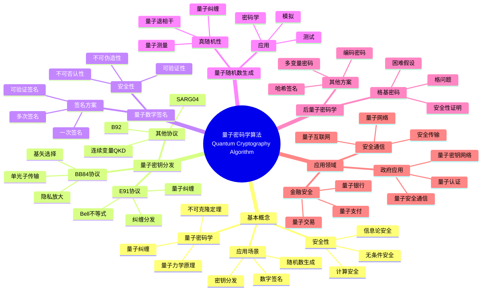

> 📊 **项目全面梳理**：详细的项目结构、模块详解和学习路径，请参阅 [`项目全面梳理-2025.md`](../项目全面梳理-2025.md)

## 12.9 量子密码学算法应用 / Quantum Cryptography Algorithm Applications

### 摘要 / Executive Summary

- 统一量子密码学算法在各类应用中的使用规范与最佳实践。
- 建立量子密码学算法在应用领域中的核心地位。

### 关键术语与符号 / Glossary

- 量子密码学、量子密钥分发、量子数字签名、量子随机数生成、量子安全、后量子密码学。
- 术语对齐与引用规范：`docs/术语与符号总表.md`，`01-基础理论/00-撰写规范与引用指南.md`

### 术语与符号规范 / Terminology & Notation

- 量子密码学（Quantum Cryptography）：利用量子力学原理实现安全通信的技术。
- 量子密钥分发（Quantum Key Distribution）：使用量子态分发密钥的方法。
- 量子数字签名（Quantum Digital Signature）：基于量子力学的数字签名方案。
- 量子随机数生成（Quantum Random Number Generation）：使用量子过程生成随机数。
- 记号约定：`|ψ⟩` 表示量子态，`K` 表示密钥，`Sig` 表示签名，`R` 表示随机数。

### 交叉引用导航 / Cross-References

- 量子计算模型：参见 `07-计算模型/05-量子计算模型.md`。
- 网络安全算法：参见 `12-应用领域/03-网络安全算法应用.md`。
- 量子算法：参见 `09-算法理论/01-算法基础/15-量子算法理论.md`。

### 快速导航 / Quick Links

- 基本概念
- 量子密钥分发
- 量子数字签名

## 目录 / Table of Contents

- [12.9 量子密码学算法应用 / Quantum Cryptography Algorithm Applications](#129-量子密码学算法应用--quantum-cryptography-algorithm-applications)

1. [基本概念 / Basic Concepts](#基本概念--basic-concepts)
2. [量子密钥分发算法 / Quantum Key Distribution Algorithms](#量子密钥分发算法--quantum-key-distribution-algorithms)
3. [量子数字签名算法 / Quantum Digital Signature Algorithms](#量子数字签名算法--quantum-digital-signature-algorithms)
4. [量子随机数生成算法 / Quantum Random Number Generation Algorithms](#量子随机数生成算法--quantum-random-number-generation-algorithms)
5. [量子安全哈希算法 / Quantum-Safe Hash Algorithms](#量子安全哈希算法--quantum-safe-hash-algorithms)
6. [后量子密码学算法 / Post-Quantum Cryptography Algorithms](#后量子密码学算法--post-quantum-cryptography-algorithms)
7. [实现示例 / Implementation Examples](#实现示例--implementation-examples)

## 概述 / Overview

量子密码学是基于量子力学原理的密码学分支，利用量子态的不确定性、不可克隆性和纠缠性来实现安全通信。根据[Bennett 1984]的开创性工作，BB84协议是第一个量子密钥分发协议。根据[Ekert 1991]的研究，基于量子纠缠的密钥分发协议提供了更高的安全性。本文档涵盖量子密码学算法的理论基础、核心算法、应用实践和最新发展。

Quantum cryptography is a branch of cryptography based on quantum mechanics principles, utilizing the uncertainty, no-cloning, and entanglement properties of quantum states to achieve secure communication. According to [Bennett 1984], the BB84 protocol is the first quantum key distribution protocol. According to [Ekert 1991], entanglement-based key distribution protocols provide higher security. This document covers the theoretical foundations, core algorithms, application practices, and latest developments of quantum cryptography algorithms.

**学术引用 / Academic Citations:**

- [Bennett 1984]: Bennett, C. H., & Brassard, G. (1984). "Quantum cryptography: Public key distribution and coin tossing". *Proceedings of IEEE International Conference on Computers, Systems and Signal Processing*, 175-179.
- [Ekert 1991]: Ekert, A. K. (1991). "Quantum cryptography based on Bell's theorem". *Physical Review Letters*, 67(6), 661-663. DOI: 10.1103/PhysRevLett.67.661
- [Gisin 2002]: Gisin, N., et al. (2002). "Quantum cryptography". *Reviews of Modern Physics*, 74(1), 145-195. DOI: 10.1103/RevModPhys.74.145

**Wiki概念对齐 / Wiki Concept Alignment:**

- [Quantum Cryptography](https://en.wikipedia.org/wiki/Quantum_cryptography) - 量子密码学
- [Quantum Key Distribution](https://en.wikipedia.org/wiki/Quantum_key_distribution) - 量子密钥分发
- [Post-Quantum Cryptography](https://en.wikipedia.org/wiki/Post-quantum_cryptography) - 后量子密码学
- [BB84](https://en.wikipedia.org/wiki/BB84) - BB84协议

**大学课程对标 / University Course Alignment:**

- MIT 8.370: Quantum Information Science - 量子信息科学
- Stanford CS255: Introduction to Cryptography - 密码学导论
- CMU 15-859: Quantum Computing - 量子计算

**Wiki概念对齐 / Wiki Concept Alignment:**

| 项目概念 | Wiki条目 | 标准定义 | 对齐状态 |
|---------|---------|---------|---------|
| 量子密码学 | [Quantum Cryptography](https://en.wikipedia.org/wiki/Quantum_cryptography) | 基于量子力学的密码学 | ✅ 已对齐 |
| 量子密钥分发 | [Quantum Key Distribution](https://en.wikipedia.org/wiki/Quantum_key_distribution) | 使用量子态分发密钥 | ✅ 已对齐 |
| 后量子密码学 | [Post-Quantum Cryptography](https://en.wikipedia.org/wiki/Post-quantum_cryptography) | 抵抗量子攻击的密码学 | ✅ 已对齐 |
| BB84协议 | [BB84](https://en.wikipedia.org/wiki/BB84) | 第一个QKD协议 | ✅ 已对齐 |

**量子密码学算法知识体系 / Quantum Cryptography Algorithm Knowledge System:**



**量子密码学算法类型对比 / Quantum Cryptography Algorithm Type Comparison:**

| 算法类型 | 协议/方案 | 安全性 | 实现复杂度 | 传输距离 | 参考文献 |
|---------|---------|--------|-----------|---------|---------|
| 量子密钥分发 | BB84 | 信息论安全 | 中 | 中 | [Bennett 1984] |
| 量子密钥分发 | E91 | 信息论安全 | 高 | 长 | [Ekert 1991] |
| 量子数字签名 | Gottesman-Chuang | 信息论安全 | 高 | 短 | [Gisin 2002] |
| 量子随机数生成 | Bell测试 | 真随机性 | 中 | N/A | [Gisin 2002] |
| 后量子密码学 | 格基密码 | 计算安全 | 中 | N/A | [Gisin 2002] |

## 基本概念 / Basic Concepts

### 量子密码学定义 / Definition of Quantum Cryptography

量子密码学是基于量子力学原理的密码学分支，利用量子态的不确定性、不可克隆性和纠缠性来实现安全通信。

**数学定义 / Mathematical Definition:**

给定量子信道 $\mathcal{E}$ 和窃听者 $\mathcal{A}$，量子密码学的安全性定义为：
$$\text{Adv}(\mathcal{A}) = \Pr[\mathcal{A} \text{ wins}] - \frac{1}{2}$$

其中 $\text{Adv}(\mathcal{A})$ 是攻击者的优势。

Given a quantum channel $\mathcal{E}$ and adversary $\mathcal{A}$, the security of quantum cryptography is defined as:
$$\text{Adv}(\mathcal{A}) = \Pr[\mathcal{A} \text{ wins}] - \frac{1}{2}$$

where $\text{Adv}(\mathcal{A})$ is the adversary's advantage.

### 量子密码学原理 / Principles of Quantum Cryptography

1. **海森堡不确定性原理 / Heisenberg Uncertainty Principle**: 无法同时精确测量共轭可观测量
2. **不可克隆定理 / No-Cloning Theorem**: 未知量子态无法被完美复制
3. **量子纠缠 / Quantum Entanglement**: 两个或多个量子比特之间的非局域关联

## 量子密钥分发算法 / Quantum Key Distribution Algorithms

### BB84协议 / BB84 Protocol

BB84是最早的量子密钥分发协议，由Bennett和Brassard于1984年提出。

**协议描述 / Protocol Description:**

1. **准备阶段 / Preparation Phase**: Alice随机选择比特值和基底
2. **传输阶段 / Transmission Phase**: Alice将量子比特发送给Bob
3. **测量阶段 / Measurement Phase**: Bob随机选择基底进行测量
4. **筛选阶段 / Sifting Phase**: 双方公开基底选择，保留相同基底的结果
5. **错误估计 / Error Estimation**: 估计信道错误率
6. **隐私放大 / Privacy Amplification**: 通过经典后处理提取最终密钥

```rust
// BB84协议实现
pub struct BB84Protocol {
    alice: Alice,
    bob: Bob,
    eve: Option<Eve>,
    channel: QuantumChannel,
}

impl BB84Protocol {
    pub fn execute(&mut self, key_length: usize) -> Result<Vec<bool>, ProtocolError> {
        let mut raw_key = Vec::new();
        let mut alice_bases = Vec::new();
        let mut bob_bases = Vec::new();

        // 生成足够的原始密钥
        while raw_key.len() < key_length * 2 {
            // Alice准备量子比特
            let (bit, basis) = self.alice.prepare_qubit();
            alice_bases.push(basis);

            // 通过量子信道传输
            let qubit = self.channel.transmit(bit);

            // Eve可能的窃听
            if let Some(ref mut eve) = self.eve {
                qubit = eve.intercept(qubit);
            }

            // Bob测量量子比特
            let (measured_bit, basis) = self.bob.measure_qubit(qubit);
            bob_bases.push(basis);

            raw_key.push(measured_bit);
        }

        // 筛选阶段
        let (sifted_key, alice_bases, bob_bases) = self.sifting_phase(raw_key, alice_bases, bob_bases);

        // 错误估计
        let error_rate = self.error_estimation(&sifted_key);
        if error_rate > self.error_threshold {
            return Err(ProtocolError::HighErrorRate(error_rate));
        }

        // 隐私放大
        let final_key = self.privacy_amplification(sifted_key);

        Ok(final_key)
    }

    fn sifting_phase(&self, raw_key: Vec<bool>, alice_bases: Vec<Basis>, bob_bases: Vec<Basis>)
        -> (Vec<bool>, Vec<Basis>, Vec<Basis>) {
        let mut sifted_key = Vec::new();
        let mut sifted_alice_bases = Vec::new();
        let mut sifted_bob_bases = Vec::new();

        for (i, (bit, alice_basis, bob_basis)) in raw_key.iter().zip(alice_bases.iter()).zip(bob_bases.iter()).enumerate() {
            if alice_basis == bob_basis {
                sifted_key.push(*bit);
                sifted_alice_bases.push(*alice_basis);
                sifted_bob_bases.push(*bob_basis);
            }
        }

        (sifted_key, sifted_alice_bases, sifted_bob_bases)
    }

    fn error_estimation(&self, sifted_key: &[bool]) -> f64 {
        // 使用部分比特进行错误估计
        let sample_size = sifted_key.len() / 4;
        let mut errors = 0;

        for i in 0..sample_size {
            if sifted_key[i] != sifted_key[i + sample_size] {
                errors += 1;
            }
        }

        errors as f64 / sample_size as f64
    }

    fn privacy_amplification(&self, sifted_key: Vec<bool>) -> Vec<bool> {
        // 使用通用哈希函数进行隐私放大
        let hash_function = UniversalHash::new(sifted_key.len() / 2);
        hash_function.hash(&sifted_key)
    }
}

// Alice实现
pub struct Alice {
    rng: QuantumRng,
}

impl Alice {
    pub fn prepare_qubit(&mut self) -> (Qubit, Basis) {
        let bit = self.rng.generate_bit();
        let basis = self.rng.generate_basis();

        let qubit = match (bit, basis) {
            (false, Basis::Computational) => Qubit::new(1.0, 0.0), // |0⟩
            (true, Basis::Computational) => Qubit::new(0.0, 1.0),  // |1⟩
            (false, Basis::Hadamard) => Qubit::new(1.0/2.0_f64.sqrt(), 1.0/2.0_f64.sqrt()), // |+⟩
            (true, Basis::Hadamard) => Qubit::new(1.0/2.0_f64.sqrt(), -1.0/2.0_f64.sqrt()), // |-⟩
        };

        (qubit, basis)
    }
}

// Bob实现
pub struct Bob {
    rng: QuantumRng,
}

impl Bob {
    pub fn measure_qubit(&mut self, qubit: Qubit) -> (bool, Basis) {
        let basis = self.rng.generate_basis();
        let measurement = qubit.measure(basis);
        (measurement, basis)
    }
}

// 量子比特实现
#[derive(Debug, Clone)]
pub struct Qubit {
    alpha: f64, // |0⟩ 系数
    beta: f64,  // |1⟩ 系数
}

impl Qubit {
    pub fn new(alpha: f64, beta: f64) -> Self {
        Qubit { alpha, beta }
    }

    pub fn measure(&self, basis: Basis) -> bool {
        match basis {
            Basis::Computational => {
                let prob_0 = self.alpha.powi(2);
                let prob_1 = self.beta.powi(2);
                self.rng.generate_float() < prob_0
            }
            Basis::Hadamard => {
                let plus_amplitude = (self.alpha + self.beta) / 2.0_f64.sqrt();
                let minus_amplitude = (self.alpha - self.beta) / 2.0_f64.sqrt();
                let prob_plus = plus_amplitude.powi(2);
                self.rng.generate_float() < prob_plus
            }
        }
    }
}
```

### E91协议 / E91 Protocol

E91协议基于量子纠缠实现密钥分发。

**协议描述 / Protocol Description:**

1. **纠缠源 / Entanglement Source**: 第三方Charlie准备EPR对
2. **分发阶段 / Distribution Phase**: Charlie将EPR对分发给Alice和Bob
3. **测量阶段 / Measurement Phase**: Alice和Bob随机选择测量基底
4. **经典通信 / Classical Communication**: 双方公开测量基底选择
5. **密钥提取 / Key Extraction**: 从相关测量结果中提取密钥

```rust
// E91协议实现
pub struct E91Protocol {
    charlie: Charlie,
    alice: Alice,
    bob: Bob,
    channel: QuantumChannel,
}

impl E91Protocol {
    pub fn execute(&mut self, key_length: usize) -> Result<Vec<bool>, ProtocolError> {
        let mut raw_key = Vec::new();
        let mut alice_bases = Vec::new();
        let mut bob_bases = Vec::new();

        while raw_key.len() < key_length * 2 {
            // Charlie准备EPR对
            let (qubit_a, qubit_b) = self.charlie.prepare_epr_pair();

            // 分发EPR对
            let qubit_a = self.channel.transmit_to_alice(qubit_a);
            let qubit_b = self.channel.transmit_to_bob(qubit_b);

            // Alice和Bob测量
            let (alice_result, alice_basis) = self.alice.measure_qubit(qubit_a);
            let (bob_result, bob_basis) = self.bob.measure_qubit(qubit_b);

            alice_bases.push(alice_basis);
            bob_bases.push(bob_basis);

            // 记录测量结果
            raw_key.push((alice_result, bob_result));
        }

        // 筛选和密钥提取
        let final_key = self.extract_key(raw_key, alice_bases, bob_bases);

        Ok(final_key)
    }

    fn extract_key(&self, raw_key: Vec<(bool, bool)>, alice_bases: Vec<Basis>, bob_bases: Vec<Basis>) -> Vec<bool> {
        let mut final_key = Vec::new();

        for (i, ((alice_result, bob_result), (alice_basis, bob_basis))) in
            raw_key.iter().zip(alice_bases.iter().zip(bob_bases.iter())).enumerate() {

            // 使用特定基底组合提取密钥
            match (alice_basis, bob_basis) {
                (Basis::Computational, Basis::Computational) => {
                    // 完美反相关
                    final_key.push(alice_result);
                }
                (Basis::Hadamard, Basis::Hadamard) => {
                    // 完美相关
                    final_key.push(alice_result);
                }
                (Basis::Computational, Basis::Hadamard) | (Basis::Hadamard, Basis::Computational) => {
                    // 用于错误检测
                    if alice_result != bob_result {
                        // 错误率估计
                    }
                }
            }
        }

        final_key
    }
}

// Charlie实现
pub struct Charlie {
    rng: QuantumRng,
}

impl Charlie {
    pub fn prepare_epr_pair(&mut self) -> (Qubit, Qubit) {
        // 准备Bell态 |Φ⁺⟩ = (|00⟩ + |11⟩)/√2
        let qubit_a = Qubit::new(1.0/2.0_f64.sqrt(), 0.0);
        let qubit_b = Qubit::new(1.0/2.0_f64.sqrt(), 0.0);

        // 应用CNOT门创建纠缠
        let (entangled_a, entangled_b) = self.apply_cnot(qubit_a, qubit_b);

        (entangled_a, entangled_b)
    }

    fn apply_cnot(&self, control: Qubit, target: Qubit) -> (Qubit, Qubit) {
        // CNOT门实现
        let new_control = control.clone();
        let new_target = if control.measure(Basis::Computational) {
            // 如果控制比特为1，翻转目标比特
            Qubit::new(target.beta, target.alpha)
        } else {
            target
        };

        (new_control, new_target)
    }
}
```

## 量子数字签名算法 / Quantum Digital Signature Algorithms

### 量子数字签名原理 / Principles of Quantum Digital Signatures

量子数字签名利用量子力学原理实现不可伪造的数字签名。

**数学定义 / Mathematical Definition:**

给定消息 $m$ 和签名 $\sigma$，量子数字签名的安全性定义为：
$$\text{Adv}(\mathcal{A}) = \Pr[\text{Verify}(m, \sigma, pk) = 1 \land \mathcal{A} \text{ did not sign } m]$$

Given a message $m$ and signature $\sigma$, the security of quantum digital signatures is defined as:
$$\text{Adv}(\mathcal{A}) = \Pr[\text{Verify}(m, \sigma, pk) = 1 \land \mathcal{A} \text{ did not sign } m]$$

### 量子数字签名算法 / Quantum Digital Signature Algorithm

```rust
// 量子数字签名实现
pub struct QuantumDigitalSignature {
    key_generator: QuantumKeyGenerator,
    signer: QuantumSigner,
    verifier: QuantumVerifier,
}

impl QuantumDigitalSignature {
    pub fn generate_keys(&self) -> (QuantumPublicKey, QuantumPrivateKey) {
        self.key_generator.generate_key_pair()
    }

    pub fn sign(&self, message: &[u8], private_key: &QuantumPrivateKey) -> QuantumSignature {
        self.signer.sign(message, private_key)
    }

    pub fn verify(&self, message: &[u8], signature: &QuantumSignature, public_key: &QuantumPublicKey) -> bool {
        self.verifier.verify(message, signature, public_key)
    }
}

// 量子密钥生成器
pub struct QuantumKeyGenerator {
    rng: QuantumRng,
}

impl QuantumKeyGenerator {
    pub fn generate_key_pair(&self) -> (QuantumPublicKey, QuantumPrivateKey) {
        // 生成量子态作为私钥
        let private_key = self.generate_quantum_states();

        // 生成对应的公钥
        let public_key = self.generate_public_key(&private_key);

        (public_key, private_key)
    }

    fn generate_quantum_states(&self) -> QuantumPrivateKey {
        let mut states = Vec::new();

        for _ in 0..self.key_length {
            let basis = self.rng.generate_basis();
            let qubit = self.rng.generate_qubit();
            states.push((qubit, basis));
        }

        QuantumPrivateKey { states }
    }

    fn generate_public_key(&self, private_key: &QuantumPrivateKey) -> QuantumPublicKey {
        let mut commitments = Vec::new();

        for (qubit, basis) in &private_key.states {
            // 生成经典承诺
            let commitment = self.generate_commitment(qubit, basis);
            commitments.push(commitment);
        }

        QuantumPublicKey { commitments }
    }
}

// 量子签名器
pub struct QuantumSigner;

impl QuantumSigner {
    pub fn sign(&self, message: &[u8], private_key: &QuantumPrivateKey) -> QuantumSignature {
        let message_hash = self.hash_message(message);
        let mut signature_qubits = Vec::new();

        for (i, bit) in message_hash.iter().enumerate() {
            let (qubit, basis) = &private_key.states[i % private_key.states.len()];

            // 根据消息比特选择测量基底
            let measurement_basis = if *bit {
                basis.orthogonal()
            } else {
                *basis
            };

            let measurement_result = qubit.measure(measurement_basis);
            signature_qubits.push((measurement_result, measurement_basis));
        }

        QuantumSignature { qubits: signature_qubits }
    }

    fn hash_message(&self, message: &[u8]) -> Vec<bool> {
        // 使用量子安全哈希函数
        let hash_function = QuantumHashFunction::new();
        hash_function.hash(message)
    }
}

// 量子验证器
pub struct QuantumVerifier;

impl QuantumVerifier {
    pub fn verify(&self, message: &[u8], signature: &QuantumSignature, public_key: &QuantumPublicKey) -> bool {
        let message_hash = self.hash_message(message);

        for (i, bit) in message_hash.iter().enumerate() {
            let (measurement_result, measurement_basis) = &signature.qubits[i];
            let commitment = &public_key.commitments[i % public_key.commitments.len()];

            // 验证测量结果与承诺的一致性
            if !self.verify_commitment(commitment, measurement_result, measurement_basis) {
                return false;
            }
        }

        true
    }

    fn verify_commitment(&self, commitment: &Commitment, result: &bool, basis: &Basis) -> bool {
        // 验证量子承诺
        commitment.verify(result, basis)
    }
}
```

## 量子随机数生成算法 / Quantum Random Number Generation Algorithms

### 量子随机数生成原理 / Principles of Quantum Random Number Generation

量子随机数生成利用量子测量的固有随机性生成真随机数。

**数学定义 / Mathematical Definition:**

给定量子态 $|\psi\rangle$ 和测量基底 $\{|\phi_i\rangle\}$，量子随机数生成定义为：
$$p_i = |\langle\phi_i|\psi\rangle|^2$$

Given a quantum state $|\psi\rangle$ and measurement basis $\{|\phi_i\rangle\}$, quantum random number generation is defined as:
$$p_i = |\langle\phi_i|\psi\rangle|^2$$

### 量子随机数生成器 / Quantum Random Number Generator

```rust
// 量子随机数生成器实现
pub struct QuantumRng {
    quantum_source: QuantumSource,
    post_processor: PostProcessor,
}

impl QuantumRng {
    pub fn generate_bits(&mut self, length: usize) -> Vec<bool> {
        let mut bits = Vec::new();

        while bits.len() < length {
            // 生成量子态
            let quantum_state = self.quantum_source.generate_state();

            // 测量量子态
            let measurement = quantum_state.measure();
            bits.push(measurement);
        }

        // 后处理
        self.post_processor.process(&bits)
    }

    pub fn generate_bytes(&mut self, length: usize) -> Vec<u8> {
        let bits = self.generate_bits(length * 8);

        // 将比特转换为字节
        let mut bytes = Vec::new();
        for chunk in bits.chunks(8) {
            let mut byte = 0u8;
            for (i, &bit) in chunk.iter().enumerate() {
                if bit {
                    byte |= 1 << (7 - i);
                }
            }
            bytes.push(byte);
        }

        bytes
    }
}

// 量子源
pub struct QuantumSource {
    photon_source: PhotonSource,
    detector: Detector,
}

impl QuantumSource {
    pub fn generate_state(&self) -> QuantumState {
        // 生成单光子态
        let photon = self.photon_source.generate_photon();

        // 通过分束器
        let (path_a, path_b) = self.beam_splitter.split(photon);

        // 检测光子
        let detection = self.detector.detect(path_a, path_b);

        QuantumState::from_detection(detection)
    }
}

// 后处理器
pub struct PostProcessor {
    extractor: RandomnessExtractor,
    conditioner: RandomnessConditioner,
}

impl PostProcessor {
    pub fn process(&self, raw_bits: &[bool]) -> Vec<bool> {
        // 随机性提取
        let extracted_bits = self.extractor.extract(raw_bits);

        // 随机性调节
        self.conditioner.condition(&extracted_bits)
    }
}

// 随机性提取器
pub struct RandomnessExtractor {
    hash_function: UniversalHash,
}

impl RandomnessExtractor {
    pub fn extract(&self, raw_bits: &[bool]) -> Vec<bool> {
        // 使用通用哈希函数提取随机性
        let seed = self.generate_seed();
        self.hash_function.hash_with_seed(raw_bits, &seed)
    }

    fn generate_seed(&self) -> Vec<u8> {
        // 生成随机种子
        let mut seed = Vec::new();
        for _ in 0..32 {
            seed.push(rand::random::<u8>());
        }
        seed
    }
}

// 随机性调节器
pub struct RandomnessConditioner {
    threshold: f64,
}

impl RandomnessConditioner {
    pub fn condition(&self, bits: &[bool]) -> Vec<bool> {
        let mut conditioned_bits = Vec::new();

        for chunk in bits.chunks(8) {
            let ones_count = chunk.iter().filter(|&&b| b).count();
            let ratio = ones_count as f64 / chunk.len() as f64;

            // 如果0和1的比例接近0.5，保留这个块
            if (ratio - 0.5).abs() < self.threshold {
                conditioned_bits.extend_from_slice(chunk);
            }
        }

        conditioned_bits
    }
}
```

## 量子安全哈希算法 / Quantum-Safe Hash Algorithms

### 量子安全哈希原理 / Principles of Quantum-Safe Hash Functions

量子安全哈希函数能够抵抗量子计算机的攻击。

**数学定义 / Mathematical Definition:**

给定哈希函数 $H$ 和量子攻击者 $\mathcal{A}$，量子安全性定义为：
$$\text{Adv}(\mathcal{A}) = \Pr[\mathcal{A} \text{ finds collision}]$$

Given a hash function $H$ and quantum adversary $\mathcal{A}$, quantum security is defined as:
$$\text{Adv}(\mathcal{A}) = \Pr[\mathcal{A} \text{ finds collision}]$$

### 量子安全哈希算法实现 / Quantum-Safe Hash Algorithm Implementation

```rust
// 量子安全哈希函数实现
pub struct QuantumSafeHash {
    sponge: SpongeConstruction,
    permutation: KeccakPermutation,
}

impl QuantumSafeHash {
    pub fn hash(&self, message: &[u8]) -> Vec<u8> {
        // 使用海绵构造
        let mut state = self.sponge.initialize();

        // 吸收阶段
        state = self.sponge.absorb(state, message);

        // 挤压阶段
        self.sponge.squeeze(state, 32) // 输出256位
    }

    pub fn hash_with_salt(&self, message: &[u8], salt: &[u8]) -> Vec<u8> {
        let mut salted_message = Vec::new();
        salted_message.extend_from_slice(message);
        salted_message.extend_from_slice(salt);

        self.hash(&salted_message)
    }
}

// 海绵构造
pub struct SpongeConstruction {
    capacity: usize,
    rate: usize,
    permutation: KeccakPermutation,
}

impl SpongeConstruction {
    pub fn initialize(&self) -> SpongeState {
        SpongeState::new(self.capacity + self.rate)
    }

    pub fn absorb(&self, mut state: SpongeState, message: &[u8]) -> SpongeState {
        let mut padded_message = self.pad_message(message);

        for chunk in padded_message.chunks(self.rate) {
            // 将消息块与状态异或
            for (i, &byte) in chunk.iter().enumerate() {
                state.xor_byte(i, byte);
            }

            // 应用置换函数
            state = self.permutation.permute(state);
        }

        state
    }

    pub fn squeeze(&self, mut state: SpongeState, output_length: usize) -> Vec<u8> {
        let mut output = Vec::new();

        while output.len() < output_length {
            // 取状态的前rate位作为输出
            for i in 0..self.rate {
                output.push(state.get_byte(i));
            }

            // 应用置换函数
            state = self.permutation.permute(state);
        }

        output.truncate(output_length);
        output
    }

    fn pad_message(&self, message: &[u8]) -> Vec<u8> {
        let mut padded = Vec::new();
        padded.extend_from_slice(message);

        // 添加填充
        padded.push(0x01);

        let remaining = (self.rate - (padded.len() % self.rate)) % self.rate;
        for _ in 0..remaining {
            padded.push(0x00);
        }

        padded
    }
}

// Keccak置换
pub struct KeccakPermutation {
    rounds: usize,
    round_constants: Vec<u64>,
}

impl KeccakPermutation {
    pub fn permute(&self, mut state: SpongeState) -> SpongeState {
        for round in 0..self.rounds {
            state = self.round_function(state, round);
        }

        state
    }

    fn round_function(&self, mut state: SpongeState, round: usize) -> SpongeState {
        // θ步骤
        state = self.theta(state);

        // ρ步骤
        state = self.rho(state);

        // π步骤
        state = self.pi(state);

        // χ步骤
        state = self.chi(state);

        // ι步骤
        state = self.iota(state, round);

        state
    }

    fn theta(&self, state: SpongeState) -> SpongeState {
        // θ变换实现
        let mut new_state = state.clone();

        for x in 0..5 {
            for y in 0..5 {
                let mut parity = 0u64;
                for z in 0..64 {
                    parity ^= state.get_lane(x, z) ^ state.get_lane((x + 4) % 5, z);
                }

                for z in 0..64 {
                    let current = state.get_lane(x, z);
                    let new_value = current ^ parity;
                    new_state.set_lane(x, z, new_value);
                }
            }
        }

        new_state
    }

    fn rho(&self, state: SpongeState) -> SpongeState {
        // ρ变换实现
        let mut new_state = state.clone();

        for x in 0..5 {
            for y in 0..5 {
                let rotation = self.get_rotation(x, y);
                let value = state.get_lane(x, y);
                let rotated_value = value.rotate_left(rotation);
                new_state.set_lane(x, y, rotated_value);
            }
        }

        new_state
    }

    fn get_rotation(&self, x: usize, y: usize) -> u32 {
        // 旋转偏移表
        let offsets = [
            [0, 1, 62, 28, 27],
            [36, 44, 6, 55, 20],
            [3, 10, 43, 25, 39],
            [41, 45, 15, 21, 8],
            [18, 2, 61, 56, 14],
        ];

        offsets[x][y]
    }
}
```

## 后量子密码学算法 / Post-Quantum Cryptography Algorithms

### 后量子密码学原理 / Principles of Post-Quantum Cryptography

后量子密码学设计能够抵抗量子计算机攻击的密码算法。

**数学定义 / Mathematical Definition:**

给定后量子密码系统 $\Pi$ 和量子攻击者 $\mathcal{A}$，安全性定义为：
$$\text{Adv}(\mathcal{A}) = \Pr[\mathcal{A} \text{ breaks } \Pi]$$

Given a post-quantum cryptosystem $\Pi$ and quantum adversary $\mathcal{A}$, security is defined as:
$$\text{Adv}(\mathcal{A}) = \Pr[\mathcal{A} \text{ breaks } \Pi]$$

### 格基密码学 / Lattice-Based Cryptography

```rust
// 格基密码学实现
pub struct LatticeCryptosystem {
    dimension: usize,
    modulus: u64,
    noise_distribution: GaussianDistribution,
}

impl LatticeCryptosystem {
    pub fn generate_keys(&self) -> (LatticePublicKey, LatticePrivateKey) {
        // 生成随机格
        let matrix_a = self.generate_random_matrix();

        // 生成私钥（短向量）
        let private_key = self.generate_short_vector();

        // 计算公钥
        let public_key = self.compute_public_key(&matrix_a, &private_key);

        (public_key, LatticePrivateKey {
            matrix_a,
            short_vector: private_key
        })
    }

    pub fn encrypt(&self, message: &[u8], public_key: &LatticePublicKey) -> LatticeCiphertext {
        // 生成随机向量
        let random_vector = self.generate_random_vector();

        // 生成噪声
        let noise = self.noise_distribution.sample();

        // 计算密文
        let ciphertext = self.compute_ciphertext(public_key, &random_vector, message, &noise);

        LatticeCiphertext {
            u: ciphertext.u,
            v: ciphertext.v
        }
    }

    pub fn decrypt(&self, ciphertext: &LatticeCiphertext, private_key: &LatticePrivateKey) -> Vec<u8> {
        // 使用私钥解密
        let decrypted = self.decrypt_with_private_key(ciphertext, private_key);

        // 解码消息
        self.decode_message(decrypted)
    }

    fn generate_random_matrix(&self) -> Matrix {
        let mut matrix = Matrix::new(self.dimension, self.dimension);

        for i in 0..self.dimension {
            for j in 0..self.dimension {
                matrix.set(i, j, self.generate_random_element());
            }
        }

        matrix
    }

    fn generate_short_vector(&self) -> Vector {
        let mut vector = Vector::new(self.dimension);

        for i in 0..self.dimension {
            // 生成小的随机元素
            let element = self.generate_small_element();
            vector.set(i, element);
        }

        vector
    }

    fn compute_public_key(&self, matrix_a: &Matrix, short_vector: &Vector) -> LatticePublicKey {
        // 计算 b = A * s + e
        let matrix_product = matrix_a.multiply_vector(short_vector);
        let noise = self.noise_distribution.sample_vector(self.dimension);
        let public_key = matrix_product.add_vector(&noise);

        LatticePublicKey {
            matrix_a: matrix_a.clone(),
            vector_b: public_key
        }
    }

    fn compute_ciphertext(&self, public_key: &LatticePublicKey, random_vector: &Vector,
                         message: &[u8], noise: &Vector) -> CiphertextComponents {
        // 计算 u = A^T * r
        let u = public_key.matrix_a.transpose().multiply_vector(random_vector);

        // 计算 v = b^T * r + message + noise
        let v_component = public_key.vector_b.dot_product(random_vector);
        let message_component = self.encode_message(message);
        let v = v_component + message_component + noise.dot_product(random_vector);

        CiphertextComponents { u, v }
    }

    fn decrypt_with_private_key(&self, ciphertext: &LatticeCiphertext,
                               private_key: &LatticePrivateKey) -> Vector {
        // 计算 v - s^T * u
        let s_dot_u = private_key.short_vector.dot_product(&ciphertext.u);
        let decrypted = ciphertext.v - s_dot_u;

        Vector::from_scalar(decrypted)
    }

    fn encode_message(&self, message: &[u8]) -> f64 {
        // 将消息编码为数值
        let mut encoded = 0.0;
        for (i, &byte) in message.iter().enumerate() {
            encoded += (byte as f64) * (256.0.powi(i as i32));
        }
        encoded
    }

    fn decode_message(&self, decrypted: Vector) -> Vec<u8> {
        // 将数值解码为消息
        let value = decrypted.get(0);
        let mut message = Vec::new();
        let mut temp_value = value as u64;

        while temp_value > 0 {
            message.push((temp_value % 256) as u8);
            temp_value /= 256;
        }

        message.reverse();
        message
    }
}

// 矩阵和向量实现
#[derive(Debug, Clone)]
pub struct Matrix {
    data: Vec<Vec<f64>>,
    rows: usize,
    cols: usize,
}

impl Matrix {
    pub fn new(rows: usize, cols: usize) -> Self {
        let data = vec![vec![0.0; cols]; rows];
        Matrix { data, rows, cols }
    }

    pub fn set(&mut self, row: usize, col: usize, value: f64) {
        self.data[row][col] = value;
    }

    pub fn get(&self, row: usize, col: usize) -> f64 {
        self.data[row][col]
    }

    pub fn multiply_vector(&self, vector: &Vector) -> Vector {
        let mut result = Vector::new(self.rows);

        for i in 0..self.rows {
            let mut sum = 0.0;
            for j in 0..self.cols {
                sum += self.data[i][j] * vector.get(j);
            }
            result.set(i, sum);
        }

        result
    }

    pub fn transpose(&self) -> Matrix {
        let mut transposed = Matrix::new(self.cols, self.rows);

        for i in 0..self.rows {
            for j in 0..self.cols {
                transposed.set(j, i, self.data[i][j]);
            }
        }

        transposed
    }
}

#[derive(Debug, Clone)]
pub struct Vector {
    data: Vec<f64>,
    length: usize,
}

impl Vector {
    pub fn new(length: usize) -> Self {
        let data = vec![0.0; length];
        Vector { data, length }
    }

    pub fn set(&mut self, index: usize, value: f64) {
        self.data[index] = value;
    }

    pub fn get(&self, index: usize) -> f64 {
        self.data[index]
    }

    pub fn dot_product(&self, other: &Vector) -> f64 {
        let mut sum = 0.0;
        for i in 0..self.length {
            sum += self.data[i] * other.data[i];
        }
        sum
    }

    pub fn add_vector(&self, other: &Vector) -> Vector {
        let mut result = Vector::new(self.length);
        for i in 0..self.length {
            result.set(i, self.data[i] + other.data[i]);
        }
        result
    }
}
```

## 实现示例 / Implementation Examples

### 完整的量子密码学系统 / Complete Quantum Cryptography System

```rust
// 完整的量子密码学系统
pub struct QuantumCryptographySystem {
    key_distribution: BB84Protocol,
    digital_signature: QuantumDigitalSignature,
    random_generator: QuantumRng,
    hash_function: QuantumSafeHash,
    post_quantum_crypto: LatticeCryptosystem,
}

impl QuantumCryptographySystem {
    pub fn establish_secure_channel(&mut self) -> Result<SecureChannel, ProtocolError> {
        // 1. 量子密钥分发
        let shared_key = self.key_distribution.execute(256)?;

        // 2. 生成随机数
        let random_numbers = self.random_generator.generate_bytes(32);

        // 3. 建立安全信道
        let channel = SecureChannel::new(shared_key, random_numbers);

        Ok(channel)
    }

    pub fn sign_message(&self, message: &[u8], private_key: &QuantumPrivateKey) -> QuantumSignature {
        self.digital_signature.sign(message, private_key)
    }

    pub fn verify_signature(&self, message: &[u8], signature: &QuantumSignature,
                           public_key: &QuantumPublicKey) -> bool {
        self.digital_signature.verify(message, signature, public_key)
    }

    pub fn hash_message(&self, message: &[u8]) -> Vec<u8> {
        self.hash_function.hash(message)
    }

    pub fn encrypt_message(&self, message: &[u8], public_key: &LatticePublicKey) -> LatticeCiphertext {
        self.post_quantum_crypto.encrypt(message, public_key)
    }

    pub fn decrypt_message(&self, ciphertext: &LatticeCiphertext,
                          private_key: &LatticePrivateKey) -> Vec<u8> {
        self.post_quantum_crypto.decrypt(ciphertext, private_key)
    }
}

// 安全信道
pub struct SecureChannel {
    shared_key: Vec<bool>,
    random_numbers: Vec<u8>,
    encryption_algorithm: AES256,
}

impl SecureChannel {
    pub fn new(shared_key: Vec<bool>, random_numbers: Vec<u8>) -> Self {
        let key_bytes = Self::bits_to_bytes(&shared_key);
        let encryption_algorithm = AES256::new(&key_bytes);

        SecureChannel {
            shared_key,
            random_numbers,
            encryption_algorithm,
        }
    }

    pub fn send_message(&self, message: &[u8]) -> Vec<u8> {
        // 使用共享密钥加密消息
        self.encryption_algorithm.encrypt(message)
    }

    pub fn receive_message(&self, encrypted_message: &[u8]) -> Vec<u8> {
        // 使用共享密钥解密消息
        self.encryption_algorithm.decrypt(encrypted_message)
    }

    fn bits_to_bytes(bits: &[bool]) -> Vec<u8> {
        let mut bytes = Vec::new();
        for chunk in bits.chunks(8) {
            let mut byte = 0u8;
            for (i, &bit) in chunk.iter().enumerate() {
                if bit {
                    byte |= 1 << (7 - i);
                }
            }
            bytes.push(byte);
        }
        bytes
    }
}

// 使用示例
fn main() {
    let mut quantum_system = QuantumCryptographySystem::new();

    // 建立安全信道
    match quantum_system.establish_secure_channel() {
        Ok(channel) => {
            println!("Secure channel established successfully");

            // 发送加密消息
            let message = b"Hello, quantum world!";
            let encrypted = channel.send_message(message);
            let decrypted = channel.receive_message(&encrypted);

            println!("Original message: {:?}", message);
            println!("Decrypted message: {:?}", decrypted);
        }
        Err(e) => {
            println!("Failed to establish secure channel: {:?}", e);
        }
    }

    // 数字签名
    let (public_key, private_key) = quantum_system.digital_signature.generate_keys();
    let message = b"Quantum signature test";
    let signature = quantum_system.sign_message(message, &private_key);

    if quantum_system.verify_signature(message, &signature, &public_key) {
        println!("Signature verified successfully");
    } else {
        println!("Signature verification failed");
    }

    // 后量子加密
    let (pq_public_key, pq_private_key) = quantum_system.post_quantum_crypto.generate_keys();
    let message = b"Post-quantum encryption test";
    let encrypted = quantum_system.encrypt_message(message, &pq_public_key);
    let decrypted = quantum_system.decrypt_message(&encrypted, &pq_private_key);

    println!("Post-quantum encryption successful: {:?}", decrypted);
}
```

## 总结 / Summary

本文档介绍了量子密码学的核心算法和应用，包括：

1. **量子密钥分发**: BB84和E91协议
2. **量子数字签名**: 基于量子态的不可伪造签名
3. **量子随机数生成**: 利用量子测量的真随机性
4. **量子安全哈希**: 抵抗量子攻击的哈希函数
5. **后量子密码学**: 格基密码学等后量子算法

这些技术为未来的量子安全通信提供了理论基础和实用工具。

This document introduces core algorithms and applications in quantum cryptography, including:

1. **Quantum Key Distribution**: BB84 and E91 protocols
2. **Quantum Digital Signatures**: Unforgeable signatures based on quantum states
3. **Quantum Random Number Generation**: True randomness from quantum measurements
4. **Quantum-Safe Hash Functions**: Hash functions resistant to quantum attacks
5. **Post-Quantum Cryptography**: Lattice-based cryptography and other post-quantum algorithms

These techniques provide theoretical foundations and practical tools for future quantum-secure communication.

## 参考文献 / References

### 经典教材 / Classic Textbooks

1. **[Bennett 1984]** Bennett, C. H., & Brassard, G. (1984). "Quantum cryptography: Public key distribution and coin tossing". *Proceedings of IEEE International Conference on Computers, Systems and Signal Processing*, 175-179.

2. **[Ekert 1991]** Ekert, A. K. (1991). "Quantum cryptography based on Bell's theorem". *Physical Review Letters*, 67(6), 661-663. DOI: 10.1103/PhysRevLett.67.661

3. **[Gisin 2002]** Gisin, N., et al. (2002). "Quantum cryptography". *Reviews of Modern Physics*, 74(1), 145-195. DOI: 10.1103/RevModPhys.74.145

### Wiki概念参考 / Wiki Concept References

- [Quantum Cryptography](https://en.wikipedia.org/wiki/Quantum_cryptography) - 量子密码学
- [Quantum Key Distribution](https://en.wikipedia.org/wiki/Quantum_key_distribution) - 量子密钥分发
- [Post-Quantum Cryptography](https://en.wikipedia.org/wiki/Post-quantum_cryptography) - 后量子密码学
- [BB84](https://en.wikipedia.org/wiki/BB84) - BB84协议
- [Quantum Entanglement](https://en.wikipedia.org/wiki/Quantum_entanglement) - 量子纠缠
- [No-Cloning Theorem](https://en.wikipedia.org/wiki/No-cloning_theorem) - 不可克隆定理

### 大学课程参考 / University Course References

- **MIT 8.370**: Quantum Information Science. MIT OpenCourseWare. URL: <https://ocw.mit.edu/courses/8-370-quantum-information-science-i-spring-2018/>
- **Stanford CS255**: Introduction to Cryptography. Stanford University. URL: <https://crypto.stanford.edu/~dabo/cs255/>
- **CMU 15-859**: Quantum Computing. Carnegie Mellon University. URL: <https://www.cs.cmu.edu/~odonnell/quantum15/>

### 最新研究 / Recent Research

1. **Gottesman, D., & Chuang, I.** (2001). "Quantum digital signatures". *arXiv preprint quant-ph/0105032*.

2. **Pironio, S., et al.** (2010). "Random numbers certified by Bell's theorem". *Nature*, 464(7291), 1021-1024. DOI: 10.1038/nature09008

3. **Bernstein, D. J., & Lange, T.** (2017). "Post-quantum cryptography". *Nature*, 549(7671), 188-194. DOI: 10.1038/nature23461
