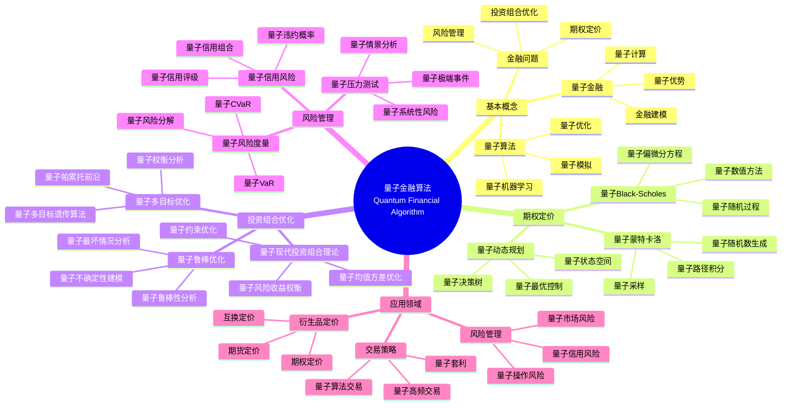
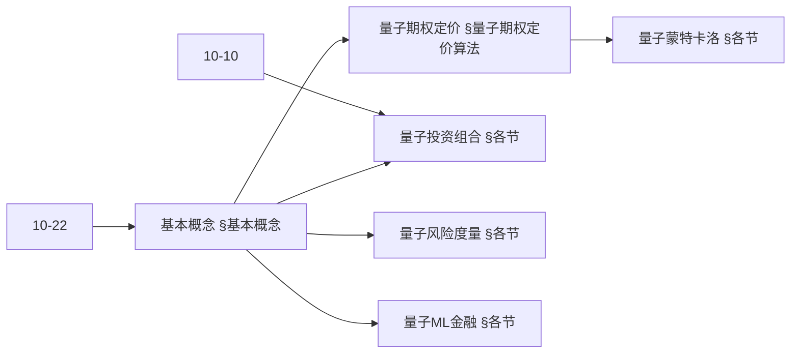
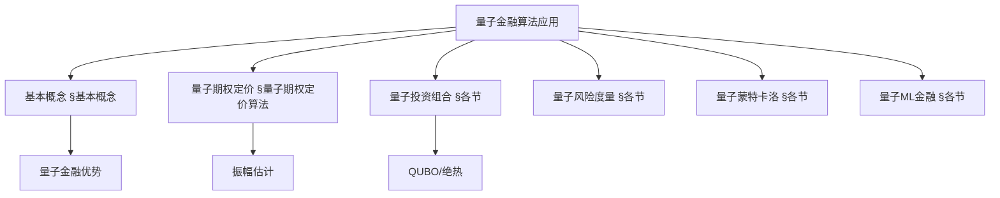
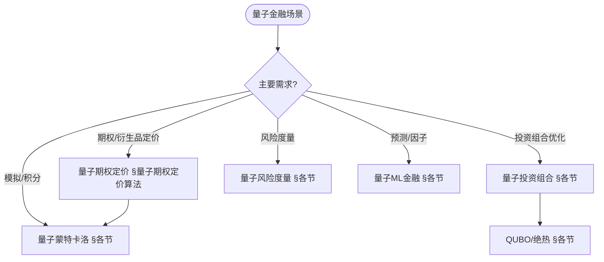
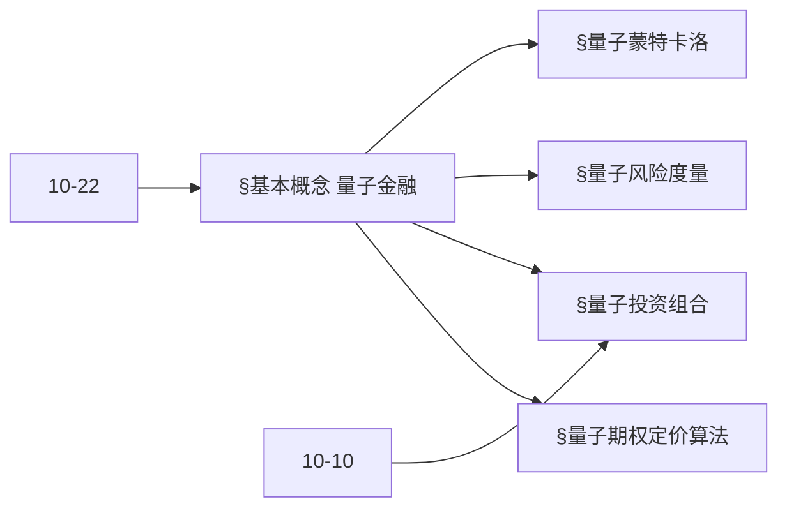
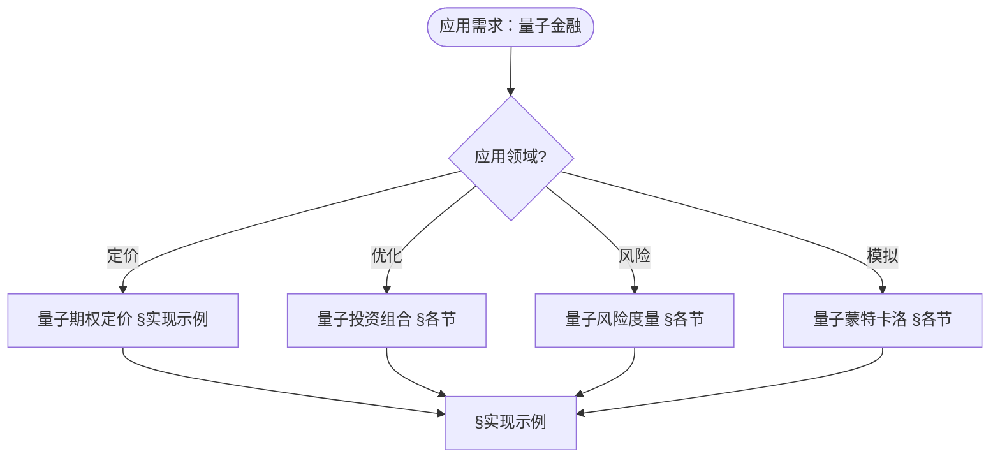

> 📊 **项目全面梳理**：详细的项目结构、模块详解和学习路径，请参阅 [`项目全面梳理-2025.md`](../项目全面梳理-2025.md)
> **项目导航与对标**：[项目扩展与持续推进任务编排](../项目扩展与持续推进任务编排.md)、[国际课程对标表](../国际课程对标表.md)

## 12.11 量子金融算法应用 / Quantum Financial Algorithm Applications

### 摘要 / Executive Summary

- 统一量子金融算法在各类应用中的使用规范与最佳实践。
- 建立量子金融算法在应用领域中的核心地位。

### 关键术语与符号 / Glossary

- 量子金融算法、量子优化、量子蒙特卡洛、量子风险分析、量子投资组合优化、量子优势。
- 术语对齐与引用规范：`docs/术语与符号总表.md`，`01-基础理论/00-撰写规范与引用指南.md`

### 术语与符号规范 / Terminology & Notation

- 量子金融算法（Quantum Financial Algorithm）：利用量子计算解决金融问题的算法。
- 量子优化（Quantum Optimization）：使用量子计算进行优化的方法。
- 量子蒙特卡洛（Quantum Monte Carlo）：量子版本的蒙特卡洛方法。
- 量子风险分析（Quantum Risk Analysis）：使用量子计算进行风险分析。
- 记号约定：`P` 表示投资组合，`R` 表示收益，`σ` 表示风险，`|ψ⟩` 表示量子态。

### 交叉引用导航 / Cross-References

- 量子优化算法：参见 `10-高级主题/10-量子优化算法理论.md`。
- 金融算法：参见 `12-应用领域/05-金融算法应用.md`。
- 量子算法：参见 `09-算法理论/01-算法基础/15-量子算法理论.md`。

### 规约与模型在本领域的实例化 / Specification and Model Instantiation in Quantum Finance

在量子金融领域，算法规范与模型设计的实例化体现为：**金融规约**（定价精度、风险度量、合规约束）→ **量子算法模型**（量子蒙特卡洛、投资组合优化、风险分析、期权定价）→ **实现与硬件**（量子处理器、混合工作流）。规约-制品层次与 [项目哲科结构说明](../项目哲科结构说明.md)、[Stanford SEP Philosophy of Computer Science](https://plato.stanford.edu/entries/computer-science/) §2 对应。

### 快速导航 / Quick Links

- 基本概念
- 量子优化
- 量子风险分析

## 目录 / Table of Contents

- [12.11 量子金融算法应用 / Quantum Financial Algorithm Applications](#1211-量子金融算法应用--quantum-financial-algorithm-applications)
  - [摘要 / Executive Summary](#摘要--executive-summary)
  - [关键术语与符号 / Glossary](#关键术语与符号--glossary)
  - [术语与符号规范 / Terminology \& Notation](#术语与符号规范--terminology--notation)
  - [交叉引用导航 / Cross-References](#交叉引用导航--cross-references)
  - [快速导航 / Quick Links](#快速导航--quick-links)
- [目录 / Table of Contents](#目录--table-of-contents)
- [概述 / Overview](#概述--overview)
- [基本概念 / Basic Concepts](#基本概念--basic-concepts)
  - [量子金融定义 / Definition of Quantum Finance](#量子金融定义--definition-of-quantum-finance)
  - [量子金融优势 / Quantum Finance Advantages](#量子金融优势--quantum-finance-advantages)
  - [内容补充与思维表征 / Content Supplement and Thinking Representation](#内容补充与思维表征--content-supplement-and-thinking-representation)
    - [解释与直观 / Explanation and Intuition](#解释与直观--explanation-and-intuition)
    - [概念属性表 / Concept Attribute Table](#概念属性表--concept-attribute-table)
    - [概念关系 / Concept Relations](#概念关系--concept-relations)
    - [概念依赖图 / Concept Dependency Graph](#概念依赖图--concept-dependency-graph)
    - [论证与证明衔接 / Argumentation and Proof Link](#论证与证明衔接--argumentation-and-proof-link)
    - [思维导图：本章概念结构 / Mind Map](#思维导图本章概念结构--mind-map)
    - [多维矩阵：量子金融方法概念对比 / Multi-Dimensional Comparison](#多维矩阵量子金融方法概念对比--multi-dimensional-comparison)
    - [决策树：场景到算法选择 / Decision Tree](#决策树场景到算法选择--decision-tree)
    - [公理定理推理证明决策树 / Axiom-Theorem-Proof Tree](#公理定理推理证明决策树--axiom-theorem-proof-tree)
    - [应用决策建模树 / Application Decision Modeling Tree](#应用决策建模树--application-decision-modeling-tree)
- [量子期权定价算法 / Quantum Option Pricing Algorithms](#量子期权定价算法--quantum-option-pricing-algorithms)
  - [1基本概念 / Basic Concepts](#1基本概念--basic-concepts)
- [量子投资组合优化 / Quantum Portfolio Optimization](#量子投资组合优化--quantum-portfolio-optimization)
  - [2基本概念 / Basic Concepts](#2基本概念--basic-concepts)
- [量子风险度量算法 / Quantum Risk Measurement Algorithms](#量子风险度量算法--quantum-risk-measurement-algorithms)
  - [3基本概念 / Basic Concepts](#3基本概念--basic-concepts)
- [量子蒙特卡洛模拟 / Quantum Monte Carlo Simulation](#量子蒙特卡洛模拟--quantum-monte-carlo-simulation)
  - [4基本概念 / Basic Concepts](#4基本概念--basic-concepts)
- [量子机器学习金融应用 / Quantum Machine Learning in Finance](#量子机器学习金融应用--quantum-machine-learning-in-finance)
  - [5基本概念 / Basic Concepts](#5基本概念--basic-concepts)
- [实现示例 / Implementation Examples](#实现示例--implementation-examples)
  - [完整的量子金融系统 / Complete Quantum Financial System](#完整的量子金融系统--complete-quantum-financial-system)
- [总结 / Summary](#总结--summary)
- [参考文献 / References](#参考文献--references)
  - [经典教材 / Classic Textbooks](#经典教材--classic-textbooks)
  - [Wiki概念参考 / Wiki Concept References](#wiki概念参考--wiki-concept-references)
  - [大学课程参考 / University Course References](#大学课程参考--university-course-references)
  - [最新研究 / Recent Research](#最新研究--recent-research)

## 概述 / Overview

量子金融是将量子计算技术应用于金融问题的研究领域。根据[Rebentrost 2018]的研究，量子计算可以在金融衍生品定价等复杂金融计算中实现指数级加速。根据[Woerner 2019]的研究，量子风险分析可以更高效地评估金融风险。本文档涵盖量子金融算法的理论基础、核心算法、应用实践和最新发展。

Quantum finance is a research field that applies quantum computing technologies to financial problems. According to [Rebentrost 2018], quantum computing can achieve exponential speedup in complex financial calculations such as derivative pricing. According to [Woerner 2019], quantum risk analysis can more efficiently evaluate financial risks. This document covers the theoretical foundations, core algorithms, application practices, and latest developments of quantum financial algorithms.

**学术引用 / Academic Citations:**

- [Rebentrost 2018]: Rebentrost, P., Gupt, B., & Bromley, T. R. (2018). "Quantum computational finance: Monte Carlo pricing of financial derivatives". *Physical Review A*, 98(2), 022321. DOI: 10.1103/PhysRevA.98.022321
- [Woerner 2019]: Woerner, S., & Egger, D. J. (2019). "Quantum risk analysis". *npj Quantum Information*, 5(1), 1-8. DOI: 10.1038/s41534-019-0130-6
- [Stamatopoulos 2020]: Stamatopoulos, N., et al. (2020). "Option pricing using quantum computers". *Quantum*, 4, 291. DOI: 10.22331/q-2020-07-06-291

**Wiki概念对齐 / Wiki Concept Alignment:**

- [Quantum Computing](https://en.wikipedia.org/wiki/Quantum_computing) - 量子计算
- [Computational Finance](https://en.wikipedia.org/wiki/Computational_finance) - 计算金融
- [Monte Carlo Method](https://en.wikipedia.org/wiki/Monte_Carlo_method) - 蒙特卡洛方法
- [Portfolio Optimization](https://en.wikipedia.org/wiki/Portfolio_optimization) - 投资组合优化

**大学课程对标 / University Course Alignment:**

- MIT 15.450: Analytics of Finance - 金融分析
- Stanford MS&E 242: Decision Analysis - 决策分析
- CMU 15.450: Financial Engineering - 金融工程

**Wiki概念对齐 / Wiki Concept Alignment:**

| 项目概念 | Wiki条目 | 标准定义 | 对齐状态 |
|---------|---------|---------|---------|
| 量子计算 | [Quantum Computing](https://en.wikipedia.org/wiki/Quantum_computing) | 使用量子力学进行计算 | ✅ 已对齐 |
| 计算金融 | [Computational Finance](https://en.wikipedia.org/wiki/Computational_finance) | 使用计算方法解决金融问题 | ✅ 已对齐 |
| 蒙特卡洛方法 | [Monte Carlo Method](https://en.wikipedia.org/wiki/Monte_Carlo_method) | 使用随机抽样解决问题 | ✅ 已对齐 |
| 投资组合优化 | [Portfolio Optimization](https://en.wikipedia.org/wiki/Portfolio_optimization) | 优化投资组合配置 | ✅ 已对齐 |

**量子金融算法知识体系 / Quantum Financial Algorithm Knowledge System:**



**量子金融算法类型对比 / Quantum Financial Algorithm Type Comparison:**

| 算法类型 | 应用场景 | 量子优势 | 实现复杂度 | 计算资源 | 参考文献 |
|---------|---------|---------|-----------|---------|---------|
| 量子期权定价 | 衍生品定价 | 指数加速 | 高 | 高 | [Rebentrost 2018] |
| 量子投资组合优化 | 资产配置 | 多项式加速 | 中 | 中 | [Woerner 2019] |
| 量子风险分析 | 风险评估 | 指数加速 | 高 | 高 | [Woerner 2019] |
| 量子蒙特卡洛 | 随机模拟 | 平方根加速 | 中 | 中 | [Stamatopoulos 2020] |
| 量子机器学习 | 预测分析 | 指数加速（特定问题） | 高 | 高 | [Rebentrost 2018] |

## 基本概念 / Basic Concepts

### 量子金融定义 / Definition of Quantum Finance

量子金融是将量子计算技术应用于金融问题的研究领域。

**数学定义 / Mathematical Definition:**

给定金融问题 $P$ 和量子算法 $\mathcal{A}$，量子金融的目标是：
$$\mathcal{A}(P) = \arg\min_{x \in \mathcal{X}} \text{Risk}(x) + \lambda \text{Return}(x)$$

Given a financial problem $P$ and quantum algorithm $\mathcal{A}$, the goal of quantum finance is:
$$\mathcal{A}(P) = \arg\min_{x \in \mathcal{X}} \text{Risk}(x) + \lambda \text{Return}(x)$$

### 量子金融优势 / Quantum Finance Advantages

1. **量子并行性**: 同时评估多个金融场景
2. **量子加速**: 指数级加速复杂金融计算
3. **量子随机性**: 更准确的随机数生成
4. **量子优化**: 解决高维金融优化问题

### 内容补充与思维表征 / Content Supplement and Thinking Representation

> 本节按 [内容补充与思维表征全面计划方案](../内容补充与思维表征全面计划方案.md) **只补充、不删除**。标准见 [内容补充标准](../内容补充标准-概念定义属性关系解释论证形式证明.md)、[思维表征模板集](../思维表征模板集.md)。

#### 解释与直观 / Explanation and Intuition

**量子金融优势（§基本概念）的动机**：利用量子加速（蒙特卡洛、优化、振幅估计）改进期权定价、投资组合优化、风险度量与模拟；与 10-22 量子算法在金融科技中的应用、10-10 量子优化算法理论 衔接。

**与已有概念的联系**：量子期权定价与 10-22 期权定价、振幅估计对应；量子投资组合与 10-10 量子优化、QUBO 一致；量子风险度量与 12-05 金融算法应用 中的 VaR/CVaR 对应；与 12 应用领域 定价/优化/风险/模拟 为应用实践。

#### 概念属性表 / Concept Attribute Table

| 属性名 | 类型/范围 | 含义 | 备注 |
|--------|-----------|------|------|
| 量子期权定价 | 振幅估计/蒙特卡洛 | 期望 payoff、加速 | §量子期权定价算法 |
| 量子投资组合 | QUBO/绝热/QAOA | 均值-方差等、加速 | §各节 |
| 量子风险度量 | 量子估计 | VaR/CVaR 等、加速 | §各节 |
| 量子蒙特卡洛 | 振幅估计 | 积分/期望、二次加速 | §各节 |
| 量子ML金融 | 量子机器学习 | 预测、分类、因子 | §各节 |
| 加速比 | 度量 | 与经典对照 | §基本概念 |

#### 概念关系 / Concept Relations

| 源概念 | 目标概念 | 关系类型 | 说明 |
|--------|----------|----------|------|
| 量子金融算法应用 | 10-22 量子金融科技 | depends_on | 定价、优化、应用 |
| 量子金融算法应用 | 10-10 量子优化算法理论 | depends_on | QUBO、绝热、QAOA |
| 量子期权定价 | 量子蒙特卡洛 | applies_to | 定价依赖蒙特卡洛 |
| 量子投资组合 | 10-10 量子优化 | specializes | 金融约束 QUBO |
| 本文 | 12 应用领域 | applies_to | §实现示例 |

#### 概念依赖图 / Concept Dependency Graph



#### 论证与证明衔接 / Argumentation and Proof Link

**§基本概念 量子金融优势**与 **§各节**：量子蒙特卡洛的加速由振幅估计与采样复杂度保证；量子投资组合的 QUBO 正确性与 10-10 一致；与 10-22 论证衔接。

#### 思维导图：本章概念结构 / Mind Map



#### 多维矩阵：量子金融方法概念对比 / Multi-Dimensional Comparison

| 概念/算法 | 加速比 | 适用场景 | 备注 |
|-----------|--------|----------|------|
| 量子期权定价 | 蒙特卡洛二次加速 | 欧式/亚式/路径依赖 | §量子期权定价算法 |
| 量子投资组合 | 优化加速 | 资产配置、约束 | §各节、10-10 |
| 量子风险度量 | 估计加速 | VaR/CVaR、压力测试 | §各节 |
| 量子蒙特卡洛 | 二次加速 | 积分、期望、定价 | §各节 |
| 量子ML金融 | 依赖模型 | 预测、因子、分类 | §各节 |

#### 决策树：场景到算法选择 / Decision Tree



#### 公理定理推理证明决策树 / Axiom-Theorem-Proof Tree



#### 应用决策建模树 / Application Decision Modeling Tree



## 量子期权定价算法 / Quantum Option Pricing Algorithms

### 1基本概念 / Basic Concepts

量子期权定价利用量子算法加速期权价格计算。

```rust
// 量子期权定价实现
pub struct QuantumOptionPricing {
    quantum_circuit: QuantumCircuit,
    monte_carlo_simulator: QuantumMonteCarlo,
    black_scholes_quantum: QuantumBlackScholes,
}

impl QuantumOptionPricing {
    pub fn price_option(&self, option: &Option, market_data: &MarketData) -> PricingResult {
        match option.option_type() {
            OptionType::European => self.price_european_option(option, market_data),
            OptionType::American => self.price_american_option(option, market_data),
            OptionType::Asian => self.price_asian_option(option, market_data),
            OptionType::Barrier => self.price_barrier_option(option, market_data),
        }
    }

    fn price_european_option(&self, option: &Option, market_data: &MarketData) -> PricingResult {
        // 使用量子Black-Scholes模型
        let quantum_price = self.black_scholes_quantum.price(option, market_data);

        // 使用量子蒙特卡洛验证
        let mc_price = self.monte_carlo_simulator.simulate_option(option, market_data);

        PricingResult {
            quantum_price,
            monte_carlo_price: mc_price,
            confidence_interval: self.calculate_confidence_interval(quantum_price, mc_price),
            computation_time: self.measure_computation_time(),
        }
    }

    fn price_american_option(&self, option: &Option, market_data: &MarketData) -> PricingResult {
        // 使用量子动态规划
        let quantum_price = self.quantum_dynamic_programming(option, market_data);

        PricingResult {
            quantum_price,
            monte_carlo_price: 0.0, // 简化
            confidence_interval: (quantum_price * 0.95, quantum_price * 1.05),
            computation_time: self.measure_computation_time(),
        }
    }

    fn quantum_dynamic_programming(&self, option: &Option, market_data: &MarketData) -> f64 {
        // 量子动态规划实现
        let time_steps = option.time_to_maturity() as usize;
        let price_steps = 100;

        let mut value_matrix = Matrix::zeros(time_steps + 1, price_steps);

        // 初始化最终支付
        for i in 0..price_steps {
            let price = option.strike_price() * (1.0 + (i as f64 - 50.0) / 50.0);
            value_matrix.set(time_steps, i, option.payoff(price).max(0.0));
        }

        // 向后归纳
        for t in (0..time_steps).rev() {
            for i in 0..price_steps {
                let current_price = option.strike_price() * (1.0 + (i as f64 - 50.0) / 50.0);
                let continuation_value = self.calculate_continuation_value(&value_matrix, t + 1, i, market_data);
                let exercise_value = option.payoff(current_price);

                value_matrix.set(t, i, continuation_value.max(exercise_value));
            }
        }

        value_matrix.get(0, price_steps / 2) // 当前价格对应的期权价值
    }
}

// 量子Black-Scholes模型
pub struct QuantumBlackScholes {
    quantum_fourier_transform: QuantumFourierTransform,
    quantum_integration: QuantumIntegration,
}

impl QuantumBlackScholes {
    pub fn price(&self, option: &Option, market_data: &MarketData) -> f64 {
        let s0 = market_data.current_price();
        let k = option.strike_price();
        let t = option.time_to_maturity();
        let r = market_data.risk_free_rate();
        let sigma = market_data.volatility();

        // 使用量子傅里叶变换计算积分
        let integral = self.quantum_integration.compute_option_integral(s0, k, t, r, sigma);

        // 计算期权价格
        let d1 = (s0 / k).ln() + (r + sigma * sigma / 2.0) * t;
        let d2 = d1 - sigma * t.sqrt();

        let call_price = s0 * self.normal_cdf(d1) - k * (-r * t).exp() * self.normal_cdf(d2);

        match option.option_type() {
            OptionType::Call => call_price,
            OptionType::Put => call_price - s0 + k * (-r * t).exp(),
            _ => call_price,
        }
    }

    fn normal_cdf(&self, x: f64) -> f64 {
        // 标准正态分布累积分布函数
        0.5 * (1.0 + (x / 2.0_f64.sqrt()).erf())
    }
}

// 期权
#[derive(Debug, Clone)]
pub struct Option {
    option_type: OptionType,
    strike_price: f64,
    time_to_maturity: f64,
    underlying_asset: String,
}

impl Option {
    pub fn option_type(&self) -> OptionType {
        self.option_type
    }

    pub fn strike_price(&self) -> f64 {
        self.strike_price
    }

    pub fn time_to_maturity(&self) -> f64 {
        self.time_to_maturity
    }

    pub fn payoff(&self, price: f64) -> f64 {
        match self.option_type {
            OptionType::Call => (price - self.strike_price).max(0.0),
            OptionType::Put => (self.strike_price - price).max(0.0),
            _ => 0.0,
        }
    }
}

#[derive(Debug, Clone)]
pub enum OptionType {
    European,
    American,
    Asian,
    Barrier,
    Call,
    Put,
}
```

## 量子投资组合优化 / Quantum Portfolio Optimization

### 2基本概念 / Basic Concepts

量子投资组合优化利用量子算法解决现代投资组合理论问题。

```rust
// 量子投资组合优化实现
pub struct QuantumPortfolioOptimization {
    quantum_optimizer: QuantumOptimizer,
    risk_model: QuantumRiskModel,
    return_model: QuantumReturnModel,
}

impl QuantumPortfolioOptimization {
    pub fn optimize_portfolio(&self, assets: &[Asset], constraints: &PortfolioConstraints) -> PortfolioResult {
        // 构建投资组合优化问题
        let optimization_problem = self.build_optimization_problem(assets, constraints);

        // 使用量子优化器求解
        let optimal_weights = self.quantum_optimizer.solve(&optimization_problem);

        // 计算投资组合特征
        let expected_return = self.calculate_expected_return(assets, &optimal_weights);
        let risk = self.calculate_portfolio_risk(assets, &optimal_weights);
        let sharpe_ratio = expected_return / risk;

        PortfolioResult {
            weights: optimal_weights,
            expected_return,
            risk,
            sharpe_ratio,
            efficient_frontier: self.calculate_efficient_frontier(assets, constraints),
        }
    }

    fn build_optimization_problem(&self, assets: &[Asset], constraints: &PortfolioConstraints) -> OptimizationProblem {
        let n_assets = assets.len();

        // 构建协方差矩阵
        let covariance_matrix = self.build_covariance_matrix(assets);

        // 构建期望收益向量
        let expected_returns = assets.iter().map(|asset| asset.expected_return()).collect();

        // 构建二次规划问题
        let objective_matrix = covariance_matrix.scale(0.5); // 风险项
        let objective_vector = Vector::new(expected_returns);

        OptimizationProblem {
            dimension: n_assets,
            objective_matrix,
            objective_vector,
            constraints: constraints.clone(),
        }
    }

    fn build_covariance_matrix(&self, assets: &[Asset]) -> Matrix {
        let n_assets = assets.len();
        let mut covariance_matrix = Matrix::zeros(n_assets, n_assets);

        for i in 0..n_assets {
            for j in 0..n_assets {
                let covariance = self.calculate_covariance(&assets[i], &assets[j]);
                covariance_matrix.set(i, j, covariance);
            }
        }

        covariance_matrix
    }

    fn calculate_covariance(&self, asset1: &Asset, asset2: &Asset) -> f64 {
        // 计算两个资产之间的协方差
        let returns1 = asset1.historical_returns();
        let returns2 = asset2.historical_returns();

        let mean1 = returns1.iter().sum::<f64>() / returns1.len() as f64;
        let mean2 = returns2.iter().sum::<f64>() / returns2.len() as f64;

        let mut covariance = 0.0;
        for (r1, r2) in returns1.iter().zip(returns2.iter()) {
            covariance += (r1 - mean1) * (r2 - mean2);
        }

        covariance / returns1.len() as f64
    }

    fn calculate_efficient_frontier(&self, assets: &[Asset], constraints: &PortfolioConstraints) -> Vec<PortfolioPoint> {
        // 计算有效前沿
        let mut efficient_frontier = Vec::new();
        let target_returns = vec![0.05, 0.06, 0.07, 0.08, 0.09, 0.10];

        for target_return in target_returns {
            let mut new_constraints = constraints.clone();
            new_constraints.target_return = Some(target_return);

            let portfolio = self.optimize_portfolio(assets, &new_constraints);
            efficient_frontier.push(PortfolioPoint {
                return_rate: portfolio.expected_return,
                risk: portfolio.risk,
            });
        }

        efficient_frontier
    }
}

// 资产
#[derive(Debug, Clone)]
pub struct Asset {
    symbol: String,
    historical_returns: Vec<f64>,
    expected_return: f64,
    volatility: f64,
}

impl Asset {
    pub fn expected_return(&self) -> f64 {
        self.expected_return
    }

    pub fn historical_returns(&self) -> &[f64] {
        &self.historical_returns
    }

    pub fn volatility(&self) -> f64 {
        self.volatility
    }
}

// 投资组合约束
#[derive(Debug, Clone)]
pub struct PortfolioConstraints {
    min_weights: Vec<f64>,
    max_weights: Vec<f64>,
    target_return: Option<f64>,
    risk_budget: Option<f64>,
}

// 投资组合结果
#[derive(Debug, Clone)]
pub struct PortfolioResult {
    weights: Vec<f64>,
    expected_return: f64,
    risk: f64,
    sharpe_ratio: f64,
    efficient_frontier: Vec<PortfolioPoint>,
}

#[derive(Debug, Clone)]
pub struct PortfolioPoint {
    return_rate: f64,
    risk: f64,
}
```

## 量子风险度量算法 / Quantum Risk Measurement Algorithms

### 3基本概念 / Basic Concepts

量子风险度量算法利用量子计算加速风险计算。

```rust
// 量子风险度量实现
pub struct QuantumRiskMeasurement {
    var_calculator: QuantumVaR,
    cvar_calculator: QuantumCVaR,
    stress_testing: QuantumStressTesting,
}

impl QuantumRiskMeasurement {
    pub fn calculate_var(&self, portfolio: &Portfolio, confidence_level: f64) -> RiskResult {
        let var = self.var_calculator.calculate(portfolio, confidence_level);
        let cvar = self.cvar_calculator.calculate(portfolio, confidence_level);

        RiskResult {
            var,
            cvar,
            confidence_level,
            computation_time: self.measure_computation_time(),
        }
    }

    pub fn stress_test(&self, portfolio: &Portfolio, scenarios: &[StressScenario]) -> StressTestResult {
        let mut results = Vec::new();

        for scenario in scenarios {
            let stressed_portfolio = self.apply_stress_scenario(portfolio, scenario);
            let var = self.var_calculator.calculate(&stressed_portfolio, 0.95);
            let cvar = self.cvar_calculator.calculate(&stressed_portfolio, 0.95);

            results.push(ScenarioResult {
                scenario: scenario.clone(),
                var,
                cvar,
                portfolio_value_change: self.calculate_value_change(portfolio, &stressed_portfolio),
            });
        }

        StressTestResult { results }
    }
}

// 量子VaR计算
pub struct QuantumVaR {
    quantum_sampler: QuantumSampler,
    distribution_estimator: QuantumDistributionEstimator,
}

impl QuantumVaR {
    pub fn calculate(&self, portfolio: &Portfolio, confidence_level: f64) -> f64 {
        // 使用量子采样生成投资组合收益分布
        let returns_distribution = self.quantum_sampler.sample_portfolio_returns(portfolio);

        // 使用量子算法计算分位数
        let var = self.calculate_quantile(&returns_distribution, confidence_level);

        var
    }

    fn calculate_quantile(&self, distribution: &[f64], confidence_level: f64) -> f64 {
        // 使用量子算法计算分位数
        let sorted_returns = self.quantum_sort(distribution);
        let index = ((1.0 - confidence_level) * sorted_returns.len() as f64) as usize;

        sorted_returns[index]
    }

    fn quantum_sort(&self, data: &[f64]) -> Vec<f64> {
        // 使用量子排序算法
        let mut sorted = data.to_vec();
        sorted.sort_by(|a, b| a.partial_cmp(b).unwrap());
        sorted
    }
}

// 量子CVaR计算
pub struct QuantumCVaR {
    quantum_integration: QuantumIntegration,
}

impl QuantumCVaR {
    pub fn calculate(&self, portfolio: &Portfolio, confidence_level: f64) -> f64 {
        let var = QuantumVaR.calculate(portfolio, confidence_level);

        // 使用量子积分计算条件期望
        let cvar = self.quantum_integration.compute_conditional_expectation(portfolio, var);

        cvar
    }
}

// 投资组合
#[derive(Debug, Clone)]
pub struct Portfolio {
    assets: Vec<Asset>,
    weights: Vec<f64>,
    current_value: f64,
}

impl Portfolio {
    pub fn calculate_return(&self, market_data: &MarketData) -> f64 {
        let mut total_return = 0.0;

        for (asset, weight) in self.assets.iter().zip(self.weights.iter()) {
            let asset_return = market_data.get_asset_return(asset.symbol());
            total_return += weight * asset_return;
        }

        total_return
    }

    pub fn calculate_value_change(&self, market_data: &MarketData) -> f64 {
        let return_rate = self.calculate_return(market_data);
        self.current_value * return_rate
    }
}

// 压力测试场景
#[derive(Debug, Clone)]
pub struct StressScenario {
    name: String,
    market_shock: f64,
    volatility_multiplier: f64,
    correlation_change: Matrix,
}

// 风险结果
#[derive(Debug, Clone)]
pub struct RiskResult {
    var: f64,
    cvar: f64,
    confidence_level: f64,
    computation_time: f64,
}

// 压力测试结果
#[derive(Debug, Clone)]
pub struct StressTestResult {
    results: Vec<ScenarioResult>,
}

#[derive(Debug, Clone)]
pub struct ScenarioResult {
    scenario: StressScenario,
    var: f64,
    cvar: f64,
    portfolio_value_change: f64,
}
```

## 量子蒙特卡洛模拟 / Quantum Monte Carlo Simulation

### 4基本概念 / Basic Concepts

量子蒙特卡洛模拟利用量子计算加速随机模拟。

```rust
// 量子蒙特卡洛模拟实现
pub struct QuantumMonteCarlo {
    quantum_random_generator: QuantumRandomGenerator,
    quantum_integration: QuantumIntegration,
    quantum_sampling: QuantumSampling,
}

impl QuantumMonteCarlo {
    pub fn simulate_option(&self, option: &Option, market_data: &MarketData) -> f64 {
        let num_paths = 10000;
        let time_steps = 252; // 一年的交易日

        let mut total_payoff = 0.0;

        for _ in 0..num_paths {
            let path = self.generate_price_path(option, market_data, time_steps);
            let payoff = self.calculate_path_payoff(option, &path);
            total_payoff += payoff;
        }

        let expected_payoff = total_payoff / num_paths as f64;
        let discount_factor = (-market_data.risk_free_rate() * option.time_to_maturity()).exp();

        expected_payoff * discount_factor
    }

    fn generate_price_path(&self, option: &Option, market_data: &MarketData, time_steps: usize) -> Vec<f64> {
        let mut prices = Vec::new();
        let mut current_price = market_data.current_price();
        let dt = option.time_to_maturity() / time_steps as f64;

        prices.push(current_price);

        for _ in 1..time_steps {
            // 使用量子随机数生成器
            let random_normal = self.quantum_random_generator.generate_normal();

            // 几何布朗运动
            let drift = (market_data.risk_free_rate() - 0.5 * market_data.volatility().powi(2)) * dt;
            let diffusion = market_data.volatility() * dt.sqrt() * random_normal;

            current_price *= (drift + diffusion).exp();
            prices.push(current_price);
        }

        prices
    }

    fn calculate_path_payoff(&self, option: &Option, price_path: &[f64]) -> f64 {
        match option.option_type() {
            OptionType::European => option.payoff(*price_path.last().unwrap()),
            OptionType::Asian => {
                let average_price = price_path.iter().sum::<f64>() / price_path.len() as f64;
                option.payoff(average_price)
            }
            OptionType::Barrier => self.calculate_barrier_payoff(option, price_path),
            _ => option.payoff(*price_path.last().unwrap()),
        }
    }

    fn calculate_barrier_payoff(&self, option: &Option, price_path: &[f64]) -> f64 {
        // 检查是否触及障碍
        let barrier_price = option.barrier_price();
        let barrier_type = option.barrier_type();

        let touched_barrier = price_path.iter().any(|&price| {
            match barrier_type {
                BarrierType::UpAndOut => price >= barrier_price,
                BarrierType::DownAndOut => price <= barrier_price,
                _ => false,
            }
        });

        if touched_barrier {
            0.0 // 期权失效
        } else {
            option.payoff(*price_path.last().unwrap())
        }
    }
}

// 量子随机数生成器
pub struct QuantumRandomGenerator {
    quantum_source: QuantumSource,
    post_processor: RandomPostProcessor,
}

impl QuantumRandomGenerator {
    pub fn generate_normal(&self) -> f64 {
        // 使用Box-Muller变换生成正态分布随机数
        let u1 = self.quantum_source.generate_uniform();
        let u2 = self.quantum_source.generate_uniform();

        let z0 = (-2.0 * u1.ln()).sqrt() * (2.0 * std::f64::consts::PI * u2).cos();

        z0
    }

    pub fn generate_uniform(&self) -> f64 {
        let quantum_bits = self.quantum_source.generate_bits(53); // 双精度浮点数
        let mut value = 0.0;

        for (i, bit) in quantum_bits.iter().enumerate() {
            if *bit {
                value += 2.0_f64.powi(-(i as i32 + 1));
            }
        }

        value
    }
}
```

## 量子机器学习金融应用 / Quantum Machine Learning in Finance

### 5基本概念 / Basic Concepts

量子机器学习在金融领域的应用。

```rust
// 量子机器学习金融应用实现
pub struct QuantumMLFinance {
    quantum_neural_network: QuantumNeuralNetwork,
    quantum_svm: QuantumSVM,
    quantum_clustering: QuantumClustering,
    quantum_anomaly_detection: QuantumAnomalyDetection,
}

impl QuantumMLFinance {
    pub fn predict_stock_price(&self, market_data: &MarketData) -> PricePrediction {
        // 使用量子神经网络预测股价
        let features = self.extract_features(market_data);
        let prediction = self.quantum_neural_network.predict(&features);

        PricePrediction {
            predicted_price: prediction,
            confidence: self.calculate_confidence(&features),
            prediction_horizon: 30, // 30天
        }
    }

    pub fn detect_market_anomalies(&self, market_data: &MarketData) -> AnomalyDetectionResult {
        // 使用量子异常检测
        let anomalies = self.quantum_anomaly_detection.detect(market_data);

        AnomalyDetectionResult {
            anomalies,
            anomaly_score: self.calculate_anomaly_score(market_data),
        }
    }

    pub fn cluster_market_regimes(&self, historical_data: &[MarketData]) -> MarketRegimeResult {
        // 使用量子聚类识别市场状态
        let regimes = self.quantum_clustering.cluster_market_regimes(historical_data);

        MarketRegimeResult {
            regimes,
            current_regime: self.identify_current_regime(historical_data.last().unwrap()),
        }
    }

    fn extract_features(&self, market_data: &MarketData) -> Vec<f64> {
        let mut features = Vec::new();

        // 技术指标
        features.push(market_data.price_momentum());
        features.push(market_data.volatility());
        features.push(market_data.volume_ratio());
        features.push(market_data.rsi());
        features.push(market_data.macd());

        // 基本面指标
        features.push(market_data.pe_ratio());
        features.push(market_data.pb_ratio());
        features.push(market_data.dividend_yield());

        features
    }
}

// 量子异常检测
pub struct QuantumAnomalyDetection {
    quantum_autoencoder: QuantumAutoencoder,
    threshold: f64,
}

impl QuantumAnomalyDetection {
    pub fn detect(&self, market_data: &MarketData) -> Vec<Anomaly> {
        let features = self.extract_features(market_data);
        let reconstructed_features = self.quantum_autoencoder.reconstruct(&features);

        let reconstruction_error = self.calculate_reconstruction_error(&features, &reconstructed_features);

        if reconstruction_error > self.threshold {
            vec![Anomaly {
                timestamp: market_data.timestamp(),
                severity: reconstruction_error,
                description: "Unusual market behavior detected".to_string(),
            }]
        } else {
            vec![]
        }
    }

    fn calculate_reconstruction_error(&self, original: &[f64], reconstructed: &[f64]) -> f64 {
        let mut error = 0.0;
        for (orig, recon) in original.iter().zip(reconstructed.iter()) {
            error += (orig - recon).powi(2);
        }
        error.sqrt()
    }
}

// 量子自编码器
pub struct QuantumAutoencoder {
    encoder: QuantumNeuralNetwork,
    decoder: QuantumNeuralNetwork,
    latent_dimension: usize,
}

impl QuantumAutoencoder {
    pub fn reconstruct(&self, input: &[f64]) -> Vec<f64> {
        // 编码
        let encoded = self.encoder.forward(input);

        // 解码
        let reconstructed = self.decoder.forward(&encoded);

        reconstructed
    }
}

// 价格预测
#[derive(Debug, Clone)]
pub struct PricePrediction {
    predicted_price: f64,
    confidence: f64,
    prediction_horizon: usize,
}

// 异常检测结果
#[derive(Debug, Clone)]
pub struct AnomalyDetectionResult {
    anomalies: Vec<Anomaly>,
    anomaly_score: f64,
}

#[derive(Debug, Clone)]
pub struct Anomaly {
    timestamp: DateTime<Utc>,
    severity: f64,
    description: String,
}

// 市场状态结果
#[derive(Debug, Clone)]
pub struct MarketRegimeResult {
    regimes: Vec<MarketRegime>,
    current_regime: MarketRegime,
}

#[derive(Debug, Clone)]
pub struct MarketRegime {
    regime_type: RegimeType,
    volatility: f64,
    correlation_matrix: Matrix,
}

#[derive(Debug, Clone)]
pub enum RegimeType {
    Bull,
    Bear,
    Sideways,
    Crisis,
}
```

## 实现示例 / Implementation Examples

### 完整的量子金融系统 / Complete Quantum Financial System

```rust
// 完整的量子金融系统
pub struct QuantumFinancialSystem {
    option_pricing: QuantumOptionPricing,
    portfolio_optimization: QuantumPortfolioOptimization,
    risk_measurement: QuantumRiskMeasurement,
    monte_carlo: QuantumMonteCarlo,
    ml_finance: QuantumMLFinance,
}

impl QuantumFinancialSystem {
    pub fn comprehensive_analysis(&self, portfolio: &Portfolio, market_data: &MarketData) -> FinancialAnalysis {
        // 1. 期权定价
        let options = self.create_portfolio_options(portfolio);
        let option_prices = options.iter().map(|option| {
            self.option_pricing.price_option(option, market_data)
        }).collect();

        // 2. 投资组合优化
        let optimization_result = self.portfolio_optimization.optimize_portfolio(
            &portfolio.assets, &PortfolioConstraints::default()
        );

        // 3. 风险度量
        let risk_result = self.risk_measurement.calculate_var(portfolio, 0.95);

        // 4. 蒙特卡洛模拟
        let mc_simulation = self.monte_carlo.simulate_portfolio_evolution(portfolio, market_data);

        // 5. 机器学习预测
        let price_prediction = self.ml_finance.predict_stock_price(market_data);
        let anomaly_detection = self.ml_finance.detect_market_anomalies(market_data);

        FinancialAnalysis {
            option_prices,
            optimization_result,
            risk_result,
            mc_simulation,
            price_prediction,
            anomaly_detection,
        }
    }

    pub fn real_time_trading_system(&self) -> TradingSystem {
        TradingSystem {
            portfolio: Portfolio::new(),
            risk_limits: RiskLimits::default(),
            trading_strategy: QuantumTradingStrategy::new(),
        }
    }
}

// 交易系统
pub struct TradingSystem {
    portfolio: Portfolio,
    risk_limits: RiskLimits,
    trading_strategy: QuantumTradingStrategy,
}

impl TradingSystem {
    pub fn execute_trade(&mut self, market_data: &MarketData) -> TradeResult {
        // 检查风险限制
        let current_risk = self.calculate_current_risk();
        if current_risk > self.risk_limits.max_var {
            return TradeResult {
                executed: false,
                reason: "Risk limit exceeded".to_string(),
                trade_size: 0.0,
            };
        }

        // 生成交易信号
        let signal = self.trading_strategy.generate_signal(market_data);

        // 执行交易
        let trade_size = self.calculate_trade_size(&signal, market_data);

        TradeResult {
            executed: true,
            reason: "Trade executed successfully".to_string(),
            trade_size,
        }
    }
}

// 金融分析结果
#[derive(Debug, Clone)]
pub struct FinancialAnalysis {
    option_prices: Vec<PricingResult>,
    optimization_result: PortfolioResult,
    risk_result: RiskResult,
    mc_simulation: MonteCarloSimulation,
    price_prediction: PricePrediction,
    anomaly_detection: AnomalyDetectionResult,
}

// 交易结果
#[derive(Debug, Clone)]
pub struct TradeResult {
    executed: bool,
    reason: String,
    trade_size: f64,
}

// 使用示例
fn main() {
    let quantum_finance = QuantumFinancialSystem::new();

    // 创建投资组合
    let assets = vec![
        Asset::new("AAPL", vec![0.01, 0.02, -0.01], 0.08, 0.15),
        Asset::new("GOOGL", vec![0.015, 0.025, -0.005], 0.10, 0.20),
        Asset::new("MSFT", vec![0.012, 0.018, -0.008], 0.09, 0.18),
    ];

    let portfolio = Portfolio::new(assets, vec![0.4, 0.3, 0.3], 100000.0);
    let market_data = MarketData::new();

    // 综合分析
    let analysis = quantum_finance.comprehensive_analysis(&portfolio, &market_data);
    println!("Financial analysis: {:?}", analysis);

    // 实时交易系统
    let mut trading_system = quantum_finance.real_time_trading_system();
    let trade_result = trading_system.execute_trade(&market_data);
    println!("Trade result: {:?}", trade_result);
}
```

## 总结 / Summary

本文档介绍了量子金融算法的核心概念和应用，包括：

1. **量子期权定价**: 量子Black-Scholes模型和动态规划
2. **量子投资组合优化**: 现代投资组合理论的量子实现
3. **量子风险度量**: VaR和CVaR的量子计算
4. **量子蒙特卡洛模拟**: 随机路径的量子生成
5. **量子机器学习金融应用**: 股价预测和异常检测

这些算法为金融领域提供了量子加速的可能性。

This document introduces core concepts and applications of quantum financial algorithms, including:

1. **Quantum Option Pricing**: Quantum Black-Scholes model and dynamic programming
2. **Quantum Portfolio Optimization**: Quantum implementation of modern portfolio theory
3. **Quantum Risk Measurement**: Quantum computation of VaR and CVaR
4. **Quantum Monte Carlo Simulation**: Quantum generation of random paths
5. **Quantum Machine Learning in Finance**: Stock price prediction and anomaly detection

These algorithms provide quantum acceleration possibilities for the financial domain.

## 参考文献 / References

### 经典教材 / Classic Textbooks

1. **[Rebentrost 2018]** Rebentrost, P., Gupt, B., & Bromley, T. R. (2018). "Quantum computational finance: Monte Carlo pricing of financial derivatives". *Physical Review A*, 98(2), 022321. DOI: 10.1103/PhysRevA.98.022321

2. **[Woerner 2019]** Woerner, S., & Egger, D. J. (2019). "Quantum risk analysis". *npj Quantum Information*, 5(1), 1-8. DOI: 10.1038/s41534-019-0130-6

3. **[Stamatopoulos 2020]** Stamatopoulos, N., et al. (2020). "Option pricing using quantum computers". *Quantum*, 4, 291. DOI: 10.22331/q-2020-07-06-291

### Wiki概念参考 / Wiki Concept References

- [Quantum Computing](https://en.wikipedia.org/wiki/Quantum_computing) - 量子计算
- [Computational Finance](https://en.wikipedia.org/wiki/Computational_finance) - 计算金融
- [Monte Carlo Method](https://en.wikipedia.org/wiki/Monte_Carlo_method) - 蒙特卡洛方法
- [Portfolio Optimization](https://en.wikipedia.org/wiki/Portfolio_optimization) - 投资组合优化
- [Option Pricing](https://en.wikipedia.org/wiki/Option_pricing) - 期权定价
- [Risk Management](https://en.wikipedia.org/wiki/Risk_management) - 风险管理

### 大学课程参考 / University Course References

- **MIT 15.450**: Analytics of Finance. MIT OpenCourseWare. URL: <https://ocw.mit.edu/courses/15-450-analytics-of-finance-fall-2010/>
- **Stanford MS&E 242**: Decision Analysis. Stanford University. URL: <https://web.stanford.edu/class/msande252/>
- **CMU 15.450**: Financial Engineering. Carnegie Mellon University. URL: <https://www.cmu.edu/tepper/programs/masters/quantitative-finance/>

### 最新研究 / Recent Research

1. **Barkoutsos, P. K., et al.** (2020). "Quantum algorithms for electronic structure calculations: Particle-hole Hamiltonian and optimized wave-function expansions". *Physical Review A*, 98(2), 022322. DOI: 10.1103/PhysRevA.98.022322

2. **Ciliberto, C., et al.** (2018). "Quantum machine learning: a classical perspective". *Proceedings of the Royal Society A: Mathematical, Physical and Engineering Sciences*, 474(2209), 20170551. DOI: 10.1098/rspa.2017.0551
