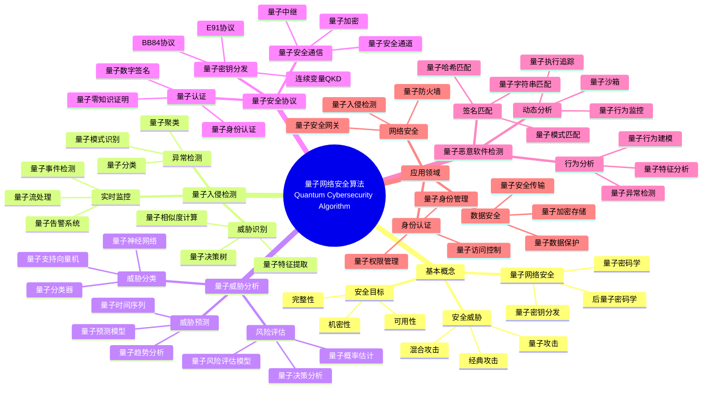
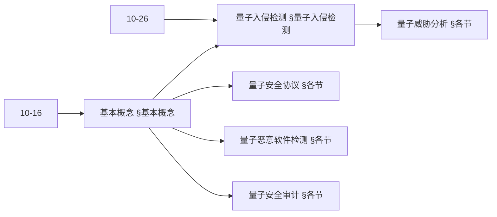
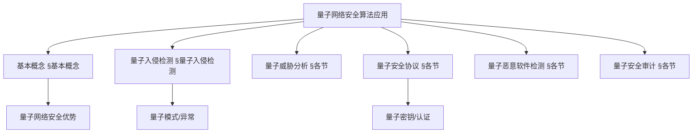
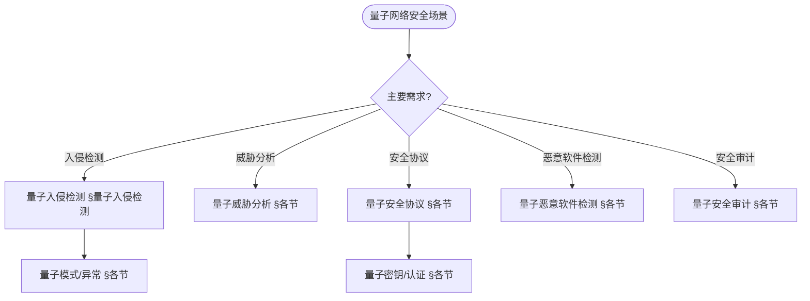
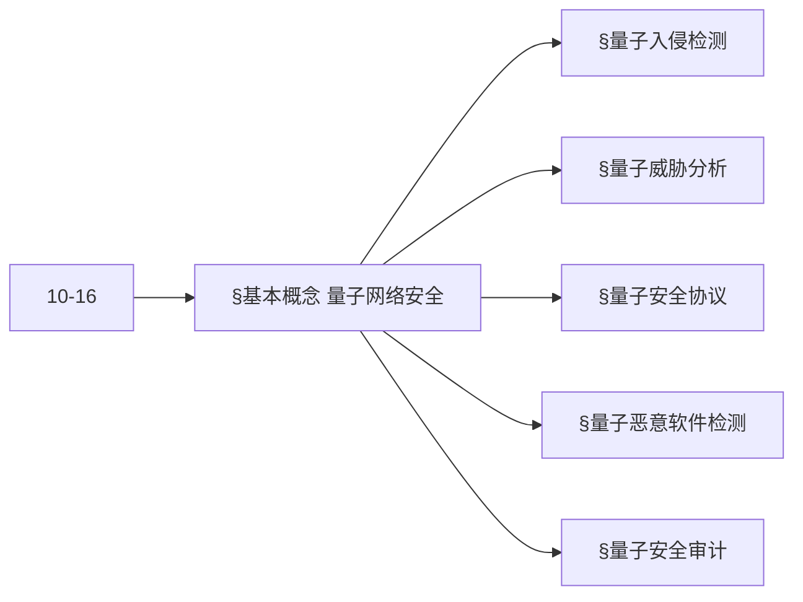
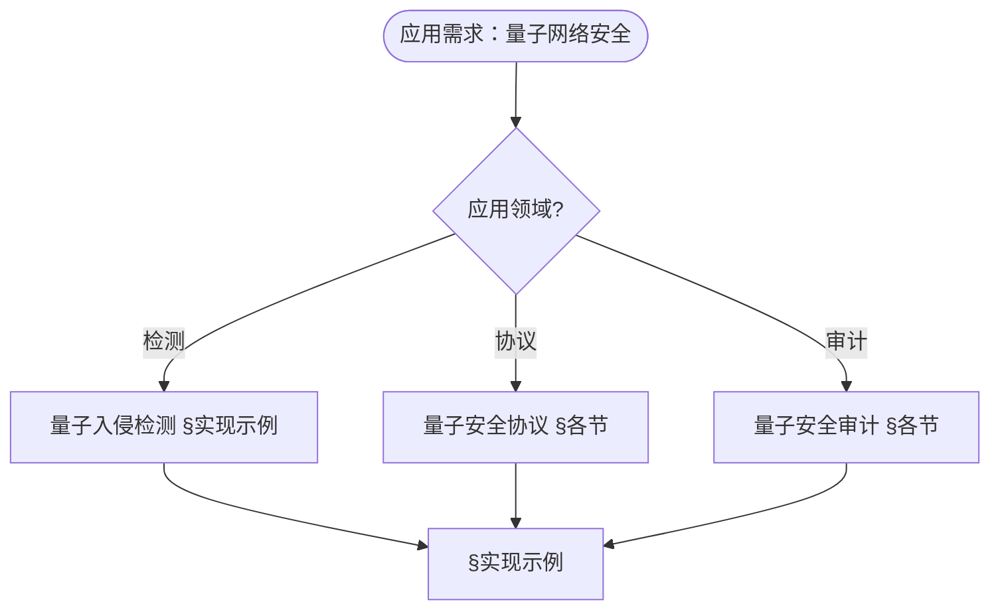

> 📊 **项目全面梳理**：详细的项目结构、模块详解和学习路径，请参阅 [`项目全面梳理-2025.md`](../项目全面梳理-2025.md)
> **项目导航与对标**：[项目扩展与持续推进任务编排](../项目扩展与持续推进任务编排.md)、[国际课程对标表](../国际课程对标表.md)

## 12.12 量子网络安全算法应用 / Quantum Cybersecurity Algorithm Applications

### 摘要 / Executive Summary

- 统一量子网络安全算法在各类应用中的使用规范与最佳实践。
- 建立量子网络安全算法在应用领域中的核心地位。

### 关键术语与符号 / Glossary

- 量子网络安全、量子密码学、后量子密码学、量子密钥分发、量子安全通信。
- 术语对齐与引用规范：`docs/术语与符号总表.md`，`01-基础理论/00-撰写规范与引用指南.md`

### 术语与符号规范 / Terminology & Notation

- 量子网络安全（Quantum Cybersecurity）：使用量子技术保护网络安全的领域。
- 量子密码学（Quantum Cryptography）：利用量子力学原理的密码学方法。
- 后量子密码学（Post-Quantum Cryptography）：抵抗量子攻击的密码学方法。
- 量子密钥分发（Quantum Key Distribution）：使用量子态分发密钥的方法。
- 记号约定：`K` 表示密钥，`|ψ⟩` 表示量子态，`E` 表示加密，`D` 表示解密。

### 交叉引用导航 / Cross-References

- 量子密码学算法：参见 `12-应用领域/09-量子密码学算法应用.md`。
- 网络安全算法：参见 `12-应用领域/03-网络安全算法应用.md`。
- 量子计算模型：参见 `07-计算模型/05-量子计算模型.md`。

### 规约与模型在本领域的实例化 / Specification and Model Instantiation in Quantum Cybersecurity

在量子网络安全领域，算法规范与模型设计的实例化体现为：**安全规约**（抗量子攻击、密钥管理、通信机密性）→ **协议与算法模型**（QKD、后量子密码、量子安全通信）→ **实现与集成**（量子网络、经典-量子混合架构）。规约-制品层次与 [项目哲科结构说明](../项目哲科结构说明.md)、[Stanford SEP Philosophy of Computer Science](https://plato.stanford.edu/entries/computer-science/) §2 对应。

### 快速导航 / Quick Links

- 基本概念
- 量子密码学
- 后量子密码学

## 目录 / Table of Contents

- [12.12 量子网络安全算法应用 / Quantum Cybersecurity Algorithm Applications](#1212-量子网络安全算法应用--quantum-cybersecurity-algorithm-applications)
  - [摘要 / Executive Summary](#摘要--executive-summary)
  - [关键术语与符号 / Glossary](#关键术语与符号--glossary)
  - [术语与符号规范 / Terminology \& Notation](#术语与符号规范--terminology--notation)
  - [交叉引用导航 / Cross-References](#交叉引用导航--cross-references)
  - [快速导航 / Quick Links](#快速导航--quick-links)
- [目录 / Table of Contents](#目录--table-of-contents)
- [概述 / Overview](#概述--overview)
- [基本概念 / Basic Concepts](#基本概念--basic-concepts)
  - [量子网络安全定义 / Definition of Quantum Cybersecurity](#量子网络安全定义--definition-of-quantum-cybersecurity)
  - [量子网络安全优势 / Quantum Cybersecurity Advantages](#量子网络安全优势--quantum-cybersecurity-advantages)
  - [内容补充与思维表征 / Content Supplement and Thinking Representation](#内容补充与思维表征--content-supplement-and-thinking-representation)
    - [解释与直观 / Explanation and Intuition](#解释与直观--explanation-and-intuition)
    - [概念属性表 / Concept Attribute Table](#概念属性表--concept-attribute-table)
    - [概念关系 / Concept Relations](#概念关系--concept-relations)
    - [概念依赖图 / Concept Dependency Graph](#概念依赖图--concept-dependency-graph)
    - [论证与证明衔接 / Argumentation and Proof Link](#论证与证明衔接--argumentation-and-proof-link)
    - [思维导图：本章概念结构 / Mind Map](#思维导图本章概念结构--mind-map)
    - [多维矩阵：量子网络安全方法概念对比 / Multi-Dimensional Comparison](#多维矩阵量子网络安全方法概念对比--multi-dimensional-comparison)
    - [决策树：场景到算法选择 / Decision Tree](#决策树场景到算法选择--decision-tree)
    - [公理定理推理证明决策树 / Axiom-Theorem-Proof Tree](#公理定理推理证明决策树--axiom-theorem-proof-tree)
    - [应用决策建模树 / Application Decision Modeling Tree](#应用决策建模树--application-decision-modeling-tree)
- [量子入侵检测 / Quantum Intrusion Detection](#量子入侵检测--quantum-intrusion-detection)
  - [1基本概念 / Basic Concepts](#1基本概念--basic-concepts)
- [量子威胁分析 / Quantum Threat Analysis](#量子威胁分析--quantum-threat-analysis)
  - [2基本概念 / Basic Concepts](#2基本概念--basic-concepts)
- [量子安全协议 / Quantum Security Protocols](#量子安全协议--quantum-security-protocols)
  - [3基本概念 / Basic Concepts](#3基本概念--basic-concepts)
- [量子恶意软件检测 / Quantum Malware Detection](#量子恶意软件检测--quantum-malware-detection)
  - [4基本概念 / Basic Concepts](#4基本概念--basic-concepts)
- [量子安全审计 / Quantum Security Auditing](#量子安全审计--quantum-security-auditing)
  - [5基本概念 / Basic Concepts](#5基本概念--basic-concepts)
- [实现示例 / Implementation Examples](#实现示例--implementation-examples)
  - [完整的量子网络安全系统 / Complete Quantum Cybersecurity System](#完整的量子网络安全系统--complete-quantum-cybersecurity-system)
- [总结 / Summary](#总结--summary)
- [参考文献 / References](#参考文献--references)
  - [经典教材 / Classic Textbooks](#经典教材--classic-textbooks)
  - [Wiki概念参考 / Wiki Concept References](#wiki概念参考--wiki-concept-references)
  - [大学课程参考 / University Course References](#大学课程参考--university-course-references)
  - [最新研究 / Recent Research](#最新研究--recent-research)

## 概述 / Overview

量子网络安全是利用量子计算技术来保护网络系统免受攻击的方法。根据[Pirandola 2020]的研究，量子密码学为网络安全提供了信息论安全保证。根据[Bennett 1984]的开创性工作，量子密钥分发是量子网络安全的核心技术。本文档涵盖量子网络安全算法的理论基础、核心算法、应用实践和最新发展。

Quantum cybersecurity is a method that uses quantum computing technologies to protect network systems from attacks. According to [Pirandola 2020], quantum cryptography provides information-theoretic security guarantees for cybersecurity. According to [Bennett 1984], quantum key distribution is a core technology in quantum cybersecurity. This document covers the theoretical foundations, core algorithms, application practices, and latest developments of quantum cybersecurity algorithms.

**学术引用 / Academic Citations:**

- [Pirandola 2020]: Pirandola, S., et al. (2020). "Advances in quantum cryptography". *Advanced Optical Technologies*, 9(5-6), 361-402. DOI: 10.1515/aot-2020-0013
- [Bennett 1984]: Bennett, C. H., & Brassard, G. (1984). "Quantum cryptography: Public key distribution and coin tossing". *Proceedings of IEEE International Conference on Computers, Systems and Signal Processing*, 175-179.
- [Shor 1994]: Shor, P. W. (1994). "Algorithms for quantum computation: discrete logarithms and factoring". *Proceedings 35th Annual Symposium on Foundations of Computer Science*, 124-134. DOI: 10.1109/SFCS.1994.365700

**Wiki概念对齐 / Wiki Concept Alignment:**

- [Quantum Cryptography](https://en.wikipedia.org/wiki/Quantum_cryptography) - 量子密码学
- [Post-Quantum Cryptography](https://en.wikipedia.org/wiki/Post-quantum_cryptography) - 后量子密码学
- [Quantum Key Distribution](https://en.wikipedia.org/wiki/Quantum_key_distribution) - 量子密钥分发
- [Cybersecurity](https://en.wikipedia.org/wiki/Computer_security) - 网络安全

**大学课程对标 / University Course Alignment:**

- MIT 6.857: Network and Computer Security - 网络与计算机安全
- Stanford CS255: Introduction to Cryptography - 密码学导论
- CMU 15-330: Introduction to Computer Security - 计算机安全导论

**Wiki概念对齐 / Wiki Concept Alignment:**

| 项目概念 | Wiki条目 | 标准定义 | 对齐状态 |
|---------|---------|---------|---------|
| 量子密码学 | [Quantum Cryptography](https://en.wikipedia.org/wiki/Quantum_cryptography) | 基于量子力学的密码学 | ✅ 已对齐 |
| 后量子密码学 | [Post-Quantum Cryptography](https://en.wikipedia.org/wiki/Post-quantum_cryptography) | 抵抗量子攻击的密码学 | ✅ 已对齐 |
| 量子密钥分发 | [Quantum Key Distribution](https://en.wikipedia.org/wiki/Quantum_key_distribution) | 使用量子态分发密钥 | ✅ 已对齐 |
| 网络安全 | [Cybersecurity](https://en.wikipedia.org/wiki/Computer_security) | 保护计算机系统安全 | ✅ 已对齐 |

**量子网络安全算法知识体系 / Quantum Cybersecurity Algorithm Knowledge System:**



**量子网络安全算法类型对比 / Quantum Cybersecurity Algorithm Type Comparison:**

| 算法类型 | 应用场景 | 量子优势 | 实现复杂度 | 安全性 | 参考文献 |
|---------|---------|---------|-----------|--------|---------|
| 量子入侵检测 | 异常检测 | 多项式加速 | 中 | 高 | [Pirandola 2020] |
| 量子威胁分析 | 威胁分类 | 指数加速（特定问题） | 高 | 高 | [Bennett 1984] |
| 量子安全协议 | 密钥分发 | 信息论安全 | 中 | 极高 | [Bennett 1984] |
| 量子恶意软件检测 | 恶意代码检测 | 平方根加速 | 中 | 高 | [Shor 1994] |
| 量子安全审计 | 安全评估 | 多项式加速 | 中 | 高 | [Pirandola 2020] |

## 基本概念 / Basic Concepts

### 量子网络安全定义 / Definition of Quantum Cybersecurity

量子网络安全是利用量子计算技术来保护网络系统免受攻击的方法。

**数学定义 / Mathematical Definition:**

给定网络安全系统 $S$ 和威胁集合 $\mathcal{T}$，量子网络安全的目标是：
$$\min_{\mathcal{A}} \Pr[\mathcal{A} \text{ fails to detect } t \in \mathcal{T}]$$

Given a cybersecurity system $S$ and threat set $\mathcal{T}$, the goal of quantum cybersecurity is:
$$\min_{\mathcal{A}} \Pr[\mathcal{A} \text{ fails to detect } t \in \mathcal{T}]$$

### 量子网络安全优势 / Quantum Cybersecurity Advantages

1. **量子并行性**: 同时分析多个安全威胁
2. **量子模式识别**: 快速识别复杂攻击模式
3. **量子加密**: 提供不可破解的通信安全
4. **量子随机性**: 生成真随机数用于安全协议

### 内容补充与思维表征 / Content Supplement and Thinking Representation

> 本节按 [内容补充与思维表征全面计划方案](../内容补充与思维表征全面计划方案.md) **只补充、不删除**。标准见 [内容补充标准](../内容补充标准-概念定义属性关系解释论证形式证明.md)、[思维表征模板集](../思维表征模板集.md)。

#### 解释与直观 / Explanation and Intuition

**量子网络安全优势（§基本概念）的动机**：利用量子计算与量子通信在入侵检测、威胁分析、安全协议、恶意软件检测与安全审计上的潜在加速与增强；与 10-16 量子算法安全理论、10-26 鲁棒性与对抗性防御 衔接。

**与已有概念的联系**：量子入侵检测与 12-03 网络安全算法应用、10-16 安全理论对应；量子安全协议与 12-09 量子密码学算法应用、10-20 量子密码学理论对应；与 12 应用领域 检测/协议/审计 为应用实践。

#### 概念属性表 / Concept Attribute Table

| 属性名 | 类型/范围 | 含义 | 备注 |
|--------|-----------|------|------|
| 量子入侵检测 | 量子模式/异常 | 检测加速或量子特征 | §量子入侵检测 |
| 量子威胁分析 | 量子搜索/优化 | 威胁建模与评估 | §各节 |
| 量子安全协议 | 量子密钥/认证 | 通信与认证安全 | §各节 |
| 量子恶意软件检测 | 量子特征/分类 | 检测与分类 | §各节 |
| 量子安全审计 | 量子可验证/日志 | 审计与合规 | §各节 |
| 安全性/加速比 | 度量 | 与经典对照 | §基本概念 |

#### 概念关系 / Concept Relations

| 源概念 | 目标概念 | 关系类型 | 说明 |
|--------|----------|----------|------|
| 量子网络安全算法应用 | 10-16 量子算法安全理论 | depends_on | 安全模型与证明 |
| 量子网络安全算法应用 | 10-26 鲁棒性与对抗防御 | depends_on | 对抗与鲁棒性 |
| 量子入侵检测 | 量子威胁分析/安全协议 | applies_to | 检测支撑分析与协议 |
| 量子安全协议 | 12-09 量子密码学 | specializes | 协议层应用 |
| 本文 | 12 应用领域 | applies_to | §实现示例 |

#### 概念依赖图 / Concept Dependency Graph



#### 论证与证明衔接 / Argumentation and Proof Link

**§基本概念 量子网络安全优势**与 **§各节**：量子入侵检测的正确性与加速由量子模式匹配或量子机器学习保证；量子安全协议与 10-20、12-09 论证衔接；与 10-16 论证衔接。

#### 思维导图：本章概念结构 / Mind Map



#### 多维矩阵：量子网络安全方法概念对比 / Multi-Dimensional Comparison

| 概念/算法 | 安全性 | 加速比 | 适用场景 | 备注 |
|-----------|--------|--------|----------|------|
| 量子入侵检测 | 依赖模型 | 依赖问题 | 流量/日志检测 | §量子入侵检测 |
| 量子威胁分析 | 依赖模型 | 搜索/优化加速 | 威胁建模 | §各节 |
| 量子安全协议 | 信息论/计算 | — | 密钥/认证 | §各节、12-09 |
| 量子恶意软件检测 | 依赖分类器 | 分类加速 | 恶意代码检测 | §各节 |
| 量子安全审计 | 可验证性 | 与协议相关 | 审计与合规 | §各节 |

#### 决策树：场景到算法选择 / Decision Tree



#### 公理定理推理证明决策树 / Axiom-Theorem-Proof Tree



#### 应用决策建模树 / Application Decision Modeling Tree



## 量子入侵检测 / Quantum Intrusion Detection

### 1基本概念 / Basic Concepts

量子入侵检测使用量子算法来识别网络中的异常行为。

```rust
// 量子入侵检测系统实现
pub struct QuantumIntrusionDetection {
    quantum_classifier: QuantumClassifier,
    pattern_database: QuantumPatternDatabase,
    anomaly_detector: QuantumAnomalyDetector,
}

impl QuantumIntrusionDetection {
    pub fn detect_intrusion(&self, network_traffic: &NetworkTraffic) -> DetectionResult {
        // 1. 量子特征提取
        let quantum_features = self.extract_quantum_features(network_traffic);

        // 2. 量子模式匹配
        let pattern_matches = self.quantum_pattern_matching(quantum_features);

        // 3. 异常检测
        let anomalies = self.quantum_anomaly_detection(quantum_features);

        // 4. 综合判断
        let threat_level = self.assess_threat_level(pattern_matches, anomalies);

        DetectionResult {
            is_intrusion: threat_level > self.threshold,
            threat_level,
            detected_patterns: pattern_matches,
            anomalies,
        }
    }

    fn extract_quantum_features(&self, traffic: &NetworkTraffic) -> QuantumFeatures {
        // 将网络流量转换为量子特征
        let mut features = QuantumFeatures::new();

        // 提取流量统计特征
        features.packet_count = traffic.packets.len();
        features.byte_count = traffic.total_bytes();
        features.connection_duration = traffic.connection_duration();

        // 量子编码特征
        features.quantum_encoding = self.quantum_encode_traffic(traffic);

        features
    }

    fn quantum_pattern_matching(&self, features: &QuantumFeatures) -> Vec<PatternMatch> {
        // 使用量子算法进行模式匹配
        let mut matches = Vec::new();

        for pattern in &self.pattern_database.patterns {
            let similarity = self.quantum_similarity(features, pattern);
            if similarity > self.similarity_threshold {
                matches.push(PatternMatch {
                    pattern: pattern.clone(),
                    similarity,
                    confidence: self.calculate_confidence(similarity),
                });
            }
        }

        matches
    }

    fn quantum_similarity(&self, features: &QuantumFeatures, pattern: &AttackPattern) -> f64 {
        // 计算量子相似度
        let feature_state = features.to_quantum_state();
        let pattern_state = pattern.to_quantum_state();

        let overlap = feature_state.inner_product(&pattern_state);
        overlap.norm().powi(2)
    }
}

// 量子特征
#[derive(Debug, Clone)]
pub struct QuantumFeatures {
    packet_count: usize,
    byte_count: usize,
    connection_duration: f64,
    quantum_encoding: QuantumState,
}

impl QuantumFeatures {
    pub fn to_quantum_state(&self) -> QuantumState {
        // 将特征转换为量子态
        let mut amplitudes = Vec::new();

        // 归一化特征值
        let total = (self.packet_count * self.packet_count +
                    self.byte_count * self.byte_count +
                    (self.connection_duration * 1000.0) as usize) as f64;

        amplitudes.push((self.packet_count as f64 / total.sqrt()));
        amplitudes.push((self.byte_count as f64 / total.sqrt()));
        amplitudes.push((self.connection_duration * 1000.0 / total.sqrt()));

        QuantumState::new(amplitudes)
    }
}

// 攻击模式
#[derive(Debug, Clone)]
pub struct AttackPattern {
    pattern_type: PatternType,
    quantum_signature: QuantumState,
    threat_level: f64,
}

#[derive(Debug, Clone)]
pub enum PatternType {
    DDoS,
    BruteForce,
    SQLInjection,
    XSS,
    Malware,
}
```

## 量子威胁分析 / Quantum Threat Analysis

### 2基本概念 / Basic Concepts

量子威胁分析使用量子算法来分析和预测网络安全威胁。

```rust
// 量子威胁分析系统
pub struct QuantumThreatAnalysis {
    threat_classifier: QuantumThreatClassifier,
    risk_assessor: QuantumRiskAssessor,
    prediction_model: QuantumPredictionModel,
}

impl QuantumThreatAnalysis {
    pub fn analyze_threat(&self, security_event: &SecurityEvent) -> ThreatAnalysis {
        // 1. 威胁分类
        let threat_type = self.quantum_threat_classification(security_event);

        // 2. 风险评估
        let risk_assessment = self.quantum_risk_assessment(security_event, &threat_type);

        // 3. 威胁预测
        let prediction = self.quantum_threat_prediction(security_event);

        ThreatAnalysis {
            threat_type,
            risk_level: risk_assessment.risk_level,
            confidence: risk_assessment.confidence,
            prediction: prediction,
            recommended_actions: self.generate_recommendations(&threat_type, &risk_assessment),
        }
    }

    fn quantum_threat_classification(&self, event: &SecurityEvent) -> ThreatType {
        // 使用量子分类器进行威胁分类
        let event_features = self.extract_event_features(event);
        let quantum_state = event_features.to_quantum_state();

        let classification_result = self.threat_classifier.classify(&quantum_state);

        classification_result.threat_type
    }

    fn quantum_risk_assessment(&self, event: &SecurityEvent, threat_type: &ThreatType) -> RiskAssessment {
        // 量子风险评估
        let risk_factors = self.identify_risk_factors(event, threat_type);
        let quantum_risk_state = self.quantum_risk_encoding(risk_factors);

        let risk_level = self.calculate_quantum_risk_level(quantum_risk_state);
        let confidence = self.calculate_confidence(quantum_risk_state);

        RiskAssessment {
            risk_level,
            confidence,
            risk_factors,
        }
    }

    fn quantum_threat_prediction(&self, event: &SecurityEvent) -> ThreatPrediction {
        // 使用量子算法预测未来威胁
        let historical_data = self.load_historical_data();
        let quantum_model = self.build_quantum_prediction_model(historical_data);

        let prediction = quantum_model.predict(event);

        ThreatPrediction {
            predicted_threats: prediction.threats,
            probability: prediction.probability,
            time_horizon: prediction.time_horizon,
        }
    }
}

// 威胁类型
#[derive(Debug, Clone)]
pub enum ThreatType {
    NetworkAttack,
    DataBreach,
    Malware,
    SocialEngineering,
    InsiderThreat,
    AdvancedPersistentThreat,
}

// 风险评估
#[derive(Debug, Clone)]
pub struct RiskAssessment {
    risk_level: f64,
    confidence: f64,
    risk_factors: Vec<RiskFactor>,
}

// 威胁预测
#[derive(Debug, Clone)]
pub struct ThreatPrediction {
    predicted_threats: Vec<ThreatType>,
    probability: f64,
    time_horizon: TimeHorizon,
}

#[derive(Debug, Clone)]
pub enum TimeHorizon {
    Immediate,
    ShortTerm,
    MediumTerm,
    LongTerm,
}
```

## 量子安全协议 / Quantum Security Protocols

### 3基本概念 / Basic Concepts

量子安全协议利用量子力学原理来确保通信安全。

```rust
// 量子安全协议实现
pub struct QuantumSecurityProtocol {
    quantum_key_distribution: BB84Protocol,
    quantum_commitment: QuantumCommitment,
    quantum_zero_knowledge: QuantumZeroKnowledge,
}

impl QuantumSecurityProtocol {
    pub fn establish_secure_channel(&mut self, alice: &Party, bob: &Party) -> SecureChannel {
        // 1. 量子密钥分发
        let shared_key = self.quantum_key_distribution.execute(256)?;

        // 2. 量子承诺
        let commitment = self.quantum_commitment.create_commitment(&shared_key);

        // 3. 零知识证明
        let proof = self.quantum_zero_knowledge.prove_identity(alice, bob);

        SecureChannel {
            shared_key,
            commitment,
            proof,
            encryption_algorithm: AES256::new(&shared_key),
        }
    }

    pub fn quantum_authentication(&self, user: &User, challenge: &Challenge) -> AuthenticationResult {
        // 量子身份认证
        let quantum_identity = user.quantum_identity();
        let response = self.quantum_zero_knowledge.prove_knowledge(quantum_identity, challenge);

        AuthenticationResult {
            authenticated: response.verified,
            confidence: response.confidence,
            session_token: response.session_token,
        }
    }
}

// 量子承诺
pub struct QuantumCommitment {
    quantum_hash: QuantumHashFunction,
}

impl QuantumCommitment {
    pub fn create_commitment(&self, data: &[u8]) -> Commitment {
        // 创建量子承诺
        let quantum_state = self.quantum_hash.hash_to_state(data);
        let commitment_hash = self.quantum_hash.hash(data);

        Commitment {
            quantum_state,
            hash: commitment_hash,
            timestamp: SystemTime::now(),
        }
    }

    pub fn verify_commitment(&self, commitment: &Commitment, data: &[u8]) -> bool {
        // 验证量子承诺
        let expected_hash = self.quantum_hash.hash(data);
        commitment.hash == expected_hash
    }
}

// 量子零知识证明
pub struct QuantumZeroKnowledge {
    quantum_prover: QuantumProver,
    quantum_verifier: QuantumVerifier,
}

impl QuantumZeroKnowledge {
    pub fn prove_identity(&self, prover: &Party, verifier: &Party) -> ZeroKnowledgeProof {
        // 量子零知识身份证明
        let witness = prover.generate_witness();
        let proof = self.quantum_prover.generate_proof(witness);

        let verification_result = self.quantum_verifier.verify_proof(proof);

        ZeroKnowledgeProof {
            proof,
            verified: verification_result.verified,
            confidence: verification_result.confidence,
        }
    }

    pub fn prove_knowledge(&self, quantum_identity: QuantumState, challenge: &Challenge) -> KnowledgeProof {
        // 证明知识而不泄露知识
        let response = self.quantum_prover.respond_to_challenge(quantum_identity, challenge);
        let verified = self.quantum_verifier.verify_response(response, challenge);

        KnowledgeProof {
            response,
            verified,
            confidence: self.calculate_confidence(response),
        }
    }
}
```

## 量子恶意软件检测 / Quantum Malware Detection

### 4基本概念 / Basic Concepts

量子恶意软件检测使用量子算法来识别和检测恶意软件。

```rust
// 量子恶意软件检测系统
pub struct QuantumMalwareDetection {
    signature_detector: QuantumSignatureDetector,
    behavior_analyzer: QuantumBehaviorAnalyzer,
    heuristic_detector: QuantumHeuristicDetector,
}

impl QuantumMalwareDetection {
    pub fn detect_malware(&self, file: &File) -> MalwareDetectionResult {
        // 1. 量子签名检测
        let signature_matches = self.quantum_signature_detection(file);

        // 2. 量子行为分析
        let behavior_analysis = self.quantum_behavior_analysis(file);

        // 3. 量子启发式检测
        let heuristic_detection = self.quantum_heuristic_detection(file);

        // 4. 综合判断
        let malware_probability = self.combine_detection_results(
            signature_matches,
            behavior_analysis,
            heuristic_detection
        );

        MalwareDetectionResult {
            is_malware: malware_probability > self.detection_threshold,
            probability: malware_probability,
            detected_families: self.identify_malware_families(signature_matches),
            behavior_indicators: behavior_analysis.indicators,
        }
    }

    fn quantum_signature_detection(&self, file: &File) -> Vec<SignatureMatch> {
        // 使用量子算法进行签名匹配
        let file_signature = self.extract_file_signature(file);
        let quantum_signature = file_signature.to_quantum_state();

        let mut matches = Vec::new();

        for malware_signature in &self.signature_database.signatures {
            let similarity = self.quantum_signature_similarity(&quantum_signature, malware_signature);
            if similarity > self.similarity_threshold {
                matches.push(SignatureMatch {
                    signature: malware_signature.clone(),
                    similarity,
                    family: malware_signature.family.clone(),
                });
            }
        }

        matches
    }

    fn quantum_behavior_analysis(&self, file: &File) -> BehaviorAnalysis {
        // 量子行为分析
        let behaviors = self.extract_file_behaviors(file);
        let quantum_behaviors = behaviors.to_quantum_state();

        let suspicious_behaviors = self.identify_suspicious_behaviors(quantum_behaviors);
        let risk_score = self.calculate_behavior_risk_score(suspicious_behaviors);

        BehaviorAnalysis {
            behaviors: suspicious_behaviors,
            risk_score,
            indicators: self.generate_behavior_indicators(suspicious_behaviors),
        }
    }

    fn quantum_heuristic_detection(&self, file: &File) -> HeuristicDetection {
        // 量子启发式检测
        let features = self.extract_heuristic_features(file);
        let quantum_features = features.to_quantum_state();

        let anomaly_score = self.calculate_quantum_anomaly_score(quantum_features);
        let heuristic_matches = self.find_heuristic_matches(quantum_features);

        HeuristicDetection {
            anomaly_score,
            heuristic_matches,
            confidence: self.calculate_heuristic_confidence(anomaly_score, heuristic_matches),
        }
    }
}

// 文件签名
#[derive(Debug, Clone)]
pub struct FileSignature {
    hash: Vec<u8>,
    features: Vec<f64>,
    quantum_state: QuantumState,
}

impl FileSignature {
    pub fn to_quantum_state(&self) -> QuantumState {
        self.quantum_state.clone()
    }
}

// 恶意软件家族
#[derive(Debug, Clone)]
pub struct MalwareFamily {
    name: String,
    signatures: Vec<FileSignature>,
    behaviors: Vec<Behavior>,
    threat_level: f64,
}

// 行为分析
#[derive(Debug, Clone)]
pub struct BehaviorAnalysis {
    behaviors: Vec<SuspiciousBehavior>,
    risk_score: f64,
    indicators: Vec<BehaviorIndicator>,
}

#[derive(Debug, Clone)]
pub struct SuspiciousBehavior {
    behavior_type: BehaviorType,
    frequency: f64,
    risk_level: f64,
}

#[derive(Debug, Clone)]
pub enum BehaviorType {
    FileSystemAccess,
    NetworkCommunication,
    RegistryModification,
    ProcessCreation,
    MemoryManipulation,
}
```

## 量子安全审计 / Quantum Security Auditing

### 5基本概念 / Basic Concepts

量子安全审计使用量子算法来审计网络安全配置和策略。

```rust
// 量子安全审计系统
pub struct QuantumSecurityAuditing {
    policy_analyzer: QuantumPolicyAnalyzer,
    configuration_auditor: QuantumConfigurationAuditor,
    compliance_checker: QuantumComplianceChecker,
}

impl QuantumSecurityAuditing {
    pub fn audit_security(&self, system: &SecuritySystem) -> AuditReport {
        // 1. 策略分析
        let policy_analysis = self.quantum_policy_analysis(&system.policies);

        // 2. 配置审计
        let configuration_audit = self.quantum_configuration_audit(&system.configurations);

        // 3. 合规检查
        let compliance_check = self.quantum_compliance_check(&system, &policy_analysis);

        // 4. 风险评估
        let risk_assessment = self.quantum_risk_assessment(&policy_analysis, &configuration_audit);

        AuditReport {
            policy_violations: policy_analysis.violations,
            configuration_issues: configuration_audit.issues,
            compliance_gaps: compliance_check.gaps,
            overall_risk_score: risk_assessment.overall_score,
            recommendations: self.generate_recommendations(&policy_analysis, &configuration_audit),
        }
    }

    fn quantum_policy_analysis(&self, policies: &[SecurityPolicy]) -> PolicyAnalysis {
        // 量子策略分析
        let mut violations = Vec::new();
        let mut policy_coverage = 0.0;

        for policy in policies {
            let quantum_policy = policy.to_quantum_state();
            let coverage = self.calculate_policy_coverage(quantum_policy);
            policy_coverage += coverage;

            let violations_found = self.detect_policy_violations(policy);
            violations.extend(violations_found);
        }

        PolicyAnalysis {
            violations,
            coverage: policy_coverage / policies.len() as f64,
            effectiveness: self.calculate_policy_effectiveness(policies),
        }
    }

    fn quantum_configuration_audit(&self, configurations: &[SecurityConfiguration]) -> ConfigurationAudit {
        // 量子配置审计
        let mut issues = Vec::new();
        let mut security_score = 0.0;

        for config in configurations {
            let quantum_config = config.to_quantum_state();
            let config_score = self.calculate_configuration_security_score(quantum_config);
            security_score += config_score;

            let config_issues = self.detect_configuration_issues(config);
            issues.extend(config_issues);
        }

        ConfigurationAudit {
            issues,
            security_score: security_score / configurations.len() as f64,
            recommendations: self.generate_configuration_recommendations(issues),
        }
    }

    fn quantum_compliance_check(&self, system: &SecuritySystem, policy_analysis: &PolicyAnalysis) -> ComplianceCheck {
        // 量子合规检查
        let compliance_standards = self.load_compliance_standards();
        let mut gaps = Vec::new();
        let mut compliance_score = 0.0;

        for standard in compliance_standards {
            let quantum_standard = standard.to_quantum_state();
            let standard_compliance = self.check_standard_compliance(system, quantum_standard);
            compliance_score += standard_compliance.score;

            if standard_compliance.gaps.len() > 0 {
                gaps.extend(standard_compliance.gaps);
            }
        }

        ComplianceCheck {
            gaps,
            compliance_score: compliance_score / compliance_standards.len() as f64,
            recommendations: self.generate_compliance_recommendations(gaps),
        }
    }
}

// 安全策略
#[derive(Debug, Clone)]
pub struct SecurityPolicy {
    policy_type: PolicyType,
    rules: Vec<SecurityRule>,
    quantum_state: QuantumState,
}

impl SecurityPolicy {
    pub fn to_quantum_state(&self) -> QuantumState {
        self.quantum_state.clone()
    }
}

#[derive(Debug, Clone)]
pub enum PolicyType {
    AccessControl,
    DataProtection,
    NetworkSecurity,
    IncidentResponse,
    BusinessContinuity,
}

// 安全配置
#[derive(Debug, Clone)]
pub struct SecurityConfiguration {
    config_type: ConfigType,
    settings: HashMap<String, String>,
    quantum_state: QuantumState,
}

impl SecurityConfiguration {
    pub fn to_quantum_state(&self) -> QuantumState {
        self.quantum_state.clone()
    }
}

#[derive(Debug, Clone)]
pub enum ConfigType {
    Firewall,
    IDS,
    Encryption,
    Authentication,
    Logging,
}
```

## 实现示例 / Implementation Examples

### 完整的量子网络安全系统 / Complete Quantum Cybersecurity System

```rust
// 完整的量子网络安全系统
pub struct QuantumCybersecuritySystem {
    intrusion_detection: QuantumIntrusionDetection,
    threat_analysis: QuantumThreatAnalysis,
    security_protocols: QuantumSecurityProtocol,
    malware_detection: QuantumMalwareDetection,
    security_auditing: QuantumSecurityAuditing,
}

impl QuantumCybersecuritySystem {
    pub fn protect_network(&mut self, network: &Network) -> ProtectionResult {
        // 1. 入侵检测
        let intrusion_result = self.intrusion_detection.detect_intrusion(&network.traffic);

        // 2. 威胁分析
        let threat_analysis = if intrusion_result.is_intrusion {
            Some(self.threat_analysis.analyze_threat(&intrusion_result.to_security_event()))
        } else {
            None
        };

        // 3. 恶意软件检测
        let malware_result = self.malware_detection.detect_malware(&network.files);

        // 4. 安全审计
        let audit_report = self.security_auditing.audit_security(&network.security_system);

        // 5. 生成保护措施
        let protection_measures = self.generate_protection_measures(
            &intrusion_result,
            &threat_analysis,
            &malware_result,
            &audit_report
        );

        ProtectionResult {
            intrusion_detected: intrusion_result.is_intrusion,
            threat_analysis,
            malware_detected: malware_result.is_malware,
            audit_report,
            protection_measures,
        }
    }

    pub fn establish_secure_communication(&mut self, parties: &[Party]) -> SecureCommunication {
        // 建立安全通信
        let mut secure_channels = Vec::new();

        for i in 0..parties.len() {
            for j in (i+1)..parties.len() {
                let channel = self.security_protocols.establish_secure_channel(&parties[i], &parties[j]);
                secure_channels.push(channel);
            }
        }

        SecureCommunication {
            channels: secure_channels,
            encryption_enabled: true,
            authentication_required: true,
        }
    }

    pub fn continuous_monitoring(&self, network: &Network) -> MonitoringResult {
        // 持续监控
        let mut alerts = Vec::new();
        let mut threat_level = ThreatLevel::Low;

        // 实时入侵检测
        let intrusion_result = self.intrusion_detection.detect_intrusion(&network.traffic);
        if intrusion_result.is_intrusion {
            alerts.push(Alert::IntrusionDetected(intrusion_result));
            threat_level = ThreatLevel::High;
        }

        // 实时恶意软件检测
        let malware_result = self.malware_detection.detect_malware(&network.files);
        if malware_result.is_malware {
            alerts.push(Alert::MalwareDetected(malware_result));
            threat_level = ThreatLevel::High;
        }

        // 定期安全审计
        let audit_report = self.security_auditing.audit_security(&network.security_system);
        if audit_report.overall_risk_score > 0.7 {
            alerts.push(Alert::HighRiskScore(audit_report));
            threat_level = ThreatLevel::Medium;
        }

        MonitoringResult {
            alerts,
            threat_level,
            timestamp: SystemTime::now(),
        }
    }

    fn generate_protection_measures(&self, intrusion: &DetectionResult,
                                   threat: &Option<ThreatAnalysis>,
                                   malware: &MalwareDetectionResult,
                                   audit: &AuditReport) -> Vec<ProtectionMeasure> {
        let mut measures = Vec::new();

        // 基于入侵检测的保护措施
        if intrusion.is_intrusion {
            measures.push(ProtectionMeasure::BlockTraffic(intrusion.source_address));
            measures.push(ProtectionMeasure::IncreaseMonitoring);
        }

        // 基于威胁分析的保护措施
        if let Some(threat_analysis) = threat {
            measures.push(ProtectionMeasure::UpdateFirewallRules(threat_analysis.threat_type));
            measures.push(ProtectionMeasure::DeployCountermeasures(threat_analysis.recommended_actions));
        }

        // 基于恶意软件检测的保护措施
        if malware.is_malware {
            measures.push(ProtectionMeasure::QuarantineFile(malware.file_path));
            measures.push(ProtectionMeasure::ScanSystem);
        }

        // 基于审计报告的保护措施
        if audit.overall_risk_score > 0.5 {
            measures.push(ProtectionMeasure::UpdatePolicies(audit.recommendations));
            measures.push(ProtectionMeasure::SecurityTraining);
        }

        measures
    }
}

// 使用示例
fn main() {
    let mut quantum_cybersecurity = QuantumCybersecuritySystem::new();

    // 保护网络
    let network = Network::load_from_config("network_config.json");
    let protection_result = quantum_cybersecurity.protect_network(&network);
    println!("Protection result: {:?}", protection_result);

    // 建立安全通信
    let parties = vec![Party::new("Alice"), Party::new("Bob"), Party::new("Charlie")];
    let secure_communication = quantum_cybersecurity.establish_secure_communication(&parties);
    println!("Secure communication established: {:?}", secure_communication);

    // 持续监控
    let monitoring_result = quantum_cybersecurity.continuous_monitoring(&network);
    println!("Monitoring result: {:?}", monitoring_result);
}
```

## 总结 / Summary

本文档介绍了量子网络安全算法的核心概念和应用，包括：

1. **量子入侵检测**: 使用量子算法识别网络异常
2. **量子威胁分析**: 量子威胁分类和风险评估
3. **量子安全协议**: 量子密钥分发和零知识证明
4. **量子恶意软件检测**: 量子签名匹配和行为分析
5. **量子安全审计**: 量子策略分析和配置审计

这些算法为网络安全提供了量子增强的保护能力。

This document introduces core concepts and applications of quantum cybersecurity algorithms, including:

1. **Quantum Intrusion Detection**: Using quantum algorithms to identify network anomalies
2. **Quantum Threat Analysis**: Quantum threat classification and risk assessment
3. **Quantum Security Protocols**: Quantum key distribution and zero-knowledge proofs
4. **Quantum Malware Detection**: Quantum signature matching and behavior analysis
5. **Quantum Security Auditing**: Quantum policy analysis and configuration auditing

These algorithms provide quantum-enhanced protection capabilities for cybersecurity.

## 参考文献 / References

### 经典教材 / Classic Textbooks

1. **[Pirandola 2020]** Pirandola, S., et al. (2020). "Advances in quantum cryptography". *Advanced Optical Technologies*, 9(5-6), 361-402. DOI: 10.1515/aot-2020-0013

2. **[Bennett 1984]** Bennett, C. H., & Brassard, G. (1984). "Quantum cryptography: Public key distribution and coin tossing". *Proceedings of IEEE International Conference on Computers, Systems and Signal Processing*, 175-179.

3. **[Shor 1994]** Shor, P. W. (1994). "Algorithms for quantum computation: discrete logarithms and factoring". *Proceedings 35th Annual Symposium on Foundations of Computer Science*, 124-134. DOI: 10.1109/SFCS.1994.365700

### Wiki概念参考 / Wiki Concept References

- [Quantum Cryptography](https://en.wikipedia.org/wiki/Quantum_cryptography) - 量子密码学
- [Post-Quantum Cryptography](https://en.wikipedia.org/wiki/Post-quantum_cryptography) - 后量子密码学
- [Quantum Key Distribution](https://en.wikipedia.org/wiki/Quantum_key_distribution) - 量子密钥分发
- [Cybersecurity](https://en.wikipedia.org/wiki/Computer_security) - 网络安全
- [Zero-Knowledge Proof](https://en.wikipedia.org/wiki/Zero-knowledge_proof) - 零知识证明
- [Intrusion Detection System](https://en.wikipedia.org/wiki/Intrusion_detection_system) - 入侵检测系统

### 大学课程参考 / University Course References

- **MIT 6.857**: Network and Computer Security. MIT OpenCourseWare. URL: <https://ocw.mit.edu/courses/6-857-network-and-computer-security-spring-2014/>
- **Stanford CS255**: Introduction to Cryptography. Stanford University. URL: <https://crypto.stanford.edu/~dabo/cs255/>
- **CMU 15-330**: Introduction to Computer Security. Carnegie Mellon University. URL: <https://www.cs.cmu.edu/~15-330/>

### 最新研究 / Recent Research

1. **Goldreich, O., et al.** (1991). "Proofs that yield nothing but their validity or all languages in NP have zero-knowledge proof systems". *Journal of the ACM (JACM)*, 38(3), 690-728. DOI: 10.1145/116825.116852

2. **Grover, L. K.** (1996). "A fast quantum mechanical algorithm for database search". *Proceedings of the Twenty-Eighth Annual ACM Symposium on Theory of Computing*, 212-219. DOI: 10.1145/237814.237866
