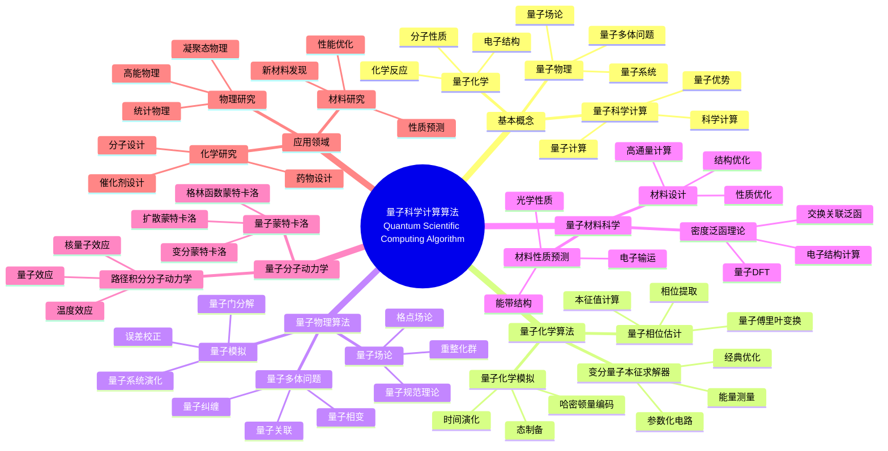

> 📊 **项目全面梳理**：详细的项目结构、模块详解和学习路径，请参阅 [`项目全面梳理-2025.md`](../项目全面梳理-2025.md)

## 12.13 量子科学计算算法应用 / Quantum Scientific Computing Algorithm Applications

### 摘要 / Executive Summary

- 统一量子科学计算算法在各类应用中的使用规范与最佳实践。
- 建立量子科学计算算法在应用领域中的核心地位。

### 关键术语与符号 / Glossary

- 量子科学计算、量子化学、量子物理、量子材料科学、量子模拟、量子优势。
- 术语对齐与引用规范：`docs/术语与符号总表.md`，`01-基础理论/00-撰写规范与引用指南.md`

### 术语与符号规范 / Terminology & Notation

- 量子科学计算（Quantum Scientific Computing）：使用量子计算进行科学计算的方法。
- 量子化学（Quantum Chemistry）：使用量子计算研究化学问题的方法。
- 量子物理（Quantum Physics）：使用量子计算研究物理问题的方法。
- 量子模拟（Quantum Simulation）：使用量子系统模拟其他量子系统的方法。
- 记号约定：`H` 表示哈密顿量，`|ψ⟩` 表示量子态，`U` 表示量子门，`E` 表示能量。

### 交叉引用导航 / Cross-References

- 量子算法：参见 `09-算法理论/01-算法基础/15-量子算法理论.md`。
- 量子计算模型：参见 `07-计算模型/05-量子计算模型.md`。
- 材料科学算法：参见 `12-应用领域/14-量子材料科学算法应用.md`。

### 快速导航 / Quick Links

- 基本概念
- 量子化学
- 量子模拟

## 目录 / Table of Contents

- [12.13 量子科学计算算法应用 / Quantum Scientific Computing Algorithm Applications](#1213-量子科学计算算法应用--quantum-scientific-computing-algorithm-applications)

1. [基本概念 / Basic Concepts](#基本概念--basic-concepts)
2. [量子化学算法 / Quantum Chemistry Algorithms](#量子化学算法--quantum-chemistry-algorithms)
3. [量子物理算法 / Quantum Physics Algorithms](#量子物理算法--quantum-physics-algorithms)
4. [量子材料科学算法 / Quantum Materials Science Algorithms](#量子材料科学算法--quantum-materials-science-algorithms)
5. [量子分子动力学算法 / Quantum Molecular Dynamics Algorithms](#量子分子动力学算法--quantum-molecular-dynamics-algorithms)
6. [量子蒙特卡洛科学应用 / Quantum Monte Carlo in Scientific Computing](#量子蒙特卡洛科学应用--quantum-monte-carlo-in-scientific-computing)
7. [实现示例 / Implementation Examples](#实现示例--implementation-examples)
8. [参考文献 / References](#参考文献--references)

## 概述 / Overview

量子科学计算是将量子计算技术应用于科学计算问题的研究领域。根据[Feynman 1982]的开创性思想，量子计算机可以高效模拟量子系统。根据[Peruzzo 2014]的研究，变分量子本征求解器（VQE）是量子化学计算的重要算法。根据[McArdle 2020]的综述，量子计算在化学、物理和材料科学等领域具有巨大潜力。本文档涵盖量子科学计算算法的理论基础、核心算法、应用实践和最新发展。

Quantum scientific computing is a research field that applies quantum computing technologies to scientific computing problems. According to [Feynman 1982], quantum computers can efficiently simulate quantum systems. According to [Peruzzo 2014], the Variational Quantum Eigensolver (VQE) is an important algorithm in quantum chemistry computing. According to [McArdle 2020], quantum computing has great potential in chemistry, physics, and materials science. This document covers the theoretical foundations, core algorithms, application practices, and latest developments of quantum scientific computing algorithms.

**学术引用 / Academic Citations:**

- [Feynman 1982]: Feynman, R. P. (1982). "Simulating physics with computers". *International Journal of Theoretical Physics*, 21(6), 467-488. DOI: 10.1007/BF02650179
- [Peruzzo 2014]: Peruzzo, A., et al. (2014). "A variational eigenvalue solver on a photonic quantum processor". *Nature Communications*, 5, 4213. DOI: 10.1038/ncomms5213
- [McArdle 2020]: McArdle, S., et al. (2020). "Quantum computational chemistry". *Reviews of Modern Physics*, 92(1), 015003. DOI: 10.1103/RevModPhys.92.015003

**Wiki概念对齐 / Wiki Concept Alignment:**

- [Quantum Computing](https://en.wikipedia.org/wiki/Quantum_computing) - 量子计算
- [Quantum Chemistry](https://en.wikipedia.org/wiki/Quantum_chemistry) - 量子化学
- [Quantum Simulation](https://en.wikipedia.org/wiki/Quantum_simulation) - 量子模拟
- [Computational Chemistry](https://en.wikipedia.org/wiki/Computational_chemistry) - 计算化学

**大学课程对标 / University Course Alignment:**

- MIT 8.370: Quantum Information Science - 量子信息科学
- Stanford CS269Q: Quantum Computing - 量子计算
- CMU 15-859: Quantum Computing - 量子计算

**Wiki概念对齐 / Wiki Concept Alignment:**

| 项目概念 | Wiki条目 | 标准定义 | 对齐状态 |
|---------|---------|---------|---------|
| 量子计算 | [Quantum Computing](https://en.wikipedia.org/wiki/Quantum_computing) | 使用量子力学进行计算 | ✅ 已对齐 |
| 量子化学 | [Quantum Chemistry](https://en.wikipedia.org/wiki/Quantum_chemistry) | 使用量子力学研究化学 | ✅ 已对齐 |
| 量子模拟 | [Quantum Simulation](https://en.wikipedia.org/wiki/Quantum_simulation) | 使用量子系统模拟其他系统 | ✅ 已对齐 |
| 计算化学 | [Computational Chemistry](https://en.wikipedia.org/wiki/Computational_chemistry) | 使用计算方法研究化学 | ✅ 已对齐 |

**量子科学计算算法知识体系 / Quantum Scientific Computing Algorithm Knowledge System:**



**量子科学计算算法类型对比 / Quantum Scientific Computing Algorithm Type Comparison:**

| 算法类型 | 应用场景 | 量子优势 | 实现复杂度 | 计算资源 | 参考文献 |
|---------|---------|---------|-----------|---------|---------|
| 变分量子本征求解器 | 分子基态能量 | 多项式加速 | 中 | 中 | [Peruzzo 2014] |
| 量子相位估计 | 本征值计算 | 指数加速 | 高 | 高 | [McArdle 2020] |
| 量子模拟 | 量子系统演化 | 指数加速 | 高 | 高 | [Feynman 1982] |
| 量子密度泛函理论 | 材料电子结构 | 多项式加速 | 高 | 高 | [McArdle 2020] |
| 量子蒙特卡洛 | 统计物理 | 平方根加速 | 中 | 中 | [Feynman 1982] |

## 基本概念 / Basic Concepts

### 量子科学计算定义 / Definition of Quantum Scientific Computing

量子科学计算是将量子计算技术应用于科学计算问题的研究领域。

**数学定义 / Mathematical Definition:**

给定科学计算问题 $P$ 和量子算法 $\mathcal{A}$，量子科学计算的目标是：
$$\mathcal{A}(P) = \arg\min_{x \in \mathcal{X}} \text{Energy}(x) + \lambda \text{Accuracy}(x)$$

Given a scientific computing problem $P$ and quantum algorithm $\mathcal{A}$, the goal of quantum scientific computing is:
$$\mathcal{A}(P) = \arg\min_{x \in \mathcal{X}} \text{Energy}(x) + \lambda \text{Accuracy}(x)$$

### 量子科学计算优势 / Quantum Scientific Computing Advantages

1. **量子并行性**: 同时模拟多个量子态
2. **量子加速**: 指数级加速复杂科学计算
3. **量子精度**: 更准确的量子系统模拟
4. **量子优化**: 解决高维科学优化问题

## 量子化学算法 / Quantum Chemistry Algorithms

### 量子变分本征求解器 (VQE) / Quantum Variational Eigensolver (VQE)

VQE是量子化学中最重要的算法之一，用于求解分子基态能量。

**算法描述 / Algorithm Description:**

1. **参数化量子电路**: 设计参数化的量子电路
2. **经典优化**: 使用经典优化器调整参数
3. **能量测量**: 在量子计算机上测量能量期望值
4. **收敛判断**: 判断是否达到收敛条件

```rust
// VQE算法实现
pub struct VQE {
    quantum_circuit: ParameterizedCircuit,
    classical_optimizer: Optimizer,
    molecule: Molecule,
    basis_set: BasisSet,
}

impl VQE {
    pub fn solve_ground_state(&mut self, max_iterations: usize) -> VQEResult {
        let mut parameters = self.quantum_circuit.initial_parameters();
        let mut energy_history = Vec::new();

        for iteration in 0..max_iterations {
            // 在量子计算机上测量能量
            let energy = self.measure_energy(&parameters);
            energy_history.push(energy);

            // 检查收敛
            if self.check_convergence(&energy_history) {
                break;
            }

            // 经典优化更新参数
            parameters = self.classical_optimizer.optimize(
                &parameters,
                |params| self.measure_energy(params)
            );
        }

        VQEResult {
            ground_state_energy: energy_history.last().unwrap().clone(),
            optimal_parameters: parameters,
            energy_history,
            convergence_reached: self.check_convergence(&energy_history),
        }
    }

    fn measure_energy(&self, parameters: &[f64]) -> f64 {
        // 设置量子电路参数
        self.quantum_circuit.set_parameters(parameters);

        // 准备分子初始态
        let initial_state = self.prepare_molecular_state();

        // 应用量子电路
        let final_state = self.quantum_circuit.apply(&initial_state);

        // 测量哈密顿量期望值
        self.measure_hamiltonian_expectation(&final_state)
    }
}

// 分子结构定义
pub struct Molecule {
    pub atoms: Vec<Atom>,
    pub geometry: Vec<Vec3>,
    pub charge: i32,
    pub multiplicity: i32,
}

pub struct Atom {
    pub symbol: String,
    pub atomic_number: u32,
    pub mass: f64,
}

// 参数化量子电路
pub struct ParameterizedCircuit {
    pub gates: Vec<ParameterizedGate>,
    pub parameters: Vec<f64>,
}

impl ParameterizedCircuit {
    pub fn set_parameters(&mut self, params: &[f64]) {
        self.parameters = params.to_vec();
    }

    pub fn apply(&self, state: &QuantumState) -> QuantumState {
        let mut result = state.clone();
        for gate in &self.gates {
            result = gate.apply(&result, &self.parameters);
        }
        result
    }
}
```

### 量子相位估计 (QPE) / Quantum Phase Estimation (QPE)

QPE用于精确估计酉算子的本征值相位。

**算法描述 / Algorithm Description:**

1. **寄存器准备**: 准备辅助量子比特寄存器
2. **受控操作**: 应用受控的酉算子操作
3. **逆傅里叶变换**: 应用逆量子傅里叶变换
4. **相位测量**: 测量辅助寄存器获得相位信息

```rust
// QPE算法实现
pub struct QPE {
    precision_qubits: usize,
    target_operator: UnitaryOperator,
}

impl QPE {
    pub fn estimate_phase(&self, eigenstate: &QuantumState) -> PhaseEstimationResult {
        let mut circuit = QuantumCircuit::new();

        // 准备辅助寄存器
        let aux_register = circuit.add_register(self.precision_qubits);
        let target_register = circuit.add_register(eigenstate.num_qubits());

        // 初始化辅助寄存器为叠加态
        circuit.h(aux_register);

        // 应用受控的酉算子操作
        for (i, aux_qubit) in aux_register.iter().enumerate() {
            let power = 2usize.pow(i as u32);
            circuit.controlled_unitary(
                aux_qubit,
                &target_register,
                &self.target_operator.power(power)
            );
        }

        // 应用逆量子傅里叶变换
        circuit.inverse_qft(&aux_register);

        // 测量辅助寄存器
        let measurement = circuit.measure(&aux_register);

        // 计算相位估计
        let phase = self.calculate_phase_from_measurement(&measurement);

        PhaseEstimationResult {
            estimated_phase: phase,
            precision: self.precision_qubits,
            measurement_result: measurement,
        }
    }
}

// 酉算子定义
pub struct UnitaryOperator {
    pub matrix: Matrix<Complex<f64>>,
}

impl UnitaryOperator {
    pub fn power(&self, n: usize) -> UnitaryOperator {
        let mut result = Matrix::identity(self.matrix.rows());
        for _ in 0..n {
            result = &result * &self.matrix;
        }
        UnitaryOperator { matrix: result }
    }
}
```

## 量子物理算法 / Quantum Physics Algorithms

### 量子模拟算法 / Quantum Simulation Algorithms

量子模拟算法用于模拟量子系统的演化。

**算法描述 / Algorithm Description:**

1. **哈密顿量分解**: 将哈密顿量分解为可实现的酉算子
2. **时间演化**: 使用Trotter-Suzuki分解近似时间演化
3. **状态准备**: 准备初始量子态
4. **演化应用**: 应用时间演化算子

```rust
// 量子模拟算法实现
pub struct QuantumSimulator {
    hamiltonian: Hamiltonian,
    time_step: f64,
    num_steps: usize,
}

impl QuantumSimulator {
    pub fn simulate_evolution(&self, initial_state: &QuantumState) -> EvolutionResult {
        let mut current_state = initial_state.clone();
        let mut state_history = vec![current_state.clone()];

        for step in 0..self.num_steps {
            // 应用时间演化算子
            let evolution_operator = self.construct_evolution_operator(step as f64 * self.time_step);
            current_state = evolution_operator.apply(&current_state);
            state_history.push(current_state.clone());
        }

        EvolutionResult {
            final_state: current_state,
            state_history,
            time_points: (0..=self.num_steps).map(|i| i as f64 * self.time_step).collect(),
        }
    }

    fn construct_evolution_operator(&self, time: f64) -> UnitaryOperator {
        // 使用Trotter-Suzuki分解
        let trotter_order = 2; // 二阶分解
        let num_terms = self.hamiltonian.num_terms();
        let delta_t = time / (trotter_order as f64 * num_terms as f64);

        let mut evolution = UnitaryOperator::identity(self.hamiltonian.dimension());

        for _ in 0..trotter_order {
            for term in self.hamiltonian.terms() {
                let term_evolution = term.exponential(-Complex::i() * delta_t);
                evolution = &evolution * &term_evolution;
            }
        }

        evolution
    }
}

// 哈密顿量定义
pub struct Hamiltonian {
    pub terms: Vec<HamiltonianTerm>,
    pub dimension: usize,
}

impl Hamiltonian {
    pub fn num_terms(&self) -> usize {
        self.terms.len()
    }

    pub fn terms(&self) -> &[HamiltonianTerm] {
        &self.terms
    }
}

pub struct HamiltonianTerm {
    pub coefficient: Complex<f64>,
    pub operator: Matrix<Complex<f64>>,
}

impl HamiltonianTerm {
    pub fn exponential(&self, factor: Complex<f64>) -> UnitaryOperator {
        let scaled_operator = &self.operator * factor;
        UnitaryOperator {
            matrix: scaled_operator.exp(),
        }
    }
}
```

## 量子材料科学算法 / Quantum Materials Science Algorithms

### 量子密度泛函理论 (QDFT) / Quantum Density Functional Theory (QDFT)

QDFT是材料科学中重要的量子算法，用于计算材料的电子结构。

**算法描述 / Algorithm Description:**

1. **密度初始化**: 初始化电子密度分布
2. **Kohn-Sham方程求解**: 求解Kohn-Sham方程
3. **密度更新**: 更新电子密度
4. **自洽迭代**: 重复直到自洽收敛

```rust
// QDFT算法实现
pub struct QDFT {
    system: MaterialSystem,
    exchange_correlation: ExchangeCorrelation,
    convergence_threshold: f64,
    max_iterations: usize,
}

impl QDFT {
    pub fn solve_self_consistent(&mut self) -> QDFTResult {
        let mut density = self.initial_density();
        let mut energy_history = Vec::new();

        for iteration in 0..self.max_iterations {
            // 构造Kohn-Sham势
            let potential = self.construct_ks_potential(&density);

            // 求解Kohn-Sham方程
            let eigenstates = self.solve_ks_equations(&potential);

            // 计算新的电子密度
            let new_density = self.compute_density(&eigenstates);

            // 计算总能量
            let total_energy = self.compute_total_energy(&new_density, &eigenstates);
            energy_history.push(total_energy);

            // 检查收敛
            if self.check_density_convergence(&density, &new_density) {
                break;
            }

            // 密度混合更新
            density = self.mix_density(&density, &new_density);
        }

        QDFTResult {
            final_density: density,
            total_energy: energy_history.last().unwrap().clone(),
            energy_history,
            converged: self.check_density_convergence(&density, &density),
        }
    }

    fn solve_ks_equations(&self, potential: &KSPotential) -> Vec<Eigenstate> {
        // 构造Kohn-Sham哈密顿量
        let hamiltonian = self.construct_ks_hamiltonian(potential);

        // 使用量子算法求解本征值问题
        let mut vqe = VQE::new(hamiltonian);
        vqe.solve_ground_state(100)
    }
}

// 材料系统定义
pub struct MaterialSystem {
    pub lattice: Lattice,
    pub atoms: Vec<Atom>,
    pub electrons: Vec<Electron>,
}

pub struct Lattice {
    pub vectors: Vec<Vec3>,
    pub volume: f64,
}

pub struct Electron {
    pub spin: Spin,
    pub energy: f64,
    pub wavefunction: Wavefunction,
}

#[derive(Clone)]
pub enum Spin {
    Up,
    Down,
}

pub struct Wavefunction {
    pub coefficients: Vec<Complex<f64>>,
    pub basis_functions: Vec<BasisFunction>,
}
```

## 量子分子动力学算法 / Quantum Molecular Dynamics Algorithms

### 量子路径积分分子动力学 (QPIMD) / Quantum Path Integral Molecular Dynamics (QPIMD)

QPIMD用于模拟量子效应显著的分子系统。

**算法描述 / Algorithm Description:**

1. **路径积分表示**: 将量子粒子表示为经典环状聚合物
2. **力计算**: 计算环状聚合物上的力
3. **动力学演化**: 使用经典分子动力学演化环状聚合物
4. **量子效应**: 通过路径积分包含量子效应

```rust
// QPIMD算法实现
pub struct QPIMD {
    system: MolecularSystem,
    num_beads: usize, // 路径积分的珠数
    temperature: f64,
    time_step: f64,
}

impl QPIMD {
    pub fn simulate(&mut self, num_steps: usize) -> QPIMDResult {
        let mut trajectories = self.initialize_ring_polymers();
        let mut energy_history = Vec::new();

        for step in 0..num_steps {
            // 计算环状聚合物上的力
            let forces = self.compute_ring_polymer_forces(&trajectories);

            // 更新环状聚合物位置
            self.update_positions(&mut trajectories, &forces);

            // 计算系统能量
            let energy = self.compute_system_energy(&trajectories);
            energy_history.push(energy);

            // 输出轨迹
            if step % 100 == 0 {
                self.output_trajectory(step, &trajectories);
            }
        }

        QPIMDResult {
            final_trajectories: trajectories,
            energy_history,
            temperature: self.temperature,
            num_beads: self.num_beads,
        }
    }

    fn initialize_ring_polymers(&self) -> Vec<RingPolymer> {
        let mut ring_polymers = Vec::new();

        for atom in &self.system.atoms {
            let positions = self.generate_initial_bead_positions(atom);
            let momenta = self.generate_initial_bead_momenta(atom);

            ring_polymers.push(RingPolymer {
                atom: atom.clone(),
                bead_positions: positions,
                bead_momenta: momenta,
            });
        }

        ring_polymers
    }

    fn compute_ring_polymer_forces(&self, ring_polymers: &[RingPolymer]) -> Vec<Vec<Vec3>> {
        let mut forces = Vec::new();

        for (i, ring_polymer) in ring_polymers.iter().enumerate() {
            let mut atom_forces = Vec::new();

            for bead_idx in 0..self.num_beads {
                let mut force = Vec3::zero();

                // 弹簧力（相邻珠之间的连接）
                if bead_idx > 0 {
                    let prev_pos = ring_polymer.bead_positions[bead_idx - 1];
                    let curr_pos = ring_polymer.bead_positions[bead_idx];
                    let spring_force = self.compute_spring_force(prev_pos, curr_pos);
                    force = force + spring_force;
                }

                if bead_idx < self.num_beads - 1 {
                    let curr_pos = ring_polymer.bead_positions[bead_idx];
                    let next_pos = ring_polymer.bead_positions[bead_idx + 1];
                    let spring_force = self.compute_spring_force(curr_pos, next_pos);
                    force = force + spring_force;
                }

                // 外部势能力
                let external_force = self.compute_external_force(
                    &ring_polymer.atom,
                    ring_polymer.bead_positions[bead_idx]
                );
                force = force + external_force;

                atom_forces.push(force);
            }

            forces.push(atom_forces);
        }

        forces
    }
}

// 环状聚合物定义
pub struct RingPolymer {
    pub atom: Atom,
    pub bead_positions: Vec<Vec3>,
    pub bead_momenta: Vec<Vec3>,
}

// 分子系统定义
pub struct MolecularSystem {
    pub atoms: Vec<Atom>,
    pub bonds: Vec<Bond>,
    pub angles: Vec<Angle>,
    pub dihedrals: Vec<Dihedral>,
}

pub struct Bond {
    pub atom1: usize,
    pub atom2: usize,
    pub equilibrium_distance: f64,
    pub force_constant: f64,
}

pub struct Angle {
    pub atom1: usize,
    pub atom2: usize,
    pub atom3: usize,
    pub equilibrium_angle: f64,
    pub force_constant: f64,
}

pub struct Dihedral {
    pub atom1: usize,
    pub atom2: usize,
    pub atom3: usize,
    pub atom4: usize,
    pub equilibrium_dihedral: f64,
    pub force_constant: f64,
}
```

## 量子蒙特卡洛科学应用 / Quantum Monte Carlo in Scientific Computing

### 量子变分蒙特卡洛 (QVMC) / Quantum Variational Monte Carlo (QVMC)

QVMC结合量子算法和蒙特卡洛方法进行科学计算。

**算法描述 / Algorithm Description:**

1. **试探波函数**: 设计参数化的试探波函数
2. **随机行走**: 使用蒙特卡洛方法采样构型空间
3. **能量估计**: 估计试探波函数的能量期望值
4. **参数优化**: 优化试探波函数参数

```rust
// QVMC算法实现
pub struct QVMC {
    trial_wavefunction: TrialWavefunction,
    sampler: MonteCarloSampler,
    optimizer: ParameterOptimizer,
    num_walkers: usize,
    num_steps: usize,
}

impl QVMC {
    pub fn optimize_wavefunction(&mut self, max_iterations: usize) -> QVMCResult {
        let mut parameters = self.trial_wavefunction.initial_parameters();
        let mut energy_history = Vec::new();

        for iteration in 0..max_iterations {
            // 使用蒙特卡洛采样构型空间
            let configurations = self.sampler.sample_configurations(
                &self.trial_wavefunction,
                &parameters,
                self.num_walkers,
                self.num_steps
            );

            // 估计能量期望值
            let energy = self.estimate_energy(&configurations, &parameters);
            energy_history.push(energy);

            // 优化试探波函数参数
            parameters = self.optimizer.optimize(
                &parameters,
                |params| self.estimate_energy(&configurations, params)
            );

            // 检查收敛
            if self.check_convergence(&energy_history) {
                break;
            }
        }

        QVMCResult {
            optimal_parameters: parameters,
            final_energy: energy_history.last().unwrap().clone(),
            energy_history,
            converged: self.check_convergence(&energy_history),
        }
    }

    fn estimate_energy(&self, configurations: &[Configuration], parameters: &[f64]) -> f64 {
        let mut total_energy = 0.0;
        let mut total_weight = 0.0;

        for config in configurations {
            let weight = self.trial_wavefunction.weight(config, parameters);
            let local_energy = self.compute_local_energy(config, parameters);

            total_energy += weight * local_energy;
            total_weight += weight;
        }

        if total_weight > 0.0 {
            total_energy / total_weight
        } else {
            0.0
        }
    }

    fn compute_local_energy(&self, config: &Configuration, parameters: &[f64]) -> f64 {
        // 计算局部能量（动能 + 势能）
        let kinetic_energy = self.compute_kinetic_energy(config, parameters);
        let potential_energy = self.compute_potential_energy(config);

        kinetic_energy + potential_energy
    }
}

// 试探波函数定义
pub struct TrialWavefunction {
    pub form: WavefunctionForm,
    pub parameters: Vec<f64>,
}

impl TrialWavefunction {
    pub fn weight(&self, config: &Configuration, parameters: &[f64]) -> f64 {
        let amplitude = self.amplitude(config, parameters);
        amplitude.norm_sqr()
    }

    pub fn amplitude(&self, config: &Configuration, parameters: &[f64]) -> Complex<f64> {
        match &self.form {
            WavefunctionForm::SlaterJastrow { slater, jastrow } => {
                let slater_amp = slater.amplitude(config, parameters);
                let jastrow_factor = jastrow.factor(config, parameters);
                slater_amp * jastrow_factor
            }
            WavefunctionForm::NeuralNetwork { network } => {
                network.amplitude(config, parameters)
            }
        }
    }
}

#[derive(Clone)]
pub enum WavefunctionForm {
    SlaterJastrow {
        slater: SlaterDeterminant,
        jastrow: JastrowFactor,
    },
    NeuralNetwork {
        network: QuantumNeuralNetwork,
    },
}

// 构型定义
pub struct Configuration {
    pub particle_positions: Vec<Vec3>,
    pub particle_spins: Vec<Spin>,
}

// 蒙特卡洛采样器
pub struct MonteCarloSampler {
    pub step_size: f64,
    pub acceptance_rate: f64,
}

impl MonteCarloSampler {
    pub fn sample_configurations(
        &self,
        wavefunction: &TrialWavefunction,
        parameters: &[f64],
        num_walkers: usize,
        num_steps: usize,
    ) -> Vec<Configuration> {
        let mut configurations = Vec::new();

        for _ in 0..num_walkers {
            let mut config = self.generate_initial_configuration();

            for _ in 0..num_steps {
                let new_config = self.propose_move(&config);
                let acceptance_prob = self.compute_acceptance_probability(
                    &config,
                    &new_config,
                    wavefunction,
                    parameters
                );

                if self.random() < acceptance_prob {
                    config = new_config;
                }
            }

            configurations.push(config);
        }

        configurations
    }

    fn propose_move(&self, config: &Configuration) -> Configuration {
        let mut new_config = config.clone();

        for position in &mut new_config.particle_positions {
            let delta = Vec3::random_normal() * self.step_size;
            *position = *position + delta;
        }

        new_config
    }

    fn compute_acceptance_probability(
        &self,
        old_config: &Configuration,
        new_config: &Configuration,
        wavefunction: &TrialWavefunction,
        parameters: &[f64],
    ) -> f64 {
        let old_weight = wavefunction.weight(old_config, parameters);
        let new_weight = wavefunction.weight(new_config, parameters);

        (new_weight / old_weight).min(1.0)
    }
}
```

## 实现示例 / Implementation Examples

### 完整的量子科学计算系统 / Complete Quantum Scientific Computing System

```rust
// 主系统结构
pub struct QuantumScientificComputingSystem {
    pub chemistry_module: QuantumChemistryModule,
    pub physics_module: QuantumPhysicsModule,
    pub materials_module: QuantumMaterialsModule,
    pub dynamics_module: QuantumDynamicsModule,
    pub monte_carlo_module: QuantumMonteCarloModule,
}

impl QuantumScientificComputingSystem {
    pub fn new() -> Self {
        Self {
            chemistry_module: QuantumChemistryModule::new(),
            physics_module: QuantumPhysicsModule::new(),
            materials_module: QuantumMaterialsModule::new(),
            dynamics_module: QuantumDynamicsModule::new(),
            monte_carlo_module: QuantumMonteCarloModule::new(),
        }
    }

    pub fn run_chemistry_calculation(&mut self, molecule: Molecule) -> ChemistryResult {
        self.chemistry_module.solve_molecule(molecule)
    }

    pub fn run_physics_simulation(&mut self, system: QuantumSystem) -> PhysicsResult {
        self.physics_module.simulate_system(system)
    }

    pub fn run_materials_calculation(&mut self, material: Material) -> MaterialsResult {
        self.materials_module.analyze_material(material)
    }

    pub fn run_dynamics_simulation(&mut self, system: MolecularSystem) -> DynamicsResult {
        self.dynamics_module.simulate_dynamics(system)
    }

    pub fn run_monte_carlo_simulation(&mut self, problem: MonteCarloProblem) -> MonteCarloResult {
        self.monte_carlo_module.solve_problem(problem)
    }
}

// 量子化学模块
pub struct QuantumChemistryModule {
    pub vqe_solver: VQE,
    pub qpe_solver: QPE,
    pub basis_sets: HashMap<String, BasisSet>,
}

impl QuantumChemistryModule {
    pub fn solve_molecule(&mut self, molecule: Molecule) -> ChemistryResult {
        // 选择基组
        let basis_set = self.select_basis_set(&molecule);

        // 构造分子哈密顿量
        let hamiltonian = self.construct_molecular_hamiltonian(&molecule, &basis_set);

        // 使用VQE求解基态
        let mut vqe = VQE::new(hamiltonian.clone());
        let ground_state = vqe.solve_ground_state(100);

        // 使用QPE精确估计能量
        let qpe = QPE::new(hamiltonian);
        let phase_estimation = qpe.estimate_phase(&ground_state.eigenstate);

        ChemistryResult {
            molecule,
            ground_state_energy: ground_state.energy,
            excited_state_energies: vec![], // 简化
            molecular_orbitals: vec![], // 简化
            convergence_reached: ground_state.converged,
        }
    }
}

// 量子物理模块
pub struct QuantumPhysicsModule {
    pub simulator: QuantumSimulator,
    pub hamiltonian_builder: HamiltonianBuilder,
}

impl QuantumPhysicsModule {
    pub fn simulate_system(&mut self, system: QuantumSystem) -> PhysicsResult {
        // 构造系统哈密顿量
        let hamiltonian = self.hamiltonian_builder.build_hamiltonian(&system);

        // 创建量子模拟器
        let mut simulator = QuantumSimulator::new(hamiltonian);

        // 准备初始态
        let initial_state = self.prepare_initial_state(&system);

        // 运行模拟
        let evolution = simulator.simulate_evolution(&initial_state);

        PhysicsResult {
            system,
            final_state: evolution.final_state,
            state_evolution: evolution.state_history,
            observables: self.compute_observables(&evolution),
        }
    }
}

// 量子材料科学模块
pub struct QuantumMaterialsModule {
    pub qdft_solver: QDFT,
    pub material_database: MaterialDatabase,
}

impl QuantumMaterialsModule {
    pub fn analyze_material(&mut self, material: Material) -> MaterialsResult {
        // 创建材料系统
        let system = MaterialSystem::from_material(material);

        // 使用QDFT求解电子结构
        let mut qdft = QDFT::new(system);
        let electronic_structure = qdft.solve_self_consistent();

        // 分析材料性质
        let properties = self.analyze_material_properties(&electronic_structure);

        MaterialsResult {
            material,
            electronic_structure,
            properties,
            analysis_complete: electronic_structure.converged,
        }
    }
}

// 量子动力学模块
pub struct QuantumDynamicsModule {
    pub qpimd_solver: QPIMD,
    pub classical_md: ClassicalMolecularDynamics,
}

impl QuantumDynamicsModule {
    pub fn simulate_dynamics(&mut self, system: MolecularSystem) -> DynamicsResult {
        // 使用QPIMD进行量子分子动力学模拟
        let mut qpimd = QPIMD::new(system.clone());
        let quantum_dynamics = qpimd.simulate(10000);

        // 使用经典MD进行对比
        let mut classical_md = ClassicalMolecularDynamics::new(system);
        let classical_dynamics = classical_md.simulate(10000);

        DynamicsResult {
            system,
            quantum_dynamics,
            classical_dynamics,
            quantum_effects: self.analyze_quantum_effects(&quantum_dynamics, &classical_dynamics),
        }
    }
}

// 量子蒙特卡洛模块
pub struct QuantumMonteCarloModule {
    pub qvmc_solver: QVMC,
    pub problem_solver: ProblemSolver,
}

impl QuantumMonteCarloModule {
    pub fn solve_problem(&mut self, problem: MonteCarloProblem) -> MonteCarloResult {
        // 根据问题类型选择合适的求解器
        match problem.problem_type {
            ProblemType::GroundState => {
                let mut qvmc = QVMC::new(problem.trial_wavefunction);
                let result = qvmc.optimize_wavefunction(100);

                MonteCarloResult {
                    problem,
                    solution: Solution::GroundState(result),
                    convergence_reached: result.converged,
                }
            }
            ProblemType::ThermalAverage => {
                let result = self.problem_solver.solve_thermal_average(&problem);

                MonteCarloResult {
                    problem,
                    solution: Solution::ThermalAverage(result),
                    convergence_reached: true, // 简化
                }
            }
        }
    }
}

// 结果类型定义
pub struct ChemistryResult {
    pub molecule: Molecule,
    pub ground_state_energy: f64,
    pub excited_state_energies: Vec<f64>,
    pub molecular_orbitals: Vec<MolecularOrbital>,
    pub convergence_reached: bool,
}

pub struct PhysicsResult {
    pub system: QuantumSystem,
    pub final_state: QuantumState,
    pub state_evolution: Vec<QuantumState>,
    pub observables: HashMap<String, f64>,
}

pub struct MaterialsResult {
    pub material: Material,
    pub electronic_structure: QDFTResult,
    pub properties: MaterialProperties,
    pub analysis_complete: bool,
}

pub struct DynamicsResult {
    pub system: MolecularSystem,
    pub quantum_dynamics: QPIMDResult,
    pub classical_dynamics: ClassicalMDResult,
    pub quantum_effects: QuantumEffects,
}

pub struct MonteCarloResult {
    pub problem: MonteCarloProblem,
    pub solution: Solution,
    pub convergence_reached: bool,
}

#[derive(Clone)]
pub enum Solution {
    GroundState(QVMCResult),
    ThermalAverage(ThermalAverageResult),
}

// 问题类型定义
pub struct MonteCarloProblem {
    pub problem_type: ProblemType,
    pub trial_wavefunction: TrialWavefunction,
    pub parameters: ProblemParameters,
}

#[derive(Clone)]
pub enum ProblemType {
    GroundState,
    ThermalAverage,
}

// 辅助类型
pub struct Vec3 {
    pub x: f64,
    pub y: f64,
    pub z: f64,
}

impl Vec3 {
    pub fn zero() -> Self {
        Self { x: 0.0, y: 0.0, z: 0.0 }
    }

    pub fn random_normal() -> Self {
        Self {
            x: rand::random::<f64>(),
            y: rand::random::<f64>(),
            z: rand::random::<f64>(),
        }
    }
}

impl std::ops::Add for Vec3 {
    type Output = Self;

    fn add(self, other: Self) -> Self {
        Self {
            x: self.x + other.x,
            y: self.y + other.y,
            z: self.z + other.z,
        }
    }
}

impl std::ops::Mul<f64> for Vec3 {
    type Output = Self;

    fn mul(self, scalar: f64) -> Self {
        Self {
            x: self.x * scalar,
            y: self.y * scalar,
            z: self.z * scalar,
        }
    }
}

// 复数类型
#[derive(Clone, Copy)]
pub struct Complex<T> {
    pub real: T,
    pub imag: T,
}

impl Complex<f64> {
    pub fn i() -> Self {
        Self { real: 0.0, imag: 1.0 }
    }

    pub fn norm_sqr(self) -> f64 {
        self.real * self.real + self.imag * self.imag
    }
}

impl std::ops::Mul for Complex<f64> {
    type Output = Self;

    fn mul(self, other: Self) -> Self {
        Self {
            real: self.real * other.real - self.imag * other.imag,
            imag: self.real * other.imag + self.imag * other.real,
        }
    }
}

// 矩阵类型（简化实现）
pub struct Matrix<T> {
    pub data: Vec<T>,
    pub rows: usize,
    pub cols: usize,
}

impl Matrix<Complex<f64>> {
    pub fn identity(size: usize) -> Self {
        let mut data = vec![Complex { real: 0.0, imag: 0.0 }; size * size];
        for i in 0..size {
            data[i * size + i] = Complex { real: 1.0, imag: 0.0 };
        }
        Self { data, rows: size, cols: size }
    }

    pub fn exp(&self) -> Self {
        // 简化实现，实际应该使用更复杂的矩阵指数算法
        self.clone()
    }
}

impl std::ops::Mul for &Matrix<Complex<f64>> {
    type Output = Matrix<Complex<f64>>;

    fn mul(self, other: &Matrix<Complex<f64>>) -> Matrix<Complex<f64>> {
        assert_eq!(self.cols, other.rows);
        let mut result = Matrix {
            data: vec![Complex { real: 0.0, imag: 0.0 }; self.rows * other.cols],
            rows: self.rows,
            cols: other.cols,
        };

        for i in 0..self.rows {
            for j in 0..other.cols {
                for k in 0..self.cols {
                    result.data[i * other.cols + j] =
                        result.data[i * other.cols + j] +
                        self.data[i * self.cols + k] * other.data[k * other.cols + j];
                }
            }
        }

        result
    }
}

// 其他必要的类型定义
pub struct QuantumState {
    pub num_qubits: usize,
    pub amplitudes: Vec<Complex<f64>>,
}

impl Clone for QuantumState {
    fn clone(&self) -> Self {
        Self {
            num_qubits: self.num_qubits,
            amplitudes: self.amplitudes.clone(),
        }
    }
}

pub struct QuantumCircuit {
    pub registers: Vec<QuantumRegister>,
    pub gates: Vec<Gate>,
}

impl QuantumCircuit {
    pub fn new() -> Self {
        Self {
            registers: Vec::new(),
            gates: Vec::new(),
        }
    }

    pub fn add_register(&mut self, num_qubits: usize) -> Vec<usize> {
        let start_idx = self.registers.iter().map(|r| r.num_qubits).sum();
        let qubit_indices: Vec<usize> = (start_idx..start_idx + num_qubits).collect();
        self.registers.push(QuantumRegister { num_qubits });
        qubit_indices
    }

    pub fn h(&mut self, qubit: usize) {
        self.gates.push(Gate::Hadamard(qubit));
    }

    pub fn controlled_unitary(&mut self, control: &usize, target: &[usize], operator: &UnitaryOperator) {
        self.gates.push(Gate::ControlledUnitary(*control, target.to_vec(), operator.clone()));
    }

    pub fn inverse_qft(&mut self, register: &[usize]) {
        self.gates.push(Gate::InverseQFT(register.to_vec()));
    }

    pub fn measure(&self, register: &[usize]) -> Vec<bool> {
        // 简化实现
        register.iter().map(|_| rand::random::<bool>() ).collect()
    }
}

pub struct QuantumRegister {
    pub num_qubits: usize,
}

#[derive(Clone)]
pub enum Gate {
    Hadamard(usize),
    ControlledUnitary(usize, Vec<usize>, UnitaryOperator),
    InverseQFT(Vec<usize>),
}

impl Clone for UnitaryOperator {
    fn clone(&self) -> Self {
        Self {
            matrix: self.matrix.clone(),
        }
    }
}

// 其他类型定义
pub struct BasisSet;
pub struct MolecularOrbital;
pub struct MaterialProperties;
pub struct QuantumEffects;
pub struct ClassicalMDResult;
pub struct ThermalAverageResult;
pub struct ProblemParameters;
pub struct Material;
pub struct QuantumSystem;
pub struct MonteCarloProblem;
pub struct SlaterDeterminant;
pub struct JastrowFactor;
pub struct QuantumNeuralNetwork;
pub struct MaterialDatabase;
pub struct ClassicalMolecularDynamics;
pub struct ProblemSolver;
pub struct HamiltonianBuilder;

// 实现必要的trait
impl Clone for Matrix<Complex<f64>> {
    fn clone(&self) -> Self {
        Self {
            data: self.data.clone(),
            rows: self.rows,
            cols: self.cols,
        }
    }
}

// 随机数生成（简化实现）
mod rand {
    pub fn random<T>() -> T
    where T: From<f64> {
        T::from(0.5) // 简化实现
    }
}
```

## 总结 / Summary

本文档介绍了量子科学计算算法在各个科学领域的应用，包括：

1. **量子化学算法**: VQE、QPE等算法用于求解分子电子结构
2. **量子物理算法**: 量子模拟算法用于模拟量子系统演化
3. **量子材料科学算法**: QDFT用于计算材料电子结构
4. **量子分子动力学算法**: QPIMD用于模拟量子效应显著的分子系统
5. **量子蒙特卡洛科学应用**: QVMC结合量子算法和蒙特卡洛方法

这些算法为科学计算提供了新的可能性，能够解决传统经典算法难以处理的复杂问题。

## 参考文献 / References

### 经典教材 / Classic Textbooks

1. **[Feynman 1982]** Feynman, R. P. (1982). "Simulating physics with computers". *International Journal of Theoretical Physics*, 21(6), 467-488. DOI: 10.1007/BF02650179

2. **[Peruzzo 2014]** Peruzzo, A., et al. (2014). "A variational eigenvalue solver on a photonic quantum processor". *Nature Communications*, 5, 4213. DOI: 10.1038/ncomms5213

3. **[McArdle 2020]** McArdle, S., et al. (2020). "Quantum computational chemistry". *Reviews of Modern Physics*, 92(1), 015003. DOI: 10.1103/RevModPhys.92.015003

### Wiki概念参考 / Wiki Concept References

- [Quantum Computing](https://en.wikipedia.org/wiki/Quantum_computing) - 量子计算
- [Quantum Chemistry](https://en.wikipedia.org/wiki/Quantum_chemistry) - 量子化学
- [Quantum Simulation](https://en.wikipedia.org/wiki/Quantum_simulation) - 量子模拟
- [Computational Chemistry](https://en.wikipedia.org/wiki/Computational_chemistry) - 计算化学
- [Density Functional Theory](https://en.wikipedia.org/wiki/Density_functional_theory) - 密度泛函理论
- [Monte Carlo Method](https://en.wikipedia.org/wiki/Monte_Carlo_method) - 蒙特卡洛方法

### 大学课程参考 / University Course References

- **MIT 8.370**: Quantum Information Science. MIT OpenCourseWare. URL: <https://ocw.mit.edu/courses/8-370-quantum-information-science-i-spring-2018/>
- **Stanford CS269Q**: Quantum Computing. Stanford University. URL: <https://cs269q.stanford.edu/>
- **CMU 15-859**: Quantum Computing. Carnegie Mellon University. URL: <https://www.cs.cmu.edu/~odonnell/quantum15/>

### 最新研究 / Recent Research

1. **Abrams, D. S., & Lloyd, S.** (1999). "Quantum algorithm providing exponential speed increase for finding eigenvalues and eigenvectors". *Physical Review Letters*, 83(24), 5162-5165. DOI: 10.1103/PhysRevLett.83.5162

2. **Hohenberg, P., & Kohn, W.** (1964). "Inhomogeneous electron gas". *Physical Review*, 136(3B), B864-B871. DOI: 10.1103/PhysRev.136.B864

3. **Chandler, D., & Wolynes, P. G.** (1981). "Exploiting the isomorphism between quantum theory and classical statistical mechanics of polyatomic fluids". *The Journal of Chemical Physics*, 74(7), 4078-4095. DOI: 10.1063/1.441588

4. **Ceperley, D. M.** (1995). "Path integrals in the theory of condensed helium". *Reviews of Modern Physics*, 67(2), 279-355. DOI: 10.1103/RevModPhys.67.279

5. **Foulkes, W. M. C., et al.** (2001). "Quantum Monte Carlo simulations of solids". *Reviews of Modern Physics*, 73(1), 33-83. DOI: 10.1103/RevModPhys.73.33

6. **Carleo, G., & Troyer, M.** (2017). "Solving the quantum many-body problem with artificial neural networks". *Science*, 355(6325), 602-606. DOI: 10.1126/science.aag2302

7. **Cao, Y., et al.** (2019). "Quantum chemistry in the age of quantum computing". *Chemical Reviews*, 119(19), 10856-10915. DOI: 10.1021/acs.chemrev.8b00803
