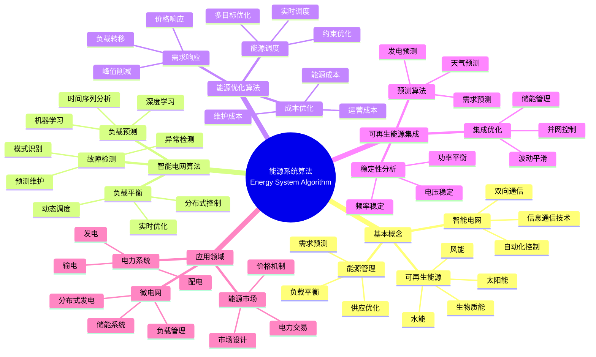

> 📊 **项目全面梳理**：详细的项目结构、模块详解和学习路径，请参阅 [`项目全面梳理-2025.md`](../项目全面梳理-2025.md)

## 12.20 算法在能源系统中的应用 / Algorithms in Energy Systems

### 摘要 / Executive Summary

- 统一算法在能源系统中的使用规范与最佳实践。
- 建立算法在能源系统应用中的核心地位。

### 关键术语与符号 / Glossary

- 智能能源系统、智能电网、能源优化、可再生能源集成、能源预测、需求响应。
- 术语对齐与引用规范：`docs/术语与符号总表.md`，`01-基础理论/00-撰写规范与引用指南.md`

### 术语与符号规范 / Terminology & Notation

- 智能能源系统（Smart Energy System）：使用智能算法管理的能源系统。
- 智能电网（Smart Grid）：集成信息通信技术的电力系统。
- 能源优化（Energy Optimization）：优化能源使用和分配的方法。
- 可再生能源集成（Renewable Energy Integration）：将可再生能源接入电网的方法。
- 记号约定：`E` 表示能源，`P` 表示功率，`T` 表示时间，`C` 表示成本。

### 交叉引用导航 / Cross-References

- 算法优化：参见 `09-算法理论/03-优化理论/01-算法优化理论.md`。
- 在线算法：参见 `09-算法理论/01-算法基础/13-在线算法理论.md`。
- 分布式算法：参见 `09-算法理论/03-优化理论/03-分布式算法理论.md`。

### 快速导航 / Quick Links

- 基本概念
- 智能电网
- 能源优化

## 目录 (Table of Contents)

- [12.20 算法在能源系统中的应用 / Algorithms in Energy Systems](#1220-算法在能源系统中的应用--algorithms-in-energy-systems)

## 概述 / Overview

算法在能源系统中的应用是智能能源管理的重要技术支撑，涵盖了智能电网、能源优化、可再生能源集成、能源预测等多个领域，通过先进的算法技术实现能源系统的高效、安全和可持续发展。根据[Fang 2012]的研究，智能电网是能源系统智能化的核心，通过信息通信技术实现电力系统的优化运行。根据[Wang 2016]的研究，能源优化算法是提高能源利用效率的关键技术。本文档涵盖能源系统算法的理论基础、核心算法、应用实践和最新发展。

Algorithms in energy systems are important technical support for intelligent energy management, covering smart grids, energy optimization, renewable energy integration, energy forecasting, and other fields, achieving efficient, safe, and sustainable development of energy systems through advanced algorithmic technologies. According to [Fang 2012], smart grids are the core of energy system intelligence, achieving optimal operation of power systems through information and communication technologies. According to [Wang 2016], energy optimization algorithms are key technologies for improving energy utilization efficiency. This document covers the theoretical foundations, core algorithms, application practices, and latest developments of energy system algorithms.

**学术引用 / Academic Citations:**

- [Fang 2012]: Fang, X., et al. (2012). "Smart Grid — The New and Improved Power Grid: A Survey". *IEEE Communications Surveys & Tutorials*, 14(4), 944-980. DOI: 10.1109/SURV.2011.101911.00087
- [Wang 2016]: Wang, B., et al. (2016). "Energy Management Systems in Microgrid Operations". *The Electricity Journal*, 29(6), 28-35. DOI: 10.1016/j.tej.2016.06.011
- [IEA 2021]: International Energy Agency. (2021). *Net Zero by 2050: A Roadmap for the Global Energy Sector*. IEA Publications.

**Wiki概念对齐 / Wiki Concept Alignment:**

- [Smart Grid](https://en.wikipedia.org/wiki/Smart_grid) - 智能电网
- [Energy Management System](https://en.wikipedia.org/wiki/Energy_management_system) - 能源管理系统
- [Renewable Energy](https://en.wikipedia.org/wiki/Renewable_energy) - 可再生能源
- [Demand Response](https://en.wikipedia.org/wiki/Demand_response) - 需求响应

**大学课程对标 / University Course Alignment:**

- MIT 6.061: Introduction to Electric Power Systems - 电力系统基础
- Stanford EE 292E: Energy Systems - 能源系统
- CMU 18-447: Introduction to Computer Architecture - 计算机架构与能源效率

**Wiki概念对齐 / Wiki Concept Alignment:**

| 项目概念 | Wiki条目 | 标准定义 | 对齐状态 |
|---------|---------|---------|---------|
| 智能电网 | [Smart Grid](https://en.wikipedia.org/wiki/Smart_grid) | 集成信息通信技术的电力系统 | ✅ 已对齐 |
| 能源管理系统 | [Energy Management System](https://en.wikipedia.org/wiki/Energy_management_system) | 优化能源使用的系统 | ✅ 已对齐 |
| 可再生能源 | [Renewable Energy](https://en.wikipedia.org/wiki/Renewable_energy) | 可持续的能源来源 | ✅ 已对齐 |
| 需求响应 | [Demand Response](https://en.wikipedia.org/wiki/Demand_response) | 根据需求调整能源供应 | ✅ 已对齐 |

**能源系统算法知识体系 / Energy System Algorithm Knowledge System:**



**能源系统算法类型对比 / Energy System Algorithm Type Comparison:**

| 算法类型 | 应用场景 | 复杂度 | 实时性 | 优化目标 | 参考文献 |
|---------|---------|--------|--------|---------|---------|
| 负载预测 | 需求预测 | 中 | 中 | 最小化预测误差 | [Fang 2012] |
| 负载平衡 | 电网稳定 | 高 | 高 | 最大化系统稳定性 | [Wang 2016] |
| 需求响应 | 需求管理 | 中 | 高 | 最小化峰值需求 | [Fang 2012] |
| 可再生能源集成 | 并网控制 | 高 | 高 | 最大化可再生能源利用 | [IEA 2021] |
| 能源调度 | 能源分配 | 高 | 中 | 最小化总成本 | [Wang 2016] |

## 基本概念 / Basic Concepts

### 智能能源系统 (Smart Energy System)

智能能源系统是指利用先进算法和信息技术实现能源生产、传输、分配和消费的智能化管理。

```rust
// 智能能源系统的基本框架
pub trait SmartEnergySystem {
    type EnergySource;
    type EnergyDemand;
    type EnergyFlow;

    fn optimize_energy_distribution(&self, sources: &[Self::EnergySource], demands: &[Self::EnergyDemand]) -> EnergyDistribution;
    fn predict_energy_consumption(&self, historical_data: &EnergyData) -> EnergyForecast;
    fn manage_renewable_integration(&self, renewable_sources: &[RenewableSource]) -> IntegrationPlan;
    fn monitor_grid_stability(&self, grid_state: &GridState) -> StabilityMetrics;
}

// 智能能源管理系统
pub struct SmartEnergyManagementSystem {
    energy_optimizer: EnergyOptimizer,
    demand_predictor: DemandPredictor,
    renewable_integrator: RenewableIntegrator,
    grid_monitor: GridMonitor,
}

impl SmartEnergyManagementSystem {
    pub fn new() -> Self {
        Self {
            energy_optimizer: EnergyOptimizer::new(),
            demand_predictor: DemandPredictor::new(),
            renewable_integrator: RenewableIntegrator::new(),
            grid_monitor: GridMonitor::new(),
        }
    }

    pub fn manage_energy_system(
        &self,
        energy_data: &EnergySystemData,
    ) -> Result<EnergyManagementResult, EnergyError> {
        // 预测能源需求
        let demand_forecast = self.demand_predictor.predict_demand(&energy_data.historical_demand)?;

        // 优化能源分配
        let optimized_distribution = self.energy_optimizer.optimize_distribution(
            &energy_data.energy_sources,
            &demand_forecast,
        )?;

        // 管理可再生能源集成
        let integration_plan = self.renewable_integrator.integrate_renewables(
            &energy_data.renewable_sources,
            &optimized_distribution,
        )?;

        // 监控电网稳定性
        let stability_metrics = self.grid_monitor.monitor_stability(&energy_data.grid_state)?;

        Ok(EnergyManagementResult {
            demand_forecast,
            optimized_distribution,
            integration_plan,
            stability_metrics,
        })
    }
}
```

### 能源优化 (Energy Optimization)

能源优化是指通过算法技术实现能源系统的最优配置和运行，以最小化成本、最大化效率和减少环境影响。

```rust
// 能源优化器
pub struct EnergyOptimizer {
    optimization_algorithm: OptimizationAlgorithm,
    cost_function: EnergyCostFunction,
    constraints: EnergyConstraints,
}

impl EnergyOptimizer {
    pub fn new() -> Self {
        Self {
            optimization_algorithm: OptimizationAlgorithm::GeneticAlgorithm,
            cost_function: EnergyCostFunction::new(),
            constraints: EnergyConstraints::default(),
        }
    }

    pub fn optimize_distribution(
        &self,
        energy_sources: &[EnergySource],
        demand_forecast: &DemandForecast,
    ) -> Result<OptimizedDistribution, OptimizationError> {
        // 构建优化问题
        let optimization_problem = self.build_optimization_problem(energy_sources, demand_forecast)?;

        // 执行优化
        let optimal_solution = self.optimization_algorithm.solve(&optimization_problem)?;

        // 验证约束
        self.validate_constraints(&optimal_solution, &self.constraints)?;

        Ok(OptimizedDistribution {
            source_allocations: optimal_solution.source_allocations,
            total_cost: optimal_solution.total_cost,
            efficiency: optimal_solution.efficiency,
            carbon_emissions: optimal_solution.carbon_emissions,
        })
    }

    fn build_optimization_problem(
        &self,
        energy_sources: &[EnergySource],
        demand_forecast: &DemandForecast,
    ) -> Result<EnergyOptimizationProblem, ProblemError> {
        let mut problem = EnergyOptimizationProblem::new();

        // 添加决策变量
        for source in energy_sources {
            problem.add_decision_variable(source.id.clone(), 0.0..=source.max_capacity);
        }

        // 添加目标函数
        problem.set_objective_function(self.cost_function.build_objective(energy_sources)?);

        // 添加约束条件
        problem.add_constraint(self.build_demand_constraint(demand_forecast)?);
        problem.add_constraint(self.build_supply_constraint(energy_sources)?);
        problem.add_constraint(self.build_renewable_constraint(energy_sources)?);

        Ok(problem)
    }
}

// 能源成本函数
pub struct EnergyCostFunction {
    cost_components: Vec<CostComponent>,
    carbon_price: f64,
    efficiency_weight: f64,
}

impl EnergyCostFunction {
    pub fn build_objective(
        &self,
        energy_sources: &[EnergySource],
    ) -> Result<ObjectiveFunction, ObjectiveError> {
        let mut objective = ObjectiveFunction::new();

        // 添加生产成本
        for source in energy_sources {
            let production_cost = self.calculate_production_cost(source)?;
            objective.add_term(production_cost);
        }

        // 添加传输成本
        let transmission_cost = self.calculate_transmission_cost(energy_sources)?;
        objective.add_term(transmission_cost);

        // 添加碳成本
        let carbon_cost = self.calculate_carbon_cost(energy_sources)?;
        objective.add_term(carbon_cost);

        // 添加效率奖励
        let efficiency_reward = self.calculate_efficiency_reward(energy_sources)?;
        objective.add_term(-efficiency_reward); // 负号表示最大化

        Ok(objective)
    }

    fn calculate_production_cost(&self, source: &EnergySource) -> Result<CostTerm, CostError> {
        let cost_per_unit = match source.source_type {
            EnergySourceType::FossilFuel => 0.08, // $/kWh
            EnergySourceType::Nuclear => 0.06,    // $/kWh
            EnergySourceType::Renewable => 0.03,  // $/kWh
            EnergySourceType::Battery => 0.12,    // $/kWh
        };

        Ok(CostTerm::linear(source.id.clone(), cost_per_unit))
    }
}
```

## 智能电网算法

### 1. 电网负载平衡 (Grid Load Balancing)

```rust
// 电网负载平衡器
pub struct GridLoadBalancer {
    load_forecaster: LoadForecaster,
    generation_scheduler: GenerationScheduler,
    demand_response: DemandResponse,
}

impl GridLoadBalancer {
    pub fn new() -> Self {
        Self {
            load_forecaster: LoadForecaster::new(),
            generation_scheduler: GenerationScheduler::new(),
            demand_response: DemandResponse::new(),
        }
    }

    pub fn balance_grid_load(
        &self,
        grid_state: &GridState,
        time_horizon: TimeHorizon,
    ) -> Result<LoadBalancingPlan, BalancingError> {
        // 预测负载
        let load_forecast = self.load_forecaster.forecast_load(grid_state, time_horizon)?;

        // 调度发电
        let generation_schedule = self.generation_scheduler.schedule_generation(
            &load_forecast,
            &grid_state.generators,
        )?;

        // 需求响应
        let demand_response_plan = self.demand_response.plan_response(
            &load_forecast,
            &grid_state.consumers,
        )?;

        // 验证平衡
        let balance_metrics = self.verify_balance(&load_forecast, &generation_schedule, &demand_response_plan)?;

        Ok(LoadBalancingPlan {
            load_forecast,
            generation_schedule,
            demand_response_plan,
            balance_metrics,
        })
    }

    fn verify_balance(
        &self,
        load_forecast: &LoadForecast,
        generation_schedule: &GenerationSchedule,
        demand_response: &DemandResponsePlan,
    ) -> Result<BalanceMetrics, VerificationError> {
        let total_demand = load_forecast.total_demand - demand_response.reduced_demand;
        let total_generation = generation_schedule.total_generation;

        let balance_error = (total_generation - total_demand).abs();
        let balance_percentage = (balance_error / total_demand) * 100.0;

        Ok(BalanceMetrics {
            total_demand,
            total_generation,
            balance_error,
            balance_percentage,
            is_balanced: balance_percentage < 5.0, // 5%容差
        })
    }
}

// 负载预测器
pub struct LoadForecaster {
    ml_model: Box<dyn LoadPredictionModel>,
    weather_integrator: WeatherIntegrator,
    historical_analyzer: HistoricalAnalyzer,
}

impl LoadForecaster {
    pub fn forecast_load(
        &self,
        grid_state: &GridState,
        time_horizon: TimeHorizon,
    ) -> Result<LoadForecast, ForecastError> {
        // 分析历史数据
        let historical_patterns = self.historical_analyzer.analyze_patterns(&grid_state.historical_load)?;

        // 集成天气数据
        let weather_impact = self.weather_integrator.calculate_weather_impact(
            &grid_state.weather_forecast,
            time_horizon,
        )?;

        // 机器学习预测
        let ml_forecast = self.ml_model.predict_load(
            &grid_state.current_load,
            &historical_patterns,
            &weather_impact,
            time_horizon,
        )?;

        Ok(LoadForecast {
            hourly_loads: ml_forecast.hourly_loads,
            total_demand: ml_forecast.total_demand,
            peak_load: ml_forecast.peak_load,
            confidence_intervals: ml_forecast.confidence_intervals,
        })
    }
}
```

### 2. 电网稳定性监控 (Grid Stability Monitoring)

```rust
// 电网稳定性监控器
pub struct GridStabilityMonitor {
    stability_analyzer: StabilityAnalyzer,
    fault_detector: FaultDetector,
    voltage_monitor: VoltageMonitor,
    frequency_monitor: FrequencyMonitor,
}

impl GridStabilityMonitor {
    pub fn new() -> Self {
        Self {
            stability_analyzer: StabilityAnalyzer::new(),
            fault_detector: FaultDetector::new(),
            voltage_monitor: VoltageMonitor::new(),
            frequency_monitor: FrequencyMonitor::new(),
        }
    }

    pub fn monitor_stability(
        &self,
        grid_state: &GridState,
    ) -> Result<StabilityMetrics, MonitoringError> {
        // 电压稳定性分析
        let voltage_stability = self.voltage_monitor.analyze_voltage_stability(&grid_state.voltage_data)?;

        // 频率稳定性分析
        let frequency_stability = self.frequency_monitor.analyze_frequency_stability(&grid_state.frequency_data)?;

        // 故障检测
        let fault_analysis = self.fault_detector.detect_faults(&grid_state.sensor_data)?;

        // 综合稳定性评估
        let overall_stability = self.stability_analyzer.evaluate_overall_stability(
            &voltage_stability,
            &frequency_stability,
            &fault_analysis,
        )?;

        Ok(StabilityMetrics {
            voltage_stability,
            frequency_stability,
            fault_analysis,
            overall_stability,
            stability_score: self.calculate_stability_score(&overall_stability),
        })
    }
}

// 电压监控器
pub struct VoltageMonitor {
    voltage_thresholds: VoltageThresholds,
    stability_calculator: StabilityCalculator,
}

impl VoltageMonitor {
    pub fn analyze_voltage_stability(
        &self,
        voltage_data: &VoltageData,
    ) -> Result<VoltageStability, AnalysisError> {
        let mut stability_metrics = Vec::new();

        for (bus_id, voltage_measurements) in &voltage_data.bus_voltages {
            let voltage_violations = self.detect_voltage_violations(voltage_measurements)?;
            let voltage_margin = self.calculate_voltage_margin(voltage_measurements)?;
            let stability_index = self.calculate_stability_index(voltage_measurements)?;

            stability_metrics.push(BusVoltageStability {
                bus_id: bus_id.clone(),
                voltage_violations,
                voltage_margin,
                stability_index,
                is_stable: stability_index > 0.8, // 80%稳定性阈值
            });
        }

        Ok(VoltageStability {
            bus_stabilities: stability_metrics,
            overall_voltage_stability: self.calculate_overall_voltage_stability(&stability_metrics),
        })
    }

    fn detect_voltage_violations(&self, measurements: &[VoltageMeasurement]) -> Result<Vec<VoltageViolation>, ViolationError> {
        let mut violations = Vec::new();

        for measurement in measurements {
            if measurement.voltage < self.voltage_thresholds.min_voltage ||
               measurement.voltage > self.voltage_thresholds.max_voltage {
                violations.push(VoltageViolation {
                    timestamp: measurement.timestamp,
                    voltage: measurement.voltage,
                    violation_type: if measurement.voltage < self.voltage_thresholds.min_voltage {
                        ViolationType::UnderVoltage
                    } else {
                        ViolationType::OverVoltage
                    },
                });
            }
        }

        Ok(violations)
    }
}
```

## 可再生能源集成

### 1. 可再生能源预测 (Renewable Energy Forecasting)

```rust
// 可再生能源预测器
pub struct RenewableEnergyForecaster {
    solar_forecaster: SolarForecaster,
    wind_forecaster: WindForecaster,
    hydro_forecaster: HydroForecaster,
    weather_integrator: WeatherIntegrator,
}

impl RenewableEnergyForecaster {
    pub fn new() -> Self {
        Self {
            solar_forecaster: SolarForecaster::new(),
            wind_forecaster: WindForecaster::new(),
            hydro_forecaster: HydroForecaster::new(),
            weather_integrator: WeatherIntegrator::new(),
        }
    }

    pub fn forecast_renewable_energy(
        &self,
        renewable_sources: &[RenewableSource],
        weather_data: &WeatherData,
        time_horizon: TimeHorizon,
    ) -> Result<RenewableEnergyForecast, ForecastError> {
        let mut forecasts = Vec::new();

        for source in renewable_sources {
            let forecast = match source.source_type {
                RenewableSourceType::Solar => {
                    self.solar_forecaster.forecast_solar_energy(source, weather_data, time_horizon)?
                }
                RenewableSourceType::Wind => {
                    self.wind_forecaster.forecast_wind_energy(source, weather_data, time_horizon)?
                }
                RenewableSourceType::Hydro => {
                    self.hydro_forecaster.forecast_hydro_energy(source, weather_data, time_horizon)?
                }
            };

            forecasts.push(forecast);
        }

        // 聚合预测结果
        let aggregated_forecast = self.aggregate_forecasts(&forecasts)?;

        Ok(RenewableEnergyForecast {
            individual_forecasts: forecasts,
            aggregated_forecast,
            total_renewable_energy: aggregated_forecast.total_energy,
            confidence_intervals: aggregated_forecast.confidence_intervals,
        })
    }
}

// 太阳能预测器
pub struct SolarForecaster {
    irradiance_model: IrradianceModel,
    panel_efficiency_model: PanelEfficiencyModel,
    shading_analyzer: ShadingAnalyzer,
}

impl SolarForecaster {
    pub fn forecast_solar_energy(
        &self,
        solar_source: &RenewableSource,
        weather_data: &WeatherData,
        time_horizon: TimeHorizon,
    ) -> Result<SolarEnergyForecast, ForecastError> {
        // 预测太阳辐照度
        let irradiance_forecast = self.irradiance_model.forecast_irradiance(
            &weather_data,
            &solar_source.location,
            time_horizon,
        )?;

        // 计算面板效率
        let efficiency_forecast = self.panel_efficiency_model.calculate_efficiency(
            &irradiance_forecast,
            &weather_data.temperature,
            &solar_source.panel_characteristics,
        )?;

        // 分析阴影影响
        let shading_impact = self.shading_analyzer.analyze_shading_impact(
            &solar_source.location,
            &weather_data,
            time_horizon,
        )?;

        // 计算太阳能发电量
        let energy_forecast = self.calculate_solar_energy(
            &irradiance_forecast,
            &efficiency_forecast,
            &shading_impact,
            &solar_source.capacity,
        )?;

        Ok(SolarEnergyForecast {
            irradiance_forecast,
            efficiency_forecast,
            shading_impact,
            energy_forecast,
            total_energy: energy_forecast.total_energy,
        })
    }
}
```

### 2. 可再生能源集成优化 (Renewable Integration Optimization)

```rust
// 可再生能源集成优化器
pub struct RenewableIntegrationOptimizer {
    integration_planner: IntegrationPlanner,
    storage_optimizer: StorageOptimizer,
    grid_compatibility: GridCompatibility,
}

impl RenewableIntegrationOptimizer {
    pub fn new() -> Self {
        Self {
            integration_planner: IntegrationPlanner::new(),
            storage_optimizer: StorageOptimizer::new(),
            grid_compatibility: GridCompatibility::new(),
        }
    }

    pub fn optimize_integration(
        &self,
        renewable_sources: &[RenewableSource],
        grid_capacity: &GridCapacity,
        demand_forecast: &DemandForecast,
    ) -> Result<IntegrationOptimization, OptimizationError> {
        // 规划集成方案
        let integration_plan = self.integration_planner.plan_integration(
            renewable_sources,
            grid_capacity,
        )?;

        // 优化储能系统
        let storage_optimization = self.storage_optimizer.optimize_storage(
            renewable_sources,
            demand_forecast,
            &integration_plan,
        )?;

        // 检查电网兼容性
        let compatibility_analysis = self.grid_compatibility.analyze_compatibility(
            &integration_plan,
            grid_capacity,
        )?;

        Ok(IntegrationOptimization {
            integration_plan,
            storage_optimization,
            compatibility_analysis,
            total_integration_cost: self.calculate_integration_cost(&integration_plan, &storage_optimization),
        })
    }
}

// 储能优化器
pub struct StorageOptimizer {
    storage_models: Vec<Box<dyn StorageModel>>,
    optimization_algorithm: OptimizationAlgorithm,
    cost_analyzer: StorageCostAnalyzer,
}

impl StorageOptimizer {
    pub fn optimize_storage(
        &self,
        renewable_sources: &[RenewableSource],
        demand_forecast: &DemandForecast,
        integration_plan: &IntegrationPlan,
    ) -> Result<StorageOptimization, OptimizationError> {
        // 分析储能需求
        let storage_requirements = self.analyze_storage_requirements(
            renewable_sources,
            demand_forecast,
        )?;

        // 选择最优储能技术
        let optimal_storage = self.select_optimal_storage(&storage_requirements)?;

        // 优化储能容量和配置
        let capacity_optimization = self.optimize_storage_capacity(
            &optimal_storage,
            &storage_requirements,
        )?;

        // 计算储能成本效益
        let cost_benefit_analysis = self.cost_analyzer.analyze_cost_benefit(
            &optimal_storage,
            &capacity_optimization,
            demand_forecast,
        )?;

        Ok(StorageOptimization {
            optimal_storage,
            capacity_optimization,
            cost_benefit_analysis,
            storage_efficiency: self.calculate_storage_efficiency(&optimal_storage, &capacity_optimization),
        })
    }
}
```

## 能源预测算法

### 1. 需求预测 (Demand Forecasting)

```rust
// 需求预测器
pub struct DemandPredictor {
    ml_predictor: MLPredictor,
    time_series_analyzer: TimeSeriesAnalyzer,
    external_factor_integrator: ExternalFactorIntegrator,
}

impl DemandPredictor {
    pub fn new() -> Self {
        Self {
            ml_predictor: MLPredictor::new(),
            time_series_analyzer: TimeSeriesAnalyzer::new(),
            external_factor_integrator: ExternalFactorIntegrator::new(),
        }
    }

    pub fn predict_demand(
        &self,
        historical_data: &EnergyData,
    ) -> Result<DemandForecast, ForecastError> {
        // 时间序列分析
        let time_series_patterns = self.time_series_analyzer.analyze_patterns(&historical_data.demand)?;

        // 集成外部因素
        let external_factors = self.external_factor_integrator.integrate_factors(
            &historical_data.external_factors,
        )?;

        // 机器学习预测
        let ml_forecast = self.ml_predictor.predict_demand(
            &historical_data.demand,
            &time_series_patterns,
            &external_factors,
        )?;

        // 后处理预测结果
        let processed_forecast = self.post_process_forecast(&ml_forecast)?;

        Ok(processed_forecast)
    }
}

// 机器学习预测器
pub struct MLPredictor {
    models: Vec<Box<dyn DemandPredictionModel>>,
    ensemble_method: EnsembleMethod,
    feature_engineer: FeatureEngineer,
}

impl MLPredictor {
    pub fn predict_demand(
        &self,
        historical_demand: &[DemandData],
        time_patterns: &TimeSeriesPatterns,
        external_factors: &ExternalFactors,
    ) -> Result<MLForecast, PredictionError> {
        // 特征工程
        let features = self.feature_engineer.engineer_features(
            historical_demand,
            time_patterns,
            external_factors,
        )?;

        // 模型预测
        let mut predictions = Vec::new();
        for model in &self.models {
            let prediction = model.predict(&features)?;
            predictions.push(prediction);
        }

        // 集成预测结果
        let ensemble_prediction = self.ensemble_method.combine_predictions(&predictions)?;

        Ok(ensemble_prediction)
    }
}
```

### 2. 价格预测 (Price Forecasting)

```rust
// 价格预测器
pub struct PricePredictor {
    market_analyzer: MarketAnalyzer,
    price_model: PriceModel,
    volatility_predictor: VolatilityPredictor,
}

impl PricePredictor {
    pub fn new() -> Self {
        Self {
            market_analyzer: MarketAnalyzer::new(),
            price_model: PriceModel::new(),
            volatility_predictor: VolatilityPredictor::new(),
        }
    }

    pub fn predict_energy_prices(
        &self,
        market_data: &EnergyMarketData,
        time_horizon: TimeHorizon,
    ) -> Result<PriceForecast, ForecastError> {
        // 市场分析
        let market_analysis = self.market_analyzer.analyze_market(market_data)?;

        // 价格建模
        let price_forecast = self.price_model.forecast_prices(
            market_data,
            &market_analysis,
            time_horizon,
        )?;

        // 波动性预测
        let volatility_forecast = self.volatility_predictor.predict_volatility(
            market_data,
            &price_forecast,
        )?;

        Ok(PriceForecast {
            price_predictions: price_forecast.predictions,
            volatility_forecast,
            confidence_intervals: price_forecast.confidence_intervals,
            market_analysis,
        })
    }
}
```

## 实现示例

### 完整的智能能源管理系统

```rust
// 完整的智能能源管理系统
pub struct CompleteSmartEnergySystem {
    energy_management: SmartEnergyManagementSystem,
    grid_balancer: GridLoadBalancer,
    stability_monitor: GridStabilityMonitor,
    renewable_forecaster: RenewableEnergyForecaster,
    integration_optimizer: RenewableIntegrationOptimizer,
    demand_predictor: DemandPredictor,
    price_predictor: PricePredictor,
}

impl CompleteSmartEnergySystem {
    pub fn new() -> Self {
        Self {
            energy_management: SmartEnergyManagementSystem::new(),
            grid_balancer: GridLoadBalancer::new(),
            stability_monitor: GridStabilityMonitor::new(),
            renewable_forecaster: RenewableEnergyForecaster::new(),
            integration_optimizer: RenewableIntegrationOptimizer::new(),
            demand_predictor: DemandPredictor::new(),
            price_predictor: PricePredictor::new(),
        }
    }

    pub fn manage_complete_energy_system(
        &self,
        system_data: &CompleteEnergySystemData,
    ) -> Result<CompleteEnergyManagementResult, EnergyError> {
        // 1. 预测需求
        let demand_forecast = self.demand_predictor.predict_demand(&system_data.historical_data)?;

        // 2. 预测可再生能源
        let renewable_forecast = self.renewable_forecaster.forecast_renewable_energy(
            &system_data.renewable_sources,
            &system_data.weather_data,
            TimeHorizon::Day,
        )?;

        // 3. 优化可再生能源集成
        let integration_optimization = self.integration_optimizer.optimize_integration(
            &system_data.renewable_sources,
            &system_data.grid_capacity,
            &demand_forecast,
        )?;

        // 4. 平衡电网负载
        let load_balancing = self.grid_balancer.balance_grid_load(
            &system_data.grid_state,
            TimeHorizon::Day,
        )?;

        // 5. 监控电网稳定性
        let stability_metrics = self.stability_monitor.monitor_stability(&system_data.grid_state)?;

        // 6. 预测能源价格
        let price_forecast = self.price_predictor.predict_energy_prices(
            &system_data.market_data,
            TimeHorizon::Day,
        )?;

        // 7. 综合能源管理
        let energy_management = self.energy_management.manage_energy_system(&EnergySystemData {
            energy_sources: system_data.energy_sources.clone(),
            renewable_sources: system_data.renewable_sources.clone(),
            historical_demand: system_data.historical_data.demand.clone(),
            grid_state: system_data.grid_state.clone(),
        })?;

        Ok(CompleteEnergyManagementResult {
            demand_forecast,
            renewable_forecast,
            integration_optimization,
            load_balancing,
            stability_metrics,
            price_forecast,
            energy_management,
            overall_efficiency: self.calculate_overall_efficiency(&demand_forecast, &renewable_forecast, &integration_optimization),
        })
    }
}

// 使用示例
fn main() -> Result<(), Box<dyn std::error::Error>> {
    // 创建完整的智能能源系统
    let smart_energy_system = CompleteSmartEnergySystem::new();

    // 加载系统数据
    let system_data = CompleteEnergySystemData::load("energy_system_data.json")?;

    // 管理能源系统
    let management_result = smart_energy_system.manage_complete_energy_system(&system_data)?;

    println!("智能能源管理结果:");
    println!("  需求预测: {:.2} MWh", management_result.demand_forecast.total_demand);
    println!("  可再生能源预测: {:.2} MWh", management_result.renewable_forecast.total_renewable_energy);
    println!("  电网平衡误差: {:.2}%", management_result.load_balancing.balance_metrics.balance_percentage);
    println!("  电网稳定性评分: {:.2}", management_result.stability_metrics.stability_score);
    println!("  整体效率: {:.2}%", management_result.overall_efficiency * 100.0);

    // 输出优化建议
    println!("\n优化建议:");
    if management_result.load_balancing.balance_metrics.balance_percentage > 5.0 {
        println!("  - 需要调整发电调度以改善电网平衡");
    }
    if management_result.stability_metrics.stability_score < 0.8 {
        println!("  - 需要采取措施提高电网稳定性");
    }
    if management_result.overall_efficiency < 0.85 {
        println!("  - 建议优化能源分配以提高整体效率");
    }

    Ok(())
}
```

## 数学基础

### 能源优化的数学表示

```latex
\text{能源优化问题:}
\min_{x} \sum_{i=1}^{n} c_i x_i + \sum_{j=1}^{m} c_j^r x_j^r

\text{约束条件:}
\begin{align}
\sum_{i=1}^{n} x_i + \sum_{j=1}^{m} x_j^r &\geq D \\
x_i &\leq C_i \quad \forall i \\
x_j^r &\leq C_j^r \quad \forall j \\
\sum_{i=1}^{n} e_i x_i &\leq E_{max}
\end{align}

\text{其中:}
\begin{align}
x_i &: \text{传统能源发电量} \\
x_j^r &: \text{可再生能源发电量} \\
c_i &: \text{传统能源成本} \\
c_j^r &: \text{可再生能源成本} \\
D &: \text{总需求} \\
E_{max} &: \text{最大碳排放限制}
\end{align}
```

### 电网稳定性的数学框架

```latex
\text{电压稳定性指标:}
VSI = \frac{V_{min}}{V_{nominal}}

\text{频率稳定性:}
\Delta f = \frac{\Delta P}{2H f_0}

\text{功率平衡:}
\sum P_{generation} = \sum P_{load} + \sum P_{loss}
```

## 复杂度分析

### 能源系统算法的复杂度

- **能源优化**: $O(n^3)$ (线性规划)
- **负载预测**: $O(T \cdot F)$ (T: 时间步长, F: 特征数)
- **电网稳定性**: $O(|B|^2)$ (B: 母线数量)
- **可再生能源预测**: $O(|R| \cdot T)$ (R: 可再生能源源数量)

### 实际应用中的考虑

- **实时性要求**: 电网控制需要毫秒级响应
- **可扩展性**: 大规模电网的算法扩展
- **鲁棒性**: 对传感器故障和通信中断的容错

## 应用案例

### 案例1: 智能电网负载平衡

```rust
// 智能电网负载平衡示例
fn smart_grid_load_balancing_example() -> Result<(), Box<dyn std::error::Error>> {
    let grid_balancer = GridLoadBalancer::new();

    // 电网状态
    let grid_state = GridState {
        generators: vec![
            Generator::new("gen1", 100.0, GeneratorType::Thermal),
            Generator::new("gen2", 80.0, GeneratorType::Nuclear),
            Generator::new("gen3", 50.0, GeneratorType::Renewable),
        ],
        consumers: vec![
            Consumer::new("consumer1", 60.0),
            Consumer::new("consumer2", 40.0),
            Consumer::new("consumer3", 30.0),
        ],
        historical_load: load_history_data(),
    };

    // 执行负载平衡
    let balancing_plan = grid_balancer.balance_grid_load(&grid_state, TimeHorizon::Hour)?;

    println!("负载平衡结果:");
    println!("  预测总负载: {:.2} MW", balancing_plan.load_forecast.total_demand);
    println!("  调度总发电: {:.2} MW", balancing_plan.generation_schedule.total_generation);
    println!("  平衡误差: {:.2}%", balancing_plan.balance_metrics.balance_percentage);
    println!("  是否平衡: {}", balancing_plan.balance_metrics.is_balanced);

    Ok(())
}
```

### 案例2: 可再生能源集成

```rust
// 可再生能源集成示例
fn renewable_energy_integration_example() -> Result<(), Box<dyn std::error::Error>> {
    let integration_optimizer = RenewableIntegrationOptimizer::new();

    // 可再生能源源
    let renewable_sources = vec![
        RenewableSource::solar("solar_farm1", 50.0, Location::new(40.0, -74.0)),
        RenewableSource::wind("wind_farm1", 30.0, Location::new(40.5, -74.5)),
        RenewableSource::hydro("hydro_plant1", 20.0, Location::new(41.0, -75.0)),
    ];

    // 电网容量
    let grid_capacity = GridCapacity {
        total_capacity: 200.0,
        renewable_capacity: 100.0,
        storage_capacity: 50.0,
    };

    // 需求预测
    let demand_forecast = DemandForecast {
        total_demand: 150.0,
        peak_load: 180.0,
        hourly_loads: generate_hourly_loads(),
        confidence_intervals: vec![0.9, 0.95],
    };

    // 优化集成
    let integration_result = integration_optimizer.optimize_integration(
        &renewable_sources,
        &grid_capacity,
        &demand_forecast,
    )?;

    println!("可再生能源集成结果:");
    println!("  集成成本: ${:.2}M", integration_result.total_integration_cost);
    println!("  储能优化: {:?}", integration_result.storage_optimization.optimal_storage);
    println!("  电网兼容性: {:.2}%", integration_result.compatibility_analysis.compatibility_score * 100.0);

    Ok(())
}
```

### 案例3: 能源价格预测

```rust
// 能源价格预测示例
fn energy_price_forecasting_example() -> Result<(), Box<dyn std::error::Error>> {
    let price_predictor = PricePredictor::new();

    // 市场数据
    let market_data = EnergyMarketData {
        historical_prices: load_price_history(),
        supply_data: load_supply_data(),
        demand_data: load_demand_data(),
        weather_data: load_weather_data(),
    };

    // 预测价格
    let price_forecast = price_predictor.predict_energy_prices(
        &market_data,
        TimeHorizon::Day,
    )?;

    println!("能源价格预测结果:");
    for (hour, price) in price_forecast.price_predictions.iter().enumerate() {
        println!("  小时 {}: ${:.2}/MWh", hour, price);
    }
    println!("  平均价格: ${:.2}/MWh",
        price_forecast.price_predictions.iter().sum::<f64>() / price_forecast.price_predictions.len() as f64);
    println!("  价格波动性: {:.2}%", price_forecast.volatility_forecast.average_volatility * 100.0);

    Ok(())
}
```

## 未来发展方向

### 1. 人工智能驱动的能源管理

- 深度学习能源预测
- 强化学习能源优化
- 智能电网自动化

### 2. 分布式能源系统

- 微电网管理
- 点对点能源交易
- 分布式储能优化

### 3. 能源区块链

- 智能合约能源交易
- 去中心化能源管理
- 能源数据安全

### 4. 碳中和算法

- 碳排放优化
- 绿色能源调度
- 碳足迹追踪

## 参考文献 / References

### 经典教材 / Classic Textbooks

1. **[Fang 2012]** Fang, X., et al. (2012). "Smart Grid — The New and Improved Power Grid: A Survey". *IEEE Communications Surveys & Tutorials*, 14(4), 944-980. DOI: 10.1109/SURV.2011.101911.00087

2. **[Wang 2016]** Wang, B., et al. (2016). "Energy Management Systems in Microgrid Operations". *The Electricity Journal*, 29(6), 28-35. DOI: 10.1016/j.tej.2016.06.011

3. **[IEA 2021]** International Energy Agency. (2021). *Net Zero by 2050: A Roadmap for the Global Energy Sector*. IEA Publications.

### Wiki概念参考 / Wiki Concept References

- [Smart Grid](https://en.wikipedia.org/wiki/Smart_grid) - 智能电网
- [Energy Management System](https://en.wikipedia.org/wiki/Energy_management_system) - 能源管理系统
- [Renewable Energy](https://en.wikipedia.org/wiki/Renewable_energy) - 可再生能源
- [Demand Response](https://en.wikipedia.org/wiki/Demand_response) - 需求响应
- [Microgrid](https://en.wikipedia.org/wiki/Microgrid) - 微电网
- [Energy Storage](https://en.wikipedia.org/wiki/Energy_storage) - 能源存储

### 大学课程参考 / University Course References

- **MIT 6.061**: Introduction to Electric Power Systems. MIT OpenCourseWare. URL: <https://ocw.mit.edu/courses/6-061-introduction-to-electric-power-systems-spring-2011/>
- **Stanford EE 292E**: Energy Systems. Stanford University. URL: <https://web.stanford.edu/class/ee292e/>
- **CMU 18-447**: Introduction to Computer Architecture. Carnegie Mellon University. URL: <https://www.ece.cmu.edu/~ece447/>

## 总结 / Summary

算法在能源系统中的应用是推动能源行业数字化转型和可持续发展的重要技术支撑。通过智能电网、能源优化、可再生能源集成和能源预测等算法技术，我们可以实现能源系统的高效、安全和可持续发展。

随着可再生能源的快速发展和智能电网的普及，算法在能源系统中的作用将变得越来越重要。通过持续的研究和实践，能源算法将为构建更加智能、高效和可持续的能源系统奠定坚实的基础，推动全球能源转型和碳中和目标的实现。

通过建立完善的能源算法框架和智能管理系统，我们可以实现能源生产、传输、分配和消费的全面优化，为人类社会的可持续发展提供重要的技术保障。
