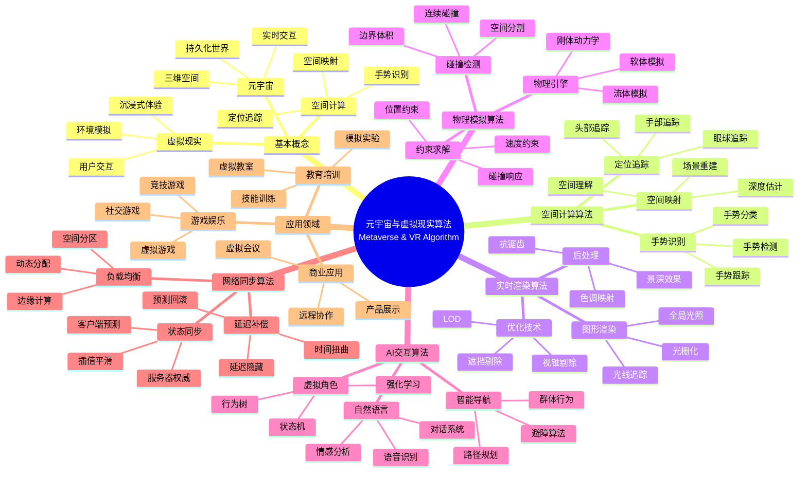

> 📊 **项目全面梳理**：详细的项目结构、模块详解和学习路径，请参阅 [`项目全面梳理-2025.md`](../项目全面梳理-2025.md)

## 12.24 算法在元宇宙与虚拟现实中的应用 / Algorithms in Metaverse and Virtual Reality

### 摘要 / Executive Summary

- 统一算法在元宇宙与虚拟现实中的使用规范与最佳实践。
- 建立算法在元宇宙与虚拟现实应用中的核心地位。

### 关键术语与符号 / Glossary

- 元宇宙、虚拟现实、空间计算、实时渲染、物理模拟、碰撞检测、用户交互。
- 术语对齐与引用规范：`docs/术语与符号总表.md`，`01-基础理论/00-撰写规范与引用指南.md`

### 术语与符号规范 / Terminology & Notation

- 元宇宙（Metaverse）：持久化的、实时的、三维虚拟世界。
- 虚拟现实（Virtual Reality）：使用计算机技术创建的虚拟环境。
- 空间计算（Spatial Computing）：在三维空间中的定位、导航和交互。
- 实时渲染（Real-Time Rendering）：高质量图形实时生成。
- 记号约定：`V` 表示虚拟环境，`P` 表示位置，`R` 表示渲染，`T` 表示时间。

### 交叉引用导航 / Cross-References

- 图算法：参见 `09-算法理论/01-算法基础/05-图算法理论.md`。
- 游戏算法：参见 `12-应用领域/06-游戏算法应用.md`。
- 算法优化：参见 `09-算法理论/03-优化理论/01-算法优化理论.md`。

### 快速导航 / Quick Links

- 基本概念
- 空间计算
- 实时渲染

## 目录 (Table of Contents)

- [12.24 算法在元宇宙与虚拟现实中的应用 / Algorithms in Metaverse and Virtual Reality](#1224-算法在元宇宙与虚拟现实中的应用--algorithms-in-metaverse-and-virtual-reality)

## 概述 / Overview

元宇宙（Metaverse）是一个持久化的、实时的、三维虚拟世界，通过算法技术实现空间计算、实时渲染、物理模拟、AI交互和社交网络等功能。根据[Stephenson 1992]的经典定义，元宇宙是一个持久的虚拟世界。根据[Ball 2022]的研究，元宇宙是下一代互联网的形态，需要先进的算法技术支撑。本文档涵盖元宇宙与虚拟现实算法的理论基础、核心算法、应用实践和最新发展。

The Metaverse is a persistent, real-time, three-dimensional virtual world that achieves spatial computing, real-time rendering, physics simulation, AI interaction, and social networking through algorithmic technologies. According to [Stephenson 1992], the Metaverse is a persistent virtual world. According to [Ball 2022], the Metaverse is the next generation of the Internet, requiring advanced algorithmic technologies. This document covers the theoretical foundations, core algorithms, application practices, and latest developments of Metaverse and Virtual Reality algorithms.

**学术引用 / Academic Citations:**

- [Stephenson 1992]: Stephenson, N. (1992). *Snow Crash*. Bantam Books. ISBN: 978-0553380958
- [Ball 2022]: Ball, M. (2022). *The Metaverse: And How It Will Revolutionize Everything*. Liveright Publishing. ISBN: 978-1324092032
- [Mystakidis 2022]: Mystakidis, S. (2022). "Metaverse". *Encyclopedia*, 2(1), 486-497. DOI: 10.3390/encyclopedia2010031

**Wiki概念对齐 / Wiki Concept Alignment:**

- [Metaverse](https://en.wikipedia.org/wiki/Metaverse) - 元宇宙
- [Virtual Reality](https://en.wikipedia.org/wiki/Virtual_reality) - 虚拟现实
- [Spatial Computing](https://en.wikipedia.org/wiki/Spatial_computing) - 空间计算
- [Real-Time Rendering](https://en.wikipedia.org/wiki/Real-time_computer_graphics) - 实时渲染

**大学课程对标 / University Course Alignment:**

- MIT 6.837: Computer Graphics - 计算机图形学
- Stanford CS148: Introduction to Computer Graphics and Imaging - 计算机图形学
- CMU 15-462: Computer Graphics - 计算机图形学

**Wiki概念对齐 / Wiki Concept Alignment:**

| 项目概念 | Wiki条目 | 标准定义 | 对齐状态 |
|---------|---------|---------|---------|
| 元宇宙 | [Metaverse](https://en.wikipedia.org/wiki/Metaverse) | 持久化的三维虚拟世界 | ✅ 已对齐 |
| 虚拟现实 | [Virtual Reality](https://en.wikipedia.org/wiki/Virtual_reality) | 计算机创建的虚拟环境 | ✅ 已对齐 |
| 空间计算 | [Spatial Computing](https://en.wikipedia.org/wiki/Spatial_computing) | 三维空间中的计算 | ✅ 已对齐 |
| 实时渲染 | [Real-Time Rendering](https://en.wikipedia.org/wiki/Real-time_computer_graphics) | 实时生成图形 | ✅ 已对齐 |

**元宇宙与虚拟现实算法知识体系 / Metaverse and Virtual Reality Algorithm Knowledge System:**



**元宇宙与虚拟现实算法类型对比 / Metaverse and Virtual Reality Algorithm Type Comparison:**

| 算法类型 | 应用场景 | 时间复杂度 | 实时性要求 | 计算资源 | 参考文献 |
|---------|---------|-----------|-----------|---------|---------|
| 空间定位 | 位置追踪 | $O(1)$ | 极高 | 低 | [Ball 2022] |
| 实时渲染 | 图形生成 | $O(n)$ | 极高 | 高 | [Mystakidis 2022] |
| 物理模拟 | 碰撞检测 | $O(n \log n)$ | 高 | 中 | [Ball 2022] |
| AI交互 | 虚拟角色 | $O(n^2)$ | 中 | 中 | [Mystakidis 2022] |
| 网络同步 | 多用户 | $O(n)$ | 极高 | 中 | [Ball 2022] |

## 基本概念 / Basic Concepts

### 元宇宙与VR技术概述

元宇宙（Metaverse）是一个持久化的、实时的、三维虚拟世界，具有以下特征：

1. **空间计算**: 三维空间中的定位、导航和交互
2. **实时渲染**: 高质量图形实时生成
3. **物理模拟**: 真实世界的物理规律模拟
4. **AI交互**: 智能化的虚拟实体交互
5. **社交网络**: 多用户实时协作和社交

### 核心算法需求

```rust
// 元宇宙系统的基本架构
pub struct MetaverseSystem {
    spatial_computing: SpatialComputingEngine,
    rendering_engine: RealTimeRenderer,
    physics_engine: PhysicsSimulator,
    ai_engine: AIInteractionEngine,
    networking: DistributedNetworking,
}

impl MetaverseSystem {
    pub fn initialize(&mut self) -> Result<(), MetaverseError> {
        // 初始化各个子系统
        self.spatial_computing.initialize()?;
        self.rendering_engine.initialize()?;
        self.physics_engine.initialize()?;
        self.ai_engine.initialize()?;
        self.networking.initialize()?;

        Ok(())
    }

    pub fn update(&mut self, delta_time: f32) -> Result<(), MetaverseError> {
        // 更新各个子系统
        self.spatial_computing.update(delta_time)?;
        self.rendering_engine.update(delta_time)?;
        self.physics_engine.update(delta_time)?;
        self.ai_engine.update(delta_time)?;
        self.networking.update(delta_time)?;

        Ok(())
    }
}
```

## 空间计算算法

### 空间定位与追踪

```rust
// 空间定位系统
pub struct SpatialLocalization {
    slam_algorithm: SLAMAlgorithm,
    sensor_fusion: SensorFusion,
    pose_estimator: PoseEstimator,
}

impl SpatialLocalization {
    pub fn localize(&mut self, sensor_data: &SensorData) -> Result<Pose, LocalizationError> {
        // 1. 传感器数据融合
        let fused_data = self.sensor_fusion.fuse(sensor_data)?;

        // 2. SLAM算法处理
        let map_update = self.slam_algorithm.process(&fused_data)?;

        // 3. 位姿估计
        let pose = self.pose_estimator.estimate(&fused_data, &map_update)?;

        Ok(pose)
    }
}

// SLAM算法实现
pub struct SLAMAlgorithm {
    frontend: Frontend,
    backend: Backend,
    loop_closure: LoopClosure,
}

impl SLAMAlgorithm {
    pub fn process(&mut self, data: &SensorData) -> Result<MapUpdate, SLAMError> {
        // 1. 前端处理（特征提取和匹配）
        let features = self.frontend.extract_features(data)?;
        let matches = self.frontend.match_features(&features)?;

        // 2. 后端优化（图优化）
        let optimization_result = self.backend.optimize(&matches)?;

        // 3. 回环检测
        let loop_detection = self.loop_closure.detect(&optimization_result)?;

        Ok(MapUpdate {
            features,
            optimization: optimization_result,
            loop_closure: loop_detection,
        })
    }
}
```

### 空间导航算法

```rust
// 空间导航系统
pub struct SpatialNavigation {
    path_planner: PathPlanner,
    obstacle_avoidance: ObstacleAvoidance,
    navigation_controller: NavigationController,
}

impl SpatialNavigation {
    pub fn navigate(&mut self, start: Position, goal: Position, environment: &Environment) -> Result<Path, NavigationError> {
        // 1. 路径规划
        let path = self.path_planner.plan(start, goal, environment)?;

        // 2. 障碍物避免
        let safe_path = self.obstacle_avoidance.avoid_obstacles(&path, environment)?;

        // 3. 导航控制
        let navigation_commands = self.navigation_controller.generate_commands(&safe_path)?;

        Ok(safe_path)
    }
}

// A*路径规划算法
pub struct AStarPathPlanner {
    heuristic: Box<dyn HeuristicFunction>,
    open_set: BinaryHeap<Node>,
    closed_set: HashSet<Node>,
}

impl AStarPathPlanner {
    pub fn plan(&mut self, start: Position, goal: Position, environment: &Environment) -> Result<Path, PathPlanningError> {
        let start_node = Node::new(start, 0.0, self.heuristic.calculate(start, goal));
        self.open_set.push(start_node);

        while let Some(current) = self.open_set.pop() {
            if current.position == goal {
                return Ok(self.reconstruct_path(&current));
            }

            self.closed_set.insert(current.clone());

            for neighbor in self.get_neighbors(&current, environment) {
                if self.closed_set.contains(&neighbor) {
                    continue;
                }

                let tentative_g = current.g_cost + self.distance(&current, &neighbor);

                if !self.open_set.iter().any(|n| n.position == neighbor.position) {
                    self.open_set.push(neighbor);
                } else if tentative_g < neighbor.g_cost {
                    // 更新节点成本
                    self.update_node_cost(&neighbor, tentative_g);
                }
            }
        }

        Err(PathPlanningError::NoPathFound)
    }
}
```

## 实时渲染算法

### 光线追踪

```rust
// 光线追踪渲染器
pub struct RayTracingRenderer {
    scene: Scene,
    camera: Camera,
    materials: MaterialLibrary,
    light_sources: Vec<LightSource>,
}

impl RayTracingRenderer {
    pub fn render(&self, resolution: Resolution) -> Result<Image, RenderingError> {
        let mut image = Image::new(resolution);

        for y in 0..resolution.height {
            for x in 0..resolution.width {
                let ray = self.camera.generate_ray(x, y, resolution);
                let color = self.trace_ray(&ray, 0)?;
                image.set_pixel(x, y, color);
            }
        }

        Ok(image)
    }

    fn trace_ray(&self, ray: &Ray, depth: u32) -> Result<Color, RenderingError> {
        if depth > self.max_depth {
            return Ok(Color::black());
        }

        // 1. 光线-物体相交测试
        if let Some(intersection) = self.scene.intersect(ray) {
            // 2. 材质计算
            let material = self.materials.get(&intersection.material_id)?;
            let surface_color = material.calculate_color(&intersection, ray)?;

            // 3. 光照计算
            let lighting = self.calculate_lighting(&intersection, ray)?;

            // 4. 反射/折射
            let reflection = if material.is_reflective() {
                let reflected_ray = ray.reflect(&intersection.normal);
                self.trace_ray(&reflected_ray, depth + 1)?
            } else {
                Color::black()
            };

            let refraction = if material.is_transparent() {
                let refracted_ray = ray.refract(&intersection.normal, material.refractive_index());
                self.trace_ray(&refracted_ray, depth + 1)?
            } else {
                Color::black()
            };

            // 5. 最终颜色合成
            Ok(surface_color * lighting + reflection + refraction)
        } else {
            Ok(self.background_color(ray))
        }
    }
}
```

### 光栅化渲染

```rust
// 光栅化渲染器
pub struct RasterizationRenderer {
    vertex_shader: VertexShader,
    fragment_shader: FragmentShader,
    rasterizer: Rasterizer,
    depth_buffer: DepthBuffer,
}

impl RasterizationRenderer {
    pub fn render(&mut self, scene: &Scene) -> Result<Image, RenderingError> {
        let mut image = Image::new(self.resolution);
        self.depth_buffer.clear();

        // 1. 顶点处理
        let processed_vertices = self.process_vertices(&scene.vertices)?;

        // 2. 图元组装
        let primitives = self.assemble_primitives(&processed_vertices)?;

        // 3. 光栅化
        for primitive in primitives {
            let fragments = self.rasterizer.rasterize(&primitive)?;

            // 4. 片段处理
            for fragment in fragments {
                if self.depth_test(fragment.depth, fragment.position) {
                    let color = self.fragment_shader.process(&fragment)?;
                    image.set_pixel(fragment.position.x, fragment.position.y, color);
                    self.depth_buffer.set_depth(fragment.position.x, fragment.position.y, fragment.depth);
                }
            }
        }

        Ok(image)
    }
}
```

## 物理模拟算法

### 刚体动力学

```rust
// 刚体动力学模拟器
pub struct RigidBodySimulator {
    bodies: Vec<RigidBody>,
    constraints: Vec<Constraint>,
    integrator: Integrator,
    collision_detector: CollisionDetector,
}

impl RigidBodySimulator {
    pub fn simulate(&mut self, delta_time: f32) -> Result<(), SimulationError> {
        // 1. 碰撞检测
        let collisions = self.collision_detector.detect(&self.bodies)?;

        // 2. 约束求解
        self.solve_constraints(&collisions)?;

        // 3. 力计算
        self.calculate_forces()?;

        // 4. 积分更新
        for body in &mut self.bodies {
            self.integrator.integrate(body, delta_time)?;
        }

        Ok(())
    }

    fn solve_constraints(&mut self, collisions: &[Collision]) -> Result<(), SimulationError> {
        // 使用约束求解器（如PGS或LCP）
        let mut solver = ConstraintSolver::new();

        for collision in collisions {
            solver.add_constraint(collision.to_constraint()?);
        }

        for constraint in &self.constraints {
            solver.add_constraint(constraint.clone());
        }

        solver.solve(&mut self.bodies)?;
        Ok(())
    }
}
```

### 流体模拟

```rust
// 流体模拟器
pub struct FluidSimulator {
    particles: Vec<FluidParticle>,
    grid: SpatialGrid,
    pressure_solver: PressureSolver,
    viscosity_solver: ViscositySolver,
}

impl FluidSimulator {
    pub fn simulate(&mut self, delta_time: f32) -> Result<(), SimulationError> {
        // 1. 粒子位置更新
        self.update_particle_positions(delta_time)?;

        // 2. 空间网格更新
        self.update_spatial_grid()?;

        // 3. 密度计算
        self.calculate_density()?;

        // 4. 压力求解
        self.pressure_solver.solve(&mut self.particles, &self.grid)?;

        // 5. 粘性力计算
        self.viscosity_solver.apply(&mut self.particles, &self.grid)?;

        // 6. 速度更新
        self.update_velocities(delta_time)?;

        Ok(())
    }

    fn calculate_density(&mut self) -> Result<(), SimulationError> {
        for particle in &mut self.particles {
            let neighbors = self.grid.get_neighbors(&particle.position)?;
            let density = neighbors.iter()
                .map(|n| self.kernel_function(particle.position, n.position))
                .sum();
            particle.density = density;
        }
        Ok(())
    }
}
```

## AI交互算法

### 虚拟角色AI

```rust
// 虚拟角色AI系统
pub struct VirtualCharacterAI {
    behavior_tree: BehaviorTree,
    pathfinding: Pathfinding,
    animation_controller: AnimationController,
    dialogue_system: DialogueSystem,
}

impl VirtualCharacterAI {
    pub fn update(&mut self, character: &mut VirtualCharacter, environment: &Environment) -> Result<(), AIError> {
        // 1. 行为树更新
        let action = self.behavior_tree.update(character, environment)?;

        // 2. 路径规划
        if let Some(target) = action.get_target() {
            let path = self.pathfinding.find_path(character.position, target, environment)?;
            character.set_path(path);
        }

        // 3. 动画控制
        self.animation_controller.update(character, &action)?;

        // 4. 对话处理
        if let Some(dialogue) = action.get_dialogue() {
            self.dialogue_system.process(character, dialogue)?;
        }

        Ok(())
    }
}

// 行为树实现
pub struct BehaviorTree {
    root: Box<dyn BehaviorNode>,
}

impl BehaviorTree {
    pub fn update(&self, character: &VirtualCharacter, environment: &Environment) -> Result<Action, AIError> {
        self.root.execute(character, environment)
    }
}

// 行为节点
pub trait BehaviorNode {
    fn execute(&self, character: &VirtualCharacter, environment: &Environment) -> Result<Action, AIError>;
}

// 选择器节点
pub struct Selector {
    children: Vec<Box<dyn BehaviorNode>>,
}

impl BehaviorNode for Selector {
    fn execute(&self, character: &VirtualCharacter, environment: &Environment) -> Result<Action, AIError> {
        for child in &self.children {
            if let Ok(action) = child.execute(character, environment) {
                return Ok(action);
            }
        }
        Err(AIError::NoActionAvailable)
    }
}
```

### 自然语言处理

```rust
// 自然语言处理系统
pub struct NLPSystem {
    speech_recognition: SpeechRecognition,
    language_understanding: LanguageUnderstanding,
    response_generation: ResponseGeneration,
    speech_synthesis: SpeechSynthesis,
}

impl NLPSystem {
    pub fn process_input(&mut self, audio_input: &AudioData) -> Result<AudioData, NLPError> {
        // 1. 语音识别
        let text = self.speech_recognition.recognize(audio_input)?;

        // 2. 语言理解
        let intent = self.language_understanding.understand(&text)?;

        // 3. 响应生成
        let response_text = self.response_generation.generate(&intent)?;

        // 4. 语音合成
        let response_audio = self.speech_synthesis.synthesize(&response_text)?;

        Ok(response_audio)
    }
}
```

## 分布式网络算法

### 实时同步

```rust
// 实时同步系统
pub struct RealTimeSynchronization {
    state_manager: StateManager,
    network_protocol: NetworkProtocol,
    conflict_resolver: ConflictResolver,
}

impl RealTimeSynchronization {
    pub fn synchronize(&mut self, local_state: &State, remote_states: &[RemoteState]) -> Result<State, SyncError> {
        // 1. 状态差异检测
        let diffs = self.state_manager.detect_differences(local_state, remote_states)?;

        // 2. 冲突检测
        let conflicts = self.conflict_resolver.detect_conflicts(&diffs)?;

        // 3. 冲突解决
        let resolved_state = self.conflict_resolver.resolve_conflicts(local_state, &conflicts)?;

        // 4. 状态合并
        let merged_state = self.state_manager.merge_states(&resolved_state, remote_states)?;

        Ok(merged_state)
    }
}
```

### 延迟补偿

```rust
// 延迟补偿系统
pub struct LatencyCompensation {
    prediction_engine: PredictionEngine,
    interpolation: Interpolation,
    extrapolation: Extrapolation,
}

impl LatencyCompensation {
    pub fn compensate(&self, input: &Input, latency: Duration) -> Result<CompensatedInput, CompensationError> {
        // 1. 输入预测
        let predicted_input = self.prediction_engine.predict(input, latency)?;

        // 2. 状态插值
        let interpolated_state = self.interpolation.interpolate(&predicted_input)?;

        // 3. 状态外推
        let extrapolated_state = self.extrapolation.extrapolate(&interpolated_state, latency)?;

        Ok(CompensatedInput {
            original: input.clone(),
            compensated: extrapolated_state,
        })
    }
}
```

## 实现示例

### 完整的元宇宙系统

```rust
// 完整的元宇宙系统实现
pub struct CompleteMetaverseSystem {
    spatial_computing: SpatialComputingEngine,
    rendering_engine: RealTimeRenderer,
    physics_engine: PhysicsSimulator,
    ai_engine: AIInteractionEngine,
    networking: DistributedNetworking,
    user_interface: UserInterface,
}

impl CompleteMetaverseSystem {
    pub fn new() -> Self {
        Self {
            spatial_computing: SpatialComputingEngine::new(),
            rendering_engine: RealTimeRenderer::new(),
            physics_engine: PhysicsSimulator::new(),
            ai_engine: AIInteractionEngine::new(),
            networking: DistributedNetworking::new(),
            user_interface: UserInterface::new(),
        }
    }

    pub fn run(&mut self) -> Result<(), MetaverseError> {
        // 初始化系统
        self.initialize()?;

        // 主循环
        let mut last_time = Instant::now();

        loop {
            let current_time = Instant::now();
            let delta_time = current_time.duration_since(last_time).as_secs_f32();
            last_time = current_time;

            // 处理用户输入
            self.user_interface.process_input()?;

            // 更新各个子系统
            self.update(delta_time)?;

            // 渲染画面
            self.render()?;

            // 网络同步
            self.synchronize()?;

            // 控制帧率
            thread::sleep(Duration::from_millis(16)); // ~60 FPS
        }
    }

    fn update(&mut self, delta_time: f32) -> Result<(), MetaverseError> {
        // 空间计算更新
        self.spatial_computing.update(delta_time)?;

        // 物理模拟更新
        self.physics_engine.update(delta_time)?;

        // AI系统更新
        self.ai_engine.update(delta_time)?;

        // 网络更新
        self.networking.update(delta_time)?;

        Ok(())
    }

    fn render(&mut self) -> Result<(), MetaverseError> {
        // 获取当前场景
        let scene = self.get_current_scene()?;

        // 渲染场景
        let frame = self.rendering_engine.render(&scene)?;

        // 显示画面
        self.user_interface.display_frame(&frame)?;

        Ok(())
    }
}

// 使用示例
fn main() -> Result<(), MetaverseError> {
    let mut metaverse = CompleteMetaverseSystem::new();
    metaverse.run()
}
```

## 参考文献 / References

### 经典教材 / Classic Textbooks

1. **[Stephenson 1992]** Stephenson, N. (1992). *Snow Crash*. Bantam Books. ISBN: 978-0553380958

2. **[Ball 2022]** Ball, M. (2022). *The Metaverse: And How It Will Revolutionize Everything*. Liveright Publishing. ISBN: 978-1324092032

3. **[Mystakidis 2022]** Mystakidis, S. (2022). "Metaverse". *Encyclopedia*, 2(1), 486-497. DOI: 10.3390/encyclopedia2010031

### Wiki概念参考 / Wiki Concept References

- [Metaverse](https://en.wikipedia.org/wiki/Metaverse) - 元宇宙
- [Virtual Reality](https://en.wikipedia.org/wiki/Virtual_reality) - 虚拟现实
- [Spatial Computing](https://en.wikipedia.org/wiki/Spatial_computing) - 空间计算
- [Real-Time Rendering](https://en.wikipedia.org/wiki/Real-time_computer_graphics) - 实时渲染
- [Computer Graphics](https://en.wikipedia.org/wiki/Computer_graphics) - 计算机图形学
- [Augmented Reality](https://en.wikipedia.org/wiki/Augmented_reality) - 增强现实

### 大学课程参考 / University Course References

- **MIT 6.837**: Computer Graphics. MIT OpenCourseWare. URL: <https://ocw.mit.edu/courses/6-837-computer-graphics-fall-2012/>
- **Stanford CS148**: Introduction to Computer Graphics and Imaging. Stanford University. URL: <https://web.stanford.edu/class/cs148/>
- **CMU 15-462**: Computer Graphics. Carnegie Mellon University. URL: <https://www.cs.cmu.edu/~15462/>

## 总结 / Summary

算法在元宇宙与虚拟现实中的应用涵盖了多个前沿技术领域：

1. **空间计算**: SLAM、路径规划、空间定位
2. **实时渲染**: 光线追踪、光栅化、着色器技术
3. **物理模拟**: 刚体动力学、流体模拟、碰撞检测
4. **AI交互**: 行为树、自然语言处理、虚拟角色
5. **分布式网络**: 实时同步、延迟补偿、状态管理

这些算法的结合创造了沉浸式的虚拟世界体验，是未来数字世界的重要技术基础。

---

*本文档展示了算法在元宇宙与虚拟现实中的前沿应用，通过多种算法的协同工作实现沉浸式的数字体验。*
