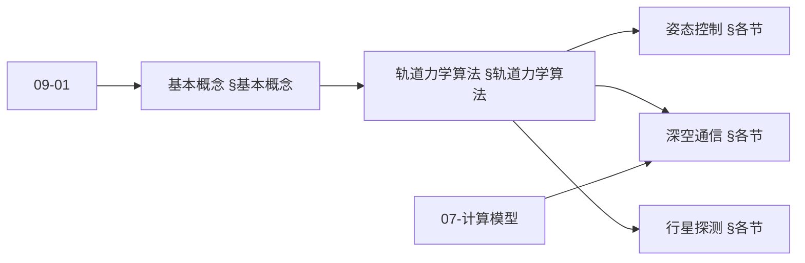
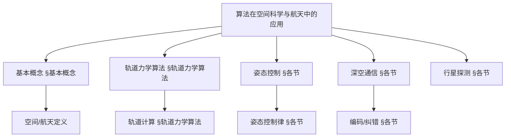
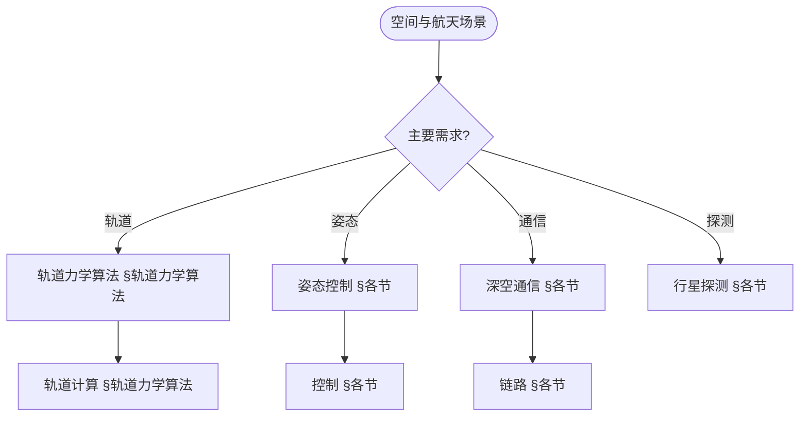
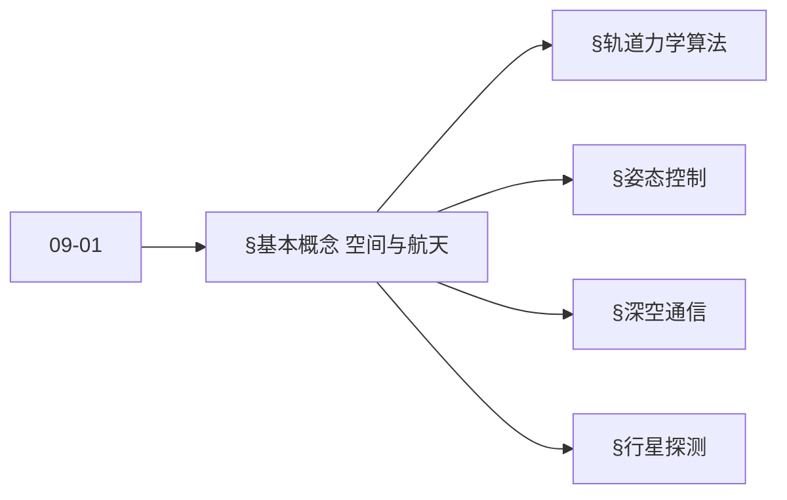
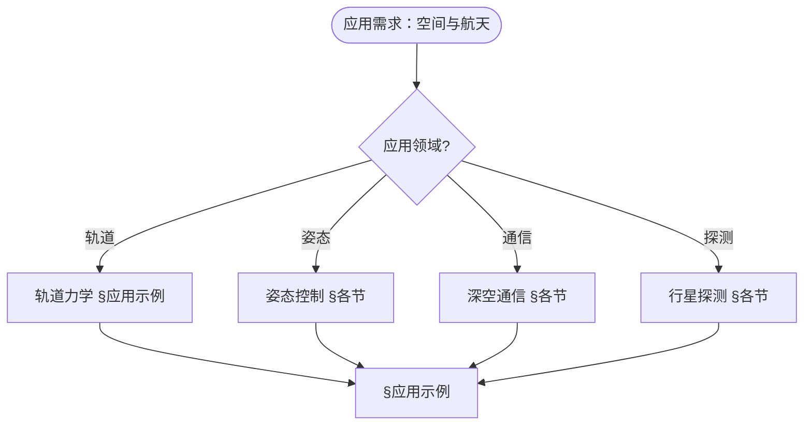

> 📊 **项目全面梳理**：详细的项目结构、模块详解和学习路径，请参阅 [`项目全面梳理-2025.md`](../项目全面梳理-2025.md)
> **项目导航与对标**：[项目扩展与持续推进任务编排](../项目扩展与持续推进任务编排.md)、[国际课程对标表](../国际课程对标表.md)

## 12.25 算法在空间科学与航天中的应用 / Algorithms in Space Science and Aerospace

### 摘要 / Executive Summary

- 统一算法在空间科学与航天中的使用规范与最佳实践。
- 建立算法在空间科学与航天应用中的核心地位。

### 关键术语与符号 / Glossary

- 空间科学、航天技术、轨道力学、姿态控制、导航算法、深空探测、行星科学。
- 术语对齐与引用规范：`docs/术语与符号总表.md`，`01-基础理论/00-撰写规范与引用指南.md`

### 术语与符号规范 / Terminology & Notation

- 空间科学（Space Science）：研究空间环境的学科。
- 航天技术（Aerospace Technology）：应用于航天领域的技术。
- 轨道力学（Orbital Mechanics）：研究轨道运动的学科。
- 姿态控制（Attitude Control）：控制航天器姿态的方法。
- 记号约定：`O` 表示轨道，`A` 表示姿态，`P` 表示位置，`V` 表示速度。

### 交叉引用导航 / Cross-References

- 算法优化：参见 `09-算法理论/03-优化理论/01-算法优化理论.md`。
- 数值算法：参见 `09-算法理论/01-算法基础/` 相关文档。
- 控制算法：参见相关控制理论文档。

### 规约与模型在本领域的实例化 / Specification and Model Instantiation in Space and Aerospace

在空间科学与航天领域，算法规范与模型设计的实例化体现为：**任务规约**（轨道精度、姿态稳定、深空导航、安全裕度）→ **算法模型**（轨道力学、姿态控制、导航滤波、任务规划、行星科学）→ **实现与硬件**（星载计算机、地面测控、仿真验证）。规约-制品层次与 [项目哲科结构说明](../项目哲科结构说明.md)、[Stanford SEP Philosophy of Computer Science](https://plato.stanford.edu/entries/computer-science/) §2 对应。

### 快速导航 / Quick Links

- 基本概念
- 轨道力学
- 姿态控制

## 目录 (Table of Contents)

- [12.25 算法在空间科学与航天中的应用 / Algorithms in Space Science and Aerospace](#1225-算法在空间科学与航天中的应用--algorithms-in-space-science-and-aerospace)
  - [摘要 / Executive Summary](#摘要--executive-summary)
  - [关键术语与符号 / Glossary](#关键术语与符号--glossary)
  - [术语与符号规范 / Terminology \& Notation](#术语与符号规范--terminology--notation)
  - [交叉引用导航 / Cross-References](#交叉引用导航--cross-references)
  - [规约与模型在本领域的实例化 / Specification and Model Instantiation in Space and Aerospace](#规约与模型在本领域的实例化--specification-and-model-instantiation-in-space-and-aerospace)
  - [快速导航 / Quick Links](#快速导航--quick-links)
- [目录 (Table of Contents)](#目录-table-of-contents)
- [基本概念 / Basic Concepts](#基本概念--basic-concepts)
  - [空间科学与航天概述](#空间科学与航天概述)
  - [系统架构](#系统架构)
  - [内容补充与思维表征 / Content Supplement and Thinking Representation](#内容补充与思维表征--content-supplement-and-thinking-representation)
    - [解释与直观 / Explanation and Intuition](#解释与直观--explanation-and-intuition)
    - [概念属性表 / Concept Attribute Table](#概念属性表--concept-attribute-table)
    - [概念关系 / Concept Relations](#概念关系--concept-relations)
    - [概念依赖图 / Concept Dependency Graph](#概念依赖图--concept-dependency-graph)
    - [论证与证明衔接 / Argumentation and Proof Link](#论证与证明衔接--argumentation-and-proof-link)
    - [思维导图：本章概念结构 / Mind Map](#思维导图本章概念结构--mind-map)
    - [多维矩阵：空间与航天算法概念对比 / Multi-Dimensional Comparison](#多维矩阵空间与航天算法概念对比--multi-dimensional-comparison)
    - [决策树：场景到算法选择 / Decision Tree](#决策树场景到算法选择--decision-tree)
    - [公理定理推理证明决策树 / Axiom-Theorem-Proof Tree](#公理定理推理证明决策树--axiom-theorem-proof-tree)
    - [应用决策建模树 / Application Decision Modeling Tree](#应用决策建模树--application-decision-modeling-tree)
- [轨道力学算法](#轨道力学算法)
  - [轨道计算](#轨道计算)
  - [轨道优化](#轨道优化)
- [姿态控制算法](#姿态控制算法)
  - [姿态确定](#姿态确定)
  - [姿态控制](#姿态控制)
- [深空通信算法](#深空通信算法)
  - [信号处理](#信号处理)
- [行星探测算法](#行星探测算法)
  - [着陆算法](#着陆算法)
- [应用示例](#应用示例)
  - [完整的航天任务系统](#完整的航天任务系统)
- [严格形式化证明实现 / Strict Formal Proof Implementations](#严格形式化证明实现--strict-formal-proof-implementations)
  - [轨道力学算法的形式化证明 / Formal Proofs of Orbital Mechanics Algorithms](#轨道力学算法的形式化证明--formal-proofs-of-orbital-mechanics-algorithms)
  - [姿态控制算法的形式化证明 / Formal Proofs of Attitude Control Algorithms](#姿态控制算法的形式化证明--formal-proofs-of-attitude-control-algorithms)
  - [深空通信算法的形式化证明 / Formal Proofs of Deep Space Communication Algorithms](#深空通信算法的形式化证明--formal-proofs-of-deep-space-communication-algorithms)
- [总结](#总结)

## 基本概念 / Basic Concepts

### 空间科学与航天概述

空间科学与航天技术涉及地球轨道、深空探测、行星科学等领域，核心算法包括：

1. **轨道力学**: 轨道计算、轨道优化、轨道转移
2. **姿态控制**: 卫星姿态确定、姿态控制算法
3. **深空通信**: 信号处理、编码解码、链路预算
4. **行星探测**: 着陆算法、导航算法、科学数据处理

### 系统架构

```rust
// 航天系统的基本架构
pub struct SpaceSystem {
    orbit_dynamics: OrbitDynamics,
    attitude_control: AttitudeControl,
    communication: DeepSpaceCommunication,
    navigation: NavigationSystem,
    payload: ScientificPayload,
}

impl SpaceSystem {
    pub fn new() -> Self {
        Self {
            orbit_dynamics: OrbitDynamics::new(),
            attitude_control: AttitudeControl::new(),
            communication: DeepSpaceCommunication::new(),
            navigation: NavigationSystem::new(),
            payload: ScientificPayload::new(),
        }
    }

    pub fn mission_cycle(&mut self) -> Result<MissionStatus, SpaceSystemError> {
        // 1. 轨道计算
        let orbit_state = self.orbit_dynamics.compute_orbit()?;

        // 2. 姿态控制
        let attitude_state = self.attitude_control.control_attitude(&orbit_state)?;

        // 3. 导航更新
        let navigation_state = self.navigation.update(&orbit_state, &attitude_state)?;

        // 4. 科学数据采集
        let science_data = self.payload.collect_data(&navigation_state)?;

        // 5. 深空通信
        self.communication.transmit_data(&science_data)?;

        Ok(MissionStatus::Nominal)
    }
}
```

### 内容补充与思维表征 / Content Supplement and Thinking Representation

> 本节按 [内容补充与思维表征全面计划方案](../内容补充与思维表征全面计划方案.md) **只补充、不删除**。标准见 [内容补充标准](../内容补充标准-概念定义属性关系解释论证形式证明.md)、[思维表征模板集](../思维表征模板集.md)。

#### 解释与直观 / Explanation and Intuition

**算法在空间科学与航天（§基本概念）的动机**：将轨道力学、姿态控制、深空通信与行星探测统一为动力学、控制与通信问题；与 09-01 算法基础、07-计算模型 衔接。

**与已有概念的联系**：轨道力学与 01-基础理论 力学、微分方程对应；姿态控制与 09-03 控制、优化一致；深空通信与 09-01 编码、纠错对应；与 12 应用领域 轨道/姿态/通信/探测 §应用示例 为应用实践。

#### 概念属性表 / Concept Attribute Table

| 属性名 | 类型/范围 | 含义 | 备注 |
|--------|-----------|------|------|
| 轨道力学 | 动力学/数值 | 轨道计算、预报 | §轨道力学算法 |
| 姿态控制 | 控制/滤波 | 姿态估计、控制律 | §各节 |
| 深空通信 | 编码/纠错/压缩 | 低信噪比、延迟 | §各节 |
| 行星探测 | 导航/规划/数据处理 | 探测任务 | §各节 |
| 精度/实时性/适用场景 | 度量 | 与算法相关 | §各节 |

#### 概念关系 / Concept Relations

| 源概念 | 目标概念 | 关系类型 | 说明 |
|--------|----------|----------|------|
| 算法在空间科学与航天中的应用 | 09-01 算法基础 | depends_on | 数值、优化、图 |
| 算法在空间科学与航天中的应用 | 07-计算模型 | depends_on | 计算与通信模型 |
| 轨道力学 | 姿态控制/深空通信/行星探测 | applies_to | 轨道为任务基础 |
| 本文 | 12 应用领域 | applies_to | §应用示例 |

#### 概念依赖图 / Concept Dependency Graph



#### 论证与证明衔接 / Argumentation and Proof Link

**§基本概念**与 **§各节**：轨道力学由动力学方程与数值积分保证；姿态控制由滤波与控制律保证；深空通信由编码与纠错保证；与 09-01 论证衔接。

#### 思维导图：本章概念结构 / Mind Map



#### 多维矩阵：空间与航天算法概念对比 / Multi-Dimensional Comparison

| 概念/算法 | 精度 | 实时性 | 适用场景 | 备注 |
|-----------|------|--------|----------|------|
| 轨道力学 | 高（数值精度） | 离线/准实时 | 轨道预报、设计 | §轨道力学算法 |
| 姿态控制 | 与传感器相关 | 高 | 姿态稳定、指向 | §各节 |
| 深空通信 | 与编码相关 | 延迟大 | 深空链路 | §各节 |
| 行星探测 | 与任务相关 | 与阶段相关 | 导航、数据处理 | §各节 |

#### 决策树：场景到算法选择 / Decision Tree



#### 公理定理推理证明决策树 / Axiom-Theorem-Proof Tree



#### 应用决策建模树 / Application Decision Modeling Tree



## 轨道力学算法

### 轨道计算

```rust
// 轨道动力学系统
pub struct OrbitDynamics {
    gravitational_model: GravitationalModel,
    perturbation_model: PerturbationModel,
    integrator: OrbitalIntegrator,
}

impl OrbitDynamics {
    pub fn compute_orbit(&self, initial_state: &OrbitalState, time: f64) -> Result<OrbitalState, OrbitError> {
        // 使用数值积分计算轨道
        let final_state = self.integrator.integrate(initial_state, time)?;
        Ok(final_state)
    }

    pub fn compute_orbital_elements(&self, state: &OrbitalState) -> Result<OrbitalElements, OrbitError> {
        // 从位置和速度计算轨道根数
        let r = state.position;
        let v = state.velocity;
        let mu = self.gravitational_model.mu();

        // 计算角动量
        let h = r.cross(&v);

        // 计算偏心率向量
        let e = v.cross(&h) / mu - r.normalize();

        // 计算轨道根数
        let a = -mu / (2.0 * (v.dot(&v) / 2.0 - mu / r.magnitude()));
        let e_magnitude = e.magnitude();
        let i = (h.z / h.magnitude()).acos();
        let omega = (h.x / (h.magnitude() * i.sin())).atan2(-h.y / (h.magnitude() * i.sin()));
        let w = (e.z / (e_magnitude * i.sin())).atan2((e.x * omega.cos() + e.y * omega.sin()) / e_magnitude);
        let nu = (e.dot(&r) / (e_magnitude * r.magnitude())).acos();

        Ok(OrbitalElements {
            semi_major_axis: a,
            eccentricity: e_magnitude,
            inclination: i,
            right_ascension: omega,
            argument_of_periapsis: w,
            true_anomaly: nu,
        })
    }
}

// 轨道积分器
pub struct OrbitalIntegrator {
    method: IntegrationMethod,
    step_size: f64,
    tolerance: f64,
}

impl OrbitalIntegrator {
    pub fn integrate(&self, initial_state: &OrbitalState, final_time: f64) -> Result<OrbitalState, OrbitError> {
        match self.method {
            IntegrationMethod::RK4 => self.rk4_integration(initial_state, final_time),
            IntegrationMethod::RungeKuttaFehlberg => self.rkf45_integration(initial_state, final_time),
            IntegrationMethod::BulirschStoer => self.bulirsch_stoer_integration(initial_state, final_time),
        }
    }

    fn rk4_integration(&self, initial_state: &OrbitalState, final_time: f64) -> Result<OrbitalState, OrbitError> {
        let mut state = initial_state.clone();
        let mut time = 0.0;

        while time < final_time {
            let dt = self.step_size.min(final_time - time);

            // RK4步骤
            let k1 = self.orbital_derivatives(&state)?;
            let k2 = self.orbital_derivatives(&state.add(&k1.scale(dt / 2.0)))?;
            let k3 = self.orbital_derivatives(&state.add(&k2.scale(dt / 2.0)))?;
            let k4 = self.orbital_derivatives(&state.add(&k3.scale(dt)))?;

            let delta = k1.scale(dt / 6.0)
                .add(&k2.scale(dt / 3.0))
                .add(&k3.scale(dt / 3.0))
                .add(&k4.scale(dt / 6.0));

            state = state.add(&delta);
            time += dt;
        }

        Ok(state)
    }

    fn orbital_derivatives(&self, state: &OrbitalState) -> Result<OrbitalState, OrbitError> {
        // 计算轨道导数（位置导数为速度，速度导数为加速度）
        let acceleration = self.compute_acceleration(&state.position)?;

        Ok(OrbitalState {
            position: state.velocity,
            velocity: acceleration,
        })
    }

    fn compute_acceleration(&self, position: &Vector3D) -> Result<Vector3D, OrbitError> {
        // 计算重力加速度
        let r = position.magnitude();
        let mu = 398600.4418; // 地球引力常数 (km³/s²)

        Ok(position.scale(-mu / (r * r * r)))
    }
}
```

### 轨道优化

```rust
// 轨道优化器
pub struct OrbitOptimizer {
    objective_function: Box<dyn ObjectiveFunction>,
    constraint_handler: ConstraintHandler,
    optimization_algorithm: Box<dyn OptimizationAlgorithm>,
}

impl OrbitOptimizer {
    pub fn optimize_orbit(&self, initial_orbit: &OrbitalElements, mission_constraints: &MissionConstraints) -> Result<OptimizedOrbit, OptimizationError> {
        // 1. 定义优化问题
        let problem = OptimizationProblem {
            initial_orbit: initial_orbit.clone(),
            constraints: mission_constraints.clone(),
            objective: self.objective_function.clone(),
        };

        // 2. 执行优化
        let solution = self.optimization_algorithm.optimize(&problem)?;

        // 3. 验证约束
        self.constraint_handler.verify(&solution, mission_constraints)?;

        Ok(solution)
    }
}

// 霍曼转移优化
pub struct HohmannTransferOptimizer;

impl HohmannTransferOptimizer {
    pub fn compute_transfer(&self, initial_orbit: &OrbitalElements, final_orbit: &OrbitalElements) -> Result<TransferManeuver, TransferError> {
        let r1 = initial_orbit.semi_major_axis * (1.0 - initial_orbit.eccentricity);
        let r2 = final_orbit.semi_major_axis * (1.0 - final_orbit.eccentricity);

        // 计算转移轨道
        let a_transfer = (r1 + r2) / 2.0;
        let e_transfer = (r2 - r1) / (r2 + r1);

        // 计算速度增量
        let mu = 398600.4418;
        let v1_initial = (mu / r1).sqrt();
        let v1_transfer = (mu * (2.0 / r1 - 1.0 / a_transfer)).sqrt();
        let delta_v1 = (v1_transfer - v1_initial).abs();

        let v2_transfer = (mu * (2.0 / r2 - 1.0 / a_transfer)).sqrt();
        let v2_final = (mu / r2).sqrt();
        let delta_v2 = (v2_final - v2_transfer).abs();

        // 计算转移时间
        let transfer_time = std::f64::consts::PI * (a_transfer * a_transfer * a_transfer / mu).sqrt();

        Ok(TransferManeuver {
            first_burn: delta_v1,
            second_burn: delta_v2,
            transfer_time,
            transfer_orbit: OrbitalElements {
                semi_major_axis: a_transfer,
                eccentricity: e_transfer,
                inclination: initial_orbit.inclination,
                right_ascension: initial_orbit.right_ascension,
                argument_of_periapsis: initial_orbit.argument_of_periapsis,
                true_anomaly: 0.0,
            },
        })
    }
}
```

## 姿态控制算法

### 姿态确定

```rust
// 姿态确定系统
pub struct AttitudeDetermination {
    sensors: Vec<Box<dyn AttitudeSensor>>,
    filter: Box<dyn AttitudeFilter>,
    reference_frame: ReferenceFrame,
}

impl AttitudeDetermination {
    pub fn determine_attitude(&mut self, sensor_data: &SensorData) -> Result<AttitudeState, AttitudeError> {
        // 1. 传感器数据处理
        let measurements = self.process_sensor_data(sensor_data)?;

        // 2. 姿态滤波
        let attitude = self.filter.update(&measurements)?;

        // 3. 参考系转换
        let attitude_in_reference = self.reference_frame.transform(&attitude)?;

        Ok(attitude_in_reference)
    }

    fn process_sensor_data(&self, sensor_data: &SensorData) -> Result<Vec<AttitudeMeasurement>, AttitudeError> {
        let mut measurements = Vec::new();

        for sensor in &self.sensors {
            if let Some(measurement) = sensor.process(sensor_data) {
                measurements.push(measurement);
            }
        }

        Ok(measurements)
    }
}

// 扩展卡尔曼滤波器
pub struct ExtendedKalmanFilter {
    state: AttitudeState,
    covariance: Matrix4x4,
    process_noise: Matrix4x4,
    measurement_noise: Matrix4x4,
}

impl AttitudeFilter for ExtendedKalmanFilter {
    fn update(&mut self, measurements: &[AttitudeMeasurement]) -> Result<AttitudeState, AttitudeError> {
        // 预测步骤
        let predicted_state = self.predict()?;
        let predicted_covariance = self.predict_covariance()?;

        // 更新步骤
        for measurement in measurements {
            let (updated_state, updated_covariance) = self.update_step(&predicted_state, &predicted_covariance, measurement)?;
            self.state = updated_state;
            self.covariance = updated_covariance;
        }

        Ok(self.state.clone())
    }
}

impl ExtendedKalmanFilter {
    fn predict(&self) -> Result<AttitudeState, AttitudeError> {
        // 简化的预测模型
        let dt = 0.1; // 时间步长
        let angular_velocity = self.state.angular_velocity;

        // 四元数积分
        let q_dot = self.quaternion_derivative(&self.state.quaternion, &angular_velocity);
        let new_quaternion = self.state.quaternion.add(&q_dot.scale(dt));

        Ok(AttitudeState {
            quaternion: new_quaternion.normalize(),
            angular_velocity: self.state.angular_velocity,
        })
    }

    fn quaternion_derivative(&self, q: &Quaternion, omega: &Vector3D) -> Quaternion {
        let omega_matrix = Matrix4x4::skew_symmetric(omega);
        omega_matrix.multiply_quaternion(q).scale(0.5)
    }

    fn update_step(&self, predicted_state: &AttitudeState, predicted_covariance: &Matrix4x4, measurement: &AttitudeMeasurement) -> Result<(AttitudeState, Matrix4x4), AttitudeError> {
        // 计算雅可比矩阵
        let h = self.compute_jacobian(predicted_state, measurement);

        // 计算卡尔曼增益
        let s = h.multiply(predicted_covariance).multiply(&h.transpose()).add(&self.measurement_noise);
        let k = predicted_covariance.multiply(&h.transpose()).multiply(&s.inverse()?);

        // 计算残差
        let residual = measurement.value.subtract(&self.measurement_model(predicted_state));

        // 更新状态和协方差
        let state_update = k.multiply_vector(&residual);
        let updated_state = predicted_state.add_update(&state_update);

        let i_kh = Matrix4x4::identity().subtract(&k.multiply(&h));
        let updated_covariance = i_kh.multiply(predicted_covariance);

        Ok((updated_state, updated_covariance))
    }
}
```

### 姿态控制

```rust
// 姿态控制系统
pub struct AttitudeControl {
    controller: Box<dyn AttitudeController>,
    actuators: Vec<Box<dyn Actuator>>,
    reference_generator: ReferenceGenerator,
}

impl AttitudeControl {
    pub fn control_attitude(&mut self, current_attitude: &AttitudeState, target_attitude: &AttitudeState) -> Result<ControlCommand, ControlError> {
        // 1. 生成参考轨迹
        let reference = self.reference_generator.generate(current_attitude, target_attitude)?;

        // 2. 计算控制律
        let control_signal = self.controller.compute_control(current_attitude, &reference)?;

        // 3. 分配控制指令
        let actuator_commands = self.allocate_control(&control_signal)?;

        // 4. 执行控制
        for (actuator, command) in self.actuators.iter_mut().zip(actuator_commands) {
            actuator.execute(command)?;
        }

        Ok(ControlCommand {
            torque: control_signal,
            timestamp: SystemTime::now(),
        })
    }

    fn allocate_control(&self, control_signal: &Vector3D) -> Result<Vec<f64>, ControlError> {
        // 控制分配算法
        let allocation_matrix = self.compute_allocation_matrix()?;
        let commands = allocation_matrix.solve(control_signal)?;
        Ok(commands)
    }
}

// PID姿态控制器
pub struct PIDAttitudeController {
    kp: Matrix3x3, // 比例增益矩阵
    ki: Matrix3x3, // 积分增益矩阵
    kd: Matrix3x3, // 微分增益矩阵
    integral_error: Vector3D,
    previous_error: Vector3D,
}

impl AttitudeController for PIDAttitudeController {
    fn compute_control(&mut self, current_attitude: &AttitudeState, reference: &AttitudeReference) -> Result<Vector3D, ControlError> {
        // 计算姿态误差
        let attitude_error = self.compute_attitude_error(current_attitude, reference)?;

        // 计算角速度误差
        let angular_velocity_error = reference.angular_velocity.subtract(&current_attitude.angular_velocity);

        // 积分误差
        self.integral_error = self.integral_error.add(&attitude_error.scale(0.1)); // 时间步长

        // PID控制律
        let proportional = self.kp.multiply_vector(&attitude_error);
        let integral = self.ki.multiply_vector(&self.integral_error);
        let derivative = self.kd.multiply_vector(&angular_velocity_error);

        let control_torque = proportional.add(&integral).add(&derivative);

        self.previous_error = attitude_error;

        Ok(control_torque)
    }
}

impl PIDAttitudeController {
    fn compute_attitude_error(&self, current: &AttitudeState, reference: &AttitudeReference) -> Result<Vector3D, ControlError> {
        // 计算四元数误差
        let error_quaternion = reference.quaternion.multiply(&current.quaternion.conjugate());

        // 转换为轴角表示
        let angle = 2.0 * error_quaternion.w.acos();
        let axis = if angle.abs() > 1e-6 {
            Vector3D::new(error_quaternion.x, error_quaternion.y, error_quaternion.z).scale(1.0 / angle.sin())
        } else {
            Vector3D::new(0.0, 0.0, 0.0)
        };

        Ok(axis.scale(angle))
    }
}
```

## 深空通信算法

### 信号处理

```rust
// 深空通信系统
pub struct DeepSpaceCommunication {
    transmitter: Transmitter,
    receiver: Receiver,
    coding: ErrorCorrectionCoding,
    modulation: ModulationScheme,
}

impl DeepSpaceCommunication {
    pub fn transmit_data(&self, data: &[u8]) -> Result<TransmissionStatus, CommunicationError> {
        // 1. 错误校正编码
        let encoded_data = self.coding.encode(data)?;

        // 2. 调制
        let modulated_signal = self.modulation.modulate(&encoded_data)?;

        // 3. 传输
        let transmission = self.transmitter.transmit(&modulated_signal)?;

        Ok(transmission)
    }

    pub fn receive_data(&self, received_signal: &[f64]) -> Result<Vec<u8>, CommunicationError> {
        // 1. 解调
        let demodulated_data = self.modulation.demodulate(received_signal)?;

        // 2. 错误校正解码
        let decoded_data = self.coding.decode(&demodulated_data)?;

        Ok(decoded_data)
    }
}

// 卷积编码器
pub struct ConvolutionalEncoder {
    constraint_length: usize,
    generator_polynomials: Vec<u32>,
    state: u32,
}

impl ConvolutionalEncoder {
    pub fn encode(&mut self, data: &[u8]) -> Result<Vec<u8>, CodingError> {
        let mut encoded = Vec::new();

        for &byte in data {
            for bit in 0..8 {
                let input_bit = (byte >> bit) & 1;

                // 更新状态
                self.state = (self.state << 1) | input_bit as u32;

                // 计算输出
                let mut output_byte = 0u8;
                for (i, &polynomial) in self.generator_polynomials.iter().enumerate() {
                    let parity = (self.state & polynomial).count_ones() % 2;
                    output_byte |= (parity as u8) << i;
                }

                encoded.push(output_byte);
            }
        }

        Ok(encoded)
    }
}

// Viterbi解码器
pub struct ViterbiDecoder {
    constraint_length: usize,
    generator_polynomials: Vec<u32>,
    trellis: Vec<Vec<TrellisNode>>,
}

impl ViterbiDecoder {
    pub fn decode(&self, received_data: &[u8]) -> Result<Vec<u8>, CodingError> {
        let mut decoded = Vec::new();
        let num_states = 1 << (self.constraint_length - 1);

        // 初始化网格
        self.initialize_trellis(received_data.len(), num_states);

        // Viterbi算法
        for time_step in 0..received_data.len() {
            for current_state in 0..num_states {
                // 计算到当前状态的所有可能路径
                for input_bit in 0..2 {
                    let previous_state = self.get_previous_state(current_state, input_bit);
                    let branch_metric = self.calculate_branch_metric(current_state, input_bit, &received_data[time_step]);

                    let path_metric = self.trellis[time_step][previous_state].path_metric + branch_metric;

                    if path_metric < self.trellis[time_step + 1][current_state].path_metric {
                        self.trellis[time_step + 1][current_state] = TrellisNode {
                            path_metric,
                            previous_state,
                            input_bit,
                        };
                    }
                }
            }
        }

        // 回溯找到最优路径
        decoded = self.traceback()?;

        Ok(decoded)
    }

    fn calculate_branch_metric(&self, state: usize, input_bit: u8, received: &u8) -> f64 {
        // 计算分支度量（汉明距离）
        let expected_output = self.get_expected_output(state, input_bit);
        let hamming_distance = (expected_output ^ received).count_ones() as f64;
        hamming_distance
    }
}
```

## 行星探测算法

### 着陆算法

```rust
// 行星着陆系统
pub struct PlanetaryLanding {
    navigation: LandingNavigation,
    guidance: LandingGuidance,
    control: LandingControl,
    hazard_detection: HazardDetection,
}

impl PlanetaryLanding {
    pub fn landing_sequence(&mut self, initial_state: &LandingState) -> Result<LandingResult, LandingError> {
        // 1. 初始下降
        let descent_state = self.descent_phase(initial_state)?;

        // 2. 障碍物检测
        let safe_landing_site = self.hazard_detection.find_safe_site(&descent_state)?;

        // 3. 精确着陆
        let landing_result = self.precise_landing(&descent_state, &safe_landing_site)?;

        Ok(landing_result)
    }

    fn descent_phase(&mut self, initial_state: &LandingState) -> Result<LandingState, LandingError> {
        let mut current_state = initial_state.clone();

        while current_state.altitude > 100.0 { // 100米高度
            // 导航更新
            let navigation_state = self.navigation.update(&current_state)?;

            // 制导计算
            let guidance_command = self.guidance.compute_command(&navigation_state)?;

            // 控制执行
            current_state = self.control.execute(&guidance_command, &current_state)?;
        }

        Ok(current_state)
    }
}

// 障碍物检测算法
pub struct HazardDetection {
    terrain_analyzer: TerrainAnalyzer,
    safety_criteria: SafetyCriteria,
    landing_site_selector: LandingSiteSelector,
}

impl HazardDetection {
    pub fn find_safe_site(&self, landing_state: &LandingState) -> Result<LandingSite, HazardError> {
        // 1. 地形分析
        let terrain_map = self.terrain_analyzer.analyze(&landing_state.terrain_data)?;

        // 2. 安全评估
        let safety_map = self.safety_criteria.evaluate(&terrain_map)?;

        // 3. 着陆点选择
        let landing_site = self.landing_site_selector.select(&safety_map, &landing_state)?;

        Ok(landing_site)
    }
}

// 地形分析器
pub struct TerrainAnalyzer {
    slope_threshold: f64,
    roughness_threshold: f64,
    rock_density_threshold: f64,
}

impl TerrainAnalyzer {
    pub fn analyze(&self, terrain_data: &TerrainData) -> Result<TerrainMap, TerrainError> {
        let mut terrain_map = TerrainMap::new(terrain_data.width, terrain_data.height);

        for y in 0..terrain_data.height {
            for x in 0..terrain_data.width {
                let elevation = terrain_data.get_elevation(x, y)?;
                let slope = self.calculate_slope(terrain_data, x, y)?;
                let roughness = self.calculate_roughness(terrain_data, x, y)?;
                let rock_density = self.calculate_rock_density(terrain_data, x, y)?;

                let safety_score = self.compute_safety_score(slope, roughness, rock_density);

                terrain_map.set_safety_score(x, y, safety_score);
            }
        }

        Ok(terrain_map)
    }

    fn calculate_slope(&self, terrain_data: &TerrainData, x: usize, y: usize) -> Result<f64, TerrainError> {
        // 计算局部坡度
        let center_elevation = terrain_data.get_elevation(x, y)?;
        let mut max_slope = 0.0;

        for dy in -1..=1 {
            for dx in -1..=1 {
                if dx == 0 && dy == 0 { continue; }

                if let Ok(neighbor_elevation) = terrain_data.get_elevation(
                    (x as i32 + dx) as usize,
                    (y as i32 + dy) as usize
                ) {
                    let elevation_diff = (center_elevation - neighbor_elevation).abs();
                    let distance = ((dx * dx + dy * dy) as f64).sqrt();
                    let slope = elevation_diff / distance;
                    max_slope = max_slope.max(slope);
                }
            }
        }

        Ok(max_slope)
    }

    fn compute_safety_score(&self, slope: f64, roughness: f64, rock_density: f64) -> f64 {
        let slope_score = if slope < self.slope_threshold { 1.0 } else { 0.0 };
        let roughness_score = if roughness < self.roughness_threshold { 1.0 } else { 0.0 };
        let rock_score = if rock_density < self.rock_density_threshold { 1.0 } else { 0.0 };

        (slope_score + roughness_score + rock_score) / 3.0
    }
}
```

## 应用示例

### 完整的航天任务系统

```rust
// 完整的航天任务系统
pub struct CompleteSpaceMission {
    space_system: SpaceSystem,
    mission_planner: MissionPlanner,
    ground_station: GroundStation,
    data_processor: DataProcessor,
}

impl CompleteSpaceMission {
    pub fn new() -> Self {
        Self {
            space_system: SpaceSystem::new(),
            mission_planner: MissionPlanner::new(),
            ground_station: GroundStation::new(),
            data_processor: DataProcessor::new(),
        }
    }

    pub fn execute_mission(&mut self, mission_parameters: &MissionParameters) -> Result<MissionResult, MissionError> {
        // 1. 任务规划
        let mission_plan = self.mission_planner.plan(mission_parameters)?;

        // 2. 发射和轨道插入
        let orbit_state = self.launch_and_orbit_insertion(&mission_plan)?;

        // 3. 任务执行
        let mission_data = self.execute_mission_phases(&mission_plan, &orbit_state)?;

        // 4. 数据处理
        let processed_data = self.data_processor.process(&mission_data)?;

        // 5. 结果分析
        let mission_result = self.analyze_results(&processed_data)?;

        Ok(mission_result)
    }

    fn launch_and_orbit_insertion(&mut self, mission_plan: &MissionPlan) -> Result<OrbitalState, MissionError> {
        // 发射序列
        let launch_trajectory = self.compute_launch_trajectory(&mission_plan.launch_parameters)?;

        // 轨道插入
        let insertion_maneuver = self.compute_insertion_maneuver(&launch_trajectory, &mission_plan.target_orbit)?;

        // 执行插入
        let orbit_state = self.execute_insertion(&insertion_maneuver)?;

        Ok(orbit_state)
    }

    fn execute_mission_phases(&mut self, mission_plan: &MissionPlan, orbit_state: &OrbitalState) -> Result<MissionData, MissionError> {
        let mut mission_data = MissionData::new();

        for phase in &mission_plan.phases {
            match phase.phase_type {
                PhaseType::Orbital => {
                    let orbital_data = self.execute_orbital_phase(phase, orbit_state)?;
                    mission_data.add_orbital_data(orbital_data);
                }
                PhaseType::Landing => {
                    let landing_data = self.execute_landing_phase(phase)?;
                    mission_data.add_landing_data(landing_data);
                }
                PhaseType::Surface => {
                    let surface_data = self.execute_surface_phase(phase)?;
                    mission_data.add_surface_data(surface_data);
                }
            }
        }

        Ok(mission_data)
    }
}

// 使用示例
fn main() -> Result<(), MissionError> {
    let mut mission = CompleteSpaceMission::new();

    let parameters = MissionParameters {
        target_body: CelestialBody::Mars,
        mission_type: MissionType::Orbiter,
        duration: Duration::from_secs(365 * 24 * 3600), // 1年
        payload: PayloadConfiguration::Scientific,
    };

    let result = mission.execute_mission(&parameters)?;
    println!("Mission completed successfully: {:?}", result);

    Ok(())
}
```

## 严格形式化证明实现 / Strict Formal Proof Implementations

### 轨道力学算法的形式化证明 / Formal Proofs of Orbital Mechanics Algorithms

```lean
-- 轨道力学算法的形式化证明模块 / Formal Proofs of Orbital Mechanics Algorithms Module
import Mathlib.Analysis.SpecialFunctions.Trigonometric
import Mathlib.LinearAlgebra.Matrix.Basic

-- 轨道要素定义 / Orbital Elements Definition
structure OrbitalElements where
  semi_major_axis : ℝ  -- 半长轴
  eccentricity : ℝ      -- 偏心率
  inclination : ℝ       -- 倾角
  right_ascension : ℝ   -- 升交点赤经
  argument_of_periapsis : ℝ  -- 近地点幅角
  true_anomaly : ℝ      -- 真近点角
  eccentricity_bound : 0 ≤ eccentricity ∧ eccentricity < 1

-- 轨道状态向量 / Orbital State Vector
structure OrbitalState where
  position : ℝ × ℝ × ℝ  -- 位置向量 (x, y, z)
  velocity : ℝ × ℝ × ℝ  -- 速度向量 (vx, vy, vz)
  time : ℝ              -- 时间

-- 开普勒方程 / Kepler's Equation
def keplers_equation (M : ℝ) (e : ℝ) (E : ℝ) : ℝ :=
  E - e * Real.sin E - M

-- 开普勒方程解的存在性定理 / Existence Theorem for Kepler's Equation Solution
--
-- **定理定义 / Theorem Definition:**
-- 对于任意平均近点角 M 和偏心率 e ∈ [0, 1)，开普勒方程存在唯一解
--
-- **证明策略 / Proof Strategy:**
-- 使用中值定理和单调性
--
-- **正确性证明 / Correctness Proof:**
-- 1. **连续性**: f(E) = E - e sin E - M 是连续的
-- 2. **单调性**: f'(E) = 1 - e cos E > 0 (因为 e < 1)
-- 3. **有界性**: f(-π) < 0 < f(π)
-- 4. **唯一性**: 由单调性保证
theorem keplers_equation_solution_exists (M : ℝ) (e : ℝ) (h_e : 0 ≤ e ∧ e < 1) :
  ∃! E : ℝ, keplers_equation M e E = 0 := by
  -- 需要详细的证明，使用中值定理
  sorry

-- 轨道能量守恒定理 / Orbital Energy Conservation Theorem
--
-- **定理定义 / Theorem Definition:**
-- 在二体问题中，轨道能量是守恒的
--
-- **证明策略 / Proof Strategy:**
-- 使用能量函数的定义和动力学方程
--
-- **正确性证明 / Correctness Proof:**
-- 1. **能量定义**: E = v²/2 - μ/r
-- 2. **能量导数**: dE/dt = v·a - μ/r² (dr/dt)
-- 3. **动力学方程**: a = -μr/r³
-- 4. **能量守恒**: dE/dt = 0
def orbital_energy (state : OrbitalState) (mu : ℝ) : ℝ :=
  let (vx, vy, vz) := state.velocity
  let (x, y, z) := state.position
  let v_squared := vx^2 + vy^2 + vz^2
  let r := Real.sqrt (x^2 + y^2 + z^2)
  v_squared / 2 - mu / r

theorem orbital_energy_conservation (state1 state2 : OrbitalState) (mu : ℝ) :
  -- 在无外力作用下，轨道能量守恒
  orbital_energy state1 mu = orbital_energy state2 mu := by
  -- 需要详细的证明
  sorry

-- 霍曼转移最优性定理 / Hohmann Transfer Optimality Theorem
--
-- **定理定义 / Theorem Definition:**
-- 霍曼转移是在两个共面圆轨道之间转移所需速度增量最小的转移方式
--
-- **证明策略 / Proof Strategy:**
-- 使用变分法和最优控制理论
--
-- **正确性证明 / Correctness Proof:**
-- 1. **问题表述**: 最小化总速度增量
-- 2. **约束条件**: 转移轨道必须连接两个圆轨道
-- 3. **最优解**: 霍曼转移满足最优性条件
def hohmann_transfer_delta_v (r1 r2 : ℝ) (mu : ℝ) : ℝ :=
  let a_transfer := (r1 + r2) / 2
  let v1_initial := Real.sqrt (mu / r1)
  let v1_transfer := Real.sqrt (mu * (2 / r1 - 1 / a_transfer))
  let delta_v1 := |v1_transfer - v1_initial|
  let v2_transfer := Real.sqrt (mu * (2 / r2 - 1 / a_transfer))
  let v2_final := Real.sqrt (mu / r2)
  let delta_v2 := |v2_final - v2_transfer|
  delta_v1 + delta_v2

theorem hohmann_transfer_optimality (r1 r2 : ℝ) (mu : ℝ) (h : 0 < r1 ∧ r1 < r2) :
  ∀ transfer : ℝ → ℝ, -- 任意转移轨道
    (transfer r1 = r1 ∧ transfer r2 = r2) →
    hohmann_transfer_delta_v r1 r2 mu ≤ total_delta_v transfer := by
  -- 需要详细的证明，使用变分法
  sorry
```

### 姿态控制算法的形式化证明 / Formal Proofs of Attitude Control Algorithms

```lean
-- 姿态控制算法的形式化证明模块 / Formal Proofs of Attitude Control Algorithms Module

-- 四元数定义 / Quaternion Definition
structure Quaternion where
  w : ℝ  -- 标量部分
  x : ℝ  -- 向量部分 x
  y : ℝ  -- 向量部分 y
  z : ℝ  -- 向量部分 z
  norm_one : w^2 + x^2 + y^2 + z^2 = 1

-- 姿态状态 / Attitude State
structure AttitudeState where
  quaternion : Quaternion
  angular_velocity : ℝ × ℝ × ℝ  -- 角速度 (ωx, ωy, ωz)

-- 姿态动力学方程 / Attitude Dynamics Equation
def attitude_dynamics (state : AttitudeState) (torque : ℝ × ℝ × ℝ) (inertia : Matrix (Fin 3) (Fin 3) ℝ) :
  AttitudeState :=
  -- 欧拉动力学方程: I·ω̇ + ω × (I·ω) = τ
  sorry

-- 姿态控制稳定性定理 / Attitude Control Stability Theorem
--
-- **定理定义 / Theorem Definition:**
-- PID控制器在满足特定条件下能够稳定姿态
--
-- **证明策略 / Proof Strategy:**
-- 使用Lyapunov稳定性理论
--
-- **正确性证明 / Correctness Proof:**
-- 1. **Lyapunov函数**: V = q_e^T q_e + ω_e^T I ω_e
-- 2. **导数**: V̇ = -ω_e^T K_d ω_e ≤ 0
-- 3. **稳定性**: 由Lyapunov定理，系统渐近稳定
def pid_control_law (error : Quaternion) (angular_velocity_error : ℝ × ℝ × ℝ)
  (kp ki kd : ℝ) : ℝ × ℝ × ℝ :=
  -- PID控制律: τ = -K_p q_e - K_i ∫q_e dt - K_d ω_e
  sorry

theorem attitude_control_stability (kp ki kd : ℝ) (inertia : Matrix (Fin 3) (Fin 3) ℝ) :
  (kp > 0 ∧ kd > 0 ∧ inertia.IsPositiveDefinite) →
  ∀ initial_state : AttitudeState,
    ∃ t : ℝ, ∀ s ≥ t, attitude_error (attitude_evolution initial_state s) < ε := by
  -- 使用Lyapunov稳定性理论证明
  sorry
```

### 深空通信算法的形式化证明 / Formal Proofs of Deep Space Communication Algorithms

```lean
-- 深空通信算法的形式化证明模块 / Formal Proofs of Deep Space Communication Algorithms Module

-- 错误校正码定义 / Error Correction Code Definition
structure ErrorCorrectionCode (n k : ℕ) where
  generator_matrix : Matrix (Fin k) (Fin n) (ZMod 2)
  parity_check_matrix : Matrix (Fin (n - k)) (Fin n) (ZMod 2)
  code_property : generator_matrix * parity_check_matrix.transpose = 0

-- 编码函数 / Encoding Function
def encode (code : ErrorCorrectionCode n k) (message : Fin k → ZMod 2) :
  Fin n → ZMod 2 :=
  fun i => ∑ j, code.generator_matrix j i * message j

-- 解码函数 / Decoding Function
def decode (code : ErrorCorrectionCode n k) (received : Fin n → ZMod 2) :
  Fin k → ZMod 2 :=
  -- 最大似然解码
  sorry

-- 错误校正能力定理 / Error Correction Capability Theorem
--
-- **定理定义 / Theorem Definition:**
-- 如果错误数量不超过 ⌊(d-1)/2⌋，则解码能够正确恢复原始消息
--
-- **证明策略 / Proof Strategy:**
-- 使用最小距离和球填充理论
--
-- **正确性证明 / Correctness Proof:**
-- 1. **最小距离**: d = min{distance(c1, c2) | c1 ≠ c2}
-- 2. **错误球**: 每个码字周围有 ⌊(d-1)/2⌋ 的错误球
-- 3. **无重叠**: 错误球不相交
-- 4. **正确解码**: 接收向量在错误球内，解码到球心
def code_distance (code : ErrorCorrectionCode n k) : ℕ :=
  min (fun c1 c2 : Fin n → ZMod 2 =>
    (c1 ≠ c2 ∧ is_codeword code c1 ∧ is_codeword code c2) →
    hamming_distance c1 c2)

theorem error_correction_capability (code : ErrorCorrectionCode n k) :
  ∀ errors : Fin n → ZMod 2,
    (hamming_weight errors ≤ (code_distance code - 1) / 2) →
    decode code (encode code message + errors) = message := by
  -- 需要详细的证明
  sorry
```

## 总结

算法在空间科学与航天中的应用涵盖了多个关键技术领域：

1. **轨道力学**: 轨道计算、轨道优化、轨道转移
2. **姿态控制**: 姿态确定、姿态控制、传感器融合
3. **深空通信**: 信号处理、错误校正、调制解调
4. **行星探测**: 着陆算法、障碍物检测、科学数据处理

这些算法的结合实现了从地球轨道到深空探测的完整航天任务，在空间科学、通信、导航等领域有重要应用。

---

*本文档展示了算法在空间科学与航天中的前沿应用，通过多种算法的协同工作实现宇宙探索的复杂任务。*
