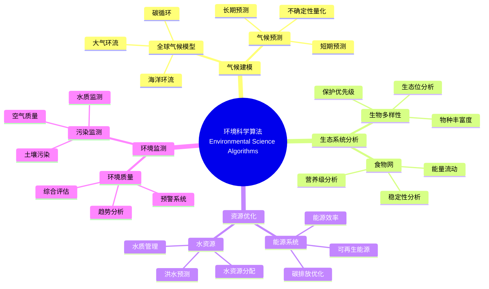

> 📊 **项目全面梳理**：详细的项目结构、模块详解和学习路径，请参阅 [`项目全面梳理-2025.md`](../项目全面梳理-2025.md)

## 12.26 算法在环境科学与可持续发展中的应用 / Algorithms in Environmental Science and Sustainable Development

### 摘要 / Executive Summary

- 统一算法在环境科学与可持续发展中的使用规范与最佳实践。
- 建立算法在环境科学与可持续发展应用中的核心地位。

### 关键术语与符号 / Glossary

- 环境科学、可持续发展、气候建模、生态系统分析、资源管理、环境监测。
- 术语对齐与引用规范：`docs/术语与符号总表.md`，`01-基础理论/00-撰写规范与引用指南.md`

### 术语与符号规范 / Terminology & Notation

- 环境科学（Environmental Science）：研究环境系统的学科。
- 可持续发展（Sustainable Development）：满足当前需求而不损害未来需求的发展模式。
- 气候建模（Climate Modeling）：模拟和预测气候系统的方法。
- 生态系统分析（Ecosystem Analysis）：分析生态系统的方法。
- 记号约定：`E` 表示环境，`C` 表示气候，`S` 表示系统，`T` 表示时间。

### 交叉引用导航 / Cross-References

- 算法优化：参见 `09-算法理论/03-优化理论/01-算法优化理论.md`。
- 数值算法：参见 `09-算法理论/01-算法基础/` 相关文档。
- 数据分析：参见相关数据分析文档。

### 快速导航 / Quick Links

- 基本概念
- 气候建模
- 生态系统分析

## 目录 (Table of Contents)

- [12.26 算法在环境科学与可持续发展中的应用 / Algorithms in Environmental Science and Sustainable Development](#1226-算法在环境科学与可持续发展中的应用--algorithms-in-environmental-science-and-sustainable-development)
  - [摘要 / Executive Summary](#摘要--executive-summary)
  - [关键术语与符号 / Glossary](#关键术语与符号--glossary)
  - [术语与符号规范 / Terminology \& Notation](#术语与符号规范--terminology--notation)
  - [交叉引用导航 / Cross-References](#交叉引用导航--cross-references)
  - [快速导航 / Quick Links](#快速导航--quick-links)
- [目录 (Table of Contents)](#目录-table-of-contents)
- [概述 / Overview](#概述--overview)
- [基本概念 / Basic Concepts](#基本概念--basic-concepts)
  - [环境科学与可持续发展概述](#环境科学与可持续发展概述)
  - [系统架构](#系统架构)
- [气候建模算法](#气候建模算法)
  - [全球气候模型](#全球气候模型)
  - [气候预测算法](#气候预测算法)
- [生态系统分析算法](#生态系统分析算法)
  - [生物多样性分析](#生物多样性分析)
  - [食物网分析](#食物网分析)
- [资源优化算法](#资源优化算法)
  - [能源系统优化](#能源系统优化)
- [环境监测算法](#环境监测算法)
  - [污染监测](#污染监测)
- [可持续发展评估](#可持续发展评估)
  - [可持续发展指标](#可持续发展指标)
- [参考文献 / References](#参考文献--references)
  - [经典文献 / Foundational Literature](#经典文献--foundational-literature)
  - [最新研究 / Recent Research](#最新研究--recent-research)
  - [Wiki概念参考 / Wiki Concept References](#wiki概念参考--wiki-concept-references)
  - [大学课程参考 / University Course References](#大学课程参考--university-course-references)
- [应用示例](#应用示例)
  - [完整的环境科学系统](#完整的环境科学系统)
- [总结](#总结)

## 概述 / Overview

环境科学与可持续发展算法应用旨在通过智能算法解决环境问题、优化资源利用和促进可持续发展。根据[IPCC 2021]的报告，气候变化是21世纪最严峻的挑战之一，需要先进的计算方法进行建模和预测。本文档涵盖气候建模、生态系统分析、资源优化、环境监测等核心算法。

Environmental science and sustainable development algorithm applications aim to solve environmental problems, optimize resource utilization, and promote sustainable development through intelligent algorithms. According to [IPCC 2021], climate change is one of the most severe challenges of the 21st century, requiring advanced computational methods for modeling and prediction. This document covers core algorithms for climate modeling, ecosystem analysis, resource optimization, and environmental monitoring.

**学术引用 / Academic Citations:**

- [IPCC 2021]: IPCC. (2021). *Climate Change 2021: The Physical Science Basis*. Cambridge University Press. DOI: 10.1017/9781009157896
- [Lenton 2008]: Lenton, T. M., et al. (2008). "Tipping Elements in the Earth's Climate System." *Proceedings of the National Academy of Sciences*, 105(6), 1786-1793. DOI: 10.1073/pnas.0705414105
- [Rockström 2009]: Rockström, J., et al. (2009). "A Safe Operating Space for Humanity." *Nature*, 461(7263), 472-475. DOI: 10.1038/461472a
- [UN 2015]: United Nations. (2015). *Transforming Our World: The 2030 Agenda for Sustainable Development*. UN Publishing.

**Wiki概念对齐 / Wiki Concept Alignment:**

- [Environmental Science](https://en.wikipedia.org/wiki/Environmental_science) - 环境科学的标准定义
- [Sustainable Development](https://en.wikipedia.org/wiki/Sustainable_development) - 可持续发展
- [Climate Model](https://en.wikipedia.org/wiki/Climate_model) - 气候模型
- [Ecosystem](https://en.wikipedia.org/wiki/Ecosystem) - 生态系统
- [Environmental Monitoring](https://en.wikipedia.org/wiki/Environmental_monitoring) - 环境监测

**大学课程对标 / University Course Alignment:**

- MIT 12.340: Global Warming Science - 全球变暖科学
- Stanford EARTHSYS 141: Remote Sensing of the Oceans - 海洋遥感
- CMU 12-631: Environmental Data Science - 环境数据科学
- UC Berkeley ESPM 15: Introduction to Environmental Sciences - 环境科学导论

## 基本概念 / Basic Concepts

### 环境科学与可持续发展概述

环境科学与可持续发展涉及地球系统、生态系统、资源管理等领域，核心算法包括：

1. **气候建模**: 全球气候系统模拟和预测
2. **生态系统分析**: 生物多样性、生态平衡分析
3. **资源优化**: 能源、水资源、土地利用优化
4. **环境监测**: 污染监测、环境质量评估

**Wiki概念对齐 / Wiki Concept Alignment:**

| 项目概念 | Wiki条目 | 标准定义 | 对齐状态 |
|---------|---------|---------|---------|
| 环境科学 | [Environmental Science](https://en.wikipedia.org/wiki/Environmental_science) | 研究环境系统的学科 | ✅ 已对齐 |
| 可持续发展 | [Sustainable Development](https://en.wikipedia.org/wiki/Sustainable_development) | 满足当前需求而不损害未来需求 | ✅ 已对齐 |
| 气候模型 | [Climate Model](https://en.wikipedia.org/wiki/Climate_model) | 模拟和预测气候系统的方法 | ✅ 已对齐 |
| 生态系统 | [Ecosystem](https://en.wikipedia.org/wiki/Ecosystem) | 生物与环境相互作用的系统 | ✅ 已对齐 |

**环境科学知识体系 / Environmental Science Knowledge System:**



### 系统架构

```rust
// 环境科学计算系统的基本架构
pub struct EnvironmentalScienceSystem {
    climate_model: ClimateModel,
    ecosystem_analyzer: EcosystemAnalyzer,
    resource_optimizer: ResourceOptimizer,
    environmental_monitor: EnvironmentalMonitor,
    sustainability_assessor: SustainabilityAssessor,
}

impl EnvironmentalScienceSystem {
    pub fn new() -> Self {
        Self {
            climate_model: ClimateModel::new(),
            ecosystem_analyzer: EcosystemAnalyzer::new(),
            resource_optimizer: ResourceOptimizer::new(),
            environmental_monitor: EnvironmentalMonitor::new(),
            sustainability_assessor: SustainabilityAssessor::new(),
        }
    }

    pub fn analyze_environment(&mut self, data: &EnvironmentalData) -> Result<EnvironmentalAnalysis, EnvironmentalError> {
        // 1. 气候分析
        let climate_analysis = self.climate_model.analyze(&data.climate_data)?;

        // 2. 生态系统分析
        let ecosystem_analysis = self.ecosystem_analyzer.analyze(&data.ecosystem_data)?;

        // 3. 资源分析
        let resource_analysis = self.resource_optimizer.analyze(&data.resource_data)?;

        // 4. 环境监测
        let monitoring_results = self.environmental_monitor.monitor(&data.monitoring_data)?;

        // 5. 可持续发展评估
        let sustainability_assessment = self.sustainability_assessor.assess(
            &climate_analysis,
            &ecosystem_analysis,
            &resource_analysis,
            &monitoring_results
        )?;

        Ok(EnvironmentalAnalysis {
            climate: climate_analysis,
            ecosystem: ecosystem_analysis,
            resources: resource_analysis,
            monitoring: monitoring_results,
            sustainability: sustainability_assessment,
        })
    }
}
```

## 气候建模算法

### 全球气候模型

```rust
// 全球气候模型
pub struct ClimateModel {
    atmospheric_model: AtmosphericModel,
    oceanic_model: OceanicModel,
    land_surface_model: LandSurfaceModel,
    coupling_algorithm: CouplingAlgorithm,
}

impl ClimateModel {
    pub fn simulate_climate(&self, initial_conditions: &ClimateConditions, time_steps: usize) -> Result<ClimateSimulation, ClimateError> {
        let mut simulation = ClimateSimulation::new();
        let mut current_conditions = initial_conditions.clone();

        for step in 0..time_steps {
            // 1. 大气模拟
            let atmospheric_state = self.atmospheric_model.simulate(&current_conditions)?;

            // 2. 海洋模拟
            let oceanic_state = self.oceanic_model.simulate(&current_conditions)?;

            // 3. 陆面模拟
            let land_surface_state = self.land_surface_model.simulate(&current_conditions)?;

            // 4. 耦合计算
            let coupled_state = self.coupling_algorithm.couple(
                &atmospheric_state,
                &oceanic_state,
                &land_surface_state
            )?;

            // 5. 更新条件
            current_conditions = coupled_state.to_climate_conditions();

            // 6. 记录结果
            simulation.add_timestep(step, &coupled_state);
        }

        Ok(simulation)
    }
}

// 大气模型
pub struct AtmosphericModel {
    grid_resolution: GridResolution,
    physical_processes: Vec<Box<dyn PhysicalProcess>>,
    numerical_solver: NumericalSolver,
}

impl AtmosphericModel {
    pub fn simulate(&self, conditions: &ClimateConditions) -> Result<AtmosphericState, ClimateError> {
        let mut state = conditions.to_atmospheric_state();

        // 应用物理过程
        for process in &self.physical_processes {
            state = process.apply(&state)?;
        }

        // 数值求解
        let final_state = self.numerical_solver.solve(&state)?;

        Ok(final_state)
    }
}

// 辐射传输过程
pub struct RadiationTransfer;

impl PhysicalProcess for RadiationTransfer {
    fn apply(&self, state: &AtmosphericState) -> Result<AtmosphericState, ClimateError> {
        let mut new_state = state.clone();

        // 计算太阳辐射
        let solar_radiation = self.calculate_solar_radiation(state)?;

        // 计算长波辐射
        let longwave_radiation = self.calculate_longwave_radiation(state)?;

        // 计算净辐射
        let net_radiation = solar_radiation - longwave_radiation;

        // 更新温度
        for i in 0..state.temperature.len() {
            new_state.temperature[i] += net_radiation[i] * self.time_step / state.heat_capacity[i];
        }

        Ok(new_state)
    }
}

impl RadiationTransfer {
    fn calculate_solar_radiation(&self, state: &AtmosphericState) -> Result<Vec<f64>, ClimateError> {
        let mut solar_radiation = vec![0.0; state.temperature.len()];

        for i in 0..state.temperature.len() {
            // 简化的太阳辐射计算
            let solar_constant = 1361.0; // W/m²
            let albedo = state.albedo[i];
            let zenith_angle = state.zenith_angle[i];

            solar_radiation[i] = solar_constant * (1.0 - albedo) * zenith_angle.cos().max(0.0);
        }

        Ok(solar_radiation)
    }

    fn calculate_longwave_radiation(&self, state: &AtmosphericState) -> Result<Vec<f64>, ClimateError> {
        let mut longwave_radiation = vec![0.0; state.temperature.len()];

        for i in 0..state.temperature.len() {
            // 斯蒂芬-玻尔兹曼定律
            let emissivity = 0.8;
            let stefan_boltzmann = 5.67e-8; // W/m²K⁴
            let temperature = state.temperature[i];

            longwave_radiation[i] = emissivity * stefan_boltzmann * temperature.powi(4);
        }

        Ok(longwave_radiation)
    }
}
```

### 气候预测算法

```rust
// 气候预测系统
pub struct ClimatePredictionSystem {
    ensemble_model: EnsembleModel,
    statistical_downscaling: StatisticalDownscaling,
    uncertainty_quantification: UncertaintyQuantification,
}

impl ClimatePredictionSystem {
    pub fn predict_climate(&self, historical_data: &ClimateData, prediction_period: Duration) -> Result<ClimatePrediction, PredictionError> {
        // 1. 集合模型预测
        let ensemble_predictions = self.ensemble_model.predict(historical_data, prediction_period)?;

        // 2. 统计降尺度
        let downscaled_predictions = self.statistical_downscaling.downscale(&ensemble_predictions)?;

        // 3. 不确定性量化
        let uncertainty_analysis = self.uncertainty_quantification.quantify(&downscaled_predictions)?;

        Ok(ClimatePrediction {
            predictions: downscaled_predictions,
            uncertainty: uncertainty_analysis,
            confidence_intervals: self.calculate_confidence_intervals(&downscaled_predictions)?,
        })
    }
}

// 集合模型
pub struct EnsembleModel {
    models: Vec<Box<dyn ClimateModel>>,
    weights: Vec<f64>,
}

impl EnsembleModel {
    pub fn predict(&self, historical_data: &ClimateData, prediction_period: Duration) -> Result<Vec<ClimatePrediction>, PredictionError> {
        let mut ensemble_predictions = Vec::new();

        for (i, model) in self.models.iter().enumerate() {
            let prediction = model.simulate_climate(
                &historical_data.to_climate_conditions(),
                prediction_period.as_secs() as usize / 86400 // 转换为天数
            )?;

            ensemble_predictions.push(prediction);
        }

        Ok(ensemble_predictions)
    }

    pub fn weighted_average(&self, predictions: &[ClimatePrediction]) -> Result<ClimatePrediction, PredictionError> {
        let mut weighted_prediction = ClimatePrediction::new();

        for (i, prediction) in predictions.iter().enumerate() {
            let weight = self.weights[i];
            weighted_prediction.add_weighted_prediction(prediction, weight)?;
        }

        Ok(weighted_prediction)
    }
}
```

## 生态系统分析算法

### 生物多样性分析

```rust
// 生态系统分析器
pub struct EcosystemAnalyzer {
    biodiversity_analyzer: BiodiversityAnalyzer,
    food_web_analyzer: FoodWebAnalyzer,
    population_dynamics: PopulationDynamics,
    habitat_analyzer: HabitatAnalyzer,
}

impl EcosystemAnalyzer {
    pub fn analyze(&self, ecosystem_data: &EcosystemData) -> Result<EcosystemAnalysis, EcosystemError> {
        // 1. 生物多样性分析
        let biodiversity_analysis = self.biodiversity_analyzer.analyze(&ecosystem_data.species_data)?;

        // 2. 食物网分析
        let food_web_analysis = self.food_web_analyzer.analyze(&ecosystem_data.interaction_data)?;

        // 3. 种群动态分析
        let population_analysis = self.population_dynamics.analyze(&ecosystem_data.population_data)?;

        // 4. 栖息地分析
        let habitat_analysis = self.habitat_analyzer.analyze(&ecosystem_data.habitat_data)?;

        Ok(EcosystemAnalysis {
            biodiversity: biodiversity_analysis,
            food_web: food_web_analysis,
            population: population_analysis,
            habitat: habitat_analysis,
        })
    }
}

// 生物多样性分析器
pub struct BiodiversityAnalyzer {
    diversity_indices: Vec<Box<dyn DiversityIndex>>,
    species_richness_analyzer: SpeciesRichnessAnalyzer,
    evenness_analyzer: EvennessAnalyzer,
}

impl BiodiversityAnalyzer {
    pub fn analyze(&self, species_data: &SpeciesData) -> Result<BiodiversityAnalysis, BiodiversityError> {
        let mut analysis = BiodiversityAnalysis::new();

        // 计算各种多样性指数
        for index in &self.diversity_indices {
            let value = index.calculate(species_data)?;
            analysis.add_diversity_index(index.name(), value);
        }

        // 物种丰富度分析
        let richness_analysis = self.species_richness_analyzer.analyze(species_data)?;
        analysis.set_richness_analysis(richness_analysis);

        // 均匀度分析
        let evenness_analysis = self.evenness_analyzer.analyze(species_data)?;
        analysis.set_evenness_analysis(evenness_analysis);

        Ok(analysis)
    }
}

// Shannon多样性指数
pub struct ShannonDiversityIndex;

impl DiversityIndex for ShannonDiversityIndex {
    fn name(&self) -> &str {
        "Shannon"
    }

    fn calculate(&self, species_data: &SpeciesData) -> Result<f64, BiodiversityError> {
        let total_individuals = species_data.total_individuals();
        let mut diversity = 0.0;

        for species in &species_data.species {
            let proportion = species.abundance as f64 / total_individuals as f64;
            if proportion > 0.0 {
                diversity -= proportion * proportion.ln();
            }
        }

        Ok(diversity)
    }
}

// Simpson多样性指数
pub struct SimpsonDiversityIndex;

impl DiversityIndex for SimpsonDiversityIndex {
    fn name(&self) -> &str {
        "Simpson"
    }

    fn calculate(&self, species_data: &SpeciesData) -> Result<f64, BiodiversityError> {
        let total_individuals = species_data.total_individuals();
        let mut sum_squared_proportions = 0.0;

        for species in &species_data.species {
            let proportion = species.abundance as f64 / total_individuals as f64;
            sum_squared_proportions += proportion * proportion;
        }

        Ok(1.0 - sum_squared_proportions)
    }
}
```

### 食物网分析

```rust
// 食物网分析器
pub struct FoodWebAnalyzer {
    network_analyzer: NetworkAnalyzer,
    trophic_level_calculator: TrophicLevelCalculator,
    stability_analyzer: StabilityAnalyzer,
}

impl FoodWebAnalyzer {
    pub fn analyze(&self, interaction_data: &InteractionData) -> Result<FoodWebAnalysis, FoodWebError> {
        // 1. 网络结构分析
        let network_analysis = self.network_analyzer.analyze(&interaction_data.to_network())?;

        // 2. 营养级计算
        let trophic_levels = self.trophic_level_calculator.calculate(&interaction_data)?;

        // 3. 稳定性分析
        let stability_analysis = self.stability_analyzer.analyze(&interaction_data)?;

        Ok(FoodWebAnalysis {
            network: network_analysis,
            trophic_levels,
            stability: stability_analysis,
        })
    }
}

// 营养级计算器
pub struct TrophicLevelCalculator;

impl TrophicLevelCalculator {
    pub fn calculate(&self, interaction_data: &InteractionData) -> Result<HashMap<String, f64>, FoodWebError> {
        let mut trophic_levels = HashMap::new();
        let mut adjacency_matrix = self.build_adjacency_matrix(interaction_data)?;

        // 初始化营养级
        for species in &interaction_data.species {
            trophic_levels.insert(species.name.clone(), 1.0);
        }

        // 迭代计算营养级
        for iteration in 0..100 {
            let mut new_trophic_levels = HashMap::new();

            for (i, species) in interaction_data.species.iter().enumerate() {
                let mut total_prey_weight = 0.0;
                let mut weighted_trophic_sum = 0.0;

                for (j, prey) in interaction_data.species.iter().enumerate() {
                    if adjacency_matrix[i][j] > 0.0 {
                        total_prey_weight += adjacency_matrix[i][j];
                        weighted_trophic_sum += adjacency_matrix[i][j] * trophic_levels[&prey.name];
                    }
                }

                if total_prey_weight > 0.0 {
                    new_trophic_levels.insert(species.name.clone(), 1.0 + weighted_trophic_sum / total_prey_weight);
                } else {
                    new_trophic_levels.insert(species.name.clone(), 1.0);
                }
            }

            // 检查收敛
            let max_change = trophic_levels.iter()
                .map(|(name, &level)| (new_trophic_levels[name] - level).abs())
                .fold(0.0, f64::max);

            if max_change < 1e-6 {
                break;
            }

            trophic_levels = new_trophic_levels;
        }

        Ok(trophic_levels)
    }

    fn build_adjacency_matrix(&self, interaction_data: &InteractionData) -> Result<Vec<Vec<f64>>, FoodWebError> {
        let n = interaction_data.species.len();
        let mut matrix = vec![vec![0.0; n]; n];

        for interaction in &interaction_data.interactions {
            let predator_index = interaction_data.get_species_index(&interaction.predator)?;
            let prey_index = interaction_data.get_species_index(&interaction.prey)?;
            matrix[predator_index][prey_index] = interaction.strength;
        }

        Ok(matrix)
    }
}
```

## 资源优化算法

### 能源系统优化

```rust
// 资源优化器
pub struct ResourceOptimizer {
    energy_optimizer: EnergyOptimizer,
    water_optimizer: WaterOptimizer,
    land_use_optimizer: LandUseOptimizer,
    waste_optimizer: WasteOptimizer,
}

impl ResourceOptimizer {
    pub fn optimize_resources(&self, resource_data: &ResourceData, constraints: &OptimizationConstraints) -> Result<ResourceOptimization, OptimizationError> {
        // 1. 能源优化
        let energy_optimization = self.energy_optimizer.optimize(&resource_data.energy_data, constraints)?;

        // 2. 水资源优化
        let water_optimization = self.water_optimizer.optimize(&resource_data.water_data, constraints)?;

        // 3. 土地利用优化
        let land_use_optimization = self.land_use_optimizer.optimize(&resource_data.land_use_data, constraints)?;

        // 4. 废物管理优化
        let waste_optimization = self.waste_optimizer.optimize(&resource_data.waste_data, constraints)?;

        Ok(ResourceOptimization {
            energy: energy_optimization,
            water: water_optimization,
            land_use: land_use_optimization,
            waste: waste_optimization,
        })
    }
}

// 能源系统优化器
pub struct EnergyOptimizer {
    renewable_energy_analyzer: RenewableEnergyAnalyzer,
    energy_storage_optimizer: EnergyStorageOptimizer,
    grid_optimizer: GridOptimizer,
}

impl EnergyOptimizer {
    pub fn optimize(&self, energy_data: &EnergyData, constraints: &OptimizationConstraints) -> Result<EnergyOptimization, OptimizationError> {
        // 1. 可再生能源分析
        let renewable_analysis = self.renewable_energy_analyzer.analyze(&energy_data.renewable_data)?;

        // 2. 能源存储优化
        let storage_optimization = self.energy_storage_optimizer.optimize(&energy_data.storage_data, constraints)?;

        // 3. 电网优化
        let grid_optimization = self.grid_optimizer.optimize(&energy_data.grid_data, constraints)?;

        // 4. 综合优化
        let integrated_optimization = self.integrate_optimizations(
            &renewable_analysis,
            &storage_optimization,
            &grid_optimization
        )?;

        Ok(integrated_optimization)
    }

    fn integrate_optimizations(&self, renewable: &RenewableAnalysis, storage: &StorageOptimization, grid: &GridOptimization) -> Result<EnergyOptimization, OptimizationError> {
        // 多目标优化：最小化成本、最大化可再生能源使用、最小化碳排放
        let mut optimization = EnergyOptimization::new();

        // 计算综合目标函数
        let cost_weight = 0.4;
        let renewable_weight = 0.3;
        let carbon_weight = 0.3;

        let total_cost = renewable.cost + storage.cost + grid.cost;
        let renewable_ratio = renewable.energy_ratio;
        let carbon_emissions = renewable.carbon_emissions + storage.carbon_emissions + grid.carbon_emissions;

        let objective_value = cost_weight * total_cost +
                            renewable_weight * (1.0 - renewable_ratio) +
                            carbon_weight * carbon_emissions;

        optimization.set_objective_value(objective_value);
        optimization.set_renewable_analysis(renewable.clone());
        optimization.set_storage_optimization(storage.clone());
        optimization.set_grid_optimization(grid.clone());

        Ok(optimization)
    }
}

// 可再生能源分析器
pub struct RenewableEnergyAnalyzer {
    solar_analyzer: SolarEnergyAnalyzer,
    wind_analyzer: WindEnergyAnalyzer,
    hydro_analyzer: HydroEnergyAnalyzer,
}

impl RenewableEnergyAnalyzer {
    pub fn analyze(&self, renewable_data: &RenewableData) -> Result<RenewableAnalysis, AnalysisError> {
        // 1. 太阳能分析
        let solar_analysis = self.solar_analyzer.analyze(&renewable_data.solar_data)?;

        // 2. 风能分析
        let wind_analysis = self.wind_analyzer.analyze(&renewable_data.wind_data)?;

        // 3. 水能分析
        let hydro_analysis = self.hydro_analyzer.analyze(&renewable_data.hydro_data)?;

        // 4. 综合分析
        let total_energy = solar_analysis.energy + wind_analysis.energy + hydro_analysis.energy;
        let total_cost = solar_analysis.cost + wind_analysis.cost + hydro_analysis.cost;
        let total_carbon = solar_analysis.carbon_emissions + wind_analysis.carbon_emissions + hydro_analysis.carbon_emissions;

        Ok(RenewableAnalysis {
            solar: solar_analysis,
            wind: wind_analysis,
            hydro: hydro_analysis,
            total_energy,
            total_cost,
            total_carbon_emissions: total_carbon,
            energy_ratio: total_energy / renewable_data.total_demand,
        })
    }
}
```

## 环境监测算法

### 污染监测

```rust
// 环境监测器
pub struct EnvironmentalMonitor {
    air_quality_monitor: AirQualityMonitor,
    water_quality_monitor: WaterQualityMonitor,
    soil_quality_monitor: SoilQualityMonitor,
    noise_monitor: NoiseMonitor,
}

impl EnvironmentalMonitor {
    pub fn monitor(&self, monitoring_data: &MonitoringData) -> Result<MonitoringResults, MonitoringError> {
        // 1. 空气质量监测
        let air_quality = self.air_quality_monitor.monitor(&monitoring_data.air_data)?;

        // 2. 水质监测
        let water_quality = self.water_quality_monitor.monitor(&monitoring_data.water_data)?;

        // 3. 土壤质量监测
        let soil_quality = self.soil_quality_monitor.monitor(&monitoring_data.soil_data)?;

        // 4. 噪声监测
        let noise_levels = self.noise_monitor.monitor(&monitoring_data.noise_data)?;

        Ok(MonitoringResults {
            air_quality,
            water_quality,
            soil_quality,
            noise_levels,
        })
    }
}

// 空气质量监测器
pub struct AirQualityMonitor {
    pollutant_analyzers: HashMap<PollutantType, Box<dyn PollutantAnalyzer>>,
    aqi_calculator: AQICalculator,
    trend_analyzer: TrendAnalyzer,
}

impl AirQualityMonitor {
    pub fn monitor(&self, air_data: &AirData) -> Result<AirQualityResults, MonitoringError> {
        let mut pollutant_concentrations = HashMap::new();
        let mut aqi_values = HashMap::new();

        // 分析各种污染物
        for (pollutant_type, analyzer) in &self.pollutant_analyzers {
            let concentration = analyzer.analyze(air_data)?;
            pollutant_concentrations.insert(*pollutant_type, concentration);

            // 计算AQI
            let aqi = self.aqi_calculator.calculate(*pollutant_type, concentration)?;
            aqi_values.insert(*pollutant_type, aqi);
        }

        // 计算综合AQI
        let overall_aqi = self.aqi_calculator.calculate_overall_aqi(&aqi_values)?;

        // 趋势分析
        let trends = self.trend_analyzer.analyze_trends(air_data)?;

        Ok(AirQualityResults {
            pollutant_concentrations,
            aqi_values,
            overall_aqi,
            trends,
        })
    }
}

// AQI计算器
pub struct AQICalculator {
    breakpoints: HashMap<PollutantType, Vec<Breakpoint>>,
}

impl AQICalculator {
    pub fn calculate(&self, pollutant_type: PollutantType, concentration: f64) -> Result<f64, AQIError> {
        if let Some(breakpoints) = self.breakpoints.get(&pollutant_type) {
            for breakpoint in breakpoints {
                if concentration >= breakpoint.low && concentration <= breakpoint.high {
                    let aqi = breakpoint.aqi_low +
                        (breakpoint.aqi_high - breakpoint.aqi_low) *
                        (concentration - breakpoint.low) /
                        (breakpoint.high - breakpoint.low);
                    return Ok(aqi);
                }
            }
        }

        Err(AQIError::ConcentrationOutOfRange)
    }

    pub fn calculate_overall_aqi(&self, aqi_values: &HashMap<PollutantType, f64>) -> Result<f64, AQIError> {
        // 取最大值作为综合AQI
        let max_aqi = aqi_values.values().fold(0.0, f64::max);
        Ok(max_aqi)
    }
}

// PM2.5分析器
pub struct PM25Analyzer;

impl PollutantAnalyzer for PM25Analyzer {
    fn analyze(&self, air_data: &AirData) -> Result<f64, AnalysisError> {
        // 简化的PM2.5浓度计算
        let mut total_concentration = 0.0;
        let mut count = 0;

        for measurement in &air_data.pm25_measurements {
            total_concentration += measurement.value;
            count += 1;
        }

        if count > 0 {
            Ok(total_concentration / count as f64)
        } else {
            Err(AnalysisError::NoData)
        }
    }
}
```

## 可持续发展评估

### 可持续发展指标

```rust
// 可持续发展评估器
pub struct SustainabilityAssessor {
    environmental_assessor: EnvironmentalAssessor,
    social_assessor: SocialAssessor,
    economic_assessor: EconomicAssessor,
    integration_analyzer: IntegrationAnalyzer,
}

impl SustainabilityAssessor {
    pub fn assess(&self, climate_analysis: &ClimateAnalysis, ecosystem_analysis: &EcosystemAnalysis, resource_analysis: &ResourceAnalysis, monitoring_results: &MonitoringResults) -> Result<SustainabilityAssessment, AssessmentError> {
        // 1. 环境可持续性评估
        let environmental_sustainability = self.environmental_assessor.assess(
            climate_analysis,
            ecosystem_analysis,
            monitoring_results
        )?;

        // 2. 社会可持续性评估
        let social_sustainability = self.social_assessor.assess(resource_analysis)?;

        // 3. 经济可持续性评估
        let economic_sustainability = self.economic_assessor.assess(resource_analysis)?;

        // 4. 综合评估
        let integrated_assessment = self.integration_analyzer.integrate(
            &environmental_sustainability,
            &social_sustainability,
            &economic_sustainability
        )?;

        Ok(integrated_assessment)
    }
}

// 环境可持续性评估器
pub struct EnvironmentalAssessor {
    climate_impact_analyzer: ClimateImpactAnalyzer,
    biodiversity_impact_analyzer: BiodiversityImpactAnalyzer,
    pollution_impact_analyzer: PollutionImpactAnalyzer,
}

impl EnvironmentalAssessor {
    pub fn assess(&self, climate_analysis: &ClimateAnalysis, ecosystem_analysis: &EcosystemAnalysis, monitoring_results: &MonitoringResults) -> Result<EnvironmentalSustainability, AssessmentError> {
        // 1. 气候影响评估
        let climate_impact = self.climate_impact_analyzer.assess(climate_analysis)?;

        // 2. 生物多样性影响评估
        let biodiversity_impact = self.biodiversity_impact_analyzer.assess(ecosystem_analysis)?;

        // 3. 污染影响评估
        let pollution_impact = self.pollution_impact_analyzer.assess(monitoring_results)?;

        // 4. 综合环境可持续性
        let environmental_score = self.calculate_environmental_score(
            &climate_impact,
            &biodiversity_impact,
            &pollution_impact
        )?;

        Ok(EnvironmentalSustainability {
            climate_impact,
            biodiversity_impact,
            pollution_impact,
            overall_score: environmental_score,
        })
    }

    fn calculate_environmental_score(&self, climate: &ClimateImpact, biodiversity: &BiodiversityImpact, pollution: &PollutionImpact) -> Result<f64, AssessmentError> {
        // 加权计算环境可持续性得分
        let climate_weight = 0.4;
        let biodiversity_weight = 0.3;
        let pollution_weight = 0.3;

        let score = climate_weight * climate.sustainability_score +
                   biodiversity_weight * biodiversity.sustainability_score +
                   pollution_weight * pollution.sustainability_score;

        Ok(score)
    }
}
```

## 参考文献 / References

### 经典文献 / Foundational Literature

1. **[IPCC 2021]** IPCC. (2021). *Climate Change 2021: The Physical Science Basis*. Cambridge University Press. DOI: 10.1017/9781009157896

2. **[Lenton 2008]** Lenton, T. M., et al. (2008). "Tipping Elements in the Earth's Climate System." *Proceedings of the National Academy of Sciences*, 105(6), 1786-1793. DOI: 10.1073/pnas.0705414105

3. **[Rockström 2009]** Rockström, J., et al. (2009). "A Safe Operating Space for Humanity." *Nature*, 461(7263), 472-475. DOI: 10.1038/461472a

4. **[UN 2015]** United Nations. (2015). *Transforming Our World: The 2030 Agenda for Sustainable Development*. UN Publishing. ISBN: 978-9211013209

### 最新研究 / Recent Research

5. **Hansen, J., et al.** (2013). "Assessing 'Dangerous Climate Change': Required Reduction of Carbon Emissions to Protect Young People, Future Generations and Nature." *PLOS ONE*, 8(12), e81648. DOI: 10.1371/journal.pone.0081648

6. **Steffen, W., et al.** (2015). "Planetary Boundaries: Guiding Human Development on a Changing Planet." *Science*, 347(6223), 1259855. DOI: 10.1126/science.1259855

### Wiki概念参考 / Wiki Concept References

- [Environmental Science](https://en.wikipedia.org/wiki/Environmental_science) - 环境科学的标准定义
- [Sustainable Development](https://en.wikipedia.org/wiki/Sustainable_development) - 可持续发展
- [Climate Model](https://en.wikipedia.org/wiki/Climate_model) - 气候模型
- [Ecosystem](https://en.wikipedia.org/wiki/Ecosystem) - 生态系统
- [Environmental Monitoring](https://en.wikipedia.org/wiki/Environmental_monitoring) - 环境监测
- [Planetary Boundaries](https://en.wikipedia.org/wiki/Planetary_boundaries) - 行星边界

### 大学课程参考 / University Course References

- **MIT 12.340**: Global Warming Science. MIT OpenCourseWare. URL: <https://ocw.mit.edu/courses/12-340-global-warming-science-spring-2012/>
- **Stanford EARTHSYS 141**: Remote Sensing of the Oceans. Stanford University. URL: <https://explorecourses.stanford.edu/>
- **CMU 12-631**: Environmental Data Science. Carnegie Mellon University. URL: <https://www.cmu.edu/>
- **UC Berkeley ESPM 15**: Introduction to Environmental Sciences. UC Berkeley. URL: <https://classes.berkeley.edu/>

## 应用示例

### 完整的环境科学系统

```rust
// 完整的环境科学系统
pub struct CompleteEnvironmentalSystem {
    environmental_science: EnvironmentalScienceSystem,
    data_collector: DataCollector,
    prediction_engine: PredictionEngine,
    policy_recommender: PolicyRecommender,
}

impl CompleteEnvironmentalSystem {
    pub fn new() -> Self {
        Self {
            environmental_science: EnvironmentalScienceSystem::new(),
            data_collector: DataCollector::new(),
            prediction_engine: PredictionEngine::new(),
            policy_recommender: PolicyRecommender::new(),
        }
    }

    pub fn analyze_environmental_system(&mut self, region: &Region) -> Result<EnvironmentalReport, EnvironmentalError> {
        // 1. 数据收集
        let environmental_data = self.data_collector.collect_data(region)?;

        // 2. 环境分析
        let analysis = self.environmental_science.analyze_environment(&environmental_data)?;

        // 3. 预测分析
        let predictions = self.prediction_engine.predict_future_trends(&analysis)?;

        // 4. 政策建议
        let policy_recommendations = self.policy_recommender.generate_recommendations(&analysis, &predictions)?;

        Ok(EnvironmentalReport {
            current_analysis: analysis,
            future_predictions: predictions,
            policy_recommendations,
        })
    }

    pub fn optimize_sustainability(&mut self, region: &Region, constraints: &SustainabilityConstraints) -> Result<SustainabilityPlan, OptimizationError> {
        // 1. 获取当前状态
        let current_state = self.analyze_environmental_system(region)?;

        // 2. 定义优化目标
        let optimization_objectives = self.define_optimization_objectives(&current_state)?;

        // 3. 执行多目标优化
        let optimization_result = self.multi_objective_optimization(&optimization_objectives, constraints)?;

        // 4. 生成可持续发展计划
        let sustainability_plan = self.generate_sustainability_plan(&optimization_result)?;

        Ok(sustainability_plan)
    }
}

// 使用示例
fn main() -> Result<(), EnvironmentalError> {
    let mut env_system = CompleteEnvironmentalSystem::new();

    let region = Region {
        name: "Example Region".to_string(),
        coordinates: Coordinates { lat: 40.7128, lon: -74.0060 },
        area: 1000.0, // km²
    };

    // 分析环境系统
    let report = env_system.analyze_environmental_system(&region)?;
    println!("Environmental Report: {:?}", report);

    // 优化可持续发展
    let constraints = SustainabilityConstraints {
        budget_limit: 1000000.0,
        time_horizon: Duration::from_secs(365 * 24 * 3600), // 1年
        carbon_reduction_target: 0.2, // 20%减排
    };

    let plan = env_system.optimize_sustainability(&region, &constraints)?;
    println!("Sustainability Plan: {:?}", plan);

    Ok(())
}
```

## 总结

算法在环境科学与可持续发展中的应用涵盖了多个关键技术领域：

1. **气候建模**: 全球气候系统模拟、气候预测、不确定性量化
2. **生态系统分析**: 生物多样性分析、食物网分析、种群动态
3. **资源优化**: 能源系统优化、水资源管理、土地利用规划
4. **环境监测**: 污染监测、环境质量评估、趋势分析
5. **可持续发展评估**: 环境、社会、经济可持续性综合评估

这些算法的结合实现了从环境监测到可持续发展规划的完整体系，在气候变化应对、生态保护、资源管理等领域有重要应用。

---

*本文档展示了算法在环境科学与可持续发展中的前沿应用，通过多种算法的协同工作实现绿色发展的智能决策。*
