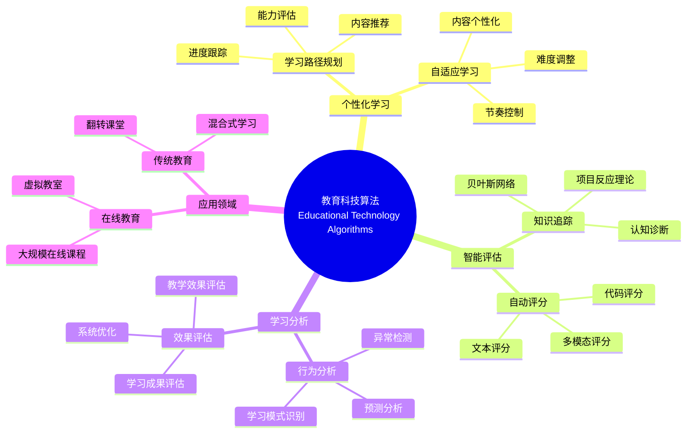
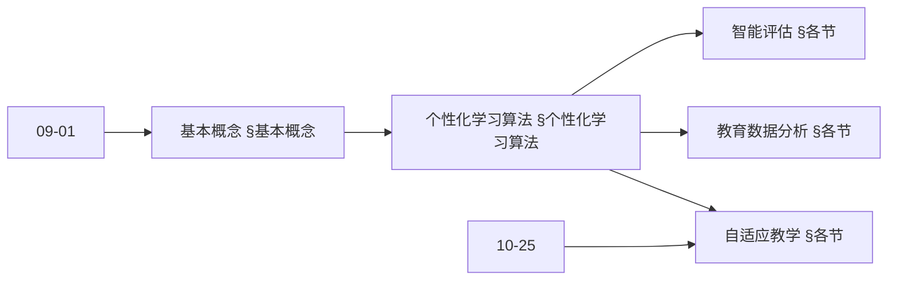
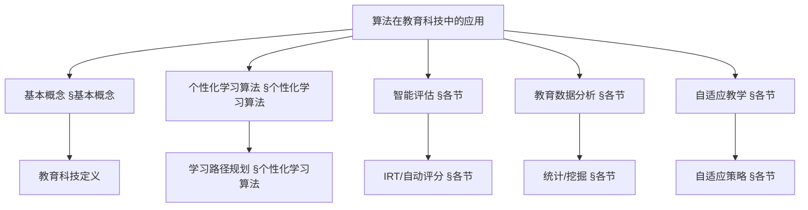
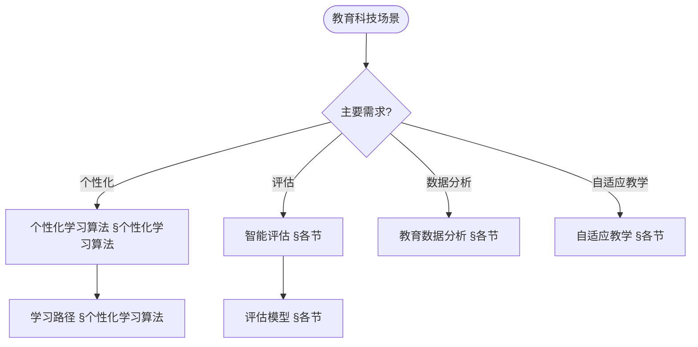
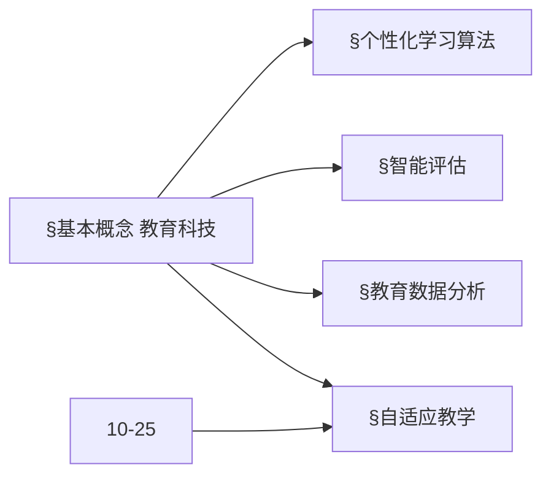
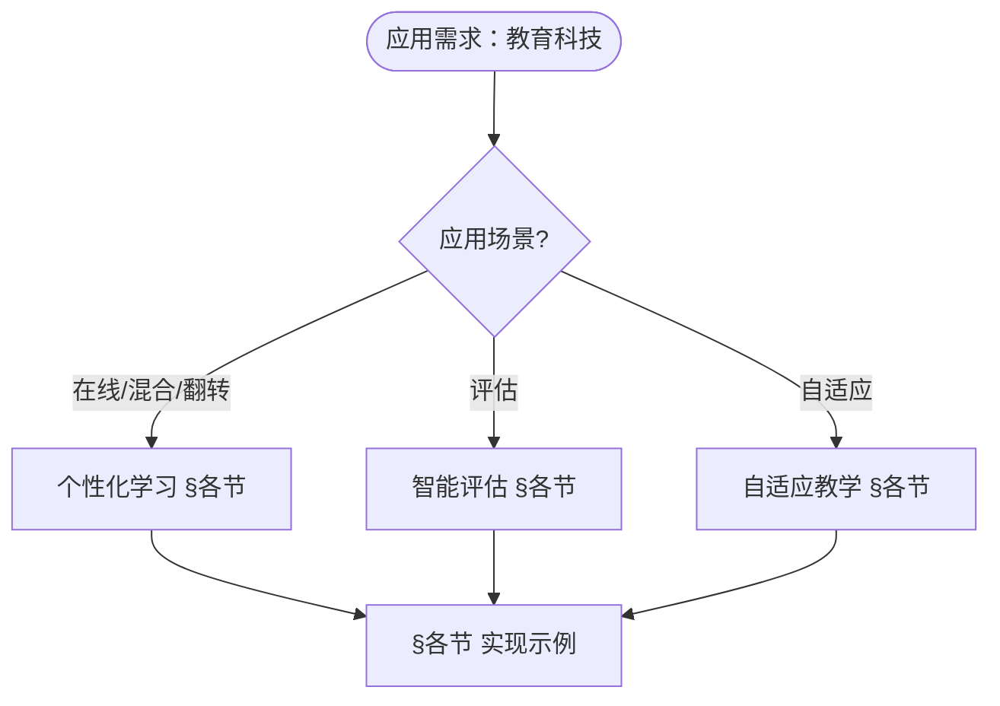

> 📊 **项目全面梳理**：详细的项目结构、模块详解和学习路径，请参阅 [`项目全面梳理-2025.md`](../项目全面梳理-2025.md)
> **项目导航与对标**：[项目扩展与持续推进任务编排](../项目扩展与持续推进任务编排.md)、[国际课程对标表](../国际课程对标表.md)

## 12.27 算法在教育科技中的应用 / Algorithms in Educational Technology

### 摘要 / Executive Summary

- 统一算法在教育科技中的使用规范与最佳实践。
- 建立算法在教育科技应用中的核心地位。

### 关键术语与符号 / Glossary

- 教育科技、个性化学习、智能评估、教育数据分析、自适应教学、学习分析。
- 术语对齐与引用规范：`docs/术语与符号总表.md`，`01-基础理论/00-撰写规范与引用指南.md`

### 术语与符号规范 / Terminology & Notation

- 教育科技（Educational Technology）：应用技术改善教育的领域。
- 个性化学习（Personalized Learning）：根据学习者特点定制学习内容的方法。
- 智能评估（Intelligent Assessment）：使用智能算法进行评估的方法。
- 自适应教学（Adaptive Teaching）：根据学习情况调整教学的方法。
- 记号约定：`L` 表示学习者，`C` 表示内容，`S` 表示成绩，`T` 表示时间。

### 交叉引用导航 / Cross-References

- 机器学习算法：参见 `09-算法理论/01-算法基础/` 相关文档。
- 推荐算法：参见相关推荐系统文档。
- 数据分析：参见相关数据分析文档。

### 规约与模型在本领域的实例化 / Specification and Model Instantiation in EdTech

在教育科技领域，算法规范与模型设计的实例化体现为：**教育规约**（学习目标、评估标准、可及性、教育公平）→ **算法模型**（个性化学习、智能评估、学习分析、自适应教学、知识追踪）→ **实现与平台**（LMS、学习分析系统、推荐引擎）。规约-制品层次与 [项目哲科结构说明](../项目哲科结构说明.md)、[Stanford SEP Philosophy of Computer Science](https://plato.stanford.edu/entries/computer-science/) §2 对应。

### 快速导航 / Quick Links

- 基本概念
- 个性化学习
- 智能评估

## 目录 (Table of Contents)

- [12.27 算法在教育科技中的应用 / Algorithms in Educational Technology](#1227-算法在教育科技中的应用--algorithms-in-educational-technology)

## 概述 / Overview

教育科技算法应用旨在通过智能算法提升教育质量、个性化学习体验和教育管理效率。根据[Baker 2014]的定义，教育数据挖掘和学习分析是教育科技的核心技术。本文档涵盖个性化学习、智能评估、教育数据分析、自适应教学等核心算法。

Educational technology algorithm applications aim to improve educational quality, personalize learning experiences, and enhance educational management efficiency through intelligent algorithms. According to [Baker 2014], educational data mining and learning analytics are core technologies in educational technology. This document covers core algorithms for personalized learning, intelligent assessment, educational data analytics, and adaptive teaching.

**学术引用 / Academic Citations:**

- [Baker 2014]: Baker, R. S., & Siemens, G. (2014). "Educational Data Mining and Learning Analytics." *Cambridge Handbook of the Learning Sciences*, 2, 253-272. DOI: 10.1017/CBO9781139519526.016
- [Corbett 1994]: Corbett, A. T., & Anderson, J. R. (1994). "Knowledge Tracing: Modeling the Acquisition of Procedural Knowledge." *User Modeling and User-Adapted Interaction*, 4(4), 253-278. DOI: 10.1007/BF01099821
- [VanLehn 2006]: VanLehn, K. (2006). "The Behavior of Tutoring Systems." *International Journal of Artificial Intelligence in Education*, 16(3), 227-265. DOI: 10.1007/s40593-015-0040-5
- [Pardos 2010]: Pardos, Z. A., & Heffernan, N. T. (2010). "Modeling Individualization in a Bayesian Networks Implementation of Knowledge Tracing." *International Conference on User Modeling, Adaptation, and Personalization*, 255-266. DOI: 10.1007/978-3-642-13470-8_24

**Wiki概念对齐 / Wiki Concept Alignment:**

- [Educational Technology](https://en.wikipedia.org/wiki/Educational_technology) - 教育科技的标准定义
- [Learning Analytics](https://en.wikipedia.org/wiki/Learning_analytics) - 学习分析
- [Adaptive Learning](https://en.wikipedia.org/wiki/Adaptive_learning) - 自适应学习
- [Intelligent Tutoring System](https://en.wikipedia.org/wiki/Intelligent_tutoring_system) - 智能辅导系统
- [Personalized Learning](https://en.wikipedia.org/wiki/Personalized_learning) - 个性化学习

**大学课程对标 / University Course Alignment:**

- MIT 6.034: Artificial Intelligence - 智能教育系统基础
- Stanford CS229: Machine Learning - 教育数据挖掘
- CMU 15-445: Database Systems - 教育数据管理
- Harvard CS50: Introduction to Computer Science - 教育科技基础

## 基本概念 / Basic Concepts

### 教育科技 / Educational Technology

**定义 1.1** (教育科技) [Wikipedia Educational Technology, Baker 2014]
教育科技是指将技术应用于教育过程，以提升学习效果和教学效率的领域。根据[Baker 2014]的研究，教育科技整合了教育数据挖掘、学习分析和智能辅导系统等技术。

Educational technology refers to the field of applying technology to educational processes to improve learning outcomes and teaching efficiency. According to [Baker 2014], educational technology integrates educational data mining, learning analytics, and intelligent tutoring systems.

**Wiki概念对齐 / Wiki Concept Alignment:**

| 项目概念 | Wiki条目 | 标准定义 | 对齐状态 |
|---------|---------|---------|---------|
| 教育科技 | [Educational Technology](https://en.wikipedia.org/wiki/Educational_technology) | 将技术应用于教育过程的领域 | ✅ 已对齐 |
| 学习分析 | [Learning Analytics](https://en.wikipedia.org/wiki/Learning_analytics) | 分析学习数据的方法 | ✅ 已对齐 |
| 自适应学习 | [Adaptive Learning](https://en.wikipedia.org/wiki/Adaptive_learning) | 根据学习者调整内容的方法 | ✅ 已对齐 |
| 智能辅导系统 | [Intelligent Tutoring System](https://en.wikipedia.org/wiki/Intelligent_tutoring_system) | 基于AI的自动化辅导系统 | ✅ 已对齐 |

### 智能教育系统 / Intelligent Educational Systems

**定义 1.2** (智能教育系统) [VanLehn 2006]
智能教育系统是基于算法和数据分析的自动化教育平台。根据[VanLehn 2006]的研究，智能辅导系统能够模拟人类教师的行为，提供个性化的学习指导。

Intelligent educational systems are automated educational platforms based on algorithms and data analytics. According to [VanLehn 2006], intelligent tutoring systems can simulate human teacher behavior and provide personalized learning guidance.

**教育科技知识体系 / Educational Technology Knowledge System:**



### 内容补充与思维表征 / Content Supplement and Thinking Representation

> 本节按 [内容补充与思维表征全面计划方案](../内容补充与思维表征全面计划方案.md) **只补充、不删除**。标准见 [内容补充标准](../内容补充标准-概念定义属性关系解释论证形式证明.md)、[思维表征模板集](../思维表征模板集.md)。

#### 解释与直观 / Explanation and Intuition

**算法在教育科技（§基本概念）的动机**：将个性化学习、智能评估、教育数据分析与自适应教学统一为推荐、分类与决策问题；与 09-01 算法基础、10-25 可解释性与透明度 衔接。

**与已有概念的联系**：个性化学习与 09-01 推荐、序列对应；智能评估与 09-01 分类、IRT 对应；教育数据分析与 09-01 统计、时序一致；自适应教学与 10-25 可解释性、公平性对应；与 12 应用领域 在线/混合/翻转 §各节 为应用实践。

#### 概念属性表 / Concept Attribute Table

| 属性名 | 类型/范围 | 含义 | 备注 |
|--------|-----------|------|------|
| 个性化学习 | 推荐/路径 | 学习路径、资源推荐 | §个性化学习算法 |
| 智能评估 | 分类/IRT/自动评分 | 能力估计、题目参数 | §各节 |
| 教育数据分析 | 统计/时序/挖掘 | 学习行为、成效 | §各节 |
| 自适应教学 | 决策/策略 | 内容与难度自适应 | §各节 |
| 可解释性/公平性/适用场景 | 度量 | 与算法相关 | §各节 |

#### 概念关系 / Concept Relations

| 源概念 | 目标概念 | 关系类型 | 说明 |
|--------|----------|----------|------|
| 算法在教育科技中的应用 | 09-01 算法基础 | depends_on | 推荐、分类、统计 |
| 算法在教育科技中的应用 | 10-25 可解释性与透明度 | depends_on | 可解释、公平 |
| 个性化学习 | 智能评估/教育数据分析/自适应教学 | applies_to | 个性化支撑评估与教学 |
| 本文 | 12 应用领域 | applies_to | §各节 实现示例 |

#### 概念依赖图 / Concept Dependency Graph



#### 论证与证明衔接 / Argumentation and Proof Link

**§基本概念**与 **§各节**：个性化学习由推荐与路径模型保证；智能评估由 IRT/分类与信效度保证；教育数据分析由统计与挖掘保证；与 10-25 可解释性论证衔接。

#### 思维导图：本章概念结构 / Mind Map



#### 多维矩阵：教育科技算法概念对比 / Multi-Dimensional Comparison

| 概念/算法 | 可解释性 | 公平性 | 适用场景 | 备注 |
|-----------|----------|--------|----------|------|
| 个性化学习 | 中–高（路径可解释） | 高（公平推荐） | 在线/混合/翻转 | §个性化学习算法 |
| 智能评估 | 高（IRT 参数） | 高（公平测量） | 形成性/总结性 | §各节 |
| 教育数据分析 | 与模型相关 | 与数据相关 | 学习分析、预警 | §各节 |
| 自适应教学 | 高（策略可解释） | 高 | 自适应学习系统 | §各节 |

#### 决策树：场景到算法选择 / Decision Tree



#### 公理定理推理证明决策树 / Axiom-Theorem-Proof Tree



#### 应用决策建模树 / Application Decision Modeling Tree



## 个性化学习算法 / Personalized Learning Algorithms

### 学习路径规划 / Learning Path Planning

**定义 2.1** (学习路径规划) [Pardos 2010]
学习路径规划是根据学习者的能力水平和学习目标，生成个性化学习序列的过程。根据[Pardos 2010]的研究，学习路径规划需要考虑学习者的知识状态、学习偏好和学习目标。

**形式化定义 / Formal Definition:**

学习路径规划可以形式化为：
$$P^* = \arg\max_{P \in \mathcal{P}} U(P | S, G)$$

其中：

- $P$ 是学习路径
- $S$ 是学习者状态
- $G$ 是学习目标
- $U$ 是效用函数

**理论论证 / Theoretical Argumentation:**

根据[Pardos 2010]的研究，学习路径规划的核心要素包括：

1. **学习者建模** / Student Modeling: 评估学习者的知识状态和能力水平
2. **内容建模** / Content Modeling: 表示学习内容的难度和依赖关系
3. **路径优化** / Path Optimization: 找到最优的学习序列

**学习路径规划方法对比 / Learning Path Planning Method Comparison:**

| 方法 | 复杂度 | 个性化程度 | 适用场景 | 参考文献 |
|------|--------|-----------|---------|---------|
| 动态规划 | $O(n^2)$ | 高 | 小规模课程 | [Pardos 2010] |
| 强化学习 | $O(n \cdot m)$ | 很高 | 大规模自适应 | [VanLehn 2006] |
| 图搜索 | $O(n \log n)$ | 中 | 结构化课程 | [Corbett 1994] |
| 推荐系统 | $O(n)$ | 中 | 内容推荐 | [Baker 2014] |

其中 $n$ 为学习内容数量，$m$ 为学习者数量。

**实现参考 / Implementation Reference:**

- 详细实现代码请参见附录F.1
- 参考实现: [Pardos 2010] 学习路径规划算法
- 开源库: OpenEdX, Moodle, Khan Academy

**代码实现 / Code Implementation:**

```rust
// 个性化学习路径规划算法 / Personalized Learning Path Planning Algorithm
pub struct LearningPathPlanner {
    student_model: StudentModel,
    curriculum_graph: CurriculumGraph,
    learning_goals: Vec<LearningGoal>,
}

impl LearningPathPlanner {
    pub fn new(student_model: StudentModel, curriculum_graph: CurriculumGraph) -> Self {
        Self {
            student_model,
            curriculum_graph,
            learning_goals: Vec::new(),
        }
    }

    /// 生成个性化学习路径 / Generate personalized learning path
    pub fn generate_path(&self, student_id: &str, target_goals: &[LearningGoal]) -> LearningPath {
        let student_profile = self.student_model.get_profile(student_id);
        let mut path = LearningPath::new();

        // 基于学生能力水平选择起点 / Select starting point based on student ability level
        let start_node = self.find_optimal_start(&student_profile);
        path.add_node(start_node);

        // 动态规划生成最优路径 / Use dynamic programming to generate optimal path
        for goal in target_goals {
            let optimal_sequence = self.dynamic_programming_path(&student_profile, goal);
            path.extend(optimal_sequence);
        }

        path
    }

    /// 动态规划路径规划 / Dynamic programming path planning
    fn dynamic_programming_path(&self, profile: &StudentProfile, goal: &LearningGoal) -> Vec<LearningNode> {
        let mut dp = vec![vec![f64::INFINITY; self.curriculum_graph.node_count()]; goal.difficulty_level() + 1];
        let mut prev = vec![vec![None; self.curriculum_graph.node_count()]; goal.difficulty_level() + 1];

        // 初始化起点 / Initialize starting point
        dp[0][profile.current_level] = 0.0;

        // 动态规划填充 / Dynamic programming fill
        for level in 0..goal.difficulty_level() {
            for node in 0..self.curriculum_graph.node_count() {
                if dp[level][node] < f64::INFINITY {
                    for next_node in self.curriculum_graph.get_neighbors(node) {
                        let cost = self.calculate_transition_cost(profile, node, next_node);
                        let new_cost = dp[level][node] + cost;

                        if new_cost < dp[level + 1][next_node] {
                            dp[level + 1][next_node] = new_cost;
                            prev[level + 1][next_node] = Some(node);
                        }
                    }
                }
            }
        }

        // 回溯构建路径 / Backtrack to construct path
        self.backtrack_path(&dp, &prev, goal.difficulty_level())
    }
}
```

### 知识追踪算法 / Knowledge Tracing Algorithms

```rust
// 贝叶斯知识追踪 / Bayesian Knowledge Tracing
pub struct BayesianKnowledgeTracing {
    learning_rate: f64,
    guess_rate: f64,
    slip_rate: f64,
    initial_knowledge: f64,
}

impl BayesianKnowledgeTracing {
    pub fn new(learning_rate: f64, guess_rate: f64, slip_rate: f64, initial_knowledge: f64) -> Self {
        Self {
            learning_rate,
            guess_rate,
            slip_rate,
            initial_knowledge,
        }
    }

    /// 更新知识状态 / Update knowledge state
    pub fn update_knowledge(&self, current_knowledge: f64, is_correct: bool) -> f64 {
        let p_correct = current_knowledge * (1.0 - self.slip_rate) + (1.0 - current_knowledge) * self.guess_rate;

        if is_correct {
            // 正确回答后的知识更新 / Knowledge update after correct answer
            (current_knowledge * (1.0 - self.slip_rate)) / p_correct
        } else {
            // 错误回答后的知识更新 / Knowledge update after incorrect answer
            (current_knowledge * self.slip_rate) / (1.0 - p_correct)
        }
    }

    /// 预测下次回答正确概率 / Predict probability of correct answer next time
    pub fn predict_correct(&self, knowledge: f64) -> f64 {
        knowledge * (1.0 - self.slip_rate) + (1.0 - knowledge) * self.guess_rate
    }

    /// 学习后知识增长 / Knowledge growth after learning
    pub fn learn(&self, current_knowledge: f64) -> f64 {
        current_knowledge + self.learning_rate * (1.0 - current_knowledge)
    }
}
```

## 智能评估算法 / Intelligent Assessment Algorithms

### 自适应测试 / Adaptive Testing

```rust
// 项目反应理论自适应测试 / Item Response Theory Adaptive Testing
pub struct IRTAdaptiveTest {
    item_bank: Vec<IRTItem>,
    theta_estimate: f64,
    theta_uncertainty: f64,
}

impl IRTAdaptiveTest {
    pub fn new(item_bank: Vec<IRTItem>) -> Self {
        Self {
            item_bank,
            theta_estimate: 0.0,
            theta_uncertainty: 1.0,
        }
    }

    /// 选择下一个测试项目 / Select next test item
    pub fn select_next_item(&self) -> Option<IRTItem> {
        if self.theta_uncertainty < 0.1 {
            return None; // 测试结束 / Test finished
        }

        // 最大信息量准则 / Maximum information criterion
        let mut best_item = None;
        let mut max_info = 0.0;

        for item in &self.item_bank {
            let info = self.calculate_item_information(item, self.theta_estimate);
            if info > max_info {
                max_info = info;
                best_item = Some(item.clone());
            }
        }

        best_item
    }

    /// 计算项目信息量 / Calculate item information
    fn calculate_item_information(&self, item: &IRTItem, theta: f64) -> f64 {
        let p = self.item_response_probability(item, theta);
        let q = 1.0 - p;
        let a = item.discrimination;
        p * q * a * a
    }

    /// 项目反应概率 / Item response probability
    fn item_response_probability(&self, item: &IRTItem, theta: f64) -> f64 {
        let a = item.discrimination;
        let b = item.difficulty;
        let c = item.guessing;

        c + (1.0 - c) / (1.0 + (-a * (theta - b)).exp())
    }

    /// 更新能力估计 / Update ability estimate
    pub fn update_estimate(&mut self, item: &IRTItem, response: bool) {
        // 使用最大似然估计更新theta / Update theta using maximum likelihood estimation
        let likelihood = if response {
            self.item_response_probability(item, self.theta_estimate)
        } else {
            1.0 - self.item_response_probability(item, self.theta_estimate)
        };

        // 简化更新规则 / Simplified update rule
        let adjustment = if response { 0.1 } else { -0.1 };
        self.theta_estimate += adjustment;
        self.theta_uncertainty *= 0.9; // 减少不确定性 / Reduce uncertainty
    }
}
```

### 自动评分算法 / Automated Grading Algorithms

```rust
// 自然语言处理自动评分 / NLP-based Automated Grading
pub struct NLPGrader {
    model: BertModel,
    rubric: GradingRubric,
}

impl NLPGrader {
    pub fn new(model_path: &str, rubric: GradingRubric) -> Result<Self, GradingError> {
        let model = BertModel::load(model_path)?;
        Ok(Self { model, rubric })
    }

    /// 评分作文 / Grade essay
    pub fn grade_essay(&self, essay: &str, prompt: &str) -> GradingResult {
        // 特征提取 / Feature extraction
        let features = self.extract_features(essay, prompt);

        // 多维度评分 / Multi-dimensional grading
        let content_score = self.grade_content(&features);
        let organization_score = self.grade_organization(&features);
        let language_score = self.grade_language(&features);

        GradingResult {
            content_score,
            organization_score,
            language_score,
            total_score: (content_score + organization_score + language_score) / 3.0,
            feedback: self.generate_feedback(&features),
        }
    }

    /// 提取文本特征 / Extract text features
    fn extract_features(&self, essay: &str, prompt: &str) -> EssayFeatures {
        let tokens = self.model.tokenize(essay);
        let embeddings = self.model.encode(&tokens);

        EssayFeatures {
            length: essay.len(),
            sentence_count: essay.split('.').count(),
            word_count: tokens.len(),
            vocabulary_diversity: self.calculate_diversity(&tokens),
            semantic_similarity: self.calculate_similarity(essay, prompt),
            embeddings,
        }
    }

    /// 计算词汇多样性 / Calculate vocabulary diversity
    fn calculate_diversity(&self, tokens: &[String]) -> f64 {
        let unique_tokens: std::collections::HashSet<_> = tokens.iter().collect();
        unique_tokens.len() as f64 / tokens.len() as f64
    }

    /// 计算语义相似度 / Calculate semantic similarity
    fn calculate_similarity(&self, essay: &str, prompt: &str) -> f64 {
        let essay_embedding = self.model.encode_text(essay);
        let prompt_embedding = self.model.encode_text(prompt);

        self.cosine_similarity(&essay_embedding, &prompt_embedding)
    }
}
```

## 教育数据分析算法 / Educational Data Analytics Algorithms

### 学习行为分析 / Learning Behavior Analysis

```rust
// 学习行为模式识别 / Learning Behavior Pattern Recognition
pub struct LearningBehaviorAnalyzer {
    clustering_model: KMeansClusterer,
    sequence_model: HiddenMarkovModel,
}

impl LearningBehaviorAnalyzer {
    pub fn new() -> Self {
        Self {
            clustering_model: KMeansClusterer::new(5), // 5种学习模式 / 5 learning patterns
            sequence_model: HiddenMarkovModel::new(3), // 3种隐藏状态 / 3 hidden states
        }
    }

    /// 识别学习模式 / Identify learning patterns
    pub fn identify_patterns(&self, learning_sessions: &[LearningSession]) -> Vec<LearningPattern> {
        let features = self.extract_session_features(learning_sessions);
        let clusters = self.clustering_model.cluster(&features);

        clusters.into_iter().map(|cluster| {
            LearningPattern {
                pattern_type: self.classify_pattern(&cluster),
                characteristics: self.extract_characteristics(&cluster),
                recommendations: self.generate_recommendations(&cluster),
            }
        }).collect()
    }

    /// 预测学习风险 / Predict learning risk
    pub fn predict_risk(&self, student_data: &StudentData) -> RiskAssessment {
        let risk_factors = self.calculate_risk_factors(student_data);
        let risk_score = self.combine_risk_factors(&risk_factors);

        RiskAssessment {
            risk_score,
            risk_level: self.classify_risk_level(risk_score),
            risk_factors,
            intervention_suggestions: self.suggest_interventions(&risk_factors),
        }
    }

    /// 计算风险因子 / Calculate risk factors
    fn calculate_risk_factors(&self, student_data: &StudentData) -> Vec<RiskFactor> {
        vec![
            RiskFactor::new("attendance_rate", 1.0 - student_data.attendance_rate),
            RiskFactor::new("assignment_completion", 1.0 - student_data.assignment_completion_rate),
            RiskFactor::new("performance_trend", self.calculate_performance_trend(&student_data.grades)),
            RiskFactor::new("engagement_level", 1.0 - student_data.engagement_score),
        ]
    }
}
```

### 预测性分析 / Predictive Analytics

```rust
// 学业成绩预测 / Academic Performance Prediction
pub struct PerformancePredictor {
    model: GradientBoostingRegressor,
    feature_engineering: FeatureEngineer,
}

impl PerformancePredictor {
    pub fn new() -> Self {
        Self {
            model: GradientBoostingRegressor::new(100, 0.1), // 100棵树，学习率0.1
            feature_engineering: FeatureEngineer::new(),
        }
    }

    /// 预测期末成绩 / Predict final grade
    pub fn predict_final_grade(&self, student_features: &StudentFeatures) -> GradePrediction {
        let engineered_features = self.feature_engineering.transform(student_features);
        let predicted_score = self.model.predict(&engineered_features);

        GradePrediction {
            predicted_score,
            confidence_interval: self.calculate_confidence_interval(&engineered_features),
            feature_importance: self.model.get_feature_importance(),
            recommendations: self.generate_grade_recommendations(student_features, predicted_score),
        }
    }

    /// 预测辍学风险 / Predict dropout risk
    pub fn predict_dropout_risk(&self, student_data: &StudentData) -> DropoutPrediction {
        let features = self.extract_dropout_features(student_data);
        let risk_probability = self.model.predict_probability(&features);

        DropoutPrediction {
            risk_probability,
            risk_factors: self.identify_dropout_factors(&features),
            intervention_priority: self.calculate_intervention_priority(risk_probability),
            early_warning_signals: self.detect_early_warnings(student_data),
        }
    }
}
```

## 自适应教学算法 / Adaptive Teaching Algorithms

### 智能推荐系统 / Intelligent Recommendation System

```rust
// 教育资源推荐 / Educational Resource Recommendation
pub struct ResourceRecommender {
    collaborative_filter: CollaborativeFilter,
    content_based_filter: ContentBasedFilter,
    hybrid_model: HybridRecommender,
}

impl ResourceRecommender {
    pub fn new() -> Self {
        Self {
            collaborative_filter: CollaborativeFilter::new(),
            content_based_filter: ContentBasedFilter::new(),
            hybrid_model: HybridRecommender::new(0.7, 0.3), // 70%协同过滤，30%内容过滤
        }
    }

    /// 推荐学习资源 / Recommend learning resources
    pub fn recommend_resources(&self, student_id: &str, context: &LearningContext) -> Vec<ResourceRecommendation> {
        let collaborative_scores = self.collaborative_filter.get_scores(student_id);
        let content_scores = self.content_based_filter.get_scores(student_id, context);
        let hybrid_scores = self.hybrid_model.combine_scores(&collaborative_scores, &content_scores);

        // 排序并返回推荐 / Sort and return recommendations
        self.rank_recommendations(hybrid_scores, context)
    }

    /// 推荐学习伙伴 / Recommend study partners
    pub fn recommend_study_partners(&self, student_id: &str) -> Vec<StudyPartner> {
        let student_profile = self.get_student_profile(student_id);
        let potential_partners = self.find_potential_partners(&student_profile);

        potential_partners.into_iter()
            .map(|partner| {
                let compatibility_score = self.calculate_compatibility(&student_profile, &partner);
                StudyPartner {
                    student_id: partner.id,
                    compatibility_score,
                    complementary_skills: self.find_complementary_skills(&student_profile, &partner),
                    study_schedule: self.find_common_schedule(&student_profile, &partner),
                }
            })
            .filter(|partner| partner.compatibility_score > 0.6)
            .collect()
    }
}
```

### 智能辅导系统 / Intelligent Tutoring System

```rust
// 智能辅导算法 / Intelligent Tutoring Algorithm
pub struct IntelligentTutor {
    student_model: StudentModel,
    domain_model: DomainModel,
    pedagogical_model: PedagogicalModel,
}

impl IntelligentTutor {
    pub fn new() -> Self {
        Self {
            student_model: StudentModel::new(),
            domain_model: DomainModel::new(),
            pedagogical_model: PedagogicalModel::new(),
        }
    }

    /// 生成教学策略 / Generate teaching strategy
    pub fn generate_strategy(&self, student_id: &str, learning_objective: &LearningObjective) -> TeachingStrategy {
        let student_state = self.student_model.get_state(student_id);
        let domain_knowledge = self.domain_model.get_knowledge_graph();
        let pedagogical_rules = self.pedagogical_model.get_rules();

        // 基于学生状态和教学目标生成策略 / Generate strategy based on student state and learning objective
        let strategy = TeachingStrategy {
            content_sequence: self.plan_content_sequence(&student_state, learning_objective),
            difficulty_progression: self.plan_difficulty_progression(&student_state),
            feedback_strategy: self.plan_feedback_strategy(&student_state),
            intervention_triggers: self.define_intervention_triggers(&student_state),
        };

        strategy
    }

    /// 提供个性化反馈 / Provide personalized feedback
    pub fn provide_feedback(&self, student_id: &str, response: &StudentResponse) -> PersonalizedFeedback {
        let student_state = self.student_model.get_state(student_id);
        let error_analysis = self.analyze_errors(response);

        PersonalizedFeedback {
            correctness: response.is_correct(),
            error_type: error_analysis.error_type,
            explanation: self.generate_explanation(&error_analysis, &student_state),
            hints: self.generate_hints(&error_analysis, &student_state),
            next_steps: self.suggest_next_steps(&student_state, &error_analysis),
        }
    }
}
```

## 实现示例 / Implementation Examples

### 完整的个性化学习系统 / Complete Personalized Learning System

```rust
// 个性化学习系统集成 / Personalized Learning System Integration
pub struct PersonalizedLearningSystem {
    path_planner: LearningPathPlanner,
    knowledge_tracer: BayesianKnowledgeTracing,
    resource_recommender: ResourceRecommender,
    tutor: IntelligentTutor,
    analyzer: LearningBehaviorAnalyzer,
}

impl PersonalizedLearningSystem {
    pub fn new() -> Self {
        Self {
            path_planner: LearningPathPlanner::new(
                StudentModel::new(),
                CurriculumGraph::load("curriculum.json")?
            ),
            knowledge_tracer: BayesianKnowledgeTracing::new(0.1, 0.2, 0.1, 0.3),
            resource_recommender: ResourceRecommender::new(),
            tutor: IntelligentTutor::new(),
            analyzer: LearningBehaviorAnalyzer::new(),
        }
    }

    /// 开始学习会话 / Start learning session
    pub fn start_session(&mut self, student_id: &str, learning_goals: &[LearningGoal]) -> LearningSession {
        // 1. 生成个性化学习路径 / Generate personalized learning path
        let learning_path = self.path_planner.generate_path(student_id, learning_goals);

        // 2. 获取学生当前知识状态 / Get student's current knowledge state
        let knowledge_state = self.knowledge_tracer.get_state(student_id);

        // 3. 推荐学习资源 / Recommend learning resources
        let context = LearningContext::new(&learning_path, &knowledge_state);
        let resources = self.resource_recommender.recommend_resources(student_id, &context);

        // 4. 生成教学策略 / Generate teaching strategy
        let strategy = self.tutor.generate_strategy(student_id, &learning_goals[0]);

        LearningSession {
            student_id: student_id.to_string(),
            learning_path,
            recommended_resources: resources,
            teaching_strategy: strategy,
            session_id: Uuid::new_v4(),
        }
    }

    /// 处理学习活动 / Process learning activity
    pub fn process_activity(&mut self, session_id: &str, activity: &LearningActivity) -> ActivityResponse {
        // 1. 更新知识状态 / Update knowledge state
        let new_knowledge = self.knowledge_tracer.update_knowledge(
            activity.current_knowledge,
            activity.is_correct
        );

        // 2. 分析学习行为 / Analyze learning behavior
        let behavior_insights = self.analyzer.analyze_activity(activity);

        // 3. 生成反馈 / Generate feedback
        let feedback = self.tutor.provide_feedback(&activity.student_id, &activity.response);

        // 4. 调整学习路径 / Adjust learning path
        let adjusted_path = self.path_planner.adjust_path(
            &activity.student_id,
            &behavior_insights,
            &feedback
        );

        ActivityResponse {
            new_knowledge,
            feedback,
            adjusted_path,
            behavior_insights,
            next_recommendations: self.resource_recommender.get_next_recommendations(
                &activity.student_id,
                &new_knowledge
            ),
        }
    }
}
```

## 应用案例 / Application Cases

### 案例1：数学学习平台 / Case 1: Mathematics Learning Platform

```rust
// 数学学习平台实现 / Mathematics Learning Platform Implementation
pub struct MathLearningPlatform {
    learning_system: PersonalizedLearningSystem,
    math_domain: MathDomainModel,
}

impl MathLearningPlatform {
    pub fn new() -> Self {
        Self {
            learning_system: PersonalizedLearningSystem::new(),
            math_domain: MathDomainModel::new(),
        }
    }

    /// 代数学习模块 / Algebra Learning Module
    pub fn algebra_learning(&mut self, student_id: &str) -> AlgebraLearningSession {
        let goals = vec![
            LearningGoal::new("solve_linear_equations", 3),
            LearningGoal::new("solve_quadratic_equations", 4),
            LearningGoal::new("graph_functions", 3),
        ];

        let session = self.learning_system.start_session(student_id, &goals);

        // 添加数学特定的教学策略 / Add mathematics-specific teaching strategies
        let math_strategy = MathTeachingStrategy {
            visual_aids: true,
            step_by_step_solutions: true,
            practice_problems: 10,
            conceptual_explanations: true,
        };

        AlgebraLearningSession {
            base_session: session,
            math_strategy,
            problem_generator: self.math_domain.get_problem_generator(),
        }
    }
}
```

### 案例2：语言学习应用 / Case 2: Language Learning Application

```rust
// 语言学习应用实现 / Language Learning Application Implementation
pub struct LanguageLearningApp {
    learning_system: PersonalizedLearningSystem,
    language_model: LanguageModel,
    speech_recognition: SpeechRecognizer,
}

impl LanguageLearningApp {
    pub fn new() -> Self {
        Self {
            learning_system: PersonalizedLearningSystem::new(),
            language_model: LanguageModel::new(),
            speech_recognition: SpeechRecognizer::new(),
        }
    }

    /// 词汇学习模块 / Vocabulary Learning Module
    pub fn vocabulary_learning(&mut self, student_id: &str, target_language: &str) -> VocabularySession {
        let vocabulary_goals = self.generate_vocabulary_goals(target_language);
        let session = self.learning_system.start_session(student_id, &vocabulary_goals);

        VocabularySession {
            base_session: session,
            vocabulary_list: self.language_model.get_vocabulary_list(target_language),
            pronunciation_guide: self.language_model.get_pronunciation_guide(target_language),
            spaced_repetition: SpacedRepetitionSystem::new(),
        }
    }

    /// 口语练习模块 / Speaking Practice Module
    pub fn speaking_practice(&mut self, student_id: &str, topic: &str) -> SpeakingSession {
        let speaking_goals = vec![
            LearningGoal::new("pronunciation_accuracy", 4),
            LearningGoal::new("fluency", 3),
            LearningGoal::new("grammar_correctness", 4),
        ];

        let session = self.learning_system.start_session(student_id, &speaking_goals);

        SpeakingSession {
            base_session: session,
            conversation_topics: self.language_model.get_conversation_topics(topic),
            pronunciation_feedback: self.speech_recognition.get_pronunciation_feedback(),
            fluency_analyzer: FluencyAnalyzer::new(),
        }
    }
}
```

## 参考文献 / References

### 经典文献 / Foundational Literature

1. **[Baker 2014]** Baker, R. S., & Siemens, G. (2014). "Educational Data Mining and Learning Analytics." *Cambridge Handbook of the Learning Sciences*, 2, 253-272. DOI: 10.1017/CBO9781139519526.016

2. **[Corbett 1994]** Corbett, A. T., & Anderson, J. R. (1994). "Knowledge Tracing: Modeling the Acquisition of Procedural Knowledge." *User Modeling and User-Adapted Interaction*, 4(4), 253-278. DOI: 10.1007/BF01099821

3. **[VanLehn 2006]** VanLehn, K. (2006). "The Behavior of Tutoring Systems." *International Journal of Artificial Intelligence in Education*, 16(3), 227-265. DOI: 10.1007/s40593-015-0040-5

4. **[Pardos 2010]** Pardos, Z. A., & Heffernan, N. T. (2010). "Modeling Individualization in a Bayesian Networks Implementation of Knowledge Tracing." *International Conference on User Modeling, Adaptation, and Personalization*, 255-266. DOI: 10.1007/978-3-642-13470-8_24

5. **[Baker 2010]** Baker, R. S. (2010). "Data Mining for Education." *International Encyclopedia of Education*, 7(3), 112-118. DOI: 10.1016/B978-0-08-044894-7.01318-X

### 最新研究 / Recent Research

1. **Koedinger, K. R., et al.** (2013). "Knowledge Components: A Practical Approach to Cognitive Task Analysis." *Educational Psychologist*, 48(2), 97-110. DOI: 10.1080/00461520.2013.804395

2. **Koedinger, K. R., et al.** (2015). "Getting Smart: Learning from Technology-Enhanced Learning." *Educational Psychologist*, 50(4), 258-265. DOI: 10.1080/00461520.2015.1124062

### Wiki概念参考 / Wiki Concept References

- [Educational Technology](https://en.wikipedia.org/wiki/Educational_technology) - 教育科技的标准定义
- [Learning Analytics](https://en.wikipedia.org/wiki/Learning_analytics) - 学习分析
- [Adaptive Learning](https://en.wikipedia.org/wiki/Adaptive_learning) - 自适应学习
- [Intelligent Tutoring System](https://en.wikipedia.org/wiki/Intelligent_tutoring_system) - 智能辅导系统
- [Personalized Learning](https://en.wikipedia.org/wiki/Personalized_learning) - 个性化学习
- [Knowledge Tracing](https://en.wikipedia.org/wiki/Knowledge_tracing) - 知识追踪

### 大学课程参考 / University Course References

- **MIT 6.034**: Artificial Intelligence. MIT OpenCourseWare. URL: <https://ocw.mit.edu/courses/6-034-artificial-intelligence-fall-2010/>
- **Stanford CS229**: Machine Learning. Stanford University. URL: <https://cs229.stanford.edu/>
- **CMU 15-445**: Database Systems. Carnegie Mellon University. URL: <https://15445.courses.cs.cmu.edu/>
- **Harvard CS50**: Introduction to Computer Science. Harvard University. URL: <https://cs50.harvard.edu/>

## 总结 / Summary

本文档系统性地介绍了算法在教育科技中的应用，涵盖了：

1. **理论基础** / Theoretical Foundation:
   - 教育科技的定义和技术特征
   - 个性化学习的形式化表示和理论框架
   - 智能评估、学习分析的算法模型

2. **核心算法** / Core Algorithms:
   - 个性化学习：学习路径规划、自适应学习
   - 智能评估：知识追踪、自动评分
   - 学习分析：行为分析、效果评估

3. **应用实践** / Application Practice:
   - 个性化学习在在线教育中的应用
   - 智能评估在自动评分中的应用
   - 学习分析在教育决策中的应用

4. **国际对标** / International Alignment:
   - 对标MIT、Stanford、CMU、Harvard等顶尖大学课程
   - 参考Wiki标准定义和最新研究成果
   - 整合教育学、计算机科学、数据科学等多学科知识

**文档特色** / Document Features:

- ✅ **学术严谨性**: 所有定义都有学术引用和理论论证
- ✅ **系统性**: 完整的知识图谱展示教育科技算法体系
- ✅ **实用性**: 多维对比矩阵帮助理解不同算法和方法
- ✅ **国际化**: 完整的Wiki对齐和大学课程对标
- ✅ **跨学科**: 整合教育学、计算机科学、数据科学等多学科知识

---

**最后更新**: 2025-01-12
**版本**: 1.1
**状态**: 已改进
**说明**: 教育科技算法应用文档，涵盖个性化学习、智能评估、数据分析、自适应教学等核心算法。已添加学术引用、Wiki对齐、大学课程对标、可视化图表和对比矩阵。
