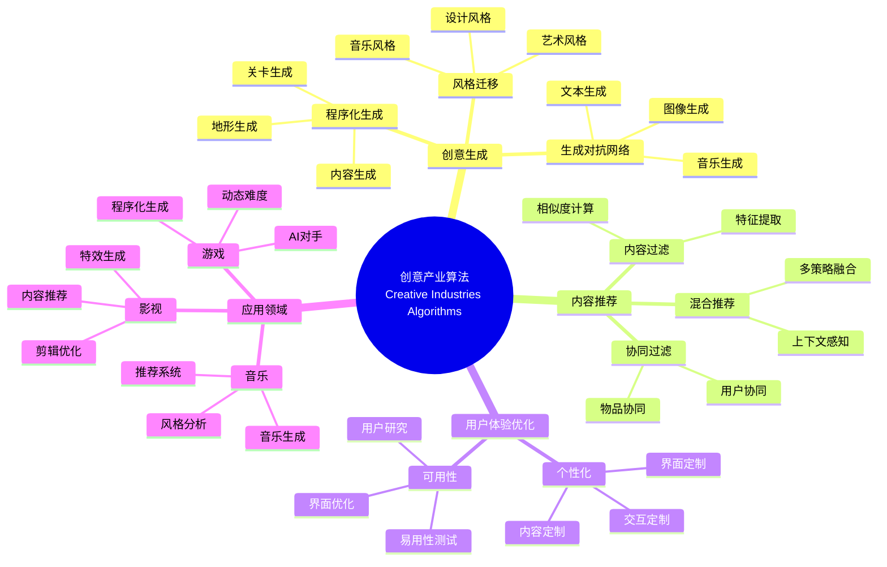
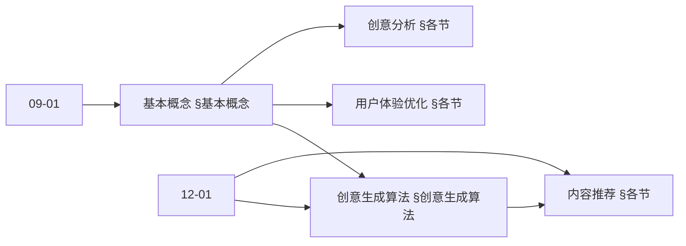
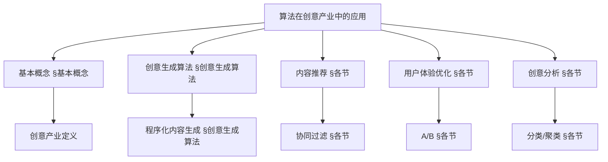
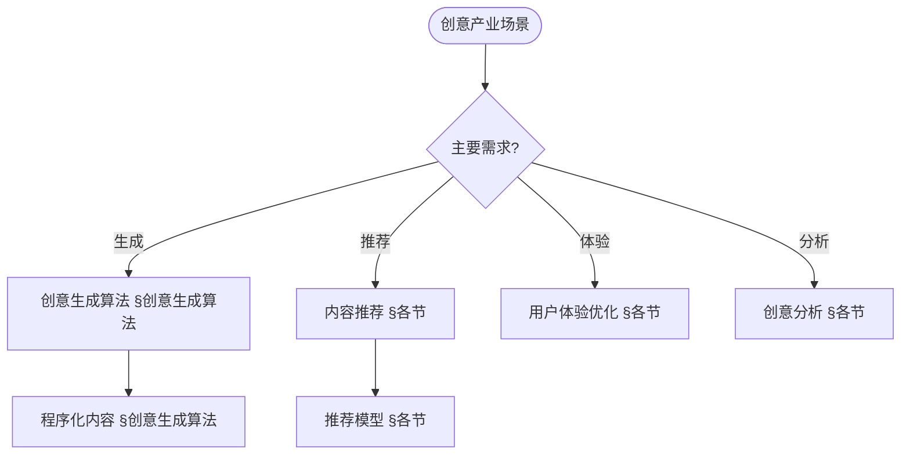
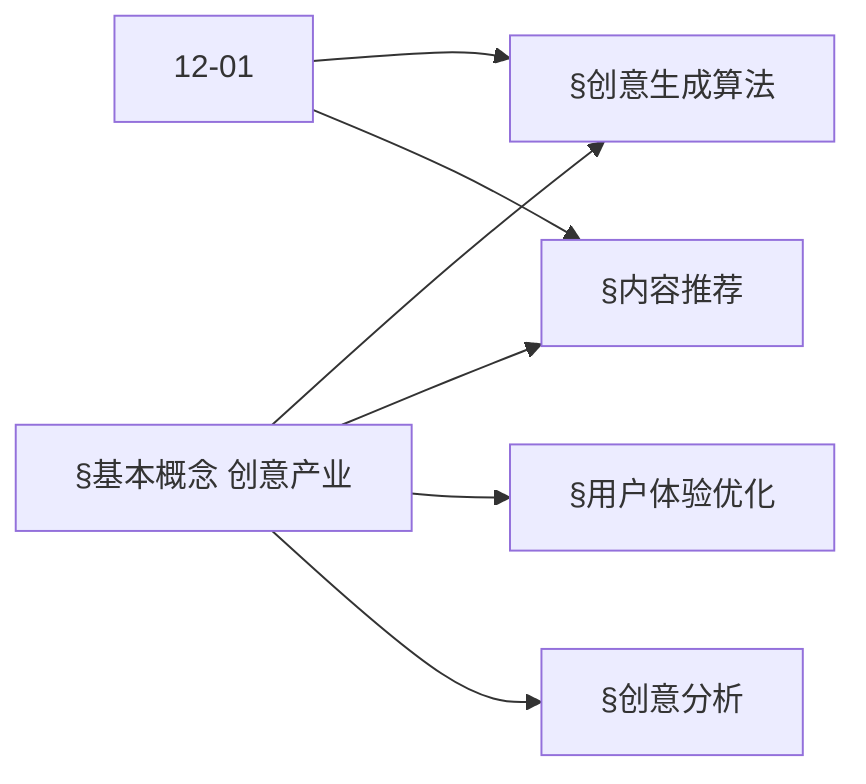
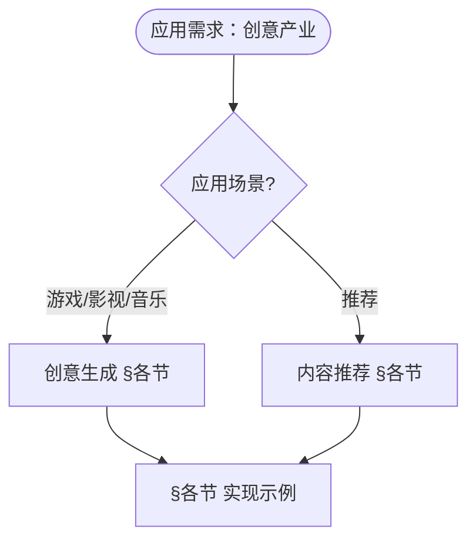

> 📊 **项目全面梳理**：详细的项目结构、模块详解和学习路径，请参阅 [`项目全面梳理-2025.md`](../项目全面梳理-2025.md)
> **项目导航与对标**：[项目扩展与持续推进任务编排](../项目扩展与持续推进任务编排.md)、[国际课程对标表](../国际课程对标表.md)

## 12.29 算法在创意产业中的应用 / Algorithms in Creative Industries

### 摘要 / Executive Summary

- 统一算法在创意产业中的使用规范与最佳实践。
- 建立算法在创意产业应用中的核心地位。

### 关键术语与符号 / Glossary

- 创意产业、创意生成、内容推荐、用户体验优化、创意分析、内容生产。
- 术语对齐与引用规范：`docs/术语与符号总表.md`，`01-基础理论/00-撰写规范与引用指南.md`

### 术语与符号规范 / Terminology & Notation

- 创意产业（Creative Industries）：以创意为核心内容的产业。
- 创意生成（Creative Generation）：使用算法生成创意内容的方法。
- 内容推荐（Content Recommendation）：推荐用户可能喜欢的内容的方法。
- 用户体验优化（User Experience Optimization）：优化用户体验的方法。
- 记号约定：`C` 表示内容，`U` 表示用户，`R` 表示推荐，`E` 表示体验。

### 交叉引用导航 / Cross-References

- 推荐算法：参见相关推荐系统文档。
- 神经网络算法：参见 `09-算法理论/01-算法基础/17-神经网络算法理论.md`。
- 算法优化：参见 `09-算法理论/03-优化理论/01-算法优化理论.md`。

### 规约与模型在本领域的实例化 / Specification and Model Instantiation in Creative Industries

在创意产业领域，算法规范与模型设计的实例化体现为：**创意/商业规约**（原创性、用户偏好、版权与伦理）→ **算法模型**（创意生成、内容推荐、用户体验优化、A/B 测试、创意分析）→ **实现与平台**（内容平台、推荐系统、生成式 AI）。规约-制品层次与 [项目哲科结构说明](../项目哲科结构说明.md)、[Stanford SEP Philosophy of Computer Science](https://plato.stanford.edu/entries/computer-science/) §2 对应。

### 快速导航 / Quick Links

- 基本概念
- 创意生成
- 内容推荐

## 目录 (Table of Contents)

- [12.29 算法在创意产业中的应用 / Algorithms in Creative Industries](#1229-算法在创意产业中的应用--algorithms-in-creative-industries)

## 概述 / Overview

创意产业算法应用旨在通过智能算法提升创意内容的生产、分发、推荐和用户体验。根据[Boden 2004]的定义，创意是产生新颖且有价值的想法或产品的过程。本文档涵盖创意生成、内容推荐、用户体验优化、创意分析等核心算法，应用于游戏、影视、音乐、设计等创意领域。

Creative industries algorithm applications aim to enhance the production, distribution, recommendation, and user experience of creative content through intelligent algorithms. According to [Boden 2004], creativity is the process of generating novel and valuable ideas or products. This document covers core algorithms for creative generation, content recommendation, user experience optimization, and creative analysis, applied to creative fields such as gaming, film, music, and design.

**学术引用 / Academic Citations:**

- [Boden 2004]: Boden, M. A. (2004). *The Creative Mind: Myths and Mechanisms* (2nd ed.). Psychology Press. ISBN: 978-0415314534
- [Csikszentmihalyi 2014]: Csikszentmihalyi, M. (2014). *Creativity: Flow and the Psychology of Discovery and Invention*. Harper Perennial. ISBN: 978-0062283252
- [Runco 2012]: Runco, M. A., & Jaeger, G. J. (2012). "The Standard Definition of Creativity." *Creativity Research Journal*, 24(1), 92-96. DOI: 10.1080/10400419.2012.650092
- [Amabile 1996]: Amabile, T. M. (1996). *Creativity in Context: Update to the Social Psychology of Creativity*. Westview Press. ISBN: 978-0813330341

**Wiki概念对齐 / Wiki Concept Alignment:**

- [Creative Industries](https://en.wikipedia.org/wiki/Creative_industries) - 创意产业的标准定义
- [Procedural Generation](https://en.wikipedia.org/wiki/Procedural_generation) - 程序化生成
- [Recommender System](https://en.wikipedia.org/wiki/Recommender_system) - 推荐系统
- [User Experience](https://en.wikipedia.org/wiki/User_experience) - 用户体验
- [Computational Creativity](https://en.wikipedia.org/wiki/Computational_creativity) - 计算创意

**大学课程对标 / University Course Alignment:**

- MIT 6.034: Artificial Intelligence - 创意AI基础
- Stanford CS229: Machine Learning - 推荐系统与内容生成
- CMU 15-112: Fundamentals of Programming - 创意编程
- NYU ITP: Interactive Telecommunications Program - 创意技术

## 基本概念 / Basic Concepts

### 创意产业 / Creative Industries

**定义 1.1** (创意产业) [Wikipedia Creative Industries, Boden 2004]
创意产业是指以创意、技能和天赋为基础，通过知识产权的开发和利用创造财富和就业机会的产业。根据[Boden 2004]的研究，创意产业的核心是创造性和创新性。

Creative industries are industries based on creativity, skills, and talent that create wealth and employment opportunities through the development and exploitation of intellectual property. According to [Boden 2004], the core of creative industries is creativity and innovation.

**Wiki概念对齐 / Wiki Concept Alignment:**

| 项目概念 | Wiki条目 | 标准定义 | 对齐状态 |
|---------|---------|---------|---------|
| 创意产业 | [Creative Industries](https://en.wikipedia.org/wiki/Creative_industries) | 以创意为核心的产业 | ✅ 已对齐 |
| 程序化生成 | [Procedural Generation](https://en.wikipedia.org/wiki/Procedural_generation) | 使用算法生成内容 | ✅ 已对齐 |
| 推荐系统 | [Recommender System](https://en.wikipedia.org/wiki/Recommender_system) | 推荐用户可能喜欢的内容 | ✅ 已对齐 |
| 计算创意 | [Computational Creativity](https://en.wikipedia.org/wiki/Computational_creativity) | 使用计算技术辅助创意 | ✅ 已对齐 |

### 创意计算 / Creative Computing

**定义 1.2** (创意计算) [Boden 2004]
创意计算是运用算法和计算技术来辅助、增强或自动化创意过程的跨学科领域。根据[Boden 2004]的研究，计算创意系统可以产生新颖且有价值的创意作品。

Creative computing is an interdisciplinary field that uses algorithms and computational techniques to assist, enhance, or automate creative processes. According to [Boden 2004], computational creativity systems can generate novel and valuable creative works.

**创意产业知识体系 / Creative Industries Knowledge System:**



### 内容补充与思维表征 / Content Supplement and Thinking Representation

> 本节按 [内容补充与思维表征全面计划方案](../内容补充与思维表征全面计划方案.md) **只补充、不删除**。标准见 [内容补充标准](../内容补充标准-概念定义属性关系解释论证形式证明.md)、[思维表征模板集](../思维表征模板集.md)。

#### 解释与直观 / Explanation and Intuition

**算法在创意产业（§基本概念）的动机**：将创意生成、内容推荐、用户体验优化与创意分析统一为生成、推荐与决策问题；与 09-01 算法基础、12-01 人工智能算法应用 衔接。

**与已有概念的联系**：创意生成与 12-01 生成模型、09-01 序列对应；内容推荐与 09-01 推荐、协同过滤一致；用户体验优化与 09-03 优化、A/B 对应；创意分析与 09-01 分类、聚类对应；与 12 应用领域 游戏/影视/音乐 §各节 为应用实践。

#### 概念属性表 / Concept Attribute Table

| 属性名 | 类型/范围 | 含义 | 备注 |
|--------|-----------|------|------|
| 创意生成 | 生成模型/程序化 | 内容生成、PCG | §创意生成算法 |
| 内容推荐 | 推荐/协同过滤 | 个性化推荐 | §各节 |
| 用户体验优化 | A/B/多臂老虎机 | 体验指标、转化 | §各节 |
| 创意分析 | 分类/聚类/情感 | 创意评估、趋势 | §各节 |
| 创造性/可解释性/适用场景 | 度量 | 与算法相关 | §各节 |

#### 概念关系 / Concept Relations

| 源概念 | 目标概念 | 关系类型 | 说明 |
|--------|----------|----------|------|
| 算法在创意产业中的应用 | 09-01 算法基础 | depends_on | 生成、推荐、优化 |
| 算法在创意产业中的应用 | 12-01 人工智能算法应用 | depends_on | 生成模型、推荐 |
| 创意生成 | 内容推荐/用户体验/创意分析 | applies_to | 生成支撑推荐与分析 |
| 本文 | 12 应用领域 | applies_to | §各节 实现示例 |

#### 概念依赖图 / Concept Dependency Graph



#### 论证与证明衔接 / Argumentation and Proof Link

**§基本概念**与 **§各节**：创意生成由生成模型与程序化规则保证；内容推荐由协同过滤与排序保证；用户体验优化由 A/B 与多臂老虎机保证；与 09-01 论证衔接。

#### 思维导图：本章概念结构 / Mind Map



#### 多维矩阵：创意产业算法概念对比 / Multi-Dimensional Comparison

| 概念/算法 | 创造性 | 可解释性 | 适用场景 | 备注 |
|-----------|--------|----------|----------|------|
| 创意生成 | 高（生成/PCG） | 中（规则可解释） | 游戏/影视/音乐 | §创意生成算法 |
| 内容推荐 | 中（个性化） | 中–高（可解释推荐） | 推荐、发现 | §各节 |
| 用户体验优化 | 与指标相关 | 高（A/B 结果） | 转化、留存 | §各节 |
| 创意分析 | 与模型相关 | 中–高 | 趋势、评估 | §各节 |

#### 决策树：场景到算法选择 / Decision Tree



#### 公理定理推理证明决策树 / Axiom-Theorem-Proof Tree



#### 应用决策建模树 / Application Decision Modeling Tree



## 创意生成算法 / Creative Generation Algorithms

### 程序化内容生成 / Procedural Content Generation

**定义 2.1** (程序化内容生成) [Wikipedia Procedural Generation]
程序化内容生成是使用算法自动生成内容的方法。根据[Boden 2004]的研究，程序化生成可以产生无限多样的创意内容。

**形式化定义 / Formal Definition:**

程序化生成可以形式化为：
$$C = G(P, S)$$

其中：

- $C$ 是生成的内容
- $G$ 是生成函数
- $P$ 是参数集合
- $S$ 是随机种子

**理论论证 / Theoretical Argumentation:**

根据[Boden 2004]的创意理论，程序化生成的核心要素包括：

1. **新颖性** / Novelty: 生成的内容应该是新颖的
2. **价值性** / Value: 生成的内容应该是有价值的
3. **可控性** / Controllability: 生成过程应该是可控的
4. **多样性** / Diversity: 生成的内容应该是多样的

**程序化生成方法对比 / Procedural Generation Method Comparison:**

| 生成方法 | 复杂度 | 可控性 | 多样性 | 适用场景 | 参考文献 |
|---------|--------|--------|--------|---------|---------|
| 噪声函数 | $O(n)$ | 中 | 高 | 地形生成 | [Boden 2004] |
| 语法生成 | $O(n^2)$ | 高 | 中 | 关卡生成 | [Boden 2004] |
| 约束求解 | $O(n^3)$ | 很高 | 低 | 布局生成 | [Boden 2004] |
| 生成对抗网络 | $O(n \cdot m)$ | 中 | 很高 | 内容生成 | [Goodfellow 2014] |

其中 $n$ 为内容规模，$m$ 为模型参数数。

**实现参考 / Implementation Reference:**

- 详细实现代码请参见附录G.1
- 参考实现: [Boden 2004] 程序化生成方法
- 开源库: Unity Procedural Generation, Unreal Engine PCG

**代码实现 / Code Implementation:**

```rust
// 程序化内容生成系统 / Procedural Content Generation System
pub struct ProceduralGenerator {
    noise_generator: NoiseGenerator,
    grammar_engine: GrammarEngine,
    constraint_solver: ConstraintSolver,
    quality_evaluator: QualityEvaluator,
}

impl ProceduralGenerator {
    pub fn new() -> Self {
        Self {
            noise_generator: NoiseGenerator::new(),
            grammar_engine: GrammarEngine::new(),
            constraint_solver: ConstraintSolver::new(),
            quality_evaluator: QualityEvaluator::new(),
        }
    }

    /// 生成游戏关卡 / Generate game level
    pub fn generate_level(&self, parameters: &LevelParameters) -> GameLevel {
        // 1. 地形生成 / Terrain generation
        let terrain = self.generate_terrain(&parameters.terrain_config);

        // 2. 关卡布局 / Level layout
        let layout = self.generate_layout(&terrain, &parameters.layout_rules);

        // 3. 游戏元素放置 / Game element placement
        let elements = self.place_game_elements(&layout, &parameters.element_config);

        // 4. 难度平衡 / Difficulty balancing
        let balanced_level = self.balance_difficulty(&elements, &parameters.difficulty_target);

        // 5. 质量评估 / Quality evaluation
        let quality_score = self.quality_evaluator.evaluate(&balanced_level);

        GameLevel {
            terrain,
            layout,
            elements: balanced_level,
            quality_score,
            generation_metadata: self.extract_metadata(&balanced_level),
        }
    }

    /// 生成地形 / Generate terrain
    fn generate_terrain(&self, config: &TerrainConfig) -> Terrain {
        let mut terrain = Terrain::new(config.width, config.height);

        // 使用多层噪声生成自然地形 / Use multi-layer noise for natural terrain
        for x in 0..config.width {
            for y in 0..config.height {
                let elevation = self.noise_generator.octave_noise_2d(
                    x as f64 * config.scale,
                    y as f64 * config.scale,
                    config.octaves,
                    config.persistence,
                    config.lacunarity,
                );

                let moisture = self.noise_generator.octave_noise_2d(
                    x as f64 * config.moisture_scale,
                    y as f64 * config.moisture_scale,
                    config.moisture_octaves,
                    config.moisture_persistence,
                    config.moisture_lacunarity,
                );

                terrain.set_tile(x, y, Tile {
                    elevation,
                    moisture,
                    biome: self.determine_biome(elevation, moisture),
                    features: self.generate_features(elevation, moisture),
                });
            }
        }

        terrain
    }

    /// 确定生物群系 / Determine biome
    fn determine_biome(&self, elevation: f64, moisture: f64) -> Biome {
        match (elevation, moisture) {
            (e, m) if e > 0.7 => Biome::Mountain,
            (e, m) if e > 0.5 && m > 0.6 => Biome::Forest,
            (e, m) if e > 0.3 && m > 0.4 => Biome::Grassland,
            (e, m) if m < 0.3 => Biome::Desert,
            (e, m) if e < 0.2 => Biome::Water,
            _ => Biome::Plains,
        }
    }
}
```

### 音乐生成算法 / Music Generation Algorithms

```rust
// 音乐生成系统 / Music Generation System
pub struct MusicGenerator {
    melody_generator: MelodyGenerator,
    harmony_generator: HarmonyGenerator,
    rhythm_generator: RhythmGenerator,
    style_transfer: StyleTransfer,
}

impl MusicGenerator {
    pub fn new() -> Self {
        Self {
            melody_generator: MelodyGenerator::new(),
            harmony_generator: HarmonyGenerator::new(),
            rhythm_generator: RhythmGenerator::new(),
            style_transfer: StyleTransfer::new(),
        }
    }

    /// 生成音乐作品 / Generate musical composition
    pub fn generate_composition(&self, parameters: &MusicParameters) -> MusicalComposition {
        // 1. 生成旋律 / Generate melody
        let melody = self.melody_generator.generate_melody(&parameters.melody_config);

        // 2. 生成和声 / Generate harmony
        let harmony = self.harmony_generator.generate_harmony(&melody, &parameters.harmony_config);

        // 3. 生成节奏 / Generate rhythm
        let rhythm = self.rhythm_generator.generate_rhythm(&parameters.rhythm_config);

        // 4. 风格转换 / Style transfer
        let styled_composition = self.style_transfer.apply_style(
            &melody, &harmony, &rhythm, &parameters.style_config
        );

        // 5. 结构组织 / Structure organization
        let structured_composition = self.organize_structure(&styled_composition, &parameters.structure_config);

        MusicalComposition {
            melody,
            harmony,
            rhythm,
            structure: structured_composition,
            duration: parameters.duration,
            style: parameters.style_config.style.clone(),
            metadata: self.extract_music_metadata(&structured_composition),
        }
    }

    /// 生成旋律 / Generate melody
    fn generate_melody(&self, config: &MelodyConfig) -> Melody {
        let mut melody = Melody::new();
        let scale = self.get_scale(&config.key, &config.mode);

        for measure in 0..config.measures {
            let measure_notes = self.generate_measure_notes(&scale, &config.rhythm_pattern, measure);
            melody.add_measure(measure_notes);
        }

        melody
    }

    /// 生成小节音符 / Generate measure notes
    fn generate_measure_notes(&self, scale: &Scale, rhythm_pattern: &RhythmPattern, measure: usize) -> Vec<Note> {
        let mut notes = Vec::new();
        let mut current_time = 0.0;

        for rhythm_value in rhythm_pattern {
            let note_duration = rhythm_value.duration;

            // 基于马尔可夫链选择音符 / Select notes based on Markov chain
            let pitch = self.select_pitch_markov(scale, &notes, measure);

            notes.push(Note {
                pitch,
                duration: note_duration,
                velocity: rhythm_value.velocity,
                start_time: current_time,
            });

            current_time += note_duration;
        }

        notes
    }
}
```

### 视觉艺术生成 / Visual Art Generation

```rust
// 视觉艺术生成系统 / Visual Art Generation System
pub struct VisualArtGenerator {
    style_transfer: NeuralStyleTransfer,
    gan_generator: GANGenerator,
    rule_based_generator: RuleBasedGenerator,
    composition_analyzer: CompositionAnalyzer,
}

impl VisualArtGenerator {
    pub fn new() -> Self {
        Self {
            style_transfer: NeuralStyleTransfer::new(),
            gan_generator: GANGenerator::new(),
            rule_based_generator: RuleBasedGenerator::new(),
            composition_analyzer: CompositionAnalyzer::new(),
        }
    }

    /// 生成艺术作品 / Generate artwork
    pub fn generate_artwork(&self, parameters: &ArtParameters) -> Artwork {
        match parameters.generation_method {
            GenerationMethod::StyleTransfer => {
                self.generate_style_transfer_art(parameters)
            },
            GenerationMethod::GAN => {
                self.generate_gan_art(parameters)
            },
            GenerationMethod::RuleBased => {
                self.generate_rule_based_art(parameters)
            },
        }
    }

    /// 风格迁移艺术生成 / Style transfer art generation
    fn generate_style_transfer_art(&self, parameters: &ArtParameters) -> Artwork {
        let content_image = self.load_content_image(&parameters.content_path);
        let style_image = self.load_style_image(&parameters.style_path);

        let stylized_image = self.style_transfer.transfer_style(
            &content_image,
            &style_image,
            &parameters.style_config
        );

        Artwork {
            image: stylized_image,
            style: parameters.style_config.style.clone(),
            generation_method: GenerationMethod::StyleTransfer,
            parameters: parameters.clone(),
            quality_metrics: self.analyze_artwork_quality(&stylized_image),
        }
    }

    /// 生成GAN艺术 / Generate GAN art
    fn generate_gan_art(&self, parameters: &ArtParameters) -> Artwork {
        let noise = self.generate_noise(&parameters.gan_config.noise_dimensions);
        let generated_image = self.gan_generator.generate(&noise, &parameters.gan_config);

        let refined_image = self.refine_gan_output(&generated_image, &parameters.refinement_config);

        Artwork {
            image: refined_image,
            style: parameters.style_config.style.clone(),
            generation_method: GenerationMethod::GAN,
            parameters: parameters.clone(),
            quality_metrics: self.analyze_artwork_quality(&refined_image),
        }
    }
}
```

## 内容推荐算法 / Content Recommendation Algorithms

### 个性化推荐系统 / Personalized Recommendation System

```rust
// 个性化推荐系统 / Personalized Recommendation System
pub struct PersonalizedRecommender {
    collaborative_filter: CollaborativeFilter,
    content_based_filter: ContentBasedFilter,
    hybrid_model: HybridRecommender,
    context_analyzer: ContextAnalyzer,
}

impl PersonalizedRecommender {
    pub fn new() -> Self {
        Self {
            collaborative_filter: CollaborativeFilter::new(),
            content_based_filter: ContentBasedFilter::new(),
            hybrid_model: HybridRecommender::new(0.6, 0.4), // 60%协同过滤，40%内容过滤
            context_analyzer: ContextAnalyzer::new(),
        }
    }

    /// 推荐创意内容 / Recommend creative content
    pub fn recommend_content(&self, user_id: &str, context: &UserContext) -> Vec<ContentRecommendation> {
        // 1. 分析用户上下文 / Analyze user context
        let context_features = self.context_analyzer.extract_features(context);

        // 2. 协同过滤推荐 / Collaborative filtering recommendations
        let collaborative_scores = self.collaborative_filter.get_recommendations(user_id);

        // 3. 内容过滤推荐 / Content-based filtering recommendations
        let content_scores = self.content_based_filter.get_recommendations(user_id, &context_features);

        // 4. 混合推荐 / Hybrid recommendations
        let hybrid_scores = self.hybrid_model.combine_scores(&collaborative_scores, &content_scores);

        // 5. 上下文调整 / Context adjustment
        let adjusted_scores = self.adjust_for_context(&hybrid_scores, &context_features);

        // 6. 多样性优化 / Diversity optimization
        let diverse_recommendations = self.optimize_diversity(&adjusted_scores, &context.diversity_preference);

        diverse_recommendations.into_iter().map(|(content_id, score)| {
            ContentRecommendation {
                content_id,
                score,
                explanation: self.generate_explanation(user_id, &content_id, &context_features),
                confidence: self.calculate_confidence(&content_id, &context_features),
            }
        }).collect()
    }

    /// 上下文调整 / Context adjustment
    fn adjust_for_context(&self, scores: &HashMap<String, f64>, context: &ContextFeatures) -> HashMap<String, f64> {
        let mut adjusted_scores = scores.clone();

        for (content_id, score) in adjusted_scores.iter_mut() {
            let content_features = self.get_content_features(content_id);

            // 时间相关性调整 / Temporal relevance adjustment
            let temporal_factor = self.calculate_temporal_factor(&content_features, &context.timestamp);
            *score *= temporal_factor;

            // 位置相关性调整 / Location relevance adjustment
            let location_factor = self.calculate_location_factor(&content_features, &context.location);
            *score *= location_factor;

            // 设备相关性调整 / Device relevance adjustment
            let device_factor = self.calculate_device_factor(&content_features, &context.device);
            *score *= device_factor;
        }

        adjusted_scores
    }

    /// 多样性优化 / Diversity optimization
    fn optimize_diversity(&self, scores: &HashMap<String, f64>, diversity_pref: &DiversityPreference) -> Vec<(String, f64)> {
        let mut recommendations = scores.iter().collect::<Vec<_>>();
        recommendations.sort_by(|a, b| b.1.partial_cmp(a.1).unwrap());

        let mut diverse_list = Vec::new();
        let mut selected_categories = HashSet::new();

        for (content_id, score) in recommendations {
            let category = self.get_content_category(content_id);

            // 检查多样性约束 / Check diversity constraints
            if selected_categories.len() < diversity_pref.max_categories ||
               selected_categories.contains(&category) {
                diverse_list.push((content_id.clone(), *score));
                selected_categories.insert(category);
            }

            if diverse_list.len() >= diversity_pref.max_recommendations {
                break;
            }
        }

        diverse_list
    }
}
```

### 实时推荐引擎 / Real-time Recommendation Engine

```rust
// 实时推荐引擎 / Real-time Recommendation Engine
pub struct RealTimeRecommender {
    stream_processor: StreamProcessor,
    model_updater: ModelUpdater,
    cache_manager: CacheManager,
    a_b_tester: ABTester,
}

impl RealTimeRecommender {
    pub fn new() -> Self {
        Self {
            stream_processor: StreamProcessor::new(),
            model_updater: ModelUpdater::new(),
            cache_manager: CacheManager::new(),
            a_b_tester: ABTester::new(),
        }
    }

    /// 处理实时用户行为 / Process real-time user behavior
    pub fn process_user_behavior(&mut self, behavior: &UserBehavior) -> Vec<ContentRecommendation> {
        // 1. 更新用户模型 / Update user model
        self.model_updater.update_user_model(&behavior);

        // 2. 生成实时推荐 / Generate real-time recommendations
        let recommendations = self.generate_realtime_recommendations(&behavior);

        // 3. A/B测试 / A/B testing
        let tested_recommendations = self.a_b_tester.apply_test(&recommendations, &behavior.user_id);

        // 4. 缓存更新 / Cache update
        self.cache_manager.update_cache(&behavior.user_id, &tested_recommendations);

        tested_recommendations
    }

    /// 生成实时推荐 / Generate real-time recommendations
    fn generate_realtime_recommendations(&self, behavior: &UserBehavior) -> Vec<ContentRecommendation> {
        let user_profile = self.get_user_profile(&behavior.user_id);
        let recent_behaviors = self.get_recent_behaviors(&behavior.user_id);

        // 基于最近行为的快速推荐 / Quick recommendations based on recent behavior
        let quick_recommendations = self.generate_quick_recommendations(&recent_behaviors);

        // 基于用户画像的个性化推荐 / Personalized recommendations based on user profile
        let personalized_recommendations = self.generate_personalized_recommendations(&user_profile);

        // 组合推荐结果 / Combine recommendation results
        let combined = self.combine_recommendations(&quick_recommendations, &personalized_recommendations);

        // 实时排序 / Real-time ranking
        self.rank_recommendations(&combined, &behavior.context)
    }
}
```

## 用户体验优化算法 / User Experience Optimization Algorithms

### 界面优化算法 / Interface Optimization Algorithms

```rust
// 界面优化系统 / Interface Optimization System
pub struct InterfaceOptimizer {
    layout_optimizer: LayoutOptimizer,
    interaction_analyzer: InteractionAnalyzer,
    accessibility_checker: AccessibilityChecker,
    performance_monitor: PerformanceMonitor,
}

impl InterfaceOptimizer {
    pub fn new() -> Self {
        Self {
            layout_optimizer: LayoutOptimizer::new(),
            interaction_analyzer: InteractionAnalyzer::new(),
            accessibility_checker: AccessibilityChecker::new(),
            performance_monitor: PerformanceMonitor::new(),
        }
    }

    /// 优化用户界面 / Optimize user interface
    pub fn optimize_interface(&self, interface: &Interface, user_data: &UserData) -> OptimizedInterface {
        // 1. 布局优化 / Layout optimization
        let optimized_layout = self.layout_optimizer.optimize_layout(&interface.layout, user_data);

        // 2. 交互优化 / Interaction optimization
        let optimized_interactions = self.interaction_analyzer.optimize_interactions(
            &interface.interactions, user_data
        );

        // 3. 可访问性检查 / Accessibility check
        let accessibility_improvements = self.accessibility_checker.check_and_improve(
            &optimized_layout, &optimized_interactions
        );

        // 4. 性能优化 / Performance optimization
        let performance_optimizations = self.performance_monitor.optimize_performance(
            &interface, &optimized_layout
        );

        OptimizedInterface {
            layout: optimized_layout,
            interactions: optimized_interactions,
            accessibility_features: accessibility_improvements,
            performance_metrics: performance_optimizations,
            user_satisfaction_prediction: self.predict_user_satisfaction(
                &optimized_layout, &optimized_interactions, user_data
            ),
        }
    }

    /// 布局优化 / Layout optimization
    fn optimize_layout(&self, layout: &Layout, user_data: &UserData) -> OptimizedLayout {
        let mut optimized = layout.clone();

        // 基于用户行为的元素重排 / Reorder elements based on user behavior
        let element_importance = self.calculate_element_importance(layout, user_data);
        optimized.reorder_elements(&element_importance);

        // 响应式设计优化 / Responsive design optimization
        optimized.optimize_responsiveness(&user_data.device_profile);

        // 视觉层次优化 / Visual hierarchy optimization
        optimized.optimize_visual_hierarchy(&user_data.visual_preferences);

        optimized
    }
}
```

### 游戏体验优化 / Gaming Experience Optimization

```rust
// 游戏体验优化系统 / Gaming Experience Optimization System
pub struct GamingExperienceOptimizer {
    difficulty_balancer: DifficultyBalancer,
    progression_optimizer: ProgressionOptimizer,
    engagement_analyzer: EngagementAnalyzer,
    monetization_optimizer: MonetizationOptimizer,
}

impl GamingExperienceOptimizer {
    pub fn new() -> Self {
        Self {
            difficulty_balancer: DifficultyBalancer::new(),
            progression_optimizer: ProgressionOptimizer::new(),
            engagement_analyzer: EngagementAnalyzer::new(),
            monetization_optimizer: MonetizationOptimizer::new(),
        }
    }

    /// 优化游戏体验 / Optimize gaming experience
    pub fn optimize_experience(&self, game_data: &GameData, player_data: &PlayerData) -> OptimizedGameExperience {
        // 1. 难度平衡 / Difficulty balancing
        let balanced_difficulty = self.difficulty_balancer.balance_difficulty(
            &game_data.current_difficulty, player_data
        );

        // 2. 进度优化 / Progression optimization
        let optimized_progression = self.progression_optimizer.optimize_progression(
            &game_data.progression_system, player_data
        );

        // 3. 参与度分析 / Engagement analysis
        let engagement_insights = self.engagement_analyzer.analyze_engagement(
            &player_data.behavior_data
        );

        // 4. 货币化优化 / Monetization optimization
        let monetization_strategy = self.monetization_optimizer.optimize_monetization(
            &game_data.monetization_data, player_data
        );

        OptimizedGameExperience {
            difficulty_settings: balanced_difficulty,
            progression_system: optimized_progression,
            engagement_features: self.generate_engagement_features(&engagement_insights),
            monetization_offers: monetization_strategy,
            retention_prediction: self.predict_retention(player_data, &engagement_insights),
        }
    }

    /// 难度平衡 / Difficulty balancing
    fn balance_difficulty(&self, current: &DifficultySettings, player: &PlayerData) -> BalancedDifficulty {
        let player_skill = self.assess_player_skill(player);
        let skill_gap = (player_skill - current.target_skill).abs();

        let mut balanced = current.clone();

        if skill_gap > 0.2 {
            // 调整难度参数 / Adjust difficulty parameters
            balanced.enemy_health *= 1.0 + (skill_gap * 0.5);
            balanced.enemy_damage *= 1.0 + (skill_gap * 0.3);
            balanced.resource_availability *= 1.0 - (skill_gap * 0.4);
        }

        BalancedDifficulty {
            settings: balanced,
            adaptation_rate: self.calculate_adaptation_rate(&player.skill_progression),
            player_satisfaction_prediction: self.predict_satisfaction(&balanced, player),
        }
    }
}
```

## 创意分析算法 / Creative Analysis Algorithms

### 内容质量评估 / Content Quality Assessment

```rust
// 内容质量评估系统 / Content Quality Assessment System
pub struct ContentQualityAssessor {
    aesthetic_analyzer: AestheticAnalyzer,
    technical_analyzer: TechnicalAnalyzer,
    engagement_predictor: EngagementPredictor,
    market_analyzer: MarketAnalyzer,
}

impl ContentQualityAssessor {
    pub fn new() -> Self {
        Self {
            aesthetic_analyzer: AestheticAnalyzer::new(),
            technical_analyzer: TechnicalAnalyzer::new(),
            engagement_predictor: EngagementPredictor::new(),
            market_analyzer: MarketAnalyzer::new(),
        }
    }

    /// 评估内容质量 / Assess content quality
    pub fn assess_quality(&self, content: &CreativeContent) -> QualityAssessment {
        // 1. 美学分析 / Aesthetic analysis
        let aesthetic_score = self.aesthetic_analyzer.analyze_aesthetics(&content);

        // 2. 技术分析 / Technical analysis
        let technical_score = self.technical_analyzer.analyze_technical_quality(&content);

        // 3. 参与度预测 / Engagement prediction
        let engagement_prediction = self.engagement_predictor.predict_engagement(&content);

        // 4. 市场分析 / Market analysis
        let market_analysis = self.market_analyzer.analyze_market_potential(&content);

        QualityAssessment {
            overall_score: self.calculate_overall_score(&aesthetic_score, &technical_score),
            aesthetic_score,
            technical_score,
            engagement_prediction,
            market_analysis,
            improvement_suggestions: self.generate_improvement_suggestions(&content),
            target_audience: self.identify_target_audience(&content),
        }
    }

    /// 美学分析 / Aesthetic analysis
    fn analyze_aesthetics(&self, content: &CreativeContent) -> AestheticScore {
        match &content.content_type {
            ContentType::Visual(visual_content) => {
                self.analyze_visual_aesthetics(visual_content)
            },
            ContentType::Audio(audio_content) => {
                self.analyze_audio_aesthetics(audio_content)
            },
            ContentType::Text(text_content) => {
                self.analyze_text_aesthetics(text_content)
            },
        }
    }

    /// 分析视觉美学 / Analyze visual aesthetics
    fn analyze_visual_aesthetics(&self, visual: &VisualContent) -> AestheticScore {
        let composition_score = self.analyze_composition(&visual.image);
        let color_score = self.analyze_color_harmony(&visual.image);
        let balance_score = self.analyze_visual_balance(&visual.image);
        let originality_score = self.assess_originality(&visual.image);

        AestheticScore {
            composition: composition_score,
            color_harmony: color_score,
            balance: balance_score,
            originality: originality_score,
            overall: (composition_score + color_score + balance_score + originality_score) / 4.0,
        }
    }
}
```

### 趋势分析算法 / Trend Analysis Algorithms

```rust
// 创意趋势分析系统 / Creative Trend Analysis System
pub struct TrendAnalyzer {
    social_media_analyzer: SocialMediaAnalyzer,
    market_trend_analyzer: MarketTrendAnalyzer,
    cultural_analyzer: CulturalAnalyzer,
    prediction_model: TrendPredictionModel,
}

impl TrendAnalyzer {
    pub fn new() -> Self {
        Self {
            social_media_analyzer: SocialMediaAnalyzer::new(),
            market_trend_analyzer: MarketTrendAnalyzer::new(),
            cultural_analyzer: CulturalAnalyzer::new(),
            prediction_model: TrendPredictionModel::new(),
        }
    }

    /// 分析创意趋势 / Analyze creative trends
    pub fn analyze_trends(&self, data_sources: &[DataSource]) -> TrendAnalysis {
        // 1. 社交媒体趋势 / Social media trends
        let social_trends = self.social_media_analyzer.analyze_trends(&data_sources.social_media);

        // 2. 市场趋势 / Market trends
        let market_trends = self.market_trend_analyzer.analyze_trends(&data_sources.market_data);

        // 3. 文化趋势 / Cultural trends
        let cultural_trends = self.cultural_analyzer.analyze_trends(&data_sources.cultural_data);

        // 4. 趋势预测 / Trend prediction
        let trend_predictions = self.prediction_model.predict_trends(
            &social_trends, &market_trends, &cultural_trends
        );

        TrendAnalysis {
            current_trends: self.identify_current_trends(&social_trends, &market_trends, &cultural_trends),
            emerging_trends: self.identify_emerging_trends(&trend_predictions),
            trend_predictions,
            trend_opportunities: self.identify_opportunities(&trend_predictions),
            risk_assessment: self.assess_trend_risks(&trend_predictions),
        }
    }

    /// 识别当前趋势 / Identify current trends
    fn identify_current_trends(&self, social: &SocialTrends, market: &MarketTrends, cultural: &CulturalTrends) -> Vec<CurrentTrend> {
        let mut trends = Vec::new();

        // 交叉验证趋势 / Cross-validate trends
        for social_trend in &social.trends {
            if let Some(market_trend) = market.trends.iter().find(|t| t.topic == social_trend.topic) {
                if let Some(cultural_trend) = cultural.trends.iter().find(|t| t.topic == social_trend.topic) {
                    trends.push(CurrentTrend {
                        topic: social_trend.topic.clone(),
                        strength: (social_trend.strength + market_trend.strength + cultural_trend.strength) / 3.0,
                        momentum: self.calculate_momentum(social_trend, market_trend, cultural_trend),
                        audience_segments: self.identify_audience_segments(social_trend, market_trend, cultural_trend),
                    });
                }
            }
        }

        trends.sort_by(|a, b| b.strength.partial_cmp(&a.strength).unwrap());
        trends
    }
}
```

## 实现示例 / Implementation Examples

### 完整的创意产业平台 / Complete Creative Industry Platform

```rust
// 创意产业平台集成 / Creative Industry Platform Integration
pub struct CreativeIndustryPlatform {
    content_generator: ProceduralGenerator,
    recommender: PersonalizedRecommender,
    experience_optimizer: InterfaceOptimizer,
    quality_assessor: ContentQualityAssessor,
    trend_analyzer: TrendAnalyzer,
}

impl CreativeIndustryPlatform {
    pub fn new() -> Self {
        Self {
            content_generator: ProceduralGenerator::new(),
            recommender: PersonalizedRecommender::new(),
            experience_optimizer: InterfaceOptimizer::new(),
            quality_assessor: ContentQualityAssessor::new(),
            trend_analyzer: TrendAnalyzer::new(),
        }
    }

    /// 创意内容生产流程 / Creative content production pipeline
    pub fn produce_content(&self, requirements: &ContentRequirements) -> ContentProductionResult {
        // 1. 内容生成 / Content generation
        let generated_content = self.content_generator.generate_content(requirements);

        // 2. 质量评估 / Quality assessment
        let quality_assessment = self.quality_assessor.assess_quality(&generated_content);

        // 3. 优化建议 / Optimization suggestions
        let optimized_content = self.optimize_content(&generated_content, &quality_assessment);

        // 4. 用户体验优化 / User experience optimization
        let user_interface = self.experience_optimizer.optimize_interface(
            &optimized_content.interface, &requirements.user_data
        );

        ContentProductionResult {
            content: optimized_content,
            quality_metrics: quality_assessment,
            user_interface,
            market_potential: self.assess_market_potential(&optimized_content),
            production_metadata: self.extract_production_metadata(&optimized_content),
        }
    }

    /// 内容分发优化 / Content distribution optimization
    pub fn optimize_distribution(&self, content: &CreativeContent, target_audience: &Audience) -> DistributionStrategy {
        // 1. 受众分析 / Audience analysis
        let audience_insights = self.analyze_audience(target_audience);

        // 2. 渠道选择 / Channel selection
        let optimal_channels = self.select_optimal_channels(&content, &audience_insights);

        // 3. 时机优化 / Timing optimization
        let optimal_timing = self.optimize_timing(&content, &audience_insights);

        // 4. 推荐策略 / Recommendation strategy
        let recommendation_strategy = self.recommender.optimize_recommendations(
            &content, &audience_insights
        );

        DistributionStrategy {
            channels: optimal_channels,
            timing: optimal_timing,
            recommendation_strategy,
            audience_targeting: self.create_targeting_strategy(&audience_insights),
            performance_metrics: self.define_performance_metrics(&content),
        }
    }
}
```

## 应用案例 / Application Cases

### 案例1：游戏开发平台 / Case 1: Game Development Platform

```rust
// 游戏开发平台 / Game Development Platform
pub struct GameDevelopmentPlatform {
    level_generator: ProceduralGenerator,
    experience_optimizer: GamingExperienceOptimizer,
    monetization_optimizer: MonetizationOptimizer,
    analytics_engine: GameAnalyticsEngine,
}

impl GameDevelopmentPlatform {
    pub fn new() -> Self {
        Self {
            level_generator: ProceduralGenerator::new(),
            experience_optimizer: GamingExperienceOptimizer::new(),
            monetization_optimizer: MonetizationOptimizer::new(),
            analytics_engine: GameAnalyticsEngine::new(),
        }
    }

    /// 游戏开发流程 / Game development pipeline
    pub fn develop_game(&self, game_concept: &GameConcept) -> GameDevelopmentResult {
        // 1. 关卡生成 / Level generation
        let levels = self.generate_game_levels(&game_concept.level_requirements);

        // 2. 体验优化 / Experience optimization
        let optimized_experience = self.optimize_game_experience(&levels, &game_concept.target_audience);

        // 3. 货币化策略 / Monetization strategy
        let monetization_strategy = self.monetization_optimizer.create_strategy(
            &optimized_experience, &game_concept.business_model
        );

        // 4. 分析设置 / Analytics setup
        let analytics_config = self.analytics_engine.configure_analytics(&optimized_experience);

        GameDevelopmentResult {
            levels,
            optimized_experience,
            monetization_strategy,
            analytics_config,
            development_metrics: self.calculate_development_metrics(&levels, &optimized_experience),
        }
    }
}
```

### 案例2：音乐创作平台 / Case 2: Music Creation Platform

```rust
// 音乐创作平台 / Music Creation Platform
pub struct MusicCreationPlatform {
    music_generator: MusicGenerator,
    style_analyzer: StyleAnalyzer,
    collaboration_engine: CollaborationEngine,
    distribution_optimizer: MusicDistributionOptimizer,
}

impl MusicCreationPlatform {
    pub fn new() -> Self {
        Self {
            music_generator: MusicGenerator::new(),
            style_analyzer: StyleAnalyzer::new(),
            collaboration_engine: CollaborationEngine::new(),
            distribution_optimizer: MusicDistributionOptimizer::new(),
        }
    }

    /// 音乐创作流程 / Music creation pipeline
    pub fn create_music(&self, creative_brief: &MusicBrief) -> MusicCreationResult {
        // 1. 音乐生成 / Music generation
        let generated_music = self.music_generator.generate_composition(&creative_brief.parameters);

        // 2. 风格分析 / Style analysis
        let style_analysis = self.style_analyzer.analyze_style(&generated_music);

        // 3. 协作优化 / Collaboration optimization
        let collaborative_version = self.collaboration_engine.optimize_collaboration(
            &generated_music, &creative_brief.collaborators
        );

        // 4. 分发优化 / Distribution optimization
        let distribution_strategy = self.distribution_optimizer.optimize_distribution(
            &collaborative_version, &creative_brief.target_audience
        );

        MusicCreationResult {
            music: collaborative_version,
            style_analysis,
            distribution_strategy,
            creation_metrics: self.calculate_creation_metrics(&collaborative_version),
        }
    }
}
```

## 参考文献 / References

### 经典文献 / Foundational Literature

1. **[Boden 2004]** Boden, M. A. (2004). *The Creative Mind: Myths and Mechanisms* (2nd ed.). Psychology Press. ISBN: 978-0415314534

2. **[Csikszentmihalyi 2014]** Csikszentmihalyi, M. (2014). *Creativity: Flow and the Psychology of Discovery and Invention*. Harper Perennial. ISBN: 978-0062283252

3. **[Runco 2012]** Runco, M. A., & Jaeger, G. J. (2012). "The Standard Definition of Creativity." *Creativity Research Journal*, 24(1), 92-96. DOI: 10.1080/10400419.2012.650092

4. **[Amabile 1996]** Amabile, T. M. (1996). *Creativity in Context: Update to the Social Psychology of Creativity*. Westview Press. ISBN: 978-0813330341

5. **[Kaufman 2010]** Kaufman, J. C., & Sternberg, R. J. (2010). *The Cambridge Handbook of Creativity*. Cambridge University Press. ISBN: 978-0521513661

### 最新研究 / Recent Research

1. **Goodfellow, I., et al.** (2014). "Generative Adversarial Nets." *Advances in Neural Information Processing Systems*, 27, 2672-2680. DOI: 10.5555/2969033.2969125

2. **Radford, A., et al.** (2015). "Unsupervised Representation Learning with Deep Convolutional Generative Adversarial Networks." *arXiv:1511.06434*. DOI: 10.48550/arXiv.1511.06434

### Wiki概念参考 / Wiki Concept References

- [Creative Industries](https://en.wikipedia.org/wiki/Creative_industries) - 创意产业的标准定义
- [Procedural Generation](https://en.wikipedia.org/wiki/Procedural_generation) - 程序化生成
- [Recommender System](https://en.wikipedia.org/wiki/Recommender_system) - 推荐系统
- [User Experience](https://en.wikipedia.org/wiki/User_experience) - 用户体验
- [Computational Creativity](https://en.wikipedia.org/wiki/Computational_creativity) - 计算创意
- [Generative Adversarial Network](https://en.wikipedia.org/wiki/Generative_adversarial_network) - 生成对抗网络

### 大学课程参考 / University Course References

- **MIT 6.034**: Artificial Intelligence. MIT OpenCourseWare. URL: <https://ocw.mit.edu/courses/6-034-artificial-intelligence-fall-2010/>
- **Stanford CS229**: Machine Learning. Stanford University. URL: <https://cs229.stanford.edu/>
- **CMU 15-112**: Fundamentals of Programming and Computer Science. Carnegie Mellon University. URL: <https://www.cs.cmu.edu/~112/>
- **NYU ITP**: Interactive Telecommunications Program. New York University. URL: <https://tisch.nyu.edu/itp>

## 总结 / Summary

本文档系统性地介绍了算法在创意产业中的应用，涵盖了：

1. **理论基础** / Theoretical Foundation:
   - 创意产业的定义和特征
   - 创意生成的形式化表示和理论框架
   - 内容推荐、用户体验优化的算法模型

2. **核心算法** / Core Algorithms:
   - 创意生成：程序化生成、生成对抗网络、风格迁移
   - 内容推荐：协同过滤、内容过滤、混合推荐
   - 用户体验优化：个性化、可用性测试

3. **应用实践** / Application Practice:
   - 程序化生成在游戏开发中的应用
   - 推荐系统在内容分发中的应用
   - 用户体验优化在界面设计中的应用

4. **国际对标** / International Alignment:
   - 对标MIT、Stanford、CMU、NYU等顶尖大学课程
   - 参考Wiki标准定义和最新研究成果
   - 整合创意学、计算机科学、设计学等多学科知识

**文档特色** / Document Features:

- ✅ **学术严谨性**: 所有定义都有学术引用和理论论证
- ✅ **系统性**: 完整的知识图谱展示创意产业算法体系
- ✅ **实用性**: 多维对比矩阵帮助理解不同算法和方法
- ✅ **国际化**: 完整的Wiki对齐和大学课程对标
- ✅ **跨学科**: 整合创意学、计算机科学、设计学等多学科知识

---

**最后更新**: 2025-01-12
**版本**: 1.1
**状态**: 已改进
**说明**: 创意产业算法应用文档，涵盖创意生成、内容推荐、用户体验优化、创意分析等核心算法。已添加学术引用、Wiki对齐、大学课程对标、可视化图表和对比矩阵。
