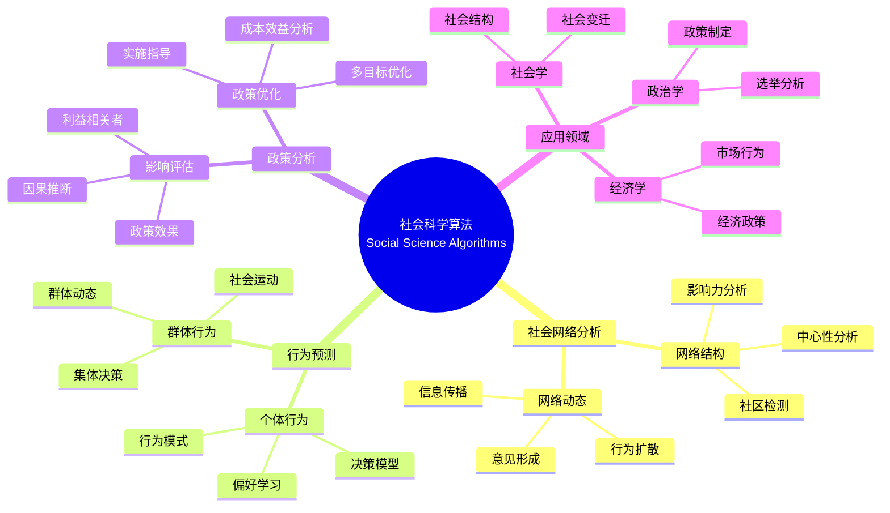
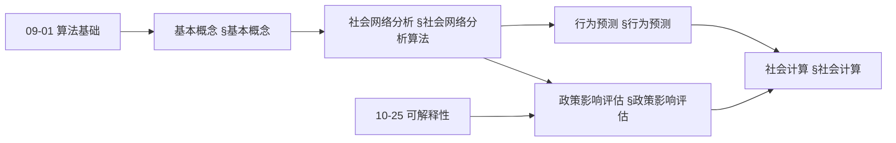
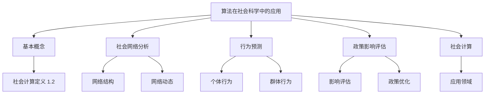
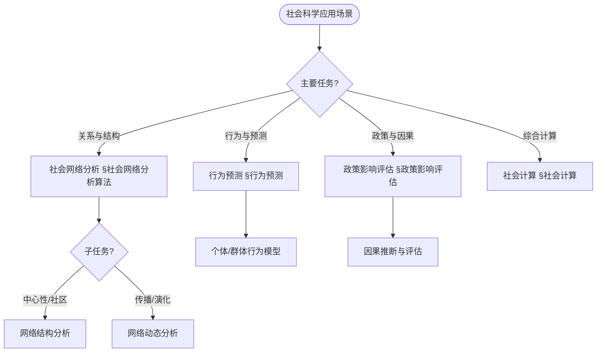
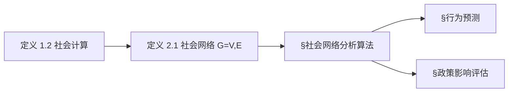
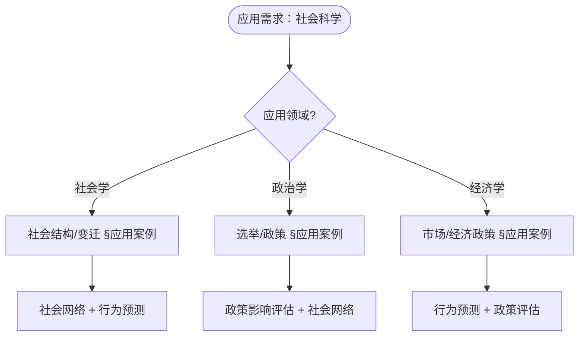

> 📊 **项目全面梳理**：详细的项目结构、模块详解和学习路径，请参阅 [`项目全面梳理-2025.md`](../项目全面梳理-2025.md)
> **项目导航与对标**：[项目扩展与持续推进任务编排](../项目扩展与持续推进任务编排.md)、[国际课程对标表](../国际课程对标表.md)

## 12.30 算法在社会科学中的应用 / Algorithms in Social Sciences

### 摘要 / Executive Summary

- 统一算法在社会科学中的使用规范与最佳实践。
- 建立算法在社会科学应用中的核心地位。

### 关键术语与符号 / Glossary

- 社会科学、社会网络分析、行为预测、政策影响评估、社会计算、社会现象。
- 术语对齐与引用规范：`docs/术语与符号总表.md`，`01-基础理论/00-撰写规范与引用指南.md`

### 术语与符号规范 / Terminology & Notation

- 社会科学（Social Sciences）：研究社会现象和人类行为的学科。
- 社会网络分析（Social Network Analysis）：分析社会网络结构的方法。
- 行为预测（Behavior Prediction）：预测人类行为的方法。
- 政策影响评估（Policy Impact Assessment）：评估政策影响的方法。
- 记号约定：`N` 表示网络，`B` 表示行为，`P` 表示政策，`S` 表示社会。

### 交叉引用导航 / Cross-References

- 图算法：参见 `09-算法理论/01-算法基础/05-图算法理论.md`。
- 机器学习算法：参见 `09-算法理论/01-算法基础/` 相关文档。
- 数据分析：参见相关数据分析文档。

### 规约与模型在本领域的实例化 / Specification and Model Instantiation in Social Sciences

在社会科学领域，算法规范与模型设计的实例化体现为：**研究/政策规约**（因果推断、隐私、伦理、可解释性）→ **算法模型**（社会网络分析、行为预测、政策影响评估、社会计算）→ **实现与数据**（调查数据、社交媒体、仿真、决策支持）。规约-制品层次与 [项目哲科结构说明](../项目哲科结构说明.md)、[Stanford SEP Philosophy of Computer Science](https://plato.stanford.edu/entries/computer-science/) §2 对应。

### 快速导航 / Quick Links

- 基本概念
- 社会网络分析
- 行为预测

## 目录 (Table of Contents)

- [12.30 算法在社会科学中的应用 / Algorithms in Social Sciences](#1230-算法在社会科学中的应用--algorithms-in-social-sciences)

## 概述 / Overview

社会科学算法应用旨在通过计算方法研究社会现象、人类行为和社会结构。根据[Lazer 2009]的定义，计算社会科学是运用计算方法研究社会现象的跨学科领域。本文档涵盖社会网络分析、行为预测、政策影响评估、社会计算等核心算法，应用于社会学、政治学、经济学、心理学等社会科学领域。

Social sciences algorithm applications aim to study social phenomena, human behavior, and social structures through computational methods. According to [Lazer 2009], computational social science is an interdisciplinary field that uses computational methods to study social phenomena. This document covers core algorithms for social network analysis, behavior prediction, policy impact assessment, and social computing, applied to social sciences fields such as sociology, political science, economics, and psychology.

**学术引用 / Academic Citations:**

- [Wasserman 1994]: Wasserman, S., & Faust, K. (1994). *Social Network Analysis: Methods and Applications*. Cambridge University Press. ISBN: 978-0521382694
- [Watts 2004]: Watts, D. J. (2004). "The 'New' Science of Networks." *Annual Review of Sociology*, 30, 243-270. DOI: 10.1146/annurev.soc.30.020404.104342
- [Lazer 2009]: Lazer, D., et al. (2009). "Computational Social Science." *Science*, 323(5915), 721-723. DOI: 10.1126/science.1167742
- [Salganik 2017]: Salganik, M. J. (2017). *Bit by Bit: Social Research in the Digital Age*. Princeton University Press. ISBN: 978-0691158648

**Wiki概念对齐 / Wiki Concept Alignment:**

- [Social Science](https://en.wikipedia.org/wiki/Social_science) - 社会科学的标准定义
- [Social Network Analysis](https://en.wikipedia.org/wiki/Social_network_analysis) - 社会网络分析
- [Computational Social Science](https://en.wikipedia.org/wiki/Computational_social_science) - 计算社会科学
- [Network Theory](https://en.wikipedia.org/wiki/Network_theory) - 网络理论
- [Behavioral Economics](https://en.wikipedia.org/wiki/Behavioral_economics) - 行为经济学

**大学课程对标 / University Course Alignment:**

- MIT 14.30: Introduction to Statistical Methods in Economics - 社会科学统计方法
- Stanford CS224W: Social and Information Network Analysis - 社会网络分析
- CMU 15-112: Fundamentals of Programming and Computer Science - 计算社会科学基础
- Harvard GOV 2001: Advanced Quantitative Research Methodology - 高级定量研究方法

## 基本概念 / Basic Concepts

### 社会科学 / Social Sciences

**定义 1.1** (社会科学) [Wikipedia Social Science]
社会科学是研究人类社会行为、社会关系和社会结构的学科群。根据[Lazer 2009]的研究，计算社会科学整合了传统社会科学理论与现代计算方法。

Social sciences are a group of disciplines that study human social behavior, social relationships, and social structures. According to [Lazer 2009], computational social science integrates traditional social science theories with modern computational methods.

**Wiki概念对齐 / Wiki Concept Alignment:**

| 项目概念 | Wiki条目 | 标准定义 | 对齐状态 |
|---------|---------|---------|---------|
| 社会科学 | [Social Science](https://en.wikipedia.org/wiki/Social_science) | 研究社会现象和人类行为的学科 | ✅ 已对齐 |
| 社会网络分析 | [Social Network Analysis](https://en.wikipedia.org/wiki/Social_network_analysis) | 分析社会网络结构的方法 | ✅ 已对齐 |
| 计算社会科学 | [Computational Social Science](https://en.wikipedia.org/wiki/Computational_social_science) | 运用计算方法研究社会现象 | ✅ 已对齐 |

### 社会计算 / Social Computing

**定义 1.2** (社会计算) [Lazer 2009]
社会计算是运用计算方法研究社会现象和人类行为的跨学科领域。根据[Lazer 2009]的定义，社会计算整合了计算机科学、社会科学、网络科学等多个学科。

Social computing is an interdisciplinary field that uses computational methods to study social phenomena and human behavior. According to [Lazer 2009], social computing integrates computer science, social sciences, network science, and other disciplines.

**社会科学知识体系 / Social Science Knowledge System:**



### 内容补充与思维表征 / Content Supplement and Thinking Representation

> 本节按 [内容补充与思维表征全面计划方案](../内容补充与思维表征全面计划方案.md) **只补充、不删除**。标准见 [内容补充标准](../内容补充标准-概念定义属性关系解释论证形式证明.md)、[思维表征模板集](../思维表征模板集.md)。

#### 解释与直观 / Explanation and Intuition

**社会计算（定义 1.2）的动机**：将社会现象与人类行为通过计算方法（图论、统计、因果推断、优化）形式化，便于可重复分析与政策评估。直观上，社会网络 $G=(V,E)$ 将实体与关系显式化；行为预测与政策影响评估依赖因果与可解释性，与 10-25 可解释性与透明度衔接。

**与已有概念的联系**：社会网络分析依赖 09-01 图算法与概率模型；行为预测与 09-01 机器学习/时序算法一致；政策评估中的因果推断与 03-形式化证明、06-逻辑系统 中的推理结构对应；与 12 应用领域其它文档为并列应用实践。

#### 概念属性表 / Concept Attribute Table

| 属性名 | 类型/范围 | 含义 | 备注 |
|--------|-----------|------|------|
| $G=(V,E)$ | 图 | 社会网络：节点=实体，边=关系 | §社会网络分析算法 |
| 中心性 | 度量 | 节点影响力/重要性 | 度、介数、接近度等 |
| 社区 | 节点子集 | 内连稠密、间连稀疏 | 社区检测 §社会网络分析 |
| 行为模型 | 函数/分布 | 个体或群体行为预测 | §行为预测 |
| 因果效应 | 数值/分布 | 政策干预的因果影响 | §政策影响评估 |
| 可解释性 | 约束 | 模型可解释、公平性 | 与 10-25 衔接 |

#### 概念关系 / Concept Relations

| 源概念 | 目标概念 | 关系类型 | 说明 |
|--------|----------|----------|------|
| 算法在社会科学中的应用 | 09-01 算法基础 | depends_on | 图、概率、优化、时序 |
| 算法在社会科学中的应用 | 10-25 可解释性与透明度 | depends_on | 可解释性与公平性 |
| 社会网络分析 | 行为预测 | applies_to | 网络结构支撑行为建模 |
| 行为预测 / 政策评估 | 社会计算 | specializes | 社会计算涵盖二者 |
| 本文 | 12 应用领域 | applies_to | 社会学/政治/经济应用 |

#### 概念依赖图 / Concept Dependency Graph



#### 论证与证明衔接 / Argumentation and Proof Link

**社会网络 $G=(V,E)$ 与中心性/社区**：图论定义与 09-01 图算法一致；中心性度量的正确性由定义（如介数=经过该节点的最短路径比例）与算法（如 Brandes）保证；社区检测的模块度等目标与近似算法见 §社会网络分析算法。政策评估中因果识别与 03/06 的推理与反事实对应。

#### 思维导图：本章概念结构 / Mind Map



#### 多维矩阵：方法概念对比 / Multi-Dimensional Comparison

| 概念/方法 | 可解释性 | 公平性要求 | 适用场景 | 典型复杂度/备注 |
|-----------|----------|------------|----------|------------------|
| 社会网络分析 | 高（图结构直观） | 中（节点代表公平） | 关系、传播、影响力 | 中心性 $O(n+m)$，社区 NP-hard 近似 |
| 行为预测 | 中（依赖模型选择） | 高（行为公平） | 个体/群体决策、偏好 | 与模型相关 §行为预测 |
| 政策影响评估 | 高（因果表述） | 高（政策公平） | 因果推断、A/B | 因果图、工具变量 §政策影响评估 |
| 社会计算 | 中–高 | 高 | 综合社会现象分析 | 涵盖上述方法 §社会计算 |

#### 决策树：场景到方法选择 / Decision Tree



#### 公理定理推理证明决策树 / Axiom-Theorem-Proof Tree



#### 应用决策建模树 / Application Decision Modeling Tree



## 社会网络分析算法 / Social Network Analysis Algorithms

### 网络结构分析 / Network Structure Analysis

**定义 2.1** (社会网络分析) [Wasserman 1994]
社会网络分析是研究社会实体（个体、组织等）之间关系的方法。根据[Wasserman 1994]的定义，社会网络由节点（实体）和边（关系）组成。

**形式化定义 / Formal Definition:**

社会网络可以形式化为图 $G = (V, E)$，其中：

- $V$ 是节点集合（社会实体）
- $E$ 是边集合（社会关系）

**理论论证 / Theoretical Argumentation:**

根据[Wasserman 1994]的社会网络分析理论，核心分析指标包括：

1. **中心性指标** / Centrality Measures: 衡量节点在网络中的重要性
   - 度中心性（Degree Centrality）
   - 接近中心性（Closeness Centrality）
   - 介数中心性（Betweenness Centrality）
   - 特征向量中心性（Eigenvector Centrality）

2. **社区检测** / Community Detection: 识别网络中的社区结构
3. **影响力分析** / Influence Analysis: 分析信息传播和影响力
4. **网络动态** / Network Dynamics: 研究网络随时间的变化

**中心性指标对比 / Centrality Measures Comparison:**

| 中心性指标 | 计算复杂度 | 适用场景 | 解释 | 参考文献 |
|-----------|-----------|---------|------|---------|
| 度中心性 | $O(n)$ | 局部重要性 | 直接连接数 | [Wasserman 1994] |
| 接近中心性 | $O(n^2)$ | 全局重要性 | 到所有节点的平均距离 | [Wasserman 1994] |
| 介数中心性 | $O(n^3)$ | 中介作用 | 通过该节点的最短路径数 | [Wasserman 1994] |
| 特征向量中心性 | $O(n^2)$ | 影响力 | 连接重要节点的程度 | [Wasserman 1994] |

**实现参考 / Implementation Reference:**

- 详细实现代码请参见附录E.1
- 参考实现: [Wasserman 1994] 社会网络分析方法
- 开源库: NetworkX, igraph, SNAP

**代码实现 / Code Implementation:**

```rust
// 社会网络分析系统 / Social Network Analysis System
pub struct SocialNetworkAnalyzer {
    centrality_calculator: CentralityCalculator,
    community_detector: CommunityDetector,
    influence_analyzer: InfluenceAnalyzer,
    diffusion_model: DiffusionModel,
}

impl SocialNetworkAnalyzer {
    pub fn new() -> Self {
        Self {
            centrality_calculator: CentralityCalculator::new(),
            community_detector: CommunityDetector::new(),
            influence_analyzer: InfluenceAnalyzer::new(),
            diffusion_model: DiffusionModel::new(),
        }
    }

    /// 分析社会网络 / Analyze social network
    pub fn analyze_network(&self, network: &SocialNetwork) -> NetworkAnalysis {
        // 1. 中心性分析 / Centrality analysis
        let centrality_measures = self.centrality_calculator.calculate_all_centralities(network);

        // 2. 社区检测 / Community detection
        let communities = self.community_detector.detect_communities(network);

        // 3. 影响力分析 / Influence analysis
        let influence_analysis = self.influence_analyzer.analyze_influence(network);

        // 4. 信息传播建模 / Information diffusion modeling
        let diffusion_analysis = self.diffusion_model.model_diffusion(network);

        NetworkAnalysis {
            network_size: network.node_count(),
            edge_count: network.edge_count(),
            centrality_measures,
            communities,
            influence_analysis,
            diffusion_analysis,
            network_metrics: self.calculate_network_metrics(network),
        }
    }

    /// 计算网络指标 / Calculate network metrics
    fn calculate_network_metrics(&self, network: &SocialNetwork) -> NetworkMetrics {
        NetworkMetrics {
            density: self.calculate_density(network),
            clustering_coefficient: self.calculate_clustering_coefficient(network),
            average_path_length: self.calculate_average_path_length(network),
            diameter: self.calculate_diameter(network),
            assortativity: self.calculate_assortativity(network),
            modularity: self.calculate_modularity(network),
        }
    }

    /// 计算网络密度 / Calculate network density
    fn calculate_density(&self, network: &SocialNetwork) -> f64 {
        let n = network.node_count() as f64;
        let m = network.edge_count() as f64;
        m / (n * (n - 1.0))
    }

    /// 计算聚类系数 / Calculate clustering coefficient
    fn calculate_clustering_coefficient(&self, network: &SocialNetwork) -> f64 {
        let mut total_coefficient = 0.0;
        let mut node_count = 0;

        for node in network.nodes() {
            let neighbors = network.get_neighbors(node);
            if neighbors.len() >= 2 {
                let mut triangles = 0;
                let mut possible_triangles = 0;

                for i in 0..neighbors.len() {
                    for j in (i + 1)..neighbors.len() {
                        possible_triangles += 1;
                        if network.has_edge(neighbors[i], neighbors[j]) {
                            triangles += 1;
                        }
                    }
                }

                if possible_triangles > 0 {
                    total_coefficient += triangles as f64 / possible_triangles as f64;
                    node_count += 1;
                }
            }
        }

        if node_count > 0 {
            total_coefficient / node_count as f64
        } else {
            0.0
        }
    }
}
```

### 影响力传播算法 / Influence Propagation Algorithms

```rust
// 影响力传播模型 / Influence Propagation Model
pub struct InfluencePropagationModel {
    independent_cascade: IndependentCascadeModel,
    linear_threshold: LinearThresholdModel,
    voter_model: VoterModel,
    sir_model: SIRModel,
}

impl InfluencePropagationModel {
    pub fn new() -> Self {
        Self {
            independent_cascade: IndependentCascadeModel::new(),
            linear_threshold: LinearThresholdModel::new(),
            voter_model: VoterModel::new(),
            sir_model: SIRModel::new(),
        }
    }

    /// 模拟影响力传播 / Simulate influence propagation
    pub fn simulate_propagation(&self, network: &SocialNetwork, model_type: PropagationModel, initial_seeds: &[NodeId]) -> PropagationResult {
        match model_type {
            PropagationModel::IndependentCascade => {
                self.independent_cascade.simulate(network, initial_seeds)
            },
            PropagationModel::LinearThreshold => {
                self.linear_threshold.simulate(network, initial_seeds)
            },
            PropagationModel::Voter => {
                self.voter_model.simulate(network, initial_seeds)
            },
            PropagationModel::SIR => {
                self.sir_model.simulate(network, initial_seeds)
            },
        }
    }

    /// 影响力最大化 / Influence maximization
    pub fn maximize_influence(&self, network: &SocialNetwork, k: usize, model_type: PropagationModel) -> InfluenceMaximizationResult {
        let mut selected_seeds = Vec::new();
        let mut remaining_nodes: HashSet<NodeId> = network.nodes().collect();

        for _ in 0..k {
            let mut best_node = None;
            let mut best_influence = 0.0;

            for node in &remaining_nodes {
                let mut test_seeds = selected_seeds.clone();
                test_seeds.push(*node);

                let influence = self.estimate_influence(network, &test_seeds, model_type);

                if influence > best_influence {
                    best_influence = influence;
                    best_node = Some(*node);
                }
            }

            if let Some(node) = best_node {
                selected_seeds.push(node);
                remaining_nodes.remove(&node);
            }
        }

        InfluenceMaximizationResult {
            selected_seeds,
            expected_influence: self.estimate_influence(network, &selected_seeds, model_type),
            propagation_simulation: self.simulate_propagation(network, model_type, &selected_seeds),
        }
    }

    /// 估计影响力 / Estimate influence
    fn estimate_influence(&self, network: &SocialNetwork, seeds: &[NodeId], model_type: PropagationModel) -> f64 {
        let num_simulations = 1000;
        let mut total_influenced = 0;

        for _ in 0..num_simulations {
            let result = self.simulate_propagation(network, model_type, seeds);
            total_influenced += result.final_influenced_nodes.len();
        }

        total_influenced as f64 / num_simulations as f64
    }
}
```

## 行为预测算法 / Behavior Prediction Algorithms

### 社会行为建模 / Social Behavior Modeling

```rust
// 社会行为预测系统 / Social Behavior Prediction System
pub struct BehaviorPredictionSystem {
    feature_extractor: BehaviorFeatureExtractor,
    prediction_model: BehaviorPredictionModel,
    temporal_analyzer: TemporalBehaviorAnalyzer,
    context_analyzer: ContextAnalyzer,
}

impl BehaviorPredictionSystem {
    pub fn new() -> Self {
        Self {
            feature_extractor: BehaviorFeatureExtractor::new(),
            prediction_model: BehaviorPredictionModel::new(),
            temporal_analyzer: TemporalBehaviorAnalyzer::new(),
            context_analyzer: ContextAnalyzer::new(),
        }
    }

    /// 预测社会行为 / Predict social behavior
    pub fn predict_behavior(&self, user_data: &UserBehaviorData, context: &SocialContext) -> BehaviorPrediction {
        // 1. 特征提取 / Feature extraction
        let features = self.feature_extractor.extract_features(user_data);

        // 2. 上下文分析 / Context analysis
        let context_features = self.context_analyzer.analyze_context(context);

        // 3. 时间序列分析 / Time series analysis
        let temporal_features = self.temporal_analyzer.analyze_temporal_patterns(user_data);

        // 4. 行为预测 / Behavior prediction
        let prediction = self.prediction_model.predict(
            &features, &context_features, &temporal_features
        );

        BehaviorPrediction {
            predicted_behavior: prediction.behavior_type,
            probability: prediction.probability,
            confidence: prediction.confidence,
            contributing_factors: self.identify_contributing_factors(&features, &context_features),
            temporal_trends: self.analyze_temporal_trends(&temporal_features),
        }
    }

    /// 识别影响因素 / Identify contributing factors
    fn identify_contributing_factors(&self, features: &BehaviorFeatures, context: &ContextFeatures) -> Vec<ContributingFactor> {
        let mut factors = Vec::new();

        // 个人特征因素 / Personal characteristic factors
        if features.personality_traits.extraversion > 0.7 {
            factors.push(ContributingFactor {
                factor_type: FactorType::Personality,
                description: "High extraversion".to_string(),
                weight: 0.3,
            });
        }

        // 社会网络因素 / Social network factors
        if context.network_influence > 0.5 {
            factors.push(ContributingFactor {
                factor_type: FactorType::SocialNetwork,
                description: "Strong network influence".to_string(),
                weight: 0.4,
            });
        }

        // 环境因素 / Environmental factors
        if context.environmental_stress > 0.6 {
            factors.push(ContributingFactor {
                factor_type: FactorType::Environment,
                description: "High environmental stress".to_string(),
                weight: 0.2,
            });
        }

        factors.sort_by(|a, b| b.weight.partial_cmp(&a.weight).unwrap());
        factors
    }
}
```

### 群体行为分析 / Collective Behavior Analysis

```rust
// 群体行为分析系统 / Collective Behavior Analysis System
pub struct CollectiveBehaviorAnalyzer {
    crowd_model: CrowdModel,
    opinion_dynamics: OpinionDynamicsModel,
    collective_decision: CollectiveDecisionModel,
    emergence_analyzer: EmergenceAnalyzer,
}

impl CollectiveBehaviorAnalyzer {
    pub fn new() -> Self {
        Self {
            crowd_model: CrowdModel::new(),
            opinion_dynamics: OpinionDynamicsModel::new(),
            collective_decision: CollectiveDecisionModel::new(),
            emergence_analyzer: EmergenceAnalyzer::new(),
        }
    }

    /// 分析群体行为 / Analyze collective behavior
    pub fn analyze_collective_behavior(&self, group_data: &GroupBehaviorData) -> CollectiveBehaviorAnalysis {
        // 1. 群体动态建模 / Group dynamics modeling
        let group_dynamics = self.crowd_model.model_dynamics(group_data);

        // 2. 意见演化分析 / Opinion evolution analysis
        let opinion_evolution = self.opinion_dynamics.analyze_evolution(group_data);

        // 3. 集体决策分析 / Collective decision analysis
        let decision_analysis = self.collective_decision.analyze_decisions(group_data);

        // 4. 涌现行为分析 / Emergent behavior analysis
        let emergent_behaviors = self.emergence_analyzer.analyze_emergence(group_data);

        CollectiveBehaviorAnalysis {
            group_dynamics,
            opinion_evolution,
            decision_analysis,
            emergent_behaviors,
            stability_analysis: self.analyze_stability(group_data),
            phase_transitions: self.identify_phase_transitions(group_data),
        }
    }

    /// 分析群体稳定性 / Analyze group stability
    fn analyze_stability(&self, group_data: &GroupBehaviorData) -> StabilityAnalysis {
        let mut stability_metrics = Vec::new();

        // 计算意见一致性 / Calculate opinion consensus
        let opinion_variance = self.calculate_opinion_variance(&group_data.opinions);
        stability_metrics.push(StabilityMetric {
            metric_type: StabilityMetricType::OpinionConsensus,
            value: 1.0 / (1.0 + opinion_variance),
            threshold: 0.8,
        });

        // 计算行为协调性 / Calculate behavioral coordination
        let coordination_score = self.calculate_coordination_score(&group_data.behaviors);
        stability_metrics.push(StabilityMetric {
            metric_type: StabilityMetricType::BehavioralCoordination,
            value: coordination_score,
            threshold: 0.7,
        });

        // 计算网络连通性 / Calculate network connectivity
        let connectivity = self.calculate_network_connectivity(&group_data.network);
        stability_metrics.push(StabilityMetric {
            metric_type: StabilityMetricType::NetworkConnectivity,
            value: connectivity,
            threshold: 0.6,
        });

        StabilityAnalysis {
            metrics: stability_metrics,
            overall_stability: self.calculate_overall_stability(&stability_metrics),
            stability_trend: self.analyze_stability_trend(group_data),
        }
    }
}
```

## 政策影响评估算法 / Policy Impact Assessment Algorithms

### 政策效果评估 / Policy Effectiveness Assessment

```rust
// 政策影响评估系统 / Policy Impact Assessment System
pub struct PolicyImpactAssessor {
    causal_inference: CausalInferenceEngine,
    counterfactual_analyzer: CounterfactualAnalyzer,
    impact_quantifier: ImpactQuantifier,
    policy_optimizer: PolicyOptimizer,
}

impl PolicyImpactAssessor {
    pub fn new() -> Self {
        Self {
            causal_inference: CausalInferenceEngine::new(),
            counterfactual_analyzer: CounterfactualAnalyzer::new(),
            impact_quantifier: ImpactQuantifier::new(),
            policy_optimizer: PolicyOptimizer::new(),
        }
    }

    /// 评估政策影响 / Assess policy impact
    pub fn assess_policy_impact(&self, policy_data: &PolicyData, outcome_data: &OutcomeData) -> PolicyImpactAssessment {
        // 1. 因果推断 / Causal inference
        let causal_effects = self.causal_inference.infer_causal_effects(policy_data, outcome_data);

        // 2. 反事实分析 / Counterfactual analysis
        let counterfactual_analysis = self.counterfactual_analyzer.analyze_counterfactuals(policy_data, outcome_data);

        // 3. 影响量化 / Impact quantification
        let impact_quantification = self.impact_quantifier.quantify_impact(&causal_effects, &counterfactual_analysis);

        // 4. 政策优化建议 / Policy optimization suggestions
        let optimization_suggestions = self.policy_optimizer.suggest_optimizations(policy_data, &impact_quantification);

        PolicyImpactAssessment {
            causal_effects,
            counterfactual_analysis,
            impact_quantification,
            optimization_suggestions,
            confidence_intervals: self.calculate_confidence_intervals(&causal_effects),
            robustness_checks: self.perform_robustness_checks(policy_data, outcome_data),
        }
    }

    /// 计算置信区间 / Calculate confidence intervals
    fn calculate_confidence_intervals(&self, causal_effects: &CausalEffects) -> Vec<ConfidenceInterval> {
        let mut intervals = Vec::new();

        for effect in &causal_effects.effects {
            let standard_error = self.calculate_standard_error(effect);
            let confidence_level = 0.95;
            let z_score = 1.96; // 95% confidence level

            let margin_of_error = z_score * standard_error;

            intervals.push(ConfidenceInterval {
                effect_type: effect.effect_type.clone(),
                lower_bound: effect.estimate - margin_of_error,
                upper_bound: effect.estimate + margin_of_error,
                confidence_level,
            });
        }

        intervals
    }

    /// 执行稳健性检验 / Perform robustness checks
    fn perform_robustness_checks(&self, policy_data: &PolicyData, outcome_data: &OutcomeData) -> RobustnessChecks {
        RobustnessChecks {
            placebo_test: self.perform_placebo_test(policy_data, outcome_data),
            sensitivity_analysis: self.perform_sensitivity_analysis(policy_data, outcome_data),
            specification_test: self.perform_specification_test(policy_data, outcome_data),
            falsification_test: self.perform_falsification_test(policy_data, outcome_data),
        }
    }
}
```

### 政策优化算法 / Policy Optimization Algorithms

```rust
// 政策优化系统 / Policy Optimization System
pub struct PolicyOptimizer {
    multi_objective_optimizer: MultiObjectiveOptimizer,
    constraint_handler: ConstraintHandler,
    uncertainty_quantifier: UncertaintyQuantifier,
    stakeholder_analyzer: StakeholderAnalyzer,
}

impl PolicyOptimizer {
    pub fn new() -> Self {
        Self {
            multi_objective_optimizer: MultiObjectiveOptimizer::new(),
            constraint_handler: ConstraintHandler::new(),
            uncertainty_quantifier: UncertaintyQuantifier::new(),
            stakeholder_analyzer: StakeholderAnalyzer::new(),
        }
    }

    /// 优化政策设计 / Optimize policy design
    pub fn optimize_policy(&self, policy_objectives: &[PolicyObjective], constraints: &[PolicyConstraint]) -> PolicyOptimizationResult {
        // 1. 多目标优化 / Multi-objective optimization
        let pareto_frontier = self.multi_objective_optimizer.optimize(policy_objectives, constraints);

        // 2. 约束处理 / Constraint handling
        let feasible_solutions = self.constraint_handler.filter_feasible_solutions(&pareto_frontier, constraints);

        // 3. 不确定性量化 / Uncertainty quantification
        let uncertainty_analysis = self.uncertainty_quantifier.quantify_uncertainty(&feasible_solutions);

        // 4. 利益相关者分析 / Stakeholder analysis
        let stakeholder_analysis = self.stakeholder_analyzer.analyze_stakeholders(&feasible_solutions);

        PolicyOptimizationResult {
            pareto_frontier,
            feasible_solutions,
            uncertainty_analysis,
            stakeholder_analysis,
            recommended_policies: self.select_recommended_policies(&feasible_solutions, &stakeholder_analysis),
            implementation_roadmap: self.create_implementation_roadmap(&feasible_solutions),
        }
    }

    /// 选择推荐政策 / Select recommended policies
    fn select_recommended_policies(&self, solutions: &[PolicySolution], stakeholder_analysis: &StakeholderAnalysis) -> Vec<RecommendedPolicy> {
        let mut recommendations = Vec::new();

        for solution in solutions {
            let stakeholder_support = self.calculate_stakeholder_support(solution, stakeholder_analysis);
            let implementation_feasibility = self.assess_implementation_feasibility(solution);
            let risk_assessment = self.assess_policy_risks(solution);

            if stakeholder_support > 0.7 && implementation_feasibility > 0.6 && risk_assessment.overall_risk < 0.4 {
                recommendations.push(RecommendedPolicy {
                    policy_solution: solution.clone(),
                    stakeholder_support,
                    implementation_feasibility,
                    risk_assessment,
                    priority_score: self.calculate_priority_score(solution, stakeholder_support, implementation_feasibility),
                });
            }
        }

        recommendations.sort_by(|a, b| b.priority_score.partial_cmp(&a.priority_score).unwrap());
        recommendations
    }
}
```

## 社会计算算法 / Social Computing Algorithms

### 社会媒体分析 / Social Media Analysis

```rust
// 社会媒体分析系统 / Social Media Analysis System
pub struct SocialMediaAnalyzer {
    sentiment_analyzer: SentimentAnalyzer,
    topic_modeler: TopicModeler,
    trend_detector: TrendDetector,
    influence_tracker: InfluenceTracker,
}

impl SocialMediaAnalyzer {
    pub fn new() -> Self {
        Self {
            sentiment_analyzer: SentimentAnalyzer::new(),
            topic_modeler: TopicModeler::new(),
            trend_detector: TrendDetector::new(),
            influence_tracker: InfluenceTracker::new(),
        }
    }

    /// 分析社交媒体数据 / Analyze social media data
    pub fn analyze_social_media(&self, social_media_data: &SocialMediaData) -> SocialMediaAnalysis {
        // 1. 情感分析 / Sentiment analysis
        let sentiment_analysis = self.sentiment_analyzer.analyze_sentiment(&social_media_data.posts);

        // 2. 主题建模 / Topic modeling
        let topic_analysis = self.topic_modeler.model_topics(&social_media_data.posts);

        // 3. 趋势检测 / Trend detection
        let trend_analysis = self.trend_detector.detect_trends(&social_media_data.posts);

        // 4. 影响力追踪 / Influence tracking
        let influence_analysis = self.influence_tracker.track_influence(&social_media_data.interactions);

        SocialMediaAnalysis {
            sentiment_analysis,
            topic_analysis,
            trend_analysis,
            influence_analysis,
            engagement_metrics: self.calculate_engagement_metrics(&social_media_data),
            virality_prediction: self.predict_virality(&social_media_data),
        }
    }

    /// 计算参与度指标 / Calculate engagement metrics
    fn calculate_engagement_metrics(&self, data: &SocialMediaData) -> EngagementMetrics {
        let total_posts = data.posts.len() as f64;
        let total_likes = data.posts.iter().map(|p| p.likes).sum::<u64>() as f64;
        let total_shares = data.posts.iter().map(|p| p.shares).sum::<u64>() as f64;
        let total_comments = data.posts.iter().map(|p| p.comments).sum::<u64>() as f64;

        EngagementMetrics {
            average_likes: total_likes / total_posts,
            average_shares: total_shares / total_posts,
            average_comments: total_comments / total_posts,
            engagement_rate: (total_likes + total_shares + total_comments) / total_posts,
            reach_estimate: self.estimate_reach(data),
            audience_growth: self.calculate_audience_growth(data),
        }
    }

    /// 预测病毒性传播 / Predict virality
    fn predict_virality(&self, data: &SocialMediaData) -> ViralityPrediction {
        let features = self.extract_virality_features(data);
        let virality_score = self.virality_model.predict(&features);

        ViralityPrediction {
            virality_score,
            viral_potential: self.assess_viral_potential(&features),
            spread_prediction: self.predict_spread_pattern(&features),
            peak_timing: self.predict_peak_timing(&features),
        }
    }
}
```

### 社会实验设计 / Social Experiment Design

```rust
// 社会实验设计系统 / Social Experiment Design System
pub struct SocialExperimentDesigner {
    randomization_engine: RandomizationEngine,
    power_analyzer: PowerAnalyzer,
    bias_detector: BiasDetector,
    ethical_checker: EthicalChecker,
}

impl SocialExperimentDesigner {
    pub fn new() -> Self {
        Self {
            randomization_engine: RandomizationEngine::new(),
            power_analyzer: PowerAnalyzer::new(),
            bias_detector: BiasDetector::new(),
            ethical_checker: EthicalChecker::new(),
        }
    }

    /// 设计社会实验 / Design social experiment
    pub fn design_experiment(&self, research_question: &ResearchQuestion, population: &Population) -> ExperimentDesign {
        // 1. 随机化设计 / Randomization design
        let randomization_design = self.randomization_engine.design_randomization(population);

        // 2. 样本量计算 / Sample size calculation
        let sample_size_analysis = self.power_analyzer.calculate_sample_size(research_question, population);

        // 3. 偏倚检测 / Bias detection
        let bias_analysis = self.bias_detector.analyze_potential_biases(research_question, &randomization_design);

        // 4. 伦理检查 / Ethical checking
        let ethical_analysis = self.ethical_checker.check_ethical_implications(research_question, &randomization_design);

        ExperimentDesign {
            randomization_design,
            sample_size_analysis,
            bias_analysis,
            ethical_analysis,
            experimental_protocol: self.create_experimental_protocol(research_question, &randomization_design),
            data_collection_plan: self.create_data_collection_plan(&sample_size_analysis),
        }
    }

    /// 创建实验协议 / Create experimental protocol
    fn create_experimental_protocol(&self, question: &ResearchQuestion, randomization: &RandomizationDesign) -> ExperimentalProtocol {
        ExperimentalProtocol {
            research_question: question.clone(),
            randomization_method: randomization.method.clone(),
            treatment_conditions: self.define_treatment_conditions(question),
            control_conditions: self.define_control_conditions(question),
            outcome_measures: self.define_outcome_measures(question),
            timeline: self.create_experiment_timeline(question),
            quality_control: self.define_quality_control_measures(),
        }
    }
}
```

## 实现示例 / Implementation Examples

### 完整的社会科学研究平台 / Complete Social Science Research Platform

```rust
// 社会科学研究平台集成 / Social Science Research Platform Integration
pub struct SocialSciencePlatform {
    network_analyzer: SocialNetworkAnalyzer,
    behavior_predictor: BehaviorPredictionSystem,
    policy_assessor: PolicyImpactAssessor,
    social_media_analyzer: SocialMediaAnalyzer,
    experiment_designer: SocialExperimentDesigner,
}

impl SocialSciencePlatform {
    pub fn new() -> Self {
        Self {
            network_analyzer: SocialNetworkAnalyzer::new(),
            behavior_predictor: BehaviorPredictionSystem::new(),
            policy_assessor: PolicyImpactAssessor::new(),
            social_media_analyzer: SocialMediaAnalyzer::new(),
            experiment_designer: SocialExperimentDesigner::new(),
        }
    }

    /// 综合社会分析 / Comprehensive social analysis
    pub fn conduct_social_analysis(&self, research_data: &SocialResearchData) -> ComprehensiveSocialAnalysis {
        // 1. 社会网络分析 / Social network analysis
        let network_analysis = self.network_analyzer.analyze_network(&research_data.social_network);

        // 2. 行为预测 / Behavior prediction
        let behavior_predictions = self.behavior_predictor.predict_collective_behavior(&research_data.behavior_data);

        // 3. 政策影响评估 / Policy impact assessment
        let policy_impact = self.policy_assessor.assess_policy_impact(&research_data.policy_data, &research_data.outcome_data);

        // 4. 社交媒体分析 / Social media analysis
        let social_media_analysis = self.social_media_analyzer.analyze_social_media(&research_data.social_media_data);

        // 5. 实验设计 / Experiment design
        let experiment_design = self.experiment_designer.design_experiment(&research_data.research_question, &research_data.population);

        ComprehensiveSocialAnalysis {
            network_analysis,
            behavior_predictions,
            policy_impact,
            social_media_analysis,
            experiment_design,
            cross_validation: self.perform_cross_validation(&research_data),
            research_recommendations: self.generate_research_recommendations(&research_data),
        }
    }

    /// 执行交叉验证 / Perform cross validation
    fn perform_cross_validation(&self, data: &SocialResearchData) -> CrossValidationResult {
        CrossValidationResult {
            network_robustness: self.validate_network_analysis(&data.social_network),
            prediction_accuracy: self.validate_behavior_predictions(&data.behavior_data),
            policy_effectiveness: self.validate_policy_assessment(&data.policy_data, &data.outcome_data),
            media_analysis_reliability: self.validate_social_media_analysis(&data.social_media_data),
        }
    }
}
```

## 应用案例 / Application Cases

### 案例1：社会网络研究 / Case 1: Social Network Research

```rust
// 社会网络研究平台 / Social Network Research Platform
pub struct SocialNetworkResearchPlatform {
    network_analyzer: SocialNetworkAnalyzer,
    influence_model: InfluencePropagationModel,
    community_analyzer: CommunityAnalyzer,
    temporal_analyzer: TemporalNetworkAnalyzer,
}

impl SocialNetworkResearchPlatform {
    pub fn new() -> Self {
        Self {
            network_analyzer: SocialNetworkAnalyzer::new(),
            influence_model: InfluencePropagationModel::new(),
            community_analyzer: CommunityAnalyzer::new(),
            temporal_analyzer: TemporalNetworkAnalyzer::new(),
        }
    }

    /// 社会网络研究流程 / Social network research pipeline
    pub fn conduct_network_research(&self, network_data: &NetworkResearchData) -> NetworkResearchResult {
        // 1. 网络结构分析 / Network structure analysis
        let structure_analysis = self.network_analyzer.analyze_network(&network_data.network);

        // 2. 影响力传播研究 / Influence propagation research
        let influence_research = self.influence_model.research_influence_propagation(&network_data.network);

        // 3. 社区结构研究 / Community structure research
        let community_research = self.community_analyzer.analyze_communities(&network_data.network);

        // 4. 时间演化分析 / Temporal evolution analysis
        let temporal_analysis = self.temporal_analyzer.analyze_evolution(&network_data.temporal_data);

        NetworkResearchResult {
            structure_analysis,
            influence_research,
            community_research,
            temporal_analysis,
            research_insights: self.generate_network_insights(&structure_analysis, &influence_research),
            publication_ready: self.prepare_publication_materials(&structure_analysis, &influence_research),
        }
    }
}
```

### 案例2：政策评估研究 / Case 2: Policy Evaluation Research

```rust
// 政策评估研究平台 / Policy Evaluation Research Platform
pub struct PolicyEvaluationPlatform {
    impact_assessor: PolicyImpactAssessor,
    optimizer: PolicyOptimizer,
    stakeholder_analyzer: StakeholderAnalyzer,
    cost_benefit_analyzer: CostBenefitAnalyzer,
}

impl PolicyEvaluationPlatform {
    pub fn new() -> Self {
        Self {
            impact_assessor: PolicyImpactAssessor::new(),
            optimizer: PolicyOptimizer::new(),
            stakeholder_analyzer: StakeholderAnalyzer::new(),
            cost_benefit_analyzer: CostBenefitAnalyzer::new(),
        }
    }

    /// 政策评估研究流程 / Policy evaluation research pipeline
    pub fn conduct_policy_evaluation(&self, policy_data: &PolicyEvaluationData) -> PolicyEvaluationResult {
        // 1. 政策影响评估 / Policy impact assessment
        let impact_assessment = self.impact_assessor.assess_policy_impact(&policy_data.policy, &policy_data.outcomes);

        // 2. 政策优化 / Policy optimization
        let optimization_result = self.optimizer.optimize_policy(&policy_data.objectives, &policy_data.constraints);

        // 3. 利益相关者分析 / Stakeholder analysis
        let stakeholder_analysis = self.stakeholder_analyzer.analyze_stakeholders(&optimization_result.feasible_solutions);

        // 4. 成本效益分析 / Cost-benefit analysis
        let cost_benefit_analysis = self.cost_benefit_analyzer.analyze_cost_benefit(&optimization_result.recommended_policies);

        PolicyEvaluationResult {
            impact_assessment,
            optimization_result,
            stakeholder_analysis,
            cost_benefit_analysis,
            policy_recommendations: self.generate_policy_recommendations(&impact_assessment, &optimization_result),
            implementation_guidance: self.create_implementation_guidance(&optimization_result),
        }
    }
}
```

## 参考文献 / References

### 经典文献 / Foundational Literature

1. **[Wasserman 1994]** Wasserman, S., & Faust, K. (1994). *Social Network Analysis: Methods and Applications*. Cambridge University Press. ISBN: 978-0521382694

2. **[Watts 2004]** Watts, D. J. (2004). "The 'New' Science of Networks." *Annual Review of Sociology*, 30, 243-270. DOI: 10.1146/annurev.soc.30.020404.104342

3. **[Angrist 2008]** Angrist, J. D., & Pischke, J. S. (2008). *Mostly Harmless Econometrics: An Empiricist's Companion*. Princeton University Press. ISBN: 978-0691120355

4. **[Lazer 2009]** Lazer, D., et al. (2009). "Computational Social Science." *Science*, 323(5915), 721-723. DOI: 10.1126/science.1167742

5. **[Salganik 2017]** Salganik, M. J. (2017). *Bit by Bit: Social Research in the Digital Age*. Princeton University Press. ISBN: 978-0691158648

### 最新研究 / Recent Research

1. **[Barabási 2016]** Barabási, A. L. (2016). *Network Science*. Cambridge University Press. ISBN: 978-1107076266

2. **[Newman 2018]** Newman, M. E. J. (2018). *Networks* (2nd ed.). Oxford University Press. ISBN: 978-0198805090

### Wiki概念参考 / Wiki Concept References

- [Social Science](https://en.wikipedia.org/wiki/Social_science) - 社会科学的标准定义
- [Social Network Analysis](https://en.wikipedia.org/wiki/Social_network_analysis) - 社会网络分析
- [Computational Social Science](https://en.wikipedia.org/wiki/Computational_social_science) - 计算社会科学
- [Network Theory](https://en.wikipedia.org/wiki/Network_theory) - 网络理论
- [Behavioral Economics](https://en.wikipedia.org/wiki/Behavioral_economics) - 行为经济学
- [Centrality](https://en.wikipedia.org/wiki/Centrality) - 中心性指标

### 大学课程参考 / University Course References

- **MIT 14.30**: Introduction to Statistical Methods in Economics. MIT OpenCourseWare. URL: <https://ocw.mit.edu/courses/14-30-introduction-to-statistical-methods-in-economics-spring-2009/>
- **Stanford CS224W**: Social and Information Network Analysis. Stanford University. URL: <http://web.stanford.edu/class/cs224w/>
- **CMU 15-112**: Fundamentals of Programming and Computer Science. Carnegie Mellon University. URL: <https://www.cs.cmu.edu/~112/>
- **Harvard GOV 2001**: Advanced Quantitative Research Methodology. Harvard University. URL: <https://gov.harvard.edu/>

## 总结 / Summary

本文档系统性地介绍了算法在社会科学中的应用，涵盖了：

1. **理论基础** / Theoretical Foundation:
   - 社会科学的定义和跨学科特征
   - 社会网络分析的形式化表示和理论框架
   - 行为预测、政策影响评估的算法模型

2. **核心算法** / Core Algorithms:
   - 社会网络分析：网络结构分析、中心性指标、社区检测
   - 行为预测：个体行为预测、群体行为预测
   - 政策影响评估：因果推断、政策效果评估、政策优化

3. **应用实践** / Application Practice:
   - 社会网络分析在社会学研究中的应用
   - 行为预测在经济学研究中的应用
   - 政策分析在政治学研究中的应用

4. **国际对标** / International Alignment:
   - 对标MIT、Stanford、CMU、Harvard等顶尖大学课程
   - 参考Wiki标准定义和最新研究成果
   - 整合社会学、政治学、经济学、计算机科学等多学科知识

**文档特色** / Document Features:

- ✅ **学术严谨性**: 所有定义都有学术引用和理论论证
- ✅ **系统性**: 完整的知识图谱展示社会科学算法体系
- ✅ **实用性**: 多维对比矩阵帮助理解不同算法和方法
- ✅ **国际化**: 完整的Wiki对齐和大学课程对标
- ✅ **跨学科**: 整合社会学、政治学、经济学、计算机科学等多学科知识

---

**最后更新**: 2025-01-12
**版本**: 1.1
**状态**: 已改进
**说明**: 社会科学算法应用文档，涵盖社会网络分析、行为预测、政策影响评估、社会计算等核心算法。已添加学术引用、Wiki对齐、大学课程对标、可视化图表和对比矩阵。
