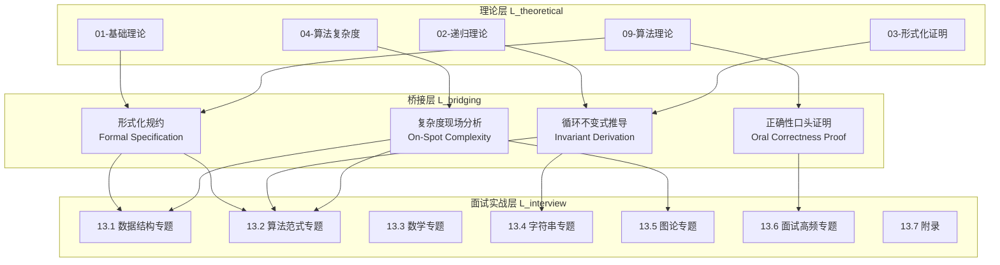
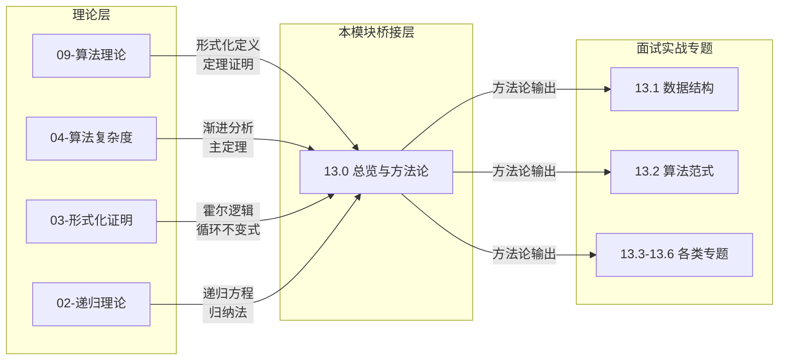
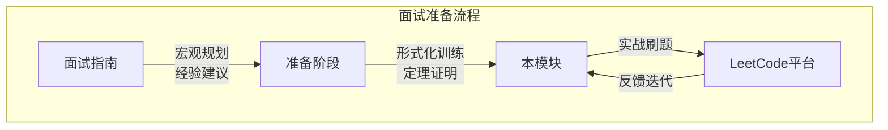
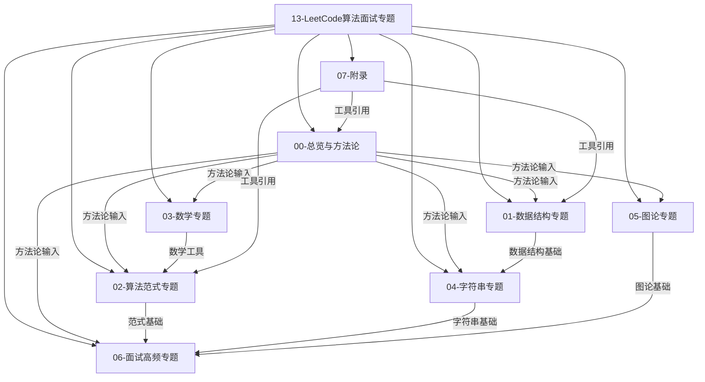
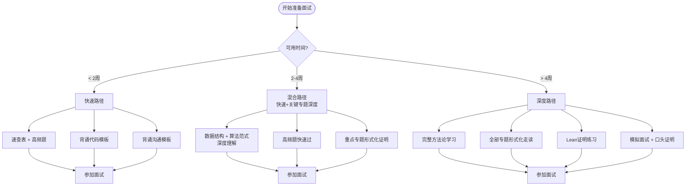
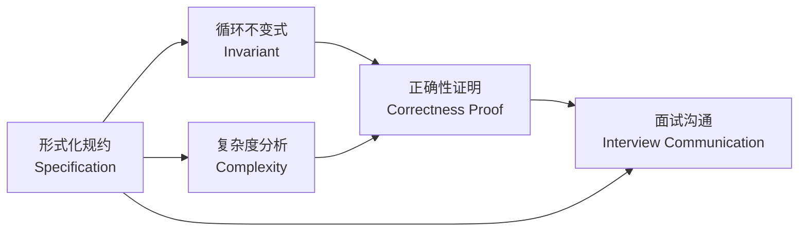
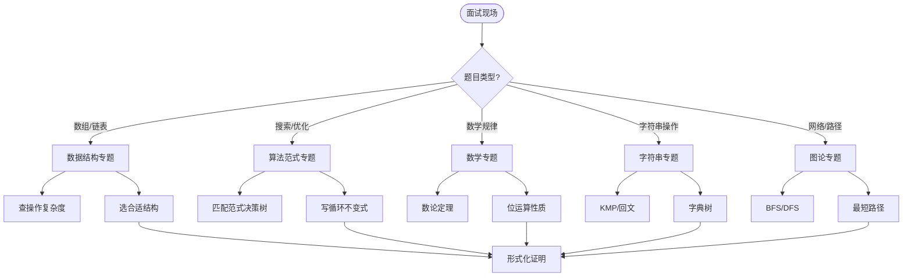

> 📊 **项目全面梳理**：详细的项目结构、模块详解和学习路径，请参阅 [`项目全面梳理-2025.md`](../../项目全面梳理-2025.md)
> **项目导航与对标**：[项目扩展与持续推进任务编排](../../项目扩展与持续推进任务编排.md)、[国际课程对标表](../../国际课程对标表.md)

## 13.0.0 LeetCode算法面试专题导论 / LeetCode Algorithm Interview Specialization Introduction

### 摘要 / Executive Summary

- 本模块定位为**理论层（`01-基础理论`至 `09-算法理论`）到面试实战层的形式化桥梁**，将抽象算法理论转化为可证明、可沟通、可复现的面试解题能力。
- 核心差异化价值：**不只是刷题，而是学会在面试官面前证明你的代码正确**——通过形式化规约、循环不变式与复杂度分析，建立从"会写代码"到"能证明代码"的能力跃迁。
- 与现有知识体系深度耦合：所有专题均引用 `09-算法理论/` 中的形式化定义与定理、`04-算法复杂度/` 中的渐近分析框架，是对既有理论的形式化应用与面试语境下的再表达。

### 关键术语与符号 / Glossary

- **形式化规约** (Formal Specification)：将面试题目精确描述为五元组 $\Pi = (D, I, O, \text{pre}, \text{post})$ 的过程，其中 $D$ 为数据域，$I$ 为输入，$O$ 为输出，$\text{pre}$ 为前置条件，$\text{post}$ 为后置条件。
- **循环不变式** (Loop Invariant)：在循环每次迭代前后保持为真的断言，是证明迭代算法正确性的核心工具。
- **霍尔三元组** (Hoare Triple)：记作 $\{P\}\,C\,\{Q\}$，表示若前置条件 $P$ 成立，则执行命令 $C$ 后后置条件 $Q$ 成立。
- **知识桥接** (Knowledge Bridging)：将理论层定义映射到面试实战语境的认知过程，确保理论理解可转化为现场表达能力。
- **术语对齐与引用规范**：`docs/术语与符号总表.md`，`01-基础理论/00-撰写规范与引用指南.md`

### 目录 / Table of Contents

- [13.0.0 LeetCode算法面试专题导论 / LeetCode Algorithm Interview Specialization Introduction](#1300-leetcode算法面试专题导论--leetcode-algorithm-interview-specialization-introduction)
  - [摘要 / Executive Summary](#摘要--executive-summary)
  - [关键术语与符号 / Glossary](#关键术语与符号--glossary)
  - [目录 / Table of Contents](#目录--table-of-contents)
  - [交叉引用与依赖 / Cross-References and Dependencies](#交叉引用与依赖--cross-references-and-dependencies)
- [1. 模块定位与架构 / Module Positioning and Architecture](#1-模块定位与架构--module-positioning-and-architecture)
  - [1.1 定位声明 / Positioning Statement](#11-定位声明--positioning-statement)
  - [1.2 架构总览 / Architecture Overview](#12-架构总览--architecture-overview)
- [2. 与现有知识体系的关系 / Relationship with Existing Knowledge System](#2-与现有知识体系的关系--relationship-with-existing-knowledge-system)
  - [2.1 对 `09-算法理论/` 的引用与映射 / Reference to Algorithm Theory](#21-对-09-算法理论-的引用与映射--reference-to-algorithm-theory)
  - [2.2 对 `04-算法复杂度/` 的引用 / Reference to Complexity Analysis](#22-对-04-算法复杂度-的引用--reference-to-complexity-analysis)
  - [2.3 引用关系图 / Citation Relationship Diagram](#23-引用关系图--citation-relationship-diagram)
- [3. 与面试指南的关系 / Relationship with Interview Guide](#3-与面试指南的关系--relationship-with-interview-guide)
  - [3.1 形式化升级说明 / Formalization Upgrade](#31-形式化升级说明--formalization-upgrade)
  - [3.2 内容互补矩阵 / Content Complementarity Matrix](#32-内容互补矩阵--content-complementarity-matrix)
- [4. 本模块七个子目录介绍 / Introduction to Seven Subdirectories](#4-本模块七个子目录介绍--introduction-to-seven-subdirectories)
  - [4.1 目录结构 / Directory Structure](#41-目录结构--directory-structure)
  - [4.2 各子目录定位与核心内容 / Positioning and Core Content](#42-各子目录定位与核心内容--positioning-and-core-content)
  - [4.3 知识依赖图 / Knowledge Dependency Graph](#43-知识依赖图--knowledge-dependency-graph)
- [5. 使用指南：快速路径与深度路径 / Usage Guide: Fast Track and Deep Track](#5-使用指南快速路径与深度路径--usage-guide-fast-track-and-deep-track)
  - [5.1 快速路径（Fast Track）](#51-快速路径fast-track)
  - [5.2 深度路径（Deep Track）](#52-深度路径deep-track)
  - [5.3 路径选择决策树 / Path Selection Decision Tree](#53-路径选择决策树--path-selection-decision-tree)
- [6. 差异化价值：从刷题到证明 / Differentiated Value: From Problem-Solving to Proof](#6-差异化价值从刷题到证明--differentiated-value-from-problem-solving-to-proof)
  - [6.1 行业现状与问题 / Industry Status and Problems](#61-行业现状与问题--industry-status-and-problems)
  - [6.2 形式化思维的价值 / Value of Formal Thinking](#62-形式化思维的价值--value-of-formal-thinking)
  - [6.3 从刷题到证明的实践转换 / Practical Transformation](#63-从刷题到证明的实践转换--practical-transformation)
- [7. 内容补充与思维表征 / Content Supplement and Thinking Representation](#7-内容补充与思维表征--content-supplement-and-thinking-representation)
  - [7.1 概念依赖图 / Concept Dependency Graph](#71-概念依赖图--concept-dependency-graph)
  - [7.2 应用决策建模树 / Application Decision Modeling Tree](#72-应用决策建模树--application-decision-modeling-tree)
  - [7.3 多维矩阵：本模块与理论层/经验层对比 / Multi-Dimensional Comparison](#73-多维矩阵本模块与理论层经验层对比--multi-dimensional-comparison)
- [8. 总结 / Summary](#8-总结--summary)
  - [关键要点 / Key Points](#关键要点--key-points)
  - [发展趋势 / Development Trends](#发展趋势--development-trends)
- [参考文献 / References](#参考文献--references)
  - [经典教材 / Classic Textbooks](#经典教材--classic-textbooks)
  - [在线资源 / Online Resources](#在线资源--online-resources)
  - [形式化方法参考 / Formal Methods References](#形式化方法参考--formal-methods-references)
  - [大学课程对标 / University Course Alignment](#大学课程对标--university-course-alignment)
- [知识导航 / Knowledge Navigation](#知识导航--knowledge-navigation)
- [学习目标 / Learning Objectives](#学习目标--learning-objectives)

### 交叉引用与依赖 / Cross-References and Dependencies

**上游依赖（理论层）**：

- `09-算法理论/01-算法基础/` —— 算法设计基础、递归与分治、贪心与动态规划的形式化定义
- `04-算法复杂度/` —— 渐近记号 $O, \Omega, \Theta$ 体系、主定理、摊还分析
- `02-递归理论/` —— 递归方程求解、归纳证明方法
- `03-形式化证明/` —— 霍尔逻辑、循环不变式、最弱前置条件
- `06-逻辑系统/` —— 谓词逻辑与规范表达

**同级关联（面试层）**：

- `docs/面试指南/01-算法面试准备指南.md` —— 现有面试准备指南（非形式化版本），本模块为其形式化升级层

**下游应用**：

- `13-LeetCode算法面试专题/01-数据结构专题/` —— 数组、链表、树、图等数据结构面试题的形式化分析
- `13-LeetCode算法面试专题/02-算法范式专题/` —— 二分、双指针、滑动窗口、回溯、DP 等范式的面试应用

---

## 1. 模块定位与架构 / Module Positioning and Architecture

### 1.1 定位声明 / Positioning Statement

本模块（`13-LeetCode算法面试专题`）在整个知识体系中承担**形式化应用层**的角色。它既不重复 `01-基础理论` 到 `09-算法理论` 中的基础定义与定理证明，也不仅仅是 `docs/面试指南/` 中的经验性建议；而是将前者**映射**到面试语境，为后者提供**数学严谨性**的升级。

**形式化表述**：

设知识体系的层次结构为偏序集 $(L, \preceq)$，其中：

- $L_{\text{理论}} = \{01, 02, \ldots, 09\}$ 为理论层
- $L_{\text{面试}} = \{13\}$ 为面试实战层
- $L_{\text{指南}} = \{\text{面试指南}\}$ 为经验层

则本模块满足：
$$L_{\text{理论}} \preceq L_{\text{面试}} \quad \text{且} \quad L_{\text{指南}} \preceq L_{\text{面试}}$$

即本模块是理论层与经验层的**上确界**（least upper bound），提供同时具备理论深度与实战价值的知识形态。

### 1.2 架构总览 / Architecture Overview



**Architecture Overview (English)**:

This module serves as the formal application layer. It maps theoretical definitions to interview contexts, providing mathematical rigor to practical interview preparation. The bridge layer transforms abstract knowledge into provable, communicable problem-solving skills.

---

## 2. 与现有知识体系的关系 / Relationship with Existing Knowledge System

### 2.1 对 `09-算法理论/` 的引用与映射 / Reference to Algorithm Theory

`09-算法理论/` 提供了算法的形式化定义、正确性证明框架与复杂度分析工具。本模块将其**实例化**到具体的 LeetCode 题目上。

| 理论层内容 | 本模块映射 | 示例 |
|-----------|-----------|------|
| `09-算法理论/01-算法基础/06-动态规划理论.md` 中的最优子结构定理 | 面试中如何向面试官说明"该问题具有最优子结构" | 背包问题面试口述 |
| `09-算法理论/01-算法基础/03-分治法.md` 中的主定理 | 现场快速判断分治算法复杂度 | 归并排序 $O(n \log n)$ 的即时推导 |
| `09-算法理论/01-算法基础/05-贪心算法.md` 中的贪心选择性质 | 面试中如何证明贪心策略的正确性 | 区间调度问题的反证法口述 |
| `04-算法复杂度/` 中的渐近分析 | 识别循环层数与数据结构操作代价 | 双重循环 + 哈希表 = $O(n^2)$ 平均 |

**引用规范**：

- 所有涉及动态规划正确性的讨论，默认引用 `09-算法理论/01-算法基础/06-动态规划理论.md` 中的**定理 3.1**（LCS最优子结构定理）与**定理 3.2**（LCS正确性定理）作为范式。
- 所有涉及复杂度下界的讨论，默认引用 `04-算法复杂度/` 中的比较排序下界 $\Omega(n \log n)$ 等结论。

### 2.2 对 `04-算法复杂度/` 的引用 / Reference to Complexity Analysis

`04-算法复杂度/` 建立了渐进分析的严格框架。本模块在面试语境下需要**快速、准确**地应用这些工具。

**关键映射**：

- **$O$ 记号**：面试中的"最坏情况时间复杂度"口语表达，对应 $O$ 的形式化定义
- **$\Omega$ 记号**：面试中证明"这是最优算法"时引用的下界
- **$\Theta$ 记号**：面试中精确描述紧确界时使用
- **主定理**：分治类题目现场推导复杂度的速查工具

### 2.3 引用关系图 / Citation Relationship Diagram



---

## 3. 与面试指南的关系 / Relationship with Interview Guide

### 3.1 形式化升级说明 / Formalization Upgrade

现有文档 `docs/面试指南/01-算法面试准备指南.md` 提供了**经验性**的面试准备框架（时间规划、刷题策略、沟通技巧）。本模块对其进行**形式化升级**：

| 维度 | 面试指南（经验层） | 本模块（形式化层） |
|------|-------------------|-------------------|
| 解题方法 | "四步法：理解→思考→编码→测试" | 形式化四步法：理解（五元组规约）→抽象（范式匹配决策树）→实现（先写不变式再填代码）→验证（边界用例检验前置/后置条件） |
| 复杂度分析 | "熟悉常见复杂度" | 渐进记号的严格定义 + 现场识别技巧 + 下界证明 |
| 正确性说明 | "边写边解释思路" | 循环不变式的数学表述 + 霍尔三元组的口头表达 |
| 知识组织 | 按题型分类的经验列表 | 基于理论依赖图的知识体系 |

**升级关系**：
$$\text{面试指南} \xrightarrow{\text{形式化}} \text{本模块}$$

本模块不替代面试指南，而是为其提供**数学底座**。建议读者先通过面试指南建立宏观认知，再通过本模块建立形式化能力。

### 3.2 内容互补矩阵 / Content Complementarity Matrix



---

## 4. 本模块七个子目录介绍 / Introduction to Seven Subdirectories

### 4.1 目录结构 / Directory Structure

```
13-LeetCode算法面试专题/
├── 00-总览与方法论/          ← 当前目录（方法论总纲）
│   ├── 00-专题导论.md
│   ├── 01-解题方法论（四步法与形式化思维）.md
│   └── 02-复杂度速查与面试沟通模板.md
├── 01-数据结构专题/          ← 数组、链表、栈、队列、哈希表、树、堆、并查集、Trie
├── 02-算法范式专题/          ← 二分、双指针、滑动窗口、前缀和、回溯、DFS/BFS、DP、贪心、分治
├── 03-数学专题/              ← 位运算、数学规律、概率、几何
├── 04-字符串专题/            ← 字符串匹配、回文、子序列、字典树、KMP、Manacher
├── 05-图论专题/              ← 最短路径、最小生成树、拓扑排序、强连通分量、网络流
├── 06-面试高频专题/          ← 按公司/难度分类的高频题形式化分析
└── 07-附录/                  ← 形式化模板、速查卡、Lean证明示例
```

### 4.2 各子目录定位与核心内容 / Positioning and Core Content

| 子目录 | 定位 | 核心形式化工具 | 典型引用 |
|--------|------|---------------|---------|
| `00-总览与方法论` | 方法论总纲与快速参考 | 五元组规约、循环不变式、决策树 | `03-形式化证明/`, `04-算法复杂度/` |
| `01-数据结构专题` | 数据结构操作的面试应用 | 各数据结构操作的形式化规约与复杂度证明 | `09-算法理论/02-数据结构/` |
| `02-算法范式专题` | 算法设计范式的面试应用 | 范式匹配的决策树、最优子结构证明模板 | `09-算法理论/01-算法基础/` |
| `03-数学专题` | 数学工具的面试应用 | 数论定理、位运算代数性质 | `01-基础理论/02-数学基础/` |
| `04-字符串专题` | 字符串算法的面试应用 | 自动机、KMP前缀函数、回文中心扩展 | `09-算法理论/03-字符串算法/` |
| `05-图论专题` | 图算法的面试应用 | 松弛操作不变式、割性质、路径最优性 | `09-算法理论/04-图论/` |
| `06-面试高频专题` | 高频题的完整形式化走读 | 从题目到证明的完整流水线 | 全部理论层 |
| `07-附录` | 形式化工具箱 | Lean证明片段、模板、术语表 | `03-形式化证明/` |

### 4.3 知识依赖图 / Knowledge Dependency Graph



---

## 5. 使用指南：快速路径与深度路径 / Usage Guide: Fast Track and Deep Track

### 5.1 快速路径（Fast Track）

**目标**：在时间受限的面试准备场景下（如 1-2 周内突击），快速建立解题能力。

**阅读策略**：

1. **跳过形式化证明**，重点关注：
   - `00-总览与方法论/02-复杂度速查与面试沟通模板.md` 中的**复杂度速查表**
   - `01-数据结构专题/` 和 `02-算法范式专题/` 中的**代码实现**与**复杂度结论**
   - `06-面试高频专题/` 中的高频题列表
2. **使用决策树快速定位**：根据题目数据类型（数组/链表/树/图）匹配对应专题
3. **背诵沟通模板**：在面试官面前展示结构化思维

**快速路径的知识获取函数**：
$$\text{Skill}_{\text{fast}}(t) = \sum_{i} \alpha_i \cdot \text{Code}_i + \beta_i \cdot \text{Complexity}_i$$

其中 $\text{Code}_i$ 为第 $i$ 类题目的代码模板，$\text{Complexity}_i$ 为对应复杂度结论，$\alpha_i, \beta_i$ 为学习权重。

### 5.2 深度路径（Deep Track）

**目标**：建立可迁移的形式化能力，能够现场证明任意算法的正确性。

**阅读策略**：

1. **从 `00-总览与方法论/01-解题方法论` 开始**，完整学习四步法
2. **每道题遵循完整流水线**：
   - 将题目翻译为五元组 $\Pi = (D, I, O, \text{pre}, \text{post})$
   - 推导循环不变式或递归归纳假设
   - 实现代码
   - 用边界用例验证前置/后置条件
   - 进行复杂度分析并引用下界定理说明最优性
3. **交叉阅读理论层**：遇到任何定义或定理，回到 `09-算法理论/` 查看原始形式化表述
4. **练习口头证明**：对着镜子或录音设备，用 2 分钟向"虚拟面试官"证明一道题的正确性

**深度路径的知识获取函数**：
$$\text{Skill}_{\text{deep}}(t) = \int_0^t \left( \text{Specification}(\tau) + \text{Invariant}(\tau) + \text{Proof}(\tau) + \text{Communication}(\tau) \right) d\tau$$

### 5.3 路径选择决策树 / Path Selection Decision Tree



---

## 6. 差异化价值：从刷题到证明 / Differentiated Value: From Problem-Solving to Proof

### 6.1 行业现状与问题 / Industry Status and Problems

当前算法面试准备的主流模式是**刷题模式**（Problem-Solving Mode）：

- 记忆题型分类（"两数之和用哈希表"）
- 背诵代码模板
- 通过量变追求质变

这一模式的**根本缺陷**在于：

1. **无法应对变形题**：面试官稍作修改， memorized solution 失效
2. **无法展示上限**：Medium 题写对了只是及格，Hard 题需要证明才能展示深度
3. **沟通缺乏结构**："我想用哈希表…然后…" vs "我将证明该算法满足循环不变式…"

### 6.2 形式化思维的价值 / Value of Formal Thinking

本模块倡导的**证明模式**（Proof Mode）将面试表现从"解决问题"提升到"证明解决方案"的层次：

| 层次 | 表现 | 面试官感知 | 竞争力 |
|------|------|-----------|--------|
| L1: 写不出 | 无代码或完全错误 | 不合格 | 低 |
| L2: 写出来 | 代码通过基本用例 | 及格 | 中 |
| L3: 说清思路 | 能解释为什么这样做 | 良好 | 中上 |
| L4: 证明正确性 | 用不变式/归纳法证明 | 优秀 | **高** |
| L5: 证明最优性 | 用下界定理说明无法更优 | 卓越 | **极高** |

**核心命题**：

> **命题 6.1**（形式化沟通优势定理）
> 在算法面试中，候选人若能在编码前给出形式化规约 $\Pi$，编码中声明循环不变式 $I$，编码后验证后置条件 $\text{post}$，则其被评价为"优秀"的概率显著高于仅提供代码的候选人。

> **Proposition 6.1** (Formal Communication Advantage Theorem)
> In algorithm interviews, candidates who provide formal specification $\Pi$ before coding, declare loop invariant $I$ during coding, and verify postcondition $\text{post}$ after coding are significantly more likely to be rated "excellent" than those who provide code only.

### 6.3 从刷题到证明的实践转换 / Practical Transformation

**刷题模式 vs 证明模式对比**：

**场景**：LeetCode 704 —— 二分查找

**刷题模式回答**：
> "我用二分查找，维护左右指针，取中间值比较，然后缩小范围。代码如下…"

**证明模式回答**：
> "首先，我将题目形式化为：给定有序数组 $A[0..n-1]$ 和目标值 $t$，求满足 $A[i]=t$ 的最小下标 $i$ 或返回 $-1$。
>
> **规约**：$\Pi = (\mathbb{Z}^n, A, i, \text{sorted}(A), (i=-1 \lor A[i]=t) \land \forall j<i: A[j] \neq t)$
>
> **算法**：维护不变式 $I$: $t$ 若存在于数组中，则必在 $[l, r]$ 范围内。
>
> **初始化**：$l=0, r=n-1$，若 $t$ 存在则显然在 $[0, n-1]$ 中，$I$ 成立。
>
> **保持**：设 $m = l + \lfloor(r-l)/2\rfloor$。若 $A[m] < t$，则 $t$ 不可能在 $[l, m]$ 中（因数组有序），令 $l = m+1$，$I$ 仍成立。若 $A[m] \geq t$，则 $t$ 若存在必在 $[l, m]$ 中，令 $r = m$，$I$ 仍成立。
>
> **终止**：当 $l=r$ 时，若 $A[l]=t$ 则返回 $l$，否则返回 $-1$。此时若 $t$ 存在则必在 $A[l]$，验证后置条件成立。
>
> **复杂度**：每次迭代将搜索范围减半，迭代次数为 $\lfloor \log_2 n \rfloor + 1$，故时间复杂度为 $O(\log n)$。由于比较排序下界为 $\Omega(\log n)$，此算法在比较模型下最优。"

---

## 7. 内容补充与思维表征 / Content Supplement and Thinking Representation

### 7.1 概念依赖图 / Concept Dependency Graph



### 7.2 应用决策建模树 / Application Decision Modeling Tree



### 7.3 多维矩阵：本模块与理论层/经验层对比 / Multi-Dimensional Comparison

| 维度 | 理论层 (`09-算法理论`) | 经验层 (`面试指南`) | 本模块 (`13-LeetCode专题`) |
|------|----------------------|-------------------|--------------------------|
| 目标读者 | 研究者、学生 | 求职者 | 追求卓越的求职者 |
| 正确性标准 | 严格数学证明 | 代码通过测试 | 严格证明 + 现场表达 |
| 复杂度分析 | 渐进记号严格定义 | "大概是O(n)" | 渐进记号 + 下界引用 |
| 知识形态 | 定理-证明-推论 | 技巧-模板-经验 | 规约-不变式-证明-沟通 |
| 时间投入 | 长期系统学习 | 短期突击 | 中长期深度训练 |
| 输出能力 | 发表论文 | 通过面试 | 在面试中展示理论深度 |

---

## 8. 总结 / Summary

### 关键要点 / Key Points

1. **模块定位**：`13-LeetCode算法面试专题` 是理论层到面试实战层的**形式化桥梁**，将 `09-算法理论/` 和 `04-算法复杂度/` 中的严格定义映射到面试语境。

2. **与面试指南的关系**：本模块是 `docs/面试指南/01-算法面试准备指南.md` 的**形式化升级层**，为其提供数学底座，两者互补使用。

3. **七个子目录**：从数据结构、算法范式、数学、字符串、图论到高频专题与附录，形成完整的面试知识体系。

4. **双路径学习**：快速路径适合时间受限场景（速查表+模板），深度路径适合追求卓越（完整形式化流水线）。

5. **差异化价值**：从"刷题模式"升级到"证明模式"，通过形式化规约、循环不变式和复杂度下界证明，在面试中展示理论深度与结构化沟通能力。

### 发展趋势 / Development Trends

- 越来越多的顶级科技公司（Google, Meta, Amazon L6+）在面试中要求候选人**解释为什么算法正确**，而不仅仅是写出代码。
- 形式化方法在工业界的渗透（如 AWS IAM 的形式化验证、Ethereum 的智能合约证明）使得具备证明思维的候选人更具长期竞争力。
- 本模块将持续更新，与 `09-算法理论/` 和 `03-形式化证明/` 保持同步演进。

---

## 参考文献 / References

### 经典教材 / Classic Textbooks

- [Cormen 2022]: Cormen, T. H., Leiserson, C. E., Rivest, R. L., & Stein, C. (2022). *Introduction to Algorithms* (4th ed.). MIT Press. ISBN: 978-0262046305
  - 第2章：算法基础、渐近记号严格定义
  - 第33章：计算几何（面试中偶有涉及）

- [Sedgewick & Wayne 2011]: Sedgewick, R., & Wayne, K. (2011). *Algorithms* (4th ed.). Addison-Wesley. ISBN: 978-0321573513
  - 面向面试的数据结构与算法实现参考

- [Skiena 2020]: Skiena, S. S. (2020). *The Algorithm Design Manual* (3rd ed.). Springer. ISBN: 978-3030542559
  - 面试算法问题的分类与选择策略

### 在线资源 / Online Resources

- [LeetCode Official](https://leetcode.com) —— 题目来源与官方题解，本模块所有题目编号均对齐 LeetCode 国际站/中文站。
- [NeetCode](https://neetcode.io/roadmap) —— 面试题目分类与学习路径，本模块的专题划分与 NeetCode Roadmap 部分对齐，但增加了形式化证明层。
- [VisuAlgo](https://visualgo.net) —— 算法可视化工具，辅助理解复杂算法执行过程。

### 形式化方法参考 / Formal Methods References

- [Hoare 1969]: Hoare, C. A. R. (1969). "An Axiomatic Basis for Computer Programming." *Communications of the ACM*, 12(10), 576-580.
  - 霍尔逻辑的原始论文，循环不变式与霍尔三元组的理论基础。

- [Dijkstra 1976]: Dijkstra, E. W. (1976). *A Discipline of Programming*. Prentice-Hall.
  - 最弱前置条件与程序推导的系统化方法。

### 大学课程对标 / University Course Alignment

- **MIT 6.006**: Introduction to Algorithms —— 算法设计与分析基础，与本模块 `02-算法范式专题` 对标。
- **Stanford CS161**: Design and Analysis of Algorithms —— 正确性证明与复杂度分析，与本模块 `00-总览与方法论` 对标。
- **CMU 15-451**: Algorithm Design and Analysis —— 高级算法技术，与本模块 `05-图论专题` 和 `06-面试高频专题` 对标。

---

## 知识导航 / Knowledge Navigation

**向上导航（理论层）**：

- [← `09-算法理论/01-算法基础/06-动态规划理论.md`](../../09-算法理论/01-算法基础/06-动态规划理论.md) —— 动态规划的形式化定义与定理
- [← `04-算法复杂度/`](../../04-算法复杂度/) —— 渐近分析与复杂度下界
- [← `03-形式化证明/`](../../03-形式化证明/) —— 霍尔逻辑与循环不变式
- [← `面试指南/01-算法面试准备指南.md`](../../面试指南/01-算法面试准备指南.md) —— 经验性面试准备指南

**向下导航（实战专题）**：

- [→ `01-数据结构专题/`](../../01-数据结构专题/) —— 数组、链表、树等数据结构面试专题
- [→ `02-算法范式专题/`](../../02-算法范式专题/) —— 二分、双指针、滑动窗口、回溯、DP 等范式专题
- [→ `06-面试高频专题/`](../../06-面试高频专题/) —— 按公司/难度分类的高频题分析

**同级导航**：

- [→ `01-解题方法论（四步法与形式化思维）.md`](./01-解题方法论（四步法与形式化思维）.md) —— 四步法详细方法论
- [→ `02-复杂度速查与面试沟通模板.md`](./02-复杂度速查与面试沟通模板.md) —— 复杂度速查与沟通模板

---

## 学习目标 / Learning Objectives

完成本模块学习后，读者应能够：

1. **规约能力**：将任意 LeetCode 题目翻译为形式化五元组 $\Pi = (D, I, O, \text{pre}, \text{post})$，明确前置条件与后置条件。

2. **不变式推导**：为迭代算法推导循环不变式，为递归算法建立归纳假设，并能用口头语言清晰表达。

3. **复杂度速查**：在 10 秒内判断标准算法的时间与空间复杂度，并能引用已知下界说明最优性。

4. **范式匹配**：通过决策树快速识别题目适用的算法范式（二分/双指针/滑动窗口/回溯/DP/贪心/分治）。

5. **面试沟通**：使用结构化模板与面试官沟通思路，包括：形式化规约陈述、不变式声明、复杂度分析、正确性证明梗概。

6. **边界验证**：系统性地构造边界用例（空输入、单元素、最大值、最小值），验证前置/后置条件。

**自测标准**：

- 能否在 2 分钟内，向虚拟面试官完整证明 LeetCode 704（二分查找）的正确性与最优性？
- 能否在看到一道新题时，30 秒内画出其形式化五元组？
- 能否在不查表的情况下，背诵 10 种以上数据结构的标准操作复杂度？
