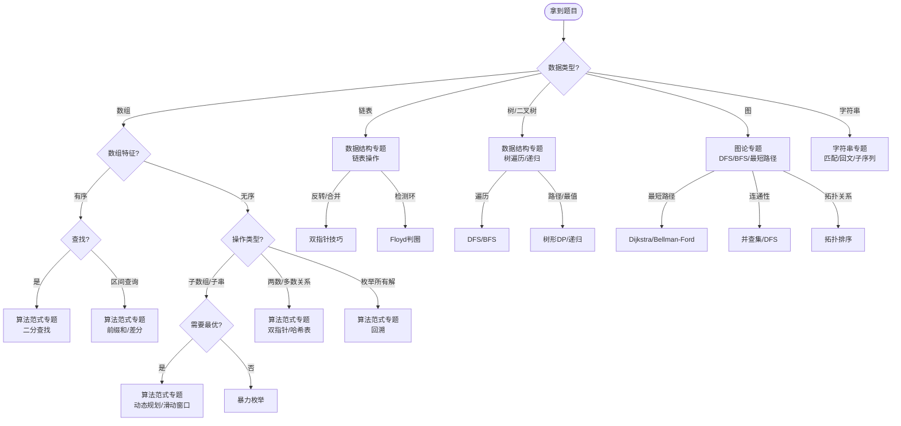
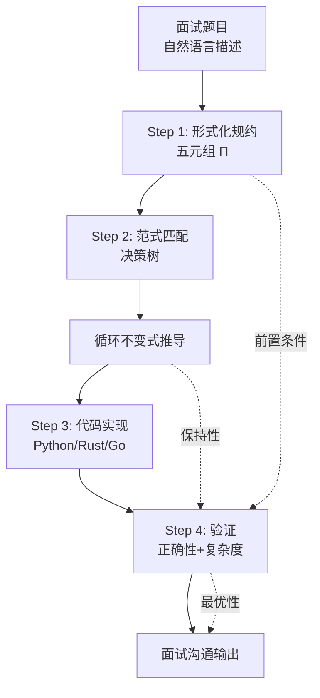

> 📊 **项目全面梳理**：详细的项目结构、模块详解和学习路径，请参阅 [`项目全面梳理-2025.md`](../../项目全面梳理-2025.md)
> **项目导航与对标**：[项目扩展与持续推进任务编排](../../项目扩展与持续推进任务编排.md)、[国际课程对标表](../../国际课程对标表.md)

## 13.0.1 解题方法论（四步法与形式化思维）/ Problem-Solving Methodology (Four-Step Method and Formal Thinking)

### 摘要 / Executive Summary

- 本文档提出并形式化了一套面向算法面试的**四步解题法**：理解（Comprehension）→ 抽象（Abstraction）→ 实现（Implementation）→ 验证（Verification），每一步均配备形式化工具与面试沟通模板。
- 核心创新在于将面试解题过程从经验驱动的"试错模式"转化为**规约驱动的"证明模式"**：先建立形式化五元组与循环不变式，再填入代码，确保代码的正确性在编码前已被逻辑保证。
- 以 **LeetCode 704（二分查找）** 为贯穿全文的完整示例，展示从自然语言题目到形式化规约、不变式推导、代码实现、复杂度分析、正确性证明的完整流水线。

### 关键术语与符号 / Glossary

- **五元组规约** (Five-Tuple Specification)：$\Pi = (D, I, O, \text{pre}, \text{post})$，其中 $D$ 为数据域，$I$ 为输入集合，$O$ 为输出集合，$\text{pre}$ 为前置条件，$\text{post}$ 为后置条件。
- **循环不变式** (Loop Invariant)：在循环每次迭代开始和结束时保持为真的谓词 $P$，用于证明迭代算法的正确性。满足初始化、保持、终止三性质。
- **霍尔三元组** (Hoare Triple)：记作 $\{P\}\,C\,\{Q\}$，表示若程序状态满足前置断言 $P$，执行命令 $C$ 后状态满足后置断言 $Q$。
- **最弱前置条件** (Weakest Precondition, wp)：对于给定命令 $C$ 和后置条件 $Q$，$wp(C, Q)$ 是使 $C$ 终止于满足 $Q$ 状态的最弱（最一般）前置条件。
- **算法范式** (Algorithm Paradigm)：具有共同结构的一类算法设计方法，如分治、动态规划、贪心、回溯等。
- **术语对齐与引用规范**：`docs/术语与符号总表.md`，`01-基础理论/00-撰写规范与引用指南.md`

### 数学前置 / Mathematical Prerequisites

学习本主题建议具备：**离散数学**（集合、关系、函数）、**数理逻辑**（谓词逻辑、量词）；与程序正确性证明衔接时需**霍尔逻辑**基础。详见 `03-形式化证明/01-霍尔逻辑基础.md`、`01-基础理论/02-数学基础.md`。

### 快速导航 / Quick Links

- [目录](#目录)
- [面试四步法形式化](#1-面试四步法形式化--formalization-of-the-four-step-method)
- [形式化定义](#2-形式化定义--formal-definitions)
- [LeetCode 704 完整示例](#3-leetcode-704-二分查找完整示例--leetcode-704-binary-search-complete-example)
- [复杂度速查表](#4-复杂度速查表--complexity-quick-reference)
- [面试沟通模板](#5-面试沟通模板--interview-communication-templates)
- [思维表征](#6-内容补充与思维表征--content-supplement-and-thinking-representation)

## 目录

- [13.0.1 解题方法论（四步法与形式化思维）/ Problem-Solving Methodology (Four-Step Method and Formal Thinking)](#1301-解题方法论四步法与形式化思维-problem-solving-methodology-four-step-method-and-formal-thinking)
  - [摘要 / Executive Summary](#摘要--executive-summary)
  - [关键术语与符号 / Glossary](#关键术语与符号--glossary)
  - [数学前置 / Mathematical Prerequisites](#数学前置--mathematical-prerequisites)
  - [快速导航 / Quick Links](#快速导航--quick-links)
- [目录](#目录)
  - [交叉引用与依赖 / Cross-References and Dependencies](#交叉引用与依赖--cross-references-and-dependencies)
- [1. 面试四步法形式化 / Formalization of the Four-Step Method](#1-面试四步法形式化--formalization-of-the-four-step-method)
  - [1.1 第一步：理解（Comprehension）](#11-第一步理解comprehension)
  - [1.2 第二步：抽象（Abstraction）](#12-第二步抽象abstraction)
  - [1.3 第三步：实现（Implementation）](#13-第三步实现implementation)
  - [1.4 第四步：验证（Verification）](#14-第四步验证verification)
- [2. 形式化定义 / Formal Definitions](#2-形式化定义--formal-definitions)
  - [2.1 面试算法问题实例 / Interview Algorithm Problem Instance](#21-面试算法问题实例--interview-algorithm-problem-instance)
  - [2.2 循环不变式 / Loop Invariant](#22-循环不变式--loop-invariant)
  - [2.3 霍尔三元组 / Hoare Triple](#23-霍尔三元组--hoare-triple)
- [3. LeetCode 704 二分查找完整示例 / LeetCode 704 Binary Search Complete Example](#3-leetcode-704-二分查找完整示例--leetcode-704-binary-search-complete-example)
  - [3.1 题目描述](#31-题目描述)
  - [3.2 Step 1：形式化规约](#32-step-1形式化规约)
  - [3.3 Step 2：范式匹配与算法选择](#33-step-2范式匹配与算法选择)
  - [3.4 Step 3：循环不变式推导与代码实现](#34-step-3循环不变式推导与代码实现)
    - [3.4.1 不变式声明](#341-不变式声明)
    - [3.4.2 初始化证明](#342-初始化证明)
    - [3.4.3 保持证明](#343-保持证明)
    - [3.4.4 终止与后置条件](#344-终止与后置条件)
    - [3.4.5 Rust 实现](#345-rust-实现)
  - [3.5 Step 4：验证与复杂度分析](#35-step-4验证与复杂度分析)
    - [3.5.1 正确性总结](#351-正确性总结)
    - [3.5.2 复杂度分析](#352-复杂度分析)
    - [3.5.3 最优性讨论](#353-最优性讨论)
- [4. 复杂度速查表 / Complexity Quick Reference](#4-复杂度速查表--complexity-quick-reference)
  - [4.1 数据结构操作复杂度](#41-数据结构操作复杂度)
  - [4.2 算法范式复杂度](#42-算法范式复杂度)
- [5. 面试沟通模板 / Interview Communication Templates](#5-面试沟通模板--interview-communication-templates)
  - [5.1 规约陈述模板](#51-规约陈述模板)
  - [5.2 不变式声明模板](#52-不变式声明模板)
  - [5.3 复杂度分析模板](#53-复杂度分析模板)
  - [5.4 最优性证明模板](#54-最优性证明模板)
- [6. 内容补充与思维表征 / Content Supplement and Thinking Representation](#6-内容补充与思维表征--content-supplement-and-thinking-representation)
  - [6.1 拿到题目 → 专题匹配决策树](#61-拿到题目--专题匹配决策树)
  - [6.2 时间约束 → 算法选择决策树](#62-时间约束--算法选择决策树)
  - [6.3 四步法概念依赖图](#63-四步法概念依赖图)
  - [6.4 多维矩阵：四步法与传统方法对比](#64-多维矩阵四步法与传统方法对比)
- [7. 总结 / Summary](#7-总结--summary)
  - [关键要点 / Key Points](#关键要点--key-points)
  - [发展趋势 / Development Trends](#发展趋势--development-trends)
- [参考文献 / References](#参考文献--references)
  - [经典教材 / Classic Textbooks](#经典教材--classic-textbooks)
  - [形式化方法 / Formal Methods](#形式化方法--formal-methods)
  - [在线资源 / Online Resources](#在线资源--online-resources)
  - [大学课程对标 / University Course Alignment](#大学课程对标--university-course-alignment)
- [知识导航 / Knowledge Navigation](#知识导航--knowledge-navigation)
- [学习目标 / Learning Objectives](#学习目标--learning-objectives)

### 交叉引用与依赖 / Cross-References and Dependencies

**上游依赖**：

- `03-形式化证明/01-霍尔逻辑基础.md` —— 霍尔三元组与最弱前置条件的严格定义
- `09-算法理论/01-算法基础/` —— 各类算法范式的形式化定义
- `04-算法复杂度/01-渐近记号.md` —— $O, \Omega, \Theta$ 的严格定义

**同级关联**：

- `00-专题导论.md` —— 本模块整体架构与定位
- `02-复杂度速查与面试沟通模板.md` —— 本文档中复杂度速查表的扩展版本

**下游应用**：

- `13-LeetCode算法面试专题/01-数据结构专题/` —— 四步法在具体数据结构题目中的应用
- `13-LeetCode算法面试专题/02-算法范式专题/` —— 四步法在具体算法范式题目中的应用

---

## 1. 面试四步法形式化 / Formalization of the Four-Step Method

### 1.1 第一步：理解（Comprehension）

**目标**：将自然语言描述的题目翻译为严格的数学规约。

**操作**：构造五元组 $\Pi = (D, I, O, \text{pre}, \text{post})$。

| 组件 | 含义 | 面试口语表达示例 |
|------|------|----------------|
| $D$ | 数据域（Data Domain） | "输入是一个整数数组…" |
| $I$ | 输入集合（Input Set） | "数组长度 $n$ 满足 $1 \leq n \leq 10^5$…" |
| $O$ | 输出集合（Output Set） | "输出是目标值的下标，或 $-1$ 表示不存在…" |
| $\text{pre}$ | 前置条件（Precondition） | "我假设输入数组是有序的…" |
| $\text{post}$ | 后置条件（Postcondition） | "如果返回值 $i \neq -1$，则 $A[i] = \text{target}$；如果 $i = -1$，则目标值不在数组中…" |

**关键检查点**：

- 输入的边界条件是否全部覆盖？（空数组、单元素、最大值、最小值）
- 输出在何种情况下唯一？何时可能不唯一？
- 前置条件中是否有隐含的约束（如有序性、互异性）？

### 1.2 第二步：抽象（Abstraction）

**目标**：识别题目对应的算法范式，匹配到已知的理论框架。

**操作**：通过特征提取，将题目映射到 `09-算法理论/01-算法基础/` 中的某个范式。

**特征-范式匹配表**：

| 特征 | 可能范式 | 交叉引用 |
|------|---------|---------|
| 输入为有序数组，要求查找 | 二分查找 | `09-算法理论/01-算法基础/02-分治法.md` |
| 需要枚举所有可能解 | 回溯 / DFS | `09-算法理论/01-算法基础/04-回溯算法.md` |
| 问题具有最优子结构 | 动态规划 / 贪心 | `09-算法理论/01-算法基础/06-动态规划理论.md` |
| 子问题独立且可合并 | 分治 | `09-算法理论/01-算法基础/03-分治法.md` |
| 每一步做局部最优选择 | 贪心 | `09-算法理论/01-算法基础/05-贪心算法.md` |
| 涉及图上的遍历/最短路径 | BFS / Dijkstra / Floyd | `09-算法理论/04-图论/` |
| 数组上的区间查询/操作 | 双指针 / 滑动窗口 / 前缀和 | `02-算法范式专题/` |

**面试沟通话术**：
> "我注意到题目具有以下特征：… 这符合 [范式名称] 的适用条件，因为 [理论依据]。根据 [Cormen 2022] 的定义，该范式要求 [核心性质]，而本题满足该性质。"

### 1.3 第三步：实现（Implementation）

**目标**：在形式化规约和范式指导下，编写正确的代码。

**核心原则**：**先写循环不变式，再填代码**。

**操作流程**：

```
1. 声明不变式 I（用谓词逻辑精确描述）
2. 设计循环结构（初始化 → 循环体 → 终止条件）
3. 验证初始化时 I 成立
4. 验证每次迭代 I 保持
5. 验证终止时 I 蕴含后置条件
6. 将上述逻辑翻译为代码
```

**代码编写规范**：

- 使用 `Python` / `Rust` / `Go`（本项目语言栈）
- 在关键位置添加注释，对应形式化规约中的断言
- 边界处理显式化（如数组为空、索引越界等）

### 1.4 第四步：验证（Verification）

**目标**：证明算法的正确性，并分析其复杂度。

**正确性验证清单**：

- [ ] 前置条件是否被满足？
- [ ] 循环不变式是否满足初始化、保持、终止三性质？
- [ ] 终止条件是否保证算法必然终止？
- [ ] 终止时不变式是否蕴含后置条件？
- [ ] 边界用例是否全部通过？

**复杂度分析**：

- 时间复杂度：识别循环层数、递归深度、数据结构操作代价
- 空间复杂度：识别辅助空间、递归栈空间、输出空间
- 最优性讨论：是否能引用已知下界说明算法最优？

---

## 2. 形式化定义 / Formal Definitions

### 2.1 面试算法问题实例 / Interview Algorithm Problem Instance

**定义 2.1**（面试算法问题实例）

一个面试算法问题实例是一个五元组 $\Pi = (D, I, O, \text{pre}, \text{post})$，其中：

1. $D$ 是**数据域**，定义了问题中涉及的所有数据类型及其取值范围。
2. $I \subseteq D^*$ 是**输入集合**，表示所有合法输入的集合。
3. $O \subseteq D^*$ 是**输出集合**，表示所有合法输出的集合。
4. $\text{pre}: I \to \{\text{true}, \text{false}\}$ 是**前置条件**，描述输入必须满足的性质。
5. $\text{post}: I \times O \to \{\text{true}, \text{false}\}$ 是**后置条件**，描述输入与输出之间必须满足的关系。

**Definition 2.1** (Interview Algorithm Problem Instance)

An interview algorithm problem instance is a five-tuple $\Pi = (D, I, O, \text{pre}, \text{post})$, where $D$ is the data domain, $I$ is the input set, $O$ is the output set, $\text{pre}$ is the precondition, and $\text{post}$ is the postcondition.

**示例**：LeetCode 704 的五元组规约

- $D = \mathbb{Z}^* \times \mathbb{Z}$（整数序列与整数目标值）
- $I = \{(A, t) \mid A \in \mathbb{Z}^n, n \geq 1, \text{sorted}(A), t \in \mathbb{Z}\}$
- $O = \{-1, 0, 1, \ldots, n-1\}$
- $\text{pre}(A, t)$: $A$ 按非递减顺序排列
- $\text{post}((A, t), i)$:
  - 若 $\exists j: A[j] = t$，则 $i = \min\{j \mid A[j] = t\}$
  - 若 $\neg\exists j: A[j] = t$，则 $i = -1$

### 2.2 循环不变式 / Loop Invariant

**定义 2.2**（循环不变式）[Hoare 1969, Cormen 2022]

对于循环语句 `while (G) { B }`，谓词 $P$ 称为其**循环不变式**（Loop Invariant），当且仅当满足以下三性质：

1. **初始化** (Initialization)：循环开始前，$P$ 成立。
   $$\text{pre} \Rightarrow P$$

2. **保持** (Maintenance)：若在某次迭代开始时 $P$ 成立且循环条件 $G$ 为真，则执行循环体 $B$ 后 $P$ 仍然成立。
   $$\{P \land G\}\,B\,\{P\}$$

3. **终止** (Termination)：当循环终止时（即 $G$ 为假），$P$ 与 $\neg G$ 的合取蕴含后置条件。
   $$P \land \neg G \Rightarrow \text{post}$$

**Definition 2.2** (Loop Invariant)

A predicate $P$ is a loop invariant for `while (G) { B }` if it satisfies initialization, maintenance, and termination properties.

### 2.3 霍尔三元组 / Hoare Triple

**定义 2.3**（霍尔三元组）[Hoare 1969]

**霍尔三元组**记作 $\{P\}\,C\,\{Q\}$，其中 $P$ 为前置断言，$C$ 为命令，$Q$ 为后置断言。其含义为：

> 若在执行 $C$ 之前程序状态满足 $P$，且 $C$ 终止，则执行后状态满足 $Q$。

**最弱前置条件** (Weakest Precondition) [Dijkstra 1976]：

$$wp(C, Q) = \text{使 } C \text{ 终止于满足 } Q \text{ 状态的最弱前置条件}$$

**关键推理规则**：

| 规则名称 | 形式 | 说明 |
|---------|------|------|
| 赋值公理 | $\{Q[e/x]\}\,x := e\,\{Q\}$ | 将 $Q$ 中 $x$ 替换为 $e$ |
| 顺序组合 | $\frac{\{P\}C_1\{R\}, \{R\}C_2\{Q\}}{\{P\}C_1;C_2\{Q\}}$ | 中间断言 $R$ 连接 |
| 条件规则 | $\frac{\{P \land G\}C_1\{Q\}, \{P \land \neg G\}C_2\{Q\}}{\{P\}\text{if } G \text{ then } C_1 \text{ else } C_2\{Q\}}$ | 两个分支均保持 $Q$ |
| 循环规则 | $\frac{\{P \land G\}C\{P\}}{\{P\}\text{while } G \text{ do } C\{P \land \neg G\}}$ | $P$ 为循环不变式 |

---

## 3. LeetCode 704 二分查找完整示例 / LeetCode 704 Binary Search Complete Example

### 3.1 题目描述

**LeetCode 704. Binary Search**

给定一个 $\texttt{n}$ 个元素**有序**的（升序）整型数组 $\texttt{nums}$ 和一个目标值 $\texttt{target}$，写一个函数搜索 $\texttt{nums}$ 中的 $\texttt{target}$，如果目标值存在返回下标，否则返回 $-1$。

**Given an array of integers `nums` which is sorted in ascending order, and an integer `target`, write a function to search `target` in `nums`. If `target` exists, then return its index. Otherwise, return `-1`.**

---

### 3.2 Step 1：形式化规约

**数据域 $D$**：
$$D = \mathbb{Z}^* \times \mathbb{Z}$$
其中 $\mathbb{Z}^*$ 表示所有有限整数序列的集合。

**输入集合 $I$**：
$$I = \{(A, t) \mid A = \langle a_0, a_1, \ldots, a_{n-1} \rangle, n \geq 0, \forall i < j: a_i \leq a_j, t \in \mathbb{Z}\}$$

> **面试口述**："输入是一个有序整数数组 $A$（长度 $n$ 可以为 $0$）和一个整数目标值 $t$。"

**输出集合 $O$**：
$$O = \{-1, 0, 1, \ldots, n-1\}$$

**前置条件 $\text{pre}$**：
$$\text{pre}(A, t) := (n = 0) \lor (\forall i \in [0, n-2]: A[i] \leq A[i+1])$$

> **面试口述**："我的前置条件是：数组 $A$ 按非递减顺序排列。如果 $n=0$，这是自然满足的。"

**后置条件 $\text{post}$**：
$$
\text{post}((A, t), i) := \begin{cases}
i = -1 & \text{if } \neg\exists j \in [0, n-1]: A[j] = t \\
A[i] = t \land \forall j < i: A[j] \neq t & \text{otherwise}
\end{cases}
$$

> **面试口述**："后置条件有两部分：如果目标值不存在，返回 $-1$；如果存在，返回最左侧出现位置的下标，即满足 $A[i]=t$ 的最小 $i$。"

---

### 3.3 Step 2：范式匹配与算法选择

**特征提取**：

1. 输入是**有序数组** —— 暗示可以利用顺序性质进行 $O(\log n)$ 查找
2. 要求**精确查找** —— 匹配搜索范式
3. 需要返回**最左侧位置** —— 暗示需要仔细处理相等时的边界

**范式匹配**：

根据 `09-算法理论/01-算法基础/03-分治法.md` 中的分治范式定义，二分查找是分治策略在搜索问题上的典型应用：

- **分解**：将搜索区间 $[l, r]$ 分为 $[l, m]$ 和 $[m+1, r]$（或 $[l, m-1]$ 和 $[m, r]$）
- **解决**：通过比较 $A[m]$ 与 $t$ 确定目标在哪一半
- **合并**：无需显式合并，直接返回子问题的解

**算法选择**：二分查找（左闭右闭区间版本）。

> **面试口述**："由于输入数组是有序的，我考虑使用二分查找。根据分治范式，每次将搜索范围减半，可以在 $O(\log n)$ 时间内完成。这比对数下界 $O(\log n)$ 更优于线性扫描的 $O(n)$。"

---

### 3.4 Step 3：循环不变式推导与代码实现

#### 3.4.1 不变式声明

**循环不变式 $I$**：

> 如果目标值 $t$ 存在于数组 $A$ 中，则 $t$ 必在子数组 $A[l..r]$ 中（含端点）。

形式化：
$$I := (\exists j \in [0, n-1]: A[j] = t) \Rightarrow (\exists j \in [l, r]: A[j] = t)$$

或等价地：
$$I := (\forall j \in [0, n-1]: A[j] = t \Rightarrow j \in [l, r])$$

> **面试口述**："我的循环不变式是：如果目标值存在于原数组中，那么它一定在当前搜索区间 $[l, r]$ 内。"

#### 3.4.2 初始化证明

**初始化**：$l = 0, r = n - 1$

若 $t$ 存在于 $A$ 中，则其下标显然在 $[0, n-1]$ 中，故 $I$ 成立。

> **面试口述**："初始化时，搜索区间是整个数组 $[0, n-1]$。如果目标值存在，显然在这个区间内。不变式成立。"

#### 3.4.3 保持证明

设某次迭代开始时 $I$ 成立，且 $l \leq r$。

取中点：
$$m = l + \left\lfloor \frac{r - l}{2} \right\rfloor$$

**情况 1**：$A[m] < t$

由于数组非递减，对所有 $j \leq m$，有 $A[j] \leq A[m] < t$。
因此 $t$ 不可能在 $[l, m]$ 中。
若 $t$ 存在，则必在 $[m+1, r]$ 中。
令 $l' = m + 1, r' = r$，则 $I$ 对 $(l', r')$ 仍成立。

**情况 2**：$A[m] \geq t$

由于数组非递减，对所有 $j > m$（原区间中），若 $t$ 存在则 $A[j] \geq A[m] \geq t$。
但 $t$ 若存在且 $j > m$，不能确定。然而 $A[m] \geq t$ 意味着 $t$ 若存在，可能在 $m$ 或其左侧。
令 $l' = l, r' = m$，则 $t$ 若存在必在 $[l, m]$ 中，$I$ 仍成立。

> **面试口述**："保持性分两种情况。如果 $A[m] < t$，由于数组有序，$t$ 不可能在 $m$ 左侧，所以将左边界移到 $m+1$。如果 $A[m] \geq t$，目标值如果存在，必在 $m$ 或其左侧，所以将右边界移到 $m$。两种情况下不变式都保持。"

#### 3.4.4 终止与后置条件

循环终止条件：$l = r$（或 $l > r$，取决于实现）。

对于**左闭右开**版本（$[l, r)$），终止时 $l = r$，检查 $A[l]$ 是否等于 $t$。

对于**左闭右闭**版本（$[l, r]$），终止时 $l > r$ 或 $l = r$ 后退出。

以**左闭右开、返回最左**的版本为例：

当 $l = r$ 时，$I$ 表明：若 $t$ 存在，则 $t$ 在 $A[l..l-1]$（空区间）。
这意味着 $t$ 不存在，或 $l$ 已指向最左侧的 $t$。

实际上，对于返回最左侧下标的实现，使用以下版本更清晰：

```python
def binary_search(nums: list[int], target: int) -> int:
    """
    二分查找：返回target的最左下标，若不存在返回-1。
    循环不变式：若target存在于原数组，则target在nums[l:r]中（含l，不含r）。
    """
    l, r = 0, len(nums)  # 初始化：搜索区间[0, n)

    while l < r:
        m = l + (r - l) // 2  # 避免溢出的中点计算
        if nums[m] < target:
            l = m + 1         # target不可能在[l, m]中
        else:
            r = m             # target可能在m或其左侧

    # 终止时 l == r，检查是否找到
    if l < len(nums) and nums[l] == target:
        return l
    return -1
```

**终止时分析**：

- 循环终止时 $l = r$，搜索区间为空（半开区间意义下）。
- 若 $t$ 存在，由于每次都将包含 $t$ 的区间保留，最终 $l$ 必指向最左侧的 $t$。
- 若 $t$ 不存在，$l$ 指向 $t$ 应插入的位置，此时 $A[l] \neq t$（或 $l = n$）。

> **面试口述**："终止时 $l$ 等于 $r$。由于我们每次保留可能包含目标值的那一半，如果目标值存在，$l$ 最终会停在最左侧的那个位置。最后我检查 $A[l]$ 是否等于目标值来确认。"

#### 3.4.5 Rust 实现

```rust
/// 二分查找：返回 target 的最左下标，若不存在返回 -1
/// Loop invariant: if target exists in nums, it is in nums[l..r]
pub fn binary_search(nums: &[i32], target: i32) -> i32 {
    let mut l: usize = 0;
    let mut r: usize = nums.len();  // [l, r) 半开区间

    // Invariant I: if target exists in nums[0..nums.len()],
    //              then target exists in nums[l..r]
    while l < r {
        let m = l + (r - l) / 2;
        if nums[m] < target {
            // nums[l..=m] < target, so target cannot be in [l, m]
            l = m + 1;
        } else {
            // nums[m] >= target, so target (if exists) is in [l, m]
            r = m;
        }
    }

    // Termination: l == r
    // If target exists, l points to the leftmost occurrence
    if l < nums.len() && nums[l] == target {
        l as i32
    } else {
        -1
    }
}

# [cfg(test)]
mod tests {
    use super::*;

    #[test]
    fn test_binary_search_found() {
        let nums = vec![-1, 0, 3, 5, 9, 12];
        assert_eq!(binary_search(&nums, 9), 4);
    }

    #[test]
    fn test_binary_search_not_found() {
        let nums = vec![-1, 0, 3, 5, 9, 12];
        assert_eq!(binary_search(&nums, 2), -1);
    }

    #[test]
    fn test_binary_search_leftmost() {
        let nums = vec![1, 2, 2, 2, 3, 4];
        assert_eq!(binary_search(&nums, 2), 1);  // leftmost occurrence
    }

    #[test]
    fn test_binary_search_empty() {
        let nums: Vec<i32> = vec![];
        assert_eq!(binary_search(&nums, 1), -1);
    }

    #[test]
    fn test_binary_search_single() {
        let nums = vec![5];
        assert_eq!(binary_search(&nums, 5), 0);
        assert_eq!(binary_search(&nums, 3), -1);
    }
}
```

---

### 3.5 Step 4：验证与复杂度分析

#### 3.5.1 正确性总结

**定理 3.1**（二分查找正确性定理）

上述 `binary_search` 算法满足 LeetCode 704 的后置条件：

- 若 $\exists j: A[j] = t$，则返回 $\min\{j \mid A[j] = t\}$
- 若 $\neg\exists j: A[j] = t$，则返回 $-1$

**证明**：
由循环不变式 $I$ 的初始化、保持、终止三性质，以及终止时的显式检查，直接可得。$\square$

#### 3.5.2 复杂度分析

**时间复杂度**：

设第 $k$ 次迭代时区间长度为 $r_k - l_k$。

- 初始：$r_0 - l_0 = n$
- 每次迭代：区间至少减半（严格小于），即 $r_{k+1} - l_{k+1} \leq \lfloor (r_k - l_k) / 2 \rfloor$

设经过 $T$ 次迭代后终止，则：
$$1 \leq r_T - l_T < \frac{n}{2^T} + 1$$

取对数得 $T \leq \lfloor \log_2 n \rfloor + 1$。

因此：
$$T(n) = O(\log n)$$

> **面试口述**："每次迭代搜索区间至少减半，所以从长度 $n$ 减到 $1$ 需要 $O(\log n)$ 次迭代。每次迭代只做常数工作，所以总时间复杂度是 $O(\log n)$。"

**空间复杂度**：

仅使用常数个额外变量（$l, r, m$）：
$$S(n) = O(1)$$

#### 3.5.3 最优性讨论

**定理 3.2**（比较搜索下界定理）[Cormen 2022, 定理 8.1]

在**比较模型**（Comparison Model）下，任何基于比较的搜索算法在最坏情况下至少需要 $\Omega(\log n)$ 次比较。

**证明概要**：
每次比较最多产生两种结果，故 $k$ 次比较最多区分 $2^k$ 种情况。搜索问题有 $n+1$ 种可能输出（$n$ 个位置或不存在），因此需要 $2^k \geq n+1$，即 $k \geq \log_2(n+1) = \Omega(\log n)$。$\square$

> **面试口述**："最后，我想证明这是最优的。在比较模型下，每次比较只能得到两种信息，所以 $k$ 次比较最多区分 $2^k$ 种情况。而搜索有 $n+1$ 种可能结果，因此任何比较算法至少需要 $\log_2(n+1) = \Omega(\log n)$ 次比较。我的算法正好是 $O(\log n)$，所以达到了理论下界，是最优的。"

---

## 4. 复杂度速查表 / Complexity Quick Reference

### 4.1 数据结构操作复杂度

| 数据结构 | 访问 | 搜索 | 插入 | 删除 | 空间 | 面试高频场景 |
|---------|------|------|------|------|------|-------------|
| 数组 (Array) | $O(1)$ | $O(n)$ | $O(n)$ | $O(n)$ | $O(n)$ | 双指针、前缀和、滑动窗口 |
| 链表 (Linked List) | $O(n)$ | $O(n)$ | $O(1)^*$ | $O(1)^*$ | $O(n)$ | 反转、合并、检测环 |
| 栈 (Stack) | $O(n)$ | $O(n)$ | $O(1)$ | $O(1)$ | $O(n)$ | 括号匹配、单调栈 |
| 队列 (Queue) | $O(n)$ | $O(n)$ | $O(1)$ | $O(1)$ | $O(n)$ | BFS、滑动窗口最大值 |
| 哈希表 (Hash Table) | — | $O(1)^\dagger$ | $O(1)^\dagger$ | $O(1)^\dagger$ | $O(n)$ | 两数之和、去重、频率统计 |
| 二叉搜索树 (BST) | — | $O(h)$ | $O(h)$ | $O(h)$ | $O(n)$ | 有序数据维护 |
| 平衡 BST (AVL/红黑) | — | $O(\log n)$ | $O(\log n)$ | $O(\log n)$ | $O(n)$ | TreeMap/TreeSet |
| 堆 (Heap) | — | $O(n)$ | $O(\log n)$ | $O(\log n)$ | $O(n)$ | Top K、合并K个有序数组 |
| 并查集 (Union-Find) | — | $O(\alpha(n))$ | $O(\alpha(n))$ | — | $O(n)$ | 连通性判断 |
| Trie | — | $O(L)$ | $O(L)$ | $O(L)$ | $O(n \cdot L)$ | 前缀匹配、自动补全 |

$^*$ 已知前驱/后继节点时；$^\dagger$ 平均情况，最坏 $O(n)$；$h$ 为树高；$L$ 为字符串长度；$\alpha$ 为阿克曼函数反函数，实际小于 5。

### 4.2 算法范式复杂度

| 算法范式 | 时间复杂度 | 空间复杂度 | 适用条件 | 典型题目 |
|---------|-----------|-----------|---------|---------|
| 二分查找 | $O(\log n)$ | $O(1)$ | 有序数据/单调性 | LeetCode 704 |
| 双指针 | $O(n)$ | $O(1)$ | 有序数组/链表 | 三数之和 |
| 滑动窗口 | $O(n)$ | $O(1)$ 或 $O(k)$ | 子数组/子串问题 | 最小覆盖子串 |
| 前缀和 | $O(n)$ 预处理, $O(1)$ 查询 | $O(n)$ | 区间和查询 | 和为K的子数组 |
| DFS | $O(V + E)$ | $O(V)$（递归栈） | 图/树遍历、连通性 | 岛屿数量 |
| BFS | $O(V + E)$ | $O(V)$ | 最短路径（无权图） | 二叉树层序遍历 |
| 拓扑排序 | $O(V + E)$ | $O(V)$ | 有向无环图 | 课程表 |
| Dijkstra | $O((V+E)\log V)$ | $O(V)$ | 单源最短路径（非负权） | 网络延迟时间 |
| 0/1 背包 DP | $O(nW)$ | $O(nW)$ 或 $O(W)$ | 有限资源选择 | 分割等和子集 |
| 线性 DP | $O(n^2)$ | $O(n)$ | 最优子结构+重叠子问题 | 最长递增子序列 |
| 区间 DP | $O(n^3)$ | $O(n^2)$ | 区间合并/划分 | 矩阵链乘法 |
| 贪心 | $O(n \log n)$ | $O(1)$ 或 $O(n)$ | 贪心选择性质 | 区间调度 |
| 回溯 | $O(2^n)$ 或 $O(n!)$ | $O(n)$（递归栈） | 枚举所有解 | N皇后、全排列 |
| 分治 | $O(n \log n)$ | $O(\log n)$（递归栈） | 子问题独立 | 归并排序 |

---

## 5. 面试沟通模板 / Interview Communication Templates

### 5.1 规约陈述模板

**中文模板**：
> "首先，我将题目形式化。输入是一个 [数据类型] $X$，满足 [前置条件]。我需要输出 [输出类型] $Y$，满足 [后置条件]。具体来说，[展开描述边界情况]。"

**English Template**：
> "First, let me formalize the problem. The input is a [data type] $X$ satisfying [precondition]. I need to output a [output type] $Y$ such that [postcondition]. Specifically, [describe boundary cases]."

**示例（LeetCode 704）**：
> "The input is a sorted integer array `nums` and a target integer. The precondition is that `nums` is sorted in non-decreasing order. I need to return the index of `target` if it exists, or $-1$ otherwise. The postcondition requires that if the target exists, I return the leftmost occurrence."

### 5.2 不变式声明模板

**中文模板**：
> "我现在要证明这个算法的正确性。我的循环不变式是：[用自然语言描述]。形式化地说，[用谓词逻辑描述]。我将证明它满足初始化、保持和终止三性质。"

**English Template**：
> "Now I want to prove the correctness of this algorithm. My loop invariant is: [natural language description]. Formally, [predicate logic description]. I will prove that it satisfies initialization, maintenance, and termination."

**示例**：
> "My loop invariant is: if the target exists in the original array, it must be within the current search range $[l, r]$. Formally: $(\exists j: A[j] = t) \Rightarrow (\exists j \in [l, r]: A[j] = t)$."

### 5.3 复杂度分析模板

**中文模板**：
> "关于复杂度分析：该算法的主要开销在 [循环/递归] 部分。[描述循环层数或递归深度]，因此时间复杂度为 $O(\ldots)$。额外空间用于 [描述辅助空间]，因此空间复杂度为 $O(\ldots)$。"

**English Template**：
> "For complexity analysis: the dominant cost is in the [loop/recursion] part. [Describe loop layers or recursion depth], so the time complexity is $O(\ldots)$. The extra space is used for [describe auxiliary space], so the space complexity is $O(\ldots)$."

**示例**：
> "The dominant cost is the while loop. Each iteration halves the search range, so we need $O(\log n)$ iterations. Each iteration does $O(1)$ work. Therefore, the time complexity is $O(\log n)$. We only use three extra variables, so space complexity is $O(1)$."

### 5.4 最优性证明模板

**中文模板**：
> "为了证明这是最优算法，我引用 [定理名称] 给出的下界。在 [计算模型] 下，任何解决该问题的算法至少需要 $\Omega(\ldots)$ 的 [时间/空间]。由于我的算法达到了 $O(\ldots)$，与下界匹配，因此是最优的。"

**English Template**：
> "To prove this is optimal, I invoke the lower bound from [theorem name]. In the [computational model], any algorithm solving this problem requires at least $\Omega(\ldots)$ [time/space]. Since my algorithm achieves $O(\ldots)$, matching the lower bound, it is optimal."

**示例**：
> "In the comparison model, any search algorithm requires $\Omega(\log n)$ comparisons in the worst case, because $k$ comparisons can distinguish at most $2^k$ outcomes and we have $n+1$ possible answers. My binary search uses $O(\log n)$ comparisons, so it is asymptotically optimal."

---

## 6. 内容补充与思维表征 / Content Supplement and Thinking Representation

### 6.1 拿到题目 → 专题匹配决策树



### 6.2 时间约束 → 算法选择决策树

```mermaid
flowchart TD
    Start([时间约束分析])
    Start --> N{数据规模 n?}

    N -->|n ≤ 20| Small[回溯/暴力<br/>O2^n / On!]
    N -->|n ≤ 100| Medium{允许O(n³)?}
    N -->|n ≤ 10⁴| Large{允许O(n²)?}
    N -->|n > 10⁴| Huge{允许On log n?}

    Medium -->|是| DP1[动态规划<br/>On³]
    Medium -->|否| DP2[优化DP<br/>On²]

    Large -->|是| N2[双重循环<br/>On²]
    Large -->|否| NLogN[分治/双指针/单调栈<br/>On log n]

    Huge -->|是| Sort[排序/堆/分治<br/>On log n]
    Huge -->|否| Linear{On 可行?}

    Linear -->|是| Lin[哈希表/双指针/贪心<br/>On]
    Linear -->|否| SubLin[二分/并查集/O1查询<br/>Olog n / Oαn]
```

### 6.3 四步法概念依赖图



### 6.4 多维矩阵：四步法与传统方法对比

| 维度 | 传统刷题法 | 本文四步法（形式化） | 优势说明 |
|------|-----------|-------------------|---------|
| 起点 | 直接想代码 | 先写五元组规约 | 明确边界，减少漏判 |
| 正确性保障 | 测试用例验证 | 循环不变式证明 | 逻辑保证，非样本验证 |
| 范式识别 | 经验直觉 | 决策树匹配 | 可复现、可教学 |
| 复杂度分析 | 凭感觉估算 | 结构化推导 | 减少数量级错误 |
| 面试表达 | "我觉得…" | "我证明…" | 展示结构化思维深度 |
| 变形题应对 | 易失效 | 可重新规约 | 底层能力迁移性强 |
| 时间投入 | 短期记忆 | 长期理解 | 知识半衰期更长 |

---

## 7. 总结 / Summary

### 关键要点 / Key Points

1. **四步法框架**：理解（五元组规约）→ 抽象（范式匹配）→ 实现（先写不变式再填代码）→ 验证（正确性证明+复杂度分析），构成从题目到完整解决方案的形式化流水线。

2. **形式化五元组**：$\Pi = (D, I, O, \text{pre}, \text{post})$ 是沟通题目要求的精确语言，能够消除自然语言的歧义，明确边界条件。

3. **循环不变式三性质**：初始化、保持、终止，是证明迭代算法正确性的核心工具。面试中显式声明不变式能够极大提升专业形象。

4. **LeetCode 704 示例**：展示了从自然语言题目 → 五元组 → 不变式推导 → Rust 代码 → $O(\log n)$ 复杂度 → 比较模型下最优性证明的完整过程。

5. **复杂度速查**：面试中需要在 10 秒内识别数据结构操作代价和算法范式复杂度，下界引用能够证明最优性。

6. **沟通模板**：将形式化思维转化为面试官可理解的语言，结构化表达（规约→不变式→复杂度→最优性）优于碎片化的"边想边说"。

### 发展趋势 / Development Trends

- 顶级科技公司（Google L5+、Meta E5+）的面试中，"证明你的算法正确"已成为标准期望，而非加分项。
- 形式化方法在工业界的应用（如 Rust 的类型系统、AWS 的 TLA+ 验证）使得具备规约思维的候选人具有长期竞争力。
- 建议读者将本文档作为"工具书"，在每道新题上实践四步法，直到形成肌肉记忆。

---

## 参考文献 / References

### 经典教材 / Classic Textbooks

- [Cormen 2022]: Cormen, T. H., Leiserson, C. E., Rivest, R. L., & Stein, C. (2022). *Introduction to Algorithms* (4th ed.). MIT Press. ISBN: 978-0262046305
  - 第2章：Getting Started（循环不变式介绍）
  - 第8章：Sorting in Linear Time（比较排序下界）

- [Knuth 1997]: Knuth, D. E. (1997). *The Art of Computer Programming, Vol. 3: Sorting and Searching* (2nd ed.). Addison-Wesley. ISBN: 978-0201896855
  - 二分查找的数学分析与历史渊源

- [Aho, Hopcroft & Ullman 1974]: Aho, A. V., Hopcroft, J. E., & Ullman, J. D. (1974). *The Design and Analysis of Computer Algorithms*. Addison-Wesley.
  - 算法设计与分析的经典框架

### 形式化方法 / Formal Methods

- [Hoare 1969]: Hoare, C. A. R. (1969). "An Axiomatic Basis for Computer Programming." *Communications of the ACM*, 12(10), 576-580.
  - 霍尔逻辑的原始论文，循环不变式与霍尔三元组的理论基础。

- [Dijkstra 1976]: Dijkstra, E. W. (1976). *A Discipline of Programming*. Prentice-Hall.
  - 最弱前置条件与程序推导的系统化方法。

- [Floyd 1967]: Floyd, R. W. (1967). "Assigning Meanings to Programs." *Proceedings of Symposium in Applied Mathematics*, 19, 19-32.
  - 归纳断言方法（循环不变式的前身）。

### 在线资源 / Online Resources

- [LeetCode 704. Binary Search](https://leetcode.com/problems/binary-search/) —— 题目来源与官方题解。
- [NeetCode - Binary Search](https://neetcode.io/roadmap) —— 二分查找专题在 NeetCode Roadmap 中的分类。

### 大学课程对标 / University Course Alignment

- **Stanford CS161**: Design and Analysis of Algorithms —— 循环不变式与正确性证明的系统训练。
- **MIT 6.006**: Introduction to Algorithms —— 二分查找与主定理。
- **CMU 15-451**: Algorithm Design and Analysis —— 下界证明与最优性分析。

---

## 知识导航 / Knowledge Navigation

**向上导航（理论层）**：

- ← `03-形式化证明/01-霍尔逻辑基础.md` —— 霍尔三元组与最弱前置条件
- ← `09-算法理论/01-算法基础/03-分治法.md` —— 分治范式的形式化定义
- ← `04-算法复杂度/01-渐近记号.md` —— $O, \Omega, \Theta$ 严格定义

**同级导航**：

- [← `00-专题导论.md`](./00-专题导论.md) —— 本模块整体架构
- [→ `02-复杂度速查与面试沟通模板.md`](./02-复杂度速查与面试沟通模板.md) —— 本文档复杂度速查表的扩展

**向下导航（实战专题）**：

- [→ `01-数据结构专题/`](../01-数据结构专题/) —— 四步法在数据结构题目中的应用
- [→ `02-算法范式专题/`](../02-算法范式专题/) —— 四步法在算法范式题目中的应用

---

## 学习目标 / Learning Objectives

完成本文档学习后，读者应能够：

1. **规约能力**：将任意 LeetCode 题目翻译为五元组 $\Pi = (D, I, O, \text{pre}, \text{post})$，识别并明确所有边界条件。

2. **范式匹配**：通过决策树在 30 秒内识别题目适用的算法范式，并能引用 `09-算法理论/` 中的定义说明匹配依据。

3. **不变式推导**：为迭代算法推导循环不变式，验证其满足初始化、保持、终止三性质；为递归算法建立归纳假设。

4. **完整走读**：以 LeetCode 704 为范式，对任意 Medium 难度题目完成"规约→不变式→代码→验证→复杂度→最优性"的完整流水线。

5. **面试沟通**：使用本文档提供的模板，在 3 分钟内结构化地向面试官呈现上述完整过程。

6. **复杂度速查**：在不查表的情况下，背诵 10 种以上数据结构和 10 种以上算法范式的标准复杂度。

**自测标准**：

- 能否在 5 分钟内完成 LeetCode 704 的完整五元组规约、不变式推导和口头证明？
- 能否在看到 LeetCode 33（搜索旋转排序数组）时，立即判断其范式并推导正确性？
- 能否向虚拟面试官证明：在比较模型下，任何搜索算法的最坏情况时间复杂度下界为 $\Omega(\log n)$？
