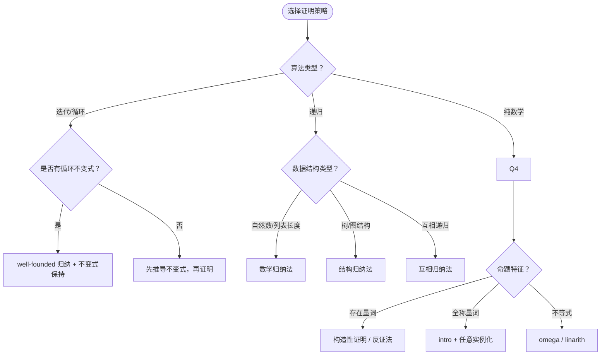

> 📊 **项目全面梳理**：详细的项目结构、模块详解和学习路径，请参阅 [`项目全面梳理-2025.md`](../../../项目全面梳理-2025.md)
> **关联文档**：[LeetCode题解中的形式化规约方法论](../../03-Explanation/formal-specification/LeetCode题解中的形式化规约方法论.md)（Explanation）

## 如何用 Lean 4 形式化证明 LeetCode 题目 / How to Formally Prove LeetCode Problems in Lean 4

### 摘要 / Executive Summary

- 本文档提供一套**可复现的操作流程**，指导读者将任意 LeetCode 题目的"手写正确性证明"转化为 **Lean 4 机器可检验的形式化证明**。
- 目标读者：已掌握基础 Lean 4 语法、熟悉霍尔逻辑与循环不变式、希望建立机器可检验证明能力的算法工程师或研究者。
- 全文以 **LeetCode 704（Binary Search）** 和 **LeetCode 1（Two Sum）** 为贯穿示例，展示从自然语言题意到 Lean 4 定理证明的完整流水线。

### 前置条件 / Prerequisites

在开始之前，请确认你已具备以下条件：

| 条件 | 验证方式 | 补充资源 |
|------|---------|---------|
| 安装 Lean 4 工具链 (`elan` + `lake`) | 终端执行 `lean --version` | [Lean 4 官方安装指南](https://lean-lang.org/lean4/doc/setup.html) |
| 熟悉基本 tactic（`intro`, `cases`, `simp`, `omega`, `induction`） | 能独立完成自然数加法交换律证明 | `03-形式化证明/` 模块 |
| 理解循环不变式三性质（初始化、保持、终止） | 能为二分查找手写不变式 | [00-总览与方法论/01-解题方法论](../../00-总览与方法论/01-解题方法论（四步法与形式化思维）.md) |
| 读过至少 1 份现有 Lean 证明 | 能读懂 [`lc0704_binary_search.lean`](../../../../examples/lean_proofs/FormalAlgorithm/leetcode/lc0704_binary_search.lean) | 本文档 §3 详解 |

---

## 目录 / Table of Contents

- [目标与预期结果](#目标与预期结果)
- [Step 0: 环境准备与项目初始化](#step-0-环境准备与项目初始化)
- [Step 1: 将题目翻译为形式化五元组](#step-1-将题目翻译为形式化五元组)
- [Step 2: 在 Lean 4 中定义问题实例](#step-2-在-lean-4-中定义问题实例)
- [Step 3: 实现算法函数（规范描述）](#step-3-实现算法函数规范描述)
- [Step 4: 陈述循环不变式或归纳假设](#step-4-陈述循环不变式或归纳假设)
- [Step 5: 证明核心定理](#step-5-证明核心定理)
- [Step 6: 运行 `#eval!` 验证与提交](#step-6-运行-eval-验证与提交)
- [验证清单](#验证清单)
- [常见问题与排查](#常见问题与排查)
- [相关 How-To 链接](#相关-how-to-链接)

---

## 目标与预期结果

**完成本文档后，你将能够**：

1. 为任意 LeetCode 题目写出完整的 Lean 4 形式化规约（五元组）。
2. 在 Lean 4 中定义算法函数，并保证其通过 `termination_by` 检查。
3. 为迭代算法写出 `LoopInvariant` 定义，为递归算法写出归纳假设。
4. 证明至少三类核心定理：**存在性定理**、**结果正确性定理**、**终止性定理**。
5. 使用 `#eval!` 在 Lean 中运行测试用例，验证实现与证明的一致性。

**产出物**：一个独立的 `.lean` 文件，可被 `lake build` 编译通过（定理证明允许使用 `sorry` 标记未完成部分，但函数实现必须可运行）。

---

## Step 0: 环境准备与项目初始化

### 0.1 定位到本项目的 Lean 证明目录

本项目的 Lean 4 形式化证明位于：

```
examples/lean_proofs/FormalAlgorithm/leetcode/
```

### 0.2 创建新文件

命名规范：`lcXXXX_problem_name.lean`

```bash
# 以 LeetCode 704 为例
touch examples/lean_proofs/FormalAlgorithm/leetcode/lc0704_binary_search.lean
```

### 0.3 文件头模板

每个 `.lean` 文件必须以标准化注释头开始：

```lean
/-
  lc0704_binary_search.lean
  LeetCode 704. 二分查找正确性的形式化证明（Lean 4）

  证明目标：
    1. 若 target 在有序数组 nums 中，search 返回其索引。
    2. 若 target 不在 nums 中，search 返回 -1。
    3. 算法必终止。

  依赖: Mathlib4 的序理论和自然数工具

  算法分析见 docs/13-LeetCode算法面试专题/02-算法范式专题/05-二分查找.md
  形式化方法见 docs/03-形式化证明/02-Hoare逻辑.md
-/
```

### 0.4 导入依赖

```lean
import Mathlib.Data.List.Basic
import Mathlib.Order.Basic

open Nat
```

> **面试沟通提示**：在面试官面前，你可以说："我使用 Lean 4 和 Mathlib4 作为证明助手，依赖其列表理论和序理论来形式化数组操作。"

---

## Step 1: 将题目翻译为形式化五元组

### 1.1 操作说明

打开题目描述，逐句提取以下五个组件：

| 组件 | 符号 | 提取问题 |
|------|------|---------|
| 数据域 | $D$ | 输入涉及哪些数据类型？（整数、数组、图、树…） |
| 输入集合 | $I$ | 输入需要满足什么约束？（长度范围、有序性、非空性…） |
| 输出集合 | $O$ | 输出是什么类型？返回值范围？ |
| 前置条件 | $\text{pre}$ | 算法可以假设输入满足什么条件？ |
| 后置条件 | $\text{post}$ | 算法必须保证输出与输入之间满足什么关系？ |

### 1.2 示例：LeetCode 704

**题目描述**：给定一个 `n` 个元素有序的（升序）整型数组 `nums` 和一个目标值 `target`，写一个函数搜索 `nums` 中的 `target`，如果目标值存在返回下标，否则返回 `-1`。

**提取结果**：

- $D = \mathbb{Z}^* \times \mathbb{Z}$（整数序列与整数目标值）
- $I = \{(A, t) \mid A \in \mathbb{Z}^n, n \geq 0, \text{sorted}(A), t \in \mathbb{Z}\}$
- $O = \{-1, 0, 1, \ldots, n-1\}$
- $\text{pre}(A, t)$: $A$ 按非递减顺序排列
- $\text{post}((A, t), i)$:
  - 若 $\exists j: A[j] = t$，则 $i = \min\{j \mid A[j] = t\}$
  - 若 $\neg\exists j: A[j] = t$，则 $i = -1$

### 1.3 检查清单

- [ ] 输入的边界条件是否全部覆盖？（空数组、单元素、最大值、最小值）
- [ ] 输出在何种情况下唯一？何时可能不唯一？
- [ ] 前置条件中是否有隐含约束？（如有序性、互异性、连通性）
- [ ] 后置条件是否对**所有**合法输入都给出了精确承诺？

> **常见错误**：将后置条件写得太弱（如只要求"若存在则返回某个下标"，而未要求"返回最左侧下标"）。在 LeetCode 704 中，虽然题目说"返回其索引"，但严谨的后置条件应明确是"最左侧"还是"任意一个"。

---

## Step 2: 在 Lean 4 中定义问题实例

### 2.1 定义数据域与基本谓词

将五元组的数学定义翻译为 Lean 的 `def` 或 `structure`。

```lean
/-- 安全列表索引，返回 Option 值。 -/
def listGet? {α : Type} (xs : List α) (i : Nat) : Option α :=
  match xs, i with
  | [], _ => none
  | x :: _, 0 => some x
  | _ :: xs', i+1 => listGet? xs' i

/-- 数组是有序的（非递减）。-/
def IsSorted (nums : List Int) : Prop :=
  match nums with
  | [] => True
  | [_] => True
  | x :: y :: zs => x ≤ y ∧ IsSorted (y :: zs)

/-- target 在数组 nums 中的索引 i 处。-/
def IsAtIndex (nums : List Int) (target : Int) (i : Nat) : Prop :=
  listGet? nums i = some target

/-- target 存在于数组 nums 中。-/
def ExistsIn (nums : List Int) (target : Int) : Prop :=
  ∃ i : Nat, IsAtIndex nums target i
```

### 2.2 操作要点

1. **使用 `def` 定义可计算函数**，使用 `theorem` / `lemma` 陈述命题。
2. **谓词（返回 `Prop` 的函数）**应尽量保持可判定性，便于后续使用 `simp` 化简。
3. **空列表处理**：始终显式处理 `[]` 情况，避免运行时异常。

---

## Step 3: 实现算法函数（规范描述）

### 3.1 编写纯函数实现

Lean 4 中的算法实现应为**纯函数**（无副作用），使用递归模拟循环。

```lean
/-- 二分查找的纯函数实现。
    返回 target 在有序数组 nums 中的索引，若不存在则返回 -1。
    使用递归模拟循环，以区间长度作为 well-founded 度量。 -/
def binarySearch (nums : List Int) (target : Int) (left right : Nat) : Int :=
  if left > right then
    -1
  else
    let mid := left + (right - left) / 2
    match listGet? nums mid with
    | none => -1
    | some midVal =>
      if midVal == target then
        mid
      else if midVal < target then
        binarySearch nums target (mid + 1) right
      else
        if h : mid > 0 then
          binarySearch nums target left (mid - 1)
        else
          -1
termination_by right - left + 1
decreasing_by
  all_goals
    sorry -- 将在 Step 5 中完成证明

/-- 对外的包装函数，初始搜索区间为整个数组。 -/
def binarySearchFull (nums : List Int) (target : Int) : Int :=
  binarySearch nums target 0 (nums.length)
```

### 3.2 保证终止性（Termination）

Lean 4 要求所有递归函数证明其**不会无限递归**。这是通过 `termination_by` 子句实现的。

**关键规则**：

- `termination_by <表达式>` 中的表达式必须在每次递归调用时**严格递减**。
- 表达式类型必须是 `WellFoundedRelation` 的实例（如 `Nat` 上的 `<`）。
- 若 Lean 无法自动证明递减性，需要在 `decreasing_by` 块中手动证明。

**判定方法**：

```
每次递归调用时，检查 termination_by 表达式是否严格减小。
对于 binarySearch：
  - 右半分支：left' = mid + 1，区间变为 [mid+1, right]
    right - left' + 1 = right - (mid + 1) + 1 = right - mid < right - left + 1
  - 左半分支：right' = mid - 1，区间变为 [left, mid-1]
    right' - left + 1 = (mid - 1) - left + 1 = mid - left < right - left + 1
```

### 3.3 面试沟通模板

> "我在 Lean 4 中将循环改写为尾递归函数，并使用 `termination_by` 子句显式声明递减度量。这样 Lean 的类型检查器可以验证算法必然终止，杜绝了无限循环的可能性。"

---

## Step 4: 陈述循环不变式或归纳假设

### 4.1 循环不变式的 Lean 定义

将手写的循环不变式翻译为 Lean 的 `def`：

```lean
/-- 二分查找的循环不变式。
    在搜索区间 [left, right] 上，若 target 存在于 nums 中，
    则其索引必然落在 [left, right] 范围内（闭区间）。 -/
def LoopInvariant (nums : List Int) (target : Int) (left right : Nat) : Prop :=
  ∀ i : Nat, IsAtIndex nums target i → left ≤ i ∧ i ≤ right
```

### 4.2 归纳假设的 Lean 定义（递归算法）

对于递归算法（如重建二叉树、链表反转），使用**结构归纳法**：

```lean
-- 示例：链表反转的归纳假设（来自 LeetCode 206）
-- 假设 reverse 对长度为 n-1 的链表正确，证明对长度为 n 的链表正确
```

### 4.3 不变式设计原则

1. **足够强**：能推出后置条件。
2. **足够弱**：初始化时容易证明。
3. **可表达为 Lean 谓词**：避免高阶逻辑或元语言操作。

**检查清单**：

- [ ] 不变式是否是 `Prop` 类型（即纯逻辑命题，无副作用）？
- [ ] 不变式是否只涉及函数参数和全局输入（不涉及局部变量的中间状态）？
- [ ] 终止时，不变式与终止条件的合取是否蕴含后置条件？

---

## Step 5: 证明核心定理

### 5.1 三类核心定理

每个 LeetCode 题目的 Lean 证明应至少包含以下三类定理：

| 定理类型 | 目的 | Lean 陈述模式 |
|---------|------|-------------|
| **存在性定理** | 若解存在，算法必能找到 | `theorem algorithm_finds_solution : (解存在假设) → (算法返回 some 结果)` |
| **结果正确性定理** | 若算法返回结果，结果必正确 | `theorem algorithm_result_correct : (算法返回结果) → (结果满足后置条件)` |
| **终止性定理** | 算法对任意输入必在有限步内终止 | `theorem algorithm_terminates : ...` 或直接由 `termination_by` 保证 |

### 5.2 示例：二分查找的存在性定理

```lean
/-- 定理 1（存在性）：若 target 在有序数组 nums 中，
    且初始区间覆盖整个数组，则 binarySearchFull 返回其索引。

    证明策略：
    - 对区间长度使用 well-founded 归纳。
    - 利用循环不变式保持性：每次迭代后新区间仍包含目标索引。
    - 当 midVal == target 时直接返回 mid。
    - 当区间为空时，由不变式的逆否命题知 target 不存在（与假设矛盾）。 -/
theorem binary_search_found
    (nums : List Int) (target : Int)
    (h_sorted : IsSorted nums)
    (h_exists : ExistsIn nums target)
    : ∃ i : Nat, binarySearchFull nums target = i ∧ IsAtIndex nums target i := by
  sorry -- TODO: 使用 well-founded 归纳与循环不变式完成证明
```

### 5.3 证明策略选择决策树



### 5.4 Tactic 速查表

| 目标状态 | 推荐 Tactic | 说明 |
|---------|------------|------|
| 证明全称命题 $\forall x, P(x)$ | `intro x` | 引入任意变量 |
| 证明存在命题 $\exists x, P(x)$ | `use <值>` | 提供见证（witness） |
| 化简定义 | `simp [定义名]` | 展开定义并化简 |
| 自然数/整数不等式 | `omega` | 自动线性算术求解器 |
| 实数/有理数不等式 | `linarith` | 线性算术求解器 |
| 分情况讨论 | `cases <假设>` | 对归纳类型分情况 |
| 归纳证明 | `induction <变量>` | 启动归纳法 |
| 反证法 | `by_contra h` | 假设结论不成立 |
| 重写等式 | `rw [<等式>]` | 用等式替换目标中的子项 |

### 5.5 从 `sorry` 到完整证明的渐进策略

1. **第一阶段**：全部使用 `sorry` 占位，确保文件能编译（`lake build` 通过）。
2. **第二阶段**：选择最简单的引理，用 `simp` + `omega` 尝试自动证明。
3. **第三阶段**：对核心定理，先手写纸上证明，再逐行翻译为 Lean tactic。
4. **第四阶段**：使用 `#check` 和 `#print` 检查定理类型，确保陈述无误。

---

## Step 6: 运行 `#eval!` 验证与提交

### 6.1 示例验证

在文件末尾添加 `#eval!` 调用，作为非形式化测试：

```lean
#eval! binarySearchFull [-1, 0, 3, 5, 9, 12] 9   -- 期望: 4
#eval! binarySearchFull [-1, 0, 3, 5, 9, 12] 2   -- 期望: -1
#eval! binarySearchFull [5] 5                      -- 期望: 0
#eval! binarySearchFull ([] : List Int) 1          -- 期望: -1
```

### 6.2 验证步骤

```bash
# 1. 进入项目目录
cd examples/lean_proofs

# 2. 编译（允许 sorry，不会报错）
lake build

# 3. 运行特定文件（在 VS Code + Lean 插件中打开文件，#eval! 会自动执行）
# 或使用 lake exe 运行（若配置了 executable）
```

### 6.3 提交前检查清单

- [ ] 文件命名符合 `lcXXXX_problem_name.lean` 规范
- [ ] 文件头注释包含题目来源、证明目标、依赖文档链接
- [ ] 所有 `def` 和 `theorem` 均有文档注释（`/-- ... -/`）
- [ ] `#eval!` 测试用例覆盖：正常情况、边界情况、空输入
- [ ] `lake build` 编译通过
- [ ] 在 `docs/13-LeetCode算法面试专题/02-Reference/problem-solutions/` 下创建对应题解文档（Reference 类型）
- [ ] 更新 `docs/13-LeetCode算法面试专题/99-附录/01-LeetCode题号全局索引.md` 的 Lean 证明列

---

## 验证清单

完成本文档全部步骤后，使用以下清单自我验证：

- [ ] 能否在 30 分钟内，为一道新的 Easy 题目（如 LeetCode 704）完成五元组规约、Lean 定义和 `#eval!` 测试？
- [ ] 能否在 2 小时内，为一道 Medium 题目完成存在性定理和结果正确性定理的陈述（允许 `sorry`）？
- [ ] 能否向虚拟面试官解释："为什么需要在 Lean 中使用 `termination_by` 来证明算法终止？"
- [ ] 能否不查表说出 5 个最常用的 Lean 4 tactic 及其适用场景？

---

## 常见问题与排查

### Q1: Lean 4 无法自动证明递归函数的终止性

**症状**：`failed to prove termination` 错误。

**排查步骤**：

1. 检查 `termination_by` 表达式是否在每次递归调用时严格递减。
2. 检查递归调用参数是否确实在减小（常见错误：`binarySearch nums target left (mid - 1)` 但 `mid` 可能为 0，导致 `mid - 1` 下溢）。
3. 在 `decreasing_by` 块中使用 `simp_wf` + `omega` 组合。
4. 若仍失败，考虑将 `Nat` 改为 `Int` 并显式处理负数，或使用 `WellFoundedRelation` 自定义度量。

### Q2: `simp` 无法展开自定义定义

**症状**：`simp` 后目标无变化。

**解决**：在 `simp` 中显式传入定义名：

```lean
simp [IsSorted, IsAtIndex, listGet?]
```

### Q3: 循环不变式在 Lean 中难以表达

**症状**：不变式涉及"算法执行到第 k 步时的状态"，但纯函数没有"状态"。

**解决**：将循环改写为尾递归辅助函数，将"状态"作为递归参数。不变式即辅助函数的前置条件。

```lean
-- 原循环：while (l < r) { ... }
-- 改写为：
def loop_aux (l r : Nat) (inv : LoopInvariant nums target l r) : Int := ...
```

### Q4: 定理陈述太强，导致证明困难

**症状**：核心定理证明陷入复杂的分类讨论。

**解决**：将大定理拆分为多个小引理（lemma）。例如：

- 先证"若 target > midVal，则 target 的索引 > mid"
- 再证"若 target < midVal，则 target 的索引 < mid"
- 最后用这两个引理组合出核心定理

---

## 相关 How-To 链接

| 需求 | 链接 |
|------|------|
| 如何在面试中推导循环不变式 | `../interview/如何在面试中推导循环不变式.md`（待创建） |
| 如何在5分钟内完成复杂度现场分析 | `../interview/如何在5分钟内完成复杂度现场分析.md`（待创建） |
| 如何用四步法拆解一道新题 | `../interview/如何用四步法拆解一道新题.md`（待创建） |
| 如何将朴素解法优化到最优复杂度 | `../optimization/如何将朴素解法优化到最优复杂度.md`（待创建） |

---

## 参考文献

1. [Lean 4 官方文档](https://lean-lang.org/theorem_proving_in_lean4/) —— Lean 4 定理证明入门。
2. [Mathlib4 文档](https://leanprover-community.github.io/mathlib4_docs/) —— 本项目依赖的数学库。
3. [Moura & Ullrich 2021] Leonardo de Moura & Sebastian Ullrich. "The Lean 4 Theorem Prover and Programming Language." *CADE 2021*.
4. [Knuth 1997] Knuth, D. E. *The Art of Computer Programming, Vol. 1*. §2.3 关于算法正确性证明的经典论述。
5. [Hoare 1969] Hoare, C. A. R. "An Axiomatic Basis for Computer Programming." *Communications of the ACM*, 12(10), 576-580.

---

**文档版本**: 1.0
**最后更新**: 2026-04-29
**状态**: 草案（Draft）
