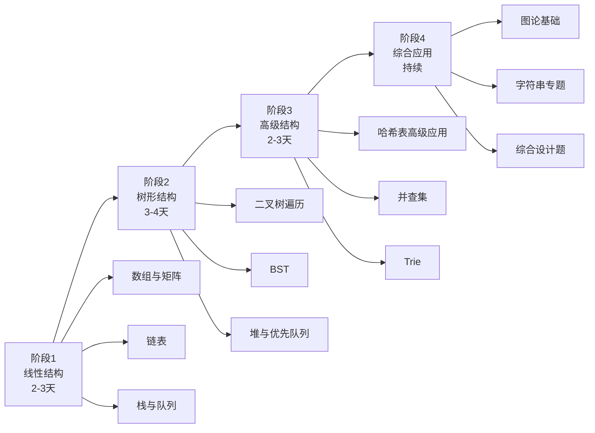
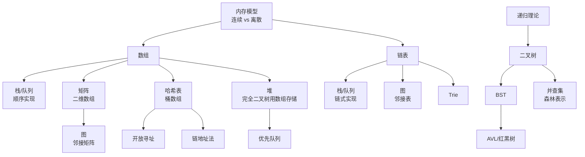

> 📊 **项目全面梳理**：详细的项目结构、模块详解和学习路径，请参阅 [`项目全面梳理-2025.md`](../../项目全面梳理-2025.md)

## 数据结构专题导论 / Data Structures Introduction

### 摘要 / Executive Summary

- 数据结构是算法面试的**基石与骨架**。据统计，LeetCode 前 300 道高频题中，超过 85% 直接或间接依赖对特定数据结构的深刻理解。掌握数据结构不仅是"会做题"，更是"会分析题目该用什么结构"。
- 本专题从**形式化定义**出发，覆盖 10 种核心数据结构，每种结构均给出：抽象定义、操作复杂度、经典题目、正确性证明与常见陷阱。所有内容均与上游理论层 `docs/09-算法理论/01-算法基础/02-数据结构理论.md` 衔接。
- 学习路径采用"**线性结构 → 树形结构 → 高级结构 → 字符串与图**"的递进式编排，确保读者在面试准备中建立完整的知识图谱。

### 关键术语与符号 / Glossary

| 术语 / Term | 定义 / Definition |
|-------------|-------------------|
| 随机访问序列 Random Access Sequence | 支持 $O(1)$ 时间通过索引访问任意元素的序列，如数组 |
| 指针逻辑 Pointer Logic | 链表操作中 `next`、`prev`、`head`、`tail` 指针的更新规则与不变式 |
| 结构归纳法 Structural Induction | 基于递归数据结构的归纳证明方法，常用于树算法的正确性论证 |
| 平衡因子 Balance Factor | AVL 树中左右子树高度差，用于判断树是否失衡 |
| 摊还分析 Amortized Analysis | 对一系列操作的总成本进行平均，得到单次操作的平均复杂度上界 |
| 冲突率 Collision Rate | 哈希表中不同键映射到同一桶的概率，影响查找效率 |
| 并查集 Union-Find | 维护元素 partition 信息的数据结构，支持近乎 $O(1)$ 的合并与查询 |

术语对齐与引用规范：`docs/术语与符号总表.md`，`01-基础理论/00-撰写规范与引用指南.md`

### 目录 / Table of Contents

- [数据结构专题导论 / Data Structures Introduction](#数据结构专题导论--data-structures-introduction)
  - [摘要 / Executive Summary](#摘要--executive-summary)
  - [关键术语与符号 / Glossary](#关键术语与符号--glossary)
  - [目录 / Table of Contents](#目录--table-of-contents)
  - [交叉引用与依赖 / Cross-References and Dependencies](#交叉引用与依赖--cross-references-and-dependencies)
- [1. 数据结构在面试中的地位](#1-数据结构在面试中的地位)
  - [1.1 面试考察的核心维度](#11-面试考察的核心维度)
  - [1.2 高频数据结构统计](#12-高频数据结构统计)
- [2. 与理论层的衔接](#2-与理论层的衔接)
  - [2.1 从 ADT 到实现](#21-从-adt-到实现)
  - [2.2 结构归纳法的面试应用](#22-结构归纳法的面试应用)
  - [2.3 复杂度分析的上游基础](#23-复杂度分析的上游基础)
- [3. 十种数据结构的分类框架](#3-十种数据结构的分类框架)
  - [3.1 按逻辑结构分类](#31-按逻辑结构分类)
  - [3.2 按存储结构分类](#32-按存储结构分类)
  - [3.3 各数据结构核心特性速览](#33-各数据结构核心特性速览)
- [4. 复杂度速查表](#4-复杂度速查表)
  - [4.1 操作复杂度总表](#41-操作复杂度总表)
  - [4.2 面试高频操作速查](#42-面试高频操作速查)
- [5. 学习路径图](#5-学习路径图)
  - [5.1 推荐学习顺序](#51-推荐学习顺序)
  - [5.2 各阶段目标与里程碑](#52-各阶段目标与里程碑)
  - [5.3 每日学习 Checklist](#53-每日学习-checklist)
- [6. 思维表征](#6-思维表征)
  - [6.1 概念依赖图](#61-概念依赖图)
  - [6.2 数据结构选型决策树](#62-数据结构选型决策树)
  - [6.3 公理定理证明树](#63-公理定理证明树)
- [7. 自测问题](#7-自测问题)
  - [问题 1：数组与链表的本质差异](#问题-1数组与链表的本质差异)
  - [问题 2：BST 与堆的有序性差异](#问题-2bst-与堆的有序性差异)
  - [问题 3：哈希表 vs 平衡 BST 的选型](#问题-3哈希表-vs-平衡-bst-的选型)
  - [问题 4：结构归纳法的应用](#问题-4结构归纳法的应用)
- [8. 学习目标](#8-学习目标)
- [参考文献 / References](#参考文献--references)

### 交叉引用与依赖 / Cross-References and Dependencies

**上游理论依赖 / Upstream Dependencies**:

- [`09-算法理论/01-算法基础/02-数据结构理论.md`](../../09-算法理论/01-算法基础/02-数据结构理论.md) — 数据结构的形式化定义、ADT、逻辑/存储分类
- [`04-算法复杂度/01-时间复杂度.md`](../../04-算法复杂度/01-时间复杂度.md) — 时间复杂度 $O/\Omega/\Theta$ 的形式化定义
- [`04-算法复杂度/03-渐进分析.md`](../../04-算法复杂度/03-渐进分析.md) — 大 O 记号的代数性质与运算规则
- [`02-递归理论/01-递归基础.md`](../../02-递归理论/01-递归基础.md) — 递归定义、结构归纳法

**下游应用 / Downstream Applications**:

- `13-LeetCode算法面试专题/01-数据结构专题/01-数组与矩阵.md` — 数组的形式化定义与经典题目
- `13-LeetCode算法面试专题/01-数据结构专题/02-链表.md` — 链表的形式化定义与经典题目
- `13-LeetCode算法面试专题/01-数据结构专题/05-二叉树与BST.md` — 二叉树与 BST 的形式化定义与经典题目
- `13-LeetCode算法面试专题/04-字符串专题/01-字符串匹配与KMP应用.md` — 字符串的数组表示与 KMP 算法

---

## 1. 数据结构在面试中的地位

### 1.1 面试考察的核心维度

技术面试中对数据结构的考察通常围绕三个维度展开：

**维度一：识别（Recognition）**
面试官期望候选人在阅读题目后，能在 30 秒内识别出"这道题该用什么数据结构"。例如：

- 需要频繁在两端操作 → 双端队列或栈
- 需要维护动态有序集合 → 堆或平衡 BST
- 需要判断连通性 → 并查集或 DFS/BFS

**维度二：实现（Implementation）**
在白纸或在线编辑器上，从零开始写出核心数据结构的关键操作。例如：

- 实现一个 LRU Cache（哈希表 + 双向链表）
- 实现一个最小栈（辅助栈技巧）
- 实现 Trie 树的插入与搜索

**维度三：变形与组合（Variation & Composition）**
高级题目往往不是单一数据结构能解决的，而是需要组合多种结构。例如：

- 中位数数据流（双堆技巧：最大堆 + 最小堆）
- 设计日志存储系统（哈希表 + 链表 + 时间戳索引）

### 1.2 高频数据结构统计

根据对 LeetCode Top 300 道题目的标签分析，各数据结构的出场频率如下：

| 数据结构 | 出场频率 | 典型题目数 | 面试出现概率 |
|---------|---------|-----------|------------|
| 数组 / Array | ~35% | ~105 | ⭐⭐⭐⭐⭐ |
| 哈希表 / Hash Table | ~28% | ~84 | ⭐⭐⭐⭐⭐ |
| 链表 / Linked List | ~12% | ~36 | ⭐⭐⭐⭐ |
| 二叉树 / Binary Tree | ~15% | ~45 | ⭐⭐⭐⭐⭐ |
| 栈 / Stack | ~10% | ~30 | ⭐⭐⭐⭐ |
| 队列 / Queue | ~6% | ~18 | ⭐⭐⭐ |
| 堆 / Heap | ~8% | ~24 | ⭐⭐⭐⭐ |
| 并查集 / Union-Find | ~4% | ~12 | ⭐⭐⭐ |
| 图 / Graph | ~8% | ~24 | ⭐⭐⭐⭐ |
| Trie | ~3% | ~9 | ⭐⭐⭐ |

> 注：一道题目可能同时打上多个标签，因此频率之和大于 100%。

---

## 2. 与理论层的衔接

### 2.1 从 ADT 到实现

在理论层 `09-算法理论/01-算法基础/02-数据结构理论.md` 中，数据结构被形式化地定义为四元组：

$$
DS = (D, R, O, C)
$$

其中 $D$ 是数据元素集合，$R$ 是关系集合，$O$ 是操作集合，$C$ 是约束条件集合。

在面试专题中，我们**从应用视角**重新审视这一形式化框架：

**例：数组的 ADT 到实现映射**

| ADT 组件 | 理论定义 | 面试实现关注点 |
|---------|---------|--------------|
| $D$ | 相同类型元素的有限序列 | 元素类型（`int`、`char`、自定义对象） |
| $R$ | 索引与元素的二元关系 | 连续内存、$O(1)$ 随机访问 |
| $O$ | `access`、`insert`、`delete`、`search` | 边界检查、越界处理、原地修改技巧 |
| $C$ | 索引非负且小于长度 | 空数组、单元素数组、满数组 |

### 2.2 结构归纳法的面试应用

理论层介绍的**结构归纳法（Structural Induction）**是证明树算法正确性的核心工具。在面试中，这意味着：

1. **基例（Base Case）**：空树或单节点树时命题成立
2. **归纳假设（Inductive Hypothesis）**：假设命题对左、右子树成立
3. **归纳步骤（Inductive Step）**：证明在根节点处命题也成立

本专题在二叉树、BST、Trie 等章节均会给出结构归纳法的完整证明。

### 2.3 复杂度分析的上游基础

所有数据结构的操作复杂度均基于 `04-算法复杂度/` 中的渐进分析框架：

- **最坏复杂度 $O(\cdot)$**：面试中默认讨论的标准
- **摊还复杂度**：用于分析动态数组扩容、并查集路径压缩等场景
- **期望复杂度**：用于分析哈希表在简单均匀散列假设下的性能

---

## 3. 十种数据结构的分类框架

### 3.1 按逻辑结构分类

```mermaid
mindmap
  root((数据结构分类框架))
    线性结构
      数组 Array
        随机访问 O(1)
        连续内存
      链表 Linked List
        单链表
        双链表
      栈 Stack
        LIFO
        递归辅助
      队列 Queue
        FIFO
        BFS 辅助
    树形结构
      二叉树 Binary Tree
        遍历：前/中/后/层序
      二叉搜索树 BST
        有序性：左 < 根 < 右
      堆 Heap
        完全二叉树 + 堆序性
      Trie
        前缀树
    图结构
      图 Graph
        邻接矩阵 / 邻接表
    散列结构
      哈希表 Hash Table
        O(1) 期望查找
      并查集 Union-Find
        近乎 O(1) 连通性
```

### 3.2 按存储结构分类

| 存储方式 | 代表结构 | 内存布局 | 扩容成本 | 缓存友好性 |
|---------|---------|---------|---------|-----------|
| 顺序存储 | 数组、顺序栈、顺序队列 | 连续 | $O(n)$ | 高 |
| 链式存储 | 链表、链式栈、链式队列 | 离散 | $O(1)$ | 低 |
| 索引存储 | 跳表、B+ 树 | 分层索引 | $O(\log n)$ | 中 |
| 散列存储 | 哈希表 | 桶数组 + 溢出链 | $O(n)$ 再散列 | 中 |

### 3.3 各数据结构核心特性速览

**数组（Array）**

- 形式化：$A = \langle a_0, a_1, \ldots, a_{n-1} \rangle$，支持 $A[i]$ 在 $O(1)$ 访问
- 核心优势：随机访问、缓存局部性
- 核心劣势：插入/删除 $O(n)$、大小固定（静态数组）

**链表（Linked List）**

- 形式化：节点序列 $n_1 \to n_2 \to \cdots \to n_k$，其中 $n_i.next = n_{i+1}$
- 核心优势：插入/删除 $O(1)$（已知指针位置）
- 核心劣势：无随机访问、额外指针开销、缓存不友好

**栈（Stack）**

- 形式化：LIFO 序列，操作限于同一端（栈顶）
- 核心应用：括号匹配、表达式求值、DFS、单调栈

**队列（Queue）**

- 形式化：FIFO 序列，入队在尾、出队在头
- 核心应用：BFS、滑动窗口、任务调度

**二叉树（Binary Tree）**

- 形式化：节点集合 $V$，每个节点 $v$ 有 $\leq 2$ 个子节点 $\text{left}(v), \text{right}(v)$
- 核心应用：层次数据表示、搜索、表达式树

**二叉搜索树（BST）**

- 形式化：对任意节点 $v$，左子树所有值 $< v.val <$ 右子树所有值
- 核心优势：动态有序集合，查找/插入/删除期望 $O(\log n)$

**堆（Heap）**

- 形式化：完全二叉树，满足堆序性（大根堆：父 $\geq$ 子；小根堆：父 $\leq$ 子）
- 核心应用：Top-K、优先队列、堆排序

**哈希表（Hash Table）**

- 形式化：映射 $h: K \to \{0, 1, \ldots, m-1\}$，冲突通过链地址法或开放寻址法解决
- 核心优势：$O(1)$ 期望查找
- 核心劣势：无序、冲突退化、再散列开销

**并查集（Union-Find）**

- 形式化：维护集合的划分，支持 $\text{Find}(x)$ 和 $\text{Union}(x, y)$
- 核心优化：路径压缩 + 按秩合并，均摊近乎 $O(\alpha(n))$

**图（Graph）**

- 形式化：$G = (V, E)$，顶点集 + 边集
- 核心表示：邻接矩阵（稠密图）、邻接表（稀疏图）

---

## 4. 复杂度速查表

### 4.1 操作复杂度总表

| 数据结构 | 访问 | 搜索 | 插入 | 删除 | 空间 | 备注 |
|---------|------|------|------|------|------|------|
| 数组 | $O(1)$ | $O(n)$ | $O(n)$ | $O(n)$ | $O(n)$ | 随机访问 |
| 链表（单/双） | $O(n)$ | $O(n)$ | $O(1)^*$ | $O(1)^*$ | $O(n)$ | *已知位置 |
| 栈 | $O(1)$（顶） | — | $O(1)$ | $O(1)$ | $O(n)$ | LIFO |
| 队列 | $O(1)$（头） | — | $O(1)$ | $O(1)$ | $O(n)$ | FIFO |
| 二叉树（一般） | — | $O(n)$ | $O(n)$ | $O(n)$ | $O(n)$ | 退化链表 |
| BST（平衡） | $O(\log n)$ | $O(\log n)$ | $O(\log n)$ | $O(\log n)$ | $O(n)$ | AVL/红黑 |
| 堆 | $O(1)$（顶） | $O(n)$ | $O(\log n)$ | $O(\log n)$ | $O(n)$ | 完全二叉树 |
| 哈希表 | — | $O(1)^\dagger$ | $O(1)^\dagger$ | $O(1)^\dagger$ | $O(n)$ | $\dagger$期望 |
| 并查集 | — | $O(\alpha(n))$ | — | — | $O(n)$ | 路径压缩 |
| 图（邻接表） | — | — | $O(1)$ 加边 | $O(1)$ 删边 | $O(V+E)$ | BFS/DFS $O(V+E)$ |

### 4.2 面试高频操作速查

**数组高频操作**

| 操作 | 时间复杂度 | 技巧 |
|-----|-----------|------|
| 原地旋转 | $O(n)$ | 三次翻转法 |
| 滑动窗口最大值 | $O(n)$ | 单调双端队列 |
| 前缀和 | $O(n)$ 预处理，$O(1)$ 查询 | 累积和数组 |
| 差分数组 | $O(n)$ 预处理，$O(1)$ 区间更新 | 增量标记 |

**链表高频操作**

| 操作 | 时间复杂度 | 技巧 |
|-----|-----------|------|
| 反转 | $O(n)$ | 三指针迭代 |
| 环检测 | $O(n)$ | Floyd 快慢指针 |
| 归并排序 | $O(n \log n)$ | 找中点 + 递归合并 |
| LRU Cache | $O(1)$ | 哈希表 + 双向链表 |

**二叉树高频操作**

| 操作 | 时间复杂度 | 技巧 |
|-----|-----------|------|
| 递归遍历 | $O(n)$ | 前/中/后序 |
| 迭代遍历 | $O(n)$ | 栈模拟递归 |
| 层序遍历 | $O(n)$ | 队列 BFS |
| 最近公共祖先 | $O(n)$ | 后序递归 |

---

## 5. 学习路径图

### 5.1 推荐学习顺序



### 5.2 各阶段目标与里程碑

**阶段一：线性结构（第 1-3 天）**

- 目标：建立对内存连续 vs. 离散布局的直觉
- 里程碑：能独立写出链表反转、数组旋转、栈实现队列
- 关键题目：LC 206、LC 21、LC 48、LC 155

**阶段二：树形结构（第 4-7 天）**

- 目标：掌握递归思维与结构归纳法
- 里程碑：能独立写出三种遍历的递归与迭代版本、LCA、BST 验证
- 关键题目：LC 94、LC 104、LC 226、LC 236、LC 98

**阶段三：高级结构（第 8-10 天）**

- 目标：理解"结构组合"解决复杂问题的能力
- 里程碑：能设计 LRU Cache、实现 Trie、应用并查集
- 关键题目：LC 146、LC 208、LC 200、LC 23

**阶段四：综合应用（持续）**

- 目标：面对新题时能在 2 分钟内选定数据结构组合
- 里程碑：能完成 LeetCode 周赛前三题
- 关键题目：LC 295、LC 380、LC 432

### 5.3 每日学习 Checklist

```markdown
□ 阅读形式化定义（10 分钟）
□ 手写核心操作伪代码（15 分钟）
□ 完成 2-3 道经典题目（60 分钟）
□ 总结该结构的"识别信号"（10 分钟）
□ 回顾前日错题（15 分钟）
```

---

## 6. 思维表征

### 6.1 概念依赖图



### 6.2 数据结构选型决策树

```mermaid
flowchart TD
    Start([遇到新问题]) --> Q1{需要维护有序性？}
    Q1 -->|是| Q2{需要动态插入删除？}
    Q1 -->|否| Q3{主要是查找？}

    Q2 -->|是| Q4{只需要最值？}
    Q2 -->|否| Q5[数组/矩阵 + 排序]

    Q4 -->|是| A1[堆 O(log n)]
    Q4 -->|否，需要全序| A2[平衡 BST / 跳表]

    Q3 -->|是| Q6{键值对映射？}
    Q3 -->|否| Q7{需要两端操作？}

    Q6 -->|是| A3[哈希表 O(1)]
    Q6 -->|否，范围查询| A4[有序集合 / BST]

    Q7 -->|是| Q8{先进先出？}
    Q7 -->|否| Q9{后进先出？}

    Q8 -->|是| A5[队列]
    Q8 -->|否| A6[双端队列]
    Q9 -->|是| A7[栈]
    Q9 -->|否| Q10[需要随机访问？]

    Q10 -->|是| A8[数组]
    Q10 -->|否| A9[链表]

    style A1 fill:#e1f5e1
    style A2 fill:#e1f5e1
    style A3 fill:#e1f5e1
    style A4 fill:#e1f5e1
    style A5 fill:#e1f5e1
    style A6 fill:#e1f5e1
    style A7 fill:#e1f5e1
    style A8 fill:#e1f5e1
    style A9 fill:#e1f5e1
```

### 6.3 公理定理证明树

```mermaid
flowchart BT
    A1[公理: 内存寻址 O(1)<br/>Axiom: RAM Model] --> B1[定理: 数组随机访问 O(1)]
    A2[公理: 指针解引用 O(1)] --> B2[定理: 链表插入删除 O(1)]
    A3[公理: 归纳原理<br/>Axiom: Induction] --> B3[定理: 树遍历访问所有节点]
    B3 --> C1[定理: BST 中序有序]
    B1 --> D1[引理: 矩阵按行存储可 O(1) 访问]
    B2 --> D2[引理: 双向链表支持 O(1) 删除]
    C1 --> E1[定理: BST 查找 O(h)]
    D2 --> E2[定理: LRU Cache O(1)]
    E1 --> F1[推论: 平衡 BST 查找 O(log n)]

    style B1 fill:#e1f5e1
    style B2 fill:#e1f5e1
    style B3 fill:#e1f5e1
    style C1 fill:#e1f5e1
    style E1 fill:#e1f5e1
    style E2 fill:#e1f5e1
    style F1 fill:#d4edda
```

---

## 7. 自测问题

### 问题 1：数组与链表的本质差异

**Q**: 从内存布局角度，数组和链表的根本差异是什么？在什么场景下链表优于数组？

**A**: 数组使用**连续内存**，通过基地址 + 偏移量实现 $O(1)$ 随机访问，但插入/删除需要移动 $O(n)$ 元素。链表使用**离散内存**，通过指针连接节点，插入/删除只需修改指针 $O(1)$，但访问需顺序遍历 $O(n)$。

链表优于数组的场景：

- 频繁在已知位置插入/删除（如 LRU Cache）
- 无法预先确定数据量大小且不愿承担扩容拷贝成本
- 需要 $O(1)$ 时间拼接两个序列

### 问题 2：BST 与堆的有序性差异

**Q**: BST 和堆都涉及"有序"，它们的有序性定义有何不同？

**A**:

- **BST 的全局有序性**：对任意节点，左子树所有值 $<$ 根 $<$ 右子树所有值。这保证了中序遍历产生全局有序序列。
- **堆的局部有序性**：仅要求父节点与子节点之间满足序关系（大根堆：父 $\geq$ 子），不限制兄弟节点之间的大小关系。因此堆只保证堆顶是全局最值，不保证整体有序。

### 问题 3：哈希表 vs 平衡 BST 的选型

**Q**: 需要维护一个动态集合，支持插入、删除、查找，以及 `findMin` 和 `findMax`。应该选哈希表还是平衡 BST？

**A**: 选**平衡 BST**。虽然哈希表在插入、删除、查找上提供 $O(1)$ 期望性能，但它**不支持有序操作**。`findMin` 和 `findMax` 在哈希表中需要 $O(n)$ 遍历，而在平衡 BST 中为 $O(\log n)$。

### 问题 4：结构归纳法的应用

**Q**: 为什么树算法的正确性证明常用结构归纳法而非普通数学归纳法？

**A**: 普通数学归纳法基于自然数的线性序（$n \to n+1$），而树的结构是**分支递归**的（一个节点的子问题分裂为左子树和右子树两个独立子问题）。结构归纳法直接对递归数据结构的构造规则进行归纳：基例为空树/单节点树，归纳步骤假设子树满足命题，再证明组合后的树也满足。

---

## 8. 学习目标

完成本章学习后，读者应能够：

1. **识别面试题目**中隐含的数据结构需求，在 30 秒内给出合理的结构选型。
2. **形式化描述** 10 种核心数据结构的 ADT、核心操作与复杂度。
3. **手写实现**链表反转、二叉树遍历、堆的 `insert`/`extract-min`、哈希表的链地址法等核心操作。
4. **应用结构归纳法**证明树算法的正确性，应用循环不变式证明线性结构算法的正确性。
5. **组合多种数据结构**解决复杂设计题（如 LRU Cache、中位数数据流）。

---

## 参考文献 / References

- [Cormen 2022]: Cormen, T. H., et al. (2022). *Introduction to Algorithms* (4th ed.). MIT Press.
- [Weiss 2011]: Weiss, M. A. (2011). *Data Structures and Algorithm Analysis in C++* (4th ed.). Pearson.
- [Knuth 1997]: Knuth, D. E. (1997). *The Art of Computer Programming, Volume 1: Fundamental Algorithms* (3rd ed.). Addison-Wesley.
- [Sedgewick 2011]: Sedgewick, R., & Wayne, K. (2011). *Algorithms* (4th ed.). Addison-Wesley.
- LeetCode 官方题解与讨论区：<https://leetcode.com>
