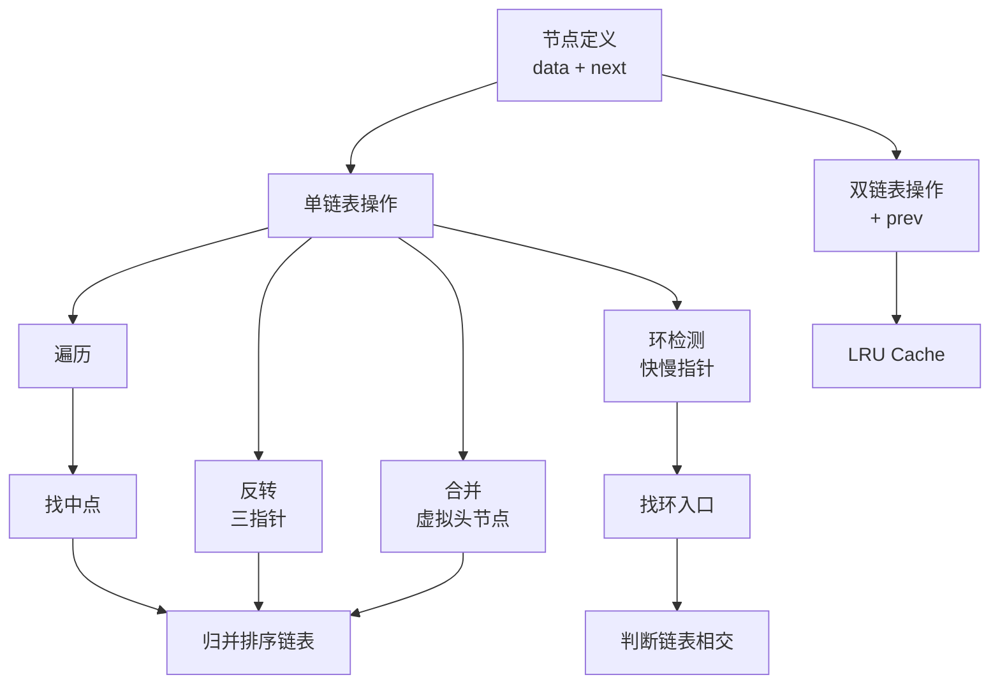

> 📊 **项目全面梳理**：详细的项目结构、模块详解和学习路径，请参阅 [`项目全面梳理-2025.md`](../../项目全面梳理-2025.md)

## 链表 / Linked Lists

### 摘要 / Executive Summary

- 链表是一种通过**指针**连接节点的线性数据结构，与数组的连续内存布局形成鲜明对比。链表在面试中的考察频率约为 12%，虽然低于数组，但因其操作细节丰富、指针逻辑容易出错，是面试官区分候选人代码严谨性的重要考点。
- 本文从形式化定义出发，覆盖单链表与双链表的核心操作，深入剖析 LeetCode 206（反转链表）、21（合并两个有序链表）、141/142（环检测与入口）、23（合并 K 个升序链表）四道经典题目。每道题目均配备指针操作不变式的完整证明。
- 核心学习目标：建立"**指针不变式思维**"——在修改任何指针之前，先明确"什么保持不变"。

### 关键术语与符号 / Glossary

| 术语 / Term | 定义 / Definition |
|-------------|-------------------|
| 单链表 Singly Linked List | 每个节点包含数据域和单一 `next` 指针的链表 |
| 双链表 Doubly Linked List | 每个节点包含 `prev` 和 `next` 两个指针的链表 |
| 虚拟头节点 Dummy Head | 位于真实头节点之前的哨兵节点，简化边界情况处理 |
| 指针不变式 Pointer Invariant | 指针操作过程中始终保持成立的谓词，用于正确性证明 |
| 快慢指针 Fast & Slow Pointers | 以不同速度遍历链表的两种指针，用于环检测、找中点等 |
| 断链 Split | 将链表中某节点的 `next` 指针置为 `null`，形成两个独立链表 |

术语对齐与引用规范：`docs/术语与符号总表.md`，`01-基础理论/00-撰写规范与引用指南.md`

### 目录 / Table of Contents

- [链表 / Linked Lists](#链表--linked-lists)
  - [摘要 / Executive Summary](#摘要--executive-summary)
  - [关键术语与符号 / Glossary](#关键术语与符号--glossary)
  - [目录 / Table of Contents](#目录--table-of-contents)
  - [交叉引用与依赖 / Cross-References and Dependencies](#交叉引用与依赖--cross-references-and-dependencies)
- [1. 形式化定义 / Formal Definitions](#1-形式化定义--formal-definitions)
  - [1.1 单链表的形式化定义](#11-单链表的形式化定义)
  - [1.2 双链表的形式化定义](#12-双链表的形式化定义)
  - [1.3 指针逻辑的形式化表示](#13-指针逻辑的形式化表示)
- [2. 核心思路与算法框架](#2-核心思路与算法框架)
  - [2.1 虚拟头节点技巧](#21-虚拟头节点技巧)
  - [2.2 三指针迭代框架](#22-三指针迭代框架)
  - [2.3 快慢指针框架](#23-快慢指针框架)
- [3. 经典题目详解](#3-经典题目详解)
  - [3.1 LeetCode 206 — Reverse Linked List](#31-leetcode-206--reverse-linked-list)
    - [形式化规约 / Formal Specification](#形式化规约--formal-specification)
    - [核心思路 / Core Idea](#核心思路--core-idea)
    - [代码实现 / Code Implementations](#代码实现--code-implementations)
    - [复杂度分析 / Complexity Analysis](#复杂度分析--complexity-analysis)
    - [正确性证明 / Correctness Proof](#正确性证明--correctness-proof)
  - [3.2 LeetCode 21 — Merge Two Sorted Lists](#32-leetcode-21--merge-two-sorted-lists)
    - [形式化规约 / Formal Specification](#形式化规约--formal-specification-1)
    - [核心思路 / Core Idea](#核心思路--core-idea-1)
    - [代码实现 / Code Implementations](#代码实现--code-implementations-1)
    - [复杂度分析 / Complexity Analysis](#复杂度分析--complexity-analysis-1)
  - [3.3 LeetCode 141 / 142 — Linked List Cycle / Cycle II](#33-leetcode-141--142--linked-list-cycle--cycle-ii)
    - [形式化规约 / Formal Specification (LC 142)](#形式化规约--formal-specification-lc-142)
    - [核心思路 / Core Idea](#核心思路--core-idea-2)
    - [代码实现 / Code Implementations](#代码实现--code-implementations-2)
    - [复杂度分析 / Complexity Analysis](#复杂度分析--complexity-analysis-2)
    - [正确性证明 / Correctness Proof](#正确性证明--correctness-proof-1)
  - [3.4 LeetCode 23 — Merge k Sorted Lists](#34-leetcode-23--merge-k-sorted-lists)
    - [形式化规约 / Formal Specification](#形式化规约--formal-specification-2)
    - [核心思路 / Core Idea](#核心思路--core-idea-3)
    - [代码实现 / Code Implementations](#代码实现--code-implementations-3)
    - [复杂度分析 / Complexity Analysis](#复杂度分析--complexity-analysis-3)
- [4. 复杂度分析体系](#4-复杂度分析体系)
  - [4.1 链表操作复杂度汇总](#41-链表操作复杂度汇总)
- [5. 正确性证明框架](#5-正确性证明框架)
  - [5.1 指针操作不变式的通用模式](#51-指针操作不变式的通用模式)
  - [5.2 虚拟头节点的正确性辅助](#52-虚拟头节点的正确性辅助)
- [6. 思维表征](#6-思维表征)
  - [6.1 链表操作概念依赖图](#61-链表操作概念依赖图)
  - [6.2 反转链表的指针变化图](#62-反转链表的指针变化图)
  - [6.3 Floyd 环检测过程图](#63-floyd-环检测过程图)
  - [6.4 公理定理证明树](#64-公理定理证明树)
- [7. 常见错误与反模式](#7-常见错误与反模式)
  - [7.1 断链后丢失节点](#71-断链后丢失节点)
  - [7.2 空指针访问](#72-空指针访问)
  - [7.3 忘记移动 tail 指针](#73-忘记移动-tail-指针)
  - [7.4 环检测中的无限循环](#74-环检测中的无限循环)
- [8. 自测问题](#8-自测问题)
  - [问题 1：递归反转链表](#问题-1递归反转链表)
  - [问题 2：删除链表的倒数第 N 个节点](#问题-2删除链表的倒数第-n-个节点)
  - [问题 3：双链表的优势场景](#问题-3双链表的优势场景)
- [9. 学习目标](#9-学习目标)
- [参考文献 / References](#参考文献--references)

### 交叉引用与依赖 / Cross-References and Dependencies

**上游理论依赖 / Upstream Dependencies**:

- [`09-算法理论/01-算法基础/02-数据结构理论.md`](../../09-算法理论/01-算法基础/02-数据结构理论.md) — 链表作为线性结构的理论定义
- `02-递归理论/01-递归基础.md` — 递归定义与结构归纳法

**下游应用 / Downstream Applications**:

- `13-LeetCode算法面试专题/01-数据结构专题/05-二叉树与BST.md` — 链表与树的转换（扁平化）
- `13-LeetCode算法面试专题/02-算法范式专题/06-双指针.md` — 快慢指针的扩展应用

---

## 1. 形式化定义 / Formal Definitions

### 1.1 单链表的形式化定义

**定义 1.1** (单链表节点 / Singly Linked List Node)
单链表节点是一个二元组 $(data, next)$，其中 $data \in \mathcal{T}$ 是数据域，$next$ 是指向下一个节点的引用（或 `null`）。

```rust
// Rust 单链表节点定义
#[derive(Debug, Clone)]
pub struct ListNode<T> {
    pub data: T,
    pub next: Option<Box<ListNode<T>>>,
}
```

**定义 1.2** (单链表 / Singly Linked List)
单链表是节点序列 $N = \langle n_1, n_2, \ldots, n_k \rangle$，满足：

$$
\forall i \in [1, k-1]: n_i.next = n_{i+1} \quad \land \quad n_k.next = \text{null}
$$

链表的头指针 $head$ 指向 $n_1$（若链表非空），否则 $head = \text{null}$。

### 1.2 双链表的形式化定义

**定义 1.3** (双链表节点 / Doubly Linked List Node)
双链表节点是一个三元组 $(data, prev, next)$，其中 $prev$ 指向前驱节点（首节点为 `null`），$next$ 指向后继节点（尾节点为 `null`）。

```rust
// Rust 双链表节点定义
#[derive(Debug, Clone)]
pub struct DListNode<T> {
    pub data: T,
    pub prev: Option<Rc<RefCell<DListNode<T>>>>,
    pub next: Option<Rc<RefCell<DListNode<T>>>>,
}
```

**定义 1.4** (双链表 / Doubly Linked List)
双链表是节点序列 $N = \langle n_1, n_2, \ldots, n_k \rangle$，满足：

$$
\forall i \in [1, k-1]: n_i.next = n_{i+1} \land n_{i+1}.prev = n_i
$$

$$
n_1.prev = \text{null} \quad \land \quad n_k.next = \text{null}
$$

### 1.3 指针逻辑的形式化表示

链表操作的本质是**指针引用的重写**。形式化地，设 $P(n)$ 表示节点 $n$ 的内存地址（或引用），则指针赋值 $a.next = b$ 的语义是：

$$
P(a).next \leftarrow P(b)
$$

链表操作必须维护的**结构不变式（Structural Invariant）**：

$$
Inv_{\text{list}} \equiv \text{从 } head \text{ 出发沿 } next \text{ 指针可达的节点构成一个有限序列，且序列末端为 } \text{null}
$$

即：链表中不存在环（除非是有意设计的循环链表），且所有节点均可从 $head$ 到达。

---

## 2. 核心思路与算法框架

### 2.1 虚拟头节点技巧

**问题**: 处理头节点的删除或插入时，需要特殊判断 `head` 是否为 `null`。

**技巧**: 引入虚拟头节点 `dummy`，使 `dummy.next = head`。这样头节点的操作与普通节点完全一致。

```text
dummy -> head -> n2 -> n3 -> null
```

**形式化优势**:

- 统一了"空链表"、"单节点链表"、"多节点链表"三种情况的代码路径
- 返回时直接返回 `dummy.next`，无需特殊处理

### 2.2 三指针迭代框架

链表反转等操作的核心是维护三个指针：

- `prev`: 已反转部分的头节点
- `curr`: 当前待处理的节点
- `next`: 保存 `curr.next` 以防断链后丢失

```text
null <- prev   curr -> next -> ...
```

### 2.3 快慢指针框架

- **找中点**: `slow` 每次走一步，`fast` 每次走两步。当 `fast` 到达末尾时，`slow` 位于中点。
- **环检测**: 若存在环，`fast` 和 `slow` 必在环内相遇。

**形式化**: 设链表有 $n$ 个节点，环入口距头节点 $k$ 步，环长为 $c$。则：

- `fast` 走的步数 = $2 \times$ `slow` 走的步数
- 相遇时：`slow` 距入口 $k$ 步（模 $c$）

---

## 3. 经典题目详解

### 3.1 LeetCode 206 — Reverse Linked List

> **题目链接 / Problem Link**: [LeetCode 206. Reverse Linked List](https://leetcode.com/problems/reverse-linked-list/)
> **难度 / Difficulty**: Easy

#### 形式化规约 / Formal Specification

**输入 / Input**: 单链表头节点 $head$。
**输出 / Output**: 反转后的链表头节点。
**前置条件 / Precondition**: $head$ 指向一个有限单链表（可为空）。
**后置条件 / Postcondition**: 返回的链表包含原链表的所有节点，且顺序完全颠倒。形式化地，若原链表为 $\langle n_1, n_2, \ldots, n_k \rangle$，则反转后为 $\langle n_k, n_{k-1}, \ldots, n_1 \rangle$。

#### 核心思路 / Core Idea

**方法：三指针迭代**

维护 `prev`、`curr`、`next` 三个指针，逐个将节点的 `next` 指针指向前驱。

#### 代码实现 / Code Implementations

- **Python**: [`examples/algorithms-python/src/leetcode/lc0206_reverse_linked_list.py`](../../../examples/algorithms-python/src/leetcode/lc0206_reverse_linked_list.py)
- **Rust**: [`examples/algorithms/src/leetcode/lc0206_reverse_linked_list.rs`](../../../examples/algorithms/src/leetcode/lc0206_reverse_linked_list.rs)

```python
# Python 参考实现
class ListNode:
    def __init__(self, val=0, next=None):
        self.val = val
        self.next = next

def reverse_list(head: ListNode) -> ListNode:
    prev = None
    curr = head
    while curr:
        next_temp = curr.next  # 保存下一个节点
        curr.next = prev       # 反转指针
        prev = curr            # 前移 prev
        curr = next_temp       # 前移 curr
    return prev
```

```rust
// Rust 参考实现
#[derive(Debug, Clone)]
pub struct ListNode {
    pub val: i32,
    pub next: Option<Box<ListNode>>,
}

impl ListNode {
    pub fn new(val: i32) -> Self {
        ListNode { val, next: None }
    }
}

pub fn reverse_list(head: Option<Box<ListNode>>) -> Option<Box<ListNode>> {
    let mut prev = None;
    let mut curr = head;
    while let Some(mut curr_node) = curr {
        let next = curr_node.next.take();  // 保存下一个节点
        curr_node.next = prev;             // 反转指针
        prev = Some(curr_node);            // 前移 prev
        curr = next;                       // 前移 curr
    }
    prev
}
```

#### 复杂度分析 / Complexity Analysis

| 指标 / Metric | 值 / Value | 说明 / Note |
|--------------|-----------|------------|
| 时间复杂度 / Time | $O(n)$ | 遍历链表一次 |
| 空间复杂度 / Space | $O(1)$ | 仅使用三个指针变量 |

#### 正确性证明 / Correctness Proof

**定理 3.1.1** (LeetCode 206 正确性): 三指针迭代算法正确反转单链表。

**证明 / Proof**:

**指针不变式 / Pointer Invariant**:
设第 $i$ 次循环开始时（$i \geq 0$），状态为 $(prev_i, curr_i)$。不变式定义为：

$$
Inv(prev_i, curr_i) \equiv
\begin{cases}
(1) & \text{从 } prev_i \text{ 出发的链表是已反转部分，顺序为原链表的逆序} \\
(2) & \text{从 } curr_i \text{ 出发的链表是未反转部分，保持原顺序} \\
(3) & prev_i \text{ 和 } curr_i \text{ 之间没有指针连接（已断开）}
\end{cases}
$$

**初始化**:
初始时 $prev_0 = \text{null}, curr_0 = head$。

- (1) `prev` 为空链表，视为已反转的平凡情况，成立。
- (2) `curr` 为原链表，保持原顺序，成立。
- (3) `prev` 为 `null`，与 `curr` 无连接，成立。

**保持**:
假设第 $i$ 次循环开始时 $Inv$ 成立。算法执行：

1. `next_temp = curr.next`：保存未反转部分的头节点
2. `curr.next = prev`：将当前节点的 `next` 指向已反转部分的头
3. `prev = curr`：已反转部分扩展，包含当前节点
4. `curr = next_temp`：未反转部分收缩

操作后：

- 新的 `prev`（即 $prev_{i+1}$）所指向的链表 = 原 `curr` 节点 + 原 `prev` 链表，即又多了一个反转的节点
- 新的 `curr`（即 $curr_{i+1}$）所指向的链表 = 原 `curr.next` 开始的剩余部分，保持原顺序
- `prev_{i+1}.next = prev_i`，而 $curr_{i+1}$ 与 $prev_{i+1}$ 之间无直接连接

因此 $Inv(prev_{i+1}, curr_{i+1})$ 成立。

**终止**:
循环终止时 $curr = \text{null}$，即未反转部分为空。由不变式 (1)，`prev` 所指向的链表恰好包含原链表的所有节点，且顺序完全反转。返回 `prev` 正确。$\square$

---

### 3.2 LeetCode 21 — Merge Two Sorted Lists

> **题目链接 / Problem Link**: [LeetCode 21. Merge Two Sorted Lists](https://leetcode.com/problems/merge-two-sorted-lists/)
> **难度 / Difficulty**: Easy

#### 形式化规约 / Formal Specification

**输入 / Input**: 两个非降序单链表的头节点 $l_1, l_2$。
**输出 / Output**: 合并后的非降序单链表头节点。
**前置条件 / Precondition**:
$$
\forall i: l_1[i] \leq l_1[i+1] \quad \land \quad \forall j: l_2[j] \leq l_2[j+1]
$$

**后置条件 / Postcondition**: 返回的链表包含 $l_1$ 和 $l_2$ 的所有节点，且非降序排列。

#### 核心思路 / Core Idea

**方法：虚拟头节点 + 双指针迭代**

维护一个指针 `tail` 指向结果链表的末尾，每次比较 $l_1$ 和 $l_2$ 的头节点，将较小者接到 `tail` 后面，然后移动对应的指针。

#### 代码实现 / Code Implementations

- **Python**: [`examples/algorithms-python/src/leetcode/lc0021_merge_two_sorted_lists.py`](../../../examples/algorithms-python/src/leetcode/lc0021_merge_two_sorted_lists.py)
- **Go**: [`examples/algorithms-go/leetcode/lc0021_merge_two_sorted_lists.go`](../../../examples/algorithms-go/leetcode/lc0021_merge_two_sorted_lists.go)

```python
# Python 参考实现
def merge_two_lists(l1: ListNode, l2: ListNode) -> ListNode:
    dummy = ListNode(0)
    tail = dummy

    while l1 and l2:
        if l1.val <= l2.val:
            tail.next = l1
            l1 = l1.next
        else:
            tail.next = l2
            l2 = l2.next
        tail = tail.next

    # 连接剩余部分
    tail.next = l1 if l1 else l2
    return dummy.next
```

```go
// Go 参考实现
type ListNode struct {
    Val  int
    Next *ListNode
}

func mergeTwoLists(l1 *ListNode, l2 *ListNode) *ListNode {
    dummy := &ListNode{Val: 0}
    tail := dummy
    for l1 != nil && l2 != nil {
        if l1.Val <= l2.Val {
            tail.Next = l1
            l1 = l1.Next
        } else {
            tail.Next = l2
            l2 = l2.Next
        }
        tail = tail.Next
    }
    if l1 != nil {
        tail.Next = l1
    } else {
        tail.Next = l2
    }
    return dummy.Next
}
```

#### 复杂度分析 / Complexity Analysis

| 指标 / Metric | 值 / Value | 说明 / Note |
|--------------|-----------|------------|
| 时间复杂度 / Time | $O(n + m)$ | $n, m$ 分别为两链表长度，每个节点访问一次 |
| 空间复杂度 / Space | $O(1)$ | 仅使用指针变量，原地重排节点 |

---

### 3.3 LeetCode 141 / 142 — Linked List Cycle / Cycle II

> **题目链接 / Problem Link**: [LeetCode 141. Linked List Cycle](https://leetcode.com/problems/linked-list-cycle/), [LeetCode 142. Linked List Cycle II](https://leetcode.com/problems/linked-list-cycle-ii/)
> **难度 / Difficulty**: Easy / Medium

#### 形式化规约 / Formal Specification (LC 142)

**输入 / Input**: 单链表头节点 $head$。
**输出 / Output**: 若链表存在环，返回环的入口节点；否则返回 `null`。
**前置条件 / Precondition**: $head$ 指向一个有限单链表，或一个尾部指向环中某节点的链表。

#### 核心思路 / Core Idea

**Floyd 判圈算法（龟兔赛跑）**

**阶段一：判断是否有环**

- `slow` 每次走一步，`fast` 每次走两步
- 若 `fast` 到达 `null`，无环
- 若 `fast == slow`，有环

**阶段二：找环入口（LC 142）**
设：

- 头节点到环入口的距离为 $a$
- 环入口到相遇点的距离为 $b$
- 相遇点回到环入口的距离为 $c$（即环长 = $b + c$）

当 `fast` 与 `slow` 相遇时：

- `slow` 走了 $a + b$ 步
- `fast` 走了 $a + b + k(b + c)$ 步（$k$ 为绕环圈数）
- 由于 `fast` 速度是 `slow` 的两倍：$2(a + b) = a + b + k(b + c)$
- 化简得：$a = k(b + c) - b = (k-1)(b+c) + c$

这意味着：**从头节点出发的指针和从相遇点出发的指针，以相同速度前进，必在环入口相遇**。

#### 代码实现 / Code Implementations

- **Python**: [`examples/algorithms-python/src/leetcode/lc0142_linked_list_cycle_ii.py`](../../../examples/algorithms-python/src/leetcode/lc0142_linked_list_cycle_ii.py)
- **Go**: [`examples/algorithms-go/leetcode/lc0142_linked_list_cycle_ii.go`](../../../examples/algorithms-go/leetcode/lc0142_linked_list_cycle_ii.go)

```python
# Python 参考实现（LC 142）
def detect_cycle(head: ListNode) -> ListNode:
    if not head or not head.next:
        return None

    # 阶段一：找相遇点
    slow = fast = head
    while fast and fast.next:
        slow = slow.next
        fast = fast.next.next
        if slow == fast:
            break
    else:
        return None  # 无环

    # 阶段二：找入口
    ptr = head
    while ptr != slow:
        ptr = ptr.next
        slow = slow.next

    return ptr
```

```go
// Go 参考实现（LC 142）
func detectCycle(head *ListNode) *ListNode {
    if head == nil || head.Next == nil {
        return nil
    }
    slow, fast := head, head
    for fast != nil && fast.Next != nil {
        slow = slow.Next
        fast = fast.Next.Next
        if slow == fast {
            break
        }
    }
    if fast == nil || fast.Next == nil {
        return nil
    }
    ptr := head
    for ptr != slow {
        ptr = ptr.Next
        slow = slow.Next
    }
    return ptr
}
```

#### 复杂度分析 / Complexity Analysis

| 指标 / Metric | 值 / Value | 说明 / Note |
|--------------|-----------|------------|
| 时间复杂度 / Time | $O(n)$ | $n$ 为链表节点数，快慢指针最多遍历 $2n$ 步 |
| 空间复杂度 / Space | $O(1)$ | 仅使用两个指针 |

#### 正确性证明 / Correctness Proof

**定理 3.3.1** (Floyd 判圈正确性): 若链表存在环，快慢指针必在环内相遇；若不存在环，`fast` 必到达 `null`。

**证明 / Proof**:

**情况 A：无环**
链表是有限的，`fast` 每次走两步，最多经过 $\lceil n/2 \rceil$ 次迭代就会到达末尾（`fast == null` 或 `fast.next == null`）。循环正常终止，返回无环。正确。

**情况 B：有环**
设环入口距头节点 $a$ 步，环长为 $c$。

`fast` 相对于 `slow` 的速度为 1 步/次迭代（`fast` 走 2 步，`slow` 走 1 步）。进入环后，`fast` 在追赶 `slow`。

由于环内距离是有限的（最大 $c-1$），且每次迭代 `fast` 与 `slow` 的距离减少 1（模 $c$），最多 $c$ 次迭代后两者必相遇。

因此有环时必相遇。$\square$

**定理 3.3.2** (环入口定位正确性): 阶段二中，从头节点和相遇点同时出发、同速前进的指针必在环入口相遇。

**证明 / Proof**:

设相遇时：

- `slow` 走了 $s$ 步，`fast` 走了 $2s$ 步
- $s = a + b$（$a$ 为头到入口，$b$ 为入口到相遇点）
- $2s = a + b + kc$（$k$ 为 `fast` 绕环圈数，$c$ 为环长）

由 $2s = s + kc$ 得 $s = kc$，即 $a + b = kc$。

因此 $a = kc - b = (k-1)c + (c - b) = (k-1)c + c'$，其中 $c'$ 是从相遇点沿环到入口的距离。

这意味着：从头节点走 $a$ 步 = 从相遇点走 $(k-1)$ 整圈 + $c'$ 步。由于走整圈回到原位，两者在环入口相遇。$\square$

---

### 3.4 LeetCode 23 — Merge k Sorted Lists

> **题目链接 / Problem Link**: [LeetCode 23. Merge k Sorted Lists](https://leetcode.com/problems/merge-k-sorted-lists/)
> **难度 / Difficulty**: Hard

#### 形式化规约 / Formal Specification

**输入 / Input**: $k$ 个非降序单链表的头节点数组 $lists[0..k-1]$。
**输出 / Output**: 合并后的非降序单链表头节点。
**前置条件 / Precondition**: 每个链表均非降序排列。
**后置条件 / Postcondition**: 返回的链表包含所有 $k$ 个链表的所有节点，且非降序排列。

#### 核心思路 / Core Idea

**方法：分治合并（两两归并）**

将 $k$ 个链表的合并问题分解为子问题：

- 将 $lists$ 分成左右两半
- 递归合并左半部分，得到 $left\_merged$
- 递归合并右半部分，得到 $right\_merged$
- 用 LC 21 的方法合并 $left\_merged$ 和 $right\_merged$

合并 $k$ 个链表的时间复杂度：

- 每层合并的总工作量 = 所有节点被访问一次 = $O(N)$，其中 $N$ 是总节点数
- 层数 = $\lceil \log_2 k \rceil$
- 总时间 = $O(N \log k)$

#### 代码实现 / Code Implementations

- **Python**: [`examples/algorithms-python/src/leetcode/lc0023_merge_k_sorted_lists.py`](../../../examples/algorithms-python/src/leetcode/lc0023_merge_k_sorted_lists.py)

```python
# Python 参考实现
def merge_k_lists(lists: list[ListNode]) -> ListNode:
    if not lists:
        return None

    def merge_two(l1: ListNode, l2: ListNode) -> ListNode:
        dummy = ListNode(0)
        tail = dummy
        while l1 and l2:
            if l1.val <= l2.val:
                tail.next = l1
                l1 = l1.next
            else:
                tail.next = l2
                l2 = l2.next
            tail = tail.next
        tail.next = l1 or l2
        return dummy.next

    def merge_range(left: int, right: int) -> ListNode:
        if left == right:
            return lists[left]
        mid = (left + right) // 2
        l1 = merge_range(left, mid)
        l2 = merge_range(mid + 1, right)
        return merge_two(l1, l2)

    return merge_range(0, len(lists) - 1)
```

#### 复杂度分析 / Complexity Analysis

| 指标 / Metric | 值 / Value | 说明 / Note |
|--------------|-----------|------------|
| 时间复杂度 / Time | $O(N \log k)$ | $N$ 为总节点数，$\log k$ 层归并 |
| 空间复杂度 / Space | $O(\log k)$ | 递归栈深度，不计输出链表 |

---

## 4. 复杂度分析体系

### 4.1 链表操作复杂度汇总

| 操作 | 时间复杂度 | 空间复杂度 | 说明 |
|-----|-----------|-----------|------|
| 访问第 $i$ 个元素 | $O(n)$ | $O(1)$ | 顺序遍历 |
| 头插法 | $O(1)$ | $O(1)$ | 修改头指针 |
| 尾插法 | $O(n)$ / $O(1)^*$ | $O(1)$ | *维护尾指针时为 $O(1)$ |
| 删除已知节点 | $O(1)$ | $O(1)$ | 双链表；单链表需前驱指针 |
| 反转 | $O(n)$ | $O(1)$ | 三指针迭代 |
| 归并两个有序链表 | $O(n+m)$ | $O(1)$ | 原地重排 |
| 找中点 | $O(n)$ | $O(1)$ | 快慢指针 |
| 环检测 | $O(n)$ | $O(1)$ | Floyd 算法 |

---

## 5. 正确性证明框架

### 5.1 指针操作不变式的通用模式

链表算法的正确性证明通常遵循以下模式：

**模式一：已处理/未处理分割（如反转链表）**

$$
Inv \equiv \text{链表被分为已处理部分和未处理部分，中间由某个指针断开}
$$

**模式二：有序拼接（如合并链表）**

$$
Inv \equiv \text{结果链表已拼接的部分保持非降序，且所有已拼接元素 } \leq \text{ 所有未拼接元素}
$$

**模式三：追赶（如环检测）**

$$
Inv \equiv \text{快慢指针的相对位置保持某种可度量的收敛关系}
$$

### 5.2 虚拟头节点的正确性辅助

**引理 5.1** (虚拟头节点的统一性): 对于任何链表操作，引入虚拟头节点 `dummy` 使得 `dummy.next = head` 后，"在头节点前插入"和"在普通节点前插入"的操作完全一致。

**证明**: 设要在节点 $p$ 前插入节点 $q$。原操作需要找到 $p$ 的前驱 $prev$，然后执行 `prev.next = q; q.next = p`。

若 $p = head$，则 $prev$ 不存在，需要特殊处理。引入 `dummy` 后，`dummy` 就是 $head$ 的前驱，统一了代码路径。$\square$

---

## 6. 思维表征

### 6.1 链表操作概念依赖图



### 6.2 反转链表的指针变化图

```mermaid
flowchart LR
    subgraph 初始状态
        P1[null] -->|prev| C1[n1]
        C1 -->|curr| N1[n2] --> N2[n3] --> null
    end

    subgraph 第一次迭代后
        P2[null] <--|next| C2[n1]
        C2 -->|prev| N3[n2]
        N3 -->|curr| N4[n3] --> null
    end

    subgraph 最终状态
        P3[null] <--|next| F1[n3]
        F1 <--|next| F2[n2]
        F2 <--|next| F3[n1]
        F3 -->|prev| null
    end
```

### 6.3 Floyd 环检测过程图

```mermaid
flowchart TD
    Start[head] --> A[a步到入口]
    A --> B[环入口]
    B --> C[b步到相遇点]
    C --> D[c步回到入口]
    D --> B

    subgraph 快慢指针
        S1[slow: a+b步]
        F1[fast: 2(a+b)步]
    end

    C --> S1
    C --> F1

    S1 --> E[从头走a步]
    F1 --> E
    E --> B[在入口相遇]
```

### 6.4 公理定理证明树

```mermaid
flowchart BT
    A1[公理: 指针赋值是原子操作] --> B1[引理: 断链后不会丢失节点]
    A2[公理: 有限链表必有尾节点] --> B2[定理: 无环时fast必达null]
    A3[公理: 相对速度收敛性] --> B3[定理: 有环时快慢指针必相遇]
    B1 --> C1[定理: 链表反转正确性]
    B1 --> C2[定理: 链表合并正确性]
    B2 --> D1[引理: 阶段一正确判定]
    B3 --> D1
    D1 --> E1[定理: Floyd判圈算法正确性]
    E1 --> F1[定理: 环入口定位正确性]
    C1 --> G1[推论: 链表归并排序 O(n log n)]
    C2 --> G1

    style C1 fill:#e1f5e1
    style C2 fill:#e1f5e1
    style E1 fill:#e1f5e1
    style F1 fill:#e1f5e1
    style G1 fill:#d4edda
```

---

## 7. 常见错误与反模式

### 7.1 断链后丢失节点

**错误 / Mistake**: 在未保存 `next` 指针的情况下修改 `curr.next`，导致后续节点无法访问。

```python
# 错误
curr.next = prev  # ❌ curr.next 的原始值丢失
next_node = curr.next  # 此时 next_node == prev，不是原来的下一个节点

# 正确
next_node = curr.next  # ✅ 先保存
curr.next = prev
```

### 7.2 空指针访问

**错误 / Mistake**: 在链表遍历中未检查指针是否为 `null` 就访问其属性。

```python
# 错误
while fast.next:  # ❌ fast 可能为 null
    fast = fast.next.next

# 正确
while fast and fast.next:  # ✅ 先检查 fast
    fast = fast.next.next
```

### 7.3 忘记移动 tail 指针

**错误 / Mistake**: 在合并链表时，将节点接到 `tail.next` 后忘记移动 `tail`。

```python
# 错误
tail.next = l1  # ❌ tail 没有前移，下次还是修改同一个位置
l1 = l1.next

# 正确
tail.next = l1
tail = tail.next  # ✅ 移动 tail
l1 = l1.next
```

### 7.4 环检测中的无限循环

**错误 / Mistake**: 使用 `while fast != slow` 作为入口条件，若链表无环会导致死循环。

```python
# 错误
slow, fast = head, head
while fast != slow:  # ❌ 初始时两者相等，循环不执行；若改为先移动再判断，无环时会死循环
    slow = slow.next
    fast = fast.next.next

# 正确
while fast and fast.next:
    slow = slow.next
    fast = fast.next.next
    if slow == fast:
        break
```

---

## 8. 自测问题

### 问题 1：递归反转链表

**Q**: 如何用递归实现链表反转？递归版本的空间复杂度是多少？

**A**:

```python
def reverse_list_recursive(head: ListNode) -> ListNode:
    if not head or not head.next:
        return head
    new_head = reverse_list_recursive(head.next)
    head.next.next = head
    head.next = None
    return new_head
```

递归深度为 $n$，因此空间复杂度为 $O(n)$（调用栈）。迭代的 $O(1)$ 空间更优。

### 问题 2：删除链表的倒数第 N 个节点

**Q**: 如何在一次遍历中删除链表的倒数第 $N$ 个节点？

**A**: 使用**快慢指针**。`fast` 先走 $N$ 步，然后 `slow` 和 `fast` 一起走。当 `fast` 到达末尾时，`slow` 位于倒数第 $N+1$ 个节点（即目标节点的前驱），执行删除。

注意使用虚拟头节点处理删除头节点的情况。

### 问题 3：双链表的优势场景

**Q**: 什么场景下双链表明显优于单链表？

**A**:

- 需要频繁在已知节点处进行删除（单链表需要 $O(n)$ 找前驱）
- 需要双向遍历（如浏览器前进/后退）
- 实现 LRU Cache 时需要 $O(1)$ 删除任意节点

---

## 9. 学习目标

完成本章学习后，读者应能够：

1. **形式化描述**单链表和双链表的节点结构与结构不变式。
2. **熟练运用**三指针法反转链表，并给出基于指针不变式的正确性证明。
3. **应用虚拟头节点**简化边界处理，避免对头节点的特殊判断。
4. **应用 Floyd 算法**检测环并定位环入口，理解其数学原理。
5. **设计分治策略**解决合并 K 个链表问题，分析其 $O(N \log k)$ 复杂度。

---

## 参考文献 / References

- [Cormen 2022]: Cormen, T. H., et al. (2022). *Introduction to Algorithms* (4th ed.). MIT Press.
- [Knuth 1997]: Knuth, D. E. (1997). *The Art of Computer Programming, Volume 1*. Addison-Wesley.
- Floyd, R. W. (1967). "Nondeterministic Algorithms." *Journal of the ACM*, 14(4), 636-644.
- LeetCode 206 官方题解：<https://leetcode.com/problems/reverse-linked-list/solution/>
- LeetCode 142 官方题解：<https://leetcode.com/problems/linked-list-cycle-ii/solution/>

<!-- 自动添加的代码引用 -->
- [`lc0021_merge_two_sorted_lists.rs`](../../../examples/algorithms/src/leetcode/lc0021_merge_two_sorted_lists.rs)

<!-- 自动添加的代码引用 -->
- [`lc0021_merge_two_sorted_lists.lean`](../../../examples/lean_proofs/FormalAlgorithm/leetcode/lc0021_merge_two_sorted_lists.lean)

<!-- 自动补充的代码引用 -->
- [`lc0141_linked_list_cycle.go`](../../../examples/algorithms-go/leetcode/lc0141_linked_list_cycle.go)

<!-- 自动补充的代码引用 -->
- [`lc0141_linked_list_cycle.py`](../../../examples/algorithms-python/src/leetcode/lc0141_linked_list_cycle.py)

<!-- 自动补充的代码引用 -->
- [`lc0141_linked_list_cycle.rs`](../../../examples/algorithms/src/leetcode/lc0141_linked_list_cycle.rs)
