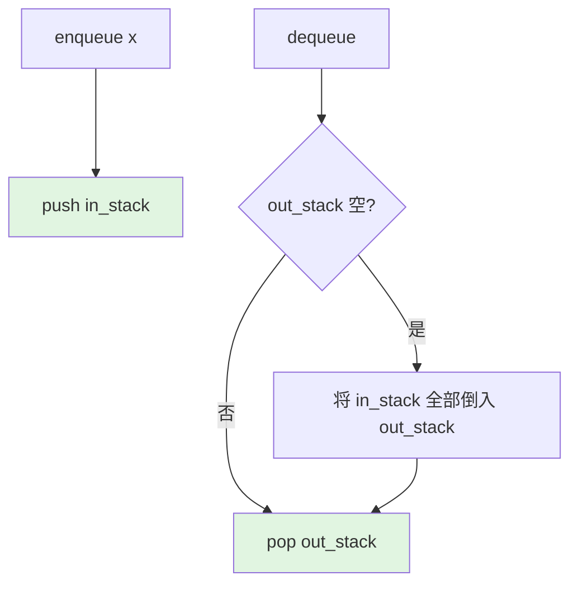

> 📊 **项目全面梳理**：详细的项目结构、模块详解和学习路径，请参阅 [`项目全面梳理-2025.md`](../../项目全面梳理-2025.md)

## 栈与队列 / Stack and Queue

### 摘要 / Executive Summary

- 栈（Stack）和队列（Queue）是两种最基础的**线性数据结构**，分别遵循 LIFO（Last-In-First-Out）和 FIFO（First-In-First-Out）的访问原则。它们在算法面试中的出场频率分别约为 10% 和 6%，是考察代码严谨性与抽象能力的重要考点。
- 本文从**形式化定义**出发，给出栈、队列与双端队列的 ADT 规约，深入剖析 LeetCode 20（有效的括号）、155（最小栈）、232（用栈实现队列）、239（滑动窗口最大值）四道经典题目。每道题目均配备不变式的完整证明。
- 核心学习目标：建立"**操作语义思维**"——理解每种结构的访问约束如何转化为算法设计中的不变式。

### 关键术语与符号 / Glossary

| 术语 / Term | 定义 / Definition |
|-------------|-------------------|
| 栈 Stack | 仅允许在一端（栈顶）进行插入（push）和删除（pop）的线性结构，LIFO |
| 队列 Queue | 允许在一端（队尾）插入、另一端（队头）删除的线性结构，FIFO |
| 双端队列 Deque | 允许在两端进行插入和删除的线性结构，是栈和队列的推广 |
| 单调队列 Monotonic Queue | 维护队列内元素单调性（递增或递减）的变形队列，用于滑动窗口最值 |
| 摊还分析 Amortized Analysis | 对操作序列的总成本求平均，得出单次操作的均摊复杂度上界 |
| 辅助栈 Auxiliary Stack | 用于维护额外信息（如最小值）的辅助数据结构 |

术语对齐与引用规范：`docs/术语与符号总表.md`，`01-基础理论/00-撰写规范与引用指南.md`

### 目录 / Table of Contents

- [栈与队列 / Stack and Queue](#栈与队列--stack-and-queue)
  - [摘要 / Executive Summary](#摘要--executive-summary)
  - [关键术语与符号 / Glossary](#关键术语与符号--glossary)
  - [目录 / Table of Contents](#目录--table-of-contents)
  - [交叉引用与依赖 / Cross-References and Dependencies](#交叉引用与依赖--cross-references-and-dependencies)
- [1. 形式化定义 / Formal Definitions](#1-形式化定义--formal-definitions)
  - [1.1 栈的形式化定义](#11-栈的形式化定义)
  - [1.2 队列的形式化定义](#12-队列的形式化定义)
  - [1.3 双端队列的形式化定义](#13-双端队列的形式化定义)
- [2. 核心思路与算法框架](#2-核心思路与算法框架)
  - [2.1 栈的应用框架](#21-栈的应用框架)
  - [2.2 队列的应用框架](#22-队列的应用框架)
  - [2.3 单调队列框架](#23-单调队列框架)
- [3. 经典题目详解](#3-经典题目详解)
  - [3.1 LeetCode 20 — 有效的括号](#31-leetcode-20--有效的括号)
    - [形式化规约 / Formal Specification](#形式化规约--formal-specification)
    - [核心思路 / Core Idea](#核心思路--core-idea)
    - [代码实现 / Code Implementations](#代码实现--code-implementations)
    - [复杂度分析 / Complexity Analysis](#复杂度分析--complexity-analysis)
    - [正确性证明 / Correctness Proof](#正确性证明--correctness-proof)
  - [3.2 LeetCode 155 — 最小栈](#32-leetcode-155--最小栈)
    - [形式化规约 / Formal Specification](#形式化规约--formal-specification-1)
    - [核心思路 / Core Idea](#核心思路--core-idea-1)
    - [代码实现 / Code Implementations](#代码实现--code-implementations-1)
    - [复杂度分析 / Complexity Analysis](#复杂度分析--complexity-analysis-1)
    - [正确性证明 / Correctness Proof](#正确性证明--correctness-proof-1)
  - [3.3 LeetCode 232 — 用栈实现队列](#33-leetcode-232--用栈实现队列)
    - [形式化规约 / Formal Specification](#形式化规约--formal-specification-2)
    - [核心思路 / Core Idea](#核心思路--core-idea-2)
    - [代码实现 / Code Implementations](#代码实现--code-implementations-2)
    - [复杂度分析 / Complexity Analysis](#复杂度分析--complexity-analysis-2)
    - [摊还分析 / Amortized Analysis](#摊还分析--amortized-analysis)
  - [3.4 LeetCode 239 — 滑动窗口最大值](#34-leetcode-239--滑动窗口最大值)
    - [形式化规约 / Formal Specification](#形式化规约--formal-specification-3)
    - [核心思路 / Core Idea](#核心思路--core-idea-3)
    - [代码实现 / Code Implementations](#代码实现--code-implementations-3)
    - [复杂度分析 / Complexity Analysis](#复杂度分析--complexity-analysis-3)
    - [正确性证明 / Correctness Proof](#正确性证明--correctness-proof-2)
- [4. 复杂度分析体系](#4-复杂度分析体系)
  - [4.1 栈与队列操作复杂度汇总](#41-栈与队列操作复杂度汇总)
  - [4.2 摊还分析详解](#42-摊还分析详解)
- [5. 正确性证明框架](#5-正确性证明框架)
  - [5.1 通用不变式模式](#51-通用不变式模式)
- [6. 思维表征](#6-思维表征)
  - [6.1 概念依赖图](#61-概念依赖图)
  - [6.2 括号匹配过程图](#62-括号匹配过程图)
  - [6.3 双栈实现队列流程图](#63-双栈实现队列流程图)
  - [6.4 单调队列维护过程图](#64-单调队列维护过程图)
- [7. 常见错误与反模式](#7-常见错误与反模式)
  - [7.1 栈空时执行 pop](#71-栈空时执行-pop)
  - [7.2 双栈队列的倒栈时机错误](#72-双栈队列的倒栈时机错误)
  - [7.3 单调队列忘记移除过期元素](#73-单调队列忘记移除过期元素)
  - [7.4 混淆单调递增与递减](#74-混淆单调递增与递减)
- [8. 自测问题](#8-自测问题)
  - [问题 1：栈与队列的本质差异](#问题-1栈与队列的本质差异)
  - [问题 2：最小栈的空间优化](#问题-2最小栈的空间优化)
  - [问题 3：摊还分析的三种方法](#问题-3摊还分析的三种方法)
  - [问题 4：单调队列的单调性方向](#问题-4单调队列的单调性方向)
  - [问题 5：双端队列与两个栈的区别](#问题-5双端队列与两个栈的区别)
  - [问题 6：括号匹配的扩展](#问题-6括号匹配的扩展)
- [9. 学习目标](#9-学习目标)
- [参考文献 / References](#参考文献--references)

### 交叉引用与依赖 / Cross-References and Dependencies

**上游理论依赖 / Upstream Dependencies**:

- [`09-算法理论/01-算法基础/02-数据结构理论.md`](../../09-算法理论/01-算法基础/02-数据结构理论.md) — 栈与队列作为线性结构的理论定义
- [`04-算法复杂度/01-时间复杂度.md`](../../04-算法复杂度/01-时间复杂度.md) — 时间复杂度 $O/\Omega/\Theta$ 的形式化定义
- [`02-递归理论/01-递归基础.md`](../../02-递归理论/01-递归基础.md) — 递归与栈的深层联系

**下游应用 / Downstream Applications**:

- `13-LeetCode算法面试专题/02-算法范式专题/06-双指针.md` — 单调队列与双指针的联合应用
- `13-LeetCode算法面试专题/01-数据结构专题/06-堆与优先队列.md` — 优先队列是队列的语义推广

---

## 1. 形式化定义 / Formal Definitions

### 1.1 栈的形式化定义

**定义 1.1** (栈 / Stack)
栈是一个抽象数据类型 $S = (D, O)$，其中：

- $D$：元素集合，栈实例表示为序列 $\langle a_1, a_2, \ldots, a_n \rangle$，$a_n$ 为栈顶元素
- $O = \{\text{push}, \text{pop}, \text{top}, \text{is_empty}\}$ 为操作集合

**操作语义 / Operational Semantics**:

| 操作 | 前置条件 | 后置条件 | 时间复杂度 |
|------|---------|---------|-----------|
| $\text{push}(x)$ | — | 序列变为 $\langle a_1, \ldots, a_n, x \rangle$ | $O(1)$ |
| $\text{pop}()$ | 栈非空 | 返回 $a_n$，序列变为 $\langle a_1, \ldots, a_{n-1} \rangle$ | $O(1)$ |
| $\text{top}()$ | 栈非空 | 返回 $a_n$，序列不变 | $O(1)$ |
| $\text{is_empty}()$ | — | 返回 $n = 0$ | $O(1)$ |

**栈不变式 / Stack Invariant**:

$$
Inv_{\text{stack}} \equiv \text{元素访问仅发生在序列的末尾（栈顶）}
$$

### 1.2 队列的形式化定义

**定义 1.2** (队列 / Queue)
队列是一个抽象数据类型 $Q = (D, O)$，其中：

- $D$：元素集合，队列实例表示为序列 $\langle a_1, a_2, \ldots, a_n \rangle$，$a_1$ 为队头，$a_n$ 为队尾
- $O = \{\text{enqueue}, \text{dequeue}, \text{front}, \text{is_empty}\}$

**操作语义 / Operational Semantics**:

| 操作 | 前置条件 | 后置条件 | 时间复杂度 |
|------|---------|---------|-----------|
| $\text{enqueue}(x)$ | — | 序列变为 $\langle a_1, \ldots, a_n, x \rangle$ | $O(1)$ |
| $\text{dequeue}()$ | 队列非空 | 返回 $a_1$，序列变为 $\langle a_2, \ldots, a_n \rangle$ | $O(1)$ |
| $\text{front}()$ | 队列非空 | 返回 $a_1$，序列不变 | $O(1)$ |

**队列不变式 / Queue Invariant**:

$$
Inv_{\text{queue}} \equiv \text{元素插入发生在末尾，删除发生在头部，保持 FIFO 序}
$$

### 1.3 双端队列的形式化定义

**定义 1.3** (双端队列 / Deque)
双端队列是栈与队列的推广，允许在序列两端进行插入和删除：

- $O = \{\text{push_front}, \text{push_back}, \text{pop_front}, \text{pop_back}, \text{front}, \text{back}\}$

**操作语义 / Operational Semantics**:

| 操作 | 前置条件 | 后置条件 | 时间复杂度 |
|------|---------|---------|-----------|
| $\text{push_front}(x)$ | — | $x$ 插入队头 | $O(1)$ |
| $\text{push_back}(x)$ | — | $x$ 插入队尾 | $O(1)$ |
| $\text{pop_front}()$ | 队列非空 | 移除并返回队头 | $O(1)$ |
| $\text{pop_back}()$ | 队列非空 | 移除并返回队尾 | $O(1)$ |

---

## 2. 核心思路与算法框架

### 2.1 栈的应用框架

栈的核心应用场景：

1. **括号匹配**：遇到左括号入栈，遇到右括号与栈顶匹配
2. **表达式求值**：中缀转后缀、后缀表达式求值
3. **DFS 非递归实现**：用栈模拟递归调用栈
4. **单调栈**：维护单调递增/递减序列，求下一个更大/更小元素

### 2.2 队列的应用框架

队列的核心应用场景：

1. **BFS**：层级遍历，保证按距离顺序访问节点
2. **任务调度**：FIFO 调度策略
3. **滑动窗口**：维护窗口内元素的顺序信息
4. **用栈实现队列**：通过两个栈的协作模拟 FIFO 语义

### 2.3 单调队列框架

单调队列维护队列内元素的单调性，用于高效求解滑动窗口最值问题。

**单调递减队列（求窗口最大值）/ Monotonically Decreasing Queue**:

```text
初始化空队列 deque
for i in [0, n-1]:
    # 1. 移除队尾所有小于当前元素的值（保持单调递减）
    while deque 非空且 nums[deque.back] < nums[i]:
        deque.pop_back()

    # 2. 当前元素入队
    deque.push_back(i)

    # 3. 移除已滑出窗口的队头元素
    if deque.front < i - k + 1:
        deque.pop_front()

    # 4. 窗口形成后，队头即为最大值索引
    if i >= k - 1:
        result.append(nums[deque.front])
```

---

## 3. 经典题目详解

### 3.1 LeetCode 20 — 有效的括号

> **题目链接 / Problem Link**: [LeetCode 20. Valid Parentheses](https://leetcode.com/problems/valid-parentheses/)
> **难度 / Difficulty**: Easy

#### 形式化规约 / Formal Specification

**输入 / Input**: 字符串 $s$，由字符集合 $\{'(', ')', '[', ']', '\{', '\}'\}$ 构成。
**输出 / Output**: 布尔值，表示 $s$ 是否为有效括号字符串。
**前置条件 / Precondition**: $s$ 仅包含上述六种字符，$0 \leq |s| \leq 10^4$。

**后置条件 / Postcondition**:

$$
\text{result} = \text{True} \leftrightarrow s \text{ 可以被递归定义为：空串，或 } (A), [A], \{A\} \text{ 其中 } A \text{ 也是有效串}
$$

#### 核心思路 / Core Idea

利用栈的 LIFO 性质：

- 遇到左括号 $(, [, \{$ 时，将其入栈
- 遇到右括号 $), ], \}$ 时，检查栈顶是否为匹配的左括号
- 若匹配则弹出栈顶，否则字符串无效
- 最终栈必须为空，字符串才有效

**括号嵌套的形式化**：有效括号串对应一棵合法的语法树，栈的深度等于当前嵌套深度。

#### 代码实现 / Code Implementations

- **Python**: [`examples/algorithms-python/src/leetcode/lc0020_valid_parentheses.py`](../../../../examples/algorithms-python/src/leetcode/lc0020_valid_parentheses.py)
- **Rust**: [`examples/algorithms/src/leetcode/lc0020_valid_parentheses.rs`](../../../../examples/algorithms/src/leetcode/lc0020_valid_parentheses.rs)
- **Go**: [`examples/algorithms-go/leetcode/lc0020_valid_parentheses.go`](../../../../examples/algorithms-go/leetcode/lc0020_valid_parentheses.go)

```python
# Python 参考实现
def is_valid(s: str) -> bool:
    stack = []
    pairs = {')': '(', ']': '[', '}': '{'}
    for ch in s:
        if ch in pairs:
            if not stack or stack[-1] != pairs[ch]:
                return False
            stack.pop()
        else:
            stack.append(ch)
    return not stack
```

```rust
// Rust 参考实现
pub fn is_valid(s: String) -> bool {
    let mut stack = Vec::new();
    for ch in s.chars() {
        match ch {
            '(' | '[' | '{' => stack.push(ch),
            ')' => if stack.pop() != Some('(') { return false; },
            ']' => if stack.pop() != Some('[') { return false; },
            '}' => if stack.pop() != Some('{') { return false; },
            _ => {}
        }
    }
    stack.is_empty()
}
```

```go
// Go 参考实现
func isValid(s string) bool {
    stack := make([]rune, 0)
    pairs := map[rune]rune{')': '(', ']': '[', '}': '{'}
    for _, ch := range s {
        if open, ok := pairs[ch]; ok {
            if len(stack) == 0 || stack[len(stack)-1] != open {
                return false
            }
            stack = stack[:len(stack)-1]
        } else {
            stack = append(stack, ch)
        }
    }
    return len(stack) == 0
}
```

#### 复杂度分析 / Complexity Analysis

| 指标 / Metric | 值 / Value | 说明 / Note |
|--------------|-----------|------------|
| 时间复杂度 / Time | $O(n)$ | 遍历字符串一次，每个字符最多入栈出栈各一次 |
| 空间复杂度 / Space | $O(n)$ | 最坏情况全是左括号，栈深度为 $n$ |

#### 正确性证明 / Correctness Proof

**定理 3.1.1** (LeetCode 20 正确性): 算法返回 `True` 当且仅当输入字符串 $s$ 是有效括号串。

**证明 / Proof**:

定义**栈不变式** $Inv(i)$：处理完前 $i$ 个字符后，栈中从底到顶恰好是**尚未匹配**的左括号序列，且这些左括号按照出现顺序排列。

**初始化**: $i = 0$ 时，栈为空。空字符串没有未匹配的左括号，$Inv(0)$ 成立。

**保持**: 假设处理第 $i$ 个字符前 $Inv(i)$ 成立。分两种情况：

- **情况 A**：$s[i]$ 是左括号。算法将其压入栈顶。此时栈中保存了之前未匹配的左括号加上当前左括号，$Inv(i+1)$ 成立。
- **情况 B**：$s[i]$ 是右括号。算法检查栈顶：
  - 若栈顶是对应的左括号，弹出栈顶。这一对括号被成功匹配，剩余栈中仍是未匹配的左括号，$Inv(i+1)$ 成立。
  - 若栈顶不是对应的左括号（或栈空），说明无法匹配，返回 `False`。此时 $s$ 不可能是有效串。

**终止**: 遍历结束后，若栈为空，说明所有左括号都被匹配，$s$ 有效；若栈非空，说明有左括号未被匹配，$s$ 无效。

综上，算法正确。$\square$

---

### 3.2 LeetCode 155 — 最小栈

> **题目链接 / Problem Link**: [LeetCode 155. Min Stack](https://leetcode.com/problems/min-stack/)
> **难度 / Difficulty**: Medium

#### 形式化规约 / Formal Specification

设计一个栈，支持 `push`、`pop`、`top` 操作，并能在**常数时间**内检索到最小元素。

**后置条件 / Postcondition**:

$$
\forall t: \text{getMin}() = \min \{ x \mid x \text{ 当前在栈中} \}
$$

#### 核心思路 / Core Idea

使用**辅助栈**同步维护当前栈中的最小值。

- 主栈 `stack`：正常存储所有元素
- 辅助栈 `min_stack`：存储每个状态下的最小值

**辅助栈不变式**：$\text{min_stack.top} = \min(\text{main_stack})$。

每次 `push(x)` 时：

- 将 $x$ 压入主栈
- 将 $\min(x, \text{min_stack.top})$ 压入辅助栈（若辅助栈为空则压入 $x$）

每次 `pop()` 时：

- 主栈和辅助栈同时弹出

#### 代码实现 / Code Implementations

- **Python**: [`examples/algorithms-python/src/leetcode/lc0155_min_stack.py`](../../../../examples/algorithms-python/src/leetcode/lc0155_min_stack.py)
- **Rust**: [`examples/algorithms/src/leetcode/lc0155_min_stack.rs`](../../../../examples/algorithms/src/leetcode/lc0155_min_stack.rs)
- **Go**: [`examples/algorithms-go/leetcode/lc0155_min_stack.go`](../../../../examples/algorithms-go/leetcode/lc0155_min_stack.go)

```python
# Python 参考实现
class MinStack:
    def __init__(self):
        self.stack = []
        self.min_stack = []

    def push(self, val: int) -> None:
        self.stack.append(val)
        if not self.min_stack:
            self.min_stack.append(val)
        else:
            self.min_stack.append(min(val, self.min_stack[-1]))

    def pop(self) -> None:
        self.stack.pop()
        self.min_stack.pop()

    def top(self) -> int:
        return self.stack[-1]

    def getMin(self) -> int:
        return self.min_stack[-1]
```

```rust
// Rust 参考实现
pub struct MinStack {
    stack: Vec<i32>,
    min_stack: Vec<i32>,
}

impl MinStack {
    pub fn new() -> Self {
        MinStack { stack: Vec::new(), min_stack: Vec::new() }
    }
    pub fn push(&mut self, val: i32) {
        self.stack.push(val);
        let min_val = self.min_stack.last().map_or(val, |&m| m.min(val));
        self.min_stack.push(min_val);
    }
    pub fn pop(&mut self) {
        self.stack.pop();
        self.min_stack.pop();
    }
    pub fn top(&self) -> i32 {
        *self.stack.last().unwrap()
    }
    pub fn get_min(&self) -> i32 {
        *self.min_stack.last().unwrap()
    }
}
```

```go
// Go 参考实现
type MinStack struct {
    stack    []int
    minStack []int
}

func Constructor() MinStack {
    return MinStack{stack: []int{}, minStack: []int{}}
}

func (this *MinStack) Push(val int) {
    this.stack = append(this.stack, val)
    if len(this.minStack) == 0 {
        this.minStack = append(this.minStack, val)
    } else {
        minVal := val
        if this.minStack[len(this.minStack)-1] < minVal {
            minVal = this.minStack[len(this.minStack)-1]
        }
        this.minStack = append(this.minStack, minVal)
    }
}

func (this *MinStack) Pop() {
    this.stack = this.stack[:len(this.stack)-1]
    this.minStack = this.minStack[:len(this.minStack)-1]
}

func (this *MinStack) Top() int {
    return this.stack[len(this.stack)-1]
}

func (this *MinStack) GetMin() int {
    return this.minStack[len(this.minStack)-1]
}
```

#### 复杂度分析 / Complexity Analysis

| 指标 / Metric | 值 / Value | 说明 / Note |
|--------------|-----------|------------|
| `push` 时间 | $O(1)$ | 两次栈顶操作 |
| `pop` 时间 | $O(1)$ | 两次弹出 |
| `top` 时间 | $O(1)$ | 直接访问栈顶 |
| `getMin` 时间 | $O(1)$ | 辅助栈顶即为最小值 |
| 空间复杂度 | $O(n)$ | 辅助栈与主栈等长 |

#### 正确性证明 / Correctness Proof

**定理 3.2.1** (辅助栈不变式): 对于任意操作序列，处理完成后始终有 $\text{min_stack.top} = \min(\text{main_stack})$。

**证明 / Proof**:

对操作序列长度进行归纳。

**基例**: 初始时两栈均为空。空集的最小值无定义，与空辅助栈一致。

**归纳假设**: 假设经过 $k$ 次操作后，不变式成立。

**归纳步骤**（第 $k+1$ 次操作）：

- **`push(x)`**: 主栈变为 $S \cup \{x\}$。辅助栈压入 $\min(x, \text{min_stack.top})$。
  - 由归纳假设，原 $\text{min_stack.top} = \min(S)$。
  - 新辅助栈顶 = $\min(x, \min(S)) = \min(S \cup \{x\})$。不变式保持。

- **`pop()`**: 主栈和辅助栈同步弹出。由归纳假设，弹出前辅助栈顶等于主栈最小值。弹出后，剩余辅助栈顶等于剩余主栈的最小值（因为两者同时移除了相同位置的最小值候选）。不变式保持。

因此，每次操作后不变式均成立，`getMin()` 返回辅助栈顶即为当前最小值。$\square$

---

### 3.3 LeetCode 232 — 用栈实现队列

> **题目链接 / Problem Link**: [LeetCode 232. Implement Queue using Stacks](https://leetcode.com/problems/implement-queue-using-stacks/)
> **难度 / Difficulty**: Easy

#### 形式化规约 / Formal Specification

使用两个栈 `in_stack` 和 `out_stack` 实现队列的 FIFO 语义。

**后置条件 / Postcondition**:

$$
\text{dequeue}() \text{ 返回的是最早入队的元素}
$$

#### 核心思路 / Core Idea

**双栈法**：一个栈负责接收输入（`in_stack`），一个栈负责输出（`out_stack`）。

- `enqueue(x)`：直接将 $x$ 压入 `in_stack`
- `dequeue()`：若 `out_stack` 为空，将 `in_stack` 的所有元素依次弹出并压入 `out_stack`。此时 `out_stack` 的栈顶即为队头元素，弹出即可。

**关键洞察**：将 `in_stack` 的元素全部倒入 `out_stack` 后，元素的顺序被反转了两次（栈的 LIFO 反转 + 栈的 LIFO 反转），从而恢复了 FIFO 顺序。

#### 代码实现 / Code Implementations

- **Python**: [`examples/algorithms-python/src/leetcode/lc0232_implement_queue_using_stacks.py`](../../../../examples/algorithms-python/src/leetcode/lc0232_implement_queue_using_stacks.py)
- **Rust**: [`examples/algorithms/src/leetcode/lc0232_implement_queue_using_stacks.rs`](../../../../examples/algorithms/src/leetcode/lc0232_implement_queue_using_stacks.rs)
- **Go**: [`examples/algorithms-go/leetcode/lc0232_implement_queue_using_stacks.go`](../../../../examples/algorithms-go/leetcode/lc0232_implement_queue_using_stacks.go)

```python
# Python 参考实现
class MyQueue:
    def __init__(self):
        self.in_stack = []
        self.out_stack = []

    def push(self, x: int) -> None:
        self.in_stack.append(x)

    def pop(self) -> int:
        self.peek()
        return self.out_stack.pop()

    def peek(self) -> int:
        if not self.out_stack:
            while self.in_stack:
                self.out_stack.append(self.in_stack.pop())
        return self.out_stack[-1]

    def empty(self) -> bool:
        return not self.in_stack and not self.out_stack
```

```rust
// Rust 参考实现
pub struct MyQueue {
    in_stack: Vec<i32>,
    out_stack: Vec<i32>,
}

impl MyQueue {
    pub fn new() -> Self {
        MyQueue { in_stack: Vec::new(), out_stack: Vec::new() }
    }
    pub fn push(&mut self, x: i32) {
        self.in_stack.push(x);
    }
    pub fn pop(&mut self) -> i32 {
        self.peek();
        self.out_stack.pop().unwrap()
    }
    pub fn peek(&mut self) -> i32 {
        if self.out_stack.is_empty() {
            while let Some(x) = self.in_stack.pop() {
                self.out_stack.push(x);
            }
        }
        *self.out_stack.last().unwrap()
    }
    pub fn empty(&self) -> bool {
        self.in_stack.is_empty() && self.out_stack.is_empty()
    }
}
```

```go
// Go 参考实现
type MyQueue struct {
    inStack  []int
    outStack []int
}

func ConstructorQueue() MyQueue {
    return MyQueue{inStack: []int{}, outStack: []int{}}
}

func (this *MyQueue) Push(x int) {
    this.inStack = append(this.inStack, x)
}

func (this *MyQueue) Pop() int {
    this.Peek()
    val := this.outStack[len(this.outStack)-1]
    this.outStack = this.outStack[:len(this.outStack)-1]
    return val
}

func (this *MyQueue) Peek() int {
    if len(this.outStack) == 0 {
        for len(this.inStack) > 0 {
            val := this.inStack[len(this.inStack)-1]
            this.inStack = this.inStack[:len(this.inStack)-1]
            this.outStack = append(this.outStack, val)
        }
    }
    return this.outStack[len(this.outStack)-1]
}

func (this *MyQueue) Empty() bool {
    return len(this.inStack) == 0 && len(this.outStack) == 0
}
```

#### 复杂度分析 / Complexity Analysis

| 指标 / Metric | 值 / Value | 说明 / Note |
|--------------|-----------|------------|
| `push` 时间 | $O(1)$ | 直接压入输入栈 |
| `pop` 均摊时间 | $O(1)$ | 每个元素最多转移两次 |
| `peek` 均摊时间 | $O(1)$ | 同 `pop` |
| `empty` 时间 | $O(1)$ | 检查两个栈是否为空 |
| 空间复杂度 | $O(n)$ | 两个栈共存储 $n$ 个元素 |

#### 摊还分析 / Amortized Analysis

**定理 3.3.1** (双栈队列的均摊 $O(1)$): 对于任意长度为 $n$ 的操作序列（包含 `push` 和 `pop`），总时间复杂度为 $O(n)$，因此单次操作的均摊复杂度为 $O(1)$。

**证明 / Proof**:

采用**聚合分析（Aggregate Analysis）**。

观察每个元素的流动路径：

$$
\text{入队} \xrightarrow{\text{push}} \text{in_stack} \xrightarrow{\text{pop}} \text{out_stack} \xrightarrow{\text{pop}} \text{出队}
$$

每个元素在生命周期中经历的操作：

1. 被压入 `in_stack` 一次
2. 从 `in_stack` 弹出一次
3. 被压入 `out_stack` 一次
4. 从 `out_stack` 弹出一次

总共 **4 次栈操作**，每次 $O(1)$。对于 $n$ 个元素，总操作次数 $\leq 4n = O(n)$。因此 $n$ 次队列操作的总时间为 $O(n)$，单次操作均摊 $O(1)$。$\square$

---

### 3.4 LeetCode 239 — 滑动窗口最大值

> **题目链接 / Problem Link**: [LeetCode 239. Sliding Window Maximum](https://leetcode.com/problems/sliding-window-maximum/)
> **难度 / Difficulty**: Hard

#### 形式化规约 / Formal Specification

**输入 / Input**: 整数数组 $nums$ 和正整数 $k$。
**输出 / Output**: 数组 $result$，其中 $result[i] = \max_{j \in [i, i+k-1]} nums[j]$。
**前置条件 / Precondition**: $1 \leq k \leq |nums| \leq 10^5$。

#### 核心思路 / Core Idea

使用**单调递减双端队列**维护窗口内的候选最大值。

- 队列中存储的是**索引**，而非值
- 队列中的索引对应的值**严格单调递减**
- 队头元素始终是当前窗口的最大值
- 窗口滑动时，移除已不在窗口内的索引（队头过期检查）
- 新元素加入时，从队尾移除所有值小于新元素的索引（它们不可能成为后续窗口的最大值）

#### 代码实现 / Code Implementations

- **Python**: [`examples/algorithms-python/src/leetcode/lc0239_sliding_window_maximum.py`](../../../../examples/algorithms-python/src/leetcode/lc0239_sliding_window_maximum.py)
- **Rust**: [`examples/algorithms/src/leetcode/lc0239_sliding_window_maximum.rs`](../../../../examples/algorithms/src/leetcode/lc0239_sliding_window_maximum.rs)
- **Go**: [`examples/algorithms-go/leetcode/lc0239_sliding_window_maximum.go`](../../../../examples/algorithms-go/leetcode/lc0239_sliding_window_maximum.go)

```python
# Python 参考实现
from collections import deque

def max_sliding_window(nums: list[int], k: int) -> list[int]:
    dq = deque()  # 存储索引，对应值单调递减
    result = []
    for i, num in enumerate(nums):
        # 移除队尾小于当前值的元素
        while dq and nums[dq[-1]] < num:
            dq.pop()
        dq.append(i)
        # 移除已滑出窗口的队头元素
        if dq[0] < i - k + 1:
            dq.popleft()
        # 窗口已形成，记录最大值
        if i >= k - 1:
            result.append(nums[dq[0]])
    return result
```

```rust
// Rust 参考实现
use std::collections::VecDeque;

pub fn max_sliding_window(nums: Vec<i32>, k: i32) -> Vec<i32> {
    let k = k as usize;
    let mut dq = VecDeque::new();
    let mut res = Vec::new();
    for (i, &num) in nums.iter().enumerate() {
        while let Some(&back) = dq.back() {
            if nums[back] < num { dq.pop_back(); } else { break; }
        }
        dq.push_back(i);
        if dq[0] < i + 1 - k { dq.pop_front(); }
        if i >= k - 1 { res.push(nums[dq[0]]); }
    }
    res
}
```

```go
// Go 参考实现
func maxSlidingWindow(nums []int, k int) []int {
    dq := make([]int, 0) // 存储索引，对应值单调递减
    res := make([]int, 0)
    for i, num := range nums {
        for len(dq) > 0 && nums[dq[len(dq)-1]] < num {
            dq = dq[:len(dq)-1]
        }
        dq = append(dq, i)
        if dq[0] < i-k+1 {
            dq = dq[1:]
        }
        if i >= k-1 {
            res = append(res, nums[dq[0]])
        }
    }
    return res
}
```

#### 复杂度分析 / Complexity Analysis

| 指标 / Metric | 值 / Value | 说明 / Note |
|--------------|-----------|------------|
| 时间复杂度 / Time | $O(n)$ | 每个元素最多入队出队各一次 |
| 空间复杂度 / Space | $O(k)$ | 双端队列最多存储 $k$ 个索引 |

#### 正确性证明 / Correctness Proof

**定理 3.4.1** (单调队列正确性): 算法正确输出每个滑动窗口的最大值。

**证明 / Proof**:

定义**单调队列不变式** $Inv(i)$：处理完 $nums[0..i]$ 后，双端队列 `dq` 中存储的索引满足：

1. **索引有效性**：所有索引 $\in [i-k+1, i]$（在当前或最近窗口内）
2. **单调递减性**：$nums[dq[0]] \geq nums[dq[1]] \geq \cdots \geq nums[dq[m-1]]$
3. **最大值性质**：$nums[dq[0]] = \max_{j \in [i-k+1, i]} nums[j]$

**初始化**: $i < k-1$ 时窗口未完全形成，但上述性质仍局部成立。

**保持**: 处理 $nums[i]$ 时：

1. **队尾维护**：移除队尾所有 $nums[dq[-1]] < nums[i]$ 的索引。这些元素既小于当前元素，又比当前元素先离开窗口，因此不可能成为任何后续窗口的最大值。移除后保持单调递减性。
2. **入队**：将 $i$ 入队，单调性仍保持（因为队尾所有小于 $nums[i]$ 的元素已被移除）。
3. **队头过期检查**：若 $dq[0] < i-k+1$，则队头已滑出窗口，弹出。此时新的队头若存在，必在窗口内。
4. **窗口形成后输出**：若 $i \geq k-1$，窗口 $[i-k+1, i]$ 完全形成。由单调递减性，队头是窗口内最大值的候选；由步骤 3，队头在窗口内。因此 $nums[dq[0]]$ 就是窗口最大值。

**终止**: $i = n-1$ 时，所有窗口处理完毕，结果数组完整。

综上，算法正确。$\square$

---

## 4. 复杂度分析体系

### 4.1 栈与队列操作复杂度汇总

| 数据结构 | 操作 | 时间复杂度 | 空间复杂度 | 说明 |
|---------|------|-----------|-----------|------|
| 栈（数组实现） | push / pop / top | $O(1)$ | $O(n)$ | 动态扩容时均摊 $O(1)$ |
| 队列（数组实现） | enqueue / dequeue | $O(1)$ | $O(n)$ | 循环数组避免假溢出 |
| 双端队列 | 四端操作 | $O(1)$ | $O(n)$ | 双向循环链表或动态数组 |
| 单调队列 | 插入 / 查询最值 | $O(1)$ 均摊 | $O(k)$ | 每个元素最多入出队一次 |

### 4.2 摊还分析详解

**动态数组扩容 / Dynamic Array Expansion**:

当栈基于动态数组实现时，容量不足需要扩容（通常翻倍）。设当前容量为 $c$，已有 $c$ 个元素：

- 扩容成本：申请 $2c$ 空间 + 拷贝 $c$ 个元素 = $O(c)$
- 但扩容后可以进行 $c$ 次 $O(1)$ 的 push 操作才需要下次扩容

使用**势能法（Potential Method）**：定义势函数 $\Phi = 2 \times \text{元素个数} - \text{容量}$。

- 正常 push：实际成本 1，势能增加 2，均摊成本 = $1 + 2 = 3 = O(1)$
- 扩容 push：实际成本 $1 + c$，势能变化 $2 - c$，均摊成本 = $1 + c + 2 - c = 3 = O(1)$

因此动态数组实现的栈，push 操作的均摊复杂度为 $O(1)$。

---

## 5. 正确性证明框架

### 5.1 通用不变式模式

栈与队列算法的正确性证明通常基于以下不变式模式：

**模式一：栈深度与嵌套深度（括号匹配）**

$$
Inv \equiv \text{栈中元素个数} = \text{当前未匹配的左括号数量}
$$

**模式二：辅助栈同步（最小栈）**

$$
Inv \equiv \forall i: \text{min_stack}[i] = \min(\text{main_stack}[0..i])
$$

**模式三：双栈顺序反转（栈实现队列）**

$$
Inv \equiv \text{out_stack 非空} \rightarrow \text{out_stack 栈顶是当前最早入队元素}
$$

**模式四：单调性保持（滑动窗口最大值）**

$$
Inv \equiv \text{队列内索引对应的值单调递减} \land \text{队头是窗口最大值}
$$

---

## 6. 思维表征

### 6.1 概念依赖图

```mermaid
flowchart TD
    A[数组 Array] --> B[顺序栈]
    A --> C[顺序队列]
    A --> D[循环队列]
    E[链表 Linked List] --> F[链式栈]
    E --> G[链式队列]
    B --> H[括号匹配]
    B --> I[表达式求值]
    B --> J[DFS 非递归]
    C --> K[BFS]
    D --> L[单调队列]
    L --> M[滑动窗口最大值]
    B --> N[辅助栈技巧]
    N --> O[最小栈]
    B --> P[双栈队列]
    P --> Q[摊还分析 O(1)]
```

### 6.2 括号匹配过程图

```mermaid
flowchart LR
    subgraph 输入字符串
        S1["( [ { } ] )"]
    end
    subgraph 栈状态变化
        A1["空"]
        A2["("]
        A3["( ["]
        A4["( [ {"]
        A5["( ["]
        A6["("]
        A7["空 ✓"]
    end
    S1 --> A1
    A1 -->|push (| A2
    A2 -->|push [| A3
    A3 -->|push {| A4
    A4 -->|pop 匹配 }| A5
    A5 -->|pop 匹配 ]| A6
    A6 -->|pop 匹配 )| A7
```

### 6.3 双栈实现队列流程图



### 6.4 单调队列维护过程图

```mermaid
flowchart LR
    subgraph 窗口 [i-k+1 .. i]
        W1[nums[i-k+1]]
        W2[...]
        W3[nums[i-1]]
        W4[nums[i]]
    end
    subgraph 双端队列 dq
        D1[队头: 最大值索引]
        D2[次大值索引]
        D3[...]
        D4[队尾: 新加入索引]
    end
    W1 -->|过期移除| X[丢弃]
    W4 -->|移除队尾更小值| Y[丢弃]
    W4 --> D4
    D1 -->|输出| Z[result]
```

---

## 7. 常见错误与反模式

### 7.1 栈空时执行 pop

**错误 / Mistake**: 未检查栈是否为空就执行 `pop` 或 `top`。

```python
# 错误
stack.pop()  # ❌ 可能 IndexError

# 正确
if stack:
    stack.pop()  # ✅
```

### 7.2 双栈队列的倒栈时机错误

**错误 / Mistake**: 每次 `pop` 都将 `in_stack` 倒入 `out_stack`，导致 $O(n)$ 单次复杂度。

```python
# 错误
 def pop(self):
    while self.in_stack:  # ❌ 每次都全量转移
        self.out_stack.append(self.in_stack.pop())
    return self.out_stack.pop()

# 正确
 def pop(self):
    if not self.out_stack:  # ✅ 仅在需要时转移
        while self.in_stack:
            self.out_stack.append(self.in_stack.pop())
    return self.out_stack.pop()
```

### 7.3 单调队列忘记移除过期元素

**错误 / Mistake**: 维护单调性时忘记检查队头是否已滑出窗口。

```python
# 错误
if i >= k - 1:
    result.append(nums[dq[0]])  # ❌ dq[0] 可能已经过期

# 正确
if dq[0] < i - k + 1:
    dq.popleft()  # ✅ 先移除过期元素
if i >= k - 1:
    result.append(nums[dq[0]])
```

### 7.4 混淆单调递增与递减

**错误 / Mistake**: 求最大值时维护单调递增队列，导致队头是最小值。

**正确做法**：求窗口最大值 → 单调**递减**队列；求窗口最小值 → 单调**递增**队列。

---

## 8. 自测问题

### 问题 1：栈与队列的本质差异

**Q**: 从访问顺序角度，栈和队列的根本差异是什么？什么场景下必须用栈而非队列？

**A**: 栈遵循 **LIFO**（后进先出），队列遵循 **FIFO**（先进先出）。必须使用栈的场景包括：

- 括号匹配（后打开的括号需要先关闭）
- 表达式求值（操作符优先级与结合性）
- DFS 模拟递归（调用栈天然是 LIFO）

必须使用队列的场景包括：

- BFS（按距离层级扩展）
- 任务调度（公平性要求 FIFO）

### 问题 2：最小栈的空间优化

**Q**: 最小栈的辅助栈与主栈等长，能否优化空间？

**A**: 可以。当 `push(x)` 时，仅在 $x \leq \text{min_stack.top}$ 时才将 $x$ 压入辅助栈；`pop()` 时，仅当弹出值等于 `min_stack.top` 时才同步弹出辅助栈。这样辅助栈只保存"历史最小值序列"，在数据波动较大时空间更优，最坏仍为 $O(n)$。

### 问题 3：摊还分析的三种方法

**Q**: 摊还分析的三种经典方法是什么？分别适用于什么场景？

**A**:

1. **聚合分析（Aggregate Analysis）**: 计算 $n$ 次操作的总成本 $T(n)$，均摊成本 = $T(n)/n$。适用于操作序列整体分析。
2. **记账法（Accounting Method）**: 为每种操作预分配"费用"，多退少补。适用于直观理解。
3. **势能法（Potential Method）**: 定义势函数 $\Phi$，均摊成本 = 实际成本 + $\Delta\Phi$。适用于形式化证明。

### 问题 4：单调队列的单调性方向

**Q**: 为什么求滑动窗口最大值要用单调递减队列，而非递增队列？

**A**: 单调递减队列保证**队头元素始终是当前窗口的最大值**。当新元素入队时，从队尾移除所有更小的元素，因为它们不可能在后续窗口中成为最大值（新元素更大且更晚离开窗口）。若使用递增队列，队头是最小值，需要额外操作才能获取最大值，破坏了 $O(1)$ 查询的性质。

### 问题 5：双端队列与两个栈的区别

**Q**: 双端队列能否用两个栈实现？与用栈实现队列有什么本质区别？

**A**: 双端队列**不能**仅用两个栈在 $O(1)$ 时间实现两端操作。用两个栈可以实现队列的一端入一端出（通过单向倒栈），但双端队列要求在两端都能高效入队和出队。若用两个栈模拟，某一端的出队操作可能需要 $O(n)$ 时间将所有元素倒腾到另一个栈。

### 问题 6：括号匹配的扩展

**Q**: 如何判断包含三种括号 `()`, `[]`, `{}` 的字符串是否有效？如果增加要求判断括号嵌套深度，如何修改？

**A**: 基础判断使用栈匹配。求嵌套深度时，维护一个 `current_depth` 变量：遇到左括号时加 1，更新最大深度；遇到右括号时减 1。栈用于匹配，深度计数器用于统计。最大嵌套深度 = $\max(\text{current_depth})$ 的历史峰值。

---

## 9. 学习目标

完成本章学习后，读者应能够：

1. **形式化描述**栈、队列与双端队列的 ADT、操作语义与不变式。
2. **熟练运用**栈解决括号匹配、表达式求值等 LIFO 场景问题。
3. **设计辅助数据结构**（如辅助栈）在维持原操作 $O(1)$ 的同时提供额外查询能力。
4. **应用摊还分析**证明双栈队列、动态数组等结构的均摊 $O(1)$ 性能。
5. **应用单调队列**在 $O(n)$ 时间内解决滑动窗口最值问题，并证明其正确性。

---

## 参考文献 / References

- [Cormen 2022]: Cormen, T. H., et al. (2022). *Introduction to Algorithms* (4th ed.). MIT Press.
- [Knuth 1997]: Knuth, D. E. (1997). *The Art of Computer Programming, Volume 1*. Addison-Wesley.
- [Tarjan 1985]: Tarjan, R. E. (1985). "Amortized Computational Complexity." *SIAM Journal on Algebraic and Discrete Methods*, 6(2), 306-318.
- LeetCode 20 官方题解：<https://leetcode.com/problems/valid-parentheses/solution/>
- LeetCode 239 官方题解：<https://leetcode.com/problems/sliding-window-maximum/solution/>
