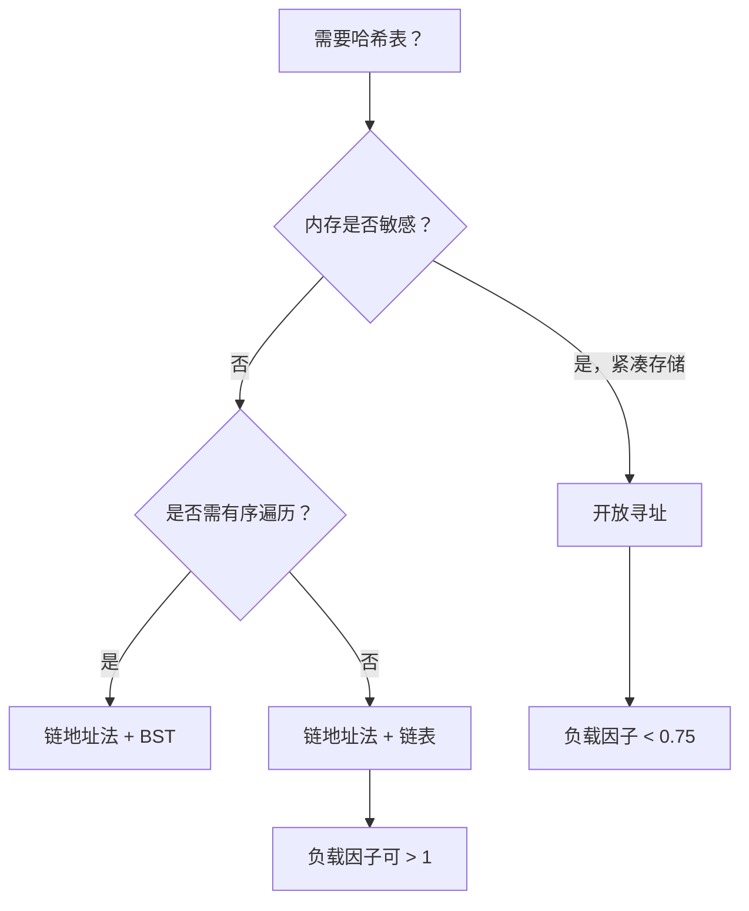
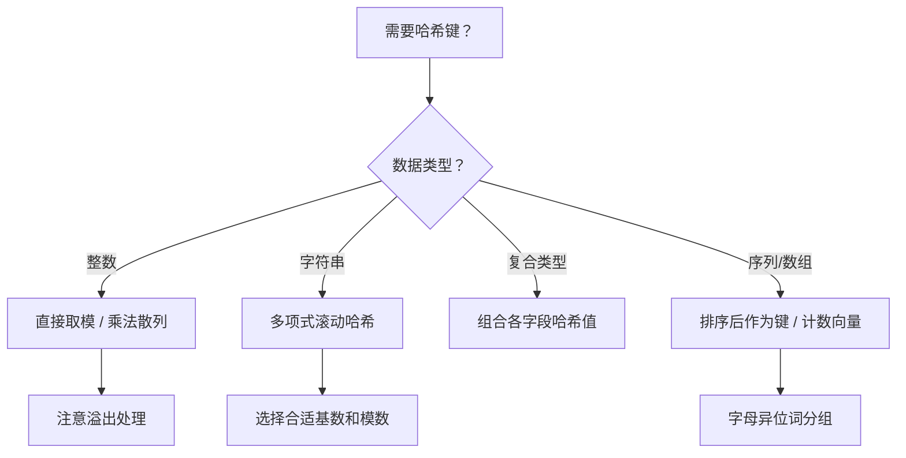

> 📊 **项目全面梳理**：详细的项目结构、模块详解和学习路径，请参阅 [`项目全面梳理-2025.md`](../../项目全面梳理-2025.md)

## 哈希表 / Hash Table

### 摘要 / Executive Summary

- 哈希表是通过**哈希函数**将键映射到数组索引，从而实现期望 $O(1)$ 时间查找、插入和删除的数据结构。在 LeetCode 前 300 高频题中，哈希表标签出现频率约为 28%，是面试中最高频的数据结构之一。
- 本文从**形式化定义**出发，给出哈希函数、冲突解决策略（链地址法与开放寻址）与负载因子的严格定义，深入剖析 LeetCode 1（两数之和）、49（字母异位词分组）、128（最长连续序列）、146（LRU 缓存）四道经典题目。
- 核心学习目标：理解**期望复杂度与最坏复杂度的本质差异**，掌握哈希键设计技巧，能够形式化证明哈希表操作的平均性能。

### 关键术语与符号 / Glossary

| 术语 / Term | 定义 / Definition |
|-------------|-------------------|
| 哈希函数 Hash Function | 将键空间 $K$ 映射到索引空间 $\{0, 1, \ldots, m-1\}$ 的函数 $h: K \to [0, m-1]$ |
| 冲突 Collision | 两个不同的键 $k_1 \neq k_2$ 满足 $h(k_1) = h(k_2)$ 的情况 |
| 链地址法 Separate Chaining | 每个桶维护一个链表（或其他结构），冲突元素顺序存储 |
| 开放寻址 Open Addressing | 冲突时按探测序列在表中寻找下一个空槽 |
| 负载因子 Load Factor | $\alpha = n/m$，其中 $n$ 为元素数，$m$ 为桶数 |
| 简单均匀散列 Simple Uniform Hashing | 假设：任何键等可能地散列到 $m$ 个槽中的任意一个 |
| 再散列 Rehashing | 当负载因子超过阈值时，扩大桶数并重新计算所有键的位置 |

术语对齐与引用规范：`docs/术语与符号总表.md`，`01-基础理论/00-撰写规范与引用指南.md`

### 目录 / Table of Contents

- [哈希表 / Hash Table](#哈希表--hash-table)
  - [摘要 / Executive Summary](#摘要--executive-summary)
  - [关键术语与符号 / Glossary](#关键术语与符号--glossary)
  - [目录 / Table of Contents](#目录--table-of-contents)
  - [交叉引用与依赖 / Cross-References and Dependencies](#交叉引用与依赖--cross-references-and-dependencies)
- [1. 形式化定义 / Formal Definitions](#1-形式化定义--formal-definitions)
  - [1.1 哈希表问题实例](#11-哈希表问题实例)
  - [1.2 哈希函数的形式化要求](#12-哈希函数的形式化要求)
  - [1.3 冲突解决策略](#13-冲突解决策略)
- [2. 核心思路与算法框架](#2-核心思路与算法框架)
  - [2.1 哈希键设计框架](#21-哈希键设计框架)
  - [2.2 冲突解决的选择策略](#22-冲突解决的选择策略)
- [3. 经典题目详解](#3-经典题目详解)
  - [3.1 LeetCode 1 — 两数之和](#31-leetcode-1--两数之和)
    - [形式化规约 / Formal Specification](#形式化规约--formal-specification)
    - [核心思路 / Core Idea](#核心思路--core-idea)
    - [代码实现 / Code Implementations](#代码实现--code-implementations)
    - [复杂度分析 / Complexity Analysis](#复杂度分析--complexity-analysis)
    - [正确性证明 / Correctness Proof](#正确性证明--correctness-proof)
  - [3.2 LeetCode 49 — 字母异位词分组](#32-leetcode-49--字母异位词分组)
    - [形式化规约 / Formal Specification](#形式化规约--formal-specification-1)
    - [核心思路 / Core Idea](#核心思路--core-idea-1)
    - [代码实现 / Code Implementations](#代码实现--code-implementations-1)
    - [复杂度分析 / Complexity Analysis](#复杂度分析--complexity-analysis-1)
  - [3.3 LeetCode 128 — 最长连续序列](#33-leetcode-128--最长连续序列)
    - [形式化规约 / Formal Specification](#形式化规约--formal-specification-2)
    - [核心思路 / Core Idea](#核心思路--core-idea-2)
    - [代码实现 / Code Implementations](#代码实现--code-implementations-2)
    - [复杂度分析 / Complexity Analysis](#复杂度分析--complexity-analysis-2)
    - [正确性证明 / Correctness Proof](#正确性证明--correctness-proof-1)
  - [3.4 LeetCode 146 — LRU 缓存](#34-leetcode-146--lru-缓存)
    - [形式化规约 / Formal Specification](#形式化规约--formal-specification-3)
    - [核心思路 / Core Idea](#核心思路--core-idea-3)
    - [代码实现 / Code Implementations](#代码实现--code-implementations-3)
    - [复杂度分析 / Complexity Analysis](#复杂度分析--complexity-analysis-3)
- [4. 复杂度分析体系](#4-复杂度分析体系)
  - [4.1 期望复杂度严格推导](#41-期望复杂度严格推导)
  - [4.2 最坏复杂度分析](#42-最坏复杂度分析)
- [5. 正确性证明框架](#5-正确性证明框架)
  - [5.1 哈希表算法的不变式模式](#51-哈希表算法的不变式模式)
- [6. 思维表征](#6-思维表征)
  - [6.1 概念依赖图](#61-概念依赖图)
  - [6.2 冲突解决对比矩阵](#62-冲突解决对比矩阵)
  - [6.3 哈希键设计决策树](#63-哈希键设计决策树)
  - [6.4 公理定理证明树](#64-公理定理证明树)
- [7. 常见错误与反模式](#7-常见错误与反模式)
  - [7.1 可变对象作为哈希键](#71-可变对象作为哈希键)
  - [7.2 忽略哈希冲突的最坏情况](#72-忽略哈希冲突的最坏情况)
  - [7.3 自定义哈希函数分布不均](#73-自定义哈希函数分布不均)
  - [7.4 LRU Cache 未同步更新哈希表与链表](#74-lru-cache-未同步更新哈希表与链表)
- [8. 自测问题](#8-自测问题)
  - [问题 1：期望复杂度 vs 最坏复杂度](#问题-1期望复杂度-vs-最坏复杂度)
  - [问题 2：再散列的时机与成本](#问题-2再散列的时机与成本)
  - [问题 3：开放寻址的删除问题](#问题-3开放寻址的删除问题)
  - [问题 4：LRU Cache 的替代实现](#问题-4lru-cache-的替代实现)
  - [问题 5：一致性哈希](#问题-5一致性哈希)
- [9. 学习目标](#9-学习目标)
- [参考文献 / References](#参考文献--references)

### 交叉引用与依赖 / Cross-References and Dependencies

**上游理论依赖 / Upstream Dependencies**:

- [`09-算法理论/01-算法基础/02-数据结构理论.md`](../../09-算法理论/01-算法基础/02-数据结构理论.md) — 散列表的理论定义与冲突分析
- [`04-算法复杂度/01-时间复杂度.md`](../../04-算法复杂度/01-时间复杂度.md) — 期望复杂度与概率分析
- [`04-算法复杂度/03-渐进分析.md`](../../04-算法复杂度/03-渐进分析.md) — 大 O 记号的代数性质

**下游应用 / Downstream Applications**:

- `13-LeetCode算法面试专题/01-数据结构专题/08-Trie树.md` — Trie 是哈希表在字符串域上的特化结构
- `13-LeetCode算法面试专题/02-算法范式专题/05-二分查找.md` — 哈希表 $O(1)$ 查找 vs 二分查找 $O(\log n)$ 的选型对比

---

## 1. 形式化定义 / Formal Definitions

### 1.1 哈希表问题实例

**定义 1.1** (哈希表 / Hash Table)
哈希表是一个抽象数据类型 $H = (K, V, h, T)$，其中：

- $K$：键空间（Key Space）
- $V$：值空间（Value Space）
- $h: K \to \{0, 1, \ldots, m-1\}$：哈希函数，$m$ 为桶（Bucket）数量
- $T[0..m-1]$：桶数组，每个槽位存储键值对集合

**操作语义 / Operational Semantics**:

| 操作 | 语义 | 期望时间 | 最坏时间 |
|------|------|---------|---------|
| `insert(k, v)` | 将 $(k, v)$ 存入哈希表 | $O(1)$ | $O(n)$ |
| `search(k)` | 查找键 $k$ 对应的值 | $O(1)$ | $O(n)$ |
| `delete(k)` | 删除键 $k$ | $O(1)$ | $O(n)$ |

### 1.2 哈希函数的形式化要求

**定义 1.2** (良好哈希函数 / Good Hash Function)
一个良好的哈希函数应满足：

1. **确定性（Deterministic）**：$\forall k: h(k)$ 是确定的
2. **高效可计算（Efficient）**：$h(k)$ 的计算时间为 $O(1)$
3. **均匀分布（Uniformity）**：$\forall i \in [0, m-1]: P(h(k) = i) \approx 1/m$
4. **最小冲突（Minimally Colliding）**：$\forall k_1 \neq k_2: P(h(k_1) = h(k_2))$ 尽可能小

**通用哈希族 / Universal Hash Family**:

一个哈希函数族 $\mathcal{H}$ 是**通用的（Universal）**，如果：

$$
\forall k_1 \neq k_2: \Pr_{h \in \mathcal{H}}[h(k_1) = h(k_2)] \leq \frac{1}{m}
$$

### 1.3 冲突解决策略

**策略一：链地址法（Separate Chaining）**

每个桶 $T[i]$ 维护一个链表（或其他结构，如平衡 BST）。冲突的元素被链接到同一桶的链表中。

**负载因子 / Load Factor**：

$$
\alpha = \frac{n}{m}
$$

其中 $n$ 为元素总数，$m$ 为桶数。在链地址法中，$\alpha$ 可以大于 1。

**策略二：开放寻址（Open Addressing）**

冲突时按**探测序列**寻找下一个空槽：

$$
h(k, i) = (h'(k) + f(i)) \bmod m, \quad i = 0, 1, 2, \ldots
$$

常见探测函数：

- **线性探测**：$f(i) = i$
- **二次探测**：$f(i) = c_1 i + c_2 i^2$
- **双重散列**：$f(i) = i \cdot h_2(k)$

在开放寻址中，$\alpha < 1$（通常 $\alpha \leq 0.75$）。

---

## 2. 核心思路与算法框架

### 2.1 哈希键设计框架

哈希表问题的核心往往在于**如何将问题特征映射为可哈希的键**：

| 问题类型 | 键设计策略 | 示例 |
|---------|-----------|------|
| 数值查找 | 数值本身作为键 | 两数之和 |
| 字符串分组 | 排序后的字符串 / 字符计数向量 | 字母异位词分组 |
| 区间连续性 | 端点值作为键，结合邻居查询 | 最长连续序列 |
| 复合状态 | 元组 $(a, b)$ 作为联合键 | 矩阵坐标、状态对 |

### 2.2 冲突解决的选择策略



---

## 3. 经典题目详解

### 3.1 LeetCode 1 — 两数之和

> **题目链接 / Problem Link**: [LeetCode 1. Two Sum](https://leetcode.com/problems/two-sum/)
> **难度 / Difficulty**: Easy

#### 形式化规约 / Formal Specification

**输入 / Input**: 数组 $nums$ 和整数 $target$。
**输出 / Output**: 索引对 $(i, j)$，满足 $nums[i] + nums[j] = target$ 且 $i \neq j$。
**前置条件 / Precondition**: $2 \leq |nums| \leq 10^4$，每个元素恰好使用一次。

#### 核心思路 / Core Idea

**哈希表查找的期望 $O(1)$**：遍历数组时，对于当前元素 $nums[i]$，检查 $target - nums[i]$ 是否已在哈希表中。若在，则找到答案；若不在，将 $nums[i]$ 及其索引存入哈希表。

#### 代码实现 / Code Implementations

```python
# Python 参考实现
def two_sum(nums: list[int], target: int) -> list[int]:
    seen = {}  # 值 -> 索引
    for i, num in enumerate(nums):
        complement = target - num
        if complement in seen:
            return [seen[complement], i]
        seen[num] = i
    return []
```

```rust
// Rust 参考实现
use std::collections::HashMap;

pub fn two_sum(nums: Vec<i32>, target: i32) -> Vec<i32> {
    let mut seen = HashMap::new();
    for (i, &num) in nums.iter().enumerate() {
        let complement = target - num;
        if let Some(&j) = seen.get(&complement) {
            return vec![j as i32, i as i32];
        }
        seen.insert(num, i);
    }
    vec![]
}
```

```go
// Go 参考实现
func twoSum(nums []int, target int) []int {
    seen := make(map[int]int)
    for i, num := range nums {
        complement := target - num
        if j, ok := seen[complement]; ok {
            return []int{j, i}
        }
        seen[num] = i
    }
    return []int{}
}
```

#### 复杂度分析 / Complexity Analysis

| 指标 / Metric | 值 / Value | 说明 / Note |
|--------------|-----------|------------|
| 时间复杂度 / Time | $O(n)$ 期望 | 每次哈希查找/插入期望 $O(1)$，共 $n$ 次 |
| 最坏时间 / Worst Time | $O(n^2)$ | 所有键冲突，退化为链表遍历 |
| 空间复杂度 / Space | $O(n)$ | 哈希表最多存储 $n$ 个元素 |

#### 正确性证明 / Correctness Proof

**定理 3.1.1** (两数之和正确性): 若存在满足条件的索引对，算法必返回其中一个；若不存在，算法正确返回空。

**证明 / Proof**:

对遍历位置 $i$ 进行归纳，维护不变式：

$$
Inv(i) \equiv \text{哈希表 `seen` 恰好包含 } nums[0..i-1] \text{ 中每个值到其最新索引的映射}
$$

**初始化**: $i = 0$ 时，`seen` 为空，$Inv(0)$ 成立。

**保持**: 处理 $nums[i]$ 时：

- 若 $target - nums[i] \in \text{seen}$，由 $Inv(i)$，存在 $j < i$ 使得 $nums[j] = target - nums[i]$，即 $nums[i] + nums[j] = target$。返回 $(j, i)$ 正确。
- 若不在，将 $(nums[i], i)$ 存入 `seen`。此时 `seen` 包含 $nums[0..i]$ 的映射，$Inv(i+1)$ 成立。

**终止**: 遍历结束后若未返回，说明对于所有 $i$，不存在 $j < i$ 使得 $nums[i] + nums[j] = target$。即无解，返回空正确。$\square$

---

### 3.2 LeetCode 49 — 字母异位词分组

> **题目链接 / Problem Link**: [LeetCode 49. Group Anagrams](https://leetcode.com/problems/group-anagrams/)
> **难度 / Difficulty**: Medium

#### 形式化规约 / Formal Specification

**输入 / Input**: 字符串数组 $strs$。
**输出 / Output**: 分组列表，每组包含互为字母异位词的字符串。
**前置条件 / Precondition**: 所有字符串仅含小写字母。

#### 核心思路 / Core Idea

**哈希键设计**：互为字母异位词的字符串，其字符排序结果相同。因此将**排序后的字符串**作为哈希键，原字符串归入对应桶中。

**替代键设计**：字符计数向量。对于 26 个小写字母，用长度为 26 的计数数组作为键（可转为元组或字符串表示）。

#### 代码实现 / Code Implementations

```python
# Python 参考实现（排序键）
def group_anagrams(strs: list[str]) -> list[list[str]]:
    groups = {}
    for s in strs:
        key = ''.join(sorted(s))
        groups.setdefault(key, []).append(s)
    return list(groups.values())
```

```python
# Python 参考实现（计数键）
def group_anagrams_count(strs: list[str]) -> list[list[str]]:
    groups = {}
    for s in strs:
        count = [0] * 26
        for ch in s:
            count[ord(ch) - ord('a')] += 1
        key = tuple(count)
        groups.setdefault(key, []).append(s)
    return list(groups.values())
```

```rust
// Rust 参考实现
use std::collections::HashMap;

pub fn group_anagrams(strs: Vec<String>) -> Vec<Vec<String>> {
    let mut groups: HashMap<Vec<char>, Vec<String>> = HashMap::new();
    for s in strs {
        let mut key: Vec<char> = s.chars().collect();
        key.sort_unstable();
        groups.entry(key).or_default().push(s);
    }
    groups.into_values().collect()
}
```

```go
// Go 参考实现
func groupAnagrams(strs []string) [][]string {
    groups := make(map[string][]string)
    for _, s := range strs {
        key := []rune(s)
        sort.Slice(key, func(i, j int) bool { return key[i] < key[j] })
        k := string(key)
        groups[k] = append(groups[k], s)
    }
    result := make([][]string, 0, len(groups))
    for _, v := range groups {
        result = append(result, v)
    }
    return result
}
```

#### 复杂度分析 / Complexity Analysis

| 指标 / Metric | 排序键 | 计数键 |
|--------------|--------|--------|
| 时间复杂度 | $O(N \cdot K \log K)$ | $O(N \cdot K)$ |
| 空间复杂度 | $O(N \cdot K)$ | $O(N \cdot K)$ |

其中 $N = |strs|$，$K$ 为字符串最大长度。

---

### 3.3 LeetCode 128 — 最长连续序列

> **题目链接 / Problem Link**: [LeetCode 128. Longest Consecutive Sequence](https://leetcode.com/problems/longest-consecutive-sequence/)
> **难度 / Difficulty**: Medium

#### 形式化规约 / Formal Specification

**输入 / Input**: 无序整数数组 $nums$。
**输出 / Output**: 最长连续元素序列的长度。
**前置条件 / Precondition**: $0 \leq |nums| \leq 10^5$。

#### 核心思路 / Core Idea

**哈希集 + 线性扫描**：先将所有元素存入哈希集合，然后对每个元素 $x$，仅当 $x-1$ 不在集合中时（即 $x$ 是某连续序列的起点），才开始向后枚举 $x, x+1, x+2, \ldots$ 统计序列长度。

**关键优化**：每个元素最多被访问两次（一次作为起点判断，一次作为序列中的元素），因此总时间为 $O(n)$。

#### 代码实现 / Code Implementations

```python
# Python 参考实现
def longest_consecutive(nums: list[int]) -> int:
    num_set = set(nums)
    longest = 0
    for num in num_set:
        if num - 1 not in num_set:  # num 是序列起点
            current = num
            streak = 1
            while current + 1 in num_set:
                current += 1
                streak += 1
            longest = max(longest, streak)
    return longest
```

```rust
// Rust 参考实现
use std::collections::HashSet;

pub fn longest_consecutive(nums: Vec<i32>) -> i32 {
    let num_set: HashSet<i32> = nums.into_iter().collect();
    let mut longest = 0;
    for &num in &num_set {
        if !num_set.contains(&(num - 1)) {
            let mut current = num;
            let mut streak = 1;
            while num_set.contains(&(current + 1)) {
                current += 1;
                streak += 1;
            }
            longest = longest.max(streak);
        }
    }
    longest
}
```

```go
// Go 参考实现
func longestConsecutive(nums []int) int {
    numSet := make(map[int]struct{})
    for _, num := range nums {
        numSet[num] = struct{}{}
    }
    longest := 0
    for num := range numSet {
        if _, ok := numSet[num-1]; !ok {
            current := num
            streak := 1
            for {
                if _, ok := numSet[current+1]; !ok {
                    break
                }
                current++
                streak++
            }
            if streak > longest {
                longest = streak
            }
        }
    }
    return longest
}
```

#### 复杂度分析 / Complexity Analysis

| 指标 / Metric | 值 / Value | 说明 / Note |
|--------------|-----------|------------|
| 时间复杂度 / Time | $O(n)$ | 严格线性，见下证明 |
| 空间复杂度 / Space | $O(n)$ | 哈希集合存储所有元素 |

#### 正确性证明 / Correctness Proof

**定理 3.3.1** (最长连续序列 $O(n)$ 正确性): 算法正确返回最长连续元素序列的长度，且时间复杂度为 $O(n)$。

**证明 / Proof**:

**正确性**：

对于任意连续序列 $[x, x+1, \ldots, x+L-1]$，其最小元素 $x$ 满足 $x-1 \notin \text{num_set}$。算法的外层循环会恰好以 $x$ 为起点触发内层循环，统计出长度 $L$。非起点元素（如 $x+1$）由于 $x \in \text{num_set}$，不会触发内层循环。因此每个连续序列恰好被统计一次，最大长度被正确记录。

**时间复杂度**：

每个元素 $y$ 最多参与内层循环一次：当且仅当存在某个连续序列以 $x \leq y$ 为起点，且 $y$ 属于该序列。由于每个元素只属于一个连续序列，内层循环的总迭代次数 $\leq n$。外层循环遍历 $n$ 个元素，每次 $O(1)$ 集合操作。因此总时间 $T(n) = O(n) + O(n) = O(n)$。$\square$

---

### 3.4 LeetCode 146 — LRU 缓存

> **题目链接 / Problem Link**: [LeetCode 146. LRU Cache](https://leetcode.com/problems/lru-cache/)
> **难度 / Difficulty**: Medium

#### 形式化规约 / Formal Specification

设计一个容量为 $capacity$ 的缓存，支持 `get` 和 `put` 操作。当缓存满时，`put` 新元素需淘汰最久未使用的元素。

**后置条件 / Postcondition**:

$$
\forall t: \text{缓存中的键集合大小} \leq capacity \land \text{淘汰的是最久未访问的键}
$$

#### 核心思路 / Core Idea

**双向链表 + 哈希表**：

- **双向链表**：按访问时间维护键值对，队头为最近使用（MRU），队尾为最久未使用（LRU）
- **哈希表**：键 -> 链表节点指针，实现 $O(1)$ 定位

**核心操作**：

- `get(key)`：哈希表找到节点，移至队头，返回值
- `put(key, value)`：若键存在，更新值并移至队头；若不存在，创建新节点放队头，若超容量则移除队尾

#### 代码实现 / Code Implementations

```python
# Python 参考实现
class ListNode:
    def __init__(self, key=0, val=0):
        self.key = key
        self.val = val
        self.prev = None
        self.next = None

class LRUCache:
    def __init__(self, capacity: int):
        self.capacity = capacity
        self.cache = {}  # key -> node
        self.head = ListNode()  # 伪头节点（MRU侧）
        self.tail = ListNode()  # 伪尾节点（LRU侧）
        self.head.next = self.tail
        self.tail.prev = self.head

    def _remove(self, node: ListNode) -> None:
        node.prev.next = node.next
        node.next.prev = node.prev

    def _add_to_head(self, node: ListNode) -> None:
        node.prev = self.head
        node.next = self.head.next
        self.head.next.prev = node
        self.head.next = node

    def _move_to_head(self, node: ListNode) -> None:
        self._remove(node)
        self._add_to_head(node)

    def _pop_tail(self) -> ListNode:
        node = self.tail.prev
        self._remove(node)
        return node

    def get(self, key: int) -> int:
        if key not in self.cache:
            return -1
        node = self.cache[key]
        self._move_to_head(node)
        return node.val

    def put(self, key: int, value: int) -> None:
        if key in self.cache:
            node = self.cache[key]
            node.val = value
            self._move_to_head(node)
        else:
            node = ListNode(key, value)
            self.cache[key] = node
            self._add_to_head(node)
            if len(self.cache) > self.capacity:
                lru = self._pop_tail()
                del self.cache[lru.key]
```

```rust
// Rust 参考实现（使用 std::collections::HashMap + 手动链表）
use std::collections::HashMap;
use std::ptr;

struct ListNode {
    key: i32,
    val: i32,
    prev: *mut ListNode,
    next: *mut ListNode,
}

pub struct LRUCache {
    capacity: usize,
    cache: HashMap<i32, Box<ListNode>>,
    head: *mut ListNode,
    tail: *mut ListNode,
}

impl LRUCache {
    pub fn new(capacity: i32) -> Self {
        let head = Box::into_raw(Box::new(ListNode { key: 0, val: 0, prev: ptr::null_mut(), next: ptr::null_mut() }));
        let tail = Box::into_raw(Box::new(ListNode { key: 0, val: 0, prev: ptr::null_mut(), next: ptr::null_mut() }));
        unsafe {
            (*head).next = tail;
            (*tail).prev = head;
        }
        LRUCache { capacity: capacity as usize, cache: HashMap::new(), head, tail }
    }

    unsafe fn remove(&mut self, node: *mut ListNode) {
        (*(*node).prev).next = (*node).next;
        (*(*node).next).prev = (*node).prev;
    }

    unsafe fn add_to_head(&mut self, node: *mut ListNode) {
        (*node).prev = self.head;
        (*node).next = (*self.head).next;
        (*(*self.head).next).prev = node;
        (*self.head).next = node;
    }

    unsafe fn move_to_head(&mut self, node: *mut ListNode) {
        self.remove(node);
        self.add_to_head(node);
    }

    unsafe fn pop_tail(&mut self) -> i32 {
        let node = (*self.tail).prev;
        self.remove(node);
        (*node).key
    }

    pub fn get(&mut self, key: i32) -> i32 {
        if let Some(node) = self.cache.get_mut(&key) {
            let ptr = &mut **node as *mut ListNode;
            unsafe { self.move_to_head(ptr); }
            return node.val;
        }
        -1
    }

    pub fn put(&mut self, key: i32, value: i32) {
        if let Some(node) = self.cache.get_mut(&key) {
            node.val = value;
            let ptr = &mut **node as *mut ListNode;
            unsafe { self.move_to_head(ptr); }
            return;
        }
        let mut node = Box::new(ListNode { key, val: value, prev: ptr::null_mut(), next: ptr::null_mut() });
        let ptr = &mut *node as *mut ListNode;
        self.cache.insert(key, node);
        unsafe { self.add_to_head(ptr); }
        if self.cache.len() > self.capacity {
            let lru_key = unsafe { self.pop_tail() };
            self.cache.remove(&lru_key);
        }
    }
}
```

```go
// Go 参考实现
type ListNode struct {
    key, val   int
    prev, next *ListNode
}

type LRUCache struct {
    capacity int
    cache    map[int]*ListNode
    head     *ListNode
    tail     *ListNode
}

func ConstructorLRU(capacity int) LRUCache {
    head := &ListNode{}
    tail := &ListNode{}
    head.next = tail
    tail.prev = head
    return LRUCache{capacity: capacity, cache: make(map[int]*ListNode), head: head, tail: tail}
}

func (this *LRUCache) remove(node *ListNode) {
    node.prev.next = node.next
    node.next.prev = node.prev
}

func (this *LRUCache) addToHead(node *ListNode) {
    node.prev = this.head
    node.next = this.head.next
    this.head.next.prev = node
    this.head.next = node
}

func (this *LRUCache) moveToHead(node *ListNode) {
    this.remove(node)
    this.addToHead(node)
}

func (this *LRUCache) popTail() *ListNode {
    node := this.tail.prev
    this.remove(node)
    return node
}

func (this *LRUCache) Get(key int) int {
    if node, ok := this.cache[key]; ok {
        this.moveToHead(node)
        return node.val
    }
    return -1
}

func (this *LRUCache) Put(key int, value int) {
    if node, ok := this.cache[key]; ok {
        node.val = value
        this.moveToHead(node)
        return
    }
    node := &ListNode{key: key, val: value}
    this.cache[key] = node
    this.addToHead(node)
    if len(this.cache) > this.capacity {
        lru := this.popTail()
        delete(this.cache, lru.key)
    }
}
```

#### 复杂度分析 / Complexity Analysis

| 指标 / Metric | 值 / Value | 说明 / Note |
|--------------|-----------|------------|
| `get` 时间 | $O(1)$ | 哈希表定位 + 链表移动 |
| `put` 时间 | $O(1)$ | 哈希表操作 + 链表插入/删除 |
| 空间复杂度 | $O(capacity)$ | 哈希表 + 链表节点 |

**$O(1)$ 保证的关键**：双向链表的插入、删除、移动操作均为指针修改，与数据规模无关。

---

## 4. 复杂度分析体系

### 4.1 期望复杂度严格推导

**定理 4.1** (链地址法搜索期望复杂度): 在简单均匀散列假设下，链地址法哈希表的搜索期望时间为 $O(1 + \alpha)$，其中 $\alpha = n/m$ 为负载因子。

**证明 / Proof**:

设搜索键为 $k$。定义随机变量 $X_i$ 为指示变量：

$$
X_i = \begin{cases} 1, & \text{若第 } i \text{ 个元素与 } k \text{ 散列到同一槽} \\ 0, & \text{否则} \end{cases}
$$

搜索 $k$ 时需要检查的链表长度（假设 $k$ 不在表中）为 $L = \sum_{i=1}^{n} X_i$。

由简单均匀散列假设：

$$
\mathbb{E}[X_i] = \Pr[h(k_i) = h(k)] = \frac{1}{m}
$$

由期望的线性性：

$$
\mathbb{E}[L] = \sum_{i=1}^{n} \mathbb{E}[X_i] = \frac{n}{m} = \alpha
$$

若 $k$ 在表中，需要检查的元素数期望为 $1 + \alpha$（包含自身）。

因此搜索期望时间为 $\Theta(1 + \alpha)$。当 $\alpha = O(1)$（即 $n = O(m)$）时，期望时间为 $O(1)$。$\square$

### 4.2 最坏复杂度分析

**最坏情况**：所有 $n$ 个键都散列到同一个槽中（即 $h(k_1) = h(k_2) = \cdots = h(k_n)$）。

此时：

- 链地址法退化为单链表，搜索时间为 $O(n)$
- 开放寻址法退化为线性探测，搜索时间为 $O(n)$

**防御策略**：

1. 选择良好的哈希函数（如加密哈希或通用哈希族）
2. 动态扩容维持 $\alpha$ 在合理范围
3. 链地址法中将链表替换为平衡 BST，最坏搜索降为 $O(\log n)$

---

## 5. 正确性证明框架

### 5.1 哈希表算法的不变式模式

**模式一：哈希集存在性（两数之和、最长连续序列）**

$$
Inv \equiv \text{哈希表恰好包含已遍历/预处理的所有元素}
$$

**模式二：哈希映射完整性（LRU Cache）**

$$
Inv \equiv \text{哈希表中的每个键都对应链表中的一个有效节点} \land \text{链表大小等于缓存元素数}
$$

**模式三：哈希键等价性（字母异位词分组）**

$$
Inv \equiv \forall s_1, s_2: \text{key}(s_1) = \text{key}(s_2) \leftrightarrow s_1 \text{ 与 } s_2 \text{ 互为字母异位词}
$$

---

## 6. 思维表征

### 6.1 概念依赖图

```mermaid
flowchart TD
    A[数组 Array] --> B[哈希表]
    C[哈希函数 h(k)] --> B
    B --> D[链地址法]
    B --> E[开放寻址]
    D --> F[链表/BST 冲突处理]
    E --> G[线性/二次/双重探测]
    B --> H[两数之和 O(1) 查找]
    B --> I[字母异位词分组]
    B --> J[最长连续序列]
    K[双向链表] --> L[LRU Cache]
    B --> L
    F --> M[最坏 O(log n) 保证]
```

### 6.2 冲突解决对比矩阵

| 维度 / Dimension | 链地址法 | 开放寻址 |
|----------------|---------|---------|
| 额外空间 | $O(n)$ 指针 | $O(1)$ 额外 |
| 缓存局部性 | 差（离散节点） | 好（连续数组） |
| 删除操作 | 简单 | 复杂（需标记删除） |
| 负载因子范围 | $\alpha \geq 1$ 可行 | 必须 $\alpha < 1$ |
| 最坏搜索 | $O(n)$ / $O(\log n)$* | $O(n)$ |
| 集群问题 | 无 | 线性探测有 primary clustering |

*使用 BST 替代链表

### 6.3 哈希键设计决策树



### 6.4 公理定理证明树

```mermaid
flowchart BT
    A1[公理: 简单均匀散列<br/>Axiom: SUHA] --> B1[定理 4.1: 期望搜索 O(1+α)]
    A2[公理: 键空间均匀性] --> B2[引理: 冲突概率 1/m]
    B2 --> B1
    B1 --> C1[推论: 负载因子 O(1) 时 O(1)]
    A3[公理: 链表操作 O(1)] --> D1[定理: LRU Cache O(1)]
    A4[公理: 双向链表指针操作 O(1)] --> D1

    style B1 fill:#e1f5e1
    style C1 fill:#d4edda
    style D1 fill:#e1f5e1
```

---

## 7. 常见错误与反模式

### 7.1 可变对象作为哈希键

**错误 / Mistake**: 使用列表等可变对象作为字典键，导致哈希值变化后无法查找。

```python
# 错误
d = {}
key = [1, 2]
d[key] = 'value'  # ❌ TypeError: unhashable type: 'list'

# 正确
d = {}
key = (1, 2)  # ✅ 使用元组（不可变）
d[key] = 'value'
```

### 7.2 忽略哈希冲突的最坏情况

**错误 / Mistake**: 面试中仅说明期望 $O(1)$，未讨论最坏 $O(n)$。

**正确做法**：完整分析期望 vs 最坏，并说明防御策略（如通用哈希、扩容、BST 替代链表）。

### 7.3 自定义哈希函数分布不均

**错误 / Mistake**: 哈希函数设计不当导致大量冲突。

```python
# 错误：对字符串只用首字符哈希
def bad_hash(s):
    return ord(s[0]) % m  # ❌ 所有同首字母字符串冲突

# 正确：多项式滚动哈希
def good_hash(s, base=31, mod=10**9+7):
    h = 0
    for ch in s:
        h = (h * base + ord(ch)) % mod
    return h
```

### 7.4 LRU Cache 未同步更新哈希表与链表

**错误 / Mistake**: 修改链表后忘记同步更新哈希表，或删除节点后哈希表中仍保留引用。

---

## 8. 自测问题

### 问题 1：期望复杂度 vs 最坏复杂度

**Q**: 哈希表查找的期望复杂度是 $O(1)$，最坏是 $O(n)$。面试中应如何回答？

**A**: 应首先说明**简单均匀散列假设（SUHA）**下期望 $O(1)$ 的推导（如 §4.1），然后指出最坏情况是所有键冲突到同一槽。实际工程中通过以下策略防御最坏情况：

- 使用密码学强度或通用哈希函数族
- 保持负载因子在阈值以下（如 $\alpha < 0.75$）
- 链地址法中使用平衡 BST 替代链表，最坏降为 $O(\log n)$

### 问题 2：再散列的时机与成本

**Q**: 何时触发再散列？其均摊成本是多少？

**A**: 当负载因子 $\alpha$ 超过预设阈值（通常 0.75）时触发。再散列需要：

1. 申请新的更大桶数组（通常翻倍）
2. 重新计算所有 $n$ 个元素的哈希位置并插入

单次再散列成本 $O(n)$，但再散列后可以进行 $O(n)$ 次操作才需要下次再散列，因此均摊成本为 $O(1)$。

### 问题 3：开放寻址的删除问题

**Q**: 开放寻址法中为什么不能真正删除元素？如何解决？

**A**: 真正删除会破坏探测序列。例如线性探测中，若删除探测链中间的元素，后续元素的查找会提前终止于空槽，导致误判为"不存在"。

解决方案是使用**墓碑标记（Tombstone）**：将被删除位置标记为特殊值"已删除"，查找时跳过但不终止。定期清理墓碑或触发再散列。

### 问题 4：LRU Cache 的替代实现

**Q**: 除了双向链表 + 哈希表，还可以用什么数据结构实现 LRU Cache？

**A**: 替代方案：

- **有序字典（OrderedDict）**：Python 的 `collections.OrderedDict` 内部维护双向链表
- **时间戳 + 最小堆**：`get` 和 `put` 更新时间戳，淘汰时用堆找最小时间戳。但堆的 `delete` 需要 $O(\log n)$ 定位，不如双向链表 $O(1)$
- **跳表（Skip List）**：维护按访问时间排序的跳表，但实现复杂度高

双向链表 + 哈希表是最简洁的 $O(1)$ 实现。

### 问题 5：一致性哈希

**Q**: 分布式系统中为什么使用一致性哈希而非普通哈希？

**A**: 普通哈希中桶数变化会导致几乎所有键重新映射（$\approx (m_{old}/m_{new})$ 比例需要迁移）。一致性哈希将键和桶映射到同一个环上，键由顺时针最近的桶负责。增加/删除桶时，仅影响环上相邻区间内的键，迁移成本从 $O(n)$ 降为 $O(n/m)$。

---

## 9. 学习目标

完成本章学习后，读者应能够：

1. **形式化描述**哈希表的 ADT、哈希函数要求、冲突解决策略与负载因子。
2. **严格推导**在简单均匀散列假设下，链地址法的期望搜索复杂度为 $O(1 + \alpha)$。
3. **设计哈希键**解决字符串分组、区间连续性等问题。
4. **实现 LRU Cache**的双向链表 + 哈希表结构，并证明其 $O(1)$ 操作保证。
5. **对比分析**期望复杂度与最坏复杂度，理解工程中的防御策略。

---

## 参考文献 / References

- [Cormen 2022]: Cormen, T. H., et al. (2022). *Introduction to Algorithms* (4th ed.). MIT Press. §11.1-11.4
- [Knuth 1998]: Knuth, D. E. (1998). *The Art of Computer Programming, Volume 3: Sorting and Searching* (2nd ed.). Addison-Wesley.
- [CarterWegman 1979]: Carter, J. L., & Wegman, M. N. (1979). "Universal Classes of Hash Functions." *Journal of Computer and System Sciences*, 18(2), 143-154.
- LeetCode 146 官方题解：<https://leetcode.com/problems/lru-cache/solution/>
