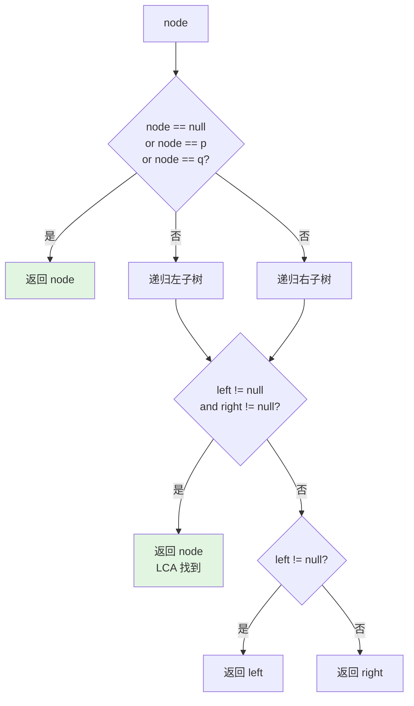

> 📊 **项目全面梳理**：详细的项目结构、模块详解和学习路径，请参阅 [`项目全面梳理-2025.md`](../../项目全面梳理-2025.md)

## 二叉树与BST / Binary Trees and BST

### 摘要 / Executive Summary

- 二叉树是面试中出场率最高的数据结构之一（约 15%），其递归特性既是考察重点也是学习难点。二叉搜索树（BST）通过在节点间维护有序性约束，将查找、插入、删除操作的期望复杂度降至 $O(\log n)$。
- 本文从形式化定义出发，通过 LeetCode 94（中序遍历）、104（最大深度）、226（翻转二叉树）、236（最近公共祖先）四道经典题目，展示递归思维与结构归纳法在面试中的系统应用。
- 核心学习目标：掌握"**信任递归**"的能力——假设子问题的解已知，专注于当前节点的处理逻辑。

### 关键术语与符号 / Glossary

| 术语 / Term | 定义 / Definition |
|-------------|-------------------|
| 二叉树 Binary Tree | 每个节点最多有两个子节点（左子节点和右子节点）的树结构 |
| BST 性质 BST Property | 对任意节点，左子树所有值 < 节点值 < 右子树所有值 |
| 结构归纳法 Structural Induction | 基于递归数据结构构造规则的归纳证明方法 |
| 最近公共祖先 LCA | 两个节点在树中深度最大的公共祖先节点 |
| 完全二叉树 Complete Binary Tree | 除最后一层外每层节点数均达最大，且最后一层节点靠左排列 |
| Morris 遍历 Morris Traversal | 利用线索化实现 $O(1)$ 空间复杂度的二叉树遍历 |

术语对齐与引用规范：`docs/术语与符号总表.md`，`01-基础理论/00-撰写规范与引用指南.md`

### 目录 / Table of Contents

- [二叉树与BST / Binary Trees and BST](#二叉树与bst--binary-trees-and-bst)
  - [摘要 / Executive Summary](#摘要--executive-summary)
  - [关键术语与符号 / Glossary](#关键术语与符号--glossary)
  - [目录 / Table of Contents](#目录--table-of-contents)
  - [交叉引用与依赖 / Cross-References and Dependencies](#交叉引用与依赖--cross-references-and-dependencies)
- [1. 形式化定义 / Formal Definitions](#1-形式化定义--formal-definitions)
  - [1.1 二叉树的形式化定义](#11-二叉树的形式化定义)
  - [1.2 二叉搜索树的形式化定义](#12-二叉搜索树的形式化定义)
  - [1.3 递归遍历的形式化定义](#13-递归遍历的形式化定义)
- [2. 核心思路与算法框架](#2-核心思路与算法框架)
  - [2.1 递归设计模式](#21-递归设计模式)
  - [2.2 迭代遍历：栈模拟递归](#22-迭代遍历栈模拟递归)
  - [2.3 LCA 的递归框架](#23-lca-的递归框架)
- [3. 经典题目详解](#3-经典题目详解)
  - [3.1 LeetCode 94 — Binary Tree Inorder Traversal](#31-leetcode-94--binary-tree-inorder-traversal)
    - [形式化规约 / Formal Specification](#形式化规约--formal-specification)
    - [核心思路 / Core Idea](#核心思路--core-idea)
    - [代码实现 / Code Implementations](#代码实现--code-implementations)
    - [复杂度分析 / Complexity Analysis](#复杂度分析--complexity-analysis)
  - [3.2 LeetCode 104 — Maximum Depth of Binary Tree](#32-leetcode-104--maximum-depth-of-binary-tree)
    - [形式化规约 / Formal Specification](#形式化规约--formal-specification-1)
    - [核心思路 / Core Idea](#核心思路--core-idea-1)
    - [代码实现 / Code Implementations](#代码实现--code-implementations-1)
    - [复杂度分析 / Complexity Analysis](#复杂度分析--complexity-analysis-1)
  - [3.3 LeetCode 226 — Invert Binary Tree](#33-leetcode-226--invert-binary-tree)
    - [形式化规约 / Formal Specification](#形式化规约--formal-specification-2)
    - [核心思路 / Core Idea](#核心思路--core-idea-2)
    - [代码实现 / Code Implementations](#代码实现--code-implementations-2)
    - [复杂度分析 / Complexity Analysis](#复杂度分析--complexity-analysis-2)
  - [3.4 LeetCode 236 — Lowest Common Ancestor of a Binary Tree](#34-leetcode-236--lowest-common-ancestor-of-a-binary-tree)
    - [形式化规约 / Formal Specification](#形式化规约--formal-specification-3)
    - [核心思路 / Core Idea](#核心思路--core-idea-3)
    - [代码实现 / Code Implementations](#代码实现--code-implementations-3)
    - [复杂度分析 / Complexity Analysis](#复杂度分析--complexity-analysis-3)
- [4. 复杂度分析体系](#4-复杂度分析体系)
  - [4.1 二叉树遍历复杂度](#41-二叉树遍历复杂度)
  - [4.2 BST 操作复杂度](#42-bst-操作复杂度)
- [5. 正确性证明框架](#5-正确性证明框架)
  - [5.1 递归遍历的正确性（结构归纳法）](#51-递归遍历的正确性结构归纳法)
  - [5.2 LCA 算法的正确性证明](#52-lca-算法的正确性证明)
- [6. 思维表征](#6-思维表征)
  - [6.1 二叉树概念依赖图](#61-二叉树概念依赖图)
  - [6.2 递归调用树示例（最大深度）](#62-递归调用树示例最大深度)
  - [6.3 LCA 递归决策图](#63-lca-递归决策图)
  - [6.4 公理定理证明树](#64-公理定理证明树)
- [7. 常见错误与反模式](#7-常见错误与反模式)
  - [7.1 递归终止条件错误](#71-递归终止条件错误)
  - [7.2 修改指针后丢失子树](#72-修改指针后丢失子树)
  - [7.3 混淆树高与节点数](#73-混淆树高与节点数)
  - [7.4 LCA 中未处理节点自身为祖先的情况](#74-lca-中未处理节点自身为祖先的情况)
- [8. 自测问题](#8-自测问题)
  - [问题 1：Morris 遍历的核心思想](#问题-1morris-遍历的核心思想)
  - [问题 2：BST 的验证](#问题-2bst-的验证)
  - [问题 3：递归与迭代的选型](#问题-3递归与迭代的选型)
- [9. 学习目标](#9-学习目标)
- [参考文献 / References](#参考文献--references)

### 交叉引用与依赖 / Cross-References and Dependencies

**上游理论依赖 / Upstream Dependencies**:

- [`09-算法理论/01-算法基础/02-数据结构理论.md`](../../09-算法理论/01-算法基础/02-数据结构理论.md) — 树形结构的理论定义
- `02-递归理论/01-递归基础.md` — 递归定义、结构归纳法
- `02-递归理论/02-递归正确性证明.md` — 递归算法的正确性证明方法

**下游应用 / Downstream Applications**:

- `13-LeetCode算法面试专题/02-算法范式专题/05-二分查找.md` — BST 查找是二分查找在树结构上的推广
- `13-LeetCode算法面试专题/05-图论专题/01-图的基本表示.md` — 树是特殊的图

---

## 1. 形式化定义 / Formal Definitions

### 1.1 二叉树的形式化定义

**定义 1.1** (二叉树 / Binary Tree) [Cormen 2022]
二叉树是一个有限的节点集合，要么为空，要么由一个根节点和两棵不相交的二叉树（左子树和右子树）组成。

形式化地，二叉树 $T$ 可以递归定义为：

$$
T = \emptyset \quad \text{或} \quad T = (r, T_L, T_R)
$$

其中 $r$ 是根节点，$T_L$ 是左子树，$T_R$ 是右子树。

```rust
// Rust 二叉树节点定义
#[derive(Debug, Clone)]
pub struct TreeNode<T> {
    pub val: T,
    pub left: Option<Box<TreeNode<T>>>,
    pub right: Option<Box<TreeNode<T>>>,
}
```

### 1.2 二叉搜索树的形式化定义

**定义 1.2** (二叉搜索树 / Binary Search Tree)
二叉搜索树是满足以下**BST 性质**的二叉树：

$$
\forall v \in T: \quad
\begin{cases}
\forall u \in T_L(v): u.val < v.val \\
\forall w \in T_R(v): w.val > v.val
\end{cases}
$$

其中 $T_L(v)$ 和 $T_R(v)$ 分别是节点 $v$ 的左子树和右子树。

**定理 1.1** (BST 中序遍历有序性): 对任意 BST，其中序遍历（左-根-右）产生严格递增序列。

**证明**: 对树高进行结构归纳法。

- **基例**: 空树或单节点树，中序遍历结果显然有序。
- **归纳假设**: 假设对任意高度 $< h$ 的 BST，中序遍历有序。
- **归纳步骤**: 对高度为 $h$ 的 BST，根为 $r$。由 BST 性质，左子树所有值 $< r.val <$ 右子树所有值。由归纳假设，左子树中序有序，右子树中序有序。因此整体中序遍历 = 左子树有序序列 + $[r.val]$ + 右子树有序序列，整体有序。$\square$

### 1.3 递归遍历的形式化定义

| 遍历方式 | 访问顺序 | 形式化定义 |
|---------|---------|-----------|
| 前序 Pre-order | 根-左-右 | $Preorder(T) = [r.val] + Preorder(T_L) + Preorder(T_R)$ |
| 中序 In-order | 左-根-右 | $Inorder(T) = Inorder(T_L) + [r.val] + Inorder(T_R)$ |
| 后序 Post-order | 左-右-根 | $Postorder(T) = Postorder(T_L) + Postorder(T_R) + [r.val]$ |

---

## 2. 核心思路与算法框架

### 2.1 递归设计模式

二叉树问题的递归设计遵循**"当前节点 + 左右子问题"**模式：

```text
function solve(node):
    if node is null:
        return base_case
    left_result = solve(node.left)
    right_result = solve(node.right)
    return combine(node, left_result, right_result)
```

**信任递归原则**: 假设 `solve(node.left)` 和 `solve(node.right)` 已经正确返回了子问题的解，只需要关注如何**组合**这些解。

### 2.2 迭代遍历：栈模拟递归

递归遍历的隐式调用栈可以显式模拟：

**中序遍历迭代模板**:

```text
current = root
stack = empty
while current != null or stack not empty:
    while current != null:
        stack.push(current)
        current = current.left
    current = stack.pop()
    visit(current)
    current = current.right
```

### 2.3 LCA 的递归框架

对于二叉树的 LCA 问题，递归函数返回当前子树中 `p` 和 `q` 的 LCA：

- 若当前节点为 `null` 或等于 `p` 或 `q`，返回当前节点
- 递归查找左子树和右子树
- 若左右子树均找到，当前节点即为 LCA
- 若仅一侧找到，返回该侧结果

---

## 3. 经典题目详解

### 3.1 LeetCode 94 — Binary Tree Inorder Traversal

> **题目链接 / Problem Link**: [LeetCode 94. Binary Tree Inorder Traversal](https://leetcode.com/problems/binary-tree-inorder-traversal/)
> **难度 / Difficulty**: Easy

#### 形式化规约 / Formal Specification

**输入 / Input**: 二叉树根节点 $root$。
**输出 / Output**: 中序遍历序列（左-根-右）。
**前置条件 / Precondition**: $root$ 指向一棵有限二叉树（可为空）。
**后置条件 / Postcondition**: 返回序列 $\langle v_1, v_2, \ldots, v_n \rangle$，满足中序遍历的定义。

#### 核心思路 / Core Idea

**方法：递归 / 栈迭代 / Morris 遍历**

递归版本最简洁。迭代版本用栈显式管理状态。Morris 遍历通过线索化达到 $O(1)$ 空间。

#### 代码实现 / Code Implementations

- **Python**: [`examples/algorithms-python/src/leetcode/lc0094_binary_tree_inorder_traversal.py`](../../../examples/algorithms-python/src/leetcode/lc0094_binary_tree_inorder_traversal.py)
- **Rust**: [`examples/algorithms/src/leetcode/lc0094_binary_tree_inorder_traversal.rs`](../../../examples/algorithms/src/leetcode/lc0094_binary_tree_inorder_traversal.rs)

```python
# Python 递归实现
def inorder_traversal(root: TreeNode) -> list[int]:
    result = []
    def dfs(node):
        if not node:
            return
        dfs(node.left)
        result.append(node.val)
        dfs(node.right)
    dfs(root)
    return result

# Python 迭代实现
def inorder_traversal_iter(root: TreeNode) -> list[int]:
    result = []
    stack = []
    curr = root
    while curr or stack:
        while curr:
            stack.append(curr)
            curr = curr.left
        curr = stack.pop()
        result.append(curr.val)
        curr = curr.right
    return result
```

```rust
// Rust 递归实现
use std::cell::RefCell;
use std::rc::Rc;

#[derive(Debug, Clone)]
pub struct TreeNode {
    pub val: i32,
    pub left: Option<Rc<RefCell<TreeNode>>>,
    pub right: Option<Rc<RefCell<TreeNode>>>,
}

pub fn inorder_traversal(root: Option<Rc<RefCell<TreeNode>>>) -> Vec<i32> {
    let mut result = Vec::new();
    fn dfs(node: &Option<Rc<RefCell<TreeNode>>>, result: &mut Vec<i32>) {
        if let Some(n) = node {
            let n = n.borrow();
            dfs(&n.left, result);
            result.push(n.val);
            dfs(&n.right, result);
        }
    }
    dfs(&root, &mut result);
    result
}
```

#### 复杂度分析 / Complexity Analysis

| 指标 / Metric | 递归 | 迭代 | Morris |
|--------------|------|------|--------|
| 时间复杂度 / Time | $O(n)$ | $O(n)$ | $O(n)$ |
| 空间复杂度 / Space | $O(h)$ | $O(h)$ | $O(1)$ |

其中 $h$ 为树高，$n$ 为节点数。

---

### 3.2 LeetCode 104 — Maximum Depth of Binary Tree

> **题目链接 / Problem Link**: [LeetCode 104. Maximum Depth of Binary Tree](https://leetcode.com/problems/maximum-depth-of-binary-tree/)
> **难度 / Difficulty**: Easy

#### 形式化规约 / Formal Specification

**输入 / Input**: 二叉树根节点 $root$。
**输出 / Output**: 二叉树的最大深度。
**前置条件 / Precondition**: $root$ 指向一棵有限二叉树（可为空）。
**后置条件 / Postcondition**: 返回 $\max_{v \in T} \text{depth}(v)$，其中 $\text{depth}(root) = 1$。

#### 核心思路 / Core Idea

**方法：递归**

树的最大深度 = $1 + \max(\text{左子树深度}, \text{右子树深度})$。
空树深度为 0。

#### 代码实现 / Code Implementations

- **Python**: [`examples/algorithms-python/src/leetcode/lc0104_maximum_depth_of_binary_tree.py`](../../../examples/algorithms-python/src/leetcode/lc0104_maximum_depth_of_binary_tree.py)
- **Go**: [`examples/algorithms-go/leetcode/lc0104_maximum_depth_of_binary_tree.go`](../../../examples/algorithms-go/leetcode/lc0104_maximum_depth_of_binary_tree.go)

```python
# Python 递归实现
def max_depth(root: TreeNode) -> int:
    if not root:
        return 0
    return 1 + max(max_depth(root.left), max_depth(root.right))
```

```go
// Go 递归实现
type TreeNode struct {
    Val   int
    Left  *TreeNode
    Right *TreeNode
}

func maxDepth(root *TreeNode) int {
    if root == nil {
        return 0
    }
    leftDepth := maxDepth(root.Left)
    rightDepth := maxDepth(root.Right)
    if leftDepth > rightDepth {
        return 1 + leftDepth
    }
    return 1 + rightDepth
}
```

#### 复杂度分析 / Complexity Analysis

| 指标 / Metric | 值 / Value | 说明 / Note |
|--------------|-----------|------------|
| 时间复杂度 / Time | $O(n)$ | 每个节点访问一次 |
| 空间复杂度 / Space | $O(h)$ | 递归栈深度，$h$ 为树高 |

---

### 3.3 LeetCode 226 — Invert Binary Tree

> **题目链接 / Problem Link**: [LeetCode 226. Invert Binary Tree](https://leetcode.com/problems/invert-binary-tree/)
> **难度 / Difficulty**: Easy

#### 形式化规约 / Formal Specification

**输入 / Input**: 二叉树根节点 $root$。
**输出 / Output**: 翻转后的二叉树根节点。
**前置条件 / Precondition**: $root$ 指向一棵有限二叉树（可为空）。
**后置条件 / Postcondition**: 返回的二叉树是原树的镜像，即左右子树互换。

#### 核心思路 / Core Idea

**方法：递归后序遍历**

先递归翻转左子树和右子树，然后交换当前节点的左右子节点指针。

#### 代码实现 / Code Implementations

- **Python**: [`examples/algorithms-python/src/leetcode/lc0226_invert_binary_tree.py`](../../../examples/algorithms-python/src/leetcode/lc0226_invert_binary_tree.py)
- **Rust**: [`examples/algorithms/src/leetcode/lc0226_invert_binary_tree.rs`](../../../examples/algorithms/src/leetcode/lc0226_invert_binary_tree.rs)

```python
# Python 递归实现
def invert_tree(root: TreeNode) -> TreeNode:
    if not root:
        return None
    invert_tree(root.left)
    invert_tree(root.right)
    root.left, root.right = root.right, root.left
    return root
```

```rust
// Rust 递归实现
use std::cell::RefCell;
use std::rc::Rc;

pub fn invert_tree(root: Option<Rc<RefCell<TreeNode>>>) -> Option<Rc<RefCell<TreeNode>>> {
    if let Some(node) = root {
        let mut n = node.borrow_mut();
        let left = n.left.take();
        let right = n.right.take();
        n.left = invert_tree(right);
        n.right = invert_tree(left);
        drop(n);
        Some(node)
    } else {
        None
    }
}
```

#### 复杂度分析 / Complexity Analysis

| 指标 / Metric | 值 / Value | 说明 / Note |
|--------------|-----------|------------|
| 时间复杂度 / Time | $O(n)$ | 每个节点访问一次 |
| 空间复杂度 / Space | $O(h)$ | 递归栈深度 |

---

### 3.4 LeetCode 236 — Lowest Common Ancestor of a Binary Tree

> **题目链接 / Problem Link**: [LeetCode 236. Lowest Common Ancestor of a Binary Tree](https://leetcode.com/problems/lowest-common-ancestor-of-a-binary-tree/)
> **难度 / Difficulty**: Medium

#### 形式化规约 / Formal Specification

**输入 / Input**: 二叉树根节点 $root$，以及两个目标节点 $p, q$。
**输出 / Output**: $p$ 和 $q$ 的最近公共祖先节点。
**前置条件 / Precondition**: $p$ 和 $q$ 均存在于树中，且 $p \neq q$。
**后置条件 / Postcondition**: 返回节点 $lca$ 满足：

1. $lca$ 是 $p$ 和 $q$ 的公共祖先（$p$ 和 $q$ 均在以 $lca$ 为根的子树中）
2. $lca$ 的深度最大（即最接近 $p$ 和 $q$）

#### 核心思路 / Core Idea

**方法：递归后序遍历**

递归函数 `lca(node, p, q)` 返回以 `node` 为根的子树中 $p$ 和 $q$ 的 LCA（若存在）。

- 若 `node == null` 或 `node == p` 或 `node == q`，返回 `node`
- `left = lca(node.left, p, q)`
- `right = lca(node.right, p, q)`
- 若 `left != null && right != null`，说明 $p$ 和 $q$ 分别在左右子树，`node` 就是 LCA
- 若仅一侧非空，返回该侧结果

#### 代码实现 / Code Implementations

- **Python**: [`examples/algorithms-python/src/leetcode/lc0236_lowest_common_ancestor.py`](../../../examples/algorithms-python/src/leetcode/lc0236_lowest_common_ancestor.py)
- **Rust**: [`examples/algorithms/src/leetcode/lc0236_lowest_common_ancestor.rs`](../../../examples/algorithms/src/leetcode/lc0236_lowest_common_ancestor.rs)

```python
# Python 递归实现
def lowest_common_ancestor(root: TreeNode, p: TreeNode, q: TreeNode) -> TreeNode:
    if not root or root == p or root == q:
        return root
    left = lowest_common_ancestor(root.left, p, q)
    right = lowest_common_ancestor(root.right, p, q)
    if left and right:
        return root
    return left if left else right
```

```rust
// Rust 递归实现
use std::cell::RefCell;
use std::rc::Rc;

pub fn lowest_common_ancestor(
    root: Option<Rc<RefCell<TreeNode>>>,
    p: Option<Rc<RefCell<TreeNode>>>,
    q: Option<Rc<RefCell<TreeNode>>>,
) -> Option<Rc<RefCell<TreeNode>>> {
    if root.is_none() {
        return None;
    }
    let r = root.clone().unwrap();
    let rv = r.borrow();
    if Some(r.clone()) == p || Some(r.clone()) == q {
        return Some(r.clone());
    }
    drop(rv);
    let left = lowest_common_ancestor(r.borrow().left.clone(), p.clone(), q.clone());
    let right = lowest_common_ancestor(r.borrow().right.clone(), p.clone(), q.clone());
    if left.is_some() && right.is_some() {
        return Some(r.clone());
    }
    left.or(right)
}
```

#### 复杂度分析 / Complexity Analysis

| 指标 / Metric | 值 / Value | 说明 / Note |
|--------------|-----------|------------|
| 时间复杂度 / Time | $O(n)$ | 最坏情况下遍历所有节点 |
| 空间复杂度 / Space | $O(h)$ | 递归栈深度 |

---

## 4. 复杂度分析体系

### 4.1 二叉树遍历复杂度

| 遍历方式 | 时间复杂度 | 空间复杂度（递归） | 空间复杂度（迭代） | 空间复杂度（Morris） |
|---------|-----------|-----------------|-----------------|-------------------|
| 前序 | $O(n)$ | $O(h)$ | $O(h)$ | $O(1)$ |
| 中序 | $O(n)$ | $O(h)$ | $O(h)$ | $O(1)$ |
| 后序 | $O(n)$ | $O(h)$ | $O(h)$ | $O(1)$ |
| 层序 | $O(n)$ | — | $O(w)$ | — |

其中 $h$ 为树高，$w$ 为最大层宽。平衡二叉树 $h = O(\log n)$，退化为链表时 $h = O(n)$。

### 4.2 BST 操作复杂度

| 操作 | 平均情况 | 最坏情况（退化） | 说明 |
|-----|---------|---------------|------|
| 查找 | $O(\log n)$ | $O(n)$ | 依赖树高 |
| 插入 | $O(\log n)$ | $O(n)$ | 先查找再插入 |
| 删除 | $O(\log n)$ | $O(n)$ | 需处理子树嫁接 |
| 查找最值 | $O(\log n)$ | $O(n)$ | 沿最左/最右路径 |
| 中序遍历 | $O(n)$ | $O(n)$ | 访问每个节点一次 |

---

## 5. 正确性证明框架

### 5.1 递归遍历的正确性（结构归纳法）

**定理 5.1** (中序遍历正确性): 递归中序遍历算法恰好访问二叉树中的每个节点一次，且访问顺序满足"左-根-右"。

**证明 / Proof**:

对树的结构进行归纳。

**基例**: 空树。算法直接返回，访问序列为空，正确。

**归纳假设**: 假设对任意节点数 $< n$ 的二叉树，中序遍历正确。

**归纳步骤**: 对节点数为 $n$ 的二叉树，根为 $r$，左子树 $T_L$ 有 $n_L$ 个节点，右子树 $T_R$ 有 $n_R$ 个节点，$n_L + n_R + 1 = n$。

算法执行：

1. 递归中序遍历 $T_L$：由归纳假设，产生 $T_L$ 的左-根-右序列
2. 访问 $r$：将 $r.val$ 加入序列
3. 递归中序遍历 $T_R$：由归纳假设，产生 $T_R$ 的左-根-右序列

最终序列 = $Inorder(T_L) + [r.val] + Inorder(T_R)$，完全符合中序遍历定义。且每个节点恰好被访问一次。$\square$

### 5.2 LCA 算法的正确性证明

**定理 5.2** (LCA 正确性): 递归算法正确返回二叉树中两个节点 $p$ 和 $q$ 的最近公共祖先。

**证明 / Proof**:

对树高进行结构归纳法。

**基例**: 空树。返回 `null`，正确。

**归纳假设**: 假设对任意高度 $< h$ 的子树，算法正确返回该子树中 $p$ 和 $q$ 的 LCA。

**归纳步骤**: 对高度为 $h$ 的树，根为 $r$。

**情况 A**: $r = p$ 或 $r = q$。此时 $r$ 是其中一个节点的祖先，也是最深的公共祖先（因为另一个节点在子树中），返回 $r$ 正确。

**情况 B**: $r \neq p$ 且 $r \neq q$。递归查找左右子树：

- 若 `left != null && right != null`：$p$ 和 $q$ 分别位于左右子树中。$r$ 是公共祖先，且任何更深的节点不可能同时在两棵子树中，因此 $r$ 是最近公共祖先。正确。
- 若仅 `left != null`：$p$ 和 $q$ 均在左子树中（或其中之一为 `null` 但题目保证均存在）。由归纳假设，`left` 已经是左子树中的 LCA，返回 `left` 正确。
- 若仅 `right != null`：对称地，返回 `right` 正确。

所有情况均正确，证毕。$\square$

---

## 6. 思维表征

### 6.1 二叉树概念依赖图

```mermaid
flowchart TD
    A[二叉树定义<br/>根 + 左子树 + 右子树] --> B[递归遍历]
    A --> C[BST 性质]
    B --> D[前序<br/>根左右]
    B --> E[中序<br/>左右根]
    B --> F[后序<br/>左右根]
    B --> G[层序<br/>BFS]
    C --> H[BST 查找 O(log n)]
    C --> I[BST 插入 O(log n)]
    C --> J[BST 删除 O(log n)]
    E --> K[中序有序性定理]
    F --> L[LCA 算法]
    D --> M[序列化/反序列化]
    G --> N[最大深度]
    L --> O[树中节点距离]
```

### 6.2 递归调用树示例（最大深度）

```mermaid
flowchart TD
    R[root<br/>depth = 1 + max(left, right)] --> L[left subtree]
    R --> RI[right subtree]
    L --> LL[...]
    L --> LR[...]
    RI --> RL[...]
    RI --> RR[...]

    style R fill:#e1f5e1
    style L fill:#fff3cd
    style RI fill:#fff3cd
```

### 6.3 LCA 递归决策图



### 6.4 公理定理证明树

```mermaid
flowchart BT
    A1[公理: 递归定义良基性] --> B1[定理: 结构归纳法有效]
    A2[公理: BST 局部有序性] --> B2[定理: BST 中序遍历全局有序]
    B1 --> C1[定理: 中序遍历正确性]
    B1 --> C2[定理: 最大深度正确性]
    B1 --> C3[定理: 翻转二叉树正确性]
    B1 --> C4[定理: LCA 正确性]
    B2 --> D1[引理: BST 查找路径唯一]
    D1 --> E1[定理: BST 查找 O(h)]
    C4 --> F1[推论: 树中节点距离可计算]

    style B1 fill:#e1f5e1
    style B2 fill:#e1f5e1
    style C1 fill:#e1f5e1
    style C2 fill:#e1f5e1
    style C3 fill:#e1f5e1
    style C4 fill:#e1f5e1
    style E1 fill:#d4edda
    style F1 fill:#d4edda
```

---

## 7. 常见错误与反模式

### 7.1 递归终止条件错误

**错误 / Mistake**: 将 `if not root.left` 作为递归终止条件，导致无法处理单孩子节点。

```python
# 错误
def max_depth(root):
    if not root.left and not root.right:  # ❌ 单孩子节点会进入错误分支
        return 1
    # ...

# 正确
def max_depth(root):
    if not root:  # ✅ 空树是唯一的基例
        return 0
    return 1 + max(max_depth(root.left), max_depth(root.right))
```

### 7.2 修改指针后丢失子树

**错误 / Mistake**: 在翻转二叉树时，先交换指针再递归，导致子树丢失。

```python
# 错误
def invert_tree(root):
    if not root:
        return None
    root.left, root.right = root.right, root.left  # ❌ 已经交换了，下面递归的是错误的子树
    invert_tree(root.left)   # 此时 root.left 是原来的右子树
    invert_tree(root.right)  # 此时 root.right 是原来的左子树
    # 逻辑上是对的，但容易混淆；更好的做法是先递归再交换

# 更清晰的做法
def invert_tree(root):
    if not root:
        return None
    invert_tree(root.left)
    invert_tree(root.right)
    root.left, root.right = root.right, root.left  # ✅ 递归完成后再交换
    return root
```

### 7.3 混淆树高与节点数

**错误 / Mistake**: 计算最大深度时返回节点数而非层数。

```python
# 错误：返回了节点数
def max_depth(root):
    if not root:
        return 0
    left = max_depth(root.left)
    right = max_depth(root.right)
    return left + right + 1  # ❌ 这是节点总数

# 正确
def max_depth(root):
    if not root:
        return 0
    return 1 + max(max_depth(root.left), max_depth(root.right))
```

### 7.4 LCA 中未处理节点自身为祖先的情况

**错误 / Mistake**: 在 LCA 算法中，未将 `node == p or node == q` 作为返回条件，导致当 $p$ 是 $q$ 的祖先时返回错误。

```python
# 错误
def lca(root, p, q):
    if not root:
        return None
    left = lca(root.left, p, q)
    right = lca(root.right, p, q)
    if left and right:
        return root
    # ❌ 未处理 root == p 或 root == q 的情况

# 正确
def lca(root, p, q):
    if not root or root == p or root == q:
        return root
    # ...
```

---

## 8. 自测问题

### 问题 1：Morris 遍历的核心思想

**Q**: Morris 遍历如何做到 $O(1)$ 空间复杂度？其时间复杂度是否仍然是 $O(n)$？

**A**: Morris 遍历利用**线索化（Threading）**思想：在中序遍历的前驱节点的右子树为空时，临时将其右指针指向当前节点，形成一条"返回路径"。遍历完成后恢复树的原始结构。

时间复杂度仍为 $O(n)$。虽然某些边会被访问两次（建立线索和撤销线索），但每个节点最多被访问常数次，因此总时间为 $O(n)$。

### 问题 2：BST 的验证

**Q**: 如何判断一棵二叉树是否是 BST？

**A**: 不能仅比较当前节点与左右孩子，需要传递**上下界**约束。对当前节点，其值必须在 $(\text{lower}, \text{upper})$ 范围内：

- 根节点范围为 $(-\infty, +\infty)$
- 左孩子范围为 $(\text{lower}, \text{node.val})$
- 右孩子范围为 $(\text{node.val}, \text{upper})$

或者利用中序遍历有序性：中序遍历结果应为严格递增序列。

### 问题 3：递归与迭代的选型

**Q**: 二叉树问题中，什么时候应该优先使用递归，什么时候应该优先使用迭代？

**A**:

- **优先递归**: 问题的定义天然递归（如树高、LCA、路径和），且树深不会导致栈溢出（平衡树或节点数 $< 10^4$）
- **优先迭代**: 树可能退化为链表（深度 $> 10^5$），需要避免栈溢出；或者需要显式控制遍历状态（如 Morris 遍历、颜色标记法）

---

## 9. 学习目标

完成本章学习后，读者应能够：

1. **形式化描述**二叉树和 BST 的定义，理解 BST 性质的递归结构。
2. **熟练运用**三种递归遍历（前序、中序、后序）解决具体问题，并能写出对应的迭代版本。
3. **应用结构归纳法**证明树算法的正确性，独立完成从基例到归纳步骤的完整推导。
4. **理解 LCA 算法**的递归逻辑，能够向面试官解释其正确性。
5. **识别并避免**二叉树问题中的常见陷阱（终止条件、指针丢失、深度计算等）。

---

## 参考文献 / References

- [Cormen 2022]: Cormen, T. H., et al. (2022). *Introduction to Algorithms* (4th ed.). MIT Press.
- [Knuth 1997]: Knuth, D. E. (1997). *The Art of Computer Programming, Volume 1*. Addison-Wesley.
- Morris, J. M. (1979). "Traversing Binary Trees Simply and Cheaply." *Information Processing Letters*, 9(5), 197-200.
- LeetCode 236 官方题解：<https://leetcode.com/problems/lowest-common-ancestor-of-a-binary-tree/solution/>

<!-- 自动添加的代码引用 -->
- [`lc0236_lowest_common_ancestor.rs`](../../../examples/algorithms-rust/src/leetcode/lc0236_lowest_common_ancestor.rs)

<!-- 自动添加的代码引用 -->
- [`lc0104_maximum_depth_of_binary_tree.rs`](../../../examples/algorithms/src/leetcode/lc0104_maximum_depth_of_binary_tree.rs)

<!-- 自动添加的代码引用 -->
- [`lc0104_maximum_depth_of_binary_tree.lean`](../../../examples/lean_proofs/FormalAlgorithm/leetcode/lc0104_maximum_depth_of_binary_tree.lean)

<!-- 自动补充的代码引用 -->
- [`lc0102_binary_tree_level_order.py`](../../../examples/algorithms-python/src/leetcode/lc0102_binary_tree_level_order.py)

<!-- 自动补充的代码引用 -->
- [`lc0102_binary_tree_level_order.rs`](../../../examples/algorithms/src/leetcode/lc0102_binary_tree_level_order.rs)
