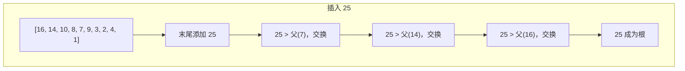

> 📊 **项目全面梳理**：详细的项目结构、模块详解和学习路径，请参阅 [`项目全面梳理-2025.md`](../../项目全面梳理-2025.md)

## 堆与优先队列 / Heap and Priority Queue

### 摘要 / Executive Summary

- 堆（Heap）是一种基于**完全二叉树**的结构，满足堆序性（大根堆：父 $\geq$ 子；小根堆：父 $\leq$ 子）。优先队列（Priority Queue）是堆的抽象数据类型表述，支持 $O(\log n)$ 的插入和删除最值操作。
- 本文从形式化定义出发，严格推导堆操作（插入/删除）的复杂度，深入剖析 LeetCode 215（数组中的第 K 个最大元素）、23（合并 K 个升序链表）、295（数据流的中位数）三道经典题目。
- 核心学习目标：掌握**堆不变式的维护技巧**，理解双堆不变式在数据流问题中的应用，能够对比快速选择与堆选择的复杂度差异。

### 关键术语与符号 / Glossary

| 术语 / Term | 定义 / Definition |
|-------------|-------------------|
| 完全二叉树 Complete Binary Tree | 除最后一层外所有层均被填满，且最后一层节点集中在左侧的二叉树 |
| 堆序性 Heap Property | 大根堆：$\forall v \neq \text{root}: v.val \leq v.parent.val$；小根堆则相反 |
| 优先队列 ADT | 抽象数据类型，支持 `insert`、`extract_max`/`extract_min`、`peek` 操作 |
| 堆化 Heapify | 将无序序列调整为满足堆序性的过程 |
| 快速选择 Quickselect | 基于快速排序 partition 思想的选择算法，期望 $O(n)$ |
| 双堆技巧 Two-Heap Technique | 用最大堆维护较小半区、最小堆维护较大半区，求解中位数等问题 |

术语对齐与引用规范：`docs/术语与符号总表.md`，`01-基础理论/00-撰写规范与引用指南.md`

### 目录 / Table of Contents

- [堆与优先队列 / Heap and Priority Queue](#堆与优先队列--heap-and-priority-queue)
  - [摘要 / Executive Summary](#摘要--executive-summary)
  - [关键术语与符号 / Glossary](#关键术语与符号--glossary)
  - [目录 / Table of Contents](#目录--table-of-contents)
  - [交叉引用与依赖 / Cross-References and Dependencies](#交叉引用与依赖--cross-references-and-dependencies)
- [1. 形式化定义 / Formal Definitions](#1-形式化定义--formal-definitions)
  - [1.1 完全二叉树的形式化定义](#11-完全二叉树的形式化定义)
  - [1.2 堆的形式化定义](#12-堆的形式化定义)
  - [1.3 优先队列 ADT](#13-优先队列-adt)
- [2. 核心思路与算法框架](#2-核心思路与算法框架)
  - [2.1 堆的数组表示](#21-堆的数组表示)
  - [2.2 堆操作框架](#22-堆操作框架)
  - [2.3 双堆技巧框架](#23-双堆技巧框架)
- [3. 经典题目详解](#3-经典题目详解)
  - [3.1 LeetCode 215 — 数组中的第K个最大元素](#31-leetcode-215--数组中的第k个最大元素)
    - [形式化规约 / Formal Specification](#形式化规约--formal-specification)
    - [核心思路 / Core Idea](#核心思路--core-idea)
    - [代码实现 / Code Implementations](#代码实现--code-implementations)
    - [复杂度分析 / Complexity Analysis](#复杂度分析--complexity-analysis)
    - [正确性证明 / Correctness Proof](#正确性证明--correctness-proof)
  - [3.2 LeetCode 23 — 合并K个升序链表](#32-leetcode-23--合并k个升序链表)
    - [形式化规约 / Formal Specification](#形式化规约--formal-specification-1)
    - [核心思路 / Core Idea](#核心思路--core-idea-1)
    - [代码实现 / Code Implementations](#代码实现--code-implementations-1)
    - [复杂度分析 / Complexity Analysis](#复杂度分析--complexity-analysis-1)
    - [正确性证明 / Correctness Proof](#正确性证明--correctness-proof-1)
  - [3.3 LeetCode 295 — 数据流的中位数](#33-leetcode-295--数据流的中位数)
    - [形式化规约 / Formal Specification](#形式化规约--formal-specification-2)
    - [核心思路 / Core Idea](#核心思路--core-idea-2)
    - [代码实现 / Code Implementations](#代码实现--code-implementations-2)
    - [复杂度分析 / Complexity Analysis](#复杂度分析--complexity-analysis-2)
    - [正确性证明 / Correctness Proof](#正确性证明--correctness-proof-2)
- [4. 复杂度分析体系](#4-复杂度分析体系)
  - [4.1 堆操作复杂度严格推导](#41-堆操作复杂度严格推导)
  - [4.2 快速选择 vs 堆选择对比](#42-快速选择-vs-堆选择对比)
- [5. 正确性证明框架](#5-正确性证明框架)
  - [5.1 堆不变式通用模式](#51-堆不变式通用模式)
- [6. 思维表征](#6-思维表征)
  - [6.1 概念依赖图](#61-概念依赖图)
  - [6.2 堆操作过程图](#62-堆操作过程图)
  - [6.3 双堆中位数维护图](#63-双堆中位数维护图)
  - [6.4 公理定理证明树](#64-公理定理证明树)
- [7. 常见错误与反模式](#7-常见错误与反模式)
  - [7.1 堆序性方向混淆](#71-堆序性方向混淆)
  - [7.2 忘记平衡双堆](#72-忘记平衡双堆)
  - [7.3 用排序代替堆](#73-用排序代替堆)
- [8. 自测问题](#8-自测问题)
  - [问题 1：堆与 BST 的对比](#问题-1堆与-bst-的对比)
  - [问题 2：为什么建堆是 $O(n)$ 而非 $O(n \\log n)$](#问题-2为什么建堆是-on-而非-on-log-n)
  - [问题 3：快速选择的 pivot 选择策略](#问题-3快速选择的-pivot-选择策略)
  - [问题 4：堆排序的稳定性](#问题-4堆排序的稳定性)
- [9. 学习目标](#9-学习目标)
- [参考文献 / References](#参考文献--references)

### 交叉引用与依赖 / Cross-References and Dependencies

**上游理论依赖 / Upstream Dependencies**:

- [`09-算法理论/01-算法基础/02-数据结构理论.md`](../../09-算法理论/01-算法基础/02-数据结构理论.md) — 树与堆的理论定义
- [`04-算法复杂度/01-时间复杂度.md`](../../04-算法复杂度/01-时间复杂度.md) — 时间复杂度分析
- `02-递归理论/01-递归基础.md` — 递归与归纳证明

**下游应用 / Downstream Applications**:

- `13-LeetCode算法面试专题/01-数据结构专题/07-并查集.md` — 并查集与堆的结合应用（如 Kruskal 算法）
- `13-LeetCode算法面试专题/02-算法范式专题/05-二分查找.md` — 中位数问题与二分查找的对比

---

## 1. 形式化定义 / Formal Definitions

### 1.1 完全二叉树的形式化定义

**定义 1.1** (完全二叉树 / Complete Binary Tree)
一棵高度为 $h$ 的二叉树是**完全**的，当且仅当：

1. 第 $0$ 层到第 $h-1$ 层的所有节点都有恰好两个子节点（满）
2. 第 $h$ 层的所有节点都集中在左侧

**性质**：高度为 $h$ 的完全二叉树，节点数 $n$ 满足：

$$
2^h \leq n \leq 2^{h+1} - 1
$$

因此树高 $h = \lfloor \log_2 n \rfloor = O(\log n)$。

### 1.2 堆的形式化定义

**定义 1.2** (大根堆 / Max-Heap)
大根堆是完全二叉树，满足**堆序性（Heap Property）**：

$$
\forall v \neq \text{root}: v.val \leq v.parent.val
$$

即每个节点的值不大于其父节点的值。根节点是全局最大值。

**定义 1.3** (小根堆 / Min-Heap)
小根堆是完全二叉树，满足：

$$
\forall v \neq \text{root}: v.val \geq v.parent.val
$$

根节点是全局最小值。

### 1.3 优先队列 ADT

**定义 1.4** (优先队列 / Priority Queue)
优先队列是抽象数据类型 $PQ = (D, O)$，其中：

- $D$：元素集合，每个元素关联一个优先级（键值）
- $O = \{\text{insert}(x), \text{extract\_max}(), \text{peek\_max}(), \text{is\_empty}()\}$

**操作语义**：

| 操作 | 前置条件 | 后置条件 | 时间复杂度 |
|------|---------|---------|-----------|
| `insert(x)` | — | 将 $x$ 加入集合 | $O(\log n)$ |
| `extract_max()` | 非空 | 移除并返回最大优先级元素 | $O(\log n)$ |
| `peek_max()` | 非空 | 返回最大优先级元素 | $O(1)$ |

---

## 2. 核心思路与算法框架

### 2.1 堆的数组表示

完全二叉树可以用数组紧凑存储，无需指针：

- 根节点在索引 $0$（或 $1$）
- 节点 $i$ 的左子节点在 $2i + 1$
- 节点 $i$ 的右子节点在 $2i + 2$
- 节点 $i$ 的父节点在 $\lfloor (i-1)/2 \rfloor$

```text
数组: [16, 14, 10, 8, 7, 9, 3, 2, 4, 1]
树形:
        16
      /    \
    14      10
   /  \    /  \
  8    7  9    3
 / \   /
2   4 1
```

### 2.2 堆操作框架

**上浮（Sift Up / Bubble Up）**：

```text
SiftUp(A, i):
    while i > 0 and A[parent(i)] < A[i]:   # 大根堆
        swap(A[parent(i)], A[i])
        i = parent(i)
```

**下沉（Sift Down / Bubble Down）**：

```text
SiftDown(A, i, n):
    while True:
        largest = i
        left = 2*i + 1
        right = 2*i + 2
        if left < n and A[left] > A[largest]:
            largest = left
        if right < n and A[right] > A[largest]:
            largest = right
        if largest == i: break
        swap(A[i], A[largest])
        i = largest
```

### 2.3 双堆技巧框架

**问题场景**：维护数据流的中位数，或维护动态集合的"中间"元素。

**双堆不变式**：

$$
\text{max\_heap.size} = \text{min\_heap.size} \quad \text{或} \quad \text{max\_heap.size} = \text{min\_heap.size} + 1
$$

$$
\forall x \in \text{max\_heap}, \forall y \in \text{min\_heap}: x \leq y
$$

**中位数查询**：

- 若两堆大小相等：$\text{median} = (\text{max\_heap.top} + \text{min\_heap.top}) / 2$
- 若 `max_heap` 更大：$\text{median} = \text{max\_heap.top}$

---

## 3. 经典题目详解

### 3.1 LeetCode 215 — 数组中的第K个最大元素

> **题目链接 / Problem Link**: [LeetCode 215. Kth Largest Element in an Array](https://leetcode.com/problems/kth-largest-element-in-an-array/)
> **难度 / Difficulty**: Medium

#### 形式化规约 / Formal Specification

**输入 / Input**: 整数数组 $nums$ 和正整数 $k$。
**输出 / Output**: 数组中第 $k$ 个最大的元素（即排序后倒数第 $k$ 个元素）。
**前置条件 / Precondition**: $1 \leq k \leq |nums| \leq 10^5$。

#### 核心思路 / Core Idea

**方法一：最小堆（维护 Top-K）**

维护一个大小为 $k$ 的最小堆。遍历数组：

- 若堆大小 $< k$，直接插入
- 若堆大小 $= k$ 且当前元素 $>$ 堆顶，弹出堆顶并插入当前元素

最终堆顶即为第 $k$ 大元素。

**方法二：快速选择（Quickselect）**

基于快速排序的 `partition` 思想，每次将数组分为大于 pivot 和小于 pivot 的两部分。根据 $k$ 与 pivot 位置的关系，只递归处理一半。

#### 代码实现 / Code Implementations

```python
# Python 参考实现（最小堆）
import heapq

def find_kth_largest_heap(nums: list[int], k: int) -> int:
    min_heap = []
    for num in nums:
        heapq.heappush(min_heap, num)
        if len(min_heap) > k:
            heapq.heappop(min_heap)
    return min_heap[0]

# Python 参考实现（快速选择）
def find_kth_largest_quickselect(nums: list[int], k: int) -> int:
    def partition(l: int, r: int) -> int:
        pivot = nums[r]
        i = l
        for j in range(l, r):
            if nums[j] >= pivot:
                nums[i], nums[j] = nums[j], nums[i]
                i += 1
        nums[i], nums[r] = nums[r], nums[i]
        return i

    def select(l: int, r: int, k_smallest: int) -> int:
        if l == r:
            return nums[l]
        p = partition(l, r)
        if k_smallest == p:
            return nums[p]
        elif k_smallest < p:
            return select(l, p - 1, k_smallest)
        else:
            return select(p + 1, r, k_smallest)

    return select(0, len(nums) - 1, k - 1)
```

```rust
// Rust 参考实现（最小堆）
use std::collections::BinaryHeap;
use std::cmp::Reverse;

pub fn find_kth_largest(nums: Vec<i32>, k: i32) -> i32 {
    let k = k as usize;
    let mut heap = BinaryHeap::new();
    for num in nums {
        heap.push(Reverse(num));
        if heap.len() > k {
            heap.pop();
        }
    }
    heap.pop().unwrap().0
}
```

```go
// Go 参考实现（最小堆）
import "container/heap"

type IntHeap []int

func (h IntHeap) Len() int           { return len(h) }
func (h IntHeap) Less(i, j int) bool { return h[i] < h[j] }
func (h IntHeap) Swap(i, j int)      { h[i], h[j] = h[j], h[i] }
func (h *IntHeap) Push(x interface{}) { *h = append(*h, x.(int)) }
func (h *IntHeap) Pop() interface{} {
    old := *h
    n := len(old)
    x := old[n-1]
    *h = old[:n-1]
    return x
}

func findKthLargest(nums []int, k int) int {
    h := &IntHeap{}
    heap.Init(h)
    for _, num := range nums {
        heap.Push(h, num)
        if h.Len() > k {
            heap.Pop(h)
        }
    }
    return (*h)[0]
}
```

#### 复杂度分析 / Complexity Analysis

| 方法 | 时间复杂度 | 空间复杂度 | 说明 |
|------|-----------|-----------|------|
| 最小堆 | $O(n \log k)$ | $O(k)$ | 维护大小为 $k$ 的堆 |
| 快速选择 | $O(n)$ 期望 | $O(1)$ | 最坏 $O(n^2)$，可优化为确定性 $O(n)$ |
| 排序 | $O(n \log n)$ | $O(1)$ / $O(\log n)$ | 最直接但非最优 |

#### 正确性证明 / Correctness Proof

**定理 3.1.1** (最小堆求第 K 大正确性): 遍历结束后，大小为 $k$ 的最小堆的堆顶即为第 $k$ 大元素。

**证明 / Proof**:

**循环不变式**：处理完数组前 $i$ 个元素后，最小堆中恰好保存着这 $i$ 个元素中最大的 $k$ 个（若 $i < k$ 则保存全部 $i$ 个），且堆顶是这 $k$ 个中的最小值。

**初始化**: $i = 0$ 时堆为空，不变式平凡成立。

**保持**: 处理 $nums[i]$ 时：

- 若堆大小 $< k$，直接插入。此时堆保存了前 $i+1$ 个元素中最大的 $\min(k, i+1)$ 个。
- 若堆大小 $= k$：
  - 若 $nums[i] \leq$ 堆顶，则 $nums[i]$ 不可能属于前 $i+1$ 个元素中最大的 $k$ 个（堆中已有 $k$ 个更大的），丢弃。
  - 若 $nums[i] >$ 堆顶，弹出堆顶（前 $k$ 大中的最小值）并插入 $nums[i]$。此时堆中仍是前 $i+1$ 个元素中最大的 $k$ 个。

**终止**: $i = n$ 时，堆中保存了全局最大的 $k$ 个元素，堆顶是这 $k$ 个中的最小值，即第 $k$ 大元素。$\square$

---

### 3.2 LeetCode 23 — 合并K个升序链表

> **题目链接 / Problem Link**: [LeetCode 23. Merge k Sorted Lists](https://leetcode.com/problems/merge-k-sorted-lists/)
> **难度 / Difficulty**: Hard

#### 形式化规约 / Formal Specification

**输入 / Input**: $k$ 个升序链表的头节点数组 $lists[0..k-1]$。
**输出 / Output**: 合并后的单一升序链表头节点。
**前置条件 / Precondition**: 每个链表内部按非降序排列。

#### 核心思路 / Core Idea

**最小堆多路归并**：维护一个大小为 $k$ 的最小堆，堆中元素为各链表的当前头节点。每次取出堆顶节点（当前最小值）加入结果链表，并将该节点所在链表的下一个节点入堆。

**多路归并正确性**：每次从 $k$ 个候选头节点中选择最小者，保证了结果链表的有序性。

#### 代码实现 / Code Implementations

```python
# Python 参考实现
import heapq

class ListNode:
    def __init__(self, val=0, next=None):
        self.val = val
        self.next = next
    def __lt__(self, other):
        return self.val < other.val

def merge_k_lists(lists: list[ListNode]) -> ListNode:
    min_heap = []
    for i, node in enumerate(lists):
        if node:
            heapq.heappush(min_heap, (node.val, i, node))
    dummy = ListNode(0)
    tail = dummy
    while min_heap:
        val, i, node = heapq.heappop(min_heap)
        tail.next = node
        tail = tail.next
        if node.next:
            heapq.heappush(min_heap, (node.next.val, i, node.next))
    return dummy.next
```

```rust
// Rust 参考实现
use std::collections::BinaryHeap;
use std::cmp::Ordering;

#[derive(Debug)]
pub struct ListNode {
    pub val: i32,
    pub next: Option<Box<ListNode>>,
}

impl ListNode {
    pub fn new(val: i32) -> Self { ListNode { val, next: None } }
}

impl PartialEq for ListNode {
    fn eq(&self, other: &Self) -> bool { self.val == other.val }
}
impl Eq for ListNode {}

impl PartialOrd for ListNode {
    fn partial_cmp(&self, other: &Self) -> Option<Ordering> {
        Some(other.val.cmp(&self.val))  // 反向比较实现最小堆
    }
}
impl Ord for ListNode {
    fn cmp(&self, other: &Self) -> Ordering {
        other.val.cmp(&self.val)
    }
}

pub fn merge_k_lists(lists: Vec<Option<Box<ListNode>>>) -> Option<Box<ListNode>> {
    let mut heap = BinaryHeap::new();
    for mut node in lists {
        if let Some(n) = node.take() {
            heap.push(n);
        }
    }
    let mut dummy = ListNode::new(0);
    let mut tail = &mut dummy.next;
    while let Some(mut node) = heap.pop() {
        if let Some(next) = node.next.take() {
            heap.push(next);
        }
        *tail = Some(node);
        tail = &mut tail.as_mut().unwrap().next;
    }
    dummy.next
}
```

```go
// Go 参考实现（最小堆）
import "container/heap"

type ListNode struct {
    Val  int
    Next *ListNode
}

type NodeHeap []*ListNode

func (h NodeHeap) Len() int           { return len(h) }
func (h NodeHeap) Less(i, j int) bool { return h[i].Val < h[j].Val }
func (h NodeHeap) Swap(i, j int)      { h[i], h[j] = h[j], h[i] }
func (h *NodeHeap) Push(x interface{}) { *h = append(*h, x.(*ListNode)) }
func (h *NodeHeap) Pop() interface{} {
    old := *h
    n := len(old)
    x := old[n-1]
    *h = old[:n-1]
    return x
}

func mergeKLists(lists []*ListNode) *ListNode {
    h := &NodeHeap{}
    heap.Init(h)
    for _, node := range lists {
        if node != nil {
            heap.Push(h, node)
        }
    }
    dummy := &ListNode{}
    tail := dummy
    for h.Len() > 0 {
        node := heap.Pop(h).(*ListNode)
        tail.Next = node
        tail = tail.Next
        if node.Next != nil {
            heap.Push(h, node.Next)
        }
    }
    return dummy.Next
}
```

#### 复杂度分析 / Complexity Analysis

| 指标 / Metric | 值 / Value | 说明 / Note |
|--------------|-----------|------------|
| 时间复杂度 / Time | $O(N \log k)$ | $N$ 为总节点数，每次堆操作 $O(\log k)$ |
| 空间复杂度 / Space | $O(k)$ | 堆中最多 $k$ 个元素 |

#### 正确性证明 / Correctness Proof

**定理 3.2.1** (多路归并正确性): 算法正确合并 $k$ 个升序链表为一个升序链表。

**证明 / Proof**:

**循环不变式**：每次迭代开始时，堆中恰好包含各链表中尚未合并的**当前头节点**，且这些节点的值 $\geq$ 结果链表中已合并的所有节点。

**初始化**: 初始时将 $k$ 个链表的头节点入堆。由于每个链表内部升序，头节点是各链表中最小的未合并元素。

**保持**: 每次从堆中弹出最小值节点 $v$，将其接到结果链表尾部。由于堆中保存了各链表的当前最小候选，$v$ 是全局未合并元素中的最小值。因此结果链表保持升序。随后将 $v$ 所在链表的下一个节点入堆（若存在），维持不变式。

**终止**: 堆为空时，所有节点均已合并。由不变式，结果链表严格升序。$\square$

---

### 3.3 LeetCode 295 — 数据流的中位数

> **题目链接 / Problem Link**: [LeetCode 295. Find Median from Data Stream](https://leetcode.com/problems/find-median-from-data-stream/)
> **难度 / Difficulty**: Hard

#### 形式化规约 / Formal Specification

设计一个数据结构，支持：

- `addNum(num)`：从数据流中添加一个整数
- `findMedian()`：返回当前所有元素的中位数

**后置条件 / Postcondition**:

$$
\text{median} = \begin{cases} x_{(n+1)/2}, & n \text{ 为奇数} \\ (x_{n/2} + x_{n/2+1}) / 2, & n \text{ 为偶数} \end{cases}
$$

其中 $x_{(i)}$ 表示排序后第 $i$ 小的元素。

#### 核心思路 / Core Idea

**双堆技巧**：

- **最大堆 `max_heap`**：保存较小的一半元素，堆顶是较小半区的最大值
- **最小堆 `min_heap`**：保存较大的一半元素，堆顶是较大半区的最小值

**双堆不变式**：

$$
\text{size}(\text{max\_heap}) = \text{size}(\text{min\_heap}) \quad \text{或} \quad \text{size}(\text{max\_heap}) = \text{size}(\text{min\_heap}) + 1
$$

$$
\forall x \in \text{max\_heap}, \forall y \in \text{min\_heap}: x \leq y
$$

**`addNum` 操作**：

1. 若 `max_heap` 为空或 $num \leq$ `max_heap.top`，插入 `max_heap`
2. 否则插入 `min_heap`
3. 平衡两堆大小：若大小差 $> 1$，将较大堆的堆顶移至另一堆

#### 代码实现 / Code Implementations

```python
# Python 参考实现
import heapq

class MedianFinder:
    def __init__(self):
        self.max_heap = []  # 用负数模拟最大堆
        self.min_heap = []

    def addNum(self, num: int) -> None:
        if not self.max_heap or num <= -self.max_heap[0]:
            heapq.heappush(self.max_heap, -num)
        else:
            heapq.heappush(self.min_heap, num)
        # 平衡两堆
        if len(self.max_heap) > len(self.min_heap) + 1:
            heapq.heappush(self.min_heap, -heapq.heappop(self.max_heap))
        elif len(self.min_heap) > len(self.max_heap):
            heapq.heappush(self.max_heap, -heapq.heappop(self.min_heap))

    def findMedian(self) -> float:
        if len(self.max_heap) > len(self.min_heap):
            return float(-self.max_heap[0])
        return (-self.max_heap[0] + self.min_heap[0]) / 2.0
```

```rust
// Rust 参考实现
use std::collections::BinaryHeap;
use std::cmp::Reverse;

pub struct MedianFinder {
    max_heap: BinaryHeap<i32>,      // 存较小半区（直接存，因为 BinaryHeap 是大根堆）
    min_heap: BinaryHeap<Reverse<i32>>, // 存较大半区
}

impl MedianFinder {
    pub fn new() -> Self {
        MedianFinder { max_heap: BinaryHeap::new(), min_heap: BinaryHeap::new() }
    }
    pub fn add_num(&mut self, num: i32) {
        if self.max_heap.is_empty() || num <= *self.max_heap.peek().unwrap() {
            self.max_heap.push(num);
        } else {
            self.min_heap.push(Reverse(num));
        }
        // 平衡
        if self.max_heap.len() > self.min_heap.len() + 1 {
            let v = self.max_heap.pop().unwrap();
            self.min_heap.push(Reverse(v));
        } else if self.min_heap.len() > self.max_heap.len() {
            let Reverse(v) = self.min_heap.pop().unwrap();
            self.max_heap.push(v);
        }
    }
    pub fn find_median(&self) -> f64 {
        if self.max_heap.len() > self.min_heap.len() {
            *self.max_heap.peek().unwrap() as f64
        } else {
            (*self.max_heap.peek().unwrap() as f64 + self.min_heap.peek().unwrap().0 as f64) / 2.0
        }
    }
}
```

```go
// Go 参考实现
type MedianFinder struct {
    maxHeap *IntMaxHeap
    minHeap *IntMinHeap
}

type IntMaxHeap []int
func (h IntMaxHeap) Len() int { return len(h) }
func (h IntMaxHeap) Less(i, j int) bool { return h[i] > h[j] }
func (h IntMaxHeap) Swap(i, j int) { h[i], h[j] = h[j], h[i] }
func (h *IntMaxHeap) Push(x interface{}) { *h = append(*h, x.(int)) }
func (h *IntMaxHeap) Pop() interface{} { old := *h; n := len(old); x := old[n-1]; *h = old[:n-1]; return x }

type IntMinHeap []int
func (h IntMinHeap) Len() int { return len(h) }
func (h IntMinHeap) Less(i, j int) bool { return h[i] < h[j] }
func (h IntMinHeap) Swap(i, j int) { h[i], h[j] = h[j], h[i] }
func (h *IntMinHeap) Push(x interface{}) { *h = append(*h, x.(int)) }
func (h *IntMinHeap) Pop() interface{} { old := *h; n := len(old); x := old[n-1]; *h = old[:n-1]; return x }

func ConstructorMedian() MedianFinder {
    mh := &IntMaxHeap{}
    mn := &IntMinHeap{}
    heap.Init(mh)
    heap.Init(mn)
    return MedianFinder{maxHeap: mh, minHeap: mn}
}

func (this *MedianFinder) AddNum(num int) {
    if this.maxHeap.Len() == 0 || num <= (*this.maxHeap)[0] {
        heap.Push(this.maxHeap, num)
    } else {
        heap.Push(this.minHeap, num)
    }
    if this.maxHeap.Len() > this.minHeap.Len()+1 {
        v := heap.Pop(this.maxHeap).(int)
        heap.Push(this.minHeap, v)
    } else if this.minHeap.Len() > this.maxHeap.Len() {
        v := heap.Pop(this.minHeap).(int)
        heap.Push(this.maxHeap, v)
    }
}

func (this *MedianFinder) FindMedian() float64 {
    if this.maxHeap.Len() > this.minHeap.Len() {
        return float64((*this.maxHeap)[0])
    }
    return float64((*this.maxHeap)[0]+(*this.minHeap)[0]) / 2.0
}
```

#### 复杂度分析 / Complexity Analysis

| 指标 / Metric | 值 / Value | 说明 / Note |
|--------------|-----------|------------|
| `addNum` 时间 | $O(\log n)$ | 堆插入操作 |
| `findMedian` 时间 | $O(1)$ | 直接访问堆顶 |
| 空间复杂度 | $O(n)$ | 存储所有元素 |

#### 正确性证明 / Correctness Proof

**定理 3.3.1** (双堆中位数正确性): 在双堆不变式维持的前提下，`findMedian` 正确返回中位数。

**证明 / Proof**:

对 `addNum` 操作次数进行归纳，证明**双堆不变式**始终成立：

$$
Inv \equiv |max| = |min| \lor |max| = |min| + 1 \quad \land \quad max.top \leq min.top
$$

**基例**: 初始时两堆为空，$Inv$ 成立。

**归纳假设**: 经过 $t$ 次操作后 $Inv$ 成立。

**归纳步骤**（第 $t+1$ 次 `addNum`）：

1. 将 $num$ 插入 appropriate 堆：
   - 若 $num \leq max.top$，插入 `max_heap`，此时 $max.top$ 可能变化但仍 $\leq min.top$（因为新元素 $\leq$ 原 $max.top \leq min.top$）
   - 否则插入 `min_heap`，此时新元素 $\geq$ 原 $max.top$，且 $min.top$ 可能变小但仍 $\geq max.top$

2. 平衡大小：通过移动堆顶元素，确保大小差 $\leq 1$。移动的堆顶元素满足序关系（因为它原本就是所在堆的最值），因此移动后序关系仍保持。

3. 平衡后：$|max| = |min|$ 或 $|max| = |min| + 1$，且 $max.top \leq min.top$。

**中位数计算**：

- 若 $|max| > |min|$（即 $|max| = |min| + 1$），总元素数为奇数，中位数为 $max.top$（较小半区的最大值，恰好是全局中间元素）
- 若 $|max| = |min|$，总元素数为偶数，中位数为 $(max.top + min.top) / 2$（中间两个元素的平均）

综上，算法正确。$\square$

---

## 4. 复杂度分析体系

### 4.1 堆操作复杂度严格推导

**定理 4.1** (堆操作复杂度): 对于包含 $n$ 个元素的堆，`insert` 和 `extract_max` 的时间复杂度均为 $O(\log n)$。

**证明 / Proof**:

堆是完全二叉树，高度 $h = \lfloor \log_2 n \rfloor$。

**`insert` 操作**：

1. 将新元素放在数组末尾（最底层最右侧），树高增加最多 1
2. 执行 **Sift Up**：新元素与其父节点比较，若不满足堆序性则交换
3. 最坏情况下，新元素需要上浮到根节点，比较次数 = 树高 = $h = O(\log n)$

**`extract_max` 操作**：

1. 保存根节点（最大值）
2. 将最后一个元素放到根位置
3. 执行 **Sift Down**：该元素与其较大的子节点比较，若不满足堆序性则交换
4. 最坏情况下，该元素需要下沉到叶子节点，比较次数 $\leq 2h = O(\log n)$

因此两种操作均为 $O(\log n)$。$\square$

**建堆复杂度（Heapify）**：

从无序数组建堆可采用自底向上方法：

- 从最后一个非叶子节点（索引 $\lfloor n/2 \rfloor - 1$）开始，倒序执行 `Sift Down`
- 时间复杂度：$O(n)$（非显然，但可通过级数求和严格证明）

**证明 / Proof**:

高度为 $h$ 的节点最多有 $\lceil n / 2^{h+1} \rceil$ 个，每个节点下沉最多 $h$ 层：

$$
T(n) = \sum_{h=0}^{\lfloor \log n \rfloor} \left\lceil \frac{n}{2^{h+1}} \right\rceil \cdot O(h) = O\left(n \sum_{h=0}^{\infty} \frac{h}{2^h}\right) = O(n \cdot 2) = O(n)
$$

因为 $\sum_{h=0}^{\infty} h/2^h = 2$。$\square$

### 4.2 快速选择 vs 堆选择对比

| 维度 / Dimension | 快速选择 Quickselect | 最小堆 Min-Heap |
|----------------|---------------------|----------------|
| 时间复杂度 | $O(n)$ 期望 / $O(n^2)$ 最坏 | $O(n \log k)$ 确定 |
| 空间复杂度 | $O(1)$ / $O(\log n)$ 递归栈 | $O(k)$ |
| 确定性 | 期望快，最坏差 | 确定性保证 |
| 适用场景 | 单批次静态数据 | 数据流、Top-K 持续维护 |
| 实现难度 | 需处理 pivot 选择 | 标准库可直接用 |

**工程选型建议**：

- 单次查询 + 空间敏感 → 快速选择
- 数据流 / 多次查询 / 确定性要求 → 堆

---

## 5. 正确性证明框架

### 5.1 堆不变式通用模式

**模式一：堆序性保持（插入/删除）**

$$
Inv \equiv \forall v \neq \text{root}: v.val \leq v.parent.val \quad \text{（大根堆）}
$$

**模式二：双堆大小与序关系（中位数问题）**

$$
Inv \equiv |max| = |min| \lor |max| = |min| + 1 \quad \land \quad \max(max) \leq \min(min)
$$

**模式三：多路归并候选集（合并 K 个有序序列）**

$$
Inv \equiv \text{堆中包含各序列当前未合并的最小元素}
$$

---

## 6. 思维表征

### 6.1 概念依赖图

```mermaid
flowchart TD
    A[完全二叉树] --> B[堆 Heap]
    B --> C[大根堆]
    B --> D[小根堆]
    C --> E[Top-K 问题]
    D --> E
    C --> F[堆排序 O(n log n)]
    D --> F
    B --> G[优先队列 ADT]
    C --> H[最大堆维护较小半区]
    D --> I[最小堆维护较大半区]
    H --> J[双堆技巧]
    I --> J
    J --> K[数据流中位数]
    G --> L[合并K个有序序列]
    E --> M[第K大元素]
```

### 6.2 堆操作过程图



### 6.3 双堆中位数维护图

```mermaid
flowchart LR
    subgraph 较小半区 max_heap
        M1["5<br/>3<br/>1"]
    end
    subgraph 较大半区 min_heap
        M2["7<br/>9<br/>11"]
    end
    M1 -->|max.top = 5| C[中位数 = (5+7)/2 = 6]
    M2 -->|min.top = 7| C
```

### 6.4 公理定理证明树

```mermaid
flowchart BT
    A1[公理: 完全二叉树高 O(log n)] --> B1[定理 4.1: insert/extract O(log n)]
    A2[公理: 堆序性定义] --> B2[引理: Sift Up/Down 保持堆序]
    B2 --> B1
    A3[公理: 级数收敛 Σ h/2^h = 2] --> C1[定理: Heapify O(n)]
    B1 --> D1[定理 3.2.1: 多路归并 O(N log k)]
    B1 --> D2[定理 3.3.1: 双堆中位数 O(log n)]

    style B1 fill:#e1f5e1
    style C1 fill:#e1f5e1
    style D1 fill:#e1f5e1
    style D2 fill:#e1f5e1
```

---

## 7. 常见错误与反模式

### 7.1 堆序性方向混淆

**错误 / Mistake**: Python 的 `heapq` 是最小堆，但误以为是最大堆。

```python
# 错误
import heapq
heapq.heappush(heap, x)
# 误以为 heap[0] 是最大值

# 正确：用负数模拟最大堆
heapq.heappush(max_heap, -x)
max_val = -max_heap[0]
```

### 7.2 忘记平衡双堆

**错误 / Mistake**: 双堆中只插入不调整大小，导致中位数计算错误。

```python
# 错误
def addNum(self, num):
    if num <= -self.max_heap[0]:
        heapq.heappush(self.max_heap, -num)
    else:
        heapq.heappush(self.min_heap, num)
    # ❌ 忘记平衡两堆大小

# 正确：确保大小差不超过 1
if len(self.max_heap) > len(self.min_heap) + 1:
    # 移动元素
```

### 7.3 用排序代替堆

**错误 / Mistake**: 数据流问题中每次查询都重新排序。

```python
# 错误：O(n log n) 每次查询
def findMedian(self):
    sorted_nums = sorted(self.nums)  # ❌
    # ...

# 正确：O(log n) 插入 + O(1) 查询（双堆）
```

---

## 8. 自测问题

### 问题 1：堆与 BST 的对比

**Q**: 堆和二叉搜索树都可以快速获取最值，它们有何本质区别？

**A**:

- **堆**：只保证父子之间的局部序关系（堆序性），不保证左右子树的全局序。查找任意值需要 $O(n)$。
- **BST**：保证左 $<$ 根 $<$ 右的全局序关系。查找任意值 $O(h)$，平衡时为 $O(\log n)$。
- **选型**：仅需最值 → 堆（更简单、常数更小）；需范围查询/全序遍历 → BST。

### 问题 2：为什么建堆是 $O(n)$ 而非 $O(n \log n)$

**Q**: 直觉上 $n$ 个元素各插入一次，每次 $O(\log n)$，总时间应该是 $O(n \log n)$。为什么自底向上建堆是 $O(n)$？

**A**: $n$ 次独立 `insert` 确实是 $O(n \log n)$。但自底向上建堆（Heapify）的优势在于：**大部分节点位于底层，只需下沉很短的距禿**。高度为 $h$ 的节点数约为 $n/2^{h+1}$，下沉成本 $O(h)$。总成本：

$$
\sum_{h=0}^{\log n} \frac{n}{2^{h+1}} \cdot h = O(n)
$$

### 问题 3：快速选择的 pivot 选择策略

**Q**: 如何避免快速选择的最坏 $O(n^2)$？

**A**:

- **随机 pivot**：期望 $O(n)$，但最坏仍可能差
- **Median-of-Medians**：将数组分为 $\lfloor n/5 \rfloor$ 组，每组找中位数，再递归找中位数的中位数作为 pivot。保证 pivot 足够好，最坏确定性 $O(n)$，但常数较大，工程中较少使用

### 问题 4：堆排序的稳定性

**Q**: 堆排序是稳定排序吗？为什么？

**A**: **不是**。在 `Sift Down` 过程中，相等元素的相对位置可能被改变。例如父节点与子节点值相等时交换，会改变相同值元素的原始顺序。

---

## 9. 学习目标

完成本章学习后，读者应能够：

1. **形式化描述**堆、完全二叉树与优先队列的 ADT 定义。
2. **严格推导**堆的 `insert`、`extract_max` 和 `heapify` 的复杂度。
3. **应用最小堆**解决 Top-K 和多路归并问题，并给出正确性证明。
4. **应用双堆技巧**维护数据流的中位数，维持并证明双堆不变式。
5. **对比分析**快速选择与堆选择的时间/空间/确定性差异。

---

## 参考文献 / References

- [Cormen 2022]: Cormen, T. H., et al. (2022). *Introduction to Algorithms* (4th ed.). MIT Press. §6.1-6.5
- [Knuth 1998]: Knuth, D. E. (1998). *The Art of Computer Programming, Volume 3*. Addison-Wesley.
- [Hoare 1961]: Hoare, C. A. R. (1961). "Algorithm 65: Find." *Communications of the ACM*, 4(7), 321-322.
- [Blum 1973]: Blum, M., et al. (1973). "Time Bounds for Selection." *Journal of Computer and System Sciences*, 7(4), 448-461.
