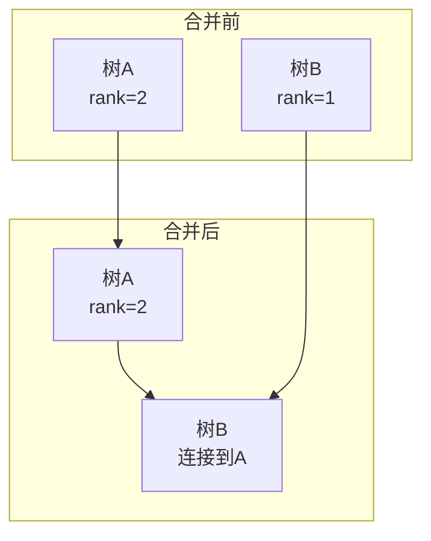

> 📊 **项目全面梳理**：详细的项目结构、模块详解和学习路径，请参阅 [`项目全面梳理-2025.md`](../../项目全面梳理-2025.md)

## 并查集 / Union-Find (Disjoint Set Union)

### 摘要 / Executive Summary

- 并查集（Union-Find，又称 Disjoint Set Union, DSU）是维护元素**划分（Partition）**信息的数据结构，支持近乎常数时间的合并（Union）与查询（Find）操作。在 LeetCode 中，并查集标签出现频率约为 4%，虽然不高，但在图论连通性问题中几乎是标准解法。
- 本文从**等价关系**的形式化定义出发，深入剖析路径压缩与按秩合并两种优化策略，严格分析 Ackermann 反函数级别的均摊复杂度。通过 LeetCode 200（岛屿数量）、547（省份数量）、128（最长连续序列并查集版本）三道题目展示其应用。
- 核心学习目标：理解**并查集如何维护等价类**，掌握路径压缩的递归与迭代实现，能够形式化证明等价类的保持性。

### 关键术语与符号 / Glossary

| 术语 / Term | 定义 / Definition |
|-------------|-------------------|
| 等价关系 Equivalence Relation | 满足自反性、对称性、传递性的二元关系 $\sim$ |
| 等价类 Equivalence Class | 对于元素 $x$，其等价类 $[x] = \{y \mid x \sim y\}$ |
| 划分 Partition | 集合被划分为互不相交的子集，每个子集是一个等价类 |
| 代表元 Representative | 每个等价类选出的一个标识元素，通常用根节点表示 |
| 路径压缩 Path Compression | Find 操作中将访问路径上所有节点直接指向根 |
| 按秩合并 Union by Rank / Size | 合并时将较小树的根连接到较大树的根 |
| Ackermann 函数 Ackermann Function | 增长极快的递归函数，其反函数 $\alpha(n)$ 增长极慢 |

术语对齐与引用规范：`docs/术语与符号总表.md`，`01-基础理论/00-撰写规范与引用指南.md`

### 目录 / Table of Contents

- [并查集 / Union-Find (Disjoint Set Union)](#并查集--union-find-disjoint-set-union)
  - [摘要 / Executive Summary](#摘要--executive-summary)
  - [关键术语与符号 / Glossary](#关键术语与符号--glossary)
  - [目录 / Table of Contents](#目录--table-of-contents)
  - [交叉引用与依赖 / Cross-References and Dependencies](#交叉引用与依赖--cross-references-and-dependencies)
- [1. 形式化定义 / Formal Definitions](#1-形式化定义--formal-definitions)
  - [1.1 等价关系与划分](#11-等价关系与划分)
  - [1.2 并查集 ADT](#12-并查集-adt)
- [2. 核心思路与算法框架](#2-核心思路与算法框架)
  - [2.1 基础实现（无优化）](#21-基础实现无优化)
  - [2.2 路径压缩](#22-路径压缩)
  - [2.3 按秩合并](#23-按秩合并)
  - [2.4 路径压缩 + 按秩合并](#24-路径压缩--按秩合并)
- [3. 经典题目详解](#3-经典题目详解)
  - [3.1 LeetCode 200 — 岛屿数量](#31-leetcode-200--岛屿数量)
    - [形式化规约 / Formal Specification](#形式化规约--formal-specification)
    - [核心思路 / Core Idea](#核心思路--core-idea)
    - [代码实现 / Code Implementations](#代码实现--code-implementations)
    - [复杂度分析 / Complexity Analysis](#复杂度分析--complexity-analysis)
  - [3.2 LeetCode 547 — 省份数量](#32-leetcode-547--省份数量)
    - [形式化规约 / Formal Specification](#形式化规约--formal-specification-1)
    - [核心思路 / Core Idea](#核心思路--core-idea-1)
    - [代码实现 / Code Implementations](#代码实现--code-implementations-1)
    - [复杂度分析 / Complexity Analysis](#复杂度分析--complexity-analysis-1)
  - [3.3 LeetCode 128 — 最长连续序列（并查集版本）](#33-leetcode-128--最长连续序列并查集版本)
    - [核心思路 / Core Idea](#核心思路--core-idea-2)
    - [复杂度对比](#复杂度对比)
- [4. 复杂度分析体系](#4-复杂度分析体系)
  - [4.1 Ackermann 反函数复杂度](#41-ackermann-反函数复杂度)
- [5. 正确性证明框架](#5-正确性证明框架)
  - [5.1 等价类保持性证明](#51-等价类保持性证明)
- [6. 思维表征](#6-思维表征)
  - [6.1 概念依赖图](#61-概念依赖图)
  - [6.2 路径压缩过程图](#62-路径压缩过程图)
  - [6.3 按秩合并过程图](#63-按秩合并过程图)
  - [6.4 公理定理证明树](#64-公理定理证明树)
- [7. 常见错误与反模式](#7-常见错误与反模式)
  - [7.1 忘记初始化 count](#71-忘记初始化-count)
  - [7.2 Find 未路径压缩](#72-find-未路径压缩)
  - [7.3 Union 前未 Find](#73-union-前未-find)
- [8. 自测问题](#8-自测问题)
  - [问题 1：并查集 vs DFS/BFS](#问题-1并查集-vs-dfsbfs)
  - [问题 2：路径压缩的递归深度](#问题-2路径压缩的递归深度)
  - [问题 3：按大小合并 vs 按秩合并](#问题-3按大小合并-vs-按秩合并)
  - [问题 4：并查集的删除操作](#问题-4并查集的删除操作)
- [9. 学习目标](#9-学习目标)
- [参考文献 / References](#参考文献--references)

### 交叉引用与依赖 / Cross-References and Dependencies

**上游理论依赖 / Upstream Dependencies**:

- [`09-算法理论/01-算法基础/02-数据结构理论.md`](../../09-算法理论/01-算法基础/02-数据结构理论.md) — 集合划分与等价关系的理论基础
- [`04-算法复杂度/01-时间复杂度.md`](../../04-算法复杂度/01-时间复杂度.md) — 均摊分析与 Ackermann 函数
- `02-递归理论/01-递归基础.md` — 递归定义与结构归纳法

**下游应用 / Downstream Applications**:

- `13-LeetCode算法面试专题/01-数据结构专题/06-堆与优先队列.md` — Kruskal 最小生成树算法（并查集 + 堆）
- `13-LeetCode算法面试专题/01-数据结构专题/04-哈希表.md` — 最长连续序列的哈希表与并查集对比

---

## 1. 形式化定义 / Formal Definitions

### 1.1 等价关系与划分

**定义 1.1** (等价关系 / Equivalence Relation)
集合 $S$ 上的二元关系 $\sim$ 是等价关系，当且仅当满足：

1. **自反性（Reflexivity）**: $\forall x \in S: x \sim x$
2. **对称性（Symmetry）**: $\forall x, y \in S: x \sim y \rightarrow y \sim x$
3. **传递性（Transitivity）**: $\forall x, y, z \in S: x \sim y \land y \sim z \rightarrow x \sim z$

**定义 1.2** (等价类 / Equivalence Class)
对于 $x \in S$，其等价类定义为：

$$
[x] = \{y \in S \mid x \sim y\}
$$

**定义 1.3** (划分 / Partition)
集合 $S$ 的划分是子集族 $\{S_1, S_2, \ldots, S_k\}$，满足：

$$
\bigcup_{i=1}^{k} S_i = S \quad \land \quad \forall i \neq j: S_i \cap S_j = \emptyset
$$

每个 $S_i$ 是一个等价类。

### 1.2 并查集 ADT

**定义 1.4** (并查集 / Union-Find)
并查集是维护集合 $S$ 划分的抽象数据类型 $UF = (S, O)$，其中：

- $S = \{0, 1, \ldots, n-1\}$：元素集合
- $O = \{\text{find}(x), \text{union}(x, y), \text{connected}(x, y)\}$

**操作语义**：

| 操作 | 前置条件 | 后置条件 | 时间复杂度 |
|------|---------|---------|-----------|
| `find(x)` | $x \in S$ | 返回 $x$ 所在等价类的代表元 | $O(\alpha(n))$ |
| `union(x, y)` | $x, y \in S$ | 合并 $[x]$ 和 $[y]$ 两个等价类 | $O(\alpha(n))$ |
| `connected(x, y)` | $x, y \in S$ | 返回 $x \sim y$ | $O(\alpha(n))$ |

其中 $\alpha(n)$ 是 Ackermann 函数的反函数，对于任何实际输入 $\alpha(n) < 5$。

---

## 2. 核心思路与算法框架

### 2.1 基础实现（无优化）

用数组 `parent[i]` 表示节点 $i$ 的父节点。根节点的父节点指向自身。

```text
Find(x):
    while parent[x] != x:
        x = parent[x]
    return x

Union(x, y):
    rootX = Find(x)
    rootY = Find(y)
    if rootX != rootY:
        parent[rootY] = rootX
```

**问题**：树可能退化为链表，`Find` 最坏 $O(n)$。

### 2.2 路径压缩

**路径压缩（Path Compression）**：在 `Find(x)` 时，将 $x$ 到根节点路径上的所有节点直接连接到根。

```text
Find(x):
    if parent[x] != x:
        parent[x] = Find(parent[x])  # 递归路径压缩
    return parent[x]
```

**效果**：大幅 flatten 树结构，使后续查询接近 $O(1)$。

### 2.3 按秩合并

**按秩合并（Union by Rank / Size）**：合并时，将较矮（或较小）树的根连接到较高（或较大）树的根。

```text
Union(x, y):
    rootX = Find(x)
    rootY = Find(y)
    if rootX == rootY: return
    if rank[rootX] < rank[rootY]:
        parent[rootX] = rootY
    elif rank[rootX] > rank[rootY]:
        parent[rootY] = rootX
    else:
        parent[rootY] = rootX
        rank[rootX] += 1
```

**效果**：限制树高，无路径压缩时树高 $O(\log n)$。

### 2.4 路径压缩 + 按秩合并

同时使用两种优化，均摊复杂度达到近乎 $O(1)$（严格为 $O(\alpha(n))$）。

---

## 3. 经典题目详解

### 3.1 LeetCode 200 — 岛屿数量

> **题目链接 / Problem Link**: [LeetCode 200. Number of Islands](https://leetcode.com/problems/number-of-islands/)
> **难度 / Difficulty**: Medium

#### 形式化规约 / Formal Specification

**输入 / Input**: $m \times n$ 的二维网格 `grid`，`'1'` 表示陆地，`'0'` 表示水。
**输出 / Output**: 岛屿数量（由相邻陆地 `'1'` 水平或垂直连接的连通块数量）。

#### 核心思路 / Core Idea

**并查集维护连通分量**：

1. 初始化：每个陆地格子是一个独立的集合，计数器 `count = 陆地格子数`
2. 遍历每个陆地格子，检查其右侧和下侧邻居：
   - 若邻居也是陆地且不在同一集合，执行 `union`，`count -= 1`
3. 最终 `count` 即为连通分量数

#### 代码实现 / Code Implementations

```python
# Python 参考实现
class UnionFind:
    def __init__(self, n):
        self.parent = list(range(n))
        self.rank = [0] * n
        self.count = 0

    def find(self, x):
        if self.parent[x] != x:
            self.parent[x] = self.find(self.parent[x])
        return self.parent[x]

    def union(self, x, y):
        rootX, rootY = self.find(x), self.find(y)
        if rootX == rootY:
            return False
        if self.rank[rootX] < self.rank[rootY]:
            rootX, rootY = rootY, rootX
        self.parent[rootY] = rootX
        if self.rank[rootX] == self.rank[rootY]:
            self.rank[rootX] += 1
        self.count -= 1
        return True

def num_islands(grid: list[list[str]]) -> int:
    if not grid or not grid[0]:
        return 0
    m, n = len(grid), len(grid[0])
    # 将二维坐标映射为一维
    uf = UnionFind(m * n)
    # 初始化 count 为陆地数量
    for i in range(m):
        for j in range(n):
            if grid[i][j] == '1':
                uf.count += 1
    directions = [(0, 1), (1, 0)]
    for i in range(m):
        for j in range(n):
            if grid[i][j] == '0':
                continue
            for di, dj in directions:
                ni, nj = i + di, j + dj
                if ni < m and nj < n and grid[ni][nj] == '1':
                    uf.union(i * n + j, ni * n + nj)
    return uf.count
```

```rust
// Rust 参考实现
pub struct UnionFind {
    parent: Vec<usize>,
    rank: Vec<i32>,
    count: i32,
}

impl UnionFind {
    pub fn new(n: usize) -> Self {
        UnionFind { parent: (0..n).collect(), rank: vec![0; n], count: 0 }
    }
    pub fn find(&mut self, x: usize) -> usize {
        if self.parent[x] != x {
            self.parent[x] = self.find(self.parent[x]);
        }
        self.parent[x]
    }
    pub fn union(&mut self, x: usize, y: usize) -> bool {
        let root_x = self.find(x);
        let root_y = self.find(y);
        if root_x == root_y { return false; }
        if self.rank[root_x] < self.rank[root_y] {
            self.parent[root_x] = root_y;
        } else {
            self.parent[root_y] = root_x;
            if self.rank[root_x] == self.rank[root_y] {
                self.rank[root_x] += 1;
            }
        }
        self.count -= 1;
        true
    }
}

pub fn num_islands(grid: Vec<Vec<char>>) -> i32 {
    if grid.is_empty() || grid[0].is_empty() { return 0; }
    let (m, n) = (grid.len(), grid[0].len());
    let mut uf = UnionFind::new(m * n);
    for i in 0..m {
        for j in 0..n {
            if grid[i][j] == '1' { uf.count += 1; }
        }
    }
    let dirs = [(0, 1), (1, 0)];
    for i in 0..m {
        for j in 0..n {
            if grid[i][j] == '0' { continue; }
            for &(di, dj) in &dirs {
                let (ni, nj) = (i + di, j + dj);
                if ni < m && nj < n && grid[ni][nj] == '1' {
                    uf.union(i * n + j, ni * n + nj);
                }
            }
        }
    }
    uf.count
}
```

```go
// Go 参考实现
type UnionFind struct {
    parent []int
    rank   []int
    count  int
}

func NewUnionFind(n int) *UnionFind {
    parent := make([]int, n)
    for i := range parent {
        parent[i] = i
    }
    return &UnionFind{parent: parent, rank: make([]int, n), count: 0}
}

func (uf *UnionFind) Find(x int) int {
    if uf.parent[x] != x {
        uf.parent[x] = uf.Find(uf.parent[x])
    }
    return uf.parent[x]
}

func (uf *UnionFind) Union(x, y int) bool {
    rootX, rootY := uf.Find(x), uf.Find(y)
    if rootX == rootY {
        return false
    }
    if uf.rank[rootX] < uf.rank[rootY] {
        rootX, rootY = rootY, rootX
    }
    uf.parent[rootY] = rootX
    if uf.rank[rootX] == uf.rank[rootY] {
        uf.rank[rootX]++
    }
    uf.count--
    return true
}

func numIslands(grid [][]byte) int {
    if len(grid) == 0 || len(grid[0]) == 0 {
        return 0
    }
    m, n := len(grid), len(grid[0])
    uf := NewUnionFind(m * n)
    for i := 0; i < m; i++ {
        for j := 0; j < n; j++ {
            if grid[i][j] == '1' {
                uf.count++
            }
        }
    }
    dirs := [][2]int{{0, 1}, {1, 0}}
    for i := 0; i < m; i++ {
        for j := 0; j < n; j++ {
            if grid[i][j] == '0' {
                continue
            }
            for _, d := range dirs {
                ni, nj := i+d[0], j+d[1]
                if ni < m && nj < n && grid[ni][nj] == '1' {
                    uf.Union(i*n+j, ni*n+nj)
                }
            }
        }
    }
    return uf.count
}
```

#### 复杂度分析 / Complexity Analysis

| 指标 / Metric | 值 / Value | 说明 / Note |
|--------------|-----------|------------|
| 时间复杂度 / Time | $O(m \cdot n \cdot \alpha(mn))$ | 每个单元格常数次 Find/Union |
| 空间复杂度 / Space | $O(m \cdot n)$ | 并查集数组 |

**与 DFS/BFS 的对比**：并查集解法时间复杂度与 DFS/BFS 同级，但更易于扩展到动态连通性问题。

---

### 3.2 LeetCode 547 — 省份数量

> **题目链接 / Problem Link**: [LeetCode 547. Number of Provinces](https://leetcode.com/problems/number-of-provinces/)
> **难度 / Difficulty**: Medium

#### 形式化规约 / Formal Specification

**输入 / Input**: $n \times n$ 矩阵 `isConnected`，`isConnected[i][j] = 1` 表示城市 $i$ 与 $j$ 直接相连。
**输出 / Output**: 省份（连通分量）数量。

#### 核心思路 / Core Idea

城市间的连通关系是**等价关系**（自反、对称、传递）。并查集天然适合维护等价类，最终等价类的数量即为省份数量。

#### 代码实现 / Code Implementations

```python
# Python 参考实现
def find_circle_num(is_connected: list[list[int]]) -> int:
    n = len(is_connected)
    uf = UnionFind(n)
    for i in range(n):
        for j in range(i + 1, n):
            if is_connected[i][j] == 1:
                uf.union(i, j)
    return uf.count
```

```rust
// Rust 参考实现
pub fn find_circle_num(is_connected: Vec<Vec<i32>>) -> i32 {
    let n = is_connected.len();
    let mut uf = UnionFind::new(n);
    uf.count = n as i32;
    for i in 0..n {
        for j in (i + 1)..n {
            if is_connected[i][j] == 1 {
                uf.union(i, j);
            }
        }
    }
    uf.count
}
```

```go
// Go 参考实现
func findCircleNum(isConnected [][]int) int {
    n := len(isConnected)
    uf := NewUnionFind(n)
    uf.count = n
    for i := 0; i < n; i++ {
        for j := i + 1; j < n; j++ {
            if isConnected[i][j] == 1 {
                uf.Union(i, j)
            }
        }
    }
    return uf.count
}
```

#### 复杂度分析 / Complexity Analysis

| 指标 / Metric | 值 / Value |
|--------------|-----------|
| 时间复杂度 / Time | $O(n^2 \cdot \alpha(n))$ |
| 空间复杂度 / Space | $O(n)$ |

---

### 3.3 LeetCode 128 — 最长连续序列（并查集版本）

> **题目链接 / Problem Link**: [LeetCode 128. Longest Consecutive Sequence](https://leetcode.com/problems/longest-consecutive-sequence/)
> **难度 / Difficulty**: Medium

#### 核心思路 / Core Idea

将数值本身作为节点，若 $x$ 和 $x+1$ 同时存在于数组中，则连接它们。最终每个连通分量对应一个连续序列，求最大连通分量大小即可。

**与哈希表版本对比**：

- 哈希表：$O(n)$ 时间，$O(n)$ 空间，代码更简洁
- 并查集：$O(n \cdot \alpha(n))$ 时间，$O(n)$ 空间，但展示了等价类思想

```python
# Python 参考实现（并查集版本）
def longest_consecutive_uf(nums: list[int]) -> int:
    if not nums:
        return 0
    num_set = set(nums)
    uf = UnionFind(len(num_set))
    # 建立数值到索引的映射
    idx = {num: i for i, num in enumerate(num_set)}
    for num in num_set:
        if num + 1 in num_set:
            uf.union(idx[num], idx[num + 1])
    # 统计每个根的大小
    from collections import Counter
    roots = [uf.find(i) for i in range(len(num_set))]
    return max(Counter(roots).values())
```

#### 复杂度对比

| 方法 | 时间 | 空间 | 核心思想 |
|------|------|------|---------|
| 哈希表 + 线性扫描 | $O(n)$ | $O(n)$ | 起点判断 + 连续扩展 |
| 并查集 | $O(n \cdot \alpha(n))$ | $O(n)$ | 等价类合并 |

---

## 4. 复杂度分析体系

### 4.1 Ackermann 反函数复杂度

**Ackermann 函数** $A(m, n)$ 是一个增长极快的二元递归函数：

$$
A(m, n) = \begin{cases} n + 1, & m = 0 \\ A(m-1, 1), & m > 0, n = 0 \\ A(m-1, A(m, n-1)), & m > 0, n > 0 \end{cases}
$$

**反 Ackermann 函数**：

$$
\alpha(n) = \min\{k \mid A(k, k) \geq n\}
$$

**定理 4.1** (Tarjan, 1975): 使用路径压缩和按秩合并的并查集，$m$ 次操作（Find/Union）的均摊时间复杂度为 $O(m \cdot \alpha(n))$。

**直观理解**：$\alpha(n)$ 增长极其缓慢：

| $n$ | $\alpha(n)$ |
|-----|------------|
| $n \leq 4$ | 1 |
| $n \leq 2^{65536}$ | 4 |
| 宇宙原子数 $\approx 10^{80}$ | 4 |

对于任何实际应用，$\alpha(n) \leq 4$，可以视为常数。因此并查集的操作复杂度通常描述为**近乎 $O(1)$**。

---

## 5. 正确性证明框架

### 5.1 等价类保持性证明

**定理 5.1** (并查集等价类保持): 对于任意操作序列，`find(x) = find(y)` 当且仅当 $x$ 和 $y$ 属于同一个等价类。

**证明 / Proof**:

对操作序列进行归纳。

**基例**: 初始时每个元素自成一个等价类，`parent[x] = x`，`find(x) = x`。$x = y$ 时同属一类，`find` 相等；否则不等。成立。

**归纳假设**: 经过 $t$ 次操作后，定理成立。

**归纳步骤**：

- **`find(x)`**：路径压缩仅改变节点的父指针指向，不改变节点所属的等价类（根节点不变）。因此 `find` 的返回值（根节点）仍能正确标识等价类。

- **`union(x, y)`**：若 $x, y$ 已在同一等价类，`find(x) = find(y)`，操作不产生影响，等价类不变。
  若 $x, y$ 在不同等价类，设根分别为 $r_x, r_y$。将其中一个根连接到另一个，从图论角度是将两棵树的根连通。此时原来在 $[x]$ 中的任意元素 $a$ 和原来在 $[y]$ 中的任意元素 $b$，都有 `find(a) = find(b)` = 新的根。新的等价类 = $[x] \cup [y]$，满足划分的封闭性。

因此操作后等价类关系仍被正确维护。$\square$

---

## 6. 思维表征

### 6.1 概念依赖图

```mermaid
flowchart TD
    A[等价关系] --> B[等价类]
    B --> C[划分]
    C --> D[并查集]
    D --> E[森林表示]
    E --> F[Find 操作]
    E --> G[Union 操作]
    F --> H[路径压缩]
    G --> I[按秩合并]
    H --> J[均摊 O(α(n))]
    I --> J
    D --> K[连通分量计数]
    D --> L[岛屿数量]
    D --> M[省份数量]
    D --> N[最长连续序列]
```

### 6.2 路径压缩过程图

```mermaid
flowchart TD
    subgraph 压缩前
        A1["1"] --> B1["2"]
        B1 --> C1["3"]
        C1 --> D1["4 根"]
    end
    subgraph Find(1) 压缩后
        A2["1 --> 4"]
        B2["2 --> 4"]
        C2["3 --> 4"]
        D2["4 根"]
    end
    A1 --> A2
```

### 6.3 按秩合并过程图



### 6.4 公理定理证明树

```mermaid
flowchart BT
    A1[公理: 等价关系定义] --> B1[定理 5.1: 等价类保持]
    A2[公理: 路径压缩不改变根] --> B2[引理: Find 正确性]
    A3[公理: 按秩合并限制树高] --> B3[引理: Union 树高 O(log n)]
    B2 --> C1[定理 4.1: 均摊 O(α(n))]
    B3 --> C1
    B1 --> D1[推论: 连通分量计数正确]

    style B1 fill:#e1f5e1
    style C1 fill:#e1f5e1
    style D1 fill:#d4edda
```

---

## 7. 常见错误与反模式

### 7.1 忘记初始化 count

**错误 / Mistake**: 并查集计数器未正确初始化为元素数量。

```python
# 错误
uf = UnionFind(n)
# uf.count 初始化为 0，但从未设置为 n

# 正确
uf = UnionFind(n)
uf.count = n  # ✅ 初始时每个元素是一个独立集合
```

### 7.2 Find 未路径压缩

**错误 / Mistake**: 只用按秩合并不用路径压缩，导致查询仍可能较慢。

**正确做法**：两种优化同时使用。在面试中，路径压缩的递归写法最简洁：

```python
def find(self, x):
    if self.parent[x] != x:
        self.parent[x] = self.find(self.parent[x])
    return self.parent[x]
```

### 7.3 Union 前未 Find

**错误 / Mistake**: `union` 时直接使用原始索引而非根节点。

```python
# 错误
def union(self, x, y):
    self.parent[y] = x  # ❌ y 可能不是根

# 正确
def union(self, x, y):
    rootX, rootY = self.find(x), self.find(y)
    if rootX != rootY:
        self.parent[rootY] = rootX  # ✅
```

---

## 8. 自测问题

### 问题 1：并查集 vs DFS/BFS

**Q**: 岛屿数量问题可以用 DFS、BFS 或并查集解决。各自的适用场景是什么？

**A**:

- **DFS/BFS**：单次静态查询，代码最简洁，空间 $O(mn)$（递归栈/队列）
- **并查集**：动态连通性（边逐步添加），或需要频繁查询两点是否连通。并查集的 `connected` 查询接近 $O(1)$

### 问题 2：路径压缩的递归深度

**Q**: 路径压缩的递归 `find` 在最坏情况下的递归深度是多少？

**A**: 未优化时最坏 $O(n)$。但经过路径压缩和按秩合并后，树高被限制在 $O(\alpha(n))$，实际递归深度极小（通常 $< 5$）。若担心栈溢出，可用迭代版本：

```python
def find(self, x):
    root = x
    while self.parent[root] != root:
        root = self.parent[root]
    # 第二次遍历进行路径压缩
    while self.parent[x] != x:
        nxt = self.parent[x]
        self.parent[x] = root
        x = nxt
    return root
```

### 问题 3：按大小合并 vs 按秩合并

**Q**: 按大小合并（Union by Size）和按秩合并（Union by Rank）有何区别？

**A**:

- **按大小合并**：将较小集合的根连接到较大集合的根，维护的是集合大小（节点数）
- **按秩合并**：维护的是树高的上界（rank），合并时秩小的连到秩大的

两者都能保证 $O(\log n)$ 的树高。按大小合并在某些场景下更直观，按秩合并与路径压缩的结合有最严格的复杂度证明。

### 问题 4：并查集的删除操作

**Q**: 并查集支持删除单个元素吗？

**A**: **标准并查集不支持高效删除**。删除一个元素可能需要将其子树重新分配，成本较高。若需要删除，可考虑：

- 使用**可撤销并查集**（维护操作历史栈，支持 Undo）
- 使用**动态连通性**的高级数据结构（如 Euler Tour Tree、Link-Cut Tree）

---

## 9. 学习目标

完成本章学习后，读者应能够：

1. **形式化描述**等价关系、等价类与并查集的 ADT。
2. **实现路径压缩**和按秩合并，理解两者对复杂度的贡献。
3. **应用并查集**解决连通分量计数、等价类合并等问题。
4. **理解 Ackermann 反函数**的复杂度意义，知道并查集操作在实际中是近乎 $O(1)$ 的。
5. **证明等价类保持性**，理解并查集操作对划分的封闭性。

---

## 参考文献 / References

- [Cormen 2022]: Cormen, T. H., et al. (2022). *Introduction to Algorithms* (4th ed.). MIT Press. §19.1-19.4
- [Tarjan 1975]: Tarjan, R. E. (1975). "Efficiency of a Good But Not Linear Set Union Algorithm." *Journal of the ACM*, 22(2), 215-225.
- [TarjanvanLeeuwen 1984]: Tarjan, R. E., & van Leeuwen, J. (1984). "Worst-case Analysis of Set Union Algorithms." *Journal of the ACM*, 31(2), 245-281.
- [SeidelSharir 2005]: Seidel, R., & Sharir, M. (2005). "Top-Down Analysis of Path Compression." *SIAM Journal on Computing*, 34(3), 515-525.
