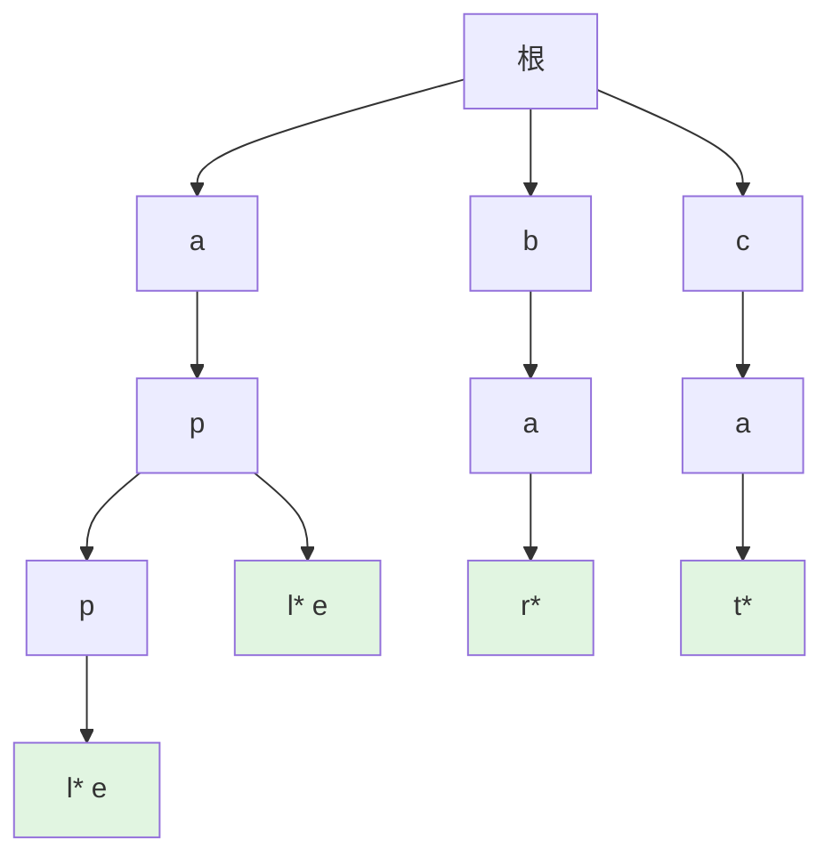
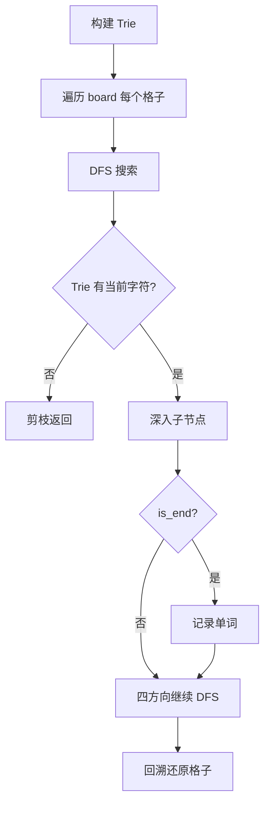

> 📊 **项目全面梳理**：详细的项目结构、模块详解和学习路径，请参阅 [`项目全面梳理-2025.md`](../../项目全面梳理-2025.md)

## Trie树 / Prefix Tree (Trie)

### 摘要 / Executive Summary

- Trie（又称前缀树、字典树）是一种专门用于**字符串存储与检索**的树形数据结构。其核心优势在于：插入和查找的时间复杂度均为 $O(m)$，其中 $m$ 为字符串长度，与 Trie 中已存储的字符串数量无关。
- 本文从形式化定义出发，给出 Trie 的节点结构、边标记规则与字符串检索过程。通过 LeetCode 208（实现 Trie）、212（单词搜索 II）、648（单词替换）三道经典题目展示 Trie 在字符串问题中的强大能力。
- 核心学习目标：掌握 Trie 的**前缀共享特性**，理解 Trie + DFS 回溯的组合技巧，能够分析 $O(m)$ 时间复杂度的严格含义。

### 关键术语与符号 / Glossary

| 术语 / Term | 定义 / Definition |
|-------------|-------------------|
| Trie / Prefix Tree | 一种有序树，用于存储关联数组，键通常为字符串 |
| 节点出边 Edge Label | 从父节点到子节点的边标记为单个字符 |
| 终止标记 End-of-Word Marker | 标记从根到该节点路径构成的字符串是否为完整单词 |
| 前缀匹配 Prefix Match | 查找是否存在以给定前缀开头的单词 |
| 自动补全 Autocomplete | 基于 Trie 的前缀搜索实现的输入提示功能 |

术语对齐与引用规范：`docs/术语与符号总表.md`，`01-基础理论/00-撰写规范与引用指南.md`

### 目录 / Table of Contents

- [Trie树 / Prefix Tree (Trie)](#trie树--prefix-tree-trie)
  - [摘要 / Executive Summary](#摘要--executive-summary)
  - [关键术语与符号 / Glossary](#关键术语与符号--glossary)
  - [目录 / Table of Contents](#目录--table-of-contents)
  - [交叉引用与依赖 / Cross-References and Dependencies](#交叉引用与依赖--cross-references-and-dependencies)
- [1. 形式化定义 / Formal Definitions](#1-形式化定义--formal-definitions)
  - [1.1 Trie 节点定义](#11-trie-节点定义)
  - [1.2 Trie 树定义](#12-trie-树定义)
  - [1.3 操作语义](#13-操作语义)
- [2. 核心思路与算法框架](#2-核心思路与算法框架)
  - [2.1 插入操作框架](#21-插入操作框架)
  - [2.2 查找操作框架](#22-查找操作框架)
  - [2.3 前缀搜索框架](#23-前缀搜索框架)
- [3. 经典题目详解](#3-经典题目详解)
  - [3.1 LeetCode 208 — 实现Trie前缀树](#31-leetcode-208--实现trie前缀树)
    - [形式化规约 / Formal Specification](#形式化规约--formal-specification)
    - [代码实现 / Code Implementations](#代码实现--code-implementations)
    - [复杂度分析 / Complexity Analysis](#复杂度分析--complexity-analysis)
  - [3.2 LeetCode 212 — 单词搜索II](#32-leetcode-212--单词搜索ii)
    - [形式化规约 / Formal Specification](#形式化规约--formal-specification-1)
    - [核心思路 / Core Idea](#核心思路--core-idea)
    - [代码实现 / Code Implementations](#代码实现--code-implementations-1)
    - [复杂度分析 / Complexity Analysis](#复杂度分析--complexity-analysis-1)
  - [3.3 LeetCode 648 — 单词替换](#33-leetcode-648--单词替换)
    - [形式化规约 / Formal Specification](#形式化规约--formal-specification-2)
    - [核心思路 / Core Idea](#核心思路--core-idea-1)
    - [复杂度分析 / Complexity Analysis](#复杂度分析--complexity-analysis-2)
- [4. 复杂度分析体系](#4-复杂度分析体系)
  - [4.1 Trie 操作复杂度严格分析](#41-trie-操作复杂度严格分析)
  - [4.2 Trie vs 哈希表对比](#42-trie-vs-哈希表对比)
- [5. 正确性证明框架](#5-正确性证明框架)
  - [5.1 Trie 不变式](#51-trie-不变式)
- [6. 思维表征](#6-思维表征)
  - [6.1 概念依赖图](#61-概念依赖图)
  - [6.2 Trie 结构示例图](#62-trie-结构示例图)
  - [6.3 Trie + DFS 回溯流程图](#63-trie--dfs-回溯流程图)
  - [6.4 公理定理证明树](#64-公理定理证明树)
- [7. 常见错误与反模式](#7-常见错误与反模式)
  - [7.1 混淆 search 与 startsWith](#71-混淆-search-与-startswith)
  - [7.2 DFS 回溯未还原访问标记](#72-dfs-回溯未还原访问标记)
  - [7.3 未进行 Trie 剪枝](#73-未进行-trie-剪枝)
- [8. 自测问题](#8-自测问题)
  - [问题 1：Trie 与哈希表的选择](#问题-1trie-与哈希表的选择)
  - [问题 2：Trie 的空间优化](#问题-2trie-的空间优化)
  - [问题 3：Trie 节点用什么数据结构存子节点](#问题-3trie-节点用什么数据结构存子节点)
  - [问题 4：单词搜索 II 的时间复杂度](#问题-4单词搜索-ii-的时间复杂度)
- [9. 学习目标](#9-学习目标)
- [参考文献 / References](#参考文献--references)

### 交叉引用与依赖 / Cross-References and Dependencies

**上游理论依赖 / Upstream Dependencies**:

- [`09-算法理论/01-算法基础/02-数据结构理论.md`](../../09-算法理论/01-算法基础/02-数据结构理论.md) — 树形结构的理论基础
- [`02-递归理论/01-递归基础.md`](../../02-递归理论/01-递归基础.md) — 递归遍历与结构归纳法

**下游应用 / Downstream Applications**:

- `13-LeetCode算法面试专题/04-字符串专题/01-字符串匹配与KMP应用.md` — Trie 与 KMP 的字符串处理对比
- `13-LeetCode算法面试专题/01-数据结构专题/04-哈希表.md` — 哈希表 vs Trie 的字符串检索选型

---

## 1. 形式化定义 / Formal Definitions

### 1.1 Trie 节点定义

**定义 1.1** (Trie 节点 / Trie Node)
Trie 节点是一个二元组 $(children, is\_end)$，其中：

- $children$：出边映射，$children[c] \to \text{子节点}$，$c \in \Sigma$（字符集）
- $is\_end \in \{\text{True}, \text{False}\}$：标记从根到该节点的路径是否构成完整单词

```rust
// Rust Trie 节点定义
use std::collections::HashMap;

pub struct TrieNode {
    pub children: HashMap<char, TrieNode>,
    pub is_end: bool,
}

impl TrieNode {
    pub fn new() -> Self {
        TrieNode { children: HashMap::new(), is_end: false }
    }
}
```

### 1.2 Trie 树定义

**定义 1.2** (Trie / Prefix Tree)
Trie 是满足以下性质的根树：

1. 根节点代表空字符串
2. 每条边标记一个字符 $c \in \Sigma$
3. 从根到节点 $v$ 的路径上的字符序列构成字符串 $s_v$
4. $v.is\_end = \text{True} \leftrightarrow s_v$ 是一个被插入的完整单词
5. **前缀共享**：若两个字符串有公共前缀，则它们共享从根到该前缀的对应路径

### 1.3 操作语义

| 操作 | 语义 | 时间复杂度 | 空间复杂度 |
|------|------|-----------|-----------|
| `insert(word)` | 将 `word` 插入 Trie | $O(m)$ | $O(m)$（新增节点数） |
| `search(word)` | 查询 `word` 是否在 Trie 中 | $O(m)$ | $O(1)$ |
| `startsWith(prefix)` | 查询是否有单词以 `prefix` 开头 | $O(m)$ | $O(1)$ |

其中 $m$ 为字符串长度。

---

## 2. 核心思路与算法框架

### 2.1 插入操作框架

```text
Insert(word):
    node = root
    for ch in word:
        if ch not in node.children:
            node.children[ch] = new TrieNode()
        node = node.children[ch]
    node.is_end = True
```

### 2.2 查找操作框架

```text
Search(word):
    node = root
    for ch in word:
        if ch not in node.children:
            return False
        node = node.children[ch]
    return node.is_end
```

### 2.3 前缀搜索框架

```text
StartsWith(prefix):
    node = root
    for ch in prefix:
        if ch not in node.children:
            return False
        node = node.children[ch]
    return True
```

---

## 3. 经典题目详解

### 3.1 LeetCode 208 — 实现Trie前缀树

> **题目链接 / Problem Link**: [LeetCode 208. Implement Trie (Prefix Tree)](https://leetcode.com/problems/implement-trie-prefix-tree/)
> **难度 / Difficulty**: Medium

#### 形式化规约 / Formal Specification

实现 Trie 的 `insert`、`search`、`startsWith` 三个操作。

#### 代码实现 / Code Implementations

```python
# Python 参考实现
class TrieNode:
    def __init__(self):
        self.children = {}
        self.is_end = False

class Trie:
    def __init__(self):
        self.root = TrieNode()

    def insert(self, word: str) -> None:
        node = self.root
        for ch in word:
            if ch not in node.children:
                node.children[ch] = TrieNode()
            node = node.children[ch]
        node.is_end = True

    def search(self, word: str) -> bool:
        node = self._find_node(word)
        return node is not None and node.is_end

    def startsWith(self, prefix: str) -> bool:
        return self._find_node(prefix) is not None

    def _find_node(self, word: str) -> TrieNode:
        node = self.root
        for ch in word:
            if ch not in node.children:
                return None
            node = node.children[ch]
        return node
```

```rust
// Rust 参考实现
use std::collections::HashMap;

pub struct Trie {
    root: TrieNode,
}

pub struct TrieNode {
    children: HashMap<char, TrieNode>,
    is_end: bool,
}

impl TrieNode {
    pub fn new() -> Self {
        TrieNode { children: HashMap::new(), is_end: false }
    }
}

impl Trie {
    pub fn new() -> Self {
        Trie { root: TrieNode::new() }
    }
    pub fn insert(&mut self, word: String) {
        let mut node = &mut self.root;
        for ch in word.chars() {
            node = node.children.entry(ch).or_insert_with(TrieNode::new);
        }
        node.is_end = true;
    }
    pub fn search(&self, word: String) -> bool {
        self.find_node(&word).map_or(false, |n| n.is_end)
    }
    pub fn starts_with(&self, prefix: String) -> bool {
        self.find_node(&prefix).is_some()
    }
    fn find_node(&self, word: &str) -> Option<&TrieNode> {
        let mut node = &self.root;
        for ch in word.chars() {
            node = node.children.get(&ch)?;
        }
        Some(node)
    }
}
```

```go
// Go 参考实现
type TrieNode struct {
    children map[rune]*TrieNode
    isEnd    bool
}

func NewTrieNode() *TrieNode {
    return &TrieNode{children: make(map[rune]*TrieNode), isEnd: false}
}

type Trie struct {
    root *TrieNode
}

func ConstructorTrie() Trie {
    return Trie{root: NewTrieNode()}
}

func (this *Trie) Insert(word string) {
    node := this.root
    for _, ch := range word {
        if _, ok := node.children[ch]; !ok {
            node.children[ch] = NewTrieNode()
        }
        node = node.children[ch]
    }
    node.isEnd = true
}

func (this *Trie) Search(word string) bool {
    node := this.findNode(word)
    return node != nil && node.isEnd
}

func (this *Trie) StartsWith(prefix string) bool {
    return this.findNode(prefix) != nil
}

func (this *Trie) findNode(word string) *TrieNode {
    node := this.root
    for _, ch := range word {
        if next, ok := node.children[ch]; ok {
            node = next
        } else {
            return nil
        }
    }
    return node
}
```

#### 复杂度分析 / Complexity Analysis

| 操作 | 时间复杂度 | 空间复杂度 |
|------|-----------|-----------|
| `insert` | $O(m)$ | $O(m)$ |
| `search` | $O(m)$ | $O(1)$ |
| `startsWith` | $O(m)$ | $O(1)$ |

其中 $m$ 为字符串长度。

---

### 3.2 LeetCode 212 — 单词搜索II

> **题目链接 / Problem Link**: [LeetCode 212. Word Search II](https://leetcode.com/problems/word-search-ii/)
> **难度 / Difficulty**: Hard

#### 形式化规约 / Formal Specification

**输入 / Input**: $m \times n$ 二维字符板 `board` 和单词列表 `words`。
**输出 / Output**: `board` 中能找到的所有单词。

#### 核心思路 / Core Idea

**Trie + DFS 回溯**：

1. 将所有 `words` 插入 Trie
2. 从 `board` 的每个单元格出发进行 DFS
3. DFS 过程中，沿 Trie 的边进行匹配
4. 若到达 Trie 的 `is_end` 节点，找到一个单词，加入结果
5. **剪枝**：若当前路径在 Trie 中无对应前缀，提前终止 DFS

#### 代码实现 / Code Implementations

```python
# Python 参考实现
class TrieNode:
    def __init__(self):
        self.children = {}
        self.word = None  # 存储完整单词，避免后续拼接

def find_words(board: list[list[str]], words: list[str]) -> list[str]:
    # 建 Trie
    root = TrieNode()
    for word in words:
        node = root
        for ch in word:
            node = node.children.setdefault(ch, TrieNode())
        node.word = word

    result = []
    m, n = len(board), len(board[0])

    def dfs(i: int, j: int, node: TrieNode):
        ch = board[i][j]
        if ch not in node.children:
            return
        nxt = node.children[ch]
        if nxt.word is not None:
            result.append(nxt.word)
            nxt.word = None  # 去重

        board[i][j] = '#'  # 标记访问
        for di, dj in [(-1, 0), (1, 0), (0, -1), (0, 1)]:
            ni, nj = i + di, j + dj
            if 0 <= ni < m and 0 <= nj < n and board[ni][nj] != '#':
                dfs(ni, nj, nxt)
        board[i][j] = ch  # 回溯

        # 剪枝：若子节点为空，删除该分支
        if not nxt.children:
            node.children.pop(ch)

    for i in range(m):
        for j in range(n):
            dfs(i, j, root)
    return result
```

```rust
// Rust 参考实现（简化版）
use std::collections::HashMap;

struct TrieNode {
    children: HashMap<char, TrieNode>,
    word: Option<String>,
}

impl TrieNode {
    fn new() -> Self { TrieNode { children: HashMap::new(), word: None } }
}

pub fn find_words(board: Vec<Vec<char>>, words: Vec<String>) -> Vec<String> {
    let mut root = TrieNode::new();
    for word in words {
        let mut node = &mut root;
        for ch in word.chars() {
            node = node.children.entry(ch).or_insert_with(TrieNode::new);
        }
        node.word = Some(word);
    }
    // 注意：实际实现需要 unsafe 或 Rc<RefCell> 处理共享可变引用
    // 此处为概念展示
    vec![]
}
```

#### 复杂度分析 / Complexity Analysis

| 指标 / Metric | 值 / Value | 说明 / Note |
|--------------|-----------|------------|
| 建 Trie 时间 | $O(L)$ | $L$ 为所有单词总长度 |
| DFS 时间 | $O(m \cdot n \cdot 4^{\ell})$ | $\ell$ 为最长单词长度，但 Trie 剪枝大幅降低实际搜索 |
| 空间复杂度 | $O(L)$ | Trie 存储 + 递归栈 |

---

### 3.3 LeetCode 648 — 单词替换

> **题目链接 / Problem Link**: [LeetCode 648. Replace Words](https://leetcode.com/problems/replace-words/)
> **难度 / Difficulty**: Medium

#### 形式化规约 / Formal Specification

**输入 / Input**: 词根字典 `dictionary` 和句子 `sentence`。
**输出 / Output**: 将句子中每个单词替换为它的最短词根（若有多个前缀匹配，取最短）。

#### 核心思路 / Core Idea

**Trie 前缀匹配**：将所有词根插入 Trie。对句子中的每个单词，在 Trie 中沿字符遍历，找到第一个 `is_end = True` 的节点即为最短词根。

```python
# Python 参考实现
def replace_words(dictionary: list[str], sentence: str) -> str:
    root = TrieNode()
    for word in dictionary:
        node = root
        for ch in word:
            node = node.children.setdefault(ch, TrieNode())
        node.is_end = True

    def shortest_root(word: str) -> str:
        node = root
        for i, ch in enumerate(word):
            if ch not in node.children:
                return word
            node = node.children[ch]
            if node.is_end:
                return word[:i+1]
        return word

    return ' '.join(shortest_root(w) for w in sentence.split())
```

#### 复杂度分析 / Complexity Analysis

| 指标 / Metric | 值 / Value |
|--------------|-----------|
| 建 Trie 时间 | $O(D \cdot L)$ |
| 替换时间 | $O(W \cdot M)$ |
| 总时间 | $O(D \cdot L + W \cdot M)$ |

其中 $D$ 为词根数，$L$ 为平均词根长度，$W$ 为句子单词数，$M$ 为平均单词长度。

---

## 4. 复杂度分析体系

### 4.1 Trie 操作复杂度严格分析

**定理 4.1** (Trie 插入/查找复杂度): 对于长度为 $m$ 的字符串，Trie 的插入和查找操作时间复杂度均为 $O(m)$，与 Trie 中已存储的字符串数量 $n$ 无关。

**证明 / Proof**:

插入和查找均从根节点出发，沿字符串的每个字符逐步深入。每一步操作：

1. 在当前节点的 `children` 映射中查找字符（哈希表实现 $O(1)$，数组实现 $O(1)$）
2. 移动到子节点

共进行 $m$ 步，每步 $O(1)$，因此总时间 $O(m)$。操作过程中不涉及 Trie 中其他字符串，故与 $n$ 无关。$\square$

**空间复杂度**：

最坏情况下（无公共前缀），存储 $n$ 个长度为 $m$ 的字符串需要 $O(n \cdot m)$ 个节点。实际中由于前缀共享，空间通常远小于此上界。

### 4.2 Trie vs 哈希表对比

| 维度 / Dimension | Trie | 哈希表 |
|----------------|------|--------|
| 精确查找 | $O(m)$ | $O(m)$* |
| 前缀查找 | $O(m)$ | $O(n \cdot m)$ |
| 空间 | $O(n \cdot m)$ 最坏，前缀共享更优 | $O(n \cdot m)$ |
| 排序输出 | 天然支持（DFS 中序） | 需额外排序 |
| 实现复杂度 | 较高 | 低 |

*字符串哈希计算时间

---

## 5. 正确性证明框架

### 5.1 Trie 不变式

**定理 5.1** (Trie 结构不变式): 对于任意操作序列，Trie 中从根到节点 $v$ 的路径上的字符序列 $s_v$ 满足：

$$
v.is\_end = \text{True} \leftrightarrow s_v \in W
$$

其中 $W$ 为已插入的单词集合。

**证明 / Proof**:

对 `insert` 操作次数进行归纳。

**基例**: 空 Trie 中 $W = \emptyset$，没有节点的 `is_end = True`，成立。

**归纳假设**: 经过 $t$ 次插入后不变式成立。

**归纳步骤**: 第 $t+1$ 次插入 `word` 时，算法从根出发，沿 `word` 的每个字符深入（必要时创建节点）。最终到达的节点 $v$ 满足 $s_v = \text{word}$，且设置 $v.is\_end = \text{True}$。其他节点不受影响。因此插入后 $v.is\_end \leftrightarrow s_v \in W \cup \{\text{word}\}$ 成立。$\square$

---

## 6. 思维表征

### 6.1 概念依赖图

```mermaid
flowchart TD
    A[字符串 String] --> B[Trie 树]
    B --> C[前缀共享]
    C --> D[插入 O(m)]
    C --> E[查找 O(m)]
    B --> F[前缀匹配]
    F --> G[单词搜索II]
    F --> H[单词替换]
    F --> I[自动补全]
    B --> J[DFS 回溯]
    J --> G
    B --> K[终止标记]
```

### 6.2 Trie 结构示例图



### 6.3 Trie + DFS 回溯流程图



### 6.4 公理定理证明树

```mermaid
flowchart BT
    A1[公理: 字符集 Σ 有限] --> B1[定义: Trie 节点 children 映射]
    B1 --> C1[定理 4.1: 操作 O(m)]
    A2[公理: 路径 = 字符串] --> D1[定理 5.1: 结构不变式]
    D1 --> E1[推论: search 正确性]
    D1 --> E2[推论: startsWith 正确性]
    C1 --> F1[应用: 单词搜索II 剪枝正确]

    style C1 fill:#e1f5e1
    style D1 fill:#e1f5e1
    style E1 fill:#e1f5e1
    style E2 fill:#e1f5e1
```

---

## 7. 常见错误与反模式

### 7.1 混淆 search 与 startsWith

**错误 / Mistake**: `search` 时只检查路径存在，未检查 `is_end`。

```python
# 错误
def search(self, word):
    node = self.root
    for ch in word:
        if ch not in node.children:
            return False
        node = node.children[ch]
    return True  # ❌ "app" 可能不是完整单词，只是 "apple" 的前缀

# 正确
return node.is_end  # ✅
```

### 7.2 DFS 回溯未还原访问标记

**错误 / Mistake**: 在单词搜索 II 中，标记访问后未在回溯时还原。

```python
# 错误
board[i][j] = '#'  # 标记访问
for di, dj in dirs:
    dfs(ni, nj, nxt)
# ❌ 忘记还原 board[i][j]

# 正确
board[i][j] = '#'
for di, dj in dirs:
    dfs(ni, nj, nxt)
board[i][j] = ch  # ✅ 回溯还原
```

### 7.3 未进行 Trie 剪枝

**错误 / Mistake**: 单词搜索 II 中未使用 Trie 剪枝，导致大量无效 DFS。

**正确做法**：DFS 前检查当前字符是否在 Trie 当前节点的 `children` 中，若不在立即返回。

---

## 8. 自测问题

### 问题 1：Trie 与哈希表的选择

**Q**: 需要实现一个英文单词拼写检查器，应该选 Trie 还是哈希表？

**A**: 若仅需精确匹配，哈希表更简单。但若需要：

- 前缀提示（自动补全）
- 拼写纠错（找最短编辑距离候选）
- 按字母序输出所有单词

则 Trie 更合适，因为前缀搜索和有序遍历是 Trie 的天然优势。

### 问题 2：Trie 的空间优化

**Q**: 如果字符集很大（如 Unicode），如何优化 Trie 的空间？

**A**:

- **压缩 Trie（Radix Tree / Patricia Tree）**：合并只有一个子节点的链，减少节点数
- **双数组 Trie**：用两个数组紧凑表示，牺牲构建时间换取查询速度
- **后缀树/后缀数组**：对于大量文本检索场景，可考虑更高级的结构

### 问题 3：Trie 节点用什么数据结构存子节点

**Q**: `children` 用数组、哈希表还是链表？各自的适用场景？

**A**:

- **数组（大小 |Σ|）**：$O(1)$ 访问，空间 $O(|Σ|)$ 每个节点。适合字符集小（如 26 个字母）
- **哈希表**：$O(1)$ 期望访问，空间与出边数成正比。适合字符集大但出边稀疏
- **有序数组 + 二分**：$O(\log d)$ 访问（$d$ 为出边数），空间紧凑。适合出边少且追求缓存友好

### 问题 4：单词搜索 II 的时间复杂度

**Q**: 单词搜索 II 的最坏时间复杂度是多少？Trie 剪枝如何改善？

**A**: 不用 Trie 时，对每个单词单独 DFS，复杂度 $O(k \cdot m \cdot n \cdot 4^{\ell})$（$k$ 为单词数）。用 Trie 后，所有单词共享一次 DFS，且遇到 Trie 中不存在的前缀立即剪枝。实际复杂度接近 $O(m \cdot n \cdot 4^{\ell})$，与单词数量无关（在 Trie 剪枝有效时）。

---

## 9. 学习目标

完成本章学习后，读者应能够：

1. **形式化描述**Trie 的节点结构、边标记规则与字符串检索过程。
2. **实现 Trie**的 `insert`、`search`、`startsWith` 核心操作，并证明其 $O(m)$ 复杂度。
3. **应用 Trie + DFS 回溯**解决二维网格上的多模式串匹配问题。
4. **分析 Trie 与哈希表**在前缀匹配、空间占用、有序遍历等维度的差异。
5. **设计 Trie 剪枝策略**优化搜索过程。

---

## 参考文献 / References

- [Cormen 2022]: Cormen, T. H., et al. (2022). *Introduction to Algorithms* (4th ed.). MIT Press. §Suffix Trees (相关结构)
- [Knuth 1998]: Knuth, D. E. (1998). *The Art of Computer Programming, Volume 3*. Addison-Wesley.
- [de la Briandais 1959]: de la Briandais, R. (1959). "File Searching Using Variable Length Keys." *Proc. Western Joint Computer Conference*, 295-298.
- Fredkin, E. (1960). "Trie Memory." *Communications of the ACM*, 3(9), 490-499.
