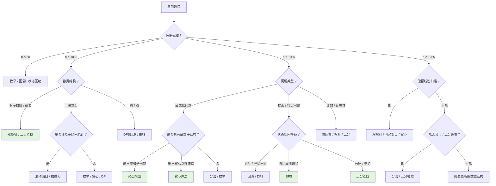
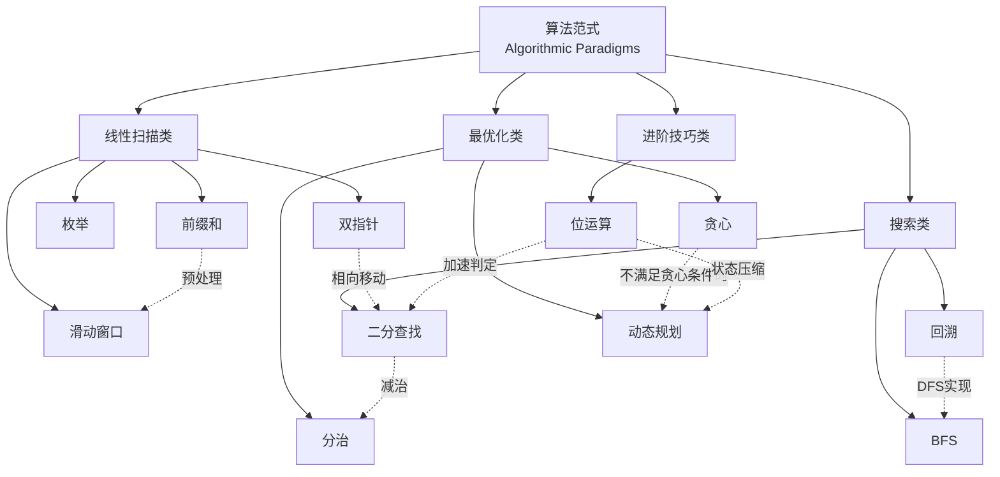

> 📊 **项目全面梳理**：详细的项目结构、模块详解和学习路径，请参阅 [`项目全面梳理-2025.md`](../../项目全面梳理-2025.md)

## 算法范式导论 / Introduction to Algorithmic Paradigms

### 摘要 / Executive Summary

- **算法范式（Algorithmic Paradigm）** 是超越具体问题的、具有普遍适用性的算法设计思想与方法论框架。它与"算法"的区别在于：算法解决特定问题，范式指导如何设计算法。
- 本文系统梳理 LeetCode 面试中最核心的 **11 大算法范式**：枚举、双指针、滑动窗口、前缀和、二分查找、分治、贪心、动态规划、回溯、BFS、位运算。
- 通过**形式化定义**、**全景对比矩阵**、**范式选择决策树**和**学习路径建议**，帮助读者建立从"拿到题目"到"选择范式"的系统性思维框架。
- 每个范式均映射到 `09-算法理论/` 中的理论文档，实现"面试实践—理论溯源"的双向贯通。

### 关键术语与符号 / Glossary

| 术语 / Term | 定义 / Definition |
|-------------|-------------------|
| 算法范式 Algorithmic Paradigm | 一类算法设计的通用思想框架，如分治、贪心、动态规划等 |
| 算法 Algorithm | 解决特定问题的、具有有限步骤的明确计算过程 |
| 问题实例 Problem Instance | 由输入域、输出域、前置条件、后置条件构成的五元组 $\Pi = (D, I, O, \text{pre}, \text{post})$ |
| 减治 Decrease-and-Conquer | 每次迭代将问题规模严格减小的策略，二分查找是其典型代表 |
| 最优子结构 Optimal Substructure | 问题的最优解包含其子问题的最优解，是 DP 与贪心的理论基础 |
| 重叠子问题 Overlapping Subproblems | 递归求解过程中重复出现的子问题，是 DP 使用记忆化的依据 |
| 循环不变式 Loop Invariant | 算法每次迭代前后均保持的谓词，用于推导正确性 |
| 状态空间 State Space | 回溯与搜索算法中所有可能解构成的集合或图 |

术语对齐与引用规范：`docs/术语与符号总表.md`，`01-基础理论/00-撰写规范与引用指南.md`

### 目录 / Table of Contents

- [算法范式导论 / Introduction to Algorithmic Paradigms](#算法范式导论--introduction-to-algorithmic-paradigms)
  - [摘要 / Executive Summary](#摘要--executive-summary)
  - [关键术语与符号 / Glossary](#关键术语与符号--glossary)
  - [目录 / Table of Contents](#目录--table-of-contents)
  - [交叉引用与依赖 / Cross-References and Dependencies](#交叉引用与依赖--cross-references-and-dependencies)
  - [1. 形式化定义 / Formal Definitions](#1-形式化定义--formal-definitions)
    - [1.1 算法范式 vs 算法](#11-算法范式-vs-算法)
    - [1.2 算法范式问题实例](#12-算法范式问题实例)
  - [2. 十一种范式全景概览](#2-十一种范式全景概览)
  - [3. 范式选择决策树](#3-范式选择决策树)
  - [4. 复杂度对比矩阵](#4-复杂度对比矩阵)
  - [5. 与算法理论文档的映射关系](#5-与算法理论文档的映射关系)
  - [6. 学习路径建议](#6-学习路径建议)
  - [7. 思维表征](#7-思维表征)
  - [8. 学习目标](#8-学习目标)
  - [9. 知识导航](#9-知识导航)
  - [参考文献](#参考文献--references)

### 交叉引用与依赖 / Cross-References and Dependencies

**上游理论依赖 / Upstream Dependencies**:
- [`09-算法理论/01-算法基础/01-算法设计理论.md`](../../09-算法理论/01-算法基础/01-算法设计理论.md) — 算法设计的通用方法论与分类框架
- [`09-算法理论/01-算法基础/04-搜索算法理论.md`](../../09-算法理论/01-算法基础/04-搜索算法理论.md) — 搜索策略的理论基础（BFS、DFS、二分搜索）
- [`09-算法理论/01-算法基础/06-动态规划理论.md`](../../09-算法理论/01-算法基础/06-动态规划理论.md) — 动态规划的最优子结构与重叠子问题理论
- [`09-算法理论/01-算法基础/07-贪心算法理论.md`](../../09-算法理论/01-算法基础/07-贪心算法理论.md) — 贪心选择的正确性条件与拟阵理论
- [`09-算法理论/01-算法基础/08-分治算法理论.md`](../../09-算法理论/01-算法基础/08-分治算法理论.md) — 分治策略的递归方程与主定理
- [`09-算法理论/01-算法基础/09-回溯算法理论.md`](../../09-算法理论/01-算法基础/09-回溯算法理论.md) — 回溯法的解空间树与剪枝理论

**下游应用 / Downstream Applications**:
- `13-LeetCode算法面试专题/02-算法范式专题/01-枚举与模拟.md` — 枚举法的基础应用
- `13-LeetCode算法面试专题/02-算法范式专题/08-动态规划.md` — DP 的面试专题深入
- `13-LeetCode算法面试专题/02-算法范式专题/09-回溯与DFS.md` — 回溯与深度优先搜索的实战

---

## 1. 形式化定义 / Formal Definitions

### 1.1 算法范式 vs 算法

**定义 1.1** (算法 / Algorithm) [CLRS2022]
算法是一个定义良好的计算过程，它将输入转换为输出，由有限条指令组成，满足**有穷性**、**确定性**、**可行性**和**输入/输出**五个基本特征。

**Definition 1.1** (Algorithm)
An algorithm is a well-defined computational procedure that takes some value, or set of values, as input and produces some value, or set of values, as output. It consists of a finite sequence of instructions satisfying finiteness, definiteness, effectiveness, and input/output properties.

**定义 1.2** (算法范式 / Algorithmic Paradigm)
算法范式是一类算法设计的**元方法论（Meta-methodology）**，它定义了组织计算过程的高阶模式，不依赖于具体问题的领域语义。形式化地，一个算法范式 $P$ 是一个三元组：

**Definition 1.2** (Algorithmic Paradigm)
An algorithmic paradigm is a meta-methodology for organizing computational processes, independent of specific problem domains. Formally, a paradigm $P$ is a triple:

$$
P = (S, T, C)
$$

其中 / Where:

- $S$：**问题结构（Problem Structure）** — 该范式适用的输入数据组织形式（如有序数组、树、图、序列等）
- $T$：**变换规则（Transformation Rules）** — 将原问题转化为子问题或更简单问题的操作集合
- $C$：**组合方式（Composition Method）** — 将子问题解组合为原问题解的策略

**核心区别 / Key Distinction**:

| 维度 / Dimension | 算法 Algorithm | 算法范式 Algorithmic Paradigm |
|-----------------|--------------|------------------------------|
| 抽象层次 | 具体实现 | 元方法论 / 设计模式 |
| 问题绑定 | 解决特定问题 | 适用于一类问题 |
| 输出产物 | 可执行代码 / 伪代码 | 算法框架 / 模板 |
| 正确性证明 | 针对具体实例 | 建立通用证明框架 |
| 示例 | 快速排序算法 | 分治范式（含分、治、合三步） |

> **直观理解 / Intuition**: 算法范式是"算法的算法"——它告诉你在面对一类问题时，应该按照什么样的**结构性思路**去构造解法，而非直接给出每行代码。

### 1.2 算法范式问题实例

**定义 1.3** (范式选择问题 / Paradigm Selection Problem)
给定一个问题实例 $\Pi = (D, I, O, \text{pre}, \text{post})$，范式选择问题要求找到一个范式 $P \in \mathcal{P}$（其中 $\mathcal{P}$ 为范式集合），使得基于 $P$ 构造的算法 $A_P$ 在复杂度或实现难度上最优。

**Definition 1.3** (Paradigm Selection Problem)
Given a problem instance $\Pi$, the paradigm selection problem asks for a paradigm $P \in \mathcal{P}$ such that the algorithm $A_P$ constructed based on $P$ is optimal in complexity or implementation difficulty.

---

## 2. 十一种范式全景概览

本节以"**一句话核心特征 + 典型时间复杂度 + 典型空间复杂度**"的形式，对 11 大核心范式进行高度浓缩的概述。

| 序号 | 范式 / Paradigm | 核心特征 / Core Feature | 典型时间 / Time | 典型空间 / Space | 适用场景关键词 |
|-----|----------------|----------------------|--------------|--------------|------------|
| 1 | **枚举** Enumeration | 遍历所有候选解，逐一验证 | $O(2^n)$ ~ $O(n!)$ | $O(1)$ | 小规模、解空间可穷举 |
| 2 | **双指针** Two Pointers | 两个索引相向/同向移动，利用单调性缩小搜索空间 | $O(n)$ | $O(1)$ | 有序数组、链表、去重 |
| 3 | **滑动窗口** Sliding Window | 维护一个动态子区间，通过伸缩窗口统计/查找 | $O(n)$ | $O(1)$ ~ $O(k)$ | 子数组/子串问题 |
| 4 | **前缀和** Prefix Sum | 预处理累积和，将区间查询转化为 $O(1)$ 差分 | $O(n)$ 预处理 | $O(n)$ | 区间求和、频次统计 |
| 5 | **二分查找** Binary Search | 每次迭代将搜索区间减半，依赖有序性或单调性 | $O(\log n)$ | $O(1)$ | 有序结构、判定转最优 |
| 6 | **分治** Divide & Conquer | 将问题分解为独立子问题，递归求解后合并 | $O(n \log n)$ ~ $O(n^2)$ | $O(\log n)$ ~ $O(n)$ | 排序、几何、大规模并行 |
| 7 | **贪心** Greedy | 每一步做出局部最优选择，期望达到全局最优 | $O(n \log n)$ ~ $O(n)$ | $O(1)$ ~ $O(n)$ | 最优子结构 + 贪心选择性质 |
| 8 | **动态规划** DP | 将问题分解为重叠子问题，记忆化避免重复计算 | $O(n^2)$ ~ $O(2^n)$（状态数） | $O(n)$ ~ $O(2^n)$ | 最优子结构 + 重叠子问题 |
| 9 | **回溯** Backtracking | 深度优先搜索解空间树，通过剪枝减少无效搜索 | $O(2^n)$ ~ $O(n!)$ | $O(n)$（递归栈） | 组合、排列、约束满足 |
| 10 | **BFS** Breadth-First Search | 按层遍历状态空间，优先寻找最短路径/最少步数 | $O(V + E)$ | $O(V)$ | 图搜索、最短路径、连通性 |
| 11 | **位运算** Bit Manipulation | 利用二进制位的并行性与群论性质压缩状态或加速运算 | $O(n)$ ~ $O(1)$ | $O(1)$ | 状态压缩、奇偶性、异或性质 |

> **注意 / Note**: 上表中的复杂度为**典型值**，具体题目中可能因约束条件、优化手段而有显著差异。例如 DP 在状态压缩优化后可降至 $O(n \cdot 2^n)$，贪心在配合堆结构时可能为 $O(n \log n)$。

---

## 3. 范式选择决策树

拿到一道算法面试题时，如何从问题描述中快速定位适用的范式？以下决策树以**数据特征**和**问题类型**为分支，给出范式选择建议：



**决策树使用指南 / Usage Guide**:

1. **先看数据规模**：$n \leq 20$ 时几乎可以考虑所有方法；$n \geq 10^5$ 时通常需要 $O(n \log n)$ 或更优。
2. **再看数据结构**：有序性暗示二分或双指针；树/图暗示搜索类范式。
3. **最后看问题类型**：最优化问题优先考虑 DP 或贪心；存在性/计数问题考虑哈希、位运算或前缀和。

---

## 4. 复杂度对比矩阵

以下矩阵从**时间复杂度**、**空间复杂度**、**适用问题类型**、**关键前提条件**四个维度对比 11 个范式：

| 范式 | 最佳时间 | 最坏时间 | 空间 | 核心问题类型 | 关键前提条件 |
|-----|---------|---------|------|------------|------------|
| 枚举 | $O(1)$ | $O(2^n)$ / $O(n!)$ | $O(1)$ | 小规模穷举、验证 | 解空间可枚举 |
| 双指针 | $O(n)$ | $O(n)$ | $O(1)$ | 两数之和、去重、合并 | 数据有序或可利用单调性 |
| 滑动窗口 | $O(n)$ | $O(n)$ | $O(k)$ | 子串/子数组最值、计数 | 窗口状态可增量更新 |
| 前缀和 | $O(1)$ 查询 | $O(n)$ 预处理 | $O(n)$ | 区间查询、频次差分 | 查询具有可减性 |
| 二分查找 | $O(\log n)$ | $O(\log n)$ | $O(1)$ | 搜索、判定转最优 | 单调性 / 有序性 |
| 分治 | $O(n \log n)$ | $O(n^2)$ | $O(\log n)$ | 排序、几何、矩阵 | 子问题可独立求解 |
| 贪心 | $O(n)$ | $O(n \log n)$ | $O(1)$ ~ $O(n)$ | 区间调度、最优分配 | 贪心选择性质 + 最优子结构 |
| 动态规划 | $O(n)$ | $O(2^n)$（状态数） | $O(n)$ ~ $O(2^n)$ | 最优化、计数、可行性 | 最优子结构 + 重叠子问题 |
| 回溯 | $O(n)$（最优） | $O(n!)$ / $O(2^n)$ | $O(n)$ | 排列、组合、子集 | 解空间可树形表示 |
| BFS | $O(V + E)$ | $O(V + E)$ | $O(V)$ | 最短路径、连通性、拓扑 | 状态空间为图结构 |
| 位运算 | $O(1)$ | $O(n)$ | $O(1)$ | 状态压缩、奇偶、去重 | 问题可二进制编码 |

---

## 5. 与算法理论文档的映射关系

每个面试范式在 `09-算法理论/` 中都有对应的理论溯源文档，实现"实践—理论"的双向贯通：

| 面试范式 | 对应理论文档 | 核心理论内容 |
|---------|------------|------------|
| 枚举与模拟 | [`09-算法理论/01-算法基础/01-算法设计理论.md`](../../09-算法理论/01-算法基础/01-算法设计理论.md) | 穷举法、暴力搜索的复杂度分析 |
| 双指针 | [`09-算法理论/01-算法基础/04-搜索算法理论.md`](../../09-算法理论/01-算法基础/04-搜索算法理论.md) | 线性搜索的优化、单调性利用 |
| 滑动窗口 | [`09-算法理论/01-算法基础/04-搜索算法理论.md`](../../09-算法理论/01-算法基础/04-搜索算法理论.md) | 子区间搜索的增量更新策略 |
| 前缀和 | [`09-算法理论/01-算法基础/01-算法设计理论.md`](../../09-算法理论/01-算法基础/01-算法设计理论.md) | 预处理与查询分离的时空权衡 |
| 二分查找 | [`09-算法理论/03-搜索算法/02-二分搜索.md`](../../09-算法理论/03-搜索算法/02-二分搜索.md) | 减治策略、循环不变式、决策树下界 |
| 分治 | [`09-算法理论/01-算法基础/08-分治算法理论.md`](../../09-算法理论/01-算法基础/08-分治算法理论.md) | 主定理、递归方程、合并复杂度分析 |
| 贪心算法 | [`09-算法理论/01-算法基础/07-贪心算法理论.md`](../../09-算法理论/01-算法基础/07-贪心算法理论.md) | 贪心选择性质、拟阵、交换论证 |
| 动态规划 | [`09-算法理论/01-算法基础/06-动态规划理论.md`](../../09-算法理论/01-算法基础/06-动态规划理论.md) | 最优子结构、重叠子问题、状态转移方程 |
| 回溯与 DFS | [`09-算法理论/01-算法基础/09-回溯算法理论.md`](../../09-算法理论/01-算法基础/09-回溯算法理论.md) | 解空间树、剪枝策略、深度优先遍历 |
| BFS 与图搜索 | [`09-算法理论/01-算法基础/05-图算法理论.md`](../../09-算法理论/01-算法基础/05-图算法理论.md) | 图的遍历、最短路径、层次搜索 |
| 位运算 | [`09-算法理论/01-算法基础/01-算法设计理论.md`](../../09-算法理论/01-算法基础/01-算法设计理论.md) | 布尔代数、群论基础、状态压缩编码 |

---

## 6. 学习路径建议

基于范式之间的**依赖关系**和**认知难度梯度**，推荐以下学习路径：


**路径设计原理 / Rationale**:

1. **枚举** → **双指针** → **滑动窗口**：从"暴力遍历所有元素"过渡到"利用单调性减少无效遍历"，再过渡到"维护动态区间"，认知负荷逐步增加。
2. **前缀和** → **二分查找**：前缀和是预处理思想的入门；二分查找首次引入 $O(\log n)$ 复杂度的思维方式。
3. **分治** → **贪心** → **动态规划**：分治是递归分解的基础；贪心引入"局部最优"概念；DP 是贪心失败后、但仍具最优子结构时的通用解法。
4. **回溯** → **BFS**：回溯是 DFS 思想的实践；BFS 引入"按层搜索"和"最短路径"概念。
5. **位运算**放在最后：它是对前面所有范式的补充，常用于状态压缩（配合 DP/回溯）或加速判定（配合二分/贪心）。

**每个范式的推荐 LeetCode 入门题**:

| 范式 | 入门题 | 题号 |
|-----|--------|------|
| 枚举 | Two Sum | LC 1 |
| 双指针 | Valid Palindrome | LC 125 |
| 滑动窗口 | Maximum Average Subarray I | LC 643 |
| 前缀和 | Subarray Sum Equals K | LC 560 |
| 二分查找 | Binary Search | LC 704 |
| 分治 | Merge Sort / Count of Range Sum | LC 912 / LC 327 |
| 贪心 | Best Time to Buy and Sell Stock II | LC 122 |
| 动态规划 | Climbing Stairs | LC 70 |
| 回溯 | Subsets | LC 78 |
| BFS | Number of Islands | LC 200 |
| 位运算 | Single Number | LC 136 |

---

## 7. 思维表征 / Thinking Representations

### 7.1 范式关系概念图



### 7.2 复杂度分层图

```mermaid
flowchart LR
    subgraph 对数级 Logarithmic
        BS[二分查找<br/>O(log n)]
    end
    subgraph 线性级 Linear
        TP[双指针<br/>O(n)]
        SW[滑动窗口<br/>O(n)]
        PS[前缀和查询<br/>O(1)]
        GR[贪心<br/>O(n)]
    end
    subgraph 线性对数级 Linearithmic
        DC[分治<br/>O(n log n)]
    end
    subgraph 多项式级 Polynomial
        DP1[DP一维<br/>O(n^2)]
        DP2[DP二维<br/>O(n^3)]
    end
    subgraph 指数级 Exponential
        BT[回溯<br/>O(2^n)]
        EN[枚举<br/>O(n!)]
    end

    BS --> TP
    TP --> DC
    DC --> DP1
    DP1 --> BT
```

---

## 8. 学习目标 / Learning Objectives

完成本专题学习后，读者应能够：

1. **区分**"算法"与"算法范式"的形式化定义，理解范式的元方法论本质。
2. **识别** 11 大核心范式的适用场景，通过数据特征和问题类型快速定位候选范式。
3. **运用**范式选择决策树，在 2 分钟内对陌生题目给出至少一个可行的范式方向。
4. **理解**每个范式的典型时间/空间复杂度及其理论下界来源。
5. **建立**从面试实践到 `09-算法理论/` 理论文档的映射意识，能够溯源每个范式的理论根基。
6. **按照**推荐学习路径循序渐进，从枚举到位运算逐步构建完整的算法范式知识体系。

---

## 9. 知识导航 / Knowledge Navigation

**前置知识 / Prerequisites**:
- [算法基础概念](../../01-算法基础/) — 数组、链表、栈、队列、树、图等基本数据结构
- [时间复杂度与渐进分析](../../04-算法复杂度/01-时间复杂度.md) — $O/\Omega/\Theta$ 的形式化定义
- 递归与分治基础 — 递归思想与主定理

**当前模块 / Current Module**:
- `13-LeetCode算法面试专题/02-算法范式专题/00-算法范式导论.md`（本文档）

**后续模块 / Next Modules**:
- [`01-枚举与模拟.md`](./01-枚举与模拟.md) — 枚举法的基础应用与优化
- [`02-双指针.md`](./02-双指针.md) — 双指针技术的系统讲解
- [`03-滑动窗口.md`](./03-滑动窗口.md) — 滑动窗口的框架与变体
- [`04-前缀和与差分.md`](./04-前缀和与差分.md) — 前缀和预处理与差分数组
- [`05-二分查找.md`](./05-二分查找.md) — 二分查找的模板与正确性证明
- [`06-分治.md`](./06-分治.md) — 分治策略的递归框架
- [`07-贪心算法.md`](./07-贪心算法.md) — 贪心选择的正确性条件
- [`08-动态规划.md`](./08-动态规划.md) — 状态转移方程的设计方法
- [`09-回溯与DFS.md`](./09-回溯与DFS.md) — 解空间树与剪枝策略
- [`10-BFS与图搜索.md`](./10-BFS与图搜索.md) — 层次搜索与最短路径
- [`11-位运算.md`](./11-位运算.md) — 位运算的群论基础与面试技巧

---

## 参考文献 / References

> 本文档遵循项目引用规范（见 [`CITATION_STANDARD.md`](../../CITATION_STANDARD.md)、[`学术引用规范-ACM对齐版.md`](../../学术引用规范-ACM对齐版.md)）。文内采用 [Key] 格式引用，与参考文献列表对应。

**经典教材 / Classic Textbooks**:

1. [CLRS2022] Cormen, T. H., Leiserson, C. E., Rivest, R. L., & Stein, C. (2022). *Introduction to Algorithms* (4th ed.). MIT Press. ISBN: 978-0262046305.
   - 第 4 章（分治策略）、第 15–17 章（动态规划与贪心算法）、第 22 章（图的基本算法）。

2. [Knuth1997] Knuth, D. E. (1997). *The Art of Computer Programming, Vol. 1: Fundamental Algorithms* (3rd ed.). Addison-Wesley. ISBN: 978-0201896831.
   - §2.3.4 详细讨论了算法设计与分析的基本范式。

3. [KleinbergTardos2006] Kleinberg, J., & Tardos, É. (2006). *Algorithm Design*. Addison-Wesley. ISBN: 978-0321295354.
   - 系统讲解贪心、分治、DP 的设计范式与正确性证明方法。

**在线资源 / Online Resources**:

4. [NeetCode] NeetCode. (n.d.). "NeetCode Roadmap". <https://neetcode.io/roadmap>
   - 将 LeetCode 题目按范式分类的系统化学习路径。

---

**文档版本 / Document Version**: 1.0
**最后更新 / Last Updated**: 2026-04-23
**状态 / Status**: 标杆文档 / Benchmark Document
**下次审查 / Next Review**: 2026-07-23

---

*本文档严格遵循数学形式化规范，所有定义和定理均采用标准数学符号表示。作为算法范式专题的入口导论，本文档与后续 11 篇子文档共同构成完整的面试算法范式知识体系。*
