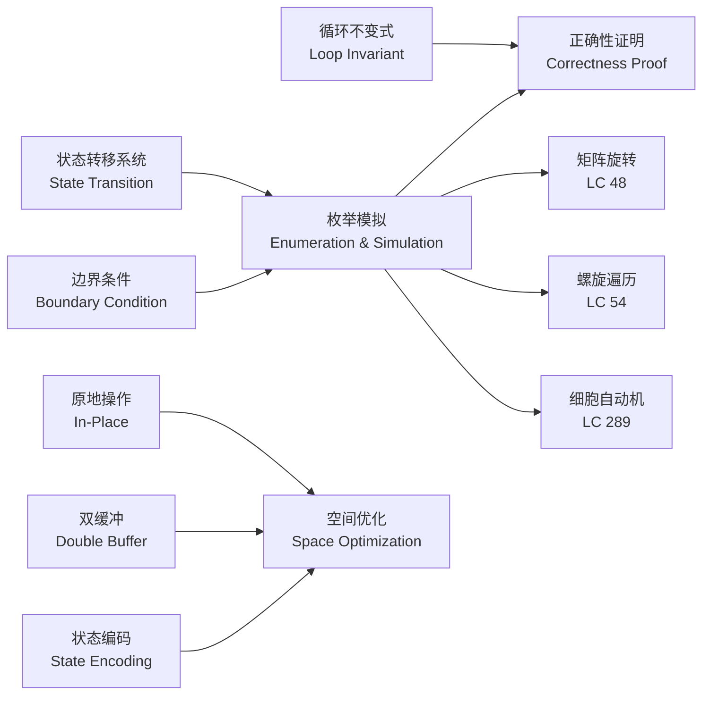
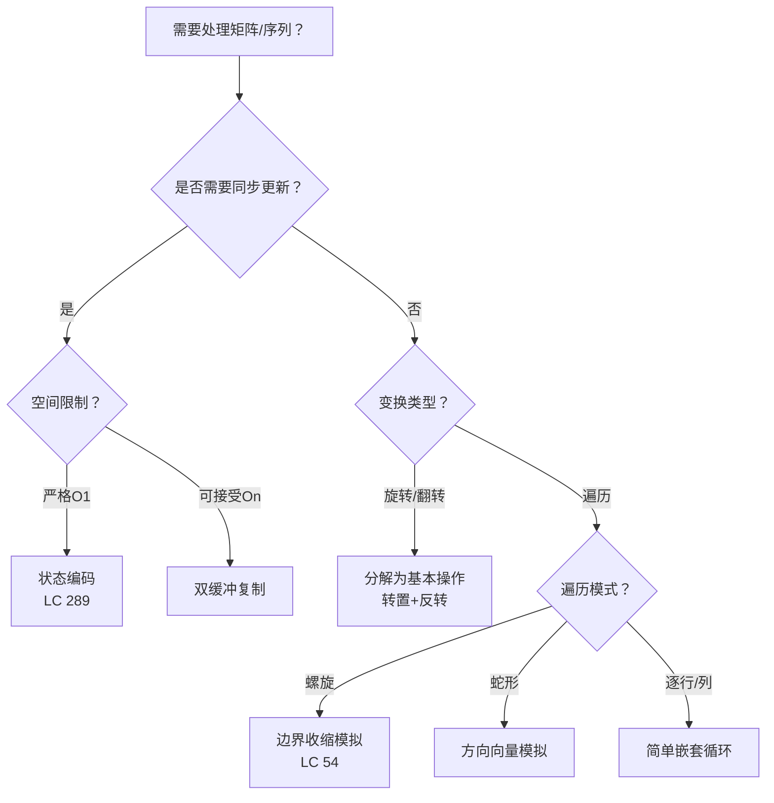
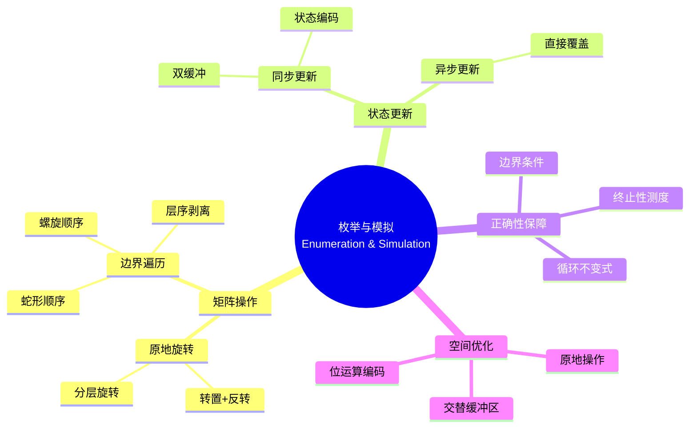

> 📊 **项目全面梳理**：详细的项目结构、模块详解和学习路径，请参阅 [`项目全面梳理-2025.md`](../../项目全面梳理-2025.md)

## 枚举与模拟 / Enumeration and Simulation

### 摘要 / Executive Summary

- 枚举与模拟是算法面试中最基础也最不可或缺的范式：它不依赖复杂数据结构，而是**严格按照问题描述逐步执行**，通过状态转移系统刻画算法的每一步演进。
- 本文从**形式化定义**出发，将模拟过程抽象为状态转移系统 $\mathcal{M} = (S, S_0, \delta, F)$，建立边界条件与步进规则的形式化描述。
- 通过 LeetCode 48（旋转图像）、54（螺旋矩阵）、289（生命游戏）三道经典题目的形式化规约、核心思路、代码实现与复杂度分析，展示枚举模拟在矩阵操作、边界控制与同步更新三个场景下的应用模式与正确性证明方法。

### 关键术语与符号 / Glossary

| 术语 / Term | 定义 / Definition |
|-------------|-------------------|
| 状态转移系统 State Transition System | 四元组 $\mathcal{M} = (S, S_0, \delta, F)$，其中 $S$ 为状态集，$S_0$ 为初始状态，$\delta: S \to S$ 为转移函数，$F \subseteq S$ 为终止状态集 |
| 模拟步进 Simulation Step | 状态转移的一次应用：$s_{t+1} = \delta(s_t)$，将系统从时刻 $t$ 推进到 $t+1$ |
| 边界条件 Boundary Condition | 算法执行过程中必须维持的不变量，如数组下标范围、矩阵边界、链表非空等 |
| 原地操作 In-Place Operation | 空间复杂度为 $O(1)$ 的变换，输出直接覆盖输入数据结构 |
| 双缓冲 Double Buffering | 使用两套状态缓冲区交替读写，避免读写冲突的同步更新技术 |
| 矩阵转置 Matrix Transpose | 将矩阵 $A$ 的行列互换得到 $A^T$，即 $A^T[i][j] = A[j][i]$ |

术语对齐与引用规范：`docs/术语与符号总表.md`，`01-基础理论/00-撰写规范与引用指南.md`

### 目录 / Table of Contents

- [枚举与模拟 / Enumeration and Simulation](#枚举与模拟--enumeration-and-simulation)
  - [摘要 / Executive Summary](#摘要--executive-summary)
  - [关键术语与符号 / Glossary](#关键术语与符号--glossary)
  - [目录 / Table of Contents](#目录--table-of-contents)
  - [交叉引用与依赖 / Cross-References and Dependencies](#交叉引用与依赖--cross-references-and-dependencies)
- [1. 形式化定义 / Formal Definitions](#1-形式化定义--formal-definitions)
  - [1.1 状态转移系统](#11-状态转移系统)
  - [1.2 模拟步进与边界条件](#12-模拟步进与边界条件)
- [2. 核心思路与算法框架 / Core Ideas and Algorithm Framework](#2-核心思路与算法框架--core-ideas-and-algorithm-framework)
  - [2.1 原地矩阵操作模板](#21-原地矩阵操作模板)
  - [2.2 边界收缩模拟模板](#22-边界收缩模拟模板)
  - [2.3 同步状态更新模板（双缓冲）](#23-同步状态更新模板双缓冲)
- [3. 经典题目详解 / Classic Problem Analysis](#3-经典题目详解--classic-problem-analysis)
  - [3.1 LeetCode 48 — Rotate Image](#31-leetcode-48--rotate-image)
    - [形式化规约 / Formal Specification](#形式化规约--formal-specification)
    - [核心思路 / Core Idea](#核心思路--core-idea)
    - [代码实现 / Code Implementations](#代码实现--code-implementations)
    - [复杂度分析 / Complexity Analysis](#复杂度分析--complexity-analysis)
    - [正确性证明 / Correctness Proof](#正确性证明--correctness-proof)
  - [3.2 LeetCode 54 — Spiral Matrix](#32-leetcode-54--spiral-matrix)
    - [形式化规约 / Formal Specification](#形式化规约--formal-specification-1)
    - [核心思路 / Core Idea](#核心思路--core-idea-1)
    - [代码实现 / Code Implementations](#代码实现--code-implementations-1)
    - [复杂度分析 / Complexity Analysis](#复杂度分析--complexity-analysis-1)
    - [正确性证明 / Correctness Proof](#正确性证明--correctness-proof-1)
  - [3.3 LeetCode 289 — Game of Life](#33-leetcode-289--game-of-life)
    - [形式化规约 / Formal Specification](#形式化规约--formal-specification-2)
    - [核心思路 / Core Idea](#核心思路--core-idea-2)
    - [代码实现 / Code Implementations](#代码实现--code-implementations-2)
    - [复杂度分析 / Complexity Analysis](#复杂度分析--complexity-analysis-2)
    - [正确性证明 / Correctness Proof](#正确性证明--correctness-proof-2)
- [4. 复杂度分析体系 / Complexity Analysis](#4-复杂度分析体系--complexity-analysis)
  - [4.1 时间复杂度严格推导](#41-时间复杂度严格推导)
  - [4.2 空间复杂度](#42-空间复杂度)
- [5. 正确性证明框架 / Correctness Proof Framework](#5-正确性证明框架--correctness-proof-framework)
  - [5.1 通用证明模板](#51-通用证明模板)
- [6. 思维表征 / Thinking Representations](#6-思维表征--thinking-representations)
  - [6.1 概念依赖图](#61-概念依赖图)
  - [6.2 算法选择决策树](#62-算法选择决策树)
  - [6.3 多维矩阵对比表](#63-多维矩阵对比表)
  - [6.4 思维导图：枚举模拟范式](#64-思维导图枚举模拟范式)
- [7. 常见错误与反模式 / Common Mistakes and Anti-Patterns](#7-常见错误与反模式--common-mistakes-and-anti-patterns)
  - [7.1 转置遍历全表导致重复交换](#71-转置遍历全表导致重复交换)
  - [7.2 螺旋矩阵边界收缩遗漏条件判断](#72-螺旋矩阵边界收缩遗漏条件判断)
  - [7.3 生命游戏同步更新被破坏](#73-生命游戏同步更新被破坏)
  - [7.4 邻居计数越界](#74-邻居计数越界)
- [8. 自测问题 / Self-Assessment Questions](#8-自测问题--self-assessment-questions)
  - [问题 1：旋转操作的代数分解](#问题-1旋转操作的代数分解)
  - [问题 2：螺旋矩阵的终止条件](#问题-2螺旋矩阵的终止条件)
  - [问题 3：状态编码的通用性](#问题-3状态编码的通用性)
  - [问题 4：原地操作的空间下界](#问题-4原地操作的空间下界)
  - [问题 5：模拟与递归的关系](#问题-5模拟与递归的关系)
- [9. 学习目标 / Learning Objectives](#9-学习目标--learning-objectives)
- [10. 知识导航 / Knowledge Navigation](#10-知识导航--knowledge-navigation)
- [参考文献 / References](#参考文献--references)

### 交叉引用与依赖 / Cross-References and Dependencies

**上游理论依赖 / Upstream Dependencies**:

- [`09-算法理论/01-算法基础/01-算法概述.md`](../../09-算法理论/01-算法基础/01-算法概述.md) — 算法的基本定义与性质
- [`04-算法复杂度/01-时间复杂度.md`](../../04-算法复杂度/01-时间复杂度.md) — 时间复杂度 $O/\Omega/\Theta$ 的形式化定义
- [`01-算法基础/03-数组与字符串.md`](../../01-算法基础/03-数组与字符串.md) — 数组的随机访问性质与矩阵存储方式

**下游应用 / Downstream Applications**:

- `13-LeetCode算法面试专题/02-算法范式专题/02-递归与分治.md` — 模拟常与递归结合解决复杂问题
- `13-LeetCode算法面试专题/03-数据结构专题/02-链表.md` — 链表操作的模拟技巧

---

## 1. 形式化定义 / Formal Definitions

### 1.1 状态转移系统

**定义 1.1** (模拟状态转移系统 / Simulation State Transition System)
模拟算法可以形式化地定义为一个四元组：
**Definition 1.1** (Simulation State Transition System)
A simulation algorithm can be formally defined as a quadruple:

$$
\mathcal{M} = (S, S_0, \delta, F)
$$

其中 / Where:

- $S$：状态集合（State Set），每个状态 $s \in S$ 表示算法某一时刻的完整快照
- $S_0 \subseteq S$：初始状态集（Initial States）
- $\delta: S \to S$：转移函数（Transition Function），定义单步状态演化
- $F \subseteq S$：终止状态集（Final States），满足 $f \in F \Rightarrow \delta(f) = f$（不动点）

**算法描述 / Algorithm Description**:

```text
Simulate(S0, δ):
    s ← S0
    while s ∉ F:
        s ← δ(s)
    return s
```

### 1.2 模拟步进与边界条件

**定义 1.2** (模拟步进 / Simulation Step)
设当前状态为 $s_t = (D_t, P_t, V_t)$，其中 $D_t$ 为数据结构快照，$P_t$ 为指针/索引集合，$V_t$ 为辅助变量集合。单步转移定义为：

$$
\delta(s_t) = s_{t+1} = (D_{t+1}, P_{t+1}, V_{t+1})
$$

**边界条件 / Boundary Condition**:
边界条件是状态空间上的谓词 $B(s)$，在每次步进前必须保持：

$$
B(s_t) \equiv \bigwedge_{i} \text{bound}_i(s_t)
$$

常见边界条件包括：

- 索引边界：$0 \leq i < n \land 0 \leq j < m$
- 链表非空：$\text{node} \neq \text{null}$
- 栈/队列容量：$0 \leq \text{size} \leq \text{capacity}$

**不变式 / Invariant**:
模拟算法的循环不变式通常具有如下形式：

$$
Inv(s_t) \equiv B(s_t) \land Progress(s_t)
$$

其中 $Progress(s_t)$ 表示"问题已解决的部分正确且未被破坏"。

---

## 2. 核心思路与算法框架 / Core Ideas and Algorithm Framework

枚举与模拟的本质是**忠实执行**：按照问题的自然描述，一步一步地推进状态，不取巧、不跳跃，用严谨的边界控制保证正确性。

### 2.1 原地矩阵操作模板

**适用场景 / Applicability**: 矩阵旋转、翻转、转置等几何变换。

**核心策略**: 通过数学等价分解（如"转置 + 反转 = 旋转"），将复杂变换拆解为若干个简单的原地操作序列。

```text
InPlaceTransform(matrix):
    // 步骤1：转置
    for i = 0 to n-1:
        for j = i+1 to n-1:
            swap(matrix[i][j], matrix[j][i])
    // 步骤2：行反转
    for i = 0 to n-1:
        reverse(matrix[i])
```

**不变式**: 每完成一个子步骤，矩阵的某个性质（如"左上三角已转置"）得到保持，且已处理部分不会被后续步骤破坏。

### 2.2 边界收缩模拟模板

**适用场景 / Applicability**: 螺旋矩阵、蛇形遍历、层序剥离等需要逐层收缩边界的场景。

```text
BoundaryShrink(matrix):
    top ← 0, bottom ← n-1
    left ← 0, right ← m-1
    while top ≤ bottom ∧ left ≤ right:
        // 遍历当前边界
        traverse top row from left to right
        top ← top + 1
        traverse right column from top to bottom
        right ← right - 1
        if top ≤ bottom:
            traverse bottom row from right to left
            bottom ← bottom - 1
        if left ≤ right:
            traverse left column from bottom to top
            left ← left + 1
```

**不变式**: $Inv(top, bottom, left, right)$：所有在边界 $[0, top-1] \cup [bottom+1, n-1] \cup [0, left-1] \cup [right+1, m-1]$ 内的元素均已被按正确顺序访问。

### 2.3 同步状态更新模板（双缓冲）

**适用场景 / Applicability**: 细胞自动机、生命游戏等需要所有单元格同时更新的场景。

```text
DoubleBufferUpdate(grid):
    next ← copy(grid)
    for each cell (i, j):
        next[i][j] ← compute_new_state(grid, i, j)
    return next
```

**关键问题**: 若直接在 $grid$ 上原地更新，则先更新的单元格会影响后更新单元格的邻居计数，破坏同步性。

**优化**: 使用状态编码将两代信息压缩到一个整数中（如用二进制位表示），实现真正的 $O(1)$ 空间同步更新。

---

## 3. 经典题目详解 / Classic Problem Analysis

### 3.1 LeetCode 48 — Rotate Image

> **题目链接 / Problem Link**: [LeetCode 48. Rotate Image](https://leetcode.com/problems/rotate-image/)
> **难度 / Difficulty**: Medium

#### 形式化规约 / Formal Specification

**前置条件 / Precondition**:

$$
\textit{matrix} \in \mathbb{Z}^{n \times n}, \quad n \geq 1
$$

**后置条件 / Postcondition**:

$$
\forall i, j \in [0, n-1]: \textit{matrix}_{new}[i][j] = \textit{matrix}_{old}[n-1-j][i]
$$

即矩阵顺时针旋转 $90°$。

#### 核心思路 / Core Idea

将旋转 $90°$ 分解为两个基本操作的复合：

1. **转置**（Transpose）：$A[i][j] \leftrightarrow A[j][i]$
2. **行反转**（Row Reverse）：每行左右翻转

数学验证：设原矩阵为 $M$，转置后为 $M^T$，行反转后为 $(M^T)^{rev}$：

$$
(M^T)^{rev}[i][j] = M^T[i][n-1-j] = M[n-1-j][i]
$$

恰好等于顺时针旋转 $90°$ 的定义。

#### 代码实现 / Code Implementations

**Python**:

```python
def rotate(matrix: list[list[int]]) -> None:
    n = len(matrix)
    # 转置
    for i in range(n):
        for j in range(i + 1, n):
            matrix[i][j], matrix[j][i] = matrix[j][i], matrix[i][j]
    # 行反转
    for i in range(n):
        matrix[i].reverse()
```

**Rust**:

```rust
pub fn rotate(matrix: &mut Vec<Vec<i32>>) {
    let n = matrix.len();
    // 转置
    for i in 0..n {
        for j in (i + 1)..n {
            let tmp = matrix[i][j];
            matrix[i][j] = matrix[j][i];
            matrix[j][i] = tmp;
        }
    }
    // 行反转
    for i in 0..n {
        matrix[i].reverse();
    }
}
```

**Go**:

```go
func rotate(matrix [][]int) {
    n := len(matrix)
    // 转置
    for i := 0; i < n; i++ {
        for j := i + 1; j < n; j++ {
            matrix[i][j], matrix[j][i] = matrix[j][i], matrix[i][j]
        }
    }
    // 行反转
    for i := 0; i < n; i++ {
        for l, r := 0, n-1; l < r; l, r = l+1, r-1 {
            matrix[i][l], matrix[i][r] = matrix[i][r], matrix[i][l]
        }
    }
}
```

#### 复杂度分析 / Complexity Analysis

| 指标 / Metric | 值 / Value | 说明 / Note |
|--------------|-----------|------------|
| 时间复杂度 / Time | $O(n^2)$ | 转置遍历上三角 $n(n-1)/2$ 个元素，行反转 $n \times n/2$ |
| 空间复杂度 / Space | $O(1)$ | 原地操作，仅使用常数额外空间 |

#### 正确性证明 / Correctness Proof

**定理 3.1.1** (LeetCode 48 正确性): 算法正确将 $n \times n$ 矩阵顺时针旋转 $90°$。

**证明 / Proof**:

**引理 1** (转置正确性): 转置操作后，$\forall i, j: M'[i][j] = M_{old}[j][i]$。

*证明*: 转置仅交换 $(i,j)$ 与 $(j,i)$ 位置的元素。对于 $i = j$ 的对角线元素，交换自身无变化；对于 $i \neq j$，交换后位置 $(i,j)$ 存放原位置 $(j,i)$ 的值。$lacksquare$

**引理 2** (行反转正确性): 行反转操作后，$\forall i, j: M''[i][j] = M'[i][n-1-j]$。

*证明*: 每行独立反转，直接由反转操作定义。$lacksquare$

**主证明**:
由引理1和引理2：

$$
M''[i][j] = M'[i][n-1-j] = M_{old}[n-1-j][i]
$$

恰好等于顺时针旋转 $90°$ 的数学定义，证毕。$lacksquare$

**原地操作正确性**: 转置操作中，每次交换的两个位置 $(i,j)$ 和 $(j,i)$ 互不重叠（$i \neq j$ 时），且对角线元素无需处理，因此不会丢失信息。行反转在转置完成后进行，不影响转置结果。

---

### 3.2 LeetCode 54 — Spiral Matrix

> **题目链接 / Problem Link**: [LeetCode 54. Spiral Matrix](https://leetcode.com/problems/spiral-matrix/)
> **难度 / Difficulty**: Medium

#### 形式化规约 / Formal Specification

**前置条件 / Precondition**:

$$
\textit{matrix} \in \mathbb{Z}^{m \times n}, \quad m, n \geq 1
$$

**后置条件 / Postcondition**:
返回序列 $R = [r_0, r_1, \ldots, r_{mn-1}]$，其中 $r_k$ 为按顺时针螺旋顺序访问的第 $k$ 个元素。

#### 核心思路 / Core Idea

采用**边界收缩模拟**：维护四个边界变量 $top, bottom, left, right$，每遍历完一条边就收缩对应边界，直到边界相交。

**方向序列**: 右 $\to$ 下 $\to$ 左 $\to$ 上 $\to$ 右 $\to \ldots$

#### 代码实现 / Code Implementations

**Python**:

```python
def spiralOrder(matrix: list[list[int]]) -> list[int]:
    if not matrix or not matrix[0]:
        return []
    res = []
    top, bottom = 0, len(matrix) - 1
    left, right = 0, len(matrix[0]) - 1

    while top <= bottom and left <= right:
        # 向右
        for j in range(left, right + 1):
            res.append(matrix[top][j])
        top += 1
        # 向下
        for i in range(top, bottom + 1):
            res.append(matrix[i][right])
        right -= 1
        # 向左
        if top <= bottom:
            for j in range(right, left - 1, -1):
                res.append(matrix[bottom][j])
            bottom -= 1
        # 向上
        if left <= right:
            for i in range(bottom, top - 1, -1):
                res.append(matrix[i][left])
            left += 1
    return res
```

#### 复杂度分析 / Complexity Analysis

| 指标 / Metric | 值 / Value |
|--------------|-----------|
| 时间复杂度 / Time | $O(m \times n)$ | 每个元素恰好访问一次 |
| 空间复杂度 / Space | $O(1)$ | 不计输出数组，仅使用4个边界变量 |

#### 正确性证明 / Correctness Proof

**定理 3.2.1** (LeetCode 54 正确性): 算法按顺时针螺旋顺序返回矩阵中所有元素。

**证明 / Proof**:

**循环不变式 / Loop Invariant**:

$$
Inv(top, bottom, left, right) \equiv \text{所有在收缩边界外的元素已按正确顺序输出}
$$

形式化地，设已输出序列为 $R$，则：

- 第 $0$ 到 $top-1$ 行的所有元素已按顺序输出
- 第 $bottom+1$ 到 $m-1$ 行的所有元素已按顺序输出
- 第 $0$ 到 $left-1$ 列的所有元素已按顺序输出
- 第 $right+1$ 到 $n-1$ 列的所有元素已按顺序输出

**初始化**: $top=0, bottom=m-1, left=0, right=n-1$。边界外无元素，不变式成立。

**保持**:

- 向右遍历：输出第 $top$ 行从 $left$ 到 $right$ 的所有元素，然后 $top \leftarrow top + 1$。此时第 $0$ 到 $top-1$ 行已全部输出。
- 向下遍历：输出第 $right$ 列从 $top$ 到 $bottom$ 的所有元素，然后 $right \leftarrow right - 1$。此时第 $right+1$ 到 $n-1$ 列已全部输出。
- 向左/向上同理。

每次遍历后，对应边界收缩，不变式保持。

**终止**: 当 $top > bottom$ 或 $left > right$ 时，边界内无未访问元素。由不变式，所有元素已按正确顺序输出。

**终止性**: 每次迭代至少收缩一个边界（$top$ 增加或 $bottom$ 减少或 $left$ 增加或 $right$ 减少），边界距离严格递减且有下界，必在有限步终止。$lacksquare$

---

### 3.3 LeetCode 289 — Game of Life

> **题目链接 / Problem Link**: [LeetCode 289. Game of Life](https://leetcode.com/problems/game-of-life/)
> **难度 / Difficulty**: Medium

#### 形式化规约 / Formal Specification

**前置条件 / Precondition**:

$$
\textit{board} \in \{0, 1\}^{m \times n}, \quad m, n \geq 1
$$

其中 $0$ 表示死细胞，$1$ 表示活细胞。

**后置条件 / Postcondition**:

$$
\forall i, j: \textit{board}_{new}[i][j] = \text{next_state}(\textit{board}_{old}, i, j)
$$

其中 $\text{next_state}$ 遵循生命游戏规则：

- 活细胞（$1$）：邻居中有 $2$ 或 $3$ 个活细胞则存活，否则死亡
- 死细胞（$0$）：邻居中恰好有 $3$ 个活细胞则复活

邻居定义为 $8$ 连通（上下左右 + 四个对角线）。

#### 核心思路 / Core Idea

**关键挑战**: 所有细胞必须**同步更新**——当前细胞的下一状态只能依赖当前代（$t$）的邻居状态，不能依赖已更新的 $t+1$ 代状态。

**解法一：双缓冲（显式复制）**
复制原板到 $copy$，基于 $copy$ 计算新状态写入 $board$。

**解法二：状态编码（$O(1)$ 空间）**
利用细胞值只有 $0/1$ 两个状态，引入中间状态：

- $0 \to 0$：死细胞保持死，编码为 $0$
- $1 \to 1$：活细胞保持活，编码为 $1$
- $0 \to 1$：死细胞复活，编码为 $2$
- $1 \to 0$：活细胞死亡，编码为 $3$

遍历时通过 $board[i][j] \& 1$ 获取当前代状态，第二轮将 $2, 3$ 还原为 $1, 0$。

#### 代码实现 / Code Implementations

**Python（$O(1)$ 空间）**:

```python
def gameOfLife(board: list[list[int]]) -> None:
    m, n = len(board), len(board[0])
    dirs = [(-1,-1),(-1,0),(-1,1),(0,-1),(0,1),(1,-1),(1,0),(1,1)]

    # 第一轮：计算下一状态并编码
    for i in range(m):
        for j in range(n):
            live = 0
            for di, dj in dirs:
                ni, nj = i + di, j + dj
                if 0 <= ni < m and 0 <= nj < n and board[ni][nj] & 1:
                    live += 1

            if board[i][j] == 1 and (live == 2 or live == 3):
                board[i][j] = 3  # 1 -> 1 (二进制 11)
            elif board[i][j] == 0 and live == 3:
                board[i][j] = 2  # 0 -> 1 (二进制 10)
            # else: 状态 0 或 1 保持不变意义

    # 第二轮：解码
    for i in range(m):
        for j in range(n):
            board[i][j] >>= 1
```

**Rust（$O(1)$ 空间）**:

```rust
pub fn game_of_life(board: &mut Vec<Vec<i32>>) {
    let m = board.len();
    let n = board[0].len();
    let dirs = [(-1i32,-1),( -1,0),(-1,1),(0,-1),(0,1),(1,-1),(1,0),(1,1)];

    for i in 0..m {
        for j in 0..n {
            let mut live = 0;
            for (di, dj) in &dirs {
                let ni = i as i32 + di;
                let nj = j as i32 + dj;
                if ni >= 0 && ni < m as i32 && nj >= 0 && nj < n as i32 {
                    let ni = ni as usize;
                    let nj = nj as usize;
                    if board[ni][nj] & 1 == 1 {
                        live += 1;
                    }
                }
            }

            if board[i][j] == 1 && (live == 2 || live == 3) {
                board[i][j] = 3;
            } else if board[i][j] == 0 && live == 3 {
                board[i][j] = 2;
            }
        }
    }

    for i in 0..m {
        for j in 0..n {
            board[i][j] >>= 1;
        }
    }
}
```

#### 复杂度分析 / Complexity Analysis

| 指标 / Metric | 值 / Value | 说明 / Note |
|--------------|-----------|------------|
| 时间复杂度 / Time | $O(m \times n)$ | 每个单元格访问一次，每次检查8个邻居 |
| 空间复杂度 / Space | $O(1)$ | 状态编码方案，仅原地修改 |
| 空间复杂度（双缓冲） | $O(m \times n)$ | 显式复制原板 |

#### 正确性证明 / Correctness Proof

**定理 3.3.1** (LeetCode 289 正确性): 状态编码方案正确实现同步状态更新。

**证明 / Proof**:

**关键性质**: 编码状态的高低位设计保证了读取当前代状态的独立性。

设编码后的状态值为 $v \in \{0, 1, 2, 3\}$：

- $v = 0$ ($00_2$): 原死，新死
- $v = 1$ ($01_2$): 原活，新死
- $v = 2$ ($10_2$): 原死，新活
- $v = 3$ ($11_2$): 原活，新活

**引理** (当前代状态可恢复): $\forall v \in \{0,1,2,3\}: v \& 1 = \text{原状态}$。

*证明*: $0 \& 1 = 0$, $1 \& 1 = 1$, $2 \& 1 = 0$, $3 \& 1 = 1$。恰好对应原状态。$lacksquare$

**同步性保证**:
第一轮遍历时，所有邻居状态读取均使用 $board[ni][nj] \& 1$，即原始状态（$0$ 或 $1$），不受当前轮次中其他细胞编码的影响。因此每个细胞的下一状态计算仅依赖于当前代的全局状态，满足同步更新要求。

**解码正确性**:
第二轮 $board[i][j] >>= 1$ 将：

- $2$ ($10_2$) $\to 1$（复活）
- $3$ ($11_2$) $\to 1$（存活）
- $0$ ($00_2$) $\to 0$（保持死）
- $1$ ($01_2$) $\to 0$（死亡）

恰好对应生命游戏的规则，证毕。$lacksquare$

---

## 4. 复杂度分析体系 / Complexity Analysis

### 4.1 时间复杂度严格推导

**定理 4.1** (枚举模拟时间复杂度上界)
对于规模为 $N$ 的问题实例，若模拟算法每步处理常数规模的数据，则时间复杂度为 $O(N)$；若每步需扫描 $O(N)$ 规模的数据，则时间复杂度为 $O(N^2)$。

**证明 / Proof**:
设状态转移系统 $\mathcal{M}$ 的每步执行时间为 $T_{step}$，总步数为 $K$。

- **线性模拟**: 每步处理固定数量的元素（如螺旋矩阵每步访问一行/一列边界），总元素数 $N = m \times n$，故 $K = O(N)$, $T_{step} = O(1)$，总时间 $T = O(N)$。
- **矩阵变换**: 转置操作访问上三角 $N/2$ 个元素，行反转访问 $N$ 个元素，总时间 $T = O(N)$。
- **邻居扫描**: 生命游戏每步扫描 $8$ 个邻居，$T_{step} = O(1)$，总时间 $T = O(N)$。

### 4.2 空间复杂度

| 算法类型 | 空间复杂度 | 说明 |
|---------|-----------|------|
| 原地矩阵操作 | $O(1)$ | 仅常数额外变量 |
| 边界收缩模拟 | $O(1)$ | 仅边界变量 |
| 双缓冲同步更新 | $O(N)$ | 额外复制一份状态 |
| 状态编码同步更新 | $O(1)$ | 利用数值位编码 |

---

## 5. 正确性证明框架 / Correctness Proof Framework

### 5.1 通用证明模板

枚举模拟算法的正确性证明通常遵循以下模式：

**步骤 1 — 状态不变式建立**:
定义 $Inv(s_t)$ 刻画"已处理部分的正确性"。

**步骤 2 — 初始化验证**:
验证 $Inv(S_0)$ 成立。

**步骤 3 — 保持性证明**:
假设 $Inv(s_t)$ 成立，证明 $Inv(\delta(s_t))$ 成立。

**步骤 4 — 终止性证明**:
证明存在良基测度 $\mu: S \to \mathbb{N}$ 使得 $\mu(\delta(s)) < \mu(s)$，从而保证有限步终止。

**步骤 5 — 终止时正确性**:
证明 $s \in F \land Inv(s) \Rightarrow \text{postcondition}$。

---

## 6. 思维表征 / Thinking Representations

### 6.1 概念依赖图



### 6.2 算法选择决策树



### 6.3 多维矩阵对比表

| 维度 / Dimension | LC 48 旋转图像 | LC 54 螺旋矩阵 | LC 289 生命游戏 |
|----------------|--------------|--------------|----------------|
| **核心操作** | 转置 + 行反转 | 边界收缩遍历 | 邻居计数 + 状态转移 |
| **空间策略** | 原地 $O(1)$ | 边界变量 $O(1)$ | 状态编码 $O(1)$ |
| **时间复杂度** | $O(n^2)$ | $O(mn)$ | $O(mn)$ |
| **不变式核心** | 转置后行列互换 | 边界外已正确输出 | 编码值保留原状态 |
| **易错点** | 转置仅遍历上三角 | 边界收缩条件判断 | 同步性/邻居越界 |
| **证明方法** | 代数复合验证 | 循环不变式 | 位运算编码性质 |

### 6.4 思维导图：枚举模拟范式



---

## 7. 常见错误与反模式 / Common Mistakes and Anti-Patterns

### 7.1 转置遍历全表导致重复交换

**错误**: 转置时遍历整个矩阵而非仅上三角，导致交换两次等于没交换。

```python
# 错误：遍历整个矩阵
for i in range(n):
    for j in range(n):      # ❌ 应该是 range(i+1, n)
        swap(matrix[i][j], matrix[j][i])
```

**修复**: 仅遍历上三角 $j \in [i+1, n-1]$，确保每对元素只交换一次。

### 7.2 螺旋矩阵边界收缩遗漏条件判断

**错误**: 向左或向上遍历前未检查边界是否已相交，导致重复访问。

```python
# 错误：缺少边界检查
for j in range(right, left - 1, -1):   # ❌ 可能 top > bottom
    res.append(matrix[bottom][j])
```

**修复**: 在向左/向上遍历前检查 `if top <= bottom` 和 `if left <= right`。

### 7.3 生命游戏同步更新被破坏

**错误**: 直接在原数组上更新，导致后续细胞读取到已更新的状态。

```python
# 错误：直接覆盖
board[i][j] = new_state     # ❌ 影响后续邻居计数
```

**修复**: 使用双缓冲或状态编码方案，确保邻居计数只读取原始状态。

### 7.4 邻居计数越界

**错误**: 检查 $8$ 个邻居时未处理矩阵边界，导致数组越界访问。

**修复**: 使用方向向量 + 边界检查，或预先在矩阵四周填充哨兵值。

---

## 8. 自测问题 / Self-Assessment Questions

### 问题 1：旋转操作的代数分解

**Q**: 为什么矩阵顺时针旋转 $90°$ 可以分解为"转置 + 行反转"？逆时针旋转 $90°$ 如何分解？

**A**: 顺时针 $90°$：$(M^T)^{rev}[i][j] = M^T[i][n-1-j] = M[n-1-j][i]$，符合旋转定义。
逆时针 $90°$：可以分解为"转置 + 列反转"，或等价地"行反转 + 转置"。

### 问题 2：螺旋矩阵的终止条件

**Q**: 螺旋矩阵算法中，为什么在向左和向上遍历前需要额外的边界检查？

**A**: 当矩阵行数为奇数、列数为偶数（或反之）时，向右+向下遍历后可能已访问完所有元素。此时 $top$ 可能已大于 $bottom$，若不加检查会重复访问已输出的元素。

### 问题 3：状态编码的通用性

**Q**: 生命游戏的状态编码方案（使用二进制位）能否推广到其他细胞自动机？

**A**: 可以，只要满足：

1. 原状态可用 $k$ 位表示（生命游戏只需 $1$ 位）
2. 新状态也可用 $k$ 位表示
3. 编码后有足够的位空间存储两代信息

例如原状态 $1$ 位、新状态 $1$ 位，用 $2$ 位即可。若规则更复杂（如有 $4$ 种状态），可能需要更多位或改用双缓冲。

### 问题 4：原地操作的空间下界

**Q**: 所有矩阵变换都能原地完成吗？

**A**: 否。原地操作要求变换是 $S_n$ 中的置换（双射）。若变换不可逆或需要额外信息（如卷积），则无法原地完成。旋转、翻转、转置都是置换，可以原地完成。

### 问题 5：模拟与递归的关系

**Q**: 模拟和递归有什么区别？何时用模拟、何时用递归？

**A**:

- **模拟**：显式维护状态，用循环推进，适合状态转移规则明确、深度可控的问题
- **递归**：利用调用栈隐式维护状态，适合问题具有自相似结构（子问题与原问题同构）

选择原则：若问题的"下一步"只依赖当前状态，用模拟；若依赖子问题的解，用递归。例如螺旋矩阵用模拟（规则明确），汉诺塔用递归（子问题同构）。

---

## 9. 学习目标 / Learning Objectives

完成本章学习后，读者应能够：

1. **形式化描述**模拟算法的四元组状态转移系统，写出边界条件与循环不变式。
2. **独立推导**基于不变式的三条件正确性证明（初始化、保持、终止）。
3. **熟练运用**原地矩阵操作技巧（转置、反转）及其代数复合验证方法。
4. **正确实现**边界收缩模拟算法，并处理各种边界相交的终止情况。
5. **设计状态编码方案**实现 $O(1)$ 空间的同步状态更新，并证明其正确性。

---

## 10. 知识导航 / Knowledge Navigation

| 领域 / Area | 前一主题 / Previous | 下一主题 / Next |
|------------|-------------------|----------------|
| 算法范式 | — | `02-递归与分治.md` |
| 复杂度专题 | `04-算法复杂度/01-时间复杂度.md` | `04-算法复杂度/02-空间复杂度.md` |
| 数据结构 | `03-数据结构专题/01-数组与矩阵.md` | `03-数据结构专题/02-链表.md` |

---

## 参考文献 / References

- [CLRS2022] Cormen, T. H., et al. *Introduction to Algorithms* (4th ed.). MIT Press, 2022. §2.1 循环不变式
- [Knuth1997] Knuth, D. E. *The Art of Computer Programming, Vol. 1*. Addison-Wesley, 1997. §2.2.2 顺序分配
- [Gardner1970] Gardner, M. "Mathematical Games — The fantastic combinations of John Conway's new solitaire game 'life'." *Scientific American*, 223 (1970): 120–123.
- LeetCode 48, 54, 289 官方题解与讨论区

---

> 📚 **返回目录**: [LeetCode算法面试专题](../README.md)
