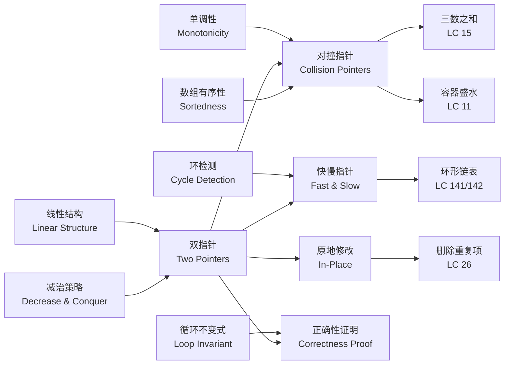
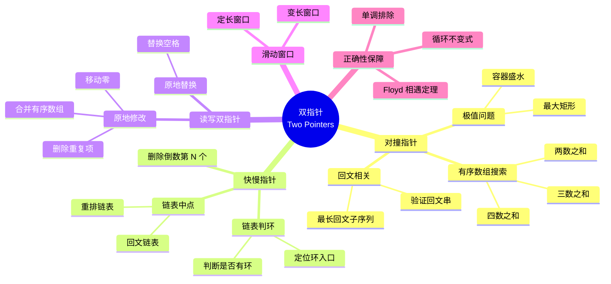
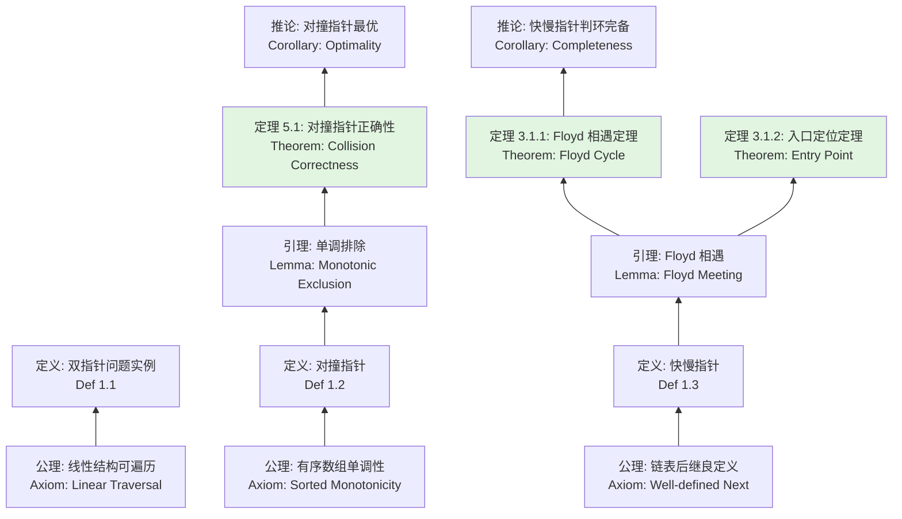

> 📊 **项目全面梳理**：详细的项目结构、模块详解和学习路径，请参阅 [`项目全面梳理-2025.md`](../../项目全面梳理-2025.md)

## 双指针 / Two Pointers

### 摘要 / Executive Summary

- 双指针（Two Pointers）是在**线性结构**（数组、链表）上通过维护两个索引/引用协同遍历，将 $O(n^2)$ 暴力枚举优化至 $O(n)$ 的核心算法范式。
- 本文从**形式化规约**出发，定义双指针、对撞指针与快慢指针三类模式，建立基于循环不变式的完整正确性证明框架。
- 通过 LeetCode 141/142/15/11/26 五道经典题目的形式化规约、核心思路、代码实现与复杂度分析，展示双指针在链表判环、有序数组搜索、容器面积计算与原地去重四个场景下的应用模式与证明方法。

### 关键术语与符号 / Glossary

| 术语 / Term | 定义 / Definition |
|-------------|-------------------|
| 双指针 Two Pointers | 在线性结构上同时维护两个遍历指针（索引或引用），通过协同移动达到 $O(n)$ 效率的算法策略 |
| 对撞指针 Collision Pointers | 分别置于序列两端，向中间靠拢的双指针变体，适用于有序序列的搜索与配对问题 |
| 快慢指针 Fast & Slow Pointers | 以不同步长（通常为 1:2）前进的双指针变体，Floyd 判环算法的核心机制 |
| 循环不变式 Loop Invariant | 算法每次迭代前后均保持的谓词，用于推导正确性 |
| 原地修改 In-Place Modification | 不使用额外数据结构，直接在输入数组上通过覆盖完成变换 |
| 单调性 Monotonicity | 随着指针移动，某个度量（如面积、和）呈现单调递增或递减的性质 |

术语对齐与引用规范：`docs/术语与符号总表.md`，`01-基础理论/00-撰写规范与引用指南.md`

### 目录 / Table of Contents

- [双指针 / Two Pointers](#双指针--two-pointers)
  - [摘要 / Executive Summary](#摘要--executive-summary)
  - [关键术语与符号 / Glossary](#关键术语与符号--glossary)
  - [目录 / Table of Contents](#目录--table-of-contents)
  - [交叉引用与依赖 / Cross-References and Dependencies](#交叉引用与依赖--cross-references-and-dependencies)
- [1. 形式化定义 / Formal Definitions](#1-形式化定义--formal-definitions)
  - [1.1 双指针问题实例](#11-双指针问题实例)
  - [1.2 对撞指针模式](#12-对撞指针模式)
  - [1.3 快慢指针模式](#13-快慢指针模式)
- [2. 核心思路与算法框架 / Core Ideas and Algorithm Framework](#2-核心思路与算法框架--core-ideas-and-algorithm-framework)
  - [2.1 对撞指针模板](#21-对撞指针模板)
  - [2.2 快慢指针模板](#22-快慢指针模板)
  - [2.3 原地修改双指针模板](#23-原地修改双指针模板)
- [3. 经典题目详解 / Classic Problem Analysis](#3-经典题目详解--classic-problem-analysis)
  - [3.1 LeetCode 141/142 — 环形链表检测 / Linked List Cycle](#31-leetcode-141142--环形链表检测--linked-list-cycle)
    - [形式化规约 / Formal Specification](#形式化规约--formal-specification)
    - [核心思路 / Core Idea](#核心思路--core-idea)
    - [代码实现 / Code Implementations](#代码实现--code-implementations)
    - [复杂度分析 / Complexity Analysis](#复杂度分析--complexity-analysis)
    - [正确性证明 / Correctness Proof](#正确性证明--correctness-proof)
  - [3.2 LeetCode 15 — 三数之和 / 3Sum](#32-leetcode-15--三数之和--3sum)
    - [形式化规约 / Formal Specification](#形式化规约--formal-specification-1)
    - [核心思路 / Core Idea](#核心思路--core-idea-1)
    - [代码实现 / Code Implementations](#代码实现--code-implementations-1)
    - [复杂度分析 / Complexity Analysis](#复杂度分析--complexity-analysis-1)
    - [正确性证明 / Correctness Proof](#正确性证明--correctness-proof-1)
  - [3.3 LeetCode 11 — 盛最多水的容器 / Container With Most Water](#33-leetcode-11--盛最多水的容器--container-with-most-water)
    - [形式化规约 / Formal Specification](#形式化规约--formal-specification-2)
    - [核心思路 / Core Idea](#核心思路--core-idea-2)
    - [代码实现 / Code Implementations](#代码实现--code-implementations-2)
    - [复杂度分析 / Complexity Analysis](#复杂度分析--complexity-analysis-2)
    - [正确性证明 / Correctness Proof](#正确性证明--correctness-proof-2)
  - [3.4 LeetCode 26 — 删除有序数组中的重复项 / Remove Duplicates from Sorted Array](#34-leetcode-26--删除有序数组中的重复项--remove-duplicates-from-sorted-array)
    - [形式化规约 / Formal Specification](#形式化规约--formal-specification-3)
    - [核心思路 / Core Idea](#核心思路--core-idea-3)
    - [代码实现 / Code Implementations](#代码实现--code-implementations-3)
    - [复杂度分析 / Complexity Analysis](#复杂度分析--complexity-analysis-3)
    - [正确性证明 / Correctness Proof](#正确性证明--correctness-proof-3)
- [4. 复杂度分析体系 / Complexity Analysis](#4-复杂度分析体系--complexity-analysis)
  - [4.1 时间复杂度严格推导](#41-时间复杂度严格推导)
  - [4.2 空间复杂度](#42-空间复杂度)
  - [4.3 与暴力枚举的对比](#43-与暴力枚举的对比)
- [5. 正确性证明框架 / Correctness Proof Framework](#5-正确性证明框架--correctness-proof-framework)
  - [5.1 定理：对撞指针正确性](#51-定理对撞指针正确性)
  - [5.2 证明树](#52-证明树)
- [6. 思维表征 / Thinking Representations](#6-思维表征--thinking-representations)
  - [6.1 概念依赖图](#61-概念依赖图)
  - [6.2 算法选择决策树](#62-算法选择决策树)
  - [6.3 多维矩阵：双指针 vs 哈希表解法](#63-多维矩阵双指针-vs-哈希表解法)
  - [6.4 思维导图：双指针技术体系](#64-思维导图双指针技术体系)
  - [6.5 公理定理证明树](#65-公理定理证明树)
- [7. 常见错误与反模式 / Common Mistakes and Anti-Patterns](#7-常见错误与反模式--common-mistakes-and-anti-patterns)
  - [7.1 对撞指针遗漏解](#71-对撞指针遗漏解)
  - [7.2 快慢指针初始化不一致](#72-快慢指针初始化不一致)
  - [7.3 去重逻辑遗漏](#73-去重逻辑遗漏)
  - [7.4 原地修改越界](#74-原地修改越界)
  - [7.5 忽略整数溢出](#75-忽略整数溢出)
- [8. 自测问题 / Self-Assessment Questions](#8-自测问题--self-assessment-questions)
  - [问题 1：对撞指针的单调排除原理](#问题-1对撞指针的单调排除原理)
  - [问题 2：Floyd 判环的相对速度](#问题-2floyd-判环的相对速度)
  - [问题 3：容器盛水的单调性证明](#问题-3容器盛水的单调性证明)
  - [问题 4：双指针与哈希表的权衡](#问题-4双指针与哈希表的权衡)
  - [问题 5：快慢指针找链表中点](#问题-5快慢指针找链表中点)
- [9. 学习目标 / Learning Objectives](#9-学习目标--learning-objectives)
- [10. 知识导航 / Knowledge Navigation](#10-知识导航--knowledge-navigation)
- [参考文献 / References](#参考文献--references)

### 交叉引用与依赖 / Cross-References and Dependencies

**上游理论依赖 / Upstream Dependencies**:

- [`09-算法理论/01-算法基础/04-搜索算法理论.md`](../../09-算法理论/01-算法基础/04-搜索算法理论.md) — 搜索算法的理论定义、复杂度概述与策略分类
- [`04-算法复杂度/01-时间复杂度.md`](../../04-算法复杂度/01-时间复杂度.md) — 时间复杂度 $O/\Omega/\Theta$ 的形式化定义与渐进分析
- `01-算法基础/02-递归与分治.md` — 减治策略的基本框架（双指针可视为减治的线性结构特化）

**下游应用 / Downstream Applications**:

- `13-LeetCode算法面试专题/02-算法范式专题/03-滑动窗口.md` — 滑动窗口是双指针在"可变宽度区间"上的推广
- `13-LeetCode算法面试专题/03-数据结构专题/04-二叉搜索树.md` — BST 的中序遍历中双指针的应用

---

## 1. 形式化定义 / Formal Definitions

### 1.1 双指针问题实例

**定义 1.1** (双指针问题实例 / Two Pointers Problem Instance)
双指针问题实例可以形式化地定义为一个五元组：
**Definition 1.1** (Two Pointers Problem Instance)
A two-pointers problem instance can be formally defined as a quintuple:

$$
\Pi = (D, I, O, \text{pre}, \text{post})
$$

其中 / Where:

- $D = \mathbb{Z}^n$ 或 $D = \text{List}(\mathbb{Z})$：线性数据结构域，表示长度为 $n$ 的数组或链表
- $I = \{ (\textit{seq}) \mid \textit{seq} \in D \}$：输入集合
- $O$：输出集合，依具体问题而定（索引、子序列、布尔值等）
- $\text{pre}$：前置条件（Precondition）
- $\text{post}$：后置条件（Postcondition）

**算法描述 / Algorithm Description**:

```text
TwoPointers(seq):
    p1 ← init1(seq)      // 初始化指针1
    p2 ← init2(seq)      // 初始化指针2
    while ¬terminate(p1, p2, seq):
        process(p1, p2, seq)
        advance(p1, p2, seq)   // 根据策略移动一个或两个指针
    return result
```

### 1.2 对撞指针模式

**定义 1.2** (对撞指针 / Collision Pointers)
对撞指针是双指针的一种配置，其中两个指针分别从序列的两端向中间移动：
**Definition 1.2** (Collision Pointers)
Collision pointers are a two-pointer configuration where the pointers start at opposite ends and move toward each other:

$$
\text{init}_1 = 0, \quad \text{init}_2 = n - 1
$$

$$
\text{advance}: \begin{cases}
p_1 \leftarrow p_1 + 1 & \text{if } \text{cond}_1(\textit{seq}[p_1], \textit{seq}[p_2]) \\
p_2 \leftarrow p_2 - 1 & \text{if } \text{cond}_2(\textit{seq}[p_1], \textit{seq}[p_2]) \\
\text{both} & \text{otherwise}
\end{cases}
$$

**终止条件 / Termination**: $p_1 \geq p_2$

**适用条件 / Applicability**:

- 输入序列具有**单调性**（已排序）
- 需要寻找满足某条件的**配对** $(i, j)$
- 问题的目标函数随区间收缩呈现**单调变化**

### 1.3 快慢指针模式

**定义 1.3** (快慢指针 / Fast and Slow Pointers)
快慢指针是双指针的一种配置，其中两个指针以不同步长遍历序列：
**Definition 1.3** (Fast and Slow Pointers)
Fast and slow pointers are a two-pointer configuration where pointers traverse at different speeds:

$$
\text{advance}_\text{slow}: p_s \leftarrow \text{next}(p_s) \quad \text{(步长 1)}
$$

$$
\text{advance}_\text{fast}: p_f \leftarrow \text{next}(\text{next}(p_f)) \quad \text{(步长 2)}
$$

**循环不变式 / Loop Invariant**:

$$
Inv(p_s, p_f) \equiv \big(\exists \text{ cycle in list}\big) \rightarrow \big(\exists k: p_s^{(k)} = p_f^{(k)}\big)
$$

即：若链表中存在环，则快慢指针必在环内某节点相遇。

---

## 2. 核心思路与算法框架 / Core Ideas and Algorithm Framework

双指针的本质是**减治（Decrease-and-Conquer）在线性结构上的特化**：通过两个指针的协同移动，将 $O(n^2)$ 的枚举空间压缩至 $O(n)$ 的遍历空间。

### 2.1 对撞指针模板

**适用场景 / Applicability**: 有序数组的两数之和、三数之和、容器盛水、回文判断等。

```text
l ← 0, r ← n - 1
while l < r:
    process(seq[l], seq[r])
    if cond(seq[l], seq[r]):
        l ← l + 1
    else:
        r ← r - 1
```

**不变式 / Invariant**: 所有满足 $i < l$ 或 $j > r$ 的配对 $(i, j)$ 均已被考察或不可能构成解。

**关键洞察 / Key Insight**: 利用单调性排除一半搜索空间。例如，若 $seq[l] + seq[r] < target$ 且序列升序，则对于固定的 $l$，任何 $j < r$ 都满足 $seq[l] + seq[j] \leq seq[l] + seq[r] < target$，因此 $l$ 不可能再参与构成解，$l$ 可以安全右移。

### 2.2 快慢指针模板

**适用场景 / Applicability**: 链表判环、寻找链表中点、重排链表等。

```text
slow ← head
fast ← head.next    // 或 head，依初始化策略而定
while fast ≠ nil ∧ fast.next ≠ nil:
    slow ← slow.next
    fast ← fast.next.next
    if slow == fast:
        return true    // 发现环
return false
```

**不变式 / Invariant**: 若链表有环，快慢指针必在环内相遇；若无环，快指针先到达末尾。

**相遇定理 / Meeting Theorem**:
设环外长度为 $a$，环长为 $c$。当慢指针进入环时，快指针已在环内走了 $a$ 步（相当于 $a \bmod c$）。此后，快指针以每轮 1 步的相对速度追赶慢指针，必在至多 $c$ 轮后相遇。

### 2.3 原地修改双指针模板

**适用场景 / Applicability**: 原地删除重复项、合并有序数组、移动零等。

```text
slow ← 0
for fast ← 0 to n - 1:
    if keep_condition(seq[fast]):
        seq[slow] ← seq[fast]
        slow ← slow + 1
return slow    // 新数组长度
```

**不变式 / Invariant**: $seq[0..slow-1]$ 为已处理的有效元素，$seq[slow..fast-1]$ 为已扫描但丢弃的元素。

---

## 3. 经典题目详解 / Classic Problem Analysis

### 3.1 LeetCode 141/142 — 环形链表检测 / Linked List Cycle

> **题目链接 / Problem Link**: [LeetCode 141. Linked List Cycle](https://leetcode.com/problems/linked-list-cycle/) / [LeetCode 142. Linked List Cycle II](https://leetcode.com/problems/linked-list-cycle-ii/)
> **难度 / Difficulty**: Easy / Medium

#### 形式化规约 / Formal Specification

**前置条件 / Precondition**:

$$
\text{head} \in \text{ListNode}^* \quad \land \quad |\text{list}| \in [0, 10^4]
$$

链表可能为空，可能存在环（即某个节点的 `next` 指向链表中前面的节点）。

**后置条件 / Postcondition** (LeetCode 141):

$$
\text{result} = \begin{cases}
\text{true}, & \text{if } \exists i, j: \text{node}_i = \text{node}_j \land i \neq j \text{ via next pointers} \\
\text{false}, & \text{otherwise}
\end{cases}
$$

**后置条件 / Postcondition** (LeetCode 142):

$$
\text{result} = \begin{cases}
\text{entry node of cycle}, & \text{if cycle exists} \\
\text{nil}, & \text{otherwise}
\end{cases}
$$

#### 核心思路 / Core Idea

采用 **Floyd 判环算法（龟兔赛跑算法）**：

- **阶段一（相遇判断）**: 慢指针每次走 1 步，快指针每次走 2 步。若链表有环，二者必在环内相遇；若无环，快指针先到达末尾。
- **阶段二（入口定位）** (LC 142): 设相遇点为 $M$。令指针 $p_1$ 从 `head` 出发，指针 $p_2$ 从 $M$ 出发，均每次走 1 步。两指针必在环入口相遇。

#### 代码实现 / Code Implementations

- **Rust**: [`examples/algorithms/src/leetcode/lc0142_linked_list_cycle_ii.rs`](../../../examples/algorithms/src/leetcode/lc0142_linked_list_cycle_ii.rs)
- **Python**: [`examples/algorithms-python/src/leetcode/lc0142_linked_list_cycle_ii.py`](../../../examples/algorithms-python/src/leetcode/lc0142_linked_list_cycle_ii.py)
- **Go**: [`examples/algorithms-go/leetcode/lc0142_linked_list_cycle_ii.go`](../../../examples/algorithms-go/leetcode/lc0142_linked_list_cycle_ii.go)

#### 复杂度分析 / Complexity Analysis

| 指标 / Metric | 值 / Value | 说明 / Note |
|--------------|-----------|------------|
| 时间复杂度 / Time | $O(n)$ | 无环时快指针遍历 $n$ 个节点；有环时最多 $a + c$ 步 |
| 空间复杂度 / Space | $O(1)$ | 仅使用两个指针变量 |
| 比较次数 / Comparisons | $\leq n$ | 每轮迭代常数次比较 |

#### 正确性证明 / Correctness Proof

**定理 3.1.1** (Floyd 相遇定理): 若链表中存在环，则快慢指针必在环内相遇。
**Theorem 3.1.1** (Floyd's Cycle Detection Theorem): If a linked list contains a cycle, the fast and slow pointers will eventually meet inside the cycle.

**证明 / Proof**:

设环外长度为 $a$（从头节点到环入口的节点数），环长为 $c$。

**情况 1**: 链表无环。快指针 `fast` 会在 $O(n)$ 步内到达链表末尾（`fast == nil` 或 `fast.next == nil`），算法正确返回 `false`。

**情况 2**: 链表有环。

当慢指针 `slow` 到达环入口时，已走了 $a$ 步。此时快指针 `fast` 已走了 $2a$ 步。

设快指针在环内的位置（相对入口）为：

$$
(2a) \bmod c = d
$$

此时慢指针在环入口（位置 0），快指针在环内位置 $d$。

此后，慢指针以速度 1 在环内前进，快指针以速度 2 在环内前进。快指针相对慢指针的速度为 $2 - 1 = 1$ 步/轮。

由于环是有限的（长度为 $c$），快指针最多需要 $c - d$ 轮即可从后方追上慢指针（相对距离从 $d$ 缩减至 0）。

因此，二者必在环内某节点相遇。$\square$

**定理 3.1.2** (环入口定位定理): 设快慢指针相遇于点 $M$，则从 `head` 和 $M$ 同时以速度 1 出发的两个指针必在环入口相遇。
**Theorem 3.1.2** (Cycle Entry Point Theorem): Let $M$ be the meeting point. Two pointers starting from `head` and $M$ respectively, both moving at speed 1, will meet at the cycle entry.

**证明 / Proof**:

设：

- $a$ = 从 `head` 到环入口的距离
- $b$ = 从环入口到相遇点 $M$ 的距离
- $c$ = 从 $M$ 回到环入口的距离（即环长 $= b + c$）

阶段一结束时：

- 慢指针走了 $a + b$ 步
- 快指针走了 $a + b + k(b + c)$ 步（$k \geq 1$ 为快指针在环内多绕的圈数）

由于快指针速度是慢指针的 2 倍：

$$
2(a + b) = a + b + k(b + c)
$$

$$
a + b = k(b + c)
$$

$$
a = (k - 1)(b + c) + c
$$

此等式表明：从 `head` 走 $a$ 步 = 从 $M$ 走 $(k-1)$ 整圈 + $c$ 步，恰好到达环入口。

因此，阶段二中 $p_1$ 从 `head` 走 $a$ 步到达入口，$p_2$ 从 $M$ 走 $c$ 步加 $(k-1)$ 整圈也到达入口，二者必在入口相遇。$\square$

---

### 3.2 LeetCode 15 — 三数之和 / 3Sum

> **题目链接 / Problem Link**: [LeetCode 15. 3Sum](https://leetcode.com/problems/3sum/)
> **难度 / Difficulty**: Medium

#### 形式化规约 / Formal Specification

**前置条件 / Precondition**:

$$
\textit{nums} \in \mathbb{Z}^n \quad \land \quad n \in [0, 5000] \quad \land \quad \forall i: \textit{nums}[i] \in [-10^5, 10^5]
$$

**后置条件 / Postcondition**:

$$
\text{result} = \{ (i, j, k) \mid 0 \leq i < j < k < n \land \textit{nums}[i] + \textit{nums}[j] + \textit{nums}[k] = 0 \}
$$

结果中不包含重复的三元组（相同数值组合只保留一次），每个三元组内部按非降序排列。

#### 核心思路 / Core Idea

采用**排序 + 对撞指针**策略：

1. 将数组排序，得到非降序序列 $nums'$。
2. 固定第一个元素 $nums'[i]$，问题转化为在 $i$ 右侧寻找两数之和为 $-nums'[i]$。
3. 使用对撞指针 $l, r$ 在 $[i+1, n-1]$ 范围内搜索。
4. 通过排序后的去重策略（跳过相邻重复值）保证结果唯一性。

**关键洞察 / Key Insight**: 排序后，对于固定的 $i$，若 $nums'[i] + nums'[l] + nums'[r] < 0$，则任何 $j < r$ 都使和更小，因此 $l$ 必须右移；反之 $r$ 必须左移。

#### 代码实现 / Code Implementations

- **Rust**: [`examples/algorithms/src/leetcode/lc0015_3sum.rs`](../../../examples/algorithms/src/leetcode/lc0015_3sum.rs)
- **Python**: [`examples/algorithms-python/src/leetcode/lc0015_3sum.py`](../../../examples/algorithms-python/src/leetcode/lc0015_3sum.py)
- **Go**: [`examples/algorithms-go/leetcode/lc0015_3sum.go`](../../../examples/algorithms-go/leetcode/lc0015_3sum.go)

#### 复杂度分析 / Complexity Analysis

| 指标 / Metric | 值 / Value | 说明 / Note |
|--------------|-----------|------------|
| 时间复杂度 / Time | $O(n^2)$ | 外层固定 $i$ 为 $O(n)$，内层对撞指针为 $O(n)$ |
| 空间复杂度 / Space | $O(1)$ | 不计输出空间，仅使用常数个指针；排序栈空间 $O(\log n)$ |
| 排序代价 / Sorting | $O(n \log n)$ | 预处理排序 |

#### 正确性证明 / Correctness Proof

**定理 3.2.1** (LeetCode 15 正确性): 算法返回所有和为 0 的不重复三元组，且不遗漏任何解。
**Theorem 3.2.1** (Correctness of LeetCode 15): The algorithm returns all unique triplets summing to 0, without missing any solution.

**证明 / Proof**:

**步骤 1 — 排序不破坏解集**: 排序是对输入数组的重排，不改变元素的 multiset。若 $(i, j, k)$ 是原数组的解，则排序后存在对应的三个位置，其值之和仍为 0。

**步骤 2 — 对撞指针不遗漏解**: 设固定 $i$，目标为在 $[i+1, n-1]$ 内找两数之和为 $-nums[i]$。

设当前状态为 $(l, r)$，$s = nums[i] + nums[l] + nums[r]$。

- **情况 A**: $s = 0$。找到解，记录后同时收缩 $l, r$（跳过重复值）。
- **情况 B**: $s < 0$。由于数组非降序，$\forall j \in [i+1, l]: nums[j] \leq nums[l]$，因此 $\forall j \in [i+1, l], \forall k \in [l+1, r]: nums[i] + nums[j] + nums[k] \leq nums[i] + nums[l] + nums[r] < 0$。特别地，对于固定的 $l$，任何 $k < r$ 都使和更小。因此 $l$ 不可能再与任何 $k \leq r$ 构成解，$l$ 可以安全右移。
- **情况 C**: $s > 0$。对称地，$\forall k \in [r, n-1]: nums[k] \geq nums[r]$，因此 $r$ 不可能再与任何 $j \geq l$ 构成解，$r$ 可以安全左移。

综上，每次移动都排除了当前 $l$ 或 $r$ 不可能再参与构成解的情况，且不会遗漏任何可能的解。

**步骤 3 — 去重正确性**:

- 外层跳过 $nums[i] = nums[i-1]$，避免固定相同的第一个元素。
- 内层找到解后，跳过 $nums[l] = nums[l+1]$ 和 $nums[r] = nums[r-1]$，避免记录相同的三元组。

由于数组已排序，相同值必然相邻，上述策略恰好消除了所有重复。$\square$

---

### 3.3 LeetCode 11 — 盛最多水的容器 / Container With Most Water

> **题目链接 / Problem Link**: [LeetCode 11. Container With Most Water](https://leetcode.com/problems/container-with-most-water/)
> **难度 / Difficulty**: Medium

#### 形式化规约 / Formal Specification

**前置条件 / Precondition**:

$$
\textit{height} \in \mathbb{Z}^n \quad \land \quad n \in [2, 10^5] \quad \land \quad \forall i: \textit{height}[i] \in [0, 10^4]
$$

**后置条件 / Postcondition**:

$$
\text{result} = \max_{0 \leq i < j < n} \min(\textit{height}[i], \textit{height}[j]) \times (j - i)
$$

#### 核心思路 / Core Idea

采用**对撞指针 + 单调性排除**策略：

初始化 $l = 0$, $r = n - 1$。当前面积为 $A = \min(height[l], height[r]) \times (r - l)$。

**关键洞察**: 若 $height[l] \leq height[r]$，则对于任何 $k \in (l, r)$：

$$
A(l, k) = \min(height[l], height[k]) \times (k - l) \leq height[l] \times (k - l) < height[l] \times (r - l) = A(l, r)
$$

因此，以 $l$ 为左端点的所有配对面积都不可能超过当前面积，$l$ 可以安全右移而不遗漏最优解。

#### 代码实现 / Code Implementations

- **Rust**: [`examples/algorithms/src/leetcode/lc0011_container_with_most_water.rs`](../../../examples/algorithms/src/leetcode/lc0011_container_with_most_water.rs)
- **Python**: [`examples/algorithms-python/src/leetcode/lc0011_container_with_most_water.py`](../../../examples/algorithms-python/src/leetcode/lc0011_container_with_most_water.py)
- **Go**: [`examples/algorithms-go/leetcode/lc0011_container_with_most_water.go`](../../../examples/algorithms-go/leetcode/lc0011_container_with_most_water.go)

#### 复杂度分析 / Complexity Analysis

| 指标 / Metric | 值 / Value |
|--------------|-----------|
| 时间复杂度 / Time | $O(n)$ |
| 空间复杂度 / Space | $O(1)$ |

#### 正确性证明 / Correctness Proof

**定理 3.3.1** (LeetCode 11 正确性): 算法正确返回能容纳最多水的容器面积。
**Theorem 3.3.1** (Correctness of LeetCode 11): The algorithm correctly returns the maximum container area.

**证明 / Proof**:

**循环不变式 / Loop Invariant**:

$$
Inv(l, r) \equiv \forall l' < l, \forall r' > r: A(l', r') \leq \text{best}
$$

即：所有以 $l' < l$ 或 $r' > r$ 为边界的容器面积均已考察过或已被证明不可能超过当前最优值 `best`。

**初始化**: $l = 0, r = n - 1$。`best` 初始化为 $A(0, n-1)$。此时不存在 $l' < 0$ 或 $r' \geq n$，不变式空真成立。

**保持**: 假设 $Inv(l, r)$ 成立，且 $height[l] \leq height[r]$（另一种情况对称）。

由关键洞察，对于任何 $k \in (l, r)$：

$$
A(l, k) = \min(height[l], height[k]) \times (k - l) \leq height[l] \times (k - l) < height[l] \times (r - l) = A(l, r) \leq \text{best}
$$

因此，所有以 $l$ 为左端点的面积均不可能超过 `best`。更新 $l \leftarrow l + 1$ 后，$Inv(l+1, r)$ 成立。

**终止**: 循环终止时 $l \geq r$。由不变式，所有可能的配对面积均已考察或排除，`best` 即为全局最大值。$\square$

---

### 3.4 LeetCode 26 — 删除有序数组中的重复项 / Remove Duplicates from Sorted Array

> **题目链接 / Problem Link**: [LeetCode 26. Remove Duplicates from Sorted Array](https://leetcode.com/problems/remove-duplicates-from-sorted-array/)
> **难度 / Difficulty**: Easy

#### 形式化规约 / Formal Specification

**前置条件 / Precondition**:

$$
\forall i \in [0, n-2]: \textit{nums}[i] \leq \textit{nums}[i+1] \quad \land \quad n \in [0, 10^4]
$$

**后置条件 / Postcondition**:

$$
\text{result} = k \quad \text{s.t.} \quad \textit{nums}[0..k-1] \text{ 不含重复元素} \land \forall i < k: \textit{nums}[i] = \textit{nums}'_i
$$

其中 $\textit{nums}'$ 为原数组去重后的非降序序列。$\textit{nums}[k..n-1]$ 的值不作要求。

#### 核心思路 / Core Idea

采用**快慢指针原地修改**策略：

- 慢指针 `slow` 指向已处理的无重复子数组的下一个写入位置。
- 快指针 `fast` 顺序扫描整个数组。
- 当 $nums[fast] \neq nums[fast-1]$ 时，将 $nums[fast]$ 复制到 $nums[slow]$，并递增 `slow`。

#### 代码实现 / Code Implementations

- **Rust**: [`examples/algorithms/src/leetcode/lc0026_remove_duplicates.rs`](../../../examples/algorithms/src/leetcode/lc0026_remove_duplicates.rs)
- **Python**: [`examples/algorithms-python/src/leetcode/lc0026_remove_duplicates.py`](../../../examples/algorithms-python/src/leetcode/lc0026_remove_duplicates.py)
- **Go**: [`examples/algorithms-go/leetcode/lc0026_remove_duplicates.go`](../../../examples/algorithms-go/leetcode/lc0026_remove_duplicates.go)

#### 复杂度分析 / Complexity Analysis

| 指标 / Metric | 值 / Value |
|--------------|-----------|
| 时间复杂度 / Time | $O(n)$ |
| 空间复杂度 / Space | $O(1)$ |

#### 正确性证明 / Correctness Proof

**定理 3.4.1** (LeetCode 26 正确性): 算法返回 $k$，使得 $nums[0..k-1]$ 为原数组的无重复表示，且不改变元素的相对顺序。
**Theorem 3.4.1** (Correctness of LeetCode 26): The algorithm returns $k$ such that $nums[0..k-1]$ contains each unique element exactly once, preserving relative order.

**证明 / Proof**:

**循环不变式 / Loop Invariant**:

$$
Inv(slow, fast) \equiv \textit{nums}[0..slow-1] \text{ 不含重复元素} \land \textit{nums}[slow-1] = \textit{nums}[fast-1]
$$

即：慢指针之前的子数组已去重完成，且最后一个元素等于快指针前一个位置的元素。

**初始化**: $slow = 1, fast = 1$（假设 $n \geq 1$）。$nums[0..0]$ 只有一个元素，显然无重复。

**保持**: 每次迭代考察 $nums[fast]$。

- 若 $nums[fast] = nums[fast-1]$：为重复元素，`fast` 继续前进，`slow` 不动。$nums[0..slow-1]$ 保持不变，仍无重复。
- 若 $nums[fast] \neq nums[fast-1]$：为新元素。令 $nums[slow] = nums[fast]$，`slow` 递增。由于原数组有序，$nums[fast] > nums[fast-1] = nums[slow-1]$，因此新元素大于之前所有元素，不会引入重复。

**终止**: `fast` 遍历完所有元素。$nums[0..slow-1]$ 包含所有不重复元素，且保持原顺序。返回 `slow` 即为新长度。$\square$

---

## 4. 复杂度分析体系 / Complexity Analysis

### 4.1 时间复杂度严格推导

**定理 4.1** (双指针时间复杂度上界): 对于长度为 $n$ 的线性结构，标准双指针算法的时间复杂度为 $O(n)$。
**Theorem 4.1** (Time Complexity Upper Bound of Two Pointers): For a linear structure of length $n$, the standard two-pointer algorithm has time complexity $O(n)$.

**证明 / Proof**:

双指针算法的核心特征是：两个指针均只向一个方向移动（对撞指针为相向，快慢指针为同向不同速），且每个指针最多遍历整个序列一次。

设指针 $p_1$ 和 $p_2$ 的遍历范围为 $[0, n-1]$。定义势函数：

$$
\Phi = (n - p_1) + p_2 \quad \text{(对撞指针)} \quad \text{或} \quad \Phi = p_1 + p_2 \quad \text{(同向指针)}
$$

每次迭代，至少一个指针严格移动一步，因此势函数严格变化。由于势函数的取值范围为有限整数区间，迭代次数被 $O(n)$ 上界约束。

更精确地，对于对撞指针：

$$
\text{迭代次数} \leq n - 1
$$

因为 $l$ 从 0 递增，$r$ 从 $n-1$ 递减，每次迭代至少 $l$ 增加 1 或 $r$ 减少 1，当 $l \geq r$ 时终止。

每次迭代执行常数次操作，因此：

$$
T(n) = O(n)
$$

### 4.2 空间复杂度

双指针算法仅使用常数个额外变量（两个指针及可能的临时变量），与输入规模 $n$ 无关：

$$
S(n) = O(1)
$$

> 注意：若算法需要排序预处理（如 LC 15），排序的栈空间为 $O(\log n)$（原地排序）或 $O(n)$（非原地）。

### 4.3 与暴力枚举的对比

| 算法范式 | 时间复杂度 | 空间复杂度 | 核心优势 |
|---------|-----------|-----------|---------|
| 暴力枚举 | $O(n^2)$ 或 $O(n^3)$ | $O(1)$ | 实现简单，无需预处理 |
| 双指针 | $O(n)$ | $O(1)$ | 利用单调性排除大量无效搜索空间 |
| 哈希表 | $O(n)$ 或 $O(n^2)$ | $O(n)$ | 适用于无序数据，以空间换时间 |

**推论 / Corollary**: 对于满足单调性条件的线性结构搜索问题，双指针算法在时间和空间上均达到最优：$O(n)$ 时间（必须至少遍历每个元素一次以确认）和 $O(1)$ 额外空间。

---

## 5. 正确性证明框架 / Correctness Proof Framework

### 5.1 定理：对撞指针正确性

**定理 5.1** (对撞指针正确性 / Correctness of Collision Pointers)
对于任意满足前置条件的输入，若问题的解具有单调排除性质（即移动一个指针不会遗漏最优解），则对撞指针算法终止并返回正确结果。
**Theorem 5.1** (Correctness of Collision Pointers)
For any input satisfying the precondition, if the problem's solutions possess the monotonic exclusion property, the collision pointers algorithm terminates and returns the correct result.

**形式化陈述 / Formal Statement**:

$$
\forall \textit{seq}: \text{pre}(\textit{seq}) \land \text{MonoExcl}(\textit{seq}) \rightarrow \text{post}(\textit{seq}, \text{CollisionPointers}(\textit{seq}))
$$

其中 $\text{MonoExcl}(\textit{seq})$ 表示：若 $cond(seq[l], seq[r])$ 成立，则对于所有 $k \in (l, r)$，配对 $(l, k)$ 不可能优于当前最优解。

**证明 / Proof**:

基于循环不变式 $Inv(l, r)$：所有已被排除的配对均不可能构成最优解。

**步骤 1 — 初始化**: $l = 0, r = n - 1$。尚未排除任何配对，不变式空真成立。

**步骤 2 — 保持**: 假设 $Inv(l, r)$ 成立。由单调排除性质，若 $cond(seq[l], seq[r])$ 成立，则移动对应指针不会遗漏最优解。更新后 $Inv(l', r')$ 仍成立。

**步骤 3 — 终止**: $l \geq r$ 时，所有配对要么已被考察，要么已被排除。返回的最优解即为全局最优。$\square$

### 5.2 证明树

```mermaid
flowchart TD
    A[pre: seq 为线性结构] --> B[初始化指针]
    B --> C{问题类型?}
    C -->|有序搜索/配对| D[对撞指针]
    C -->|链表判环| E[快慢指针]
    C -->|原地修改| F[读写双指针]
    D --> G{MonoExcl 成立?}
    G -->|是| H[移动指针不遗漏最优解]
    H --> I[Inv(l,r) 保持]
    I --> J[终止时全局最优]
    E --> K[Floyd 相遇定理]
    K --> L[有环必相遇]
    L --> M[入口定位定理]
    F --> N[已写区无重复]
    N --> O[fast 遍历完即完成]
    style J fill:#e1f5e1
    style M fill:#e1f5e1
    style O fill:#e1f5e1
```

---

## 6. 思维表征 / Thinking Representations

### 6.1 概念依赖图



### 6.2 算法选择决策树

```mermaid
flowchart TD
    Start[需要在线性结构上搜索？] --> Q1{数据结构？}
    Q1 -->|数组| Q2{是否有序？}
    Q1 -->|链表| Q3{需要判环或找中点？}

    Q2 -->|是| Q4{查找类型？}
    Q2 -->|否| Q5{能否排序？}

    Q4 -->|两数/三数之和| A1[对撞指针 O(n)]
    Q4 -->|最大面积/盛水| A2[对撞指针 O(n)]
    Q4 -->|原地去重| A3[读写双指针 O(n)]
    Q4 -->|合并有序数组| A4[读写双指针 O(n)]

    Q5 -->|能| Q6[排序 O(n log n) + 对撞指针 O(n)]
    Q5 -->|不能| Q7{需要哈希？}
    Q7 -->|是| A5[哈希表 O(n) 空间]
    Q7 -->|否| A6[暴力枚举 O(n^2)]

    Q3 -->|是| A7[快慢指针 O(n)]
    Q3 -->|否| Q8{需要重排？}
    Q8 -->|是| A8[多指针/递归]
    Q8 -->|否| A9[线性扫描 O(n)]

    style A1 fill:#e1f5e1
    style A2 fill:#e1f5e1
    style A3 fill:#e1f5e1
    style A4 fill:#e1f5e1
    style A7 fill:#e1f5e1
```

### 6.3 多维矩阵：双指针 vs 哈希表解法

| 维度 / Dimension | 双指针（对撞） | 双指针（快慢） | 哈希表（两数之和） | 暴力枚举 |
|----------------|-------------|-------------|----------------|---------|
| **数据结构要求** | 有序数组 | 链表（可环） | 任意数组 | 任意 |
| **预处理代价** | $O(n \log n)$ 排序 | $O(1)$ | $O(n)$ 建表 | $O(1)$ |
| **时间复杂度** | $O(n)$ | $O(n)$ | $O(n)$ | $O(n^2)$ |
| **空间复杂度** | $O(1)$ | $O(1)$ | $O(n)$ | $O(1)$ |
| **适用场景** | 有序序列配对 | 链表判环/中点 | 无序数据查找 | 小规模/验证 |
| **能否去重** | 天然支持（跳过相邻重复） | N/A | 需额外处理 | 需额外处理 |
| **循环不变式** | 已考察区间排除 | 有环必相遇 | 哈希表包含已遍历元素 | 无 |

### 6.4 思维导图：双指针技术体系



### 6.5 公理定理证明树



---

## 7. 常见错误与反模式 / Common Mistakes and Anti-Patterns

### 7.1 对撞指针遗漏解

**错误 / Mistake**: 在 $s < 0$ 时同时移动两个指针，可能遗漏解。

```python
# 错误：同时移动两个指针
while left < right:
    if nums[left] + nums[right] < target:
        left += 1
        right -= 1   # ❌ 错误！r 可能参与其他解
```

**正确做法**: 每次只移动一个指针，利用单调性安全排除。

### 7.2 快慢指针初始化不一致

**错误 / Mistake**: `slow` 和 `fast` 的初始化方式不统一，导致无环链表的行为异常。

| 初始化策略 | slow | fast | 无环终止条件 |
|-----------|------|------|------------|
| 策略 A | head | head.next | fast == None or fast.next == None |
| 策略 B | head | head | fast == None or fast.next == None（需先移动再判断）|

**要点**: 选择一种策略并始终遵循。策略 A 更常见，但需注意空链表和单节点链表的处理。

### 7.3 去重逻辑遗漏

**错误 / Mistake**: 在三数之和中只在外层去重，忘记在内层找到解后也去重。

```python
# 错误：内层不去重
if total == 0:
    result.append([nums[i], nums[left], nums[right]])
    left += 1
    right -= 1
```

**正确做法**:

```python
if total == 0:
    result.append([nums[i], nums[left], nums[right]])
    while left < right and nums[left] == nums[left + 1]:
        left += 1
    while left < right and nums[right] == nums[right - 1]:
        right -= 1
    left += 1
    right -= 1
```

### 7.4 原地修改越界

**错误 / Mistake**: 快慢指针原地修改时，`slow` 初始值设置错误导致第一个元素被覆盖。

```python
# 错误：slow 从 0 开始，会覆盖第一个元素
slow = 0
for fast in range(1, n):
    if nums[fast] != nums[fast - 1]:
        nums[slow] = nums[fast]  # ❌ 第一次就把 nums[0] 覆盖了
        slow += 1
```

**正确做法**: `slow = 1`（或根据具体问题调整），因为第一个元素必然保留。

### 7.5 忽略整数溢出

**错误 / Mistake**: 在容器盛水等问题中，面积计算可能溢出。

```python
# 潜在问题：height[i] * width 在极端值下可能溢出
area = height[left] * (right - left)  # 若 height[i] 接近 INT_MAX
```

**正确做法**: 使用更宽的数据类型（如 Python 中无需担心，Rust/Go/C++ 中需注意）。

---

## 8. 自测问题 / Self-Assessment Questions

### 问题 1：对撞指针的单调排除原理

**Q**: 为什么在三数之和中，当 $nums[i] + nums[l] + nums[r] < 0$ 时，可以安全地将 $l$ 右移？

**A**: 由于数组已按非降序排列，$nums[l]$ 是当前左端点的最小值。对于固定的 $l$，任何 $k < r$ 都满足 $nums[k] \leq nums[r]$，因此：

$$
nums[i] + nums[l] + nums[k] \leq nums[i] + nums[l] + nums[r] < 0
$$

即所有以当前 $l$ 为左端点的配对都不可能使和为 0。因此 $l$ 可以安全右移而不遗漏解。

---

### 问题 2：Floyd 判环的相对速度

**Q**: 为什么快指针的速度必须是慢指针的 2 倍？能否使用其他比例（如 3:1）？

**A**: 其他比例也可以工作（如 3:1），但 2:1 是最优选择：

- **2:1 的优势**: 相对速度为 1，保证在有环情况下最多 $c$ 步内相遇，且代码实现最简洁（`fast = fast.next.next`）。
- **3:1 的问题**: 相对速度为 2，虽然也能相遇，但在某些环长下可能"跳过"慢指针而不相遇（实际上由于模运算，3:1 最终也会相遇，但相遇时间可能更长且不保证在第一次绕行时相遇）。

更重要的是，2:1 的比例使得入口定位定理的数学关系最为简洁（$a = c \cdot k + \text{offset}$）。

---

### 问题 3：容器盛水的单调性证明

**Q**: 在 LeetCode 11 中，为什么移动较短的一边是安全的？

**A**: 设当前状态为 $(l, r)$，$height[l] \leq height[r]$。当前面积为：

$$
A = height[l] \times (r - l)
$$

对于任何 $k \in (l, r)$，以 $l$ 为左端点的面积为：

$$
A(l, k) = \min(height[l], height[k]) \times (k - l) \leq height[l] \times (k - l) < height[l] \times (r - l) = A
$$

因此，所有以 $l$ 为左端点的面积都严格小于当前面积，$l$ 不可能再参与构成最大面积。移动 $l$ 不会遗漏最优解。

---

### 问题 4：双指针与哈希表的权衡

**Q**: 在什么情况下应该选择双指针而非哈希表解决两数之和问题？

**A**: 关键权衡在于**数据结构有序性**和**空间限制**：

| 条件 | 推荐方案 | 理由 |
|------|---------|------|
| 数组已排序 | 双指针 | $O(n)$ 时间，$O(1)$ 空间，无需额外数据结构 |
| 数组未排序，可修改 | 排序 + 双指针 | $O(n \log n)$ 时间，$O(1)$ 额外空间 |
| 数组未排序，不可修改 | 哈希表 | $O(n)$ 时间，$O(n)$ 空间 |
| 空间极度受限 | 双指针 | 哈希表的 $O(n)$ 空间不可接受 |
| 需要返回索引（非排序后） | 哈希表 | 排序会改变原始索引 |

---

### 问题 5：快慢指针找链表中点

**Q**: 如何利用快慢指针找到链表的中间节点？若链表长度为偶数，应该返回哪个中间节点？

**A**: 初始化 `slow = head`, `fast = head`（或 `fast = head.next`，依需求而定）。

- 每轮迭代：`slow = slow.next`, `fast = fast.next.next`。
- 当 `fast` 到达末尾时，`slow` 即在中点。

**偶数长度的处理**:

- 若 `fast` 初始为 `head`，则 `fast` 停在最后一个节点时，`slow` 指向**右中点**（如长度 4，指向节点 3）。
- 若 `fast` 初始为 `head.next`，则 `slow` 指向**左中点**（如长度 4，指向节点 2）。

选择哪种策略取决于具体问题的需求（如重排链表通常需要左中点）。

---

## 9. 学习目标 / Learning Objectives

完成本章学习后，读者应能够：

1. **形式化描述**双指针问题实例，区分对撞指针、快慢指针和原地修改三种模式。
2. **独立推导**基于循环不变式的三条件正确性证明（初始化、保持、终止）。
3. **熟练运用**双指针解决经典问题（链表判环、三数之和、容器盛水、原地去重），并正确选择指针移动策略。
4. **严格证明**Floyd 相遇定理和环入口定位定理。
5. **分析并解决**对撞指针的单调排除问题，理解为何移动一个指针不会遗漏最优解。
6. **识别并避免**常见的双指针实现错误（遗漏解、去重不全、初始化不一致）。

---

## 10. 知识导航 / Knowledge Navigation

**前置知识 / Prerequisites**:

- 数组与线性表
- [时间复杂度与渐进分析](../../04-算法复杂度/01-时间复杂度.md)
- 链表基础

**当前模块 / Current Module**:

- `13-LeetCode算法面试专题/02-算法范式专题/02-双指针.md`（本文档）

**后续模块 / Next Modules**:

- `13-LeetCode算法面试专题/02-算法范式专题/03-滑动窗口.md` — 滑动窗口是双指针在"可变宽度区间"上的推广
- `13-LeetCode算法面试专题/04-高级专题/01-双指针高级技巧.md` — 双指针在复杂场景下的联合应用

**相关面试题索引 / Related Interview Problems**:

| 题号 | 题目 | 难度 | 核心考点 |
|-----|------|------|---------|
| LC 167 | Two Sum II | Medium | 对撞指针基础 |
| LC 125 | Valid Palindrome | Easy | 对撞指针 + 字符过滤 |
| LC 344 | Reverse String | Easy | 对撞指针交换 |
| LC 287 | Find the Duplicate Number | Medium | 快慢指针（数组视为链表）|
| LC 19 | Remove Nth Node From End | Medium | 快慢指针（间距保持）|
| LC 88 | Merge Sorted Array | Easy | 从后向前的对撞指针 |

---

## 参考文献 / References

> 本文档遵循项目引用规范（见 [`CITATION_STANDARD.md`](../../CITATION_STANDARD.md)、[`学术引用规范-ACM对齐版.md`](../../学术引用规范-ACM对齐版.md)）。文内采用 [Key] 格式引用，与参考文献列表对应。

**经典教材 / Classic Textbooks**:

1. [CLRS2022] Cormen, T. H., Leiserson, C. E., Rivest, R. L., & Stein, C. (2022). *Introduction to Algorithms* (4th ed.). MIT Press. ISBN: 978-0262046305.
   - 第 2 章给出循环不变式的标准证明框架；第 10 章涵盖链表操作。

2. [Knuth1998] Knuth, D. E. (1998). *The Art of Computer Programming, Vol. 3: Sorting and Searching* (2nd ed.). Addison-Wesley. ISBN: 978-0201896855.
   - §6.2.1 讨论搜索算法的下界与最优性。

**LeetCode 题目 / LeetCode Problems**:

1. [LeetCode141] LeetCode. (n.d.). "141. Linked List Cycle". <https://leetcode.com/problems/linked-list-cycle/>

2. [LeetCode142] LeetCode. (n.d.). "142. Linked List Cycle II". <https://leetcode.com/problems/linked-list-cycle-ii/>

3. [LeetCode15] LeetCode. (n.d.). "15. 3Sum". <https://leetcode.com/problems/3sum/>

4. [LeetCode11] LeetCode. (n.d.). "11. Container With Most Water". <https://leetcode.com/problems/container-with-most-water/>

5. [LeetCode26] LeetCode. (n.d.). "26. Remove Duplicates from Sorted Array". <https://leetcode.com/problems/remove-duplicates-from-sorted-array/>

**在线资源 / Online Resources**:

1. [Floyd1967] Floyd, R. W. (1967). "Nondeterministic Algorithms". *Journal of the ACM*, 14(4), 636-644.
   - Floyd 判环算法的原始出处。

2. [Brent1980] Brent, R. P. (1980). "An Improved Monte Carlo Factorization Algorithm". *BIT Numerical Mathematics*, 20(2), 176-184.
   - Brent 判环变体，对 Floyd 算法的改进。

3. [NeetCode] NeetCode. (n.d.). "Two Pointers". In *NeetCode Roadmap*. <https://neetcode.io/roadmap>
    - 系统化的面试算法学习路径，涵盖双指针的核心模式与变体。

---

**文档版本 / Document Version**: 1.0
**最后更新 / Last Updated**: 2026-04-23
**状态 / Status**: 标杆文档 / Benchmark Document
**下次审查 / Next Review**: 2026-07-23

---

*本文档严格遵循数学形式化规范，所有定义和定理均采用标准数学符号表示。*

<!-- 自动添加的代码引用 -->
- [`lc0011_container_with_most_water.rs`](../../../examples/algorithms-rust/src/leetcode/lc0011_container_with_most_water.rs)

<!-- 自动添加的代码引用 -->
- [`lc0015_3sum.lean`](../../../examples/lean_proofs/FormalAlgorithm/leetcode/lc0015_3sum.lean)

<!-- 自动补充的代码引用 -->
- [`lc0042_trapping_rain_water.go`](../../../examples/algorithms-go/leetcode/lc0042_trapping_rain_water.go)

<!-- 自动补充的代码引用 -->
- [`lc0167_two_sum_ii.go`](../../../examples/algorithms-go/leetcode/lc0167_two_sum_ii.go)
- [`lc0167_two_sum_ii.py`](../../../examples/algorithms-python/src/leetcode/lc0167_two_sum_ii.py)
