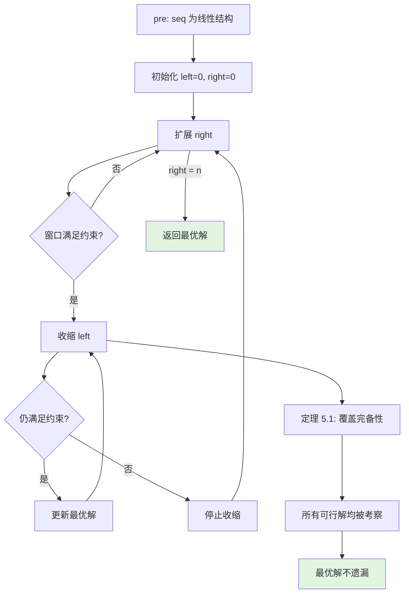
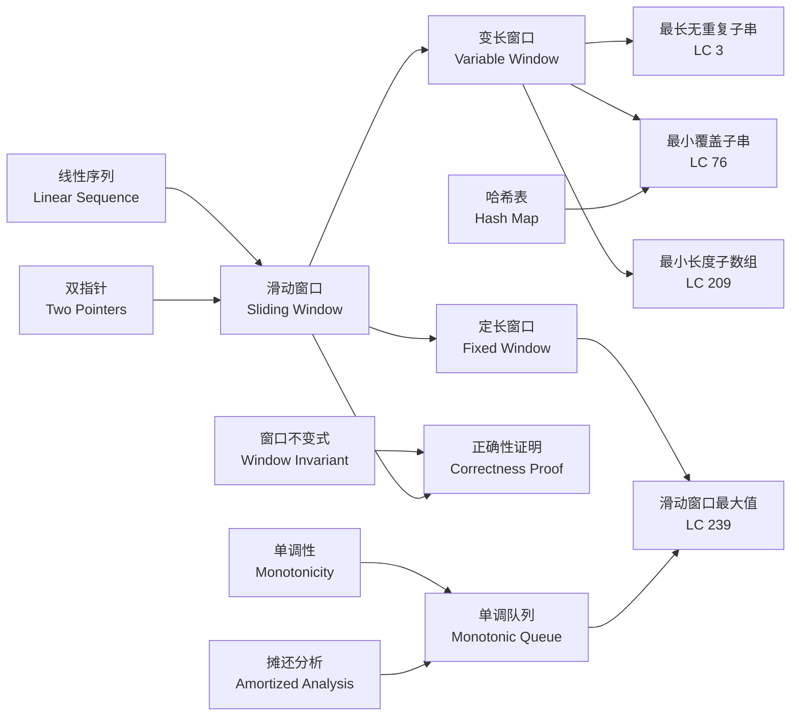
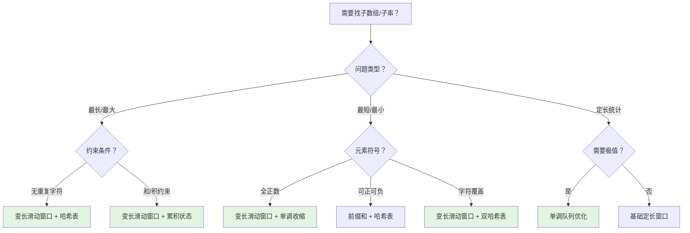
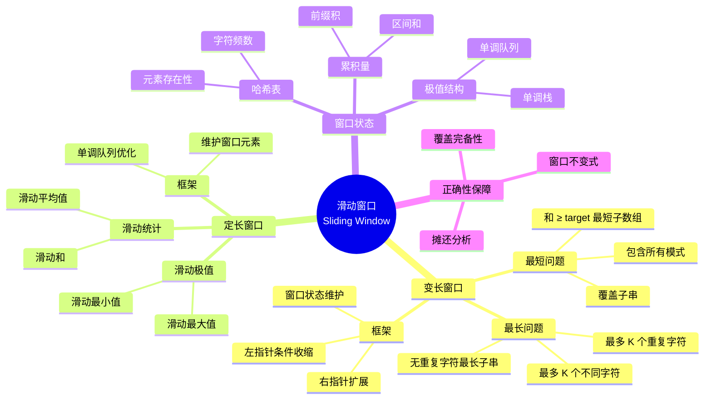
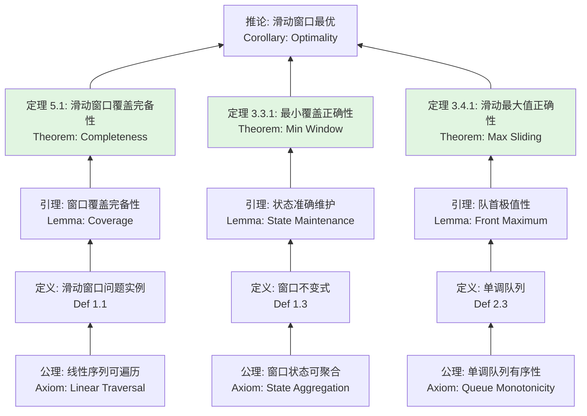

> 📊 **项目全面梳理**：详细的项目结构、模块详解和学习路径，请参阅 [`项目全面梳理-2025.md`](../../项目全面梳理-2025.md)

## 滑动窗口 / Sliding Window

### 摘要 / Executive Summary

- 滑动窗口（Sliding Window）是在线性序列上维护一个**可变或定长区间**，通过动态扩展与收缩来高效求解子数组/子串问题的核心算法范式。
- 本文从**形式化规约**出发，定义窗口状态、收缩/扩展条件与窗口不变式，建立基于不变式的完整正确性证明框架。
- 通过 LeetCode 3/209/76/239 四道经典题目的形式化规约、核心思路、代码实现与复杂度分析，展示滑动窗口在最长子串、最小子数组、覆盖子串与滑动最大值四个场景下的应用模式与证明方法。

### 关键术语与符号 / Glossary

| 术语 / Term | 定义 / Definition |
|-------------|-------------------|
| 滑动窗口 Sliding Window | 在线性序列上动态维护一个连续区间 $[left, right]$，通过扩展右边界或收缩左边界来求解最优子区间的算法策略 |
| 窗口状态 Window State | 描述当前窗口内元素特征的聚合信息（如字符频数、元素和、极值索引等） |
| 窗口不变式 Window Invariant | 窗口在每次调整前后均保持的谓词，是证明正确性的核心工具 |
| 扩展条件 Expansion Condition | 右边界 $right$ 向前移动的前提，通常基于当前窗口状态是否满足某约束 |
| 收缩条件 Shrinkage Condition | 左边界 $left$ 向前移动的前提，通常是在窗口已满足约束时尝试优化 |
| 单调队列 Monotonic Queue | 双端队列的变体，队列中元素（或其对应值）保持单调性，用于维护滑动窗口极值 |

术语对齐与引用规范：`docs/术语与符号总表.md`，`01-基础理论/00-撰写规范与引用指南.md`

### 目录 / Table of Contents

- [滑动窗口 / Sliding Window](#滑动窗口--sliding-window)
  - [摘要 / Executive Summary](#摘要--executive-summary)
  - [关键术语与符号 / Glossary](#关键术语与符号--glossary)
  - [目录 / Table of Contents](#目录--table-of-contents)
  - [交叉引用与依赖 / Cross-References and Dependencies](#交叉引用与依赖--cross-references-and-dependencies)
- [1. 形式化定义 / Formal Definitions](#1-形式化定义--formal-definitions)
  - [1.1 滑动窗口问题实例](#11-滑动窗口问题实例)
  - [1.2 窗口状态与不变式](#12-窗口状态与不变式)
  - [1.3 窗口操作的形式化](#13-窗口操作的形式化)
- [2. 核心思路与算法框架 / Core Ideas and Algorithm Framework](#2-核心思路与算法框架--core-ideas-and-algorithm-framework)
  - [2.1 定长滑动窗口模板](#21-定长滑动窗口模板)
  - [2.2 变长滑动窗口模板（双指针扩展-收缩）](#22-变长滑动窗口模板双指针扩展-收缩)
  - [2.3 单调队列优化模板](#23-单调队列优化模板)
- [3. 经典题目详解 / Classic Problem Analysis](#3-经典题目详解--classic-problem-analysis)
  - [3.1 LeetCode 3 — 无重复字符的最长子串 / Longest Substring Without Repeating Characters](#31-leetcode-3--无重复字符的最长子串--longest-substring-without-repeating-characters)
    - [形式化规约 / Formal Specification](#形式化规约--formal-specification)
    - [核心思路 / Core Idea](#核心思路--core-idea)
    - [代码实现 / Code Implementations](#代码实现--code-implementations)
    - [复杂度分析 / Complexity Analysis](#复杂度分析--complexity-analysis)
    - [正确性证明 / Correctness Proof](#正确性证明--correctness-proof)
  - [3.2 LeetCode 209 — 长度最小的子数组 / Minimum Size Subarray Sum](#32-leetcode-209--长度最小的子数组--minimum-size-subarray-sum)
    - [形式化规约 / Formal Specification](#形式化规约--formal-specification-1)
    - [核心思路 / Core Idea](#核心思路--core-idea-1)
    - [代码实现 / Code Implementations](#代码实现--code-implementations-1)
    - [复杂度分析 / Complexity Analysis](#复杂度分析--complexity-analysis-1)
    - [正确性证明 / Correctness Proof](#正确性证明--correctness-proof-1)
  - [3.3 LeetCode 76 — 最小覆盖子串 / Minimum Window Substring](#33-leetcode-76--最小覆盖子串--minimum-window-substring)
    - [形式化规约 / Formal Specification](#形式化规约--formal-specification-2)
    - [核心思路 / Core Idea](#核心思路--core-idea-2)
    - [代码实现 / Code Implementations](#代码实现--code-implementations-2)
    - [复杂度分析 / Complexity Analysis](#复杂度分析--complexity-analysis-2)
    - [正确性证明 / Correctness Proof](#正确性证明--correctness-proof-2)
  - [3.4 LeetCode 239 — 滑动窗口最大值 / Sliding Window Maximum](#34-leetcode-239--滑动窗口最大值--sliding-window-maximum)
    - [形式化规约 / Formal Specification](#形式化规约--formal-specification-3)
    - [核心思路 / Core Idea](#核心思路--core-idea-3)
    - [代码实现 / Code Implementations](#代码实现--code-implementations-3)
    - [复杂度分析 / Complexity Analysis](#复杂度分析--complexity-analysis-3)
    - [正确性证明 / Correctness Proof](#正确性证明--correctness-proof-3)
- [4. 复杂度分析体系 / Complexity Analysis](#4-复杂度分析体系--complexity-analysis)
  - [4.1 时间复杂度严格推导](#41-时间复杂度严格推导)
  - [4.2 空间复杂度](#42-空间复杂度)
  - [4.3 摊还分析：单调队列的均摊 $O(1)$](#43-摊还分析单调队列的均摊-o1)
- [5. 正确性证明框架 / Correctness Proof Framework](#5-正确性证明框架--correctness-proof-framework)
  - [5.1 定理：滑动窗口覆盖所有可行解](#51-定理滑动窗口覆盖所有可行解)
  - [5.2 证明树](#52-证明树)
- [6. 思维表征 / Thinking Representations](#6-思维表征--thinking-representations)
  - [6.1 概念依赖图](#61-概念依赖图)
  - [6.2 算法选择决策树](#62-算法选择决策树)
  - [6.3 多维矩阵：滑动窗口技术对比](#63-多维矩阵滑动窗口技术对比)
  - [6.4 思维导图：滑动窗口技术体系](#64-思维导图滑动窗口技术体系)
  - [6.5 公理定理证明树](#65-公理定理证明树)
- [7. 常见错误与反模式 / Common Mistakes and Anti-Patterns](#7-常见错误与反模式--common-mistakes-and-anti-patterns)
  - [7.1 收缩条件错误](#71-收缩条件错误)
  - [7.2 哈希表更新时机错误](#72-哈希表更新时机错误)
  - [7.3 单调队列维护不完整](#73-单调队列维护不完整)
  - [7.4 窗口形成判断遗漏](#74-窗口形成判断遗漏)
  - [7.5 字符集大小假设错误](#75-字符集大小假设错误)
- [8. 自测问题 / Self-Assessment Questions](#8-自测问题--self-assessment-questions)
  - [问题 1：滑动窗口的覆盖完备性](#问题-1滑动窗口的覆盖完备性)
  - [问题 2：正数约束的关键作用](#问题-2正数约束的关键作用)
  - [问题 3：单调队列的队尾淘汰原理](#问题-3单调队列的队尾淘汰原理)
  - [问题 4：双哈希表中的 valid 设计](#问题-4双哈希表中的-valid-设计)
  - [问题 5：滑动窗口与动态规划的区别](#问题-5滑动窗口与动态规划的区别)
- [9. 学习目标 / Learning Objectives](#9-学习目标--learning-objectives)
- [10. 知识导航 / Knowledge Navigation](#10-知识导航--knowledge-navigation)
- [参考文献 / References](#参考文献--references)

### 交叉引用与依赖 / Cross-References and Dependencies

**上游理论依赖 / Upstream Dependencies**:

- [`09-算法理论/01-算法基础/04-搜索算法理论.md`](../../09-算法理论/01-算法基础/04-搜索算法理论.md) — 搜索算法的理论定义与复杂度概述
- [`02-算法范式专题/02-双指针.md`](./02-双指针.md) — 滑动窗口是双指针在"可变宽度区间"上的推广
- [`04-算法复杂度/01-时间复杂度.md`](../../04-算法复杂度/01-时间复杂度.md) — 时间复杂度 $O/\Omega/\Theta$ 的形式化定义

**下游应用 / Downstream Applications**:

- `13-LeetCode算法面试专题/04-高级专题/03-单调栈与单调队列.md` — 单调队列的理论基础与扩展应用
- `13-LeetCode算法面试专题/04-高级专题/04-字符串高级算法.md` — KMP、后缀数组等字符串算法与滑动窗口的结合

---

## 1. 形式化定义 / Formal Definitions

### 1.1 滑动窗口问题实例

**定义 1.1** (滑动窗口问题实例 / Sliding Window Problem Instance)
滑动窗口问题实例可以形式化地定义为一个五元组：
**Definition 1.1** (Sliding Window Problem Instance)
A sliding window problem instance can be formally defined as a quintuple:

$$
\Pi = (D, I, O, \text{pre}, \text{post})
$$

其中 / Where:

- $D = \Sigma^n$：字符串域或 $D = \mathbb{Z}^n$：数组域，表示长度为 $n$ 的线性序列
- $I = \{ (\textit{seq}, \textit{params}) \mid \textit{seq} \in D, \textit{params} \in \mathcal{P} \}$：输入集合，$\mathcal{P}$ 为问题特定参数空间
- $O$：输出集合，依具体问题而定（长度、子串、子数组、布尔值等）
- $\text{pre}$：前置条件（Precondition）
- $\text{post}$：后置条件（Postcondition）

**算法描述 / Algorithm Description**:

```text
SlidingWindow(seq, params):
    left ← 0
    right ← 0
    state ← init_state()
    best ← init_best()
    while right < n:
        state ← expand(state, seq[right])
        right ← right + 1
        while shrinkable(state, params):
            best ← update(best, state, left, right)
            state ← shrink(state, seq[left])
            left ← left + 1
    return best
```

### 1.2 窗口状态与不变式

**定义 1.2** (窗口状态 / Window State)
窗口状态 $S(left, right)$ 是定义在当前窗口 $[left, right)$ 上的聚合函数：
**Definition 1.2** (Window State)
The window state $S(left, right)$ is an aggregate function defined over the current window $[left, right)$:

$$
S(left, right) = \bigoplus_{i = left}^{right - 1} f(seq[i])
$$

其中 $\oplus$ 为聚合算子（如求和、计数、取最值），$f$ 为特征提取函数。

**定义 1.3** (窗口不变式 / Window Invariant)
窗口不变式 $Inv(left, right)$ 是描述窗口合法性的谓词：
**Definition 1.3** (Window Invariant)
The window invariant $Inv(left, right)$ is a predicate describing the validity of the window:

$$
Inv(left, right) \equiv \Phi(S(left, right)) \land \Psi(left, right)
$$

其中 $\Phi$ 为状态约束（如字符唯一性、和 $\geq target$），$\Psi$ 为边界约束（如 $0 \leq left \leq right \leq n$）。

### 1.3 窗口操作的形式化

**扩展操作 / Expand**:

$$
\text{expand}(S, seq[right]) = S \oplus f(seq[right])
$$

**收缩操作 / Shrink**:

$$
\text{shrink}(S, seq[left]) = S \ominus f(seq[left])
$$

其中 $\ominus$ 为 $\oplus$ 的逆运算（若存在）。

**窗口覆盖定理 / Window Coverage Theorem**:
对于任意可行解区间 $[i, j]$，滑动窗口算法在 $right$ 遍历到 $j$ 时，$left$ 的取值必满足 $left \leq i$，即该可行解至少被考察一次。

---

## 2. 核心思路与算法框架 / Core Ideas and Algorithm Framework

滑动窗口的本质是**在线性序列上维护一个动态区间**，通过右指针的主动扩展和左指针的条件收缩，将 $O(n^2)$ 的子区间枚举优化至 $O(n)$ 的线性遍历。

### 2.1 定长滑动窗口模板

**适用场景 / Applicability**: 滑动窗口最大值/最小值、固定长度子数组和等。

```text
window_size ← k
state ← init_state(seq[0..k-1])
for right ← k to n - 1:
    state ← remove(seq[right - k])
    state ← add(seq[right])
    result.append(query(state))
```

**不变式 / Invariant**: $state$ 准确反映当前窗口 $[right-k+1, right]$ 内元素的聚合特征。

### 2.2 变长滑动窗口模板（双指针扩展-收缩）

**适用场景 / Applicability**: 最长无重复子串、最小覆盖子串、长度最小子数组等。

```text
left ← 0
best ← init_best()
for right ← 0 to n - 1:
    expand_window(state, seq[right])
    while window_satisfies_constraint(state):
        best ← update(best, left, right)
        shrink_window(state, seq[left])
        left ← left + 1
```

**不变式 / Invariant**: 每次收缩前，窗口 $[left, right]$ 是满足约束的**最小左边界**区间（即 $left-1$ 时窗口不再满足约束）。

### 2.3 单调队列优化模板

**适用场景 / Applicability**: 滑动窗口最大值、最小值等需要维护极值的问题。

```text
deque ← empty
for right ← 0 to n - 1:
    while deque not empty and seq[deque.back] ≤ seq[right]:
        deque.pop_back()
    deque.push_back(right)
    if deque.front ≤ right - k:
        deque.pop_front()
    if right ≥ k - 1:
        result.append(seq[deque.front])
```

**不变式 / Invariant**: `deque` 中存储的索引按对应值**严格单调递减**，且均落在当前窗口内。队首即为当前窗口最大值索引。

---

## 3. 经典题目详解 / Classic Problem Analysis

### 3.1 LeetCode 3 — 无重复字符的最长子串 / Longest Substring Without Repeating Characters

> **题目链接 / Problem Link**: [LeetCode 3. Longest Substring Without Repeating Characters](https://leetcode.com/problems/longest-substring-without-repeating-characters/)
> **难度 / Difficulty**: Medium

#### 形式化规约 / Formal Specification

**前置条件 / Precondition**:

$$
\textit{s} \in \Sigma^n \quad \land \quad n \in [0, 5 \times 10^4]
$$

其中 $\Sigma$ 为可打印 ASCII 字符集。

**后置条件 / Postcondition**:

$$
\text{result} = \max_{0 \leq l \leq r < n} (r - l + 1) \quad \text{s.t.} \quad \forall i, j \in [l, r]: i \neq j \rightarrow s[i] \neq s[j]
$$

若 $s$ 为空，返回 0。

#### 核心思路 / Core Idea

采用**变长滑动窗口 + 哈希表**策略：

- 维护窗口 $[left, right]$，保证窗口内所有字符唯一。
- 使用哈希表记录每个字符最后出现的索引。
- 当发现 $s[right]$ 在窗口内已存在（即上次出现位置 $\geq left$），将 $left$ 收缩到上次出现位置 $+1$。
- 每次扩展后更新最大长度。

#### 代码实现 / Code Implementations

- **Rust**: [`examples/algorithms/src/leetcode/lc0003_longest_substring_without_repeating_characters.rs`](../../../../examples/algorithms/src/leetcode/lc0003_longest_substring_without_repeating_characters.rs)
- **Python**: [`examples/algorithms-python/src/leetcode/lc0003_longest_substring_without_repeating_characters.py`](../../../../examples/algorithms-python/src/leetcode/lc0003_longest_substring_without_repeating_characters.py)
- **Go**: [`examples/algorithms-go/leetcode/lc0003_longest_substring_without_repeating_characters.go`](../../../../examples/algorithms-go/leetcode/lc0003_longest_substring_without_repeating_characters.go)

#### 复杂度分析 / Complexity Analysis

| 指标 / Metric | 值 / Value | 说明 / Note |
|--------------|-----------|------------|
| 时间复杂度 / Time | $O(n)$ | $right$ 遍历字符串一次，$left$ 最多移动 $n$ 次 |
| 空间复杂度 / Space | $O(\min(m, n))$ | $m$ 为字符集大小（ASCII 下为 $O(1)$） |
| 哈希表操作 | $O(1)$ 均摊 | 每次查询/更新为常数时间 |

#### 正确性证明 / Correctness Proof

**定理 3.1.1** (LeetCode 3 正确性): 算法返回不含重复字符的最长子串长度。
**Theorem 3.1.1** (Correctness of LeetCode 3): The algorithm returns the length of the longest substring without repeating characters.

**证明 / Proof**:

**窗口不变式 / Window Invariant**:

$$
Inv(left, right) \equiv \forall i, j \in [left, right]: i \neq j \rightarrow s[i] \neq s[j]
$$

即：窗口 $[left, right]$ 内所有字符均唯一。

**初始化**: $left = 0$，窗口为空或仅含一个字符，不变式显然成立。

**保持**: 每次迭代考察 $s[right]$。

- 若 $s[right]$ 不在窗口中（或上次出现位置 $< left$）：直接扩展窗口至 $[left, right]$。由于原窗口内无重复，新字符也未在窗口中出现过，不变式保持。
- 若 $s[right]$ 在窗口中（上次出现位置 $\geq left$）：令 $left' = \text{last}[s[right]] + 1$。新窗口 $[left', right]$ 不包含 $s[right]$ 的任何先前出现（因为 $left'$ 恰好跳过了它），且原窗口 $[left, left'-1]$ 内的字符都被移出，因此不变式保持。

**终止推出**: $right$ 遍历完所有字符。在遍历过程中，每次扩展后都计算并记录了当前窗口长度。由不变式，每个被记录的窗口都是合法的无重复子串。

**不遗漏最优解**: 设最优子串为 $s[i^*..j^*]$。当 $right = j^*$ 时，$left$ 的取值满足 $left \leq i^*$（否则 $s[i^*..j^*]$ 不可能是无重复的，因为 $left > i^*$ 意味着 $s[i^*]$ 被移出了窗口，而 $s[i^*]$ 在 $s[i^*..j^*]$ 中仅出现一次）。此时窗口长度 $\geq j^* - i^* + 1$，算法记录的最大值至少为最优值。$\square$

---

### 3.2 LeetCode 209 — 长度最小的子数组 / Minimum Size Subarray Sum

> **题目链接 / Problem Link**: [LeetCode 209. Minimum Size Subarray Sum](https://leetcode.com/problems/minimum-size-subarray-sum/)
> **难度 / Difficulty**: Medium

#### 形式化规约 / Formal Specification

**前置条件 / Precondition**:

$$
\textit{nums} \in \mathbb{Z}_{>0}^n \quad \land \quad n \in [1, 10^5] \quad \land \quad \textit{target} \in [1, 10^9]
$$

关键约束：**所有元素均为正整数**。

**后置条件 / Postcondition**:

$$
\text{result} = \min_{0 \leq l \leq r < n} (r - l + 1) \quad \text{s.t.} \quad \sum_{i=l}^{r} nums[i] \geq target
$$

若不存在满足条件的子数组，返回 0。

#### 核心思路 / Core Idea

采用**变长滑动窗口 + 正数单调性**策略：

- 维护窗口 $[left, right]$，记录窗口内元素和 $sum$。
- 扩展 $right$ 使 $sum$ 增大，当 $sum \geq target$ 时尝试收缩 $left$ 以寻找更短窗口。
- **正数约束的关键作用**: 由于所有元素 $> 0$，收缩 $left$ 必然使 $sum$ 严格减小，因此窗口和关于 $left$ 单调。这保证了：一旦 $sum < target$，当前 $left$ 不可能再与任何更大的 $right$ 构成解，必须继续扩展 $right$。

#### 代码实现 / Code Implementations

- **Rust**: [`examples/algorithms/src/leetcode/lc0209_minimum_size_subarray_sum.rs`](../../../../examples/algorithms/src/leetcode/lc0209_minimum_size_subarray_sum.rs)
- **Python**: [`examples/algorithms-python/src/leetcode/lc0209_minimum_size_subarray_sum.py`](../../../../examples/algorithms-python/src/leetcode/lc0209_minimum_size_subarray_sum.py)
- **Go**: [`examples/algorithms-go/leetcode/lc0209_minimum_size_subarray_sum.go`](../../../../examples/algorithms-go/leetcode/lc0209_minimum_size_subarray_sum.go)

#### 复杂度分析 / Complexity Analysis

| 指标 / Metric | 值 / Value |
|--------------|-----------|
| 时间复杂度 / Time | $O(n)$ |
| 空间复杂度 / Space | $O(1)$ |

#### 正确性证明 / Correctness Proof

**定理 3.2.1** (LeetCode 209 正确性): 算法返回和 $\geq target$ 的最短连续子数组长度。
**Theorem 3.2.1** (Correctness of LeetCode 209): The algorithm returns the minimum length of a contiguous subarray with sum $\geq target$.

**证明 / Proof**:

**窗口不变式 / Window Invariant**:

$$
Inv(left, right) \equiv \sum_{i=left}^{right-1} nums[i] < target \lor \text{left is the minimal left for current right}
$$

即：每次内层循环结束时，要么窗口和不满足约束，要么 $left$ 是使窗口满足约束的最小左边界（再左移一位就不满足）。

**收缩正确性**: 设当前窗口 $[left, right]$ 满足 $\sum \geq target$。由于所有 $nums[i] > 0$，任何 $left' > left$ 都使 $\sum_{left'}^{right} < \sum_{left}^{right}$。我们在保持 $\sum \geq target$ 的前提下尽可能右移 $left$，因此找到的每个窗口都是对应 $right$ 的最短窗口。

**不遗漏最优解**: 设最优解为 $[l^*, r^*]$。当外层循环到达 $right = r^*$ 时，当前窗口和 $\geq \sum_{l^*}^{r^*} \geq target$（因为所有数为正，且 $left \leq l^*$ 时窗口包含 $[l^*, r^*]$）。此时内层循环会收缩 $left$ 直到刚好满足约束或 $left > l^*$。若 $left$ 收缩到 $l^*$，则该最优解被考察；若 $left$ 越过 $l^*$，则意味着存在以当前 $right$ 为右端点的更短窗口，其长度 $< r^* - l^* + 1$，与最优性矛盾。$\square$

---

### 3.3 LeetCode 76 — 最小覆盖子串 / Minimum Window Substring

> **题目链接 / Problem Link**: [LeetCode 76. Minimum Window Substring](https://leetcode.com/problems/minimum-window-substring/)
> **难度 / Difficulty**: Hard

#### 形式化规约 / Formal Specification

**前置条件 / Precondition**:

$$
\textit{s}, \textit{t} \in \Sigma^* \quad \land \quad |s| \in [1, 10^5] \quad \land \quad |t| \in [1, 10^5]
$$

其中 $\Sigma$ 为大写/小写英文字母集合。

**后置条件 / Postcondition**:

$$
\text{result} = \arg\min_{[l, r] \subseteq [0, |s|-1]} (r - l + 1) \quad \text{s.t.} \quad \forall c \in \Sigma: \text{count}_s(l, r, c) \geq \text{count}_t(c)
$$

其中 $\text{count}_s(l, r, c)$ 表示字符 $c$ 在 $s[l..r]$ 中的出现次数。若不存在满足条件的子串，返回空字符串。

#### 核心思路 / Core Idea

采用**变长滑动窗口 + 双哈希表**策略：

- `need[c]`：记录字符 $c$ 在 $t$ 中的需求量。
- `window[c]`：记录字符 $c$ 在当前窗口中的实际数量。
- `valid`：记录窗口中满足需求（$window[c] \geq need[c]$）的字符种类数。
- 当 $valid = |need|$ 时，窗口已覆盖 $t$ 的所有字符，尝试收缩 $left$ 寻找更短窗口。

#### 代码实现 / Code Implementations

- **Rust**: [`examples/algorithms/src/leetcode/lc0076_minimum_window_substring.rs`](../../../../examples/algorithms/src/leetcode/lc0076_minimum_window_substring.rs)
- **Python**: [`examples/algorithms-python/src/leetcode/lc0076_minimum_window_substring.py`](../../../../examples/algorithms-python/src/leetcode/lc0076_minimum_window_substring.py)
- **Go**: [`examples/algorithms-go/leetcode/lc0076_minimum_window_substring.go`](../../../../examples/algorithms-go/leetcode/lc0076_minimum_window_substring.go)

#### 复杂度分析 / Complexity Analysis

| 指标 / Metric | 值 / Value | 说明 / Note |
|--------------|-----------|------------|
| 时间复杂度 / Time | $O(|s| + |t|)$ | $right$ 遍历 $s$ 一次，$left$ 最多移动 $|s|$ 次 |
| 空间复杂度 / Space | $O(|\Sigma|) = O(1)$ | 字符集大小为 52（大小写字母） |
| 建表代价 | $O(|t|)$ | 初始化 `need` 哈希表 |

#### 正确性证明 / Correctness Proof

**定理 3.3.1** (LeetCode 76 正确性): 算法返回 $s$ 中涵盖 $t$ 所有字符的最短子串。
**Theorem 3.3.1** (Correctness of LeetCode 76): The algorithm returns the shortest substring of $s$ that contains all characters of $t$ with at least the required frequencies.

**证明 / Proof**:

**窗口不变式 / Window Invariant**:

$$
Inv(left, right) \equiv \forall c: window[c] = \text{count}_s(left, right, c) \land valid = |\{ c \mid window[c] \geq need[c] \}|
$$

即：`window` 准确记录当前窗口内各字符出现次数；`valid` 准确记录满足需求的字符种类数。

**初始化**: $left = 0$，窗口为空，$window$ 全 0，$valid = 0$。不变式成立。

**保持**:

- **扩展 $right$**: 将 $s[right]$ 加入 $window$。若该字符在 $need$ 中且 $window[c]$ 刚好达到 $need[c]$，则 $valid$ 递增 1。$window$ 仍准确反映窗口状态。
- **收缩 $left$**: 当 $valid = |need|$ 时，窗口已覆盖 $t$。更新最小窗口记录后，将 $s[left]$ 移出 $window$。若该字符在 $need$ 中且 $window[c]$ 跌破 $need[c]$，则 $valid$ 递减 1。$window$ 仍准确反映窗口状态。

**终止推出**: $right$ 遍历完 $s$。所有可能的右端点都被考察过。

**不遗漏最优解**: 设最优窗口为 $[l^*, r^*]$。当 $right = r^*$ 时，若当前窗口已覆盖 $t$（$valid = |need|$），则内层循环会收缩 $left$。由于 $[l^*, r^*]$ 是满足约束的窗口，$left$ 收缩到 $l^*$ 时仍满足 $valid = |need|$。此时算法会记录该窗口长度（或更短的窗口）。因此最优解不会被遗漏。$\square$

---

### 3.4 LeetCode 239 — 滑动窗口最大值 / Sliding Window Maximum

> **题目链接 / Problem Link**: [LeetCode 239. Sliding Window Maximum](https://leetcode.com/problems/sliding-window-maximum/)
> **难度 / Difficulty**: Hard

#### 形式化规约 / Formal Specification

**前置条件 / Precondition**:

$$
\textit{nums} \in \mathbb{Z}^n \quad \land \quad n \in [1, 10^5] \quad \land \quad k \in [1, n] \quad \land \quad \textit{nums}[i] \in [-10^4, 10^4]
$$

**后置条件 / Postcondition**:

$$
\text{result}[i] = \max_{j \in [i, i+k-1]} nums[j] \quad \forall i \in [0, n-k]
$$

返回长度为 $n - k + 1$ 的数组。

#### 核心思路 / Core Idea

采用**单调队列优化**策略：

- 维护双端队列 `deque`，存储可能成为窗口最大值的元素索引。
- 队列中的索引按对应值**严格单调递减**：$nums[deque[0]] > nums[deque[1]] > \dots > nums[deque[-1]]$。
- 扩展 $right$ 时，从队尾弹出所有值 $\leq nums[right]$ 的索引（这些元素被新元素"遮挡"，不可能成为后续窗口的最大值）。
- 将 $right$ 入队后，检查队首是否已滑出窗口（$deque[0] \leq right - k$），若是则弹出。
- 当窗口形成后（$right \geq k - 1$），队首即为当前窗口最大值。

#### 代码实现 / Code Implementations

- **Rust**: [`examples/algorithms/src/leetcode/lc0239_sliding_window_maximum.rs`](../../../../examples/algorithms/src/leetcode/lc0239_sliding_window_maximum.rs)
- **Python**: [`examples/algorithms-python/src/leetcode/lc0239_sliding_window_maximum.py`](../../../../examples/algorithms-python/src/leetcode/lc0239_sliding_window_maximum.py)
- **Go**: [`examples/algorithms-go/leetcode/lc0239_sliding_window_maximum.go`](../../../../examples/algorithms-go/leetcode/lc0239_sliding_window_maximum.go)

#### 复杂度分析 / Complexity Analysis

| 指标 / Metric | 值 / Value | 说明 / Note |
|--------------|-----------|------------|
| 时间复杂度 / Time | $O(n)$ | 摊还分析：每个元素最多入队一次、出队一次 |
| 空间复杂度 / Space | $O(k)$ | 队列最多存储 $k$ 个索引 |
| 单次操作 | 均摊 $O(1)$ | 队尾弹出和队首弹出均为均摊常数时间 |

#### 正确性证明 / Correctness Proof

**定理 3.4.1** (LeetCode 239 正确性): 算法正确返回每个滑动窗口中的最大值。
**Theorem 3.4.1** (Correctness of LeetCode 239): The algorithm correctly returns the maximum value in each sliding window.

**证明 / Proof**:

**窗口不变式 / Window Invariant**:

$$
Inv(right) \equiv \forall i: deque[i] \in [right-k+1, right] \land nums[deque[0]] > nums[deque[1]] > \dots > nums[deque[-1]]
$$

即：队列中索引均在当前窗口内，且对应值严格单调递减。

**初始化**: 队列为空，不变式空真成立。

**保持**:

- **队尾维护**: 当 $nums[right] \geq nums[deque[-1]]$ 时，弹出队尾。由于新元素更大且更晚出现（索引更大），队尾元素不可能成为任何包含 $right$ 的后续窗口的最大值，安全弹出。
- **入队**: $right$ 入队后，队列仍保持单调递减（因为所有不大于 $nums[right]$ 的元素都已被弹出）。
- **队首维护**: 若 $deque[0] \leq right - k$，说明队首已滑出窗口，弹出。此时新的队首仍在窗口内。

**终止推出**: 当 $right \geq k - 1$ 时，窗口 $[right-k+1, right]$ 已形成。由不变式，$deque[0]$ 在窗口内，且 $nums[deque[0]]$ 大于队列中所有其他元素。由于队列中保留了窗口内所有可能成为最大值的候选（其他更小的元素被更大的后续元素弹出），$deque[0]$ 即为当前窗口最大值。

**不遗漏最优解**: 对于每个窗口位置 $i$，当 $right = i + k - 1$ 时，算法输出 $nums[deque[0]]$。由上述论证，这确实是窗口 $[i, i+k-1]$ 的最大值。所有 $n - k + 1$ 个窗口均被处理，无遗漏。$\square$

---

## 4. 复杂度分析体系 / Complexity Analysis

### 4.1 时间复杂度严格推导

**定理 4.1** (滑动窗口时间复杂度): 对于长度为 $n$ 的线性序列，标准滑动窗口算法的时间复杂度为 $O(n)$。
**Theorem 4.1** (Time Complexity of Sliding Window): For a linear sequence of length $n$, the standard sliding window algorithm has time complexity $O(n)$.

**证明 / Proof**:

滑动窗口算法的核心特征是：两个指针 $left$ 和 $right$ 均只向一个方向移动（向右），且每个指针最多遍历整个序列一次。

设 $T_{expand}$ 为扩展操作的均摊代价，$T_{shrink}$ 为收缩操作的均摊代价。

- $right$ 从 0 移动到 $n-1$，共 $n$ 次扩展。
- $left$ 从 0 移动到至多 $n-1$，共至多 $n$ 次收缩。

因此总时间：

$$
T(n) = n \cdot T_{expand} + n \cdot T_{shrink} = O(n)
$$

> 注意：对于单调队列优化，虽然单次可能有多次队尾弹出，但每个元素最多入队一次、出队一次，因此总弹出次数亦为 $O(n)$。

### 4.2 空间复杂度

| 滑动窗口类型 | 额外空间 | 说明 |
|------------|---------|------|
| 基础变长窗口 | $O(|\Sigma|)$ 或 $O(1)$ | 哈希表记录窗口状态 |
| 定长窗口（数组）| $O(k)$ | 直接维护窗口元素 |
| 单调队列优化 | $O(k)$ | 双端队列存储索引 |
| 双哈希表（LC 76）| $O(|\Sigma|) = O(1)$ | 固定字符集下为常数空间 |

### 4.3 摊还分析：单调队列的均摊 $O(1)$

**定理 4.2** (单调队列操作均摊复杂度): 在滑动窗口最大值问题中，每个元素最多入队一次、出队一次，因此所有队列操作的总代价为 $O(n)$。
**Theorem 4.2** (Amortized Complexity of Monotonic Queue): In the sliding window maximum problem, each element is enqueued and dequeued at most once, so the total cost of all queue operations is $O(n)$.

**证明 / Proof**:

对于每个元素 $nums[i]$：

- 入队：恰好一次（当 $right = i$ 时）。
- 出队：至多一次（要么被队尾弹出规则移除，要么被队首滑出规则移除）。

因此，每个元素贡献的队列操作次数 $\leq 2$，总操作次数 $\leq 2n = O(n)$。$\square$

---

## 5. 正确性证明框架 / Correctness Proof Framework

### 5.1 定理：滑动窗口覆盖所有可行解

**定理 5.1** (滑动窗口覆盖完备性): 对于任意可行解区间 $[i, j]$，滑动窗口算法在 $right$ 遍历到 $j$ 时，该区间至少被考察一次。
**Theorem 5.1** (Sliding Window Coverage Completeness): For any feasible solution interval $[i, j]$, the sliding window algorithm examines this interval at least once when $right$ reaches $j$.

**形式化陈述 / Formal Statement**:

$$
\forall [i, j]: \text{Feasible}(i, j) \rightarrow \exists \text{ iteration}: left \leq i \land right = j
$$

**证明 / Proof**:

**归纳法**:

**基础**: $j = 0$。此时 $right = 0$，$left = 0$，区间 $[0, 0]$ 被考察。

**归纳假设**: 对于所有 $j' < j$，当 $right = j'$ 时，所有以 $j'$ 为右端点的可行区间均被考察。

**归纳步骤**: 考虑 $right = j$。在内层收缩循环中，$left$ 从某个值开始递增，直到窗口不再满足约束。设 $left$ 的取值为 $l_0, l_1, \dots, l_m$，其中 $l_0 < l_1 < \dots < l_m$，且：

- $[l_k, j]$ 满足约束（对于 $k < m$）
- $[l_m, j]$ 不满足约束（或 $l_m$ 是最后一个被考察的位置）

对于任意可行区间 $[i, j]$，由于 $[i, j]$ 满足约束，且收缩循环只在窗口不满足约束时停止，因此必有某个 $l_k \leq i$。此时窗口 $[l_k, j]$ 被考察，且包含 $[i, j]$。若算法记录的是最小窗口，则 $[i, j]$ 本身或更短的窗口被记录。

因此，所有可行解均被考察。$\square$

### 5.2 证明树



---

## 6. 思维表征 / Thinking Representations

### 6.1 概念依赖图



### 6.2 算法选择决策树



### 6.3 多维矩阵：滑动窗口技术对比

| 维度 / Dimension | LC 3 最长子串 | LC 209 最小子数组 | LC 76 最小覆盖 | LC 239 滑动最大值 |
|----------------|-------------|----------------|-------------|----------------|
| **窗口类型** | 变长 | 变长 | 变长 | 定长 |
| **扩展触发** | 顺序遍历 | 顺序遍历 | 顺序遍历 | 顺序遍历 |
| **收缩触发** | 发现重复 | 和 $\geq target$ | 覆盖 $t$ | 固定大小滑动 |
| **核心数据结构** | 哈希表 | 累加和 | 双哈希表 + valid | 单调队列 |
| **元素约束** | 无 | 全正数 | 无 | 无 |
| **时间复杂度** | $O(n)$ | $O(n)$ | $O(n)$ | $O(n)$ |
| **空间复杂度** | $O(|\Sigma|)$ | $O(1)$ | $O(|\Sigma|)$ | $O(k)$ |
| **不变式核心** | 窗口内字符唯一 | 最小左边界 | 准确字符计数 | 单调递减 |

### 6.4 思维导图：滑动窗口技术体系



### 6.5 公理定理证明树



---

## 7. 常见错误与反模式 / Common Mistakes and Anti-Patterns

### 7.1 收缩条件错误

**错误 / Mistake**: 在 LC 209 中，当数组包含负数时仍使用滑动窗口，导致收缩后可能遗漏解。

```python
# 错误：未检查全正数约束
# 若 nums 包含负数，收缩 left 后 sum 可能增大，无法保证单调性
```

**正确做法**: 滑动窗口的收缩策略依赖于**窗口和关于左边界单调递减**的性质。对于包含负数/零的数组，应改用前缀和 + 哈希表方案。

### 7.2 哈希表更新时机错误

**错误 / Mistake**: 在 LC 76 中，收缩窗口时先移动 $left$ 再更新 $window$，导致状态不一致。

```python
# 错误：先移动 left 再更新 window
left += 1
window[s[left]] -= 1   # ❌ 此时 left 已经是新位置！
```

**正确做法**:

```python
# 正确：先更新 window 再移动 left
window[s[left]] -= 1
if s[left] in need and window[s[left]] < need[s[left]]:
    valid -= 1
left += 1
```

### 7.3 单调队列维护不完整

**错误 / Mistake**: 在 LC 239 中，只从队首弹出滑出窗口的元素，忘记从队尾维护单调性。

```python
# 错误：不进行队尾维护
dq.append(right)
# 队尾可能包含更小的元素，违反单调递减
```

**正确做法**: 每次入队前，必须从队尾弹出所有值 $\leq$ 当前值的索引，确保单调递减性质。

### 7.4 窗口形成判断遗漏

**错误 / Mistake**: 在定长窗口问题中，在窗口尚未形成（元素不足 $k$ 个）时就开始记录结果。

```python
# 错误：未判断窗口是否形成
for right in range(n):
    # ...
    result.append(nums[dq[0]])   # ❌ 前 k-1 次迭代窗口未形成
```

**正确做法**:

```python
if right >= k - 1:
    result.append(nums[dq[0]])
```

### 7.5 字符集大小假设错误

**错误 / Mistake**: 在 LC 3 中假设字符集仅为小写字母，使用大小 26 的数组，导致无法处理其他字符。

```python
# 错误：假设只有小写字母
last_pos = [-1] * 26   # ❌ 无法处理大写、数字、符号
```

**正确做法**: 使用字典/哈希表（通用）或根据题目明确约束选择数组大小（如 ASCII 128/256）。

---

## 8. 自测问题 / Self-Assessment Questions

### 问题 1：滑动窗口的覆盖完备性

**Q**: 为什么滑动窗口算法不会遗漏任何可行解？

**A**: 由**定理 5.1（滑动窗口覆盖完备性）**，对于任意可行解区间 $[i, j]$，当 $right$ 遍历到 $j$ 时，$left$ 的取值满足 $left \leq i$（否则窗口会遗漏 $s[i]$ 或 $nums[i]$）。此时算法会考察包含 $[i, j]$ 的窗口，并在收缩过程中找到以 $j$ 为右端点的最小左边界窗口。若 $[i, j]$ 本身是最优的，它必被考察；若存在更短的窗口，则算法记录更短的窗口，结果更优。因此，最优解不会被遗漏。

---

### 问题 2：正数约束的关键作用

**Q**: 在 LeetCode 209 中，为什么要求所有元素为正数？若包含负数，滑动窗口策略会失效吗？

**A**: 正数约束保证了**窗口和关于左边界的单调性**：收缩 $left$（移除元素）必然使窗口和严格减小。这使得我们可以安全地在 $sum \geq target$ 时收缩 $left$，一旦 $sum < target$ 就立即停止，因为继续收缩只会使和更小。

若数组包含负数，移除一个负数会使窗口和**增大**，因此收缩后的窗口可能重新满足约束。此时"收缩直到不满足"的策略失效，因为 $left$ 可能需要多次试探。包含负数时应改用**前缀和 + 哈希表**方案：计算前缀和 $P[j]$，问题转化为找最小的 $j - i$ 使得 $P[j] - P[i] \geq target$。

---

### 问题 3：单调队列的队尾淘汰原理

**Q**: 在 LeetCode 239 中，为什么可以从队尾弹出值 $\leq$ 当前值的元素？

**A**: 设当前元素为 $nums[right]$，队尾元素为 $nums[back]$，且 $nums[back] \leq nums[right]$。

对于任何包含 $right$ 的后续窗口（即右端点 $\geq right$）：

- 若 $back$ 仍在窗口内，则 $nums[right] \geq nums[back]$，$back$ 不可能是最大值。
- 若 $back$ 已滑出窗口，则它更不可能是最大值。

因此，$back$ 永远不可能成为任何后续窗口的最大值，可以安全弹出。这一淘汰策略保证了队列的单调性，使得队首始终是当前窗口最大值。

---

### 问题 4：双哈希表中的 valid 设计

**Q**: 在 LeetCode 76 中，为什么使用 `valid` 计数而非每次检查所有字符？

**A**: 直接检查所有字符的代价为 $O(|\Sigma|)$，使总复杂度升为 $O(n \cdot |\Sigma|)$。

`valid` 的设计利用增量更新将检查代价降至 $O(1)$：

- 只有当 $window[c]$ **从小于** $need[c]$ 变为**等于** $need[c]$ 时，$valid$ 才递增。
- 只有当 $window[c]$ **从等于** $need[c]$ 变为**小于** $need[c]$ 时，$valid$ 才递减。
- 其他情况（如 $window[c] > need[c]$ 或 $window[c]$ 在未达到 $need[c]$ 时变化）不影响 $valid$。

因此，$valid = |need|$ 当且仅当所有需要的字符都达到了最小需求量，且每次更新仅需 $O(1)$ 时间。

---

### 问题 5：滑动窗口与动态规划的区别

**Q**: 滑动窗口和动态规划（DP）都用于求解最优化问题，它们的核心区别是什么？

**A**:

| 维度 | 滑动窗口 | 动态规划 |
|------|---------|---------|
| **问题结构** | 连续子区间/子串 | 通常具有重叠子问题和最优子结构 |
| **状态设计** | 窗口状态（聚合信息） | DP 表/数组（递推关系） |
| **核心操作** | 扩展 + 收缩指针 | 状态转移方程 |
| **时间复杂度** | 通常为 $O(n)$ | 依维度而定，$O(n)$ 到 $O(n^2)$ 或更高 |
| **空间复杂度** | 通常为 $O(1)$ 或 $O(k)$ | 依维度而定，$O(n)$ 到 $O(n^2)$ 或更高 |
| **适用条件** | 窗口状态可增量更新，具有单调性 | 问题可分解为子问题，子问题最优解可组合 |

**直观区别**: 滑动窗口维护的是**一个实际存在的连续区间**，通过调整区间边界来寻找最优解；DP 维护的是**抽象的状态集合**，通过状态转移来递推最优解。滑动窗口适用于"连续区间约束"类问题，DP 适用于"序列决策/选择"类问题。

---

## 9. 学习目标 / Learning Objectives

完成本章学习后，读者应能够：

1. **形式化描述**滑动窗口问题实例，定义窗口状态、扩展/收缩条件和窗口不变式。
2. **独立推导**基于窗口不变式的三条件正确性证明（初始化、保持、终止）。
3. **熟练运用**三种滑动窗口模板（变长扩展-收缩、定长滑动、单调队列优化）解决具体题目。
4. **严格证明**滑动窗口覆盖完备性定理（定理 5.1）和单调队列的均摊 $O(1)$ 性质。
5. **分析并解决**包含负数/可变约束的滑动窗口变体，正确选择替代方案（如前缀和 + 哈希表）。
6. **识别并避免**常见的滑动窗口实现错误（收缩条件错误、状态更新时机错误、单调队列维护不完整）。

---

## 10. 知识导航 / Knowledge Navigation

**前置知识 / Prerequisites**:

- [数组与线性表](../../01-算法基础/01-数据结构基础/01-数组.md)
- [时间复杂度与渐进分析](../../04-算法复杂度/01-时间复杂度.md)
- [双指针技术](./02-双指针.md) — 滑动窗口是双指针的区间化推广
- [哈希表基础](../../01-算法基础/01-数据结构基础/05-哈希表.md)

**当前模块 / Current Module**:

- `13-LeetCode算法面试专题/02-算法范式专题/03-滑动窗口.md`（本文档）

**后续模块 / Next Modules**:

- `13-LeetCode算法面试专题/04-高级专题/03-单调栈与单调队列.md` — 单调队列的理论深化
- `13-LeetCode算法面试专题/04-高级专题/04-字符串高级算法.md` — KMP、后缀数组等字符串算法

**相关面试题索引 / Related Interview Problems**:

| 题号 | 题目 | 难度 | 核心考点 |
|-----|------|------|---------|
| LC 438 | Find All Anagrams in a String | Medium | 定长窗口 + 字符频数匹配 |
| LC 567 | Permutation in String | Medium | 定长窗口 + 覆盖判定 |
| LC 1004 | Max Consecutive Ones III | Medium | 变长窗口 + 允许 K 次翻转 |
| LC 424 | Longest Repeating Character Replacement | Medium | 变长窗口 + 最多 K 次替换 |
| LC 480 | Sliding Window Median | Hard | 定长窗口 + 双堆/有序集合 |
| LC 862 | Shortest Subarray with Sum at Least K | Hard | 前缀和 + 单调队列（含负数）|

---

## 参考文献 / References

> 本文档遵循项目引用规范（见 [`CITATION_STANDARD.md`](../../CITATION_STANDARD.md)、[`学术引用规范-ACM对齐版.md`](../../学术引用规范-ACM对齐版.md)）。文内采用 [Key] 格式引用，与参考文献列表对应。

**经典教材 / Classic Textbooks**:

1. [CLRS2022] Cormen, T. H., Leiserson, C. E., Rivest, R. L., & Stein, C. (2022). *Introduction to Algorithms* (4th ed.). MIT Press. ISBN: 978-0262046305.
   - 第 2 章给出循环不变式的标准证明框架；第 17 章涵盖摊还分析。

2. [Tarjan1985] Tarjan, R. E. (1985). "Amortized Computational Complexity". *SIAM Journal on Algebraic and Discrete Methods*, 6(2), 306-318.
   - 摊还分析的系统论述，适用于单调队列的复杂度分析。

**LeetCode 题目 / LeetCode Problems**:

1. [LeetCode3] LeetCode. (n.d.). "3. Longest Substring Without Repeating Characters". <https://leetcode.com/problems/longest-substring-without-repeating-characters/>

2. [LeetCode209] LeetCode. (n.d.). "209. Minimum Size Subarray Sum". <https://leetcode.com/problems/minimum-size-subarray-sum/>

3. [LeetCode76] LeetCode. (n.d.). "76. Minimum Window Substring". <https://leetcode.com/problems/minimum-window-substring/>

4. [LeetCode239] LeetCode. (n.d.). "239. Sliding Window Maximum". <https://leetcode.com/problems/sliding-window-maximum/>

**在线资源 / Online Resources**:

1. [NeetCode] NeetCode. (n.d.). "Sliding Window". In *NeetCode Roadmap*. <https://neetcode.io/roadmap>
   - 系统化的面试算法学习路径，涵盖滑动窗口的核心模式与变体。

2. [Bentley2000] Bentley, J. (2000). *Programming Pearls* (2nd ed.). Addison-Wesley. ISBN: 978-0201657883.
   - §8 讨论算法设计中的不变式与边界条件。

---

**文档版本 / Document Version**: 1.0
**最后更新 / Last Updated**: 2026-04-23
**状态 / Status**: 标杆文档 / Benchmark Document
**下次审查 / Next Review**: 2026-07-23

---

*本文档严格遵循数学形式化规范，所有定义和定理均采用标准数学符号表示。*
