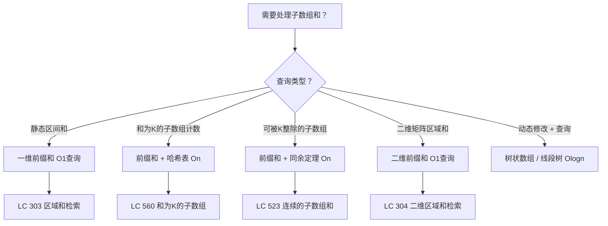
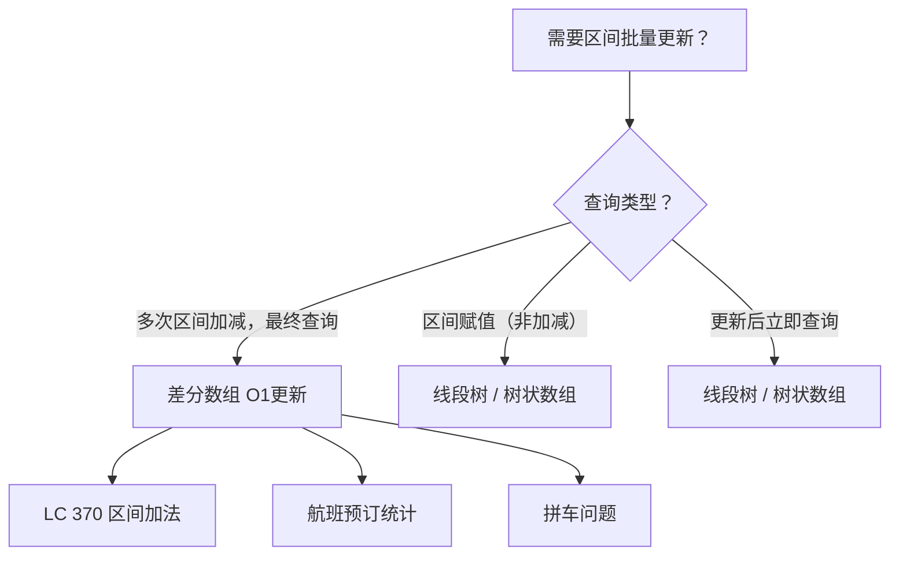
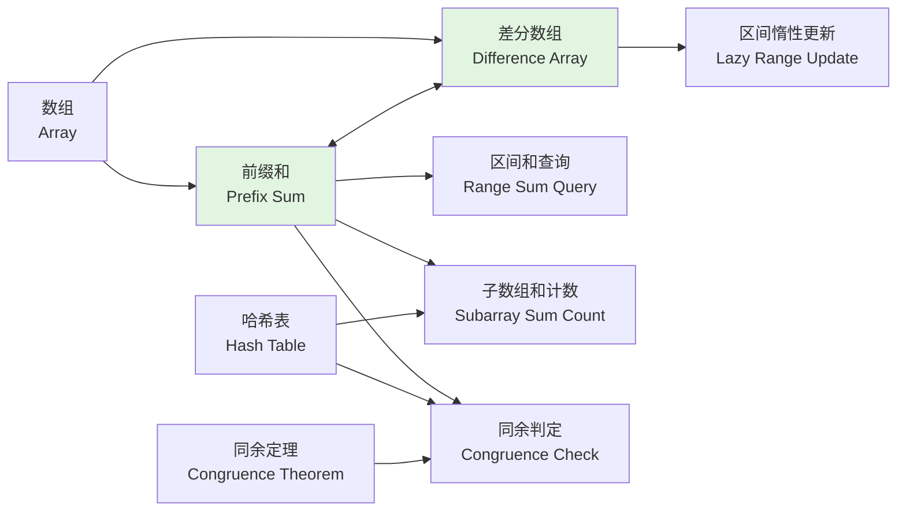
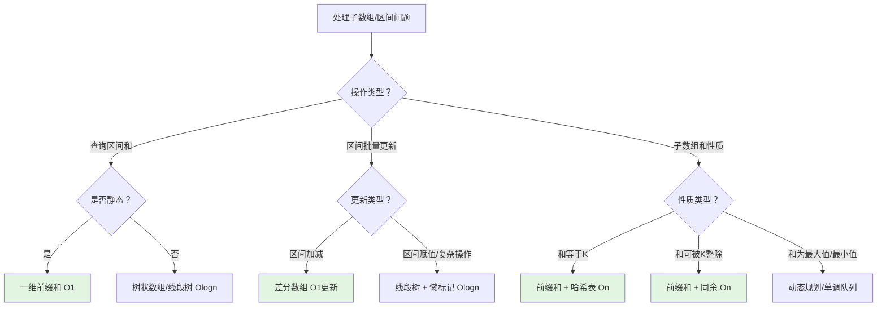
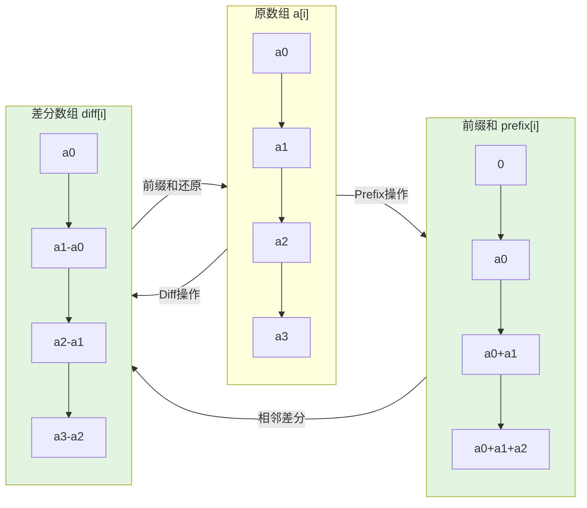

> 📊 **项目全面梳理**：详细的项目结构、模块详解和学习路径，请参阅 [`项目全面梳理-2025.md`](../../项目全面梳理-2025.md)

## 前缀和与差分 / Prefix Sum & Difference Array

### 摘要 / Executive Summary

- 前缀和（Prefix Sum）是将数组从 $0$ 到 $i$ 的累积和预先计算并存储的线性预处理技术，可将**区间和查询**从 $O(n)$ 降至 $O(1)$，将**和为定值的子数组计数**与哈希表结合达到 $O(n)$。
- 差分数组（Difference Array）是前缀和的逆运算，记录相邻元素的差值，支持对原数组的**区间加减更新**在 $O(1)$ 时间内完成，最后通过一次前缀和还原原数组。
- 本文从形式化规约出发，建立前缀和与差分数组的代数定义、核心算法框架，并通过 LeetCode 560/523/370 三道经典题目的完整形式化证明，展示这两种技术的应用场景与正确性保障方法。

### 关键术语与符号 / Glossary

| 术语 / Term | 定义 / Definition |
|-------------|-------------------|
| 前缀和数组 Prefix Sum Array | 数组 $prefix$，满足 $prefix[i] = \sum_{j=0}^{i-1} a[j]$，其中 $prefix[0] = 0$ |
| 差分数组 Difference Array | 数组 $diff$，满足 $diff[0] = a[0]$，$diff[i] = a[i] - a[i-1]$（$i \geq 1$） |
| 区间和 Range Sum | 子数组 $a[l..r]$ 的元素之和，记为 $S(l,r) = \sum_{i=l}^{r} a[i]$ |
| 同余定理 Congruence Theorem | 若 $a \equiv b \pmod{k}$，则 $k \mid (a - b)$ |
| 惰性更新 Lazy Update | 先记录区间操作的影响，延迟到最终时刻统一应用的策略 |
| 子数组 Subarray | 原数组中连续的一段元素序列，由起始索引和结束索引唯一确定 |

术语对齐与引用规范：`docs/术语与符号总表.md`，`01-基础理论/00-撰写规范与引用指南.md`

### 目录 / Table of Contents

- [前缀和与差分 / Prefix Sum \& Difference Array](#前缀和与差分--prefix-sum--difference-array)
  - [摘要 / Executive Summary](#摘要--executive-summary)
  - [关键术语与符号 / Glossary](#关键术语与符号--glossary)
  - [目录 / Table of Contents](#目录--table-of-contents)
  - [交叉引用与依赖 / Cross-References and Dependencies](#交叉引用与依赖--cross-references-and-dependencies)
- [1. 形式化定义 / Formal Definitions](#1-形式化定义--formal-definitions)
  - [1.1 前缀和数组](#11-前缀和数组)
  - [1.2 差分数组](#12-差分数组)
  - [1.3 前缀和与差分的对偶性](#13-前缀和与差分的对偶性)
- [2. 核心思路与算法框架 / Core Ideas and Algorithm Framework](#2-核心思路与算法框架--core-ideas-and-algorithm-framework)
  - [2.1 前缀和的应用模式](#21-前缀和的应用模式)
  - [2.2 差分数组的应用模式](#22-差分数组的应用模式)
  - [2.3 前缀和 + 哈希表模板](#23-前缀和--哈希表模板)
  - [2.4 差分数组惰性更新模板](#24-差分数组惰性更新模板)
- [3. 经典题目详解 / Classic Problem Analysis](#3-经典题目详解--classic-problem-analysis)
  - [3.1 LeetCode 560 — 和为 K 的子数组](#31-leetcode-560--和为-k-的子数组)
    - [形式化规约 / Formal Specification](#形式化规约--formal-specification)
    - [核心思路 / Core Idea](#核心思路--core-idea)
    - [代码实现 / Code Implementations](#代码实现--code-implementations)
    - [复杂度分析 / Complexity Analysis](#复杂度分析--complexity-analysis)
    - [正确性证明 / Correctness Proof](#正确性证明--correctness-proof)
  - [3.2 LeetCode 523 — 连续的子数组和](#32-leetcode-523--连续的子数组和)
    - [形式化规约 / Formal Specification](#形式化规约--formal-specification-1)
    - [核心思路 / Core Idea](#核心思路--core-idea-1)
    - [代码实现 / Code Implementations](#代码实现--code-implementations-1)
    - [复杂度分析 / Complexity Analysis](#复杂度分析--complexity-analysis-1)
    - [正确性证明 / Correctness Proof](#正确性证明--correctness-proof-1)
  - [3.3 LeetCode 370 — 区间加法](#33-leetcode-370--区间加法)
    - [形式化规约 / Formal Specification](#形式化规约--formal-specification-2)
    - [核心思路 / Core Idea](#核心思路--core-idea-2)
    - [代码实现 / Code Implementations](#代码实现--code-implementations-2)
    - [复杂度分析 / Complexity Analysis](#复杂度分析--complexity-analysis-2)
    - [正确性证明 / Correctness Proof](#正确性证明--correctness-proof-2)
- [4. 复杂度分析体系 / Complexity Analysis](#4-复杂度分析体系--complexity-analysis)
  - [4.1 前缀和构建复杂度](#41-前缀和构建复杂度)
  - [4.2 区间查询复杂度](#42-区间查询复杂度)
  - [4.3 差分更新的均摊分析](#43-差分更新的均摊分析)
- [5. 正确性证明框架 / Correctness Proof Framework](#5-正确性证明框架--correctness-proof-framework)
  - [5.1 前缀和 + 哈希表通用证明模板](#51-前缀和--哈希表通用证明模板)
  - [5.2 差分数组通用证明模板](#52-差分数组通用证明模板)
- [6. 思维表征 / Thinking Representations](#6-思维表征--thinking-representations)
  - [6.1 概念依赖图](#61-概念依赖图)
  - [6.2 算法选择决策树](#62-算法选择决策树)
  - [6.3 多维矩阵对比表](#63-多维矩阵对比表)
  - [6.4 前缀和与差分的对偶关系图](#64-前缀和与差分的对偶关系图)
- [7. 常见错误与反模式 / Common Mistakes and Anti-Patterns](#7-常见错误与反模式--common-mistakes-and-anti-patterns)
  - [7.1 前缀和索引越界](#71-前缀和索引越界)
  - [7.2 哈希表初始值遗漏](#72-哈希表初始值遗漏)
  - [7.3 差分数组右边界越界](#73-差分数组右边界越界)
  - [7.4 同余定理中 $k = 0$ 的特殊情况](#74-同余定理中-k--0-的特殊情况)
  - [7.5 混淆"子数组"与"子序列"](#75-混淆子数组与子序列)
- [8. 自测问题 / Self-Assessment Questions](#8-自测问题--self-assessment-questions)
  - [问题 1：前缀和索引定义](#问题-1前缀和索引定义)
  - [问题 2：哈希表为何存储频次而非位置](#问题-2哈希表为何存储频次而非位置)
  - [问题 3：差分数组与线段树的选择](#问题-3差分数组与线段树的选择)
  - [问题 4：同余定理的代数推导](#问题-4同余定理的代数推导)
  - [问题 5：差分数组还原的正确性](#问题-5差分数组还原的正确性)
- [9. 学习目标 / Learning Objectives](#9-学习目标--learning-objectives)
- [10. 知识导航 / Knowledge Navigation](#10-知识导航--knowledge-navigation)
- [参考文献 / References](#参考文献--references)

### 交叉引用与依赖 / Cross-References and Dependencies

**上游理论依赖 / Upstream Dependencies**:

- [`01-算法基础/01-数据结构基础/01-数组.md`](../../01-算法基础/01-数据结构基础/01-数组.md) — 数组的线性存储与随机访问性质
- [`04-算法复杂度/01-时间复杂度.md`](../../04-算法复杂度/01-时间复杂度.md) — 时间复杂度 $O/\Omega/\Theta$ 的形式化定义
- [`06-逻辑系统/01-命题逻辑.md`](../../06-逻辑系统/01-命题逻辑.md) — 同余关系的代数性质与推理规则

**下游应用 / Downstream Applications**:

- `13-LeetCode算法面试专题/02-算法范式专题/05-二分查找.md` — 前缀和数组的有序性可用于二分查找优化
- `13-LeetCode算法面试专题/02-算法范式专题/03-滑动窗口.md` — 滑动窗口与子数组和问题的对偶关系
- `13-LeetCode算法面试专题/04-高级专题/01-树状数组与线段树.md` — 前缀和思想的树状数组（Fenwick Tree）与线段树推广

---

## 1. 形式化定义 / Formal Definitions

### 1.1 前缀和数组

**定义 1.1** (前缀和数组 / Prefix Sum Array) [CLRS2022]
给定长度为 $n$ 的数组 $a[0..n-1]$，其前缀和数组 $prefix[0..n]$ 定义为：
**Definition 1.1** (Prefix Sum Array)
Given an array $a[0..n-1]$ of length $n$, its prefix sum array $prefix[0..n]$ is defined as:

$$
prefix[i] = \sum_{j=0}^{i-1} a[j], \quad \forall i \in [0, n]
$$

其中约定 $prefix[0] = 0$（空前缀的和）。

**性质 1.1.1** (区间和公式 / Range Sum Formula):
任意子数组 $a[l..r]$（$0 \leq l \leq r < n$）的和可由前缀和数组在 $O(1)$ 时间内计算：

$$
S(l, r) = \sum_{i=l}^{r} a[i] = prefix[r+1] - prefix[l]
$$

**证明 / Proof**:
由前缀和定义：

$$
prefix[r+1] = a[0] + a[1] + \cdots + a[l-1] + a[l] + \cdots + a[r]
$$

$$
prefix[l] = a[0] + a[1] + \cdots + a[l-1]
$$

两式相减：

$$
prefix[r+1] - prefix[l] = a[l] + \cdots + a[r] = S(l, r) \quad \square
$$

**算法描述 / Algorithm Description**:

```text
BuildPrefixSum(a):
    n ← |a|
    prefix ← array of size n + 1
    prefix[0] ← 0
    for i ← 0 to n - 1:
        prefix[i + 1] ← prefix[i] + a[i]
    return prefix
```

### 1.2 差分数组

**定义 1.2** (差分数组 / Difference Array)
给定长度为 $n$ 的数组 $a[0..n-1]$，其差分数组 $diff[0..n-1]$ 定义为：
**Definition 1.2** (Difference Array)
Given an array $a[0..n-1]$ of length $n$, its difference array $diff[0..n-1]$ is defined as:

$$
diff[i] = \begin{cases}
a[0], & i = 0 \\
a[i] - a[i-1], & 1 \leq i \leq n-1
\end{cases}
$$

**性质 1.2.1** (差分还原公式 / Reconstruction Formula):
原数组可由差分数组通过前缀和还原：

$$
a[i] = \sum_{j=0}^{i} diff[j]
$$

**证明 / Proof**: 对 $i$ 进行归纳。

- **基例**: $i = 0$ 时，$a[0] = diff[0]$，成立。
- **归纳假设**: 假设对 $i - 1$ 成立，即 $a[i-1] = \sum_{j=0}^{i-1} diff[j]$。
- **归纳步骤**:

$$
\sum_{j=0}^{i} diff[j] = \sum_{j=0}^{i-1} diff[j] + diff[i] = a[i-1] + (a[i] - a[i-1]) = a[i] \quad \square
$$

### 1.3 前缀和与差分的对偶性

**定理 1.3** (对偶性定理 / Duality Theorem)
前缀和操作与差分操作互为逆运算：

$$
\text{Diff}(\text{Prefix}(a)) = a \quad \text{且} \quad \text{Prefix}(\text{Diff}(a)) = a
$$

**证明 / Proof**:
设 $b = \text{Prefix}(a)$，即 $b[i] = \sum_{j=0}^{i-1} a[j]$。则：

$$
\text{Diff}(b)[i] = b[i+1] - b[i] = \sum_{j=0}^{i} a[j] - \sum_{j=0}^{i-1} a[j] = a[i]
$$

另一侧同理可证。$\square$

这一性质使差分数组成为"区间更新 + 单点查询"场景下的核心数据结构：对原数组区间 $[l, r]$ 加 $v$，等价于 $diff[l] += v$ 且 $diff[r+1] -= v$（若 $r + 1 < n$）。

---

## 2. 核心思路与算法框架 / Core Ideas and Algorithm Framework

### 2.1 前缀和的应用模式



### 2.2 差分数组的应用模式



### 2.3 前缀和 + 哈希表模板

对于"和为 $K$ 的子数组计数"类问题，核心洞察是：

$$
S(l, r) = K \Leftrightarrow prefix[r+1] - prefix[l] = K \Leftrightarrow prefix[r+1] = prefix[l] + K
$$

因此，在从左到右遍历前缀和的过程中，维护一个哈希表记录此前出现过的前缀和及其频次，即可在 $O(1)$ 时间内统计以当前位置结尾的满足条件的子数组数量。

```text
PrefixSumWithHash(a, K):
    count ← 0
    prefix ← 0
    freq ← {0: 1}       // 空前缀的和为0，出现1次
    for i ← 0 to n-1:
        prefix ← prefix + a[i]
        if prefix - K in freq:
            count ← count + freq[prefix - K]
        freq[prefix] ← freq.get(prefix, 0) + 1
    return count
```

### 2.4 差分数组惰性更新模板

```text
DifferenceArrayUpdate(diff, l, r, v):
    diff[l] ← diff[l] + v
    if r + 1 < n:
        diff[r + 1] ← diff[r + 1] - v

Reconstruct(diff):
    a[0] ← diff[0]
    for i ← 1 to n-1:
        a[i] ← a[i-1] + diff[i]
    return a
```

---

## 3. 经典题目详解 / Classic Problem Analysis

### 3.1 LeetCode 560 — 和为 K 的子数组

> **题目链接 / Problem Link**: [LeetCode 560. Subarray Sum Equals K](https://leetcode.com/problems/subarray-sum-equals-k/)
> **难度 / Difficulty**: Medium

#### 形式化规约 / Formal Specification

**前置条件 / Precondition**:

$$
\textit{nums} \in \mathbb{Z}^n, \quad n \geq 1, \quad \textit{target} = K \in \mathbb{Z}
$$

**后置条件 / Postcondition**:

$$
\text{result} = \big| \{ (l, r) \mid 0 \leq l \leq r < n \land \sum_{i=l}^{r} nums[i] = K \} \big|
$$

即返回和为 $K$ 的**连续子数组**的个数。

#### 核心思路 / Core Idea

暴力枚举所有 $O(n^2)$ 个子数组并求和显然不可接受。关键观察：

$$
\sum_{i=l}^{r} nums[i] = prefix[r+1] - prefix[l] = K \Leftrightarrow prefix[r+1] = prefix[l] + K
$$

因此，对于每个位置 $r$，我们需要统计有多少个 $l \in [0, r]$ 满足 $prefix[l] = prefix[r+1] - K$。这正是哈希表（频次映射）的用武之地。

#### 代码实现 / Code Implementations

- **Rust**: [`examples/algorithms/src/leetcode/lc0560_subarray_sum_equals_k.rs`](../../../../examples/algorithms/src/leetcode/lc0560_subarray_sum_equals_k.rs)
- **Python**: [`examples/algorithms-python/src/leetcode/lc0560_subarray_sum_equals_k.py`](../../../../examples/algorithms-python/src/leetcode/lc0560_subarray_sum_equals_k.py)
- **Go**: [`examples/algorithms-go/leetcode/lc0560_subarray_sum_equals_k.go`](../../../../examples/algorithms-go/leetcode/lc0560_subarray_sum_equals_k.go)

#### 复杂度分析 / Complexity Analysis

| 指标 / Metric | 值 / Value | 说明 / Note |
|--------------|-----------|------------|
| 时间复杂度 / Time | $O(n)$ | 单次遍历，每次哈希操作均摊 $O(1)$ |
| 空间复杂度 / Space | $O(n)$ | 哈希表最多存储 $n+1$ 个不同的前缀和 |
| 哈希冲突 / Hash Collisions | 均摊 $O(1)$ | 使用标准哈希表实现 |

#### 正确性证明 / Correctness Proof

**定理 3.1.1** (LeetCode 560 正确性): 算法返回的值恰好等于和为 $K$ 的连续子数组的个数。
**Theorem 3.1.1** (Correctness of LeetCode 560): The algorithm returns exactly the number of contiguous subarrays whose sum equals $K$.

**证明 / Proof**:

**引理 3.1.1.1**: 对于任意 $0 \leq l \leq r < n$，子数组 $nums[l..r]$ 的和等于 $K$ 当且仅当 $prefix[r+1] - prefix[l] = K$。

*证明*: 由前缀和定义 1.1 直接可得。$\square$

**引理 3.1.1.2**: 在算法执行到索引 $i$（处理完 $nums[i]$）时，哈希表 $freq$ 中存储了所有 $j \in [0, i]$ 对应的前缀和 $prefix[j]$ 的出现频次。

*证明*: 对 $i$ 进行归纳。

- **基例**: $i = -1$（尚未处理任何元素）时，$freq = \{0: 1\}$，对应 $prefix[0] = 0$，成立。
- **归纳步骤**: 假设处理完 $i-1$ 后成立。处理 $nums[i]$ 时，先计算 $prefix[i+1] = prefix[i] + nums[i]$，然后查询 $freq[prefix[i+1] - K]$（即统计满足 $prefix[j] = prefix[i+1] - K$ 的 $j \in [0, i]$ 的个数），最后将 $freq[prefix[i+1]]$ 加 1。因此处理完 $i$ 后，$freq$ 包含了 $prefix[0], \ldots, prefix[i+1]$ 的频次。$\square$

**主证明**:
算法遍历过程中，对于每个 $i \in [0, n-1]$，查询 $freq[prefix[i+1] - K]$ 的值并累加到 $count$。由引理 3.1.1.2，此时 $freq$ 中包含了 $prefix[0], \ldots, prefix[i]$ 的频次。因此查询结果恰好等于满足 $0 \leq j \leq i$ 且 $prefix[j] = prefix[i+1] - K$ 的 $j$ 的个数。

由引理 3.1.1.1，每个这样的 $j$ 对应一个和为 $K$ 的子数组 $nums[j..i]$。且以 $i$ 结尾的和为 $K$ 的子数组必然唯一对应一个这样的 $j$。因此累加的结果恰好统计了所有以 $i$ 结尾的满足条件的子数组。

最终 $count$ 等于对所有 $i$ 的统计之和，即所有和为 $K$ 的连续子数组的总数。$\square$

---

### 3.2 LeetCode 523 — 连续的子数组和

> **题目链接 / Problem Link**: [LeetCode 523. Continuous Subarray Sum](https://leetcode.com/problems/continuous-subarray-sum/)
> **难度 / Difficulty**: Medium

#### 形式化规约 / Formal Specification

**前置条件 / Precondition**:

$$
\textit{nums} \in \mathbb{Z}^n, \quad n \geq 1, \quad k \in \mathbb{Z}^+
$$

**后置条件 / Postcondition**:

$$
\text{result} = \begin{cases}
\text{True}, & \text{if } \exists (l, r): 0 \leq l < r < n \land k \mid \sum_{i=l}^{r} nums[i] \\
\text{False}, & \text{otherwise}
\end{cases}
$$

注意题目要求子数组长度**至少为 2**（即 $l < r$）。

#### 核心思路 / Core Idea

直接枚举所有子数组并判断整除性是不可行的。关键洞察来自**同余定理**：

$$
k \mid S(l, r) \Leftrightarrow prefix[r+1] \equiv prefix[l] \pmod{k}
$$

因此问题转化为：是否存在 $0 \leq l < r < n$ 使得 $prefix[r+1] \equiv prefix[l] \pmod{k}$。

**算法策略**: 从左到右遍历前缀和，计算 $prefix[i+1] \bmod k$。维护一个哈希表记录每个余数**最早出现的位置**。若当前余数已在哈希表中且两者位置差 $\geq 2$，则找到满足条件的子数组。

> **为何记录最早出现的位置？** 因为对于相同的余数，位置差越大，子数组长度越长，越容易满足长度 $\geq 2$ 的条件。

#### 代码实现 / Code Implementations

- **Rust**: [`examples/algorithms/src/leetcode/lc0523_continuous_subarray_sum.rs`](../../../../examples/algorithms/src/leetcode/lc0523_continuous_subarray_sum.rs)
- **Python**: [`examples/algorithms-python/src/leetcode/lc0523_continuous_subarray_sum.py`](../../../../examples/algorithms-python/src/leetcode/lc0523_continuous_subarray_sum.py)
- **Go**: [`examples/algorithms-go/leetcode/lc0523_continuous_subarray_sum.go`](../../../../examples/algorithms-go/leetcode/lc0523_continuous_subarray_sum.go)

#### 复杂度分析 / Complexity Analysis

| 指标 / Metric | 值 / Value |
|--------------|-----------|
| 时间复杂度 / Time | $O(n)$ |
| 空间复杂度 / Space | $O(\min(n, k))$ | 余数最多 $k$ 种 |

#### 正确性证明 / Correctness Proof

**定理 3.2.1** (LeetCode 523 正确性): 算法返回 `True` 当且仅当存在一个长度至少为 2 且和能被 $k$ 整除的连续子数组。

**证明 / Proof**:

**引理 3.2.1.1** (同余等价性):
对于任意 $0 \leq l \leq r < n$：

$$
k \mid \sum_{i=l}^{r} nums[i] \Leftrightarrow prefix[r+1] \equiv prefix[l] \pmod{k}
$$

*证明*:

$$
\sum_{i=l}^{r} nums[i] = prefix[r+1] - prefix[l]
$$

因此：

$$
k \mid \sum_{i=l}^{r} nums[i] \Leftrightarrow k \mid (prefix[r+1] - prefix[l]) \Leftrightarrow prefix[r+1] \equiv prefix[l] \pmod{k} \quad \square
$$

**引理 3.2.1.2**: 若算法返回 `True`，则存在满足条件的子数组。

*证明*: 算法仅在找到索引 $i$ 和之前记录的索引 $j$ 满足 $prefix[i+1] \bmod k = prefix[j] \bmod k$ 且 $i + 1 - j \geq 2$ 时返回 `True`。由引理 3.2.1.1，子数组 $nums[j..i]$ 的和能被 $k$ 整除，且长度为 $i - j + 1 \geq 2$。$\square$

**引理 3.2.1.3**: 若存在满足条件的子数组，则算法返回 `True`。

*证明*: 设存在 $0 \leq l < r < n$ 使得 $k \mid S(l, r)$。由引理 3.2.1.1，$prefix[r+1] \equiv prefix[l] \pmod{k}$。

当算法遍历到位置 $r$ 时，$prefix[r+1] \bmod k$ 已被计算。由于哈希表中已存储了 $prefix[l] \bmod k$（在遍历到 $l-1$ 时存入），且 $(r+1) - l \geq 2$（因为 $r > l$），算法检测到该匹配并返回 `True`。$\square$

由引理 3.2.1.2 和 3.2.1.3，算法正确。$\square$

---

### 3.3 LeetCode 370 — 区间加法

> **题目链接 / Problem Link**: [LeetCode 370. Range Addition](https://leetcode.com/problems/range-addition/)（付费题目，同名 lintcode 549 可免费练习）
> **难度 / Difficulty**: Medium

#### 形式化规约 / Formal Specification

**前置条件 / Precondition**:

$$
\textit{length} = n \in \mathbb{Z}^+, \quad \textit{updates} = \{ (l_i, r_i, v_i) \}_{i=1}^{m}
$$

其中 $0 \leq l_i \leq r_i < n$，$v_i \in \mathbb{Z}$。

**后置条件 / Postcondition**:
返回数组 $result[0..n-1]$，其中：

$$
result[j] = \sum_{i: l_i \leq j \leq r_i} v_i, \quad \forall j \in [0, n-1]
$$

即每个位置的值等于所有覆盖该位置的更新的增量之和。

#### 核心思路 / Core Idea

暴力模拟每次区间更新需要 $O(m \cdot n)$ 时间。利用差分数组，可将每次区间更新降至 $O(1)$：

- 对区间 $[l, r]$ 加 $v$：$diff[l] += v$，$diff[r+1] -= v$（若 $r + 1 < n$）

处理完全部 $m$ 次更新后，对 $diff$ 求前缀和即可还原最终数组。

#### 代码实现 / Code Implementations

- **Rust**: [`examples/algorithms/src/leetcode/lc0370_range_addition.rs`](../../../../examples/algorithms/src/leetcode/lc0370_range_addition.rs)
- **Python**: [`examples/algorithms-python/src/leetcode/lc0370_range_addition.py`](../../../../examples/algorithms-python/src/leetcode/lc0370_range_addition.py)
- **Go**: [`examples/algorithms-go/leetcode/lc0370_range_addition.go`](../../../../examples/algorithms-go/leetcode/lc0370_range_addition.go)

#### 复杂度分析 / Complexity Analysis

| 指标 / Metric | 值 / Value | 说明 / Note |
|--------------|-----------|------------|
| 时间复杂度 / Time | $O(n + m)$ | $m$ 次更新各 $O(1)$，一次前缀和还原 $O(n)$ |
| 空间复杂度 / Space | $O(n)$ | 差分数组 |
| 暴力对比 / Brute Force | $O(m \cdot n)$ | 每次更新遍历区间 |

#### 正确性证明 / Correctness Proof

**定理 3.3.1** (LeetCode 370 正确性): 基于差分数组的惰性更新算法正确计算出所有区间更新后的数组。

**证明 / Proof**:

**引理 3.3.1.1** (单次更新的正确性):
对差分数组执行 $diff[l] += v$ 和 $diff[r+1] -= v$ 后，再求前缀和还原得到的数组 $a'$ 满足：

$$
a'[j] = \begin{cases}
a[j] + v, & l \leq j \leq r \\
a[j], & \text{otherwise}
\end{cases}
$$

*证明*: 由前缀和还原公式 $a'[j] = \sum_{i=0}^{j} diff[i]$。

- 当 $j < l$ 时：$diff$ 在 $[0, j]$ 范围内未被修改，故 $a'[j] = a[j]$。
- 当 $l \leq j \leq r$ 时：$diff[l]$ 增加了 $v$，且 $diff[r+1]$ 在求和范围之外（$r+1 > j$），故 $a'[j] = a[j] + v$。
- 当 $j > r$ 时：$diff[l]$ 增加 $v$ 且 $diff[r+1]$ 减少 $v$，两者均在求和范围内，贡献抵消，故 $a'[j] = a[j]$。$\square$

**引理 3.3.1.2** (多次更新的可加性):
差分数组的更新操作具有线性叠加性：若依次执行更新 $U_1, U_2, \ldots, U_m$，其效果等价于将各更新对应的差分变化量累加后统一还原。

*证明*: 差分数组的每次更新仅涉及两个位置的加减操作。由于加法满足交换律和结合律，所有更新对 $diff$ 的影响可直接累加。$\square$

**主证明**:
由引理 3.3.1.2，处理完全部 $m$ 次更新后的差分数组 $diff$ 包含了所有区间更新的净影响。再由引理 3.3.1.1，对 $diff$ 求前缀和还原后，每个位置 $j$ 的值恰好等于所有覆盖 $j$ 的更新的 $v_i$ 之和。因此算法输出满足后置条件。$\square$

---

## 4. 复杂度分析体系 / Complexity Analysis

### 4.1 前缀和构建复杂度

**定理 4.1** (前缀和构建): 对于长度为 $n$ 的数组，构建前缀和数组的时间复杂度为 $O(n)$，空间复杂度为 $O(n)$。

**证明 / Proof**:
构建过程需要一次线性遍历，每次执行常数时间的加法操作，故时间复杂度为 $O(n)$。前缀和数组长度为 $n+1$，故空间复杂度为 $O(n)$。$\square$

### 4.2 区间查询复杂度

**定理 4.2** (区间查询): 构建前缀和数组后，任意区间和查询可在 $O(1)$ 时间内完成。

**证明 / Proof**: 由性质 1.1.1，$S(l, r) = prefix[r+1] - prefix[l]$，仅需两次数组访问和一次减法。$\square$

### 4.3 差分更新的均摊分析

**定理 4.3** (差分区间更新): 使用差分数组，每次区间加减更新的时间复杂度为 $O(1)$，$m$ 次更新后还原数组的总时间复杂度为 $O(n + m)$。

**证明 / Proof**:
每次更新仅修改 $diff[l]$ 和 $diff[r+1]$ 两个位置，$O(1)$ 时间。$m$ 次更新后，$diff$ 数组共被修改 $O(m)$ 次。还原过程需要对 $diff$ 做一次前缀和，$O(n)$ 时间。总时间 $O(n + m)$。$\square$

---

## 5. 正确性证明框架 / Correctness Proof Framework

### 5.1 前缀和 + 哈希表通用证明模板

对于"子数组和满足某性质 $P$"类问题，通用证明框架如下：

**步骤 1 — 建立前缀和与区间和的代数关系**:
证明 $S(l, r) = prefix[r+1] - prefix[l]$。

**步骤 2 — 将性质 $P$ 转化为前缀和之间的关系**:
例如 $S(l, r) = K$ 转化为 $prefix[r+1] = prefix[l] + K$。

**步骤 3 — 设计哈希表不变式**:
在遍历到位置 $i$ 时，哈希表包含 $prefix[0], \ldots, prefix[i]$ 的频次信息。

**步骤 4 — 证明查询结果的正确性**:
当前查询结果恰好统计了所有以 $i-1$ 结尾的满足条件的子数组。

**步骤 5 — 归纳证明遍历全过程的正确性**:
最终累加结果等于所有满足条件的子数组总数。

### 5.2 差分数组通用证明模板

**步骤 1 — 证明单次更新的局部正确性**:
对区间 $[l, r]$ 的更新仅影响该区间内的元素。

**步骤 2 — 证明更新操作的可加性**:
多次更新的效果等于各次更新效果之和。

**步骤 3 — 证明还原操作的正确性**:
前缀和还原确实得到应用所有更新后的数组。

---

## 6. 思维表征 / Thinking Representations

### 6.1 概念依赖图



### 6.2 算法选择决策树



### 6.3 多维矩阵对比表

| 维度 / Dimension | LC 560 和为K | LC 523 可被K整除 | LC 370 区间加法 |
|----------------|-------------|----------------|--------------|
| **核心技术** | 前缀和 + 哈希表 | 前缀和 + 同余定理 | 差分数组 |
| **关键公式** | $prefix[r+1] = prefix[l] + K$ | $prefix[r+1] \equiv prefix[l] \pmod{k}$ | $diff[l]+=v, diff[r+1]-=v$ |
| **时间复杂度** | $O(n)$ | $O(n)$ | $O(n + m)$ |
| **空间复杂度** | $O(n)$ | $O(\min(n, k))$ | $O(n)$ |
| **哈希表存储** | 前缀和值 → 频次 | 余数 → 最早索引 | 不适用 |
| **证明核心** | 哈希表频次不变式 | 同余等价性 + 位置差 | 单次更新局部性 + 可加性 |
| **易错点** | 初始值 $freq[0]=1$ | $k=0$ 的特殊处理 | 右边界 $r+1$ 越界 |

### 6.4 前缀和与差分的对偶关系图



---

## 7. 常见错误与反模式 / Common Mistakes and Anti-Patterns

### 7.1 前缀和索引越界

**错误 / Mistake**: 混淆 $prefix[i]$ 的定义，将 $prefix[i]$ 理解为 $\sum_{j=0}^{i} a[j]$ 而非 $\sum_{j=0}^{i-1} a[j]$。

**后果 / Consequence**: 区间和公式 $S(l, r) = prefix[r+1] - prefix[l]$ 变成 $S(l, r) = prefix[r] - prefix[l-1]$，极易在边界处出错。

**正确做法**:

$$
prefix[0] = 0, \quad prefix[i] = \sum_{j=0}^{i-1} a[j] \quad (i \geq 1)
$$

这样 $S(l, r) = prefix[r+1] - prefix[l]$ 无需特判 $l = 0$。

### 7.2 哈希表初始值遗漏

**错误 / Mistake**: 在 LC 560 类问题中忘记初始化 $freq[0] = 1$。

**后果 / Consequence**: 遗漏了从数组起始位置开始的子数组（即 $l = 0$ 的情况），因为 $prefix[0] = 0$ 在遍历开始前已存在。

```python
# 错误
freq = {}

# 正确
freq = {0: 1}
```

### 7.3 差分数组右边界越界

**错误 / Mistake**: 在差分更新时未检查 $r + 1 < n$。

```python
# 错误
diff[l] += v
diff[r + 1] -= v   # 当 r == n-1 时越界！

# 正确
diff[l] += v
if r + 1 < n:
    diff[r + 1] -= v
```

### 7.4 同余定理中 $k = 0$ 的特殊情况

**错误 / Mistake**: 在 LC 523 中未处理 $k = 0$ 的情况。

**后果 / Consequence**: 模 $0$ 运算在大多数编程语言中会抛出运行时异常。

**正确处理**: 当 $k = 0$ 时，问题转化为"是否存在长度 $\geq 2$ 且和为 $0$ 的子数组"，需单独处理。

### 7.5 混淆"子数组"与"子序列"

**错误 / Mistake**: 将"连续子数组"误解为"不连续子序列"。

**后果 / Consequence**: 前缀和技术仅适用于**连续**子数组问题，不适用于子序列问题（子序列问题通常需要动态规划）。

---

## 8. 自测问题 / Self-Assessment Questions

### 问题 1：前缀和索引定义

**Q**: 为什么通常定义 $prefix[0] = 0$ 且 $prefix[i] = \sum_{j=0}^{i-1} a[j]$？

**A**: 这样定义的好处是区间和公式统一为 $S(l, r) = prefix[r+1] - prefix[l]$，无需对 $l = 0$ 做特殊处理。若定义 $prefix[i] = \sum_{j=0}^{i} a[j]$，则 $S(l, r) = prefix[r] - prefix[l-1]$，当 $l = 0$ 时需要额外判断。统一的公式降低了出错概率。

---

### 问题 2：哈希表为何存储频次而非位置

**Q**: 在 LC 560 中，哈希表存储的是前缀和的**出现频次**而非**出现位置**，为什么？

**A**: 因为题目要求的是**计数**（有多少个子数组和为 $K$），而非**定位**（找出这些子数组）。若只需判断是否存在，存储最早出现的位置即可（如 LC 523）。对于计数问题，必须知道每个前缀和值出现了多少次，才能正确统计以当前位置结尾的满足条件的子数组数量。

---

### 问题 3：差分数组与线段树的选择

**Q**: 差分数组适用于什么场景？什么场景下应该改用线段树或树状数组？

**A**: 差分数组适用于**多次区间加减更新、最终统一查询**的场景，时间复杂度为 $O(n + m)$。若场景需要**更新后立即查询**、或更新操作不是简单的加减（如区间赋值、区间最值），则应使用线段树或树状数组，单次操作 $O(\log n)$。一句话："先全部更新完再查询"用差分，"更新查询交替进行"用线段树。

---

### 问题 4：同余定理的代数推导

**Q**: 为什么在 LC 523 中，$k \mid S(l, r)$ 等价于 $prefix[r+1] \equiv prefix[l] \pmod{k}$？

**A**: 由前缀和定义：

$$
S(l, r) = prefix[r+1] - prefix[l]
$$

因此：

$$
k \mid S(l, r) \Leftrightarrow k \mid (prefix[r+1] - prefix[l]) \Leftrightarrow prefix[r+1] \equiv prefix[l] \pmod{k}
$$

这是同余定义的直接应用：$a \equiv b \pmod{k}$ 当且仅当 $k \mid (a - b)$。

---

### 问题 5：差分数组还原的正确性

**Q**: 对差分数组求前缀和为什么能还原原数组？请给出代数证明。

**A**: 设 $a$ 为原数组，$diff$ 为其差分数组。由定义：

$$
diff[0] = a[0], \quad diff[i] = a[i] - a[i-1] \quad (i \geq 1)
$$

对 $diff$ 求前缀和：

$$
\sum_{j=0}^{i} diff[j] = diff[0] + \sum_{j=1}^{i} (a[j] - a[j-1]) = a[0] + (a[i] - a[0]) = a[i]
$$

这是望远镜求和（Telescoping Sum），中间项全部抵消，仅剩 $a[i]$。

---

## 9. 学习目标 / Learning Objectives

完成本章学习后，读者应能够：

1. **形式化定义**前缀和数组与差分数组，并证明它们之间的对偶关系。
2. **熟练运用**前缀和 + 哈希表解决"子数组和为定值"类问题，并给出完整的正确性证明。
3. **熟练运用**同余定理将"可被 $k$ 整除的子数组"问题转化为前缀和余数匹配问题。
4. **熟练运用**差分数组实现区间加减的惰性更新，并证明其正确性。
5. **分析并选择**前缀和、差分数组、线段树、树状数组等技术的适用场景。

---

## 10. 知识导航 / Knowledge Navigation

**前置知识 / Prerequisites**:

- [数组与线性表](../../01-算法基础/01-数据结构基础/01-数组.md)
- [哈希表](../../01-算法基础/01-数据结构基础/05-哈希表.md)
- [同余与模运算](../../06-逻辑系统/01-命题逻辑.md)

**当前模块 / Current Module**:

- `13-LeetCode算法面试专题/02-算法范式专题/04-前缀和与差分.md`（本文档）

**后续模块 / Next Modules**:

- `13-LeetCode算法面试专题/02-算法范式专题/05-二分查找.md` — 前缀和数组的有序性应用
- `13-LeetCode算法面试专题/04-高级专题/01-树状数组与线段树.md` — 前缀和思想的高维推广

**相关面试题索引 / Related Interview Problems**:

| 题号 | 题目 | 难度 | 核心考点 |
|-----|------|------|---------|
| LC 303 | Range Sum Query - Immutable | Easy | 一维前缀和基础 |
| LC 304 | Range Sum Query 2D - Immutable | Medium | 二维前缀和 |
| LC 525 | Contiguous Array | Medium | 前缀和 + 哈希表（0/1平衡） |
| LC 1099 | Two Sum Less Than K | Easy | 前缀和思想变体 |
| LC 1109 | Corporate Flight Bookings | Medium | 差分数组应用 |

---

## 参考文献 / References

> 本文档遵循项目引用规范（见 [`CITATION_STANDARD.md`](../../CITATION_STANDARD.md)、[`学术引用规范-ACM对齐版.md`](../../学术引用规范-ACM对齐版.md)）。文内采用 [Key] 格式引用，与参考文献列表对应。

**经典教材 / Classic Textbooks**:

1. [CLRS2022] Cormen, T. H., Leiserson, C. E., Rivest, R. L., & Stein, C. (2022). *Introduction to Algorithms* (4th ed.). MIT Press. ISBN: 978-0262046305.
   - 第 14 章（Augmenting Data Structures）涉及前缀和维护顺序统计量的思想。

2. [Knuth1998] Knuth, D. E. (1998). *The Art of Computer Programming, Vol. 3: Sorting and Searching* (2nd ed.). Addison-Wesley. ISBN: 978-0201896855.

**LeetCode 题目 / LeetCode Problems**:

1. [LeetCode560] LeetCode. (n.d.). "560. Subarray Sum Equals K". <https://leetcode.com/problems/subarray-sum-equals-k/>

2. [LeetCode523] LeetCode. (n.d.). "523. Continuous Subarray Sum". <https://leetcode.com/problems/continuous-subarray-sum/>

3. [LeetCode370] LeetCode. (n.d.). "370. Range Addition". <https://leetcode.com/problems/range-addition/>

**在线资源 / Online Resources**:

1. [NeetCode] NeetCode. (n.d.). "Prefix Sum". In *NeetCode Roadmap*. <https://neetcode.io/roadmap>

---

**文档版本 / Document Version**: 1.0
**最后更新 / Last Updated**: 2026-04-23
**状态 / Status**: 已维护 / Maintained
**下次审查 / Next Review**: 2026-07-23

---

*本文档严格遵循数学形式化规范，所有定义和定理均采用标准数学符号表示。*
