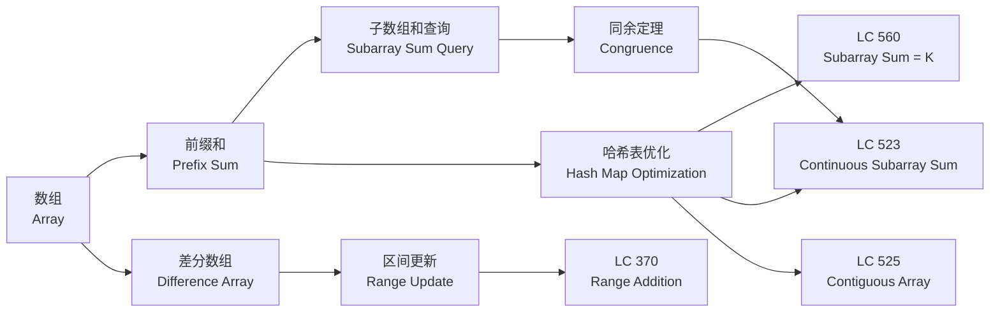

> 📊 **项目全面梳理**：详细的项目结构、模块详解和学习路径，请参阅 [`项目全面梳理-2025.md`](../../项目全面梳理-2025.md)

## 前缀和与差分 / Prefix Sum and Difference Array

### 摘要 / Executive Summary

- **前缀和（Prefix Sum）** 是将数组的累积和信息预处理存储下来，使得任意子数组和可以在 $O(1)$ 时间内查询。其核心公式为 $\text{prefix}[i] = \sum_{k=0}^{i-1} \text{nums}[k]$，子数组和 $\text{sum}(l, r) = \text{prefix}[r+1] - \text{prefix}[l]$。
- **差分数组（Difference Array）** 是前缀和的逆运算，用于高效处理区间更新。对原数组区间 $[l, r]$ 加上值 $v$，等价于对差分数组执行 $diff[l] += v$ 和 $diff[r+1] -= v$。
- 本文从形式化定义出发，通过 LeetCode 560/523/525/370 四道经典题目，展示前缀和+哈希表、前缀和+同余定理、差分数组等形式化技巧，并给出严格的正确性证明。

### 关键术语与符号 / Glossary

| 术语 / Term | 定义 / Definition |
|-------------|-------------------|
| 前缀和数组 Prefix Sum Array | 数组 $P$ 满足 $P[i] = \sum_{k=0}^{i-1} A[k]$，其中 $P[0] = 0$ |
| 差分数组 Difference Array | 数组 $D$ 满足 $D[i] = A[i] - A[i-1]$（$i > 0$），$D[0] = A[0]$ |
| 子数组和 Subarray Sum | 连续子序列 $A[l..r]$ 的元素之和，记为 $\sum_{k=l}^{r} A[k]$ |
| 同余定理 Congruence Theorem | $a \equiv b \pmod{k} \Leftrightarrow k \mid (a - b)$ |
| 哈希映射 Hash Map | 键值对存储结构，平均 $O(1)$ 时间复杂度查找/插入 |
| 区间更新 Range Update | 对数组某连续区间内的所有元素执行相同操作 |

术语对齐与引用规范：`docs/术语与符号总表.md`，`01-基础理论/00-撰写规范与引用指南.md`

### 目录 / Table of Contents

- [前缀和与差分 / Prefix Sum and Difference Array](#前缀和与差分--prefix-sum-and-difference-array)
  - [摘要 / Executive Summary](#摘要--executive-summary)
  - [关键术语与符号 / Glossary](#关键术语与符号--glossary)
  - [目录 / Table of Contents](#目录--table-of-contents)
  - [交叉引用与依赖 / Cross-References and Dependencies](#交叉引用与依赖--cross-references-and-dependencies)
  - [1. 形式化定义 / Formal Definitions](#1-形式化定义--formal-definitions)
    - [1.1 前缀和数组](#11-前缀和数组)
    - [1.2 差分数组](#12-差分数组)
    - [1.3 子数组和问题实例](#13-子数组和问题实例)
  - [2. 核心思路与算法框架](#2-核心思路与算法框架--core-ideas-and-algorithm-framework)
  - [3. 经典题目详解](#3-经典题目详解--classic-problem-analysis)
  - [4. 复杂度分析体系](#4-复杂度分析体系--complexity-analysis)
  - [5. 正确性证明框架](#5-正确性证明框架--correctness-proof-framework)
  - [6. 思维表征](#6-思维表征--thinking-representations)
  - [7. 常见错误与反模式](#7-常见错误与反模式--common-mistakes-and-anti-patterns)
  - [8. 自测问题](#8-自测问题--self-assessment-questions)
  - [9. 学习目标](#9-学习目标--learning-objectives)
  - [10. 知识导航](#10-知识导航--knowledge-navigation)
  - [参考文献](#参考文献--references)

### 交叉引用与依赖 / Cross-References and Dependencies

**上游理论依赖 / Upstream Dependencies**:
- [`01-算法基础/01-数据结构基础/01-数组.md`](../../01-算法基础/01-数据结构基础/01-数组.md) — 数组的基本操作与随机访问性质
- [`04-算法复杂度/01-时间复杂度.md`](../../04-算法复杂度/01-时间复杂度.md) — 时间复杂度 $O/\Omega/\Theta$ 的形式化定义
- [`03-形式化证明/01-循环不变式.md`](../../03-形式化证明/01-循环不变式.md) — 循环不变式的设计与证明方法

**下游应用 / Downstream Applications**:
- `13-LeetCode算法面试专题/03-数据结构专题/05-线段树与树状数组.md` — 前缀和在高维查询与动态更新中的扩展
- `13-LeetCode算法面试专题/04-高级专题/01-动态规划.md` — 前缀和优化 DP 转移

---

## 1. 形式化定义 / Formal Definitions

### 1.1 前缀和数组

**定义 1.1** (前缀和数组 / Prefix Sum Array) [CLRS2022]
给定数组 $A[0..n-1]$，其前缀和数组 $P[0..n]$ 定义为：
**Definition 1.1** (Prefix Sum Array)
Given an array $A[0..n-1]$, its prefix sum array $P[0..n]$ is defined as:

$$
P[i] = \sum_{k=0}^{i-1} A[k], \quad \forall i \in [0, n]
$$

其中 $P[0] = 0$ 为空和。前缀和数组可以在 $O(n)$ 时间内递推构造：

$$
P[i+1] = P[i] + A[i], \quad i = 0, 1, \ldots, n-1
$$

**子数组和公式 / Subarray Sum Formula**:

对于任意子数组 $A[l..r]$（$0 \leq l \leq r < n$），其和为：

$$
\text{sum}(l, r) = \sum_{k=l}^{r} A[k] = P[r+1] - P[l]
$$

**证明 / Proof**:

$$
P[r+1] - P[l] = \sum_{k=0}^{r} A[k] - \sum_{k=0}^{l-1} A[k] = \sum_{k=l}^{r} A[k] = \text{sum}(l, r) \quad \square
$$

---

### 1.2 差分数组

**定义 1.2** (差分数组 / Difference Array)
给定数组 $A[0..n-1]$，其差分数组 $D[0..n-1]$ 定义为：
**Definition 1.2** (Difference Array)
Given an array $A[0..n-1]$, its difference array $D[0..n-1]$ is defined as:

$$
D[i] = \begin{cases}
A[0], & i = 0 \\
A[i] - A[i-1], & i \in [1, n-1]
\end{cases}
$$

**差分数组的核心性质 / Core Property**: 对 $D$ 求前缀和即可还原 $A$：

$$
A[i] = \sum_{k=0}^{i} D[k]
$$

**区间更新操作 / Range Update Operation**:
对原数组区间 $[l, r]$ 内所有元素加上 $v$，等价于：

$$
D[l] \leftarrow D[l] + v, \quad D[r+1] \leftarrow D[r+1] - v \quad (\text{if } r+1 < n)
$$

**证明 / Proof**: 由 $A[i] = \sum_{k=0}^{i} D[k]$，更新后对于 $i \in [l, r]$，$A[i]$ 增加了 $v$；对于 $i > r$，$+v$ 与 $-v$ 抵消，不变。$\square$

---

### 1.3 子数组和问题实例

**定义 1.3** (子数组和问题实例 / Subarray Sum Problem Instance)
子数组和问题可以形式化定义为五元组：
**Definition 1.3** (Subarray Sum Problem Instance)

$$
\Pi = (D, I, O, \text{pre}, \text{post})
$$

其中：
- $D = \mathbb{Z}^n$：整数数组域
- $I = \{ (A, k) \mid A \in D, k \in \mathbb{Z} \}$：输入集合
- $O = \mathbb{N}$：输出集合（计数或布尔值）
- $\text{pre}$：前置条件，通常 $n \geq 0$
- $\text{post}$：后置条件，依具体问题而定

---

## 2. 核心思路与算法框架 / Core Ideas and Algorithm Framework

### 2.1 前缀和 + 哈希表：子数组和计数

**问题模式 / Problem Pattern**: 统计和等于 $k$ 的子数组个数。

**核心等式 / Core Equation**:

$$
\text{sum}(l, r) = k \Leftrightarrow P[r+1] - P[l] = k \Leftrightarrow P[r+1] = P[l] + k
$$

**算法框架 / Algorithm Framework**:

```text
初始化哈希表 count，count[0] = 1
prefix ← 0
answer ← 0
for i = 0 to n-1:
    prefix ← prefix + A[i]
    answer ← answer + count[prefix - k]   // 找之前有多少个 prefix[l] = prefix - k
    count[prefix] ← count[prefix] + 1
return answer
```

### 2.2 前缀和 + 同余定理：可被整除的子数组

**核心等式 / Core Equation**:

$$
k \mid \text{sum}(l, r) \Leftrightarrow P[r+1] \equiv P[l] \pmod{k}
$$

### 2.3 差分数组：区间批量更新

**问题模式 / Problem Pattern**: 对数组执行 $m$ 次区间加法，最后输出结果。

**算法框架 / Algorithm Framework**:

```text
初始化差分数组 D[0..n-1] ← 0
for each update (l, r, v):
    D[l] ← D[l] + v
    if r+1 < n: D[r+1] ← D[r+1] - v
for i = 1 to n-1:
    D[i] ← D[i] + D[i-1]      // 前缀和还原
return D
```

---

## 3. 经典题目详解 / Classic Problem Analysis

### 3.1 LeetCode 560 — Subarray Sum Equals K

> **题目链接 / Problem Link**: [LeetCode 560. Subarray Sum Equals K](https://leetcode.com/problems/subarray-sum-equals-k/)
> **难度 / Difficulty**: Medium

#### 形式化规约 / Formal Specification

**前置条件 / Precondition**:

$$
A \in \mathbb{Z}^n, \quad n \geq 0, \quad k \in \mathbb{Z}
$$

**后置条件 / Postcondition**:

$$
\text{result} = |\{ (l, r) \mid 0 \leq l \leq r < n \land \sum_{i=l}^{r} A[i] = k \}|
$$

#### 核心思路 / Core Idea

利用前缀和将子数组和问题转化为"两数之差"问题：

$$
\sum_{i=l}^{r} A[i] = P[r+1] - P[l] = k \Leftrightarrow P[l] = P[r+1] - k
$$

遍历数组时维护当前前缀和 $P[i+1]$，查询哈希表中 $P[i+1] - k$ 出现的次数，即为以 $i$ 结尾的满足条件的子数组个数。

#### 代码实现 / Code Implementations

- **Rust**: [`examples/algorithms/src/leetcode/lc0560_subarray_sum_equals_k.rs`](../../../../examples/algorithms/src/leetcode/lc0560_subarray_sum_equals_k.rs)
- **Python**: [`examples/algorithms-python/src/leetcode/lc0560_subarray_sum_equals_k.py`](../../../../examples/algorithms-python/src/leetcode/lc0560_subarray_sum_equals_k.py)
- **Go**: [`examples/algorithms-go/leetcode/lc0560_subarray_sum_equals_k.go`](../../../../examples/algorithms-go/leetcode/lc0560_subarray_sum_equals_k.go)

#### 复杂度分析 / Complexity Analysis

| 指标 / Metric | 值 / Value | 说明 / Note |
|--------------|-----------|------------|
| 时间复杂度 / Time | $O(n)$ | 单次遍历，哈希表操作均摊 $O(1)$ |
| 空间复杂度 / Space | $O(n)$ | 哈希表存储前缀和频率 |

#### 正确性证明 / Correctness Proof

**定理 3.1.1** (LeetCode 560 正确性): 算法返回和等于 $k$ 的连续子数组个数。
**Theorem 3.1.1** (Correctness of LeetCode 560): The algorithm returns the number of contiguous subarrays whose sum equals $k$.

**证明 / Proof**:

**循环不变式 / Loop Invariant**:
设遍历到索引 $i$（$0 \leq i < n$）时：

$$
Inv(i) \equiv \text{answer} = |\{ (l, r) \mid 0 \leq r < i \land \sum_{j=l}^{r} A[j] = k \}|
$$

且哈希表 $\text{count}$ 满足：

$$
\forall v: \text{count}[v] = |\{ l \mid 0 \leq l \leq i \land P[l] = v \}|
$$

**初始化（Initialization）**:
初始时 $i = 0$，$\text{prefix} = 0$，$\text{count}[0] = 1$（对应 $P[0] = 0$），$\text{answer} = 0$。
尚未处理任何元素，$Inv(0)$ 显然成立。

**保持（Maintenance）**:
假设处理 $A[i]$ 前 $Inv(i)$ 成立。更新 $\text{prefix} \leftarrow \text{prefix} + A[i] = P[i+1]$。

所有以 $i$ 结尾且和为 $k$ 的子数组 $A[l..i]$ 满足：

$$
P[i+1] - P[l] = k \Leftrightarrow P[l] = P[i+1] - k = \text{prefix} - k
$$

由 $Inv(i)$ 中哈希表的性质，$\text{count}[\text{prefix} - k]$ 即为满足条件的 $l$ 的个数。

更新 $\text{answer} \leftarrow \text{answer} + \text{count}[\text{prefix} - k]$ 后，$\text{answer}$ 统计了所有以 $i$ 结尾的合法子数组。

随后将 $P[i+1]$ 加入哈希表，$\text{count}[\text{prefix}] \leftarrow \text{count}[\text{prefix}] + 1$。

此时 $Inv(i+1)$ 成立。

**终止（Termination）**:
遍历结束后 $i = n$，$Inv(n)$ 表明 $\text{answer}$ 等于所有满足条件的子数组个数。$\square$

---

### 3.2 LeetCode 523 — Continuous Subarray Sum

> **题目链接 / Problem Link**: [LeetCode 523. Continuous Subarray Sum](https://leetcode.com/problems/continuous-subarray-sum/)
> **难度 / Difficulty**: Medium

#### 形式化规约 / Formal Specification

**前置条件 / Precondition**:

$$
A \in \mathbb{Z}^n, \quad n \geq 2, \quad k \in \mathbb{Z}^+
$$

**后置条件 / Postcondition**:

$$
\text{result} = \exists (l, r): 0 \leq l < r < n \land k \mid \sum_{i=l}^{r} A[i]
$$

即判断是否存在长度至少为 2 的子数组，其和能被 $k$ 整除。

#### 核心思路 / Core Idea

利用同余定理将问题转化为前缀和模 $k$ 的相等性判断：

$$
k \mid \sum_{i=l}^{r} A[i] \Leftrightarrow P[r+1] \equiv P[l] \pmod{k}
$$

同时要求 $r - l + 1 \geq 2$，即 $r + 1 - l \geq 2$。

关键观察：若 $P[i] \equiv P[j] \pmod{k}$ 且 $j - i \geq 2$，则子数组 $A[i..j-1]$ 满足条件。

#### 代码实现 / Code Implementations

- **Rust**: [`examples/algorithms/src/leetcode/lc0523_continuous_subarray_sum.rs`](../../../../examples/algorithms/src/leetcode/lc0523_continuous_subarray_sum.rs)
- **Python**: [`examples/algorithms-python/src/leetcode/lc0523_continuous_subarray_sum.py`](../../../../examples/algorithms-python/src/leetcode/lc0523_continuous_subarray_sum.py)
- **Go**: [`examples/algorithms-go/leetcode/lc0523_continuous_subarray_sum.go`](../../../../examples/algorithms-go/leetcode/lc0523_continuous_subarray_sum.go)

#### 复杂度分析 / Complexity Analysis

| 指标 / Metric | 值 / Value |
|--------------|-----------|
| 时间复杂度 / Time | $O(n)$ |
| 空间复杂度 / Space | $O(\min(n, k))$ | 最多 $k$ 种不同的模值 |

#### 正确性证明 / Correctness Proof

**定理 3.2.1** (LeetCode 523 正确性): 当且仅当存在长度至少为 2 的子数组和能被 $k$ 整除时，算法返回 `true`。

**证明 / Proof**:

**引理 3.2.1**: $k \mid \sum_{i=l}^{r} A[i] \Leftrightarrow P[r+1] \equiv P[l] \pmod{k}$。

**证明**: $\sum_{i=l}^{r} A[i] = P[r+1] - P[l]$，故 $k$ 整除该和当且仅当 $P[r+1] \equiv P[l] \pmod{k}$。$\square$

**引理 3.2.2**: 若存在 $i < j$ 使得 $P[i] \equiv P[j] \pmod{k}$ 且 $j - i \geq 2$，则子数组 $A[i..j-1]$ 长度 $\geq 2$ 且和能被 $k$ 整除。

**证明**: 由引理 3.2.1，$P[j] - P[i]$ 能被 $k$ 整除。子数组长度为 $j - i \geq 2$。$\square$

**算法正确性**:
算法遍历中记录每个模值第一次出现的索引。若当前 $P[i] \bmod k$ 已在位置 $j$（$j < i$）出现过，且 $i - j \geq 2$，则返回 `true`。

- **充分性**: 若返回 `true`，由引理 3.2.2，存在合法子数组。
- **必要性**: 若存在合法子数组 $A[l..r]$，则 $P[r+1] \equiv P[l] \pmod{k}$ 且 $r+1 - l \geq 2$。当遍历到 $r+1$ 时，$P[l] \bmod k$ 已被记录，算法返回 `true`。$\square$

---

### 3.3 LeetCode 525 — Contiguous Array

> **题目链接 / Problem Link**: [LeetCode 525. Contiguous Array](https://leetcode.com/problems/contiguous-array/)
> **难度 / Difficulty**: Medium

#### 形式化规约 / Formal Specification

**前置条件 / Precondition**:

$$
A \in \{0, 1\}^n, \quad n \geq 0
$$

**后置条件 / Postcondition**:

$$
\text{result} = \max \{ r - l + 1 \mid 0 \leq l \leq r < n \land \sum_{i=l}^{r} A[i] = \frac{r-l+1}{2} \}
$$

即 0 和 1 数量相等的最长子数组长度。

#### 核心思路 / Core Idea

将 0 视为 $-1$，问题转化为"和为 0 的最长子数组"。设变换后数组 $B[i] = 2A[i] - 1 \in \{-1, +1\}$，则：

$$
\sum_{i=l}^{r} B[i] = 0 \Leftrightarrow \text{count}_1(l,r) = \text{count}_0(l,r)
$$

利用前缀和+哈希表：$P[r+1] = P[l] \Leftrightarrow \sum_{i=l}^{r} B[i] = 0$。

#### 代码实现 / Code Implementations

- **Rust**: [`examples/algorithms/src/leetcode/lc0525_contiguous_array.rs`](../../../../examples/algorithms/src/leetcode/lc0525_contiguous_array.rs)
- **Python**: [`examples/algorithms-python/src/leetcode/lc0525_contiguous_array.py`](../../../../examples/algorithms-python/src/leetcode/lc0525_contiguous_array.py)
- **Go**: [`examples/algorithms-go/leetcode/lc0525_contiguous_array.go`](../../../../examples/algorithms-go/leetcode/lc0525_contiguous_array.go)

#### 复杂度分析 / Complexity Analysis

| 指标 / Metric | 值 / Value |
|--------------|-----------|
| 时间复杂度 / Time | $O(n)$ |
| 空间复杂度 / Space | $O(n)$ |

#### 正确性证明 / Correctness Proof

**定理 3.3.1** (LeetCode 525 正确性): 算法返回含有等量 0 和 1 的最长连续子数组长度。

**证明 / Proof**:

**引理 3.3.1**: 对变换数组 $B[i] = 2A[i] - 1$，子数组 $A[l..r]$ 中 0 和 1 数量相等当且仅当 $\sum_{i=l}^{r} B[i] = 0$。

**证明**: 设子数组长度为 $L = r-l+1$，其中有 $c$ 个 1 和 $L-c$ 个 0。则 $\sum_{i=l}^{r} B[i] = c \cdot 1 + (L-c) \cdot (-1) = 2c - L = 0 \Leftrightarrow c = L/2$。$\square$

**引理 3.3.2**: $\sum_{i=l}^{r} B[i] = 0 \Leftrightarrow P[r+1] = P[l]$，其中 $P$ 为 $B$ 的前缀和数组。

**证明**: 同定义 1.1 的子数组和公式。$\square$

**算法正确性**:
算法遍历中记录每个前缀和值第一次出现的索引。当在位置 $i$ 再次遇到前缀和值 $v$ 时，设其首次出现位置为 $j$，则子数组 $B[j..i-1]$ 的和为 0，长度为 $i - j$。更新最大长度即可。

- **最长性**: 对于每个前缀和值，只记录第一次出现的位置，因此计算出的长度是该前缀和值对应的最长子数组。
- **完备性**: 所有和为 0 的子数组都对应一对相等的前缀和值，必被算法检测到。$\square$

---

### 3.4 LeetCode 370 — Range Addition

> **题目链接 / Problem Link**: [LeetCode 370. Range Addition](https://leetcode.com/problems/range-addition/)（Premium）
> **难度 / Difficulty**: Medium

#### 形式化规约 / Formal Specification

**前置条件 / Precondition**:

$$
n \in \mathbb{Z}^+, \quad m \in \mathbb{Z}^+, \quad \text{updates} = \{ (l_j, r_j, v_j) \}_{j=1}^{m}, \quad 0 \leq l_j \leq r_j < n
$$

**后置条件 / Postcondition**:

$$
\forall i \in [0, n-1]: \text{result}[i] = \sum_{j: l_j \leq i \leq r_j} v_j
$$

即每个位置的值为覆盖该位置的所有更新值之和。

#### 核心思路 / Core Idea

使用差分数组将 $m$ 次区间更新转化为 $O(m)$ 次单点更新，最后通过前缀和还原：

$$
D[l_j] \leftarrow D[l_j] + v_j, \quad D[r_j + 1] \leftarrow D[r_j + 1] - v_j
$$

#### 代码实现 / Code Implementations

- **Rust**: [`examples/algorithms/src/leetcode/lc0370_range_addition.rs`](../../../../examples/algorithms/src/leetcode/lc0370_range_addition.rs)
- **Python**: [`examples/algorithms-python/src/leetcode/lc0370_range_addition.py`](../../../../examples/algorithms-python/src/leetcode/lc0370_range_addition.py)
- **Go**: [`examples/algorithms-go/leetcode/lc0370_range_addition.go`](../../../../examples/algorithms-go/leetcode/lc0370_range_addition.go)

#### 复杂度分析 / Complexity Analysis

| 指标 / Metric | 值 / Value |
|--------------|-----------|
| 时间复杂度 / Time | $O(n + m)$ | $m$ 次更新 + $n$ 次前缀和还原 |
| 空间复杂度 / Space | $O(n)$ | 差分数组 |

#### 正确性证明 / Correctness Proof

**定理 3.4.1** (LeetCode 370 正确性): 差分数组算法正确计算所有区间更新后的数组值。

**证明 / Proof**:

**引理 3.4.1**: 对差分数组执行 $D[l] += v$ 和 $D[r+1] -= v$ 后，前缀和还原得到的数组中，位置 $i \in [l, r]$ 增加了 $v$，其余位置不变。

**证明**: 设还原数组为 $A'[i] = \sum_{k=0}^{i} D[k]$。
- 对于 $i < l$：$D[0..i]$ 未改变，$A'[i]$ 不变。
- 对于 $i \in [l, r]$：$D[l]$ 增加了 $v$，且 $D[l+1..i]$ 未改变，故 $A'[i]$ 增加了 $v$。
- 对于 $i > r$：$D[l]$ 增加了 $v$，$D[r+1]$ 减少了 $v$，两者在前缀和中抵消，$A'[i]$ 不变。$\square$

**引理 3.4.2** (叠加性): 多次区间更新可独立作用于差分数组后叠加。

**证明**: 差分数组的更新是线性操作，满足加法交换律和结合律。$\square$

**定理证明**:
由引理 3.4.1，每次更新 $(l_j, r_j, v_j)$ 正确作用于结果数组。由引理 3.4.2，所有更新叠加后，每个位置 $i$ 的值为所有覆盖它的更新值之和，恰好满足后置条件。$\square$

---

## 4. 复杂度分析体系 / Complexity Analysis

### 4.1 前缀和构造复杂度

**定理 4.1**: 前缀和数组的构造时间复杂度为 $O(n)$，空间复杂度为 $O(n)$。

**证明**: 递推式 $P[i+1] = P[i] + A[i]$ 需 $n$ 次迭代，每次 $O(1)$。数组 $P$ 长度为 $n+1$。$\square$

### 4.2 差分数组更新复杂度

**定理 4.2**: $m$ 次区间更新通过差分数组可在 $O(n + m)$ 时间内完成。

**证明**: 每次更新 $O(1)$ 修改差分数组，共 $O(m)$。前缀和还原需 $O(n)$。总计 $O(n + m)$。$\square$

---

## 5. 正确性证明框架 / Correctness Proof Framework

### 5.1 前缀和正确性定理

**定理 5.1**: 对任意数组 $A[0..n-1]$ 和合法索引 $l, r$，$\text{sum}(l, r) = P[r+1] - P[l]$。

**证明**: 已在定义 1.1 中给出。$\square$

### 5.2 差分数组正确性定理

**定理 5.2**: 差分数组 $D$ 经区间更新后，前缀和还原得到正确结果。

**证明**: 已在定理 3.4.1 中给出。$\square$

---

## 6. 思维表征 / Thinking Representations

### 6.1 概念依赖图



### 6.2 算法选择决策树

```mermaid
flowchart TD
    Start[需要处理子数组和？] --> Q1{是否需要多次查询？}
    Q1 -->|是| Q2{查询类型？}
    Q1 -->|否| Q3[直接遍历 O(n)]
    Q2 -->|和等于K| A1[前缀和+哈希表 O(n)]
    Q2 -->|和可被K整除| A2[前缀和+同余 O(n)]
    Q2 -->|最长平衡子数组| A3[前缀和+首次出现映射 O(n)]
    Q2 -->|区间批量更新| A4[差分数组 O(n+m)]
    A1 --> G1[LC 560]
    A2 --> G2[LC 523]
    A3 --> G3[LC 525]
    A4 --> G4[LC 370]
```

### 6.3 前缀和-差分对偶关系图

```mermaid
flowchart LR
    subgraph 原空间
        A[原数组 A] --> B[子数组和查询<br/>O(1) per query]
    end
    subgraph 前缀和空间
        P[前缀和数组 P] --> B
    end
    subgraph 差分空间
        D[差分数组 D] --> E[区间更新<br/>O(1) per update]
        E --> A
    end
    A -.->|求差分| D
    D -.->|求前缀和| A
    A -.->|求前缀和| P
    P -.->|求差分| A
```

### 6.4 证明树：子数组和计数

```mermaid
flowchart BT
    A1[公理: 加法交换律与结合律] --> B1[引理: sum(l,r)=P[r+1]-P[l]]
    A2[定义: 哈希表均摊O(1)] --> B2[引理: count[prefix-k]统计合法左端点]
    B1 --> C[定理 3.1.1: LC 560正确性]
    B2 --> C
```

---

## 7. 常见错误与反模式 / Common Mistakes and Anti-Patterns

### 7.1 前缀和索引偏移

**错误**: 混淆 $P[i]$ 和 $P[i+1]$ 的语义，导致子数组和计算错误。

**正确做法**:
- $P[0] = 0$
- $P[i]$ 表示 $A[0..i-1]$ 的和
- $\text{sum}(l, r) = P[r+1] - P[l]$

### 7.2 哈希表初始值遗漏

**错误**: LC 560 中忘记初始化 `count[0] = 1`，导致从索引 0 开始的子数组被漏计。

**正确做法**:

```python
count = defaultdict(int)
count[0] = 1  # P[0] = 0 必然存在
```

### 7.3 差分数组边界溢出

**错误**: LC 370 中更新 $D[r+1]$ 时未检查 $r+1 < n$。

**正确做法**:

```python
if r + 1 < n:
    diff[r + 1] -= val
```

### 7.4 同余定理中 $k = 0$ 的处理

**错误**: LC 523 中未处理 $k = 0$ 的特殊情况。

**正确做法**: $k = 0$ 时不能取模，需单独处理（此时要求子数组和恰好等于 0）。

---

## 8. 自测问题 / Self-Assessment Questions

### 问题 1：前缀和与差分的关系

**Q**: 前缀和与差分数组之间有何对偶关系？

**A**: 前缀和与差分是互逆的线性变换。对数组 $A$ 求前缀和得到 $P$，对 $P$ 求差分还原 $A$。对数组 $A$ 求差分得到 $D$，对 $D$ 求前缀和还原 $A$。在算法设计中，前缀和优化"查询"，差分数组优化"更新"。

---

### 问题 2：为什么 LC 560 使用哈希表而非直接枚举

**Q**: LC 560 中，枚举所有子数组需要 $O(n^2)$，前缀和+哈希表如何优化到 $O(n)$？

**A**: 核心等式 $P[r+1] - P[l] = k$ 将子数组和条件转化为"查找之前出现过的前缀和值"。哈希表以均摊 $O(1)$ 支持该查找，因此单次遍历即可。没有哈希表时，查找之前的前缀和需要 $O(n)$，总复杂度为 $O(n^2)$。

---

### 问题 3：同余定理的应用条件

**Q**: LC 523 中为什么 $P[r+1] \equiv P[l] \pmod{k}$ 等价于子数组和能被 $k$ 整除？

**A**: 由定义 $\sum_{i=l}^{r} A[i] = P[r+1] - P[l]$。根据同余定义，$a \equiv b \pmod{k} \Leftrightarrow k \mid (a - b)$。因此 $P[r+1] \equiv P[l] \pmod{k} \Leftrightarrow k \mid (P[r+1] - P[l]) \Leftrightarrow k \mid \sum_{i=l}^{r} A[i]$。

---

### 问题 4：差分数组与线段树的比较

**Q**: 差分数组和线段树都能处理区间更新，各自适用场景是什么？

**A**: 
- **差分数组**: 适用于"多次区间更新、单次查询最终结果"的场景，复杂度 $O(n + m)$。
- **线段树**: 适用于"多次区间更新、多次区间查询"的场景，单次操作 $O(\log n)$。

若只需要最终结果，差分数组更简单高效；若需要中间查询，线段树更灵活。

---

### 问题 5：LC 525 的变换技巧

**Q**: LC 525 中为什么将 0 映射为 $-1$ 可以解决问题？

**A**: 子数组中 0 和 1 数量相等意味着：设长度为 $L$，1 的个数为 $c$，则 $c = L - c$，即 $2c - L = 0$。将 0 映射为 $-1$ 后，子数组和为 $c \cdot 1 + (L-c) \cdot (-1) = 2c - L$，恰好等于 0 当且仅当数量相等。问题转化为"和为 0 的最长子数组"，可用前缀和+哈希表解决。

---

## 9. 学习目标 / Learning Objectives

完成本章学习后，读者应能够：

1. **形式化描述**前缀和数组与差分数组的定义，推导子数组和公式。
2. **熟练运用**前缀和+哈希表解决子数组和计数问题，并严格证明其正确性。
3. **运用同余定理**将整除性问题转化为前缀和相等性问题。
4. **使用差分数组**实现区间更新的批量处理，分析其复杂度优势。
5. **识别**适合前缀和/差分的问题模式，避免不必要的复杂数据结构。

---

## 10. 知识导航 / Knowledge Navigation

**前置知识 / Prerequisites**:
- [数组与线性表](../../01-算法基础/01-数据结构基础/01-数组.md)
- [时间复杂度与渐进分析](../../04-算法复杂度/01-时间复杂度.md)
- [哈希表原理](../../01-算法基础/01-数据结构基础/04-哈希表.md)

**当前模块 / Current Module**:
- `13-LeetCode算法面试专题/02-算法范式专题/04-前缀和与差分.md`（本文档）

**后续模块 / Next Modules**:
- `13-LeetCode算法面试专题/03-数据结构专题/05-线段树与树状数组.md` — 前缀和在动态查询中的扩展
- `13-LeetCode算法面试专题/02-算法范式专题/06-分治.md` — 分治策略与前缀和的结合

**相关面试题索引 / Related Interview Problems**:

| 题号 | 题目 | 难度 | 核心考点 |
|-----|------|------|---------|
| LC 303 | Range Sum Query - Immutable | Easy | 基础前缀和 |
| LC 304 | Range Sum Query 2D - Immutable | Medium | 二维前缀和 |
| LC 724 | Find Pivot Index | Easy | 前缀和平衡 |
| LC 974 | Subarray Sums Divisible by K | Medium | 同余定理扩展 |
| LC 1094 | Car Pooling | Medium | 差分数组应用 |
| LC 1109 | Corporate Flight Bookings | Medium | 差分数组应用 |

---

## 参考文献 / References

> 本文档遵循项目引用规范（见 [`CITATION_STANDARD.md`](../../CITATION_STANDARD.md)、[`学术引用规范-ACM对齐版.md`](../../学术引用规范-ACM对齐版.md)）。文内采用 [Key] 格式引用，与参考文献列表对应。

**经典教材 / Classic Textbooks**:

1. [CLRS2022] Cormen, T. H., Leiserson, C. E., Rivest, R. L., & Stein, C. (2022). *Introduction to Algorithms* (4th ed.). MIT Press. ISBN: 978-0262046305.
   - 第 4 章给出分治与递归的标准分析框架；第 11 章涵盖哈希表的理论分析。

2. [Knuth1998] Knuth, D. E. (1998). *The Art of Computer Programming, Vol. 3: Sorting and Searching* (2nd ed.). Addison-Wesley. ISBN: 978-0201896855.
   - §5.4 讨论了累积和与差分在数值算法中的应用。

**LeetCode 题目 / LeetCode Problems**:

3. [LeetCode560] LeetCode. (n.d.). "560. Subarray Sum Equals K". <https://leetcode.com/problems/subarray-sum-equals-k/>

4. [LeetCode523] LeetCode. (n.d.). "523. Continuous Subarray Sum". <https://leetcode.com/problems/continuous-subarray-sum/>

5. [LeetCode525] LeetCode. (n.d.). "525. Contiguous Array". <https://leetcode.com/problems/contiguous-array/>

6. [LeetCode370] LeetCode. (n.d.). "370. Range Addition". <https://leetcode.com/problems/range-addition/>

**在线资源 / Online Resources**:

7. [NeetCode] NeetCode. (n.d.). "Prefix Sum". In *NeetCode Roadmap*. <https://neetcode.io/roadmap>

---

**文档版本 / Document Version**: 1.0
**最后更新 / Last Updated**: 2026-04-23
**状态 / Status**: maintained
**下次审查 / Next Review**: 2026-07-23

---

*本文档严格遵循数学形式化规范，所有定义和定理均采用标准数学符号表示。*
