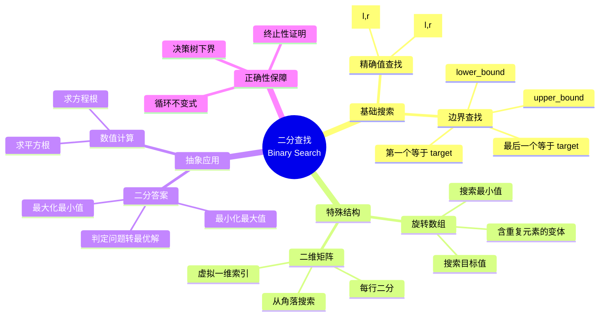

> 📊 **项目全面梳理**：详细的项目结构、模块详解和学习路径，请参阅 [`项目全面梳理-2025.md`](../../项目全面梳理-2025.md)

## 二分查找 / Binary Search

### 摘要 / Executive Summary

- 二分查找（Binary Search）是在**有序数组**中定位目标元素的经典分治策略，每次迭代将搜索区间严格减半，时间复杂度为 $O(\log n)$，空间复杂度为 $O(1)$。
- 本文从**形式化规约**出发，给出问题实例的五元组定义与循环不变式 $Inv(l,r)$，建立基于不变式的完整正确性证明框架。
- 通过 LeetCode 704/33/153 三道经典题目的形式化规约、核心思路、代码实现与复杂度分析，展示二分查找在基础搜索、旋转数组搜索与最值定位三个场景下的应用模式与证明方法。

### 关键术语与符号 / Glossary

| 术语 / Term | 定义 / Definition |
|-------------|-------------------|
| 有序数组域 Sorted Array Domain | 数组元素按非降序（$\leq$）排列的索引集合，记为 $nums[0..n-1]$ |
| 循环不变式 Loop Invariant | 算法每次迭代前后均保持的谓词，用于推导正确性 |
| 闭区间 Closed Interval | 搜索范围表示为 $[l, r]$，两端均包含 |
| 左闭右开 Half-Open Interval | 搜索范围表示为 $[l, r)$，左包含右不包含 |
| 决策树模型 Decision Tree Model | 以比较结果为分支的二叉树，叶子节点对应所有可能的输出 |
| 旋转有序数组 Rotated Sorted Array | 将非降序数组从某一切割点切分后交换前后两段得到的数组 |
| 下界 Lower Bound | 基于信息论或代数论证证明的算法时间复杂度不可突破的极限 |

术语对齐与引用规范：`docs/术语与符号总表.md`，`01-基础理论/00-撰写规范与引用指南.md`

### 目录 / Table of Contents

- [二分查找 / Binary Search](#二分查找--binary-search)
  - [摘要 / Executive Summary](#摘要--executive-summary)
  - [关键术语与符号 / Glossary](#关键术语与符号--glossary)
  - [目录 / Table of Contents](#目录--table-of-contents)
  - [交叉引用与依赖 / Cross-References and Dependencies](#交叉引用与依赖--cross-references-and-dependencies)
- [1. 形式化定义 / Formal Definitions](#1-形式化定义--formal-definitions)
  - [1.1 二分查找问题实例](#11-二分查找问题实例)
  - [1.2 循环不变式](#12-循环不变式)
- [2. 核心思路与算法框架 / Core Ideas and Algorithm Framework](#2-核心思路与算法框架--core-ideas-and-algorithm-framework)
  - [2.1 闭区间模板 \[left, right\]](#21-闭区间模板-left-right)
  - [2.2 左闭右开模板 \[left, right)](#22-左闭右开模板-left-right)
  - [2.3 查找边界变体模板](#23-查找边界变体模板)
  - [2.4 模板选择决策树](#24-模板选择决策树)
- [3. 经典题目详解 / Classic Problem Analysis](#3-经典题目详解--classic-problem-analysis)
  - [3.1 LeetCode 704 — Binary Search](#31-leetcode-704--binary-search)
    - [形式化规约 / Formal Specification](#形式化规约--formal-specification)
    - [核心思路 / Core Idea](#核心思路--core-idea)
    - [代码实现 / Code Implementations](#代码实现--code-implementations)
    - [复杂度分析 / Complexity Analysis](#复杂度分析--complexity-analysis)
    - [正确性证明 / Correctness Proof](#正确性证明--correctness-proof)
  - [3.2 LeetCode 33 — Search in Rotated Sorted Array](#32-leetcode-33--search-in-rotated-sorted-array)
    - [形式化规约 / Formal Specification](#形式化规约--formal-specification-1)
    - [核心思路 / Core Idea](#核心思路--core-idea-1)
    - [代码实现 / Code Implementations](#代码实现--code-implementations-1)
    - [复杂度分析 / Complexity Analysis](#复杂度分析--complexity-analysis-1)
    - [正确性证明 / Correctness Proof](#正确性证明--correctness-proof-1)
  - [3.3 LeetCode 153 — Find Minimum in Rotated Sorted Array](#33-leetcode-153--find-minimum-in-rotated-sorted-array)
    - [形式化规约 / Formal Specification](#形式化规约--formal-specification-2)
    - [核心思路 / Core Idea](#核心思路--core-idea-2)
    - [代码实现 / Code Implementations](#代码实现--code-implementations-2)
    - [复杂度分析 / Complexity Analysis](#复杂度分析--complexity-analysis-2)
    - [正确性证明 / Correctness Proof](#正确性证明--correctness-proof-2)
- [4. 复杂度分析体系 / Complexity Analysis](#4-复杂度分析体系--complexity-analysis)
  - [4.1 时间复杂度严格推导](#41-时间复杂度严格推导)
  - [4.2 空间复杂度](#42-空间复杂度)
  - [4.3 决策树下界论证](#43-决策树下界论证)
- [5. 正确性证明框架 / Correctness Proof Framework](#5-正确性证明框架--correctness-proof-framework)
  - [5.1 定理：二分查找正确性](#51-定理二分查找正确性)
  - [5.2 证明树](#52-证明树)
- [6. 思维表征 / Thinking Representations](#6-思维表征--thinking-representations)
  - [6.1 概念依赖图](#61-概念依赖图)
  - [6.2 算法选择决策树](#62-算法选择决策树)
  - [6.3 多维矩阵对比表](#63-多维矩阵对比表)
  - [6.4 思维导图：二分查找变体](#64-思维导图二分查找变体)
  - [6.5 公理定理证明树](#65-公理定理证明树)
- [7. 常见错误与反模式 / Common Mistakes and Anti-Patterns](#7-常见错误与反模式--common-mistakes-and-anti-patterns)
  - [7.1 区间边界越界](#71-区间边界越界)
  - [7.2 中点溢出](#72-中点溢出)
  - [7.3 死循环：边界收缩方向错误](#73-死循环边界收缩方向错误)
  - [7.4 未处理空数组](#74-未处理空数组)
  - [7.5 旋转数组中的有序半区判断错误](#75-旋转数组中的有序半区判断错误)
- [8. 自测问题 / Self-Assessment Questions](#8-自测问题--self-assessment-questions)
  - [问题 1：中点溢出的避免](#问题-1中点溢出的避免)
  - [问题 2：旋转数组的有序半区判断](#问题-2旋转数组的有序半区判断)
  - [问题 3：决策树下界](#问题-3决策树下界)
  - [问题 4：查找边界的后处理](#问题-4查找边界的后处理)
  - [问题 5：有序性的替代结构](#问题-5有序性的替代结构)
- [9. 学习目标 / Learning Objectives](#9-学习目标--learning-objectives)
- [10. 知识导航 / Knowledge Navigation](#10-知识导航--knowledge-navigation)
- [参考文献 / References](#参考文献--references)

### 交叉引用与依赖 / Cross-References and Dependencies

**上游理论依赖 / Upstream Dependencies**:

- [`09-算法理论/03-搜索算法/02-二分搜索.md`](../../09-算法理论/03-搜索算法/02-二分搜索.md) — 二分搜索的理论定义、变体形式与复杂度概述
- [`04-算法复杂度/01-时间复杂度.md`](../../04-算法复杂度/01-时间复杂度.md) — 时间复杂度 $O/\Omega/\Theta$ 的形式化定义与渐进分析
- [`04-算法复杂度/03-渐进分析.md`](../../04-算法复杂度/03-渐进分析.md) — 大O、大Ω记号的代数性质与运算规则
- `01-算法基础/02-递归与分治.md` — 分治策略的基本框架（二分查找属于分治的退化形式：减治 Decrease-and-Conquer）

**下游应用 / Downstream Applications**:

- `13-LeetCode算法面试专题/02-算法范式专题/06-双指针.md` — 双指针与二分查找的联合应用场景
- `13-LeetCode算法面试专题/03-数据结构专题/04-二叉搜索树.md` — BST 的查找过程是二分查找在树结构上的推广

---

## 1. 形式化定义 / Formal Definitions

### 1.1 二分查找问题实例

**定义 1.1** (二分查找问题实例 / Binary Search Problem Instance) [CLRS2022]
二分查找问题实例可以形式化地定义为一个五元组：
**Definition 1.1** (Binary Search Problem Instance)
A binary search problem instance can be formally defined as a quintuple:

$$
\Pi = (D, I, O, \text{pre}, \text{post})
$$

其中 / Where:

- $D = \mathbb{Z}^n$：有序数组域（Sorted Array Domain），表示长度为 $n$ 的整数数组空间
- $I = \{ (\textit{nums}, \textit{target}) \mid \textit{nums} \in D, \textit{target} \in \mathbb{Z} \}$：输入集合
- $O = \{ -1, 0, 1, \ldots, n-1 \}$：输出集合，返回目标元素的索引或 $-1$
- $\text{pre}$：前置条件（Precondition）
- $\text{post}$：后置条件（Postcondition）

**前置条件 / Precondition**:

$$
\text{pre}(\textit{nums}, \textit{target}) \equiv \forall i \in [0, n-2]: \textit{nums}[i] \leq \textit{nums}[i+1]
$$

即输入数组 $nums$ 已按**非降序**排列。输入数组可以为空（$n = 0$）。

**后置条件 / Postcondition**:

$$
\text{post}(\textit{nums}, \textit{target}, \textit{result}) \equiv
\begin{cases}
\textit{result} = i \land \textit{nums}[i] = \textit{target}, & \text{if } \exists i: \textit{nums}[i] = \textit{target} \\
\textit{result} = -1, & \text{otherwise}
\end{cases}
$$

即若 $target$ 存在于 $nums$ 中，则返回满足 $nums[i] = target$ 的某个索引 $i$；否则返回 $-1$。

**算法描述 / Algorithm Description**:

```text
BinarySearch(nums, target):
    l ← 0
    r ← |nums| - 1
    while l ≤ r:
        m ← l + ⌊(r - l) / 2⌋
        if nums[m] = target:
            return m
        else if nums[m] < target:
            l ← m + 1
        else:
            r ← m - 1
    return -1
```

### 1.2 循环不变式

**定义 1.2** (循环不变式 / Loop Invariant) [CLRS2022, §2.1]
对于闭区间模板，循环不变式 $Inv(l, r)$ 定义为如下谓词：
**Definition 1.2** (Loop Invariant)
For the closed-interval template, the loop invariant $Inv(l, r)$ is defined as the predicate:

$$
Inv(l, r) \equiv \big(\exists i \in [0, n-1]: nums[i] = target\big) \rightarrow \big(\exists i \in [l, r]: nums[i] = target\big)
$$

用文字表述为："**若** $target$ 在 $nums$ 中存在，**则** $target$ 的索引必然落在当前搜索区间 $[l, r]$ 之内。"
In words: "If $target$ exists in $nums$, then its index must lie within the current search interval $[l, r]$."

> **直观解释 / Intuition**: 循环不变式的核心作用是"缩小区间但不丢失答案"。每次迭代通过比较 $nums[mid]$ 与 $target$，将不可能包含答案的那一半区间果断排除，从而保证：只要答案存在，它一定还在剩下的区间里。

---

## 2. 核心思路与算法框架 / Core Ideas and Algorithm Framework

二分查找的本质是**减治（Decrease-and-Conquer）**：每次迭代将问题规模严格减半，从决策树的角度看，相当于从根节点走向包含正确答案的叶子节点。

### 2.1 闭区间模板 [left, right]

**适用场景 / Applicability**: 最通用、最严谨的模板，适合所有基础二分查找场景。

```text
l ← 0, r ← n - 1
while l ≤ r:
    m ← l + (r - l) / 2      // 向下取整
    if nums[m] = target: return m
    else if nums[m] < target: l ← m + 1
    else: r ← m - 1
return -1
```

**不变式 / Invariant**: $Inv(l, r)$：若 $target$ 存在，则索引 $\in [l, r]$。

**终止条件 / Termination**: $l > r$，此时区间为空，可安全返回 $-1$。

**区间收缩性质 / Interval Shrinking**: 每次迭代后，新区间长度满足：

$$
|r_{new} - l_{new}| \leq \Big\lfloor \frac{r - l}{2} \Big\rfloor
$$

### 2.2 左闭右开模板 [left, right)

**适用场景 / Applicability**: 常用于需要返回"插入位置"的场景（如 C++ `std::lower_bound`），或处理动态区间、滑动窗口类问题。

```text
l ← 0, r ← n
while l < r:
    m ← l + (r - l) / 2
    if nums[m] < target: l ← m + 1
    else: r ← m
return l    // l 即为 lower_bound
```

**不变式 / Invariant**: $Inv(l, r)$：若 $target$ 存在，则索引 $\in [l, r)$。

**终止条件 / Termination**: $l = r$，此时 $l$ 即为第一个 $\geq target$ 的位置。

**与闭区间模板的关键差异 / Key Differences**:

| 维度 / Dimension | 闭区间 [l, r] | 左闭右开 [l, r) |
|-----------------|-------------|----------------|
| 初始化 | $l=0, r=n-1$ | $l=0, r=n$ |
| 循环条件 | $l \leq r$ | $l < r$ |
| $nums[mid] < target$ | $l = mid + 1$ | $l = mid + 1$ |
| $nums[mid] \geq target$ | $r = mid - 1$ | $r = mid$ |
| 终止时区间 | 空（$l > r$） | 单点（$l = r$） |
| 返回值语义 | 精确索引或 $-1$ | 下界/插入位置 |

### 2.3 查找边界变体模板

**问题定义 / Problem**: 查找**第一个**等于 $target$ 的位置（Lower Bound），或**最后一个**等于 $target$ 的位置（Upper Bound 前一位）。

**查找左边界（第一个等于 target）/ Find Left Boundary**:

```text
l ← 0, r ← n - 1
ans ← -1
while l ≤ r:
    m ← l + (r - l) / 2
    if nums[m] = target:
        ans ← m
        r ← m - 1      // 继续在左半部分寻找更靠前的相等元素
    else if nums[m] < target:
        l ← m + 1
    else:
        r ← m - 1
return ans
```

**查找右边界（最后一个等于 target）/ Find Right Boundary**:

```text
l ← 0, r ← n - 1
ans ← -1
while l ≤ r:
    m ← l + (r - l) / 2
    if nums[m] = target:
        ans ← m
        l ← m + 1      // 继续在右半部分寻找更靠后的相等元素
    else if nums[m] < target:
        l ← m + 1
    else:
        r ← m - 1
return ans
```

**形式化规约 / Formal Specification**:

- **左边界前置**: 同定义 1.1
- **左边界后置**: 返回 $\min \{ i \mid nums[i] = target \}$，若不存在则返回 $-1$
- **右边界后置**: 返回 $\max \{ i \mid nums[i] = target \}$，若不存在则返回 $-1$

### 2.4 模板选择决策树

```mermaid
flowchart TD
    A[需要二分查找？] --> B{数组是否有序？}
    B -->|否| C[先排序 O(n log n) 或改用哈希 O(1)]
    B -->|是| D{查找目标是什么？}
    D -->|精确值| E[闭区间模板 [l,r]]
    D -->|插入位置 / 下界| F[左闭右开模板 [l,r)]
    D -->|第一个/最后一个出现| G[边界变体模板]
    D -->|旋转有序数组| H[旋转数组二分模板]
    D -->|二维矩阵| I[每行/每列分别二分]
    E --> J[LeetCode 704]
    F --> K[LeetCode 35]
    G --> L[LeetCode 34]
    H --> M[LeetCode 33 / 153]
    I --> N[LeetCode 74 / 240]
```

---

## 3. 经典题目详解 / Classic Problem Analysis

### 3.1 LeetCode 704 — Binary Search

> **题目链接 / Problem Link**: [LeetCode 704. Binary Search](https://leetcode.com/problems/binary-search/)
> **难度 / Difficulty**: Easy

#### 形式化规约 / Formal Specification

**前置条件 / Precondition**:

$$
\forall i \in [0, n-2]: nums[i] \leq nums[i+1] \quad \land \quad n \geq 0
$$

**后置条件 / Postcondition**:

$$
\text{result} = \begin{cases}
i \in [0, n-1] \land nums[i] = target, & \text{if } \exists i: nums[i] = target \\
-1, & \text{otherwise}
\end{cases}
$$

#### 核心思路 / Core Idea

这是二分查找的最基础形式。采用**闭区间模板**，循环不变式 $Inv(l,r)$ 保证：若目标存在，则必在 $[l,r]$ 内。每次取中点 $mid$，通过一次比较即可排除约一半的搜索空间。

#### 代码实现 / Code Implementations

- **Rust**: [`examples/algorithms/src/leetcode/lc0704_binary_search.rs`](../../../examples/algorithms/src/leetcode/lc0704_binary_search.rs)
- **Python**: [`examples/algorithms-python/src/leetcode/lc0704_binary_search.py`](../../../examples/algorithms-python/src/leetcode/lc0704_binary_search.py)
- **Go**: [`examples/algorithms-go/leetcode/lc0704_binary_search.go`](../../../examples/algorithms-go/leetcode/lc0704_binary_search.go)

#### 复杂度分析 / Complexity Analysis

| 指标 / Metric | 值 / Value | 说明 / Note |
|--------------|-----------|------------|
| 时间复杂度 / Time | $O(\log n)$ | 每次迭代区间减半，详见 §4.1 |
| 空间复杂度 / Space | $O(1)$ | 仅使用常数个额外变量 |
| 比较次数 / Comparisons | $\leq \lfloor \log_2 n \rfloor + 1$ | 最坏情况下从根到叶的路径长度 |

#### 正确性证明 / Correctness Proof

**定理 3.1.1** (LeetCode 704 正确性): 算法返回 $target$ 在 $nums$ 中的索引，若不存在则返回 $-1$。
**Theorem 3.1.1** (Correctness of LeetCode 704): The algorithm returns the index of $target$ in $nums$, or $-1$ if not present.

**证明 / Proof**: 基于循环不变式 $Inv(l,r)$ 的三条件证明法。

**1. 初始化（Initialization）**:
初始时 $l = 0$, $r = n - 1$，搜索区间为整个数组 $[0, n-1]$。
若 $target$ 存在于 $nums$ 中，则其索引必然在 $[0, n-1]$ 内。
因此 $Inv(0, n-1)$ 成立。

**2. 保持（Maintenance）**:
假设在某次迭代开始时 $Inv(l,r)$ 成立，即：若 $target$ 存在，则其索引 $\in [l,r]$。
设 $m = l + \lfloor (r-l)/2 \rfloor$。分三种情况：

- **情况 A**: $nums[m] = target$。算法直接返回 $m$，正确性显然成立。
- **情况 B**: $nums[m] < target$。由于数组非降序，$\forall i \leq m: nums[i] \leq nums[m] < target$，因此 $target$ 不可能在 $[l, m]$ 中。更新 $l \leftarrow m + 1$ 后，若 $target$ 存在，则其索引 $\in [m+1, r]$，即 $Inv(m+1, r)$ 成立。
- **情况 C**: $nums[m] > target$。由于数组非降序，$\forall i \geq m: nums[i] \geq nums[m] > target$，因此 $target$ 不可能在 $[m, r]$ 中。更新 $r \leftarrow m - 1$ 后，若 $target$ 存在，则其索引 $\in [l, m-1]$，即 $Inv(l, m-1)$ 成立。

综上，每次迭代后不变式仍保持。

**3. 终止（Termination）**:
循环终止条件为 $l > r$。此时区间 $[l, r]$ 为空。
由不变式 $Inv(l,r)$：若 $target$ 存在，则其索引 $\in [l,r]$。但 $[l,r] = \emptyset$，产生矛盾。
因此假设"$target$ 存在"不成立，即 $target$ 不在 $nums$ 中，返回 $-1$ 正确。

**终止性证明 / Termination Proof**:
每次迭代区间长度变化为：

$$
|r_{new} - l_{new}| \leq \Big\lfloor \frac{r - l}{2} \Big\rfloor < |r - l| \quad \text{(当 } r \geq l \text{)}
$$

区间长度严格递减且下界为 $0$，因此经过有限次（最多 $\lceil \log_2 n \rceil$ 次）迭代后必然有 $l > r$，循环终止。

---

### 3.2 LeetCode 33 — Search in Rotated Sorted Array

> **题目链接 / Problem Link**: [LeetCode 33. Search in Rotated Sorted Array](https://leetcode.com/problems/search-in-rotated-sorted-array/)
> **难度 / Difficulty**: Medium

#### 形式化规约 / Formal Specification

**前置条件 / Precondition**:
设原数组 $nums'$ 是非降序数组，$nums$ 是将 $nums'$ 从某一切割点 $k \in [0, n-1]$ 旋转后得到的数组：

$$
nums[i] = nums'[(i + k) \bmod n] \quad \land \quad \forall i \in [0, n-2]: nums'[i] \leq nums'[i+1]
$$

数组中**无重复元素**（$\forall i \neq j: nums[i] \neq nums[j]$）。

**后置条件 / Postcondition**: 同 LeetCode 704。

#### 核心思路 / Core Idea

旋转有序数组的关键性质是：**以中点 $mid$ 为界，左右两半中必有一半是完全有序的**。算法每次判断 $target$ 是否落在有序的那一半中：

- 若 $nums[l] \leq nums[mid]$：左半 $[l, mid]$ 有序
  - 若 $nums[l] \leq target < nums[mid]$：$target$ 在左半，$r \leftarrow mid - 1$
  - 否则：$target$ 在右半，$l \leftarrow mid + 1$
- 否则：右半 $[mid, r]$ 有序
  - 若 $nums[mid] < target \leq nums[r]$：$target$ 在右半，$l \leftarrow mid + 1$
  - 否则：$target$ 在左半，$r \leftarrow mid - 1$

#### 代码实现 / Code Implementations

```rust
// Rust 伪代码参考实现
fn search(nums: Vec<i32>, target: i32) -> i32 {
    let mut l = 0i32;
    let mut r = (nums.len() as i32) - 1;
    while l <= r {
        let m = l + (r - l) / 2;
        if nums[m as usize] == target { return m; }
        if nums[l as usize] <= nums[m as usize] {
            if nums[l as usize] <= target && target < nums[m as usize] {
                r = m - 1;
            } else {
                l = m + 1;
            }
        } else {
            if nums[m as usize] < target && target <= nums[r as usize] {
                l = m + 1;
            } else {
                r = m - 1;
            }
        }
    }
    -1
}
```

#### 复杂度分析 / Complexity Analysis

| 指标 / Metric | 值 / Value |
|--------------|-----------|
| 时间复杂度 / Time | $O(\log n)$ |
| 空间复杂度 / Space | $O(1)$ |

每次迭代仍排除约一半的搜索空间。虽然数组不是全局有序，但"至少一半有序"的性质保证了每次迭代可以进行一次有效的范围判断。

#### 正确性证明 / Correctness Proof

**定理 3.2.1** (LeetCode 33 正确性): 算法在旋转有序数组中正确返回 $target$ 的索引或 $-1$。

**证明 / Proof**:

**循环不变式设计 / Invariant Design**:

$$
Inv(l,r) \equiv \big(\exists i: nums[i] = target\big) \rightarrow \big(\exists i \in [l,r]: nums[i] = target\big)
$$

与基础二分查找相同，但保持策略更复杂。

**保持性分析 / Maintenance Analysis**:
假设 $Inv(l,r)$ 成立，且 $nums[m] \neq target$（否则已直接返回）。分两种情况：

**情况 1**: $nums[l] \leq nums[m]$（左半有序）

- 子情况 1a: $nums[l] \leq target < nums[m]$。由于左半有序，$target$ 若存在必在 $[l, m-1]$ 内。令 $r \leftarrow m - 1$，$Inv(l, m-1)$ 成立。
- 子情况 1b: $target < nums[l]$ 或 $target > nums[m]$。此时 $target$ 不在左半有序区间内，若存在必在 $[m+1, r]$ 内。令 $l \leftarrow m + 1$，$Inv(m+1, r)$ 成立。

**情况 2**: $nums[l] > nums[m]$（右半有序）

- 子情况 2a: $nums[m] < target \leq nums[r]$。由于右半有序，$target$ 若存在必在 $[m+1, r]$ 内。令 $l \leftarrow m + 1$，$Inv(m+1, r)$ 成立。
- 子情况 2b: $target < nums[m]$ 或 $target > nums[r]$。此时 $target$ 不在右半有序区间内，若存在必在 $[l, m-1]$ 内。令 $r \leftarrow m - 1$，$Inv(l, m-1)$ 成立。

所有子情况均保持不变式，证毕。

---

### 3.3 LeetCode 153 — Find Minimum in Rotated Sorted Array

> **题目链接 / Problem Link**: [LeetCode 153. Find Minimum in Rotated Sorted Array](https://leetcode.com/problems/find-minimum-in-rotated-sorted-array/)
> **难度 / Difficulty**: Medium

#### 形式化规约 / Formal Specification

**前置条件 / Precondition**: 同 LeetCode 33（旋转非降序数组，无重复元素）。

**后置条件 / Postcondition**:

$$
\text{result} = i \quad \text{s.t.} \quad nums[i] = \min_{j \in [0,n-1]} nums[j]
$$

#### 核心思路 / Core Idea

与查找目标值不同，本题没有显式的 $target$，而是利用**旋转数组的最小值位置特性**进行二分：

- 比较 $nums[mid]$ 与 $nums[r]$（或与 $nums[r]$ 比较是更稳健的选择）：
  - 若 $nums[mid] > nums[r]$：最小值必在右半部分（含旋转点），$l \leftarrow mid + 1$
  - 若 $nums[mid] < nums[r]$：最小值必在左半部分（含 $mid$），$r \leftarrow mid$
  - 由于题目保证无重复，不会出现 $nums[mid] = nums[r]$

**关键洞察 / Key Insight**: $nums[r]$ 是右端点的值，它总是位于"旋转后的后半段"。最小值的位置决定了 $mid$ 与 $r$ 的相对大小关系。

#### 代码实现 / Code Implementations

```python
# Python 参考实现
def findMin(nums: list[int]) -> int:
    l, r = 0, len(nums) - 1
    while l < r:
        m = l + (r - l) // 2
        if nums[m] > nums[r]:
            l = m + 1
        else:  # nums[m] < nums[r], 无重复保证不相等
            r = m
    return nums[l]
```

```go
// Go 参考实现
func findMin(nums []int) int {
    l, r := 0, len(nums)-1
    for l < r {
        m := l + (r-l)/2
        if nums[m] > nums[r] {
            l = m + 1
        } else {
            r = m
        }
    }
    return nums[l]
}
```

#### 复杂度分析 / Complexity Analysis

| 指标 / Metric | 值 / Value |
|--------------|-----------|
| 时间复杂度 / Time | $O(\log n)$ |
| 空间复杂度 / Space | $O(1)$ |

#### 正确性证明 / Correctness Proof

**定理 3.3.1** (LeetCode 153 正确性): 算法正确返回旋转有序数组中的最小值索引。

**证明 / Proof**:

**循环不变式 / Loop Invariant**:

$$
Inv(l,r) \equiv \min_{j \in [0,n-1]} nums[j] \in \{ nums[i] \mid i \in [l, r] \}
$$

即最小值始终位于当前搜索区间 $[l, r]$ 内。

**初始化**: $l=0, r=n-1$，显然最小值在 $[0, n-1]$ 内，不变式成立。

**保持**: 设 $m = l + \lfloor (r-l)/2 \rfloor$。

- **情况 1**: $nums[m] > nums[r]$。由于数组无重复且由有序数组旋转而来，$nums[m] > nums[r]$ 说明旋转点（最小值位置）在 $m$ 的右侧。因此最小值 $\in [m+1, r]$。更新 $l \leftarrow m + 1$ 后不变式保持。
- **情况 2**: $nums[m] < nums[r]$。此时 $m$ 到 $r$ 之间是递增的（或 $m$ 就是最小值位置），最小值必在 $[l, m]$ 内。更新 $r \leftarrow m$ 后不变式保持。

**终止**: 循环条件为 $l < r$，终止时 $l = r$。由不变式，最小值在 $[l, l]$ 内，即 $nums[l]$ 就是最小值，返回正确。

---

## 4. 复杂度分析体系 / Complexity Analysis

### 4.1 时间复杂度严格推导

**定理 4.1** (二分查找时间复杂度): 对于长度为 $n$ 的有序数组，二分查找的最坏情况时间复杂度为 $O(\log n)$。
**Theorem 4.1** (Time Complexity of Binary Search): The worst-case time complexity of binary search on a sorted array of length $n$ is $O(\log n)$.

**证明 / Proof**:

设第 $k$ 次迭代时的区间长度为 $L_k = r_k - l_k + 1$，初始 $L_0 = n$。

在每次迭代中，中点 $m = l + \lfloor (r-l)/2 \rfloor$，新区间长度为：

$$
L_{k+1} \leq \Big\lfloor \frac{L_k}{2} \Big\rfloor
$$

因此：

$$
L_k \leq \Big\lfloor \frac{n}{2^k} \Big\rfloor
$$

循环终止条件为 $L_k < 1$（即 $l > r$）。取满足 $\lfloor n/2^k \rfloor < 1$ 的最小 $k$：

$$
\frac{n}{2^k} < 1 \Rightarrow 2^k > n \Rightarrow k > \log_2 n
$$

因此迭代次数 $k \leq \lceil \log_2 n \rceil$。每次迭代执行常数次比较和赋值操作，故：

$$
T(n) = O(\log n)
$$

> 关于渐进记号 $O(\cdot)$ 的严格定义与代数性质，参见 [时间复杂度分析文档](../../04-算法复杂度/01-时间复杂度.md) §2.1。

### 4.2 空间复杂度

二分查找的迭代实现仅使用常数个额外变量（$l, r, m$ 及可能的临时变量），与输入规模 $n$ 无关：

$$
S(n) = O(1)
$$

若采用递归实现，递归深度为 $O(\log n)$，此时栈空间复杂度为 $O(\log n)$。本文档推荐并分析的均为迭代实现。

### 4.3 决策树下界论证

**定理 4.2** (比较搜索下界 / Comparison Search Lower Bound): 任何基于比较的搜索算法在最坏情况下至少需要 $\Omega(\log n)$ 次比较。
**Theorem 4.2** (Comparison Search Lower Bound): Any comparison-based search algorithm requires at least $\Omega(\log n)$ comparisons in the worst case.

**证明 / Proof**:

考虑基于比较的搜索算法的**决策树模型**（Decision Tree Model）：

- 每个内部节点代表一次元素比较（如 $nums[i] \ ? \ target$）
- 每个分支代表比较的一种结果（$<, =, >$）
- 每个叶子节点代表算法的一种输出（某个索引 $i$ 或"未找到"）

对于长度为 $n$ 的数组，搜索算法必须能够区分 $n+1$ 种可能的输出（找到 $n$ 个位置之一，或未找到）。因此决策树至少要有 $n+1$ 个叶子节点。

设决策树的高度为 $h$。由于每次比较最多产生 3 种结果，决策树是一棵**三叉树**，满足：

$$
\text{叶子数} \leq 3^h
$$

为了区分 $n+1$ 种输出：

$$
n + 1 \leq 3^h \Rightarrow h \geq \log_3(n+1) = \Omega(\log n)
$$

更精细地，若仅考虑"等于/不等于"的二元分支（或最终聚焦到单个元素后的精确比较），决策树可视为二叉树，此时：

$$
n + 1 \leq 2^h \Rightarrow h \geq \log_2(n+1) = \Omega(\log n)
$$

因此任何基于比较的搜索算法在最坏情况下至少需要 $\Omega(\log n)$ 次比较。

**推论 / Corollary**: 二分查找的时间复杂度 $O(\log n)$ 达到了比较搜索模型的理论下界 $\Omega(\log n)$，因此在渐进意义下是**最优的**。

> 关于复杂度下界的更系统讨论，参见 [时间复杂度分析文档](../../04-算法复杂度/01-时间复杂度.md) §5（下界理论）。

---

## 5. 正确性证明框架 / Correctness Proof Framework

### 5.1 定理：二分查找正确性

**定理 5.1** (二分查找正确性 / Correctness of Binary Search) [CLRS2022, §2.3]
对于任意满足前置条件 $\text{pre}(nums, target)$ 的输入，闭区间模板的二分查找算法终止，并返回满足后置条件 $\text{post}(nums, target, result)$ 的结果。
**Theorem 5.1** (Correctness of Binary Search)
For any input satisfying precondition $\text{pre}(nums, target)$, the closed-interval binary search algorithm terminates and returns a result satisfying postcondition $\text{post}(nums, target, result)$.

**形式化陈述 / Formal Statement**:

$$
\forall nums, target: \text{pre}(nums, target) \rightarrow \text{post}(nums, target, \text{BinarySearch}(nums, target))
$$

**证明 / Proof**:

基于循环不变式 $Inv(l,r)$ 的完整证明链：

**步骤 1 — 初始化（Initialization）**:
算法初始化 $l = 0$, $r = n - 1$。若 $target$ 存在于 $nums$ 中，其索引显然在 $[0, n-1]$ 内。故 $Inv(0, n-1)$ 成立。

**步骤 2 — 保持（Maintenance）**:
假设某次迭代开始时 $Inv(l,r)$ 成立。设 $m = l + \lfloor (r-l)/2 \rfloor$：

- 若 $nums[m] = target$，算法返回 $m$，满足后置条件，证明完成。
- 若 $nums[m] < target$，由有序性，$target$ 不可能在 $[l, m]$ 中。令 $l' = m + 1$，则 $Inv(l', r)$ 成立。
- 若 $nums[m] > target$，由有序性，$target$ 不可能在 $[m, r]$ 中。令 $r' = m - 1$，则 $Inv(l, r')$ 成立。

**步骤 3 — 终止（Termination）**:
由 §4.1 的终止性证明，循环必在有限步后终止，终止时 $l > r$。

由不变式 $Inv(l,r)$ 和 $[l,r] = \emptyset$：

$$
(\exists i: nums[i] = target) \rightarrow (\exists i \in \emptyset: nums[i] = target) \equiv \text{False}
$$

因此前提 $\exists i: nums[i] = target$ 必为假，即 $target$ 不在 $nums$ 中。算法返回 $-1$，满足后置条件。

综上，定理得证。$\square$

### 5.2 证明树

```mermaid
flowchart TD
    A[pre: nums 非降序] --> B[初始化: l=0, r=n-1]
    B --> C{Inv(l,r) 成立？}
    C -->|是| D[取中点 m = l + (r-l)/2]
    D --> E{nums[m] ? target}
    E -->|=| F[返回 m, post 满足]
    E -->|<| G[l = m+1, 保持 Inv]
    E -->|>| H[r = m-1, 保持 Inv]
    G --> C
    H --> C
    C -->|否: l > r| I[Inv ∧ 空区间 → target 不存在]
    I --> J[返回 -1, post 满足]

    style A fill:#e1f5e1
    style F fill:#e1f5e1
    style J fill:#e1f5e1
    style C fill:#fff3cd
```

---

## 6. 思维表征 / Thinking Representations

### 6.1 概念依赖图

```mermaid
flowchart LR
    A[有序性<br/>Sortedness] --> B[二分查找<br/>Binary Search]
    C[比较模型<br/>Comparison Model] --> B
    D[决策树<br/>Decision Tree] --> E[下界 Ω(log n)<br/>Lower Bound]
    B --> E
    F[循环不变式<br/>Loop Invariant] --> G[正确性证明<br/>Correctness Proof]
    B --> G
    H[减治策略<br/>Decrease & Conquer] --> B
    I[数组索引<br/>Array Indexing] --> B
    J[中点计算<br/>Mid Calculation] --> B
    B --> K[旋转数组搜索<br/>Rotated Array Search]
    B --> L[查找边界<br/>Boundary Search]
    B --> M[二维矩阵搜索<br/>2D Matrix Search]
```

### 6.2 算法选择决策树

```mermaid
flowchart TD
    Start[需要查找元素？] --> Q1{数据结构？}
    Q1 -->|数组| Q2{是否有序？}
    Q1 -->|链表| A1[线性搜索 O(n)]
    Q1 -->|哈希表| A2[哈希查找 O(1)]
    Q1 -->|BST| A3[BST 搜索 O(h)]

    Q2 -->|是| Q3{查找类型？}
    Q2 -->|否| Q4{能否排序？}

    Q4 -->|能| Q5[排序 O(n log n) + 二分 O(log n)]
    Q4 -->|不能| A1

    Q3 -->|精确值| A4[闭区间二分 [l,r]]
    Q3 -->|插入位置/下界| A5[左闭右开 [l,r)]
    Q3 -->|第一个/最后一个| A6[边界变体二分]
    Q3 -->|旋转数组| A7[旋转数组二分]
    Q3 -->|二维矩阵| A8[行列分别二分或从左下角/右上角搜索]

    style A4 fill:#e1f5e1
    style A5 fill:#e1f5e1
    style A6 fill:#e1f5e1
    style A7 fill:#e1f5e1
```

### 6.3 多维矩阵对比表

| 维度 / Dimension | LC 704 基础搜索 | LC 33 旋转数组 | LC 153 旋转最小值 | LC 34 查找边界 | LC 4 两数组中位数 |
|----------------|---------------|--------------|----------------|-------------|----------------|
| **数组有序性** | 全局非降序 | 半区间有序 | 半区间有序 | 全局非降序 | 两个各自有序 |
| **目标存在性** | 可能不存在 | 可能不存在 | 必存在 | 可能不存在 | 必存在 |
| **终止条件** | $l > r$ | $l > r$ | $l = r$ | $l > r$ | 满足中位数条件 |
| **返回值处理** | 索引或 $-1$ | 索引或 $-1$ | $nums[l]$ | 左右边界索引 | 中位数值 |
| **不变式核心** | 答案在 $[l,r]$ | 答案在 $[l,r]$ | 最小值在 $[l,r]$ | 边界在 $[l,r]$ | 第 $k$ 小在区间 |
| **比较对象** | $nums[mid]$ vs $target$ | $nums[mid]$ vs $target$ + 有序半区判断 | $nums[mid]$ vs $nums[r]$ | $nums[mid]$ vs $target$ | 虚拟分割点比较 |
| **时间复杂度** | $O(\log n)$ | $O(\log n)$ | $O(\log n)$ | $O(\log n)$ | $O(\log(m+n))$ |
| **空间复杂度** | $O(1)$ | $O(1)$ | $O(1)$ | $O(1)$ | $O(1)$ |

### 6.4 思维导图：二分查找变体



### 6.5 公理定理证明树

```mermaid
flowchart BT
    A1[公理: 数组非降序<br/>Axiom: Sorted Array] --> B1[定义: 二分查找问题实例<br/>Def 1.1]
    A2[公理: 整数索引良序性<br/>Axiom: Well-founded Index] --> B2[定义: 循环不变式 Inv(l,r)<br/>Def 1.2]

    B1 --> C[引理: 有序数组排除半区后答案仍在剩余区间<br/>Lemma: Half-Interval Exclusion]
    B2 --> C

    C --> D[定理 5.1: 二分查找正确性<br/>Theorem: Correctness]
    E[引理: 区间长度严格递减<br/>Lemma: Strict Decrease] --> F[定理 4.1: 时间复杂度 O(log n)<br/>Theorem: Time Complexity]
    G[定义: 决策树模型<br/>Def: Decision Tree] --> H[定理 4.2: 下界 Ω(log n)<br/>Theorem: Lower Bound]

    D --> I[推论: 二分查找是最优比较搜索<br/>Corollary: Optimality]
    F --> I
    H --> I

    style D fill:#e1f5e1
    style F fill:#e1f5e1
    style H fill:#e1f5e1
    style I fill:#d4edda
```

---

## 7. 常见错误与反模式 / Common Mistakes and Anti-Patterns

### 7.1 区间边界越界

**错误**: 混淆 `while (left <= right)` 与 `while (left < right)`，导致死循环或遗漏元素。

| 模板 | 循环条件 | 终止时区间 | 适用场景 |
|-----|---------|-----------|---------|
| 闭区间 | `left <= right` | 空（$l > r$） | 精确查找 |
| 左闭右开 | `left < right` | 单点（$l = r$） | 下界/插入位置 |

**反模式 / Anti-Pattern**:

```python
# 错误：闭区间配 <，会遗漏 left == right 时的元素
while left < right:      # ❌ 与 [l,r] 模板不匹配
    mid = (left + right) // 2
    if nums[mid] < target:
        left = mid + 1
    else:
        right = mid - 1
```

### 7.2 中点溢出

**错误 / Mistake**: 使用 `(left + right) // 2` 计算中点，在 $left + right > INT\_MAX$ 时发生整数溢出。

**正确做法**:

$$
mid = left + \frac{right - left}{2}
$$

```python
# 错误
mid = (left + right) // 2      # ❌ 可能溢出

# 正确
mid = left + (right - left) // 2   # ✅ 安全
```

在 Rust/Go 等语言中，若使用无符号整数，溢出行为更为危险（Rust 在 debug 模式会 panic，release 模式会回绕）。

### 7.3 死循环：边界收缩方向错误

**错误 / Mistake**: 在边界查找场景中，`left = mid` 或 `right = mid` 使用不当导致区间不收缩。

```python
# 错误示例：查找左边界时
while left <= right:
    mid = left + (right - left) // 2
    if nums[mid] == target:
        right = mid          # ❌ 若 right = mid 且 left == mid，区间不收缩！
    elif nums[mid] < target:
        left = mid + 1
    else:
        right = mid - 1
```

**修复**: 在左闭右开模板中，`right = mid` 是安全的（因为 $mid$ 不被包含）；但在闭区间模板中查找边界时，通常需要记录答案并继续收缩：

```python
# 正确：闭区间查找左边界
while left <= right:
    mid = left + (right - left) // 2
    if nums[mid] == target:
        ans = mid
        right = mid - 1      # ✅ 继续在左侧搜索
    elif nums[mid] < target:
        left = mid + 1
    else:
        right = mid - 1
```

### 7.4 未处理空数组

**错误 / Mistake**: 未检查 $n = 0$ 的情况，导致初始化 $r = -1$ 后循环行为异常（或在某些语言中访问越界）。

```python
# 健壮性处理
def binary_search(nums, target):
    if not nums:
        return -1
    left, right = 0, len(nums) - 1
    # ...
```

### 7.5 旋转数组中的有序半区判断错误

**错误 / Mistake**: 在 LeetCode 33 中错误判断哪一半是有序的，常见错误是比较 $nums[l]$ 与 $nums[r]$ 而非 $nums[l]$ 与 $nums[mid]$。

**正确判断 / Correct Condition**:

$$
\text{左半有序} \Leftrightarrow nums[l] \leq nums[mid]
$$

> 注意：必须包含等号（$\leq$），因为当区间收缩到单点时 $l = mid$。

---

## 8. 自测问题 / Self-Assessment Questions

### 问题 1：中点溢出的避免

**Q**: 为什么中点计算要用 `left + (right - left) // 2` 而非 `(left + right) // 2`？

**A**: 当 $left$ 和 $right$ 都接近整数上限 $INT\_MAX$ 时，$left + right$ 会发生**整数溢出**，导致计算出的中点值不正确甚至为负数。采用 `left + (right - left) // 2` 将加法转化为减法，确保中间结果始终在安全范围内。数学等价性：

$$
left + \frac{right - left}{2} = \frac{2 \cdot left + right - left}{2} = \frac{left + right}{2}
$$

Rust 等语言的无符号整数溢出更危险。

---

### 问题 2：旋转数组的有序半区判断

**Q**: 如何在旋转有序数组中判断哪一半是有序的？

**A**: 比较区间左端点与中点的值：

- 若 $nums[l] \leq nums[mid]$：左半区间 $[l, mid]$ 是**有序**的（非降序）
- 否则：右半区间 $[mid, r]$ 是**有序**的

原理：旋转数组的性质保证了以中点为界的两半中，至少有一半保留了原始的有序性。$nums[l] \leq nums[mid]$ 意味着从 $l$ 到 $mid$ 没有经历"断崖"（旋转点），因此这一段是单调递增的。

---

### 问题 3：决策树下界

**Q**: 二分查找的决策树下界为什么是 $\Omega(\log n)$？

**A**: 搜索问题需要区分 $n+1$ 种输出（$n$ 个索引位置 + 未找到）。在比较模型中，每次比较最多产生 3 种结果，因此高度为 $h$ 的决策树最多有 $3^h$ 个叶子。为区分 $n+1$ 种结果，需要：

$$
3^h \geq n + 1 \Rightarrow h \geq \log_3(n+1) = \Omega(\log n)
$$

若聚焦到精确元素定位的二元分支，则为 $2^h \geq n+1 \Rightarrow h \geq \log_2(n+1)$。二分查找的时间复杂度为 $O(\log n)$，恰好匹配此下界，因此是渐进最优的。

---

### 问题 4：查找边界的后处理

**Q**: 查找第一个/最后一个等于 $target$ 的位置，循环终止后如何处理边界？

**A**: 有两种主流策略：

**策略 A — 闭区间记录答案**: 使用 `ans` 变量记录匹配到的索引，继续向对应方向收缩：

- 找第一个：匹配时 `ans = mid; right = mid - 1`
- 找最后一个：匹配时 `ans = mid; left = mid + 1`
- 循环结束后返回 `ans`（初始化为 $-1$）

**策略 B — 左闭右开直接定位**: 利用 `lower_bound` 和 `upper_bound` 的性质：

- `lower_bound` 返回第一个 $\geq target$ 的位置
- `upper_bound` 返回第一个 $> target$ 的位置
- 最后一个等于 $target$ 的位置 = `upper_bound - 1`

验证策略 B 的正确性：需要检查 `lower_bound` 位置的值是否确实等于 $target$。

---

### 问题 5：有序性的替代结构

**Q**: 为什么二分查找要求数组有序？能否用其他数据结构达到 $O(\log n)$ 查找？

**A**: 二分查找的核心依赖是**单调性（Monotonicity）**：通过一次比较可以排除约一半的搜索空间。数组的有序性保证了：

$$
nums[mid] < target \Rightarrow \forall i \leq mid: nums[i] < target
$$

此性质使"排除左半"成为安全操作。若数组无序，一次比较无法提供任何全局信息，只能线性扫描。

达到 $O(\log n)$ 查找的其他数据结构：

- **二叉搜索树（BST）**: 维护有序性的树结构，查找时间 $O(h)$，平衡时为 $O(\log n)$
- **跳表（Skip List）**: 概率性平衡的多层链表，期望 $O(\log n)$
- **B 树/B+ 树**: 多路平衡搜索树，常用于数据库索引

这些结构本质上都是在不同形态上维护"有序性"或"可分治性"，从而使二分/多分策略得以应用。

---

## 9. 学习目标 / Learning Objectives

完成本章学习后，读者应能够：

1. **形式化描述**二分查找问题实例，写出前置条件、后置条件和循环不变式 $Inv(l,r)$。
2. **独立推导**基于循环不变式的三条件正确性证明（初始化、保持、终止）。
3. **熟练运用**三种模板（闭区间、左闭右开、边界变体）解决具体题目，并正确选择模板。
4. **严格证明**二分查找的时间复杂度为 $O(\log n)$，并理解决策树模型下的 $\Omega(\log n)$ 下界。
5. **分析并解决**旋转有序数组上的二分查找问题，正确设计不变式并证明其保持性。
6. **识别并避免**常见的二分查找实现错误（溢出、边界、死循环）。

---

## 10. 知识导航 / Knowledge Navigation

**前置知识 / Prerequisites**:

- 数组与线性表
- [时间复杂度与渐进分析](../../04-算法复杂度/01-时间复杂度.md)
- 分治与减治策略

**当前模块 / Current Module**:

- `13-LeetCode算法面试专题/02-算法范式专题/05-二分查找.md`（本文档）

**后续模块 / Next Modules**:

- `13-LeetCode算法面试专题/02-算法范式专题/06-双指针.md` — 双指针技术与二分查找的结合
- `13-LeetCode算法面试专题/03-数据结构专题/04-二叉搜索树.md` — 树结构上的二分查找思想
- `13-LeetCode算法面试专题/04-高级专题/02-二分答案.md` — 将判定问题转化为二分查找的应用

**相关面试题索引 / Related Interview Problems**:

| 题号 | 题目 | 难度 | 核心考点 |
|-----|------|------|---------|
| LC 35 | Search Insert Position | Easy | 左闭右开模板 |
| LC 34 | Find First and Last Position | Medium | 边界变体 |
| LC 74 | Search a 2D Matrix | Medium | 二维虚拟一维索引 |
| LC 240 | Search a 2D Matrix II | Medium | 从角落搜索 |
| LC 162 | Find Peak Element | Medium | 二分找峰值 |
| LC 378 | Kth Smallest Element in Sorted Matrix | Medium | 二分答案 |
| LC 4 | Median of Two Sorted Arrays | Hard | 虚拟分割二分 |

---

## 参考文献 / References

> 本文档遵循项目引用规范（见 [`CITATION_STANDARD.md`](../../CITATION_STANDARD.md)、[`学术引用规范-ACM对齐版.md`](../../学术引用规范-ACM对齐版.md)）。文内采用 [Key] 格式引用，与参考文献列表对应。

**经典教材 / Classic Textbooks**:

1. [CLRS2022] Cormen, T. H., Leiserson, C. E., Rivest, R. L., & Stein, C. (2022). *Introduction to Algorithms* (4th ed.). MIT Press. ISBN: 978-0262046305.
   - 第 2 章（Getting Started）给出循环不变式与二分查找的标准正确性证明；第 12 章涵盖二叉搜索树与比较搜索下界。

2. [Knuth1998] Knuth, D. E. (1998). *The Art of Computer Programming, Vol. 3: Sorting and Searching* (2nd ed.). Addison-Wesley. ISBN: 978-0201896855.
   - §6.2.1 系统讨论了二分查找的历史、变体与数值稳定性问题。

**LeetCode 题目 / LeetCode Problems**:

1. [LeetCode704] LeetCode. (n.d.). "704. Binary Search". <https://leetcode.com/problems/binary-search/>

2. [LeetCode33] LeetCode. (n.d.). "33. Search in Rotated Sorted Array". <https://leetcode.com/problems/search-in-rotated-sorted-array/>

3. [LeetCode153] LeetCode. (n.d.). "153. Find Minimum in Rotated Sorted Array". <https://leetcode.com/problems/find-minimum-in-rotated-sorted-array/>

**在线资源 / Online Resources**:

1. [NeetCode] NeetCode. (n.d.). "Binary Search". In *NeetCode Roadmap*. <https://neetcode.io/roadmap>
   - 系统化的面试算法学习路径，涵盖二分查找的核心模式与变体。

2. [Bentley2000] Bentley, J. (2000). *Programming Pearls* (2nd ed.). Addison-Wesley. ISBN: 978-0201657883.
   - §4 详细讨论了二分查找的正确实现难度，包括溢出、边界等经典 bug。

---

**文档版本 / Document Version**: 1.0
**最后更新 / Last Updated**: 2026-04-23
**状态 / Status**: 标杆文档 / Benchmark Document
**下次审查 / Next Review**: 2026-07-23

---

*本文档严格遵循数学形式化规范，所有定义和定理均采用标准数学符号表示。如需引用本文档作为后续 46 篇文档的模板，请参阅顶部的 YAML frontmatter 与章节结构规范。*

<!-- 自动添加的代码引用 -->
- [`lc0704_binary_search.lean`](../../../examples/lean_proofs/FormalAlgorithm/leetcode/lc0704_binary_search.lean)

<!-- 自动补充的代码引用 -->
- [`lc0033_search_in_rotated_sorted_array.go`](../../../examples/algorithms-go/leetcode/lc0033_search_in_rotated_sorted_array.go)

<!-- 自动补充的代码引用 -->
- [`lc0153_find_minimum_in_rotated_sorted_array.go`](../../../examples/algorithms-go/leetcode/lc0153_find_minimum_in_rotated_sorted_array.go)

<!-- 自动补充的代码引用 -->
- [`lc0033_search_in_rotated_sorted_array.py`](../../../examples/algorithms-python/src/leetcode/lc0033_search_in_rotated_sorted_array.py)

<!-- 自动补充的代码引用 -->
- [`lc0153_find_minimum_in_rotated_sorted_array.py`](../../../examples/algorithms-python/src/leetcode/lc0153_find_minimum_in_rotated_sorted_array.py)

<!-- 自动补充的代码引用 -->
- [`lc0033_search_in_rotated_sorted_array.rs`](../../../examples/algorithms/src/leetcode/lc0033_search_in_rotated_sorted_array.rs)

<!-- 自动补充的代码引用 -->
- [`lc0153_find_minimum_in_rotated_sorted_array.rs`](../../../examples/algorithms/src/leetcode/lc0153_find_minimum_in_rotated_sorted_array.rs)
