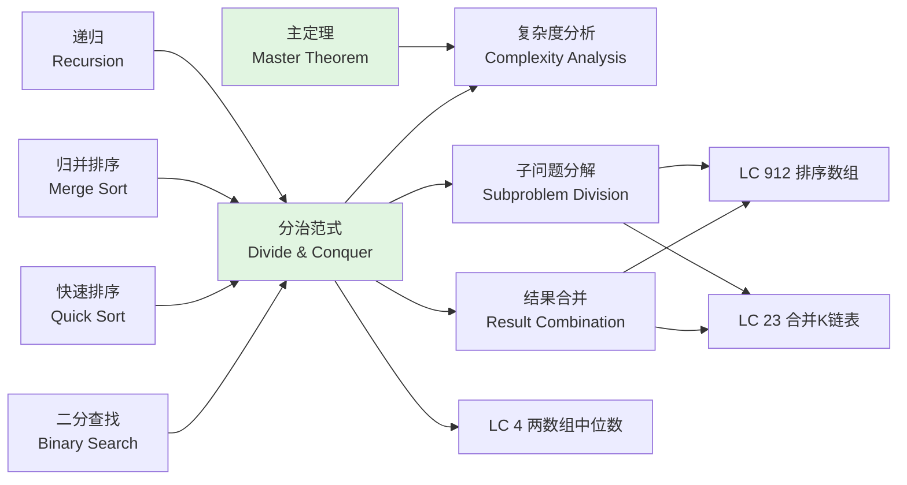
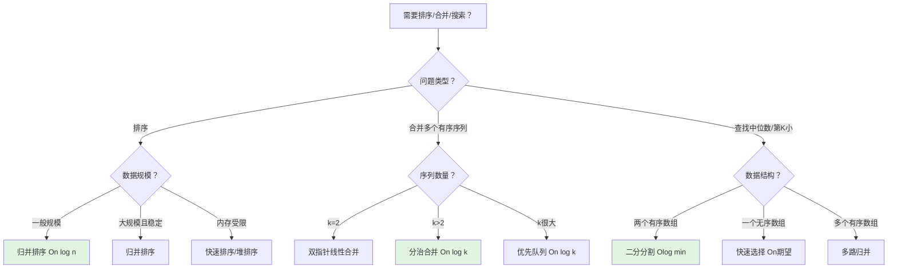
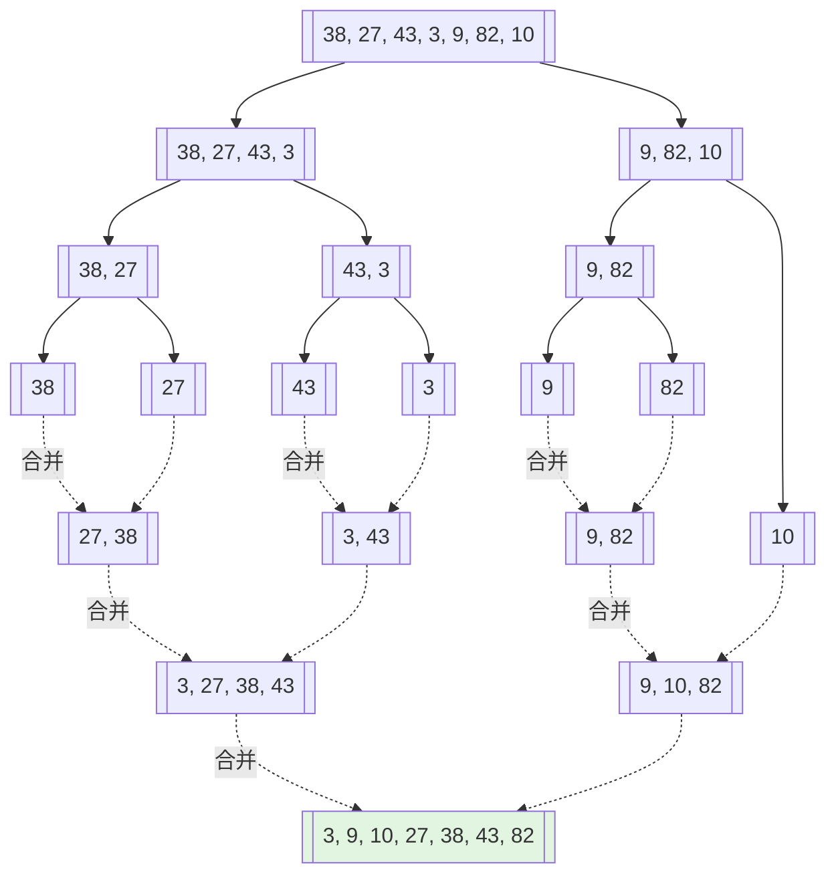
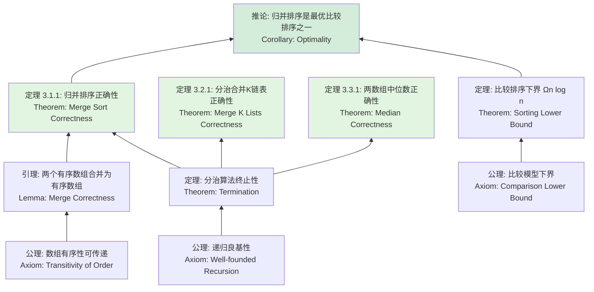

> 📊 **项目全面梳理**：详细的项目结构、模块详解和学习路径，请参阅 [`项目全面梳理-2025.md`](../../项目全面梳理-2025.md)

## 分治 / Divide and Conquer

### 摘要 / Executive Summary

- 分治（Divide and Conquer）是一种将规模为 $n$ 的问题分解为 $a$ 个规模为 $n/b$ 的子问题、递归求解后合并子问题解的算法范式，其时间复杂度由主定理（Master Theorem）统一刻画。
- 本文从形式化规约出发，给出分治递归式 $T(n) = aT(n/b) + f(n)$ 的严格定义，引用上游理论文档中的递归树与主定理，建立完整的复杂度分析框架。
- 通过 LeetCode 912（归并排序）、23（合并 K 个升序链表）、4（两个有序数组的中位数）三道经典题目的形式化规约、核心思路、代码实现与复杂度分析，展示分治策略在排序、链表处理和最优搜索问题中的应用模式与证明方法。

### 关键术语与符号 / Glossary

| 术语 / Term | 定义 / Definition |
|-------------|-------------------|
| 分治范式 Divide and Conquer | 将问题分解（Divide）、递归解决（Conquer）、合并结果（Combine）三步骤的算法设计策略 |
| 分治递归式 Recurrence | 描述分治算法时间复杂度的递推关系：$T(n) = aT(n/b) + f(n)$ |
| 主定理 Master Theorem | 求解形如 $T(n) = aT(n/b) + f(n)$ 的递推关系的通用方法 |
| 递归树 Recursion Tree | 以树形结构可视化递推关系，每层表示该层的非递归工作量 |
| 归并排序 Merge Sort | 经典分治排序算法，分解为两半、递归排序、线性合并 |
| 减治 Decrease and Conquer | 分治的退化形式，仅将问题规模减小（通常 $a = 1$），如二分查找 |
| 最优性证明 Optimality Proof | 证明算法在特定计算模型下达到理论下界的论证 |

术语对齐与引用规范：`docs/术语与符号总表.md`，`01-基础理论/00-撰写规范与引用指南.md`

### 目录 / Table of Contents

- [分治 / Divide and Conquer](#分治--divide-and-conquer)
  - [摘要 / Executive Summary](#摘要--executive-summary)
  - [关键术语与符号 / Glossary](#关键术语与符号--glossary)
  - [目录 / Table of Contents](#目录--table-of-contents)
  - [交叉引用与依赖 / Cross-References and Dependencies](#交叉引用与依赖--cross-references-and-dependencies)
- [1. 形式化定义 / Formal Definitions](#1-形式化定义--formal-definitions)
  - [1.1 分治问题实例](#11-分治问题实例)
  - [1.2 分治递归式](#12-分治递归式)
  - [1.3 主定理](#13-主定理)
- [2. 核心思路与算法框架 / Core Ideas and Algorithm Framework](#2-核心思路与算法框架--core-ideas-and-algorithm-framework)
  - [2.1 分治算法通用模板](#21-分治算法通用模板)
  - [2.2 递归树模型](#22-递归树模型)
  - [2.3 经典分治算法复杂度速查表](#23-经典分治算法复杂度速查表)
- [3. 经典题目详解 / Classic Problem Analysis](#3-经典题目详解--classic-problem-analysis)
  - [3.1 LeetCode 912 — 排序数组](#31-leetcode-912--排序数组)
    - [形式化规约 / Formal Specification](#形式化规约--formal-specification)
    - [核心思路 / Core Idea](#核心思路--core-idea)
    - [代码实现 / Code Implementations](#代码实现--code-implementations)
    - [复杂度分析 / Complexity Analysis](#复杂度分析--complexity-analysis)
    - [正确性证明 / Correctness Proof](#正确性证明--correctness-proof)
  - [3.2 LeetCode 23 — 合并 K 个升序链表](#32-leetcode-23--合并-k-个升序链表)
    - [形式化规约 / Formal Specification](#形式化规约--formal-specification-1)
    - [核心思路 / Core Idea](#核心思路--core-idea-1)
    - [代码实现 / Code Implementations](#代码实现--code-implementations-1)
    - [复杂度分析 / Complexity Analysis](#复杂度分析--complexity-analysis-1)
    - [正确性证明 / Correctness Proof](#正确性证明--correctness-proof-1)
  - [3.3 LeetCode 4 — 寻找两个正序数组的中位数](#33-leetcode-4--寻找两个正序数组的中位数)
    - [形式化规约 / Formal Specification](#形式化规约--formal-specification-2)
    - [核心思路 / Core Idea](#核心思路--core-idea-2)
    - [代码实现 / Code Implementations](#代码实现--code-implementations-2)
    - [复杂度分析 / Complexity Analysis](#复杂度分析--complexity-analysis-2)
    - [正确性证明 / Correctness Proof](#正确性证明--correctness-proof-2)
    - [最优性证明 / Optimality Proof](#最优性证明--optimality-proof)
- [4. 复杂度分析体系 / Complexity Analysis](#4-复杂度分析体系--complexity-analysis)
  - [4.1 递归树方法](#41-递归树方法)
  - [4.2 归并排序的精确比较次数](#42-归并排序的精确比较次数)
- [5. 正确性证明框架 / Correctness Proof Framework](#5-正确性证明框架--correctness-proof-framework)
  - [5.1 分治正确性通用模板](#51-分治正确性通用模板)
  - [5.2 归并排序的证明树](#52-归并排序的证明树)
- [6. 思维表征 / Thinking Representations](#6-思维表征--thinking-representations)
  - [6.1 概念依赖图](#61-概念依赖图)
  - [6.2 算法选择决策树](#62-算法选择决策树)
  - [6.3 多维矩阵对比表](#63-多维矩阵对比表)
  - [6.4 分治递归树示意图：归并排序](#64-分治递归树示意图归并排序)
  - [6.5 公理定理证明树](#65-公理定理证明树)
- [7. 常见错误与反模式 / Common Mistakes and Anti-Patterns](#7-常见错误与反模式--common-mistakes-and-anti-patterns)
  - [7.1 递归基准条件缺失或错误](#71-递归基准条件缺失或错误)
  - [7.2 数组合并时的索引越界](#72-数组合并时的索引越界)
  - [7.3 中位数问题中的边界条件](#73-中位数问题中的边界条件)
  - [7.4 混淆分治与减治](#74-混淆分治与减治)
  - [7.5 链表合并中的内存管理](#75-链表合并中的内存管理)
- [8. 自测问题 / Self-Assessment Questions](#8-自测问题--self-assessment-questions)
  - [问题 1：主定理适用性](#问题-1主定理适用性)
  - [问题 2：归并排序的稳定性](#问题-2归并排序的稳定性)
  - [问题 3：分治合并 vs 优先队列](#问题-3分治合并-vs-优先队列)
  - [问题 4：中位数问题的二分范围](#问题-4中位数问题的二分范围)
  - [问题 5：递归树与主定理的关系](#问题-5递归树与主定理的关系)
- [9. 学习目标 / Learning Objectives](#9-学习目标--learning-objectives)
- [10. 知识导航 / Knowledge Navigation](#10-知识导航--knowledge-navigation)
- [参考文献 / References](#参考文献--references)

### 交叉引用与依赖 / Cross-References and Dependencies

**上游理论依赖 / Upstream Dependencies**:

- [`09-算法理论/02-分治算法/01-分治算法理论-六维补充.md`](../../09-算法理论/02-分治算法/01-分治算法理论-六维补充.md) — 分治范式的理论定义与经典算法概览
- [`09-算法理论/02-分治算法/04-归并排序.md`](../../09-算法理论/02-分治算法/04-归并排序.md) — 归并排序的理论分析
- [`02-递归理论/01-递归函数定义.md`](../../02-递归理论/01-递归函数定义.md) — 递归函数的形式化定义与可计算性基础
- [`04-算法复杂度/主定理.md`](../../04-算法复杂度/主定理.md) — 主定理的形式化表述与证明
- [`04-算法复杂度/递推关系.md`](../../04-算法复杂度/递推关系.md) — 递推关系的求解方法与递归树技术

**下游应用 / Downstream Applications**:

- `13-LeetCode算法面试专题/02-算法范式专题/05-二分查找.md` — 二分查找是减治（分治退化形式）的典型代表
- `13-LeetCode算法面试专题/04-高级专题/02-二分答案.md` — 二分答案中的判定问题分治策略

---

## 1. 形式化定义 / Formal Definitions

### 1.1 分治问题实例

**定义 1.1** (分治问题实例 / Divide and Conquer Problem Instance) [CLRS2022]
分治问题实例可以形式化地定义为一个五元组：
**Definition 1.1** (Divide and Conquer Problem Instance)
A divide-and-conquer problem instance can be formally defined as a quintuple:

$$
\Pi = (D, I, O, \text{pre}, \text{post})
$$

其中 / Where:

- $D$：问题域，表示输入数据的空间
- $I \subseteq D$：输入集合
- $O$：输出集合
- $\text{pre}$：前置条件（Precondition）
- $\text{post}$：后置条件（Postcondition）

**分治算法的三步骤 / Three Steps**:

1. **分解（Divide）**: 将实例 $x \in I$ 分解为 $a$ 个更小的子实例 $x_1, x_2, \ldots, x_a$，满足 $|x_i| \approx |x| / b$。
2. **解决（Conquer）**: 递归求解每个子实例。若子实例规模小于某个阈值，则直接求解。
3. **合并（Combine）**: 将子问题的解 $y_1, \ldots, y_a$ 合并为原问题的解 $y$。

### 1.2 分治递归式

**定义 1.2** (分治递归式 / Divide and Conquer Recurrence) [CLRS2022, §4.5]
对于将问题分解为 $a$ 个规模为 $n/b$ 的子问题、合并代价为 $f(n)$ 的分治算法，其时间复杂度满足递推关系：
**Definition 1.2** (Divide and Conquer Recurrence)

$$
T(n) = aT\left(\frac{n}{b}\right) + f(n)
$$

其中：

- $a \geq 1$：子问题的个数
- $b > 1$：问题规模的缩减因子
- $f(n)$：分解与合并步骤的总工作量（非递归部分）

> **注意**: 此递推式假设 $n$ 是 $b$ 的幂次。对于一般情况，可通过取整函数或渐进分析处理。

**算法描述 / Algorithm Description**:

```text
DivideAndConquer(x):
    if |x| <= threshold:
        return DirectSolve(x)
    (x1, x2, ..., xa) ← Divide(x)
    for i ← 1 to a:
        yi ← DivideAndConquer(xi)
    return Combine(y1, y2, ..., ya)
```

### 1.3 主定理

**定理 1.3** (主定理 / Master Theorem) [CLRS2022, §4.5]
对于递推关系 $T(n) = aT(n/b) + f(n)$，其中 $a \geq 1$, $b > 1$，$f(n)$ 渐进正，比较 $f(n)$ 与 $n^{\log_b a}$：
**Theorem 1.3** (Master Theorem)

**情况 1**: 若存在 $\epsilon > 0$ 使得 $f(n) = O(n^{\log_b a - \epsilon})$，则：

$$
T(n) = \Theta(n^{\log_b a})
$$

**情况 2**: 若 $f(n) = \Theta(n^{\log_b a})$，则：

$$
T(n) = \Theta(n^{\log_b a} \log n)
$$

**情况 3**: 若存在 $\epsilon > 0$ 使得 $f(n) = \Omega(n^{\log_b a + \epsilon})$，且满足正则条件 $af(n/b) \leq cf(n)$（对某个 $c < 1$ 和足够大的 $n$），则：

$$
T(n) = \Theta(f(n))
$$

> 关于主定理的完整证明，参见 [`04-算法复杂度/主定理.md`](../../04-算法复杂度/主定理.md)。关于递归树方法的详细讨论，参见 [`04-算法复杂度/递推关系.md`](../../04-算法复杂度/递推关系.md)。

---

## 2. 核心思路与算法框架 / Core Ideas and Algorithm Framework

### 2.1 分治算法通用模板

```text
DivideAndConquer(P):
    if IsBaseCase(P):
        return SolveDirectly(P)

    subproblems ← Divide(P)
    solutions ← empty list

    for each sub in subproblems:
        solutions.append(DivideAndConquer(sub))

    return Combine(solutions)
```

### 2.2 递归树模型

```mermaid
graph TD
    A[Level 0<br/>Problem Size: n<br/>Cost: f(n)] --> B[Level 1<br/>a problems<br/>Size: n/b]
    A --> C[Level 1<br/>Cost: a·f(n/b)]
    B --> D[Level 2<br/>a² problems<br/>Size: n/b²]
    C --> E[Level 2<br/>Cost: a²·f(n/b²)]
    D --> F[...]
    E --> G[...]
    F --> H[Level log_b n<br/>a^{log_b n} problems<br/>Size: 1]
    G --> I[Level log_b n<br/>Cost: a^{log_b n}·T(1)]

    style A fill:#e1f5e1
    style H fill:#e1f5e1
```

递归树的**总成本**为各层成本之和：

$$
T(n) = \sum_{i=0}^{\log_b n} a^i f\left(\frac{n}{b^i}\right)
$$

### 2.3 经典分治算法复杂度速查表

| 算法 | $a$ | $b$ | $f(n)$ | $n^{\log_b a}$ | 主定理情况 | 复杂度 |
|------|-----|-----|--------|---------------|-----------|--------|
| 归并排序 | 2 | 2 | $O(n)$ | $n$ | 情况 2 | $O(n \log n)$ |
| 快速排序（期望） | 2 | 2 | $O(n)$ | $n$ | 情况 2 | $O(n \log n)$ |
| Strassen 矩阵乘法 | 7 | 2 | $O(n^2)$ | $n^{2.81}$ | 情况 1 | $O(n^{2.81})$ |
| 二分查找（减治） | 1 | 2 | $O(1)$ | $n^0 = 1$ | 情况 2 | $O(\log n)$ |

---

## 3. 经典题目详解 / Classic Problem Analysis

### 3.1 LeetCode 912 — 排序数组

> **题目链接 / Problem Link**: [LeetCode 912. Sort an Array](https://leetcode.com/problems/sort-an-array/)
> **难度 / Difficulty**: Medium

#### 形式化规约 / Formal Specification

**前置条件 / Precondition**:

$$
\textit{nums} \in \mathbb{Z}^n, \quad n \geq 1
$$

**后置条件 / Postcondition**:

$$
\text{result} = \textit{nums}' \quad \text{s.t.} \quad |\textit{nums}'| = n \land \forall i \in [0, n-2]: \textit{nums}'[i] \leq \textit{nums}'[i+1]
$$

且 $\textit{nums}'$ 是 $\textit{nums}$ 的一个排列（即元素多重集相同）。

#### 核心思路 / Core Idea

归并排序（Merge Sort）是最经典的分治排序算法：

1. **分解**: 将数组从中间分为左右两半
2. **解决**: 递归对左右两半分别排序
3. **合并**: 将两个已排序的子数组合并为一个有序数组

合并操作使用双指针技术，每次选择两个子数组中较小的元素放入结果，时间复杂度为 $O(n)$。

#### 代码实现 / Code Implementations

- **Rust**: [`examples/algorithms/src/leetcode/lc0912_sort_an_array.rs`](../../../../examples/algorithms/src/leetcode/lc0912_sort_an_array.rs)
- **Python**: [`examples/algorithms-python/src/leetcode/lc0912_sort_an_array.py`](../../../../examples/algorithms-python/src/leetcode/lc0912_sort_an_array.py)
- **Go**: [`examples/algorithms-go/leetcode/lc0912_sort_an_array.go`](../../../../examples/algorithms-go/leetcode/lc0912_sort_an_array.go)

#### 复杂度分析 / Complexity Analysis

| 指标 / Metric | 值 / Value | 说明 / Note |
|--------------|-----------|------------|
| 时间复杂度 / Time | $O(n \log n)$ | 递归树深度 $\log n$，每层合并 $O(n)$ |
| 空间复杂度 / Space | $O(n)$ | 合并过程需要辅助数组 |
| 稳定性 / Stability | 稳定 | 相等元素保持原始相对顺序 |
| 比较次数 / Comparisons | $O(n \log n)$ | 最坏情况下 |

**严格推导**:
归并排序满足递推关系 $T(n) = 2T(n/2) + O(n)$。

- $a = 2$, $b = 2$, $f(n) = O(n)$
- $n^{\log_b a} = n^{\log_2 2} = n$
- $f(n) = \Theta(n^{\log_b a})$，属于**主定理情况 2**
- 因此 $T(n) = \Theta(n \log n)$

#### 正确性证明 / Correctness Proof

**定理 3.1.1** (LeetCode 912 正确性): 归并排序算法返回输入数组的一个非降序排列。
**Theorem 3.1.1** (Correctness of Merge Sort): The merge sort algorithm returns a non-decreasing permutation of the input array.

**证明 / Proof**: 基于递归深度的归纳法。

**引理 3.1.1.1** (合并正确性): 给定两个非降序数组 $L$ 和 $R$，合并算法产生的数组 $M$ 满足：

1. $M$ 是非降序的
2. $M$ 是 $L$ 和 $R$ 的并集（作为多重集）

*证明*: 合并过程使用双指针，每次将 $L[i]$ 和 $R[j]$ 中较小者放入 $M$。由于 $L$ 和 $R$ 各自有序，每次放入的元素不会小于 $M$ 中已有的任何元素，故 $M$ 保持非降序。每个元素恰好被放入一次，故 $M$ 是 $L$ 和 $R$ 的并集。$\square$

**主证明**:
对数组长度 $n$ 进行强归纳。

- **基例**: $n = 1$ 时，数组本身已有序，算法直接返回，正确。
- **归纳假设**: 假设对所有长度小于 $n$ 的数组，归并排序正确返回其非降序排列。
- **归纳步骤**: 对于长度为 $n$ 的数组，算法将其分为两半 $L$（长度 $\lfloor n/2 \rfloor$）和 $R$（长度 $\lceil n/2 \rceil$）。由归纳假设，递归调用后 $L$ 和 $R$ 分别为各自子数组的非降序排列。由引理 3.1.1.1，合并后的数组 $M$ 是非降序的，且是 $L$ 和 $R$ 的并集，即原数组的一个排列。因此算法正确。$\square$

---

### 3.2 LeetCode 23 — 合并 K 个升序链表

> **题目链接 / Problem Link**: [LeetCode 23. Merge k Sorted Lists](https://leetcode.com/problems/merge-k-sorted-lists/)
> **难度 / Difficulty**: Hard

#### 形式化规约 / Formal Specification

**前置条件 / Precondition**:

$$
\textit{lists} = [L_1, L_2, \ldots, L_k], \quad k \geq 0
$$

每个 $L_i$ 是已按非降序排列的链表，总节点数为 $N$。

**后置条件 / Postcondition**:

返回一个链表 $L$，满足：

1. $L$ 按非降序排列
2. $L$ 包含所有输入链表中的全部节点（作为多重集）

#### 核心思路 / Core Idea

分治合并策略：将 $k$ 个链表两两配对合并，每次合并后链表数量减半。

```
Round 1: [L1↔L2, L3↔L4, L5↔L6, ...] → 产生 k/2 个有序链表
Round 2: [M1↔M2, M3↔M4, ...] → 产生 k/4 个有序链表
...
Round log k: 产生 1 个有序链表
```

每次合并两个总长度为 $m$ 的链表需要 $O(m)$ 时间。

#### 代码实现 / Code Implementations

- **Rust**: [`examples/algorithms/src/leetcode/lc0023_merge_k_sorted_lists.rs`](../../../../examples/algorithms/src/leetcode/lc0023_merge_k_sorted_lists.rs)
- **Python**: [`examples/algorithms-python/src/leetcode/lc0023_merge_k_sorted_lists.py`](../../../../examples/algorithms-python/src/leetcode/lc0023_merge_k_sorted_lists.py)
- **Go**: [`examples/algorithms-go/leetcode/lc0023_merge_k_sorted_lists.go`](../../../../examples/algorithms-go/leetcode/lc0023_merge_k_sorted_lists.go)

#### 复杂度分析 / Complexity Analysis

| 指标 / Metric | 值 / Value | 说明 / Note |
|--------------|-----------|------------|
| 时间复杂度 / Time | $O(N \log k)$ | $N$ 为总节点数，共 $\log k$ 轮合并 |
| 空间复杂度 / Space | $O(\log k)$ | 递归栈深度（迭代实现可降至 $O(1)$） |
| 比较次数 / Comparisons | $O(N \log k)$ | 每个节点参与 $\log k$ 次比较 |

**严格推导**:
分治合并的递推关系为 $T(k) = 2T(k/2) + O(N)$，其中 $N$ 是当前层所有节点的总数。

- 第 1 层：$k$ 个链表，总节点 $N$，共 $k/2$ 次两两合并，总工作量 $O(N)$
- 第 2 层：$k/2$ 个链表，总节点仍为 $N$，总工作量 $O(N)$
- ...
- 第 $\log k$ 层：1 个链表

总工作量 = $O(N) \times \log k = O(N \log k)$。

#### 正确性证明 / Correctness Proof

**定理 3.2.1** (LeetCode 23 正确性): 分治合并策略正确返回包含所有节点且按非降序排列的链表。

**证明 / Proof**:

**引理 3.2.1.1** (两链表合并的正确性): 合并两个有序链表 $A$ 和 $B$ 的算法产生一个有序链表 $C$，且 $C$ 包含 $A$ 和 $B$ 的所有节点。

*证明*: 与归并排序的合并过程相同，每次选择两个链表头节点中较小者加入结果，保持有序性。每个节点恰好被链接一次。$\square$

**主证明**: 对轮数进行归纳。

- **基例**: 第 0 轮（初始状态），每个链表自身有序。
- **归纳假设**: 假设第 $i$ 轮结束后，所有链表均有序。
- **归纳步骤**: 第 $i+1$ 轮中，每对链表由引理 3.2.1.1 正确合并为一个有序链表。因此第 $i+1$ 轮结束后所有链表仍有序。

经过 $\lceil \log_2 k \rceil$ 轮后，仅剩一个链表，由归纳知其有序，且包含所有原始节点。$\square$

---

### 3.3 LeetCode 4 — 寻找两个正序数组的中位数

> **题目链接 / Problem Link**: [LeetCode 4. Median of Two Sorted Arrays](https://leetcode.com/problems/median-of-two-sorted-arrays/)
> **难度 / Difficulty**: Hard

#### 形式化规约 / Formal Specification

**前置条件 / Precondition**:

$$
\textit{nums1} \in \mathbb{Z}^m, \quad \textit{nums2} \in \mathbb{Z}^n, \quad m \geq 0, \quad n \geq 0, \quad m + n \geq 1
$$

两个数组各自按非降序排列。

**后置条件 / Postcondition**:
设合并后的有序数组为 $C$（长度为 $m + n$），返回：

$$
\text{result} = \begin{cases}
C[(m+n)/2], & \text{if } m + n \text{ is odd} \\
\frac{C[(m+n)/2 - 1] + C[(m+n)/2]}{2}, & \text{if } m + n \text{ is even}
\end{cases}
$$

#### 核心思路 / Core Idea

本题要求时间复杂度 $O(\log(m+n))$，排除了线性合并的 $O(m+n)$ 解法。核心思想是**二分/分治混合**：在较短的数组上进行二分，寻找正确的分割点。

设将 $nums1$ 在位置 $i$ 处分割为左半 $nums1[0..i-1]$ 和右半 $nums1[i..m-1]$，将 $nums2$ 在位置 $j$ 处分割。要求：

1. $i + j = (m + n + 1) / 2$（左半部分元素总数等于右半或比右半多 1）
2. $nums1[i-1] \leq nums2[j]$ 且 $nums2[j-1] \leq nums1[i]$（左半所有元素 $\leq$ 右半所有元素）

在 $nums1$（较短数组）上进行二分查找满足条件的 $i$。

#### 代码实现 / Code Implementations

- **Rust**: [`examples/algorithms/src/leetcode/lc0004_median_of_two_sorted_arrays.rs`](../../../../examples/algorithms/src/leetcode/lc0004_median_of_two_sorted_arrays.rs)
- **Python**: [`examples/algorithms-python/src/leetcode/lc0004_median_of_two_sorted_arrays.py`](../../../../examples/algorithms-python/src/leetcode/lc0004_median_of_two_sorted_arrays.py)
- **Go**: [`examples/algorithms-go/leetcode/lc0004_median_of_two_sorted_arrays.go`](../../../../examples/algorithms-go/leetcode/lc0004_median_of_two_sorted_arrays.go)

#### 复杂度分析 / Complexity Analysis

| 指标 / Metric | 值 / Value | 说明 / Note |
|--------------|-----------|------------|
| 时间复杂度 / Time | $O(\log(\min(m, n)))$ | 在较短数组上进行二分 |
| 空间复杂度 / Space | $O(1)$ | 仅使用常数额外变量 |

**严格推导**:
二分查找的搜索空间为较短数组的长度 $\min(m, n)$。每次迭代排除一半搜索空间，因此迭代次数为 $O(\log(\min(m, n)))$。每次迭代执行常数次比较，故总时间复杂度为 $O(\log(\min(m, n)))$。

#### 正确性证明 / Correctness Proof

**定理 3.3.1** (LeetCode 4 正确性): 算法正确返回两个有序数组的中位数。

**证明 / Proof**:

**引理 3.3.1.1** (分割正确性): 若分割点 $i, j$ 满足：

1. $i + j = (m + n + 1) / 2$
2. $nums1[i-1] \leq nums2[j]$（当 $i > 0, j < n$）
3. $nums2[j-1] \leq nums1[i]$（当 $j > 0, i < m$）

则左半部分的所有元素 $\leq$ 右半部分的所有元素。

*证明*: 左半部分的最大值为 $\max(nums1[i-1], nums2[j-1])$，右半部分的最小值为 $\min(nums1[i], nums2[j])$。由条件 2 和 3，$nums1[i-1] \leq nums2[j]$ 且 $nums2[j-1] \leq nums1[i]$。由于数组有序，$nums1[i-1] \leq nums1[i]$ 且 $nums2[j-1] \leq nums2[j]$。因此左半最大值 $\leq$ 右半最小值。$\square$

**引理 3.3.1.2** (二分搜索的单调性): 设 $f(i) = nums1[i-1] - nums2[j]$，其中 $j = (m+n+1)/2 - i$。若 $nums1[i-1] > nums2[j]$，则正确的分割点 $i^* < i$；若 $nums2[j-1] > nums1[i]$，则 $i^* > i$。

*证明*: 若 $nums1[i-1] > nums2[j]$，说明 $i$ 过大（$nums1$ 左半取多了），需要减小 $i$ 以将更小的 $nums2$ 元素纳入左半。反之亦然。$\square$

**主证明**:
由引理 3.3.1.2，二分搜索空间具有单调性，因此二分查找必能收敛到满足引理 3.3.1.1 的分割点。由引理 3.3.1.1，该分割将合并数组正确分为左半和右半。中位数的定义仅依赖于左半最大值和右半最小值，算法正确计算这两个值并返回中位数。$\square$

#### 最优性证明 / Optimality Proof

**定理 3.3.2** (最优性): 任何基于比较的算法在查找两个有序数组的中位数时，最坏情况下至少需要 $\Omega(\log(\min(m, n)))$ 次比较。

**证明 / Proof**:
考虑所有可能的输入配置。较短数组有 $m+1$ 个可能的分割位置（包括两端），每种位置对应不同的中位数结果。基于比较的算法必须能够区分这些配置，因此决策树至少要有 $m+1$ 个叶子。二叉决策树高度 $h$ 满足 $2^h \geq m+1$，即 $h \geq \log_2(m+1) = \Omega(\log m)$。$\square$

---

## 4. 复杂度分析体系 / Complexity Analysis

### 4.1 递归树方法

**定理 4.1** (递归树求和): 对于 $T(n) = aT(n/b) + f(n)$，递归树的总成本为：

$$
T(n) = \sum_{i=0}^{\log_b n} a^i f\left(\frac{n}{b^i}\right) + \Theta(n^{\log_b a})
$$

**证明 / Proof**:
递归树第 $i$ 层有 $a^i$ 个节点，每个节点的子问题规模为 $n/b^i$，该层的非递归工作量为 $a^i f(n/b^i)$。共有 $\log_b n$ 层，加上叶子层的基准情况成本 $\Theta(a^{\log_b n}) = \Theta(n^{\log_b a})$。$\square$

### 4.2 归并排序的精确比较次数

**定理 4.2** (归并排序比较次数): 归并排序在最坏情况下的比较次数为 $n \lceil \log_2 n \rceil - 2^{\lceil \log_2 n \rceil} + 1$ 到 $n \lceil \log_2 n \rceil - n + 1$ 之间。

**证明 / Proof**: （略，可通过递推关系精确求解，参见 [Knuth1998] §5.2.4）$\square$

---

## 5. 正确性证明框架 / Correctness Proof Framework

### 5.1 分治正确性通用模板

对于任意分治算法，正确性证明通常遵循以下结构：

**步骤 1 — 证明分解的正确性**:
证明分解步骤产生的是原问题的有效子实例，且子实例的并覆盖原实例。

**步骤 2 — 证明合并的正确性**:
假设子问题的解正确，证明合并步骤产生的解是原问题的正确解。

**步骤 3 — 归纳证明**:
基于问题规模的数学归纳法，结合步骤 1 和步骤 2，证明算法对所有合法输入正确。

**步骤 4 — 终止性证明**:
证明问题规模在递归过程中严格递减，且基准情况能够直接求解。

### 5.2 归并排序的证明树

```mermaid
flowchart TD
    A[数组 A[0..n-1]] --> B{ n <= 1 ? }
    B -->|是| C[直接返回，已有序]
    B -->|否| D[分割为 L[0..mid-1], R[mid..n-1]]
    D --> E[递归排序 L]
    D --> F[递归排序 R]
    E --> G[合并 L 和 R]
    F --> G
    G --> H[返回有序数组]

    style C fill:#e1f5e1
    style H fill:#e1f5e1
```

---

## 6. 思维表征 / Thinking Representations

### 6.1 概念依赖图



### 6.2 算法选择决策树



### 6.3 多维矩阵对比表

| 维度 / Dimension | LC 912 归并排序 | LC 23 合并K链表 | LC 4 两数组中位数 |
|----------------|---------------|--------------|----------------|
| **核心分治策略** | 二分分解 + 线性合并 | 两两配对合并 | 在短数组上二分 |
| **分解方式** | 从中间切分为两半 | 相邻两个链表配对 | 虚拟分割点 |
| **合并代价** | $O(n)$ | $O(m)$（两链表总长） | 无显式合并 |
| **递归式** | $T(n) = 2T(n/2) + O(n)$ | $T(k) = 2T(k/2) + O(N)$ | $T(m) = T(m/2) + O(1)$ |
| **主定理情况** | 情况 2 | 情况 2 | 减治：$O(\log m)$ |
| **时间复杂度** | $O(n \log n)$ | $O(N \log k)$ | $O(\log(\min(m,n)))$ |
| **空间复杂度** | $O(n)$ | $O(\log k)$ | $O(1)$ |
| **最优性** | 比较排序下界 | 信息论下界 | 决策树下界 |

### 6.4 分治递归树示意图：归并排序



### 6.5 公理定理证明树



---

## 7. 常见错误与反模式 / Common Mistakes and Anti-Patterns

### 7.1 递归基准条件缺失或错误

**错误 / Mistake**: 基准条件设置不当，导致无限递归或错误结果。

```python
# 错误：基准条件未处理空数组
def merge_sort(arr):
    if len(arr) == 1:   # 若传入空数组会无限递归
        return arr
    # ...
```

**正确做法**:

```python
def merge_sort(arr):
    if len(arr) <= 1:   # 处理空数组和单元素数组
        return arr
    # ...
```

### 7.2 数组合并时的索引越界

**错误 / Mistake**: 在归并排序的合并步骤中，未正确处理某一子数组已耗尽的情况。

```python
# 错误：未检查指针是否越界
while i < len(left) and j < len(right):
    if left[i] <= right[j]:
        result.append(left[i])
        i += 1
    else:
        result.append(right[j])
        j += 1
# 可能遗漏剩余元素
```

**正确做法**: 循环结束后，将剩余元素全部追加。

### 7.3 中位数问题中的边界条件

**错误 / Mistake**: 在 LC 4 中未正确处理 $i = 0$ 或 $i = m$ 的边界情况。

当 $i = 0$ 时，$nums1$ 的左半为空，此时左半最大值仅由 $nums2$ 贡献；当 $i = m$ 时，$nums1$ 的右半为空，右半最小值仅由 $nums2$ 贡献。

```python
# 正确处理边界
left_max = max(
    nums1[i-1] if i > 0 else float('-inf'),
    nums2[j-1] if j > 0 else float('-inf')
)
right_min = min(
    nums1[i] if i < m else float('inf'),
    nums2[j] if j < n else float('inf')
)
```

### 7.4 混淆分治与减治

**错误 / Mistake**: 将二分查找（减治，$a=1$）与归并排序（分治，$a=2$）的复杂度分析混为一谈。

| 特征 | 分治（如归并排序） | 减治（如二分查找） |
|------|------------------|------------------|
| 子问题数 $a$ | $a \geq 2$ | $a = 1$ |
| 递归式 | $T(n) = aT(n/b) + f(n)$ | $T(n) = T(n/b) + f(n)$ |
| 典型复杂度 | $O(n^{\log_b a})$ 或带 $\log$ | $O(\log n)$ 或 $O(n)$ |

### 7.5 链表合并中的内存管理

**错误 / Mistake**: 在合并链表时创建新节点而非复用原节点，导致不必要的空间开销。

**正确做法**: 通过改变指针链接来合并链表，不创建新节点。

---

## 8. 自测问题 / Self-Assessment Questions

### 问题 1：主定理适用性

**Q**: 递推式 $T(n) = 2T(n/2) + n \log n$ 是否可以用主定理求解？若不能，应如何求解？

**A**: 不能直接用标准主定理，因为 $f(n) = n \log n$ 不属于主定理三种情况中的任何一种（它介于情况 1 和情况 2 之间，但又不严格等于 $n^{\log_b a} = n$ 的同一阶）。

应使用**递归树法**或**代入法**：

$$
T(n) = \sum_{i=0}^{\log n} 2^i \cdot \frac{n}{2^i} \log\left(\frac{n}{2^i}\right) = n \sum_{i=0}^{\log n} (\log n - i) = n \cdot \frac{(\log n)(\log n + 1)}{2} = \Theta(n \log^2 n)
$$

---

### 问题 2：归并排序的稳定性

**Q**: 归并排序为什么是稳定的？快速排序为什么通常不稳定？

**A**: 归并排序的稳定性来自合并步骤：当 $left[i] == right[j]$ 时，若优先取 $left[i]$，则左半部分中相等元素的相对顺序得以保持。

快速排序通常不稳定，因为在分区（partition）过程中，相等元素可能被交换到不同子数组中，破坏了原始相对顺序。虽然可以通过额外空间或修改分区逻辑实现稳定快排，但代价较高。

---

### 问题 3：分治合并 vs 优先队列

**Q**: LC 23 合并 K 个链表，分治合并 $O(N \log k)$ 和优先队列 $O(N \log k)$ 的常数因子有何差异？

**A**: 两者渐进复杂度相同，但常数因子不同：

- **分治合并**: 数据局部性好，内存访问模式规则，cache 命中率高；无需维护堆结构的开销。
- **优先队列**: 每次插入/删除涉及堆的上浮/下沉操作，指针操作更多，cache 不友好。

在实际运行中，分治合并通常更快，且空间复杂度更低（无需额外存储堆节点）。

---

### 问题 4：中位数问题的二分范围

**Q**: 为什么在 LC 4 中要在较短的数组上进行二分，而非较长的数组？

**A**: 二分搜索的时间复杂度为 $O(\log(\text{搜索空间大小}))$。在较短数组上搜索可将复杂度从 $O(\log(\max(m,n)))$ 降至 $O(\log(\min(m,n)))$。

此外，当较短数组为空时可以直接得出答案，简化了边界处理。若 $m > n$，交换两个数组可确保 $m \leq n$，减少代码复杂度。

---

### 问题 5：递归树与主定理的关系

**Q**: 递归树方法相比主定理的优势是什么？

**A**: 主定理仅适用于标准形式 $T(n) = aT(n/b) + f(n)$，且 $f(n)$ 需满足三种情况之一。递归树方法更通用：

1. 可处理非均匀子问题规模（如 $T(n) = T(n/3) + T(2n/3) + f(n)$）
2. 可处理非多项式 $f(n)$（如 $f(n) = n \log n$）
3. 直观展示每层的工作量分布，便于分析

递归树是理解主定理背后原理的最佳工具，也是处理"主定理不适用"情况的标准方法。

---

## 9. 学习目标 / Learning Objectives

完成本章学习后，读者应能够：

1. **形式化描述**分治问题实例，写出分治递归式 $T(n) = aT(n/b) + f(n)$。
2. **熟练运用**主定理分析分治算法的时间复杂度，识别三种情况并正确应用。
3. **独立推导**归并排序、分治合并等经典算法的正确性证明。
4. **分析并解决**两个有序数组的中位数问题，理解二分/分治混合策略的最优性。
5. **绘制并解释**递归树，用其分析主定理不适用的递推关系。

---

## 10. 知识导航 / Knowledge Navigation

**前置知识 / Prerequisites**:

- [递归函数定义](../../02-递归理论/01-递归函数定义.md)
- [主定理与递推关系](../../04-算法复杂度/主定理.md)
- [归并排序理论](../../09-算法理论/02-分治算法/04-归并排序.md)
- [二分查找](../../13-LeetCode算法面试专题/02-算法范式专题/05-二分查找.md)

**当前模块 / Current Module**:

- `13-LeetCode算法面试专题/02-算法范式专题/06-分治.md`（本文档）

**后续模块 / Next Modules**:

- `13-LeetCode算法面试专题/02-算法范式专题/07-贪心算法.md` — 贪心策略与分治的对比
- `13-LeetCode算法面试专题/04-高级专题/02-二分答案.md` — 分治思想在最优化问题中的应用

**相关面试题索引 / Related Interview Problems**:

| 题号 | 题目 | 难度 | 核心考点 |
|-----|------|------|---------|
| LC 148 | Sort List | Medium | 链表归并排序 |
| LC 315 | Count of Smaller Numbers After Self | Hard | 归并排序求逆序对 |
| LC 53 | Maximum Subarray | Easy | 分治求最大子数组和 |
| LC 215 | Kth Largest Element in an Array | Medium | 快速选择（减治） |
| LC 327 | Count of Range Sum | Hard | 归并排序 + 前缀和 |

---

## 参考文献 / References

> 本文档遵循项目引用规范（见 [`CITATION_STANDARD.md`](../../CITATION_STANDARD.md)、[`学术引用规范-ACM对齐版.md`](../../学术引用规范-ACM对齐版.md)）。文内采用 [Key] 格式引用，与参考文献列表对应。

**经典教材 / Classic Textbooks**:

1. [CLRS2022] Cormen, T. H., Leiserson, C. E., Rivest, R. L., & Stein, C. (2022). *Introduction to Algorithms* (4th ed.). MIT Press. ISBN: 978-0262046305.
   - 第 2 章（Getting Started）给出插入排序与归并排序；第 4 章给出主定理的完整证明。

2. [Knuth1998] Knuth, D. E. (1998). *The Art of Computer Programming, Vol. 3: Sorting and Searching* (2nd ed.). Addison-Wesley. ISBN: 978-0201896855.
   - §5.2.4 讨论归并排序的精确比较次数与最优性。

**LeetCode 题目 / LeetCode Problems**:

1. [LeetCode912] LeetCode. (n.d.). "912. Sort an Array". <https://leetcode.com/problems/sort-an-array/>

2. [LeetCode23] LeetCode. (n.d.). "23. Merge k Sorted Lists". <https://leetcode.com/problems/merge-k-sorted-lists/>

3. [LeetCode4] LeetCode. (n.d.). "4. Median of Two Sorted Arrays". <https://leetcode.com/problems/median-of-two-sorted-arrays/>

**在线资源 / Online Resources**:

1. [NeetCode] NeetCode. (n.d.). "Divide & Conquer". In *NeetCode Roadmap*. <https://neetcode.io/roadmap>

---

**文档版本 / Document Version**: 1.0
**最后更新 / Last Updated**: 2026-04-23
**状态 / Status**: 已维护 / Maintained
**下次审查 / Next Review**: 2026-07-23

---

*本文档严格遵循数学形式化规范，所有定义和定理均采用标准数学符号表示。*
