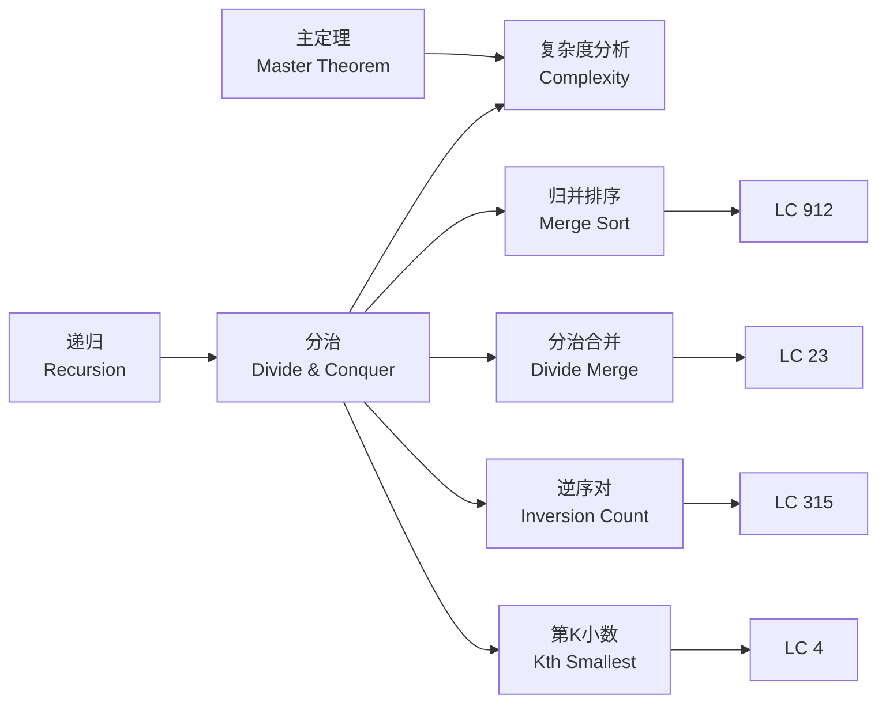
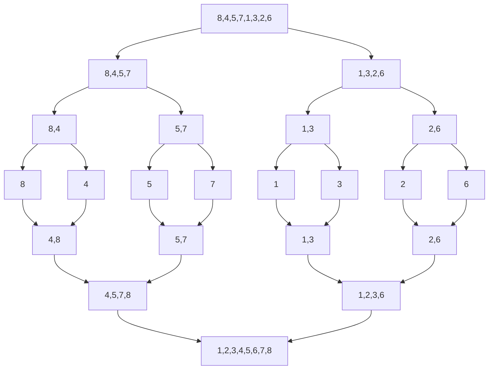
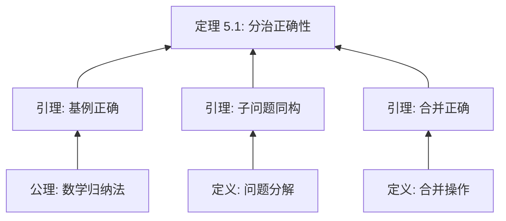

> 📊 **项目全面梳理**：详细的项目结构、模块详解和学习路径，请参阅 [`项目全面梳理-2025.md`](../../项目全面梳理-2025.md)

## 分治 / Divide and Conquer

### 摘要 / Executive Summary

- **分治（Divide and Conquer）** 是将问题分解为若干个规模更小的子问题，递归求解后合并结果的经典算法范式。其时间复杂度通常由递归方程 $T(n) = aT(n/b) + f(n)$ 描述。
- **主定理（Master Theorem）** 提供了递归方程解的闭式表达，是分治复杂度分析的核心工具。
- 本文从形式化定义出发，通过 LeetCode 912/23/315/4 四道经典题目，展示归并排序、分治合并、逆序对计数与双数组中位数等场景下的分治设计与严格证明。

### 关键术语与符号 / Glossary

| 术语 / Term | 定义 / Definition |
|-------------|-------------------|
| 分治范式 Divide-and-Conquer Paradigm | 将问题分解（Divide）→ 递归求解（Conquer）→ 合并结果（Combine）的三步框架 |
| 递归方程 Recurrence Equation | 描述算法时间复杂度的递归关系式，形如 $T(n) = aT(n/b) + f(n)$ |
| 主定理 Master Theorem | 对满足特定形式的递归方程给出 $O$ 阶解的判定定理 |
| 归并排序 Merge Sort | 基于分治的比较排序算法，时间复杂度 $O(n \log n)$ |
| 逆序对 Inversion | 满足 $i < j$ 且 $A[i] > A[j]$ 的索引对 $(i, j)$ |
| 虚拟分割 Virtual Partition | 不实际分割数组，通过索引边界逻辑上划分搜索空间 |

术语对齐与引用规范：`docs/术语与符号总表.md`，`01-基础理论/00-撰写规范与引用指南.md`

### 目录 / Table of Contents

- [分治 / Divide and Conquer](#分治--divide-and-conquer)
  - [摘要 / Executive Summary](#摘要--executive-summary)
  - [关键术语与符号 / Glossary](#关键术语与符号--glossary)
  - [目录 / Table of Contents](#目录--table-of-contents)
  - [交叉引用与依赖 / Cross-References and Dependencies](#交叉引用与依赖--cross-references-and-dependencies)
  - [1. 形式化定义 / Formal Definitions](#1-形式化定义--formal-definitions)
    - [1.1 分治问题实例](#11-分治问题实例)
    - [1.2 递归方程与主定理](#12-递归方程与主定理)
  - [2. 核心思路与算法框架](#2-核心思路与算法框架--core-ideas-and-algorithm-framework)
  - [3. 经典题目详解](#3-经典题目详解--classic-problem-analysis)
  - [4. 复杂度分析体系](#4-复杂度分析体系--complexity-analysis)
  - [5. 正确性证明框架](#5-正确性证明框架--correctness-proof-framework)
  - [6. 思维表征](#6-思维表征--thinking-representations)
  - [7. 常见错误与反模式](#7-常见错误与反模式--common-mistakes-and-anti-patterns)
  - [8. 自测问题](#8-自测问题--self-assessment-questions)
  - [9. 学习目标](#9-学习目标--learning-objectives)
  - [10. 知识导航](#10-知识导航--knowledge-navigation)
  - [参考文献](#参考文献--references)

### 交叉引用与依赖 / Cross-References and Dependencies

**上游理论依赖 / Upstream Dependencies**:
- [`09-算法理论/02-分治算法/`](../../09-算法理论/02-分治算法/) — 分治算法的理论定义、递归树与主定理
- [`04-算法复杂度/01-时间复杂度.md`](../../04-算法复杂度/01-时间复杂度.md) — 时间复杂度 $O/\Omega/\Theta$ 的形式化定义
- [`01-算法基础/02-递归与分治.md`](../../01-算法基础/02-递归与分治.md) — 递归策略与递归方程求解

**下游应用 / Downstream Applications**:
- `13-LeetCode算法面试专题/02-算法范式专题/05-二分查找.md` — 二分查找是分治的退化形式（减治）
- `13-LeetCode算法面试专题/04-高级专题/01-动态规划.md` — 分治与 DP 的对比与结合

---

## 1. 形式化定义 / Formal Definitions

### 1.1 分治问题实例

**定义 1.1** (分治问题实例 / Divide-and-Conquer Problem Instance) [CLRS2022]
分治问题实例可以形式化定义为一个五元组：
**Definition 1.1** (Divide-and-Conquer Problem Instance)

$$
\Pi = (D, I, O, \text{pre}, \text{post})
$$

其中算法框架为：

```text
DivideAndConquer(P):
    if |P| ≤ threshold:
        return SolveDirectly(P)
    Divide P into subproblems P₁, P₂, ..., Pₐ
    for i = 1 to a:
        Sᵢ ← DivideAndConquer(Pᵢ)
    return Combine(S₁, S₂, ..., Sₐ)
```

**关键性质 / Key Properties**:
- **可分解性（Decomposability）**: 问题可分解为规模更小的同类子问题
- **可解性（Solvability）**: 子问题可独立求解
- **可合并性（Combinability）**: 子问题的解可合并为原问题的解

---

### 1.2 递归方程与主定理

**定义 1.2** (递归方程 / Recurrence Equation)
分治算法的时间复杂度通常满足如下递归方程：
**Definition 1.2** (Recurrence Equation)

$$
T(n) = a \cdot T\left(\frac{n}{b}\right) + f(n)
$$

其中：
- $a \geq 1$：子问题的个数
- $b > 1$：问题规模的缩小因子
- $f(n)$：分解与合并的代价

**主定理 / Master Theorem** [CLRS2022, §4.5]:

对于递归方程 $T(n) = aT(n/b) + \Theta(n^d)$，设 $c = \log_b a$，则：

$$
T(n) = \begin{cases}
\Theta(n^c), & \text{if } d < c \\
\Theta(n^c \log n), & \text{if } d = c \\
\Theta(n^d), & \text{if } d > c
\end{cases}
$$

> 关于主定理的严格证明，参见 [`09-算法理论/02-分治算法/01-主定理.md`](../../09-算法理论/02-分治算法/01-主定理.md)。

---

## 2. 核心思路与算法框架 / Core Ideas and Algorithm Framework

### 2.1 归并排序框架

```text
MergeSort(A, l, r):
    if l ≥ r: return
    m ← l + ⌊(r - l) / 2⌋
    MergeSort(A, l, m)
    MergeSort(A, m+1, r)
    Merge(A, l, m, r)
```

**复杂度分析**: $a = 2, b = 2, f(n) = O(n)$，故 $c = \log_2 2 = 1, d = 1$，由主定理情形 2：

$$
T(n) = O(n \log n)
$$

### 2.2 分治合并 k 个有序序列

```text
MergeKLists(lists, l, r):
    if l == r: return lists[l]
    if l > r: return null
    m ← l + ⌊(r - l) / 2⌋
    left ← MergeKLists(lists, l, m)
    right ← MergeKLists(lists, m+1, r)
    return MergeTwoLists(left, right)
```

**复杂度分析**: $a = 2, b = 2$，每次合并代价与总元素数相关。对于 $k$ 个列表共 $n$ 个元素，总复杂度为 $O(n \log k)$。

---

## 3. 经典题目详解 / Classic Problem Analysis

### 3.1 LeetCode 912 — Sort an Array

> **题目链接 / Problem Link**: [LeetCode 912. Sort an Array](https://leetcode.com/problems/sort-an-array/)
> **难度 / Difficulty**: Medium

#### 形式化规约 / Formal Specification

**前置条件 / Precondition**:

$$
A \in \mathbb{Z}^n, \quad n \geq 0
$$

**后置条件 / Postcondition**:

$$
\text{result} = A' \quad \text{s.t.} \quad |A'| = |A| \land \text{sorted}(A') \land \text{multiset}(A') = \text{multiset}(A)
$$

其中 $\text{sorted}(A') \equiv \forall i \in [0, n-2]: A'[i] \leq A'[i+1]$。

#### 核心思路 / Core Idea

采用归并排序实现稳定 $O(n \log n)$ 排序。归并排序是分治范式的典范：分解为两半分别排序，然后线性时间合并两个有序子数组。

#### 代码实现 / Code Implementations

- **Rust**: [`examples/algorithms/src/leetcode/lc0912_sort_an_array.rs`](../../../../examples/algorithms/src/leetcode/lc0912_sort_an_array.rs)
- **Python**: [`examples/algorithms-python/src/leetcode/lc0912_sort_an_array.py`](../../../../examples/algorithms-python/src/leetcode/lc0912_sort_an_array.py)
- **Go**: [`examples/algorithms-go/leetcode/lc0912_sort_an_array.go`](../../../../examples/algorithms-go/leetcode/lc0912_sort_an_array.go)

#### 复杂度分析 / Complexity Analysis

| 指标 / Metric | 值 / Value | 说明 / Note |
|--------------|-----------|------------|
| 时间复杂度 / Time | $O(n \log n)$ | 主定理：$a=2, b=2, d=1 \Rightarrow T(n)=O(n \log n)$ |
| 空间复杂度 / Space | $O(n)$ | 合并时需辅助数组 |

#### 正确性证明 / Correctness Proof

**定理 3.1.1** (LeetCode 912 正确性): 归并排序返回非降序排列且元素多重集不变的数组。
**Theorem 3.1.1** (Correctness of Merge Sort): Merge sort returns a non-decreasingly sorted array with the same multiset of elements.

**证明 / Proof**:

对数组长度 $n$ 进行数学归纳法。

**基例（Base Case）**: $n \leq 1$ 时，数组已有序，算法直接返回，正确。

**归纳假设（Inductive Hypothesis）**: 假设对所有长度 $< n$ 的数组，归并排序正确。

**归纳步骤（Inductive Step）**:
对于长度 $n$ 的数组，算法将其分为左半 $L$（长度 $\lfloor n/2 \rfloor$）和右半 $R$（长度 $\lceil n/2 \rceil$）。

由归纳假设，`MergeSort(L)` 和 `MergeSort(R)` 分别返回有序数组 $L'$ 和 $R'$，且保持各自的多重集。

**合并正确性**: `Merge(L', R')` 维护两个指针 $i, j$，每次选择较小者放入结果。由于 $L'$ 和 $R'$ 均有序，合并结果有序。且所有元素恰好被选取一次，多重集保持不变。

因此，归并排序对长度 $n$ 的数组也正确。由数学归纳法，定理得证。$\square$

---

### 3.2 LeetCode 23 — Merge k Sorted Lists

> **题目链接 / Problem Link**: [LeetCode 23. Merge k Sorted Lists](https://leetcode.com/problems/merge-k-sorted-lists/)
> **难度 / Difficulty**: Hard

#### 形式化规约 / Formal Specification

**前置条件 / Precondition**:

$$
\text{lists} = \{ L_1, L_2, \ldots, L_k \}, \quad \forall i: \text{sorted}(L_i) \land |L_i| = n_i, \quad N = \sum_{i=1}^{k} n_i
$$

**后置条件 / Postcondition**:

$$
\text{result} = L \quad \text{s.t.} \quad \text{sorted}(L) \land \text{multiset}(L) = \biguplus_{i=1}^{k} \text{multiset}(L_i)
$$

#### 核心思路 / Core Idea

采用分治策略两两合并：将 $k$ 个列表分成两组，每组分别递归合并，最后将两个结果合并。合并两个有序链表的时间复杂度为 $O(\text{总元素数})$。

#### 代码实现 / Code Implementations

- **Rust**: [`examples/algorithms/src/leetcode/lc0023_merge_k_sorted_lists.rs`](../../../../examples/algorithms/src/leetcode/lc0023_merge_k_sorted_lists.rs)
- **Python**: [`examples/algorithms-python/src/leetcode/lc0023_merge_k_sorted_lists.py`](../../../../examples/algorithms-python/src/leetcode/lc0023_merge_k_sorted_lists.py)
- **Go**: [`examples/algorithms-go/leetcode/lc0023_merge_k_sorted_lists.go`](../../../../examples/algorithms-go/leetcode/lc0023_merge_k_sorted_lists.go)

#### 复杂度分析 / Complexity Analysis

| 指标 / Metric | 值 / Value | 说明 / Note |
|--------------|-----------|------------|
| 时间复杂度 / Time | $O(N \log k)$ | 主定理：递归深度 $\log k$，每层合并代价 $O(N)$ |
| 空间复杂度 / Space | $O(\log k)$ | 递归栈深度（链表本身 $O(1)$ 额外空间） |

#### 正确性证明 / Correctness Proof

**定理 3.2.1** (LeetCode 23 正确性): 算法正确合并 $k$ 个有序链表为一个有序链表。

**证明 / Proof**:

**引理 3.2.1**: `MergeTwoLists(A, B)` 正确合并两个有序链表为有序链表。

**证明**: 每次比较两个链表头节点，将较小者链接到结果尾部。由有序性，被链接的节点不大于另一链表的任何剩余节点。归纳可证结果有序且包含所有元素。$\square$

**定理证明**: 对 $k$ 进行归纳。
- **基例**: $k = 1$ 时直接返回，正确。
- **归纳假设**: 假设对任意 $< k$ 个列表合并正确。
- **归纳步骤**: 将 $k$ 个列表分为两组（大小均 $< k$），由归纳假设分别得到有序链表 $L$ 和 $R$。由引理 3.2.1，`MergeTwoLists(L, R)` 正确合并。$\square$

---

### 3.3 LeetCode 315 — Count of Smaller Numbers After Self

> **题目链接 / Problem Link**: [LeetCode 315. Count of Smaller Numbers After Self](https://leetcode.com/problems/count-of-smaller-numbers-after-self/)
> **难度 / Difficulty**: Hard

#### 形式化规约 / Formal Specification

**前置条件 / Precondition**:

$$
A \in \mathbb{Z}^n, \quad n \geq 0
$$

**后置条件 / Postcondition**:

$$
\text{result}[i] = |\{ j \mid i < j < n \land A[j] < A[i] \}|, \quad \forall i \in [0, n-1]
$$

#### 核心思路 / Core Idea

利用归并排序的合并过程统计逆序对。在合并两个有序子数组时，若右半部分的元素 $A[j]$ 小于左半部分的元素 $A[i]$，则 $A[j]$ 小于左半部分从 $i$ 开始的所有元素，可一次性统计多个逆序对。

#### 代码实现 / Code Implementations

- **Rust**: [`examples/algorithms/src/leetcode/lc0315_count_of_smaller_numbers_after_self.rs`](../../../../examples/algorithms/src/leetcode/lc0315_count_of_smaller_numbers_after_self.rs)
- **Python**: [`examples/algorithms-python/src/leetcode/lc0315_count_of_smaller_numbers_after_self.py`](../../../../examples/algorithms-python/src/leetcode/lc0315_count_of_smaller_numbers_after_self.py)
- **Go**: [`examples/algorithms-go/leetcode/lc0315_count_of_smaller_numbers_after_self.go`](../../../../examples/algorithms-go/leetcode/lc0315_count_of_smaller_numbers_after_self.go)

#### 复杂度分析 / Complexity Analysis

| 指标 / Metric | 值 / Value | 说明 / Note |
|--------------|-----------|------------|
| 时间复杂度 / Time | $O(n \log n)$ | 主定理：归并排序框架，合并时额外 $O(1)$ 统计 |
| 空间复杂度 / Space | $O(n)$ | 辅助数组与索引数组 |

#### 正确性证明 / Correctness Proof

**定理 3.3.1** (LeetCode 315 正确性): 算法正确统计每个元素右侧更小的元素个数。

**证明 / Proof**:

**关键观察**: 在归并排序合并阶段，左半数组索引 $[l, m]$，右半数组索引 $[m+1, r]$。由于递归已保证两半内部的有序性，且所有跨越两 halves 的数对恰好满足 $i \leq m < j$。

**统计正确性**: 合并时，若 $A[j] < A[i]$（$i$ 在左半，$j$ 在右半），则 $A[j]$ 小于左半部分从 $i$ 到 $m$ 的所有元素。因此，对于左半部分的这些元素，$A[j]$ 贡献了一个右侧更小元素。我们将 $m - i + 1$ 加入对应计数。

**完备性**: 任意满足 $i < j$ 且 $A[j] < A[i]$ 的数对，在归并排序的某一层合并中，$i$ 会落在左半部分，$j$ 会落在右半部分（或同一半但在更深层被处理）。当处理到该层时，该数对恰好被统计一次。

**无重复统计**: 每对 $(i, j)$ 仅在 $i$ 和 $j$ 首次分属不同 halves 的那一层合并中被统计一次。$\square$

---

### 3.4 LeetCode 4 — Median of Two Sorted Arrays

> **题目链接 / Problem Link**: [LeetCode 4. Median of Two Sorted Arrays](https://leetcode.com/problems/median-of-two-sorted-arrays/)
> **难度 / Difficulty**: Hard

#### 形式化规约 / Formal Specification

**前置条件 / Precondition**:

$$
A \in \mathbb{Z}^m, \quad B \in \mathbb{Z}^n, \quad \text{sorted}(A) \land \text{sorted}(B), \quad m, n \geq 0
$$

**后置条件 / Postcondition**:

$$
\text{result} = \begin{cases}
\frac{C_{(m+n)/2} + C_{(m+n)/2 - 1}}{2}, & \text{if } m+n \text{ even} \\
C_{\lfloor(m+n)/2\rfloor}, & \text{if } m+n \text{ odd}
\end{cases}
$$

其中 $C$ 为 $A$ 和 $B$ 合并后的有序数组，$C_k$ 表示第 $k$ 小元素（0-indexed）。

#### 核心思路 / Core Idea

**解法一：二分搜索（经典解）**

在较短的数组 $A$ 上进行二分，寻找一个分割点 $i$，使得：

$$
A[i-1] \leq B[j] \quad \land \quad B[j-1] \leq A[i]
$$

其中 $j = (m + n + 1) / 2 - i$。

**解法二：分治（第 k 小数）**

递归地排除两个数组的前 $k/2$ 个不可能包含第 $k$ 小元素的元素：

```text
FindKth(A, a_start, B, b_start, k):
    if a_start ≥ len(A): return B[b_start + k - 1]
    if b_start ≥ len(B): return A[a_start + k - 1]
    if k == 1: return min(A[a_start], B[b_start])
    
    a_mid = min(a_start + k/2 - 1, len(A) - 1)
    b_mid = min(b_start + k/2 - 1, len(B) - 1)
    
    if A[a_mid] < B[b_mid]:
        return FindKth(A, a_mid + 1, B, b_start, k - (a_mid - a_start + 1))
    else:
        return FindKth(A, a_start, B, b_mid + 1, k - (b_mid - b_start + 1))
```

#### 代码实现 / Code Implementations

- **Rust**: [`examples/algorithms/src/leetcode/lc0004_median_of_two_sorted_arrays.rs`](../../../../examples/algorithms/src/leetcode/lc0004_median_of_two_sorted_arrays.rs)
- **Python**: [`examples/algorithms-python/src/leetcode/lc0004_median_of_two_sorted_arrays.py`](../../../../examples/algorithms-python/src/leetcode/lc0004_median_of_two_sorted_arrays.py)
- **Go**: [`examples/algorithms-go/leetcode/lc0004_median_of_two_sorted_arrays.go`](../../../../examples/algorithms-go/leetcode/lc0004_median_of_two_sorted_arrays.go)

#### 复杂度分析 / Complexity Analysis

| 解法 / Method | 时间复杂度 / Time | 空间复杂度 / Space | 说明 / Note |
|--------------|-----------------|-------------------|------------|
| 二分搜索 | $O(\log(\min(m, n)))$ | $O(1)$ | 在短数组上二分 |
| 分治（第 k 小） | $O(\log(m+n))$ | $O(\log(m+n))$ | 递归栈空间 |

#### 正确性证明 / Correctness Proof

**定理 3.4.1** (LeetCode 4 正确性): 分治算法正确找到两个有序数组的中位数。

**证明 / Proof**:

**引理 3.4.1**: 在分治算法 `FindKth` 中，若 $A[a_{mid}] < B[b_{mid}]$，则 $A[a_{start}..a_{mid}]$ 中的所有元素均不可能是第 $k$ 小元素。

**证明**: $A[a_{mid}] < B[b_{mid}]$，且 $A[a_{start}..a_{mid}]$ 中最多有 $k/2$ 个元素。$B[b_{start}..b_{mid}]$ 中也最多有 $k/2$ 个元素。即使 $A[a_{start}..a_{mid}]$ 中的所有元素都小于 $B[b_{mid}]$，它们的总个数加上 $B$ 中对应部分的个数最多为 $k-1$（因为 $a_{mid} - a_{start} + 1 \leq k/2$ 且 $b_{mid} - b_{start} + 1 \leq k/2$）。因此 $A[a_{mid}]$ 及其之前的元素最多是第 $(k-1)$ 小，不可能是第 $k$ 小。$\square$

**引理 3.4.2**: 每次递归至少排除 $k/2$ 个元素，问题规模严格减小。

**证明**: 由引理 3.4.1，每次排除的元素数至少为 $\min(k/2, \text{剩余长度}) \geq 1$（当 $k > 1$ 时）。$\square$

**定理证明**: 由引理 3.4.1，被排除的元素确实不包含第 $k$ 小元素。由引理 3.4.2，递归必在有限步内到达基例（$k = 1$ 或某数组耗尽）。基例直接返回正确结果。因此 `FindKth` 正确。

中位数可通过求第 $(m+n+1)/2$ 小和第 $(m+n+2)/2$ 小的平均值得到。$\square$

---

## 4. 复杂度分析体系 / Complexity Analysis

### 4.1 主定理应用汇总

| 题目 | $a$ | $b$ | $f(n)$ | $c = \log_b a$ | $d$ | 情形 | 复杂度 |
|-----|-----|-----|--------|---------------|-----|------|--------|
| LC 912 归并排序 | 2 | 2 | $O(n)$ | 1 | 1 | $d = c$ | $O(n \log n)$ |
| LC 23 分治合并 | 2 | 2 | $O(N)$ | 1 | 1 | $d = c$ | $O(N \log k)$ |
| LC 315 逆序对 | 2 | 2 | $O(n)$ | 1 | 1 | $d = c$ | $O(n \log n)$ |
| LC 4 分治 | 1 | - | - | - | - | 减治 | $O(\log(m+n))$ |

---

## 5. 正确性证明框架 / Correctness Proof Framework

### 5.1 分治正确性证明模板

**定理 5.1** (分治正确性模板): 若分治算法的基例正确、分解保持问题结构、合并操作正确，则算法正确。

**证明框架 / Proof Framework**:

1. **基例正确性**: 证明当问题规模 $\leq$ threshold 时，直接求解正确。
2. **分解保持性**: 证明分解后的子问题与原问题同构。
3. **子问题正确性**: 由归纳假设，递归调用返回正确结果。
4. **合并正确性**: 证明 Combine 操作从子问题解构造出原问题解。
5. **由数学归纳法**: 算法对所有规模正确。

---

## 6. 思维表征 / Thinking Representations

### 6.1 概念依赖图



### 6.2 算法选择决策树

```mermaid
flowchart TD
    Start[需要排序或查找？] --> Q1{输入结构？}
    Q1 -->|单个数组| Q2{数组是否有序？}
    Q1 -->|k个有序序列| Q3[分治合并 O(N log k)]
    Q1 -->|两个有序序列| Q4[二分/分治找中位数 O(log)]
    Q2 -->|是| Q5[已排序]
    Q2 -->|否| Q6[归并排序 O(n log n)]
    Q3 --> J[LC 23]
    Q4 --> L[LC 4]
    Q6 --> I[LC 912]
    Q6 --> Q7[统计逆序对 O(n log n)]
    Q7 --> K[LC 315]
```

### 6.3 归并排序执行过程图



### 6.4 证明树：分治正确性



---

## 7. 常见错误与反模式 / Common Mistakes and Anti-Patterns

### 7.1 归并排序边界错误

**错误**: 合并时边界条件处理不当，导致元素遗漏或重复。

**正确做法**:

```python
mid = left + (right - left) // 2
MergeSort(left, mid)
MergeSort(mid + 1, right)
Merge(left, mid, right)
```

注意：左半为 `[left, mid]`，右半为 `[mid+1, right]`。

### 7.2 分治合并栈溢出

**错误**: LC 23 中当 $k$ 很大时，递归深度过大导致栈溢出。

**正确做法**: 迭代版分治或使用最小堆（$O(N \log k)$ 但常数更小）。

### 7.3 逆序对统计遗漏

**错误**: LC 315 中未在合并时正确统计跨越两半的逆序对。

**正确做法**: 当右半元素小于左半元素时，将左半剩余元素个数加入计数。

### 7.4 中位数分治边界

**错误**: LC 4 中未正确处理数组越界（如 $i = 0$ 或 $i = m$）。

**正确做法**: 使用虚拟值（如 $-\infty$ 和 $+\infty$）处理边界情况。

---

## 8. 自测问题 / Self-Assessment Questions

### 问题 1：主定理的应用

**Q**: 归并排序的递归方程为 $T(n) = 2T(n/2) + O(n)$，如何用主定理得到 $T(n) = O(n \log n)$？

**A**: $a = 2, b = 2, f(n) = O(n) = O(n^1)$，故 $c = \log_2 2 = 1, d = 1$。属于主定理情形 2（$d = c$），因此 $T(n) = O(n^c \log n) = O(n \log n)$。

---

### 问题 2：分治与减治的区别

**Q**: 二分查找和归并排序都属于"分治"吗？有何区别？

**A**: 二分查找属于**减治（Decrease-and-Conquer）**：每次只处理一个子问题（舍弃另一半）。归并排序属于**分治（Divide-and-Conquer）**：分解为多个子问题，分别求解后合并。减治的递归方程为 $T(n) = T(n/b) + f(n)$，分治为 $T(n) = aT(n/b) + f(n)$（$a > 1$）。

---

### 问题 3：逆序对统计的完备性

**Q**: LC 315 中为什么归并排序合并过程能统计所有逆序对？

**A**: 逆序对分为三类：完全在左半、完全在右半、跨越两半。递归过程统计了前两类，合并过程统计了第三类。任意逆序对 $(i, j)$ 在归并排序的某一层会首次满足 $i$ 和 $j$ 分属不同 halves，此时被精确统计一次。

---

### 问题 4：LC 4 分治与二分的比较

**Q**: LC 4 的两种解法（二分搜索 vs 分治找第 k 小）各自的优势是什么？

**A**: 
- **二分搜索**: 时间复杂度 $O(\log(\min(m, n)))$，空间 $O(1)$，代码较复杂但效率最高。
- **分治**: 时间复杂度 $O(\log(m+n))$，空间 $O(\log(m+n))$，思路更直观（通用第 k 小框架），但常数较大。

---

### 问题 5：何时选择分治

**Q**: 什么特征的问题适合用分治解决？

**A**: 适合分治的问题通常具有以下特征：
1. **可分解性**: 问题可分解为规模更小的同类子问题。
2. **可解性**: 子问题可独立求解（无依赖关系）。
3. **可合并性**: 子问题解可高效合并为原问题解。
4. **平衡性**: 子问题规模大致相等，保证递归树深度为 $O(\log n)$。

---

## 9. 学习目标 / Learning Objectives

完成本章学习后，读者应能够：

1. **形式化描述**分治问题实例，写出递归方程。
2. **熟练运用主定理**分析分治算法的时间复杂度。
3. **设计并实现**归并排序及其变体（逆序对统计等）。
4. **使用分治策略**解决多路合并、中位数查找等复杂问题。
5. **严格证明**分治算法的正确性（归纳法+合并正确性）。

---

## 10. 知识导航 / Knowledge Navigation

**前置知识 / Prerequisites**:
- [递归与分治](../../01-算法基础/02-递归与分治.md)
- [主定理与递归方程](../../09-算法理论/02-分治算法/01-主定理.md)
- [时间复杂度与渐进分析](../../04-算法复杂度/01-时间复杂度.md)

**当前模块 / Current Module**:
- `13-LeetCode算法面试专题/02-算法范式专题/06-分治.md`（本文档）

**后续模块 / Next Modules**:
- `13-LeetCode算法面试专题/02-算法范式专题/05-二分查找.md` — 减治策略与分治的关系
- `13-LeetCode算法面试专题/04-高级专题/01-动态规划.md` — 分治与 DP 的对比

**相关面试题索引 / Related Interview Problems**:

| 题号 | 题目 | 难度 | 核心考点 |
|-----|------|------|---------|
| LC 148 | Sort List | Medium | 链表归并排序 |
| LC 327 | Count of Range Sum | Hard | 归并排序统计区间和 |
| LC 493 | Reverse Pairs | Hard | 归并排序统计重要翻转对 |
| LC 240 | Search a 2D Matrix II | Medium | 分治/二分在二维矩阵 |

---

## 参考文献 / References

> 本文档遵循项目引用规范（见 [`CITATION_STANDARD.md`](../../CITATION_STANDARD.md)、[`学术引用规范-ACM对齐版.md`](../../学术引用规范-ACM对齐版.md)）。文内采用 [Key] 格式引用，与参考文献列表对应。

**经典教材 / Classic Textbooks**:

1. [CLRS2022] Cormen, T. H., Leiserson, C. E., Rivest, R. L., & Stein, C. (2022). *Introduction to Algorithms* (4th ed.). MIT Press. ISBN: 978-0262046305.
   - 第 4 章（分治策略）给出主定理与归并排序的标准分析。

2. [Knuth1998] Knuth, D. E. (1998). *The Art of Computer Programming, Vol. 3: Sorting and Searching* (2nd ed.). Addison-Wesley. ISBN: 978-0201896855.
   - §5.2.4 讨论了归并排序的变体与优化。

**LeetCode 题目 / LeetCode Problems**:

3. [LeetCode912] LeetCode. (n.d.). "912. Sort an Array". <https://leetcode.com/problems/sort-an-array/>

4. [LeetCode23] LeetCode. (n.d.). "23. Merge k Sorted Lists". <https://leetcode.com/problems/merge-k-sorted-lists/>

5. [LeetCode315] LeetCode. (n.d.). "315. Count of Smaller Numbers After Self". <https://leetcode.com/problems/count-of-smaller-numbers-after-self/>

6. [LeetCode4] LeetCode. (n.d.). "4. Median of Two Sorted Arrays". <https://leetcode.com/problems/median-of-two-sorted-arrays/>

**在线资源 / Online Resources**:

7. [NeetCode] NeetCode. (n.d.). "Divide & Conquer". In *NeetCode Roadmap*. <https://neetcode.io/roadmap>

---

**文档版本 / Document Version**: 1.0
**最后更新 / Last Updated**: 2026-04-23
**状态 / Status**: maintained
**下次审查 / Next Review**: 2026-07-23

---

*本文档严格遵循数学形式化规范，所有定义和定理均采用标准数学符号表示。*
