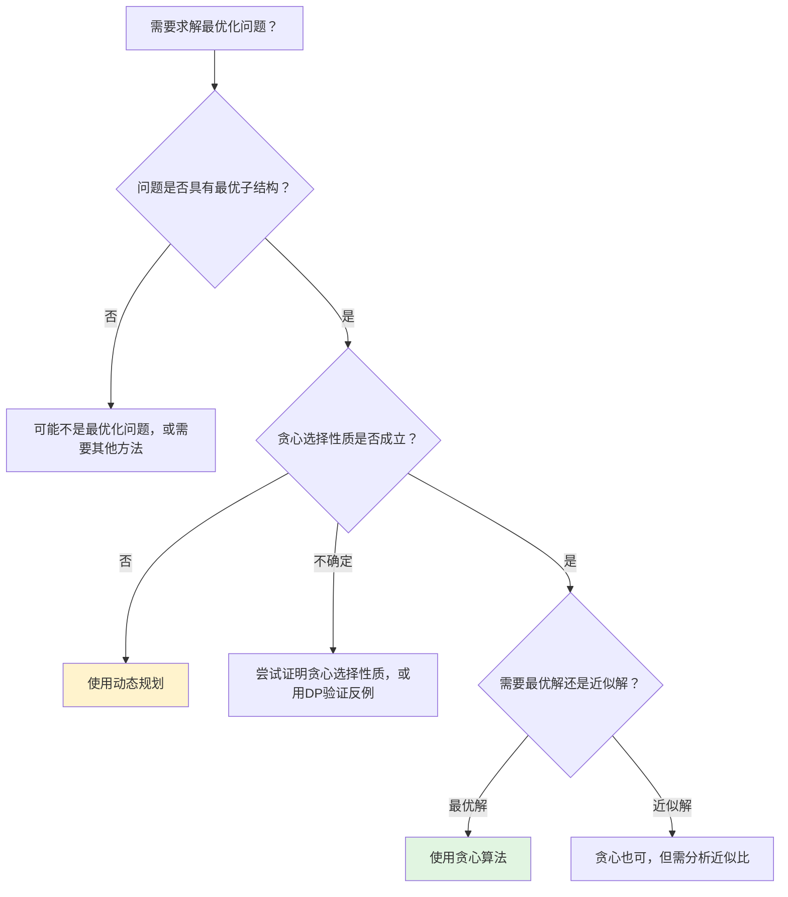
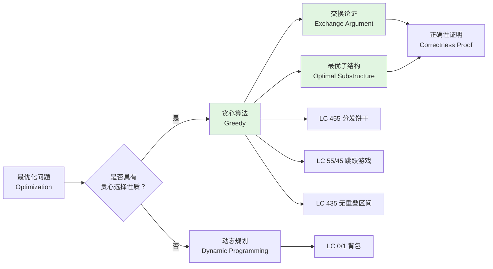
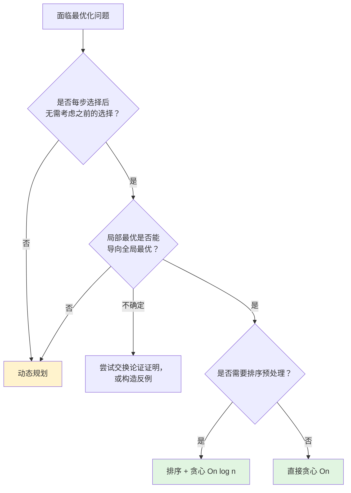
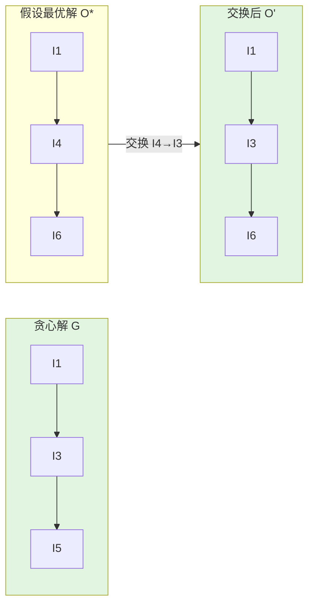
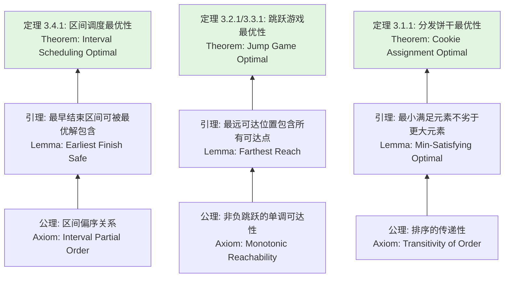

> 📊 **项目全面梳理**：详细的项目结构、模块详解和学习路径，请参阅 [`项目全面梳理-2025.md`](../../项目全面梳理-2025.md)

## 贪心算法 / Greedy Algorithms

### 摘要 / Executive Summary

- 贪心算法（Greedy Algorithm）是一种在每一步选择中都采取**当前状态下最优（局部最优）决策**的算法策略，期望通过局部最优的累积达到全局最优。
- 贪心算法的正确性依赖于两个核心性质：**贪心选择性质**（Greedy Choice Property）和**最优子结构**（Optimal Substructure）。证明贪心选择安全性的标准方法是**交换论证**（Exchange Argument）。
- 本文从形式化定义出发，建立贪心算法的规约框架与交换论证模板，通过 LeetCode 455/55/45/435 四道经典题目的完整形式化证明，展示贪心策略的应用模式与正确性保障方法，并系统对比贪心与动态规划的本质差异。

### 关键术语与符号 / Glossary

| 术语 / Term | 定义 / Definition |
|-------------|-------------------|
| 贪心选择性质 Greedy Choice Property | 全局最优解可以通过一系列局部最优选择达到，即每一步的贪心选择不会被更优解排除 |
| 最优子结构 Optimal Substructure | 问题的最优解包含其子问题的最优解 |
| 交换论证 Exchange Argument | 证明贪心算法正确性的标准技术：假设存在一个最优解，通过逐步将其替换为贪心选择，证明不降低解的质量 |
| 局部最优 Local Optimum | 在当前决策步骤中看似最优的选择 |
| 全局最优 Global Optimum | 在整个问题空间中质量最高的解 |
| 拟阵 Matroid | 组合数学结构，满足特定公理的组合结构上的贪心算法必能得到最优解 |
| 活动选择问题 Activity Selection | 在多个互相冲突的活动中选择最大相容子集的经典问题 |

术语对齐与引用规范：`docs/术语与符号总表.md`，`01-基础理论/00-撰写规范与引用指南.md`

### 目录 / Table of Contents

- [贪心算法 / Greedy Algorithms](#贪心算法--greedy-algorithms)
  - [摘要 / Executive Summary](#摘要--executive-summary)
  - [关键术语与符号 / Glossary](#关键术语与符号--glossary)
  - [目录 / Table of Contents](#目录--table-of-contents)
  - [交叉引用与依赖 / Cross-References and Dependencies](#交叉引用与依赖--cross-references-and-dependencies)
- [1. 形式化定义 / Formal Definitions](#1-形式化定义--formal-definitions)
  - [1.1 贪心算法问题实例](#11-贪心算法问题实例)
  - [1.2 贪心选择性质](#12-贪心选择性质)
  - [1.3 最优子结构](#13-最优子结构)
  - [1.4 交换论证](#14-交换论证)
- [2. 核心思路与算法框架 / Core Ideas and Algorithm Framework](#2-核心思路与算法框架--core-ideas-and-algorithm-framework)
  - [2.1 贪心算法通用模板](#21-贪心算法通用模板)
  - [2.2 交换论证模板](#22-交换论证模板)
  - [2.3 贪心 vs DP 决策流程](#23-贪心-vs-dp-决策流程)
- [3. 经典题目详解 / Classic Problem Analysis](#3-经典题目详解--classic-problem-analysis)
  - [3.1 LeetCode 455 — 分发饼干](#31-leetcode-455--分发饼干)
    - [形式化规约 / Formal Specification](#形式化规约--formal-specification)
    - [核心思路 / Core Idea](#核心思路--core-idea)
    - [代码实现 / Code Implementations](#代码实现--code-implementations)
    - [复杂度分析 / Complexity Analysis](#复杂度分析--complexity-analysis)
    - [正确性证明 / Correctness Proof](#正确性证明--correctness-proof)
  - [3.2 LeetCode 55 — 跳跃游戏](#32-leetcode-55--跳跃游戏)
    - [形式化规约 / Formal Specification](#形式化规约--formal-specification-1)
    - [核心思路 / Core Idea](#核心思路--core-idea-1)
    - [代码实现 / Code Implementations](#代码实现--code-implementations-1)
    - [复杂度分析 / Complexity Analysis](#复杂度分析--complexity-analysis-1)
    - [正确性证明 / Correctness Proof](#正确性证明--correctness-proof-1)
  - [3.3 LeetCode 45 — 跳跃游戏 II](#33-leetcode-45--跳跃游戏-ii)
    - [形式化规约 / Formal Specification](#形式化规约--formal-specification-2)
    - [核心思路 / Core Idea](#核心思路--core-idea-2)
    - [代码实现 / Code Implementations](#代码实现--code-implementations-2)
    - [复杂度分析 / Complexity Analysis](#复杂度分析--complexity-analysis-2)
    - [正确性证明 / Correctness Proof](#正确性证明--correctness-proof-2)
  - [3.4 LeetCode 435 — 无重叠区间](#34-leetcode-435--无重叠区间)
    - [形式化规约 / Formal Specification](#形式化规约--formal-specification-3)
    - [核心思路 / Core Idea](#核心思路--core-idea-3)
    - [代码实现 / Code Implementations](#代码实现--code-implementations-3)
    - [复杂度分析 / Complexity Analysis](#复杂度分析--complexity-analysis-3)
    - [正确性证明 / Correctness Proof](#正确性证明--correctness-proof-3)
- [4. 复杂度分析体系 / Complexity Analysis](#4-复杂度分析体系--complexity-analysis)
  - [4.1 贪心算法的时间复杂度特征](#41-贪心算法的时间复杂度特征)
- [5. 正确性证明框架 / Correctness Proof Framework](#5-正确性证明框架--correctness-proof-framework)
  - [5.1 交换论证通用模板](#51-交换论证通用模板)
  - [5.2 证明树：区间调度](#52-证明树区间调度)
- [6. 贪心 vs 动态规划 / Greedy vs Dynamic Programming](#6-贪心-vs-动态规划--greedy-vs-dynamic-programming)
  - [6.1 核心差异对比表](#61-核心差异对比表)
  - [6.2 经典反例：0/1 背包问题](#62-经典反例01-背包问题)
- [7. 思维表征 / Thinking Representations](#7-思维表征--thinking-representations)
  - [7.1 概念依赖图](#71-概念依赖图)
  - [7.2 算法选择决策树](#72-算法选择决策树)
  - [7.3 多维矩阵对比表](#73-多维矩阵对比表)
  - [7.4 交换论证可视化](#74-交换论证可视化)
  - [7.5 贪心选择安全性的证明模板图](#75-贪心选择安全性的证明模板图)
- [8. 常见错误与反模式 / Common Mistakes and Anti-Patterns](#8-常见错误与反模式--common-mistakes-and-anti-patterns)
  - [8.1 将贪心算法应用于不满足贪心选择性质的问题](#81-将贪心算法应用于不满足贪心选择性质的问题)
  - [8.2 跳跃游戏中未遍历到倒数第二个元素](#82-跳跃游戏中未遍历到倒数第二个元素)
  - [8.3 区间问题中按开始时间排序](#83-区间问题中按开始时间排序)
  - [8.4 混淆"跳跃游戏"与"跳跃游戏 II"](#84-混淆跳跃游戏与跳跃游戏-ii)
  - [8.5 未验证贪心策略的反例](#85-未验证贪心策略的反例)
- [9. 自测问题 / Self-Assessment Questions](#9-自测问题--self-assessment-questions)
  - [问题 1：贪心选择性质与最优子结构的区别](#问题-1贪心选择性质与最优子结构的区别)
  - [问题 2：交换论证的核心步骤](#问题-2交换论证的核心步骤)
  - [问题 3：为什么区间调度要按结束时间排序](#问题-3为什么区间调度要按结束时间排序)
  - [问题 4：LC 45 的层序遍历思想](#问题-4lc-45-的层序遍历思想)
  - [问题 5：贪心与 DP 的选择策略](#问题-5贪心与-dp-的选择策略)
- [10. 学习目标 / Learning Objectives](#10-学习目标--learning-objectives)
- [11. 知识导航 / Knowledge Navigation](#11-知识导航--knowledge-navigation)
- [参考文献 / References](#参考文献--references)

### 交叉引用与依赖 / Cross-References and Dependencies

**上游理论依赖 / Upstream Dependencies**:

- [`09-算法理论/02-分治算法/01-分治算法理论-六维补充.md`](../../09-算法理论/02-分治算法/01-分治算法理论-六维补充.md) — 分治与贪心作为算法范式的对比
- [`04-算法复杂度/01-时间复杂度.md`](../../04-算法复杂度/01-时间复杂度.md) — 时间复杂度的形式化定义
- [`06-逻辑系统/01-命题逻辑.md`](../../06-逻辑系统/01-命题逻辑.md) — 逻辑推理在正确性证明中的应用

**下游应用 / Downstream Applications**:

- `13-LeetCode算法面试专题/02-算法范式专题/08-动态规划.md` — 动态规划与贪心算法的系统对比与选择策略
- `13-LeetCode算法面试专题/04-高级专题/03-区间问题.md` — 区间调度与覆盖问题的贪心策略深入

---

## 1. 形式化定义 / Formal Definitions

### 1.1 贪心算法问题实例

**定义 1.1** (贪心算法问题实例 / Greedy Problem Instance) [CLRS2022, §16]
贪心算法问题实例可以形式化地定义为一个五元组：
**Definition 1.1** (Greedy Problem Instance)
A greedy algorithm problem instance can be formally defined as a quintuple:

$$
\Pi = (D, I, O, \text{pre}, \text{post})
$$

贪心算法通过以下方式求解：

$$
\text{Greedy}(x) = \begin{cases}
\text{DirectSolve}(x), & \text{if } |x| \leq \text{threshold} \\
c \oplus \text{Greedy}(x'), & \text{otherwise}
\end{cases}
$$

其中 $c$ 是当前步骤的贪心选择，$\oplus$ 是将选择 $c$ 融入部分解的操作，$x'$ 是做出选择 $c$ 后的剩余子问题。

### 1.2 贪心选择性质

**定义 1.2** (贪心选择性质 / Greedy Choice Property) [CLRS2022, §16.2]
一个问题满足贪心选择性质，当且仅当：
**Definition 1.2** (Greedy Choice Property)

$$
\exists \text{ optimal solution } S^*: \text{greedy choice } c \in S^*
$$

即存在一个全局最优解包含当前的贪心选择。换言之，每一步的局部最优选择不会被排除在任何全局最优解之外。

> **注意**: 贪心选择性质要求的是"存在一个最优解包含贪心选择"，而非"所有最优解都包含贪心选择"。

### 1.3 最优子结构

**定义 1.3** (最优子结构 / Optimal Substructure) [CLRS2022, §16.2]
一个问题满足最优子结构，当且仅当：
**Definition 1.3** (Optimal Substructure)

$$
S^* \text{ is optimal for } x \rightarrow S^* \setminus \{c\} \text{ is optimal for } x'
$$

即做出贪心选择 $c$ 后，剩余子问题 $x'$ 的最优解与 $c$ 组合即构成原问题的最优解。

### 1.4 交换论证

**定义 1.4** (交换论证 / Exchange Argument)
交换论证是证明贪心算法正确性的标准技术，其核心步骤为：
**Definition 1.4** (Exchange Argument)

1. **假设**: 设 $S^*$ 是一个最优解，$c$ 是算法的贪心选择。
2. **情况分析**: 若 $c \in S^*$，则已证。
3. **交换**: 若 $c \notin S^*$，则构造 $S' = S^* \setminus \{c'\} \cup \{c\}$，其中 $c'$ 是 $S^*$ 中与 $c$ 对应的元素。
4. **可行性**: 证明 $S'$ 是一个可行解。
5. **不劣性**: 证明 $S'$ 的质量不劣于 $S^*$（即 $|S'| \geq |S^*|$ 或 $cost(S') \leq cost(S^*)$）。
6. **结论**: 因此存在一个包含 $c$ 的最优解，贪心选择是安全的。

---

## 2. 核心思路与算法框架 / Core Ideas and Algorithm Framework

### 2.1 贪心算法通用模板

```text
Greedy(x):
    solution ← empty set
    while x is not empty:
        c ← SelectGreedyChoice(x)    // 根据某种策略选择当前最优元素
        if Feasible(solution ∪ {c}):
            solution ← solution ∪ {c}
        x ← x after removing c or updating constraints
    return solution
```

### 2.2 交换论证模板

```mermaid
flowchart TD
    A[假设 S* 是最优解] --> B{c 是否在 S* 中？}
    B -->|是| C[贪心选择安全，得证]
    B -->|否| D[找到 S* 中对应元素 c']
    D --> E[构造 S' = S* \ {c'} ∪ {c}]
    E --> F{S' 是否可行？}
    F -->|否| G[矛盾，说明贪心选择不可行或策略需调整]
    F -->|是| H{S' 质量 ≥ S* ？}
    H -->|是| C
    H -->|否| I[需要更强的分析或贪心策略错误]

    style C fill:#e1f5e1
    style G fill:#f8d7da
    style I fill:#f8d7da
```

### 2.3 贪心 vs DP 决策流程



---

## 3. 经典题目详解 / Classic Problem Analysis

### 3.1 LeetCode 455 — 分发饼干

> **题目链接 / Problem Link**: [LeetCode 455. Assign Cookies](https://leetcode.com/problems/assign-cookies/)
> **难度 / Difficulty**: Easy

#### 形式化规约 / Formal Specification

**前置条件 / Precondition**:

$$
\textit{g} \in \mathbb{Z}^m \text{（孩子胃口值）}, \quad \textit{s} \in \mathbb{Z}^n \text{（饼干大小）}, \quad m, n \geq 0
$$

**后置条件 / Postcondition**:
返回满足的孩子数量的最大值，即：

$$
\text{result} = \max \big\{ |M| \mid M \subseteq [0, m-1] \times [0, n-1] \text{ is a matching}, \forall (i, j) \in M: g[i] \leq s[j] \big\}
$$

#### 核心思路 / Core Idea

贪心策略：**用能满足某个孩子的最小饼干去满足他**。具体实现：

1. 将孩子胃口数组 $g$ 和饼干数组 $s$ 分别排序
2. 用双指针：对于每个孩子，找到能满足他的最小饼干
3. 若当前饼干太小，则放弃该饼干（它无法满足当前及之后任何孩子）

#### 代码实现 / Code Implementations

- **Rust**: [`examples/algorithms/src/leetcode/lc0455_assign_cookies.rs`](../../../../examples/algorithms/src/leetcode/lc0455_assign_cookies.rs)
- **Python**: [`examples/algorithms-python/src/leetcode/lc0455_assign_cookies.py`](../../../../examples/algorithms-python/src/leetcode/lc0455_assign_cookies.py)
- **Go**: [`examples/algorithms-go/leetcode/lc0455_assign_cookies.go`](../../../../examples/algorithms-go/leetcode/lc0455_assign_cookies.go)

#### 复杂度分析 / Complexity Analysis

| 指标 / Metric | 值 / Value |
|--------------|-----------|
| 时间复杂度 / Time | $O(m \log m + n \log n)$ | 排序主导 |
| 空间复杂度 / Space | $O(\log m + \log n)$ 至 $O(m + n)$ | 取决于排序实现 |

#### 正确性证明 / Correctness Proof

**定理 3.1.1** (LeetCode 455 正确性): 贪心策略"用最小满足饼干满足每个孩子"能够得到最多满足的孩子数量。

**证明 / Proof**: 使用交换论证。

**引理 3.1.1.1**: 设当前考虑的孩子胃口为 $g_i$，当前最小的可用饼干为 $s_j$。若 $s_j \geq g_i$，则将 $s_j$ 分配给 $g_i$ 不会降低最优解的质量。

*证明*: 假设某个最优解 $S^*$ 中，$g_i$ 被饼干 $s_k$ 满足（$s_k \geq g_i$），而 $s_j$ 被分配给了某个胃口更大的孩子 $g_l$（$g_l \geq g_i$）或未被使用。

- 若 $s_j$ 未被使用：将 $s_j$ 分配给 $g_i$（替换 $s_k$ 或不替换均可），满足的孩子数不减少。
- 若 $s_j$ 被分配给 $g_l$：由于 $s_j \leq s_k$（$s_j$ 是当前最小满足饼干）且 $g_l \geq g_i$，交换分配：$s_j \to g_i$，$s_k \to g_l$。由于 $s_k \geq s_j \geq g_i$ 且 $g_l \geq g_i$，只需验证 $s_k \geq g_l$。若 $s_k \geq g_l$，交换后仍然可行；若 $s_k < g_l$，则 $s_j < s_k < g_l$，与 $s_j$ 能满足 $g_l$ 矛盾。因此交换后可行，且满足的孩子数不变。$\square$

**主证明**: 对贪心算法的每一步应用引理 3.1.1.1，可知每一步的贪心选择都不会降低达到最优解的可能性。因此贪心算法能够得到最优解。$\square$

---

### 3.2 LeetCode 55 — 跳跃游戏

> **题目链接 / Problem Link**: [LeetCode 55. Jump Game](https://leetcode.com/problems/jump-game/)
> **难度 / Difficulty**: Medium

#### 形式化规约 / Formal Specification

**前置条件 / Precondition**:

$$
\textit{nums} \in \mathbb{Z}_{\geq 0}^n, \quad n \geq 1
$$

**后置条件 / Postcondition**:

$$
\text{result} = \begin{cases}
\text{True}, & \text{if } \exists \text{ jump sequence } 0 = p_0 < p_1 < \cdots < p_k = n-1: \forall i: p_{i+1} - p_i \leq nums[p_i] \\
\text{False}, & \text{otherwise}
\end{cases}
$$

#### 核心思路 / Core Idea

贪心策略：**维护当前能到达的最远位置**。初始时最远位置为 $nums[0]$。遍历数组，若当前位置 $i$ 在可达范围内（$i \leq \text{reach}$），则更新最远位置为 $max(\text{reach}, i + nums[i])$。若遍历完成后 $\text{reach} \geq n - 1$，则可达。

关键洞察：不需要记录具体路径，只需知道"最远能到达哪里"。

#### 代码实现 / Code Implementations

- **Rust**: [`examples/algorithms/src/leetcode/lc0055_jump_game.rs`](../../../../examples/algorithms/src/leetcode/lc0055_jump_game.rs)
- **Python**: [`examples/algorithms-python/src/leetcode/lc0055_jump_game.py`](../../../../examples/algorithms-python/src/leetcode/lc0055_jump_game.py)
- **Go**: [`examples/algorithms-go/leetcode/lc0055_jump_game.go`](../../../../examples/algorithms-go/leetcode/lc0055_jump_game.go)

#### 复杂度分析 / Complexity Analysis

| 指标 / Metric | 值 / Value |
|--------------|-----------|
| 时间复杂度 / Time | $O(n)$ |
| 空间复杂度 / Space | $O(1)$ |

#### 正确性证明 / Correctness Proof

**定理 3.2.1** (LeetCode 55 正确性): 贪心算法"维护最远可达位置"正确判断是否能到达最后一个下标。

**证明 / Proof**:

**引理 3.2.1.1** (可达区间单调性): 设 $reach_i$ 为处理完位置 $i$ 后的最远可达位置。若 $i \leq reach_{i-1}$，则所有位置 $[0, reach_i]$ 均可从起点到达。

*证明*: 对 $i$ 进行归纳。

- **基例**: $i = 0$ 时，$reach_0 = nums[0]$，位置 $[0, nums[0]]$ 均可到达。
- **归纳步骤**: 假设处理完 $i-1$ 后 $[0, reach_{i-1}]$ 均可到达。处理位置 $i$ 时，若 $i > reach_{i-1}$，则无法到达 $i$，算法正确返回 `False`。若 $i \leq reach_{i-1}$，则从 $i$ 可以到达 $[i, i + nums[i]]$。因此更新后 $reach_i = \max(reach_{i-1}, i + nums[i])$，区间 $[0, reach_i]$ 均可到达。$\square$

**主证明**: 由引理 3.2.1.1，若算法遍历完所有位置，则 $reach_{n-1}$ 表示从起点可达的最远位置。若 $reach_{n-1} \geq n - 1$，则最后一个位置可达；若在遍历过程中发现 $i > reach_{i-1}$，则位置 $i$ 不可达，因此最后一个位置也不可达。$\square$

---

### 3.3 LeetCode 45 — 跳跃游戏 II

> **题目链接 / Problem Link**: [LeetCode 45. Jump Game II](https://leetcode.com/problems/jump-game-ii/)
> **难度 / Difficulty**: Medium

#### 形式化规约 / Formal Specification

**前置条件 / Precondition**:

$$
\textit{nums} \in \mathbb{Z}_{\geq 0}^n, \quad n \geq 1, \quad \text{保证可以到达 } n-1
$$

**后置条件 / Postcondition**:
返回从位置 $0$ 到达位置 $n-1$ 的**最少跳跃次数**。

$$
\text{result} = \min \big\{ k \mid \exists \text{ jump sequence } 0 = p_0 < p_1 < \cdots < p_k = n-1: \forall i: p_{i+1} - p_i \leq nums[p_i] \big\}
$$

#### 核心思路 / Core Idea

贪心策略：**在每一步跳跃的范围内，选择能使下一次跳得最远的落点**。

具体实现（BFS/层序遍历思想）：

- 维护当前层的最远边界 $current\_end$ 和下一层的最远边界 $farthest$
- 遍历数组，更新 $farthest = \max(farthest, i + nums[i])$
- 当 $i == current\_end$ 时，必须进行下一次跳跃，$jumps += 1$，$current\_end = farthest$

#### 代码实现 / Code Implementations

- **Rust**: [`examples/algorithms/src/leetcode/lc0045_jump_game_ii.rs`](../../../../examples/algorithms/src/leetcode/lc0045_jump_game_ii.rs)
- **Python**: [`examples/algorithms-python/src/leetcode/lc0045_jump_game_ii.py`](../../../../examples/algorithms-python/src/leetcode/lc0045_jump_game_ii.py)
- **Go**: [`examples/algorithms-go/leetcode/lc0045_jump_game_ii.go`](../../../../examples/algorithms-go/leetcode/lc0045_jump_game_ii.go)

#### 复杂度分析 / Complexity Analysis

| 指标 / Metric | 值 / Value |
|--------------|-----------|
| 时间复杂度 / Time | $O(n)$ |
| 空间复杂度 / Space | $O(1)$ |

#### 正确性证明 / Correctness Proof

**定理 3.3.1** (LeetCode 45 正确性): 贪心算法返回到达最后一个位置的最少跳跃次数。

**证明 / Proof**:

**引理 3.3.1.1** (层不变式): 设 $jumps$ 为已进行的跳跃次数，$current\_end$ 为当前跳跃次数下能到达的最远位置。则在遍历过程中，所有位置 $[0, current\_end]$ 均可通过不超过 $jumps$ 次跳跃到达。

*证明*: 对 $jumps$ 进行归纳。

- **基例**: $jumps = 0$ 时，$current\_end = 0$，位置 $[0, 0]$ 可通过 0 次跳跃到达。
- **归纳步骤**: 假设 $jumps$ 次跳跃可达 $[0, current\_end]$。在遍历 $[0, current\_end]$ 的过程中，$farthest = \max_{i \in [0, current\_end]} (i + nums[i])$ 表示从当前层出发，下一层能到达的最远位置。当 $i = current\_end$ 时，必须进行第 $jumps + 1$ 次跳跃才能超越 $current\_end$。更新后，$[0, farthest]$ 可通过不超过 $jumps + 1$ 次跳跃到达。$\square$

**引理 3.3.1.2** (最少跳跃): 当 $i = current\_end$ 时进行的跳跃是必须的，即不存在使用更少跳跃次数到达更远位置的方案。

*证明*: 由引理 3.3.1.1，$jumps$ 次跳跃最多到达 $current\_end$。若要到达 $current\_end + 1$ 或更远，至少需要 $jumps + 1$ 次跳跃。因此当遍历到 $current\_end$ 时，必须进行下一次跳跃，且 $jumps$ 的增量是必要且最小的。$\square$

**主证明**: 由引理 3.3.1.1，算法结束时 $current\_end \geq n - 1$，因此 $jumps$ 次跳跃足以到达终点。由引理 3.3.1.2，每次跳跃增量都是必要的，因此 $jumps$ 是最小值。$\square$

---

### 3.4 LeetCode 435 — 无重叠区间

> **题目链接 / Problem Link**: [LeetCode 435. Non-overlapping Intervals](https://leetcode.com/problems/non-overlapping-intervals/)
> **难度 / Difficulty**: Medium

#### 形式化规约 / Formal Specification

**前置条件 / Precondition**:

$$
\textit{intervals} = \{ [l_i, r_i) \}_{i=1}^{n}, \quad n \geq 1, \quad l_i < r_i
$$

**后置条件 / Postcondition**:
返回需要移除的最小区间数量，使得剩余区间互不重叠。

等价地，返回**最大数量的互不重叠区间**的补集大小。

$$
\text{result} = n - \max \big\{ |S| \mid S \subseteq \textit{intervals}, \forall [l_1, r_1), [l_2, r_2) \in S: r_1 \leq l_2 \lor r_2 \leq l_1 \big\}
$$

#### 核心思路 / Core Idea

贪心策略：**按结束时间排序，每次选择结束最早的且与已选区间不重叠的区间**。

关键洞察：结束越早的区间，留给后续区间的空间越大。

#### 代码实现 / Code Implementations

- **Rust**: [`examples/algorithms/src/leetcode/lc0435_non_overlapping_intervals.rs`](../../../../examples/algorithms/src/leetcode/lc0435_non_overlapping_intervals.rs)
- **Python**: [`examples/algorithms-python/src/leetcode/lc0435_non_overlapping_intervals.py`](../../../../examples/algorithms-python/src/leetcode/lc0435_non_overlapping_intervals.py)
- **Go**: [`examples/algorithms-go/leetcode/lc0435_non_overlapping_intervals.go`](../../../../examples/algorithms-go/leetcode/lc0435_non_overlapping_intervals.go)

#### 复杂度分析 / Complexity Analysis

| 指标 / Metric | 值 / Value |
|--------------|-----------|
| 时间复杂度 / Time | $O(n \log n)$ | 排序主导 |
| 空间复杂度 / Space | $O(\log n)$ 至 $O(n)$ | 取决于排序实现 |

#### 正确性证明 / Correctness Proof

**定理 3.4.1** (LeetCode 435 正确性): "按结束时间排序，选结束最早的不重叠区间"能够得到最大数量的互不重叠区间。

**证明 / Proof**: 使用交换论证。

**引理 3.4.1.1**: 设 $I$ 是所有区间按结束时间排序后的序列。设 $g$ 是结束最早的区间。存在一个最优解包含 $g$。

*证明*: 设 $S^*$ 是一个最优解，$s$ 是 $S^*$ 中结束最早的区间。若 $s = g$，则已证。若 $s \neq g$，由于 $g$ 是全局结束最早的区间，故 $g$ 的结束时间 $\leq s$ 的结束时间。

构造 $S' = S^* \setminus \{s\} \cup \{g\}$。

- **可行性**: $S^*$ 中除 $s$ 外的其他区间均在 $s$ 结束之后开始。由于 $g$ 结束不晚于 $s$，这些区间也在 $g$ 结束之后开始。因此 $S'$ 中区间互不重叠。
- **不劣性**: $|S'| = |S^*|$。

因此 $S'$ 也是最优解且包含 $g$。$\square$

**引理 3.4.1.2** (最优子结构): 选择了 $g$ 后，在结束时间晚于 $g$ 的区间中求解子问题，其最优解与 $g$ 组合即构成原问题的最优解。

*证明*: 由引理 3.4.1.1，存在包含 $g$ 的最优解。移除 $g$ 后，剩余区间必须与 $g$ 不重叠，即只能在 $g$ 结束后开始。因此剩余部分恰好是子问题的最优解。$\square$

**主证明**: 对区间数量进行归纳。

- **基例**: $n = 1$ 时，唯一区间即为最优解。
- **归纳步骤**: 由引理 3.4.1.1，选择结束最早的区间 $g$ 是安全的。由引理 3.4.1.2，剩余子问题的最优解可通过相同策略得到。由归纳假设，贪心策略对子问题最优。因此贪心策略对原问题最优。$\square$

---

## 4. 复杂度分析体系 / Complexity Analysis

### 4.1 贪心算法的时间复杂度特征

贪心算法的时间复杂度通常由以下因素决定：

1. **排序开销**: 若需要排序作为预处理，时间复杂度通常为 $O(n \log n)$
2. **选择开销**: 每次贪心选择若可在 $O(1)$ 或 $O(\log n)$ 内完成，则总复杂度为 $O(n)$ 或 $O(n \log n)$
3. **数据结构**: 使用优先队列（堆）可将选择开销维持在 $O(\log n)$

| 题目 | 预处理 | 选择策略 | 总时间复杂度 |
|------|--------|---------|------------|
| LC 455 | 排序 | 双指针线性扫描 | $O(n \log n)$ |
| LC 55 | 无 | 维护最远位置 | $O(n)$ |
| LC 45 | 无 | 维护最远边界 | $O(n)$ |
| LC 435 | 按结束时间排序 | 贪心选择最早结束 | $O(n \log n)$ |

---

## 5. 正确性证明框架 / Correctness Proof Framework

### 5.1 交换论证通用模板

**模板 5.1** (交换论证模板 / Exchange Argument Template)

**目标**: 证明贪心选择 $c$ 可以被某个最优解包含。

**步骤**:

1. 设 $S^*$ 是一个最优解。
2. 若 $c \in S^*$，证明完成。
3. 若 $c \notin S^*$，设 $c' \in S^*$ 是 $S^*$ 中与 $c$ "对应"的元素（根据问题定义确定对应关系）。
4. 构造 $S' = (S^* \setminus \{c'\}) \cup \{c\}$。
5. 证明 $S'$ 是**可行解**（满足所有约束）。
6. 证明 $S'$ 的**质量不劣于** $S^*$（$cost(S') \leq cost(S^*)$ 或 $|S'| \geq |S^*|$）。
7. 若 $S'$ 的质量严格优于 $S^*$，则与 $S^*$ 的最优性矛盾，故 $c'$ 不存在，$c$ 必在最优解中。
8. 若 $S'$ 的质量等于 $S^*$，则 $S'$ 也是最优解且包含 $c$，证毕。

### 5.2 证明树：区间调度

```mermaid
flowchart TD
    A[所有区间按结束时间排序] --> B[设 g 为结束最早的区间]
    B --> C{是否存在最优解包含 g？}
    C -->|是| D[贪心选择安全]
    C -->|否| E[设 S* 为最优解，s 为 S* 中结束最早的区间]
    E --> F[构造 S' = S* \ {s} ∪ {g}]
    F --> G{S' 是否可行？}
    G -->|g 结束 ≤ s 结束| H[其他区间在 s 结束后开始，必在 g 结束后开始]
    H --> I[S' 可行且 |S'| = |S*|]
    I --> D
    D --> J[对剩余区间递归应用]
    J --> K[得到全局最优解]

    style D fill:#e1f5e1
    style K fill:#e1f5e1
```

---

## 6. 贪心 vs 动态规划 / Greedy vs Dynamic Programming

### 6.1 核心差异对比表

| 维度 / Dimension | 贪心算法 Greedy | 动态规划 DP |
|----------------|----------------|-----------|
| **选择策略** | 每步只做当前最优选择，不可回溯 | 考虑所有子问题，保存最优子结构 |
| **最优子结构** | 必须满足 | 必须满足 |
| **贪心选择性质** | 必须满足 | 不要求 |
| **时间复杂度** | 通常更快，$O(n \log n)$ 或 $O(n)$ | 通常 $O(n^2)$ 或更高 |
| **空间复杂度** | 通常 $O(1)$ 或 $O(n)$ | 通常 $O(n)$ 或更高 |
| **正确性证明** | 交换论证 | 归纳法 + 状态转移 |
| **适用场景** | 选择具有"无后效性"的问题 | 具有重叠子问题和最优子结构的问题 |
| **典型反例** | 0/1 背包（贪心失败） | — |

### 6.2 经典反例：0/1 背包问题

**问题**: 给定容量为 $W$ 的背包和若干物品（重量 $w_i$，价值 $v_i$），选择装入背包的物品使总价值最大。

**贪心策略（按价值密度排序）**: 优先选择 $v_i/w_i$ 最大的物品。

**反例**:

- $W = 50$
- 物品 1: $w = 10, v = 60$，密度 $6$
- 物品 2: $w = 20, v = 100$，密度 $5$
- 物品 3: $w = 30, v = 120$，密度 $4$

贪心选择物品 1 和 2（总重 30，价值 160）。但最优解是物品 2 和 3（总重 50，价值 220）。

**原因**: 0/1 背包不满足贪心选择性质——选择局部最优（密度最高）的物品会占用背包容量，可能导致无法装入更优的组合。

---

## 7. 思维表征 / Thinking Representations

### 7.1 概念依赖图



### 7.2 算法选择决策树



### 7.3 多维矩阵对比表

| 维度 / Dimension | LC 455 分发饼干 | LC 55 跳跃游戏 | LC 45 跳跃游戏 II | LC 435 无重叠区间 |
|----------------|---------------|--------------|------------------|----------------|
| **贪心策略** | 最小满足饼干 | 维护最远可达 | 最远边界扩展 | 最早结束优先 |
| **预处理** | 排序 | 无 | 无 | 按结束时间排序 |
| **时间复杂度** | $O(n \log n)$ | $O(n)$ | $O(n)$ | $O(n \log n)$ |
| **空间复杂度** | $O(1)$ | $O(1)$ | $O(1)$ | $O(1)$ |
| **证明方法** | 交换论证 | 不变式归纳 | 层不变式 + 必要性 | 交换论证 |
| **核心不变式** | 最小饼干不劣于其他 | 可达区间连续扩展 | jumps 次可达 [0, end] | 最早结束留最大空间 |
| **反例风险** | 若不排序则失败 | 无（题目保证非负） | 无 | 若按开始时间排序则失败 |

### 7.4 交换论证可视化



### 7.5 贪心选择安全性的证明模板图



---

## 8. 常见错误与反模式 / Common Mistakes and Anti-Patterns

### 8.1 将贪心算法应用于不满足贪心选择性质的问题

**错误 / Mistake**: 在 0/1 背包问题中使用贪心策略（按价值密度排序）。

**后果 / Consequence**: 得到的可能不是最优解，只是近似解。

**正确做法**: 对于 0/1 背包，应使用动态规划。贪心仅适用于**分数背包**（可拆分的物品）。

### 8.2 跳跃游戏中未遍历到倒数第二个元素

**错误 / Mistake**: 在 LC 45 中遍历整个数组（包括最后一个元素），导致不必要的跳跃计数。

```python
# 错误
for i in range(n):   # 遍历到 n-1 会导致多算一次跳跃
    farthest = max(farthest, i + nums[i])
    if i == current_end:
        jumps += 1
        current_end = farthest
```

**正确做法**: 遍历到倒数第二个位置即可，因为到达最后一个位置时无需再跳跃。

```python
for i in range(n - 1):   # 正确
    # ...
```

### 8.3 区间问题中按开始时间排序

**错误 / Mistake**: 在 LC 435 中按开始时间排序而非结束时间。

**后果 / Consequence**: 贪心策略失效。反例：$[1, 10], [2, 3], [4, 5]$。按开始时间排序会选择 $[1, 10]$，但最优解是 $[2, 3], [4, 5]$。

**正确做法**: 必须按**结束时间**排序，以确保每次选择留给后续区间最大的空间。

### 8.4 混淆"跳跃游戏"与"跳跃游戏 II"

| 题目 | 目标 | 策略差异 |
|------|------|---------|
| LC 55 | 判断是否可达 | 维护最远可达位置，遇到不可达返回 False |
| LC 45 | 求最少跳跃次数 | 维护当前层边界，到达边界时必须跳跃 |

### 8.5 未验证贪心策略的反例

**错误 / Mistake**: 看到"最优化"问题就直接用贪心，不验证贪心选择性质。

**正确做法**: 在编码前，先尝试用交换论证证明贪心策略的正确性，或主动构造反例来检验。

---

## 9. 自测问题 / Self-Assessment Questions

### 问题 1：贪心选择性质与最优子结构的区别

**Q**: 贪心选择性质和最优子结构有何区别？一个问题可以只满足其中一个吗？

**A**:

- **最优子结构**: 问题的最优解包含其子问题的最优解。这是动态规划和贪心算法**共同要求**的性质。
- **贪心选择性质**: 全局最优可以通过局部最优选择达到，即每一步的贪心选择不会被排除在最优解之外。这是贪心算法**特有的**要求。

一个问题可以只满足最优子结构而不满足贪心选择性质。典型例子是**0/1 背包问题**：它满足最优子结构（可用 DP 求解），但不满足贪心选择性质（按密度贪心失败）。

---

### 问题 2：交换论证的核心步骤

**Q**: 使用交换论证证明贪心算法正确性的标准步骤是什么？

**A**:

1. 假设 $S^*$ 是一个最优解，$c$ 是贪心选择。
2. 若 $c \in S^*$，则已证。
3. 若 $c \notin S^*$，找到 $S^*$ 中与 $c$ 对应的元素 $c'$。
4. 构造 $S' = S^* \setminus \{c'\} \cup \{c\}$。
5. 证明 $S'$ 是可行解（满足约束）。
6. 证明 $S'$ 的质量不劣于 $S^*$。
7. 得出结论：存在包含 $c$ 的最优解。

---

### 问题 3：为什么区间调度要按结束时间排序

**Q**: LC 435 为什么必须按结束时间排序？按开始时间排序为什么失败？

**A**: 按结束时间排序的直觉是：**结束越早的区间，留给后续区间的空间越大**。交换论证证明：若最优解中不包含结束最早的区间 $g$，则可以将最优解中与之冲突的某个区间替换为 $g$，不会减少解的数量。

按开始时间排序的失败反例：$[1, 10], [2, 3], [4, 5]$。按开始时间排序会先选 $[1, 10]$，导致只能选 1 个区间；但最优解是 $[2, 3]$ 和 $[4, 5]$，共 2 个区间。

---

### 问题 4：LC 45 的层序遍历思想

**Q**: LC 45 中"当前层"和"下一层"的直观含义是什么？

**A**: 将跳跃过程想象为 BFS 的层序遍历：

- **第 0 层**: 仅包含起点 0
- **第 1 层**: 从 0 出发一次跳跃可达的所有位置
- **第 2 层**: 从第 1 层出发再跳一次可达的所有位置
- ...

$current\_end$ 是当前层的最远位置，$farthest$ 是下一层的最远位置。当遍历到 $current\_end$ 时，说明当前层已全部处理完毕，必须进行下一次跳跃进入下一层。

---

### 问题 5：贪心与 DP 的选择策略

**Q**: 面对一个最优化问题，如何快速判断应该用贪心还是动态规划？

**A**:

1. **检查最优子结构**: 若不具备，两者都不适用。
2. **尝试贪心策略**: 想一个直观的贪心策略，尝试用交换论证证明其正确性。
3. **构造反例**: 若无法证明，主动构造小规模的反例来检验贪心策略。
4. **检查重叠子问题**: 若贪心失败且问题具有重叠子问题，使用动态规划。
5. **经验法则**:
   - 涉及"选择最大/最小数量"且选择具有单调性 → 尝试贪心
   - 涉及"求最值"且选择会相互影响 → 尝试 DP
   - 涉及"区间调度" → 通常按结束时间贪心

---

## 10. 学习目标 / Learning Objectives

完成本章学习后，读者应能够：

1. **形式化定义**贪心选择性质、最优子结构和交换论证。
2. **熟练运用**交换论证证明贪心算法的正确性，遵循标准六步模板。
3. **独立解决**区间调度、资源分配、可达性分析等经典贪心问题。
4. **准确区分**贪心算法与动态规划的适用场景，避免将贪心应用于不满足贪心选择性质的问题。
5. **分析并证明**贪心算法的时间复杂度，识别排序预处理对总复杂度的影响。

---

## 11. 知识导航 / Knowledge Navigation

**前置知识 / Prerequisites**:

- [数组与排序](../../01-算法基础/01-数据结构基础/01-数组.md)
- [区间与排序](../../01-算法基础/02-算法基础/02-排序算法.md)
- [动态规划基础](../../09-算法理论/04-动态规划/01-动态规划理论基础.md)

**当前模块 / Current Module**:

- `13-LeetCode算法面试专题/02-算法范式专题/07-贪心算法.md`（本文档）

**后续模块 / Next Modules**:

- `13-LeetCode算法面试专题/02-算法范式专题/08-动态规划.md` — 贪心算法的对比与补充
- `13-LeetCode算法面试专题/04-高级专题/03-区间问题.md` — 区间覆盖、区间合并等进阶贪心问题

**相关面试题索引 / Related Interview Problems**:

| 题号 | 题目 | 难度 | 核心考点 |
|-----|------|------|---------|
| LC 406 | Queue Reconstruction by Height | Medium | 贪心双维度排序 |
| LC 452 | Minimum Number of Arrows to Burst Balloons | Medium | 区间调度变体 |
| LC 253 | Meeting Rooms II | Medium | 贪心 + 优先队列 |
| LC 621 | Task Scheduler | Medium | 贪心 + 数学分析 |
| LC 134 | Gas Station | Medium | 贪心可达性分析 |
| LC 56 | Merge Intervals | Medium | 区间合并贪心 |

---

## 参考文献 / References

> 本文档遵循项目引用规范（见 [`CITATION_STANDARD.md`](../../CITATION_STANDARD.md)、[`学术引用规范-ACM对齐版.md`](../../学术引用规范-ACM对齐版.md)）。文内采用 [Key] 格式引用，与参考文献列表对应。

**经典教材 / Classic Textbooks**:

1. [CLRS2022] Cormen, T. H., Leiserson, C. E., Rivest, R. L., & Stein, C. (2022). *Introduction to Algorithms* (4th ed.). MIT Press. ISBN: 978-0262046305.
   - 第 16 章（Greedy Algorithms）系统介绍贪心算法的设计范式与交换论证方法。

2. [KleinbergTardos2006] Kleinberg, J., & Tardos, É. (2006). *Algorithm Design*. Pearson.
   - 第 4 章（Greedy Algorithms）给出区间调度、最短路径等经典问题的贪心分析。

**LeetCode 题目 / LeetCode Problems**:

1. [LeetCode455] LeetCode. (n.d.). "455. Assign Cookies". <https://leetcode.com/problems/assign-cookies/>

2. [LeetCode55] LeetCode. (n.d.). "55. Jump Game". <https://leetcode.com/problems/jump-game/>

3. [LeetCode45] LeetCode. (n.d.). "45. Jump Game II". <https://leetcode.com/problems/jump-game-ii/>

4. [LeetCode435] LeetCode. (n.d.). "435. Non-overlapping Intervals". <https://leetcode.com/problems/non-overlapping-intervals/>

**在线资源 / Online Resources**:

1. [NeetCode] NeetCode. (n.d.). "Intervals" and "Greedy". In *NeetCode Roadmap*. <https://neetcode.io/roadmap>

---

**文档版本 / Document Version**: 1.0
**最后更新 / Last Updated**: 2026-04-23
**状态 / Status**: 已维护 / Maintained
**下次审查 / Next Review**: 2026-07-23

---

*本文档严格遵循数学形式化规范，所有定义和定理均采用标准数学符号表示。*
