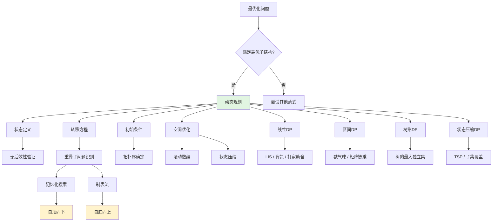
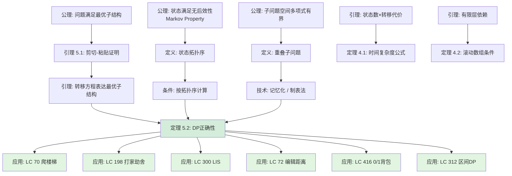

> 📊 **项目全面梳理**：详细的项目结构、模块详解和学习路径，请参阅 [`项目全面梳理-2025.md`](../../项目全面梳理-2025.md)

## 动态规划 / Dynamic Programming

### 摘要 / Executive Summary

- 动态规划（Dynamic Programming, DP）是算法面试中**最高频考点**（约占 ~15%），是解决最优化问题的核心范式。其本质是通过**状态定义**与**转移方程**，将指数级复杂度的递归问题转化为多项式级复杂度的表填问题。
- 本文从**形式化规约**出发，给出 DP 问题实例的四元组定义、最优子结构、重叠子问题与无后效性的严格数学表述，建立从定义到定理的完整正确性证明框架。
- 通过 LeetCode 70/198/300/72/416/312 六道经典题目的形式化规约、核心思路、代码实现与复杂度分析，覆盖线性 DP、二维 DP、区间 DP 与二分优化等核心技巧，展示 DP 在工程与面试中的系统化应用模式。

### 关键术语与符号 / Glossary

| 术语 / Term | 定义 / Definition |
|-------------|-------------------|
| DP 问题实例 DP Problem Instance | 输入 $I=(X, F, f)$，其中 $X$ 为决策序列空间，$F$ 为可行解约束，$f$ 为目标函数 |
| 最优子结构 Optimal Substructure | 问题的最优解包含其子问题的最优解 |
| 重叠子问题 Overlapping Subproblems | 问题的递归分解产生大量重复的子问题 |
| 无后效性 Markov Property / Future Independence | 未来状态仅依赖于当前状态，与历史路径无关 |
| 状态转移方程 State Transition Equation | 描述状态间递推关系的方程 $dp[s] = \text{optimal}\{dp[p] + \text{cost}(p \to s)\}$ |
| 记忆化 Memoization | 自顶向下实现 DP，用哈希表缓存已计算的子问题结果 |
| 制表法 Tabulation | 自底向上实现 DP，按拓扑序填充状态表 |
| 滚动数组 Rolling Array | 利用状态覆盖关系，将多维 DP 数组降维以优化空间 |
| Levenshtein 距离 | 两个字符串之间最小编辑操作数，由 LC 72 定义 |
| 0/1 背包 0/1 Knapsack | 每个物品最多选一次的背包问题，是 DP 的经典模型 |

术语对齐与引用规范：`docs/术语与符号总表.md`，`01-基础理论/00-撰写规范与引用指南.md`

### 目录 / Table of Contents

- [动态规划 / Dynamic Programming](#动态规划--dynamic-programming)
  - [摘要 / Executive Summary](#摘要--executive-summary)
  - [关键术语与符号 / Glossary](#关键术语与符号--glossary)
  - [目录 / Table of Contents](#目录--table-of-contents)
  - [交叉引用与依赖 / Cross-References and Dependencies](#交叉引用与依赖--cross-references-and-dependencies)
  - [1. 形式化定义 / Formal Definitions](#1-形式化定义--formal-definitions)
    - [1.1 DP 问题实例](#11-dp-问题实例)
    - [1.2 最优子结构](#12-最优子结构)
    - [1.3 重叠子问题](#13-重叠子问题)
    - [1.4 无后效性](#14-无后效性)
  - [2. 核心思路与算法框架](#2-核心思路与算法框架--core-ideas-and-algorithm-framework)
    - [2.1 DP 解题六步法](#21-dp-解题六步法)
    - [2.2 四大类 DP](#22-四大类-dp)
    - [2.3 DP vs 贪心 vs 分治 决策树](#23-dp-vs-贪心-vs-分治-决策树)
  - [3. 经典题目详解](#3-经典题目详解--classic-problem-analysis)
  - [4. 复杂度分析体系](#4-复杂度分析体系--complexity-analysis)
  - [5. 正确性证明框架](#5-正确性证明框架--correctness-proof-framework)
  - [6. 思维表征](#6-思维表征--thinking-representations)
  - [7. 常见错误与反模式](#7-常见错误与反模式--common-mistakes-and-anti-patterns)
  - [8. 自测问题](#8-自测问题--self-assessment-questions)
  - [9. 学习目标](#9-学习目标--learning-objectives)
  - [10. 知识导航](#10-知识导航--knowledge-navigation)
  - [参考文献](#参考文献--references)

### 交叉引用与依赖 / Cross-References and Dependencies

**上游理论依赖 / Upstream Dependencies**:

- [`09-算法理论/01-算法基础/06-动态规划理论.md`](../../09-算法理论/01-算法基础/06-动态规划理论.md) — DP 的理论定义、状态建模与优化技巧
- [`09-算法理论/01-算法基础/06-动态规划理论-六维补充.md`](../../09-算法理论/01-算法基础/06-动态规划理论-六维补充.md) — DP 的六维内容补充（概念、属性、关系、解释、论证、形式证明）
- [`04-算法复杂度/01-时间复杂度.md`](../../04-算法复杂度/01-时间复杂度.md) — 时间复杂度 $O/\Omega/\Theta$ 的形式化定义
- [`04-算法复杂度/02-空间复杂度.md`](../../04-算法复杂度/02-空间复杂度.md) — 空间复杂度与滚动数组优化
- [`01-算法基础/02-递归与分治.md`](../../01-算法基础/02-递归与分治.md) — 递归与分治策略的基本框架
- [`01-算法基础/03-贪心算法.md`](../../01-算法基础/03-贪心算法.md) — 贪心选择性质与 DP 的对比

**下游应用 / Downstream Applications**:

- `13-LeetCode算法面试专题/02-算法范式专题/05-二分查找.md` — LIS 的二分优化应用
- `13-LeetCode算法面试专题/03-数据结构专题/04-二叉搜索树.md` — 树形 DP 在 BST 上的应用
- `13-LeetCode算法面试专题/06-面试专题/03-高频Top100-DP与贪心.md` — DP 高频题汇总

---

## 1. 形式化定义 / Formal Definitions

### 1.1 DP 问题实例

**定义 1.1** (DP 问题实例 / DP Problem Instance) [Bellman 1957, CLRS2022]
动态规划问题实例可以形式化地定义为一个三元组：
**Definition 1.1** (DP Problem Instance)
A dynamic programming problem instance can be formally defined as a triple:

$$
I = (X, F, f)
$$

其中 / Where:

- $X$：决策序列空间（Decision Sequence Space），表示所有可能的决策序列集合
- $F \subseteq X$：可行解约束（Feasible Solution Constraint），满足问题条件的决策序列子集
- $f: F \to \mathbb{R}$：目标函数（Objective Function），将可行解映射为实数值

**优化目标 / Optimization Goal**:

$$
\text{find } x^* \in F \text{ such that } f(x^*) = \text{optimal}_{x \in F} f(x)
$$

其中 $\text{optimal}$ 为 $\max$ 或 $\min$，依问题而定。

> **直观解释 / Intuition**: DP 不是具体的算法，而是一种**问题分解范式**。当问题的解可以表示为一系列决策的序列，且这些决策之间存在递推关系时，就可以考虑用 DP 求解。

### 1.2 最优子结构

**定义 1.2** (最优子结构 / Optimal Substructure) [Cormen 2022, §14.1]
问题 $P$ 具有最优子结构，如果其最优解 $S^*$ 可以分解为子解 $S_1^*, S_2^*, \ldots, S_k^*$，且每个 $S_i^*$ 是对应子问题 $P_i$ 的最优解：
**Definition 1.2** (Optimal Substructure)
A problem $P$ exhibits optimal substructure if an optimal solution $S^*$ to $P$ can be decomposed into sub-solutions $S_1^*, \ldots, S_k^*$ where each $S_i^*$ is optimal for subproblem $P_i$:

$$
\text{opt}(P) = f\left(\text{opt}(P_1), \ldots, \text{opt}(P_k)\right)
$$

其中 $f$ 为某个组合函数。

> **判定准则 / Criterion**: 对于最优化问题，最优子结构成立的充分条件是：
>
> 1. 问题的解空间可分解为子问题的解空间的笛卡尔积
> 2. 目标函数具有单调性：子问题的非最优解不会导致原问题的最优解

### 1.3 重叠子问题

**定义 1.3** (重叠子问题 / Overlapping Subproblems) [Cormen 2022]
问题 $P$ 具有重叠子问题性质，如果其递归分解产生的子问题空间中，不同父问题共享相同的子问题：
**Definition 1.3** (Overlapping Subproblems)
A problem $P$ exhibits overlapping subproblems if its recursive decomposition yields a subproblem space where distinct parent problems share identical subproblems:

$$
|\{P' : P' \text{ 是 } P \text{ 的子问题}\}| = O(n^k)
$$

但朴素递归树的节点数为 $\Omega(2^n)$（或更大），其中 $n$ 是问题规模参数。

> **关键洞察 / Key Insight**: 重叠子问题是 DP **用空间换时间** 的理论基础。由于子问题被重复计算，记忆化或制表法可以将时间复杂度从指数级降至多项式级。

### 1.4 无后效性

**定义 1.4** (无后效性 / Markov Property / Future Independence)
状态 $s$ 具有无后效性，如果未来状态的演化仅依赖于当前状态 $s$，而与到达 $s$ 的历史路径无关：
**Definition 1.4** (Future Independence / Markov Property)
A state $s$ satisfies the Markov property if the evolution of future states depends only on $s$ and not on the history of how $s$ was reached:

$$
\Pr(S_{t+1} | S_t, S_{t-1}, \ldots, S_0) = \Pr(S_{t+1} | S_t)
$$

在确定性 DP 中表述为：

$$
dp[s] = g\left(\{dp[p] : p \in \text{pred}(s)\}\right)
$$

其中 $g$ 仅依赖于前驱状态 $p$ 的 DP 值，而不依赖于从初始状态到 $p$ 的路径。

> **与马尔可夫决策过程的联系 / Connection to MDP**: 动态规划是马尔可夫决策过程（MDP）在确定性环境下的特例。无后效性保证了状态定义的充分性——不需要额外的"历史记忆"变量。

---

## 2. 核心思路与算法框架 / Core Ideas and Algorithm Framework

### 2.1 DP 解题六步法

动态规划问题的解决可以系统化地遵循以下六个步骤：

| 步骤 | 内容 | 关键问题 |
|------|------|---------|
| **Step 1** | **判定适用条件** | 是否满足最优子结构？是否有重叠子问题？ |
| **Step 2** | **设计状态** | 用哪些变量描述子问题的特征？状态维度是否足够？ |
| **Step 3** | **推导转移方程** | $dp[s] = \text{optimal}\{dp[p] + \text{cost}\}$ 的具体形式？ |
| **Step 4** | **确定初始条件** | 边界状态（Base Case）的取值？ |
| **Step 5** | **确定计算顺序** | 状态之间的依赖关系是什么？拓扑序如何？ |
| **Step 6** | **空间优化** | 能否使用滚动数组、状态压缩等技巧降维？ |

**Step 1 — 判定适用条件**:

- 检查问题是否为**最优化问题**（求最大/最小/计数）
- 验证**最优子结构**：尝试用反证法或剪切-粘贴法（Cut-and-Paste）证明
- 识别**重叠子问题**：画出递归树，观察是否有大量重复节点

**Step 2 — 设计状态**:

- 状态应满足**无后效性**：未来只依赖当前状态
- 状态维度决定时空复杂度，遵循"**够用即可**"原则
- 常见状态设计：$dp[i]$（线性）、$dp[i][j]$（二维/区间）、$dp[u]$（树形）、$dp[mask]$（状态压缩）

**Step 3 — 推导转移方程**:

- 从**最后一步决策**出发：考虑最优解的最后一个操作是什么
- 枚举所有可能的最后一步，取最优值
- 转移方程的一般形式：

$$
dp[s] = \text{optimal}_{p \in \text{pred}(s)} \{ dp[p] + \text{cost}(p \to s) \}
$$

**Step 4 — 确定初始条件**:

- 边界状态对应"空"或"最小规模"的情况
- 例如：$dp[0] = 0$、$dp[i][0] = i$、$dp[\emptyset] = 0$

**Step 5 — 确定计算顺序**:

- 必须满足**拓扑序**：计算 $dp[s]$ 时，所有前驱状态 $dp[p]$ 已计算完毕
- 线性 DP：从左到右；二维 DP：按行/列；区间 DP：按区间长度；树形 DP：后序遍历

**Step 6 — 空间优化**:

- **滚动数组**：当 $dp[i]$ 只依赖前 $k$ 行时，保留 $k$ 行即可
- **降维技巧**：如 0/1 背包中逆序遍历将二维降为一维
- **状态压缩**：用位掩码表示集合状态，适用于 $n \leq 20$ 的问题

### 2.2 四大类 DP

| 类型 | 状态维度 | 转移方向 | 经典问题 | 时间复杂度 |
|------|---------|---------|---------|-----------|
| **线性 DP** | 一维 $dp[i]$ | 从前向后 | 爬楼梯、LIS、打家劫舍、背包 | $O(n)$–$O(n^2)$ |
| **区间 DP** | 二维 $dp[i][j]$ | 按长度递增 | 矩阵链乘、戳气球、石子合并 | $O(n^3)$ |
| **树形 DP** | 节点 $dp[u]$ | 后序遍历 | 树的最大独立集、树的直径 | $O(n)$–$O(nk)$ |
| **状态压缩 DP** | 子集 $dp[mask]$ | 按 mask 递增 | TSP、棋盘覆盖、子集 DP | $O(2^n \cdot n)$ |

**线性 DP**:

- 状态随单一维度线性推进
- 关键技巧：滚动数组将空间降至 $O(1)$ 或 $O(k)$
- 代表：斐波那契、LIS、最长公共子序列、各类背包

**区间 DP**:

- 状态定义在区间 $[i,j]$ 上
- 关键技巧：枚举分割点 $k$，将大区间分解为小区间
- 填表顺序：按区间长度从小到大
- 代表：矩阵链乘、戳气球、最优二叉搜索树

**树形 DP**:

- 状态定义在树节点上
- 关键技巧：后序遍历确保子节点先于父节点计算
- **换根 DP**：以每个节点为根重新计算，两次 DFS 完成
- 代表：树的最大独立集、树的最小点覆盖、树的直径

**状态压缩 DP**:

- 用位掩码 $mask \in [0, 2^n)$ 表示子集状态
- 关键技巧：位运算枚举子集、超集
- 适用条件：$n \leq 20$（$2^{20} \approx 10^6$）
- 代表：旅行商问题（TSP）、哈密尔顿路径、棋盘覆盖

### 2.3 DP vs 贪心 vs 分治 决策树

```mermaid
flowchart TD
    A[最优化问题] --> B{满足最优子结构?}
    B -->|否| C[尝试暴力搜索 / 启发式算法]
    B -->|是| D{子问题是否重叠?}

    D -->|否| E{满足贪心选择性质?}
    D -->|是| F[使用动态规划 DP]

    E -->|是| G[使用贪心算法]
    E -->|否| H[使用分治算法]

    F --> I{状态维度?}
    I -->|一维序列| J[线性DP]
    I -->|二维网格/双串| K[二维DP]
    I -->|区间合并| L[区间DP]
    I -->|树结构| M[树形DP]
    I -->|子集枚举| N[状态压缩DP]

    J --> O{需要优化?}
    O -->|二分| P[LIS O(n log n)]
    O -->|单调队列| Q[滑动窗口最值]
    O -->|斜率优化| R[凸包优化]

    style F fill:#e1f5e1
    style G fill:#e1f5e1
    style H fill:#e1f5e1
```

**DP vs 贪心 的本质区别**:

| 维度 | 动态规划 | 贪心算法 |
|------|---------|---------|
| 决策方式 | 探索所有子问题，取最优 | 每步做局部最优选择 |
| 正确性依赖 | 最优子结构 + 重叠子问题 | 贪心选择性质 + 最优子结构 |
| 回溯能力 | 保存所有子问题解，可回溯 | 一旦选择不可撤销 |
| 时间复杂度 | 通常 $O(n^2)$ 或更高 | 通常 $O(n)$ 或 $O(n \log n)$ |
| 典型问题 | 背包、LCS、编辑距离 | 活动选择、最小生成树、 Huffman |

> **核心洞察**: 贪心选择性质 $\subset$ 最优子结构。若问题满足贪心选择性质，则贪心比 DP 更高效；否则必须用 DP 探索所有子问题。

---

## 3. 经典题目详解 / Classic Problem Analysis

### 3.1 LeetCode 70 — Climbing Stairs

> **题目链接 / Problem Link**: [LeetCode 70. Climbing Stairs](https://leetcode.com/problems/climbing-stairs/)
> **难度 / Difficulty**: Easy

#### 形式化规约 / Formal Specification

**输入 / Input**: 整数 $n \in [1, 45]$

**输出 / Output**: 爬到第 $n$ 阶的不同方法总数

**前置条件 / Precondition**:

$$
n \geq 1 \quad \land \quad n \leq 45
$$

**后置条件 / Postcondition**:

$$
\text{result} = |\{ (a_1, a_2, \ldots, a_k) : \forall i: a_i \in \{1,2\},\ \sum a_i = n \}|
$$

即返回值等于所有由 1 和 2 组成、和为 $n$ 的序列个数。

#### 核心思路 / Core Idea

最简单的线性 DP。设 $dp[i]$ 为爬到第 $i$ 阶的方法数：

$$
dp[i] = dp[i-1] + dp[i-2]
$$

- $dp[i-1]$: 最后一步跨 1 阶的方法数
- $dp[i-2]$: 最后一步跨 2 阶的方法数

初始条件：$dp[0] = 1, dp[1] = 1$（或按题目 $dp[1]=1, dp[2]=2$）

#### 最优子结构引理 / Optimal Substructure Lemma

**引理 3.1.1** (最优子结构): 设 $f(n)$ 为爬到第 $n$ 阶的方法数，则

$$
f(n) = f(n-1) + f(n-2)
$$

**证明**: 到达第 $n$ 阶的最后一步只能是：

- 从第 $n-1$ 阶跨 1 阶上来，方法数为 $f(n-1)$
- 从第 $n-2$ 阶跨 2 阶上来，方法数为 $f(n-2)$

这两种情况互斥（最后一步的跨法不同）且完备（最后一步只能跨 1 或 2 阶），故 $f(n) = f(n-1) + f(n-2)$。$\square$

#### 代码实现 / Code Implementations

- **Rust**: [`examples/algorithms/src/leetcode/lc0070_climbing_stairs.rs`](../../../../examples/algorithms/src/leetcode/lc0070_climbing_stairs.rs)
- **Python**: [`examples/algorithms-python/src/leetcode/lc0070_climbing_stairs.py`](../../../../examples/algorithms-python/src/leetcode/lc0070_climbing_stairs.py)
- **Go**: [`examples/algorithms-go/leetcode/lc0070_climbing_stairs.go`](../../../../examples/algorithms-go/leetcode/lc0070_climbing_stairs.go)

#### 复杂度分析 / Complexity Analysis

| 指标 / Metric | 值 / Value | 说明 / Note |
|--------------|-----------|------------|
| 时间复杂度 / Time | $O(n)$ | 单次遍历 |
| 空间复杂度 / Space | $O(1)$ | 滚动变量，仅保留前两个状态 |

#### 正确性证明 / Correctness Proof

**定理 3.1.2** (LeetCode 70 正确性): 算法返回 $f(n)$，即爬到第 $n$ 阶的方法数。

**证明** (数学归纳法):

- **基例 / Base Case**:
  - $n = 1$: 算法返回 1（只有 [1]），正确。
  - $n = 2$: 算法返回 2（[1,1], [2]），正确。

- **归纳假设 / Inductive Hypothesis**:
  假设算法对所有 $k < n$ 正确返回 $f(k)$。

- **归纳步骤 / Inductive Step**:
  对 $n \geq 3$，算法维护 `prev2 = f(n-2)`, `prev1 = f(n-1)`，计算：

$$
  \text{curr} = \text{prev1} + \text{prev2} = f(n-1) + f(n-2) = f(n)
  $$

最后一个等号由引理 3.1.1 保证。因此算法正确返回 $f(n)$。$\square$

---

### 3.2 LeetCode 198 — House Robber

> **题目链接 / Problem Link**: [LeetCode 198. House Robber](https://leetcode.com/problems/house-robber/)
> **难度 / Difficulty**: Medium

#### 形式化规约 / Formal Specification

**输入 / Input**: 数组 $nums[0..n-1]$，$nums[i] \geq 0$

**输出 / Output**:

$$
\max \left\{ \sum_{i \in S} nums[i] : S \subseteq [0, n-1],\ \forall i, j \in S: |i - j| \neq 1 \right\}
$$

**前置条件 / Precondition**:

$$
0 \leq n \leq 100 \quad \land \quad \forall i: 0 \leq nums[i] \leq 400
$$

**后置条件 / Postcondition**: 返回不触发报警的最大金额。

#### 核心思路 / Core Idea

线性 DP 的经典模型。设 $dp[i]$ 为前 $i+1$ 间房屋能偷到的最大金额：

$$
dp[i] = \max(dp[i-1],\ dp[i-2] + nums[i])
$$

- 不偷第 $i$ 间：价值为前 $i-1$ 间的最优值 $dp[i-1]$
- 偷第 $i$ 间：第 $i-1$ 间不能偷，价值为前 $i-2$ 间的最优值 $+ nums[i]$

#### 最优子结构引理 / Optimal Substructure Lemma

**引理 3.2.1** (最优子结构): 设 $OPT(i)$ 为前 $i$ 间房屋能偷到的最大金额，则

$$
OPT(i) = \max(OPT(i-1),\ OPT(i-2) + nums[i])
$$

**证明**: 考虑前 $i$ 间房屋的最优解 $S_i^*$：

- **情况 1**: 第 $i$ 间不偷（$i \notin S_i^*$）。则 $S_i^*$ 是前 $i-1$ 间的某个可行解，其价值不可能超过前 $i-1$ 间的最优值 $OPT(i-1)$。反之，前 $i-1$ 间的最优解也是前 $i$ 间的可行解（不包含 $i$），故此种情况最优值为 $OPT(i-1)$。

- **情况 2**: 第 $i$ 间偷（$i \in S_i^*$）。由约束条件，$i-1 \notin S_i^*$。去掉第 $i$ 间后，剩余部分是前 $i-2$ 间的一个可行解，其价值为 $OPT(i-2) + nums[i]$。若剩余部分不是前 $i-2$ 间的最优解，替换为更优解可得到更优的 $S_i^*$，矛盾。

两种情况取最大值即得。$\square$

#### 代码实现 / Code Implementations

- **Rust**: [`examples/algorithms/src/leetcode/lc0198_house_robber.rs`](../../../../examples/algorithms/src/leetcode/lc0198_house_robber.rs)
- **Python**: [`examples/algorithms-python/src/leetcode/lc0198_house_robber.py`](../../../../examples/algorithms-python/src/leetcode/lc0198_house_robber.py)
- **Go**: [`examples/algorithms-go/leetcode/lc0198_house_robber.go`](../../../../examples/algorithms-go/leetcode/lc0198_house_robber.go)

#### 复杂度分析 / Complexity Analysis

| 指标 / Metric | 值 / Value |
|--------------|-----------|
| 时间复杂度 / Time | $O(n)$ |
| 空间复杂度 / Space | $O(1)$（滚动变量） |

#### 正确性证明 / Correctness Proof

**定理 3.2.2** (LeetCode 198 正确性): 算法返回 $OPT(n-1)$。

**证明** (归纳法):

- **基例**:
  - $n = 0$: 返回 0，$OPT(-1) = 0$，正确。
  - $n = 1$: 返回 $nums[0]$，$OPT(0) = nums[0]$，正确。
  - $n = 2$: 返回 $\max(nums[0], nums[1])$，正确。

- **归纳假设**: 假设对所有 $k < i$，算法已正确计算 $OPT(k)$。

- **归纳步骤**: 对第 $i$ 间房屋，算法计算：

$$
  \text{curr} = \max(\text{prev1},\ \text{prev2} + nums[i]) = \max(OPT(i-1),\ OPT(i-2) + nums[i]) = OPT(i)
  $$

最后一个等号由引理 3.2.1 保证。$\square$

---

### 3.3 LeetCode 300 — Longest Increasing Subsequence

> **题目链接 / Problem Link**: [LeetCode 300. Longest Increasing Subsequence](https://leetcode.com/problems/longest-increasing-subsequence/)
> **难度 / Difficulty**: Medium

#### 形式化规约 / Formal Specification

**输入 / Input**: 整数数组 $nums[0..n-1]$

**输出 / Output**:

$$
\max \left\{ |S| : S \subseteq [0, n-1],\ \forall i < j \in S: nums[i] < nums[j] \right\}
$$

**前置条件 / Precondition**:

$$
1 \leq n \leq 2500
$$

**后置条件 / Postcondition**: 返回最长**严格**递增子序列的长度。

#### 核心思路 / Core Idea

本题提供两种解法，展示 DP 的优化路径：

**解法一：$O(n^2)$ 标准 DP**

设 $dp[i]$ 为以 $nums[i]$ 结尾的最长递增子序列长度：

$$
dp[i] = \max_{j < i,\ nums[j] < nums[i]} \{ dp[j] \} + 1
$$

**解法二：$O(n \log n)$ 二分优化**

维护数组 $tails[k]$ = 长度为 $k+1$ 的递增子序列的**最小末尾元素**。由于 $tails$ 严格递增，可用二分查找维护。

#### 最优子结构引理 / Optimal Substructure Lemma

**引理 3.3.1** (LIS 最优子结构): 以 $nums[i]$ 结尾的最长递增子序列，其前缀（去掉 $nums[i]$）必为某个以 $nums[j]$ ($j < i$, $nums[j] < nums[i]$) 结尾的最长递增子序列。

**证明**: 反证法。设 $L$ 为以 $nums[i]$ 结尾的 LIS，其倒数第二个元素为 $nums[j]$。若 $L \setminus \{nums[i]\}$ 不是以 $nums[j]$ 结尾的 LIS，则存在更长的以 $nums[j]$ 结尾的递增子序列 $L'$。将 $nums[i]$ 追加到 $L'$ 得到以 $nums[i]$ 结尾的更长递增子序列，与 $L$ 的定义矛盾。$\square$

#### 二分优化正确性 / Binary Optimization Correctness

**引理 3.3.2** ($tails$ 单调性): $tails$ 数组始终保持严格递增。

**证明**: 若存在 $tails[k] \geq tails[k+1]$，则由 $tails[k+1]$ 的定义，存在长度为 $k+2$ 的递增子序列其末尾元素为 $tails[k+1]$。去掉最后一个元素，得到长度为 $k+1$ 且末尾元素 $< tails[k+1] \leq tails[k]$ 的子序列，与 $tails[k]$ 是"长度为 $k+1$ 的最小末尾"矛盾。$\square$

**定理 3.3.3** (二分优化正确性): $tails$ 的长度始终等于当前找到的最长递增子序列长度。

**证明**:

1. **存在性**: $tails$ 中每个值都对应一个真实存在的递增子序列（由构造过程保证）。
2. **最优性**: 对任意长度 $L$，若存在长度为 $L$ 的递增子序列，则 $tails[L-1]$ 有定义且 $\leq$ 该子序列的末尾元素。因为 $tails[L-1]$ 是所有长度为 $L$ 的子序列中最小的末尾。
3. 因此 $tails$ 的长度不可能小于 LIS 长度；又由存在性，不可能大于 LIS 长度。故两者相等。$\square$

#### 代码实现 / Code Implementations

- **Rust**: [`examples/algorithms/src/leetcode/lc0300_longest_increasing_subsequence.rs`](../../../../examples/algorithms/src/leetcode/lc0300_longest_increasing_subsequence.rs)
- **Python**: [`examples/algorithms-python/src/leetcode/lc0300_longest_increasing_subsequence.py`](../../../../examples/algorithms-python/src/leetcode/lc0300_longest_increasing_subsequence.py)
- **Go**: [`examples/algorithms-go/leetcode/lc0300_longest_increasing_subsequence.go`](../../../../examples/algorithms-go/leetcode/lc0300_longest_increasing_subsequence.go)

#### 复杂度分析 / Complexity Analysis

| 解法 | 时间复杂度 | 空间复杂度 | 适用场景 |
|------|----------|----------|---------|
| 标准 DP | $O(n^2)$ | $O(n)$ | $n \leq 10^4$ |
| 二分优化 | $O(n \log n)$ | $O(n)$ | $n \leq 10^5$ |

---

### 3.4 LeetCode 72 — Edit Distance

> **题目链接 / Problem Link**: [LeetCode 72. Edit Distance](https://leetcode.com/problems/edit-distance/)
> **难度 / Difficulty**: Medium

#### 形式化规约 / Formal Specification（Levenshtein 距离）

**输入 / Input**: 字符串 $word1$（长度 $m$），字符串 $word2$（长度 $n$）

**输出 / Output**: 将 $word1$ 转换为 $word2$ 的最少单字符编辑操作数

**前置条件 / Precondition**:

$$
0 \leq m, n \leq 500
$$

**后置条件 / Postcondition**: 返回值等于 Levenshtein 距离 $d_L(word1, word2)$。

#### 核心思路 / Core Idea

二维 DP 的经典代表。设 $dp[i][j]$ 为 $word1[0..i-1]$ 转换为 $word2[0..j-1]$ 的最小操作数：

$$
dp[i][j] = \begin{cases}
j & i = 0 \\
i & j = 0 \\
dp[i-1][j-1] & i,j > 0 \land word1[i-1] = word2[j-1] \\
1 + \min(dp[i-1][j],\ dp[i][j-1],\ dp[i-1][j-1]) & \text{otherwise}
\end{cases}
$$

- $dp[i-1][j] + 1$: 删除 $word1[i-1]$
- $dp[i][j-1] + 1$: 插入 $word2[j-1]$
- $dp[i-1][j-1] + 1$: 替换（若字符不同）

#### 最优子结构引理 / Optimal Substructure Lemma

**引理 3.4.1** (编辑距离最优子结构): 设 $OPT(i,j)$ 为 $word1[0..i-1]$ 到 $word2[0..j-1]$ 的最优编辑距离。若 $word1[i-1] \neq word2[j-1]$，则最优解的最后一步必为以下三种操作之一，且前缀部分必为对应子问题的最优解：

- **删除** $word1[i-1]$：代价 $1 + OPT(i-1, j)$
- **插入** $word2[j-1]$：代价 $1 + OPT(i, j-1)$
- **替换** $word1[i-1]$ 为 $word2[j-1]$：代价 $1 + OPT(i-1, j-1)$

**证明**: 任何将 $word1[0..i-1]$ 变为 $word2[0..j-1]$ 的编辑序列，其最后一步处理的必然是 $word1[i-1]$ 或 $word2[j-1]$（或两者）。

- 若最后一步删除 $word1[i-1]$，则前面部分是将 $word1[0..i-2]$ 变为 $word2[0..j-1]$ 的编辑序列。若此前缀不是最优的，替换为更优前缀可得到更优的整体解，与 $OPT(i,j)$ 的最优性矛盾。
- 插入与替换的情况同理。

三种情况互斥且完备，取最小值即得。$\square$

#### 代码实现 / Code Implementations

- **Rust**: [`examples/algorithms/src/leetcode/lc0072_edit_distance.rs`](../../../../examples/algorithms/src/leetcode/lc0072_edit_distance.rs)
- **Python**: [`examples/algorithms-python/src/leetcode/lc0072_edit_distance.py`](../../../../examples/algorithms-python/src/leetcode/lc0072_edit_distance.py)
- **Go**: [`examples/algorithms-go/leetcode/lc0072_edit_distance.go`](../../../../examples/algorithms-go/leetcode/lc0072_edit_distance.go)

#### 复杂度分析 / Complexity Analysis

| 指标 / Metric | 值 / Value | 说明 / Note |
|--------------|-----------|------------|
| 时间复杂度 / Time | $O(m \times n)$ | 双重循环填表 |
| 空间复杂度 / Space | $O(n)$ | 滚动数组，仅保留两行 |

#### 正确性证明 / Correctness Proof

**定理 3.4.2** (LeetCode 72 正确性): 算法返回 $OPT(m, n)$。

**证明** (双下标归纳法):

对 $i + j$ 进行归纳。

- **基例 / Base Case**:
  - $i = 0$ 时 $dp[0][j] = j$（全插入），正确。
  - $j = 0$ 时 $dp[i][0] = i$（全删除），正确。

- **归纳假设 / Inductive Hypothesis**:
  假设对所有 $i' + j' < i + j$，算法已正确计算 $dp[i'][j'] = OPT(i', j')$。

- **归纳步骤 / Inductive Step**:
  对 $dp[i][j]$：
  - 若 $word1[i-1] = word2[j-1]$，则 $dp[i][j] = dp[i-1][j-1] = OPT(i-1, j-1) = OPT(i, j)$（最后一个等号：相同字符无需操作）。
  - 否则由引理 3.4.1：

$$
    dp[i][j] = 1 + \min(dp[i-1][j], dp[i][j-1], dp[i-1][j-1])
    $$

由归纳假设：

$$
    = 1 + \min(OPT(i-1,j), OPT(i,j-1), OPT(i-1,j-1)) = OPT(i,j)
    $$

因此算法正确。$\square$

---

### 3.5 LeetCode 416 — Partition Equal Subset Sum

> **题目链接 / Problem Link**: [LeetCode 416. Partition Equal Subset Sum](https://leetcode.com/problems/partition-equal-subset-sum/)
> **难度 / Difficulty**: Medium

#### 形式化规约 / Formal Specification（0/1 背包判定）

**输入 / Input**: 正整数数组 $nums[0..n-1]$

**输出 / Output**:

$$
\exists S \subseteq [0, n-1]: \sum_{i \in S} nums[i] = \sum_{i \notin S} nums[i]
$$

**前置条件 / Precondition**:

$$
1 \leq n \leq 200 \quad \land \quad 1 \leq nums[i] \leq 100
$$

**后置条件 / Postcondition**: 返回 `true` 当且仅当数组可被均分为两个和相等的子集。

#### 核心思路 / Core Idea

**问题转化**：设 $sum = \sum nums[i]$。若 $sum$ 为奇数，直接返回 `false`。否则问题转化为：

> **能否从 $nums$ 中选出一个子集，使其和为 $target = sum / 2$？**

这正是 **0/1 背包的判定版本**：物品重量 $= nums[i]$，背包容量 $= target$，每个物品最多选一次。

设 $dp[w]$ 表示能否凑出重量 $w$：

$$
dp[w] = dp[w] \lor (w \geq nums[i] \land dp[w - nums[i]])
$$

**关键技巧 — 逆序遍历**：0/1 背包中每个物品只能选一次，逆序更新保证 $dp[w - nums[i]]$ 仍是"前一个物品"的状态。

#### 最优子结构引理 / Optimal Substructure Lemma

**引理 3.5.1** (0/1 背包判定最优子结构): 前 $i$ 个物品能凑出重量 $w$，当且仅当：

- 前 $i-1$ 个物品已能凑出 $w$（不选第 $i$ 个），或
- $w \geq nums[i]$ 且前 $i-1$ 个物品能凑出 $w - nums[i]$（选第 $i$ 个）。

**证明**: 前 $i$ 个物品的任意可行子集 $S$ 对第 $i$ 个物品只有两种选择：

- $i \notin S$: 则 $S$ 是前 $i-1$ 个物品凑出 $w$ 的子集。
- $i \in S$: 则 $S \setminus \{i\}$ 是前 $i-1$ 个物品凑出 $w - nums[i]$ 的子集。

两种情况互斥且完备。$\square$

#### 代码实现 / Code Implementations

- **Rust**: [`examples/algorithms/src/leetcode/lc0416_partition_equal_subset_sum.rs`](../../../../examples/algorithms/src/leetcode/lc0416_partition_equal_subset_sum.rs)
- **Python**: [`examples/algorithms-python/src/leetcode/lc0416_partition_equal_subset_sum.py`](../../../../examples/algorithms-python/src/leetcode/lc0416_partition_equal_subset_sum.py)
- **Go**: [`examples/algorithms-go/leetcode/lc0416_partition_equal_subset_sum.go`](../../../../examples/algorithms-go/leetcode/lc0416_partition_equal_subset_sum.go)

#### 复杂度分析 / Complexity Analysis

| 指标 / Metric | 值 / Value | 说明 / Note |
|--------------|-----------|------------|
| 时间复杂度 / Time | $O(n \times target)$ | $target = sum / 2 \leq 100 \times 200 / 2 = 10^4$ |
| 空间复杂度 / Space | $O(target)$ | 一维布尔数组 |

#### 正确性证明 / Correctness Proof

**定理 3.5.2** (LeetCode 416 正确性): 算法返回 `true` 当且仅当存在子集和为 $sum/2$。

**证明** (归纳法):

- **基例**: $dp[0] = \text{true}$（空集和为 0），$dp[w>0] = \text{false}$，正确。
- **归纳假设**: 处理完前 $i-1$ 个物品后，$dp[w]$ 正确反映前 $i-1$ 个物品能否凑出 $w$。
- **归纳步骤**: 处理第 $i$ 个物品时，逆序更新：

$$
  dp_{\text{new}}[w] = dp_{\text{old}}[w] \lor dp_{\text{old}}[w - nums[i]]
  $$

由引理 3.5.1，这恰好是前 $i$ 个物品能否凑出 $w$ 的判定。

逆序遍历保证 $dp_{\text{old}}[w - nums[i]]$ 是前 $i-1$ 个物品的状态（尚未被当前物品更新），从而确保每个数字最多被选一次。$\square$

---

### 3.6 LeetCode 312 — Burst Balloons

> **题目链接 / Problem Link**: [LeetCode 312. Burst Balloons](https://leetcode.com/problems/burst-balloons/)
> **难度 / Difficulty**: Hard

#### 形式化规约 / Formal Specification

**输入 / Input**: 数组 $nums[0..n-1]$，$nums[i] > 0$

**输出 / Output**:

$$
\max_{\text{戳破顺序}} \sum_{\text{每次戳破 } i} nums[\text{left}] \times nums[i] \times nums[\text{right}]
$$

**前置条件 / Precondition**:

$$
1 \leq n \leq 300 \quad \land \quad 0 \leq nums[i] \leq 100
$$

**后置条件 / Postcondition**: 返回最大可获得硬币数。

#### 核心思路 / Core Idea

**区间 DP** 的经典难题。正向思考"戳气球"会导致相邻关系动态变化，状态设计困难。

**关键技巧 — 逆向思考**：假设所有气球已戳破，现在逐个"添加"气球回来。
最后添加的气球 $k$ 将区间分为 $[i,k]$ 和 $[k,j]$，获得硬币 $val[i] \times val[k] \times val[j]$。

在数组两端添加虚拟气球 $val[0] = val[n+1] = 1$。

设 $dp[i][j]$ = 开区间 $(i, j)$ 内所有气球戳破能获得的最大硬币数：

$$
dp[i][j] = \max_{i < k < j} \{ dp[i][k] + dp[k][j] + val[i] \cdot val[k] \cdot val[j] \}
$$

#### 最优子结构引理 / Optimal Substructure Lemma

**引理 3.6.1** (戳气球最优子结构): 设 $k$ 为开区间 $(i,j)$ 内最后一个被戳破的气球，则

$$
OPT(i,j) = OPT(i,k) + OPT(k,j) + val[i] \cdot val[k] \cdot val[j]
$$

**证明**: 当 $k$ 是 $(i,j)$ 内最后一个被戳破的气球时，此时 $i$ 和 $j$ 必然相邻于 $k$ 两侧（因为 $(i,k)$ 和 $(k,j)$ 内的气球都已被戳破）。因此戳破 $k$ 获得的硬币恰好为 $val[i] \cdot val[k] \cdot val[j]$。

而 $(i,k)$ 和 $(k,j)$ 的戳破顺序相互独立：先戳完 $(i,k)$ 再戳完 $(k,j)$（或反之），最后戳 $k$。若任一子区间的戳破顺序不是最优的，替换为更优子解可提升整体解，与 $OPT(i,j)$ 的最优性矛盾。$\square$

#### 代码实现 / Code Implementations

- **Rust**: [`examples/algorithms/src/leetcode/lc0312_burst_balloons.rs`](../../../../examples/algorithms/src/leetcode/lc0312_burst_balloons.rs)
- **Python**: [`examples/algorithms-python/src/leetcode/lc0312_burst_balloons.py`](../../../../examples/algorithms-python/src/leetcode/lc0312_burst_balloons.py)
- **Go**: [`examples/algorithms-go/leetcode/lc0312_burst_balloons.go`](../../../../examples/algorithms-go/leetcode/lc0312_burst_balloons.go)

#### 复杂度分析 / Complexity Analysis

| 指标 / Metric | 值 / Value | 说明 / Note |
|--------------|-----------|------------|
| 时间复杂度 / Time | $O(n^3)$ | 区间长度 $(n) \times$ 起点 $(n) \times$ 分割点 $(n)$ |
| 空间复杂度 / Space | $O(n^2)$ | 二维 DP 表 |

#### 正确性证明 / Correctness Proof

**定理 3.6.2** (LeetCode 312 正确性): 算法返回最大硬币数。

**证明** (区间长度归纳法):

对区间长度 $len = j - i$ 进行归纳。

- **基例**: $len = 1$（即 $j = i + 1$），开区间 $(i,j)$ 内无气球，$dp[i][j] = 0$，正确。

- **归纳假设**: 假设对所有长度 $< len$ 的区间，$dp[i][j]$ 已正确计算为 $OPT(i,j)$。

- **归纳步骤**: 对长度 $len$ 的区间 $(i,j)$，算法枚举最后一个被戳破的气球 $k \in (i,j)$：

$$
  dp[i][j] = \max_{i < k < j} \{ dp[i][k] + dp[k][j] + val[i] \cdot val[k] \cdot val[j] \}
  $$

由归纳假设，$dp[i][k] = OPT(i,k)$，$dp[k][j] = OPT(k,j)$。由引理 3.6.1：

$$
  dp[i][j] = \max_{i < k < j} \{ OPT(i,k) + OPT(k,j) + val[i] \cdot val[k] \cdot val[j] \} = OPT(i,j)
  $$

因此算法正确。$\square$

---

## 4. 复杂度分析体系 / Complexity Analysis

### 4.1 时间复杂度通用公式

**定理 4.1** (DP 时间复杂度通用公式) [CLRS2022]
对于动态规划算法，其时间复杂度可表示为：

$$
T = \text{状态数} \times \text{单状态转移代价}
$$

**证明**: DP 算法的核心操作是填充状态表。每个状态需要计算一次，每次计算需要枚举所有前驱状态并执行常数次操作。若状态总数为 $S$，每个状态平均需要考察 $D$ 个前驱，则：

$$
T(n) = O(S \times D)
$$

> 关于渐进记号 $O(\cdot)$ 的严格定义与代数性质，参见 [时间复杂度分析文档](../../04-算法复杂度/01-时间复杂度.md) §2.1。

### 4.2 六道经典题复杂度汇总

| 题目 | 状态数 | 单状态转移 | 时间复杂度 | 空间复杂度 | 优化技巧 |
|------|--------|-----------|-----------|-----------|---------|
| LC 70 爬楼梯 | $O(n)$ | $O(1)$ | $O(n)$ | $O(1)$ | 滚动变量 |
| LC 198 打家劫舍 | $O(n)$ | $O(1)$ | $O(n)$ | $O(1)$ | 滚动变量 |
| LC 300 LIS (DP) | $O(n)$ | $O(n)$ | $O(n^2)$ | $O(n)$ | — |
| LC 300 LIS (二分) | $O(n)$ | $O(\log n)$ | $O(n \log n)$ | $O(n)$ | 维护 $tails$ 数组 |
| LC 72 编辑距离 | $O(mn)$ | $O(1)$ | $O(mn)$ | $O(n)$ | 滚动数组（两行） |
| LC 416 分割等和子集 | $O(n \cdot target)$ | $O(1)$ | $O(n \cdot target)$ | $O(target)$ | 逆序遍历降维 |
| LC 312 戳气球 | $O(n^2)$ | $O(n)$ | $O(n^3)$ | $O(n^2)$ | — |

### 4.3 空间优化：滚动数组条件

**定理 4.2** (滚动数组适用条件)
若状态转移方程中 $dp[i]$ 仅依赖于有限个前序层的状态（如 $dp[i-1], dp[i-2]$），则可以将空间复杂度从 $O(n \cdot k)$ 降至 $O(k)$。

**示例**: 0/1 背包的二维方程为 $dp[i][w] = \max(dp[i-1][w], dp[i-1][w-w_i] + v_i)$。由于第 $i$ 行仅依赖第 $i-1$ 行，可以压缩为一维数组。逆序遍历保证 $dp[w - w_i]$ 仍为旧值（第 $i-1$ 行），从而正确实现 0/1 背包的"每个物品只选一次"约束。

---

## 5. 正确性证明框架 / Correctness Proof Framework

### 5.1 引理：最优子结构

**引理 5.1** (通用最优子结构) [Cormen 2022]
设 $P$ 为具有最优子结构的最优化问题，$S^*$ 为 $P$ 的最优解。若 $S^*$ 的某个决策将 $P$ 分解为子问题 $P_1, \ldots, P_k$，则 $S^*$ 在每个子问题 $P_i$ 上的限制 $S^*_i$ 必是 $P_i$ 的最优解。

**证明** (剪切-粘贴法 / Cut-and-Paste):
反证法。假设存在某个子问题 $P_j$ 使得 $S^*_j$ 不是最优的，则存在 $P_j$ 的更优解 $S'_j$ 满足 $f(S'_j) > f(S^*_j)$（假设求最大）。将 $S^*$ 中对应 $P_j$ 的部分替换为 $S'_j$，得到 $P$ 的新解 $S'$。由于其他子问题不变，$f(S') = f(S^*) - f(S^*_j) + f(S'_j) > f(S^*)$，与 $S^*$ 的最优性矛盾。$\square$

### 5.2 定理：DP 正确性

**定理 5.2** (动态规划正确性定理)
对于满足最优子结构和重叠子问题的最优化问题，若：

1. 状态设计满足无后效性；
2. 状态转移方程正确表达了最优子结构；
3. 初始条件（边界状态）取值正确；
4. 计算顺序遵循状态的拓扑序；

则按该 DP 算法计算出的 $dp[s] = OPT(s)$ 对所有状态 $s$ 成立。

**证明** (对状态拓扑序归纳):

设状态的拓扑序为 $s_1, s_2, \ldots, s_N$。

- **基例 / Base Case**: 对无前驱的边界状态 $s_1$，由条件 3，$dp[s_1]$ 直接赋值为 $OPT(s_1)$，正确。

- **归纳假设 / Inductive Hypothesis**: 假设对所有 $k < t$，$dp[s_k] = OPT(s_k)$ 成立。

- **归纳步骤 / Inductive Step**: 对状态 $s_t$，其转移方程为：

$$
  dp[s_t] = \text{optimal}_{p \in \text{pred}(s_t)} \{ dp[p] + \text{cost}(p \to s_t) \}
  $$

由条件 4，所有前驱 $p$ 已在拓扑序中先于 $s_t$ 计算，故由归纳假设 $dp[p] = OPT(p)$。由条件 2 和引理 5.1：

$$
  dp[s_t] = \text{optimal}_{p} \{ OPT(p) + \text{cost}(p \to s_t) \} = OPT(s_t)
  $$

因此对所有状态 $dp[s] = OPT(s)$。$\square$

### 5.3 Mermaid 证明树

```mermaid
flowchart TD
    A[公理: 问题满足最优子结构] --> B[引理 5.1: 剪切-粘贴法证明]
    C[公理: 状态满足无后效性] --> D[定义: 状态拓扑序]
    E[条件: 边界状态正确初始化] --> F[归纳基例: dp[s_1] = OPT]

    B --> G[引理: 转移方程表达最优子结构]
    D --> H[条件: 按拓扑序计算]
    G --> I[归纳步骤: dp[s_t] = OPT]
    H --> I
    F --> I

    I --> J[定理 5.2: DP 正确性<br/>dp[s] = OPT(s) 对所有 s]

    style A fill:#e1f5e1
    style C fill:#e1f5e1
    style E fill:#e1f5e1
    style F fill:#e1f5e1
    style J fill:#d4edda
```

---

## 6. 思维表征 / Thinking Representations

### 6.1 概念依赖图



### 6.2 决策树：最优化问题范式选择

```mermaid
flowchart TD
    Start[最优化问题] --> Q1{满足最优子结构?}
    Q1 -->|否| A1[暴力搜索 / 启发式 / 近似算法]
    Q1 -->|是| Q2{子问题重叠?}

    Q2 -->|否| Q3{满足贪心选择性质?}
    Q2 -->|是| Q4[使用动态规划]

    Q3 -->|是| A2[贪心算法 O(n log n)]
    Q3 -->|否| A3[分治算法]

    Q4 --> Q5{状态维度?}
    Q5 -->|一维序列| B1[线性DP]
    Q5 -->|二维网格/双串| B2[二维DP]
    Q5 -->|区间合并| B3[区间DP]
    Q5 -->|树结构| B4[树形DP]
    Q5 -->|子集枚举| B5[状态压缩DP]

    B1 --> C1[遍历方向: 从前向后]
    B2 --> C2[遍历方向: 按行/列]
    B3 --> C3[遍历方向: 按长度递增]
    B4 --> C4[遍历方向: 后序DFS]
    B5 --> C5[遍历方向: mask递增]

    style Q4 fill:#e1f5e1
    style A2 fill:#e1f5e1
```

### 6.3 多维矩阵：六道经典题对比

| 维度 / Dimension | LC 70 爬楼梯 | LC 198 打家劫舍 | LC 300 LIS | LC 72 编辑距离 | LC 416 分割等和 | LC 312 戳气球 |
|----------------|-------------|----------------|-----------|--------------|----------------|--------------|
| **DP 类型** | 线性 DP | 线性 DP | 线性 DP + 二分 | 二维 DP | 0/1 背包（布尔） | 区间 DP |
| **状态定义** | $dp[i]$ | $dp[i]$ | $dp[i]$ / $tails[k]$ | $dp[i][j]$ | $dp[w]$ | $dp[i][j]$ |
| **转移方向** | $i-1, i-2 \to i$ | $i-1, i-2 \to i$ | $j < i \to i$ | 左/上/左上 $\to$ 当前 | 逆序 $w \to w$ | 小区间 $\to$ 大区间 |
| **最优子结构** | 最后一步跨法 | 偷/不偷第 $i$ 间 | 以 $nums[i]$ 结尾 | 最后编辑操作 | 选/不选物品 $i$ | 最后添加的气球 $k$ |
| **时间复杂度** | $O(n)$ | $O(n)$ | $O(n^2)$ / $O(n \log n)$ | $O(mn)$ | $O(n \cdot target)$ | $O(n^3)$ |
| **空间复杂度** | $O(1)$ | $O(1)$ | $O(n)$ | $O(n)$ | $O(target)$ | $O(n^2)$ |
| **优化技巧** | 滚动变量 | 滚动变量 | 二分维护 $tails$ | 滚动数组（两行） | 逆序遍历降维 | — |
| **证明方法** | 数学归纳法 | 数学归纳法 | 反证法 + 单调性 | 双下标归纳法 | 单下标归纳法 | 区间长度归纳法 |

### 6.4 思维导图：DP 四大分支

```mermaid
mindmap
  root((动态规划<br/>Dynamic Programming))
    线性DP
      一维序列
        爬楼梯
        打家劫舍
        斐波那契
      背包问题
        0/1背包
        完全背包
        多重背包
      子序列问题
        LIS O(n^2)
        LIS O(n log n)
        LCS
    区间DP
      状态定义
        dp[i][j] = 区间[i,j]最优值
      经典问题
        戳气球
        矩阵链乘
        石子合并
        最优二叉搜索树
      填表顺序
        按区间长度递增
    树形DP
      状态定义
        dp[u] = 以u为根的子树最优值
      经典问题
        树的最大独立集
        树的最小点覆盖
        树的直径
        换根DP
      遍历顺序
        后序DFS
    状态压缩DP
      状态定义
        dp[mask] = 子集mask的最优值
      经典问题
        TSP
        哈密尔顿路径
        棋盘覆盖
      适用条件
        n <= 20
      优化技巧
        位运算枚举子集
        轮廓线DP
    优化技术
      空间优化
        滚动数组
        降维技巧
      时间优化
        二分优化
        单调队列
        斜率优化
        Knuth优化
```

### 6.5 证明决策树：从定义到定理的推理链



---

## 7. 常见错误与反模式 / Common Mistakes and Anti-Patterns

### 7.1 状态设计维度不足/过多

**错误 / Mistake**: 状态缺少必要的维度，导致无后效性被破坏；或状态维度过多，导致时空复杂度爆炸。

**示例 7.1.1 — 维度不足**: 在 LIS 问题中，若只设计 $dp[i]$ = 前 $i$ 个元素的 LIS 长度（而非"以 $i$ 结尾"），则转移时无法保证递增性，因为不知道 LIS 的末尾元素是什么。

**修复 / Fix**: 状态必须包含决策所需的全部信息。LIS 的状态应定义为"以 $i$ 结尾"，这样转移时才能比较 $nums[j] < nums[i]$。

**示例 7.1.2 — 维度过多**: 在某些背包问题中，同时记录"重量"和"价值"和"物品编号"三维，导致 $O(n^3)$ 复杂度。实际上通常只需要两维。

### 7.2 遍历顺序错误（0/1 背包 vs 完全背包）

**错误 / Mistake**: 0/1 背包使用正序遍历，导致物品被重复选取。

```python
# ❌ 错误：0/1 背包正序遍历（变成完全背包）
for i in range(n):
    for w in range(weights[i], target + 1):  # 正序！
        dp[w] = max(dp[w], dp[w - weights[i]] + values[i])
```

**正确做法 / Correct Approach**:

| 背包类型 | 遍历方向 | 原因 |
|---------|---------|------|
| **0/1 背包** | 逆序 $w = target \to weights[i]$ | 保证 $dp[w - w_i]$ 是"上一个物品"的状态 |
| **完全背包** | 正序 $w = weights[i] \to target$ | 允许 $dp[w - w_i]$ 已被"当前物品"更新，即无限选取 |

```python
# ✅ 正确：0/1 背包逆序遍历
for i in range(n):
    for w in range(target, weights[i] - 1, -1):  # 逆序！
        dp[w] = max(dp[w], dp[w - weights[i]] + values[i])
```

### 7.3 空间优化时覆盖未使用状态

**错误 / Mistake**: 在二维 DP 降维为一维时，未正确保留后续计算需要的旧值。

**示例**: 编辑距离中，若只使用一维数组且未正确保存对角线元素（$dp[i-1][j-1]$），会导致替换操作的计算错误。

**修复**: 滚动数组需要明确区分"当前行"和"上一行"。在编辑距离中：

- `prev[j]` 保存 $dp[i-1][j]$（上一行）
- `curr[j]` 保存 $dp[i][j]$（当前行）
- `prev[j-1]` 即为 $dp[i-1][j-1]$（对角线）

每次内层循环结束后交换 `prev` 和 `curr`。

### 7.4 树形 DP 中"换根"技巧的形式化描述

**问题 / Problem**: 树形 DP 通常先任选一个根（如节点 0）进行一次后序 DFS 计算 $dp[u]$。但某些问题要求以**每个节点为根**时的最优值。

**换根 DP 的形式化**:

设 $dp_1[u]$ 为以 $u$ 为根的子树的最优值（第一次 DFS）。
设 $dp_2[u]$ 为以 $u$ 为整棵树的根时的最优值。

**第二次 DFS（换根）的状态转移**:

$$
dp_2[v] = g(dp_2[u],\ dp_1[u],\ dp_1[v])
$$

其中 $g$ 为"撤销 $v$ 对 $u$ 的贡献，然后将 $u$ 作为 $v$ 的子树重新计算"的函数。

**关键条件**: $g$ 必须满足**可逆性**——能够从父节点的整体最优值中"减去"某个子树的贡献，然后以该子节点为新根重新"加上"父节点部分的贡献。

**常见错误**: 假设 $dp_2[v] = dp_2[u] + \text{something}$，而未正确撤销 $v$ 在原树中的贡献，导致重复计算。

---

## 8. 自测问题 / Self-Assessment Questions

### 问题 1：最长简单路径为什么不能用 DP？

**Q**: 为什么求有向无环图（DAG）中两点间的最长简单路径不能直接用 DP？

**A**: 最长路径问题**不满足最优子结构**。

反例：考虑图 $A \to B \to C$ 和 $A \to D \to C$，边权均为 1。$A$ 到 $C$ 的最长路径为 $A \to B \to C$（长度 2），但其子路径 $A \to B$ 不是 $A$ 到 $B$ 的最长路径（因为 $A \to B$ 本身就是唯一路径）。更本质的原因：**最长路径的子路径不一定是最长路径**，因为最长路径问题中子路径之间可能存在"冲突"（共享顶点），导致无法独立优化。

这与最短路径形成对比：最短路径的子路径必为最短路径（无负权环时），因此可用 DP（即 DAG 最短路径算法）。

---

### 问题 2：0/1 背包与完全背包的遍历顺序差异？

**Q**: 为什么 0/1 背包要逆序遍历，而完全背包要正序遍历？

**A**: 核心差异在于**每个物品的使用次数限制**。

- **0/1 背包**（逆序）：计算 $dp[w]$ 时，需要 $dp[w - w_i]$ 为"前 $i-1$ 个物品"的状态。逆序确保在更新 $dp[w]$ 时，$dp[w - w_i]$ 尚未被当前物品更新，从而保证每个物品最多选一次。
- **完全背包**（正序）：计算 $dp[w]$ 时，需要 $dp[w - w_i]$ 可以是"已选过当前物品"的状态。正序允许 $dp[w - w_i]$ 已被当前物品更新，从而实现无限次选取。

形式化地，逆序保证了状态转移的"时间戳"满足 $dp_{\text{new}}[w] = f(dp_{\text{old}}[w], dp_{\text{old}}[w - w_i])$，而正序满足 $dp_{\text{new}}[w] = f(dp_{\text{old}}[w], dp_{\text{new}}[w - w_i])$。

---

### 问题 3：树形 DP 换根技巧的形式化？

**Q**: 如何用形式化语言描述树形 DP 的"换根"技巧？

**A**: 换根 DP 的核心是**状态的可逆聚合**。

设第一次 DFS 得到 $dp_1[u]$ = 以 $u$ 为根的子树的最优值。
第二次 DFS 从根出发，父节点 $u$ 向子节点 $v$ 传递 $dp_2[u]$ = 以 $u$ 为整棵树根的最优值。

换根公式为：

$$
dp_2[v] = \text{recompute}(v,\ \text{decompose}(dp_2[u],\ dp_1[v]))
$$

其中：

- $\text{decompose}(X, Y)$: 从以 $u$ 为根的聚合值 $X$ 中，移除以 $v$ 为根的子树贡献 $Y$，得到"$u$ 的其余部分"的聚合值
- $\text{recompute}(v, Z)$: 将 $v$ 作为新根，把 $Z$（原父节点的其余部分）作为 $v$ 的一个新子树，重新计算

**适用条件**: 聚合函数必须满足**可逆性**，即能够从整体中分离出某个子树的贡献。例如求和、计数等满足；而取最值在某些情况下不满足（需要额外记录次大值等）。

---

### 问题 4：状态压缩 DP 的适用条件？

**Q**: 状态压缩 DP 适用于什么类型的问题？其状态规模的上界是多少？

**A**: 状态压缩 DP 适用于**子集选择类问题**，即决策空间可以表示为 $n$ 个元素的子集。

**适用条件**:

1. $n \leq 20$（$2^{20} \approx 10^6$，在可接受范围内）
2. 子集之间的转移可以通过位运算高效实现
3. 无后效性在子集层面成立

**状态规模**: $O(2^n \cdot n)$ 或 $O(2^n \cdot n^2)$，取决于转移代价。

**典型问题**: 旅行商问题（TSP）、哈密尔顿路径、棋盘覆盖、子集和计数。

---

### 问题 5：如何判断一个问题该用 DP 还是贪心？

**Q**: 面对一个最优化问题，如何系统地判断应该用 DP 还是贪心？

**A**: 遵循以下判定流程：

1. **检查最优子结构**：若最优子结构不成立，则 DP 和贪心都不适用。
2. **检查贪心选择性质**：若存在"局部最优选择必然属于全局最优解"的性质，则用贪心（如活动选择、最小生成树）。
3. **检查重叠子问题**：若子问题重叠，用 DP；若不重叠，用分治。

**形式化区分**:

- 贪心选择性质要求：对问题的任意实例，都存在一个最优解包含某个"显而易见"的局部最优选择。
- DP 只需最优子结构：全局最优解由子问题最优解构成，但不要求某个特定的局部选择必然属于最优解。

例如，0/1 背包不具有贪心选择性质（按价值密度排序选取是错误的），但具有最优子结构，因此必须用 DP。

---

### 问题 6：LC 300 LIS 二分优化中，$tails$ 数组为什么保持递增？

**Q**: 在 LIS 的 $O(n \log n)$ 二分优化中，为什么 $tails[k]$（长度为 $k+1$ 的递增子序列的最小末尾）始终保持严格递增？

**A**: 反证法。假设存在 $tails[k] \geq tails[k+1]$。由 $tails[k+1]$ 的定义，存在某个长度为 $k+2$ 的递增子序列 $S$，其末尾元素为 $tails[k+1]$。去掉 $S$ 的最后一个元素，得到一个长度为 $k+1$ 的递增子序列 $S'$，其末尾元素 $< tails[k+1] \leq tails[k]$。这与 $tails[k]$ 是"所有长度为 $k+1$ 的递增子序列中最小的末尾元素"矛盾。因此 $tails[k] < tails[k+1]$ 恒成立。$\square$

---

### 问题 7：编辑距离的替换操作为什么代价是 1 而不是 2？

**Q**: 在编辑距离中，替换一个字符的代价为什么是 1（而不是"先删除再插入"的代价 2）？

**A**: 这是 Levenshtein 距离的**定义选择**。标准 Levenshtein 距离将替换视为一种独立的原子操作，代价为 1。若将替换视为"删除 + 插入"，则得到的是另一种距离度量（有时称为 LCS 距离）。

在 LC 72 的标准定义中，三种操作的代价均为 1，因此：

- 替换：$dp[i][j] = dp[i-1][j-1] + 1$
- 删除 + 插入：$dp[i][j] = dp[i-1][j] + 1 + 1 = dp[i-1][j] + 2$（或其他两步路径）

由于 $dp[i-1][j-1] + 1 \leq dp[i-1][j] + 2$（由三角不等式），标准 DP 会自动选择替换作为更优路径。

---

### 问题 8：区间 DP 为什么按长度递增填表？

**Q**: 在戳气球等区间 DP 中，为什么必须按区间长度从小到大的顺序填表？

**A**: 因为状态转移方程中 $dp[i][j]$ 依赖于更小区间 $dp[i][k]$ 和 $dp[k][j]$（其中 $i < k < j$）。

区间 $(i,k)$ 和 $(k,j)$ 的长度分别为 $k - i$ 和 $j - k$，均严格小于 $j - i$（即区间 $(i,j)$ 的长度）。因此，只要所有长度 $< j - i$ 的区间已计算完毕，计算 $dp[i][j]$ 时所有依赖状态就都已就绪。

按长度递增填表，正是对区间包含关系（一种偏序）的拓扑排序。

---

## 9. 学习目标 / Learning Objectives

完成本章学习后，读者应能够：

1. **形式化描述** DP 问题实例，写出三元组 $(X, F, f)$、前置条件与后置条件。
2. **严格证明**最优子结构引理，使用剪切-粘贴法或反证法。
3. **独立推导**状态转移方程，从"最后一步决策"出发进行系统性分析。
4. **熟练运用** DP 解题六步法解决具体题目，并正确选择 DP 类型（线性/区间/树形/状压）。
5. **准确判断** 0/1 背包与完全背包的遍历顺序差异，并解释其原理。
6. **完整证明** DP 算法的正确性，使用数学归纳法或区间归纳法。
7. **有效实施**空间优化（滚动数组、逆序遍历），并验证优化后的正确性。
8. **清晰区分** DP、贪心与分治的适用场景，绘制决策树进行范式选择。

---

## 10. 知识导航 / Knowledge Navigation

**上游理论**:

- [09-算法理论/01-算法基础/06-动态规划理论.md](../../09-算法理论/01-算法基础/06-动态规划理论.md) — DP 理论定义、状态建模与优化技巧
- [09-算法理论/01-算法基础/06-动态规划理论-六维补充.md](../../09-算法理论/01-算法基础/06-动态规划理论-六维补充.md) — 六维内容补充
- [04-算法复杂度/01-时间复杂度.md](../../04-算法复杂度/01-时间复杂度.md) — 时间复杂度形式化定义
- [01-算法基础/02-递归与分治.md](../../01-算法基础/02-递归与分治.md) — 递归与分治框架

**同层专题**:

- [05-二分查找.md](./05-二分查找.md) — LIS 的二分优化应用
- [06-双指针.md](./06-双指针.md) — 双指针与 DP 的联合应用

**下游应用**:

- [../03-数据结构专题/04-二叉搜索树.md](../03-数据结构专题/04-二叉搜索树.md) — 树形 DP
- [../06-面试专题/03-高频Top100-DP与贪心.md](../06-面试专题/03-高频Top100-DP与贪心.md) — DP 高频题汇总

---

## 参考文献 / References

1. **[Bellman1957]** Bellman, R. (1957). *Dynamic Programming*. Princeton University Press. ISBN: 978-0691079516
2. **[CLRS2022]** Cormen, T. H., Leiserson, C. E., Rivest, R. L., & Stein, C. (2022). *Introduction to Algorithms* (4th ed.). MIT Press. ISBN: 978-0262046305
3. **[KleinbergTardos2006]** Kleinberg, J., & Tardos, É. (2006). *Algorithm Design*. Pearson. ISBN: 978-0321295354
4. **[Bertsekas2012]** Bertsekas, D. P. (2012). *Dynamic Programming and Optimal Control* (4th ed.). Athena Scientific. ISBN: 978-1886529264
5. **[Erickson2019]** Erickson, J. (2019). *Algorithms*. Self-published. <https://jeffe.cs.illinois.edu/teaching/algorithms/>
6. **[SedgewickWayne2011]** Sedgewick, R., & Wayne, K. (2011). *Algorithms* (4th ed.). Addison-Wesley. ISBN: 978-0321573513

**Wiki 概念对齐**:

- [Dynamic Programming](https://en.wikipedia.org/wiki/Dynamic_programming)
- [Optimal Substructure](https://en.wikipedia.org/wiki/Optimal_substructure)
- [Overlapping Subproblems](https://en.wikipedia.org/wiki/Overlapping_subproblems)
- [Memoization](https://en.wikipedia.org/wiki/Memoization)
- [Levenshtein Distance](https://en.wikipedia.org/wiki/Levenshtein_distance)

**LeetCode 题目链接**:

- [LC 70. Climbing Stairs](https://leetcode.com/problems/climbing-stairs/)
- [LC 198. House Robber](https://leetcode.com/problems/house-robber/)
- [LC 300. Longest Increasing Subsequence](https://leetcode.com/problems/longest-increasing-subsequence/)
- [LC 72. Edit Distance](https://leetcode.com/problems/edit-distance/)
- [LC 416. Partition Equal Subset Sum](https://leetcode.com/problems/partition-equal-subset-sum/)
- [LC 312. Burst Balloons](https://leetcode.com/problems/burst-balloons/)

---

**文档版本 / Document Version**: 1.0
**最后更新 / Last Updated**: 2026-04-23
**维护者 / Maintainer**: LeetCode 面试专题工作组
**对齐状态 / Alignment Status**: 已对齐上游理论文档、代码示例与复杂度分析体系
